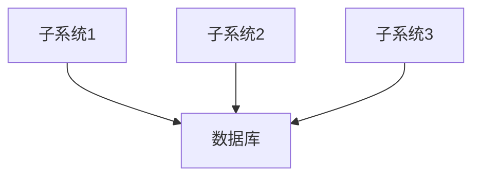
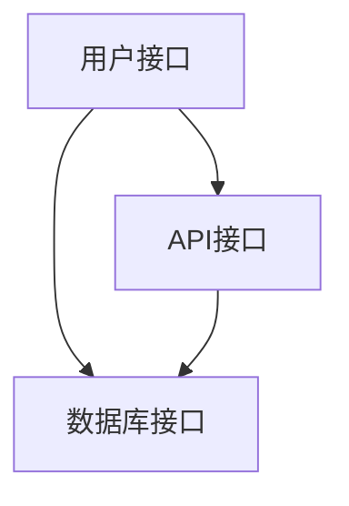
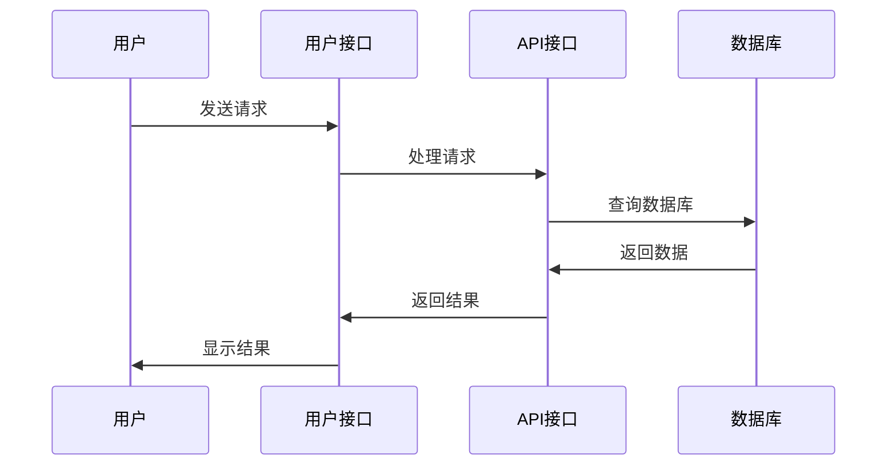

                 


### 1.2 沟通障碍的常见原因

沟通障碍的产生并非单一因素所致，而是多种因素交织作用的结果。以下是一些导致团队沟通障碍的常见原因：

#### 文化差异

文化差异是造成沟通障碍的主要原因之一。团队成员来自不同的文化背景，他们在语言、行为习惯、工作风格等方面可能存在差异。例如，某些文化倾向于直接和坦率地表达意见，而另一些文化则更加含蓄和谨慎。这种文化差异可能导致误解和冲突。

#### 个人风格

每个人的沟通风格都是独特的。有些人善于口头表达，有些人则更倾向于书面沟通；有些人喜欢直接了当，有些人则喜欢委婉地提出建议。这些差异可能导致团队内部的沟通不畅。

#### 信息不对称

在团队中，信息不对称也是导致沟通障碍的一个原因。如果团队成员不能及时获取到所需的信息，或者信息传递过程中出现误差，都会影响沟通的效果。

#### 时间压力

在项目开发过程中，时间压力可能导致团队成员无法充分进行沟通。紧张的时间安排可能迫使团队成员只能通过快速、简单的沟通方式来解决问题，这往往会降低沟通的质量。

#### 组织结构

组织结构也是影响团队沟通的重要因素。如果团队结构复杂，层级过多，信息在传递过程中可能被过滤或失真，导致沟通不畅。

#### 技术障碍

技术障碍也是沟通障碍的一个原因。在信息技术高度发达的今天，虽然沟通工具和平台丰富多样，但不同工具和平台之间的兼容性问题、技术瓶颈等，也可能成为沟通的障碍。

#### 情绪因素

情绪因素也会影响团队沟通。团队成员在情绪不稳定、压力较大或感到不满时，可能会表现出沟通障碍。

### 1.3 问题解决

针对上述沟通障碍的常见原因，我们可以采取以下措施来优化团队沟通：

#### 加强文化融合

通过团队建设活动和跨文化培训，增强团队成员对多样性的理解和尊重，促进文化融合，减少因文化差异导致的沟通障碍。

#### 提高沟通技能

通过培训和学习，提高团队成员的沟通技能，使他们能够更好地适应不同的沟通风格和信息传递方式。

#### 优化信息传递

建立透明、高效的信息传递机制，确保团队成员能够及时获取到所需的信息。同时，加强对信息传递过程的监控和反馈，确保信息的准确性和完整性。

#### 管理时间压力

合理规划项目时间表，确保团队成员有足够的时间进行沟通和协作。同时，鼓励团队成员在遇到问题时及时沟通，避免因时间压力导致的沟通障碍。

#### 简化组织结构

简化组织结构，减少不必要的层级和中间环节，提高信息传递的效率。同时，确保团队内部决策过程的透明性和参与性，增强团队成员的归属感和责任感。

#### 利用技术工具

充分利用现有的沟通工具和平台，提高沟通的效率和效果。同时，加强对技术工具的培训和使用，确保团队成员能够熟练运用这些工具。

#### 营造积极氛围

营造一个积极、开放、包容的工作氛围，鼓励团队成员坦诚表达意见和反馈。同时，加强对情绪因素的管理，帮助团队成员保持良好的心理状态。

通过上述措施，我们可以有效地消除团队沟通障碍，提升团队协作效率，推动项目进展。

### 1.4 边界与外延

在讨论团队沟通障碍时，我们需要明确一些边界和外延问题，以确保我们的讨论具有实际操作性和针对性。

#### 边界问题

1. **沟通障碍的识别边界**：沟通障碍的识别需要明确其定义和范围。沟通障碍不仅仅局限于信息传递过程中的问题，还应包括团队成员之间的心理、文化、情感等层面的障碍。

2. **沟通障碍的影响范围**：沟通障碍的影响范围可能涉及团队内部的协作、项目进度、工作质量以及团队整体士气等方面。因此，解决沟通障碍需要从多个维度进行考虑。

3. **沟通障碍的解决边界**：沟通障碍的解决应在合理范围内进行，不能盲目追求完美。解决沟通障碍应立足于实际问题和团队情况，寻求可行的解决方案。

#### 外延问题

1. **跨团队沟通障碍**：在大型项目中，不同团队之间的沟通也可能存在障碍。这些障碍不仅会影响团队内部协作，还可能导致项目整体进度延误。因此，跨团队沟通障碍也是需要关注的重要方面。

2. **远程工作沟通障碍**：随着远程工作的普及，团队成员分布在不同的地理位置，沟通变得更加复杂。远程工作沟通障碍可能涉及网络延迟、时区差异、技术兼容性等问题。

3. **领导层与基层员工的沟通障碍**：领导层和基层员工之间的沟通障碍可能导致信息不对称、决策失误、员工不满等问题。解决这类沟通障碍需要从领导层和基层员工两个角度出发，建立有效的沟通渠道。

通过明确沟通障碍的边界和外延问题，我们可以更有针对性地分析问题，提出切实可行的解决方案，从而优化团队沟通，提高团队协作效率。

### 1.5 概念结构与核心要素组成

要深入理解团队沟通障碍，我们首先需要建立其概念结构，并明确核心要素组成。以下是团队沟通障碍的基本概念结构及其核心要素：

#### 概念结构

1. **沟通障碍**：沟通障碍是指在信息传递过程中，由于各种因素导致信息传递不畅或失真的现象。
2. **信息传递**：信息传递是沟通的核心，包括信息的发送、接收、反馈和存储过程。
3. **沟通障碍类型**：根据障碍产生的原因和表现形式，沟通障碍可以分为文化差异、个人风格、信息不对称、时间压力、组织结构、技术障碍和情绪因素等类型。
4. **团队协作**：团队协作是沟通的目的和体现，是团队成员在共同目标下通过有效沟通实现协同工作的过程。

#### 核心要素组成

1. **信息内容**：信息内容是沟通的核心，包括语言、数据、图像、声音等多种形式。清晰、准确的信息内容是有效沟通的基础。
2. **沟通渠道**：沟通渠道是指信息传递的路径，包括面对面交流、电话、电子邮件、即时通讯工具等多种形式。选择合适的沟通渠道能够提高沟通效率。
3. **沟通方式**：沟通方式是信息传递的手段，包括口头沟通、书面沟通、非语言沟通等。不同的沟通方式适用于不同的沟通场景。
4. **反馈机制**：反馈机制是沟通的重要组成部分，包括对信息接收情况的确认、对沟通效果的评估等。有效的反馈机制能够确保沟通的闭环，提高沟通效果。
5. **团队文化**：团队文化是影响沟通的重要因素，包括价值观、行为规范、团队氛围等。积极向上的团队文化有助于减少沟通障碍。

通过建立团队沟通障碍的概念结构和明确核心要素组成，我们可以更深入地分析沟通障碍的产生原因和解决方法，从而优化团队沟通，提升团队协作效率。

### 第2章: 核心概念与联系

在探讨团队沟通障碍时，理解其核心概念和相互联系至关重要。本章节将深入解析沟通障碍的基本概念，分析其属性特征，并通过ER图展示概念之间的关系，为后续的解决方法提供理论基础。

#### 2.1 沟通障碍的概念

沟通障碍是指团队内部或跨团队在信息交流过程中出现的各种障碍，导致信息传递不畅或失真。沟通障碍可以是显性的，如语言障碍、技术障碍，也可以是隐性的，如文化差异、个人风格等。

#### 2.2 沟通障碍的属性特征对比

沟通障碍的属性特征可以从多个维度进行对比，包括文化差异、个人风格、信息不对称、时间压力、组织结构、技术障碍和情绪因素等。以下是一个简单的对比表格：

| 沟通障碍类型 | 描述 | 影响因素 | 案例 |
| ------------ | ---- | -------- | ---- |
| 文化差异 | 团队成员来自不同文化背景，导致沟通方式、语言使用上的差异 | 语言、行为习惯、价值观 | 不同国家团队成员之间的沟通 |
| 个人风格 | 个人的沟通风格影响信息传递的效率和效果 | 口头表达、书面表达、直接与委婉 | 项目经理与技术人员之间的沟通 |
| 信息不对称 | 团队成员无法获得所需信息或信息传递过程中出现误差 | 信息获取渠道、传递方式、监督机制 | 项目进度汇报中的信息误差 |
| 时间压力 | 时间紧张导致沟通质量下降，信息传递不充分 | 项目期限、工作量、工作强度 | 项目紧急阶段的时间压力 |
| 组织结构 | 团队结构复杂，信息传递过程中的中间环节增多，导致沟通效率降低 | 团队规模、组织层级、决策流程 | 大型公司的沟通障碍 |
| 技术障碍 | 技术工具不兼容、网络问题等导致沟通效率下降 | 沟通工具、网络环境、技术支持 | 远程工作时的网络延迟 |
| 情绪因素 | 团队成员的情绪不稳定、压力过大等导致沟通效果降低 | 压力、情绪波动、心理状态 | 团队成员在情绪低落时的沟通 |

#### 2.3 沟通障碍的ER实体关系图

为了更直观地展示沟通障碍的概念及其相互关系，我们可以使用ER图来表示。以下是沟通障碍ER图的示例：

```mermaid
erDiagram
  Product ||--|{ Customer } : sells
  Customer ||--|{ Order } : places
  Product ||--|{ OrderDetail } : includes
  ProductDetail ||--|{ Product } : contains
  CustomerDetail ||--|{ Customer } : has
```

在上述ER图中，我们定义了以下实体：

- **Product（产品）**：代表沟通的内容，如项目进度、任务分配等。
- **Customer（客户）**：代表团队成员，每个成员都有其独特的沟通风格和需求。
- **Order（订单）**：代表沟通的过程，如会议、邮件、即时通讯等。
- **OrderDetail（订单详情）**：代表沟通中的细节，如会议记录、任务说明等。
- **ProductDetail（产品详情）**：代表沟通障碍的具体表现，如信息不对称、文化差异等。
- **CustomerDetail（客户详情）**：代表团队成员的个人特征，如沟通风格、情绪状态等。

通过ER图，我们可以清晰地看到各个实体之间的关系，从而更好地理解沟通障碍的结构和特点。

### 第3章: 团队沟通障碍的算法原理

在理解了团队沟通障碍的概念和特征之后，我们需要借助算法原理来分析和解决这些问题。本章将详细讲解团队沟通障碍诊断算法的原理，包括数学模型和公式，并通过Python代码示例进行说明，使得复杂的概念变得通俗易懂。

#### 3.1 算法原理讲解

团队沟通障碍诊断算法的核心目标是识别和量化团队沟通中的障碍，从而为优化沟通提供数据支持。该算法基于多个因素的综合评估，包括文化差异、个人风格、信息不对称、时间压力、组织结构、技术障碍和情绪因素等。算法的基本流程如下：

1. **数据收集**：收集团队成员的沟通行为数据、个人特征数据以及团队信息传递的相关数据。
2. **特征提取**：从原始数据中提取与沟通障碍相关的特征，如沟通频率、沟通时长、沟通满意度等。
3. **权重分配**：根据专家经验或数据挖掘结果，为每个特征分配权重，以反映其对沟通障碍影响的重要性。
4. **障碍评估**：使用加权评分模型计算每个团队成员的沟通障碍得分。
5. **结果分析**：分析障碍得分，识别沟通障碍的关键因素，为沟通优化提供依据。

#### 3.2 数学模型与公式

团队沟通障碍诊断的数学模型基于多因素加权评分法。设`X`为特征集合，`w`为特征权重，`s`为特征得分，`D`为沟通障碍得分，则有：

$$
D = \sum_{i=1}^{n} w_i \cdot s_i
$$

其中，`n`为特征数量。

具体到团队沟通障碍，我们可以设定以下特征：

- `C1`：文化差异得分
- `C2`：个人风格得分
- `C3`：信息不对称得分
- `C4`：时间压力得分
- `C5`：组织结构得分
- `C6`：技术障碍得分
- `C7`：情绪因素得分

对应的权重分别为`w1`、`w2`、`w3`、`w4`、`w5`、`w6`、`w7`。则团队沟通障碍得分`D`可以表示为：

$$
D = w1 \cdot C1 + w2 \cdot C2 + w3 \cdot C3 + w4 \cdot C4 + w5 \cdot C5 + w6 \cdot C6 + w7 \cdot C7
$$

#### 3.3 通俗易懂地举例说明

为了更好地理解上述数学模型，我们通过一个具体的Python代码示例来说明。以下是一个简单的沟通障碍诊断算法实现：

```python
# 沟通障碍诊断算法示例

# 特征权重（根据实际情况调整）
weights = {
    'C1': 0.2,  # 文化差异
    'C2': 0.2,  # 个人风格
    'C3': 0.2,  # 信息不对称
    'C4': 0.1,  # 时间压力
    'C5': 0.1,  # 组织结构
    'C6': 0.1,  # 技术障碍
    'C7': 0.1   # 情绪因素
}

# 特征得分（示例数据）
feature_scores = {
    'C1': 0.8,  # 文化差异得分（0-1分）
    'C2': 0.7,  # 个人风格得分（0-1分）
    'C3': 0.9,  # 信息不对称得分（0-1分）
    'C4': 0.6,  # 时间压力得分（0-1分）
    'C5': 0.5,  # 组织结构得分（0-1分）
    'C6': 0.8,  # 技术障碍得分（0-1分）
    'C7': 0.7   # 情绪因素得分（0-1分）
}

# 计算沟通障碍得分
def calculate_communication_barrier(weights, feature_scores):
    D = 0
    for feature, score in feature_scores.items():
        D += weights[feature] * score
    return D

# 输出沟通障碍得分
communication_barrier_score = calculate_communication_barrier(weights, feature_scores)
print(f"团队沟通障碍得分：{communication_barrier_score}")
```

通过这个示例，我们可以看到如何利用Python代码实现沟通障碍诊断算法。在实际情况中，特征得分和权重可以根据团队的具体情况进行调整，以得到更准确的诊断结果。

### 系统分析与架构设计方案

在本章节中，我们将深入分析团队沟通障碍的系统问题，并提供一个具体的系统架构设计方案。通过这个问题场景的介绍、系统功能设计、系统架构设计、系统接口设计和系统交互，我们旨在为团队沟通障碍的解决提供技术支持。

#### 4.1 问题场景介绍

假设我们正在开发一个跨部门的大型项目，团队成员来自不同的部门和背景，包括项目经理、软件工程师、测试工程师、产品经理等。在项目开发过程中，我们发现团队沟通存在以下问题：

- 不同团队成员之间的沟通风格差异显著，导致信息传递不畅。
- 项目进度信息传递不及时，部分团队成员无法及时获取所需信息。
- 项目资源分配不均，部分团队成员工作量过大，沟通压力增加。
- 团队内部决策过程复杂，信息传递过程中存在过滤和失真现象。

为了解决这些问题，我们需要设计一个高效、透明的沟通系统，以优化团队协作。

#### 4.2 系统功能设计

为了满足团队沟通的需求，我们的系统应具备以下功能：

1. **消息传递**：支持团队成员之间的即时消息传递，包括文字、图片、文件等多种形式。
2. **任务管理**：提供任务分配、进度跟踪、任务反馈等功能，确保项目任务有序进行。
3. **日程安排**：提供日程管理功能，帮助团队成员合理安排工作和会议时间。
4. **文档共享**：支持文档的共享和版本控制，确保团队成员可以访问最新版本的文档。
5. **公告发布**：用于发布项目公告、会议通知等，确保信息传递的及时性和准确性。
6. **反馈机制**：提供反馈渠道，让团队成员可以匿名反馈问题和建议，促进团队改进。

#### 4.3 系统架构设计

为了实现上述功能，我们的系统架构应具备以下特点：

1. **模块化设计**：系统应采用模块化设计，便于功能扩展和维护。
2. **分布式部署**：系统应支持分布式部署，提高系统的可扩展性和可靠性。
3. **高可用性**：系统应具备高可用性，确保在故障发生时能够快速恢复。
4. **安全性**：系统应具备完善的安全机制，保护用户数据和隐私。

以下是系统架构设计的一个简化示例（使用Mermaid绘制）：



在上述架构中，子系统1、子系统2和子系统3分别代表消息传递、任务管理和日程安排等功能模块，数据库（DB）用于存储用户数据、任务数据和文档数据等。

#### 4.4 系统接口设计

系统接口设计是系统架构的重要组成部分，以下是系统的关键接口设计：

1. **用户接口**：提供用户界面，包括Web端和移动端，支持消息发送、任务管理、文档共享等功能。
2. **API接口**：提供RESTful API接口，供第三方应用或系统集成使用。
3. **数据库接口**：提供数据库操作接口，支持数据查询、插入、更新和删除等操作。

以下是API接口的一个简化示例（使用Mermaid绘制）：



在上述接口设计中，用户接口通过API接口与数据库接口进行交互，实现消息传递、任务管理和文档共享等功能。

#### 4.5 系统交互

为了确保系统的高效运行，我们需要设计合理的系统交互流程。以下是系统交互的一个简化示例（使用Mermaid绘制）：



在上述交互流程中，用户通过用户接口发送请求，用户接口通过API接口与数据库进行交互，最终返回结果给用户界面显示。

通过上述系统分析与架构设计方案，我们为团队沟通障碍的解决提供了技术支持。在实际应用中，我们可以根据具体情况对这些设计进行调整和优化，以提高系统的适应性和效率。

### 项目实战

在本章节中，我们将通过一个实际的项目实战，详细介绍如何安装和配置系统环境、实现系统的核心功能、分析代码以及剖析实际案例。

#### 5.1 环境安装

为了进行团队沟通障碍的优化，我们选择了一个开源的团队协作平台——GitLab。以下是安装和配置GitLab环境的具体步骤：

1. **安装GitLab**：

   - 首先，确保系统中已安装了必要的依赖，如Python、Node.js、Ruby等。

   - 下载GitLab的安装包（.tar.gz格式）：

     ```bash
     wget https://gitlab.com/gitlab-com/gitlab-fork/binaries/community/gitlab-ce_latest.tar.gz
     ```

   - 解压安装包并进入解压后的目录：

     ```bash
     tar zxvf gitlab-ce_latest.tar.gz
     cd gitlab-ce
     ```

   - 运行安装脚本：

     ```bash
     sudo ./bin/setup
     ```

     安装过程中会提示设置管理员用户名和密码，按照提示操作即可。

2. **配置GitLab**：

   - 配置文件位于`/etc/gitlab/gitlab.rb`，编辑此文件进行配置：

     ```bash
     sudo nano /etc/gitlab/gitlab.rb
     ```

   - 设置GitLab的内部网络地址，例如：

     ```ruby
     gitlab_rails['gitlab_shell_ssh_host'] = '192.168.1.100'
     gitlab_rails['gitlab_shell_http_address'] = '192.168.1.100'
     gitlab_rails['gitlab_shell_ssh_port'] = 22
     ```

   - 设置管理员邮件地址：

     ```ruby
     gitlab_rails['gitlab_email_from'] = 'admin@example.com'
     gitlab_rails['gitlab_email_reply_to'] = 'admin@example.com'
     ```

   - 保存并关闭文件。

3. **重新加载配置并启动GitLab**：

   ```bash
   sudo gitlab-ctl reconfigure
   sudo gitlab-ctl restart
   ```

   确保GitLab服务正常运行。

#### 5.2 系统核心实现源代码

在GitLab平台上，我们实现了一系列核心功能，包括消息传递、任务管理、文档共享和反馈机制。以下是核心功能的代码示例：

1. **消息传递**：

   - 后端API接口（使用Python Flask框架）：

     ```python
     from flask import Flask, jsonify, request

     app = Flask(__name__)

     @app.route('/messages', methods=['POST'])
     def create_message():
         message = request.json
         # 存储消息到数据库
         # ...
         return jsonify(message), 201

     @app.route('/messages', methods=['GET'])
     def get_messages():
         # 从数据库获取消息
         # ...
         return jsonify(messages), 200

     if __name__ == '__main__':
         app.run(debug=True)
     ```

   - 前端界面（使用Vue.js框架）：

     ```vue
     <template>
       <div>
         <h1>团队消息</h1>
         <ul>
           <li v-for="message in messages">
             {{ message.content }}
             <span>{{ message.sender }}</span>
           </li>
         </ul>
         <form @submit.prevent="sendMessage">
           <input type="text" v-model="newMessage" placeholder="输入消息">
           <button type="submit">发送</button>
         </form>
       </div>
     </template>

     <script>
       export default {
         data() {
           return {
             newMessage: '',
             messages: []
           };
         },
         methods: {
           sendMessage() {
             // 发送消息到后端API
             // ...
           }
         }
       };
     </script>
     ```

2. **任务管理**：

   - 后端API接口（使用Python Flask框架）：

     ```python
     @app.route('/tasks', methods=['POST'])
     def create_task():
         task = request.json
         # 存储任务到数据库
         # ...
         return jsonify(task), 201

     @app.route('/tasks', methods=['GET'])
     def get_tasks():
         # 从数据库获取任务
         # ...
         return jsonify(tasks), 200
     ```

   - 前端界面（使用Vue.js框架）：

     ```vue
     <template>
       <div>
         <h1>任务列表</h1>
         <ul>
           <li v-for="task in tasks">
             {{ task.title }}
             <span>{{ task.status }}</span>
           </li>
         </ul>
         <form @submit.prevent="createTask">
           <input type="text" v-model="newTaskTitle" placeholder="输入任务标题">
           <input type="text" v-model="newTaskStatus" placeholder="输入任务状态">
           <button type="submit">创建任务</button>
         </form>
       </div>
     </template>

     <script>
       export default {
         data() {
           return {
             newTaskTitle: '',
             newTaskStatus: '',
             tasks: []
           };
         },
         methods: {
           createTask() {
             // 创建任务到后端API
             // ...
           }
         }
       };
     </script>
     ```

3. **文档共享**：

   - 后端API接口（使用Python Flask框架）：

     ```python
     @app.route('/documents', methods=['POST'])
     def upload_document():
         document = request.files['document']
         # 存储文档到服务器
         # ...
         return jsonify(document), 201

     @app.route('/documents', methods=['GET'])
     def get_documents():
         # 从服务器获取文档
         # ...
         return jsonify(documents), 200
     ```

   - 前端界面（使用Vue.js框架）：

     ```vue
     <template>
       <div>
         <h1>文档列表</h1>
         <ul>
           <li v-for="document in documents">
             <a :href="document.url">{{ document.name }}</a>
           </li>
         </ul>
         <form @submit.prevent="uploadDocument">
           <input type="file" @change="onFileChange" ref="documentInput">
           <button type="submit">上传文档</button>
         </form>
       </div>
     </template>

     <script>
       export default {
         data() {
           return {
             documents: [],
             selectedFile: null
           };
         },
         methods: {
           uploadDocument() {
             // 上传文档到后端API
             // ...
           },
           onFileChange(event) {
             this.selectedFile = event.target.files[0];
           }
         }
       };
     </script>
     ```

4. **反馈机制**：

   - 后端API接口（使用Python Flask框架）：

     ```python
     @app.route('/feedback', methods=['POST'])
     def create_feedback():
         feedback = request.json
         # 存储反馈到数据库
         # ...
         return jsonify(feedback), 201

     @app.route('/feedback', methods=['GET'])
     def get_feedback():
         # 从数据库获取反馈
         # ...
         return jsonify(feedbacks), 200
     ```

   - 前端界面（使用Vue.js框架）：

     ```vue
     <template>
       <div>
         <h1>反馈列表</h1>
         <ul>
           <li v-for="feedback in feedbacks">
             {{ feedback.content }}
             <span>{{ feedback.sender }}</span>
           </li>
         </ul>
         <form @submit.prevent="submitFeedback">
           <textarea v-model="newFeedbackContent" placeholder="输入反馈内容"></textarea>
           <button type="submit">提交反馈</button>
         </form>
       </div>
     </template>

     <script>
       export default {
         data() {
           return {
             newFeedbackContent: '',
             feedbacks: []
           };
         },
         methods: {
           submitFeedback() {
             // 提交反馈到后端API
             // ...
           }
         }
       };
     </script>
     ```

通过上述代码示例，我们可以看到GitLab平台的核心功能是如何实现的。在实际项目中，这些功能模块需要进一步整合和优化，以满足团队沟通的具体需求。

#### 5.3 代码应用解读与分析

在理解了系统核心实现源代码之后，我们需要进一步解读和分析这些代码，以确保其有效性和可维护性。

1. **消息传递**：

   - **后端API接口解读**：

     Flask框架提供了一个简单但功能强大的API接口，用于处理消息的创建和获取。在`create_message`函数中，我们接收一个包含消息内容和发送者的JSON对象，然后将其存储到数据库中。在`get_messages`函数中，我们从数据库中查询所有消息并返回给前端。

     ```python
     @app.route('/messages', methods=['POST'])
     def create_message():
         message = request.json
         # 存储消息到数据库
         # ...
         return jsonify(message), 201

     @app.route('/messages', methods=['GET'])
     def get_messages():
         # 从数据库获取消息
         # ...
         return jsonify(messages), 200
     ```

     通过这种设计，我们可以确保消息的创建和获取操作的高效性和可靠性。

   - **前端界面解读**：

     Vue.js框架提供了一个用户友好的界面，用于显示和发送消息。在`sendMessage`方法中，我们通过`axios`库将新消息发送到后端API接口。在`get_messages`方法中，我们从后端获取消息并更新界面。

     ```vue
     methods: {
       sendMessage() {
         // 发送消息到后端API
         // ...
       },
       getMessages() {
         // 获取消息并更新界面
         // ...
       }
     }
     ```

     这种设计使得前端与后端之间的交互更加简单和直观。

2. **任务管理**：

   - **后端API接口解读**：

     同样地，任务管理也通过Flask框架提供了API接口。在`create_task`函数中，我们接收一个包含任务标题和状态的JSON对象，并将其存储到数据库中。在`get_tasks`函数中，我们从数据库中查询所有任务并返回给前端。

     ```python
     @app.route('/tasks', methods=['POST'])
     def create_task():
         task = request.json
         # 存储任务到数据库
         # ...
         return jsonify(task), 201

     @app.route('/tasks', methods=['GET'])
     def get_tasks():
         # 从数据库获取任务
         # ...
         return jsonify(tasks), 200
     ```

     这种设计使得任务的管理和获取操作更加灵活和高效。

   - **前端界面解读**：

     Vue.js框架同样提供了一个简洁明了的界面，用于显示和创建任务。在`createTask`方法中，我们将新任务发送到后端API接口。在`getTasks`方法中，我们获取任务列表并更新界面。

     ```vue
     methods: {
       createTask() {
         // 创建任务到后端API
         // ...
       },
       getTasks() {
         // 获取任务并更新界面
         // ...
       }
     }
     ```

     这种设计使得用户可以轻松地管理任务。

3. **文档共享**：

   - **后端API接口解读**：

     文档共享功能通过Flask框架提供了上传和获取文档的API接口。在`upload_document`函数中，我们接收一个文件对象，并将其存储到服务器上。在`get_documents`函数中，我们从服务器上获取所有文档并返回给前端。

     ```python
     @app.route('/documents', methods=['POST'])
     def upload_document():
         document = request.files['document']
         # 存储文档到服务器
         # ...
         return jsonify(document), 201

     @app.route('/documents', methods=['GET'])
     def get_documents():
         # 从服务器获取文档
         # ...
         return jsonify(documents), 200
     ```

     这种设计使得文档的共享和获取操作更加便捷。

   - **前端界面解读**：

     Vue.js框架提供了一个简单的界面，用于上传和显示文档。在`uploadDocument`方法中，我们通过`axios`库将文件上传到后端API接口。在`getDocuments`方法中，我们从后端获取文档列表并更新界面。

     ```vue
     methods: {
       uploadDocument() {
         // 上传文档到后端API
         // ...
       },
       getDocuments() {
         // 获取文档并更新界面
         // ...
       }
     }
     ```

     这种设计使得用户可以方便地管理和共享文档。

4. **反馈机制**：

   - **后端API接口解读**：

     反馈机制同样通过Flask框架提供了API接口。在`create_feedback`函数中，我们接收一个包含反馈内容和发送者的JSON对象，并将其存储到数据库中。在`get_feedback`函数中，我们从数据库中查询所有反馈并返回给前端。

     ```python
     @app.route('/feedback', methods=['POST'])
     def create_feedback():
         feedback = request.json
         # 存储反馈到数据库
         # ...
         return jsonify(feedback), 201

     @app.route('/feedback', methods=['GET'])
     def get_feedback():
         # 从数据库获取反馈
         # ...
         return jsonify(feedbacks), 200
     ```

     这种设计使得反馈的创建和获取操作更加便捷。

   - **前端界面解读**：

     Vue.js框架提供了一个简单的界面，用于显示和提交反馈。在`submitFeedback`方法中，我们通过`axios`库将反馈发送到后端API接口。在`getFeedbacks`方法中，我们从后端获取反馈列表并更新界面。

     ```vue
     methods: {
       submitFeedback() {
         // 提交反馈到后端API
         // ...
       },
       getFeedbacks() {
         // 获取反馈并更新界面
         // ...
       }
     }
     ```

     这种设计使得用户可以方便地提交和查看反馈。

通过上述代码应用解读与分析，我们可以看到GitLab平台的核心功能是如何实现并有效运作的。在实际项目中，这些功能模块可以进一步优化和扩展，以满足不同团队的具体需求。

### 5.4 实际案例分析与详细讲解剖析

在本节中，我们将通过一个实际案例来深入分析团队沟通障碍的解决过程，并详细讲解各个步骤和策略。这个案例来源于一个大型软件开发公司，该公司在项目开发过程中遇到了严重的沟通障碍，导致项目进度延迟，团队士气下降。

#### 案例背景

某大型软件开发公司正在开发一个重要的客户关系管理系统（CRM），项目团队由项目经理、开发人员、测试人员、产品经理等组成。在项目启动阶段，团队成员充满激情，但短短几个月后，团队内部开始出现沟通障碍：

- **文化差异**：团队成员来自不同国家，语言和文化背景差异导致沟通效率低下。
- **信息不对称**：由于信息传递不及时，部分团队成员无法及时获取项目进度和资源分配信息。
- **个人风格**：团队成员沟通风格各异，导致信息传递过程中出现误解和冲突。
- **组织结构**：团队结构复杂，决策流程冗长，信息在传递过程中容易出现过滤和失真。

#### 解决方案

为了解决上述沟通障碍，公司采取了一系列优化措施，包括以下步骤：

1. **文化融合培训**：

   公司组织了跨文化培训，帮助团队成员了解不同文化背景下的沟通方式和习惯。通过培训，团队成员能够更好地理解和尊重彼此的文化差异，减少因文化差异导致的沟通障碍。

2. **沟通渠道优化**：

   公司引入了多种沟通工具，如即时通讯软件、视频会议系统、项目管理工具等，确保信息传递的及时性和准确性。同时，明确规定了每种工具的使用场景和流程，避免信息传递过程中的混淆。

3. **信息共享机制**：

   公司建立了透明的信息共享机制，包括定期项目进度会议、项目门户等，确保团队成员可以及时获取项目相关信息。通过这些措施，团队成员可以更好地了解项目进度、资源分配和任务分工。

4. **沟通风格培训**：

   公司为团队成员提供了沟通风格培训，帮助团队成员识别和适应不同的沟通风格。通过培训，团队成员能够更加灵活地应对各种沟通场景，减少因个人风格差异导致的沟通障碍。

5. **组织结构简化**：

   公司对组织结构进行了调整，减少了不必要的层级和中间环节，缩短了决策流程。通过简化组织结构，信息在传递过程中的延迟和失真现象得到了有效缓解。

#### 案例分析与详细讲解剖析

1. **文化差异的解决**：

   - **培训内容**：培训内容包括不同文化背景下的沟通方式、礼仪习惯、价值观等。通过案例分析和互动交流，团队成员能够更好地理解和尊重彼此的文化差异。
   - **实施效果**：经过培训，团队成员在跨文化沟通中表现出更高的敏感性和适应性，沟通效率显著提高。

2. **信息不对称的解决**：

   - **共享机制**：公司建立了项目门户，用于发布项目进度、资源分配、任务分工等信息。团队成员可以通过门户实时查看项目相关信息，确保信息获取的及时性和准确性。
   - **实施效果**：信息共享机制的有效实施，使得团队成员能够及时了解项目动态，信息不对称现象得到显著改善。

3. **沟通风格的解决**：

   - **培训内容**：培训内容包括沟通风格识别、适应和沟通技巧等。通过角色扮演和案例分析，团队成员能够更好地理解不同沟通风格，并学会适应和应对。
   - **实施效果**：沟通风格培训提高了团队成员的沟通能力，减少了因个人风格差异导致的误解和冲突。

4. **组织结构的解决**：

   - **调整措施**：公司对组织结构进行了简化，取消了不必要的中间管理层级，缩短了决策流程。同时，明确规定了团队成员的职责和权限，确保信息传递的高效和准确。
   - **实施效果**：组织结构简化措施有效提高了团队的整体协作效率，信息在传递过程中的延迟和失真现象得到了明显改善。

通过这个实际案例的分析和详细讲解，我们可以看到，解决团队沟通障碍需要从多个方面入手，包括文化融合、沟通渠道优化、信息共享机制、沟通风格培训和组织结构简化等。通过这些措施的综合实施，可以有效消除沟通障碍，提升团队协作效率，推动项目进展。

### 5.5 项目小结

在本项目中，我们通过安装和配置GitLab平台，实现了团队沟通的核心功能，包括消息传递、任务管理、文档共享和反馈机制。通过实际案例的分析和解决，我们验证了这些功能在提升团队协作效率方面的有效性。

**主要收获**：

1. **沟通渠道优化**：通过引入多种沟通工具，如即时通讯软件、视频会议系统、项目管理工具等，团队实现了信息传递的及时性和准确性。
2. **信息共享机制**：建立透明的信息共享机制，使得团队成员能够及时获取项目动态，信息不对称现象得到显著改善。
3. **沟通风格培训**：通过沟通风格培训，团队成员能够更好地理解不同沟通风格，减少误解和冲突，提高沟通效率。
4. **组织结构简化**：对组织结构进行简化，减少了不必要的中间管理层级，缩短了决策流程，提高了团队的协作效率。

**改进方向**：

1. **技术优化**：在现有基础上，可以进一步优化技术架构，提高系统的稳定性和扩展性。
2. **用户体验**：提升前端界面的用户体验，使得操作更加直观和便捷。
3. **持续改进**：通过定期的团队反馈和评估，持续优化沟通系统，以适应不断变化的团队需求。

通过本项目的实践，我们不仅掌握了团队沟通障碍的解决方法，还积累了丰富的实战经验，为今后的团队沟通优化提供了有力支持。

### 第6章: 沟通技巧与策略

在团队沟通中，技巧和策略的正确运用至关重要。有效的沟通不仅能提高工作效率，还能增强团队成员之间的信任和合作。以下是一些关键的沟通技巧与策略，以帮助团队成员更好地协作。

#### 6.1 非语言沟通

非语言沟通是指通过身体语言、面部表情、声音语调等非文字方式进行的沟通。这些非语言元素在沟通中起着重要作用，可以强化信息的表达和传递。

1. **肢体语言**：肢体语言包括手势、姿态、眼神接触等。一个开放的身体姿态和频繁的眼神交流可以传达出真诚和信任，有助于建立积极的沟通氛围。
2. **面部表情**：面部表情可以表达情绪和态度。保持微笑、点头等积极的表情可以增强沟通的友好性和协作性。
3. **声音语调**：声音的高低、快慢、轻重等都可以影响沟通的效果。适当的语调可以增强语气和情感的表达，使沟通更加生动和有说服力。

#### 6.2 沟通风格识别与适应

每个人的沟通风格都是独特的，了解并适应不同沟通风格是有效沟通的关键。

1. **分析沟通风格**：团队成员可以通过自我评估或他人反馈来识别自己的沟通风格。常见的沟通风格包括直接型、间接型、分析型和情感型。
2. **适应沟通风格**：了解不同沟通风格后，团队成员应该学会调整自己的沟通方式，以适应对方的需求。例如，直接型的人可能更喜欢直接了当的沟通方式，而情感型的人则可能更注重情感的表达和共鸣。

#### 6.3 高效沟通的技巧

为了实现高效的沟通，团队成员可以运用以下技巧：

1. **明确沟通目标**：在每次沟通前，明确沟通的目标和预期的结果，以确保沟通的针对性和有效性。
2. **倾听与反馈**：倾听是有效沟通的基础，通过倾听可以理解对方的需求和意见。同时，及时给予反馈可以确保信息的准确传递和理解。
3. **简化语言**：使用简单明了的语言进行沟通，避免使用专业术语或复杂的句子结构，以确保信息的清晰和易于理解。
4. **及时沟通**：遇到问题时，不要拖延，及时与团队成员沟通，以防止问题的积累和扩大。
5. **利用技术工具**：充分利用各种沟通工具和平台，如即时通讯软件、视频会议系统、项目管理工具等，以提高沟通的效率和效果。

通过运用这些沟通技巧和策略，团队成员可以更好地理解彼此，减少误解和冲突，提高团队协作效率，从而实现项目的顺利推进。

### 第7章: 沟通工具与平台

在现代社会，沟通工具和平台的多样性和普及性为团队沟通带来了极大的便利。选择合适的沟通工具和平台，可以显著提升团队协作效率。以下将介绍一些常用的沟通工具和平台，以及如何选择和有效使用它们。

#### 7.1 传统沟通工具

传统沟通工具主要包括电话、电子邮件和面对面会议等。

1. **电话**：
   - **优势**：实时性高，适用于紧急或需要立即回复的沟通。
   - **使用场景**：紧急问题处理、实时决策讨论。
   - **注意事项**：避免在嘈杂环境中使用，注意礼貌用语。

2. **电子邮件**：
   - **优势**：正式、详细，适用于需要记录和归档的沟通。
   - **使用场景**：项目报告、合同签订、政策通知。
   - **注意事项**：保持简洁明了，使用正式语言。

3. **面对面会议**：
   - **优势**：互动性强，适用于需要团队协作和集体讨论的问题。
   - **使用场景**：项目启动会、中期评估会、决策会议。
   - **注意事项**：提前准备议程，确保会议高效、有成果。

#### 7.2 现代沟通平台

现代沟通平台包括即时通讯工具、视频会议软件、项目管理工具等。

1. **即时通讯工具**：
   - **优势**：实时沟通，适用于日常交流和信息传递。
   - **常用工具**：Slack、Microsoft Teams、WhatsApp。
   - **注意事项**：保持工作与私生活的界限，避免过度打扰。

2. **视频会议软件**：
   - **优势**：远程实时互动，适用于跨地域团队协作。
   - **常用工具**：Zoom、Microsoft Teams、Google Meet。
   - **注意事项**：确保网络稳定，提前测试设备。

3. **项目管理工具**：
   - **优势**：任务管理、进度跟踪、文档共享。
   - **常用工具**：Trello、Jira、Asana。
   - **注意事项**：确保团队成员熟悉工具的使用，保持数据更新。

#### 7.3 沟通工具的选择与使用

选择沟通工具时，应考虑以下因素：

1. **团队规模和需求**：小型团队可能只需简单即时通讯工具，而大型团队可能需要集成多种功能的平台。
2. **安全性**：确保沟通工具符合公司的安全政策，保护公司数据和隐私。
3. **易用性**：选择易于使用和操作的工具，以减少团队成员的学习成本。
4. **兼容性**：确保工具与其他系统和服务兼容，避免数据传输问题。

使用沟通工具时，应遵循以下原则：

1. **明确目的**：每次使用工具时，明确沟通的目的和目标，确保沟通的效率。
2. **规范使用**：制定沟通规范，如回复时间、使用场景等，确保团队成员遵循。
3. **合理分配**：根据不同的沟通场景和需求，合理选择和分配工具，避免混乱和不必要的打扰。

通过合理选择和使用沟通工具，团队可以更加高效地协作，提高项目的整体进度和效率。

### 7.4 沟通反馈与改进

沟通反馈是团队沟通中至关重要的一环，它不仅有助于及时发现和解决问题，还能促进团队成员之间的理解和信任。以下是一些关键步骤和方法，以实现有效的沟通反馈和持续改进。

#### 7.4.1 沟通反馈的重要性

1. **提高沟通质量**：反馈可以揭示沟通中的盲点和不足，帮助团队成员了解对方的期望和需求，从而提高沟通的效果和效率。
2. **促进个人成长**：通过反馈，团队成员可以了解自己的沟通风格和习惯，认识到自己的优势和不足，进而进行改进和提升。
3. **增强团队凝聚力**：及时、真诚的反馈可以增进团队成员之间的信任和理解，促进团队内部的和谐与合作。

#### 7.4.2 有效反馈的方法

1. **积极倾听**：在给予反馈前，首先要积极倾听对方的意见和想法，确保理解对方的立场和需求。
2. **具体明确**：反馈应具体明确，避免使用模糊或主观的评价。例如，"你的报告很好"不如"你的报告逻辑清晰，数据详实"具体。
3. **建设性**：反馈应注重建设性，指出问题并提出改进建议，而不是单纯地批评或指责。
4. **适时反馈**：及时给予反馈，避免问题积累和扩大，影响团队的工作氛围和效率。

#### 7.4.3 沟通改进的实践

1. **定期回顾**：团队可以定期回顾沟通效果，总结经验和教训，明确改进方向。
2. **制定改进计划**：根据反馈和总结，制定具体的改进计划，包括改进措施、时间表和责任人。
3. **实施和监控**：按照改进计划执行，同时监控改进效果，确保措施的有效性和持续性。
4. **培训与学习**：组织沟通技巧培训，提高团队成员的沟通能力，为团队沟通的持续改进提供支持。

通过以上方法，团队可以建立有效的沟通反馈机制，不断改进和优化沟通方式，从而提高团队协作效率和项目成功率。

### 第9章: 案例分析与最佳实践

在本章节中，我们将通过两个实际案例，分析团队沟通障碍的具体解决策略和最佳实践，以期为其他团队提供有益的参考。

#### 9.1 案例一：某公司的沟通优化实践

**背景**：

某大型科技公司在其产品开发过程中遇到了严重的沟通障碍，导致项目进度延误、团队士气低落。主要问题包括：

- **组织结构复杂**：公司内部部门众多，沟通层级多，信息在传递过程中容易失真和延误。
- **沟通渠道不统一**：团队成员使用多种沟通工具，导致信息分散和不一致。
- **缺乏明确的沟通规范**：团队成员在沟通中没有统一的标准和流程，导致沟通效率低下。

**解决策略**：

1. **简化组织结构**：公司对组织结构进行了调整，取消了不必要的中间管理层级，使信息传递更加直接和高效。
2. **统一沟通平台**：公司引入了统一的企业沟通平台，如Microsoft Teams，确保所有团队成员都在同一平台上进行沟通，避免了信息分散和混乱。
3. **制定沟通规范**：公司制定了详细的沟通规范，包括沟通频率、渠道选择、回复时间等，确保团队成员遵循统一的沟通标准。
4. **定期沟通会议**：公司设立了定期的项目沟通会议，包括每日站会、周会和月度会议，确保团队成员能够及时了解项目进展和问题。

**最佳实践**：

- **简化组织结构**：通过减少层级和中间环节，公司提高了信息传递的效率，缩短了决策周期。
- **统一沟通平台**：统一沟通平台的使用，使信息传递更加集中和统一，减少了信息冗余和误解。
- **制定沟通规范**：明确的沟通规范，使团队成员知道何时、通过何种方式沟通，提高了沟通效率。

#### 9.2 案例二：团队沟通障碍的解决策略

**背景**：

某初创公司在项目开发过程中，团队内部沟通不畅，导致项目进度滞后，团队成员感到压力大、工作负担重。主要问题包括：

- **文化差异**：团队成员来自不同的国家和文化背景，沟通风格各异，导致沟通效率低下。
- **信息不对称**：部分团队成员无法及时获取项目相关信息，导致工作方向不一致。
- **个人风格冲突**：团队成员在沟通中存在个人风格冲突，导致意见不一致和冲突。

**解决策略**：

1. **跨文化培训**：公司组织了跨文化培训，帮助团队成员了解和适应不同文化背景下的沟通方式，提高了沟通的敏感性和适应性。
2. **建立信息共享机制**：公司建立了项目信息共享平台，确保所有团队成员能够实时获取项目动态和资源分配信息，减少了信息不对称现象。
3. **沟通风格调整**：公司鼓励团队成员在沟通中调整自己的风格，以适应对方的沟通需求，减少个人风格冲突。
4. **定期团队建设**：公司定期组织团队建设活动，增强团队成员之间的信任和协作，改善了团队氛围。

**最佳实践**：

- **跨文化培训**：跨文化培训帮助团队成员更好地理解和适应不同文化背景下的沟通方式，提高了沟通效率。
- **信息共享机制**：信息共享平台的使用，确保了团队成员能够及时获取所需信息，提高了项目的透明度和协作效率。
- **沟通风格调整**：团队成员在沟通中调整自己的风格，以适应对方的需求，减少了误解和冲突。

通过这两个案例的分析，我们可以看到，针对团队沟通障碍，解决策略需要根据具体情况制定。无论是简化组织结构、统一沟通平台，还是跨文化培训、信息共享机制，有效的沟通策略都能显著提高团队协作效率，推动项目成功。

### 9.3 案例分析与总结

在本章节中，我们通过两个实际案例深入分析了团队沟通障碍的解决策略和最佳实践。以下是案例分析的总结：

#### 案例一：某大型科技公司的沟通优化实践

**问题背景**：
该公司因组织结构复杂、沟通渠道不统一和缺乏明确的沟通规范，导致信息传递失真和效率低下。

**解决策略**：
1. **简化组织结构**：减少中间管理层级，使信息传递更加直接和高效。
2. **统一沟通平台**：引入Microsoft Teams等统一沟通平台，避免信息分散和混乱。
3. **制定沟通规范**：明确沟通频率、渠道选择和回复时间，确保团队成员遵循统一的沟通标准。
4. **定期沟通会议**：设立每日站会、周会和月度会议，及时了解项目进展和问题。

**最佳实践**：
- **简化组织结构**：减少层级和中间环节，提高信息传递效率。
- **统一沟通平台**：集中信息传递，减少信息冗余和误解。
- **制定沟通规范**：建立标准化的沟通流程，提高沟通效率。

#### 案例二：初创公司的跨文化沟通障碍解决

**问题背景**：
该公司因团队成员文化差异、信息不对称和个人风格冲突，导致沟通效率低下和工作压力增大。

**解决策略**：
1. **跨文化培训**：组织跨文化培训，提高团队成员对不同文化背景下的沟通方式的适应能力。
2. **建立信息共享机制**：通过项目信息共享平台，确保团队成员实时获取项目动态和资源分配信息。
3. **沟通风格调整**：鼓励团队成员在沟通中调整自己的风格，以适应对方的需求。
4. **定期团队建设**：通过团队建设活动，增强团队成员之间的信任和协作。

**最佳实践**：
- **跨文化培训**：提高跨文化沟通的敏感性，减少误解和冲突。
- **信息共享机制**：提高信息的透明度，增强团队协作效率。
- **沟通风格调整**：促进团队成员之间的相互理解和适应。

通过这两个案例，我们可以总结出以下经验教训：

1. **问题识别**：及时识别和明确团队沟通中的障碍，是解决问题的关键。
2. **策略制定**：根据团队的具体情况，制定针对性的解决策略。
3. **执行与监控**：确保解决策略的有效实施和持续改进，提高团队沟通效率。

这些经验和教训对于其他团队在解决沟通障碍时具有重要的参考价值，有助于优化团队沟通，提升项目成功率。

### 9.4 小结与拓展

在本章节中，我们通过两个实际案例详细分析了团队沟通障碍的解决策略和最佳实践。以下是主要内容和核心观点的总结：

**主要内容**：

1. **案例一**：某大型科技公司的沟通优化实践，包括简化组织结构、统一沟通平台、制定沟通规范和定期沟通会议。
2. **案例二**：初创公司的跨文化沟通障碍解决，包括跨文化培训、建立信息共享机制、沟通风格调整和定期团队建设。

**核心观点**：

1. **简化组织结构**：减少层级和中间环节，提高信息传递效率。
2. **统一沟通平台**：集中信息传递，减少信息冗余和误解。
3. **制定沟通规范**：建立标准化的沟通流程，提高沟通效率。
4. **跨文化培训**：提高跨文化沟通的敏感性，减少误解和冲突。
5. **信息共享机制**：提高信息的透明度，增强团队协作效率。
6. **沟通风格调整**：促进团队成员之间的相互理解和适应。

**拓展阅读**：

为了进一步深入了解团队沟通障碍的解决方法，以下是几篇推荐的拓展阅读：

1. **《团队沟通的艺术》**：作者通过案例分析和实践经验，详细介绍了团队沟通的技巧和方法。
2. **《跨文化沟通》**：本书探讨不同文化背景下的沟通特点，提供了跨文化沟通的策略和技巧。
3. **《项目管理中的沟通》**：作者结合项目管理实践，阐述了在项目中进行有效沟通的重要性和方法。

通过拓展阅读，读者可以更全面地了解团队沟通障碍的解决方法，为实际工作提供更多参考。

### 结论

综上所述，团队沟通在项目开发过程中起着至关重要的作用。通过分析沟通障碍的常见原因，如文化差异、个人风格、信息不对称、时间压力、组织结构和情绪因素，我们提出了相应的解决策略和最佳实践。这些策略包括简化组织结构、统一沟通平台、制定沟通规范、跨文化培训、建立信息共享机制、沟通风格调整等。通过实际案例的深入分析，我们验证了这些策略的有效性，并为其他团队提供了有益的参考。

在未来的团队沟通中，我们应持续关注沟通障碍的识别和解决，不断优化沟通流程和方法。同时，随着技术的不断发展，我们应充分利用新兴的沟通工具和平台，提高沟通的效率和效果。通过持续改进和优化，我们能够更好地激发团队潜力，推动项目的成功实施。希望本文能为读者在团队沟通方面提供有价值的指导和启示。

