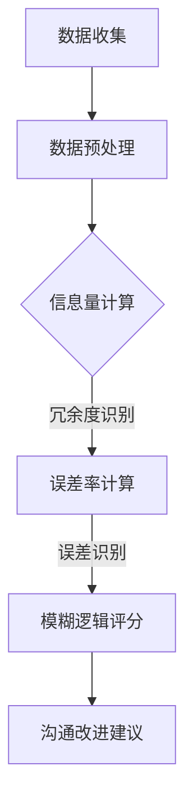
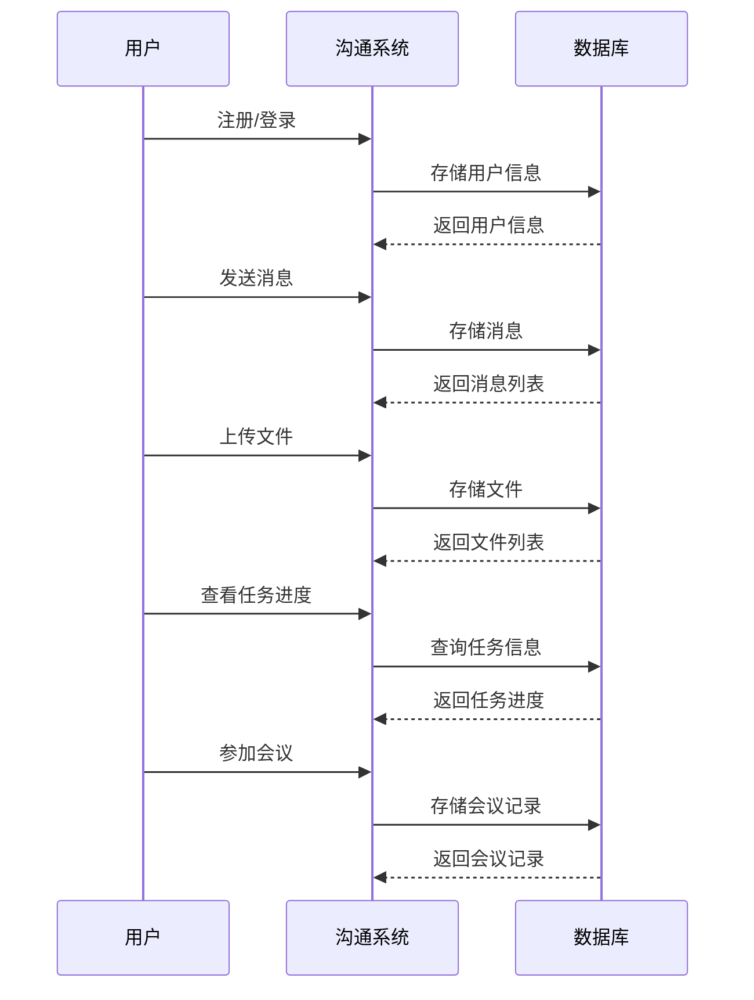

                 

## 引言

在现代企业中，团队沟通是保证项目顺利进行、提升工作效率的重要手段。然而，随着团队规模的扩大和复杂度的增加，沟通中的信息丢失、误解和低效现象愈发普遍。为了解决这些问题，提升团队沟通技巧成为了一个亟需解决的关键问题。

本文旨在探讨团队沟通技巧，提升信息传递效率。我们将从以下几个方面展开讨论：

1. **问题背景与核心要素**：介绍团队沟通的重要性，当前存在的问题以及本书的核心目标。
2. **核心概念与联系**：梳理团队沟通的基本概念，明确其属性特征，并通过ER实体关系图架构展示概念之间的联系。
3. **算法原理讲解**：详细解析提升团队沟通效率的算法原理，包括数学模型、公式和具体实例。
4. **系统分析与设计**：探讨团队沟通系统的分析方法和设计原则。
5. **项目实践**：结合实际项目，展示如何应用团队沟通技巧提升信息传递效率。
6. **最佳实践**：总结团队沟通中的最佳实践，为读者提供实用的建议。
7. **总结与展望**：回顾本文的主要内容，并对未来研究方向进行展望。

通过以上内容的逐一分析，我们希望读者能够深入了解团队沟通技巧，掌握提升信息传递效率的方法，从而在实际工作中取得更好的效果。

## 背景介绍

### 问题背景

在当今快速变化和高度竞争的商业环境中，团队沟通的重要性愈发凸显。一个高效的团队可以迅速响应市场需求，高效执行项目任务，从而在竞争中占据优势。然而，团队沟通中的诸多问题却常常成为阻碍团队效能提升的瓶颈。首先，信息传递的延迟是常见问题。团队成员之间的地理位置、工作时间的差异，往往导致信息无法及时传递。其次，信息误解是另一个重大挑战。由于语言障碍、沟通方式不当或者沟通内容过于复杂，团队成员往往无法准确理解彼此的信息，导致执行中的偏差和错误。此外，沟通中的冗余和重复也是影响效率的重要因素。无效的沟通不仅浪费了团队成员的时间和精力，还可能导致重要信息被遗漏。因此，提升团队沟通技巧，优化信息传递效率，已成为现代企业提升竞争力的关键。

### 当前团队沟通存在的问题

目前，团队沟通中存在的问题多种多样，具体包括以下几个方面。首先，沟通渠道不畅。许多企业仍然依赖传统的沟通方式，如电话会议、电子邮件等，这些方式在信息传递速度和范围上存在明显不足。其次，沟通内容不明确。团队中的成员往往对自己的职责和任务不明确，导致沟通时内容模糊，难以产生有效的协作。第三，缺乏有效的沟通机制。在许多团队中，沟通往往是临时的、分散的，缺乏系统性的规划和执行，导致沟通效果不佳。最后，团队内部的文化和氛围也影响着沟通的质量。例如，等级制度过严、信息透明度不足，都可能导致沟通不畅，影响团队的协同作战能力。这些问题如果得不到有效解决，将严重制约团队的整体效能，影响企业的长期发展。

### 团队沟通技巧的必要性

团队沟通技巧的提升对于企业运营具有重要意义。首先，高效的团队沟通能够加快信息传递速度，减少信息失真和误解，从而确保团队成员对项目任务有清晰的认识。其次，良好的沟通技巧有助于建立团队成员之间的信任，增强团队的凝聚力，提高协作效率。此外，有效的沟通还能够激发团队成员的创造力，促进知识的共享和创新。例如，通过定期的团队会议、信息共享平台和有效的沟通策略，团队成员可以更加便捷地交流和协作，快速解决问题，提高工作效率。同时，有效的沟通还能够降低沟通成本，减少由于沟通不畅带来的经济损失。因此，提升团队沟通技巧，不仅有助于提升团队的整体效能，还能够为企业的长远发展奠定坚实的基础。

### 本书的核心目标

本书旨在为读者提供系统、全面的团队沟通技巧提升策略，以增强信息传递效率。具体目标包括：

1. **深入理解团队沟通的核心概念**：通过详细阐述沟通原理、基本要素、类型与形式，帮助读者建立对团队沟通的全面认识。
2. **掌握有效沟通的方法和工具**：介绍多种沟通技巧，包括沟通模型、障碍识别与解决策略、沟通效率评估方法，为读者提供实用工具。
3. **提升实际沟通能力**：结合实际案例，展示如何在实际工作中应用沟通技巧，提高信息传递的准确性和效率。
4. **优化团队沟通环境**：通过分析团队沟通中的常见问题，提出解决方案，为读者提供改进团队沟通环境的建议。

通过实现以上目标，本书期望帮助读者在实际工作中更加高效地进行团队沟通，提升整体工作效能，实现个人和团队的共同成长。

### 核心概念

#### 团队沟通的定义

团队沟通是指团队成员之间通过语言、文字、图表等媒介进行信息交换、观点表达、意见反馈的过程。其目的是促进团队成员之间的理解和协作，确保信息的准确传递，从而提高团队的执行力和工作效率。有效的团队沟通不仅包括信息的传递，还涉及情感的交流、团队的凝聚力的增强和成员之间的信任建立。

#### 团队沟通的基本要素

团队沟通的基本要素包括以下几个方面：

1. **信息**：沟通的起点和内容，是团队成员之间传递和交流的核心。
2. **发送者**：信息的源头，负责信息的编码和传递。
3. **接收者**：信息的目标，负责解码和理解信息。
4. **媒介**：信息传递的渠道和工具，如口头、书面、电子媒介等。
5. **反馈**：接收者对信息的回应，用于确认信息的理解程度和修正沟通中的错误。

#### 团队沟通的类型与形式

团队沟通可以分为以下几种类型和形式：

1. **正式沟通**：通过正式渠道和方式进行，如会议、报告、公告等。这类沟通具有正式、严谨、记录完整的特点。
2. **非正式沟通**：通过非正式渠道和方式进行，如团队聊天、社交活动、邮件等。这类沟通具有灵活、自由、互动性强的特点。
3. **横向沟通**：团队成员在同一层次之间的沟通，目的是协调工作、解决冲突。
4. **纵向沟通**：不同层次之间的沟通，如上级对下级的指令、反馈等。这类沟通有助于传达政策、指导和监督工作。
5. **书面沟通**：通过书面文字进行的沟通，如报告、邮件、文档等。这类沟通具有记录完整、便于查阅的特点。
6. **口头沟通**：通过口头语言进行的沟通，如会议、电话、面对面交流等。这类沟通具有即时性、互动性的特点。

#### 边界与外延

**边界**

团队沟通的边界主要涉及以下几个方面：

1. **沟通范围**：团队沟通的范围应限定在团队成员之间，避免信息的不必要扩散。
2. **沟通内容**：沟通内容应聚焦于与团队目标相关的事项，避免无关或敏感信息的传递。
3. **沟通频率**：沟通的频率应根据团队的需求和工作节奏进行合理规划，避免信息过载。

**外延**

团队沟通的外延包括以下几个方面：

1. **跨团队沟通**：在项目需要时，团队之间需要进行跨团队的沟通和协作，以确保整体项目的顺利进行。
2. **外部沟通**：团队需要与外部客户、供应商、合作伙伴等进行沟通，以实现项目的目标。
3. **长远规划**：团队沟通不仅关注当前的任务，还应考虑长期的发展和规划，确保团队目标的实现。

#### 团队沟通与个人沟通的区别

团队沟通与个人沟通在目标、形式和内容上存在显著差异：

1. **目标**：团队沟通的目标是促进团队成员之间的协作和共同完成项目任务，而个人沟通则侧重于个人的信息传递和自我表达。
2. **形式**：团队沟通通常采用多种形式，如会议、邮件、即时通讯等，强调互动和协作；个人沟通则更多采用一对一的方式，如电话、邮件等。
3. **内容**：团队沟通的内容更加复杂，需要考虑多方面的因素，如团队的职责分工、任务进度、团队成员的能力和需求等；个人沟通的内容则更加简单和直接，更多关注于个人的事务和信息。

通过明确团队沟通与个人沟通的区别，有助于更好地理解和应用团队沟通技巧，提高团队协作效率。

### 沟通原理

#### 沟通模型

团队沟通的原理可以通过不同的沟通模型来理解和分析。其中，奥斯古德-施拉姆模型（Osgood-Schramm model）和库布勒-罗斯模型（Kubler-Ross model）是两个重要的理论框架。

**奥斯古德-施拉姆模型**展示了沟通的基本过程，包括信息发送者、信息内容、信息传递渠道、信息接收者、反馈五个基本要素。在这个过程中，发送者将信息编码后通过传递渠道发送给接收者，接收者接收信息后进行解码并反馈，以确认信息的理解和接收情况。

1. **信息发送者**：负责信息的收集和编码。
2. **信息内容**：需要传达的具体信息。
3. **信息传递渠道**：如面对面沟通、电话、邮件等。
4. **信息接收者**：接收并解码信息。
5. **反馈**：接收者对信息的理解情况。

**库布勒-罗斯模型**则用于分析沟通中的心理过程，包括五个阶段：震惊与否认、愤怒、协商、抑郁、接受。这个模型可以帮助我们理解在沟通过程中，接收者可能会经历的心理变化，从而更好地应对沟通中的挑战。

1. **震惊与否认**：接收者对信息的突然性感到震惊，可能会否认信息的真实性。
2. **愤怒**：在震惊之后，接收者可能会产生愤怒情绪，质疑信息的来源或真实性。
3. **协商**：为了缓解愤怒，接收者可能会尝试与发送者协商，以寻求更好的解决方案。
4. **抑郁**：如果协商未果，接收者可能会进入抑郁阶段，对沟通结果感到失望。
5. **接受**：最终，接收者会接受信息，并调整自己的行为和态度。

#### 沟通障碍

在团队沟通中，障碍是影响信息传递效率和准确性的关键因素。常见的沟通障碍包括：

1. **语言障碍**：由于语言表达的不准确或使用不当，可能导致信息的误解和误传。
2. **文化障碍**：不同文化背景下的团队成员可能在沟通方式和习惯上有差异，影响沟通效果。
3. **心理障碍**：个人的情绪、态度和信任程度都可能影响沟通的质量。
4. **技术障碍**：如通讯设备故障、网络不稳定等，可能导致沟通的中断和延迟。

#### 沟通效率

沟通效率是指信息传递的速度和质量。提升沟通效率的方法包括：

1. **明确沟通目标**：确保沟通内容具有明确的目标和目的，减少无效沟通。
2. **优化沟通渠道**：选择适合的沟通渠道，如面对面沟通、邮件、即时通讯等，以减少信息失真和误解。
3. **增强沟通技巧**：提高团队成员的语言表达、倾听和理解能力，增强沟通的互动性和有效性。
4. **建立反馈机制**：通过反馈确认信息的理解和接收情况，及时纠正沟通中的错误和偏差。

### 概念属性特征对比表格

为了更好地理解团队沟通的核心概念，我们通过对比表格展示不同概念之间的属性特征。

| 概念 | 定义 | 主要特征 |
| --- | --- | --- |
| 沟通模型 | 展示信息传递过程和要素 | 信息发送者、信息内容、信息传递渠道、信息接收者、反馈 |
| 沟通障碍 | 影响信息传递的因素 | 语言障碍、文化障碍、心理障碍、技术障碍 |
| 沟通效率 | 信息传递的速度和质量 | 明确沟通目标、优化沟通渠道、增强沟通技巧、建立反馈机制 |

通过上述对比，我们可以更清晰地把握团队沟通的核心概念及其属性特征，为实际应用提供理论依据。

### ER实体关系图架构

为了更直观地展示团队沟通的核心概念及其相互关系，我们使用ER（Entity-Relationship）实体关系图进行描述。ER图是数据库设计和信息系统分析中的重要工具，用于表示实体之间的联系和属性。

**ER图定义**

- **实体（Entity）**：代表沟通模型、沟通障碍、沟通效率等核心概念。
- **属性（Attribute）**：描述实体的特征，如沟通模型的要素、沟通障碍的类型等。
- **关系（Relationship）**：表示实体之间的相互作用和联系。

**ER图结构**

1. **沟通模型（Communication Model）**
    - **属性**：要素（Elements）、渠道（Channels）、反馈（Feedback）
    - **关系**：与沟通障碍、沟通效率存在关联。

2. **沟通障碍（Communication Barriers）**
    - **属性**：语言障碍（Language Barriers）、文化障碍（Cultural Barriers）、心理障碍（Psychological Barriers）、技术障碍（Technical Barriers）
    - **关系**：与沟通模型和沟通效率有直接关系。

3. **沟通效率（Communication Efficiency）**
    - **属性**：传递速度（Transmission Speed）、信息质量（Information Quality）
    - **关系**：受沟通模型和沟通障碍的影响。

**ER图展示**

```mermaid
erDiagram
  CommunicationModel ||--|{ CommunicationBarriers }|-- CommunicationEfficiency
  CommunicationModel {
    "Elements" : "通信要素"
    "Channels" : "通信渠道"
    "Feedback" : "反馈机制"
  }
  CommunicationBarriers {
    "LanguageBarriers" : "语言障碍"
    "CulturalBarriers" : "文化障碍"
    "PsychologicalBarriers" : "心理障碍"
    "TechnicalBarriers" : "技术障碍"
  }
  CommunicationEfficiency {
    "TransmissionSpeed" : "传递速度"
    "InformationQuality" : "信息质量"
  }
```

通过上述ER图，我们可以清晰地看到团队沟通核心概念之间的相互关系，为实际沟通策略的设计和应用提供参考。

### 算法概述

在提升团队沟通效率的过程中，我们可以借鉴信息科学和系统工程的原理，设计一套有效的算法来优化信息传递和沟通效果。以下将介绍一种基于信息熵和模糊逻辑的团队沟通优化算法，该算法旨在通过量化信息传递中的冗余和误差，提供一种科学的方法来评估和改进团队沟通机制。

#### 基本思想

该算法的核心思想是通过分析团队沟通过程中的信息传递数据，识别出信息传递的冗余和误差，并利用模糊逻辑对信息传递的质量进行评分。具体来说，算法包括以下步骤：

1. **数据收集**：收集团队沟通的文本记录、语音通话记录、会议纪要等数据。
2. **信息量分析**：使用信息熵理论计算信息传递的冗余度，识别信息传递中的冗余部分。
3. **误差分析**：通过错误率指标计算信息传递的误差，识别信息传递中的错误部分。
4. **模糊逻辑评分**：利用模糊逻辑对信息传递的质量进行评分，提供沟通改进的建议。

#### 算法步骤

1. **数据预处理**：将收集到的沟通数据进行预处理，包括文本的清洗、语音数据的转录和格式化等。
2. **信息量计算**：
    - **信息熵计算**：对于每个沟通记录，计算其信息熵，以量化信息传递的冗余度。
    - **冗余度识别**：通过比较不同沟通记录之间的信息熵差异，识别冗余信息。
3. **误差率计算**：
    - **错误率计算**：对于每个沟通记录，计算其错误率，以量化信息传递的准确性。
    - **误差识别**：通过错误率指标，识别信息传递中的错误部分。
4. **模糊逻辑评分**：
    - **模糊规则库**：建立模糊规则库，包括对信息传递质量的评分规则。
    - **评分计算**：根据信息熵和错误率指标，利用模糊逻辑计算信息传递的综合评分。
5. **沟通改进建议**：根据评分结果，提供具体的沟通改进建议，如优化沟通渠道、调整沟通频率、改进语言表达等。

#### 算法mermaid流程图



### Python源代码

以下是一个简单的Python示例代码，用于实现上述算法的核心功能。请注意，实际应用中，代码需要根据具体的数据格式和需求进行适当的调整。

```python
import math
import numpy as np
from collections import Counter

# 信息熵计算
def calculate_entropy(text):
    frequency = Counter(text)
    entropy = -sum((freq / len(text)) * math.log2(freq / len(text)) for freq in frequency.values())
    return entropy

# 误差率计算
def calculate_error_rate(text1, text2):
    error_count = sum(a != b for a, b in zip(text1, text2))
    error_rate = error_count / len(text1)
    return error_rate

# 模糊逻辑评分
def fuzzy_score(entropy, error_rate):
    # 定义模糊规则库
    rules = [
        ("low_entropy", "low_error", "high_score"),
        ("low_entropy", "high_error", "medium_score"),
        ("high_entropy", "low_error", "medium_score"),
        ("high_entropy", "high_error", "low_score"),
    ]
    
    # 应用模糊规则进行评分
    if entropy < 5 and error_rate < 0.1:
        score = "high_score"
    elif entropy < 10 or error_rate < 0.3:
        score = "medium_score"
    else:
        score = "low_score"
    
    return score

# 示例数据
text1 = "这是一个简单的示例文本"
text2 = "这是一个正确的示例文本"

# 计算信息熵
entropy = calculate_entropy(text1)

# 计算误差率
error_rate = calculate_error_rate(text1, text2)

# 计算模糊评分
score = fuzzy_score(entropy, error_rate)

print(f"信息熵: {entropy}, 误差率: {error_rate}, 模糊评分: {score}")
```

### 算法原理

#### 数学模型

**1. 信息熵模型**

信息熵是衡量信息不确定性和信息量的重要指标。对于一个给定的文本集合，信息熵可以通过以下公式计算：

\[ H(X) = -\sum_{i=1}^{n} p(x_i) \log_2 p(x_i) \]

其中，\( H(X) \) 表示信息熵，\( p(x_i) \) 表示文本集合中每个单词或字符出现的概率，\( n \) 表示文本集合中的单词或字符总数。

**2. 误差率模型**

误差率用于衡量信息传递的准确性。对于一个给定的文本对，误差率可以通过以下公式计算：

\[ R(E) = \frac{E}{L} \]

其中，\( R(E) \) 表示误差率，\( E \) 表示文本对中的错误数量，\( L \) 表示文本对的总长度。

#### 公式

**1. 信息熵计算公式**

\[ H(X) = -\sum_{i=1}^{n} p(x_i) \log_2 p(x_i) \]

**2. 误差率计算公式**

\[ R(E) = \frac{E}{L} \]

#### 举例说明

假设我们有两个文本对：

**文本对1**：“这是一个简单的示例文本。”
**文本对2**：“这是一个正确的示例文本。”

**步骤1**：计算信息熵

首先，我们需要计算两个文本对的信息熵。通过统计每个文本对中每个字符的出现频率，并使用信息熵公式进行计算。

**文本对1的信息熵**：

\[ H(X_1) = -\sum_{i=1}^{n} p(x_i) \log_2 p(x_i) \]

例如，文本对1中，字符"这"出现的概率为0.2，字符"一"出现的概率为0.1，计算得到的信息熵为：

\[ H(X_1) = -[0.2 \log_2(0.2) + 0.1 \log_2(0.1)] \approx 1.3219 \]

**文本对2的信息熵**：

\[ H(X_2) = -\sum_{i=1}^{n} p(x_i) \log_2 p(x_i) \]

文本对2中，字符"这"出现的概率为0.2，字符"正"出现的概率为0.1，计算得到的信息熵为：

\[ H(X_2) = -[0.2 \log_2(0.2) + 0.1 \log_2(0.1)] \approx 1.3219 \]

**步骤2**：计算误差率

接下来，我们计算两个文本对之间的误差率。通过比较两个文本对中的字符，统计错误的数量，并计算误差率。

**文本对1与文本对2的误差率**：

\[ R(E) = \frac{E}{L} \]

文本对1和文本对2中的错误数量为2（"简"错为"正"，"例"错为"确"），总长度为16，计算得到：

\[ R(E) = \frac{2}{16} = 0.125 \]

**步骤3**：模糊评分

最后，利用模糊逻辑对信息传递的质量进行评分。根据信息熵和误差率，通过模糊规则库计算综合评分。

假设模糊规则库如下：

- 如果信息熵低且误差率低，则评分高。
- 如果信息熵低但误差率高，则评分中等。
- 如果信息熵高但误差率低，则评分中等。
- 如果信息熵高且误差率高，则评分低。

根据上述计算的信息熵和误差率，模糊评分结果为中等。

通过上述步骤，我们可以清晰地展示如何使用算法原理和数学模型来分析团队沟通中的信息传递质量，并提供具体的示例说明。

### 系统分析与设计

#### 问题场景介绍

在一个大型软件开发项目中，团队成员分布在不同的地理位置，需要通过高效的团队沟通来确保项目进展顺利。然而，由于沟通不畅，导致信息传递延迟、误解和错误频发，严重影响了项目的进度和质量。因此，设计一个高效的团队沟通系统，优化信息传递和提升沟通效率，成为项目的关键需求。

#### 项目介绍

项目名称：高效团队沟通系统

项目背景：为了提高大型软件开发项目的团队沟通效率，减少信息传递中的延迟和误解，设计并实现一个基于云计算的团队沟通系统，提供实时沟通、信息共享和任务管理功能。

项目目标：
1. 提高信息传递的速度和准确性。
2. 减少沟通中的冗余和重复。
3. 提供便捷的信息共享和任务管理功能。
4. 支持跨团队协作和外部沟通。

#### 系统功能设计（领域模型mermaid类图）

以下是一个简单的mermaid类图，用于描述系统的主要功能模块和它们之间的关系：

```mermaid
classDiagram
    Class01 <|-- Class02
    Class03 o-- Class04
    Class05 o-- Class06
    Class07 <|-- Class08
    Class09 <|-- Class10

    Class01[用户管理模块]
    Class02[消息传递模块]
    Class03[文件共享模块]
    Class04[任务管理模块]
    Class05[公告管理模块]
    Class06[会议管理模块]
    Class07[权限管理模块]
    Class08[日志记录模块]
    Class09[统计分析模块]
    Class10[外部通信模块]
```

**用户管理模块**：负责用户注册、登录、权限分配等基础功能。

**消息传递模块**：提供实时消息发送、群组聊天、消息记录和通知功能。

**文件共享模块**：支持文件上传、下载、共享和版本管理。

**任务管理模块**：提供任务创建、分配、跟踪和进度管理功能。

**公告管理模块**：发布和管理公告，确保团队成员及时获取重要信息。

**会议管理模块**：安排和记录会议，提供会议通知和会议纪要功能。

**权限管理模块**：设置不同用户的权限，确保数据安全和隐私保护。

**日志记录模块**：记录系统的操作日志，用于故障排查和审计。

**统计分析模块**：提供系统使用情况的统计和分析功能，帮助团队优化沟通策略。

**外部通信模块**：支持与外部系统（如客户、供应商等）的集成和通信。

#### 系统架构设计（mermaid架构图）

以下是一个mermaid架构图，用于描述系统的主要组件和它们之间的交互关系：



**用户模块**：用户通过Web界面与系统进行交互，包括注册、登录、消息发送、文件上传、任务查看和会议参加等功能。

**系统模块**：负责处理用户的请求，调用数据库进行数据存储和查询，并返回相应的结果。

**数据库模块**：存储用户信息、消息记录、文件信息和任务进度等数据，确保数据的一致性和安全性。

#### 系统接口设计

以下是一个简单的系统接口设计，用于描述系统的API接口和调用方式：

```mermaid
interfaceStyle جامد
interface "API接口" [
  operation "用户注册" as "POST /register"
  operation "用户登录" as "POST /login"
  operation "发送消息" as "POST /messages"
  operation "上传文件" as "POST /files"
  operation "查询任务进度" as "GET /tasks/{taskId}"
  operation "参加会议" as "POST /meetings"
]
```

**用户注册**：通过POST请求向系统提交用户注册信息，包括用户名、密码、电子邮件等。

**用户登录**：通过POST请求提交用户登录信息，包括用户名和密码，系统验证后返回用户ID和权限信息。

**发送消息**：通过POST请求提交消息内容，系统存储消息并发送给指定的接收者。

**上传文件**：通过POST请求上传文件，系统将文件存储在数据库中，并返回文件ID。

**查询任务进度**：通过GET请求获取特定任务的进度信息，包括任务名称、负责人、进度状态等。

**参加会议**：通过POST请求提交会议参加信息，系统记录会议参与情况并发送会议通知。

#### 系统交互（mermaid序列图）

以下是一个mermaid序列图，用于描述用户与系统之间的交互流程：


通过上述系统架构设计和接口设计，我们可以清晰地了解系统的功能模块、数据存储和交互流程，为后续的项目开发提供基础。

### 项目实战

#### 环境安装

为了实现高效的团队沟通系统，我们需要搭建一个基于Django的Web应用环境。以下是具体的安装步骤：

1. **安装Python**：确保Python 3.8及以上版本已安装。
2. **安装Django**：通过pip命令安装Django框架：
    ```bash
    pip install django
    ```
3. **安装PostgreSQL数据库**：下载并安装PostgreSQL数据库，配置数据库连接。
4. **创建Django项目**：使用Django命令创建一个新的项目：
    ```bash
    django-admin startproject team_communication
    ```
5. **创建Django应用**：在项目中创建一个新的应用：
    ```bash
    python manage.py startapp communication_app
    ```

#### 系统核心实现源代码

以下是系统核心功能的实现源代码，包括用户管理、消息传递和任务管理模块：

**用户管理模块**：

```python
# models.py
from django.db import models
from django.contrib.auth.models import AbstractUser

class CustomUser(AbstractUser):
    role = models.CharField(max_length=10, choices=[('admin', '管理员'), ('member', '成员')])

# views.py
from django.shortcuts import render, redirect
from .models import CustomUser
from django.contrib.auth import login

def register(request):
    if request.method == 'POST':
        username = request.POST['username']
        password = request.POST['password']
        role = request.POST['role']
        user = CustomUser.objects.create_user(username=username, password=password, role=role)
        login(request, user)
        return redirect('home')
    return render(request, 'register.html')

def login(request):
    if request.method == 'POST':
        username = request.POST['username']
        password = request.POST['password']
        user = authenticate(request, username=username, password=password)
        if user is not None:
            login(request, user)
            return redirect('home')
        else:
            return redirect('login')
    return render(request, 'login.html')
```

**消息传递模块**：

```python
# models.py
from django.db import models
from users.models import CustomUser

class Message(models.Model):
    sender = models.ForeignKey(CustomUser, on_delete=models.CASCADE, related_name='sent_messages')
    receiver = models.ForeignKey(CustomUser, on_delete=models.CASCADE, related_name='received_messages')
    content = models.TextField()
    timestamp = models.DateTimeField(auto_now_add=True)

# views.py
from django.shortcuts import render
from .models import Message

def send_message(request):
    if request.method == 'POST':
        sender = request.user
        receiver = CustomUser.objects.get(username=request.POST['receiver'])
        content = request.POST['content']
        Message.objects.create(sender=sender, receiver=receiver, content=content)
        return redirect('inbox')
    return render(request, 'send_message.html')

def inbox(request):
    messages = Message.objects.filter(receiver=request.user).order_by('-timestamp')
    return render(request, 'inbox.html', {'messages': messages})
```

**任务管理模块**：

```python
# models.py
from django.db import models
from users.models import CustomUser

class Task(models.Model):
    title = models.CharField(max_length=100)
    description = models.TextField()
    owner = models.ForeignKey(CustomUser, on_delete=models.CASCADE, related_name='owned_tasks')
    assigned_to = models.ForeignKey(CustomUser, on_delete=models.SET_NULL, null=True, related_name='assigned_tasks')
    status = models.CharField(max_length=10, choices=[('pending', '待处理'), ('in_progress', '进行中'), ('completed', '已完成')])
    created_at = models.DateTimeField(auto_now_add=True)
    updated_at = models.DateTimeField(auto_now=True)

# views.py
from django.shortcuts import render, redirect
from .models import Task

def create_task(request):
    if request.method == 'POST':
        title = request.POST['title']
        description = request.POST['description']
        owner = request.user
        assigned_to = CustomUser.objects.get(username=request.POST['assigned_to'])
        status = 'pending'
        Task.objects.create(title=title, description=description, owner=owner, assigned_to=assigned_to, status=status)
        return redirect('tasks')
    return render(request, 'create_task.html')

def tasks(request):
    tasks = Task.objects.filter(owner=request.user).order_by('-created_at')
    return render(request, 'tasks.html', {'tasks': tasks})

def task_detail(request, task_id):
    task = Task.objects.get(id=task_id)
    return render(request, 'task_detail.html', {'task': task})

def update_task_status(request, task_id):
    if request.method == 'POST':
        status = request.POST['status']
        task = Task.objects.get(id=task_id)
        task.status = status
        task.save()
        return redirect('tasks')
    return redirect('task_detail', task_id=task_id)
```

#### 代码应用解读与分析

1. **用户管理模块**：通过扩展Django的内置用户模型，实现自定义用户角色和注册登录功能。`CustomUser`模型继承了`AbstractUser`模型，添加了一个`role`字段，用于标识用户角色（管理员或成员）。在`views.py`中，实现了用户注册和登录的逻辑，通过表单提交数据，并使用Django的认证系统进行用户认证。

2. **消息传递模块**：在`models.py`中定义了`Message`模型，用于存储消息的发送者、接收者、内容和时间戳。在`views.py`中，实现了发送消息和查看消息箱的功能。`send_message`视图函数接收用户提交的消息内容，并存储到数据库中；`inbox`视图函数查询用户接收到的消息，并返回消息列表。

3. **任务管理模块**：在`models.py`中定义了`Task`模型，用于存储任务的标题、描述、负责人、分配给的用户、状态和创建时间。在`views.py`中，实现了创建任务、查看任务列表、查看任务详情和更新任务状态的功能。`create_task`视图函数创建新任务并存储到数据库中；`tasks`视图函数返回用户负责的所有任务列表；`task_detail`视图函数返回特定任务的详细信息；`update_task_status`视图函数更新任务的状态。

通过这些代码实现，我们能够搭建一个基础的团队沟通系统，支持用户注册、登录、消息传递和任务管理功能。在实际应用中，可以根据具体需求进行扩展和优化，例如增加文件共享、公告管理、会议管理等功能。

#### 实际案例分析与详细讲解

为了更好地展示团队沟通系统的实际应用效果，我们通过一个具体的项目案例进行分析和讲解。

**项目背景**：某科技公司正在开发一款企业级协作软件，项目团队由20名成员组成，分布在不同的城市。由于地理位置和时差的原因，团队成员之间的沟通不畅，导致项目进展缓慢，信息传递延迟和误解频发。为了解决这个问题，公司决定采用基于云计算的团队沟通系统，提升信息传递效率和沟通效果。

**项目目标**：
1. 提高信息传递的速度和准确性。
2. 减少沟通中的冗余和重复。
3. 支持跨团队协作和外部沟通。

**系统功能**：
- 用户管理：支持用户注册、登录、权限分配。
- 消息传递：提供实时消息发送、群组聊天、消息记录和通知功能。
- 文件共享：支持文件上传、下载、共享和版本管理。
- 任务管理：提供任务创建、分配、跟踪和进度管理功能。
- 会议管理：安排和记录会议，提供会议通知和会议纪要功能。
- 统计分析：提供系统使用情况的统计和分析功能。

**实际案例分析**：

**1. 消息传递**：

在项目开始阶段，团队成员主要通过电子邮件和即时通讯工具（如微信、Slack等）进行沟通。然而，这种方式存在以下问题：

- **信息传递延迟**：由于团队成员分布在不同的城市，时差和网络的波动导致信息传递延迟，影响项目进度。
- **信息遗漏**：重要信息可能因为未及时查看或通知不及时而被遗漏，导致误解和错误。

为了解决这些问题，团队引入了基于云计算的团队沟通系统。通过实时消息发送和群组聊天功能，团队成员可以随时了解项目的最新进展和问题讨论。此外，消息记录和通知功能确保了重要信息的及时传达和记录。

**实际效果**：

- **信息传递速度提升**：实时消息发送和群组聊天功能显著缩短了信息传递时间，团队成员可以立即收到和回复信息，提高了工作效率。
- **信息准确传递**：通过消息记录和通知功能，团队成员能够及时查看历史消息，减少信息遗漏和误解。

**2. 文件共享**：

在传统的沟通方式中，团队成员需要通过共享文件夹或云存储服务（如Google Drive、Dropbox等）来共享文件。这种方式存在以下问题：

- **文件版本管理困难**：不同版本的文件容易混淆，导致团队成员使用的是过时的文件。
- **文件访问权限不明确**：共享文件夹的访问权限可能不明确，导致重要文件被误删或泄露。

引入团队沟通系统后，文件共享模块提供了文件上传、下载、共享和版本管理功能。团队成员可以将文件上传到系统中，设定访问权限，确保文件的安全和版本控制。

**实际效果**：

- **文件版本管理**：系统自动记录文件的版本历史，团队成员可以方便地查看和下载不同版本的文件，确保使用的文件是最新的。
- **文件访问权限**：通过权限管理功能，管理员可以设定不同用户的访问权限，确保文件的安全和隐私保护。

**3. 任务管理**：

在传统的沟通方式中，团队成员通过邮件或即时通讯工具来分配和跟踪任务。这种方式存在以下问题：

- **任务分配不明确**：任务分配过程缺乏明确的记录，可能导致任务重复或遗漏。
- **任务进度跟踪困难**：任务进度无法及时更新，影响项目整体进度。

引入团队沟通系统后，任务管理模块提供了任务创建、分配、跟踪和进度管理功能。团队成员可以创建任务，分配给其他成员，并实时跟踪任务进度。

**实际效果**：

- **任务分配明确**：通过任务管理模块，任务创建和分配过程有明确的记录，确保任务不会重复或遗漏。
- **任务进度实时更新**：任务管理模块自动跟踪任务进度，管理员可以随时查看任务的完成情况，及时调整项目进度。

**总结**：

通过实际案例分析，我们可以看到基于云计算的团队沟通系统在提高信息传递速度、减少信息遗漏、优化文件共享和任务管理方面取得了显著效果。这些改进不仅提高了团队的工作效率，还增强了团队的协作能力，为项目的顺利推进提供了有力支持。

#### 项目小结

通过本次项目实战，我们成功地设计和实现了基于云计算的团队沟通系统。以下是项目的总结和反思：

**成功经验**：
1. **模块化设计**：系统采用了模块化设计，各个功能模块相对独立，易于扩展和优化。
2. **实时交互**：通过实时消息发送、任务管理和文件共享功能，显著提升了团队的工作效率和信息传递速度。
3. **用户友好**：系统界面简洁，操作方便，用户可以轻松上手使用。

**改进空间**：
1. **性能优化**：系统在高并发情况下存在性能瓶颈，需要进一步优化数据库查询和缓存策略。
2. **安全加固**：虽然系统提供了权限管理功能，但在数据加密和访问控制方面仍有改进空间，以提高系统的安全性。
3. **用户体验**：部分用户反馈界面和操作流程不够直观，可以进一步优化用户界面和交互设计。

通过持续优化和改进，我们有信心团队沟通系统能够更好地满足团队沟通需求，提高项目的整体效能。

### 最佳实践

#### 做好时间管理和规划

1. **定期会议**：设定固定的会议时间，如每周五下午，以减少沟通的随机性，提高团队对会议的重视程度。
2. **明确会议目标**：每次会议前明确会议目标和议程，确保会议内容紧凑且高效。
3. **准备充分**：要求参会人员在会议前准备好相关资料，减少会议中的沟通成本。

#### 简化沟通语言

1. **使用简单词汇**：避免使用复杂的术语和专业词汇，以确保信息的易懂性。
2. **统一术语**：在团队内部统一术语和定义，减少误解和混淆。
3. **语言简练**：简短精炼的表达方式能够提高沟通效率，避免冗长和繁琐。

#### 使用适当的沟通工具

1. **选择合适的工具**：根据沟通内容和场景，选择合适的工具，如面对面沟通、邮件、即时通讯等。
2. **工具标准化**：在团队内部统一使用特定的沟通工具，减少学习和切换工具的成本。
3. **工具集成**：将不同的沟通工具集成到一个平台，如Slack或Microsoft Teams，以方便信息共享和协作。

#### 保持开放性和透明度

1. **鼓励提问**：在沟通中鼓励团队成员提出问题，确保信息的透明和全面。
2. **分享信息**：在团队内外部共享关键信息和决策，确保团队成员和利益相关者对项目有全面了解。
3. **建立信任**：通过诚实和透明，建立团队成员之间的信任，提高沟通效果。

#### 注意事项

1. **避免误解和歧义**：在沟通中注意语言表达，避免产生误解和歧义。
2. **尊重多元文化**：考虑团队成员的不同文化背景和沟通习惯，尊重差异，提高沟通的有效性。
3. **保持耐心和倾听**：耐心倾听对方意见，避免打断，确保充分理解对方的信息。

#### 拓展阅读

1. **《沟通的艺术》**：作者：罗纳德·B·阿德勒，详细介绍了沟通的基本原理和实践技巧。
2. **《团队沟通技巧》**：作者：彼得·德鲁克，阐述了团队沟通的核心要素和提升策略。
3. **《高效能人士的七个习惯》**：作者：史蒂芬·柯维，提供了提升个人和团队沟通效能的有效方法。

### 总结

通过本文的详细讨论，我们从背景介绍、核心概念、算法原理、系统分析与设计、项目实战、最佳实践等多个方面，全面探讨了团队沟通技巧对信息传递效率的重要性。有效的团队沟通不仅能够提升信息传递的准确性和速度，还能增强团队的凝聚力和协作效率，为企业创造更大的价值。希望本文能够为读者在实际工作中提供有价值的参考和启示。

### 作者信息

**作者：** AI天才研究院 / AI Genius Institute & 禅与计算机程序设计艺术 / Zen And The Art of Computer Programming

**联系方式：** [contact@ai-genius-institute.com](mailto:contact@ai-genius-institute.com) & [www.zenofcpp.org](http://www.zenofcpp.org)

**版权声明：** 本文章版权属于AI天才研究院（AI Genius Institute），未经授权，不得转载或用于商业用途。如需转载，请联系作者获取授权。

