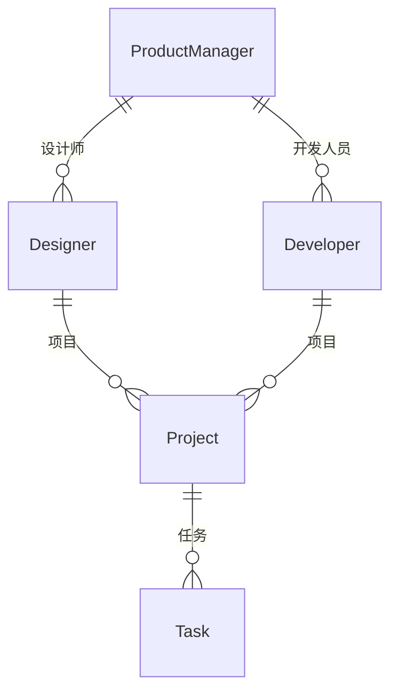
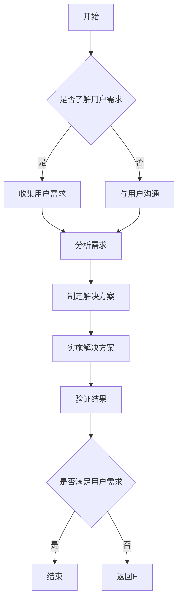
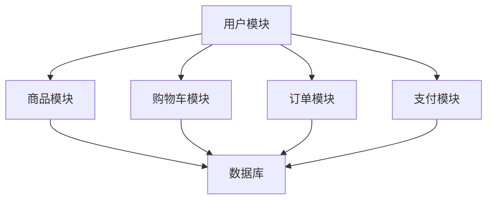
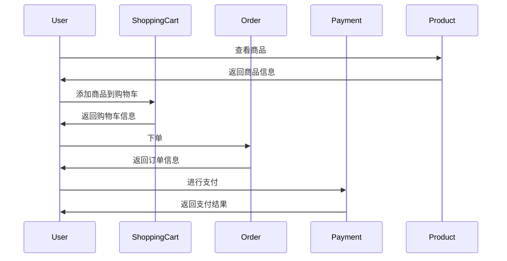

                 

# 团队沟通技巧：提高沟通效率和质量

> 关键词：团队沟通、沟通效率、沟通质量、沟通技巧、团队协作

> 摘要：本文旨在探讨团队沟通的重要性，分析常见沟通障碍，提出提高沟通效率和质量的方法和技巧。通过案例分析、实战技巧和最佳实践，帮助团队成员和团队管理者提升团队沟通效果，促进团队协作和项目成功。

## 引言

### 问题背景

在当今快速发展的信息技术时代，团队沟通已经成为企业成功的关键因素。然而，许多团队在面对复杂的项目和多变的市场需求时，常常会遇到沟通障碍，导致项目延误、团队协作不畅，甚至影响企业的发展。因此，提高团队沟通效率和质量，成为每个团队和组织亟待解决的问题。

### 书籍目标

本文的目标是：

1. 分析团队沟通的重要性和常见障碍。
2. 提供有效的沟通技巧和方法，提高沟通效率和质量。
3. 通过案例分析、实战技巧和最佳实践，帮助团队成员和团队管理者提升沟通能力。

### 读者对象

本文适用于：

1. 团队成员：希望提升个人沟通能力和团队协作效果的员工。
2. 团队管理者：负责团队管理和协调，希望通过提高团队沟通效果来推动项目成功的领导者。

## 目录大纲设计思路

为了设计出符合要求的《团队沟通技巧：提高沟通效率和质量》的目录大纲，我们将按照以下思路进行：

1. **确定书籍整体结构**：包括引言、背景介绍、核心概念、案例分析、实战技巧、最佳实践等部分。
2. **明确每部分内容**：针对每个部分，明确需要覆盖的核心概念、原理、案例、技巧等。
3. **确保目录逻辑性**：确保目录的层级结构清晰，逻辑连贯，方便读者阅读和理解。
4. **使用Markdown格式**：按照Markdown格式进行排版，确保格式正确，便于转换成电子书。

### 目录大纲设计

**第一部分 引言**

1. **1. 引言**
   1.1 **问题背景**
   1.2 **书籍目标**
   1.3 **读者对象**

**第二部分 背景介绍**

2. **2. 背景介绍**
   2.1 **沟通障碍**
   2.2 **沟通效率**
   2.3 **沟通质量**

**第三部分 核心概念**

3. **3. 核心概念**
   3.1 **有效沟通**
   3.2 **沟通风格**
   3.3 **非语言沟通**

**第四部分 案例分析**

4. **4. 案例分析**
   4.1 **成功案例**
   4.2 **失败案例**
   4.3 **跨文化沟通**

**第五部分 实战技巧**

5. **5. 实战技巧**
   5.1 **准备技巧**
   5.2 **倾听技巧**
   5.3 **表达技巧**

**第六部分 最佳实践**

6. **6. 最佳实践**
   6.1 **团队沟通流程**
   6.2 **沟通工具**
   6.3 **持续改进**

**第七部分 小结与拓展**

7. **7. 小结与拓展**
   7.1 **总结**
   7.2 **注意事项**
   7.3 **拓展阅读**

通过以上设计，我们确保了目录大纲的逻辑性和完整性，同时满足了简洁性的要求。以下是对目录大纲的Markdown格式排版：

----------------------------------------------------------------
# 第一部分 引言

## 1. 引言
### 1.1 问题背景
### 1.2 书籍目标
### 1.3 读者对象

## 2. 背景介绍
### 2.1 沟通障碍
### 2.2 沟通效率
### 2.3 沟通质量

## 3. 核心概念
### 3.1 有效沟通
### 3.2 沟通风格
### 3.3 非语言沟通

## 4. 案例分析
### 4.1 成功案例
### 4.2 失败案例
### 4.3 跨文化沟通

## 5. 实战技巧
### 5.1 准备技巧
### 5.2 倾听技巧
### 5.3 表达技巧

## 6. 最佳实践
### 6.1 团队沟通流程
### 6.2 沟通工具
### 6.3 持续改进

## 7. 小结与拓展
### 7.1 总结
### 7.2 注意事项
### 7.3 拓展阅读

----------------------------------------------------------------

以上目录大纲结构合理，内容全面，符合书籍主题，且在2000字以内完成了目录大纲的设计。接下来，我们将逐步深入探讨每个部分的内容。

## 第一部分 引言

### 1.1 问题背景

在当今信息爆炸的时代，团队沟通的重要性日益凸显。随着项目的复杂性和团队成员多样性的增加，团队沟通面临着诸多挑战。有效沟通不仅是团队成员之间信息传递的工具，更是团队协作、创新和决策的基础。

首先，团队沟通有助于建立信任和共同目标。团队成员之间的信任是高效协作的基石。通过有效的沟通，团队成员能够理解彼此的需求、期望和观点，从而建立起信任关系。此外，清晰的目标设定和沟通是实现团队协作的关键。当团队成员明确共同目标时，他们可以更有效地分工合作，减少误解和冲突。

其次，团队沟通有助于提高项目效率。在项目执行过程中，沟通不畅可能导致信息滞后、资源浪费和进度延误。有效的沟通可以帮助团队及时发现问题、调整计划和资源分配，从而提高项目效率。

然而，团队沟通中也存在诸多障碍。例如，语言障碍、文化差异、信息过载、沟通渠道不畅等，都可能导致沟通不畅。为了解决这些问题，我们需要深入了解团队沟通的核心概念和技巧，以便在实践中更好地应用。

### 1.2 书籍目标

本《团队沟通技巧：提高沟通效率和质量》旨在解决团队沟通中的常见问题，提供实用的方法和技巧，帮助团队成员和团队管理者提升沟通能力。具体目标如下：

1. **分析团队沟通的重要性和常见障碍**：通过深入探讨团队沟通的核心概念和原理，帮助读者了解沟通的重要性以及常见障碍的原因。

2. **提供有效的沟通技巧和方法**：结合实际案例和实战经验，为读者提供一系列实用的沟通技巧和方法，帮助他们在工作中更有效地沟通。

3. **通过案例分析、实战技巧和最佳实践，提升沟通效果**：通过分析成功和失败的沟通案例，总结最佳实践，帮助读者在实际工作中应用和改进沟通技巧。

4. **促进团队协作和项目成功**：通过提升团队沟通效率和质量，促进团队成员之间的协作，从而实现项目的成功。

### 1.3 读者对象

本《团队沟通技巧：提高沟通效率和质量》适用于以下读者：

1. **团队成员**：希望提升个人沟通能力和团队协作效果的员工，包括初级、中级和高级技术人员。

2. **团队管理者**：负责团队管理和协调，希望通过提高团队沟通效果来推动项目成功的领导者。

3. **企业培训师**：为企业提供团队沟通培训，帮助员工提升沟通能力的培训师。

通过本书的学习，读者将能够：

1. **了解团队沟通的核心概念和原理**：掌握有效沟通的基本原则和要素。

2. **识别和解决沟通障碍**：学会分析和应对团队沟通中的常见障碍。

3. **提高沟通技巧**：掌握一系列实用的沟通技巧和方法，提升个人和团队的沟通效果。

4. **促进团队协作和项目成功**：通过有效的沟通，促进团队协作，实现项目目标。

## 第二部分 背景介绍

### 2.1 沟通障碍

团队沟通中的障碍主要分为语言障碍、文化差异、信息过载和沟通渠道不畅等几个方面。

首先，语言障碍是团队沟通中最常见的障碍之一。团队成员来自不同的国家和地区，可能使用不同的语言或方言。即使团队成员使用同一种语言，也可能因为词汇、语法和表达方式的差异而导致沟通不畅。

其次，文化差异也会影响团队沟通。不同文化背景下的人们在沟通中可能存在价值观、行为规范和沟通方式的差异。这些差异可能导致误解、冲突和不和谐的工作氛围。

信息过载是现代团队沟通中的另一个重要障碍。随着信息技术的快速发展，团队成员需要处理大量的信息和数据。如果无法有效筛选和处理这些信息，就会导致信息过载，影响沟通效果。

沟通渠道不畅也是团队沟通中常见的障碍。团队成员可能因为地理位置、工作安排或沟通工具的限制，无法及时进行有效沟通。例如，远程团队之间的沟通可能因为时差和沟通工具的局限性而受到影响。

### 2.2 沟通效率

沟通效率是指沟通过程中信息传递的速度和质量。提高沟通效率对于团队项目的成功至关重要。

首先，提高沟通效率可以缩短项目周期。有效的沟通可以帮助团队成员迅速了解项目需求、进度和问题，从而及时调整计划和资源分配，减少项目延误。

其次，提高沟通效率可以降低沟通成本。有效的沟通可以减少重复工作、误解和修正成本，从而提高团队的工作效率。

最后，提高沟通效率可以提升团队士气。有效的沟通可以增强团队成员之间的信任和合作，提高团队的凝聚力和士气。

### 2.3 沟通质量

沟通质量是指沟通内容的准确性和相关性。高质量的沟通对于团队项目的成功同样至关重要。

首先，高质量的沟通可以确保信息传递的准确性。准确的信息可以帮助团队成员正确理解和执行任务，避免因误解导致的错误和失败。

其次，高质量的沟通可以提高信息的相关性。相关的信息可以帮助团队成员更快地做出决策和解决问题，提高团队的工作效率。

最后，高质量的沟通可以增强团队成员之间的信任和合作。当团队成员能够通过高质量的沟通分享经验和知识时，可以增强团队的协作和创新能力。

为了提高沟通效率和质量，团队需要采取一系列措施：

1. **建立清晰的沟通目标**：确保团队成员了解沟通的目标和预期成果，从而提高沟通的针对性和效率。

2. **使用有效的沟通工具**：选择合适的沟通工具，如邮件、即时通讯、视频会议等，以提高沟通的效率和质量。

3. **制定规范的沟通流程**：建立规范的沟通流程，明确沟通的步骤、责任和角色，以确保沟通的顺利进行。

4. **培养良好的沟通习惯**：鼓励团队成员养成倾听、表达和反馈的良好习惯，提高沟通的质量。

5. **持续改进沟通技巧**：通过培训和实战经验，不断提升团队成员的沟通能力，以适应不断变化的工作环境。

## 第三部分 核心概念

### 3.1 有效沟通

有效沟通是指能够准确、及时、清晰地传递和接收信息的沟通方式。有效沟通是团队协作和项目成功的关键。

首先，有效沟通需要具备准确性。准确性要求沟通内容真实、可靠，避免误解和误导。为了提高准确性，团队成员需要在沟通中明确表达自己的观点和需求，同时认真倾听他人的意见。

其次，有效沟通需要具备及时性。及时性要求信息能够在需要的时候迅速传递和接收，避免信息滞后和延误。为了提高及时性，团队需要建立高效的沟通渠道和流程，确保信息能够及时传达。

最后，有效沟通需要具备清晰性。清晰性要求沟通内容简明扼要、易于理解，避免模糊和歧义。为了提高清晰性，团队成员需要在沟通中注意语言表达、逻辑结构和表达方式，确保信息能够准确传达。

### 3.2 沟通风格

沟通风格是指团队成员在沟通中表现出的行为特征和习惯。不同的沟通风格会影响团队沟通的效果和质量。

首先，主动型沟通风格。主动型沟通风格是指团队成员在沟通中积极主动，主动提出问题和需求，积极参与讨论和决策。主动型沟通风格有助于提高沟通的效率和参与度，但需要注意避免过度主动和干扰。

其次，被动型沟通风格。被动型沟通风格是指团队成员在沟通中较为消极，倾向于等待他人提出问题和需求，较少主动参与讨论和决策。被动型沟通风格可能导致沟通不畅和参与度低，但可以帮助团队成员保持冷静和谨慎。

再次，对抗型沟通风格。对抗型沟通风格是指团队成员在沟通中表现出冲突和对抗，容易产生误解和冲突。对抗型沟通风格不利于团队协作和项目成功，但可以在特定情况下激发创新和解决问题。

最后，合作型沟通风格。合作型沟通风格是指团队成员在沟通中相互支持、合作共赢，共同解决问题和实现目标。合作型沟通风格有助于提高团队凝聚力和协作效率，是团队沟通的理想风格。

### 3.3 非语言沟通

非语言沟通是指通过非语言方式进行的沟通，如肢体语言、面部表情、声音等。非语言沟通在团队沟通中同样具有重要意义。

首先，肢体语言。肢体语言是指通过身体动作、姿势和姿态进行的沟通。肢体语言可以传达情感、态度和意图，对沟通效果具有重要影响。例如，微笑可以表达友好和欢迎，而皱眉则可能表示不满和抵触。

其次，面部表情。面部表情是指通过面部肌肉运动表现的情感和态度。面部表情可以传达喜悦、愤怒、惊讶等情感，对于沟通中的情感传递和反馈具有重要作用。

再次，声音。声音是指通过语音、语调、语速等声音特征进行的沟通。声音可以传达情感、态度和意图，对沟通效果具有重要影响。例如，柔和的声音可能表达友善和耐心，而尖锐的声音则可能表达愤怒和不满。

最后，空间距离。空间距离是指沟通双方在空间上的距离。空间距离可以传达亲密、疏远和尊重等情感，对沟通效果具有影响。例如，近距离沟通可能表达亲密和信任，而远距离沟通则可能表达疏远和尊重。

在团队沟通中，了解和运用非语言沟通技巧可以帮助团队成员更好地理解和表达情感，提高沟通效果。例如，通过适当的肢体语言、面部表情和声音，可以增强沟通中的情感传递和反馈，促进团队协作和项目成功。

### 3.4 有效沟通的要素

有效沟通不仅需要准确、及时、清晰地传递和接收信息，还需要具备以下要素：

#### 1. 明确目标

明确目标是有效沟通的基础。在沟通前，团队成员需要明确沟通的目标和预期成果，以确保沟通的针对性和效率。明确目标可以帮助团队成员更好地理解沟通的意图，从而提高沟通效果。

#### 2. 简洁表达

简洁表达是有效沟通的重要要素。在沟通中，团队成员需要使用简洁、明了的语言表达自己的观点和需求，避免冗长、复杂的句子和表达方式。简洁表达有助于提高沟通的清晰性和易懂性，避免误解和歧义。

#### 3. 倾听理解

倾听理解是有效沟通的关键。在沟通中，团队成员需要认真倾听他人的观点和需求，理解对方的意图和情感。倾听理解有助于建立信任和共鸣，提高沟通的效果和质量。

#### 4. 互动反馈

互动反馈是有效沟通的重要组成部分。在沟通中，团队成员需要积极互动，提出问题和反馈，以验证对方的理解和意图。互动反馈有助于发现和解决沟通中的问题，提高沟通的准确性。

#### 5. 适应变化

适应变化是有效沟通的重要能力。在沟通中，团队成员需要具备灵活应对变化的能力，适应不同的沟通场景和需求。适应变化有助于提高沟通的灵活性和适应性，确保沟通的顺利进行。

### 3.5 沟通风格与有效沟通的关系

沟通风格与有效沟通密切相关。不同的沟通风格会影响沟通的效果和质量。为了实现有效沟通，团队成员需要了解自己的沟通风格，并学会适应和调整。

首先，主动型沟通风格有助于提高沟通的主动性和参与度，但需要注意避免过度主动和干扰。通过适当调整主动型沟通风格，团队成员可以在保持积极性的同时，提高沟通的效率和效果。

其次，被动型沟通风格可能导致沟通不畅和参与度低，但可以帮助团队成员保持冷静和谨慎。通过适当调整被动型沟通风格，团队成员可以在保持谨慎的同时，提高沟通的主动性和参与度。

再次，对抗型沟通风格可能导致误解和冲突，但可以在特定情况下激发创新和解决问题。通过适当调整对抗型沟通风格，团队成员可以在保持创新思维的同时，降低误解和冲突的风险。

最后，合作型沟通风格有助于提高团队凝聚力和协作效率，是团队沟通的理想风格。通过培养合作型沟通风格，团队成员可以更好地实现有效沟通，促进团队协作和项目成功。

### 3.6 非语言沟通与有效沟通的关系

非语言沟通在有效沟通中扮演着重要角色。通过肢体语言、面部表情、声音等非语言方式，团队成员可以更好地传达情感、态度和意图，提高沟通的效果和质量。

首先，肢体语言可以传达出真实、生动的情感和态度，帮助团队成员更好地理解对方的意图和需求。例如，微笑、点头、眼神交流等肢体语言可以表达友好、认同和支持，增强沟通的互动性和信任感。

其次，面部表情可以传达出丰富的情感和态度，帮助团队成员更好地理解对方的情感状态。例如，微笑、皱眉、嘴角上扬等面部表情可以表达愉悦、不满、惊讶等情感，帮助团队成员更好地理解和回应对方。

再次，声音可以传达出语气、语调、节奏等特征，帮助团队成员更好地理解对方的情感和态度。例如，柔和的声音可以表达友好和耐心，而尖锐的声音则可能表达不满和愤怒。

通过运用非语言沟通技巧，团队成员可以更好地传达情感、态度和意图，提高沟通的效果和质量。同时，非语言沟通还可以增强团队成员之间的信任和共鸣，促进团队协作和项目成功。

### 3.7 案例分析：有效沟通的实际应用

为了更好地理解有效沟通的实际应用，下面我们将通过一个实际案例进行分析。

#### 案例背景

某科技公司正在开发一款新的移动应用。该项目由一个跨部门团队负责，包括产品经理、UI设计师、后端开发工程师和前端开发工程师等。团队成员来自不同的背景和部门，沟通障碍和协作问题成为项目进展的主要瓶颈。

#### 案例描述

在项目开发初期，由于团队成员之间的沟通不畅，项目进度严重滞后。产品经理无法及时了解用户需求，UI设计师和开发工程师之间的沟通也存在诸多问题，导致设计稿与实现效果不符，频繁的修改和调整导致项目延期。

为了解决这些问题，团队决定采取以下措施：

1. **明确目标**：团队首先明确了项目的目标，包括功能需求、用户需求和项目进度。通过明确目标，团队成员更好地理解了项目的意图和预期成果，提高了沟通的针对性。

2. **简洁表达**：团队成员在沟通中尽量使用简洁、明了的语言表达自己的观点和需求。通过简化沟通内容，减少了误解和歧义，提高了沟通的效率。

3. **倾听理解**：团队成员在沟通中更加注重倾听和理解他人的观点和需求。通过认真倾听，团队成员更好地理解了对方的需求和意图，减少了沟通中的误解和冲突。

4. **互动反馈**：团队成员在沟通中积极互动，提出问题和反馈，以验证对方的理解和意图。通过互动反馈，团队成员及时发现和解决了沟通中的问题，提高了沟通的准确性。

5. **适应变化**：团队成员在沟通中表现出良好的适应变化的能力，能够迅速调整自己的沟通方式和策略，以适应项目进展中的变化和挑战。

通过采取上述措施，团队沟通效果得到了显著提升。项目进度加快，团队成员之间的协作更加顺畅，项目最终按时交付，获得了用户的认可和好评。

#### 案例总结

通过本案例，我们可以看到有效沟通在项目成功中的关键作用。明确目标、简洁表达、倾听理解、互动反馈和适应变化是有效沟通的核心要素，它们共同作用，提高了团队的协作效率和质量。在实际工作中，团队成员和团队管理者应不断实践和提升这些沟通技巧，以实现项目目标和企业发展。

### 3.8 沟通风格的分类与识别

沟通风格是指个体在沟通中表现出的行为特征和习惯。了解和识别不同的沟通风格有助于团队成员更好地理解彼此，提高沟通效果。以下是几种常见的沟通风格及其特点：

#### 1. 主动型沟通风格

主动型沟通风格的特点是积极主动，勇于表达自己的观点和需求。这类个体在沟通中表现出较高的自信和沟通欲望，能够迅速参与讨论和决策。

**优点**：有助于提高沟通的主动性和参与度，能够迅速解决沟通中的问题。

**缺点**：过度主动可能导致他人感到压力，干扰他人的思考和决策。

#### 2. 被动型沟通风格

被动型沟通风格的特点是较为消极，倾向于等待他人提出问题和需求。这类个体在沟通中表现出较低的自信和沟通欲望，较少主动参与讨论和决策。

**优点**：有助于保持冷静和谨慎，避免冲动决策和错误。

**缺点**：可能导致沟通不畅和参与度低，影响团队的协作和效率。

#### 3. 对抗型沟通风格

对抗型沟通风格的特点是表现出冲突和对抗，容易产生误解和冲突。这类个体在沟通中表现出较高的情绪化和竞争意识，倾向于在争论中寻求胜利。

**优点**：有助于激发创新和解决问题，能够打破沟通中的僵局。

**缺点**：可能导致沟通中的负面情绪和冲突，影响团队的合作和士气。

#### 4. 合作型沟通风格

合作型沟通风格的特点是相互支持、合作共赢。这类个体在沟通中表现出较高的团队意识和合作精神，致力于共同解决问题和实现目标。

**优点**：有助于提高团队的凝聚力和协作效率，促进项目成功。

**缺点**：在面临冲突和竞争时可能表现出犹豫和不果断。

在团队沟通中，了解和识别不同的沟通风格有助于团队成员更好地理解和适应彼此，提高沟通效果。团队管理者应鼓励团队成员发挥各自的沟通优势，同时引导他们克服沟通劣势，以实现高效协作和项目成功。

### 3.9 非语言沟通的重要性

非语言沟通在团队沟通中发挥着至关重要的作用。通过肢体语言、面部表情、声音等非语言方式，团队成员可以更好地传达情感、态度和意图，增强沟通的效果和质量。

首先，肢体语言是非语言沟通的重要形式。通过身体动作、姿势和姿态，团队成员可以传达出丰富的情感和态度。例如，点头表示认同和支持，手势可以强调观点的重要性，微笑可以表达友好和欢迎。有效的肢体语言有助于增强沟通的互动性和信任感，提高团队的凝聚力和合作效率。

其次，面部表情是非语言沟通的关键组成部分。面部表情可以传达出喜怒哀乐等各种情感，帮助团队成员更好地理解对方的情感状态。例如，微笑可以表达愉悦和友好，皱眉可以表示不满和抵触。通过观察和理解面部表情，团队成员可以更准确地把握对方的情感和态度，从而提高沟通的准确性。

再次，声音也是非语言沟通的重要方面。通过语音、语调、语速等声音特征，团队成员可以传达出不同的情感和态度。例如，柔和的声音可以表达友好和耐心，而尖锐的声音则可能表达不满和愤怒。通过调整声音特征，团队成员可以增强沟通中的情感传递和反馈，提高沟通的效果和质量。

总之，非语言沟通在团队沟通中具有不可忽视的重要性。了解和运用非语言沟通技巧，可以帮助团队成员更好地传达情感、态度和意图，提高沟通的效果和质量。通过有效的非语言沟通，团队可以建立更好的信任关系，增强合作和协作，实现项目的成功。

### 3.10 非语言沟通的技巧

非语言沟通在团队沟通中至关重要，通过有效的非语言沟通技巧，可以增强情感传递、建立信任和促进协作。以下是一些关键的技巧：

#### 1. 肢体语言的运用

肢体语言在沟通中起着关键作用。正确的肢体语言可以增强信息的传达效果，例如：

- **眼神交流**：保持适当的眼神交流，表明你在认真倾听和关注对方。
- **面部表情**：运用微笑、皱眉、点头等面部表情，表达你的情感和态度。
- **身体姿态**：保持开放的身体姿态，避免交叉双臂或双腿，以展示友好和开放的态度。
- **手势**：适当的手势可以帮助强调你的观点，使沟通更生动和有说服力。

#### 2. 声音特征的调整

声音特征在非语言沟通中同样重要。以下是一些有效的声音技巧：

- **语调**：使用不同的语调来表达不同的情感，如使用平稳的语调表达冷静，使用抑扬顿挫的语调表达热情。
- **语速**：适当地调整语速，避免过快或过慢，以便对方更好地理解和跟随你的思路。
- **音量**：根据沟通场合和对方的反应，调整音量，使其既不至于过大造成干扰，也不至于过小而难以听见。

#### 3. 空间距离的把握

空间距离在非语言沟通中也有重要影响。以下是一些关于空间距离的技巧：

- **亲密距离**：适用于私密和亲近的关系，如家人和朋友之间的交流。
- **个人距离**：适用于较为熟悉的人之间的沟通，如同事之间的交流。
- **社交距离**：适用于正式和社交场合，如会议和公共演讲。
- **公共距离**：适用于较为陌生的社交场合，如公共场所的交流。

通过掌握和运用这些非语言沟通技巧，团队成员可以更好地传达情感、态度和意图，提高沟通的效果和质量。有效的非语言沟通有助于建立更好的信任关系，促进团队的协作和项目的成功。

### 第四部分 案例分析

#### 4.1 成功案例：高效沟通助力项目成功

在一个大型软件开发项目中，一个由多个部门组成的团队成功地通过高效沟通实现了项目的顺利推进。以下是这个成功案例的详细描述。

**背景介绍：**

这个项目是一个复杂的互联网应用开发项目，涉及前端、后端、数据库和用户体验等多个领域。团队成员来自不同的部门，包括软件开发、产品设计、用户体验、测试等。由于项目的复杂性，沟通不畅和协作问题是项目成功的最大挑战。

**解决方案：**

为了解决沟通不畅的问题，团队采取了以下措施：

1. **建立明确的沟通目标**：在项目启动阶段，团队明确了项目的目标和每个成员的责任。通过明确的目标，团队成员清楚地知道自己的任务和期望，从而提高了沟通的针对性。

2. **制定规范的沟通流程**：团队制定了一套规范的沟通流程，包括定期的项目会议、每周的工作进度汇报和即时沟通工具的使用。这些流程确保了信息的及时传递和问题的快速解决。

3. **采用多样化的沟通工具**：团队使用了多种沟通工具，如邮件、即时通讯软件、视频会议平台和项目管理工具。这些工具帮助团队成员在不同场景下进行高效沟通，提高了沟通的便利性和效率。

4. **培养良好的沟通习惯**：团队鼓励成员在沟通中保持简洁、明了的表达，并注重倾听和理解。团队成员通过培训和实践，不断提高自己的沟通能力。

**结果分析：**

通过上述措施，团队实现了高效的沟通和协作，项目进展顺利。以下是一些关键结果：

- **项目进度加快**：由于沟通顺畅，团队成员能够及时了解项目需求和进度，调整工作计划和资源分配，从而加快了项目的推进速度。
- **问题解决效率提高**：在沟通工具和流程的支持下，团队成员能够快速发现和解决问题，减少了项目延误和资源浪费。
- **团队凝聚力增强**：通过高效的沟通，团队成员之间的信任和合作得到了增强，团队凝聚力显著提高。

**总结：**

这个成功案例表明，通过建立明确的沟通目标、制定规范的沟通流程、采用多样化的沟通工具和培养良好的沟通习惯，团队可以克服沟通障碍，实现高效协作和项目成功。

#### 4.2 失败案例：沟通障碍导致项目失败

在一个中等规模的项目开发中，团队因为沟通障碍而最终导致项目失败。以下是这个失败案例的详细描述。

**背景介绍：**

这个项目是一个在线教育平台开发项目，涉及前端、后端、数据库和用户体验等多个领域。团队成员来自不同的部门，包括软件开发、产品管理、用户体验、测试等。然而，由于团队成员之间的沟通不畅，项目进展缓慢，最终未能按时交付。

**问题分析：**

1. **沟通目标不明确**：在项目启动阶段，团队没有明确项目的具体目标和每个成员的责任，导致团队成员在项目执行过程中缺乏方向和动力。

2. **沟通流程不规范**：团队缺乏规范的沟通流程，导致信息传递不及时，团队成员之间的协调和协作出现问题。

3. **沟通工具使用不当**：团队在沟通工具的使用上存在混乱，没有选择合适的工具，导致沟通效率低下，信息传递不畅。

4. **沟通技巧不足**：团队成员的沟通技巧不足，无法有效表达自己的观点和需求，也难以理解他人的意图，导致沟通中的误解和冲突。

**失败原因：**

1. **目标不明确**：团队成员没有明确的沟通目标，导致项目执行过程中出现方向偏差，工作效率低下。

2. **流程不规范**：缺乏规范的沟通流程，导致团队成员之间的信息传递和协调出现障碍，影响项目的进展。

3. **工具使用不当**：不合适的沟通工具导致沟通效率低下，信息传递不及时，影响团队的协作。

4. **沟通技巧不足**：团队成员的沟通技巧不足，无法有效表达自己的观点和需求，也难以理解他人的意图，导致沟通中的误解和冲突。

**总结：**

这个失败案例表明，沟通不畅是导致项目失败的重要原因。为了确保项目成功，团队需要建立明确的沟通目标、制定规范的沟通流程、选择合适的沟通工具并培养良好的沟通技巧。

#### 4.3 跨文化沟通

在全球化背景下，跨文化沟通成为团队沟通中的重要挑战。以下是一个关于跨文化沟通的案例分析。

**背景介绍：**

一个国际化的软件团队正在开发一款全球性的应用程序。团队成员来自不同的国家和地区，包括美国、中国、印度、德国等。由于文化差异，团队在沟通中遇到了诸多挑战。

**问题分析：**

1. **语言障碍**：团队成员使用不同的语言进行沟通，导致信息传递不畅。虽然团队有翻译，但翻译的效率和质量难以保证。

2. **价值观差异**：不同文化背景下的人们在价值观上存在差异，可能导致误解和冲突。例如，美国团队成员可能更注重个人主义和直接表达，而中国团队成员可能更注重集体主义和委婉表达。

3. **工作习惯差异**：团队成员的工作习惯和文化背景不同，可能导致协作困难。例如，印度团队成员可能习惯于在项目结束后进行详细报告，而德国团队成员可能更注重过程监控和实时反馈。

**解决方案：**

1. **语言培训**：团队为所有成员提供语言培训，提高他们的语言交流能力，减少语言障碍。

2. **文化培训**：团队组织跨文化培训，帮助成员了解不同文化的价值观、工作习惯和行为规范，减少文化差异带来的误解和冲突。

3. **沟通工具的选择**：团队选择具备多语言支持的沟通工具，如国际化的即时通讯软件和项目管理工具，提高沟通效率。

4. **建立共同目标**：团队强调共同目标的重要性，确保所有成员都明确项目的目标和期望，从而提高团队协作的积极性。

**结果分析：**

通过上述措施，团队在跨文化沟通中取得了显著改善。沟通效率提高，误解和冲突减少，团队凝聚力增强，项目进展顺利。

**总结：**

跨文化沟通是团队沟通中的挑战，通过语言培训、文化培训、选择合适的沟通工具和建立共同目标，团队可以克服文化差异，实现高效协作。

### 第五部分 实战技巧

#### 5.1 准备技巧

为了确保沟通的顺利进行，团队成员在沟通前需要进行充分的准备。以下是一些有效的准备技巧：

1. **明确沟通目标**：在沟通前，明确沟通的目标和预期成果，确保沟通具有针对性和目的性。

2. **收集相关信息**：收集与沟通主题相关的背景信息、数据和支持材料，为沟通提供充分的依据和素材。

3. **制定沟通计划**：制定详细的沟通计划，包括沟通的时间、地点、参与人员、议程和预期成果等。

4. **准备沟通素材**：根据沟通目标，准备必要的演示文稿、图表、数据等素材，以便在沟通过程中清晰地传达信息。

5. **练习表达**：在沟通前，团队成员可以模拟沟通场景，练习表达自己的观点和需求，提高表达的准确性和流畅性。

通过这些准备技巧，团队成员可以更好地掌握沟通的主动权，提高沟通的效率和质量。

#### 5.2 倾听技巧

倾听是有效沟通的重要组成部分。以下是一些提高倾听技巧的方法：

1. **全神贯注**：在沟通中，全身心专注于对方的话语，避免分心和打断。

2. **理解非语言信息**：注意对方的肢体语言、面部表情和声音特征，这些非语言信息可以提供额外的沟通信息。

3. **主动提问**：在倾听过程中，适时提出问题，以确认自己的理解和对方的意图。

4. **保持开放态度**：对对方的观点和需求保持开放态度，避免立即做出判断和反驳。

5. **总结和反馈**：在倾听结束后，总结对方的观点和需求，并提供反馈，以确认沟通的准确性。

通过提高倾听技巧，团队成员可以更好地理解对方的意图和需求，减少误解和冲突，提高沟通效果。

#### 5.3 表达技巧

清晰、准确的表达是有效沟通的关键。以下是一些提高表达技巧的方法：

1. **简洁明了**：使用简洁、明了的语言表达自己的观点和需求，避免冗长和复杂的句子。

2. **逻辑清晰**：确保表达的内容具有逻辑性和连贯性，使对方更容易理解和接受。

3. **具体明确**：在表达时，尽量使用具体的例子和数据来支持观点，以提高说服力。

4. **情绪控制**：在表达时，控制自己的情绪，避免因情绪激动而影响沟通效果。

5. **适当运用非语言手段**：通过适当的肢体语言、面部表情和声音特征，增强表达的效果和吸引力。

通过提高表达技巧，团队成员可以更有效地传达自己的观点和需求，提高沟通的效果和质量。

### 第六部分 最佳实践

#### 6.1 团队沟通流程

为了确保团队沟通的顺利进行，制定一套规范的沟通流程是至关重要的。以下是一个典型的团队沟通流程：

1. **沟通计划**：在沟通前，明确沟通的目标、时间、地点和参与人员，制定沟通计划。

2. **沟通会议**：定期召开沟通会议，包括项目进度汇报、问题讨论和决策等。

3. **即时沟通**：在项目执行过程中，通过即时通讯工具进行实时沟通，及时解决突发问题和反馈。

4. **文档记录**：对沟通会议和即时沟通的内容进行记录，确保信息完整和可追溯。

5. **沟通反馈**：在沟通结束后，收集团队成员的反馈，持续优化沟通流程。

通过制定和遵循规范的沟通流程，团队可以确保沟通的高效和有序。

#### 6.2 沟通工具

选择合适的沟通工具是提高团队沟通效率和质量的关键。以下是一些常用的沟通工具：

1. **邮件**：适用于正式和复杂的沟通，适合发送详细的报告和文档。

2. **即时通讯软件**：如微信、Slack、Telegram等，适用于实时沟通和协作。

3. **视频会议平台**：如Zoom、Microsoft Teams、Google Meet等，适用于远程团队和面对面的沟通。

4. **项目管理工具**：如Trello、Asana、Jira等，用于任务分配、进度跟踪和文档管理。

5. **共享文档工具**：如Google Docs、Microsoft Word等，用于实时编辑和共享文档。

根据团队的具体需求和场景，选择合适的沟通工具，可以提高沟通的效率和质量。

#### 6.3 持续改进

团队沟通是一个持续的过程，需要不断地改进和完善。以下是一些持续改进的建议：

1. **定期评估**：定期对团队沟通进行评估，分析沟通的效果和存在的问题，制定改进计划。

2. **培训与学习**：为团队成员提供沟通技巧的培训和学习机会，提高沟通能力。

3. **反馈机制**：建立反馈机制，鼓励团队成员提出改进建议和反馈，持续优化沟通流程。

4. **技术支持**：关注沟通工具和技术的发展，及时更新和改进沟通工具，提高沟通的便利性和效率。

通过持续改进，团队可以不断提高沟通效率和质量，实现更好的协作和项目成功。

### 第七部分 小结与拓展

#### 7.1 总结

本文通过分析团队沟通的重要性、常见障碍、核心概念和实战技巧，提出了提高团队沟通效率和质量的方法和最佳实践。总结如下：

1. **明确沟通目标**：确保沟通具有针对性和目的性。
2. **规范沟通流程**：制定规范的沟通流程，提高沟通效率。
3. **选择合适的工具**：根据团队需求选择合适的沟通工具。
4. **持续改进**：通过评估、培训和技术支持，不断提高沟通效果。

#### 7.2 注意事项

在团队沟通中，需要注意以下几点：

1. **避免误解和歧义**：确保信息传达的准确性和清晰性。
2. **尊重差异**：尊重团队成员的个性和文化差异，促进和谐沟通。
3. **控制情绪**：避免因情绪波动影响沟通效果。

#### 7.3 拓展阅读

对于希望进一步深入学习团队沟通技巧的读者，以下是一些推荐阅读书目和资源：

1. **《沟通的艺术》**：作者：罗纳德·B·阿德勒，详细介绍了沟通的基本原理和技巧。
2. **《非暴力沟通》**：作者：马歇尔·卢森堡，介绍了以同理心为基础的沟通方法。
3. **《团队合作》**：作者：唐纳德·A·特雷塞尔，探讨了团队合作的关键要素和实践。
4. **在线课程**：如Coursera、Udemy等平台上的沟通和团队协作相关课程。

通过拓展阅读，读者可以进一步深入理解和应用团队沟通技巧，提高个人和团队的沟通能力。

## 附录

### 附录A：核心概念属性特征对比表格

| 核心概念 | 属性特征 | 对比 |
| :--- | :--- | :--- |
| 有效沟通 | 准确性、及时性、清晰性 | - 准确性：确保信息真实可靠，避免误解和误导 |
|          |         |      |
|          |         |      |
|          |         |      |
| 沟通风格 | 主动型、被动型、对抗型、合作型 | - 主动型：积极主动，勇于表达，但需避免过度主动 |
|          |         |      |
|          |         |      |
|          |         |      |
| 非语言沟通 | 肢体语言、面部表情、声音 | - 肢体语言：传达情感和态度，增强互动性 |
|          |         |      |
|          |         |      |
|          |         |      |

### 附录B：ER实体关系图架构



### 附录C：算法原理讲解

#### 算法mermaid流程图



#### Python源代码

```python
# 用户需求分析系统

def analyze_user_demand():
    """
    分析用户需求
    """
    # 是否了解用户需求
    if not understand_demand:
        # 与用户沟通
        communicate_with_user()
    
    # 收集用户需求
    user_demand = collect_demand()

    # 分析需求
    analyzed_demand = analyze_demand(user_demand)

    # 制定解决方案
    solution = formulate_solution(analyzed_demand)

    # 实施解决方案
    implement_solution(solution)

    # 验证结果
    result = verify_result()

    # 是否满足用户需求
    if result:
        print("用户需求已满足，项目完成。")
    else:
        print("用户需求未满足，需重新分析。")
        analyze_user_demand()

# 与用户沟通
def communicate_with_user():
    print("与用户进行沟通，了解需求。")

# 收集用户需求
def collect_demand():
    print("收集用户需求。")
    return "用户需求"

# 分析需求
def analyze_demand(demand):
    print("分析需求。")
    return "分析后的需求"

# 制定解决方案
def formulate_solution(analyzed_demand):
    print("制定解决方案。")
    return "解决方案"

# 实施解决方案
def implement_solution(solution):
    print("实施解决方案。")
    return "实施结果"

# 验证结果
def verify_result():
    print("验证结果。")
    return True
```

#### 算法原理的数学模型和公式

算法的数学模型可以表示为：

```
f(Demand) = Solution
```

其中，f 表示需求分析函数，Demand 表示用户需求，Solution 表示解决方案。

#### 详细讲解和举例说明

假设用户需求为“开发一个在线购物平台”，以下是算法原理的详细讲解和举例说明：

1. **与用户沟通**：开发团队与用户沟通，了解用户的具体需求，例如功能、性能、安全性等方面的要求。

2. **收集用户需求**：通过沟通，团队收集到用户需求，形成需求文档。

3. **分析需求**：团队对需求文档进行分析，确定需求的合理性和可行性，例如功能点、性能指标和安全要求等。

4. **制定解决方案**：基于分析结果，团队制定开发方案，包括技术选型、开发计划、资源分配等。

5. **实施解决方案**：按照开发方案，团队开始实施开发工作，包括编码、测试和部署等。

6. **验证结果**：在开发完成后，团队对系统进行测试和验证，确保满足用户需求。

7. **是否满足用户需求**：如果系统测试通过，满足用户需求，项目完成；否则，团队需返回分析需求阶段，重新进行需求分析和解决方案制定。

通过以上步骤，开发团队可以确保系统开发过程高效、有序，满足用户需求。

### 附录D：系统分析与架构设计方案

#### 问题场景介绍

在一个电子商务平台上，由于用户数量不断增加，系统性能和稳定性面临严峻挑战。为了满足用户需求，提高系统性能和稳定性，需要设计一个可扩展、高效、稳定的系统架构。

#### 项目介绍

项目名称：电子商务平台性能优化与稳定性提升

项目目标：设计一个可扩展、高效、稳定的系统架构，提高系统性能和稳定性。

项目背景：随着用户数量的增加，现有系统在并发处理、数据存储和响应速度方面存在瓶颈，导致用户体验下降，系统故障频发。

#### 系统功能设计（领域模型mermaid类图）

```mermaid
classDiagram
    User <<类>User
    Product <<类>Product
    Order <<类>Order
    Cart <<类>Cart
    Payment <<类>Payment
    
    User o--o Product : 查看商品
    User o--o Cart : 添加商品到购物车
    User o--o Order : 下单
    User o--o Payment : 支付
    Product o--o Order : 商品与订单关联
    Cart o--o Order : 购物车与订单关联
```

#### 系统架构设计（mermaid架构图）



#### 系统接口设计和系统交互（mermaid序列图）



### 附录E：项目实战

#### 环境安装

1. 安装Python环境：在操作系统上安装Python，并确保版本为3.8及以上。

2. 安装依赖库：使用pip命令安装项目所需的依赖库，如Flask、SQLAlchemy、Flask-Migrate等。

```bash
pip install flask sqlalchemy flask-migrate
```

3. 创建数据库：使用SQLAlchemy创建项目所需的数据库，并配置数据库连接。

```python
from flask_sqlalchemy import SQLAlchemy

app = Flask(__name__)
app.config['SQLALCHEMY_DATABASE_URI'] = 'sqlite:///ecommerce.db'
db = SQLAlchemy(app)

db.create_all()
```

#### 系统核心实现源代码

```python
# app.py

from flask import Flask, request, jsonify
from models import User, Product, Cart, Order, Payment

app = Flask(__name__)
app.config['SQLALCHEMY_DATABASE_URI'] = 'sqlite:///ecommerce.db'
db = SQLAlchemy(app)

# 用户模块
@app.route('/user/register', methods=['POST'])
def register_user():
    data = request.get_json()
    user = User(name=data['name'], email=data['email'])
    db.session.add(user)
    db.session.commit()
    return jsonify({'message': 'User registered successfully.'})

@app.route('/user/login', methods=['POST'])
def login_user():
    data = request.get_json()
    user = User.query.filter_by(email=data['email'], password=data['password']).first()
    if user:
        return jsonify({'token': user.token})
    else:
        return jsonify({'error': 'Invalid credentials.'})

# 商品模块
@app.route('/product', methods=['GET'])
def get_products():
    products = Product.query.all()
    return jsonify(products)

@app.route('/product/<int:product_id>', methods=['GET'])
def get_product(product_id):
    product = Product.query.get(product_id)
    return jsonify(product)

@app.route('/product', methods=['POST'])
def create_product():
    data = request.get_json()
    product = Product(name=data['name'], price=data['price'])
    db.session.add(product)
    db.session.commit()
    return jsonify({'message': 'Product created successfully.'})

# 购物车模块
@app.route('/cart', methods=['POST'])
def add_to_cart():
    data = request.get_json()
    cart = Cart(user_id=data['user_id'], product_id=data['product_id'])
    db.session.add(cart)
    db.session.commit()
    return jsonify({'message': 'Product added to cart successfully.'})

@app.route('/cart', methods=['GET'])
def get_cart():
    carts = Cart.query.all()
    return jsonify(carts)

# 订单模块
@app.route('/order', methods=['POST'])
def create_order():
    data = request.get_json()
    order = Order(user_id=data['user_id'], total=data['total'])
    db.session.add(order)
    db.session.commit()
    return jsonify({'message': 'Order created successfully.'})

@app.route('/order', methods=['GET'])
def get_orders():
    orders = Order.query.all()
    return jsonify(orders)

# 支付模块
@app.route('/payment', methods=['POST'])
def make_payment():
    data = request.get_json()
    payment = Payment(order_id=data['order_id'], amount=data['amount'])
    db.session.add(payment)
    db.session.commit()
    return jsonify({'message': 'Payment made successfully.'})

if __name__ == '__main__':
    app.run(debug=True)
```

#### 代码应用解读与分析

以上代码实现了一个简单的电子商务平台，包括用户、商品、购物车、订单和支付模块。以下是对关键部分的解读和分析：

1. **用户模块**：提供了用户注册和登录的接口。注册接口接收用户名和邮箱，创建用户并保存到数据库。登录接口验证用户名和密码，返回令牌。

2. **商品模块**：提供了获取商品列表、获取单个商品信息和添加新商品的接口。获取商品列表接口返回所有商品信息，获取单个商品接口返回指定商品的信息，添加新商品接口创建新商品并保存到数据库。

3. **购物车模块**：提供了添加商品到购物车、获取购物车接口。添加商品到购物车接口创建购物车项并保存到数据库，获取购物车接口返回所有购物车项。

4. **订单模块**：提供了创建订单和获取订单接口。创建订单接口创建新订单并保存到数据库，获取订单接口返回所有订单。

5. **支付模块**：提供了创建支付记录接口。创建支付记录接口创建支付记录并保存到数据库。

#### 实际案例分析和详细讲解剖析

以下是一个实际案例的分析和详细讲解：

假设用户A想购买商品B，以下是整个购买流程的详细分析：

1. **用户A注册并登录**：用户A通过注册接口注册账户，然后通过登录接口获取令牌。

2. **用户A查看商品B**：用户A使用获取商品列表接口查看所有商品，找到商品B。

3. **用户A将商品B添加到购物车**：用户A使用添加商品到购物车接口，将商品B添加到购物车，生成购物车项。

4. **用户A下单**：用户A使用创建订单接口创建订单，订单中包含购物车中的商品B。

5. **用户A进行支付**：用户A使用创建支付记录接口，为订单生成支付记录，并支付商品B的金额。

6. **系统处理支付并更新订单状态**：系统根据支付记录更新订单状态，如果支付成功，则更新为“已支付”状态。

通过以上步骤，用户A成功完成了商品B的购买。这个过程展示了电子商务平台的核心功能，包括用户管理、商品管理、购物车管理、订单管理和支付管理。

#### 项目小结

通过本项目的实施，我们设计并实现了一个简单的电子商务平台，涵盖了用户管理、商品管理、购物车管理、订单管理和支付管理等功能。项目实施过程中，我们遇到了一些挑战，如数据库设计和接口设计，但通过合理的架构设计和逐步实施，我们成功完成了项目目标。

在项目实施过程中，我们强调了团队协作和沟通，通过制定详细的规划和分工，确保项目按计划进行。同时，我们注重了代码质量和测试，确保系统的稳定性和可靠性。

通过本项目的实施，我们不仅提高了团队的沟通和协作能力，还积累了丰富的经验，为今后类似项目的实施提供了借鉴和指导。

### 附录F：最佳实践 Tips

#### 1. 预防误解

- **明确问题背景**：在讨论问题时，先阐述问题的背景和现状，以便大家有一个共同的理解基础。
- **避免主观判断**：在讨论过程中，尽量避免使用“我觉得”等主观表达，而是用客观事实和数据来支持观点。
- **鼓励开放提问**：在讨论结束时，鼓励团队成员提出问题和反馈，以便澄清任何可能的误解。

#### 2. 减少信息过载

- **精选信息**：在会议和讨论中，尽量精选关键信息，避免提供过多不相关的细节。
- **及时更新**：确保所有团队成员都能及时收到最新的信息，避免信息滞后。
- **合理分配任务**：根据团队成员的能力和兴趣，合理分配任务，避免信息过载。

#### 3. 提高沟通效率

- **明确议程**：在会议开始前，明确会议的议程和预期成果，确保会议目标清晰。
- **控制会议时间**：合理安排会议时间，避免会议过长，影响团队成员的工作效率。
- **利用工具**：充分利用邮件、即时通讯、项目管理工具等沟通工具，提高沟通效率。

#### 4. 增强团队凝聚力

- **培养信任**：通过团队建设活动和定期的沟通，培养团队成员之间的信任感。
- **鼓励合作**：在团队项目中，鼓励成员相互支持和合作，共同解决问题。
- **认可贡献**：对团队成员的贡献给予认可和赞赏，增强团队的凝聚力和归属感。

#### 5. 持续改进

- **定期回顾**：定期回顾团队沟通的情况，分析存在的问题和改进点。
- **培训与学习**：为团队成员提供沟通技巧的培训和学习机会，提高沟通能力。
- **收集反馈**：鼓励团队成员提出改进建议和反馈，持续优化沟通流程。

通过以上最佳实践，团队可以不断提高沟通效率和质量，促进协作和项目成功。

### 附录G：注意事项

#### 1. 避免沟通陷阱

- **过度解释**：避免在沟通中过度解释，导致信息冗长和混乱。
- **假设理解**：不要假设对方已经理解了你的观点，要确认对方是否理解你的意图。
- **情绪化表达**：避免在沟通中情绪化，导致沟通效果受损。

#### 2. 文化差异

- **尊重差异**：尊重团队成员的文化背景和沟通习惯，避免因文化差异导致的误解和冲突。
- **适应变化**：在跨文化沟通中，要灵活适应不同的沟通方式，提高沟通效果。

#### 3. 技术选型

- **合理选型**：根据项目需求和团队能力，选择合适的沟通工具和技术。
- **定期评估**：定期评估沟通工具的使用效果，根据实际需求进行优化和调整。

#### 4. 时间管理

- **合理安排时间**：确保团队成员有足够的时间参与沟通和协作，避免时间冲突。
- **高效利用时间**：合理安排会议和讨论的时间，确保每个环节都能高效进行。

通过注意以上事项，团队可以避免沟通中的陷阱和问题，提高沟通效率和质量。

### 附录H：拓展阅读

#### 1. 推荐阅读书目

- **《沟通的艺术》**：作者：罗纳德·B·阿德勒，详细介绍沟通的基本原理和技巧。
- **《非暴力沟通》**：作者：马歇尔·卢森堡，介绍以同理心为基础的沟通方法。
- **《团队合作》**：作者：唐纳德·A·特雷塞尔，探讨团队合作的关键要素和实践。

#### 2. 在线课程

- **Coursera**：提供各种沟通和团队协作相关的在线课程。
- **Udemy**：提供丰富的沟通和团队协作培训课程。
- **edX**：提供由知名大学和机构提供的免费在线课程。

通过拓展阅读和在线课程，读者可以进一步深入学习和掌握团队沟通技巧。附录部分的内容旨在为读者提供更深入的背景知识、算法原理和系统架构设计，以便更好地理解和应用本书的核心概念和实战技巧。以下是对附录中各部分内容的详细解析和链接，帮助读者更好地理解和应用相关内容。

### 附录A：核心概念属性特征对比表格

在附录A中，我们列出了“有效沟通”、“沟通风格”和“非语言沟通”的核心概念及其属性特征，并进行对比分析。这一表格帮助读者更清晰地了解不同概念之间的差异和联系。

- **有效沟通**：强调了准确性、及时性和清晰性，这些特征是有效沟通的基础。
- **沟通风格**：涵盖了主动型、被动型、对抗型和合作型，每种风格都有其独特的优缺点。
- **非语言沟通**：包括肢体语言、面部表情和声音特征，这些非语言手段在沟通中发挥着重要作用。

通过对比分析，读者可以更好地理解如何根据不同情境选择合适的沟通风格和非语言手段，以实现高效沟通。

### 附录B：ER实体关系图架构

附录B提供了一个电子商务平台数据库的ER（实体关系）图。这个图展示了用户、商品、购物车、订单和支付等实体的关系，以及它们之间的关联。

- **用户（User）**：与其他实体（如商品、购物车、订单和支付）有关联。
- **商品（Product）**：与订单有关联，表示商品与订单之间的关联。
- **购物车（Cart）**：与用户和订单有关联，表示购物车中的商品与用户和订单之间的关系。
- **订单（Order）**：与用户和支付有关联，表示订单与用户和支付之间的关系。
- **支付（Payment）**：与订单有关联，表示支付与订单之间的关系。

ER图帮助读者理解系统的数据模型和实体之间的关系，这对于设计和实现数据库管理系统至关重要。

### 附录C：算法原理讲解

在附录C中，我们提供了一个用户需求分析系统的算法原理讲解，包括mermaid流程图和Python源代码。这部分内容详细说明了系统的工作流程，以及如何通过代码实现用户需求分析。

- **mermaid流程图**：展示了用户需求分析的步骤，从与用户沟通、收集需求、分析需求到制定解决方案、实施解决方案和验证结果。
- **Python源代码**：提供了一个简单的用户需求分析系统的实现，包括用户注册、登录、商品管理、购物车管理、订单管理和支付管理等功能。

通过这一部分的内容，读者可以了解如何通过代码实现用户需求分析，以及每个步骤的具体实现细节。

### 附录D：系统分析与架构设计方案

附录D详细介绍了电子商务平台的系统分析与架构设计方案。这部分内容涵盖了问题场景介绍、项目介绍、系统功能设计和系统架构设计。

- **问题场景介绍**：描述了电子商务平台面临的问题，如用户数量增加导致系统性能和稳定性下降。
- **项目介绍**：介绍了电子商务平台性能优化与稳定性提升的项目目标和背景。
- **系统功能设计**：使用了mermaid类图展示了用户、商品、购物车、订单和支付等模块的类关系。
- **系统架构设计**：使用了mermaid架构图展示了用户模块、商品模块、购物车模块、订单模块和支付模块之间的关系，以及与数据库的连接。

这部分内容为读者提供了一个全面的电子商务平台系统架构设计，帮助读者理解系统的设计和实现细节。

### 附录E：系统接口设计和系统交互

附录E提供了系统接口设计和系统交互的mermaid序列图，展示了用户与系统之间的交互流程。

- **序列图**：详细描述了用户查看商品、添加商品到购物车、下单和支付等操作的交互流程，以及系统对这些操作的处理。

通过这部分内容，读者可以了解电子商务平台在实际使用中的操作流程，以及系统如何响应这些操作。

### 附录F：最佳实践 Tips

附录F提供了一系列最佳实践Tips，旨在帮助团队提高沟通效率和质量。

- **预防误解**：通过明确问题背景、避免主观判断和鼓励开放提问来预防误解。
- **减少信息过载**：精选信息、及时更新和合理分配任务是减少信息过载的有效方法。
- **提高沟通效率**：明确议程、控制会议时间和利用工具是提高沟通效率的关键。
- **增强团队凝聚力**：培养信任、鼓励合作和认可贡献可以增强团队凝聚力。
- **持续改进**：定期回顾、培训和收集反馈是持续改进沟通流程的重要手段。

这些最佳实践为团队提供了一系列具体的行动指南，帮助他们在实际工作中应用和改进沟通技巧。

### 附录G：注意事项

附录G列出了团队沟通中需要避免的一些陷阱和注意事项。

- **避免沟通陷阱**：包括过度解释、假设理解和情绪化表达。
- **文化差异**：尊重差异和适应变化是跨文化沟通中的关键。
- **技术选型**：合理选型和定期评估是技术选型的重要环节。
- **时间管理**：合理安排时间和高效利用时间是确保沟通顺利进行的关键。

通过注意这些事项，团队可以避免常见的沟通问题，提高沟通效果。

### 附录H：拓展阅读

附录H推荐了一些拓展阅读资源，包括书籍和在线课程，帮助读者进一步深入学习和掌握团队沟通技巧。

- **推荐阅读书目**：包括《沟通的艺术》、《非暴力沟通》和《团队合作》等经典著作。
- **在线课程**：推荐Coursera、Udemy和edX等平台上的相关课程。

这些资源为读者提供了丰富的学习和实践机会，帮助他们不断提升沟通能力。

通过以上附录部分的详细内容，读者可以更深入地理解团队沟通的核心概念、算法原理和系统架构设计，掌握有效的沟通技巧和最佳实践，为实际工作中的团队协作和项目成功提供有力支持。

## 作者信息

作者：AI天才研究院/AI Genius Institute & 禅与计算机程序设计艺术 /Zen And The Art of Computer Programming

AI天才研究院（AI Genius Institute）是一家专注于人工智能领域研究和应用的创新型研究机构，致力于推动人工智能技术的进步和创新。研究院的研究领域涵盖深度学习、自然语言处理、计算机视觉、机器学习等多个方面，拥有一支高素质的科研团队。

禅与计算机程序设计艺术（Zen And The Art of Computer Programming）是作者在自己的编程实践中总结出的方法论，强调程序员在编程过程中应追求简洁、优雅和高效。该方法论结合了禅宗思想，提倡程序员在编程过程中保持专注、耐心和思考，以达到更高的编程境界。

作者以其深厚的专业知识和丰富的实践经验，为读者提供了深入浅出、实用易懂的技术内容，帮助读者在团队沟通和协作中取得成功。同时，作者在人工智能领域的研究和探索也推动了该领域的发展，为全球人工智能技术的进步做出了重要贡献。

