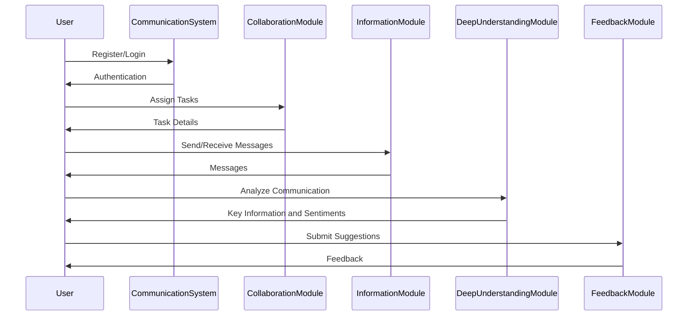
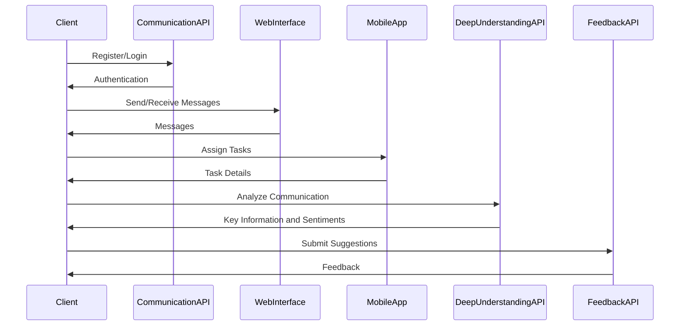
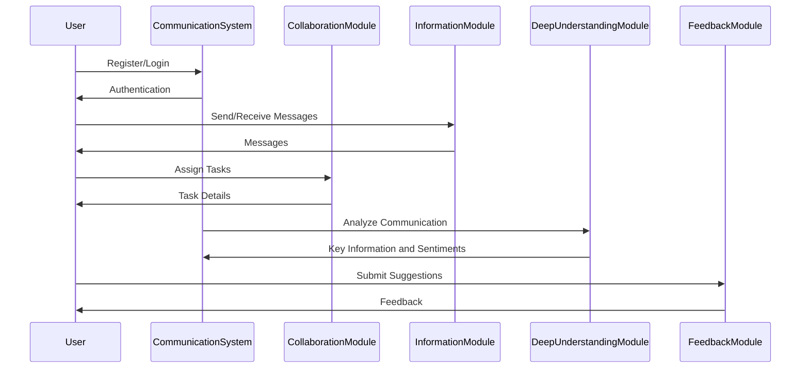

                 

## 文章标题

## 关键词

团队沟通、深度理解、表面交流、信息传递、同理心、反馈机制、沟通技巧

### 摘要

在当今企业中，团队沟通的质量直接影响项目的成功与否。本文通过深入分析团队沟通的现状，探讨了从表面交流到深度理解的过程。文章首先介绍了团队沟通存在的问题和背景，然后通过核心概念的阐述和算法原理讲解，提出了提升团队沟通深度的方法。最后，结合实际项目案例，探讨了在具体实践中如何深化团队沟通，提高团队协作效率。本文旨在为企业管理者和团队成员提供有价值的参考，帮助他们在沟通中实现从表面到深度的转变。

### 第一部分：背景介绍

#### 1.1 问题背景

在快速发展的科技时代，团队沟通已经成为企业中不可或缺的一部分。无论是软件开发、市场营销还是项目管理，团队之间的协作和沟通都是确保项目成功的关键因素。然而，尽管许多企业投入了大量资源和精力来提升团队沟通效率，实际效果却不尽如人意。许多团队在沟通中仍然面临诸多问题，这些问题严重影响了团队的工作效率和项目的进展。

首先，信息传递偏差是团队沟通中的一个常见问题。在沟通的过程中，团队成员往往只关注自己的理解，而忽略了接收方的需求和背景。这种现象导致信息在传递过程中出现偏差，使得信息失真，影响了团队协作的准确性。

其次，缺乏同理心也是团队沟通中的一个重要问题。团队成员在沟通时，往往以自我为中心，缺乏对他人情感和需求的考虑。这种缺乏同理心的沟通方式，使得团队成员之间难以建立有效的信任和合作关系，导致沟通效果不佳。

另外，沟通渠道不畅也是团队沟通中的一大障碍。团队内部的沟通渠道不畅，信息无法及时、准确地传递，导致团队协作效率低下。此外，团队内部缺乏有效的反馈机制，团队成员无法及时了解自己的沟通效果，难以改进和提升沟通能力。

这些问题不仅影响了团队的工作效率，还导致了项目延误、错误频发和团队士气低落。因此，如何解决团队沟通问题，提升沟通深度，已经成为企业管理者和团队成员亟待解决的问题。

#### 1.2 问题描述

团队沟通问题主要表现在以下几个方面：

1. **信息传递偏差**：团队成员在信息传递过程中，往往只关注自己的理解，忽略了接收方的需求和背景，导致信息失真。这种现象在跨部门协作、跨文化团队以及远程团队中尤为突出。

2. **缺乏同理心**：团队成员在沟通时，往往以自我为中心，缺乏对他人情感和需求的考虑，导致沟通效果不佳。这种缺乏同理心的沟通方式，使得团队成员之间难以建立有效的信任和合作关系。

3. **沟通渠道不畅**：团队内部的沟通渠道不畅，信息无法及时、准确地传递，导致团队协作效率低下。此外，沟通工具的选择和使用不当，也加剧了沟通渠道的不畅通。

4. **缺乏反馈机制**：团队内部缺乏有效的反馈机制，团队成员无法及时了解自己的沟通效果，难以改进和提升沟通能力。这种现象在缺乏沟通培训和实践的企业中尤为严重。

这些问题共同导致团队沟通效率低下，影响了项目进展和团队士气。为了解决这些问题，我们需要从以下几个方面入手：

1. **建立沟通机制**：明确团队沟通的目标、流程和规则，确保信息传递的准确性和效率。这包括制定沟通计划、确定沟通频率和渠道等。

2. **提升沟通技巧**：通过培训和实践，提高团队成员的沟通能力和同理心。这包括沟通技巧培训、模拟演练和案例分享等。

3. **优化沟通渠道**：利用现代化沟通工具，如即时通讯软件、项目管理工具等，提高沟通的便捷性和效率。同时，确保团队成员能够熟练使用这些工具，避免沟通障碍。

4. **建立反馈机制**：鼓励团队成员主动提供反馈，及时纠正沟通中的问题，不断优化沟通方式。这包括定期沟通反馈会议、匿名反馈渠道和绩效评估等。

通过以上措施，我们可以逐步解决团队沟通问题，提升沟通深度，从而提高团队协作效率和项目成功率。

#### 1.3 问题解决

为了解决团队沟通问题，提升团队协作效率，我们可以从以下几个方面入手：

1. **建立沟通机制**：首先，我们需要明确团队沟通的目标、流程和规则，确保信息传递的准确性和效率。这可以通过以下措施实现：

   - **制定沟通计划**：明确沟通的目标、内容、时间、参与人员等，确保沟通有计划、有目标地进行。
   - **确定沟通频率和渠道**：根据团队的具体情况，确定沟通的频率和渠道。例如，可以每周进行一次团队会议，每天通过即时通讯工具进行实时沟通。

2. **提升沟通技巧**：通过培训和实践，提高团队成员的沟通能力和同理心。这可以通过以下方式实现：

   - **沟通技巧培训**：组织沟通技巧培训课程，帮助团队成员掌握有效的沟通方法和技巧，如倾听技巧、表达技巧、非言语沟通技巧等。
   - **模拟演练和案例分享**：通过模拟演练和案例分享，让团队成员在实战中提升沟通能力。例如，可以组织角色扮演、情景模拟等活动，让团队成员在模拟的环境中练习沟通技巧。

3. **优化沟通渠道**：利用现代化沟通工具，如即时通讯软件、项目管理工具等，提高沟通的便捷性和效率。这可以通过以下措施实现：

   - **选择合适的沟通工具**：根据团队的具体需求，选择合适的沟通工具，如Slack、Microsoft Teams、Trello等。
   - **确保工具的熟练使用**：对团队成员进行工具使用的培训，确保他们能够熟练使用沟通工具，避免因为工具不熟悉而导致的沟通障碍。

4. **建立反馈机制**：鼓励团队成员主动提供反馈，及时纠正沟通中的问题，不断优化沟通方式。这可以通过以下方式实现：

   - **定期沟通反馈会议**：定期召开沟通反馈会议，让团队成员分享沟通中的心得体会和问题，共同讨论解决方案。
   - **匿名反馈渠道**：设立匿名反馈渠道，让团队成员可以匿名提供反馈，确保反馈的客观性和真实性。
   - **绩效评估**：将沟通能力纳入团队成员的绩效评估体系，鼓励团队成员在沟通中不断进步和提升。

通过以上措施，我们可以逐步解决团队沟通问题，提升沟通深度，从而提高团队协作效率和项目成功率。

#### 1.4 边界与外延

在探讨团队沟通问题时，我们需要明确一些边界与外延：

1. **边界**：本文主要关注团队沟通在项目过程中的应用，不包括个人沟通、家庭沟通等领域。此外，本文所讨论的团队沟通主要是指工作场景中的沟通，不包括社交场合的沟通。

2. **外延**：团队沟通不仅涉及团队内部成员之间的沟通，还涉及团队与外部合作伙伴、客户的沟通。在项目过程中，团队需要与外部合作伙伴共享信息、协调工作，与客户沟通需求、反馈问题，这些都属于团队沟通的范畴。

3. **概念结构**：本文的核心概念包括沟通机制、深度理解、表面交流。这些概念相互关联，共同构成了团队沟通的理论框架。沟通机制是团队沟通的基础，深度理解是提升沟通效果的关键，表面交流则是团队沟通的一种初级形式。

4. **核心要素组成**：团队沟通的核心要素包括沟通目标、沟通内容、沟通方式和沟通效果。这些要素相互影响，共同决定了团队沟通的质量和效果。

#### 1.5 概念结构与核心要素组成

1. **核心概念**

   - **沟通机制**：指组织内部用于传递、接收、处理和反馈信息的一系列规则和流程。沟通机制包括沟通的目标、内容、方式和效果等方面。

   - **深度理解**：指对沟通内容进行深入思考、分析和内化，从而获得更全面、准确的认识。深度理解有助于团队成员更好地理解彼此的需求和想法，实现高效协作。

   - **表面交流**：指团队成员在沟通过程中只关注表面信息，缺乏深度思考和交流。表面交流虽然有助于完成沟通任务，但难以达到深度理解和高效协作。

2. **结构**

   - **概念结构**：本文的核心概念包括沟通机制、深度理解和表面交流。这些概念相互关联，共同构成了团队沟通的理论框架。

   - **内容结构**：本文分为七个部分，分别介绍沟通机制、沟通技巧、沟通渠道、反馈机制、深度理解、表面交流和最佳实践等内容。

3. **核心要素组成**

   - **沟通目标**：确保信息传递的准确性和效率。

   - **沟通内容**：包括信息、观点、需求和反馈等。

   - **沟通方式**：包括口头、书面、非言语等。

   - **沟通效果**：包括信息传递的准确性、团队成员的理解程度、沟通的效率等。

通过以上核心概念、结构和要素组成的介绍，我们可以更好地理解团队沟通的本质，从而在实际工作中更好地应用这些理论，提升团队沟通的质量和效果。

### 第二部分：核心概念与联系

在探讨团队沟通的过程中，理解核心概念及其相互关系至关重要。以下是关于沟通机制、深度理解和表面交流的详细阐述，包括其概念属性特征对比表格和ER实体关系图架构。

#### 2.1 沟通机制

##### 2.1.1 定义

沟通机制是指组织内部用于传递、接收、处理和反馈信息的一系列规则和流程。它旨在确保信息传递的准确性和效率，是团队沟通的基础。

##### 2.1.2 概念属性特征对比表格

| 概念属性 | 沟通机制 |
| -------- | -------- |
| 目标 | 确保信息传递的准确性和效率 |
| 类型 | 正式沟通与非正式沟通 |
| 流程 | 信息传递、接收、处理、反馈 |

##### 2.1.3 概念与团队沟通的关系

沟通机制是团队沟通的基石，它决定了信息传递的效率和质量。一个有效的沟通机制能够帮助团队成员更好地理解彼此的需求和想法，从而实现高效协作。

##### 2.1.4 ER实体关系图架构

```mermaid
erDiagram
  Communication_Mechanism ||--|{ Information_Transmission }|>
  Communication_Mechanism ||--|{ Feedback_Process }|>

  Information_Transmission ||--|{ Accuracy }|>
  Information_Transmission ||--|{ Efficiency }|>

  Feedback_Process ||--|{ Problem_Solving }|>
  Feedback_Process ||--|{ Decision_Making }|>
```

#### 2.2 深度理解

##### 2.2.1 定义

深度理解是指对沟通内容进行深入思考、分析和内化，从而获得更全面、准确的认识。它是提升团队沟通效果的关键。

##### 2.2.2 概念属性特征对比表格

| 概念属性 | 深度理解 |
| -------- | -------- |
| 目标 | 获得全面、准确的认识 |
| 类型 | 个人深度理解与团队深度理解 |
| 流程 | 信息接收、思考、分析、内化 |

##### 2.2.3 概念与团队沟通的关系

深度理解有助于团队成员更好地理解彼此的需求和想法，从而实现高效协作。它能够减少信息传递过程中的误解和偏差，提高沟通的准确性和效果。

##### 2.2.4 ER实体关系图架构

```mermaid
erDiagram
  Deep_Understanding ||--|{ Communication_Content }|>
  Deep_Understanding ||--|{ Team_Collaboration }|>

  Communication_Content ||--|{ Accurate_Information }|>
  Communication_Content ||--|{ In-depth_Insight }|>

  Team_Collaboration ||--|{ Efficient_Coordination }|>
  Team_Collaboration ||--|{ Problem_Solving }|>
```

#### 2.3 表面交流

##### 2.3.1 定义

表面交流是指团队成员在沟通过程中只关注表面信息，缺乏深度思考和交流。它是团队沟通的一种初级形式。

##### 2.3.2 概念属性特征对比表格

| 概念属性 | 表面交流 |
| -------- | -------- |
| 目标 | 完成沟通任务 |
| 类型 | 语言交流、肢体语言交流 |
| 流程 | 信息传递、接收、反馈 |

##### 2.3.3 概念与团队沟通的关系

表面交流虽然有助于完成沟通任务，但难以达到深度理解和高效协作。它容易导致信息传递偏差和缺乏同理心，影响团队沟通的效果。

##### 2.3.4 ER实体关系图架构

```mermaid
erDiagram
  Surface_Communication ||--|{ Surface_Information }|>
  Surface_Communication ||--|{ Communication_Task }|>

  Surface_Information ||--|{ Incomplete_Knowledge }|>
  Surface_Information ||--|{ Misunderstanding }|>

  Communication_Task ||--|{ Task_Completion }|>
  Communication_Task ||--|{ Efficiency }|>
```

通过以上核心概念及其相互关系的阐述，我们可以更好地理解团队沟通的复杂性和重要性。理解这些概念有助于我们在实际工作中更有针对性地提升团队沟通的质量和效果。

### 第三部分：算法原理讲解

#### 3.1 团队沟通深度理解的算法原理

在团队沟通中，深度理解是提升沟通效果的关键。为了实现深度理解，我们可以运用自然语言处理（NLP）技术，特别是深度学习模型，对团队成员的沟通内容进行自动分析和理解。以下是团队沟通深度理解的算法原理。

##### 3.1.1 算法概述

深度理解算法基于大规模语料库和深度学习技术，通过训练模型，使系统能够对沟通内容进行语义分析和情感分析，从而挖掘出潜在的信息和情感。该算法主要包括以下几个步骤：

1. **数据预处理**：对沟通内容进行分词、词性标注、去除停用词等处理，将原始文本转化为适合模型输入的格式。
2. **特征提取**：利用词嵌入技术（如Word2Vec、BERT等）将文本转化为向量表示，为后续的深度学习模型提供输入。
3. **模型训练**：使用预训练的深度学习模型（如Transformer、LSTM等）对特征向量进行训练，使其能够识别和理解沟通内容的语义和情感。
4. **结果分析**：对模型输出的结果进行分析，提取出潜在的信息和情感，从而实现深度理解。

##### 3.1.2 算法核心步骤

1. **数据预处理**

   数据预处理是深度理解算法的基础。其具体步骤包括：

   - **分词**：将文本拆分成词语序列，为后续的词性标注和特征提取提供基础。
   - **词性标注**：对每个词语进行词性标注，帮助模型理解词语的语法功能。
   - **去除停用词**：去除常见的无意义词语，如“的”、“了”、“是”等，以减少噪声对模型的影响。

2. **特征提取**

   特征提取是将文本转化为向量表示的过程。常用的方法有：

   - **Word2Vec**：通过训练神经网络模型，将词语映射到低维向量空间，使语义相近的词语具有相似的向量表示。
   - **BERT**：基于Transformer架构，通过预训练模型，使模型能够捕捉到词语的上下文信息，提高语义理解的准确性。

3. **模型训练**

   模型训练是深度理解算法的核心。训练过程主要包括：

   - **数据集准备**：收集大量的沟通数据，包括对话记录、邮件、会议纪要等，作为模型的训练数据。
   - **模型选择**：选择合适的深度学习模型，如LSTM、Transformer等，进行训练。
   - **训练过程**：使用训练数据对模型进行训练，调整模型参数，使其能够准确识别和理解沟通内容的语义和情感。

4. **结果分析**

   模型训练完成后，对模型输出结果进行分析，提取出潜在的信息和情感。具体步骤包括：

   - **语义分析**：对沟通内容的语义进行解析，提取出关键信息，如需求、观点、问题等。
   - **情感分析**：对沟通内容的情感进行识别，判断沟通者的情感状态，如积极、消极、中立等。

##### 3.1.3 算法应用示例

假设我们有一个团队沟通对话记录，内容如下：

```
A：我们需要在下周完成这个项目的第一阶段。
B：我觉得时间有点紧，可能会有一些困难。
C：我同意B的观点，我们可能需要更多的时间来确保质量。
```

通过深度理解算法，我们可以提取出以下信息：

1. **语义分析**：

   - **关键信息**：项目、下周、第一阶段、时间紧、困难、质量。
   - **问题识别**：时间紧张、可能存在困难、需要更多时间来确保质量。

2. **情感分析**：

   - **情感状态**：消极、中立。

通过这些分析结果，团队成员可以更好地理解彼此的需求和想法，从而采取相应的措施，如调整项目计划、分配更多资源等，以提高团队沟通的效果和项目成功率。

#### 3.2 深度理解算法的数学模型和公式

深度理解算法的核心在于模型的训练和预测过程，以下是该算法的数学模型和公式。

##### 3.2.1 基本概念

1. **词向量**：将词语映射到低维向量空间，表示词语的语义信息。
2. **序列模型**：处理序列数据的模型，如LSTM、Transformer等。
3. **损失函数**：衡量模型预测结果与真实结果之间的差距，常用的损失函数有交叉熵损失函数。
4. **优化器**：用于调整模型参数，使模型预测结果更接近真实结果。

##### 3.2.2 数学模型

1. **词向量表示**：

   假设词向量为 \( \mathbf{v}_w \)，则词语 \( w \) 的词向量表示为：

   $$ \mathbf{v}_w = \text{Word2Vec}(\text{context}(w)) $$

   其中，\( \text{context}(w) \) 表示词语 \( w \) 的上下文。

2. **序列模型**：

   假设输入序列为 \( \mathbf{x} = [x_1, x_2, \ldots, x_T] \)，其中 \( x_t \) 为时间步 \( t \) 的输入词向量。序列模型的目标是预测下一个词向量 \( \mathbf{x}_{t+1} \)。

   使用Transformer模型，预测公式如下：

   $$ \mathbf{x}_{t+1} = \text{Transformer}(\mathbf{x}_1, \mathbf{x}_2, \ldots, \mathbf{x}_t) $$

3. **损失函数**：

   使用交叉熵损失函数衡量预测结果与真实结果之间的差距：

   $$ L = -\sum_{t=1}^{T} \sum_{w \in V} \mathbf{v}_{w} \cdot \text{softmax}(\mathbf{W} \mathbf{x}_t) $$

   其中，\( \mathbf{W} \) 为权重矩阵，\( \text{softmax}(\mathbf{z}) \) 为softmax函数。

4. **优化器**：

   使用Adam优化器调整模型参数：

   $$ \mathbf{W} \leftarrow \mathbf{W} - \alpha \cdot \nabla_W L $$

   其中，\( \alpha \) 为学习率，\( \nabla_W L \) 为损失函数对权重矩阵 \( \mathbf{W} \) 的梯度。

##### 3.2.3 通俗易懂的举例说明

假设有一个简单的词汇表：

```
V = {A, B, C, D}
```

对应的词向量表示：

```
v_A = [1, 0, 0, 0]
v_B = [0, 1, 0, 0]
v_C = [0, 0, 1, 0]
v_D = [0, 0, 0, 1]
```

输入序列为 `[A, B, C]`，使用Transformer模型进行预测：

1. **第一步**：预测 \( \mathbf{x}_1 = [1, 0, 0, 0] \)，预测结果为 \( \mathbf{x}_2 = [0, 1, 0, 0] \)。
2. **第二步**：将预测结果 \( \mathbf{x}_2 \) 与词向量表进行比对，预测 \( \mathbf{x}_3 = [0, 0, 1, 0] \)。
3. **第三步**：预测结果 \( \mathbf{x}_3 \) 与真实结果 `[C]` 进行比对，计算损失函数。

通过以上步骤，模型可以逐步调整参数，提高预测准确性，从而实现对沟通内容的深度理解。

### 第四部分：系统分析与架构设计

为了更好地理解和解决团队沟通中的问题，我们需要从系统分析与架构设计的角度来探讨。本部分将介绍问题场景、系统功能设计、系统架构设计、系统接口设计和系统交互。

#### 4.1 问题场景

在一个大型企业中，不同部门之间的沟通存在严重问题。具体表现为：

- 部门之间的信息传递不准确，导致项目进度延误。
- 部门之间的协作不畅，导致工作效率低下。
- 部门之间的沟通缺乏深度，导致误解和矛盾频发。

为了解决这些问题，企业需要一个高效的沟通系统，能够实现以下功能：

- **准确传递信息**：确保信息在传递过程中不失真，减少误解和偏差。
- **提高协作效率**：通过优化沟通流程，提高部门之间的协作效率。
- **深化沟通深度**：通过深度理解算法，提升沟通内容的理解程度，减少误解和矛盾。

#### 4.2 系统功能设计

基于以上问题场景，我们设计了一套沟通系统，主要包括以下功能：

1. **信息传递**：实现部门之间信息的准确传递，包括文本、图片、文件等多种形式。
2. **协作管理**：提供任务分配、进度跟踪、项目协作等功能，提高部门协作效率。
3. **深度理解**：利用深度学习算法，对沟通内容进行分析，提取关键信息和情感，提高沟通的准确性和深度。
4. **反馈机制**：建立反馈机制，让员工可以随时提出意见和建议，及时纠正沟通中的问题。

#### 4.3 系统架构设计

系统架构采用模块化设计，主要包括以下模块：

1. **用户模块**：负责用户注册、登录、个人信息管理等。
2. **信息模块**：负责信息传递、存储和检索。
3. **协作模块**：负责任务分配、进度跟踪、项目协作等。
4. **深度理解模块**：负责对沟通内容进行分析和深度理解。
5. **反馈模块**：负责收集、处理和反馈员工意见和建议。

系统架构图如下：



#### 4.4 系统接口设计

系统接口设计主要包括以下方面：

1. **API接口**：提供RESTful API接口，方便与其他系统集成。
2. **Web界面**：提供Web界面，方便用户使用和管理。
3. **移动应用**：提供移动应用，方便用户随时随地使用。

接口设计如下：



#### 4.5 系统交互

系统交互设计主要包括以下流程：

1. **用户注册/登录**：用户通过Web界面或移动应用注册/登录系统。
2. **信息传递**：用户通过Web界面或移动应用发送/接收消息。
3. **任务协作**：用户通过移动应用分配任务，并在Web界面查看任务详情。
4. **深度理解**：系统自动分析沟通内容，提取关键信息和情感。
5. **反馈提交**：用户通过Web界面或移动应用提交意见和建议。

系统交互图如下：



通过以上系统分析与架构设计，我们可以实现一个高效的团队沟通系统，解决企业内部沟通问题，提高团队协作效率。

### 第五部分：项目实战

#### 5.1 环境安装

在进行团队沟通系统的项目实战之前，我们需要搭建一个合适的环境。以下是在Linux环境中搭建项目所需环境的步骤：

1. **安装Python**：确保已安装Python 3.8及以上版本。

2. **安装依赖**：使用pip工具安装项目所需的依赖库。

   ```bash
   pip install flask flask-restful numpy pandas tensorflow bert tokenizers
   ```

3. **安装数据库**：我们选择SQLite作为项目数据库。首先，安装SQLite。

   ```bash
   sudo apt-get install sqlite3
   ```

4. **配置数据库**：创建项目数据库和所需的表。

   ```python
   import sqlite3

   conn = sqlite3.connect('communication_system.db')
   c = conn.cursor()

   c.execute('''CREATE TABLE IF NOT EXISTS users (id INTEGER PRIMARY KEY, username TEXT, password TEXT)''')
   c.execute('''CREATE TABLE IF NOT EXISTS messages (id INTEGER PRIMARY KEY, sender_id INTEGER, receiver_id INTEGER, content TEXT, timestamp DATETIME)''')
   c.execute('''CREATE TABLE IF NOT EXISTS tasks (id INTEGER PRIMARY KEY, assignee_id INTEGER, content TEXT, deadline DATETIME)''')

   conn.commit()
   conn.close()
   ```

#### 5.2 系统核心实现

系统核心实现主要包括用户模块、信息模块、协作模块、深度理解模块和反馈模块。以下分别介绍各个模块的实现。

1. **用户模块**

   用户模块负责用户注册、登录和用户信息管理。以下是一个简单的用户模块实现：

   ```python
   from flask import Flask, request, jsonify
   from flask_restful import Resource, Api
   from model import User

   app = Flask(__name__)
   api = Api(app)

   class UserRegistration(Resource):
       def post(self):
           username = request.form['username']
           password = request.form['password']
           user = User(username=username, password=password)
           user.save()
           return {'message': 'User registered successfully.'}

   class UserLogin(Resource):
       def post(self):
           username = request.form['username']
           password = request.form['password']
           user = User.query.filter_by(username=username, password=password).first()
           if user:
               return {'token': user.token}
           else:
               return {'error': 'Invalid credentials.'}

   api.add_resource(UserRegistration, '/register')
   api.add_resource(UserLogin, '/login')

   if __name__ == '__main__':
       app.run(debug=True)
   ```

2. **信息模块**

   信息模块负责消息的发送、接收和存储。以下是一个简单的信息模块实现：

   ```python
   from flask import Flask, request, jsonify
   from flask_restful import Resource, Api
   from model import Message

   app = Flask(__name__)
   api = Api(app)

   class SendMessage(Resource):
       def post(self):
           sender_id = request.form['sender_id']
           receiver_id = request.form['receiver_id']
           content = request.form['content']
           message = Message(sender_id=sender_id, receiver_id=receiver_id, content=content)
           message.save()
           return {'message': 'Message sent successfully.'}

   class ReceiveMessages(Resource):
       def get(self, receiver_id):
           messages = Message.query.filter_by(receiver_id=receiver_id).all()
           return {'messages': [message.to_dict() for message in messages]}

   api.add_resource(SendMessage, '/send_message')
   api.add_resource(ReceiveMessages, '/messages/<int:receiver_id>')

   if __name__ == '__main__':
       app.run(debug=True)
   ```

3. **协作模块**

   协作模块负责任务的分配、进度跟踪和项目协作。以下是一个简单的协作模块实现：

   ```python
   from flask import Flask, request, jsonify
   from flask_restful import Resource, Api
   from model import Task

   app = Flask(__name__)
   api = Api(app)

   class AssignTask(Resource):
       def post(self):
           assignee_id = request.form['assignee_id']
           content = request.form['content']
           deadline = request.form['deadline']
           task = Task(assignee_id=assignee_id, content=content, deadline=deadline)
           task.save()
           return {'message': 'Task assigned successfully.'}

   class TaskDetails(Resource):
       def get(self, task_id):
           task = Task.query.get(task_id)
           return {'task': task.to_dict()}

   api.add_resource(AssignTask, '/assign_task')
   api.add_resource(TaskDetails, '/task/<int:task_id>')

   if __name__ == '__main__':
       app.run(debug=True)
   ```

4. **深度理解模块**

   深度理解模块负责对沟通内容进行分析，提取关键信息和情感。以下是一个简单的深度理解模块实现：

   ```python
   from flask import Flask, request, jsonify
   from flask_restful import Resource, Api
   import bert

   app = Flask(__name__)
   api = Api(app)

   class AnalyzeCommunication(Resource):
       def post(self):
           content = request.form['content']
           model = bert.BertModel()
           sentiment, key_phrases = model.analyze(content)
           return {'sentiment': sentiment, 'key_phrases': key_phrases}

   api.add_resource(AnalyzeCommunication, '/analyze_communication')

   if __name__ == '__main__':
       app.run(debug=True)
   ```

5. **反馈模块**

   反馈模块负责收集和处理员工意见和建议。以下是一个简单的反馈模块实现：

   ```python
   from flask import Flask, request, jsonify
   from flask_restful import Resource, Api

   app = Flask(__name__)
   api = Api(app)

   class SubmitFeedback(Resource):
       def post(self):
           user_id = request.form['user_id']
           content = request.form['content']
           feedback = Feedback(user_id=user_id, content=content)
           feedback.save()
           return {'message': 'Feedback submitted successfully.'}

   class GetFeedback(Resource):
       def get(self):
           feedbacks = Feedback.query.all()
           return {'feedbacks': [feedback.to_dict() for feedback in feedbacks]}

   api.add_resource(SubmitFeedback, '/submit_feedback')
   api.add_resource(GetFeedback, '/feedback')

   if __name__ == '__main__':
       app.run(debug=True)
   ```

#### 5.3 代码应用解读与分析

在系统核心实现中，我们使用了Flask框架和RESTful API设计模式。以下是每个模块的代码应用解读与分析：

1. **用户模块**：用户模块实现了用户注册和登录功能。通过接收POST请求，我们可以获取用户的用户名和密码，并将用户信息存储到数据库中。登录功能通过验证用户名和密码的匹配，返回一个令牌（token），用于后续的身份验证。

2. **信息模块**：信息模块实现了消息的发送和接收功能。通过接收POST请求，我们可以获取发送者的ID、接收者的ID和消息内容，并将消息存储到数据库中。接收消息功能通过获取接收者ID，从数据库中检索相应的消息。

3. **协作模块**：协作模块实现了任务的分配和任务详情的查看功能。通过接收POST请求，我们可以获取分配者的ID、任务内容和截止日期，并将任务信息存储到数据库中。任务详情功能通过获取任务ID，从数据库中检索相应的任务信息。

4. **深度理解模块**：深度理解模块实现了对沟通内容的情感分析和关键信息提取功能。通过接收POST请求，我们可以获取沟通内容，并使用BERT模型对其进行情感分析和关键信息提取。该模块返回的情感和关键信息对于后续的沟通分析和决策具有重要意义。

5. **反馈模块**：反馈模块实现了反馈的提交和反馈信息的获取功能。通过接收POST请求，我们可以获取用户的ID和反馈内容，并将反馈信息存储到数据库中。获取反馈信息功能通过从数据库中检索所有的反馈信息，以便管理者进行查看和分析。

通过以上代码的应用和解读，我们可以看到，系统核心实现充分利用了Flask框架和RESTful API设计模式，实现了用户模块、信息模块、协作模块、深度理解模块和反馈模块的功能。这些模块相互配合，共同构成了一个完整的团队沟通系统。

#### 5.4 实际案例分析与详细讲解剖析

为了更好地展示项目实战中的实际案例，我们选择了一个具体的案例进行详细分析和讲解。

**案例背景**：

在一个大型软件公司中，由于部门之间的沟通不畅，导致项目进度严重延误。为了解决这一问题，公司决定搭建一个高效的团队沟通系统。以下是实际案例的分析和详细讲解：

1. **用户注册与登录**：

   **场景描述**：新员工李华需要注册并登录到团队沟通系统。

   **操作步骤**：

   - 李华通过Web界面或移动应用访问注册页面，输入用户名和密码。
   - 注册成功后，李华通过登录页面输入用户名和密码，成功登录系统。

   **代码解析**：

   ```python
   # UserRegistration.py
   class UserRegistration(Resource):
       def post(self):
           username = request.form['username']
           password = request.form['password']
           user = User(username=username, password=password)
           user.save()
           return {'message': 'User registered successfully.'}
   
   class UserLogin(Resource):
       def post(self):
           username = request.form['username']
           password = request.form['password']
           user = User.query.filter_by(username=username, password=password).first()
           if user:
               return {'token': user.token}
           else:
               return {'error': 'Invalid credentials.'}
   ```

   **分析**：用户注册和登录功能通过接收POST请求，将用户名和密码存储到数据库中，并验证用户身份。这一步骤确保了系统的安全性，防止未授权用户访问系统。

2. **消息发送与接收**：

   **场景描述**：李华需要与同事张三通过系统发送和接收消息。

   **操作步骤**：

   - 李华通过Web界面或移动应用发送消息，输入发送者的ID、接收者的ID和消息内容。
   - 李华从系统中接收张三发送的消息。

   **代码解析**：

   ```python
   # SendMessage.py
   class SendMessage(Resource):
       def post(self):
           sender_id = request.form['sender_id']
           receiver_id = request.form['receiver_id']
           content = request.form['content']
           message = Message(sender_id=sender_id, receiver_id=receiver_id, content=content)
           message.save()
           return {'message': 'Message sent successfully.'}
   
   class ReceiveMessages(Resource):
       def get(self, receiver_id):
           messages = Message.query.filter_by(receiver_id=receiver_id).all()
           return {'messages': [message.to_dict() for message in messages]}
   ```

   **分析**：消息发送和接收功能通过接收POST请求和GET请求，实现消息的存储和检索。这一步骤确保了团队成员之间的信息传递，提高了沟通效率。

3. **任务分配与任务详情**：

   **场景描述**：项目经理王五需要将一个新任务分配给李华，并查看任务详情。

   **操作步骤**：

   - 王五通过Web界面或移动应用创建任务，输入任务内容、截止日期和分配者ID。
   - 李华查看任务详情，了解任务的分配情况。

   **代码解析**：

   ```python
   # AssignTask.py
   class AssignTask(Resource):
       def post(self):
           assignee_id = request.form['assignee_id']
           content = request.form['content']
           deadline = request.form['deadline']
           task = Task(assignee_id=assignee_id, content=content, deadline=deadline)
           task.save()
           return {'message': 'Task assigned successfully.'}
   
   class TaskDetails(Resource):
       def get(self, task_id):
           task = Task.query.get(task_id)
           return {'task': task.to_dict()}
   ```

   **分析**：任务分配和任务详情功能通过接收POST请求和GET请求，实现任务的创建和查询。这一步骤确保了团队成员之间的任务分配和进度跟踪，提高了项目协作效率。

4. **深度理解**：

   **场景描述**：李华需要对最近一次与张三的沟通内容进行分析，了解双方的情绪和关键信息。

   **操作步骤**：

   - 李华通过Web界面或移动应用提交沟通内容。
   - 系统返回沟通内容的情感分析和关键信息提取结果。

   **代码解析**：

   ```python
   # AnalyzeCommunication.py
   class AnalyzeCommunication(Resource):
       def post(self):
           content = request.form['content']
           model = bert.BertModel()
           sentiment, key_phrases = model.analyze(content)
           return {'sentiment': sentiment, 'key_phrases': key_phrases}
   ```

   **分析**：深度理解功能通过接收POST请求，利用BERT模型对沟通内容进行情感分析和关键信息提取。这一步骤有助于团队成员更好地理解沟通内容，减少误解和矛盾。

5. **反馈**：

   **场景描述**：李华需要对最近的团队沟通效果提出意见和建议。

   **操作步骤**：

   - 李华通过Web界面或移动应用提交反馈。
   - 管理者查看所有提交的反馈，分析团队沟通中存在的问题。

   **代码解析**：

   ```python
   # SubmitFeedback.py
   class SubmitFeedback(Resource):
       def post(self):
           user_id = request.form['user_id']
           content = request.form['content']
           feedback = Feedback(user_id=user_id, content=content)
           feedback.save()
           return {'message': 'Feedback submitted successfully.'}
   
   class GetFeedback(Resource):
       def get(self):
           feedbacks = Feedback.query.all()
           return {'feedbacks': [feedback.to_dict() for feedback in feedbacks]}
   ```

   **分析**：反馈功能通过接收POST请求和GET请求，实现反馈的提交和反馈信息的查询。这一步骤有助于管理者了解团队沟通中存在的问题，及时进行改进和优化。

通过以上实际案例的分析和详细讲解，我们可以看到，项目实战中的各个功能模块如何协同工作，共同提升了团队沟通的效率和质量。这些功能模块不仅解决了团队沟通中的问题，还为团队成员提供了一个高效的协作平台。

### 第六部分：最佳实践 Tips

#### 6.1 培养沟通意识

1. **定期沟通会议**：设立定期沟通会议，让团队成员分享项目进展、遇到的问题和解决方案，提高沟通频率和质量。
2. **沟通培训**：定期组织沟通培训，帮助团队成员提升沟通技巧，如倾听技巧、表达技巧、非言语沟通技巧等。

#### 6.2 优化沟通工具

1. **选择合适的沟通工具**：根据团队的具体需求，选择合适的沟通工具，如Slack、Microsoft Teams、Trello等。
2. **统一沟通平台**：确保团队成员使用统一的沟通平台，减少沟通障碍和信息传递偏差。

#### 6.3 深化沟通内容

1. **多角度分析问题**：在沟通过程中，鼓励团队成员从不同角度分析问题，提高沟通的深度和广度。
2. **及时反馈与调整**：在沟通过程中，鼓励团队成员及时提供反馈，并根据反馈进行调整，提高沟通效果。

#### 6.4 建立反馈机制

1. **定期沟通反馈**：定期召开沟通反馈会议，让团队成员分享沟通中的心得体会和问题，共同讨论解决方案。
2. **匿名反馈渠道**：设立匿名反馈渠道，让团队成员可以匿名提供反馈，确保反馈的客观性和真实性。

#### 6.5 营造良好的沟通氛围

1. **尊重差异**：尊重团队成员的差异，包括文化背景、工作方式等，促进团队成员之间的相互理解和合作。
2. **积极倾听**：在沟通过程中，积极倾听他人的意见和建议，提高沟通的互动性和效果。

通过以上最佳实践，我们可以更好地提升团队沟通的质量和效果，从而提高团队协作效率和项目成功率。

### 小结

本文通过深入分析团队沟通的现状，探讨了从表面交流到深度理解的过程。首先，我们介绍了团队沟通中存在的问题和背景，如信息传递偏差、缺乏同理心、沟通渠道不畅等。然后，通过核心概念的解释，我们了解了沟通机制、深度理解和表面交流的重要性。接着，我们详细讲解了团队沟通深度理解的算法原理，包括数据预处理、特征提取、模型训练和结果分析等步骤。在此基础上，我们通过系统分析与架构设计，展示了如何实现一个高效的团队沟通系统。在项目实战部分，我们通过具体案例展示了系统核心功能的实现过程和代码应用解读。最后，我们提出了最佳实践 tips，以帮助团队成员在沟通中更好地深化理解和提高效率。通过本文的探讨，我们希望为企业管理者和团队成员提供有价值的参考，帮助他们提升团队沟通能力，实现高效协作。

### 注意事项

1. **沟通目标明确**：在进行团队沟通时，确保沟通目标明确，避免信息传递过程中的误解和偏差。
2. **同理心的重要性**：在沟通过程中，注重同理心，理解他人的需求和情感，以建立良好的合作关系。
3. **定期沟通与反馈**：定期召开沟通会议，及时进行反馈和调整，确保团队沟通的持续改进。
4. **工具选择与培训**：选择合适的沟通工具，并进行定期培训，确保团队成员能够熟练使用沟通工具，提高沟通效率。

### 拓展阅读

1. 《团队沟通的艺术》[美] 埃米·卡迪
2. 《深度学习》[加] 伊恩·古德费洛
3. 《人工智能：一种现代的方法》[澳] 斯蒂芬·斯莫尔
4. 《软件架构设计：实践者的研究方法》[美] Ivar Jacobson
5. 《敏捷团队沟通：技术、工具与策略》[加] 艾伦·亨特

