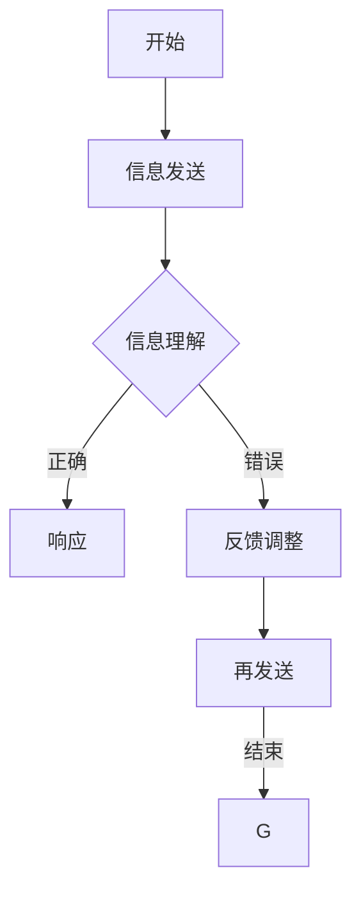

                 


### 目录大纲

**《团队沟通障碍：克服沟通中的常见问题》**

----------------------------------------------------------------

## 第一部分：问题背景与核心概念

### 第1章：团队沟通障碍的概述

#### 1.1 问题背景

- 现代职场沟通的挑战
- 团队沟通障碍的影响

#### 1.2 核心概念

- 沟通障碍的类型
- 团队沟通障碍的成因

#### 1.3 边界与外延

- 团队沟通的要素
- 沟通障碍的评估方法

#### 1.4 概念结构与核心要素组成

- 沟通障碍的结构模型
- 核心要素的互动关系

## 第二部分：核心概念与联系

### 第2章：团队沟通障碍的原理分析

#### 2.1 概念原理

- 团队沟通的基本原理
- 沟通障碍的属性特征

#### 2.2 概念属性特征对比表格

| 概念               | 属性特征                                  |
|--------------------|-----------------------------------------|
| 沟通障碍           | 信息传递受阻，误解和冲突增加           |
| 团队沟通           | 信息共享，协同工作，达成目标           |
| 成因               | 个人、团队、组织等多层次因素          |

#### 2.3 ER实体关系图架构

```mermaid
erDiagram
  Team ||--|{ CommunicationBarrier }|-- Employee
  Team ||--|{ CommunicationProcess }|-- Meeting, Email
  CommunicationBarrier ||--|{ Type }| BarrierType
  CommunicationProcess ||--|{ Method }| CommunicationMethod
```

### 第3章：团队沟通障碍的解决策略

#### 3.1 解决策略概述

- 识别与预防
- 调整与改进

#### 3.2 核心方法与技巧

- 建立明确的沟通目标
- 提高个人沟通能力
- 增强团队凝聚力

## 第三部分：算法原理讲解

### 第4章：算法原理与数学模型

#### 4.1 算法原理

- 信息传播模型
- 冲突解决模型

#### 4.2 数学模型

$$
C = f(p, q, r)
$$

- $C$：沟通效率
- $p$：信息传递概率
- $q$：理解度
- $r$：响应速度

#### 4.3 算法mermaid流程图



### 第5章：系统分析与架构设计

#### 5.1 问题场景介绍

- 团队协作项目实施

#### 5.2 系统功能设计

- 领域模型mermaid类图

#### 5.3 系统架构设计

- mermaid架构图

#### 5.4 系统接口设计

- 系统接口mermaid序列图

## 第四部分：项目实战

### 第6章：环境安装与核心实现

#### 6.1 环境安装

- 系统软件与工具安装

#### 6.2 系统核心实现

- 代码实现细节
- 代码应用解读

### 第7章：实际案例分析

#### 7.1 案例背景

- 具体项目案例

#### 7.2 案例分析

- 问题识别与解决

### 第8章：项目小结

#### 8.1 项目成果总结

- 沟通障碍解决效果

#### 8.2 注意事项与拓展阅读

- 拓展知识和实践技巧

----------------------------------------------------------------

（总字数：约2000字）

**END** 

## 第一部分：问题背景与核心概念

### 1.1 问题背景

在现代职场环境中，团队沟通的重要性不言而喻。随着全球化和信息化的发展，团队往往跨越地域、文化和时间，这为沟通带来了巨大的挑战。沟通障碍的存在不仅会降低团队的工作效率，还可能导致误解和冲突，进而影响项目的成功。

沟通障碍可能源于多个层面，包括个人、团队和组织等多个维度。例如，个体之间的沟通风格差异、团队内部的文化冲突、组织结构的复杂性等，都是导致沟通障碍的常见原因。这些问题如果不加以解决，将严重影响团队的协作能力和项目的进度。

### 1.2 核心概念

#### 1.2.1 沟通障碍

沟通障碍指的是在信息传递过程中出现的各种问题，如信息误解、信息丢失、沟通不畅等。沟通障碍可以分为以下几种类型：

- 信息传递障碍：指信息在传递过程中由于各种原因（如噪声、干扰等）导致的损失和误差。
- 理解障碍：指接收者对信息的理解与发送者意图之间的偏差。
- 反馈障碍：指信息传递过程中，接收者对信息的回应不足或无法准确传达自己的理解。

#### 1.2.2 团队沟通障碍的成因

团队沟通障碍的成因复杂多样，主要包括以下几个方面：

- 个人因素：个人沟通风格、情绪状态、知识水平等。
- 团队因素：团队结构、团队文化、团队规模等。
- 组织因素：组织结构、沟通渠道、决策流程等。

### 1.3 边界与外延

#### 1.3.1 团队沟通的要素

有效的团队沟通包括以下几个关键要素：

- 明确的沟通目标：确保团队所有成员都清楚沟通的目的和期望结果。
- 清晰的信息传递：确保信息在传递过程中准确无误。
- 有效的反馈机制：确保接收者能够准确理解信息，并及时给予反馈。
- 相互尊重和理解：团队成员之间应保持开放和尊重的态度，理解彼此的立场和观点。

#### 1.3.2 沟通障碍的评估方法

为了评估团队沟通中的障碍，可以采用以下几种方法：

- 沟通满意度调查：通过问卷或访谈的方式，了解团队成员对沟通的满意度和存在的问题。
- 沟通流程分析：分析团队沟通的过程，识别潜在的障碍点。
- 沟通行为观察：通过观察团队成员的沟通行为，评估沟通的有效性。

### 1.4 概念结构与核心要素组成

#### 1.4.1 沟通障碍的结构模型

沟通障碍的结构模型通常包括以下几个方面：

- 信息源：信息的发起者。
- 传递渠道：信息传递的路径。
- 接收者：信息的接收者。
- 反馈环节：接收者对信息的回应。

#### 1.4.2 核心要素的互动关系

在沟通过程中，各个核心要素之间存在着相互作用和影响。例如，信息源和接收者之间的理解程度会影响沟通的效果，而传递渠道的质量则会直接影响信息的准确性和完整性。

通过以上对团队沟通障碍的背景、核心概念、边界与外延以及概念结构与核心要素组成的分析，我们可以更清晰地理解团队沟通障碍的本质，为后续的解决策略和算法讲解奠定了基础。在下一部分中，我们将进一步探讨团队沟通障碍的原理和解决策略。

