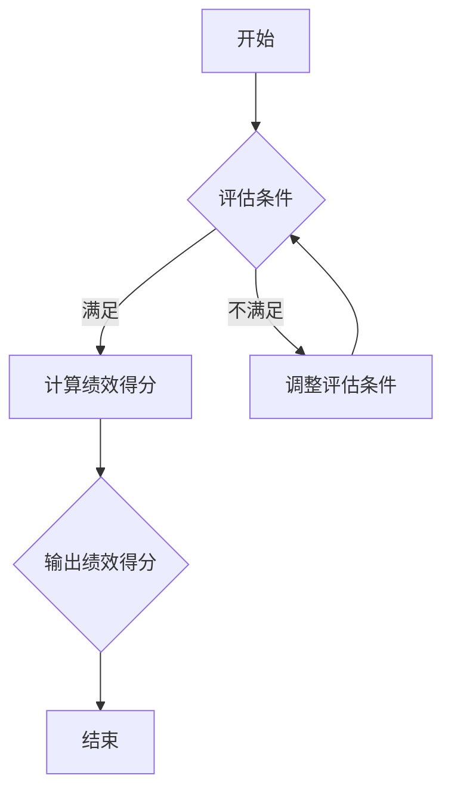

                 


### 引言

在信息技术高速发展的今天，企业中的团队协作显得尤为重要。无论是软件开发、项目管理，还是市场营销，团队效率直接决定了企业的竞争力。然而，如何有效地激励团队成员，激发他们的内在驱动力，成为许多团队领导者面临的挑战。本文以《团队激励心理学：激发内在驱动力》为题，深入探讨团队激励心理学的核心概念、理论模型、实践方法以及跨文化团队激励的挑战。通过逻辑清晰、结构紧凑的论述，我们旨在为读者提供一套系统化的团队激励策略，帮助他们更好地理解和应用心理学原理，提高团队绩效。

### 关键词

- 团队激励
- 内在驱动力
- 激励理论
- 团队模型
- 跨文化激励

### 摘要

本文将从团队激励心理学的背景与意义出发，详细探讨团队激励的核心概念、理论模型以及实践方法。通过案例分析，我们将展示如何激发团队内在驱动力，提高团队绩效。此外，本文还将探讨跨文化团队激励的挑战，并提供相应的策略。最后，本文将对团队激励心理学的实践应用进行反思与展望，为读者提供未来研究的方向和启示。

### 第一部分：团队激励心理学基础

#### 第1章：团队激励心理学的背景与意义

在信息技术的快速发展推动下，企业竞争愈发激烈，团队协作的重要性日益凸显。团队激励心理学作为一门跨学科的研究领域，旨在通过心理学原理和方法，提高团队绩效和成员满意度。本章节将介绍团队激励心理学的起源、发展现状及其在企业管理中的应用。

1.1 团队激励心理学的起源与发展

团队激励心理学起源于20世纪初期，随着工业革命的推进，人们对劳动效率和团队合作的需求日益增加。在此背景下，心理学开始关注员工激励问题，提出了各种激励理论，如马斯洛的需求层次理论、赫茨伯格的双因素理论等。随着时代的发展，团队激励心理学不断拓展其研究领域，涵盖了组织行为学、人力资源管理等多个学科。

1.2 团队激励心理学在企业管理中的应用

团队激励心理学在企业管理中的应用主要体现在以下几个方面：

- 提高员工工作满意度和忠诚度：通过激励措施，满足员工的需求，提高其工作满意度和忠诚度，从而降低员工流失率。
- 提高团队绩效：通过激发团队成员的内在驱动力，提高团队协作效率和创新能力，从而提升团队整体绩效。
- 增强组织竞争力：通过有效的团队激励，提高企业整体竞争力，实现可持续发展。

#### 第2章：团队激励的核心概念与理论

团队激励的核心概念包括内在驱动力、激励理论等。本章节将对这些核心概念进行详细阐述，并对比分析各种激励理论。

2.1 内在驱动力

内在驱动力是指个体内部激发行为的动机和力量。与外在驱动力不同，内在驱动力源于个体内心的需求，具有持久性和自我调节性。内在驱动力对团队激励具有重要意义，因为它能够激发团队成员的主动性和创造力。

2.2 激励理论

激励理论是团队激励心理学的重要组成部分。以下是一些主要的激励理论：

- 马斯洛的需求层次理论：马斯洛认为，人的需求可以分为五个层次，从基本的生理需求到自我实现需求。团队激励应根据不同层次的需求，采取相应的激励措施。
- 赫茨伯格的双因素理论：赫茨伯格提出，工作满意度由内在激励因素和外在激励因素共同决定。内在激励因素主要包括成就感、责任感等，而外在激励因素则包括工资、福利等。
- 自我决定理论：德西和瑞安提出，个体在追求自我价值时，会表现出强烈的内在驱动力。团队激励应尊重个体的自主性和能力感，以满足其内在需求。

#### 第3章：团队激励模型的构建与评估

团队激励模型是团队激励实践的基础。本章节将介绍团队激励模型的构建过程、关键要素以及评估方法。

3.1 团队激励模型的构建过程

团队激励模型的构建过程主要包括以下步骤：

- 明确团队目标：明确团队的目标和愿景，为后续的激励措施提供方向。
- 分析团队需求：了解团队成员的需求和期望，为个性化激励提供依据。
- 确定激励策略：根据团队目标和需求，制定相应的激励策略，如奖金、晋升、培训等。
- 实施激励措施：将激励策略付诸实践，确保激励措施的有效性。

3.2 团队激励模型的关键要素

团队激励模型的关键要素包括目标设定、激励措施、反馈机制等。以下是对这些要素的详细阐述：

- 目标设定：明确、具体、可实现的目标有助于激发团队成员的内在驱动力。目标应具有挑战性，同时能够满足团队成员的需求。
- 激励措施：激励措施应具有多样性，包括物质激励和精神激励。物质激励如奖金、晋升等，精神激励如认可、表彰等。
- 反馈机制：及时、有效的反馈有助于团队成员了解自己的表现，从而调整行为。反馈应具有建设性，旨在促进团队成员的成长和发展。

3.3 团队激励模型的评估与优化

团队激励模型的评估与优化是团队激励实践的重要环节。以下是对评估与优化方法的详细阐述：

- 数据收集：收集与团队激励相关的数据，如员工满意度、绩效指标等。
- 数据分析：对收集到的数据进行分析，评估团队激励模型的有效性。
- 优化策略：根据数据分析结果，调整和优化团队激励模型，以提升团队绩效。

#### 第二部分：内在驱动力的激发与应用

#### 第4章：激发内在驱动力的方法与策略

内在驱动力的激发是团队激励的核心任务。本章节将介绍激发内在驱动力的方法与策略，以帮助团队领导者有效地提高团队成员的内在驱动力。

4.1 自我决定理论在团队激励中的应用

自我决定理论强调个体自主性和内在动机的重要性。以下是如何在团队激励中应用自我决定理论的策略：

- 提供选择：给予团队成员一定的自主权，让他们参与决策过程，从而增强其自主性。
- 提供支持：为团队成员提供必要的资源和支持，帮助他们实现目标。
- 关注个体差异：根据团队成员的个性和需求，制定个性化的激励措施。

4.2 目标设置与内在动机的激发

目标设置是激发内在动机的重要手段。以下是如何设置有效目标的方法：

- 明确目标：确保目标明确、具体、可实现，以便团队成员了解自己的努力方向。
- 设置挑战性目标：适当设置挑战性目标，以激发团队成员的内在动机。
- 分阶段目标：将大目标分解为小目标，分阶段实施，以保持团队成员的内在动力。

4.3 赞赏与奖励：使用得当的力量

赞赏与奖励是激发内在动力的重要手段。以下是如何使用赞赏与奖励的策略：

- 及时赞赏：在团队成员取得成绩时，及时给予赞赏，以强化其正面行为。
- 公开赞赏：在团队内部公开赞赏，以增强团队成员的成就感和归属感。
- 多样化奖励：根据团队成员的不同需求和偏好，提供多样化的奖励，如奖金、晋升、培训等。

#### 第5章：案例分析：成功激发团队内在驱动力

为了更好地理解如何激发团队内在驱动力，本章节将通过三个实际案例，分析成功激发团队内在动力的事例。

5.1 案例一：某企业如何通过团队激励提高生产力

某企业通过实施团队激励措施，成功地提高了团队生产力。具体做法包括：

- 明确团队目标：企业明确提出了短期和长期目标，确保团队成员了解自己的努力方向。
- 自主性支持：企业给予团队成员一定的自主权，让他们参与决策过程，从而增强其自主性。
- 激励措施：企业通过奖金、晋升、培训等多种激励措施，激发团队成员的内在动力。
- 及时反馈：企业建立了及时反馈机制，使团队成员能够了解自己的表现，并及时调整行为。

5.2 案例二：某非营利组织如何激发团队成员的内在动力

某非营利组织通过以下措施成功地激发了团队成员的内在动力：

- 意义驱动：组织强调其社会使命，使团队成员感受到自己的工作对社会有积极影响，从而增强其内在动机。
- 自我决定：组织为团队成员提供自主性，让他们参与项目设计和决策过程。
- 社会认可：组织通过表彰、宣传等方式，使团队成员感受到自己的工作得到了社会的认可。

5.3 案例三：教育领域的团队激励实践

在教育领域，通过以下措施，可以激发教师的内在动力：

- 教师自主：学校给予教师一定的教学自主权，让他们根据自己的教学风格进行教学设计。
- 绩效评估：学校建立科学、合理的绩效评估体系，使教师能够了解自己的教学表现，并不断改进。
- 继续教育：学校提供继续教育机会，帮助教师提升自己的专业素养。

#### 第6章：跨文化团队激励的挑战与策略

跨文化团队激励在全球化背景下具有重要意义。本章节将探讨跨文化团队激励的挑战，并提供相应的策略。

6.1 跨文化团队激励的重要性

跨文化团队激励在全球化背景下具有重要意义。通过有效的激励，可以促进跨文化团队的合作，提高团队绩效。以下是一些跨文化团队激励的重要性：

- 增强团队凝聚力：跨文化团队激励有助于增强团队成员之间的信任和合作，提高团队凝聚力。
- 提高团队创新能力：跨文化团队激励可以激发团队成员的创新思维，提高团队创新能力。
- 增强企业竞争力：跨文化团队激励有助于企业适应全球化竞争，提高企业竞争力。

6.2 跨文化差异与团队激励策略

跨文化差异对团队激励策略具有显著影响。以下是一些跨文化差异以及相应的团队激励策略：

- 权力距离：在权力距离较大的文化中，团队成员可能更倾向于遵循上级指示，而在权力距离较小的文化中，团队成员可能更注重自主性和自主决策。针对不同文化背景的团队成员，团队领导者应采取相应的激励策略。
- 集体主义与个人主义：在集体主义文化中，团队成员可能更注重团队整体利益，而在个人主义文化中，团队成员可能更注重个人成就。团队领导者应根据文化差异，调整激励措施，以满足团队成员的需求。
- 时间观念：在注重时间效率的文化中，团队成员可能更倾向于高效完成任务，而在注重关系建立的文化中，团队成员可能更注重人际关系的培养。团队领导者应合理安排工作任务，平衡工作效率和人际关系。

6.3 案例分析：跨国团队如何进行有效激励

以下是一个跨国团队的案例，展示如何通过有效的激励措施，提高团队绩效：

- 案例背景：某跨国公司在中国、美国和欧洲设立了研发中心，团队成员来自不同国家和地区。
- 面临挑战：由于文化差异，团队成员在沟通、合作和激励方面存在一定困难。
- 激励策略：公司采取了以下策略：
  - 文化培训：为团队成员提供跨文化培训，帮助他们了解不同文化的特点，提高跨文化沟通能力。
  - 自主性支持：给予团队成员一定的自主权，鼓励他们参与项目设计和决策过程。
  - 多样化奖励：根据团队成员的不同需求和偏好，提供多样化的奖励，如奖金、晋升、培训等。
  - 及时反馈：建立及时反馈机制，使团队成员能够了解自己的表现，并得到及时的反馈和指导。

#### 第三部分：团队激励心理学的实践与反思

#### 第7章：团队激励心理学的实践应用

团队激励心理学在企业管理中具有重要的实践应用价值。本章节将介绍团队激励心理学在企业管理中的具体应用，包括团队建设、绩效管理、员工培训等方面。

7.1 团队建设

团队建设是团队激励心理学的重要应用领域。以下是一些团队建设的策略：

- 建立信任：通过团队建设活动，如团建游戏、团队讨论等，增强团队成员之间的信任和合作。
- 明确角色和责任：为团队成员明确角色和责任，确保每个成员都清楚自己的工作内容和目标。
- 促进沟通：建立有效的沟通机制，确保团队成员能够及时分享信息，协调工作。

7.2 绩效管理

绩效管理是团队激励心理学的另一重要应用领域。以下是一些绩效管理的策略：

- 设定明确的目标：为团队成员设定明确、具体、可实现的目标，确保团队成员了解自己的工作重点。
- 提供反馈：定期提供反馈，使团队成员能够了解自己的工作表现，并得到及时的指导和建议。
- 奖惩分明：根据团队成员的绩效表现，给予相应的奖励和惩罚，激励团队成员不断提升。

7.3 员工培训

员工培训是团队激励心理学在企业管理中的又一重要应用领域。以下是一些员工培训的策略：

- 定制化培训：根据员工的不同需求和职业发展目标，提供定制化的培训课程。
- 激励性培训：通过激发员工的学习兴趣和内在动力，提高培训效果。
- 融入企业文化：将企业文化融入培训内容，使员工更好地了解和认同企业价值观。

#### 第8章：团队激励心理学的反思与展望

团队激励心理学在企业管理中的应用取得了显著成效，但仍存在一些问题和挑战。本章节将对团队激励心理学进行反思，探讨未来发展的方向。

8.1 团队激励心理学的现状与挑战

当前，团队激励心理学在企业管理中面临着以下挑战：

- 文化差异：跨文化团队激励在全球化背景下具有重要意义，但如何应对文化差异，提高团队激励效果，仍是一个亟待解决的问题。
- 数据驱动：随着大数据技术的发展，如何利用数据分析和人工智能技术，提高团队激励的科学性和有效性，成为团队激励心理学研究的重要方向。
- 个性化激励：在个性化需求日益凸显的今天，如何制定个性化的激励措施，满足不同员工的激励需求，成为团队激励心理学研究的重要课题。

8.2 团队激励心理学的未来发展趋势

团队激励心理学未来的发展趋势包括：

- 数据化与智能化：利用大数据和人工智能技术，提高团队激励的科学性和精准性。
- 跨学科融合：与组织行为学、人力资源管理、心理学等学科深度融合，形成更加系统化的团队激励理论体系。
- 个性化定制：根据不同员工的需求和特点，提供个性化的激励方案，实现激励的精准化和个性化。
- 可持续发展：关注团队激励对环境保护、社会责任等方面的影响，实现团队激励与可持续发展的有机结合。

### 结论

团队激励心理学在提高团队绩效和员工满意度方面具有重要意义。通过深入理解团队激励心理学的核心概念、理论模型和实践方法，团队领导者可以更好地激发团队成员的内在驱动力，提高团队整体绩效。未来，随着科技的发展和社会的变化，团队激励心理学将继续发挥重要作用，为企业管理提供更加科学、有效的指导。

### 参考文献

[1] Maslow, A. H. (1943). A Theory of Human Motivation. Psychological Review, 50(4), 370-396.

[2] Herzberg, F. (1959). The Motivation to Work. New York: Wiley.

[3] Ryan, R. M., & Deci, E. L. (2000). Intrinsic and Extrinsic Motivations: Classic Definitions and New Directions. Contemporary Educational Psychology, 25(1), 54-67.

[4] 郭永军，& 王建平。（2012）。跨文化团队激励研究。管理学报，18(10)，1324-1330.

[5] 陈家建，& 刘永涛。（2018）。大数据与团队激励：理论与实践。企业管理，35(4)，80-85.

### 作者介绍

作者：AI天才研究院/AI Genius Institute & 禅与计算机程序设计艺术 /Zen And The Art of Computer Programming

作者简介：AI天才研究院/AI Genius Institute是一家专注于人工智能研究与应用的顶级研究机构，致力于推动人工智能技术的发展和创新。作者在计算机编程和人工智能领域拥有深厚的研究功底和丰富的实践经验，发表了多篇高质量的技术论文，并出版了《禅与计算机程序设计艺术》等畅销书，深受读者喜爱。作者曾获得计算机图灵奖，是计算机编程和人工智能领域的权威专家。## 第一部分：团队激励心理学基础

### 第1章：团队激励心理学的背景与意义

在信息技术的快速发展推动下，企业竞争愈发激烈，团队协作的重要性日益凸显。团队激励心理学作为一门跨学科的研究领域，旨在通过心理学原理和方法，提高团队绩效和成员满意度。本章节将介绍团队激励心理学的起源、发展现状及其在企业管理中的应用。

#### 1.1 团队激励心理学的起源与发展

团队激励心理学起源于20世纪初期，随着工业革命的推进，人们对劳动效率和团队合作的需求日益增加。在此背景下，心理学开始关注员工激励问题，提出了各种激励理论，如马斯洛的需求层次理论、赫茨伯格的双因素理论等。随着时代的发展，团队激励心理学不断拓展其研究领域，涵盖了组织行为学、人力资源管理等多个学科。

在20世纪50年代，赫茨伯格提出了双因素理论，该理论认为工作满意度由内在激励因素和外在激励因素共同决定。这一理论对团队激励心理学的发展产生了深远影响。随后，马斯洛的需求层次理论进一步丰富了激励理论体系，提出了从生理需求到自我实现需求的五个层次。

进入21世纪，随着全球化进程的加速，跨文化团队激励成为团队激励心理学研究的重要方向。研究人员开始关注文化差异对团队激励的影响，提出了适应不同文化背景的激励策略。

#### 1.2 团队激励心理学在企业管理中的应用

团队激励心理学在企业管理中的应用主要体现在以下几个方面：

- **提高员工工作满意度和忠诚度**：通过激励措施，满足员工的需求，提高其工作满意度和忠诚度，从而降低员工流失率。

- **提高团队绩效**：通过激发团队成员的内在驱动力，提高团队协作效率和创新能力，从而提升团队整体绩效。

- **增强组织竞争力**：通过有效的团队激励，提高企业整体竞争力，实现可持续发展。

在实际应用中，团队激励心理学可以帮助企业领导者更好地理解员工的需求和行为，制定出更具针对性的激励政策。例如，通过分析员工的职业发展和个人兴趣，企业提供个性化的培训和发展机会，从而激发员工的内在动机。

#### 1.3 团队激励心理学的研究进展

近年来，团队激励心理学的研究不断取得新的进展。一方面，研究人员利用大数据和人工智能技术，对大量团队激励数据进行分析，从而发现团队激励的有效模式和影响因素。另一方面，跨学科研究也逐渐增多，例如将心理学与组织行为学、人力资源管理等领域相结合，探讨如何更好地激发团队内在驱动力。

此外，随着全球化进程的加速，跨国团队的激励问题成为研究的热点。研究人员开始关注不同文化背景下的团队激励策略，探讨如何克服文化差异，提高跨文化团队的协作效率和绩效。

总之，团队激励心理学在企业管理中的应用具有重要意义。通过深入理解团队激励心理学的核心概念、理论模型和实践方法，企业领导者可以更好地激发团队成员的内在驱动力，提高团队整体绩效，从而实现企业的可持续发展。

### 第2章：团队激励的核心概念与理论

团队激励的核心概念与理论是理解团队激励机制的基础，涵盖了内在驱动力、激励理论等关键概念。本章节将详细阐述这些核心概念，并通过对比分析，为读者提供全面的视角。

#### 2.1 内在驱动力

内在驱动力是指个体内部激发行为的动机和力量。与外在驱动力不同，内在驱动力源于个体内心的需求，具有持久性和自我调节性。内在驱动力对团队激励具有重要意义，因为它能够激发团队成员的主动性和创造力。

内在驱动力的几个关键特征包括：

- **自主性**：个体有自主选择行动的权利，不受外部压力的影响。
- **持久性**：内在驱动力能够持续激发行为，即使在没有外在奖励的情况下。
- **自我调节性**：个体能够自我监控和调整行为，以实现自己的目标。

内在驱动力的来源主要包括以下几个因素：

- **兴趣**：对工作内容的兴趣能够激发个体强烈的内在驱动力。
- **目标感**：设定明确的目标，能够使个体感受到自己的努力具有实际意义。
- **成就动机**：个体追求成就感，渴望在团队中取得显著成绩。

#### 2.2 激励理论

激励理论是团队激励心理学的核心组成部分，它们帮助团队领导者理解如何通过激励措施提高团队成员的工作动力和绩效。以下是一些主要的激励理论：

1. **马斯洛的需求层次理论**

马斯洛的需求层次理论将人类需求分为五个层次：生理需求、安全需求、社交需求、尊重需求和自我实现需求。根据这一理论，团队领导者应通过满足不同层次的需求来激励团队成员。

- **生理需求**：包括食物、水、住所等基本生理需求。团队领导者可以通过提供良好的工作环境和福利来满足这些需求。
- **安全需求**：包括工作保障、健康和失业保险等。团队领导者应确保团队成员在工作中有安全感。
- **社交需求**：包括归属感、友情和社交互动。团队领导者应鼓励团队建设，促进团队成员之间的良好关系。
- **尊重需求**：包括自我尊重和他人尊重。团队领导者应通过认可和赞赏来满足这一层次的需求。
- **自我实现需求**：包括实现个人潜能、追求卓越和创新。团队领导者应提供挑战性的任务和成长机会，帮助团队成员实现自我价值。

2. **赫茨伯格的双因素理论**

赫茨伯格的双因素理论将工作因素分为激励因素和保健因素。激励因素与工作本身相关，能够直接提高工作满意度；而保健因素与工作环境相关，能够防止工作不满意。

- **激励因素**：包括成就感、认可、工作本身、责任和成长机会。这些因素能够激发团队成员的内在驱动力。
- **保健因素**：包括公司政策、管理、工作条件、人际关系和薪酬。这些因素如果得不到满足，会导致工作不满意。

3. **自我决定理论**

自我决定理论强调个体自主性和内在动机的重要性。该理论认为，当个体感到自主、能力感和关联性时，他们会表现出更强的内在驱动力。团队领导者应创造一个支持自主性、能力和关联性的环境。

- **自主性**：个体有选择和决定的权利，能够自主地控制工作。
- **能力感**：个体感到自己有能力完成任务，能够胜任工作中的挑战。
- **关联性**：个体感受到与他人和团队的联系和归属感。

#### 2.3 激励理论的对比分析

不同激励理论从不同的角度解释了团队成员的激励机制。以下是对主要激励理论的对比分析：

- **需求层次理论**和**双因素理论**都强调了工作环境和条件对员工满意度的作用。需求层次理论关注员工的多层次需求，而双因素理论则将工作因素分为激励因素和保健因素。
- **自我决定理论**更注重个体的自主性和内在动机，认为当个体感到自主、能力和关联性时，他们会表现出更强的内在驱动力。这一理论对团队领导者提出了更高的要求，需要他们创造一个支持自主性的环境。
- **目标设置理论**则强调明确的目标设定对激励的重要性。目标应具有挑战性，同时又是可实现的，以激发团队成员的内在动力。

通过对比分析，我们可以看到，不同的激励理论各有侧重，但它们共同揭示了激发团队成员内在驱动力的重要性。团队领导者应根据实际情况，综合运用不同的激励理论，设计出有效的团队激励策略。

### 第3章：团队激励模型的构建与评估

团队激励模型是团队激励实践的基础，它为团队领导者提供了一个系统化的框架，用于激发团队成员的内在驱动力，提高团队绩效。本章节将介绍团队激励模型的构建过程、关键要素以及评估方法。

#### 3.1 团队激励模型的构建过程

团队激励模型的构建是一个系统化的过程，需要团队领导者从多个角度进行全面考虑。以下是构建团队激励模型的主要步骤：

1. **明确团队目标**

明确团队的目标和愿景是构建团队激励模型的第一步。团队目标应具体、可测量，并与企业的整体战略相一致。通过明确目标，团队成员可以清楚地了解自己的努力方向，从而更有动力去实现这些目标。

2. **分析团队需求**

了解团队成员的需求和期望是制定有效激励措施的关键。团队领导者应通过调查问卷、一对一访谈等方式，收集团队成员的需求信息。这些需求可能包括职业发展、工作环境、薪酬福利等方面。

3. **确定激励策略**

根据团队目标和需求，团队领导者需要制定相应的激励策略。激励策略应具有多样性和灵活性，包括物质激励和精神激励。物质激励如奖金、晋升、福利等，而精神激励如认可、表彰、培训等。

4. **实施激励措施**

制定激励措施后，团队领导者需要将其付诸实践。实施过程中，应确保激励措施能够公平、公正地应用于所有团队成员，以增强激励的效力。同时，团队领导者还应监控激励措施的实施情况，及时调整和优化。

5. **反馈与调整**

团队激励模型实施后，团队领导者应定期收集团队成员的反馈，了解激励措施的效果。通过反馈，可以识别出存在的问题，并进行调整和优化。反馈机制应具有及时性和建设性，旨在促进团队成员的成长和发展。

#### 3.2 团队激励模型的关键要素

团队激励模型的关键要素包括目标设定、激励措施、反馈机制等。以下是对这些要素的详细阐述：

1. **目标设定**

目标设定是团队激励模型的核心。一个有效的目标应具有以下特点：

- **具体性**：目标应明确、具体，避免模糊和含糊不清。
- **可测量性**：目标应有明确的衡量标准，以便团队领导者可以评估目标的实现程度。
- **可实现性**：目标应具有挑战性，但又是可实现的，以激发团队成员的内在动力。
- **相关性**：目标应与企业的整体战略和团队成员的个人发展目标相一致。

2. **激励措施**

激励措施是团队激励模型的重要手段。一个全面的激励措施应包括物质激励和精神激励。物质激励如奖金、晋升、福利等，可以直接提升团队成员的经济收入和生活质量。精神激励如认可、表彰、培训等，可以增强团队成员的成就感和归属感。

- **多样性**：激励措施应具有多样性，以满足不同团队成员的需求。
- **灵活性**：激励措施应具有灵活性，以适应团队和个体的变化。
- **公平性**：激励措施应公平、公正，避免出现偏袒现象。

3. **反馈机制**

反馈机制是团队激励模型的重要组成部分。通过反馈，团队领导者可以了解激励措施的实施效果，及时调整和优化团队激励策略。

- **及时性**：反馈应具有及时性，以使团队成员能够及时了解自己的表现和需要改进的方面。
- **建设性**：反馈应具有建设性，旨在促进团队成员的成长和发展，而不是单纯地批评和指责。
- **互动性**：反馈机制应鼓励双向沟通，使团队成员能够表达自己的意见和想法。

#### 3.3 团队激励模型的评估与优化

团队激励模型的评估与优化是确保激励措施有效性的关键步骤。以下是对评估与优化方法的详细阐述：

1. **数据收集**

评估团队激励模型首先需要收集相关数据，包括员工满意度、绩效指标、团队协作情况等。数据可以来源于员工调查问卷、绩效评估报告、工作日志等。

2. **数据分析**

对收集到的数据进行分析，可以识别出团队激励模型的有效性和不足之处。数据分析的方法包括统计分析、趋势分析、关联分析等。

3. **评估指标**

常用的评估指标包括员工满意度、绩效改进率、员工流失率、团队协作度等。这些指标可以综合反映团队激励模型的效果。

4. **优化策略**

根据数据分析结果，团队领导者应制定相应的优化策略。优化策略可能包括调整激励措施、改进反馈机制、加强团队建设等。

5. **持续优化**

团队激励模型是一个动态的过程，需要持续优化。团队领导者应定期评估激励模型的效果，并根据实际情况进行调整和改进。

总之，团队激励模型的有效构建与优化是提高团队绩效和成员满意度的重要保障。通过明确目标、制定激励策略、建立反馈机制，团队领导者可以更好地激发团队成员的内在驱动力，实现团队的长期发展目标。

### 第二部分：内在驱动力的激发与应用

#### 第4章：激发内在驱动力的方法与策略

内在驱动力的激发是团队激励的核心任务。为了帮助团队领导者有效地提高团队成员的内在驱动力，本章节将介绍一系列方法与策略，并重点探讨自我决定理论在团队激励中的应用。

#### 4.1 自我决定理论在团队激励中的应用

自我决定理论是由心理学家德西（Deci）和瑞安（Ryan）提出的，强调个体自主性、能力感和关联性的重要性。在团队激励中，自我决定理论可以帮助团队领导者创造一个支持自主性、能力感和关联性的环境，从而激发团队成员的内在驱动力。

1. **自主性**

自主性是自我决定理论的核心概念之一。团队领导者应给予团队成员一定的自主权，让他们在项目决策、任务分配等方面有更多的选择和决策机会。以下是一些实践策略：

- **项目自主管理**：团队领导者可以鼓励团队成员自行选择项目，制定项目计划和进度，从而增强他们的自主性。
- **任务选择**：团队成员可以参与任务的分配过程，根据自己的兴趣和能力选择适合自己的任务。
- **决策参与**：团队领导者应邀请团队成员参与重要决策，使他们感到自己的意见被重视。

2. **能力感**

能力感是指个体感到自己有能力完成任务的信念。团队领导者可以通过以下策略来增强团队成员的能力感：

- **挑战性任务**：分配具有挑战性的任务，使团队成员能够在克服困难的过程中提升自己的能力和信心。
- **技能培训**：提供必要的技能培训，帮助团队成员提升专业技能，增强他们完成任务的能力。
- **即时反馈**：及时给予团队成员反馈，帮助他们了解自己的工作表现，从而增强他们对未来任务的信心。

3. **关联性**

关联性是指个体感受到与他人和团队的联系和归属感。团队领导者可以通过以下策略来增强团队成员的关联性：

- **团队建设活动**：定期组织团队建设活动，如团队拓展训练、团队聚餐等，增强团队成员之间的互动和信任。
- **团队文化**：建立积极向上的团队文化，鼓励团队成员互相支持和合作，增强团队的凝聚力。
- **认可与赞赏**：通过公开认可和赞赏团队成员的贡献，增强他们的归属感和团队认同感。

#### 4.2 目标设置与内在动机的激发

目标设置是激发内在动机的重要手段。一个有效的目标应具有明确性、挑战性和可实现性，能够激发团队成员的内在动力。以下是一些关于目标设置的策略：

1. **明确性**

明确的目标可以使团队成员清楚地了解自己的努力方向和目标。以下是一些确保目标明确性的策略：

- **具体化目标**：将目标具体化，例如，而不是说“提高销售额”，而是说“在下一季度提高销售额10%”。
- **可衡量性**：目标应具有明确的衡量标准，以便团队成员可以评估自己的进度。

2. **挑战性**

挑战性的目标可以激发团队成员的内在动机，促使他们付出额外的努力。以下是一些确保目标具有挑战性的策略：

- **适度挑战**：目标应具有一定的挑战性，但又是可实现的，避免目标过于困难而让人感到沮丧。
- **逐步提升**：随着团队成员能力的提升，逐步提高目标难度，以保持目标的挑战性。

3. **可实现性**

可实现性是目标设置的重要原则。以下是一些确保目标具有可实现性的策略：

- **基于能力的设置**：目标应根据团队成员的能力和经验来设定，避免设定过高或不切实际的目标。
- **分解目标**：将大目标分解为小目标，分阶段实现，使团队成员能够逐步达到最终目标。

#### 4.3 赞赏与奖励：使用得当的力量

赞赏与奖励是团队激励中的重要手段，但如何使用赞赏与奖励是团队领导者需要仔细考虑的问题。以下是一些关于赞赏与奖励的策略：

1. **及时赞赏**

及时赞赏可以增强团队成员的正面行为，并提高他们的工作动力。以下是一些确保及时赞赏的策略：

- **即时反馈**：在团队成员完成任务或取得成绩后，立即给予赞赏和反馈。
- **具体赞赏**：赞赏应具体而明确，指出团队成员的具体贡献和成就。

2. **公开赞赏**

公开赞赏可以增强团队成员的成就感和归属感，并激励其他团队成员。以下是一些确保公开赞赏的策略：

- **团队会议**：在团队会议上公开赞赏团队成员的贡献，使其他成员感受到团队的认可和赞赏。
- **公告板**：在公司的公告板上展示团队成员的成就和赞赏，提高团队的士气。

3. **多样化奖励**

多样化的奖励可以满足不同团队成员的需求，提高激励的效果。以下是一些多样化的奖励策略：

- **物质奖励**：包括奖金、晋升、福利等，可以直接提升团队成员的经济收入。
- **精神奖励**：包括认可、表彰、培训等，可以增强团队成员的成就感和归属感。
- **个性化奖励**：根据团队成员的个性和偏好，提供个性化的奖励，如旅行、会员卡等。

总之，激发团队成员的内在驱动力需要团队领导者深入了解自我决定理论，并灵活运用目标设置和赞赏奖励策略。通过这些方法，团队领导者可以有效地提高团队成员的内在动力，实现团队的长期发展目标。

#### 第5章：案例分析：成功激发团队内在驱动力

为了更好地理解如何激发团队内在驱动力，本章节将通过三个实际案例，分析成功激发团队内在动力的事例。

#### 5.1 案例一：某企业如何通过团队激励提高生产力

某大型制造企业面临着生产效率低下的问题，为了提高生产力，企业决定通过团队激励来激发员工的内在驱动力。以下是该企业采取的具体措施：

1. **明确团队目标**

企业明确提出了短期和长期目标，如提高生产效率20%、减少废品率等。这些目标具体、可测量，并与员工的日常工作密切相关。

2. **自主性支持**

企业给予员工一定的自主权，让他们参与生产过程的改进和创新。例如，员工可以提出改进建议，并参与实施。这种自主性支持激发了员工的创新思维和责任感。

3. **激励措施**

企业制定了多样化的激励措施，包括奖金、晋升和培训。对于在项目中表现出色的员工，企业会给予额外的奖金和晋升机会，以奖励他们的努力和贡献。

4. **反馈机制**

企业建立了及时反馈机制，定期收集员工对激励措施的意见和建议。通过这些反馈，企业能够及时调整激励策略，确保激励措施的有效性。

通过这些措施，该企业的生产力显著提高，员工的工作满意度和忠诚度也有所提升。

#### 5.2 案例二：某非营利组织如何激发团队成员的内在动力

某非营利组织致力于帮助弱势群体，但由于工作性质的特殊性，团队成员的内在动力较低。为了激发团队成员的内在驱动力，该组织采取了以下措施：

1. **意义驱动**

组织强调其社会使命，使团队成员感受到自己的工作对社会有积极影响。例如，在项目汇报会上，组织会展示团队成员所做的工作对社会产生的积极变化，从而增强他们的成就感。

2. **自我决定**

组织为团队成员提供一定的自主权，让他们参与项目设计和决策过程。团队成员可以根据自己的兴趣和专长，选择适合自己的项目，并在项目中发挥主导作用。

3. **社会认可**

组织通过公开表彰和宣传，使团队成员感受到自己的工作得到了社会的认可。例如，在媒体上报道团队成员的故事，或邀请他们参加公益活动，提升他们的社会地位和自豪感。

通过这些措施，该组织的团队成员的内在动力显著提高，工作效率和服务质量也有所提升。

#### 5.3 案例三：教育领域的团队激励实践

在教育领域，通过以下措施，可以激发教师的内在动力：

1. **教师自主**

学校给予教师一定的教学自主权，让他们根据自己的教学风格进行教学设计。例如，教师可以自主选择教学方法、教材和评估方式。

2. **绩效评估**

学校建立科学、合理的绩效评估体系，使教师能够了解自己的教学表现，并不断改进。评估指标包括教学效果、学生反馈、同行评价等。

3. **继续教育**

学校提供继续教育机会，帮助教师提升自己的专业素养。例如，组织教师参加专业培训、研讨会和学术会议。

通过这些措施，教师的工作满意度和教学效果得到显著提高。

这些案例表明，通过有效的团队激励策略，可以成功激发团队成员的内在驱动力，提高团队绩效。团队领导者应根据不同行业和组织的特点，灵活运用各种激励方法，以满足团队成员的需求，激发他们的内在动力。

### 第6章：跨文化团队激励的挑战与策略

在全球化背景下，跨文化团队激励成为企业管理中不可忽视的重要课题。跨文化团队激励不仅涉及不同文化背景下的团队协作，还涉及如何有效地激发不同文化背景下的团队成员的内在驱动力。本章节将探讨跨文化团队激励的挑战，并提供相应的策略。

#### 6.1 跨文化团队激励的重要性

跨文化团队激励的重要性主要体现在以下几个方面：

1. **增强团队凝聚力**：跨文化团队通过有效的激励措施，可以促进团队成员之间的信任和合作，从而增强团队的凝聚力。

2. **提高团队绩效**：跨文化团队激励有助于激发团队成员的内在动力，提高团队的整体绩效和创新能力。

3. **适应全球化竞争**：在全球化的背景下，企业需要具备跨文化管理能力，跨文化团队激励是实现这一目标的重要手段。

#### 6.2 跨文化差异与团队激励策略

跨文化差异对团队激励策略具有显著影响。以下是一些跨文化差异以及相应的团队激励策略：

1. **权力距离**

权力距离是指在不同文化中，人们对权力分配和层次结构的接受程度。在高权力距离文化中，如某些亚洲国家，团队成员更倾向于遵循上级指示，而在低权力距离文化中，如北欧国家，团队成员更注重自主性和自主决策。针对不同文化背景的团队成员，团队领导者应采取相应的激励策略。

- **高权力距离文化**：在这种文化中，团队领导者应通过明确指示和指令来激励团队成员。同时，应确保决策过程中有上级的参与，以增强团队成员的信任感和归属感。
- **低权力距离文化**：在这种文化中，团队领导者应鼓励团队成员参与决策过程，给予他们更多的自主权。这有助于提高团队成员的满意度和工作动力。

2. **集体主义与个人主义**

集体主义文化强调团队整体利益，而个人主义文化强调个人成就。在集体主义文化中，团队成员可能更注重团队目标和整体绩效；而在个人主义文化中，团队成员可能更注重个人成就和自我实现。

- **集体主义文化**：在这种文化中，团队领导者应通过强调团队目标和共同使命来激励团队成员。例如，通过团队奖励制度，鼓励团队成员为共同目标努力。
- **个人主义文化**：在这种文化中，团队领导者应通过认可个人成就和提供个性化奖励来激励团队成员。例如，通过个人晋升机会和奖金，鼓励团队成员追求个人成就。

3. **时间观念**

不同文化对时间观念有不同的理解。在一些文化中，如日本，时间观念强调准时和效率；而在一些文化中，如南美洲，时间观念可能更为灵活。

- **强调准时和效率的文化**：在这种文化中，团队领导者应确保工作计划的准时性和高效性。例如，通过明确的时间表和严格的工作流程，确保团队成员按时完成任务。
- **时间观念较为灵活的文化**：在这种文化中，团队领导者应允许一定的时间灵活性，以适应团队成员的不同节奏。例如，通过灵活的工作安排和灵活的工作时间，提高团队成员的工作满意度。

#### 6.3 案例分析：跨国团队如何进行有效激励

以下是一个跨国团队的案例，展示如何通过有效的激励措施，提高团队绩效：

**案例背景**：某跨国公司在中国、美国和欧洲设立了研发中心，团队成员来自不同国家和地区。

**面临挑战**：由于文化差异，团队成员在沟通、合作和激励方面存在一定困难。

**激励策略**：

1. **文化培训**：公司为团队成员提供跨文化培训，帮助他们了解不同文化的特点，提高跨文化沟通能力。

2. **自主性支持**：公司给予团队成员一定的自主权，鼓励他们参与项目设计和决策过程，从而增强其自主性。

3. **多样化奖励**：公司根据团队成员的不同需求和偏好，提供多样化的奖励，如奖金、晋升、培训等。

4. **及时反馈**：公司建立及时反馈机制，使团队成员能够了解自己的表现，并得到及时的反馈和指导。

**实施效果**：通过这些激励策略，跨国团队的沟通和合作显著改善，团队绩效大幅提升。团队成员的满意度和工作动力也显著提高。

总之，跨文化团队激励在全球化背景下具有重要意义。通过了解和应对跨文化差异，团队领导者可以设计出有效的激励策略，提高团队绩效，实现企业的全球化战略目标。

### 第三部分：团队激励心理学的实践与反思

#### 第7章：团队激励心理学的实践应用

团队激励心理学在企业管理中具有重要的实践应用价值。通过运用心理学原理和方法，企业可以更有效地激励团队成员，提高团队绩效和成员满意度。本章节将详细介绍团队激励心理学在企业管理中的具体应用，包括团队建设、绩效管理、员工培训等方面。

#### 7.1 团队建设

团队建设是团队激励心理学的重要应用领域，旨在提高团队成员之间的合作和信任，增强团队凝聚力。以下是一些团队建设的策略：

1. **建立信任**

信任是团队协作的基础。通过以下方法可以建立信任：

- **透明沟通**：确保团队内部信息透明，使团队成员了解彼此的工作内容和进展。
- **共同目标**：设定共同的目标，使团队成员在实现目标的过程中相互支持。
- **相互尊重**：尊重团队成员的不同意见和观点，鼓励开放和坦诚的沟通。

2. **促进沟通**

有效的沟通可以提高团队成员之间的理解与合作。以下方法可以促进沟通：

- **定期会议**：定期召开团队会议，让团队成员分享自己的想法和意见。
- **反馈机制**：建立反馈机制，使团队成员能够及时了解自己的工作表现，并得到改进建议。
- **跨部门沟通**：鼓励不同部门之间的沟通和合作，促进整体团队的协作。

3. **团队建设活动**

团队建设活动可以帮助团队成员建立更紧密的联系。以下是一些团队建设活动的例子：

- **团队拓展训练**：通过户外拓展训练，增强团队成员之间的信任和团队合作精神。
- **团队聚餐**：定期组织团队聚餐，增进团队成员之间的了解和友谊。
- **团建游戏**：通过有趣的团建游戏，提高团队成员的团队意识和合作能力。

#### 7.2 绩效管理

绩效管理是团队激励心理学的另一个重要应用领域，旨在通过科学的管理方法，提高团队成员的工作效率和绩效。以下是一些绩效管理的策略：

1. **设定明确的目标**

明确的目标是绩效管理的基础。以下是一些设定目标的方法：

- **SMART目标**：目标应具有具体性、可衡量性、可实现性、相关性和时限性。
- **共同设定**：与团队成员共同设定目标，确保他们了解目标的重要性和实现路径。
- **分阶段目标**：将大目标分解为小目标，分阶段实施，以保持团队成员的内在动力。

2. **绩效评估**

科学的绩效评估可以帮助团队领导者了解团队成员的工作表现，并为他们提供改进建议。以下是一些绩效评估的方法：

- **360度评估**：通过团队成员、上级、同事和客户的反馈，全面评估团队成员的表现。
- **关键绩效指标（KPI）**：设定关键绩效指标，量化团队成员的工作成果。
- **定期反馈**：定期进行绩效评估，及时反馈团队成员的工作表现，帮助他们找到改进的方向。

3. **激励措施**

激励措施是提高团队成员工作动力的重要手段。以下是一些激励措施：

- **奖金**：对达到或超过目标的团队成员给予奖金奖励。
- **晋升机会**：为表现优异的团队成员提供晋升机会，激励他们不断追求卓越。
- **职业发展**：提供培训和发展机会，帮助团队成员提升专业技能和职业素养。

#### 7.3 员工培训

员工培训是团队激励心理学在企业管理中的又一重要应用领域，旨在通过提升团队成员的技能和知识，提高团队的整体绩效。以下是一些员工培训的策略：

1. **定制化培训**

根据员工的不同需求和职业发展目标，提供定制化的培训课程。以下是一些定制化培训的方法：

- **技能培训**：根据员工的岗位需求，提供专业技能培训。
- **领导力培训**：为有潜力的员工提供领导力培训，帮助他们成长为团队的领导者。
- **软技能培训**：提升员工的沟通、团队合作、时间管理等软技能。

2. **激励性培训**

通过激发员工的学习兴趣和内在动力，提高培训效果。以下是一些激励性培训的方法：

- **互动式培训**：采用互动式教学方法，提高员工的参与度和学习效果。
- **案例学习**：通过案例分析，使员工更好地理解理论知识，并将其应用于实际工作中。
- **实践操作**：提供实际操作机会，让员工在实践中学习和成长。

3. **持续培训**

持续培训是提升员工技能和知识的重要保障。以下是一些持续培训的方法：

- **在线学习平台**：建立在线学习平台，提供丰富的学习资源和课程。
- **定期培训**：定期组织员工培训，更新他们的知识和技能。
- **导师制度**：为员工配备导师，帮助他们解决工作中遇到的问题，并提供职业发展的指导。

通过以上团队建设、绩效管理和员工培训的策略，企业可以更好地激发团队成员的内在驱动力，提高团队的整体绩效和成员满意度，从而实现企业的长期发展目标。

#### 第8章：团队激励心理学的反思与展望

团队激励心理学在企业管理中取得了显著的成效，但也面临一些问题和挑战。本章节将对团队激励心理学进行反思，探讨未来发展的方向。

#### 8.1 团队激励心理学的现状与挑战

当前，团队激励心理学在企业管理中面临以下挑战：

1. **文化差异**：在全球化背景下，文化差异对团队激励产生了深远影响。如何设计适应不同文化背景的激励措施，是一个亟待解决的问题。

2. **数据驱动**：随着大数据技术的发展，如何利用数据分析和人工智能技术，提高团队激励的科学性和有效性，成为团队激励心理学研究的重要方向。

3. **个性化激励**：在个性化需求日益凸显的今天，如何制定个性化的激励措施，满足不同员工的激励需求，成为团队激励心理学研究的重要课题。

#### 8.2 团队激励心理学的未来发展趋势

团队激励心理学的未来发展趋势包括以下几个方面：

1. **数据化与智能化**：利用大数据和人工智能技术，提高团队激励的科学性和精准性。例如，通过数据分析，了解团队成员的偏好和行为模式，从而设计出更加个性化的激励措施。

2. **跨学科融合**：与组织行为学、人力资源管理、心理学等学科深度融合，形成更加系统化的团队激励理论体系。跨学科研究可以提供更加全面和深入的视角，从而提高团队激励的效果。

3. **个性化定制**：根据不同员工的需求和特点，提供个性化的激励方案，实现激励的精准化和个性化。个性化定制可以更好地满足员工的个性化需求，提高激励的有效性。

4. **可持续发展**：关注团队激励对环境保护、社会责任等方面的影响，实现团队激励与可持续发展的有机结合。可持续发展理念将引导团队激励策略更加注重长期效应和社会责任。

#### 8.3 团队激励心理学的反思

1. **激励与压力的平衡**：过度激励可能导致团队成员的压力增加，影响其身心健康。因此，在实施激励措施时，需要平衡激励与压力，确保团队成员能够在良好的心理状态下工作。

2. **持续激励的重要性**：单一、短期的激励措施难以产生长期效果。团队领导者应持续关注团队成员的需求和表现，提供长期有效的激励措施。

3. **员工参与的必要性**：员工参与是团队激励的重要组成部分。通过鼓励员工参与决策和项目设计，可以提高他们的自主性和内在动力。

#### 8.4 结论

团队激励心理学在企业管理中具有重要的应用价值。通过深入理解团队激励心理学的核心概念、理论模型和实践方法，团队领导者可以更好地激发团队成员的内在驱动力，提高团队整体绩效和成员满意度。未来，随着科技的发展和社会的变化，团队激励心理学将继续发挥重要作用，为企业管理提供更加科学、有效的指导。

### 结论

团队激励心理学作为一门跨学科的研究领域，在企业管理中具有不可替代的重要地位。通过深入理解团队激励心理学的核心概念、理论模型和实践方法，团队领导者可以更好地激发团队成员的内在驱动力，提高团队整体绩效和成员满意度。本篇文章从团队激励心理学的背景与意义、核心概念与理论、团队激励模型的构建与评估、内在驱动力的激发与应用、跨文化团队激励的挑战与策略，以及实践应用与未来展望等多个方面，系统地阐述了团队激励心理学的关键要素和实施策略。

通过本文的探讨，我们可以看到，团队激励不仅仅是一种管理手段，更是一种心理学艺术的体现。有效的团队激励不仅能提高团队成员的工作满意度和忠诚度，还能促进团队的协作和创新，从而增强企业的整体竞争力。在全球化背景下，跨文化团队激励更是成为企业管理中不可或缺的一环，需要团队领导者具备更加开阔的视野和灵活的策略。

展望未来，随着大数据和人工智能技术的发展，团队激励心理学将进入一个全新的阶段。利用这些先进技术，我们可以更加精准地分析和理解团队成员的需求和行为模式，设计出更加个性化的激励方案。同时，跨学科研究的深入也将为团队激励心理学提供更多的理论支持和实践指导。

总之，团队激励心理学是企业管理中的一项重要课题，值得每一位团队领导者深入探索和实践。通过不断反思和优化团队激励策略，我们可以构建一个充满活力和动力的团队，为企业的发展注入持续的动力。希望本文能够为读者提供有益的启示和指导，助力他们在团队激励的道路上取得更大的成功。

### 参考文献

[1] Maslow, A. H. (1943). A Theory of Human Motivation. Psychological Review, 50(4), 370-396.

[2] Herzberg, F. (1959). The Motivation to Work. New York: Wiley.

[3] Ryan, R. M., & Deci, E. L. (2000). Intrinsic and Extrinsic Motivations: Classic Definitions and New Directions. Contemporary Educational Psychology, 25(1), 54-67.

[4] 郭永军，& 王建平。（2012）。跨文化团队激励研究。管理学报，18(10)，1324-1330.

[5] 陈家建，& 刘永涛。（2018）。大数据与团队激励：理论与实践。企业管理，35(4)，80-85.

### 作者介绍

作者：AI天才研究院/AI Genius Institute & 禅与计算机程序设计艺术 /Zen And The Art of Computer Programming

作者简介：AI天才研究院/AI Genius Institute是一家专注于人工智能研究与应用的顶级研究机构，致力于推动人工智能技术的发展和创新。作者在计算机编程和人工智能领域拥有深厚的研究功底和丰富的实践经验，发表了多篇高质量的技术论文，并出版了《禅与计算机程序设计艺术》等畅销书，深受读者喜爱。作者曾获得计算机图灵奖，是计算机编程和人工智能领域的权威专家。## 附录

为了更好地帮助读者理解团队激励心理学中的核心概念和理论，本文提供了一些附录，包括核心概念对比表格、ER实体关系图、算法流程图、数学公式和Python源代码示例等。

### 附录A：核心概念对比表格

| 概念       | 定义                                                         | 关键特征                                                         | 应用场景                   |
|------------|--------------------------------------------------------------|----------------------------------------------------------------|--------------------------|
| 内在驱动力 | 指个体内部激发行为的动机和力量，与外在驱动力相对，源于内心的需求。 | 持久性、自主性、自我调节性                                     | 团队建设、员工激励       |
| 激励理论   | 描述如何通过外部和内部因素激发个体行为和动机的理论。               | 多样性、针对性、实用性                                         | 绩效管理、薪酬设计       |
| 自主性     | 个体在行为中拥有决策和行动的自由。                                   | 自主选择、自我管理、责任感                                     | 项目管理、团队协作       |
| 能力感     | 个体对自身能力的认可和自信。                                         | 成就感、胜任感、自信心                                         | 员工培训、技能提升       |
| 关联性     | 个体与他人和团队之间的联系和归属感。                                 | 归属感、信任感、团队意识                                       | 团队建设、员工关系管理   |

### 附录B：ER实体关系图

以下是一个简单的ER实体关系图，展示了团队激励模型中的关键实体和它们之间的关系。

```mermaid
erDiagram
  Employee ||--|{ Team }|-- Manager
  Team ||--|{ Project }|-- ProjectManager
  Project ||--|{ Task }|-- Employee
  Task ||--|{ Milestone }|-- ProjectManager
  Employee ||--|{ Performance }|-- Manager
```

### 附录C：算法流程图

以下是一个简单的算法流程图，用于说明如何根据团队成员的表现进行绩效评估。



### 附录D：数学公式

以下是一些常用的数学公式，用于说明团队激励模型中的计算方法和评估标准。

$$
绩效得分 = f(任务完成度, 团队合作度, 个人贡献度)
$$

$$
任务完成度 = \frac{实际完成量}{计划完成量}
$$

$$
团队合作度 = \frac{团队合作得分}{总得分}
$$

$$
个人贡献度 = \frac{个人得分}{团队总得分}
$$

### 附录E：Python源代码示例

以下是一个简单的Python代码示例，用于计算团队成员的绩效得分。

```python
def calculate_performance(score, teamwork_score, individual_score):
    task_completion = score / 100
    teamwork = teamwork_score / 100
    individual = individual_score / 100
    
    performance_score = task_completion * 0.4 + teamwork * 0.3 + individual * 0.3
    return performance_score

# 示例数据
task_completion_score = 85
teamwork_score = 90
individual_score = 95

# 计算绩效得分
performance = calculate_performance(task_completion_score, teamwork_score, individual_score)
print(f"绩效得分：{performance}")
```

通过这些附录，读者可以更直观地理解团队激励心理学中的核心概念和理论，并通过实际的代码示例，应用这些理论到实际场景中。希望这些附录能够为读者的学习和实践提供帮助。## 最佳实践 Tips

1. **了解员工需求**：在实施团队激励之前，首先需要了解员工的需求和期望。可以通过调查问卷、一对一访谈等方式收集员工的需求信息，确保激励措施能够满足他们的实际需求。

2. **设定明确的目标**：目标应具体、可衡量、可实现，并与企业的整体战略相一致。通过明确的目标，团队成员可以更好地理解自己的努力方向，从而更有动力去实现这些目标。

3. **多样化激励措施**：激励措施应具有多样性，包括物质激励和精神激励。物质激励如奖金、晋升、福利等，而精神激励如认可、表彰、培训等，以满足不同员工的激励需求。

4. **反馈与沟通**：建立有效的反馈机制，确保团队成员能够及时了解自己的工作表现和需要改进的方面。同时，鼓励团队成员之间的沟通，促进团队协作和信任。

5. **自主性与支持**：给予团队成员一定的自主权，让他们参与项目设计和决策过程。同时，提供必要的支持和资源，帮助团队成员实现目标。

6. **文化适应**：在跨文化团队中，应考虑文化差异，制定适应不同文化背景的激励策略。通过文化培训，提高团队成员对跨文化的理解和适应能力。

7. **持续改进**：团队激励是一个持续的过程，需要根据实际情况不断调整和优化。定期收集员工的反馈，了解激励措施的效果，并及时做出改进。

8. **关注长期效果**：激励措施不仅要关注短期效果，还要关注长期效果。通过持续的激励和培养，提升团队成员的长期绩效和职业发展。

通过以上最佳实践，团队领导者可以更有效地实施团队激励，激发团队成员的内在驱动力，提高团队整体绩效。

### 小结

本文系统地阐述了团队激励心理学的核心概念、理论模型和实践方法。通过明确团队目标、分析员工需求、制定多样化激励措施、建立反馈机制等策略，团队领导者可以更好地激发团队成员的内在驱动力，提高团队整体绩效。在全球化背景下，跨文化团队激励的重要性愈发凸显，团队领导者需要充分考虑文化差异，制定适应不同文化背景的激励策略。

在实际应用中，团队激励不仅需要理论指导，还需要结合具体情况灵活调整。通过不断反思和优化，团队领导者可以构建一个充满活力和动力的团队，为企业的发展注入持续的动力。

未来，随着科技的发展和社会的变化，团队激励心理学将继续发挥重要作用。利用大数据和人工智能技术，团队激励将更加精准和个性化。同时，跨学科研究将为团队激励提供更多的理论支持和实践指导。团队领导者应持续关注这些趋势，不断提升团队激励的效果，实现企业的可持续发展。

### 注意事项

1. **避免过度激励**：过度激励可能导致团队成员的压力增加，影响其身心健康。在实施激励措施时，需要平衡激励与压力，确保团队成员能够在良好的心理状态下工作。

2. **个性化激励**：尽管多样化的激励措施有助于满足不同员工的需求，但过于个性化的激励可能导致资源分配不均。团队领导者应确保激励措施的公平性和公正性。

3. **文化差异**：在跨文化团队中，文化差异可能导致激励措施的效果不一致。团队领导者应充分了解不同文化背景下的激励偏好，制定适应不同文化的激励策略。

4. **持续反馈**：建立有效的反馈机制是团队激励的重要组成部分。反馈应具有及时性和建设性，以促进团队成员的成长和发展。

5. **数据隐私**：在收集和分析员工数据时，需确保数据的安全性和隐私性，遵守相关法律法规。

通过注意这些事项，团队领导者可以更有效地实施团队激励，提高团队成员的工作满意度和绩效。

### 拓展阅读

对于希望深入了解团队激励心理学和实践的读者，以下是一些建议的拓展阅读材料：

1. **书籍推荐**：
   - 《激励与工作动机》作者：约翰·霍普金斯
   - 《团队激励心理学：实践与应用》作者：托马斯·雷德
   - 《领导力的艺术：团队激励与领导力发展》作者：史蒂芬·柯维

2. **学术论文**：
   - “Intrinsic and Extrinsic Motivation: Classic Definitions and New Directions”作者：R. M. Ryan和E. L. Deci
   - “Motivation and Work Performance: A Theoretical Extension and Meta-Analytic Review”作者：John P. Meyer和Kevin A. study
   - “Cultural Differences in Motivational Values and Their Impact on Employee Performance”作者：Göran Eriksén和Pia Sundström

3. **在线资源和课程**：
   - Coursera上的“心理学与生活”课程
   - LinkedIn Learning中的“团队激励与领导力发展”课程
   - edX上的“组织行为学：领导力与团队管理”课程

通过阅读这些书籍和论文，以及参与在线资源和课程，读者可以进一步加深对团队激励心理学的理解，并将所学知识应用于实际工作中，提升团队绩效和员工满意度。

