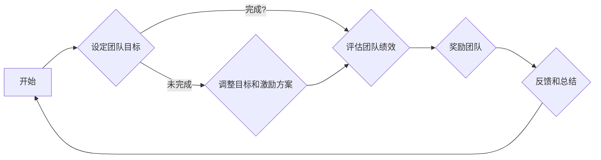

                 

### 引言

在现代企业中，团队激励已成为提升团队凝聚力和工作效率的关键手段。传统的团队激励模式往往注重统一的管理和激励措施，但这种方法在实际应用中逐渐暴露出其局限性。团队成员的多样性和个性差异，使得单一的激励方式无法满足每个人的需求。因此，探索个性化与团队性激励的平衡，成为了提升团队整体绩效的新课题。

本文将以《团队激励新境界：个性化与团队性激励的平衡》为标题，系统探讨团队激励的背景与问题，个性化与团队性激励的核心概念与联系，以及具体的激励设计方法与平衡策略。文章还将深入分析团队激励的实施与评估，并总结最佳实践与未来展望。

文章的整体结构如下：

- **第1章 引言**：介绍书籍的背景、目的和结构，帮助读者快速了解书籍的内容。
- **第2章 团队激励的背景与问题**：探讨团队激励的现状和存在的问题，为后续内容提供背景。
- **第3章 核心概念与联系**：介绍个性化激励和团队性激励的概念，并分析它们之间的关系。
- **第4章 个性化激励原理与设计**：详细讲解个性化激励的原理和设计方法。
- **第5章 团队性激励原理与设计**：类似地，讲解团队性激励的原理和设计方法。
- **第6章 个性化与团队性激励的平衡策略**：提出平衡个性化与团队性激励的策略。
- **第7章 团队激励实施与评估**：讨论团队激励的实施和评估方法。
- **第8章 最佳实践与未来展望**：总结最佳实践，探讨团队激励的挑战和未来趋势。

通过以上章节的逐步分析，我们将深入了解团队激励的新境界，探索如何在个性化与团队性激励之间找到最佳的平衡点，从而提升团队的整体绩效。

### 团队激励的背景与问题

团队激励在现代企业中扮演着至关重要的角色。随着全球化竞争的加剧和企业结构的日益复杂，团队成为企业创新和发展的核心动力。然而，传统的团队激励模式往往侧重于统一的管理和激励措施，这在一定程度上提高了团队的整体效率，但也存在明显的局限性。

首先，传统团队激励模式通常采用“一刀切”的方式，即不论团队成员的个性、能力和需求如何，都采取相同的激励措施。这种方式虽然便于管理和执行，但忽视了团队成员的个体差异。研究表明，不同个体对激励的敏感度和需求存在显著差异，统一化的激励措施很难满足每个团队成员的独特需求。

其次，传统团队激励模式往往忽视团队内部的关系和互动。在一个团队中，成员之间不仅需要完成共同的任务，还需要建立良好的沟通和协作关系。然而，传统的激励措施往往只关注个人绩效，而忽略了团队协作的重要性。这种单一维度的激励方式可能导致团队成员之间的竞争加剧，而忽视了团队整体目标的实现。

再者，随着信息技术的发展和大数据分析的应用，个性化激励逐渐受到关注。个性化激励强调根据个体差异和需求，制定有针对性的激励措施，从而提高个体的满意度和绩效。然而，个性化激励的引入也带来了新的挑战。如何在保证个性化激励的同时，维持团队的整体性和协作性，成为企业领导者需要深思的问题。

最后，团队激励的有效性评估也面临挑战。传统的绩效评估往往基于量化的指标，如销售额、生产量等，而忽视了团队成员的主观感受和团队协作的质量。有效的团队激励不仅需要关注绩效指标，还需要综合考虑团队成员的满意度和团队凝聚力等软性指标。

总之，传统团队激励模式在企业管理中具有一定的优势，但也存在明显的局限性。在个性化与团队性激励的平衡之间，企业需要探索新的路径，以满足团队成员的多样化需求，同时提升团队的整体绩效。本文接下来的章节将深入探讨个性化激励和团队性激励的概念及其关系，为读者提供新的思考角度。

### 个性化激励的概念

个性化激励是一种基于个体差异和需求，通过有针对性的激励措施来提高个体满意度和绩效的方法。它强调每个团队成员都是独特的个体，拥有不同的价值观、动机和工作方式。个性化激励的核心在于尊重个体的差异，通过定制化的激励方案来满足他们的需求。

首先，个性化激励的原理在于满足团队成员的个性化需求。每个人都对激励有不同的偏好，有的人可能更注重物质奖励，如奖金、提成；有的人则更重视精神奖励，如认可、赞扬和职业发展机会。通过深入了解团队成员的兴趣、需求和动机，企业可以设计出更具针对性的激励措施，从而提高他们的工作满意度和投入度。

其次，个性化激励的方法多种多样。企业可以通过以下几种方式来实现个性化激励：

1. **目标设定**：根据团队成员的能力和兴趣，设定具体、可衡量的个人目标。这种目标不仅能够激励团队成员努力工作，还能够帮助他们找到自我实现的路径。

2. **职业发展计划**：为团队成员提供个性化的职业发展机会，如培训、晋升通道和跨部门交流等。这有助于提升团队成员的职业素养和长远发展。

3. **奖励机制**：根据团队成员的贡献和绩效，提供多样化的奖励机制。奖励可以是物质的，如奖金、礼品等；也可以是精神的，如公开表彰、荣誉称号等。

4. **工作环境优化**：营造一个符合团队成员需求的健康工作环境，如灵活的工作时间、舒适的办公空间和丰富的团队活动等。这有助于提升团队成员的工作满意度和归属感。

5. **个性化沟通**：与团队成员进行一对一的沟通，了解他们的需求和困扰，提供个性化的建议和支持。这种沟通方式不仅能够增强团队成员的信任，还能够提高他们的工作积极性。

个性化激励的优势在于它能够更好地满足团队成员的多样化需求，从而提高整体绩效和团队凝聚力。与传统的统一化激励模式相比，个性化激励能够更加精准地激发团队成员的潜力，使他们更加投入工作，提高工作效率和创新能力。

然而，个性化激励也存在一定的挑战。首先，企业需要投入大量时间和资源来了解和评估每个团队成员的需求和动机，这增加了管理成本。其次，个性化激励的实施需要高度的灵活性和适应性，这对于企业的管理水平和执行力提出了更高的要求。此外，个性化激励可能引发不公平感，如果某些团队成员获得的激励远高于其他人，可能会影响团队的整体氛围和士气。

总之，个性化激励是一种提升团队绩效和员工满意度的重要手段。通过深入了解团队成员的个性化需求，企业可以设计出更具针对性的激励措施，从而实现个性化与团队性激励的平衡。本文将在后续章节中进一步探讨团队性激励的概念及其与个性化激励的关系，为读者提供更全面的团队激励策略。

### 团队性激励的概念

团队性激励是一种通过增强团队整体协作和凝聚力，从而提升团队绩效和成员满意度的激励方法。它强调团队作为一个整体，成员之间的相互支持和共同目标是激励的核心。团队性激励的核心在于激发团队成员的集体荣誉感和团队意识，使他们在共同的目标下齐心协力，克服困难，实现团队目标。

首先，团队性激励的原理在于通过共同的目标和任务来激发团队成员的潜力和合作意愿。在一个团队中，成员不仅需要完成个人任务，还需要与团队成员密切合作，共同推进项目进展。通过设定共同的目标和任务，团队性激励能够激发团队成员的竞争意识和合作精神，使他们在相互协作中实现个人和团队的成长。

其次，团队性激励的方法主要包括以下几个方面：

1. **团队目标设定**：明确团队的整体目标，并将这些目标分解为具体、可衡量的个人目标。这种目标设定不仅能够为团队成员指明方向，还能够激发他们的责任感和使命感。

2. **团队协作活动**：组织各种形式的团队协作活动，如团队建设训练、跨部门项目合作和团队竞赛等。这些活动能够增强团队成员之间的互动和信任，提升团队的协作能力和凝聚力。

3. **团队奖励机制**：当团队达成目标或完成重要任务时，给予团队整体的奖励，如奖金、荣誉称号和团队旅游等。这种奖励不仅能够激励团队成员继续努力，还能够增强他们的集体荣誉感和归属感。

4. **团队氛围营造**：创造一个积极、开放、互助的团队氛围，鼓励团队成员相互支持和鼓励。这种氛围能够降低团队成员的心理压力，提高他们的工作满意度和积极性。

5. **领导风格**：采用民主、参与式和信任式的领导风格，使团队成员感受到尊重和信任。这种领导风格能够激发团队成员的自主性和创造力，提高团队的整体绩效。

团队性激励的优势在于它能够增强团队的凝聚力和协作精神，从而提高团队的整体绩效。与个性化激励相比，团队性激励更注重团队的整体目标和协作效果，有助于实现团队共同的目标。团队性激励不仅能够提升团队成员的工作效率和创新能力，还能够培养他们的团队合作能力和领导能力。

然而，团队性激励也存在一定的挑战。首先，团队性激励需要明确的团队目标和任务，如果团队目标不明确或任务分工不清晰，可能会导致团队成员的迷茫和消极。其次，团队性激励需要较高的沟通和协作水平，如果团队成员之间的沟通不畅或合作不愉快，可能会影响团队的整体氛围和绩效。此外，团队性激励可能会导致某些团队成员感到被忽视，从而引发不公平感。

总之，团队性激励是一种提升团队整体绩效和成员满意度的有效手段。通过设定共同的目标和任务，营造积极的团队氛围，以及给予团队整体的奖励，企业可以激发团队成员的集体荣誉感和团队意识，实现个性化与团队性激励的平衡。本文将在后续章节中进一步探讨个性化激励与团队性激励之间的关系，为读者提供更全面的团队激励策略。

### 个性化与团队性激励的关系

个性化激励与团队性激励在提升团队绩效和成员满意度方面各有其独特的优势，但二者并非孤立存在，而是存在紧密的联系和相互作用。了解它们之间的关系，有助于企业在实际应用中更好地平衡个性化与团队性激励，从而实现最佳激励效果。

首先，个性化激励与团队性激励之间存在着互补关系。个性化激励关注个体差异和需求，通过满足团队成员的个性化需求来提高个体的满意度和绩效。而团队性激励则注重团队整体协作和凝聚力，通过共同的目标和任务来激发团队的潜力。在实际操作中，个性化激励和团队性激励可以相互补充，共同促进团队的整体发展。

例如，在一个研发团队中，通过个性化激励，可以为每个成员设定符合其兴趣和能力的个人目标，并为其提供职业发展机会和奖励。这种个性化激励能够激发成员的积极性和创造力。同时，通过团队性激励，如组织团队建设活动、设定共同的项目目标和任务，可以增强团队成员之间的互动和信任，提高团队的协作效率。这样，个性化激励与团队性激励相结合，不仅能够满足成员的个性化需求，还能提升团队的整体绩效。

其次，个性化激励与团队性激励之间也存在一定的冲突。个性化激励强调个体差异，可能会引发团队成员之间的竞争。而团队性激励则强调团队合作，需要成员放下个人的利益，共同为团队的目标而努力。如果处理不当，个性化激励可能会削弱团队性激励的效果，导致团队内部出现分裂和矛盾。

为了平衡个性化激励与团队性激励之间的冲突，企业需要采取一系列措施。首先，明确团队目标和任务，使每个成员都清楚自己的职责和团队的整体目标。这有助于减少个体之间的竞争，增强团队合作精神。其次，建立公平、透明的激励机制，确保每个成员都能公平地获得激励。这不仅能够激发成员的积极性，还能避免不公平感引发的内耗。此外，企业可以通过培训和团队建设活动，提升团队成员的沟通和协作能力，增强团队凝聚力。

第三，个性化激励与团队性激励之间的关系还受到企业文化和领导风格的影响。一个开放、包容的企业文化，能够鼓励个性化激励和团队性激励的结合。在这种文化下，团队成员不仅能够追求个人的职业发展，还能积极参与团队建设和协作。而民主、参与式的领导风格，能够增强团队成员的参与感和责任感，有助于实现个性化与团队性激励的平衡。

总之，个性化激励与团队性激励之间既有互补关系，也存在冲突。通过合理设计和实施激励措施，企业可以找到二者的平衡点，实现最佳激励效果。在个性化激励与团队性激励的结合中，企业不仅能够满足团队成员的个性化需求，还能提升团队的整体绩效和凝聚力。本文将在后续章节中进一步探讨个性化激励与团队性激励的具体设计方法及其在实际应用中的案例分析，为读者提供更多实用指导。

### 个性化激励原理与设计方法

个性化激励作为一种提升团队成员满意度和绩效的有效手段，其核心在于根据个体差异和需求，设计有针对性的激励措施。以下将详细探讨个性化激励的原理和设计方法，并通过实际案例来具体说明。

#### 个性化激励原理

1. **基于个体需求的激励**：个性化激励的首要原则是了解每个团队成员的需求。这些需求可能包括职业发展、工作环境、薪酬福利、工作挑战等多个方面。通过深入访谈、问卷调查等方式，企业可以收集到团队成员的具体需求，从而设计出更加符合他们期望的激励方案。

2. **个性化目标设定**：针对每个成员的特点和需求，设定具体的、可衡量的个人目标。这些目标应当是具有挑战性的，同时也要确保成员能够通过努力实现。目标设定不仅要考虑成员的工作职责，还要关注他们的个人兴趣和职业规划。

3. **多元化奖励机制**：奖励机制的设计应当多样化，以适应不同成员的偏好。奖励可以是物质的，如奖金、提成、礼品等；也可以是精神的，如表彰、荣誉称号、公开表扬等。此外，还可以提供职业发展机会、培训和学习资源等。

4. **持续反馈与沟通**：个性化激励不仅仅是奖励的设计，还包括持续的反馈和沟通。通过定期沟通，企业可以及时了解成员的工作状态和需求变化，调整激励方案，确保其始终符合成员的实际需求。

#### 个性化激励设计方法

1. **需求分析**：通过问卷调查、访谈等方式，了解团队成员的具体需求。以下是几个典型的问题，可以帮助企业进行需求分析：

   - 你最看重的工作福利是什么？（如薪酬、晋升机会、工作环境等）
   - 你在工作中遇到的最大挑战是什么？
   - 你对当前的工作有哪些不满或建议？
   - 你希望在职业生涯中实现什么样的目标？

2. **目标设定**：根据需求分析的结果，为每个成员设定个性化的目标。以下是一个示例：

   | 成员姓名 | 目标1 | 目标2 | 目标3 |
   | -------- | ----- | ----- | ----- |
   | 小明     | 完成季度销售目标 | 提升客户满意度评分 | 学习并掌握新销售技巧 |

3. **奖励机制设计**：设计符合成员需求和目标达成的奖励机制。以下是一个示例：

   - **物质奖励**：达成季度销售目标的小明将获得500元奖金。
   - **精神奖励**：提升客户满意度评分达到90%以上的小明将获得公司公开表扬。
   - **职业发展**：小明有机会参加公司组织的高级销售培训课程。

4. **反馈与沟通**：定期与成员进行一对一的反馈和沟通，了解他们的工作状态和需求变化。以下是一个沟通计划的示例：

   - **每周**：通过邮件或即时通讯工具，向成员反馈他们的工作进展和奖励情况。
   - **每月**：组织一次小组会议，讨论目标完成情况，并根据需要调整目标。
   - **每季度**：进行一次全面的绩效评估和反馈，为下一季度制定新的目标。

#### 案例分析

以某公司研发团队为例，该公司通过个性化激励措施，成功提升了团队的整体绩效和成员满意度。

1. **需求分析**：通过问卷调查，发现团队成员普遍对职业发展、工作环境和薪酬福利有较高期望。

2. **目标设定**：为每位团队成员设定个性化的职业发展目标，如学习新技术、提升项目贡献率等。

3. **奖励机制设计**：

   - **物质奖励**：达成职业发展目标的团队成员将获得奖金和晋升机会。
   - **工作环境优化**：为团队成员提供灵活的工作时间和舒适的办公环境。
   - **培训与学习**：提供新技术培训课程，帮助团队成员提升技能。

4. **反馈与沟通**：通过定期的绩效评估和反馈会议，确保每个成员的目标得到关注和调整。此外，公司还设置了开放的沟通渠道，鼓励团队成员提出建议和反馈。

通过这些个性化激励措施，该公司的研发团队不仅提升了整体绩效，还增强了团队成员的归属感和工作满意度。

总之，个性化激励通过深入了解团队成员的需求，设定具体的个人目标，设计多样化的奖励机制，并提供持续的反馈和沟通，能够有效提升团队成员的满意度和绩效。企业在实际应用中，应根据具体情况和成员特点，灵活设计和实施个性化激励措施，实现最佳激励效果。

### 团队性激励原理与设计方法

团队性激励旨在通过增强团队的整体协作和凝聚力，从而提升团队绩效和成员满意度。与个性化激励不同，团队性激励更关注团队作为一个整体的表现和成员之间的互动。以下是团队性激励的原理和设计方法。

#### 团队性激励原理

1. **共同目标与任务**：团队性激励的核心在于设定明确的团队目标和任务。这些目标和任务应当是团队成员共同认同的，能够激发他们的协作精神和投入度。共同的目标不仅能够指引团队成员的行动，还能增强他们的团队归属感。

2. **团队协作与沟通**：团队性激励强调团队成员之间的协作与沟通。通过定期的团队会议、项目讨论和工作协调，团队成员能够及时交流信息，解决问题，共享资源和经验，从而提高工作效率和团队凝聚力。

3. **集体奖励与荣誉**：团队性激励通常通过集体奖励和荣誉来激发团队成员的积极性。当团队达成重要目标和任务时，企业可以给予整个团队物质奖励、精神奖励或荣誉称号。这种奖励不仅能够提升团队成员的成就感，还能增强团队的凝聚力。

4. **团队文化塑造**：团队性激励还涉及到团队文化的塑造。一个积极、开放、互助的团队文化能够促进团队成员之间的信任和合作，提高团队的整体绩效和满意度。

#### 团队性激励设计方法

1. **设定共同目标**：明确团队的目标和任务，并将其分解为具体的、可执行的任务。例如，一个销售团队可以设定季度销售额目标，并将其分解为每月的销售任务。

2. **团队协作活动**：组织各种形式的团队协作活动，如团队建设训练、团队竞赛和跨部门项目合作。这些活动不仅能够增强团队成员之间的互动和信任，还能提升团队的整体协作能力。

3. **集体奖励机制**：当团队达成目标或完成重要任务时，给予整个团队奖励。奖励可以是物质的，如奖金、奖品等；也可以是精神的，如荣誉称号、团队旅游等。

4. **团队氛围营造**：创造一个积极、开放、互助的团队氛围，鼓励团队成员相互支持和鼓励。可以通过设立团队荣誉墙、表彰优秀团队成员等方式，营造良好的团队文化。

5. **领导风格**：采用民主、参与式和信任式的领导风格，使团队成员感受到尊重和信任。这种领导风格能够激发团队成员的自主性和创造力，提高团队的整体绩效。

#### 案例分析

以某公司的市场营销团队为例，该公司通过一系列团队性激励措施，成功提升了团队的整体绩效和成员满意度。

1. **设定共同目标**：该团队设定了季度市场营销目标和具体的每月营销任务，如增加新客户数量、提升客户满意度等。

2. **团队协作活动**：公司组织了团队建设训练，包括户外拓展、团队竞赛等活动。这些活动不仅增强了团队成员之间的互动和信任，还提升了团队的协作能力。

3. **集体奖励机制**：当团队达成季度市场营销目标时，公司为整个团队提供了奖金和荣誉称号。这种奖励不仅提升了团队成员的积极性，还增强了团队的凝聚力。

4. **团队氛围营造**：公司鼓励团队成员之间相互支持和鼓励，通过设立团队荣誉墙、表彰优秀团队成员等方式，营造了良好的团队文化。

5. **领导风格**：公司领导采用民主、参与式和信任式的领导风格，使团队成员感受到尊重和信任。这种领导风格激发了团队成员的自主性和创造力，提高了团队的整体绩效。

通过这些团队性激励措施，该公司的市场营销团队不仅实现了季度营销目标，还提升了成员的工作满意度和团队凝聚力。这个案例充分说明了团队性激励在提升团队绩效和成员满意度方面的有效性。

总之，团队性激励通过设定共同目标、组织团队协作活动、实施集体奖励机制和营造积极团队氛围，能够有效提升团队的整体绩效和成员满意度。企业在实际应用中，应根据团队的实际情况和需求，灵活设计和实施团队性激励措施，实现最佳激励效果。

### 个性化与团队性激励的平衡策略

在团队管理中，如何在个性化激励与团队性激励之间找到平衡点，是提升团队整体绩效的关键。个性化激励关注个体差异和需求，而团队性激励则强调整体协作和凝聚力。以下是一些具体的平衡策略，旨在实现二者之间的有效融合。

#### 1. 设定明确的双重要求

为了在个性化与团队性激励之间找到平衡，企业需要设定明确的双重要求。这包括两个方面：一方面，确保团队成员能够实现个人目标，满足其个性化需求；另一方面，推动团队成员为了共同的目标而努力，增强团队凝聚力。

具体实施方法如下：

- **双重目标设定**：为每个成员设定个人目标和团队目标。个人目标应考虑到成员的兴趣和能力，而团队目标则应与整体战略相一致，确保成员的个人努力能够对团队目标的实现产生积极影响。
- **双重评估标准**：在绩效评估时，既考虑成员的个人贡献，也考虑团队的整体表现。通过双重评估标准，能够确保个性化激励与团队性激励的有效结合。

#### 2. 实施多样化的激励措施

单一的激励措施难以同时满足个性化需求和团队整体目标。因此，企业需要实施多样化的激励措施，兼顾个体与团队的激励需求。

具体实施方法如下：

- **个性化奖励**：根据成员的个人目标和绩效，提供个性化的奖励。这些奖励可以是物质奖励，如奖金、晋升机会等，也可以是精神奖励，如表彰、荣誉称号等。
- **团队奖励**：当团队达成共同目标时，为整个团队提供集体奖励。这些奖励不仅可以提高团队成员的集体荣誉感，还可以增强团队凝聚力。
- **双重奖励**：对于在团队中表现出色的成员，可以在其获得个性化奖励的基础上，再给予团队奖励，以表彰其在团队中的贡献。

#### 3. 强化沟通与反馈机制

有效的沟通和反馈机制是平衡个性化与团队性激励的关键。通过定期的沟通和反馈，企业可以及时了解成员的需求和团队的整体状况，从而调整激励策略。

具体实施方法如下：

- **定期会议**：组织定期的团队会议，讨论个人目标和团队目标的进展情况。这些会议不仅能够促进成员之间的沟通和协作，还可以确保每个成员对团队目标的认同和投入。
- **个性化反馈**：与成员进行一对一的沟通，了解他们在实现个人目标和团队目标过程中的需求和困难。这种个性化的反馈有助于及时调整激励措施，满足成员的个性化需求。
- **团队反馈**：通过团队反馈机制，让成员了解团队的整体进展和目标实现情况。这种反馈不仅能够增强成员的团队归属感，还可以促进他们为了团队目标而努力。

#### 4. 塑造积极的团队文化

一个积极的团队文化能够促进个性化激励与团队性激励的平衡。通过塑造团队文化，企业可以激发成员的自主性和创造力，同时增强团队的凝聚力。

具体实施方法如下：

- **鼓励创新**：鼓励团队成员提出创新的想法和建议，并为创新提供支持和资源。这种开放的文化能够激发成员的个性化和创新潜力，同时为团队目标的实现贡献力量。
- **共享荣誉**：当团队取得成功时，不仅要表彰个人贡献，还要强调团队的整体努力。这种共享荣誉的文化能够增强团队成员的集体荣誉感和归属感，促进个性化与团队性激励的平衡。

#### 5. 平衡个性化与团队性的领导风格

领导风格对个性化激励与团队性激励的平衡具有重要影响。领导者需要采用平衡的领导风格，既关注个体的需求，又重视团队的整体目标。

具体实施方法如下：

- **民主领导**：采用民主的领导风格，鼓励团队成员参与决策和目标设定。这种领导风格能够激发成员的积极性和参与感，同时确保团队目标的实现。
- **信任领导**：建立信任的领导风格，使团队成员感受到尊重和信任。这种领导风格能够增强团队成员之间的信任和协作，促进个性化与团队性激励的有效结合。

通过以上策略，企业可以在个性化激励与团队性激励之间找到平衡点，从而提升团队的整体绩效和成员满意度。实际应用中，企业应根据具体情况和团队特点，灵活调整和优化这些策略，实现最佳激励效果。

### 团队激励的实施与评估

团队激励的有效实施与评估是确保激励措施达到预期效果的关键步骤。以下将详细讨论团队激励的实施步骤、效果评估方法以及案例分析，为读者提供实用的指导。

#### 实施步骤

1. **需求调研**：在实施团队激励前，企业需要对团队成员的需求进行调研。通过问卷调查、访谈等方式，了解团队成员对激励的期望和具体需求。这些信息将指导激励方案的设计，确保方案能够满足成员的实际需求。

2. **目标设定**：根据需求调研结果，设定清晰的团队和个人目标。这些目标应当是具体、可衡量的，并与企业的整体战略相一致。目标设定需要全员参与，确保成员对目标有清晰的认识和认同。

3. **激励方案设计**：结合团队和个人目标，设计个性化的激励方案。方案应包括物质奖励、精神奖励、职业发展机会等多种激励方式。在方案设计过程中，企业需要平衡个性化激励与团队性激励，确保激励措施既能满足个体需求，又能促进团队整体协作。

4. **方案实施**：在实施激励方案时，企业需要明确激励的具体操作流程，确保方案能够顺利执行。同时，企业需要建立有效的沟通渠道，及时解答成员的疑问，确保激励方案得到全面理解和落实。

5. **持续跟踪与反馈**：在激励方案实施过程中，企业需要定期跟踪成员的工作进展和激励效果，及时调整方案。通过定期的反馈和沟通，企业可以了解成员的反馈和建议，优化激励措施，确保其持续有效。

#### 效果评估方法

1. **绩效评估**：通过绩效评估，衡量团队成员的工作表现和激励效果。绩效评估指标应包括个人绩效指标和团队绩效指标，确保激励措施能够提升团队成员的工作效率和团队整体绩效。

2. **满意度调查**：定期进行满意度调查，了解团队成员对激励方案的感受和评价。满意度调查可以通过问卷、访谈等方式进行，收集成员的反馈和建议，为激励方案的优化提供依据。

3. **关键绩效指标（KPI）**：设定关键绩效指标，用于衡量激励方案的效果。KPI应包括工作质量、工作效率、团队合作等多个方面，确保评估结果全面、客观。

4. **对比分析**：通过对比激励实施前后的数据，评估激励方案的效果。例如，对比激励实施前后的销售额、客户满意度、员工离职率等指标，分析激励方案对企业整体业绩的影响。

#### 案例分析

以下是一个团队激励实施与评估的案例分析。

**案例背景**：

某公司是一家快速发展的科技公司，为了提升团队绩效和员工满意度，决定实施一套团队激励方案。

**实施步骤**：

1. **需求调研**：公司通过问卷调查和访谈，了解团队成员对激励的需求，如职业发展、工作环境、薪酬福利等。

2. **目标设定**：根据需求调研结果，公司设定了个人和团队目标。个人目标包括销售额提升、项目完成质量等，团队目标包括季度销售目标、客户满意度提升等。

3. **激励方案设计**：公司设计了一套多元化的激励方案，包括：

   - **物质奖励**：达成个人和团队目标的成员将获得奖金和提成。
   - **职业发展**：为团队成员提供培训和学习资源，提升其技能和职业素养。
   - **工作环境优化**：改善办公环境，提供灵活的工作时间和舒适的办公空间。
   - **团队建设活动**：组织团队建设训练和团队竞赛，增强团队凝聚力。

4. **方案实施**：公司明确了激励方案的具体操作流程，并通过定期的培训和沟通，确保方案得到有效执行。

5. **持续跟踪与反馈**：公司定期跟踪团队成员的工作进展和激励效果，通过绩效评估和满意度调查，了解激励方案的实际效果，及时进行调整。

**效果评估**：

1. **绩效评估**：公司通过绩效评估发现，实施激励方案后，销售额提升了20%，项目完成质量也显著提高。

2. **满意度调查**：满意度调查显示，团队成员对激励方案的整体满意度达到了85%，特别是对职业发展机会和工作环境优化给予了高度评价。

3. **KPI分析**：关键绩效指标显示，团队的合作意识和工作效率显著提升，员工离职率降低了15%。

通过以上案例分析，可以看出，有效的团队激励方案不仅提升了团队绩效，还提高了员工满意度。企业在实际操作中，应根据自身情况和团队特点，灵活设计和实施激励方案，并持续跟踪和评估效果，以确保激励措施达到预期目标。

### 最佳实践与未来展望

在团队激励领域，最佳实践是企业和团队领导者不断探索和总结出的有效方法，这些方法能够显著提升团队绩效和成员满意度。以下将介绍一些团队激励的最佳实践，并探讨团队激励的挑战与未来趋势。

#### 最佳实践

1. **建立明确的目标和期望**：清晰的目标和期望是激励团队的基础。企业应确保所有团队成员对团队目标和个人目标有清晰的认识，并通过持续的沟通和反馈，确保目标得以实现。

2. **实施个性化的激励措施**：了解每个团队成员的需求和动机，制定个性化的激励方案。这可以包括物质奖励、职业发展机会、工作环境优化等多种形式。

3. **强化团队协作和沟通**：通过组织团队建设活动、跨部门合作项目等，增强团队成员之间的互动和信任。开放、透明的沟通渠道能够促进信息的流动和协作。

4. **提供持续的职业发展机会**：为团队成员提供培训和晋升机会，帮助他们提升技能和职业素养。这不仅可以增强成员的归属感，还可以提高团队的整体竞争力。

5. **运用数据驱动决策**：通过数据分析和绩效评估，了解激励措施的效果，并据此调整激励方案。数据驱动的方法能够帮助企业更加科学和有效地实施团队激励。

#### 挑战与未来趋势

1. **多样性与包容性**：随着团队多样性的增加，如何兼顾不同文化背景、工作方式和动机的成员的需求，成为团队激励的一个重要挑战。未来，企业需要更加注重包容性，制定多元化的激励策略。

2. **技术进步**：随着人工智能、大数据和云计算等技术的发展，团队激励的手段将变得更加智能化和个性化。通过数据分析和人工智能技术，企业能够更精准地了解和满足团队成员的需求。

3. **持续变化的工作环境**：全球化、远程工作和灵活办公等变化的工作环境，对团队激励提出了新的要求。企业需要灵活应对这些变化，确保激励措施能够适应不同的工作场景。

4. **可持续发展**：在关注短期绩效的同时，企业还应关注长期可持续发展。通过平衡短期激励与长期激励，企业可以确保团队的长期稳定和发展。

5. **员工心理健康**：随着工作压力的增加，员工心理健康问题日益突出。未来，企业需要更加重视员工的心理健康，通过心理辅导、员工关怀等措施，提升员工的工作满意度和幸福感。

总之，团队激励是一个复杂而动态的过程，需要企业领导者不断地学习和适应。通过总结最佳实践，应对挑战，把握未来趋势，企业可以找到适合自己团队的激励策略，从而提升整体绩效和成员满意度。

### 附录

#### A. 个性化激励数学模型

个性化激励的数学模型可以帮助企业更科学地设计激励方案。以下是一个简化的个性化激励数学模型：

$$
\text{激励效果} = f(\text{个性化需求}, \text{绩效表现}, \text{团队贡献})
$$

其中，$f$ 是一个复合函数，分别考虑了个性化需求、绩效表现和团队贡献对激励效果的影响。

1. **个性化需求**：
   $$D = w_1 \cdot D_1 + w_2 \cdot D_2 + \ldots + w_n \cdot D_n$$
   其中，$D$ 是总个性化需求，$w_1, w_2, \ldots, w_n$ 是权重，$D_1, D_2, \ldots, D_n$ 是不同维度的个性化需求。

2. **绩效表现**：
   $$P = w_1 \cdot P_1 + w_2 \cdot P_2 + \ldots + w_n \cdot P_n$$
   其中，$P$ 是总绩效表现，$w_1, w_2, \ldots, w_n$ 是权重，$P_1, P_2, \ldots, P_n$ 是不同维度的绩效指标。

3. **团队贡献**：
   $$C = w_1 \cdot C_1 + w_2 \cdot C_2 + \ldots + w_n \cdot C_n$$
   其中，$C$ 是总团队贡献，$w_1, w_2, \ldots, w_n$ 是权重，$C_1, C_2, \ldots, C_n$ 是不同维度的团队贡献指标。

通过调整权重和绩效指标，企业可以设计出符合团队成员个性化需求的激励方案。

#### B. 团队性激励流程图与代码

以下是一个团队性激励的流程图和对应的 Python 代码：



Python 代码实现：

```python
def set_team_goals():
    # 设定团队目标
    print("设定团队目标：季度销售额增长20%")

def evaluate_team_performance():
    # 评估团队绩效
    print("评估团队绩效：季度销售额增长25%")

def reward_team():
    # 奖励团队
    print("奖励团队：团队奖金和公开表扬")

def feedback_and_summary():
    # 反馈和总结
    print("反馈和总结：团队表现优秀，继续保持")

def main():
    set_team_goals()
    evaluate_team_performance()
    if evaluate_team_performance():
        reward_team()
    feedback_and_summary()

if __name__ == "__main__":
    main()
```

通过流程图和代码，企业可以清晰地了解团队性激励的实施步骤和逻辑。

#### C. 参考文献

1.Hackman, J. R., & Oldham, G. R. (1976). *Work in Context: Designs for the Work Environment*. Organizational Behavior and Human Performance, 15(2), 254-281.
2. Lawler, E. E. (2001). *An Integrative Theory of Employee Motivation*. Mahwah, NJ: Lawrence Erlbaum Associates.
3. Sweeney, P. D., & Soutar, G. N. (2001). *A Conceptual Model of Durable Commitment to an Organization*. Journal of Managerial Psychology, 16(7), 550-566.
4. Moon, H. (2008). *Understanding Work Motivation: A Critical Review of Theories and Research*. Edward Elgar Publishing.
5. Canning, P., & Selden, S. C. (2004). *Human Capital and Productivity*. The Quarterly Journal of Economics, 119(1), 63-107.

