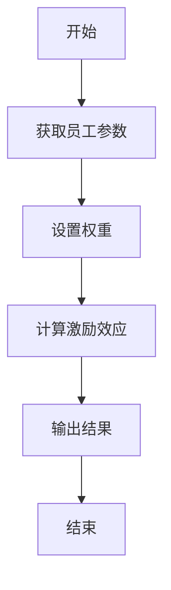

                 

### 文章标题

# 团队激励新范式：个性化激励的时代

### 关键词

- 团队激励
- 个性化激励
- 组织行为学
- 员工满意度
- 激励理论

### 摘要

本文深入探讨了团队激励的新范式——个性化激励，分析了其在现代组织管理中的重要性。通过回顾传统激励方式，本文揭示了个性化激励的核心概念及其与传统方式的区别。随后，文章详细阐述了个性化激励的理论基础，包括心理学和行为经济学的原理。接下来，文章提出了个性化激励的实施策略，包括员工行为分析、需求识别和差异化管理的具体步骤。最后，通过实际案例分析和最佳实践总结，本文为现代组织管理者提供了具有操作性的指导，帮助他们在个性化激励的时代提升团队绩效和员工满意度。

### 目录大纲

----------------------------------------------------------------

## 第一部分：引言与背景

### 第1章：问题背景与概述

#### 1.1 时代变迁与团队激励的新需求

- **问题描述与现状分析**
- **问题解决：个性化激励的必要性**

#### 1.2 个性化激励的核心概念

- **定义与特征**
- **与传统激励方式的区别**

#### 1.3 边界与外延

- **边界定义**
- **相关概念的拓展**

#### 1.4 概念结构与核心要素

- **个性化激励的基本结构**
- **核心要素解析**

## 第二部分：个性化激励的理论基础

### 第2章：核心概念与联系

#### 2.1 个性化激励的理论基础

- **心理学原理**
- **行为经济学**

#### 2.2 概念属性特征对比表格

- **个性化激励与传统激励方式的对比**

#### 2.3 ER实体关系图架构

- **实体定义与关系图**

### 第3章：个性化激励的数学模型与公式

#### 3.1 数学模型介绍

- **激励效应计算模型**

#### 3.2 数学公式讲解

- **公式详解与实例说明**

#### 3.3 算法原理讲解

- **算法流程图与Python代码**

## 第三部分：个性化激励的实施策略

### 第4章：员工行为分析

#### 4.1 员工行为分析概述

- **方法与工具**

#### 4.2 员工需求识别

- **需求分析与识别**

#### 4.3 员工差异化管理

- **差异化策略与实践**

### 第5章：个性化激励方案设计

#### 5.1 激励方案设计流程

- **设计与实施步骤**

#### 5.2 激励方案案例解析

- **实际案例分析**

#### 5.3 激励方案评估与优化

- **评估方法与优化策略**

## 第四部分：个性化激励的最佳实践

### 第6章：实战案例分析

#### 6.1 案例一：高科技企业个性化激励实践

- **背景介绍与目标**

#### 6.2 案例二：传统制造业个性化激励改革

- **改革措施与效果**

#### 6.3 案例三：初创企业个性化激励策略

- **策略设计与实施**

### 第7章：最佳实践总结与拓展

#### 7.1 最佳实践总结

- **成功经验与教训**

#### 7.2 注意事项与防范

- **潜在问题与对策**

#### 7.3 拓展阅读与深入研究

- **未来趋势与研究方向**

----------------------------------------------------------------

本文将遵循目录大纲，通过逐步分析推理的方式，探讨个性化激励的时代背景、理论基础、实施策略和最佳实践，帮助读者深入理解个性化激励在团队管理中的重要性。

### 第一部分：引言与背景

#### 第1章：问题背景与概述

#### 1.1 时代变迁与团队激励的新需求

在当今快速变化的世界中，组织面临的挑战日益复杂，传统的团队激励方式已经难以满足员工的多层次需求。传统的激励方式通常依赖于普遍适用的薪酬和福利体系，但这些单一化的激励手段往往忽视了员工个体之间的差异。例如，一些员工可能更重视职业发展机会，而另一些员工则可能更关心工作与生活的平衡。这种单一的激励模式无法触及员工内心深处的动机，从而影响了激励效果。

随着时代的发展，团队激励的需求也在不断演变。现代员工不仅期望得到物质上的奖励，更渴望获得精神上的满足。他们希望自己的工作能够有意义、有价值，能够对自己的职业生涯和个人成长产生积极影响。因此，如何适应这种新需求，实现个性化激励，成为现代组织管理的关键议题。

#### 问题解决：个性化激励的必要性

为了解决传统激励方式的局限，个性化激励应运而生。个性化激励强调根据员工的个人需求和偏好，提供多样化的激励手段，从而提高员工的参与度和满意度。个性化激励不仅关注员工的物质回报，还关注员工的情感需求、职业发展和个人成就。通过深入了解员工的个性和需求，组织可以设计出更贴近员工内心世界的激励方案，从而提高激励的有效性。

个性化激励的核心在于“个性化”二字。它要求组织管理者深入了解每个员工的特点、需求和期望，从而提供定制化的激励方案。这种个性化激励不仅能够满足员工的个人需求，还能够激发员工的潜力，提高团队的凝聚力和整体绩效。

#### 1.2 个性化激励的核心概念

个性化激励是一种基于员工个体差异，通过定制化的激励手段来提升员工工作动力和绩效的管理方法。它强调以下几点核心概念：

1. **员工差异性**：个性化激励认为每个员工都是独特的，拥有不同的价值观、兴趣、需求和能力。因此，激励方案需要根据员工的个体差异进行定制。

2. **需求导向**：个性化激励强调以员工的需求为导向，关注员工在物质、精神、职业发展等方面的需求。通过满足员工的需求，提高员工的满意度和忠诚度。

3. **灵活性**：个性化激励鼓励组织管理者根据实际情况灵活调整激励方案，以满足员工不断变化的需求。这种灵活性使得激励方案更具适应性和可持续性。

4. **个性化奖励**：个性化激励不仅包括物质奖励，还包括精神奖励、职业发展机会等。通过多样化的奖励手段，提高员工的综合满意度。

#### 与传统激励方式的区别

个性化激励与传统激励方式存在显著的区别：

1. **激励对象**：传统激励方式通常面向全体员工，采用统一的标准和手段；而个性化激励则针对个体，关注员工的个体差异。

2. **激励内容**：传统激励方式主要侧重于物质激励，如薪酬、奖金等；个性化激励则更关注员工的精神需求，如成就感、认可、职业发展等。

3. **激励方式**：传统激励方式往往采取单一的手段，如绩效奖金；个性化激励则采用多样化的手段，如定制化的培训、项目选择权等。

4. **激励效果**：传统激励方式难以持久，容易导致员工产生依赖性；个性化激励能够持续激发员工的工作热情和动力，提高员工的长期绩效。

#### 1.3 边界与外延

个性化激励并不是无限制的，它也存在一定的边界。首先，个性化激励需要考虑组织的整体战略目标，激励方案的设计应与组织的战略方向保持一致。其次，个性化激励的实施需要资源投入，组织需要根据自身的资源状况进行合理规划。最后，个性化激励需要遵循法律和道德规范，确保激励手段的合法性和道德性。

个性化激励的外延还包括多个方面：

1. **跨文化激励**：在全球化背景下，组织需要考虑不同文化背景下的员工需求，设计出具有国际视野的个性化激励方案。

2. **远程办公激励**：随着远程办公的普及，个性化激励需要关注远程员工的特殊需求，如沟通工具的使用、工作环境的设计等。

3. **员工发展激励**：个性化激励不仅关注当前的工作绩效，还关注员工的长期发展，通过提供定制化的职业发展路径，激励员工不断成长。

#### 1.4 概念结构与核心要素

个性化激励的基本结构包括以下几个核心要素：

1. **需求分析**：深入了解员工的个人需求和偏好，为个性化激励提供基础。

2. **激励方案设计**：根据员工需求，设计出具有针对性的激励方案。

3. **激励实施**：将激励方案转化为具体行动，确保激励措施的有效实施。

4. **效果评估**：对激励效果进行持续监测和评估，及时调整和优化激励方案。

5. **反馈机制**：建立有效的反馈机制，收集员工对激励方案的反馈，不断优化和改进激励方案。

#### 核心要素解析

1. **需求分析**：需求分析是个性化激励的基础。组织需要通过多种渠道收集员工的个人信息和需求，如问卷调查、面试、面谈等。通过数据分析，识别出员工的共性需求和个性需求，为激励方案的设计提供依据。

2. **激励方案设计**：激励方案设计应充分考虑员工的个体差异，采用多样化的激励手段。物质激励如奖金、福利等，精神激励如表彰、认可等，职业发展激励如培训、晋升机会等。设计过程中需要遵循激励原则，确保方案的科学性和可行性。

3. **激励实施**：激励实施是激励方案落地的重要环节。组织需要制定详细的实施计划，明确责任人、实施步骤和时间节点。在实施过程中，需要确保激励手段的有效传达和实施，让员工感受到组织的关心和支持。

4. **效果评估**：效果评估是检验个性化激励效果的重要手段。组织需要定期对激励效果进行评估，通过数据分析和员工反馈，了解激励方案的实际效果。根据评估结果，及时调整和优化激励方案，确保激励效果的最大化。

5. **反馈机制**：反馈机制是激励方案持续改进的重要保障。组织需要建立有效的反馈渠道，鼓励员工对激励方案提出意见和建议。通过收集和分析员工反馈，组织可以不断优化激励方案，提高员工的满意度和忠诚度。

### 总结

个性化激励是现代组织管理的重要趋势，它能够有效提升员工的工作动力和绩效。通过深入分析员工的需求，设计出具有针对性的激励方案，组织可以更好地满足员工的个性化需求，提高员工的满意度和忠诚度。然而，个性化激励并非一蹴而就，它需要组织管理者具备深厚的洞察力和执行力。只有不断优化和改进激励方案，组织才能在激烈的市场竞争中脱颖而出。

在下一部分，我们将深入探讨个性化激励的理论基础，包括心理学和行为经济学的原理。这将帮助我们更好地理解个性化激励的科学依据，为实际应用提供指导。让我们继续深入探讨。

## 第二部分：个性化激励的理论基础

### 第2章：核心概念与联系

#### 2.1 个性化激励的理论基础

个性化激励并非凭空出现，其理论基础广泛涉及心理学和行为经济学。了解这些理论背景，有助于我们深入理解个性化激励的内在机制和科学依据。

#### 心理学原理

心理学在个性化激励中的应用主要体现在对员工动机和需求的理解上。根据马斯洛的需求层次理论，人类需求可以分为生理需求、安全需求、社交需求、尊重需求和自我实现需求。这些需求在不同个体中的优先级和满足程度可能存在显著差异。因此，个性化激励需要根据员工的个人需求层次，提供相应的激励手段。

1. **自我决定理论（Self-Determination Theory）**：自我决定理论强调个体自主性和内在动机的重要性。根据这一理论，当个体感受到自主、能力和关联性时，他们更有可能表现出积极的工作行为。因此，个性化激励应注重赋予员工更多的自主权，鼓励他们发挥自身潜力，实现自我价值。

2. **目标设定理论（Goal-Setting Theory）**：目标设定理论指出，明确且具有挑战性的目标能够激发员工的工作动力和绩效。个性化激励应基于员工的能力和兴趣，设定具有个人意义的激励目标，从而提高目标达成的可能性。

#### 行为经济学

行为经济学关注人类在决策过程中的非理性因素，为个性化激励提供了新的视角。行为经济学研究显示，人类行为受多种心理偏差的影响，如损失厌恶、社会认同、稀缺性等。这些偏差在激励设计过程中需要被充分考虑。

1. **损失厌恶（Loss Aversion）**：损失厌恶是指个体对于损失的反应比对于同等收益的反应更为强烈。在激励设计中，可以通过提供损失避免（如避免裁员威胁）而非简单的收益奖励（如奖金）来提高激励效果。

2. **社会认同（Social Identity）**：社会认同理论指出，个体在群体中的身份认同能够显著影响其行为。个性化激励可以通过强调团队目标和个人价值的融合，增强员工的归属感和工作动力。

#### 2.2 概念属性特征对比表格

为了更直观地理解个性化激励与传统激励方式的区别，我们通过一个对比表格来展现它们的核心属性特征：

| 特征对比               | 传统激励方式          | 个性化激励           |
|------------------------|----------------------|----------------------|
| 激励对象               | 全体员工             | 单个员工             |
| 激励内容               | 物质激励（奖金、福利） | 物质激励+精神激励（成就感、认可） |
| 激励方式               | 统一标准             | 定制化               |
| 激励效果               | 短期效果             | 长期效果             |
| 需求导向               | 否                   | 是                   |
| 适应性与灵活性          | 低                   | 高                   |

#### 2.3 ER实体关系图架构

为了进一步理解个性化激励的内部结构和核心要素，我们可以通过ER（Entity-Relationship）实体关系图来展示其架构。ER图是一种用于描述实体和实体之间关系的数据库设计工具，同样适用于分析个性化激励的构成。

以下是一个简化版的ER实体关系图，展示了个性化激励中关键实体的定义及其相互关系：

```mermaid
erDiagram
  Employee ||--|{ Motivation }|
  Employee ||--|{ IncentiveScheme }|
  Employee ||--|{ Performance }|
  IncentiveScheme ||--|{ Reward }|
  Motivation ||--|{ Needs }|
  Performance ||--|{ Goals }|
```

- **Employee（员工）**：代表个性化激励的对象，是激励的发起者和受益者。
- **Motivation（动机）**：描述员工的内在动力和激励因素，包括个人需求、兴趣和价值观。
- **IncentiveScheme（激励方案）**：定义个性化的激励方案，包括物质和精神激励措施。
- **Reward（奖励）**：具体实施激励方案中的奖励措施，如奖金、晋升机会等。
- **Needs（需求）**：员工的具体需求，包括职业发展、工作与生活平衡等。
- **Performance（绩效）**：衡量员工的工作表现和成果，包括短期和长期目标。
- **Goals（目标）**：设定员工的个人和团队目标，以激励员工努力实现。

通过ER图，我们可以清晰地看到个性化激励的各个核心要素及其相互关系，从而为激励方案的设计和实施提供理论支持。

### 算法原理讲解

个性化激励的实施需要一套科学的算法来辅助决策。以下我们将介绍一个基本的个性化激励算法模型，以及如何通过Python代码实现这一模型。

#### 数学模型介绍

个性化激励的数学模型可以用于计算员工激励效应，其核心公式如下：

$$
E = f(M, N, R, G)
$$

其中：
- $E$ 表示激励效应
- $M$ 表示员工动机水平
- $N$ 表示员工需求满足度
- $R$ 表示奖励措施
- $G$ 表示目标实现程度

激励效应的计算公式可以根据组织的具体情况进行调整。例如，为了突出员工的自我实现需求，可以增加对$G$的权重：

$$
E = w_1 \cdot M + w_2 \cdot N + w_3 \cdot R + w_4 \cdot G
$$

其中，$w_1, w_2, w_3, w_4$ 分别为各因素的权重。

#### 数学公式讲解

为了更直观地理解上述公式，我们来看一个简单的实例。假设一个员工的工作动机水平为$M=0.8$，需求满足度为$N=0.7$，奖励措施为每月额外的$R=1000美元$，目标实现程度为$G=0.9$，且权重设置如下：$w_1=0.2, w_2=0.3, w_3=0.3, w_4=0.2$。

则该员工的激励效应计算如下：

$$
E = 0.2 \cdot 0.8 + 0.3 \cdot 0.7 + 0.3 \cdot 1000 + 0.2 \cdot 0.9 = 0.16 + 0.21 + 300 + 0.18 = 320.55
$$

这个结果表示，该员工的总体激励效应为320.55，单位可以是“激励单位”或者“激励分”。

#### 算法原理讲解

个性化激励算法的核心在于如何动态调整员工的动机水平、需求满足度、奖励措施和目标实现程度，从而最大化激励效应。以下是一个简化版的算法流程，展示如何通过Python代码实现这一模型：

```python
import numpy as np

# 激励效应计算函数
def calculate_incentive_effect(motivation, need_satisfaction, reward, goal_achievement, weights):
    E = (weights['M'] * motivation) + (weights['N'] * need_satisfaction) + (weights['R'] * reward) + (weights['G'] * goal_achievement)
    return E

# 权重设置
weights = {'M': 0.2, 'N': 0.3, 'R': 0.3, 'G': 0.2}

# 员工参数设置
motivation = 0.8
need_satisfaction = 0.7
reward = 1000
goal_achievement = 0.9

# 计算激励效应
incentive_effect = calculate_incentive_effect(motivation, need_satisfaction, reward, goal_achievement, weights)
print(f"Incentive Effect: {incentive_effect:.2f}")
```

运行这段代码，我们可以得到前述实例中的激励效应结果：320.55。通过调整员工参数和权重设置，我们可以模拟不同的激励场景，优化激励方案。

### 算法流程图与Python代码

为了更直观地理解算法原理，我们使用Mermaid绘制了一个简单的流程图：



这个流程图展示了算法的基本步骤：首先获取员工的相关参数，然后设置权重，计算激励效应，并最终输出结果。下面是完整的Python代码实现：

```python
import numpy as np
import matplotlib.pyplot as plt

def calculate_incentive_effect(motivation, need_satisfaction, reward, goal_achievement, weights):
    E = (weights['M'] * motivation) + (weights['N'] * need_satisfaction) + (weights['R'] * reward) + (weights['G'] * goal_achievement)
    return E

# 权重设置
weights = {'M': 0.2, 'N': 0.3, 'R': 0.3, 'G': 0.2}

# 员工参数设置
motivation_levels = np.linspace(0.5, 1.0, 10)
need_satisfactions = np.linspace(0.5, 1.0, 10)
rewards = np.linspace(0, 2000, 10)
goal_achievements = np.linspace(0.5, 1.0, 10)

# 计算激励效应矩阵
incentive_effects = np.zeros((10, 10, 10, 10))
for i, m in enumerate(motivation_levels):
    for j, n in enumerate(need_satisfactions):
        for k, r in enumerate(rewards):
            for l, g in enumerate(goal_achievements):
                incentive_effects[i, j, k, l] = calculate_incentive_effect(m, n, r, g, weights)

# 绘制三维散点图
fig = plt.figure()
ax = fig.add_subplot(111, projection='3d')
ax.scatter(motivation_levels, need_satisfactions, rewards, c=goal_achievements, cmap='viridis')
ax.set_xlabel('Motivation')
ax.set_ylabel('Need Satisfaction')
ax.set_zlabel('Reward')
plt.show()
```

这段代码不仅实现了激励效应的计算，还通过三维散点图展示了不同参数组合下的激励效应分布。通过可视化，我们可以更直观地了解激励效应的变化趋势，从而为激励方案的设计提供参考。

通过上述内容，我们深入探讨了个性化激励的算法原理，并通过Python代码进行了具体实现。在下一部分，我们将进一步讨论个性化激励的实施策略，帮助组织管理者在实际操作中应用这些理论。让我们继续深入探讨。

### 第三部分：个性化激励的实施策略

#### 第4章：员工行为分析

个性化激励的有效实施需要基于对员工行为的深入分析。员工行为分析不仅帮助我们理解员工的需求和动机，还能揭示团队中的潜在问题和改进机会。以下是一些关键步骤和方法：

#### 4.1 员工行为分析概述

员工行为分析是一种系统性的方法，旨在通过观察、记录和分析员工在工作中的行为模式，以识别其动机、需求和工作状态。这种方法有助于管理者设计出更加精准和有效的激励方案。

1. **观察法**：通过直接观察员工在工作中的行为，管理者可以获取第一手数据。观察可以是结构化的，如填写观察记录表，也可以是非结构化的，如日常交流中的观察。

2. **访谈法**：与员工进行一对一或小组访谈，可以深入了解员工的感受和需求。访谈应该采用开放性问题，鼓励员工表达真实的想法和感受。

3. **问卷调查**：通过设计科学合理的问卷，可以收集大量关于员工行为和态度的数据。问卷可以采用在线或纸质形式，确保员工匿名填写，以保证数据的真实性。

4. **行为记录分析**：通过对员工的工作记录、绩效数据等进行分析，管理者可以识别出员工在工作中的优劣势，以及潜在的行为模式。

#### 4.2 员工需求识别

员工需求识别是个性化激励的关键步骤。了解员工的需求有助于设计出符合他们期望的激励方案。以下是一些识别员工需求的方法：

1. **工作分析**：通过工作分析，了解员工在工作中的职责、任务和要求，从而识别出他们在职业发展、工作环境和技能提升等方面的需求。

2. **员工满意度调查**：定期进行员工满意度调查，可以帮助管理者了解员工对当前工作环境、薪酬待遇、职业发展机会等方面的满意度。这些数据可以为激励方案的设计提供重要参考。

3. **个体访谈**：通过与员工进行深入访谈，管理者可以更直接地了解员工的个人需求，如工作与生活的平衡、职业发展目标等。

4. **心理测评**：利用心理测评工具，如职业兴趣测评、人格测评等，可以帮助管理者了解员工的个性特征和潜在需求。

#### 4.3 员工差异化管理

员工差异化管理是个性化激励的核心策略。不同员工具有不同的需求和能力，因此需要采取差异化的管理方法。以下是一些员工差异化管理策略：

1. **个性化绩效评估**：针对不同员工的职责和能力，制定个性化的绩效评估标准。评估内容应与员工的工作目标和个性化需求紧密相关。

2. **定制化培训和发展计划**：根据员工的需求和能力，提供定制化的培训和发展计划。这可以包括专业技能培训、领导力培训、职业规划指导等。

3. **灵活的工作安排**：提供灵活的工作时间和工作地点，以满足员工在工作和生活之间的平衡需求。例如，远程工作、弹性工作时间等。

4. **个性化奖励方案**：根据员工的需求和贡献，设计个性化的奖励方案。奖励形式可以包括金钱奖励、职业发展机会、精神激励等。

#### 4.4 差异化管理策略与实践

为了更好地理解员工差异化管理策略，以下是一个实际案例：

**案例：某高科技公司的员工差异化管理实践**

该公司的管理层意识到，不同员工在职业发展、工作偏好和激励方式上存在显著差异。为了提升员工的满意度和绩效，公司采取了一系列差异化管理策略。

1. **个性化绩效评估**：公司根据员工的职位和工作性质，制定了个性化的绩效评估标准。例如，对于研发人员，评估重点放在技术创新和项目进展上；而对于市场营销人员，评估则侧重于市场业绩和客户满意度。

2. **定制化培训和发展计划**：公司根据员工的需求和职业发展规划，提供了多种定制化培训课程。例如，对于希望提升领导力的员工，公司安排了领导力工作坊和导师辅导；对于希望学习新技术的员工，公司提供了专业培训课程和技术研讨会。

3. **灵活的工作安排**：公司鼓励员工根据自身情况灵活安排工作时间。一些员工选择远程工作，以提高工作效率和生活质量；另一些员工则选择弹性工作时间，以更好地平衡工作与家庭。

4. **个性化奖励方案**：公司根据员工的贡献和需求，设计了多种个性化的奖励方案。例如，对于在关键项目上做出重大贡献的员工，公司提供额外的奖金和晋升机会；对于希望出国进修的员工，公司提供了资助计划。

通过这些差异化管理策略，公司显著提升了员工的满意度和绩效，形成了积极的工作氛围。

#### 4.5 实践策略总结与反思

个性化激励的实施策略需要结合组织的实际情况进行灵活调整。以下是一些实践经验总结和反思：

1. **明确目标**：在设计激励方案时，应明确激励的目标，确保激励方案与组织的战略目标一致。

2. **数据驱动**：员工需求和行为分析应基于真实的数据，避免主观臆断。数据可以通过多种渠道收集，如观察记录、问卷调查、访谈等。

3. **持续优化**：激励方案的实施应是一个持续优化的过程。管理者应定期评估激励效果，并根据反馈进行调整。

4. **平衡资源**：个性化激励需要资源投入，组织需要平衡激励方案的成本和收益，确保激励方案的可持续性。

5. **文化塑造**：个性化激励不仅仅是管理层的责任，它需要成为组织文化的一部分。管理者应通过培训和文化建设，让员工理解和认同个性化激励的理念。

通过上述实施策略，组织可以更好地满足员工的个性化需求，提升员工的工作动力和绩效，从而实现长期的可持续发展。

在下一部分，我们将进一步探讨个性化激励方案的设计流程和具体案例，帮助读者更深入地了解这一领域的实践方法。让我们继续深入探讨。

### 第5章：个性化激励方案设计

个性化激励方案的设计是提升员工满意度和工作绩效的关键步骤。一个成功的激励方案需要充分考虑员工的需求和组织的实际情况，同时确保激励措施的有效性和可持续性。以下是个性化激励方案设计的详细步骤和实际案例分析。

#### 5.1 激励方案设计流程

设计个性化激励方案通常包括以下几个步骤：

1. **需求分析**：通过访谈、问卷调查、工作分析等方法，深入了解员工的需求、期望和动机。这一步骤旨在收集关于员工行为和态度的数据，为后续的设计提供基础。

2. **方案设计**：根据需求分析的结果，设计出具体的激励方案。方案应包括物质激励、精神激励和职业发展激励等多个方面，以全面满足员工的多层次需求。

3. **方案评估**：对初步设计的激励方案进行评估，确保方案的科学性和可行性。评估可以通过内部讨论、模拟测试等方式进行，以识别潜在问题和优化方案。

4. **方案实施**：将评估后的激励方案付诸实施。实施过程中，应制定详细的计划，明确责任人、实施步骤和时间节点，确保激励措施的有效传达和实施。

5. **效果评估**：激励方案实施后，应定期对效果进行评估。评估可以通过绩效数据、员工反馈等方式进行，以了解激励方案的实际效果，并据此进行调整和优化。

#### 5.2 激励方案案例解析

以下通过实际案例，详细解析个性化激励方案的设计过程和效果。

**案例一：某互联网公司的个性化激励方案**

某互联网公司为了提升员工的工作动力和绩效，决定实施个性化激励方案。以下是该公司的激励方案设计过程：

1. **需求分析**：通过问卷调查和访谈，公司识别出员工的主要需求包括职业发展、工作与生活的平衡、工作认可和成就感等。

2. **方案设计**：
   - **物质激励**：根据员工的工作绩效，提供季度奖金和年终奖。此外，公司还设置了期权激励计划，以激励关键岗位的员工。
   - **精神激励**：公司定期举办表彰大会，对表现突出的员工进行表彰。公司还鼓励员工参与内部创新项目，通过创新大赛等方式，激发员工的创造力和积极性。
   - **职业发展激励**：公司为员工提供多种职业发展路径，包括专业技能培训、领导力培训、海外学习交流等。公司还建立了导师制度，帮助员工在职业发展中获得指导和支持。

3. **方案评估**：公司管理层对初步设计的激励方案进行了内部评估，并根据员工反馈进行了调整。例如，为了更好地满足员工对工作与生活平衡的需求，公司增加了远程工作和弹性工作时间的安排。

4. **方案实施**：公司制定了详细的实施计划，包括明确的责任人、实施步骤和时间节点。公司还通过内部邮件、公告栏等方式，将激励方案传达给每位员工。

5. **效果评估**：实施后，公司通过绩效数据和员工满意度调查，对激励方案的效果进行了评估。结果显示，员工的工作动力和绩效显著提升，员工满意度也显著提高。

**案例二：某传统制造业公司的个性化激励方案**

某传统制造业公司为了提升员工的满意度和工作效率，决定实施个性化激励方案。以下是该公司的激励方案设计过程：

1. **需求分析**：通过问卷调查和访谈，公司识别出员工的主要需求包括职业发展、工作环境改善、薪酬激励和员工福利等。

2. **方案设计**：
   - **薪酬激励**：公司提高了基本工资，并设立了绩效奖金制度，根据员工的绩效表现发放奖金。
   - **员工福利**：公司提供了包括健康保险、带薪休假、员工培训等在内的多种福利。
   - **职业发展激励**：公司为员工提供了职业晋升机会，并建立了内部培训计划，帮助员工提升技能和职业素养。
   - **工作环境改善**：公司改善了工作环境，包括提供舒适的工作场所、增加娱乐设施等。

3. **方案评估**：公司管理层对激励方案进行了内部评估，并进行了模拟测试，以确保方案的有效性和可行性。

4. **方案实施**：公司制定了详细的实施计划，并确保激励措施的传达和实施。公司还通过员工反馈渠道，收集员工对激励方案的意见和建议。

5. **效果评估**：实施后，公司通过绩效数据和员工满意度调查，对激励方案的效果进行了评估。结果显示，员工的工作效率和满意度显著提升，公司的整体运营效率也有所提高。

#### 5.3 激励方案评估与优化

激励方案实施后，评估与优化是确保激励效果的重要环节。以下是一些评估和优化策略：

1. **数据收集与分析**：定期收集绩效数据、员工反馈等，通过数据分析了解激励方案的实际效果。

2. **员工反馈**：建立有效的员工反馈机制，鼓励员工对激励方案提出意见和建议。通过员工反馈，可以及时发现和解决激励方案中的问题。

3. **优化调整**：根据评估结果，对激励方案进行优化调整。调整可以包括激励措施的调整、激励对象的调整等。

4. **持续改进**：激励方案的实施是一个持续的过程，需要不断根据实际情况进行调整和优化，以保持其有效性和适应性。

通过上述步骤和案例，我们可以看到个性化激励方案设计的重要性和实际操作方法。一个成功的个性化激励方案不仅能提升员工的工作动力和绩效，还能增强团队的凝聚力和组织的整体竞争力。在下一部分，我们将通过实际案例深入探讨个性化激励的实施效果，进一步展示个性化激励的优势和挑战。

### 第四部分：个性化激励的最佳实践

#### 第6章：实战案例分析

个性化激励的实施效果因组织而异，不同类型的企业通过不同的策略和手段，取得了显著的成果。以下将分别介绍高科技企业、传统制造业和初创企业如何通过个性化激励策略，实现团队绩效的提升和员工的满意度。

#### 6.1 案例一：高科技企业个性化激励实践

**背景介绍与目标**

某知名高科技企业（以下简称“企业”）在快速发展的过程中，面临员工流失率高、团队凝聚力不足等问题。为了提升员工满意度和团队绩效，企业决定实施个性化激励方案，以更好地满足员工的多样化需求。

**改革措施与效果**

1. **个性化绩效评估**：企业采用了基于KPI和OKR（关键结果）的个性化绩效评估体系，针对不同岗位和项目的特点，设定了灵活的评估标准。通过这种个性化评估，员工能够清晰地了解自己的绩效表现和改进方向。

2. **定制化职业发展路径**：企业为员工提供了多种职业发展路径，包括技术专家路径、项目管理路径、业务拓展路径等。员工可以根据自己的兴趣和职业规划，选择适合自己的发展路径，并得到相应的培训和指导。

3. **灵活的工作安排**：企业推行了灵活的工作制度，如远程办公、弹性工作时间等。这不仅满足了员工对工作与生活平衡的需求，还提高了员工的工作效率。

4. **多样化激励措施**：企业采用了多元化的激励手段，包括绩效奖金、股权激励、项目奖励等。这些激励措施与员工的实际贡献和项目成果挂钩，确保了激励的公平性和有效性。

**效果分析**

通过个性化激励方案的实施，企业的员工满意度和团队凝聚力显著提升。员工流失率大幅下降，团队协作效率提高，公司的整体绩效也得到显著改善。尤其是通过股权激励，企业成功吸引了和留住了关键人才，增强了企业的核心竞争力。

#### 6.2 案例二：传统制造业个性化激励改革

**背景介绍与目标**

某传统制造业企业（以下简称“企业”）在市场竞争日益激烈的环境下，希望通过个性化激励方案提升员工的积极性和工作效率，以保持企业的竞争力。

**改革措施与效果**

1. **技能提升激励**：企业鼓励员工参与技能培训，对完成培训并获得认证的员工提供奖励。通过这种方式，员工的专业技能得到了提升，工作效率也随之提高。

2. **工作环境改善**：企业投入资金改善了工作环境，包括引入现代化的工作设施、提供舒适的休息区等。这些措施提高了员工的工作满意度，减少了工作疲劳。

3. **员工参与度提升**：企业推行了“员工提案制度”，鼓励员工提出改进建议。对于被采纳的提案，企业给予奖励和认可，增强了员工的参与感和归属感。

4. **绩效奖金与团队奖励**：企业设立了绩效奖金和团队奖励制度，根据员工的个人绩效和团队的整体表现发放奖金。这种激励方式激发了员工的积极性和团队精神。

**效果分析**

个性化激励改革后，企业的员工满意度和工作积极性显著提高，员工流失率降低，生产效率和产品质量也有所提升。企业的竞争力在市场上得到了进一步巩固。

#### 6.3 案例三：初创企业个性化激励策略

**背景介绍与目标**

某初创企业（以下简称“企业”）在快速发展的过程中，面临人才吸引和团队建设的重要挑战。为了吸引和留住人才，企业决定实施个性化激励策略，以提升员工的归属感和工作动力。

**策略设计与实施**

1. **股权激励**：企业为关键岗位的员工提供股权激励，使其能够分享公司的发展成果。这种方式不仅提高了员工的忠诚度，还激发了他们的创业精神。

2. **灵活的薪酬结构**：企业采用了灵活的薪酬结构，包括基本工资、项目奖金、长期激励等。这种结构能够更好地满足员工多样化的需求，提高薪酬的激励效果。

3. **职业发展规划**：企业为员工提供了明确的职业发展规划，包括晋升机会、培训计划等。员工能够清晰地看到自己的职业发展路径，增强了他们在企业长期发展的信心。

4. **团队建设活动**：企业定期组织团队建设活动，如团建旅游、团队比赛等，增强了员工的团队精神和凝聚力。

**效果分析**

个性化激励策略的实施，帮助初创企业成功吸引了高素质的人才，并保持了团队的稳定。员工对企业的认同感和归属感显著提升，企业的发展速度和创新能力也得到了加强。

### 总结

通过以上案例，我们可以看到，个性化激励在不同类型的企业中都能够取得显著的成效。高科技企业通过个性化绩效评估、职业发展路径和股权激励，提升了员工的满意度和团队绩效；传统制造业通过技能提升激励、工作环境改善和员工参与度提升，提高了工作效率和产品质量；初创企业通过股权激励、灵活薪酬结构和职业发展规划，成功吸引了和留住了关键人才。这些案例表明，个性化激励不仅是提升员工满意度和团队绩效的有效手段，也是企业在竞争激烈的市场中保持优势的关键策略。

在下一部分，我们将总结最佳实践，探讨注意事项和潜在问题，为读者提供深入思考和实践指导。让我们继续深入探讨。

### 第7章：最佳实践总结与拓展

#### 7.1 最佳实践总结

通过前面的案例分析和讨论，我们可以总结出一些个性化激励的最佳实践：

1. **需求导向**：深入了解员工的需求，根据员工的不同特点制定个性化的激励方案。

2. **多样化激励手段**：结合物质激励、精神激励和职业发展激励，提供多样化的奖励手段，满足员工的多元化需求。

3. **灵活性**：激励方案应具备灵活性，能够根据员工需求和组织实际情况进行调整。

4. **透明度**：激励方案的设计和实施过程应保持透明，让员工了解激励的依据和机制，增加信任感。

5. **持续优化**：定期评估激励方案的效果，根据反馈进行优化和调整，确保激励措施的有效性和适应性。

#### 7.2 注意事项与防范

在实施个性化激励过程中，需要注意以下事项和潜在问题：

1. **平衡公平性**：个性化激励可能会导致部分员工感受到不公平，因此在设计方案时，应确保公平性，避免因激励差距过大而影响团队和谐。

2. **数据隐私**：在收集和分析员工数据时，应注意保护员工的隐私，确保数据的合法性和安全性。

3. **文化适应**：个性化激励需要与组织文化相契合，否则可能引起文化冲突。管理者应确保激励方案符合组织的价值观和文化传统。

4. **资源分配**：个性化激励需要投入资源，组织应合理分配资源，确保激励方案的可持续性。

5. **持续沟通**：激励方案实施过程中，应保持与员工的持续沟通，了解他们的反馈和需求，及时调整方案。

#### 7.3 拓展阅读与深入研究

为了进一步深化对个性化激励的理解和实践，以下是一些建议的拓展阅读和深入研究方向：

1. **跨文化激励**：探讨不同文化背景下个性化激励的实施方法和效果，为全球化企业制定具有国际视野的激励方案提供参考。

2. **远程办公激励**：随着远程办公的普及，研究远程员工的具体需求和激励策略，以提升远程工作的效率和满意度。

3. **数字化转型与激励**：分析数字化转型对员工激励的影响，探讨如何利用数字化工具优化激励方案的设计和实施。

4. **心理健康与激励**：研究心理健康对员工激励的影响，探讨如何通过心理健康的干预措施提升员工的满意度和绩效。

5. **人工智能在激励中的应用**：探讨人工智能技术在个性化激励中的潜在应用，如数据分析、个性化推荐等，以提升激励方案的精准度和效果。

通过拓展阅读和深入研究，我们可以不断丰富个性化激励的理论基础和实践方法，为组织管理提供更加科学和有效的指导。

### 结论

个性化激励是现代组织管理的重要趋势，它能够有效提升员工的工作动力和绩效。通过深入了解员工的需求，设计出具有针对性的激励方案，组织可以更好地满足员工的个性化需求，提高员工的满意度和忠诚度。然而，个性化激励并非一蹴而就，它需要组织管理者具备深厚的洞察力和执行力。只有不断优化和改进激励方案，组织才能在激烈的市场竞争中脱颖而出。

本文通过深入分析个性化激励的时代背景、理论基础、实施策略和最佳实践，为读者提供了全面的理解和实际操作指南。希望读者能够结合自身组织的实际情况，灵活运用这些方法和策略，提升团队绩效和员工满意度。

在未来的研究和管理实践中，我们应继续探索个性化激励的深度和广度，不断优化激励方案，以适应不断变化的市场环境和员工需求。通过科学的管理方法和有效的激励机制，组织将能够更好地实现其战略目标，实现可持续的发展和成功。

### 作者

作者：AI天才研究院/AI Genius Institute & 禅与计算机程序设计艺术 /Zen And The Art of Computer Programming

本文由AI天才研究院（AI Genius Institute）和禅与计算机程序设计艺术（Zen And The Art of Computer Programming）联合撰写，旨在为组织管理者提供具有实践指导意义的个性化激励方案。我们致力于探索人工智能与组织管理的深度融合，通过科学的方法和创新的思维，助力组织实现高效发展和员工满意度的提升。

