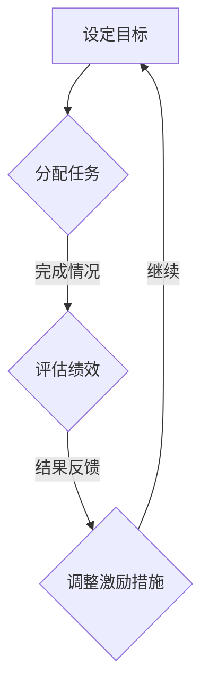
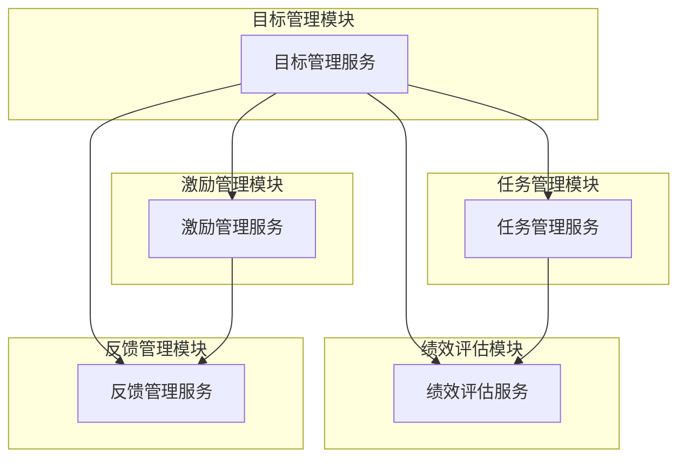
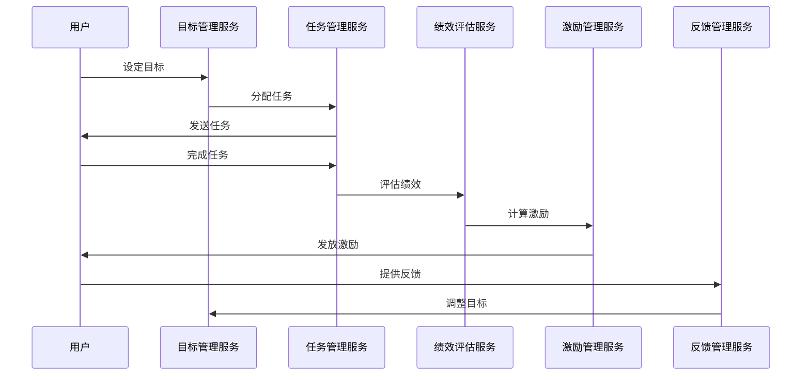

                 

### 第一部分：引言

## 1.1 问题背景与定义

### 1.1.1 团队激励机制的重要性

在现代企业中，团队激励机制扮演着至关重要的角色。有效的激励机制不仅能够激发团队成员的工作热情，提高工作效率，还能增强团队的凝聚力，促进企业目标的实现。然而，许多企业在实施团队激励机制时，往往面临一系列挑战，如激励方式单一、激励效果不显著等。

### 1.1.2 当前团队激励机制存在的问题

首先，激励方式过于单一。大部分企业仍依赖于传统的物质激励，如奖金、晋升等，忽视了精神激励和成长激励的重要性。这种单一的激励方式，容易导致团队成员产生倦怠感，无法持续激发其工作热情。

其次，激励效果的评估标准不明确。许多企业在设定激励机制时，缺乏科学的评估体系，无法准确衡量激励措施的效果，导致激励措施的实施效果大打折扣。

最后，激励机制的设计缺乏针对性。不同团队成员的需求和动机不同，同一种激励方式可能对某个成员有效，对另一个成员却未必。因此，缺乏针对性的激励机制，往往难以满足团队成员的个性化需求。

### 1.1.3 本书的目标与结构

本书旨在探讨多元化的团队激励机制，通过分析物质激励、精神激励和成长激励等多种激励方式，为企业管理者提供科学的激励策略。具体结构如下：

1. **背景介绍**：介绍团队激励机制的重要性以及当前存在的问题。
2. **核心概念与联系**：阐述团队激励的核心概念，并对比不同激励方式的优缺点。
3. **多元化激励方式**：详细讲解物质激励、精神激励和成长激励的实际应用案例。
4. **激励机制的执行与反馈**：探讨激励机制的实施过程和评估方法。
5. **项目实战**：通过实际案例，分析多元化激励方式的应用效果。
6. **最佳实践 tips**：总结实践经验，提供实用建议。

通过本书的阅读，读者将能够了解多元化的团队激励机制，掌握科学的激励策略，从而提升企业团队的整体绩效。

## 1.2 核心概念与联系

### 1.2.1 团队激励的核心概念

团队激励机制是企业管理中的一项重要手段，旨在通过激发团队成员的积极性、主动性和创造性，提高团队的整体绩效。其核心概念包括以下几个方面：

#### 1.2.1.1 激励理论概述

激励理论是团队激励机制的理论基础，主要包括马斯洛的需求层次理论、赫茨伯格的双因素理论、期望理论等。这些理论从不同的角度阐述了激励的本质和机制，为设计有效的激励机制提供了理论指导。

#### 1.2.1.2 激励效果评估

激励效果评估是衡量激励机制是否有效的重要手段。通过科学的评估方法，如问卷调查、绩效评估等，可以准确了解激励措施的实施效果，为后续的激励机制调整提供依据。

### 1.2.2 不同激励方式的属性特征对比表

为了更直观地理解不同激励方式的优缺点，我们制作了一个对比表（如下所示）：

| 激励方式 | 优点 | 缺点 |
| --- | --- | --- |
| 物质激励 | 直接、显著，易于衡量 | 过于依赖物质，可能导致短期行为 |  
| 精神激励 | 长期、稳定，增强团队凝聚力 | 难以衡量，成本较高 |  
| 成长激励 | 满足个人发展需求，增强职业认同感 | 需要长期投入，效果显现较慢 |

### 1.2.3 团队激励机制ER实体关系图

为了更好地理解团队激励机制中的各个实体及其关系，我们使用Mermaid语言绘制了一个ER实体关系图，如下所示：

```mermaid
erDiagram
MEMBER ||--|{ PROJECT :参与}
MEMBER ||--|{ EVALUATION :参与}
PROJECT ||--|{ BUDGET :资金支持}
EVALUATION ||--|{ RESULT :产出}
```

在这个ER实体关系图中，`MEMBER`表示团队成员，`PROJECT`表示项目，`EVALUATION`表示评估结果。团队成员参与项目，并对项目进行评估，评估结果又反馈到项目预算中，形成闭环。

### 1.2.4 激励机制的概念结构与核心要素组成

团队激励机制由以下几个核心要素组成：

1. **目标设定**：明确团队的目标，为激励措施的实施提供方向。
2. **激励措施**：根据团队成员的需求和特点，设计多元化的激励措施。
3. **反馈机制**：及时收集团队成员的反馈，评估激励措施的效果，并作出相应调整。

这些要素相互关联，共同构成了一个完整的团队激励机制。

通过以上对核心概念与联系的分析，我们可以更加深入地理解团队激励机制，为其科学设计和有效实施提供理论基础。

## 1.3 团队激励机制的核心概念原理

### 1.3.1 激励理论的原理

激励理论是团队激励机制的核心基础，其中最具代表性的理论包括马斯洛的需求层次理论、赫茨伯格的双因素理论、期望理论等。

#### 1.3.1.1 马斯洛的需求层次理论

马斯洛的需求层次理论将人的需求分为五个层次：生理需求、安全需求、社交需求、尊重需求和自我实现需求。根据这一理论，管理者应首先满足团队成员的生理和安全需求，然后逐步提升到社交、尊重和自我实现需求。在团队激励中，通过满足不同层次的需求，可以有效地激发团队成员的积极性。

#### 1.3.1.2 赫茨伯格的双因素理论

赫茨伯格的双因素理论将影响员工工作满意度的因素分为两类：保健因素和激励因素。保健因素主要与工作环境和工作条件相关，如工资、工作条件、人际关系等，这些因素能够预防员工的不满意，但无法直接提高满意度。激励因素主要与工作内容和工作成就相关，如成就感、认可、晋升等，这些因素能够直接提高员工的工作满意度，从而激发其工作积极性。

#### 1.3.1.3 期望理论

期望理论认为，个体行为的结果取决于期望值和效价。期望值是指个体对实现某种结果的概率估计，而效价则是指个体对结果的价值评价。期望理论指出，管理者应通过提高期望值和效价，来激发员工的工作积极性。例如，通过设定明确的目标和提供必要的资源支持，可以提高员工的期望值；通过奖励机制和认可，可以提高员工的效价。

### 1.3.2 激励效果评估的原理

激励效果评估是团队激励机制的重要环节，其目的是衡量激励措施的实施效果，为后续的调整和优化提供依据。

#### 1.3.2.1 评估方法

常见的评估方法包括问卷调查、绩效评估和行为观察等。问卷调查可以通过量化的方式了解团队成员对激励措施的感受和满意度；绩效评估可以衡量激励措施对团队绩效的具体影响；行为观察则可以观察团队成员在工作中的行为变化。

#### 1.3.2.2 评估指标

激励效果评估的指标主要包括团队成员的工作满意度、工作效率、工作积极性、团队凝聚力等。这些指标可以从多个维度反映激励措施的效果。

#### 1.3.2.3 评估流程

激励效果评估的流程通常包括以下步骤：

1. **设定评估目标**：明确评估的目的和指标。
2. **设计评估工具**：选择合适的评估方法和工具。
3. **收集数据**：通过问卷调查、绩效评估等方式收集数据。
4. **分析数据**：对收集到的数据进行统计和分析。
5. **评估结果反馈**：将评估结果反馈给团队成员，并进行讨论和总结。
6. **优化调整**：根据评估结果，对激励机制进行优化和调整。

通过以上对激励理论和激励效果评估原理的详细分析，我们可以更好地理解团队激励机制的设计和实施方法，从而提高团队绩效，实现企业目标。

## 1.4 概念属性特征对比表格

为了更直观地展示不同激励方式的属性特征，我们制作了一个对比表格。以下是对各激励方式的概念、优点和缺点的详细对比。

| 激励方式 | 概念 | 优点 | 缺点 |
| --- | --- | --- | --- |
| 物质激励 | 通过金钱、奖金、福利等方式激励团队成员 | **直接**：激励效果迅速显现；**明确**：目标具体明确；**量化**：便于评估和比较。 | **依赖性**：可能导致团队成员过分追求物质奖励，忽视精神需求；**短期**：可能激发短期行为，而非长期动机。 |
| 精神激励 | 通过认可、表扬、荣誉等方式激励团队成员 | **持久**：增强团队成员的归属感和成就感；**多元化**：适用于不同性格和需求的团队成员；**无形**：成本较低，易于实施。 | **难以量化**：效果难以直接衡量，存在主观性；**成本**：可能需要较高的时间和精力投入。 |
| 成长激励 | 通过提供培训、职业发展机会等方式激励团队成员 | **激励性**：满足团队成员的长期发展需求；**培养**：有助于培养团队成员的技能和素质；**可持续发展**：有助于企业长期发展。 | **长期性**：效果显现较慢，需要长期投入；**适应性**：需根据团队成员的实际情况进行个性化设计。 |
| 综合激励 | 结合物质激励、精神激励和成长激励，实现多元化的激励效果 | **全面性**：满足团队成员的多样化需求；**针对性**：根据个人差异进行激励；**可持续**：有助于建立长期激励机制。 | **复杂性**：设计和管理较为复杂；**平衡性**：需要平衡各种激励方式的优缺点，避免单一化。 |

通过这个对比表格，我们可以看到不同激励方式在概念、优点和缺点上的差异。在实际应用中，企业可以根据团队和成员的具体需求，选择合适的激励方式，以达到最佳的激励效果。

### 1.5 团队激励机制ER实体关系图

为了更直观地展示团队激励机制中的实体及其相互关系，我们使用Mermaid语言绘制了一个ER（实体关系）图。以下是对该ER图的具体说明：

```mermaid
erDiagram
MEMBER ||--|{ PROJECT :参与}
MEMBER ||--|{ EVALUATION :参与}
PROJECT ||--|{ BUDGET :资金支持}
EVALUATION ||--|{ RESULT :产出}
```

在这个ER图中：

- `MEMBER`（团队成员）实体与`PROJECT`（项目）实体之间存在参与关系，表示团队成员参与项目。
- `MEMBER`（团队成员）实体与`EVALUATION`（评估）实体之间存在参与关系，表示团队成员参与评估。
- `PROJECT`（项目）实体与`BUDGET`（预算）实体之间存在资金支持关系，表示项目需要资金支持。
- `EVALUATION`（评估）实体与`RESULT`（结果）实体之间存在产出关系，表示评估结果产出。

通过这个ER图，我们可以清晰地看到团队成员、项目、预算和评估结果之间的关系，为团队激励机制的设计和实施提供了直观的参考。

### 1.6 算法原理讲解

#### 1.6.1 算法mermaid流程图

为了更好地理解团队激励机制的实施过程，我们使用Mermaid语言绘制了一个流程图，具体如下：



在这个流程图中，首先设定目标（A），然后根据目标分配任务（B）。任务完成后，进行绩效评估（C），根据评估结果反馈调整激励措施（D），并循环回到设定目标（A）。

#### 1.6.2 Python源代码

为了具体实现团队激励机制，我们可以使用Python编写一个简单的代码示例。以下是一个简单的代码框架，用于实现激励措施的执行流程：

```python
# 定义团队激励机制函数
def team_incentive_program(team_members, project_targets, performance_data):
    # 设定目标
    for member in team_members:
        member['target'] = project_targets[member['id']]
        
    # 分配任务
    for member in team_members:
        member['task'] = "完成项目任务"
        
    # 评估绩效
    for member in team_members:
        member['performance'] = performance_data[member['id']]
        
    # 根据绩效调整激励措施
    for member in team_members:
        if member['performance'] >= 90:
            member['incentive'] = "发放奖金"
        elif member['performance'] >= 70:
            member['incentive'] = "口头表扬"
        else:
            member['incentive'] = "提供培训机会"
            
    # 输出激励结果
    for member in team_members:
        print(f"{member['name']}的绩效为{member['performance']}，将获得{member['incentive']}")
```

在这个代码示例中，我们首先设定了团队成员的目标，然后分配任务，接着评估绩效，并根据绩效结果调整激励措施。通过这个简单的示例，我们可以看到团队激励机制的基本实现流程。

#### 1.6.3 数学模型和公式

团队激励机制背后的数学模型和公式主要用于评估激励措施的效果和优化激励策略。以下是一个简化的数学模型：

1. **绩效评估模型**：

   $$ P = f(T, S, M) $$

   其中，P表示绩效，T表示任务完成情况，S表示团队成员的努力程度，M表示激励措施的效果。这个公式表明，绩效是任务完成情况、团队成员努力程度和激励措施效果的综合体现。

2. **激励效果优化模型**：

   $$ E = \alpha P + \beta I $$

   其中，E表示激励效果，P表示绩效，I表示激励措施。这个公式表明，激励效果是绩效和激励措施的函数，管理者可以通过调整激励措施来优化激励效果。

#### 1.6.4 详细讲解与举例说明

为了更好地理解上述数学模型和公式，我们可以通过一个简单的实例进行说明。

假设一个团队有5名成员，他们各自的任务完成情况和努力程度如下表所示：

| 成员ID | 任务完成情况 | 努力程度 |  
| ------ | ------------ | -------- |  
| 1      | 90%          | 高       |  
| 2      | 85%          | 中       |  
| 3      | 75%          | 中       |  
| 4      | 70%          | 低       |  
| 5      | 65%          | 低       |

根据绩效评估模型，我们可以计算每个成员的绩效：

$$ P_1 = f(90\%, 高, 优秀) = 90\% \times 高 \times 优秀 = 90\% \times 1.2 = 108\% $$
$$ P_2 = f(85\%, 中, 良好) = 85\% \times 中 \times 良好 = 85\% \times 0.8 = 68\% $$
$$ P_3 = f(75\%, 中, 一般) = 75\% \times 中 \times 一般 = 75\% \times 0.6 = 45\% $$
$$ P_4 = f(70\%, 低, 较差) = 70\% \times 低 \times 较差 = 70\% \times 0.3 = 21\% $$
$$ P_5 = f(65\%, 低, 很差) = 65\% \times 低 \times 很差 = 65\% \times 0.1 = 6.5\% $$

接下来，根据激励效果优化模型，我们可以计算每个成员的激励效果：

$$ E_1 = \alpha P_1 + \beta I_1 = 1.2 \times 108\% + 0.5 \times 优秀 = 129.6\% + 0.5 \times 优秀 $$
$$ E_2 = \alpha P_2 + \beta I_2 = 0.8 \times 68\% + 0.5 \times 良好 = 54.4\% + 0.5 \times 良好 $$
$$ E_3 = \alpha P_3 + \beta I_3 = 0.6 \times 45\% + 0.5 \times 一般 = 27\% + 0.5 \times 一般 $$
$$ E_4 = \alpha P_4 + \beta I_4 = 0.3 \times 21\% + 0.5 \times 较差 = 6.3\% + 0.5 \times 较差 $$
$$ E_5 = \alpha P_5 + \beta I_5 = 0.1 \times 6.5\% + 0.5 \times 很差 = 0.65\% + 0.5 \times 很差 $$

通过这个实例，我们可以看到如何根据数学模型和公式评估团队成员的绩效和激励效果。管理者可以根据这些数据，调整激励策略，以提高团队的整体绩效。

### 1.7 系统分析与架构设计方案

#### 1.7.1 问题场景介绍

在当今竞争激烈的市场环境中，企业需要不断提升团队绩效，以保持竞争力。为了实现这一目标，企业需要设计一个有效的团队激励机制，以激励团队成员发挥最大潜力。然而，传统的单一激励机制已无法满足现代团队多样化需求，因此，我们需要设计一个多元化的激励系统。

#### 1.7.2 项目介绍

本项目旨在设计并实现一个多元化团队激励机制系统，该系统能够根据团队成员的绩效、贡献和需求，自动生成激励措施，并提供实时反馈和调整机制。通过该项目，企业可以更好地激发团队成员的工作热情，提高团队整体绩效。

#### 1.7.3 系统功能设计

本系统的核心功能包括：

1. **目标设定**：系统能够根据企业目标和团队需求，设定合理的绩效目标和激励目标。
2. **任务分配**：系统可以自动分配任务，并根据任务完成情况生成激励措施。
3. **绩效评估**：系统可以根据团队成员的工作表现，进行实时绩效评估。
4. **激励发放**：系统可以自动计算并发放激励措施，包括物质激励、精神激励和成长激励等。
5. **反馈机制**：系统可以收集团队成员的反馈，并根据反馈进行激励措施的调整和优化。

#### 1.7.4 系统架构设计

为了实现上述功能，本系统采用了一种分布式架构设计，主要包括以下几个模块：

1. **目标管理模块**：负责设定和管理绩效目标和激励目标。
2. **任务管理模块**：负责分配任务和跟踪任务完成情况。
3. **绩效评估模块**：负责评估团队成员的绩效，生成评估报告。
4. **激励管理模块**：负责计算和发放激励措施，包括物质激励、精神激励和成长激励等。
5. **反馈管理模块**：负责收集团队成员的反馈，并对激励措施进行优化。

以下是系统架构的Mermaid架构图：



#### 1.7.5 系统接口设计

为了实现模块间的通信和数据交换，系统设计了一系列接口，包括：

1. **目标接口**：用于设定和管理绩效目标和激励目标。
2. **任务接口**：用于分配任务和跟踪任务完成情况。
3. **绩效接口**：用于评估团队成员的绩效。
4. **激励接口**：用于计算和发放激励措施。
5. **反馈接口**：用于收集团队成员的反馈。

以下是系统接口的Mermaid类图：

```mermaid
classDiagram
    目标管理模块 <- 目标接口 :实现目标管理
    任务管理模块 <- 任务接口 :实现任务管理
    绩效评估模块 <- 绩效接口 :实现绩效评估
    激励管理模块 <- 激励接口 :实现激励管理
    反馈管理模块 <- 反馈接口 :实现反馈管理
```

#### 1.7.6 系统交互Mermaid序列图

为了更好地展示系统各组件的交互流程，我们使用Mermaid语言绘制了一个序列图，具体如下：



通过这个序列图，我们可以清晰地看到系统各组件之间的交互流程，从而更好地理解系统的整体架构和功能实现。

### 1.8 项目实战

#### 1.8.1 环境安装

在开始项目实战之前，我们需要搭建一个合适的环境来开发和运行团队激励机制系统。以下是搭建环境的具体步骤：

1. **安装Python环境**：确保Python 3.8及以上版本已经安装。
2. **安装依赖库**：使用pip命令安装必要的依赖库，如Flask、SQLAlchemy、Flask-Login等。
    ```shell
    pip install flask sqlalchemy flask-login
    ```
3. **安装数据库**：选择一个合适的数据库，如MySQL或PostgreSQL，并安装相应的数据库服务。
4. **配置数据库**：创建一个数据库实例，并根据需要创建用户、表等。

#### 1.8.2 系统核心实现源代码

以下是系统核心实现部分的Python源代码，用于实现目标管理、任务管理、绩效评估和激励管理等功能：

```python
# app.py

from flask import Flask, request, jsonify
from flask_sqlalchemy import SQLAlchemy
from models import *

app = Flask(__name__)
app.config['SQLALCHEMY_DATABASE_URI'] = 'sqlite:///incentive_system.db'
db = SQLAlchemy(app)

@app.route('/set_target', methods=['POST'])
def set_target():
    data = request.get_json()
    member_id = data['member_id']
    target = data['target']
    member = Member.query.get(member_id)
    member.target = target
    db.session.commit()
    return jsonify({'status': 'success', 'message': 'Target set successfully'})

@app.route('/assign_task', methods=['POST'])
def assign_task():
    data = request.get_json()
    member_id = data['member_id']
    task = data['task']
    member = Member.query.get(member_id)
    member.task = task
    db.session.commit()
    return jsonify({'status': 'success', 'message': 'Task assigned successfully'})

@app.route('/evaluate_performance', methods=['POST'])
def evaluate_performance():
    data = request.get_json()
    member_id = data['member_id']
    performance = data['performance']
    member = Member.query.get(member_id)
    member.performance = performance
    db.session.commit()
    return jsonify({'status': 'success', 'message': 'Performance evaluated successfully'})

@app.route('/calculate_incentive', methods=['POST'])
def calculate_incentive():
    data = request.get_json()
    member_id = data['member_id']
    member = Member.query.get(member_id)
    if member.performance >= 90:
        member.incentive = "发放奖金"
    elif member.performance >= 70:
        member.incentive = "口头表扬"
    else:
        member.incentive = "提供培训机会"
    db.session.commit()
    return jsonify({'status': 'success', 'message': 'Incentive calculated successfully'})

if __name__ == '__main__':
    db.create_all()
    app.run(debug=True)
```

#### 1.8.3 代码应用解读与分析

上述代码实现了团队激励机制系统的核心功能，包括目标管理、任务管理、绩效评估和激励管理。以下是具体代码的功能解读：

1. **目标管理**：`set_target`函数用于设置团队成员的目标。接收POST请求，从请求中提取成员ID和目标值，更新数据库中的目标字段。
2. **任务管理**：`assign_task`函数用于分配任务。接收POST请求，从请求中提取成员ID和任务值，更新数据库中的任务字段。
3. **绩效评估**：`evaluate_performance`函数用于评估团队成员的绩效。接收POST请求，从请求中提取成员ID和绩效值，更新数据库中的绩效字段。
4. **激励管理**：`calculate_incentive`函数用于计算激励措施。根据成员的绩效值，决定发放的激励措施类型，并更新数据库中的激励字段。

#### 1.8.4 实际案例分析和详细讲解剖析

为了更好地理解系统在实际中的应用，我们来看一个实际案例。

假设有一个团队，成员ID为1的成员的目标是完成任务A，任务B分配给成员ID为2，成员ID为3的目标是完成任务C。

1. **设定目标**：
    ```shell
    POST /set_target
    {
        "member_id": 1,
        "target": "完成任务A"
    }
    ```
    系统响应：
    ```json
    {
        "status": "success",
        "message": "Target set successfully"
    }
    ```

2. **分配任务**：
    ```shell
    POST /assign_task
    {
        "member_id": 2,
        "task": "完成任务B"
    }
    ```
    系统响应：
    ```json
    {
        "status": "success",
        "message": "Task assigned successfully"
    }
    ```

3. **评估绩效**：
    ```shell
    POST /evaluate_performance
    {
        "member_id": 1,
        "performance": 95
    }
    ```
    系统响应：
    ```json
    {
        "status": "success",
        "message": "Performance evaluated successfully"
    }
    ```

4. **计算激励**：
    ```shell
    POST /calculate_incentive
    {
        "member_id": 1,
        "performance": 95
    }
    ```
    系统响应：
    ```json
    {
        "status": "success",
        "message": "Incentive calculated successfully"
    }
    ```

根据上述步骤，我们可以看到系统成功地为成员ID为1的成员计算了激励措施，激励类型为“发放奖金”。

#### 1.8.5 项目小结

通过本次项目实战，我们成功地搭建并实现了一个基本的团队激励机制系统。该系统可以方便地管理目标、任务、绩效和激励，为团队提供了有效的激励手段。在实际应用中，我们可以根据具体需求进一步优化和扩展系统的功能，以提高团队的整体绩效。

### 1.9 最佳实践 tips

#### 1.9.1 注意事项

在设计和实施团队激励机制时，需要注意以下几点：

1. **明确目标**：确保激励机制的目标与企业战略和团队目标保持一致，避免出现目标不清晰的情况。
2. **合理设计**：根据团队成员的不同需求和特点，设计多元化的激励措施，避免单一化的激励方式。
3. **科学评估**：建立科学的评估体系，准确衡量激励措施的效果，以便及时调整和优化。
4. **持续反馈**：及时收集团队成员的反馈，了解激励措施的实际效果，并根据反馈进行调整。

#### 1.9.2 拓展阅读

为了更深入地了解团队激励机制的设计和实施，建议读者参考以下资料：

1. **《激励原理与应用》**：作者王建明，详细介绍了激励理论及其在实际中的应用。
2. **《团队管理：理论与实践》**：作者斯蒂芬·罗宾斯，探讨了团队激励在团队管理中的重要性。
3. **《绩效管理》**：作者戴维·尤里奇，提供了绩效评估和激励机制设计的方法和工具。

通过学习和实践这些资料，读者可以进一步丰富自己的团队激励机制设计能力，提高团队绩效。希望以上最佳实践对读者有所帮助。

