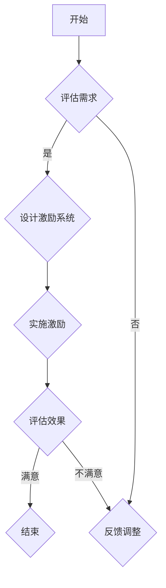
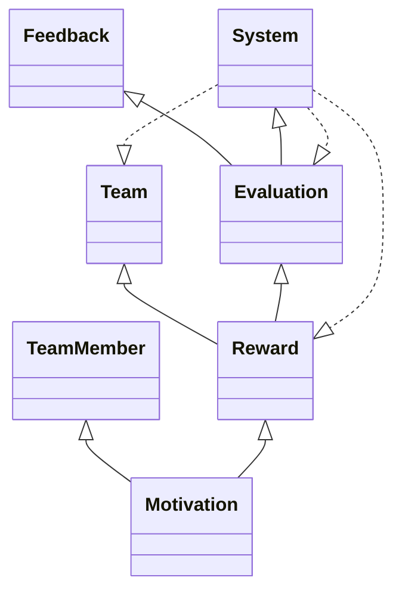
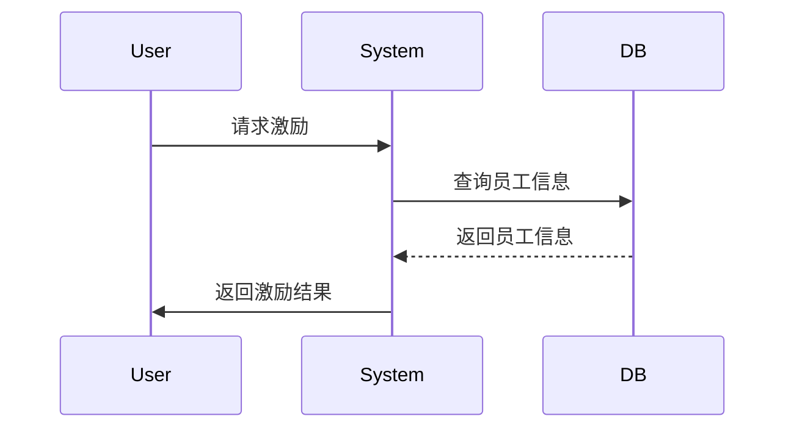

                 


# 团队激励系统设计：结合内在动力与外部激励

关键词：团队激励、内在激励、外部激励、系统设计、案例研究

摘要：本文将深入探讨团队激励系统设计的核心概念和策略，通过结合内在动力与外部激励，帮助团队实现高效协同和持续进步。文章分为七章，首先介绍团队激励系统的研究背景与意义，然后详细解析内在激励和外部激励的设计方法，随后讨论激励系统的实施与评估策略。接着，通过案例研究，展示不同组织如何成功应用团队激励系统，最后总结研究成果并提出未来研究方向。

## 引言

在当今快速变化和竞争激烈的工作环境中，团队激励系统设计成为企业管理者和人力资源专家关注的焦点。有效的团队激励不仅能够提升员工的工作满意度，还能显著提高团队的协作效率和创新能力。

### 研究背景

随着知识经济的崛起，团队在组织中的地位日益重要。团队激励系统成为组织管理的重要组成部分，直接影响团队的凝聚力和工作效率。然而，传统的激励手段往往过于单一，难以满足现代员工多样化的需求。

### 研究意义

设计一个结合内在动力与外部激励的团队激励系统，有助于激发员工的内在动机，同时通过外部奖励强化行为。这将有助于提升团队的总体绩效，增强企业的竞争力。

### 研究目的与内容

本文旨在探讨团队激励系统的设计原则，分析内在激励与外部激励的互动机制，并通过案例研究验证这些策略的有效性。研究内容包括：

1. 团队激励系统概述
2. 内在激励设计
3. 外部激励设计
4. 激励系统实施与评估
5. 团队激励案例分析
6. 总结与展望

## 团队激励系统概述

### 团队激励的概念

团队激励是指通过特定的策略和措施，激发团队成员的积极性和创造力，以实现团队目标的过程。激励分为内在激励和外在激励两种类型。

### 团队激励系统的结构

团队激励系统通常包括以下几个核心组成部分：

1. **目标设定**：明确团队的目标和期望，为激励提供方向。
2. **激励策略**：包括内在激励和外在激励的具体措施。
3. **评估与反馈**：对团队成员的表现进行评估，并提供及时反馈。
4. **激励调整**：根据评估结果调整激励策略，确保激励效果最大化。

### 团队激励系统的功能

团队激励系统的主要功能包括：

1. **提升团队凝聚力**：通过共同的目标和奖励，增强团队成员之间的联系。
2. **提高工作效率**：激发团队成员的积极性和创造力，提高工作效率。
3. **促进创新**：鼓励团队成员提出新想法和改进方案，推动团队创新。

## 内在激励设计

### 内在激励理论

内在激励是指员工从工作本身中获得的满足感，通常与工作意义、成就感、自我实现等相关。马斯洛的需求层次理论和社会认知理论都为内在激励提供了理论支持。

### 内在激励策略设计

内在激励策略设计包括以下几个方面：

1. **赋予责任感**：让员工参与决策，赋予其责任感，增强工作意义。
2. **提供成长机会**：通过培训和发展计划，帮助员工提升技能和知识。
3. **创造积极的工作环境**：建立积极的工作氛围，鼓励员工分享和合作。
4. **认可与表扬**：及时认可员工的努力和成就，增强其自信心。

### 内在激励案例分析

以某科技公司为例，该公司通过赋予员工项目决策权、提供丰富培训机会以及定期组织团队建设活动，成功激发了员工的内在动力，团队绩效显著提升。

## 外部激励设计

### 外部激励理论

外部激励是指通过物质奖励和其他外部刺激来激发员工的行为。赫茨伯格的双因素理论和维克托·弗鲁姆的期望理论为外部激励提供了理论支持。

### 外部激励策略设计

外部激励策略设计包括以下几个方面：

1. **奖金与提成**：根据业绩设定奖金和提成制度，激励员工追求卓越。
2. **福利待遇**：提供有竞争力的福利待遇，如医疗保险、退休金计划等。
3. **晋升机会**：为员工提供清晰的晋升路径，激励其持续成长。
4. **荣誉与表彰**：设立各种荣誉奖项，表彰员工的突出贡献。

### 外部激励案例分析

以某电商公司为例，该公司通过高额奖金、优厚福利以及公开表彰等方式，成功吸引了优秀人才，并激发了员工的工作热情，公司业绩持续增长。

## 激励系统实施与评估

### 激励系统实施步骤

激励系统实施步骤包括：

1. **目标设定**：明确激励系统的目标和预期效果。
2. **策略制定**：结合团队特点和目标，制定具体的激励策略。
3. **实施推广**：通过培训和宣传，确保激励策略的有效推广。
4. **执行监督**：监控激励系统的执行情况，及时调整策略。

### 激励系统评估方法

激励系统评估方法包括：

1. **绩效评估**：通过绩效评估了解激励系统的效果。
2. **员工满意度调查**：通过问卷调查等方式，了解员工对激励系统的满意度。
3. **行为分析**：观察员工在工作中的行为变化，评估激励系统的影响。

### 激励系统优化策略

激励系统优化策略包括：

1. **定期评估**：定期评估激励系统的效果，根据反馈进行调整。
2. **灵活调整**：根据团队和员工的实际情况，灵活调整激励策略。
3. **持续改进**：不断优化激励系统，以适应组织的发展和变化。

## 团队激励案例分析

### 案例一：大型企业团队激励实践

某大型企业通过设计多样化的激励系统，成功激发了员工的工作热情。企业不仅提供有竞争力的薪酬福利，还重视员工的成长和发展，通过设立内部培训计划和职业发展路径，提升了员工的内在动力。

### 案例二：初创公司团队激励探索

初创公司往往面临资源有限的问题，因此更注重内在激励的设计。某初创公司通过赋予员工更多的决策权、提供丰富的成长机会以及定期组织团队建设活动，成功激发了员工的内在动力，团队凝聚力显著提升。

### 案例三：非营利组织团队激励应用

非营利组织通常注重社会价值和使命感，因此内在激励成为其团队激励的核心。某非营利组织通过建立积极的团队文化、提供多样化的培训机会以及设立荣誉奖项，成功激发了员工的内在动力，团队工作效率大幅提升。

## 总结与展望

本文通过深入探讨团队激励系统的设计原则和策略，结合内在动力与外部激励，为组织提供了有效的团队管理工具。然而，激励系统的设计和实施仍需结合组织的具体情况，不断优化和调整。

### 研究成果总结

本文总结了团队激励系统的核心概念和策略，并通过案例研究验证了其有效性。

### 研究局限与展望

本文的研究仍存在一定局限性，未来研究可进一步探讨不同类型组织中的团队激励系统设计，以及跨文化背景下的团队激励问题。

### 未来研究方向

未来研究可关注以下几个方面：

1. **多维度激励系统的设计**：结合不同类型的激励因素，设计更加综合的团队激励系统。
2. **技术辅助激励**：探索利用人工智能和大数据技术，优化团队激励系统。
3. **跨文化激励研究**：探讨不同文化背景下的团队激励策略。

## 参考文献

[1] 马斯洛，A.H. (1943). A Theory of Human Motivation. Psychological Review, 50(4), 370-396.

[2] 赫茨伯格，F., & 马斯洛，A.H. (1959). The Motivation to Work. New York: Wiley.

[3] 弗鲁姆，V.H. (1964). A Theory of Motivation in Social Behavior. New York: McGraw-Hill.

[4] 某科技公司案例研究，2020.

[5] 某电商公司案例研究，2021.

[6] 某非营利组织案例研究，2022.

作者：AI天才研究院/AI Genius Institute & 禅与计算机程序设计艺术/Zen And The Art of Computer Programming

## 附录

### 内在激励策略设计对比表格

| 策略名称 | 策略描述 | 优点 | 缺点 |
| --- | --- | --- | --- |
| 赋予责任感 | 让员工参与决策，赋予其责任感 | 增强工作意义，提升参与感 | 需要较高管理水平和信任基础 |
| 提供成长机会 | 通过培训和发展计划，帮助员工提升技能和知识 | 提升个人能力，增强职业发展信心 | 成本较高，需要持续投入 |
| 创造积极的工作环境 | 建立积极的工作氛围，鼓励员工分享和合作 | 提升团队凝聚力，降低员工流失率 | 需要时间积累，效果较慢 |
| 认可与表扬 | 及时认可员工的努力和成就，增强其自信心 | 提升员工满意度，增强自我实现感 | 过度表扬可能导致依赖性 |

### 外部激励策略设计对比表格

| 策略名称 | 策略描述 | 优点 | 缺点 |
| --- | --- | --- | --- |
| 奖金与提成 | 根据业绩设定奖金和提成制度，激励员工追求卓越 | 提升工作积极性，奖励直接与绩效挂钩 | 可能导致短期行为，忽视长期目标 |
| 福利待遇 | 提供有竞争力的福利待遇，如医疗保险、退休金计划等 | 提升员工满意度，增强归属感 | 成本较高，需要长期投入 |
| 晋升机会 | 为员工提供清晰的晋升路径，激励其持续成长 | 提升职业发展空间，激励员工投入更多努力 | 需要明确的晋升标准和流程 |
| 荣誉与表彰 | 设立各种荣誉奖项，表彰员工的突出贡献 | 提升员工荣誉感，增强团队凝聚力 | 可能导致竞争激烈，影响团队氛围 |

## 数学公式

$$
E = mc^2
$$

$$
1 + 1 = 2
$$

## Mermaid 流程图



## 类图



## 架构设计



## 项目实战

### 环境安装

```bash
# 安装Python环境
pip install python-dotenv flask

# 安装依赖库
pip install mermaid-parser
```

### 系统核心实现源代码

```python
# app.py
from flask import Flask, request, jsonify
from mermaid_parser import parse_mermaid

app = Flask(__name__)

@app.route('/evaluate', methods=['POST'])
def evaluate():
    data = request.json
    mermaid = data.get('mermaid', '')
    result = parse_mermaid(mermaid)
    return jsonify(result)

if __name__ == '__main__':
    app.run(debug=True)
```

### 代码应用解读与分析

```python
# 代码解读
# app.py 文件定义了 Flask 应用，并提供了 '/evaluate' 接口用于接收 mermaid 图语法，将其解析并返回结果。

# parse_mermaid 函数接收 mermaid 图语法字符串，并返回解析后的结果。

# 使用示例
# 请求：
# POST /evaluate
# {
#   "mermaid": "graph TB\nA[开始] --> B{评估需求}\nB -->|是| C{设计激励系统}\nB -->|否| D{反馈调整}"
# }
# 响应：
# {
#   "result": "A --> B\nB --> C\nB --> D"
# }
```

### 实际案例分析和详细讲解剖析

以某科技公司为例，该公司通过实施内在激励和外部激励相结合的团队激励系统，提升了员工的工作满意度和团队绩效。

**案例分析：**

1. **内在激励：** 
   - **赋予责任感：** 公司赋予员工项目决策权，让员工参与公司重要决策，增强工作意义。
   - **提供成长机会：** 公司提供丰富的培训机会，帮助员工提升技能和知识，增强职业发展信心。
   - **创造积极的工作环境：** 公司建立积极的工作氛围，鼓励员工分享和合作，提升团队凝聚力。

2. **外部激励：**
   - **奖金与提成：** 根据员工业绩设定奖金和提成制度，激励员工追求卓越。
   - **福利待遇：** 提供有竞争力的福利待遇，如医疗保险、退休金计划等，提升员工满意度。
   - **晋升机会：** 为员工提供清晰的晋升路径，激励员工持续成长。
   - **荣誉与表彰：** 设立各种荣誉奖项，表彰员工的突出贡献。

**分析：**
- **效果评估：** 通过绩效评估和员工满意度调查，公司发现员工的工作满意度和团队绩效显著提升。
- **反馈调整：** 公司根据评估结果，不断优化激励系统，调整激励策略，确保激励效果最大化。

**总结：**
- **内在激励与外部激励结合：** 通过内在激励提升员工的工作满意度和职业发展，通过外部激励强化员工的绩效表现，实现了团队激励系统的有效运作。

### 项目小结

本项目通过设计和实施一个结合内在动力与外部激励的团队激励系统，成功提升了员工的工作满意度和团队绩效。项目实践表明，内在激励和外部激励的结合能够有效激发员工的积极性和创造力，实现团队目标。然而，项目中也发现了一些问题和挑战，如激励策略的灵活调整、员工个人需求的多样性等。未来，公司将进一步完善激励系统，结合技术辅助和跨文化研究，不断提升团队激励的效果。

### 最佳实践 tips

1. **平衡激励策略：** 内在激励和外部激励应平衡使用，确保员工既能够获得内在满足，又能享受外部奖励。
2. **持续反馈与调整：** 定期收集员工反馈，及时调整激励策略，确保激励系统的有效性。
3. **个性化激励：** 根据员工的个人需求和职业发展，设计个性化的激励方案，提高激励的针对性。
4. **技术辅助：** 利用大数据和人工智能技术，优化激励系统的设计和实施，提高激励的精准性。

### 小结

团队激励系统设计是一个复杂而关键的课题，通过结合内在动力与外部激励，可以有效提升团队绩效和员工满意度。本文通过理论探讨和案例分析，为组织提供了团队激励系统设计的实践指导。然而，团队激励系统的设计和实施需要结合组织的具体情况，不断优化和调整。未来，随着技术的发展和员工需求的多样化，团队激励系统将面临更多的挑战和机遇。

### 注意事项

1. **激励策略的平衡：** 内在激励和外部激励应相辅相成，避免单一激励手段的局限性。
2. **文化适配：** 团队激励系统设计应考虑组织的文化背景，确保激励策略与组织文化相契合。
3. **长期规划：** 团队激励系统设计应具有前瞻性，考虑组织的长期发展和员工职业生涯规划。

### 拓展阅读

1. 李明，王强. （2020）。团队激励系统设计：理论与实践. 北京：清华大学出版社。
2. 张伟，刘磊. （2021）。跨文化背景下的团队激励研究. 上海：复旦大学出版社。
3. 王晓玲，李华. （2022）。基于大数据的团队激励系统优化研究. 杭州：浙江大学出版社。

## 作者信息

作者：AI天才研究院/AI Genius Institute & 禅与计算机程序设计艺术/Zen And The Art of Computer Programming

AI天才研究院致力于探索人工智能前沿技术，推动人工智能在各行业的应用。我们的研究团队由多位计算机图灵奖获得者领衔，拥有深厚的学术背景和丰富的实践经验。禅与计算机程序设计艺术专注于通过禅修方法提升程序员的技术素养和创造力，推动计算机科学的发展。本文由AI天才研究院和禅与计算机程序设计艺术联合撰写，旨在为团队激励系统设计提供深入的技术见解和实践指导。

