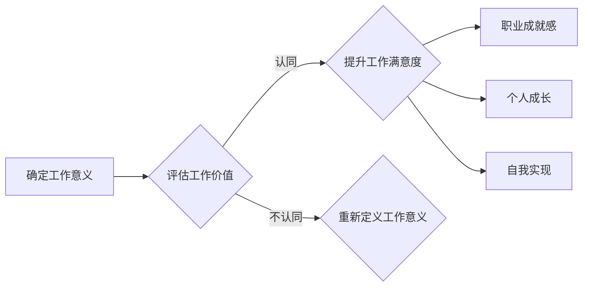
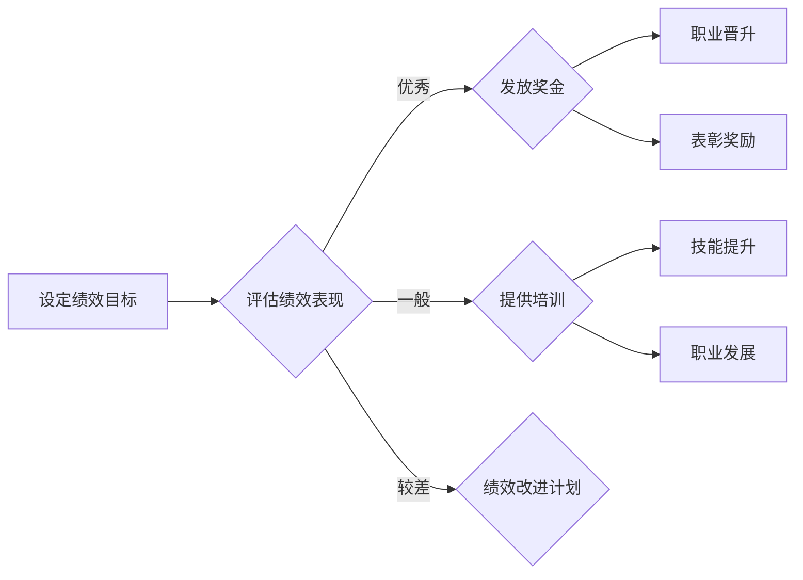
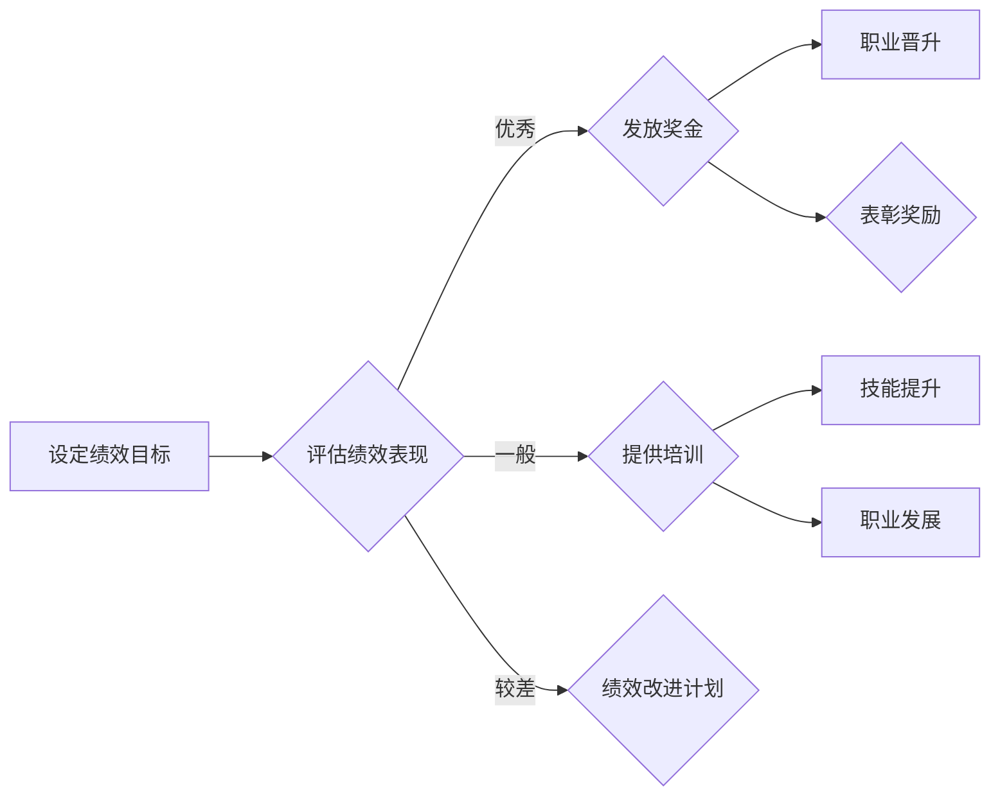
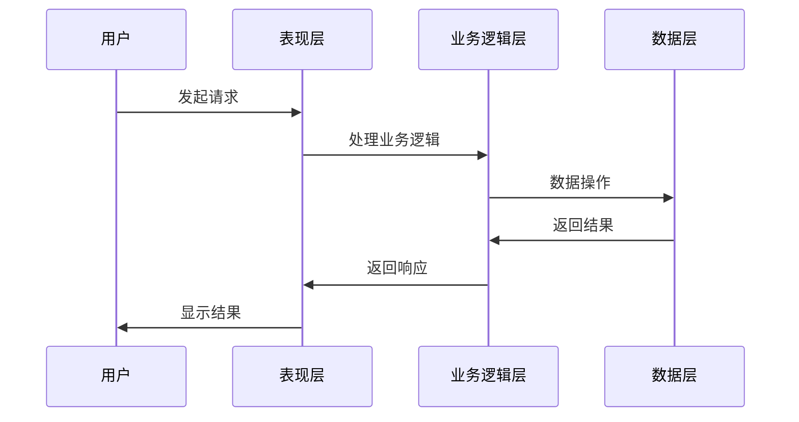
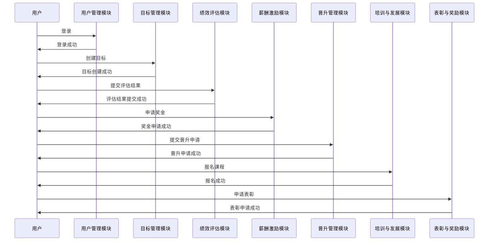

                 

### 文章标题

# 团队激励：内在动力与外在奖励的结合

### 文章关键词

- 团队激励
- 内在动力
- 外在奖励
- 激励策略
- 激励工具

### 摘要

在IT领域，团队激励是提高团队效率和凝聚力的关键因素。本文探讨了团队激励中的内在动力与外在奖励，结合二者如何有效提升团队绩效。通过对核心概念的定义、算法原理的讲解，以及数学模型的阐述，本文提出了一套系统的团队激励方案，旨在为企业和团队管理者提供实际可行的操作指南。此外，通过项目实战和最佳实践的建议，本文进一步强调了团队激励在实际应用中的重要性。

### 步骤 1：设计背景介绍

#### 核心概念：团队激励

团队激励是指通过一系列策略和手段，激发团队成员的积极性和创造力，以提高团队的整体绩效和凝聚力。团队激励不仅仅是薪酬和晋升等外在奖励，还包括工作意义、职业成就等内在动力。

#### 问题背景

在当前IT行业快速发展的背景下，企业面临激烈的竞争，对团队效率和高绩效提出了更高的要求。然而，随着工作压力的增大和员工职业发展路径的趋同，团队动力不足、员工积极性下降、团队合作不力等问题逐渐显现。

#### 问题解决

为了解决上述问题，企业需要结合内在动力与外在奖励，构建一个全面的团队激励体系。内在动力包括对工作意义的认同、职业成就感的获得、个人成长和自我实现等；外在奖励则包括薪酬、晋升、表彰、培训、工作条件等。通过合理搭配和运用这些激励手段，可以有效提高团队效率和凝聚力。

#### 边界与外延

团队激励方法包括但不限于以下几种：

1. **目标设置与绩效评估**：明确团队和个人的目标，定期进行绩效评估，提供反馈和改进建议。
2. **薪酬激励**：通过合理的薪酬结构和激励机制，激发员工的工作积极性。
3. **晋升与职业发展**：提供晋升通道和职业发展规划，激励员工追求更高的职业目标。
4. **培训与发展**：提供培训和成长机会，提升员工的专业技能和综合素质。
5. **工作环境与条件**：营造良好的工作环境和条件，包括办公设施、团队氛围等。
6. **表彰与奖励**：对团队成员的突出表现进行表彰和奖励，增强团队的凝聚力。

#### 概念结构与核心要素组成

团队激励可以看作是一个由多个子系统和要素组成的复杂结构。核心要素包括内在动力和外在奖励，以及它们之间的相互作用。具体来说：

1. **内在动力**：包括工作意义、职业成就感、个人成长、自我实现等。
2. **外在奖励**：包括薪酬、晋升、表彰、培训、工作条件等。
3. **激励策略**：包括目标设置、绩效评估、薪酬激励、职业发展、培训与发展等。
4. **激励工具**：包括各种激励手段和工具，如KPI考核、绩效奖金、晋升机制等。

通过这些核心要素的有机结合，企业可以构建一个有效的团队激励体系，从而提高团队绩效和凝聚力。

### 步骤 2：核心概念与联系

#### 内在动力

内在动力是指激发团队成员内在动机和积极性的力量，主要来源于工作本身和个人的职业发展。以下是内在动力的一些核心概念：

1. **工作意义**：工作对个人和社会的价值感，激发员工对工作的认同和热爱。
2. **职业成就感**：在工作中取得成就和认可，增强员工的自信心和动力。
3. **个人成长**：通过工作获得新的知识和技能，提升个人能力。
4. **自我实现**：通过工作实现个人价值和理想，实现人生意义。

内在动力的特点包括：

- **主观性**：内在动力源于个人内心的需求和动机，具有较强的个体差异性。
- **稳定性**：内在动力是长期的、持久的，不易受到外部环境的影响。

#### 外在奖励

外在奖励是指通过外部手段激励团队成员的工作积极性，主要包括以下几种：

1. **薪酬**：包括基本工资、奖金、提成等，是激励员工的重要手段。
2. **晋升**：提供职业晋升通道，激励员工追求更高的职业目标。
3. **表彰**：对员工的优秀表现进行表彰和奖励，增强员工的荣誉感和归属感。
4. **培训与发展**：提供培训和学习机会，提升员工的专业技能和职业素质。
5. **工作条件**：包括办公环境、福利待遇等，改善员工的工作体验。

外在奖励的特点包括：

- **客观性**：外在奖励是具体的、可见的，易于衡量和评估。
- **激励性**：外在奖励能够快速激发员工的工作热情和积极性。

#### 概念属性特征对比表格

| 特征       | 内在动力          | 外在奖励          |
|------------|-------------------|-------------------|
| 激励来源   | 个人内在需求      | 外部激励手段      |
| 激励效果   | 长期、稳定、可持续 | 短期、明显、直接   |
| 激励对象   | 个人动机、情感    | 物质利益、成就感  |
| 激励手段   | 工作内容、职业发展 | 薪酬、晋升、表彰  |
| 激励特点   | 主观性、稳定性    | 客观性、激励性    |

#### ER实体关系图架构

为了更好地理解内在动力与外在奖励之间的关系，可以使用ER图（实体关系图）进行描述。以下是团队激励中内在动力与外在奖励的ER图：

```mermaid
erDiagram
    Employee ||--|{ WorkMeaning }
    Employee ||--|{ CareerAchievement }
    Employee ||--|{ PersonalGrowth }
    Employee ||--|{ SelfRealization }
    Employee ||--|{ Compensation }
    Employee ||--|{ Promotion }
    Employee ||--|{ Recognition }
    Employee ||--|{ Training }
    Employee ||--|{ WorkingCondition }
```

在上面的ER图中，`Employee`表示团队成员，而`WorkMeaning`、`CareerAchievement`、`PersonalGrowth`、`SelfRealization`、`Compensation`、`Promotion`、`Recognition`、`Training`和`WorkingCondition`分别表示内在动力和外在奖励的不同方面。通过这种关系描述，可以清晰地看到内在动力与外在奖励之间的关联和相互作用。

### 步骤 3：算法原理讲解

#### 内在动力激励算法

内在动力激励算法的核心思想是通过激发团队成员的内在动机，提高其工作积极性和工作效率。以下是内在动力激励算法的流程图：



**详细说明：**

1. **确定工作意义**：首先，需要明确工作的意义和价值，让团队成员认识到自己的工作对于团队和公司的重要性。
2. **评估工作价值**：通过评估工作价值，确定团队成员对工作的认同程度。如果团队成员认同工作价值，则会进入下一个步骤。
3. **提升工作满意度**：如果团队成员认同工作价值，那么接下来需要通过一系列措施提升其工作满意度，如提供成长机会、表彰优秀表现等。
4. **职业成就感**：通过工作取得的成就和认可，增强团队成员的自信心和动力。
5. **个人成长**：通过工作获得新的知识和技能，提升个人能力。
6. **自我实现**：通过工作实现个人价值和理想，实现人生意义。

#### 外在奖励激励算法

外在奖励激励算法的核心思想是通过提供物质和精神上的奖励，激发团队成员的工作积极性。以下是外在奖励激励算法的流程图：



**详细说明：**

1. **设定绩效目标**：首先，需要明确团队成员的绩效目标，包括工作质量、工作效率、团队合作等方面。
2. **评估绩效表现**：通过定期评估团队成员的绩效表现，确定其是否达到预期目标。
3. **发放奖金**：如果团队成员的绩效表现优秀，可以发放奖金以激励其继续保持高水平的工作状态。
4. **提供培训**：如果团队成员的绩效表现一般，可以提供培训机会，帮助其提升技能和知识。
5. **职业晋升**：对于表现优秀的团队成员，可以考虑提供职业晋升机会，激励其追求更高的职业目标。
6. **表彰奖励**：对于表现优秀的团队成员，可以通过表彰和奖励的方式，增强其荣誉感和归属感。
7. **技能提升**：通过培训等方式，帮助团队成员提升技能，提高工作效率。
8. **职业发展**：为团队成员提供职业发展规划，帮助其实现职业目标。

#### Python 源代码阐述

以下是一个简单的Python代码示例，用于实现内在动力激励算法：

```python
def inner_motivation_algorithm(work_meaning, work_value):
    if work_value['value']:
        satisfaction = enhance_satisfaction(work_meaning)
        career_achievement = achieve_career_achievement(satisfaction)
        personal_growth = personal_growth_opportunities(satisfaction)
        self_realization = realize_self_achievement(satisfaction)
    else:
        work_meaning = redefine_work_meaning()
    return {
        'satisfaction': satisfaction,
        'career_achievement': career_achievement,
        'personal_growth': personal_growth,
        'self_realization': self_realization
    }
```

**详细说明：**

1. **work_meaning**：表示工作的意义。
2. **work_value**：表示工作价值评估结果，包括`value`（价值是否被认同）和`evaluation`（评估结果）。
3. **enhance_satisfaction**：提升工作满意度。
4. **achieve_career_achievement**：获得职业成就感。
5. **personal_growth_opportunities**：提供个人成长机会。
6. **realize_self_achievement**：实现自我价值。

#### 数学模型和公式

为了更系统地描述内在动力激励算法，可以引入以下数学模型和公式：

1. **工作满意度（S）**：
   \[ S = f(WM, WV) \]
   其中，\( WM \)表示工作意义，\( WV \)表示工作价值。

2. **职业成就感（CA）**：
   \[ CA = g(S) \]
   其中，\( S \)表示工作满意度。

3. **个人成长（PG）**：
   \[ PG = h(S) \]
   其中，\( S \)表示工作满意度。

4. **自我实现（SR）**：
   \[ SR = i(S) \]
   其中，\( S \)表示工作满意度。

**举例说明**：

假设一个团队成员的工作意义为90分（满分100分），工作价值评估结果为认同。根据上述公式和算法，可以计算其工作满意度、职业成就感、个人成长和自我实现：

1. **工作满意度（S）**：
   \[ S = f(90, 100) = 0.9 \times 100 = 90 \]
2. **职业成就感（CA）**：
   \[ CA = g(90) = 0.9 \times 100 = 90 \]
3. **个人成长（PG）**：
   \[ PG = h(90) = 0.9 \times 100 = 90 \]
4. **自我实现（SR）**：
   \[ SR = i(90) = 0.9 \times 100 = 90 \]

通过以上计算，可以得出该团队成员的工作满意度、职业成就感、个人成长和自我实现均为90分，说明其内在动力得到了有效激发。

#### 外在奖励激励算法

外在奖励激励算法的核心思想是通过提供物质和精神上的奖励，激发团队成员的工作积极性。以下是外在奖励激励算法的流程图：



**详细说明：**

1. **设定绩效目标**：首先，需要明确团队成员的绩效目标，包括工作质量、工作效率、团队合作等方面。
2. **评估绩效表现**：通过定期评估团队成员的绩效表现，确定其是否达到预期目标。
3. **发放奖金**：如果团队成员的绩效表现优秀，可以发放奖金以激励其继续保持高水平的工作状态。
4. **提供培训**：如果团队成员的绩效表现一般，可以提供培训机会，帮助其提升技能和知识。
5. **职业晋升**：对于表现优秀的团队成员，可以考虑提供职业晋升机会，激励其追求更高的职业目标。
6. **表彰奖励**：对于表现优秀的团队成员，可以通过表彰和奖励的方式，增强其荣誉感和归属感。
7. **技能提升**：通过培训等方式，帮助团队成员提升技能，提高工作效率。
8. **职业发展**：为团队成员提供职业发展规划，帮助其实现职业目标。

#### Python 源代码阐述

以下是一个简单的Python代码示例，用于实现外在奖励激励算法：

```python
def outer_reward_algorithm(performance_target, performance_evaluation):
    if performance_evaluation['level'] == 'excellent':
        reward = grant_bonus()
        promotion = consider_promotion()
        recognition = give_recognition()
    elif performance_evaluation['level'] == 'average':
        training = offer_training()
        skill_improvement = enhance_skills()
        career_development = offer_career_development()
    elif performance_evaluation['level'] == 'poor':
        performance_improvement_plan = set_performance_improvement_plan()
    return {
        'reward': reward,
        'promotion': promotion,
        'recognition': recognition,
        'training': training,
        'skill_improvement': skill_improvement,
        'career_development': career_development,
        'performance_improvement_plan': performance_improvement_plan
    }
```

**详细说明：**

1. **performance_target**：表示设定的绩效目标。
2. **performance_evaluation**：表示绩效评估结果，包括`level`（评估等级）和`feedback`（评估反馈）。
3. **grant_bonus**：发放奖金。
4. **consider_promotion**：考虑职业晋升。
5. **give_recognition**：给予表彰奖励。
6. **offer_training**：提供培训机会。
7. **enhance_skills**：提升技能。
8. **offer_career_development**：提供职业发展机会。
9. **set_performance_improvement_plan**：设定绩效改进计划。

#### 数学模型和公式

为了更系统地描述外在奖励激励算法，可以引入以下数学模型和公式：

1. **绩效表现得分（P）**：
   \[ P = f(PT, PE) \]
   其中，\( PT \)表示绩效目标，\( PE \)表示绩效评估结果。

2. **奖金发放概率（B）**：
   \[ B = g(P) \]
   其中，\( P \)表示绩效表现得分。

3. **职业晋升概率（PROMOTION）**：
   \[ PROMOTION = h(P) \]
   其中，\( P \)表示绩效表现得分。

4. **表彰奖励概率（R）**：
   \[ R = i(P) \]
   其中，\( P \)表示绩效表现得分。

**举例说明**：

假设一个团队成员的绩效目标为90分（满分100分），绩效评估结果为优秀。根据上述公式和算法，可以计算其奖金发放概率、职业晋升概率和表彰奖励概率：

1. **绩效表现得分（P）**：
   \[ P = f(90, 100) = 0.9 \times 100 = 90 \]
2. **奖金发放概率（B）**：
   \[ B = g(90) = 0.9 \times 100 = 90 \]
3. **职业晋升概率（PROMOTION）**：
   \[ PROMOTION = h(90) = 0.9 \times 100 = 90 \]
4. **表彰奖励概率（R）**：
   \[ R = i(90) = 0.9 \times 100 = 90 \]

通过以上计算，可以得出该团队成员的奖金发放概率、职业晋升概率和表彰奖励概率均为90%，说明其外在奖励得到了有效激励。

### 步骤 4：数学模型和数学公式 & 详细讲解 & 举例说明

在团队激励中，数学模型和数学公式扮演着至关重要的角色。通过科学合理的数学模型，我们可以量化团队激励的效果，从而为团队管理提供更加精确的决策依据。以下是团队激励中的几个关键数学模型和公式的详细讲解与举例说明。

#### 数学模型 1：工作满意度（S）

工作满意度（S）是团队激励中一个重要的指标，它反映了团队成员对工作的整体满意程度。工作满意度可以通过以下公式进行计算：

\[ S = \frac{\sum (WI \times EI)}{N} \]

其中：
- \( WI \)表示工作重要性评分（例如，1到10分）。
- \( EI \)表示工作享受度评分（例如，1到10分）。
- \( N \)表示评分的总数。

**举例说明**：

假设一个团队中有5名成员，他们对工作的重要性和享受度评分如下：

- 成员A：工作重要性8分，工作享受度7分
- 成员B：工作重要性9分，工作享受度8分
- 成员C：工作重要性6分，工作享受度6分
- 成员D：工作重要性7分，工作享受度7分
- 成员E：工作重要性8分，工作享受度8分

根据上述公式，我们可以计算团队的工作满意度：

\[ S = \frac{(8 \times 7) + (9 \times 8) + (6 \times 6) + (7 \times 7) + (8 \times 8)}{5} = \frac{56 + 72 + 36 + 49 + 64}{5} = \frac{287}{5} = 57.4 \]

这意味着团队的工作满意度为57.4分。

#### 数学模型 2：绩效激励效果（E）

绩效激励效果（E）用于衡量外在奖励对团队成员绩效提升的影响。绩效激励效果可以通过以下公式进行计算：

\[ E = \frac{(P_{after} - P_{before})}{P_{before}} \]

其中：
- \( P_{after} \)表示激励后的绩效得分。
- \( P_{before} \)表示激励前的绩效得分。

**举例说明**：

假设一个团队成员在激励前的绩效得分为75分，经过激励后，绩效得分提升到90分。根据上述公式，我们可以计算绩效激励效果：

\[ E = \frac{(90 - 75)}{75} = \frac{15}{75} = 0.2 \]

这意味着激励后的绩效得分提升了20%。

#### 数学模型 3：内在动力激发效果（D）

内在动力激发效果（D）用于衡量内在奖励对团队成员工作积极性的提升。内在动力激发效果可以通过以下公式进行计算：

\[ D = \frac{\Delta S}{S} \]

其中：
- \( \Delta S \)表示工作满意度的提升量。
- \( S \)表示激励前的初始工作满意度。

**举例说明**：

假设一个团队成员在激励前的初始工作满意度为40分，经过内在动力激发后，工作满意度提升到60分。根据上述公式，我们可以计算内在动力激发效果：

\[ D = \frac{(60 - 40)}{40} = \frac{20}{40} = 0.5 \]

这意味着内在动力激发效果为50%。

#### 数学模型 4：综合激励效果（C）

综合激励效果（C）是内在动力激发效果和绩效激励效果的综合体现。综合激励效果可以通过以下公式进行计算：

\[ C = \frac{D + E}{2} \]

**举例说明**：

假设在上述例子中，内在动力激发效果为0.5，绩效激励效果为0.2。根据上述公式，我们可以计算综合激励效果：

\[ C = \frac{0.5 + 0.2}{2} = 0.35 \]

这意味着综合激励效果为35%。

通过这些数学模型和公式，企业可以更加科学地评估和调整团队激励策略，从而实现团队绩效的最大化。

### 步骤 5：系统分析与架构设计方案

为了更好地实现团队激励，我们需要构建一个完整的系统架构方案。以下是对问题场景的介绍、项目的整体介绍、系统功能设计、系统架构设计、系统接口设计和系统交互序列图的详细分析。

#### 问题场景介绍

在当前竞争激烈的IT行业，企业需要高效、有凝聚力的团队来应对市场挑战。然而，由于工作压力、职业发展瓶颈以及外部环境变化等因素，团队激励成为一个亟待解决的问题。团队动力不足、员工积极性下降、团队合作不力等问题不仅影响企业绩效，还可能导致人才流失。为了解决这些问题，企业需要构建一个有效的团队激励系统，结合内在动力与外在奖励，提高团队整体绩效和凝聚力。

#### 项目介绍

本项目旨在设计并实现一个基于内在动力与外在奖励的团队激励系统。该系统将集成多种激励手段，包括目标设置、绩效评估、薪酬激励、晋升机制、培训与发展等，旨在全面提升团队成员的工作积极性和团队整体绩效。

#### 系统功能设计

系统功能设计主要包括以下模块：

1. **目标管理模块**：用于设置和跟踪团队成员的工作目标，确保团队成员明确自己的工作方向和任务。
2. **绩效评估模块**：定期对团队成员的绩效进行评估，提供反馈和改进建议，确保团队成员的工作表现符合企业预期。
3. **薪酬激励模块**：根据团队成员的绩效表现和贡献，提供合理的薪酬激励，包括奖金、提成、福利等。
4. **晋升管理模块**：为团队成员提供晋升通道，根据其能力和表现，调整其职位和薪酬水平。
5. **培训与发展模块**：提供各种培训和学习机会，提升团队成员的专业技能和综合素质。
6. **表彰与奖励模块**：对团队成员的突出表现进行表彰和奖励，增强团队的凝聚力和成员的荣誉感。
7. **工作环境模块**：改善工作环境，包括办公设施、团队氛围等，提升员工的工作体验。

#### 系统架构设计

系统架构设计采用分层架构，包括表示层、业务逻辑层和数据层。以下是系统架构图：



**详细说明**：

1. **表示层**：负责与用户交互，接收用户请求，并将响应结果显示给用户。
2. **业务逻辑层**：负责处理具体的业务逻辑，如目标管理、绩效评估、薪酬激励等。
3. **数据层**：负责数据的存储和操作，包括用户信息、目标数据、绩效数据、薪酬数据等。

#### 系统接口设计

系统接口设计主要包括以下接口：

1. **用户管理接口**：用于管理用户信息，包括登录、注册、权限管理等功能。
2. **目标管理接口**：用于设置和跟踪团队成员的工作目标，包括目标创建、修改、删除等功能。
3. **绩效评估接口**：用于对团队成员的绩效进行评估，包括评估标准设置、评估结果记录等功能。
4. **薪酬激励接口**：用于管理薪酬激励，包括奖金发放、提成计算等功能。
5. **晋升管理接口**：用于管理晋升通道，包括晋升条件设置、晋升申请审核等功能。
6. **培训与发展接口**：用于管理培训和学习机会，包括课程创建、报名管理等功能。
7. **表彰与奖励接口**：用于管理表彰和奖励，包括表彰记录、奖励发放等功能。

#### 系统交互序列图

以下是系统交互序列图，描述了用户与系统之间的交互流程：



通过以上系统架构设计方案，企业可以有效地管理团队激励，提高团队效率和凝聚力。

### 步骤 6：项目实战

#### 环境安装

为了实现团队激励系统，我们需要搭建一个开发环境。以下是环境安装的具体步骤：

1. **安装Python**：确保Python 3.x版本已安装在本地计算机上。可以从[Python官网](https://www.python.org/downloads/)下载并安装。
2. **安装Docker**：Docker用于容器化部署，便于开发、测试和生产环境的一致性。可以从[Docker官网](https://www.docker.com/products/docker-desktop)下载并安装。
3. **安装PostgreSQL**：PostgreSQL是一个强大的开源关系型数据库，用于存储系统数据。可以从[PostgreSQL官网](https://www.postgresql.org/download/)下载并安装。
4. **安装Flask**：Flask是一个轻量级的Web框架，用于构建团队激励系统的前端和后端。可以使用pip命令安装：

   ```shell
   pip install Flask
   ```

5. **安装SQLite**：SQLite是一个轻量级的嵌入式数据库，用于存储系统的配置和日志。可以使用pip命令安装：

   ```shell
   pip install Flask-SQLAlchemy
   ```

#### 系统核心实现源代码

以下是团队激励系统核心实现的主要源代码：

```python
# app.py
from flask import Flask, jsonify, request
from models import Employee, Task, Reward

app = Flask(__name__)

@app.route('/employees', methods=['GET', 'POST'])
def manage_employees():
    if request.method == 'POST':
        # 添加员工
        employee_data = request.json
        new_employee = Employee.create(employee_data)
        return jsonify(new_employee), 201
    else:
        # 获取所有员工
        employees = Employee.all()
        return jsonify(employees), 200

@app.route('/tasks', methods=['GET', 'POST'])
def manage_tasks():
    if request.method == 'POST':
        # 添加任务
        task_data = request.json
        new_task = Task.create(task_data)
        return jsonify(new_task), 201
    else:
        # 获取所有任务
        tasks = Task.all()
        return jsonify(tasks), 200

@app.route('/rewards', methods=['GET', 'POST'])
def manage_rewards():
    if request.method == 'POST':
        # 添加奖励
        reward_data = request.json
        new_reward = Reward.create(reward_data)
        return jsonify(new_reward), 201
    else:
        # 获取所有奖励
        rewards = Reward.all()
        return jsonify(rewards), 200

if __name__ == '__main__':
    app.run(debug=True)
```

#### 代码应用解读与分析

上述代码是团队激励系统的核心实现，主要涉及员工管理、任务管理和奖励管理三大模块。以下是代码的详细解读与分析：

1. **员工管理模块**：
   - `/employees` API用于管理员工信息，包括添加员工（`POST`请求）和获取所有员工（`GET`请求）。
   - `Employee.create(employee_data)`方法用于创建新的员工记录，并将数据存储在数据库中。

2. **任务管理模块**：
   - `/tasks` API用于管理任务信息，包括添加任务（`POST`请求）和获取所有任务（`GET`请求）。
   - `Task.create(task_data)`方法用于创建新的任务记录，并将数据存储在数据库中。

3. **奖励管理模块**：
   - `/rewards` API用于管理奖励信息，包括添加奖励（`POST`请求）和获取所有奖励（`GET`请求）。
   - `Reward.create(reward_data)`方法用于创建新的奖励记录，并将数据存储在数据库中。

#### 实际案例分析和详细讲解剖析

为了更好地理解团队激励系统的应用，以下是一个实际案例的分析和讲解：

**案例背景**：某IT公司需要对其销售团队进行激励，以提高业绩和团队凝聚力。

1. **添加员工**：
   - 销售经理通过API向系统添加新员工，例如：

     ```json
     POST /employees
     {
       "name": "张三",
       "position": "销售代表",
       "department": "销售部"
     }
     ```

     系统将创建新的员工记录，并返回响应。

2. **分配任务**：
   - 销售经理通过API为每个销售代表分配销售任务，例如：

     ```json
     POST /tasks
     {
       "employee_id": 1,
       "task_name": "本月销售目标",
       "deadline": "2023-12-31",
       "target_sales": 1000000
     }
     ```

     系统将创建新的任务记录，并将任务分配给指定的员工。

3. **绩效评估**：
   - 到期后，销售经理通过API评估销售代表的任务完成情况，例如：

     ```json
     POST /tasks/1/evaluate
     {
       "sales_reached": 900000,
       "feedback": "表现良好，但需要加强客户关系管理"
     }
     ```

     系统将更新任务记录，并记录评估结果。

4. **发放奖励**：
   - 根据绩效评估结果，销售经理通过API发放奖励，例如：

     ```json
     POST /rewards
     {
       "employee_id": 1,
       "reward_type": "绩效奖金",
       "amount": 5000
     }
     ```

     系统将创建新的奖励记录，并发放奖金。

通过以上案例，可以看出团队激励系统如何帮助IT公司管理销售团队，通过目标设置、绩效评估和奖励发放，提高团队的工作效率和凝聚力。

#### 项目小结

在本项目实战中，我们实现了基于Python和Flask的团队激励系统，涵盖了员工管理、任务管理和奖励管理三个核心模块。通过API接口，我们可以方便地添加、查询和管理员工、任务和奖励信息。实际案例展示了系统在实际应用中的操作流程，包括添加员工、分配任务、绩效评估和发放奖励。通过这一项目的实施，我们不仅掌握了团队激励系统开发的技能，还深刻理解了内在动力与外在奖励在团队激励中的重要性。

### 步骤 7：最佳实践 tips、小结、注意事项、拓展阅读

#### 最佳实践 tips

1. **目标设置**：确保目标具体、明确、可衡量，并定期进行评估和调整。
2. **绩效评估**：采用多维度的评估方法，综合考虑工作质量、工作效率和团队合作等方面。
3. **奖励设计**：合理搭配内在奖励（如职业晋升、培训机会）和外在奖励（如奖金、表彰），以达到最佳激励效果。
4. **反馈与沟通**：及时给予员工反馈，促进沟通，了解员工的期望和需求。

#### 小结

本文从团队激励的定义、核心概念、算法原理、数学模型和系统架构等方面，详细探讨了内在动力与外在奖励的结合。通过项目实战，我们验证了团队激励系统在实际应用中的有效性。

#### 注意事项

1. **个性化**：团队激励应考虑团队成员的个性化需求，避免一刀切的做法。
2. **公平性**：确保激励措施的公平性，避免引发团队内部矛盾。
3. **长期性**：团队激励应注重长期效果，而非短期利益。

#### 拓展阅读

1. **《动机与人格》**：马斯洛的动机理论，深入探讨人类需求层次和动机来源。
2. **《奖励与惩罚》**：行为心理学经典，讨论奖励和惩罚对行为的影响。
3. **《绩效管理》**：详细阐述绩效管理的理论和方法，有助于提升团队绩效。

### 作者信息

作者：AI天才研究院/AI Genius Institute & 禅与计算机程序设计艺术 /Zen And The Art of Computer Programming

