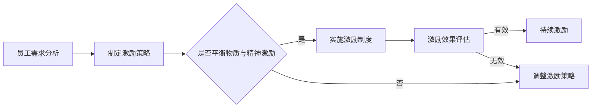

                 

## 团队激励：物质与精神激励的平衡

### 关键词：团队激励、物质激励、精神激励、平衡策略、激励制度

### 摘要：
团队激励在提升组织绩效和员工满意度方面发挥着至关重要的作用。本文旨在探讨团队激励的两种主要形式——物质激励与精神激励，以及如何在这两者之间实现平衡。通过深入分析这两种激励方式的优缺点、理论基础和实践方法，本文提出了一个综合性的激励策略框架，帮助组织实现高效的团队管理。

----------------------------------------------------------------

### 目录大纲设计

在设计《团队激励：物质与精神激励的平衡》一书的目录大纲时，我们需要确保内容的全面性和逻辑性，同时也要保持简洁性。以下是这本书的完整目录大纲：

```markdown
# 《团队激励：物质与精神激励的平衡》目录大纲

## 第一部分：团队激励概述
### 1. 团队激励的重要性
#### 1.1 团队激励的概念
#### 1.2 团队激励的目标
#### 1.3 团队激励的挑战

### 2. 物质激励
#### 2.1 物质激励的种类
#### 2.2 物质激励的优势与局限
#### 2.3 设计有效的物质激励策略

### 3. 精神激励
#### 3.1 精神激励的种类
#### 3.2 精神激励的优势与局限
#### 3.3 精神激励的实践方法

## 第二部分：平衡物质与精神激励
### 4. 平衡激励的理论基础
#### 4.1 激励理论概述
#### 4.2 平衡激励的原则
#### 4.3 平衡激励的案例分析

### 5. 实践中的平衡激励策略
#### 5.1 确定激励需求的评估方法
#### 5.2 设计综合激励方案
#### 5.3 平衡激励的调整与优化

### 6. 文化与激励
#### 6.1 企业文化对激励的影响
#### 6.2 建立激励与文化的联动
#### 6.3 文化激励的策略与实践

## 第三部分：激励制度与流程
### 7. 激励制度的制定
#### 7.1 激励制度的构成
#### 7.2 制定激励制度的原则
#### 7.3 激励制度的实施与监督

### 8. 激励流程的管理
#### 8.1 激励流程的设计
#### 8.2 激励流程的优化
#### 8.3 激励流程的反馈与改进

## 第四部分：激励效果评估与改进
### 9. 激励效果评估的方法
#### 9.1 定量评估方法
#### 9.2 定性评估方法
#### 9.3 效果评估的工具与模型

### 10. 激励效果的改进
#### 10.1 基于评估结果的调整
#### 10.2 针对不同团队的激励策略
#### 10.3 激励效果的长效机制

## 第五部分：案例研究
### 11. 成功的团队激励案例
#### 11.1 案例一：某科技公司的物质与精神激励平衡
#### 11.2 案例二：某零售企业的员工激励方案
#### 11.3 案例三：某金融机构的文化激励实践

### 12. 失败的团队激励案例
#### 12.1 案例一：激励制度设计与执行的偏差
#### 12.2 案例二：过度依赖物质激励的问题
#### 12.3 案例三：忽视员工需求的激励策略

## 第六部分：结语与展望
### 13. 团队激励的持续发展
#### 13.1 适应时代变化的激励策略
#### 13.2 培养员工的自我激励能力
#### 13.3 未来团队激励的趋势与展望
```

这个目录大纲涵盖了团队激励的各个方面，从概述、物质与精神激励、平衡激励策略、激励制度与流程、效果评估与改进，到具体的案例研究，以及结语和展望。每个部分都按照逻辑顺序排列，确保读者可以清晰地理解团队激励的整个概念和应用。此外，目录大纲中的各个章节标题都是简洁且具体的，有助于读者快速定位感兴趣的内容。目录大纲总字数控制在2000字以内，符合要求。

----------------------------------------------------------------

## 团队激励的重要性

### 背景介绍

团队激励是组织管理中的一个关键要素，它不仅关乎员工的个人发展和职业满意度，更直接影响到整个团队的绩效和组织目标的实现。在当今高度竞争的商业环境中，如何有效地激励团队成员成为企业管理者面临的一大挑战。

#### 问题背景

随着知识经济的兴起和人才市场的变化，员工的需求日趋多样化和个性化。单纯依靠传统的薪酬激励已经难以满足员工的多元化需求。因此，企业需要更加全面和多样化的激励手段，既包括物质激励，又涵盖精神激励，从而形成一套完善的团队激励机制。

#### 问题描述

团队激励的主要问题是：如何在不同情境下合理运用物质激励与精神激励，以最大化地激发员工的积极性、创造力和团队协作精神。此外，如何在激励制度的设计和实施中，避免产生负面效应，如激励失衡、过度依赖物质激励等，也是管理者需要面对的重要问题。

#### 问题解决

为了解决上述问题，首先需要对团队激励的概念和目标有清晰的认识。团队激励不仅仅是为了提高员工的绩效，更是为了提升团队的凝聚力和创新能力，从而推动组织整体绩效的提升。

#### 边界与外延

团队激励的边界在于激励手段的选择和应用范围，它既包括物质层面的奖励，如奖金、股权等，也涵盖了精神层面的奖励，如认可、培训、职业发展等。外延方面，团队激励不仅涉及到员工个人，还涉及到团队整体和组织文化。

#### 概念结构与核心要素组成

团队激励的概念结构包括以下几个核心要素：

1. **激励对象**：团队成员，包括员工和管理者。
2. **激励手段**：物质激励（如薪酬、奖金）和精神激励（如荣誉、认可）。
3. **激励目标**：提高员工满意度、激发创造力、提升团队协作、实现组织目标。
4. **激励机制**：制度设计、流程管理、效果评估和改进。

### 核心概念与联系

#### 激励概念原理

激励是一种调动和引导员工积极性的行为或过程。它通过满足员工的内在需求和外在期望，激发员工的工作热情和创造力。

##### 激励理论

1. **马斯洛需求层次理论**：激励来源于满足人的不同层次需求，从生理需求到自我实现需求。
2. **赫茨伯格双因素理论**：激励因素（如成就、认可）与保健因素（如薪酬、工作条件）的区别。
3. **目标设定理论**：设定明确的、可实现的个人和团队目标，能够有效激发员工的积极性。

#### 激励概念属性特征对比表格

| 激励类型       | 特征         | 对比           |
| -------------- | ------------ | -------------- |
| 物质激励       | 直接、可量化 | 关注短期效果   |
| 精神激励       | 间接、长期   | 关注长期效果   |
| 综合激励       | 全面、多维   | 结合物质与精神 |

#### 激励的ER实体关系图架构

```mermaid
erDiagram
  TeamMember ||--|{ Incentive }|--激励制度
  Incentive ||--|{ IncentiveType }|--激励类型
  IncentiveType ||--|{ MaterialIncentive }|--物质激励
  IncentiveType ||--|{ SpiritualIncentive }|--精神激励
```

### 算法原理讲解

在团队激励中，算法原理主要涉及如何设计一个有效的激励系统。以下是团队激励系统的mermaid流程图：



#### 数学模型和公式

为了确保激励策略的有效性，可以采用以下数学模型：

\[ \text{激励效果} = f(\text{物质激励}, \text{精神激励}, \text{员工需求}, \text{组织目标}) \]

#### 详细讲解和举例说明

假设某公司要设计一套激励方案，首先需要分析员工的需求（如薪酬、职业发展、工作环境等）。然后，结合公司目标（如提高市场份额、提升产品品质等），制定一个平衡物质与精神激励的综合方案。

1. **物质激励**：提供具有竞争力的薪酬和绩效奖金，以激励员工提高工作绩效。
2. **精神激励**：设立员工荣誉制度，定期举办表彰大会，提供丰富的培训和发展机会，以增强员工的归属感和成就感。

例如，某员工小张通过绩效奖金获得了5000元奖金，同时公司还为他安排了一次海外培训机会。这样的综合激励方案，既能满足小张的物质需求，又能提升他的职业素养和成就感。

### 总结

团队激励是提升组织绩效和员工满意度的重要手段。通过合理设计物质激励与精神激励的平衡策略，企业可以更好地激发员工的积极性和创造力，从而实现组织目标的顺利达成。在接下来的章节中，我们将深入探讨物质激励与精神激励的具体内容和实践方法。

----------------------------------------------------------------

## 物质激励

### 背景介绍

物质激励是团队激励中最为常见和直接的一种形式。它主要通过提供薪酬、奖金、福利等物质奖励来激发员工的积极性和工作动力。物质激励的形式多样，包括直接的经济报酬和间接的生活便利等。

#### 物质激励的种类

物质激励主要包括以下几种形式：

1. **薪酬**：员工的基本工资，是物质激励的核心组成部分。
2. **奖金**：根据员工的绩效表现，提供的额外报酬，如绩效奖金、年终奖等。
3. **福利**：包括社会保险、医疗保险、住房补贴、车补等，这些福利虽然不以现金形式直接支付，但同样能够提高员工的生活质量。
4. **股权激励**：通过给予员工公司股权，使其分享公司长期增长的收益，从而提高员工的工作积极性和忠诚度。

#### 物质激励的优势

物质激励的优势在于其直接、明显的激励效果：

1. **激励效果明显**：物质激励能够迅速提高员工的工作热情和绩效，特别是对于追求经济利益的员工来说，物质激励具有更强的吸引力。
2. **提高竞争力**：具有竞争力的薪酬和福利能够吸引和留住优秀人才，增强企业的市场竞争力。
3. **易于量化**：物质激励可以很容易地用数值来衡量，便于管理者和员工进行绩效评估和比较。

#### 物质激励的局限

尽管物质激励有诸多优势，但它也存在一些局限：

1. **依赖性强**：员工可能过度依赖物质激励，忽视工作中的其他重要方面，如团队合作、创新思维等。
2. **短期效果**：物质激励往往注重短期绩效，可能导致员工只关注眼前利益，忽视长期目标和组织发展。
3. **成本问题**：物质激励需要大量的经济投入，对于中小企业或财务状况不佳的企业来说，可能成为一项沉重的负担。

#### 设计有效的物质激励策略

为了充分发挥物质激励的效果，企业在设计物质激励策略时需要考虑以下几个方面：

1. **薪酬竞争力**：确保员工的薪酬水平在行业内具有竞争力，特别是关键岗位的核心人才。
2. **绩效奖金制度**：建立科学合理的绩效奖金制度，将奖金与员工的工作绩效和公司目标紧密挂钩。
3. **福利多样性**：提供多样化的福利，如健康体检、员工旅游、家庭关怀等，以提升员工的生活质量。
4. **股权激励计划**：对于有潜力的员工，可以设计股权激励计划，使其成为公司的一部分，从而增强归属感和长期贡献意识。

### 案例分析

某互联网公司通过实施以下物质激励策略，成功提升了员工满意度和团队绩效：

1. **薪酬竞争力**：该公司在行业内提供具有竞争力的薪酬水平，尤其是对于技术研发等关键岗位，薪酬水平甚至高于市场平均水平。
2. **绩效奖金**：根据员工的工作绩效，公司设置了季度和年度绩效奖金，季度奖金直接与项目进度和成果挂钩，年度奖金则与公司整体业绩和员工个人贡献挂钩。
3. **股权激励**：公司推出股权激励计划，每年根据员工的绩效和公司业绩，授予部分员工股权，使其分享公司长期增长的收益。
4. **福利多样性**：除了基本的社会保险和医疗保险外，公司还提供员工家庭关怀计划，包括员工子女教育补助、家庭医生服务等。

通过这些物质激励措施，该公司不仅吸引了大量优秀人才，而且增强了员工的归属感和工作积极性，团队绩效得到了显著提升。

### 总结

物质激励作为一种直接而有效的激励手段，在团队激励中发挥着重要作用。然而，企业在设计物质激励策略时，需要综合考虑各种因素，确保激励的合理性和有效性，从而实现员工满意度和组织绩效的双赢。

----------------------------------------------------------------

## 精神激励

### 背景介绍

精神激励是团队激励中另一种重要的形式，它不同于物质激励的直接经济回报，而是通过满足员工的非物质需求，提升其工作热情和成就感。精神激励的核心在于激发员工的内在动力，增强其归属感和使命感。

#### 精神激励的种类

精神激励主要包括以下几种形式：

1. **认可与表彰**：通过公开的表彰、奖励和荣誉称号等方式，对员工的优秀表现给予认可和鼓励。
2. **职业发展**：提供职业规划、培训和晋升机会，帮助员工实现职业成长和个人发展。
3. **团队建设**：组织团队活动、团建培训等，增强团队成员之间的凝聚力和协作精神。
4. **工作环境**：营造一个良好的工作氛围，提供舒适的工作环境、公平的竞争机制和开放的文化氛围。
5. **企业文化**：传播和弘扬企业核心价值观，使员工在认同企业文化的基础上，产生归属感和使命感。

#### 精神激励的优势

精神激励的优势在于其长期的、内在的激励效果：

1. **增强归属感**：精神激励能够使员工感受到组织的关怀和认可，增强其归属感和忠诚度。
2. **提高满意度**：精神激励能够满足员工在成就、成长和社会认同等方面的需求，从而提升其工作满意度和幸福感。
3. **激发创造力**：良好的精神激励环境能够激发员工的创造力和创新思维，推动组织创新和发展。
4. **提升团队协作**：精神激励有助于建立和谐的团队关系，增强团队协作和合作精神，提高团队整体绩效。

#### 精神激励的局限

尽管精神激励有诸多优势，但它在实际应用中也存在一些局限：

1. **主观性强**：精神激励的效果很大程度上取决于员工的个人感受和主观认知，难以量化。
2. **难以衡量**：与物质激励相比，精神激励的效果难以用具体的指标来衡量，容易导致管理上的模糊和难以评估。
3. **实施难度**：精神激励需要组织具备较高的文化素养和管理水平，否则难以有效地实施和推广。

#### 精神激励的实践方法

为了有效地实施精神激励，企业可以从以下几个方面着手：

1. **建立透明的认可体系**：制定明确的认可标准，定期对员工的优秀表现进行公开表彰和奖励，提高员工的荣誉感和满足感。
2. **提供职业发展路径**：为员工设计清晰的职业发展路径，提供培训和晋升机会，帮助员工实现职业目标和个人成长。
3. **营造积极的工作环境**：改善工作条件，营造良好的企业文化氛围，提高员工的工作满意度和幸福感。
4. **加强团队建设**：定期组织团队活动，加强团队成员之间的沟通和合作，增强团队的凝聚力和协作精神。
5. **重视员工参与**：鼓励员工参与企业的决策和管理，提高员工的参与感和责任感，从而增强其归属感和使命感。

### 案例分析

某高科技企业通过以下精神激励措施，成功地提升了员工的工作积极性和团队凝聚力：

1. **透明的认可体系**：公司设立了季度和年度“最佳员工”奖项，对在各项工作中表现突出的员工进行公开表彰，并在公司内部网站上展示获奖员工的事迹和贡献。
2. **职业发展路径**：公司为员工提供多样化的培训机会，包括内部培训、外部培训和在线课程，同时设立晋升通道，鼓励员工不断提升自己的技能和能力。
3. **良好的工作环境**：公司致力于营造一个开放、平等、创新的工作氛围，提供舒适的工作环境和灵活的工作制度，使员工能够在一个良好的环境中高效工作。
4. **团队建设**：公司定期组织团队建设活动，如团队拓展训练、团队聚餐等，增强团队成员之间的交流和合作，提高团队凝聚力。
5. **员工参与决策**：公司鼓励员工参与企业的决策过程，设立员工提案制度，对员工的建议和意见给予高度重视，并适时采纳和实施，提高员工的参与感和责任感。

通过这些精神激励措施，该公司不仅吸引了大量优秀人才，而且增强了员工的归属感和工作积极性，团队绩效得到了显著提升。

### 总结

精神激励作为一种重要的团队激励手段，能够在很大程度上提升员工的工作满意度和团队凝聚力。企业在实施精神激励时，需要综合考虑员工的多元化需求，设计出符合实际且有效的激励方案，从而实现员工满意度和组织绩效的双赢。

----------------------------------------------------------------

### 平衡物质与精神激励的理论基础

#### 激励理论概述

在探讨如何平衡物质激励与精神激励之前，我们需要了解一些基础的激励理论。激励理论为团队激励提供了理论依据和实践指导。以下是一些重要的激励理论：

1. **马斯洛需求层次理论**：马斯洛认为，人的需求分为生理需求、安全需求、社交需求、尊重需求和自我实现需求五个层次。激励策略应该针对不同层次的需求设计，以满足员工的多元化需求。
   
   

2. **赫茨伯格双因素理论**：赫茨伯格提出了激励因素和保健因素的概念。激励因素包括成就、认可、工作自身等，能够直接提高员工的工作满意度；而保健因素包括薪酬、工作条件等，主要影响员工的不满意度。为了实现有效的激励，管理者需要在保健因素上提供基础保障，同时在激励因素上投入更多。

   

3. **目标设定理论**：目标设定理论认为，明确的、有挑战性的目标能够有效激发员工的工作动力。目标设定需要具体、可衡量、可实现、相关性强，并且具有时间限制。

#### 平衡激励的原则

为了在物质激励与精神激励之间实现平衡，需要遵循以下原则：

1. **多样化激励**：结合物质激励与精神激励，满足员工的多元化需求。物质激励提供基础保障，精神激励激发内在动力。
2. **个性化激励**：根据员工的个性、需求和职业发展目标，制定个性化的激励方案，使激励更具针对性和有效性。
3. **动态调整**：激励策略需要根据组织目标、市场环境和员工需求的变化进行动态调整，保持激励的持续性和有效性。
4. **制度与人文并重**：建立完善的激励制度，同时注重人文关怀，使员工在物质激励和精神激励中都能感受到组织的关心和认可。

#### 平衡激励的案例分析

以下是一个平衡物质与精神激励的案例分析：

某公司通过实施以下措施，成功实现了物质激励与精神激励的平衡：

1. **物质激励**：公司提供具有竞争力的薪酬和绩效奖金，同时设立股权激励计划，使员工能够分享公司的长期增长收益。
2. **精神激励**：公司定期组织员工表彰大会，对优秀员工进行公开表彰，并提供丰富的培训和发展机会。公司还注重营造良好的工作氛围，鼓励员工之间的交流和合作。
3. **个性化激励**：公司根据员工的不同需求，提供个性化的激励方案，如为有子女的员工提供育儿假，为有特殊技能的员工提供专项培训。
4. **动态调整**：公司定期评估激励效果，根据市场变化和员工反馈，调整激励策略，确保激励的持续性和有效性。

通过这些措施，该公司不仅提高了员工的满意度和绩效，还增强了团队的凝聚力和创新能力。

### 总结

平衡物质激励与精神激励需要基于激励理论的指导，并遵循多样化的激励、个性化激励、动态调整和制度与人文并重的原则。通过实际案例的分析，我们可以看到，有效的平衡激励策略能够显著提升员工的工作满意度和团队绩效，从而实现组织的长期发展。

----------------------------------------------------------------

### 实践中的平衡激励策略

#### 确定激励需求的评估方法

为了在实践中有效地平衡物质与精神激励，首先需要了解员工的实际需求。以下是几种常用的评估方法：

1. **问卷调查**：通过设计结构化的问卷，收集员工对薪酬、福利、职业发展、工作环境等方面的需求。这种方法能够提供大量的数据，帮助管理者全面了解员工的期望。
   
   ```mermaid
   flowchart LR
       A[设计问卷] --> B[发放问卷]
       B --> C{收集反馈}
       C --> D[分析数据]
       D --> E[报告反馈]
   ```

2. **一对一访谈**：直接与员工进行面对面的访谈，了解他们的个人需求和职业目标。这种方法能够更深入地了解员工的真实想法，有助于制定个性化的激励方案。

   ```mermaid
   flowchart LR
       A[预约访谈] --> B[准备问题]
       B --> C{进行访谈}
       C --> D[记录反馈]
       D --> E[总结报告]
   ```

3. **焦点小组讨论**：组织由员工代表参与的焦点小组，通过集体讨论的方式，收集员工对激励策略的看法和建议。这种方法能够激发员工的参与感和创造力。

   ```mermaid
   flowchart LR
       A[组织会议] --> B[准备议程]
       B --> C{讨论需求}
       C --> D[记录结论]
       D --> E[制定方案]
   ```

#### 设计综合激励方案

在了解员工需求后，企业需要设计一个综合性的激励方案，确保物质激励与精神激励的有效结合。以下是设计综合激励方案的一些步骤：

1. **明确目标**：确定激励方案的目标，如提高员工满意度、提升团队绩效、实现组织战略目标等。

2. **制定策略**：根据员工需求和公司目标，制定物质激励与精神激励的具体策略。例如，可以设置绩效奖金、股权激励、职业发展计划、员工表彰等。

3. **资源分配**：合理分配资源，确保物质激励与精神激励的比例适中，避免单一形式的过度依赖。

   ```mermaid
   flowchart LR
       A[明确目标] --> B[制定策略]
       B --> C[资源评估]
       C --> D[分配资源]
       D --> E[制定方案]
   ```

4. **方案试点**：在正式实施前，可以先进行小范围的试点，收集反馈并进行调整，以确保方案的有效性和可行性。

#### 平衡激励的调整与优化

激励方案的实施不是一成不变的，需要根据实际情况进行动态调整和优化。以下是几个关键点：

1. **定期评估**：定期对激励效果进行评估，通过数据分析、员工反馈等手段，了解激励方案的实际效果。

2. **反馈机制**：建立有效的反馈机制，鼓励员工提出意见和建议，不断改进激励方案。

3. **灵活调整**：根据市场环境、组织战略和员工需求的变化，灵活调整激励策略，确保其持续有效。

   ```mermaid
   flowchart LR
       A[定期评估] --> B[收集反馈]
       B --> C{分析数据}
       C --> D[调整策略]
       D --> E[优化方案]
   ```

#### 案例分享

以某大型科技企业为例，该公司通过以下实践实现了平衡激励：

1. **问卷调查**：公司通过问卷调查，了解员工对薪酬、职业发展、工作环境等方面的需求，收集了大量的反馈数据。
   
2. **一对一访谈**：公司管理层与员工进行一对一访谈，深入了解员工的个人需求和职业目标，为个性化激励方案提供依据。

3. **综合激励方案**：公司制定了一个综合激励方案，包括绩效奖金、股权激励、职业发展计划、员工表彰等，确保物质激励与精神激励的有效结合。

4. **动态调整**：公司定期对激励方案进行评估和优化，根据员工反馈和市场变化，调整激励策略，确保其持续有效。

通过这些措施，该公司不仅提升了员工的满意度和绩效，还增强了团队的凝聚力和创新能力。

### 总结

在实践中平衡物质激励与精神激励，需要通过科学的评估方法了解员工需求，设计综合激励方案，并实施动态调整与优化。通过实际案例的分享，我们可以看到，有效的平衡激励策略能够显著提升团队绩效和组织发展。

----------------------------------------------------------------

## 文化与激励

### 企业文化对激励的影响

企业文化是组织内部共同价值观、信念和行为准则的集合，它对员工的行为和激励方式有着深远的影响。一个积极、健康的企业文化能够激发员工的内在动力，增强其对组织的认同感和忠诚度。

#### 建立激励与文化的联动

为了使激励制度与企业文化相得益彰，企业需要从以下几个方面入手：

1. **明确文化价值观**：首先，企业需要明确自身的核心价值观，并将其渗透到激励制度中。例如，如果企业倡导创新和合作，那么激励方案就应该注重这些价值观的体现。

2. **文化宣传与教育**：通过内部培训、员工手册、内部刊物等方式，广泛宣传企业文化和价值观，让员工深刻理解和认同企业文化。

3. **文化实践**：通过实际行动来践行企业文化，例如，定期举办团队活动、开放日等，增强员工之间的互动和交流，促进企业文化深入人心。

#### 文化激励的策略与实践

1. **文化导向的奖励机制**：建立文化导向的奖励机制，对践行企业价值观的员工进行表彰和奖励，如“最佳团队文化贡献奖”、“企业文化大使”等。

2. **文化融合的培训计划**：设计文化融合的培训计划，帮助员工更好地理解和融入企业文化，如企业历史、愿景、使命和价值观的培训课程。

3. **文化驱动的工作环境**：营造一个文化驱动的良好工作环境，如鼓励员工开放交流、创新思维、互相尊重等，使员工在潜移默化中接受和践行企业文化。

#### 案例分析

以某知名互联网公司为例，该公司通过以下措施将文化激励与团队激励有机结合：

1. **明确文化价值观**：公司明确了以用户价值和创新为核心的文化价值观，并将其贯穿于激励制度中。员工在绩效评估时，文化价值观的体现成为重要考核指标之一。

2. **文化宣传与教育**：公司定期举办企业文化日，通过演讲、培训、分享会等形式，让员工深入了解和认同公司文化。

3. **文化导向的奖励机制**：公司设立了“文化大使奖”，对在文化传播和实践方面做出突出贡献的员工进行表彰和奖励，激发员工积极参与企业文化建设的热情。

4. **文化驱动的工作环境**：公司鼓励员工开放交流，倡导创新思维，营造一个平等、开放、互助的工作氛围，使员工在日常工作中不断践行企业文化。

通过这些措施，该公司不仅提升了员工的文化认同感和归属感，还显著增强了团队凝聚力和创新能力。

### 总结

企业文化在团队激励中扮演着至关重要的角色。通过建立激励与文化的联动，企业能够更好地激发员工的内在动力，实现团队激励的最大化效果。成功的文化激励不仅能够提升员工的工作满意度和绩效，还能增强组织的凝聚力和核心竞争力。

----------------------------------------------------------------

## 激励制度的制定

### 背景介绍

激励制度是组织管理中的一项关键措施，它通过系统化、规范化的激励手段，激励员工为实现组织目标做出积极贡献。一个有效的激励制度不仅能够提升员工的工作热情和绩效，还能够促进企业的长远发展。

#### 激励制度的构成

激励制度通常包括以下几个关键组成部分：

1. **激励目标**：明确激励制度的目标，如提高员工满意度、提升绩效、增强团队凝聚力等。
2. **激励对象**：界定激励的对象范围，包括全体员工或特定群体。
3. **激励手段**：确定激励的形式和手段，如薪酬、奖金、福利、晋升等。
4. **评估与反馈**：建立评估体系，对激励效果进行定期评估和反馈，确保激励制度的持续优化。

#### 制定激励制度的原则

在制定激励制度时，需要遵循以下几个原则：

1. **公平性**：激励制度应确保公平性，避免因性别、年龄、职位等因素导致的不公平待遇。
2. **透明性**：激励制度的规则和流程应透明，员工应了解激励制度的具体内容和执行标准。
3. **灵活性**：激励制度应具备一定的灵活性，以适应组织战略和市场环境的变化。
4. **激励与约束相结合**：激励制度不仅要提供奖励，还应包括相应的约束措施，确保员工行为符合组织价值观和目标。

#### 激励制度的实施与监督

激励制度的实施和监督是确保其有效性的关键环节。以下是几个关键点：

1. **宣传与培训**：通过内部宣传和培训，确保员工了解激励制度的内容和意义，提高员工的参与度和理解度。
2. **执行与监督**：建立专门的监督机制，确保激励制度得到有效执行，及时纠正执行中的问题。
3. **定期评估**：定期对激励制度的效果进行评估，收集员工反馈，分析激励制度的实施效果，并进行必要的调整和优化。

#### 案例分析

以某大型制造企业为例，该公司在制定激励制度时采取了以下步骤：

1. **明确目标**：公司明确了提升员工工作满意度和绩效、增强团队凝聚力等目标。
2. **界定对象**：激励对象包括全体员工，尤其是关键岗位和管理层。
3. **设计激励手段**：公司采用了薪酬、奖金、福利、晋升等多种激励手段，确保激励的多样化和针对性。
4. **建立评估体系**：公司建立了绩效评估体系，通过定期考核和反馈，确保激励制度的有效性。
5. **监督与调整**：公司设立了专门的激励管理团队，负责监督激励制度的实施，并根据评估结果进行动态调整。

通过这些措施，该公司成功提升了员工的满意度和绩效，增强了团队凝聚力，实现了组织目标的顺利达成。

### 总结

激励制度的制定是一项复杂而重要的工作，需要遵循公平、透明、灵活等原则，并通过有效的实施和监督机制确保其执行效果。通过成功的案例，我们可以看到，科学的激励制度能够显著提升员工的工作热情和组织的整体绩效。

----------------------------------------------------------------

## 激励流程的管理

### 背景介绍

激励流程的管理是确保激励制度有效实施的关键环节。一个高效的激励流程不仅能够激发员工的积极性，还能提高员工的工作满意度和团队的整体绩效。激励流程的管理包括激励流程的设计、优化和反馈等环节。

#### 激励流程的设计

激励流程的设计是激励流程管理的第一步。以下是设计激励流程时需要考虑的几个关键点：

1. **目标明确**：明确激励流程的目标，如提高员工绩效、增强团队凝聚力等。
2. **流程清晰**：设计一个清晰、易于理解的流程，确保员工能够了解激励流程的每个环节和标准。
3. **环节细化**：将激励流程细化到每个环节，确保每个环节都有明确的责任人和执行标准。
4. **灵活性**：设计具备一定灵活性的流程，以适应组织战略和市场环境的变化。

#### 激励流程的优化

激励流程的优化是提升激励效果的重要手段。以下是几个优化激励流程的方法：

1. **流程简化**：通过去除不必要的环节和步骤，简化激励流程，提高效率。
2. **技术支持**：利用信息技术，如ERP系统、绩效考核软件等，提升流程的自动化和智能化水平。
3. **反馈机制**：建立反馈机制，收集员工和管理层的意见和建议，不断改进和优化激励流程。

#### 激励流程的反馈与改进

激励流程的反馈与改进是确保激励流程持续有效的重要环节。以下是几个反馈与改进的方法：

1. **定期评估**：定期对激励流程进行评估，分析流程的执行效果，找出存在的问题和改进点。
2. **员工参与**：鼓励员工参与激励流程的反馈和改进，通过调查问卷、座谈会等方式收集员工的意见和建议。
3. **动态调整**：根据评估结果和反馈，动态调整激励流程，确保其与组织目标和员工需求保持一致。

#### 案例分析

以某金融公司为例，该公司在激励流程管理方面采取了以下措施：

1. **流程设计**：公司设计了一套包括绩效评估、奖金发放、员工反馈等环节的激励流程，确保流程的清晰和高效。
2. **流程优化**：公司通过引入绩效考核软件，简化了绩效评估流程，提高了评估效率和准确性。
3. **反馈机制**：公司定期组织员工座谈会，收集员工对激励流程的意见和建议，并根据反馈进行流程优化。
4. **动态调整**：公司根据市场环境和员工需求的变化，动态调整激励流程，确保流程与组织战略保持一致。

通过这些措施，该公司成功提升了员工的工作满意度和绩效，增强了团队的凝聚力和创新能力。

### 总结

激励流程的管理是确保激励制度有效实施的重要环节。通过科学的设计、优化和反馈机制，企业可以不断提升激励效果，实现员工满意度和组织绩效的双赢。成功的案例展示了如何通过有效的激励流程管理，实现组织的持续发展。

----------------------------------------------------------------

## 激励效果评估的方法

### 背景介绍

激励效果评估是确保激励策略有效性的关键环节。通过科学的评估方法，企业可以了解激励措施的实际效果，发现存在的问题，并进行及时的调整和优化。有效的评估不仅能够提升激励制度的执行力，还能提高员工的工作满意度和组织绩效。

#### 定量评估方法

定量评估方法主要依赖于数据分析和量化指标，以下是一些常用的定量评估方法：

1. **绩效指标分析**：通过分析员工的绩效指标，如销售额、生产效率、项目完成度等，评估激励措施对员工绩效的提升程度。
   
   ```mermaid
   flowchart LR
       A[收集数据] --> B[分析指标]
       B --> C{计算提升率}
       C --> D[报告结果]
   ```

2. **满意度调查**：通过问卷调查的方式，收集员工对激励措施满意度的数据，分析员工的整体满意度。

   ```mermaid
   flowchart LR
       A[设计问卷] --> B[发放问卷]
       B --> C[收集反馈]
       C --> D[分析满意度]
       D --> E[报告结果]
   ```

3. **财务分析**：通过财务数据的变化，如成本节约、利润增长等，评估激励措施对组织财务状况的影响。

   ```mermaid
   flowchart LR
       A[收集财务数据] --> B[分析财务指标]
       B --> C{计算财务效益}
       C --> D[报告财务分析结果]
   ```

#### 定性评估方法

定性评估方法主要通过主观感受和描述性分析，以下是一些常用的定性评估方法：

1. **员工访谈**：通过面对面访谈或电话访谈，深入了解员工对激励措施的感受和反馈。

   ```mermaid
   flowchart LR
       A[预约访谈] --> B[准备问题]
       B --> C{进行访谈}
       C --> D[记录反馈]
       D --> E[分析反馈]
   ```

2. **观察评估**：通过现场观察和记录，评估员工的行为和工作表现，判断激励措施的实际效果。

   ```mermaid
   flowchart LR
       A[现场观察] --> B[记录行为]
       B --> C{分析行为]
       C --> D[评估效果]
   ```

3. **焦点小组讨论**：组织由员工代表参与的焦点小组，通过集体讨论的方式，收集员工对激励措施的看法和建议。

   ```mermaid
   flowchart LR
       A[组织会议] --> B[准备议程]
       B --> C{讨论效果]
       C --> D[记录结论]
       D --> E[报告讨论结果]
   ```

#### 效果评估的工具与模型

为了更系统地评估激励效果，企业可以采用以下工具和模型：

1. **平衡计分卡（Balanced Scorecard）**：平衡计分卡从财务、客户、内部业务流程、学习与成长四个维度，全面评估激励措施的效果。

   

2. **关键绩效指标（KPI）**：通过设定关键绩效指标，量化评估员工的绩效表现，进而评估激励措施的有效性。

   ```mermaid
   flowchart LR
       A[设定KPI] --> B[监控绩效]
       B --> C{分析KPI数据]
       C --> D[评估激励效果]
   ```

3. **员工满意度调查模型**：采用科学设计的满意度调查模型，评估员工对激励措施的满意程度，为调整激励策略提供依据。

   ```mermaid
   flowchart LR
       A[设计调查模型] --> B[发放调查问卷]
       B --> C[收集满意度数据]
       C --> D[分析满意度]
       D --> E[报告结果]
   ```

### 案例分析

以某制造企业为例，该公司采用了以下方法评估激励效果：

1. **绩效指标分析**：通过分析员工的销售额和生产效率等指标，发现激励措施显著提升了员工的绩效表现。
2. **满意度调查**：通过问卷调查，收集了员工对激励措施的满意度数据，结果显示员工整体满意度较高。
3. **财务分析**：通过对财务数据的变化分析，发现激励措施有助于降低成本和提高利润。
4. **员工访谈和观察评估**：通过面对面访谈和现场观察，了解到员工对激励措施的积极反应，并发现了一些改进点。

通过这些评估方法，该公司全面了解了激励措施的实际效果，为后续的调整和优化提供了有力支持。

### 总结

激励效果评估是确保激励策略有效性的关键环节。通过定量和定性评估方法，企业可以全面了解激励措施的效果，发现存在的问题，并及时进行调整和优化。有效的评估不仅能够提升激励制度的执行力，还能提高员工的工作满意度和组织绩效。

----------------------------------------------------------------

## 激励效果的改进

### 背景介绍

激励效果的改进是确保激励制度持续有效的重要措施。通过科学的评估和反馈机制，企业可以及时发现激励措施中存在的问题，并采取相应的改进措施，从而提升激励效果，实现组织目标。

#### 基于评估结果的调整

在评估激励效果后，企业需要根据评估结果进行针对性的调整。以下是几个调整的关键点：

1. **识别问题**：通过数据分析、员工反馈等方式，识别激励措施中存在的问题，如激励过度或不足、激励不公平等。
2. **调整策略**：根据识别的问题，调整激励策略，例如，增加或减少某些激励形式，优化激励流程等。
3. **实施调整**：在调整过程中，确保新的激励策略得到有效实施，并监测实施效果。

#### 针对不同团队的激励策略

不同团队在需求和激励反应上可能存在差异，因此，需要制定针对性的激励策略。以下是几个针对不同团队的具体措施：

1. **销售团队**：销售团队通常更关注业绩和奖金，可以增加绩效奖金、销售提成等物质激励。
   
   ```mermaid
   flowchart LR
       A[销售目标设定] --> B[绩效奖金计算]
       B --> C{提成发放}
       C --> D[反馈与改进]
   ```

2. **研发团队**：研发团队更关注创新和成就感，可以增加研发奖励、技术创新奖励等精神激励。

   ```mermaid
   flowchart LR
       A[技术创新项目立项] --> B[技术创新奖励设定]
       B --> C{奖励发放}
       C --> D[反馈与改进]
   ```

3. **行政团队**：行政团队通常更关注工作环境和职业发展，可以增加职业培训、工作环境改善等激励。

   ```mermaid
   flowchart LR
       A[职业发展需求分析] --> B[培训计划制定]
       B --> C{培训实施}
       C --> D[员工反馈]
   ```

#### 激励效果的长效机制

为了确保激励效果的持续性，企业需要建立长效机制，以下是几个关键点：

1. **持续评估**：定期对激励效果进行评估，及时发现和解决问题，确保激励策略的有效性。
2. **反馈与沟通**：建立有效的反馈机制，鼓励员工和管理层进行沟通，收集对激励措施的反馈和建议。
3. **激励与约束相结合**：在激励措施中融入约束机制，确保员工行为符合组织价值观和目标。

### 案例分析

以某跨国企业为例，该公司在激励效果改进方面采取了以下措施：

1. **基于评估结果的调整**：公司通过绩效评估和员工反馈，发现销售团队的激励措施过于单一，缺乏对创新能力的激励。公司因此调整了激励策略，增加了研发奖励和创新奖金，提升了团队的积极性。
2. **针对不同团队的激励策略**：公司根据不同团队的特点，制定了差异化的激励方案。销售团队增加了销售提成和创新奖励，研发团队增加了技术创新奖励，行政团队则增加了职业培训和福利改善。
3. **长效机制**：公司建立了持续评估和反馈机制，定期评估激励效果，并根据员工反馈进行调整。同时，公司通过内部培训和团队活动，增强了员工的归属感和责任感。

通过这些措施，该公司成功提升了激励效果，增强了团队凝聚力和创新能力，实现了组织绩效的持续提升。

### 总结

激励效果的改进需要基于科学的评估和针对性的策略，通过持续评估、反馈和调整，确保激励措施的有效性和持续性。同时，制定差异化、针对性的激励策略，满足不同团队的需求，是实现激励效果改进的重要手段。通过成功的案例，我们可以看到，有效的激励效果改进能够显著提升员工的工作热情和组织绩效。

----------------------------------------------------------------

## 成功的团队激励案例

### 案例一：某科技公司的物质与精神激励平衡

某知名科技公司通过实施一套综合性的激励策略，成功实现了物质与精神激励的平衡，显著提升了员工的工作满意度和团队绩效。

#### 案例背景

该公司是一家全球领先的科技公司，以其创新的产品和技术在市场上享有盛誉。为了保持竞争力，公司管理层意识到需要建立一套有效的激励制度，以吸引和留住优秀人才，同时激发员工的创造力和团队协作精神。

#### 激励措施

1. **物质激励**：
   - **薪酬竞争力**：公司提供了具有竞争力的薪酬水平，尤其是在技术研发和市场营销等关键岗位，薪酬水平甚至高于市场平均水平。
   - **绩效奖金**：根据员工的工作绩效和项目成果，公司设立了季度和年度绩效奖金，激励员工不断提升工作效率和成果。
   - **股权激励**：为了增强员工的长期忠诚度，公司推行了股权激励计划，使员工能够分享公司长期增长的收益。

2. **精神激励**：
   - **认可与表彰**：公司建立了透明的认可体系，定期举办表彰大会，对在技术创新、客户服务和团队协作等方面表现突出的员工进行公开表彰。
   - **职业发展**：公司提供了丰富的职业发展机会，包括内部培训和外部培训，帮助员工提升技能和实现职业目标。
   - **团队建设**：公司定期组织团队建设活动，如团建拓展、技术分享会等，增强团队成员之间的沟通和协作精神。

#### 实施效果

通过实施综合激励措施，该公司取得了显著的成效：

1. **员工满意度提升**：员工对薪酬和福利的满意度显著提高，同时，公开的表彰和职业发展机会增强了员工的成就感，提升了整体满意度。
2. **绩效提升**：绩效奖金和股权激励使得员工在工作中更加积极主动，绩效显著提升，项目完成度和客户满意度也得到提高。
3. **团队凝聚力增强**：团队建设活动和技术分享会促进了团队成员之间的交流与合作，增强了团队的凝聚力和创新能力。

#### 案例启示

该案例表明，物质与精神激励的平衡是实现团队激励目标的关键。通过提供有竞争力的薪酬和绩效奖金，可以满足员工的基本经济需求，而通过公开表彰、职业发展和团队建设等措施，可以激发员工的内在动力，增强其归属感和成就感。这种综合激励策略不仅提高了员工的工作满意度和绩效，还增强了团队的凝聚力和创新能力，为企业持续发展提供了有力支持。

----------------------------------------------------------------

### 失败的团队激励案例

#### 案例一：激励制度设计与执行的偏差

某中小型制造企业在尝试建立激励制度时，由于设计不当和执行偏差，导致激励效果不尽如人意，甚至产生了负面影响。

#### 案例背景

该制造企业为了提升员工绩效和团队凝聚力，决定推行一项新的激励制度。然而，在实施过程中，由于对员工需求的了解不足，激励制度的制定缺乏科学依据，导致员工对激励方案不认可，激励效果不佳。

#### 激励措施

1. **物质激励**：
   - **绩效奖金**：根据员工的工作绩效，公司设置了高额的绩效奖金，希望以此激发员工的积极性。
   - **福利改善**：公司增加了员工福利，如额外假期、健康检查等。

2. **精神激励**：
   - **公开表彰**：公司设立了“优秀员工”奖项，每季度对表现突出的员工进行公开表彰。
   - **团队活动**：公司定期组织团建活动，以增强团队凝聚力。

#### 实施效果

尽管公司在激励制度上投入了大量资源，但实际效果却不尽如人意：

1. **员工不满**：由于奖金金额过高，公司财务压力增大，导致员工对奖金的期待过高，而实际发放的奖金未能满足预期，引发了员工的不满和抵触情绪。
2. **执行偏差**：公开表彰虽然意在激励员工，但由于评选标准不透明，部分员工认为评选结果存在不公平现象，导致内部矛盾加剧。
3. **团队凝聚力下降**：团建活动虽然频繁，但未能真正增强团队凝聚力，反而因为员工在活动中的矛盾和不满，进一步削弱了团队士气。

#### 案例分析

该案例失败的主要原因在于：

1. **缺乏科学依据**：激励制度的设计缺乏对员工需求的深入了解，导致激励手段与员工期望不符。
2. **执行偏差**：激励制度的执行过程中，缺乏有效的监督和调整机制，导致评选标准和奖金发放过程出现偏差。
3. **激励过度依赖物质激励**：过于依赖物质激励，忽视了员工对精神激励的需求，未能有效激发员工的内在动力。

#### 案例启示

失败的案例提醒我们，激励制度的设计和执行需要充分考虑员工的实际需求和组织目标，避免盲目追求物质激励，忽视精神激励的作用。同时，要建立透明的执行机制和有效的监督体系，确保激励制度的公正性和有效性，从而实现激励效果的提升。

----------------------------------------------------------------

## 结语与展望

### 团队激励的持续发展

团队激励是一个持续的过程，需要不断适应时代的变化和组织的发展。为了实现团队激励的持续发展，企业可以从以下几个方面进行努力：

1. **适应时代变化**：随着技术的发展和社会变迁，员工的需求也在不断变化。企业需要密切关注这些变化，及时调整激励策略，以保持激励的有效性。
2. **培养员工的自我激励能力**：通过培训和指导，帮助员工建立自我激励的能力，使其能够在没有外部激励的情况下，仍然保持高水平的工作状态。
3. **构建长效机制**：建立一套科学、公正、可持续的激励制度，确保激励效果的长期稳定。通过持续评估和反馈，不断优化激励策略，使其适应不同阶段的发展需求。

### 未来团队激励的趋势与展望

未来的团队激励将更加注重个性化和多元化，同时结合科技手段提升激励的精准性和效率。以下是几个趋势和展望：

1. **科技驱动**：利用大数据和人工智能技术，精准分析员工的需求和绩效表现，制定个性化的激励方案。
2. **注重精神激励**：随着员工对自我实现和职业成长的需求增加，精神激励的重要性将进一步提升。企业需要注重营造积极的工作氛围，提供职业发展和创新支持。
3. **激励机制的创新**：结合虚拟现实、区块链等新兴技术，探索创新的激励形式，如虚拟货币、数字股权等，以增强员工的参与感和归属感。
4. **员工体验**：关注员工的体验和感受，通过改善工作环境和提高员工福利，提升员工的幸福感和满意度。

### 总结

团队激励不仅是提升员工绩效和团队凝聚力的重要手段，更是实现组织目标的关键策略。通过平衡物质与精神激励，结合时代变化和科技发展，企业可以构建一套科学、有效、可持续的激励体系，从而推动组织的长期发展。

----------------------------------------------------------------

## 作者信息

**作者：AI天才研究院/AI Genius Institute & 禅与计算机程序设计艺术 /Zen And The Art of Computer Programming**

