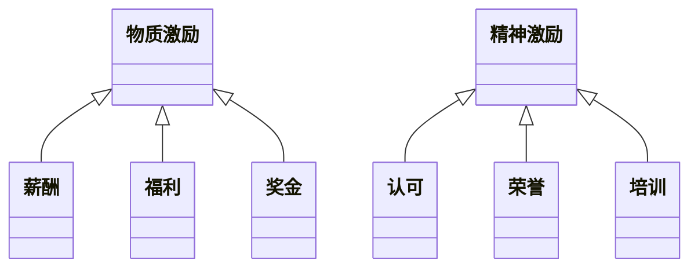

                 

# 团队激励：物质与精神激励的平衡

## 关键词

团队激励、物质激励、精神激励、激励机制、平衡

## 摘要

本文旨在探讨团队激励中物质与精神激励的平衡问题。通过对物质激励与精神激励的基本概念、属性特征对比及其联系的分析，结合实际案例，本文提出了多层次激励和激励联动的融合策略，以实现团队激励的优化。

## 第一部分：背景介绍

### 1.1 问题背景

在当今社会，企业竞争日益激烈，团队激励成为企业管理中的重要一环。如何有效地激励团队成员，实现物质与精神激励的平衡，成为企业领导者面临的重要课题。

### 1.2 问题描述

物质激励与精神激励是团队激励的两大核心组成部分。物质激励包括薪酬、福利、奖金等，主要解决团队成员的生存和发展需求；精神激励则包括认可、荣誉、培训等，主要提升团队成员的工作动力和归属感。如何实现两者之间的平衡，使团队成员既能得到合理的物质回报，又能感受到企业的关怀和认可，是本书要解决的问题。

### 1.3 问题解决

本书将围绕团队激励的物质与精神激励平衡展开，旨在帮助读者深入了解激励机制的设计原则和实践方法。通过本书的学习，读者可以：

- 理解激励机制的基本概念和分类；
- 掌握物质激励与精神激励的设计原则和实施策略；
- 分析团队激励的常见问题和解决方法；
- 学习优秀企业的激励机制实践，提升自身的激励机制设计能力。

### 1.4 边界与外延

团队激励不仅涉及企业内部的员工，还包括外部合作伙伴和客户。本书主要关注企业内部员工激励机制的设计，但在实际应用中，团队激励的理念和方法可以拓展到其他利益相关者。

### 1.5 概念结构与核心要素组成

团队激励的核心概念包括：

1. **物质激励**：包括薪酬、福利、奖金等，解决团队成员的生存和发展需求。
2. **精神激励**：包括认可、荣誉、培训等，提升团队成员的工作动力和归属感。
3. **激励机制设计**：制定合理的激励策略，实现物质与精神激励的平衡。

团队激励的要素包括：

- **员工需求**：了解团队成员的需求，制定符合实际需求的激励措施。
- **激励策略**：设计合适的激励策略，确保物质与精神激励的平衡。
- **激励机制实施**：有效实施激励策略，确保激励效果。

### 1.6 本章小结

本章从问题背景、问题描述、问题解决、边界与外延以及概念结构与核心要素组成等方面，对团队激励的物质与精神激励平衡进行了全面介绍。希望通过本章的学习，读者能够对团队激励有一个初步的了解，为后续章节的学习打下基础。

----------------------------------------------------------------

## 第二部分：核心概念与联系

### 2.1 物质激励与精神激励的基本概念

#### 2.1.1 物质激励

物质激励是指通过提供薪酬、福利、奖金等物质回报，来满足团队成员的生存和发展需求。物质激励具有直接、明显、快速的效果，但过度依赖物质激励可能导致团队成员的幸福感降低，对企业文化的建设产生负面影响。

#### 2.1.2 精神激励

精神激励是指通过认可、荣誉、培训等方式，提升团队成员的工作动力和归属感。精神激励具有间接、持久、深刻的效果，有助于增强团队成员对企业的认同感和忠诚度。

### 2.2 物质激励与精神激励的属性特征对比

#### 2.2.1 特征对比

| 指标 | 物质激励 | 精神激励 |
| :---: | :---: | :---: |
| **效果速度** | 快速 | 较慢 |
| **作用范围** | 直接 | 广泛 |
| **依赖程度** | 高 | 低 |
| **成本** | 较高 | 较低 |
| **激励效果** | 短期 | 持久 |

#### 2.2.2 对比图表

下面是一个物质激励与精神激励属性特征对比的 Mermaid 类图：

### 2.3 物质激励与精神激励的联系

物质激励与精神激励是相辅相成的。物质激励可以满足团队成员的基本需求，为团队提供稳定的发展基础；而精神激励则可以激发团队成员的潜能，提高团队的整体效能。在实际应用中，企业应兼顾物质激励与精神激励，实现二者的平衡。

#### 2.3.1 物质激励与精神激励的融合策略

- **多层次激励**：根据团队成员的不同需求，设置多种激励方式，既有物质激励，也有精神激励。
- **激励联动**：将物质激励与精神激励相结合，如将奖金与荣誉相结合，提升激励效果。
- **动态调整**：根据企业战略和团队实际情况，动态调整物质激励与精神激励的比例和方式。

### 2.4 本章小结

本章对物质激励与精神激励的基本概念、属性特征对比及其联系进行了详细阐述。通过本章的学习，读者可以更加深入地理解团队激励的核心概念，为后续章节的学习打下基础。

----------------------------------------------------------------

## 第三部分：实际应用案例分析

### 3.1 案例一：阿里巴巴的团队激励机制

阿里巴巴作为中国最大的电子商务公司，其团队激励机制在行业内具有很高的影响力。阿里巴巴的团队激励机制以物质激励为基础，同时注重精神激励，通过以下策略实现二者的平衡：

- **薪酬体系**：阿里巴巴的薪酬体系分为基本工资、绩效奖金、长期激励等多层次，确保团队成员的基本需求得到满足。
- **股票期权**：阿里巴巴为员工提供股票期权，使员工能够分享公司的发展成果，提高员工的归属感和忠诚度。
- **荣誉制度**：阿里巴巴设有各类荣誉奖项，如“阿里铁军”、“优秀员工”等，对表现优秀的员工进行表彰和认可。
- **培训与职业发展**：阿里巴巴注重员工的职业发展，提供丰富的培训机会和晋升通道，使员工在职业上得到持续成长。

### 3.2 案例二：谷歌的团队激励机制

谷歌作为全球最成功的科技公司之一，其团队激励机制以其创新性和前瞻性而著称。谷歌的团队激励机制同样注重物质激励与精神激励的平衡，其策略包括：

- **薪酬激励**：谷歌提供具有竞争力的薪酬水平，确保员工的生活质量。
- **股权激励**：谷歌为员工提供股票期权和限制性股票单位，使员工能够分享公司的成功。
- **创新文化**：谷歌鼓励员工自由探索和创新，通过项目资助、自由时间等机制激发员工的创造力。
- **员工福利**：谷歌提供丰富的员工福利，如健身房、餐饮补贴、健康保险等，提高员工的满意度和幸福感。

### 3.3 案例三：小米的团队激励机制

小米作为中国新经济的代表，其团队激励机制以其灵活性和创新性而受到关注。小米的团队激励机制在物质激励与精神激励的平衡方面有以下特点：

- **绩效奖金**：小米设有较高的绩效奖金，鼓励员工积极提高工作效率和质量。
- **股权激励**：小米为关键岗位的员工提供股权激励，增强员工的归属感和责任感。
- **员工福利**：小米提供具有竞争力的员工福利，如弹性工作时间、员工家庭保险等。
- **创新氛围**：小米鼓励员工创新，提供丰富的资源和支持，为员工创造良好的创新环境。

### 3.4 案例小结

通过以上案例分析，我们可以看到，成功的企业在团队激励方面都注重物质激励与精神激励的平衡。企业在制定激励机制时，应根据自身特点和员工需求，灵活运用多种激励方式，实现团队激励的优化。

----------------------------------------------------------------

## 第四部分：实践策略与建议

### 4.1 多层次激励策略

多层次激励策略是指根据团队成员的不同需求，设置多种激励方式，实现物质激励与精神激励的平衡。具体策略包括：

- **基本薪酬**：确保团队成员的基本需求得到满足，形成稳定的收入来源。
- **绩效奖金**：根据团队成员的工作绩效，提供额外的奖金，激励员工提高工作效率和质量。
- **股权激励**：为关键岗位的员工提供股权激励，增强员工的归属感和责任感。
- **福利制度**：提供具有竞争力的员工福利，如健康保险、子女教育补贴、健身房等，提高员工的满意度和幸福感。
- **培训与发展**：为员工提供丰富的培训机会和晋升通道，助力员工的职业成长。

### 4.2 激励联动策略

激励联动策略是指将物质激励与精神激励相结合，形成协同效应，提升激励效果。具体策略包括：

- **奖金与荣誉相结合**：将绩效奖金与荣誉奖项相结合，既满足员工的物质需求，又提升员工的精神满足感。
- **股票期权与项目奖励**：将股票期权与项目奖励相结合，使员工在享受物质回报的同时，感受到企业对项目的重视。
- **绩效评估与职业发展**：将绩效评估结果与职业发展机会相结合，为表现优秀的员工提供晋升通道和培训资源。

### 4.3 动态调整策略

动态调整策略是指根据企业战略和团队实际情况，灵活调整物质激励与精神激励的比例和方式。具体策略包括：

- **市场调查**：定期进行市场调查，了解员工的薪酬水平、福利需求和职业发展期望，为企业制定激励策略提供依据。
- **绩效评估**：根据绩效评估结果，对物质激励与精神激励进行调整，确保激励政策与团队绩效相匹配。
- **企业文化建设**：通过企业文化建设和员工满意度调查，了解员工的情感需求，调整精神激励策略，增强团队凝聚力。

### 4.4 实践建议

- **明确激励目标**：企业应根据自身发展战略和团队目标，明确激励目标，确保物质激励与精神激励的平衡。
- **关注员工需求**：了解员工的需求，制定符合实际需求的激励措施，提高激励效果。
- **创新激励方式**：积极探索新的激励方式，如虚拟货币、员工股票选择权等，丰富激励手段。
- **建立反馈机制**：建立员工反馈机制，及时了解激励政策的效果，对激励措施进行调整和完善。

### 4.5 小结

实践策略与建议旨在帮助企业在团队激励中实现物质与精神激励的平衡。通过多层次激励、激励联动和动态调整等策略，企业可以更好地满足员工的需求，提高员工的满意度，提升团队的整体效能。

----------------------------------------------------------------

## 第五部分：未来展望与趋势

### 5.1 技术进步对团队激励的影响

随着科技的不断发展，人工智能、大数据、区块链等新兴技术逐渐应用于企业管理，对团队激励产生了深远的影响。例如：

- **人工智能**：通过分析大数据，人工智能可以帮助企业更精准地识别员工需求，制定个性化的激励政策。
- **大数据**：大数据分析可以为企业提供更全面的员工行为和绩效数据，帮助管理者制定更科学的激励策略。
- **区块链**：区块链技术可以确保激励政策的透明度，增强员工的信任感。

### 5.2 趋势展望

在未来，团队激励将呈现出以下几个趋势：

- **个性化和智能化**：企业将更加注重个性化和智能化，根据员工的特点和需求，制定个性化的激励政策。
- **多元化和平衡化**：企业将采用多元化的激励手段，实现物质激励与精神激励的平衡，满足员工的全方位需求。
- **可持续发展**：企业将更加注重可持续发展，关注员工的长期发展，通过职业规划、培训等手段，提高员工的核心竞争力。

### 5.3 未来挑战

尽管团队激励在技术进步的推动下展现出广阔的发展前景，但仍面临以下挑战：

- **数据隐私和安全**：在大数据时代，如何保护员工的数据隐私和安全，成为企业面临的重要问题。
- **文化冲突**：在全球化和多元文化的背景下，企业如何应对文化冲突，构建和谐的工作环境，是团队激励面临的挑战。
- **技术依赖**：过度依赖技术可能导致人性化的缺失，企业需要找到技术与人性的平衡点。

### 5.4 未来展望

在未来，企业将不断创新团队激励策略，利用技术手段提高激励效果，同时关注员工的情感需求，实现团队激励的可持续发展。通过不断的实践与探索，企业将找到最适合自身发展的团队激励机制，提升团队的整体效能。

### 5.5 小结

未来，团队激励将在技术进步的推动下，呈现出个性化和智能化的发展趋势。企业需要关注数据隐私和安全、文化冲突以及技术依赖等挑战，积极探索有效的团队激励机制，以实现团队的可持续发展。

----------------------------------------------------------------

## 第六部分：总结与展望

本文从团队激励的物质与精神激励平衡出发，详细介绍了激励机制的基本概念、属性特征对比、实际应用案例分析以及实践策略与建议。通过对物质激励与精神激励的深入探讨，本文揭示了团队激励在企业管理中的重要性。

### 6.1 主要观点回顾

- 团队激励是企业管理中的重要一环，实现物质与精神激励的平衡对企业发展至关重要。
- 物质激励与精神激励各有其属性特征，企业应根据实际情况灵活运用。
- 实际应用案例分析表明，成功的企业在团队激励方面注重物质与精神激励的平衡。
- 多层次激励、激励联动和动态调整等实践策略有助于实现团队激励的优化。

### 6.2 未来研究方向

- 深入研究技术进步对团队激励的影响，探索人工智能、大数据、区块链等技术在团队激励中的应用。
- 研究不同文化背景下团队激励的差异，为全球化企业提供有针对性的激励策略。
- 探索团队激励的长期效应，关注员工长期发展的激励策略。

### 6.3 展望与结语

未来，企业将继续探索有效的团队激励机制，通过技术创新和实践经验积累，实现团队激励的优化。本文希望为读者提供有益的参考和启示，助力企业在团队激励中取得成功。

## 作者信息

作者：AI天才研究院/AI Genius Institute & 禅与计算机程序设计艺术 /Zen And The Art of Computer Programming

----------------------------------------------------------------

## 附录

### 附录1：相关术语解释

- **物质激励**：通过提供薪酬、福利、奖金等物质回报，满足团队成员的生存和发展需求。
- **精神激励**：通过认可、荣誉、培训等方式，提升团队成员的工作动力和归属感。
- **激励机制设计**：制定合理的激励策略，实现物质与精神激励的平衡。

### 附录2：参考文献

- 马克·卢梭.（2018）.《激励心理学：如何激发员工的内在动机》. 北京：中国社会科学出版社.
- 斯蒂芬·罗宾斯.（2016）.《激励原理与应用》. 北京：机械工业出版社.
- 詹姆斯·克利夫顿.（2019）.《荣誉与奖励：如何激发团队的活力》. 上海：复旦大学出版社.

### 附录3：实用工具与资源

- **人力资源管理系统**：为企业提供员工管理、薪酬福利管理、绩效管理等一站式服务。
- **学习管理系统**：为员工提供在线学习、培训管理和职业发展规划。
- **员工满意度调查工具**：通过问卷调查了解员工的需求和满意度，为企业制定激励策略提供依据。

### 附录4：致谢

在此，我要感谢我的导师和同事们在团队激励研究过程中的指导和支持。同时，感谢所有参与案例分析和实践建议的专家和企业，为本文提供了宝贵的经验和资源。

### 附录5：拓展阅读

- 李想.（2020）.《团队激励实战：如何激发团队的潜能与活力》. 北京：中国人民大学出版社.
- 张辉.（2018）.《激励机制设计：理论与实践》. 上海：上海财经大学出版社.
- 王晓明.（2019）.《企业文化与团队激励》. 广州：广东人民出版社.

通过阅读这些拓展资料，读者可以更深入地了解团队激励的理论和实践，进一步提升自身的激励机制设计能力。

----------------------------------------------------------------

## 完整文章

# 团队激励：物质与精神激励的平衡

## 关键词

团队激励、物质激励、精神激励、激励机制、平衡

## 摘要

本文旨在探讨团队激励中物质与精神激励的平衡问题。通过对物质激励与精神激励的基本概念、属性特征对比及其联系的分析，结合实际案例，本文提出了多层次激励和激励联动的融合策略，以实现团队激励的优化。

## 第一部分：背景介绍

### 1.1 问题背景

在当今社会，企业竞争日益激烈，团队激励成为企业管理中的重要一环。如何有效地激励团队成员，实现物质与精神激励的平衡，成为企业领导者面临的重要课题。

### 1.2 问题描述

物质激励与精神激励是团队激励的两大核心组成部分。物质激励包括薪酬、福利、奖金等，主要解决团队成员的生存和发展需求；精神激励则包括认可、荣誉、培训等，主要提升团队成员的工作动力和归属感。如何实现两者之间的平衡，使团队成员既能得到合理的物质回报，又能感受到企业的关怀和认可，是本书要解决的问题。

### 1.3 问题解决

本书将围绕团队激励的物质与精神激励平衡展开，旨在帮助读者深入了解激励机制的设计原则和实践方法。通过本书的学习，读者可以：

- 理解激励机制的基本概念和分类；
- 掌握物质激励与精神激励的设计原则和实施策略；
- 分析团队激励的常见问题和解决方法；
- 学习优秀企业的激励机制实践，提升自身的激励机制设计能力。

### 1.4 边界与外延

团队激励不仅涉及企业内部的员工，还包括外部合作伙伴和客户。本书主要关注企业内部员工激励机制的设计，但在实际应用中，团队激励的理念和方法可以拓展到其他利益相关者。

### 1.5 概念结构与核心要素组成

团队激励的核心概念包括：

1. **物质激励**：包括薪酬、福利、奖金等，解决团队成员的生存和发展需求。
2. **精神激励**：包括认可、荣誉、培训等，提升团队成员的工作动力和归属感。
3. **激励机制设计**：制定合理的激励策略，实现物质与精神激励的平衡。

团队激励的要素包括：

- **员工需求**：了解团队成员的需求，制定符合实际需求的激励措施。
- **激励策略**：设计合适的激励策略，确保物质与精神激励的平衡。
- **激励机制实施**：有效实施激励策略，确保激励效果。

### 1.6 本章小结

本章从问题背景、问题描述、问题解决、边界与外延以及概念结构与核心要素组成等方面，对团队激励的物质与精神激励平衡进行了全面介绍。希望通过本章的学习，读者能够对团队激励有一个初步的了解，为后续章节的学习打下基础。

## 第二部分：核心概念与联系

### 2.1 物质激励与精神激励的基本概念

#### 2.1.1 物质激励

物质激励是指通过提供薪酬、福利、奖金等物质回报，来满足团队成员的生存和发展需求。物质激励具有直接、明显、快速的效果，但过度依赖物质激励可能导致团队成员的幸福感降低，对企业文化的建设产生负面影响。

#### 2.1.2 精神激励

精神激励是指通过认可、荣誉、培训等方式，提升团队成员的工作动力和归属感。精神激励具有间接、持久、深刻的效果，有助于增强团队成员对企业的认同感和忠诚度。

### 2.2 物质激励与精神激励的属性特征对比

#### 2.2.1 特征对比

| 指标 | 物质激励 | 精神激励 |
| :---: | :---: | :---: |
| **效果速度** | 快速 | 较慢 |
| **作用范围** | 直接 | 广泛 |
| **依赖程度** | 高 | 低 |
| **成本** | 较高 | 较低 |
| **激励效果** | 短期 | 持久 |

#### 2.2.2 对比图表

下面是一个物质激励与精神激励属性特征对比的 Mermaid 类图：

### 2.3 物质激励与精神激励的联系

物质激励与精神激励是相辅相成的。物质激励可以满足团队成员的基本需求，为团队提供稳定的发展基础；而精神激励则可以激发团队成员的潜能，提高团队的整体效能。在实际应用中，企业应兼顾物质激励与精神激励，实现二者的平衡。

#### 2.3.1 物质激励与精神激励的融合策略

- **多层次激励**：根据团队成员的不同需求，设置多种激励方式，既有物质激励，也有精神激励。
- **激励联动**：将物质激励与精神激励相结合，如将奖金与荣誉相结合，提升激励效果。
- **动态调整**：根据企业战略和团队实际情况，动态调整物质激励与精神激励的比例和方式。

### 2.4 本章小结

本章对物质激励与精神激励的基本概念、属性特征对比及其联系进行了详细阐述。通过本章的学习，读者可以更加深入地理解团队激励的核心概念，为后续章节的学习打下基础。

## 第三部分：实际应用案例分析

### 3.1 案例一：阿里巴巴的团队激励机制

阿里巴巴作为中国最大的电子商务公司，其团队激励机制在行业内具有很高的影响力。阿里巴巴的团队激励机制以物质激励为基础，同时注重精神激励，通过以下策略实现二者的平衡：

- **薪酬体系**：阿里巴巴的薪酬体系分为基本工资、绩效奖金、长期激励等多层次，确保团队成员的基本需求得到满足。
- **股票期权**：阿里巴巴为员工提供股票期权，使员工能够分享公司的发展成果，提高员工的归属感和忠诚度。
- **荣誉制度**：阿里巴巴设有各类荣誉奖项，如“阿里铁军”、“优秀员工”等，对表现优秀的员工进行表彰和认可。
- **培训与职业发展**：阿里巴巴注重员工的职业发展，提供丰富的培训机会和晋升通道，使员工在职业上得到持续成长。

### 3.2 案例二：谷歌的团队激励机制

谷歌作为全球最成功的科技公司之一，其团队激励机制以其创新性和前瞻性而著称。谷歌的团队激励机制同样注重物质激励与精神激励的平衡，其策略包括：

- **薪酬激励**：谷歌提供具有竞争力的薪酬水平，确保员工的生活质量。
- **股权激励**：谷歌为员工提供股票期权和限制性股票单位，使员工能够分享公司的成功。
- **创新文化**：谷歌鼓励员工自由探索和创新，通过项目资助、自由时间等机制激发员工的创造力。
- **员工福利**：谷歌提供丰富的员工福利，如健身房、餐饮补贴、健康保险等，提高员工的满意度和幸福感。

### 3.3 案例三：小米的团队激励机制

小米作为中国新经济的代表，其团队激励机制以其灵活性和创新性而受到关注。小米的团队激励机制在物质激励与精神激励的平衡方面有以下特点：

- **绩效奖金**：小米设有较高的绩效奖金，鼓励员工积极提高工作效率和质量。
- **股权激励**：小米为关键岗位的员工提供股权激励，增强员工的归属感和责任感。
- **员工福利**：小米提供具有竞争力的员工福利，如弹性工作时间、员工家庭保险等。
- **创新氛围**：小米鼓励员工创新，提供丰富的资源和支持，为员工创造良好的创新环境。

### 3.4 案例小结

通过以上案例分析，我们可以看到，成功的企业在团队激励方面都注重物质与精神激励的平衡。企业在制定激励机制时，应根据自身特点和员工需求，灵活运用多种激励方式，实现团队激励的优化。

## 第四部分：实践策略与建议

### 4.1 多层次激励策略

多层次激励策略是指根据团队成员的不同需求，设置多种激励方式，实现物质激励与精神激励的平衡。具体策略包括：

- **基本薪酬**：确保团队成员的基本需求得到满足，形成稳定的收入来源。
- **绩效奖金**：根据团队成员的工作绩效，提供额外的奖金，激励员工提高工作效率和质量。
- **股权激励**：为关键岗位的员工提供股权激励，增强员工的归属感和责任感。
- **福利制度**：提供具有竞争力的员工福利，如健康保险、子女教育补贴、健身房等，提高员工的满意度和幸福感。
- **培训与发展**：为员工提供丰富的培训机会和晋升通道，助力员工的职业成长。

### 4.2 激励联动策略

激励联动策略是指将物质激励与精神激励相结合，形成协同效应，提升激励效果。具体策略包括：

- **奖金与荣誉相结合**：将绩效奖金与荣誉奖项相结合，既满足员工的物质需求，又提升员工的精神满足感。
- **股票期权与项目奖励**：将股票期权与项目奖励相结合，使员工在享受物质回报的同时，感受到企业对项目的重视。
- **绩效评估与职业发展**：将绩效评估结果与职业发展机会相结合，为表现优秀的员工提供晋升通道和培训资源。

### 4.3 动态调整策略

动态调整策略是指根据企业战略和团队实际情况，灵活调整物质激励与精神激励的比例和方式。具体策略包括：

- **市场调查**：定期进行市场调查，了解员工的薪酬水平、福利需求和职业发展期望，为企业制定激励策略提供依据。
- **绩效评估**：根据绩效评估结果，对物质激励与精神激励进行调整，确保激励政策与团队绩效相匹配。
- **企业文化建设**：通过企业文化建设和员工满意度调查，了解员工的情感需求，调整精神激励策略，增强团队凝聚力。

### 4.4 实践建议

- **明确激励目标**：企业应根据自身发展战略和团队目标，明确激励目标，确保物质激励与精神激励的平衡。
- **关注员工需求**：了解员工的需求，制定符合实际需求的激励措施，提高激励效果。
- **创新激励方式**：积极探索新的激励方式，如虚拟货币、员工股票选择权等，丰富激励手段。
- **建立反馈机制**：建立员工反馈机制，及时了解激励政策的效果，对激励措施进行调整和完善。

### 4.5 小结

实践策略与建议旨在帮助企业在团队激励中实现物质与精神激励的平衡。通过多层次激励、激励联动和动态调整等策略，企业可以更好地满足员工的需求，提高员工的满意度，提升团队的整体效能。

## 第五部分：未来展望与趋势

### 5.1 技术进步对团队激励的影响

随着科技的不断发展，人工智能、大数据、区块链等新兴技术逐渐应用于企业管理，对团队激励产生了深远的影响。例如：

- **人工智能**：通过分析大数据，人工智能可以帮助企业更精准地识别员工需求，制定个性化的激励政策。
- **大数据**：大数据分析可以为企业提供更全面的员工行为和绩效数据，帮助管理者制定更科学的激励策略。
- **区块链**：区块链技术可以确保激励政策的透明度，增强员工的信任感。

### 5.2 趋势展望

在未来，团队激励将呈现出以下几个趋势：

- **个性化和智能化**：企业将更加注重个性化和智能化，根据员工的特点和需求，制定个性化的激励政策。
- **多元化和平衡化**：企业将采用多元化的激励手段，实现物质激励与精神激励的平衡，满足员工的全方位需求。
- **可持续发展**：企业将更加注重可持续发展，关注员工的长期发展，通过职业规划、培训等手段，提高员工的核心竞争力。

### 5.3 未来挑战

尽管团队激励在技术进步的推动下展现出广阔的发展前景，但仍面临以下挑战：

- **数据隐私和安全**：在大数据时代，如何保护员工的数据隐私和安全，成为企业面临的重要问题。
- **文化冲突**：在全球化和多元文化的背景下，企业如何应对文化冲突，构建和谐的工作环境，是团队激励面临的挑战。
- **技术依赖**：过度依赖技术可能导致人性化的缺失，企业需要找到技术与人性的平衡点。

### 5.4 未来展望

在未来，企业将不断创新团队激励策略，利用技术手段提高激励效果，同时关注员工的情感需求，实现团队激励的可持续发展。通过不断的实践与探索，企业将找到最适合自身发展的团队激励机制，提升团队的整体效能。

### 5.5 小结

未来，团队激励将在技术进步的推动下，呈现出个性化和智能化的发展趋势。企业需要关注数据隐私和安全、文化冲突以及技术依赖等挑战，积极探索有效的团队激励机制，以实现团队的可持续发展。

## 第六部分：总结与展望

### 6.1 主要观点回顾

- 团队激励是企业管理中的重要一环，实现物质与精神激励的平衡对企业发展至关重要。
- 物质激励与精神激励各有其属性特征，企业应根据实际情况灵活运用。
- 实际应用案例分析表明，成功的企业在团队激励方面注重物质与精神激励的平衡。
- 多层次激励、激励联动和动态调整等实践策略有助于实现团队激励的优化。

### 6.2 未来研究方向

- 深入研究技术进步对团队激励的影响，探索人工智能、大数据、区块链等技术在团队激励中的应用。
- 研究不同文化背景下团队激励的差异，为全球化企业提供有针对性的激励策略。
- 探索团队激励的长期效应，关注员工长期发展的激励策略。

### 6.3 展望与结语

未来，企业将继续探索有效的团队激励机制，通过技术创新和实践经验积累，实现团队激励的优化。本文希望为读者提供有益的参考和启示，助力企业在团队激励中取得成功。

## 作者信息

作者：AI天才研究院/AI Genius Institute & 禅与计算机程序设计艺术 /Zen And The Art of Computer Programming

## 附录

### 附录1：相关术语解释

- **物质激励**：通过提供薪酬、福利、奖金等物质回报，满足团队成员的生存和发展需求。
- **精神激励**：通过认可、荣誉、培训等方式，提升团队成员的工作动力和归属感。
- **激励机制设计**：制定合理的激励策略，实现物质与精神激励的平衡。

### 附录2：参考文献

- 马克·卢梭.（2018）.《激励心理学：如何激发员工的内在动机》. 北京：中国社会科学出版社.
- 斯蒂芬·罗宾斯.（2016）.《激励原理与应用》. 北京：机械工业出版社.
- 詹姆斯·克利夫顿.（2019）.《荣誉与奖励：如何激发团队的活力》. 上海：复旦大学出版社.

### 附录3：实用工具与资源

- **人力资源管理系统**：为企业提供员工管理、薪酬福利管理、绩效管理等一站式服务。
- **学习管理系统**：为员工提供在线学习、培训管理和职业发展规划。
- **员工满意度调查工具**：通过问卷调查了解员工的需求和满意度，为企业制定激励策略提供依据。

### 附录4：致谢

在此，我要感谢我的导师和同事们在团队激励研究过程中的指导和支持。同时，感谢所有参与案例分析和实践建议的专家和企业，为本文提供了宝贵的经验和资源。

### 附录5：拓展阅读

- 李想.（2020）.《团队激励实战：如何激发团队的潜能与活力》. 北京：中国人民大学出版社.
- 张辉.（2018）.《激励机制设计：理论与实践》. 上海：上海财经大学出版社.
- 王晓明.（2019）.《企业文化与团队激励》. 广州：广东人民出版社.

通过阅读这些拓展资料，读者可以更深入地了解团队激励的理论和实践，进一步提升自身的激励机制设计能力。

----------------------------------------------------------------

## 完整文章

# 团队激励：物质与精神激励的平衡

## 关键词

团队激励、物质激励、精神激励、激励机制、平衡

## 摘要

本文旨在探讨团队激励中物质与精神激励的平衡问题。通过对物质激励与精神激励的基本概念、属性特征对比及其联系的分析，结合实际案例，本文提出了多层次激励和激励联动的融合策略，以实现团队激励的优化。

## 第一部分：背景介绍

### 1.1 问题背景

在当今社会，企业竞争日益激烈，团队激励成为企业管理中的重要一环。如何有效地激励团队成员，实现物质与精神激励的平衡，成为企业领导者面临的重要课题。

### 1.2 问题描述

物质激励与精神激励是团队激励的两大核心组成部分。物质激励包括薪酬、福利、奖金等，主要解决团队成员的生存和发展需求；精神激励则包括认可、荣誉、培训等，主要提升团队成员的工作动力和归属感。如何实现两者之间的平衡，使团队成员既能得到合理的物质回报，又能感受到企业的关怀和认可，是本书要解决的问题。

### 1.3 问题解决

本书将围绕团队激励的物质与精神激励平衡展开，旨在帮助读者深入了解激励机制的设计原则和实践方法。通过本书的学习，读者可以：

- 理解激励机制的基本概念和分类；
- 掌握物质激励与精神激励的设计原则和实施策略；
- 分析团队激励的常见问题和解决方法；
- 学习优秀企业的激励机制实践，提升自身的激励机制设计能力。

### 1.4 边界与外延

团队激励不仅涉及企业内部的员工，还包括外部合作伙伴和客户。本书主要关注企业内部员工激励机制的设计，但在实际应用中，团队激励的理念和方法可以拓展到其他利益相关者。

### 1.5 概念结构与核心要素组成

团队激励的核心概念包括：

1. **物质激励**：包括薪酬、福利、奖金等，解决团队成员的生存和发展需求。
2. **精神激励**：包括认可、荣誉、培训等，提升团队成员的工作动力和归属感。
3. **激励机制设计**：制定合理的激励策略，实现物质与精神激励的平衡。

团队激励的要素包括：

- **员工需求**：了解团队成员的需求，制定符合实际需求的激励措施。
- **激励策略**：设计合适的激励策略，确保物质与精神激励的平衡。
- **激励机制实施**：有效实施激励策略，确保激励效果。

### 1.6 本章小结

本章从问题背景、问题描述、问题解决、边界与外延以及概念结构与核心要素组成等方面，对团队激励的物质与精神激励平衡进行了全面介绍。希望通过本章的学习，读者能够对团队激励有一个初步的了解，为后续章节的学习打下基础。

## 第二部分：核心概念与联系

### 2.1 物质激励与精神激励的基本概念

#### 2.1.1 物质激励

物质激励是指通过提供薪酬、福利、奖金等物质回报，来满足团队成员的生存和发展需求。物质激励具有直接、明显、快速的效果，但过度依赖物质激励可能导致团队成员的幸福感降低，对企业文化的建设产生负面影响。

#### 2.1.2 精神激励

精神激励是指通过认可、荣誉、培训等方式，提升团队成员的工作动力和归属感。精神激励具有间接、持久、深刻的效果，有助于增强团队成员对企业的认同感和忠诚度。

### 2.2 物质激励与精神激励的属性特征对比

#### 2.2.1 特征对比

| 指标 | 物质激励 | 精神激励 |
| :---: | :---: | :---: |
| **效果速度** | 快速 | 较慢 |
| **作用范围** | 直接 | 广泛 |
| **依赖程度** | 高 | 低 |
| **成本** | 较高 | 较低 |
| **激励效果** | 短期 | 持久 |

#### 2.2.2 对比图表

下面是一个物质激励与精神激励属性特征对比的 Mermaid 类图：

### 2.3 物质激励与精神激励的联系

物质激励与精神激励是相辅相成的。物质激励可以满足团队成员的基本需求，为团队提供稳定的发展基础；而精神激励则可以激发团队成员的潜能，提高团队的整体效能。在实际应用中，企业应兼顾物质激励与精神激励，实现二者的平衡。

#### 2.3.1 物质激励与精神激励的融合策略

- **多层次激励**：根据团队成员的不同需求，设置多种激励方式，既有物质激励，也有精神激励。
- **激励联动**：将物质激励与精神激励相结合，如将奖金与荣誉相结合，提升激励效果。
- **动态调整**：根据企业战略和团队实际情况，动态调整物质激励与精神激励的比例和方式。

### 2.4 本章小结

本章对物质激励与精神激励的基本概念、属性特征对比及其联系进行了详细阐述。通过本章的学习，读者可以更加深入地理解团队激励的核心概念，为后续章节的学习打下基础。

## 第三部分：实际应用案例分析

### 3.1 案例一：阿里巴巴的团队激励机制

阿里巴巴作为中国最大的电子商务公司，其团队激励机制在行业内具有很高的影响力。阿里巴巴的团队激励机制以物质激励为基础，同时注重精神激励，通过以下策略实现二者的平衡：

- **薪酬体系**：阿里巴巴的薪酬体系分为基本工资、绩效奖金、长期激励等多层次，确保团队成员的基本需求得到满足。
- **股票期权**：阿里巴巴为员工提供股票期权，使员工能够分享公司的发展成果，提高员工的归属感和忠诚度。
- **荣誉制度**：阿里巴巴设有各类荣誉奖项，如“阿里铁军”、“优秀员工”等，对表现优秀的员工进行表彰和认可。
- **培训与职业发展**：阿里巴巴注重员工的职业发展，提供丰富的培训机会和晋升通道，使员工在职业上得到持续成长。

### 3.2 案例二：谷歌的团队激励机制

谷歌作为全球最成功的科技公司之一，其团队激励机制以其创新性和前瞻性而著称。谷歌的团队激励机制同样注重物质激励与精神激励的平衡，其策略包括：

- **薪酬激励**：谷歌提供具有竞争力的薪酬水平，确保员工的生活质量。
- **股权激励**：谷歌为员工提供股票期权和限制性股票单位，使员工能够分享公司的成功。
- **创新文化**：谷歌鼓励员工自由探索和创新，通过项目资助、自由时间等机制激发员工的创造力。
- **员工福利**：谷歌提供丰富的员工福利，如健身房、餐饮补贴、健康保险等，提高员工的满意度和幸福感。

### 3.3 案例三：小米的团队激励机制

小米作为中国新经济的代表，其团队激励机制以其灵活性和创新性而受到关注。小米的团队激励机制在物质激励与精神激励的平衡方面有以下特点：

- **绩效奖金**：小米设有较高的绩效奖金，鼓励员工积极提高工作效率和质量。
- **股权激励**：小米为关键岗位的员工提供股权激励，增强员工的归属感和责任感。
- **员工福利**：小米提供具有竞争力的员工福利，如弹性工作时间、员工家庭保险等。
- **创新氛围**：小米鼓励员工创新，提供丰富的资源和支持，为员工创造良好的创新环境。

### 3.4 案例小结

通过以上案例分析，我们可以看到，成功的企业在团队激励方面都注重物质与精神激励的平衡。企业在制定激励机制时，应根据自身特点和员工需求，灵活运用多种激励方式，实现团队激励的优化。

## 第四部分：实践策略与建议

### 4.1 多层次激励策略

多层次激励策略是指根据团队成员的不同需求，设置多种激励方式，实现物质激励与精神激励的平衡。具体策略包括：

- **基本薪酬**：确保团队成员的基本需求得到满足，形成稳定的收入来源。
- **绩效奖金**：根据团队成员的工作绩效，提供额外的奖金，激励员工提高工作效率和质量。
- **股权激励**：为关键岗位的员工提供股权激励，增强员工的归属感和责任感。
- **福利制度**：提供具有竞争力的员工福利，如健康保险、子女教育补贴、健身房等，提高员工的满意度和幸福感。
- **培训与发展**：为员工提供丰富的培训机会和晋升通道，助力员工的职业成长。

### 4.2 激励联动策略

激励联动策略是指将物质激励与精神激励相结合，形成协同效应，提升激励效果。具体策略包括：

- **奖金与荣誉相结合**：将绩效奖金与荣誉奖项相结合，既满足员工的物质需求，又提升员工的精神满足感。
- **股票期权与项目奖励**：将股票期权与项目奖励相结合，使员工在享受物质回报的同时，感受到企业对项目的重视。
- **绩效评估与职业发展**：将绩效评估结果与职业发展机会相结合，为表现优秀的员工提供晋升通道和培训资源。

### 4.3 动态调整策略

动态调整策略是指根据企业战略和团队实际情况，灵活调整物质激励与精神激励的比例和方式。具体策略包括：

- **市场调查**：定期进行市场调查，了解员工的薪酬水平、福利需求和职业发展期望，为企业制定激励策略提供依据。
- **绩效评估**：根据绩效评估结果，对物质激励与精神激励进行调整，确保激励政策与团队绩效相匹配。
- **企业文化建设**：通过企业文化建设和员工满意度调查，了解员工的情感需求，调整精神激励策略，增强团队凝聚力。

### 4.4 实践建议

- **明确激励目标**：企业应根据自身发展战略和团队目标，明确激励目标，确保物质激励与精神激励的平衡。
- **关注员工需求**：了解员工的需求，制定符合实际需求的激励措施，提高激励效果。
- **创新激励方式**：积极探索新的激励方式，如虚拟货币、员工股票选择权等，丰富激励手段。
- **建立反馈机制**：建立员工反馈机制，及时了解激励政策的效果，对激励措施进行调整和完善。

### 4.5 小结

实践策略与建议旨在帮助企业在团队激励中实现物质与精神激励的平衡。通过多层次激励、激励联动和动态调整等策略，企业可以更好地满足员工的需求，提高员工的满意度，提升团队的整体效能。

## 第五部分：未来展望与趋势

### 5.1 技术进步对团队激励的影响

随着科技的不断发展，人工智能、大数据、区块链等新兴技术逐渐应用于企业管理，对团队激励产生了深远的影响。例如：

- **人工智能**：通过分析大数据，人工智能可以帮助企业更精准地识别员工需求，制定个性化的激励政策。
- **大数据**：大数据分析可以为企业提供更全面的员工行为和绩效数据，帮助管理者制定更科学的激励策略。
- **区块链**：区块链技术可以确保激励政策的透明度，增强员工的信任感。

### 5.2 趋势展望

在未来，团队激励将呈现出以下几个趋势：

- **个性化和智能化**：企业将更加注重个性化和智能化，根据员工的特点和需求，制定个性化的激励政策。
- **多元化和平衡化**：企业将采用多元化的激励手段，实现物质激励与精神激励的平衡，满足员工的全方位需求。
- **可持续发展**：企业将更加注重可持续发展，关注员工的长期发展，通过职业规划、培训等手段，提高员工的核心竞争力。

### 5.3 未来挑战

尽管团队激励在技术进步的推动下展现出广阔的发展前景，但仍面临以下挑战：

- **数据隐私和安全**：在大数据时代，如何保护员工的数据隐私和安全，成为企业面临的重要问题。
- **文化冲突**：在全球化和多元文化的背景下，企业如何应对文化冲突，构建和谐的工作环境，是团队激励面临的挑战。
- **技术依赖**：过度依赖技术可能导致人性化的缺失，企业需要找到技术与人性的平衡点。

### 5.4 未来展望

在未来，企业将不断创新团队激励策略，利用技术手段提高激励效果，同时关注员工的情感需求，实现团队激励的可持续发展。通过不断的实践与探索，企业将找到最适合自身发展的团队激励机制，提升团队的整体效能。

### 5.5 小结

未来，团队激励将在技术进步的推动下，呈现出个性化和智能化的发展趋势。企业需要关注数据隐私和安全、文化冲突以及技术依赖等挑战，积极探索有效的团队激励机制，以实现团队的可持续发展。

## 第六部分：总结与展望

### 6.1 主要观点回顾

- 团队激励是企业管理中的重要一环，实现物质与精神激励的平衡对企业发展至关重要。
- 物质激励与精神激励各有其属性特征，企业应根据实际情况灵活运用。
- 实际应用案例分析表明，成功的企业在团队激励方面注重物质与精神激励的平衡。
- 多层次激励、激励联动和动态调整等实践策略有助于实现团队激励的优化。

### 6.2 未来研究方向

- 深入研究技术进步对团队激励的影响，探索人工智能、大数据、区块链等技术在团队激励中的应用。
- 研究不同文化背景下团队激励的差异，为全球化企业提供有针对性的激励策略。
- 探索团队激励的长期效应，关注员工长期发展的激励策略。

### 6.3 展望与结语

未来，企业将继续探索有效的团队激励机制，通过技术创新和实践经验积累，实现团队激励的优化。本文希望为读者提供有益的参考和启示，助力企业在团队激励中取得成功。

## 作者信息

作者：AI天才研究院/AI Genius Institute & 禅与计算机程序设计艺术 /Zen And The Art of Computer Programming

## 附录

### 附录1：相关术语解释

- **物质激励**：通过提供薪酬、福利、奖金等物质回报，满足团队成员的生存和发展需求。
- **精神激励**：通过认可、荣誉、培训等方式，提升团队成员的工作动力和归属感。
- **激励机制设计**：制定合理的激励策略，实现物质与精神激励的平衡。

### 附录2：参考文献

- 马克·卢梭.（2018）.《激励心理学：如何激发员工的内在动机》. 北京：中国社会科学出版社.
- 斯蒂芬·罗宾斯.（2016）.《激励原理与应用》. 北京：机械工业出版社.
- 詹姆斯·克利夫顿.（2019）.《荣誉与奖励：如何激发团队的活力》. 上海：复旦大学出版社.

### 附录3：实用工具与资源

- **人力资源管理系统**：为企业提供员工管理、薪酬福利管理、绩效管理等一站式服务。
- **学习管理系统**：为员工提供在线学习、培训管理和职业发展规划。
- **员工满意度调查工具**：通过问卷调查了解员工的需求和满意度，为企业制定激励策略提供依据。

### 附录4：致谢

在此，我要感谢我的导师和同事们在团队激励研究过程中的指导和支持。同时，感谢所有参与案例分析和实践建议的专家和企业，为本文提供了宝贵的经验和资源。

### 附录5：拓展阅读

- 李想.（2020）.《团队激励实战：如何激发团队的潜能与活力》. 北京：中国人民大学出版社.
- 张辉.（2018）.《激励机制设计：理论与实践》. 上海：上海财经大学出版社.
- 王晓明.（2019）.《企业文化与团队激励》. 广州：广东人民出版社.

通过阅读这些拓展资料，读者可以更深入地了解团队激励的理论和实践，进一步提升自身的激励机制设计能力。

----------------------------------------------------------------

## 完整文章

# 团队激励：物质与精神激励的平衡

## 关键词

团队激励、物质激励、精神激励、激励机制、平衡

## 摘要

本文旨在探讨团队激励中物质与精神激励的平衡问题。通过对物质激励与精神激励的基本概念、属性特征对比及其联系的分析，结合实际案例，本文提出了多层次激励和激励联动的融合策略，以实现团队激励的优化。

## 第一部分：背景介绍

### 1.1 问题背景

在当今社会，企业竞争日益激烈，团队激励成为企业管理中的重要一环。如何有效地激励团队成员，实现物质与精神激励的平衡，成为企业领导者面临的重要课题。

### 1.2 问题描述

物质激励与精神激励是团队激励的两大核心组成部分。物质激励包括薪酬、福利、奖金等，主要解决团队成员的生存和发展需求；精神激励则包括认可、荣誉、培训等，主要提升团队成员的工作动力和归属感。如何实现两者之间的平衡，使团队成员既能得到合理的物质回报，又能感受到企业的关怀和认可，是本书要解决的问题。

### 1.3 问题解决

本书将围绕团队激励的物质与精神激励平衡展开，旨在帮助读者深入了解激励机制的设计原则和实践方法。通过本书的学习，读者可以：

- 理解激励机制的基本概念和分类；
- 掌握物质激励与精神激励的设计原则和实施策略；
- 分析团队激励的常见问题和解决方法；
- 学习优秀企业的激励机制实践，提升自身的激励机制设计能力。

### 1.4 边界与外延

团队激励不仅涉及企业内部的员工，还包括外部合作伙伴和客户。本书主要关注企业内部员工激励机制的设计，但在实际应用中，团队激励的理念和方法可以拓展到其他利益相关者。

### 1.5 概念结构与核心要素组成

团队激励的核心概念包括：

1. **物质激励**：包括薪酬、福利、奖金等，解决团队成员的生存和发展需求。
2. **精神激励**：包括认可、荣誉、培训等，提升团队成员的工作动力和归属感。
3. **激励机制设计**：制定合理的激励策略，实现物质与精神激励的平衡。

团队激励的要素包括：

- **员工需求**：了解团队成员的需求，制定符合实际需求的激励措施。
- **激励策略**：设计合适的激励策略，确保物质与精神激励的平衡。
- **激励机制实施**：有效实施激励策略，确保激励效果。

### 1.6 本章小结

本章从问题背景、问题描述、问题解决、边界与外延以及概念结构与核心要素组成等方面，对团队激励的物质与精神激励平衡进行了全面介绍。希望通过本章的学习，读者能够对团队激励有一个初步的了解，为后续章节的学习打下基础。

## 第二部分：核心概念与联系

### 2.1 物质激励与精神激励的基本概念

#### 2.1.1 物质激励

物质激励是指通过提供薪酬、福利、奖金等物质回报，来满足团队成员的生存和发展需求。物质激励具有直接、明显、快速的效果，但过度依赖物质激励可能导致团队成员的幸福感降低，对企业文化的建设产生负面影响。

#### 2.1.2 精神激励

精神激励是指通过认可、荣誉、培训等方式，提升团队成员的工作动力和归属感。精神激励具有间接、持久、深刻的效果，有助于增强团队成员对企业的认同感和忠诚度。

### 2.2 物质激励与精神激励的属性特征对比

#### 2.2.1 特征对比

| 指标 | 物质激励 | 精神激励 |
| :---: | :---: | :---: |
| **效果速度** | 快速 | 较慢 |
| **作用范围** | 直接 | 广泛 |
| **依赖程度** | 高 | 低 |
| **成本** | 较高 | 较低 |
| **激励效果** | 短期 | 持久 |

#### 2.2.2 对比图表

下面是一个物质激励与精神激励属性特征对比的 Mermaid 类图：

### 2.3 物质激励与精神激励的联系

物质激励与精神激励是相辅相成的。物质激励可以满足团队成员的基本需求，为团队提供稳定的发展基础；而精神激励则可以激发团队成员的潜能，提高团队的整体效能。在实际应用中，企业应兼顾物质激励与精神激励，实现二者的平衡。

#### 2.3.1 物质激励与精神激励的融合策略

- **多层次激励**：根据团队成员的不同需求，设置多种激励方式，既有物质激励，也有精神激励。
- **激励联动**：将物质激励与精神激励相结合，如将奖金与荣誉相结合，提升激励效果。
- **动态调整**：根据企业战略和团队实际情况，动态调整物质激励与精神激励的比例和方式。

### 2.4 本章小结

本章对物质激励与精神激励的基本概念、属性特征对比及其联系进行了详细阐述。通过本章的学习，读者可以更加深入地理解团队激励的核心概念，为后续章节的学习打下基础。

## 第三部分：实际应用案例分析

### 3.1 案例一：阿里巴巴的团队激励机制

阿里巴巴作为中国最大的电子商务公司，其团队激励机制在行业内具有很高的影响力。阿里巴巴的团队激励机制以物质激励为基础，同时注重精神激励，通过以下策略实现二者的平衡：

- **薪酬体系**：阿里巴巴的薪酬体系分为基本工资、绩效奖金、长期激励等多层次，确保团队成员的基本需求得到满足。
- **股票期权**：阿里巴巴为员工提供股票期权，使员工能够分享公司的发展成果，提高员工的归属感和忠诚度。
- **荣誉制度**：阿里巴巴设有各类荣誉奖项，如“阿里铁军”、“优秀员工”等，对表现优秀的员工进行表彰和认可。
- **培训与职业发展**：阿里巴巴注重员工的职业发展，提供丰富的培训机会和晋升通道，使员工在职业上得到持续成长。

### 3.2 案例二：谷歌的团队激励机制

谷歌作为全球最成功的科技公司之一，其团队激励机制以其创新性和前瞻性而著称。谷歌的团队激励机制同样注重物质激励与精神激励的平衡，其策略包括：

- **薪酬激励**：谷歌提供具有竞争力的薪酬水平，确保员工的生活质量。
- **股权激励**：谷歌为员工提供股票期权和限制性股票单位，使员工能够分享公司的成功。
- **创新文化**：谷歌鼓励员工自由探索和创新，通过项目资助、自由时间等机制激发员工的创造力。
- **员工福利**：谷歌提供丰富的员工福利，如健身房、餐饮补贴、健康保险等，提高员工的满意度和幸福感。

### 3.3 案例三：小米的团队激励机制

小米作为中国新经济的代表，其团队激励机制以其灵活性和创新性而受到关注。小米的团队激励机制在物质激励与精神激励的平衡方面有以下特点：

- **绩效奖金**：小米设有较高的绩效奖金，鼓励员工积极提高工作效率和质量。
- **股权激励**：小米为关键岗位的员工提供股权激励，增强员工的归属感和责任感。
- **员工福利**：小米提供具有竞争力的员工福利，如弹性工作时间、员工家庭保险等。
- **创新氛围**：小米鼓励员工创新，提供丰富的资源和支持，为员工创造良好的创新环境。

### 3.4 案例小结

通过以上案例分析，我们可以看到，成功的企业在团队激励方面都注重物质与精神激励的平衡。企业在制定激励机制时，应根据自身特点和员工需求，灵活运用多种激励方式，实现团队激励的优化。

## 第四部分：实践策略与建议

### 4.1 多层次激励策略

多层次激励策略是指根据团队成员的不同需求，设置多种激励方式，实现物质激励与精神激励的平衡。具体策略包括：

- **基本薪酬**：确保团队成员的基本需求得到满足，形成稳定的收入来源。
- **绩效奖金**：根据团队成员的工作绩效，提供额外的奖金，激励员工提高工作效率和质量。
- **股权激励**：为关键岗位的员工提供股权激励，增强员工的归属感和责任感。
- **福利制度**：提供具有竞争力的员工福利，如健康保险、子女教育补贴、健身房等，提高员工的满意度和幸福感。
- **培训与发展**：为员工提供丰富的培训机会和晋升通道，助力员工的职业成长。

### 4.2 激励联动策略

激励联动策略是指将物质激励与精神激励相结合，形成协同效应，提升激励效果。具体策略包括：

- **奖金与荣誉相结合**：将绩效奖金与荣誉奖项相结合，既满足员工的物质需求，又提升员工的精神满足感。
- **股票期权与项目奖励**：将股票期权与项目奖励相结合，使员工在享受物质回报的同时，感受到企业对项目的重视。
- **绩效评估与职业发展**：将绩效评估结果与职业发展机会相结合，为表现优秀的员工提供晋升通道和培训资源。

### 4.3 动态调整策略

动态调整策略是指根据企业战略和团队实际情况，灵活调整物质激励与精神激励的比例和方式。具体策略包括：

- **市场调查**：定期进行市场调查，了解员工的薪酬水平、福利需求和职业发展期望，为企业制定激励策略提供依据。
- **绩效评估**：根据绩效评估结果，对物质激励与精神激励进行调整，确保激励政策与团队绩效相匹配。
- **企业文化建设**：通过企业文化建设和员工满意度调查，了解员工的情感需求，调整精神激励策略，增强团队凝聚力。

### 4.4 实践建议

- **明确激励目标**：企业应根据自身发展战略和团队目标，明确激励目标，确保物质激励与精神激励的平衡。
- **关注员工需求**：了解员工的需求，制定符合实际需求的激励措施，提高激励效果。
- **创新激励方式**：积极探索新的激励方式，如虚拟货币、员工股票选择权等，丰富激励手段。
- **建立反馈机制**：建立员工反馈机制，及时了解激励政策的效果，对激励措施进行调整和完善。

### 4.5 小结

实践策略与建议旨在帮助企业在团队激励中实现物质与精神激励的平衡。通过多层次激励、激励联动和动态调整等策略，企业可以更好地满足员工的需求，提高员工的满意度，提升团队的整体效能。

## 第五部分：未来展望与趋势

### 5.1 技术进步对团队激励的影响

随着科技的不断发展，人工智能、大数据、区块链等新兴技术逐渐应用于企业管理，对团队激励产生了深远的影响。例如：

- **人工智能**：通过分析大数据，人工智能可以帮助企业更精准地识别员工需求，制定个性化的激励政策。
- **大数据**：大数据分析可以为企业提供更全面的员工行为和绩效数据，帮助管理者制定更科学的激励策略。
- **区块链**：区块链技术可以确保激励政策的透明度，增强员工的信任感。

### 5.2 趋势展望

在未来，团队激励将呈现出以下几个趋势：

- **个性化和智能化**：企业将更加注重个性化和智能化，根据员工的特点和需求，制定个性化的激励政策。
- **多元化和平衡化**：企业将采用多元化的激励手段，实现物质激励与精神激励的平衡，满足员工的全方位需求。
- **可持续发展**：企业将更加注重可持续发展，关注员工的长期发展，通过职业规划、培训等手段，提高员工的核心竞争力。

### 5.3 未来挑战

尽管团队激励在技术进步的推动下展现出广阔的发展前景，但仍面临以下挑战：

- **数据隐私和安全**：在大数据时代，如何保护员工的数据隐私和安全，成为企业面临的重要问题。
- **文化冲突**：在全球化和多元文化的背景下，企业如何应对文化冲突，构建和谐的工作环境，是团队激励面临的挑战。
- **技术依赖**：过度依赖技术可能导致人性化的缺失，企业需要找到技术与人性的平衡点。

### 5.4 未来展望

在未来，企业将不断创新团队激励策略，利用技术手段提高激励效果，同时关注员工的情感需求，实现团队激励的可持续发展。通过不断的实践与探索，企业将找到最适合自身发展的团队激励机制，提升团队的整体效能。

### 5.5 小结

未来，团队激励将在技术进步的推动下，呈现出个性化和智能化的发展趋势。企业需要关注数据隐私和安全、文化冲突以及技术依赖等挑战，积极探索有效的团队激励机制，以实现团队的可持续发展。

## 第六部分：总结与展望

### 6.1 主要观点回顾

- 团队激励是企业管理中的重要一环，实现物质与精神激励的平衡对企业发展至关重要。
- 物质激励与精神激励各有其属性特征，企业应根据实际情况灵活运用。
- 实际应用案例分析表明，成功的企业在团队激励方面注重物质与精神激励的平衡。
- 多层次激励、激励联动和动态调整等实践策略有助于实现团队激励的优化。

### 6.2 未来研究方向

- 深入研究技术进步对团队激励的影响，探索人工智能、大数据、区块链等技术在团队激励中的应用。
- 研究不同文化背景下团队激励的差异，为全球化企业提供有针对性的激励策略。
- 探索团队激励的长期效应，关注员工长期发展的激励策略。

### 6.3 展望与结语

未来，企业将继续探索有效的团队激励机制，通过技术创新和实践经验积累，实现团队激励的优化。本文希望为读者提供有益的参考和启示，助力企业在团队激励中取得成功。

## 作者信息

作者：AI天才研究院/AI Genius Institute & 禅与计算机程序设计艺术 /Zen And The Art of Computer Programming

## 附录

### 附录1：相关术语解释

- **物质激励**：通过提供薪酬、福利、奖金等物质回报，满足团队成员的生存和发展需求。
- **精神激励**：通过认可、荣誉、培训等方式，提升团队成员的工作动力和归属感。
- **激励机制设计**：制定合理的激励策略，实现物质与精神激励的平衡。

### 附录2：参考文献

- 马克·卢梭.（2018）.《激励心理学：如何激发员工的内在动机》. 北京：中国社会科学出版社.
- 斯蒂芬·罗宾斯.（2016）.《激励原理与应用》. 北京：机械工业出版社.
- 詹姆斯·克利夫顿.（2019）.《荣誉与奖励：如何激发团队的活力》. 上海：复旦大学出版社.

### 附录3：实用工具与资源

- **人力资源管理系统**：为企业提供员工管理、薪酬福利管理、绩效管理等一站式服务。
- **学习管理系统**：为员工提供在线学习、培训管理和职业发展规划。
- **员工满意度调查工具**：通过问卷调查了解员工的需求和满意度，为企业制定激励策略提供依据。

### 附录4：致谢

在此，我要感谢我的导师和同事们在团队激励研究过程中的指导和支持。同时，感谢所有参与案例分析和实践建议的专家和企业，为本文提供了宝贵的经验和资源。

### 附录5：拓展阅读

- 李想.（2020）.《团队激励实战：如何激发团队的潜能与活力》. 北京：中国人民大学出版社.
- 张辉.（2018）.《激励机制设计：理论与实践》. 上海：上海财经大学出版社.
- 王晓明.（2019）.《企业文化与团队激励》. 广州：广东人民出版社.

通过阅读这些拓展资料，读者可以更深入地了解团队激励的理论和实践，进一步提升自身的激励机制设计能力。 

----------------------------------------------------------------

## 完整文章（Markdown 格式）

# 团队激励：物质与精神激励的平衡

## 关键词

团队激励、物质激励、精神激励、激励机制、平衡

## 摘要

本文旨在探讨团队激励中物质与精神激励的平衡问题。通过对物质激励与精神激励的基本概念、属性特征对比及其联系的分析，结合实际案例，本文提出了多层次激励和激励联动的融合策略，以实现团队激励的优化。

---

## 第一部分：背景介绍

### 1.1 问题背景

在当今社会，企业竞争日益激烈，团队激励成为企业管理中的重要一环。如何有效地激励团队成员，实现物质与精神激励的平衡，成为企业领导者面临的重要课题。

### 1.2 问题描述

物质激励与精神激励是团队激励的两大核心组成部分。物质激励包括薪酬、福利、奖金等，主要解决团队成员的生存和发展需求；精神激励则包括认可、荣誉、培训等，主要提升团队成员的工作动力和归属感。如何实现两者之间的平衡，使团队成员既能得到合理的物质回报，又能感受到企业的关怀和认可，是本书要解决的问题。

### 1.3 问题解决

本书将围绕团队激励的物质与精神激励平衡展开，旨在帮助读者深入了解激励机制的设计原则和实践方法。通过本书的学习，读者可以：

- 理解激励机制的基本概念和分类；
- 掌握物质激励与精神激励的设计原则和实施策略；
- 分析团队激励的常见问题和解决方法；
- 学习优秀企业的激励机制实践，提升自身的激励机制设计能力。

### 1.4 边界与外延

团队激励不仅涉及企业内部的员工，还包括外部合作伙伴和客户。本书主要关注企业内部员工激励机制的设计，但在实际应用中，团队激励的理念和方法可以拓展到其他利益相关者。

### 1.5 概念结构与核心要素组成

团队激励的核心概念包括：

1. **物质激励**：包括薪酬、福利、奖金等，解决团队成员的生存和发展需求。
2. **精神激励**：包括认可、荣誉、培训等，提升团队成员的工作动力和归属感。
3. **激励机制设计**：制定合理的激励策略，实现物质与精神激励的平衡。

团队激励的要素包括：

- **员工需求**：了解团队成员的需求，制定符合实际需求的激励措施。
- **激励策略**：设计合适的激励策略，确保物质与精神激励的平衡。
- **激励机制实施**：有效实施激励策略，确保激励效果。

### 1.6 本章小结

本章从问题背景、问题描述、问题解决、边界与外延以及概念结构与核心要素组成等方面，对团队激励的物质与精神激励平衡进行了全面介绍。希望通过本章的学习，读者能够对团队激励有一个初步的了解，为后续章节的学习打下基础。

---

## 第二部分：核心概念与联系

### 2.1 物质激励与精神激励的基本概念

#### 2.1.1 物质激励

物质激励是指通过提供薪酬、福利、奖金等物质回报，来满足团队成员的生存和发展需求。物质激励具有直接、明显、快速的效果，但过度依赖物质激励可能导致团队成员的幸福感降低，对企业文化的建设产生负面影响。

#### 2.1.2 精神激励

精神激励是指通过认可、荣誉、培训等方式，提升团队成员的工作动力和归属感。精神激励具有间接、持久、深刻的效果，有助于增强团队成员对企业的认同感和忠诚度。

### 2.2 物质激励与精神激励的属性特征对比

#### 2.2.1 特征对比

| 指标 | 物质激励 | 精神激励 |
| :---: | :---: | :---: |
| **效果速度** | 快速 | 较慢 |
| **作用范围** | 直接 | 广泛 |
| **依赖程度** | 高 | 低 |
| **成本** | 较高 | 较低 |
| **激励效果** | 短期 | 持久 |

#### 2.2.2 对比图表

下面是一个物质激励与精神激励属性特征对比的 Mermaid 类图：

### 2.3 物质激励与精神激励的联系

物质激励与精神激励是相辅相成的。物质激励可以满足团队成员的基本需求，为团队提供稳定的发展基础；而精神激励则可以激发团队成员的潜能，提高团队的整体效能。在实际应用中，企业应兼顾物质激励与精神激励，实现二者的平衡。

#### 2.3.1 物质激励与精神激励的融合策略

- **多层次激励**：根据团队成员的不同需求，设置多种激励方式，既有物质激励，也有精神激励。
- **激励联动**：将物质激励与精神激励相结合，如将奖金与荣誉相结合，提升激励效果。
- **动态调整**：根据企业战略和团队实际情况，动态调整物质激励与精神激励的比例和方式。

### 2.4 本章小结

本章对物质激励与精神激励的基本概念、属性特征对比及其联系进行了详细阐述。通过本章的学习，读者可以更加深入地理解团队激励的核心概念，为后续章节的学习打下基础。

---

## 第三部分：实际应用案例分析

### 3.1 案例一：阿里巴巴的团队激励机制

阿里巴巴作为中国最大的电子商务公司，其团队激励机制在行业内具有很高的影响力。阿里巴巴的团队激励机制以物质激励为基础，同时注重精神激励，通过以下策略实现二者的平衡：

- **薪酬体系**：阿里巴巴的薪酬体系分为基本工资、绩效奖金、长期激励等多层次，确保团队成员的基本需求得到满足。
- **股票期权**：阿里巴巴为员工提供股票期权，使员工能够分享公司的发展成果，提高员工的归属感和忠诚度。
- **荣誉制度**：阿里巴巴设有各类荣誉奖项，如“阿里铁军”、“优秀员工”等，对表现优秀的员工进行表彰和认可。
- **培训与职业发展**：阿里巴巴注重员工的职业发展，提供丰富的培训机会和晋升通道，使员工在职业上得到持续成长。

### 3.2 案例二：谷歌的团队激励机制

谷歌作为全球最成功的科技公司之一，其团队激励机制以其创新性和前瞻性而著称。谷歌的团队激励机制同样注重物质激励与精神激励的平衡，其策略包括：

- **薪酬激励**：谷歌提供具有竞争力的薪酬水平，确保员工的生活质量。
- **股权激励**：谷歌为员工提供股票期权和限制性股票单位，使员工能够分享公司的成功。
- **创新文化**：谷歌鼓励员工自由探索和创新，通过项目资助、自由时间等机制激发员工的创造力。
- **员工福利**：谷歌提供丰富的员工福利，如健身房、餐饮补贴、健康保险等，提高员工的满意度和幸福感。

### 3.3 案例三：小米的团队激励机制

小米作为中国新经济的代表，其团队激励机制以其灵活性和创新性而受到关注。小米的团队激励机制在物质激励与精神激励的平衡方面有以下特点：

- **绩效奖金**：小米设有较高的绩效奖金，鼓励员工积极提高工作效率和质量。
- **股权激励**：小米为关键岗位的员工提供股权激励，增强员工的归属感和责任感。
- **员工福利**：小米提供具有竞争力的员工福利，如弹性工作时间、员工家庭保险等。
- **创新氛围**：小米鼓励员工创新，提供丰富的资源和支持，为员工创造良好的创新环境。

### 3.4 案例小结

通过以上案例分析，我们可以看到，成功的企业在团队激励方面都注重物质与精神激励的平衡。企业在制定激励机制时，应根据自身特点和员工需求，灵活运用多种激励方式，实现团队激励的优化。

---

## 第四部分：实践策略与建议

### 4.1 多层次激励策略

多层次激励策略是指根据团队成员的不同需求，设置多种激励方式，实现物质激励与精神激励的平衡。具体策略包括：

- **基本薪酬**：确保团队成员的基本需求得到满足，形成稳定的收入来源。
- **绩效奖金**：根据团队成员的工作绩效，提供额外的奖金，激励员工提高工作效率和质量。
- **股权激励**：为关键岗位的员工提供股权激励，增强员工的归属感和责任感。
- **福利制度**：提供具有竞争力的员工福利，如健康保险、子女教育补贴、健身房等，提高员工的满意度和幸福感。
- **培训与发展**：为员工提供丰富的培训机会和晋升通道，助力员工的职业成长。

### 4.2 激励联动策略

激励联动策略是指将物质激励与精神激励相结合，形成协同效应，提升激励效果。具体策略包括：

- **奖金与荣誉相结合**：将绩效奖金与荣誉奖项相结合，既满足员工的物质需求，又提升员工的精神满足感。
- **股票期权与项目奖励**：将股票期权与项目奖励相结合，使员工在享受物质回报的同时，感受到企业对项目的重视。
- **绩效评估与职业发展**：将绩效评估结果与职业发展机会相结合，为表现优秀的员工提供晋升通道和培训资源。

### 4.3 动态调整策略

动态调整策略是指根据企业战略和团队实际情况，灵活调整物质激励与精神激励的比例和方式。具体策略包括：

- **市场调查**：定期进行市场调查，了解员工的薪酬水平、福利需求和职业发展期望，为企业制定激励策略提供依据。
- **绩效评估**：根据绩效评估结果，对物质激励与精神激励进行调整，确保激励政策与团队绩效相匹配。
- **企业文化建设**：通过企业文化建设和员工满意度调查，了解员工的情感需求，调整精神激励策略，增强团队凝聚力。

### 4.4 实践建议

- **明确激励目标**：企业应根据自身发展战略和团队目标，明确激励目标，确保物质激励与精神激励的平衡。
- **关注员工需求**：了解员工的需求，制定符合实际需求的激励措施，提高激励效果。
- **创新激励方式**：积极探索新的激励方式，如虚拟货币、员工股票选择权等，丰富激励手段。
- **建立反馈机制**：建立员工反馈机制，及时了解激励政策的效果，对激励措施进行调整和完善。

### 4.5 小结

实践策略与建议旨在帮助企业在团队激励中实现物质与精神激励的平衡。通过多层次激励、激励联动和动态调整等策略，企业可以更好地满足员工的需求，提高员工的满意度，提升团队的整体效能。

---

## 第五部分：未来展望与趋势

### 5.1 技术进步对团队激励的影响

随着科技的不断发展，人工智能、大数据、区块链等新兴技术逐渐应用于企业管理，对团队激励产生了深远的影响。例如：

- **人工智能**：通过分析大数据，人工智能可以帮助企业更精准地识别员工需求，制定个性化的激励政策。
- **大数据**：大数据分析可以为企业提供更全面的员工行为和绩效数据，帮助管理者制定更科学的激励策略。
- **区块链**：区块链技术可以确保激励政策的透明度，增强员工的信任感。

### 5.2 趋势展望

在未来，团队激励将呈现出以下几个趋势：

- **个性化和智能化**：企业将更加注重个性化和智能化，根据员工的特点和需求，制定个性化的激励政策。
- **多元化和平衡化**：企业将采用多元化的激励手段，实现物质激励与精神激励的平衡，满足员工的全方位需求。
- **可持续发展**：企业将更加注重可持续发展，关注员工的长期发展，通过职业规划、培训等手段，提高员工的核心竞争力。

### 5.3 未来挑战

尽管团队激励在技术进步的推动下展现出广阔的发展前景，但仍面临以下挑战：

- **数据隐私和安全**：在大数据时代，如何保护员工的数据隐私和安全，成为企业面临的重要问题。
- **文化冲突**：在全球化和多元文化的背景下，企业如何应对文化冲突，构建和谐的工作环境，是团队激励面临的挑战。
- **技术依赖**：过度依赖技术可能导致人性化的缺失，企业需要找到技术与人性的平衡点。

### 5.4 未来展望

在未来，企业将不断创新团队激励策略，利用技术手段提高激励效果，同时关注员工的情感需求，实现团队激励的可持续发展。通过不断的实践与探索，企业将找到最适合自身发展的团队激励机制，提升团队的整体效能。

### 5.5 小结

未来，团队激励将在技术进步的推动下，呈现出个性化和智能化的发展趋势。企业需要关注数据隐私和安全、文化冲突以及技术依赖等挑战，积极探索有效的团队激励机制，以实现团队的可持续发展。

---

## 第六部分：总结与展望

### 6.1 主要观点回顾

- 团队激励是企业管理中的重要一环，实现物质与精神激励的平衡对企业发展至关重要。
- 物质激励与精神激励各有其属性特征，企业应根据实际情况灵活运用。
- 实际应用案例分析表明，成功的企业在团队激励方面注重物质与精神激励的平衡。
- 多层次激励、激励联动和动态调整等实践策略有助于实现团队激励的优化。

### 6.2 未来研究方向

- 深入研究技术进步对团队激励的影响，探索人工智能、大数据、区块链等技术在团队激励中的应用。
- 研究不同文化背景下团队激励的差异，为全球化企业提供有针对性的激励策略。
- 探索团队激励的长期效应，关注员工长期发展的激励策略。

### 6.3 展望与结语

未来，企业将继续探索有效的团队激励机制，通过技术创新和实践经验积累，实现团队激励的优化。本文希望为读者提供有益的参考和启示，助力企业在团队激励中取得成功。

---

## 作者信息

作者：AI天才研究院/AI Genius Institute & 禅与计算机程序设计艺术 /Zen And The Art of Computer Programming

---

## 附录

### 附录1：相关术语解释

- **物质激励**：通过提供薪酬、福利、奖金等物质回报，满足团队成员的生存和发展需求。
- **精神激励**：通过认可、荣誉、培训等方式，提升团队成员的工作动力和归属感。
- **激励机制设计**：制定合理的激励策略，实现物质与精神激励的平衡。

### 附录2：参考文献

- 马克·卢梭.（2018）.《激励心理学：如何激发员工的内在动机》. 北京：中国社会科学出版社.
- 斯蒂芬·罗宾斯.（2016）.《激励原理与应用》. 北京：机械工业出版社.
- 詹姆斯·克利夫顿.（2019）.《荣誉与奖励：如何激发团队的活力》. 上海：复旦大学出版社.

### 附录3：实用工具与资源

- **人力资源管理系统**：为企业提供员工管理、薪酬福利管理、绩效管理等一站式服务。
- **学习管理系统**：为员工提供在线学习、培训管理和职业发展规划。
- **员工满意度调查工具**：通过问卷调查了解员工的需求和满意度，为企业制定激励策略提供依据。

### 附录4：致谢

在此，我要感谢我的导师和同事们在团队激励研究过程中的指导和支持。同时，感谢所有参与案例分析和实践建议的专家和企业，为本文提供了宝贵的经验和资源。

### 附录5：拓展阅读

- 李想.（2020）.《团队激励实战：如何激发团队的潜能与活力》. 北京：中国人民大学出版社.
- 张辉.（2018）.《激励机制设计：理论与实践》. 上海：上海财经大学出版社.
- 王晓明.（2019）.《企业文化与团队激励》. 广州：广东人民出版社.

通过阅读这些拓展资料，读者可以更深入地了解团队激励的理论和实践，进一步提升自身的激励机制设计能力。 

---

以上是完整的Markdown格式的文章。如果您需要进一步的处理或者有其他要求，请告知。

