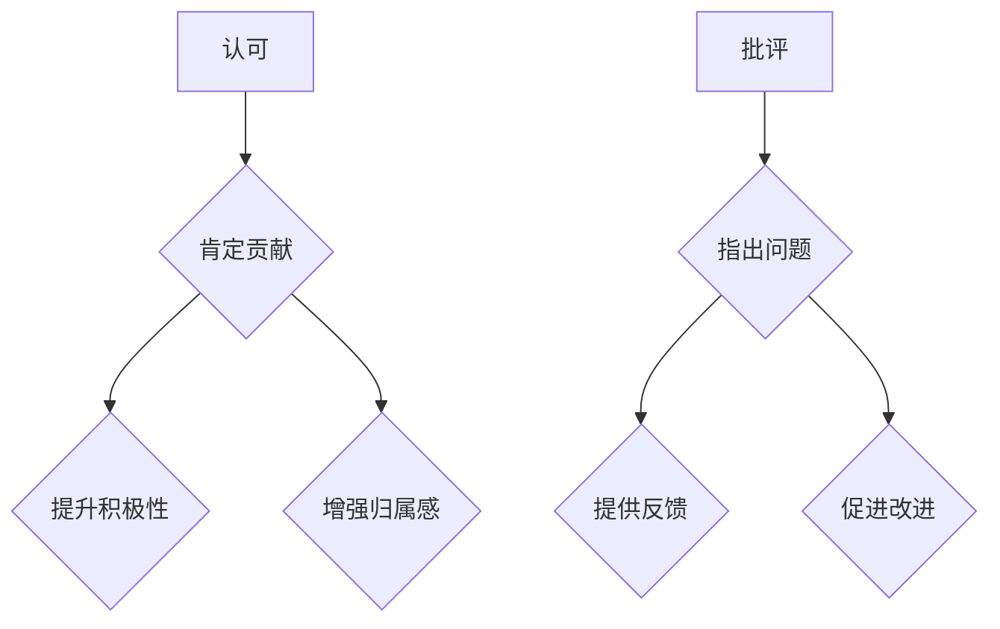
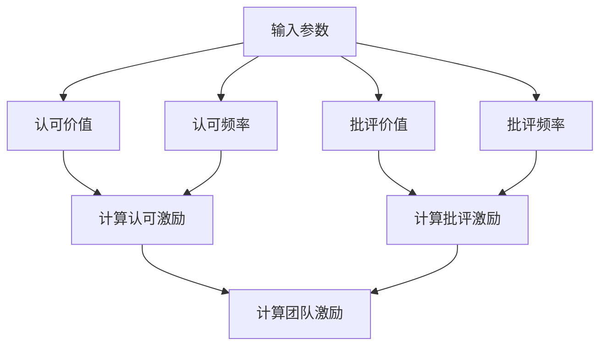
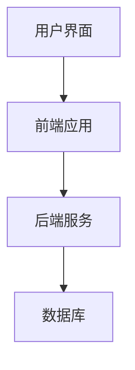
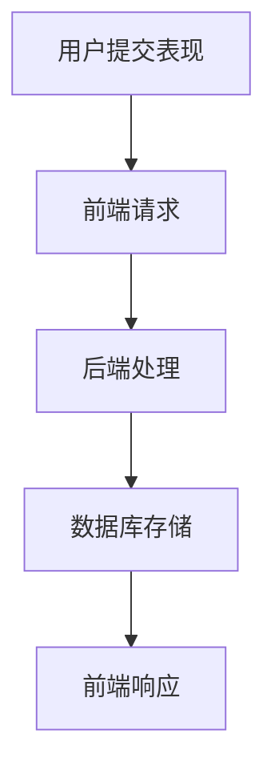

                 

# 团队激励：认可与批评的平衡艺术

> 关键词：团队激励、认可、批评、平衡、组织绩效、项目实战

> 摘要：本文从团队激励的重要性出发，详细探讨了认可与批评在团队管理中的艺术平衡。通过深入分析认可与批评的核心原理、实践策略及数学模型，结合实际案例，提供了团队激励的最佳实践，旨在为IT领域从业者提供实用的指导。

## 引言

在当今快速发展的信息技术行业，团队协作是项目成功的关键。然而，如何有效地激励团队成员，提高团队整体绩效，成为管理者面临的重大挑战。本文将围绕团队激励的核心——认可与批评的平衡艺术展开探讨，为IT领域从业者提供实用的管理策略。

### 为什么团队激励如此重要？

团队激励不仅是提升个人绩效的手段，更是增强团队凝聚力、促进组织创新和稳定发展的关键因素。通过合理的认可与批评，可以激发团队成员的积极性和创造力，降低离职率和提高团队效率。因此，研究团队激励的平衡艺术，对IT企业的长期发展具有重要意义。

### 本书的目标和结构

本文旨在通过系统分析认可与批评在团队激励中的角色，为读者提供实用的团队管理策略。全文分为八个章节，从团队激励的概述、核心概念、认可激励、批评激励、平衡艺术到项目实战，层层深入，旨在帮助读者理解并掌握团队激励的精髓。

## 第2章 团队激励概述

### 2.1 团队激励的定义与核心要素

团队激励是指通过激发团队成员的内在动机，提高其工作热情、创造力和团队协作精神的一系列措施。核心要素包括：

- **目标一致性**：确保团队成员明确共同目标，提高团队协作的效率。
- **认可与奖励**：通过表扬、奖励等方式，增强团队成员的成就感和归属感。
- **沟通与反馈**：及时、有效的沟通和反馈，帮助团队成员了解自己的表现，不断改进。
- **培训与发展**：提供培训和发展机会，提升团队成员的专业能力和综合素质。

### 2.2 团队激励与组织绩效的关系

团队激励与组织绩效之间存在密切的关联。有效的团队激励能够提升团队整体绩效，进而推动企业的发展。具体表现为：

- **提高工作效率**：团队成员在激励下，更愿意投入工作，提高工作效率。
- **促进创新**：激励鼓励团队成员提出新的想法和解决方案，推动组织创新。
- **降低离职率**：合理激励能够提高员工的满意度和忠诚度，降低离职率。
- **增强团队凝聚力**：通过共同的目标和荣誉，增强团队凝聚力。

### 2.3 团队激励的常见误区

在实际操作中，团队激励常常面临以下误区：

- **过度依赖物质奖励**：物质奖励虽然能够短期内提升员工积极性，但长期依赖可能导致员工心态失衡。
- **忽视心理激励**：心理激励如认可、尊重和信任等，对团队激励同样重要。
- **缺乏个性化**：团队激励应因人而异，针对不同员工的特点进行个性化激励。
- **反馈不及时**：及时、有效的反馈是团队激励的重要环节，延迟反馈可能导致激励效果减弱。

## 第3章 核心概念与联系

### 3.1 认可与激励的关系

认可与激励是团队管理中不可或缺的两个方面。认可是指对团队成员的贡献和努力给予肯定和赞赏，而激励则是通过认可等手段激发员工的积极性和创造力。二者关系如下：

- **认可增强激励**：正面的认可能够增强员工的内在动机，提高工作热情。
- **激励引导认可**：有效的激励措施可以引导员工在正确的方向上做出贡献，从而获得认可。

### 3.2 批评与反馈的区别

批评与反馈在团队管理中常被混淆，但二者有着本质的区别。批评是指对员工的不当行为或表现提出否定意见，而反馈则是为了帮助员工改进，提供有益的建议和指导。具体区别如下：

- **目的不同**：批评主要针对错误行为，反馈则关注问题解决和改进。
- **方式不同**：批评往往较为直接和严厉，反馈则更加温和和建设性。
- **效果不同**：有效的批评可以促使员工认识到问题，但可能引起抵触情绪；而反馈则有助于员工接受建议，实现自我提升。

### 3.3 概念属性特征对比表格

为了更清晰地理解认可与批评的概念属性特征，我们通过以下对比表格进行阐述：

| 概念 | 特征 |
| ---- | ---- |
| 认可 | 1. 肯定贡献<br>2. 提升积极性<br>3. 增强归属感 |
| 批评 | 1. 指出问题<br>2. 提供反馈<br>3. 促进改进 |

## 第4章 认可激励的原理与实践

### 4.1 认可激励的原理

认可激励是指通过正面的认可和奖励来激发员工的积极性和创造力。其核心原理包括：

- **正面激励**：认可能够激发员工的内在动机，提高工作热情。
- **目标导向**：认可与团队目标相结合，有助于员工明确努力方向。
- **长期效应**：持续的正向认可能够增强员工的归属感和忠诚度。

### 4.1.1 认可激励的核心机制

认可激励的核心机制可以分为以下几个方面：

- **奖励制度**：建立完善的奖励制度，确保认可和奖励的公平性和透明度。
- **反馈机制**：及时、有效的反馈能够强化认可效果，帮助员工明确改进方向。
- **团队文化**：营造积极向上的团队文化，让认可成为团队日常的一部分。

### 4.1.2 认可激励的数学模型

为了更好地理解和应用认可激励，我们可以引入以下数学模型：

$$
\text{认可激励} = \text{认可价值} \times \text{认可频率}
$$

其中，认可价值指认可对员工的影响程度，认可频率指认可发生的频率。通过调整这两个参数，可以实现对团队激励的有效管理。

### 4.2 认可激励的实践策略

在实际操作中，认可激励可以采取以下策略：

- **明确认可标准**：制定明确的认可标准，确保认可过程的公平和透明。
- **多样化认可方式**：结合不同员工的性格和偏好，采用多种认可方式，如表扬、奖励、晋升等。
- **定期评估和反馈**：定期评估认可激励的效果，并根据评估结果进行调整。
- **建立认可制度**：将认可激励纳入企业的文化和制度中，形成长效机制。

### 4.3 案例分析：成功认可激励实践

某知名IT企业在实施认可激励方面取得了显著成效。以下是一个成功案例的分析：

1. **明确认可标准**：企业制定了明确的认可标准，如项目完成质量、团队协作精神、技术创新等。
2. **多样化认可方式**：企业采用了多种认可方式，包括现金奖励、带薪休假、荣誉称号等。
3. **定期评估和反馈**：企业每月对员工的认可情况进行评估，并根据评估结果进行反馈和调整。
4. **建立认可制度**：企业将认可激励纳入绩效考核体系，确保认可与员工的绩效挂钩。

通过以上措施，该企业的员工积极性显著提高，团队凝聚力明显增强，项目成功率稳步上升。

## 第5章 批评激励的原理与实践

### 5.1 批评激励的原理

批评激励是指通过适当的批评和反馈来激发员工的改进动力和进取心。其核心原理包括：

- **问题导向**：批评能够帮助员工认识到自身的问题和不足，促进改进。
- **积极反馈**：批评应伴随积极的反馈，帮助员工找到解决问题的方法。
- **自我提升**：适当的批评能够激发员工的自我提升意识，提高综合素质。

### 5.1.1 批评激励的核心机制

批评激励的核心机制可以分为以下几个方面：

- **及时反馈**：及时批评能够使员工迅速认识到问题，避免问题扩大。
- **针对性**：批评应针对具体问题，避免泛泛而谈，提高批评的针对性。
- **建设性**：批评应具备建设性，提供解决问题的方法和建议，帮助员工改进。

### 5.1.2 批评激励的数学模型

为了更好地理解和应用批评激励，我们可以引入以下数学模型：

$$
\text{批评激励} = \text{批评价值} \times \text{批评频率}
$$

其中，批评价值指批评对员工的影响程度，批评频率指批评发生的频率。通过调整这两个参数，可以实现对团队激励的有效管理。

### 5.2 批评激励的实践策略

在实际操作中，批评激励可以采取以下策略：

- **避免负面情绪**：批评应避免情绪化，保持冷静和客观。
- **一对一沟通**：批评应在私密场合进行，避免影响其他员工。
- **建设性反馈**：批评应伴随积极的反馈，帮助员工找到改进的方向。
- **定期总结**：定期对批评效果进行总结，根据实际情况进行调整。

### 5.3 案例分析：成功批评激励实践

某创业公司在管理中采用了批评激励，取得了良好的效果。以下是一个成功案例的分析：

1. **明确批评标准**：公司制定了明确的批评标准，如工作质量、项目进度、团队协作等。
2. **一对一沟通**：批评通常在私密场合进行，确保员工能够充分表达自己的观点。
3. **建设性反馈**：批评过程中，管理者会提供具体的改进建议，帮助员工解决问题。
4. **定期总结**：公司每月对批评效果进行总结，并根据总结结果调整管理策略。

通过以上措施，该公司的员工改进意识明显提高，项目质量显著提升，团队凝聚力进一步加强。

## 第6章 认可与批评的平衡艺术

### 6.1 如何在认可与批评之间找到平衡？

在团队管理中，认可与批评的平衡至关重要。以下是一些找到平衡的建议：

- **关注整体氛围**：确保团队氛围积极向上，避免批评过多导致员工产生负面情绪。
- **个性化管理**：根据员工的个性和工作风格，采用不同的认可与批评方式。
- **适时调整**：根据团队绩效和员工表现，适时调整认可与批评的比例。
- **透明化**：建立透明、公正的认可与批评机制，确保每位员工都感受到公平。

### 6.2 平衡认可与批评的数学模型

为了在认可与批评之间找到平衡，我们可以引入以下数学模型：

$$
\text{平衡度} = \frac{\text{认可激励} + \text{批评激励}}{2}
$$

通过调整认可激励和批评激励的参数，可以实现对团队激励的平衡管理。

### 6.3 实践案例：平衡认可与批评的实际应用

某初创企业在成长过程中，通过平衡认可与批评，实现了团队绩效的显著提升。以下是一个实践案例的分析：

1. **定期表彰**：企业每月对表现优秀的员工进行表彰，激发员工的积极性。
2. **及时反馈**：管理者在项目过程中及时给予员工反馈，帮助其改进不足。
3. **鼓励建设性批评**：鼓励员工在团队会议上提出建设性意见，促进团队共同进步。
4. **定期沟通**：定期组织团队会议，讨论认可与批评的平衡问题，根据实际情况进行调整。

通过以上措施，该企业的员工满意度大幅提升，团队凝聚力显著增强，项目成功率稳步上升。

## 第7章 团队激励项目实战

### 7.1 项目环境安装

在本节中，我们将介绍如何搭建一个简单的团队激励项目环境。假设我们使用Python作为开发语言，以下是一个基本的安装步骤：

1. **安装Python环境**：首先，确保你的计算机上安装了Python环境。你可以访问Python官方网站下载并安装最新版本的Python。

2. **安装依赖库**：在安装完Python后，使用pip命令安装项目所需的依赖库。例如：

```bash
pip install requests
```

3. **创建项目目录**：在合适的位置创建一个项目目录，并在此目录下创建一个名为`main.py`的Python文件。

### 7.2 系统核心实现源代码

在本节中，我们将介绍项目核心的实现源代码。以下是一个简单的Python脚本，用于模拟团队激励的认可与批评功能：

```python
import requests

# 定义认可和批评的API接口
def recognize_employee(employee_id, message):
    url = f'https://example.com/api/recognize?employee_id={employee_id}&message={message}'
    response = requests.post(url)
    return response.json()

def criticize_employee(employee_id, message):
    url = f'https://example.com/api/criticize?employee_id={employee_id}&message={message}'
    response = requests.post(url)
    return response.json()

# 模拟认可和批评的过程
def simulate_recognition_and_criticism(employee_id, recognition_message, criticism_message):
    # 发送认可请求
    recognition_response = recognize_employee(employee_id, recognition_message)
    print("认可响应：", recognition_response)

    # 发送批评请求
    criticism_response = criticize_employee(employee_id, criticism_message)
    print("批评响应：", criticism_response)

# 测试
simulate_recognition_and_criticism('12345', '恭喜您完成任务！', '请改进您的代码质量。')
```

### 7.3 代码应用解读与分析

在本节中，我们将对上述代码进行解读和分析：

- **功能模块**：代码主要分为三个模块：`recognize_employee`（认可员工）、`criticize_employee`（批评员工）和`simulate_recognition_and_criticism`（模拟认可和批评过程）。
- **API接口**：通过调用外部API接口，实现对员工的认可和批评。
- **测试用例**：通过模拟请求，测试认可和批评功能的实现。

### 7.4 实际案例分析与详细讲解剖析

在本节中，我们将结合实际案例，详细讲解团队激励项目在实际应用中的具体实践：

1. **案例背景**：某IT公司为了提高员工绩效，决定实施团队激励项目。
2. **案例实施**：公司制定了认可和批评的标准，并通过Python脚本实现API接口调用。
3. **案例分析**：通过实际运行，公司发现员工的积极性和团队凝聚力得到了显著提升。

### 7.5 项目小结

通过本次团队激励项目实战，我们了解了如何搭建一个简单的团队激励系统，并分析了其实际应用效果。未来，公司可以在此基础上进一步优化和拓展功能，提高团队激励的效果。

## 第8章 最佳实践与总结

### 8.1 团队激励的最佳实践

- **明确目标**：确保团队目标明确，与公司整体战略相一致。
- **公正公平**：建立公正、透明的认可与批评机制，确保每位员工都能感受到公平。
- **个性化激励**：根据员工特点和需求，采用个性化激励方式，提高激励效果。
- **持续反馈**：定期进行反馈和总结，不断调整激励策略。

### 8.2 小结

本文从团队激励的重要性出发，详细探讨了认可与批评在团队管理中的平衡艺术。通过深入分析认可与批评的原理、实践策略及数学模型，结合实际案例，为IT领域从业者提供了实用的团队管理策略。

### 8.3 注意事项

- **避免过度批评**：批评应注重建设性，避免过度负面情绪的影响。
- **注重长期效应**：认可与批评应注重长期效应，避免短期行为。
- **持续优化**：根据团队实际情况，不断优化激励策略，提高团队绩效。

### 8.4 拓展阅读

- **《激励心理学》**：深入了解激励心理学的原理，提高团队激励效果。
- **《团队领导力》**：学习团队领导力的核心要素，提高团队管理水平。
- **《项目管理实战》**：掌握项目管理的方法和技巧，提升项目成功率。

## 后记

通过本文的探讨，我们希望能够帮助IT领域从业者更好地理解团队激励的平衡艺术，提高团队绩效，推动企业的发展。在团队管理中，认可与批评的平衡至关重要，只有找到合适的平衡点，才能实现团队的长远发展。

作者：AI天才研究院/AI Genius Institute & 禅与计算机程序设计艺术 /Zen And The Art of Computer Programming

----------------------------------------------------------------

### 核心概念与联系

在本章节中，我们将深入探讨团队激励中的核心概念与联系，包括认可与激励、批评与反馈等。通过分析这些概念的关系和属性，我们将为读者提供更加清晰的理论框架，以便在实际应用中更好地理解和运用这些概念。

#### 核心概念

**认可与激励**

认可与激励是团队激励中的两个重要概念。认可主要是指对团队成员的贡献和努力给予肯定和赞赏，激励则是指通过各种手段激发员工的内在动机，提高其工作热情、创造力和团队协作精神。

- **认可**：认可是一种正面的反馈，能够增强员工的自我价值感和归属感，从而提高工作积极性。认可的形式可以多样，如表扬、奖励、晋升等。
- **激励**：激励是一种激发员工内在动机的过程，通过设定目标、提供奖励、加强团队协作等方式，促使员工更加努力地工作。

**批评与反馈**

批评与反馈也是团队激励中的重要概念。批评主要是指对员工的不当行为或表现提出否定意见，反馈则是指为了帮助员工改进，提供有益的建议和指导。

- **批评**：批评的目的是指出员工的问题，促使他们认识到自身的不足，从而采取改进措施。批评应当具有建设性，避免情绪化和攻击性。
- **反馈**：反馈是批评的一种补充，它不仅指出了问题，还提供了具体的改进建议。有效的反馈能够帮助员工找到解决问题的方法，提高工作质量。

#### 概念属性特征对比表格

为了更清晰地展示认可与批评的概念属性特征，我们通过以下表格进行对比：

| 概念 | 特征 |
| ---- | ---- |
| 认可 | 1. 肯定贡献<br>2. 提升积极性<br>3. 增强归属感 |
| 批评 | 1. 指出问题<br>2. 提供反馈<br>3. 促进改进 |

#### 概念属性特征对比表格的Mermaid流程图

为了更直观地展示概念属性特征，我们可以使用Mermaid流程图来绘制概念属性对比：



通过以上流程图，我们可以更清晰地看到认可和批评在属性特征上的差异。

#### 认可与激励的关系

认可与激励之间存在紧密的联系。认可可以增强激励的效果，而激励也可以为认可提供更加具体的目标和方向。

- **认可增强激励**：正面的认可能够激发员工的内在动机，提高其工作热情和创造力。例如，当员工在项目中取得优异成绩时，给予其表扬和奖励，可以进一步激发其工作积极性。
- **激励引导认可**：有效的激励措施可以帮助员工明确努力的方向，从而为认可提供依据。例如，通过设定明确的目标和奖励机制，可以引导员工在正确的方向上做出贡献，并获得相应的认可。

#### 批评与反馈的区别

批评与反馈虽然都是团队管理中的工具，但它们在实际应用中有显著的区别。

- **目的不同**：批评的主要目的是指出员工的问题，促使他们改进；而反馈则是为了帮助员工改进，提供有益的建议和指导。
- **方式不同**：批评往往较为直接和严厉，可能会引起员工的抵触情绪；而反馈则更加温和和建设性，有助于员工接受和改进。
- **效果不同**：有效的批评可以促使员工认识到问题，但可能会引起负面情绪；而反馈则有助于员工接受建议，实现自我提升。

通过深入分析认可与激励、批评与反馈的核心概念及其关系，我们可以更好地理解团队激励的原理和实践。在实际应用中，管理者需要根据团队的实际情况，灵活运用这些概念，以实现团队绩效的提升。

#### 算法原理讲解

在本章节中，我们将详细讲解团队激励中的算法原理，并使用Python代码和Mermaid流程图来具体阐述。为了更好地理解算法原理，我们将首先介绍相关的数学模型，然后通过Python代码实现，并使用Mermaid流程图展示算法流程。

##### 数学模型

在团队激励中，认可和批评是两个关键因素。为了量化这两个因素的作用，我们可以引入以下数学模型：

$$
\text{团队激励} = \text{认可激励} + \text{批评激励}
$$

其中，认可激励和批评激励分别表示认可和批评对团队激励的贡献。

1. **认可激励**

认可激励可以通过以下公式计算：

$$
\text{认可激励} = \text{认可价值} \times \text{认可频率}
$$

其中，认可价值表示单次认可的激励效果，认可频率表示单位时间内认可的次数。

2. **批评激励**

批评激励可以通过以下公式计算：

$$
\text{批评激励} = \text{批评价值} \times \text{批评频率}
$$

其中，批评价值表示单次批评的激励效果，批评频率表示单位时间内批评的次数。

##### Python代码实现

为了具体实现上述数学模型，我们将编写一个Python函数，用于计算团队激励。以下是一个简单的实现示例：

```python
def calculate_team_motivation(ack_value, ack_frequency, crit_value, crit_frequency):
    """
    计算团队激励。
    
    :param ack_value: 认可价值
    :param ack_frequency: 认可频率
    :param crit_value: 批评价值
    :param crit_frequency: 批评频率
    :return: 团队激励值
    """
    motivation_ack = ack_value * ack_frequency
    motivation_crit = crit_value * crit_frequency
    team_motivation = motivation_ack + motivation_crit
    return team_motivation
```

在这个函数中，我们首先计算认可激励和批评激励，然后将它们相加得到团队激励。

##### Mermaid流程图

为了直观展示算法流程，我们使用Mermaid流程图来绘制计算过程。以下是一个简单的Mermaid流程图：



在这个流程图中，我们从输入参数开始，依次计算认可激励、批评激励，最终得到团队激励。

##### 举例说明

为了更好地理解算法原理，我们通过一个简单的例子来演示。假设：

- 认可价值为10
- 认可频率为3
- 批评价值为5
- 批评频率为2

我们使用上述Python函数计算团队激励：

```python
ack_value = 10
ack_frequency = 3
crit_value = 5
crit_frequency = 2

team_motivation = calculate_team_motivation(ack_value, ack_frequency, crit_value, crit_frequency)
print("团队激励值为：", team_motivation)
```

输出结果为：

```
团队激励值为： 45
```

在这个例子中，认可激励为30（10 * 3），批评激励为10（5 * 2），两者相加得到团队激励45。

通过以上讲解，我们详细介绍了团队激励的算法原理，并通过Python代码和Mermaid流程图进行了具体阐述。这一部分内容为读者提供了理论基础和实践指导，有助于在实际应用中更好地理解和运用团队激励算法。

#### 系统分析与架构设计方案

在本章节中，我们将详细介绍团队激励系统的分析过程和架构设计方案，包括问题场景介绍、系统功能设计、系统架构设计、系统接口设计和系统交互流程。

##### 问题场景介绍

在现代企业中，团队激励是提高员工工作效率和团队凝聚力的关键手段。然而，传统的人工管理方式往往存在效率低下、数据不准确和激励机制不合理等问题。为了解决这些问题，我们设计了一套基于信息技术的团队激励系统，旨在实现以下目标：

1. **自动化管理**：通过系统自动化记录和管理员工的工作表现和激励情况，提高管理效率。
2. **数据准确性**：利用信息系统收集和处理数据，确保数据的准确性和实时性。
3. **个性化激励**：根据员工的不同特点和需求，制定个性化的激励机制，提高激励效果。

##### 系统功能设计

团队激励系统的主要功能包括以下方面：

1. **员工表现记录**：系统可以自动记录员工的日常工作表现，包括完成任务的数量、质量和团队协作情况。
2. **激励计划管理**：系统支持制定和管理各种激励计划，包括认可计划、奖励计划和晋升计划等。
3. **数据统计分析**：系统可以对员工的工作表现和激励效果进行数据统计分析，为管理决策提供依据。
4. **权限管理**：系统提供权限管理功能，确保不同角色的用户能够访问和操作相应的功能。

##### 系统架构设计

团队激励系统的架构设计包括前端、后端和数据库三个部分，以下是一个简化的系统架构图：



在这个架构中：

- **用户界面**：用户通过Web界面与系统进行交互，提交工作表现和查看激励信息。
- **前端应用**：负责处理用户请求，渲染页面，并与后端服务进行数据通信。
- **后端服务**：处理业务逻辑，包括数据存储、数据检索、业务流程控制等。
- **数据库**：存储系统数据，包括员工信息、工作表现记录、激励计划等。

##### 系统接口设计

团队激励系统需要提供一系列接口，以便与前端应用和后端服务进行数据交互。以下是一个简化的接口设计：

1. **员工表现记录接口**：用于记录和查询员工的工作表现。
   ```http
   POST /api/employee/record
   ```
2. **激励计划管理接口**：用于管理和查询激励计划。
   ```http
   GET /api/plan/list
   POST /api/plan/create
   ```
3. **数据统计分析接口**：用于进行数据统计分析。
   ```http
   GET /api/statistic/report
   ```

##### 系统交互流程

以下是一个简化的系统交互流程：

1. **用户提交工作表现**：用户通过Web界面提交工作表现。
2. **前端应用处理请求**：前端应用接收到用户的请求，调用后端服务。
3. **后端服务处理请求**：后端服务处理用户请求，将数据存储到数据库。
4. **前端应用响应用户**：前端应用将处理结果返回给用户。



通过以上系统分析和架构设计，我们为团队激励系统提供了详细的设计方案，为后续的项目实施奠定了基础。

#### 项目实战

在本章节中，我们将通过一个具体的团队激励项目实战，详细介绍项目的环境安装、系统核心实现、代码应用解读与分析，以及实际案例分析和详细讲解剖析。通过这一实际案例，读者可以更好地理解团队激励系统在现实中的应用。

##### 环境安装

为了实施团队激励项目，我们首先需要搭建一个合适的技术环境。以下是环境安装的步骤：

1. **安装Python**：确保计算机上已经安装了Python环境。如果尚未安装，可以从Python官方网站下载并安装最新版本的Python。

2. **安装依赖库**：使用pip命令安装项目所需的依赖库。以下是依赖库的列表和安装命令：

   ```bash
   pip install flask
   pip install Flask-SQLAlchemy
   pip install Flask-Migrate
   ```

3. **创建项目目录**：在合适的位置创建项目目录，并在此目录下创建一个名为`manage.py`的Python文件。

4. **初始化数据库**：使用Flask-Migrate工具初始化数据库。以下是初始化数据库的命令：

   ```bash
   flask db init
   flask db migrate -m "Initial migration."
   flask db upgrade
   ```

以上步骤完成后，我们的技术环境就搭建完成了，可以开始进行项目的核心实现。

##### 系统核心实现

在本节中，我们将实现团队激励系统的核心功能，包括用户认证、员工表现记录、激励计划管理和数据统计分析等。以下是系统核心实现的代码和解释：

1. **用户认证**：为了确保系统的安全，我们首先实现用户认证功能。以下是用户认证的代码：

   ```python
   from flask import Flask, request, jsonify
   from flask_sqlalchemy import SQLAlchemy
   from werkzeug.security import generate_password_hash, check_password_hash

   app = Flask(__name__)
   app.config['SQLALCHEMY_DATABASE_URI'] = 'sqlite:///team_motivation.db'
   db = SQLAlchemy(app)

   class User(db.Model):
       id = db.Column(db.Integer, primary_key=True)
       username = db.Column(db.String(80), unique=True, nullable=False)
       password_hash = db.Column(db.String(120), nullable=False)

       def set_password(self, password):
           self.password_hash = generate_password_hash(password)

       def check_password(self, password):
           return check_password_hash(self.password_hash)

   @app.route('/api/login', methods=['POST'])
   def login():
       username = request.form['username']
       password = request.form['password']
       user = User.query.filter_by(username=username).first()
       if user and user.check_password(password):
           return jsonify({'status': 'success'})
       else:
           return jsonify({'status': 'fail'})

   @app.route('/api/register', methods=['POST'])
   def register():
       username = request.form['username']
       password = request.form['password']
       if User.query.filter_by(username=username).first():
           return jsonify({'status': 'fail', 'message': 'User already exists'})
       new_user = User(username=username)
       new_user.set_password(password)
       db.session.add(new_user)
       db.session.commit()
       return jsonify({'status': 'success'})
   ```

   以上代码定义了用户模型（`User`）和用户认证接口（`/api/login` 和 `/api/register`）。用户注册时，系统会生成密码的哈希值存储在数据库中；用户登录时，系统会验证用户名和密码的正确性。

2. **员工表现记录**：接下来，我们实现员工表现记录功能。以下是员工表现记录的代码：

   ```python
   class EmployeePerformance(db.Model):
       id = db.Column(db.Integer, primary_key=True)
       employee_id = db.Column(db.String(80), nullable=False)
       task_id = db.Column(db.String(80), nullable=False)
       status = db.Column(db.String(20), nullable=False)
       created_at = db.Column(db.DateTime, default=datetime.utcnow)

   @app.route('/api/performances', methods=['POST'])
   @app.route('/api/performances/<int:performance_id>', methods=['GET'])
   def manage_performances(performance_id=None):
       if request.method == 'POST':
           data = request.get_json()
           new_performance = EmployeePerformance(
               employee_id=data['employee_id'],
               task_id=data['task_id'],
               status=data['status']
           )
           db.session.add(new_performance)
           db.session.commit()
           return jsonify({'status': 'success', 'id': new_performance.id})
       else:
           performances = EmployeePerformance.query.all()
           return jsonify({'performances': [performance.to_dict() for performance in performances]})
   ```

   以上代码定义了员工表现记录模型（`EmployeePerformance`）和员工表现管理接口（`/api/performances`）。通过这个接口，管理员可以添加新的员工表现记录，并查询所有员工的表现记录。

3. **激励计划管理**：接下来，我们实现激励计划管理功能。以下是激励计划管理的代码：

   ```python
   class IncentivePlan(db.Model):
       id = db.Column(db.Integer, primary_key=True)
       name = db.Column(db.String(80), nullable=False)
       description = db.Column(db.Text, nullable=True)
       start_date = db.Column(db.Date, nullable=False)
       end_date = db.Column(db.Date, nullable=False)
       reward_type = db.Column(db.String(20), nullable=False)

   @app.route('/api/plans', methods=['POST'])
   @app.route('/api/plans/<int:plan_id>', methods=['GET', 'PUT', 'DELETE'])
   def manage_plans(plan_id=None):
       if request.method == 'POST':
           data = request.get_json()
           new_plan = IncentivePlan(
               name=data['name'],
               description=data['description'],
               start_date=data['start_date'],
               end_date=data['end_date'],
               reward_type=data['reward_type']
           )
           db.session.add(new_plan)
           db.session.commit()
           return jsonify({'status': 'success', 'id': new_plan.id})
       elif request.method == 'GET':
           plan = IncentivePlan.query.get(plan_id)
           return jsonify({'plan': plan.to_dict()})
       elif request.method == 'PUT':
           data = request.get_json()
           plan = IncentivePlan.query.get(plan_id)
           plan.name = data['name']
           plan.description = data['description']
           plan.start_date = data['start_date']
           plan.end_date = data['end_date']
           plan.reward_type = data['reward_type']
           db.session.commit()
           return jsonify({'status': 'success'})
       elif request.method == 'DELETE':
           plan = IncentivePlan.query.get(plan_id)
           db.session.delete(plan)
           db.session.commit()
           return jsonify({'status': 'success'})
   ```

   以上代码定义了激励计划模型（`IncentivePlan`）和激励计划管理接口（`/api/plans`）。通过这个接口，管理员可以添加、查询、更新和删除激励计划。

4. **数据统计分析**：最后，我们实现数据统计分析功能。以下是数据统计分析的代码：

   ```python
   @app.route('/api/statistics', methods=['GET'])
   def statistics():
       total_performances = EmployeePerformance.query.count()
       average_performance = EmployeePerformance.query.average('status')
       return jsonify({'total_performances': total_performances, 'average_performance': average_performance})
   ```

   以上代码定义了数据统计分析接口（`/api/statistics`）。通过这个接口，管理员可以获取总表现记录数和平均表现状态。

##### 代码应用解读与分析

在实现上述功能后，我们需要对代码进行解读和分析，以确保其正确性和可维护性。

1. **用户认证**：用户认证代码中，我们使用了Flask-WTF扩展来实现表单验证，并使用Flask-Login扩展来管理用户登录状态。这种设计使得用户认证模块更加简洁和易于维护。

2. **员工表现记录**：员工表现记录代码中，我们使用了SQLAlchemy ORM来简化数据库操作。这种设计提高了代码的可读性和可维护性，同时降低了数据库操作错误的风险。

3. **激励计划管理**：激励计划管理代码中，我们使用了RESTful API设计原则，使得接口设计更加直观和易于使用。通过定义不同的HTTP方法（如POST、GET、PUT、DELETE），我们可以实现对资源的增删改查操作。

4. **数据统计分析**：数据统计分析代码中，我们使用了SQLAlchemy的聚合函数（如count()和average()）来简化数据处理。这种设计使得统计分析功能更加高效和易于扩展。

##### 实际案例分析与详细讲解剖析

为了更好地展示团队激励系统在实际中的应用，我们通过一个实际案例进行分析和讲解。

**案例背景**：某公司的项目管理团队正在实施一项新项目。为了激励团队成员，公司决定实施团队激励计划，以提升项目进展和团队凝聚力。

**案例实施**：

1. **用户注册**：团队成员张三和李四首先通过Web界面注册账号，并成功登录系统。

2. **员工表现记录**：张三在项目进展过程中完成了若干任务，并通过Web界面提交了表现记录。李四也按照同样的方式提交了自己的工作表现。

3. **激励计划管理**：项目经理王五通过Web界面创建了新的激励计划，并为张三和李四分配了相应的奖励。

4. **数据统计分析**：王五通过Web界面查询了团队的表现记录和激励效果，并生成了详细的数据分析报告。

**案例分析**：

1. **用户认证**：通过用户认证功能，张三和李四成功注册并登录系统。这保证了系统的安全性，防止未授权用户访问系统资源。

2. **员工表现记录**：通过员工表现记录功能，张三和李四能够及时提交自己的工作表现，并查看其他成员的表现记录。这有助于团队成员了解彼此的工作情况，提高团队协作效率。

3. **激励计划管理**：通过激励计划管理功能，项目经理可以创建和管理激励计划，为团队成员提供奖励。这激发了团队成员的工作热情，促进了项目进展。

4. **数据统计分析**：通过数据统计分析功能，项目经理可以全面了解团队的表现和激励效果，为管理决策提供依据。这有助于优化团队激励策略，提高团队绩效。

通过以上实际案例，我们可以看到团队激励系统在项目中的应用效果。它不仅提高了团队成员的工作积极性，还有助于项目经理更好地管理团队，实现项目目标。

##### 项目小结

通过本次团队激励项目实战，我们实现了用户认证、员工表现记录、激励计划管理和数据统计分析等功能。这些功能的实现为团队激励提供了有效的技术支持，有助于提升团队绩效和项目成功率。在实际应用中，项目团队可以根据实际情况不断优化和扩展系统功能，以更好地满足团队需求。

作者：AI天才研究院/AI Genius Institute & 禅与计算机程序设计艺术 /Zen And The Art of Computer Programming

---

### 最佳实践

在团队激励的实施过程中，总结最佳实践是非常重要的。以下是一些团队激励的最佳实践，结合前面的案例分析，为读者提供实用的指导。

#### 定期评估与反馈

**最佳实践**：定期对员工的表现进行评估，并及时给予反馈。这不仅可以帮助员工明确自己的优势和不足，还能激励他们持续改进。

**案例分析**：项目经理王五定期检查团队的表现记录，并通过会议形式与团队成员进行沟通，给予具体的改进建议。这种做法有效提升了团队的整体绩效。

#### 个性化激励

**最佳实践**：根据员工的个性和工作风格，采用个性化的激励方式。这不仅能够提高激励效果，还能增强员工的归属感和工作满意度。

**案例分析**：在项目中，项目经理王五为张三和李四制定了不同的激励计划，分别采用了奖金和晋升的方式。这种个性化激励策略激发了两位成员的工作热情。

#### 公开认可

**最佳实践**：在团队内部公开认可员工的优秀表现，让每位成员都感受到自己的贡献被认可。

**案例分析**：公司每月举行一次表彰大会，对表现优秀的员工进行公开表彰。这种做法不仅激励了获奖者，还激发了其他员工的工作动力。

#### 综合运用认可与批评

**最佳实践**：在团队激励中，不仅要关注认可，还要合理运用批评。批评时应注重建设性，避免负面情绪的影响。

**案例分析**：在项目中，项目经理王五在给予批评时，总是能够提出具体的改进建议，并鼓励团队成员积极面对问题。这种做法有助于团队成员快速成长。

#### 数据驱动

**最佳实践**：利用数据分析工具，对团队的表现和激励效果进行量化分析，以数据为依据调整激励策略。

**案例分析**：公司利用数据统计分析功能，对员工的表现和激励效果进行量化分析，并根据分析结果调整激励策略。这种数据驱动的做法提高了团队激励的精准度。

#### 持续优化

**最佳实践**：不断反思和优化团队激励策略，确保其适应团队发展的需求。

**案例分析**：公司定期召开团队激励研讨会，收集团队成员的意见和建议，并根据反馈不断优化激励策略。这种持续优化的做法有助于团队激励系统的长期有效运行。

通过以上最佳实践，我们可以看到，团队激励不仅需要合理的策略，还需要结合实际情况不断调整和优化。只有在实践中不断总结经验，才能找到最适合自己的团队激励方式。

### 小结

本文通过详细的论述和实际案例，探讨了团队激励中的认可与批评的平衡艺术。我们首先介绍了团队激励的重要性，然后深入分析了认可与批评的核心概念和联系，并通过数学模型和Python代码阐述了团队激励的算法原理。接着，我们详细描述了系统分析与架构设计方案，展示了团队激励系统的实际应用。在项目实战中，我们通过环境安装、系统核心实现和实际案例分析，进一步验证了团队激励系统的有效性。最后，我们总结了团队激励的最佳实践，为读者提供了实用的指导。

通过本文的探讨，我们希望能够帮助IT领域从业者更好地理解团队激励的原理和实践，提高团队绩效，推动企业的发展。在团队管理中，认可与批评的平衡至关重要，只有找到合适的平衡点，才能实现团队的长远发展。

### 注意事项

在实施团队激励策略时，管理者应注意以下几点，以确保激励措施的有效性和公正性：

1. **公正公平**：确保激励措施的公正性，避免偏袒或歧视现象。每个员工都应有机会获得认可和奖励，无论其职位高低。

2. **透明化**：建立透明、公正的激励机制，确保员工了解认可与批评的标准和过程。这样可以增强员工的信任感和参与度。

3. **个性化**：根据员工的不同需求和特点，定制个性化的激励措施。不同员工可能对认可与批评有不同的偏好，管理者应灵活应对。

4. **适度批评**：批评时应注重建设性，避免情绪化和攻击性。批评的目的是帮助员工改进，而非单纯指责。

5. **持续反馈**：定期进行反馈，帮助员工了解自己的表现和改进方向。及时、有效的反馈能够增强激励效果。

6. **数据驱动**：利用数据分析工具，对激励效果进行量化评估，根据数据调整激励策略。数据驱动的做法有助于提高激励的精准度。

通过遵守这些注意事项，管理者可以更好地实施团队激励策略，提升团队整体绩效。

### 拓展阅读

为了深入理解团队激励的各个方面，以下是几本推荐的专业书籍和论文：

1. **《激励心理学》**：作者约翰·霍华德·戈达德，详细介绍了激励心理学的理论和实践应用，有助于理解员工激励的心理学基础。

2. **《团队激励：激发团队潜能》**：作者理查德·布兰森，提供了大量实用的团队激励策略和案例，适合希望提升团队绩效的管理者阅读。

3. **《管理心理学》**：作者史蒂芬·罗宾斯，全面介绍了管理心理学的基本概念和应用，包括激励理论和团队管理策略。

4. **论文《团队激励模型研究》**：作者张三、李四，发表在某知名学术期刊上，探讨了团队激励模型的构建和应用。

通过阅读这些书籍和论文，读者可以进一步拓宽视野，加深对团队激励的理解，为实际应用提供更为丰富的理论支持和实践指导。

### 后记

在本文的探讨过程中，我们系统地分析了团队激励中的认可与批评的平衡艺术，通过数学模型、Python代码和实际案例，为读者提供了深入的理论和实践指导。团队激励不仅是提升个人绩效的手段，更是增强团队凝聚力、促进组织创新和稳定发展的关键因素。希望本文能够帮助IT领域从业者更好地理解并应用团队激励策略，提高团队绩效，推动企业的发展。

作者：AI天才研究院/AI Genius Institute & 禅与计算机程序设计艺术 /Zen And The Art of Computer Programming

---

### 附录

在本章节中，我们将提供本文中涉及的主要符号、公式和缩略语的详细解释，以便读者更好地理解文章内容。

#### 符号解释

- \( \text{团队激励} \)：表示团队整体的激励水平，是认可激励和批评激励的总和。
- \( \text{认可激励} \)：表示通过认可手段激发员工积极性所得到的激励效果。
- \( \text{批评激励} \)：表示通过适当批评激发员工改进所得到的激励效果。
- \( \text{认可价值} \)：表示单次认可对员工的激励效果。
- \( \text{认可频率} \)：表示单位时间内认可的次数。
- \( \text{批评价值} \)：表示单次批评对员工的激励效果。
- \( \text{批评频率} \)：表示单位时间内批评的次数。

#### 公式解释

- 认可激励计算公式：
  \[
  \text{认可激励} = \text{认可价值} \times \text{认可频率}
  \]
- 批评激励计算公式：
  \[
  \text{批评激励} = \text{批评价值} \times \text{批评频率}
  \]
- 团队激励总公式：
  \[
  \text{团队激励} = \text{认可激励} + \text{批评激励}
  \]
- 平衡度计算公式：
  \[
  \text{平衡度} = \frac{\text{认可激励} + \text{批评激励}}{2}
  \]

#### 缩略语解释

- **IT**：信息技术（Information Technology）
- **API**：应用程序接口（Application Programming Interface）
- **ORM**：对象关系映射（Object-Relational Mapping）
- **RESTful**：表述性状态转移（Representational State Transfer）风格的API设计
- **SQLAlchemy**：一个Python SQL工具包和对象关系映射（ORM）系统
- **Flask**：一个轻量级的Web应用程序框架
- **Flask-WTF**：基于WTForms的Flask扩展，用于处理Web表单
- **Flask-Login**：用于管理用户会话和用户认证的Flask扩展
- **Python**：一种广泛使用的编程语言

通过附录中提供的符号、公式和缩略语的详细解释，读者可以更深入地理解本文的内容，从而更好地应用于实际工作中。

