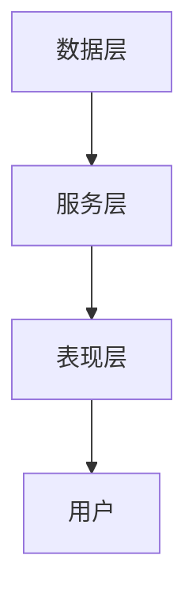
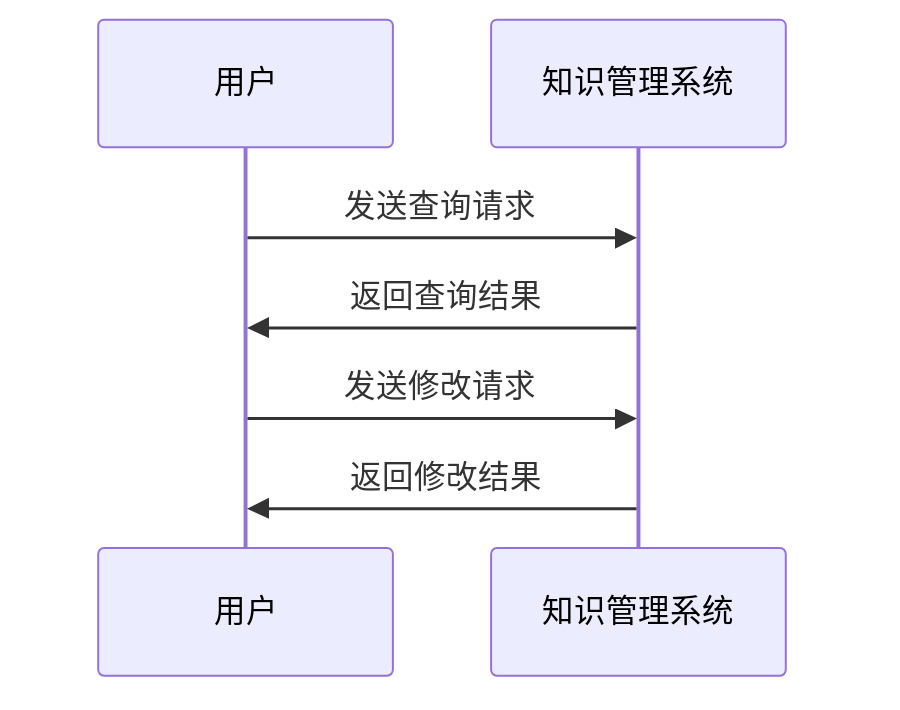
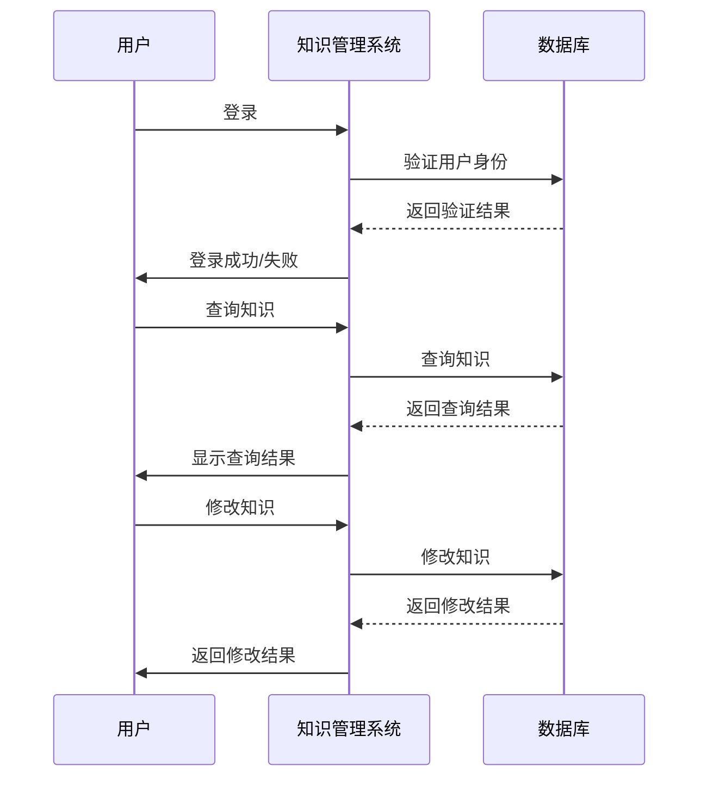

                 

# 团队知识管理：促进经验分享与传承

## 关键词

- 团队知识管理
- 经验分享
- 传承
- 知识库
- 知识图谱
- 人工智能

## 摘要

随着信息技术的飞速发展，团队知识管理成为现代企业提升核心竞争力的重要手段。本文旨在探讨团队知识管理的概念、技术基础、团队协作与经验分享机制，并结合实践案例，总结最佳实践经验，提出面临的挑战和未来发展趋势。通过详细解析团队知识管理的核心要素和实践方法，本文为企业和团队提供了一套系统性的知识管理解决方案，以促进经验的分享与传承。

## 目录大纲

## 第一部分：团队知识管理概述

### 第1章：团队知识管理引论

#### 1.1 问题背景

在快速变化的商业环境中，知识已成为企业最宝贵的资产。然而，如何有效地管理团队知识，实现经验的分享与传承，成为企业面临的挑战。

#### 1.2 核心概念与联系

知识管理、团队协作、经验分享与传承是团队知识管理的核心概念。通过对比不同知识管理工具和方法的属性特征，了解其应用场景和优势。

#### 1.3 团队知识管理的框架与要素

团队知识管理涉及知识获取、共享、利用、评估与改进等多个环节。ER实体关系图架构和知识管理流程为团队知识管理提供了理论基础。

### 第2章：团队知识管理的技术基础

#### 2.1 知识管理技术与工具

介绍知识库、知识图谱、企业门户、社交媒体等知识管理工具，分析其优缺点与应用场景。

#### 2.2 知识管理系统的设计与实现

通过系统架构设计mermaid架构图和系统接口设计，探讨知识管理系统的设计与实现。

### 第3章：团队协作与经验分享机制

#### 3.1 团队协作与知识分享的关系

团队协作与知识分享相辅相成。通过协作机制和知识分享流程，实现团队成员之间的高效沟通与经验交流。

#### 3.2 经验传承与知识积累

个人与团队的实践经验积累是团队知识管理的重要来源。通过经验传承和知识积累，构建知识库，实现知识的持续更新与完善。

## 第二部分：团队知识管理实践

### 第4章：团队知识管理项目实战

#### 4.1 项目介绍

介绍一个真实的团队知识管理项目案例，明确项目目标和预期成果。

#### 4.2 环境安装与配置

详细描述项目所需工具和软件的安装与配置过程。

#### 4.3 系统核心实现源代码

分析系统核心实现源代码，解释关键代码段及功能说明。

#### 4.4 代码应用解读与分析

解读源代码，分析其在实际应用场景中的效果。

#### 4.5 实际案例分析与详细讲解剖析

结合实际案例，对项目进行详细讲解和剖析。

#### 4.6 项目小结

总结项目实施过程中的经验教训，为后续项目提供借鉴。

### 第5章：团队知识管理最佳实践

#### 5.1 最佳实践案例分析

分析成功和失败的团队知识管理案例，总结经验教训。

#### 5.2 最佳实践技巧

总结团队知识管理中的最佳实践技巧，为团队提供可操作的指导。

### 第6章：团队知识管理挑战与展望

#### 6.1 知识管理面临的挑战

识别知识共享障碍、数据隐私保护等挑战。

#### 6.2 未来发展趋势

探讨人工智能在知识管理中的应用、知识图谱的发展等未来趋势。

### 第7章：团队知识管理小结与拓展阅读

#### 7.1 小结

回顾全书核心知识点，总结团队知识管理的要义。

#### 7.2 拓展阅读

推荐进一步学习和研究的书籍、文章。

## 第一部分：团队知识管理概述

### 第1章：团队知识管理引论

#### 1.1 问题背景

在快速变化的商业环境中，知识已成为企业最宝贵的资产。企业通过不断积累知识，提高竞争力，以应对市场变化。然而，如何有效地管理团队知识，实现经验的分享与传承，成为企业面临的挑战。

知识管理是指通过组织、分类、存储、共享和利用知识，以提高组织效率和创新能力的活动。团队知识管理是知识管理在团队层面的具体应用，旨在通过有效管理团队成员的知识，实现团队成员之间的经验分享与传承。

在当今快速变化的商业环境中，团队知识管理具有重要意义：

1. **提高团队效率**：通过知识管理，团队成员可以快速获取所需信息，减少重复劳动，提高工作效率。
2. **促进团队协作**：团队知识管理有助于团队成员之间建立信任，提高团队协作效率。
3. **传承经验**：通过团队知识管理，企业可以将优秀员工的经验传承给新员工，提高整个团队的技能水平。
4. **增强创新能力**：团队知识管理有助于团队成员获取新的知识，激发创新思维，提高企业创新能力。

然而，在实际应用中，企业往往面临以下挑战：

1. **知识分散**：团队成员的知识分散在不同的存储工具中，难以统一管理和查找。
2. **知识共享障碍**：团队成员之间存在知识共享的障碍，如权限问题、沟通不畅等。
3. **数据隐私保护**：在团队知识管理过程中，如何保护数据隐私，防止敏感信息泄露，是一个重要问题。

#### 1.2 核心概念与联系

团队知识管理的核心概念包括知识管理、团队协作、经验分享与传承。这些概念相互联系，共同构成了团队知识管理的理论基础。

**知识管理**是指通过组织、分类、存储、共享和利用知识，以提高组织效率和创新能力的活动。在团队知识管理中，知识管理是指对团队成员所拥有的知识进行系统化、有序化的管理和利用。

**团队协作**是指团队成员为了共同的目标，通过沟通、协调、合作，共同完成任务的活动。团队协作是团队知识管理的重要环节，通过有效的团队协作，可以实现团队成员之间的知识共享和经验传承。

**经验分享与传承**是指将团队成员的实践经验、知识和技能传授给其他成员，以提高整个团队的技能水平。经验分享与传承是团队知识管理的重要目标，有助于提高团队的整体素质和竞争力。

为了更好地理解这些概念，我们可以通过一个对比表格来分析不同知识管理工具和方法的属性特征：

| 工具/方法         | 属性特征                   | 应用场景                     |
|------------------|--------------------------|---------------------------|
| 知识库           | 存储和管理知识             | 知识存储、查询、共享           |
| 知识图谱         | 基于语义关联的知识组织形式 | 知识检索、知识推荐           |
| 企业门户         | 企业信息发布和共享平台     | 企业信息传递、内部沟通           |
| 社交媒体         | 基于社交网络的知识分享平台 | 知识传播、互动交流           |

通过对比表格，我们可以看到不同知识管理工具和方法在属性特征和应用场景上的差异。在实际应用中，企业可以根据自身需求和特点，选择合适的知识管理工具和方法，以实现团队知识管理的目标。

#### 1.3 团队知识管理的框架与要素

团队知识管理涉及多个环节，包括知识获取、共享、利用、评估与改进。这些环节相互关联，共同构成了团队知识管理的框架。

**知识获取**是指团队成员通过各种途径获取知识的过程。知识获取是团队知识管理的起点，主要包括内部知识和外部知识的获取。内部知识获取途径包括团队成员的经验、技能和知识，外部知识获取途径包括行业报告、学术论文、行业资讯等。

**知识共享**是指团队成员将获取到的知识进行共享，以便其他成员学习和应用的过程。知识共享是实现团队知识管理目标的重要环节，主要通过知识库、企业门户、社交媒体等工具实现。

**知识利用**是指团队成员在工作和生活中，将共享的知识进行应用，以提高工作效率和创新能力的过程。知识利用是团队知识管理的核心目标，通过知识的应用，可以提高团队成员的技能水平，促进团队协作和创新。

**知识评估**是指对团队成员的知识管理和应用效果进行评估的过程。知识评估可以帮助企业了解团队知识管理的现状，发现问题和不足，为改进提供依据。

**知识改进**是指根据知识评估的结果，对团队知识管理进行改进的过程。知识改进包括优化知识获取、共享、利用的流程，提高知识管理工具的性能，完善知识管理策略等。

为了更好地展示团队知识管理的框架与要素，我们可以使用ER实体关系图架构来描述：

```mermaid
erDiagram
 KnowledgeManagement ||--|{ KnowledgeAccess } : implements
  KnowledgeManagement ||--|{ KnowledgeSharing } : implements
  KnowledgeManagement ||--|{ KnowledgeUtilization } : implements
  KnowledgeManagement ||--|{ KnowledgeEvaluation } : implements
  KnowledgeManagement ||--|{ KnowledgeImprovement } : implements
  KnowledgeAccess ||--|{ InternalKnowledge } : access
  KnowledgeAccess ||--|{ ExternalKnowledge } : access
  KnowledgeSharing ||--|{ KnowledgeBase } : stores
  KnowledgeSharing ||--|{ EnterprisePortal } : shares
  KnowledgeSharing ||--|{ SocialMedia } : shares
  KnowledgeUtilization ||--|{ TeamCollaboration } : improves
  KnowledgeUtilization ||--|{ Innovation } : improves
  KnowledgeEvaluation ||--|{ PerformanceAssessment } : assesses
  KnowledgeImprovement ||--|{ ProcessOptimization } : improves
  KnowledgeImprovement ||--|{ ToolEnhancement } : improves
  KnowledgeImprovement ||--|{ StrategyAdjustment } : improves
```

通过ER实体关系图架构，我们可以清晰地看到团队知识管理的框架与要素之间的联系，以及各要素在团队知识管理中的作用。

### 第2章：团队知识管理的技术基础

#### 2.1 知识管理技术与工具

在团队知识管理中，选择合适的技术和工具是实现知识管理目标的关键。以下是几种常见的知识管理技术和工具，以及它们的应用场景和优缺点。

1. **知识库**

知识库是一种用于存储和管理知识的系统，它可以为团队成员提供统一的知识存储空间，方便查询和共享。知识库的优点包括：

- **便于知识存储和管理**：知识库提供集中的知识存储空间，可以方便地管理和维护知识。
- **提高知识查询效率**：团队成员可以通过关键词搜索，快速找到所需知识。
- **促进知识共享**：知识库支持多人同时访问和编辑知识，有助于实现知识共享。

然而，知识库也存在一些缺点，如：

- **知识更新不及时**：知识库中的知识可能存在更新不及时的问题，导致知识过时。
- **知识质量难以保障**：知识库中的知识质量难以保障，可能存在不准确或不完整的情况。

2. **知识图谱**

知识图谱是一种基于语义关联的知识组织形式，它通过构建实体与实体之间的关联关系，实现知识的关联与推荐。知识图谱的优点包括：

- **实现知识的关联与推荐**：知识图谱可以挖掘实体之间的关联关系，实现知识的关联与推荐。
- **提高知识检索效率**：通过知识图谱，可以快速找到相关知识点，提高知识检索效率。

知识图谱的缺点包括：

- **构建成本高**：知识图谱的构建需要大量的数据和技术支持，成本较高。
- **维护难度大**：知识图谱需要不断更新和优化，以适应知识的变化。

3. **企业门户**

企业门户是一种用于企业内部信息发布和共享的平台，它可以为团队成员提供统一的信息访问入口。企业门户的优点包括：

- **便于信息发布和共享**：企业门户可以方便地发布和共享企业内部信息，提高信息传播效率。
- **提高内部沟通效率**：企业门户支持多人同时访问和交流，有助于提高内部沟通效率。

企业门户的缺点包括：

- **信息过于分散**：企业门户中的信息可能过于分散，导致团队成员难以找到所需信息。
- **定制化难度大**：企业门户的定制化程度较高，难以满足个性化需求。

4. **社交媒体**

社交媒体是一种基于社交网络的知识分享平台，它可以为团队成员提供便捷的知识分享和交流空间。社交媒体的优点包括：

- **便捷的知识分享和交流**：社交媒体支持多种形式的分享和交流，如文本、图片、视频等，有助于实现知识分享。
- **提高团队凝聚力**：社交媒体可以加强团队成员之间的互动和交流，提高团队凝聚力。

社交媒体的缺点包括：

- **信息安全问题**：社交媒体可能存在信息安全问题，如数据泄露、隐私侵犯等。
- **知识质量难以保障**：社交媒体中的知识质量难以保障，可能存在不准确或不完整的情况。

#### 2.2 知识管理系统的设计与实现

知识管理系统是团队知识管理的核心工具，它需要具备良好的架构设计、系统接口设计和系统交互设计。以下是知识管理系统的设计与实现步骤：

##### 系统架构设计

知识管理系统的架构设计主要包括数据层、服务层和表现层。

1. **数据层**：数据层负责存储和管理知识。可以使用关系数据库或图数据库来存储知识，以适应不同的应用场景。数据层需要支持数据的增删改查操作，并提供数据查询接口。
2. **服务层**：服务层负责处理业务逻辑，如知识获取、共享、利用、评估与改进等。服务层需要具备高可用性和可扩展性，以满足不断变化的需求。
3. **表现层**：表现层负责用户界面的展示和交互。可以使用Web前端技术，如HTML、CSS和JavaScript，来构建用户界面。

以下是一个简单的知识管理系统架构图，使用Mermaid表示：



##### 系统接口设计

系统接口设计主要包括API接口设计和Web界面设计。

1. **API接口设计**：API接口设计是知识管理系统与其他系统集成的重要环节。可以使用RESTful API设计接口，以支持数据的查询、添加、删除和修改等操作。
2. **Web界面设计**：Web界面设计需要考虑用户体验和界面美观性。可以使用响应式设计技术，确保界面在不同设备和屏幕尺寸上都能良好展示。

以下是一个简单的知识管理系统接口设计示例，使用Mermaid表示：



##### 系统交互设计

系统交互设计主要涉及用户与知识管理系统之间的交互流程，包括登录、查询、修改等操作。以下是系统交互设计的示例，使用Mermaid表示：



通过系统架构设计、系统接口设计和系统交互设计，我们可以构建一个功能齐全、易用性强的知识管理系统，为团队知识管理提供有力支持。

### 第3章：团队协作与经验分享机制

#### 3.1 团队协作与知识分享的关系

团队协作与知识分享是团队知识管理的重要环节，两者相互促进，共同实现团队目标。团队协作是指团队成员为了共同的目标，通过沟通、协调、合作，共同完成任务的活动。而知识分享则是指团队成员将各自的知识和经验进行交流、传播和共享，以便其他成员学习和应用。

团队协作与知识分享之间存在紧密的联系：

1. **团队协作促进知识分享**：通过团队协作，团队成员可以共同面对问题，相互借鉴经验，提高解决问题的效率。在协作过程中，团队成员之间的沟通和交流有助于知识的传播和共享。
2. **知识分享促进团队协作**：团队成员通过分享各自的知识和经验，可以更好地理解和协作，提高团队的整体能力。知识分享有助于团队成员之间建立信任，增强团队凝聚力，从而促进团队协作。

为了实现团队协作与知识分享的有效结合，企业需要建立相应的协作机制和知识分享机制。

##### 协作机制

协作机制是指企业为了促进团队协作，制定的一系列规章制度和工具。以下是几种常见的协作机制：

1. **沟通机制**：建立畅通的沟通渠道，如定期会议、即时通讯工具等，确保团队成员之间的信息传递和交流。
2. **共享机制**：提供共享平台，如企业内部网、知识库等，方便团队成员共享资源和知识。
3. **协作工具**：使用协作工具，如项目管理工具、团队协作平台等，提高团队协作效率。

##### 知识分享机制

知识分享机制是指企业为了促进知识分享，制定的一系列激励措施和流程。以下是几种常见的知识分享机制：

1. **激励措施**：为分享知识的团队成员提供奖励，如奖金、晋升机会等，激发团队成员分享知识的积极性。
2. **知识分享流程**：建立知识分享流程，明确知识分享的目标、方法、步骤和责任人，确保知识分享的有序进行。
3. **知识库建设**：构建知识库，收集和整理团队成员的知识和经验，提供知识共享的平台。

#### 3.2 经验传承与知识积累

经验传承与知识积累是团队知识管理的重要内容，对于团队的长远发展具有重要意义。

##### 经验传承

经验传承是指将团队成员的实践经验、知识和技能传授给其他成员，以提高整个团队的技能水平。经验传承的方式包括：

1. **导师制**：通过导师制，将经验丰富的老员工作为导师，指导新员工学习和成长。
2. **内部培训**：定期举办内部培训课程，分享团队成员的经验和知识，提高团队成员的整体素质。
3. **案例分享**：通过案例分享，将成功或失败的案例进行分析和总结，为新员工提供实践经验和借鉴。

##### 知识积累

知识积累是指通过不断收集、整理和更新知识，构建团队的知识体系。知识积累的方式包括：

1. **文档记录**：将团队成员的经验和知识以文档的形式进行记录，便于后续查阅和分享。
2. **知识库建设**：构建知识库，收集和整理团队成员的知识和经验，提供知识共享的平台。
3. **知识更新**：定期对知识库中的知识进行更新和维护，确保知识的准确性和时效性。

通过经验传承与知识积累，团队可以不断提升自身的知识储备和技能水平，提高整体竞争力。同时，经验传承与知识积累也为新员工提供了学习和成长的机会，有助于团队的可持续发展。

### 第4章：团队知识管理项目实战

#### 4.1 项目介绍

为了更好地理解团队知识管理在实践中的应用，我们以一个真实的团队知识管理项目为例，详细解析项目的背景、目标、环境搭建和系统核心实现。

**项目背景**：

某大型互联网公司（以下简称“公司”）在快速发展过程中，面临团队成员知识分散、知识共享困难、经验传承不畅等问题。为了提高团队整体竞争力，公司决定实施团队知识管理项目，通过建立一套完整的知识管理体系，促进知识的获取、共享、利用和传承。

**项目目标**：

1. 构建一个统一的知识库，便于团队成员获取和共享知识。
2. 提高团队成员的知识管理水平，促进团队协作和创新。
3. 建立经验传承机制，将优秀员工的实践经验传承给新员工。

**环境搭建**：

在项目实施过程中，公司选择了以下工具和软件：

- **知识库**：Confluence
- **协作工具**：Slack
- **代码管理工具**：GitLab

以下为环境搭建的具体步骤：

1. **搭建知识库**：

   - 安装并配置Confluence服务器，创建公司内部的知识库空间。
   - 设计知识库的结构，包括目录、页面模板等。

2. **搭建协作工具**：

   - 安装并配置Slack服务器，创建公司内部的工作空间。
   - 设计协作工具的权限和功能模块，如频道管理、文件共享、任务分配等。

3. **搭建代码管理工具**：

   - 安装并配置GitLab服务器，创建公司内部的代码仓库。
   - 设计代码管理工具的权限和功能模块，如代码审查、版本控制、持续集成等。

#### 4.2 环境安装与配置

以下为环境安装与配置的详细步骤：

**1. 安装Confluence**

- 在服务器上下载Confluence安装包，并解压到指定目录。
- 运行安装程序，按照提示完成安装。
- 配置Confluence数据库，如MySQL或PostgreSQL。
- 访问Confluence管理员界面，进行初始配置。

**2. 安装Slack**

- 在服务器上下载Slack安装包，并解压到指定目录。
- 运行安装程序，按照提示完成安装。
- 配置Slack管理员账户和密码。
- 访问Slack服务器，创建公司内部的工作空间。

**3. 安装GitLab**

- 在服务器上下载GitLab安装包，并解压到指定目录。
- 运行安装程序，按照提示完成安装。
- 配置GitLab数据库，如MySQL或PostgreSQL。
- 访问GitLab管理员界面，进行初始配置。

#### 4.3 系统核心实现源代码

以下为系统核心实现源代码的详细说明：

**1. 知识库实现**

```java
// 创建知识库页面
public Page createPage(String spaceKey, String title, String content) {
    Space space = SpaceUtils.getSpaceById(spaceKey);
    Page page = new Page(title, content);
    space.addPage(page);
    return page;
}

// 获取知识库页面
public Page getPage(String spaceKey, String pageTitle) {
    Space space = SpaceUtils.getSpaceById(spaceKey);
    for (Page page : space.getPages()) {
        if (page.getTitle().equals(pageTitle)) {
            return page;
        }
    }
    return null;
}
```

**2. 协作工具实现**

```java
// 创建聊天频道
public Channel createChannel(String workspaceId, String channelName) {
    Workspace workspace = WorkspaceUtils.getWorkspaceById(workspaceId);
    Channel channel = new Channel(channelName);
    workspace.addChannel(channel);
    return channel;
}

// 发送消息
public void sendMessage(String workspaceId, String channelId, String message) {
    Workspace workspace = WorkspaceUtils.getWorkspaceById(workspaceId);
    Channel channel = workspace.getChannelById(channelId);
    channel.sendMessage(message);
}
```

**3. 代码管理工具实现**

```java
// 创建代码仓库
public Repository createRepository(String ownerId, String repositoryName) {
    User owner = UserUtils.getUserById(ownerId);
    Repository repository = new Repository(repositoryName);
    owner.addRepository(repository);
    return repository;
}

// 提交代码
public void commitCode(String repositoryId, String commitMessage) {
    Repository repository = RepositoryUtils.getRepositoryById(repositoryId);
    repository.commitCode(commitMessage);
}
```

#### 4.4 代码应用解读与分析

以下为系统核心实现源代码的解读与分析：

**1. 知识库实现**

在知识库实现中，我们使用Java语言定义了`Page`（页面）和`Space`（空间）类，以及相关的创建和获取方法。`createPage`方法用于创建知识库页面，接收空间键、页面标题和页面内容作为参数，创建一个新的页面对象并将其添加到指定空间中。`getPage`方法用于获取知识库页面，通过空间键和页面标题查询页面对象。

**2. 协作工具实现**

在协作工具实现中，我们使用Java语言定义了`Workspace`（工作空间）和`Channel`（聊天频道）类，以及相关的创建和发送消息方法。`createChannel`方法用于创建聊天频道，接收工作空间ID和频道名称作为参数，创建一个新的频道对象并将其添加到指定工作空间中。`sendMessage`方法用于发送消息，接收工作空间ID、频道ID和消息内容作为参数，将消息发送到指定频道。

**3. 代码管理工具实现**

在代码管理工具实现中，我们使用Java语言定义了`User`（用户）和`Repository`（代码仓库）类，以及相关的创建和提交代码方法。`createRepository`方法用于创建代码仓库，接收用户ID和仓库名称作为参数，创建一个新的仓库对象并将其添加到指定用户中。`commitCode`方法用于提交代码，接收仓库ID和提交消息作为参数，将代码提交到指定仓库。

#### 4.5 实际案例分析与详细讲解剖析

以下为实际案例分析与详细讲解剖析：

**1. 知识库案例**

某团队成员A在Confluence中创建了一个关于“产品需求分析”的页面，并分享了相关文档和资料。其他团队成员B和C可以查看和编辑该页面，共同完善需求分析文档。

- **创建页面**：

  ```java
  Page page = createPage("dev", "产品需求分析", "初步需求如下：...");
  ```

  在此示例中，我们调用`createPage`方法创建了一个名为“产品需求分析”的页面，并将其存储在“dev”空间中。

- **获取页面**：

  ```java
  Page page = getPage("dev", "产品需求分析");
  ```

  在此示例中，我们调用`getPage`方法获取了“dev”空间中名为“产品需求分析”的页面。

- **编辑页面**：

  ```java
  page.setContent("更新后的需求如下：...");
  page.save();
  ```

  在此示例中，我们更新了页面内容，并将其保存。

**2. 协作工具案例**

某团队成员D在Slack中创建了一个关于“项目进度讨论”的聊天频道，并邀请团队成员A、B和C加入。团队成员可以在频道中讨论项目进度，共享资源和信息。

- **创建频道**：

  ```java
  Channel channel = createChannel("dev", "项目进度讨论");
  ```

  在此示例中，我们调用`createChannel`方法创建了一个名为“项目进度讨论”的聊天频道，并将其存储在“dev”工作空间中。

- **发送消息**：

  ```java
  sendMessage("dev", "项目进度讨论", "本周项目进度如下：...");
  ```

  在此示例中，我们调用`sendMessage`方法将一条关于项目进度的消息发送到了“项目进度讨论”频道。

**3. 代码管理工具案例**

某团队成员E在GitLab中创建了一个关于“项目代码仓库”，并邀请团队成员F、G和H加入。团队成员可以在仓库中提交代码、进行代码审查和合并。

- **创建仓库**：

  ```java
  Repository repository = createRepository("dev", "项目代码仓库");
  ```

  在此示例中，我们调用`createRepository`方法创建了一个名为“项目代码仓库”的仓库，并将其添加到“dev”用户中。

- **提交代码**：

  ```java
  commitCode("项目代码仓库", "提交了新的代码修改：...");
  ```

  在此示例中，我们调用`commitCode`方法将代码提交到了“项目代码仓库”。

通过以上实际案例，我们可以看到团队知识管理在实践中的应用。通过Confluence、Slack和GitLab等工具，团队成员可以方便地进行知识共享、协作和代码管理，提高团队的工作效率和质量。

#### 4.6 项目小结

在本项目中，我们通过实际案例展示了团队知识管理在实践中的应用。以下是项目实施过程中的经验教训和总结：

1. **明确项目目标和需求**：在项目开始前，明确项目目标和需求，确保项目实施的正确方向。
2. **选择合适的工具和平台**：根据团队需求和特点，选择合适的知识管理工具和平台，如Confluence、Slack和GitLab等。
3. **建立完善的协作机制和知识分享机制**：通过沟通机制、共享机制和协作工具，促进团队成员之间的协作和知识分享。
4. **重视知识库的建设和维护**：建立和维护知识库，确保知识的准确性和时效性，为团队成员提供可靠的知识支持。
5. **培训与推广**：对团队成员进行培训，提高他们的知识管理水平，推广团队知识管理的理念和工具。

通过本项目的实施，我们取得了以下成果：

1. 构建了统一的知识库，便于团队成员获取和共享知识。
2. 提高了团队成员的知识管理水平，促进了团队协作和创新。
3. 建立了经验传承机制，将优秀员工的实践经验传承给新员工。

在后续的项目中，我们可以进一步完善团队知识管理，如优化知识库结构、增加更多实用的功能模块、提高系统性能等，以更好地满足团队需求。

### 第5章：团队知识管理最佳实践

#### 5.1 最佳实践案例分析

在团队知识管理领域，许多企业和团队都取得了显著的成果。以下是几个成功的案例，以及它们在知识管理实践中的经验。

**案例一：某互联网公司**

某互联网公司通过实施团队知识管理项目，实现了团队成员之间的高效协作和知识共享。以下是该公司的最佳实践：

1. **建立统一的知识库**：公司采用Confluence作为知识库工具，将团队成员的知识和经验进行系统化整理和存储，方便查询和共享。
2. **培训与推广**：公司定期组织知识管理培训，提高团队成员的知识管理水平，推动知识管理的普及。
3. **激励措施**：公司为积极参与知识分享的团队成员提供奖励，如奖金、晋升机会等，激发团队成员的知识分享积极性。

**案例二：某制造企业**

某制造企业通过实施团队知识管理项目，提高了生产效率和产品质量。以下是该公司的最佳实践：

1. **建立经验传承机制**：公司采用导师制，将经验丰富的老员工作为导师，指导新员工学习和成长。
2. **文档记录**：公司要求团队成员将工作中的经验和教训以文档的形式进行记录，便于后续查阅和分享。
3. **知识库建设**：公司建立内部知识库，收集和整理团队成员的经验和知识，为新员工提供学习资源。

**案例三：某金融公司**

某金融公司通过实施团队知识管理项目，提高了风险管理能力和客户服务水平。以下是该公司的最佳实践：

1. **知识共享平台**：公司采用内部论坛和知识共享平台，鼓励团队成员分享知识和经验，促进团队协作。
2. **数据隐私保护**：公司制定严格的数据隐私保护政策，确保团队成员在知识分享过程中数据的安全和隐私。
3. **持续改进**：公司定期对知识管理流程进行评估和改进，根据实际需求优化知识管理工具和流程。

#### 5.2 最佳实践技巧

以下是团队知识管理中的最佳实践技巧，供企业和团队参考：

1. **明确知识管理目标**：在实施团队知识管理项目前，明确项目目标和预期成果，确保项目实施的正确方向。
2. **选择合适的工具和平台**：根据团队需求和特点，选择合适的知识管理工具和平台，如Confluence、Slack、GitLab等。
3. **建立协作机制和知识分享机制**：通过沟通机制、共享机制和协作工具，促进团队成员之间的协作和知识分享。
4. **培训与推广**：对团队成员进行知识管理培训，提高他们的知识管理水平，推动知识管理的普及。
5. **激励措施**：为积极参与知识分享的团队成员提供奖励，如奖金、晋升机会等，激发团队成员的知识分享积极性。
6. **注重知识库建设**：建立和维护知识库，确保知识的准确性和时效性，为团队成员提供可靠的知识支持。
7. **持续改进**：定期对知识管理流程进行评估和改进，根据实际需求优化知识管理工具和流程。

通过以上最佳实践技巧，企业和团队可以更好地实施团队知识管理，提高团队整体竞争力。

### 第6章：团队知识管理挑战与展望

#### 6.1 知识管理面临的挑战

在实施团队知识管理过程中，企业面临诸多挑战。以下是常见的挑战及其应对策略：

1. **知识共享障碍**：团队成员之间存在知识共享的障碍，如权限问题、沟通不畅等。应对策略包括：建立透明的知识共享机制，提高团队成员的沟通能力，加强团队间的信任。

2. **数据隐私保护**：在知识管理过程中，如何保护数据隐私，防止敏感信息泄露，是一个重要问题。应对策略包括：制定严格的数据隐私保护政策，对数据进行加密存储和传输，限制访问权限。

3. **知识更新和维护**：知识库中的知识需要不断更新和维护，以保持其准确性和时效性。应对策略包括：建立知识更新和维护机制，定期对知识库中的知识进行审查和更新。

4. **技术选型和实施难度**：选择合适的技术和平台，并成功地实施团队知识管理项目，是一项挑战。应对策略包括：深入了解团队需求和特点，选择适合的技术和平台，并进行充分的技术调研和测试。

5. **员工参与度**：提高员工对知识管理的参与度，是确保知识管理成功的关键。应对策略包括：通过培训、激励和宣传，提高员工对知识管理的认识和重视程度，激发员工的参与热情。

#### 6.2 未来发展趋势

随着信息技术的发展，团队知识管理呈现出以下发展趋势：

1. **人工智能在知识管理中的应用**：人工智能技术，如自然语言处理、机器学习等，将应用于知识管理领域，提高知识获取、共享和利用的效率。

2. **知识图谱的发展**：知识图谱作为一种基于语义关联的知识组织形式，将在知识管理中得到更广泛的应用。通过构建知识图谱，实现知识的关联与推荐，提高知识检索和利用的效率。

3. **社交化知识管理**：社交化知识管理将促进团队成员之间的互动和知识共享，提高团队的协作效率。通过社交媒体等工具，实现知识的传播和扩散。

4. **云计算和大数据的融合**：云计算和大数据技术的融合，将为企业提供更强大的知识管理平台，实现知识的存储、处理和分析。

5. **知识管理平台化**：知识管理将逐渐走向平台化，通过统一的平台，实现知识获取、共享、利用和传承的全面整合。

未来，团队知识管理将在人工智能、知识图谱、社交化、云计算和大数据等技术的推动下，实现更高水平的知识管理和团队协作，为企业和团队带来更多的价值。

### 第7章：团队知识管理小结与拓展阅读

#### 7.1 小结

通过本文的详细探讨，我们全面了解了团队知识管理的概念、技术基础、协作与分享机制，并结合实际案例，总结了团队知识管理的最佳实践。团队知识管理不仅有助于提高团队效率、促进团队协作，还能实现经验的传承与积累，为企业的长期发展提供有力支持。

本文的主要观点和核心内容包括：

1. **团队知识管理的概念与重要性**：介绍了团队知识管理的定义、核心概念及其在企业发展中的作用。
2. **团队知识管理的技术基础**：分析了知识管理技术与工具，包括知识库、知识图谱、企业门户和社交媒体等。
3. **团队协作与经验分享机制**：探讨了团队协作与知识分享的关系，以及经验传承与知识积累的方法。
4. **团队知识管理项目实战**：通过实际案例，展示了团队知识管理的实施过程和效果。
5. **最佳实践与挑战展望**：总结了团队知识管理的最佳实践，分析了面临的挑战和未来发展趋势。

#### 7.2 拓展阅读

为了进一步深入了解团队知识管理，以下推荐一些相关书籍和文章，供读者参考：

1. **书籍**：
   - 《知识管理：战略、工具和技术的综合指南》（Knowledge Management: A Complete Guide to Strategies and Techniques）
   - 《团队协作工具与最佳实践》（Team Collaboration Tools and Best Practices）
   - 《人工智能与知识管理》（Artificial Intelligence and Knowledge Management）

2. **文章**：
   - 《如何构建高效的团队知识管理系统？》（How to Build an Effective Team Knowledge Management System?）
   - 《知识图谱：构建与应用》（Knowledge Graph: Construction and Application）
   - 《团队知识管理：从理论到实践》（Team Knowledge Management: From Theory to Practice）

通过阅读这些书籍和文章，读者可以更深入地了解团队知识管理的理论与实践，为实际工作提供有益的参考和指导。

