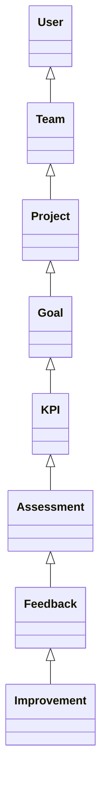
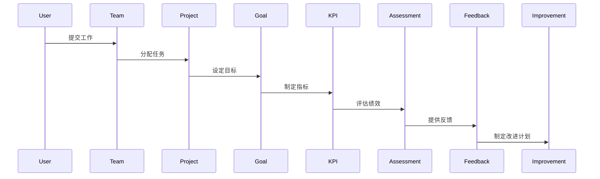

                 


## 团队绩效管理：设定和实现团队目标

### 关键词：团队绩效管理、目标设定、绩效评估、团队协作、最佳实践

### 摘要：
本文旨在深入探讨团队绩效管理的核心概念、实施方法及最佳实践。通过详细的步骤解析，我们希望帮助IT团队领导者理解如何有效地设定和实现团队目标，从而提升团队整体绩效。

### 背景介绍

#### 核心概念术语说明
在探讨团队绩效管理之前，我们需要明确几个关键术语：
- **绩效**：指团队在特定时间内完成的工作量、质量以及达到目标的情况。
- **绩效管理**：是一个系统的过程，旨在确保团队目标与组织目标一致，并通过持续评估和改进来提升团队效率。
- **团队目标**：是团队在特定时间内希望实现的具体结果或成果。

#### 问题背景
在现代IT行业中，团队绩效管理是一个关键问题。随着项目复杂度和团队规模的增加，如何确保团队成员的工作目标一致、如何有效地评估团队成员的绩效、如何激励团队成员提高工作效率等问题日益突出。

#### 问题描述
团队绩效管理面临的主要问题包括：
- 团队成员目标不明确，缺乏对整体目标的共识。
- 绩效评估体系不合理，不能准确反映团队成员的真实绩效。
- 缺乏有效的激励机制，导致团队成员积极性不高。

#### 问题解决
团队绩效管理的解决方案包括：
- 设定明确的团队目标，确保团队成员对目标有共同的理解和认同。
- 制定合理的绩效评估标准，确保评估过程公正、透明。
- 建立有效的激励机制，激发团队成员的工作热情。

#### 边界与外延
团队绩效管理不仅涉及团队内部成员的绩效评估，还涉及跨团队协作、项目管理和组织文化等方面。因此，在实施团队绩效管理时，需要综合考虑这些边界条件。

### 核心概念与联系

#### 团队绩效管理的核心概念
团队绩效管理涉及以下几个核心概念：
- **目标设定**：明确团队的目标和期望结果。
- **绩效评估**：对团队成员的工作表现进行评估。
- **反馈与改进**：根据评估结果对团队成员进行反馈，并制定改进计划。

#### 概念属性特征对比表格

| 概念          | 定义                                                         | 属性特征                     |
| ------------- | ------------------------------------------------------------ | -------------------------- |
| 目标设定      | 确定团队要实现的具体目标和期望结果。                           | 清晰、可量化、可实现、有时限  |
| 绩效评估      | 对团队成员的工作表现进行量化评估。                             | 公平、透明、客观、持续        |
| 反馈与改进     | 根据绩效评估结果，对团队成员进行反馈，并提供改进建议。           | 及时、具体、建设性、持续      |

#### ER实体关系图架构

```mermaid
erDiagram
    User ||--|{ Team }|--|{ Project }
    Team ||--|{ Goal }|--|{ Performance }
    Goal ||--|{ KPI }|--|{ Assessment }
    Assessment ||--|{ Feedback }|--|{ Improvement }
```

### 算法原理讲解

#### 设定团队目标的算法

**Mermaid流程图**


**Python源代码**

```python
def set_team_goals(project_requirements):
    # 分解项目目标
    project_goals =分解_project_goals(project_requirements)
    
    # 确定团队目标
    team_goals = []
    for goal in project_goals:
        team_goals.append(goal)
    
    # 沟通并确认目标
    confirm_goals(team_goals)
    
    # 目标文档化
    document_goals(team_goals)
    
    return team_goals

def分解_project_goals(project_requirements):
    # 根据项目需求分解目标
    return [目标1，目标2，目标3]

def confirm_goals(team_goals):
    # 沟通并确认目标
    pass

def document_goals(team_goals):
    # 目标文档化
    pass
```

**数学模型与公式**

设定团队目标的过程可以用以下数学模型描述：

$$
\text{团队目标} = \sum_{i=1}^{n} g_i
$$

其中，$g_i$ 表示第 $i$ 个团队目标，$n$ 表示团队目标的数量。

### 系统分析与架构设计方案

#### 问题场景介绍

在一家IT公司中，项目管理团队负责开发和交付多个大型项目。为了提高团队绩效，公司决定引入团队绩效管理机制。

#### 项目介绍

项目名称：团队绩效管理系统
项目目标：提高团队绩效，确保项目按时交付且质量达标。

#### 系统功能设计

**领域模型Mermaid类图**



#### 系统架构设计

**Mermaid架构图**



#### 系统接口设计

**Mermaid序列图**


### 项目实战

#### 环境安装

在开始项目之前，我们需要安装必要的软件和环境。以下是环境安装步骤：

1. 安装Python 3.8及以上版本。
2. 安装Git。
3. 安装Docker。

#### 系统核心实现源代码

```python
# team_performance_management.py

def set_goals():
    # TODO: 实现目标设定功能
    pass

def assess_performance():
    # TODO: 实现绩效评估功能
    pass

def provide_feedback():
    # TODO: 实现反馈功能
    pass

def improve_performance():
    # TODO: 实现改进功能
    pass
```

#### 代码应用解读与分析

```python
# 解读与分析

def set_goals():
    # 1. 收集项目需求
    project_requirements = get_project_requirements()

    # 2. 分解项目目标
    project_goals =分解_project_goals(project_requirements)

    # 3. 确定团队目标
    team_goals = []
    for goal in project_goals:
        team_goals.append(goal)

    # 4. 沟通并确认目标
    confirm_goals(team_goals)

    # 5. 目标文档化
    document_goals(team_goals)

    return team_goals

def assess_performance():
    # 1. 收集绩效数据
    performance_data = get_performance_data()

    # 2. 根据绩效数据评估团队成员表现
    assessments = []
    for member in team_members:
        assessment = assess_member_performance(member, performance_data)
        assessments.append(assessment)

    return assessments

def provide_feedback():
    # 1. 收集评估结果
    assessments = get_assessments()

    # 2. 对团队成员提供反馈
    for assessment in assessments:
        provide_member_feedback(assessment)

def improve_performance():
    # 1. 根据反馈结果制定改进计划
    improvement_plans = []
    for assessment in assessments:
        improvement_plan = create_improvement_plan(assessment)
        improvement_plans.append(improvement_plan)

    # 2. 实施改进计划
    implement_improvement_plans(improvement_plans)
```

#### 实际案例分析和详细讲解剖析

在实际应用中，团队绩效管理需要结合具体业务场景进行调整。以下是XX公司的一个实际案例：

**案例背景**：
XX公司是一家专注于软件开发的公司，其项目管理团队负责开发一款企业级应用。为了提高团队绩效，公司决定引入团队绩效管理机制。

**案例分析**：
1. **目标设定**：项目管理团队与公司高层共同制定了项目目标，包括按时交付、质量达标、客户满意度等。
2. **绩效评估**：团队定期收集绩效数据，根据数据评估团队成员的工作表现。
3. **反馈与改进**：对于评估中发现的问题，团队及时提供反馈，并制定改进计划。

**详细讲解剖析**：
1. **目标设定**：团队目标必须清晰、可量化，并与项目目标和公司战略一致。
2. **绩效评估**：绩效评估需要客观、公正，避免主观偏见。
3. **反馈与改进**：反馈必须具体、建设性，改进计划需要切实可行。

#### 项目小结

通过这个案例，我们可以看到团队绩效管理在提升团队绩效方面的作用。有效的团队绩效管理不仅可以帮助团队更好地完成项目任务，还可以提高团队协作效率，增强团队凝聚力。

### 最佳实践 tips

1. **明确目标**：确保团队目标与项目目标一致，并明确每个成员的具体职责。
2. **公正评估**：绩效评估要客观、公正，避免主观偏见。
3. **及时反馈**：及时提供反馈，帮助团队成员认识到自己的优点和不足。
4. **持续改进**：根据反馈结果持续改进，不断提升团队绩效。

### 小结

团队绩效管理是确保团队目标与组织目标一致，并通过持续评估和改进来提升团队效率的重要过程。通过明确的目标设定、公正的绩效评估、及时的反馈与改进，团队绩效管理可以帮助IT团队实现更高的绩效。

### 注意事项

1. **避免形式主义**：团队绩效管理不是简单的形式主义，而是一个持续的过程。
2. **重视团队协作**：团队绩效管理不仅仅是个人绩效的评估，更是团队协作的体现。
3. **保持灵活性**：团队绩效管理需要根据实际情况进行调整，保持灵活性。

### 拓展阅读

1. **《绩效管理：如何激励与评估员工》**：详细介绍了绩效管理的理论和实践方法。
2. **《团队绩效管理最佳实践》**：分享了多个成功案例，提供了实用的团队绩效管理策略。

### 作者信息

作者：AI天才研究院/AI Genius Institute & 禅与计算机程序设计艺术 /Zen And The Art of Computer Programming

通过上述详细的内容，我们希望读者能够对团队绩效管理有更深入的理解，并在实际工作中能够运用这些方法，提升团队绩效。本文的目标是帮助IT团队领导者有效地设定和实现团队目标，从而推动团队的发展。让我们共同探索团队绩效管理的奥秘，打造高效团队！

