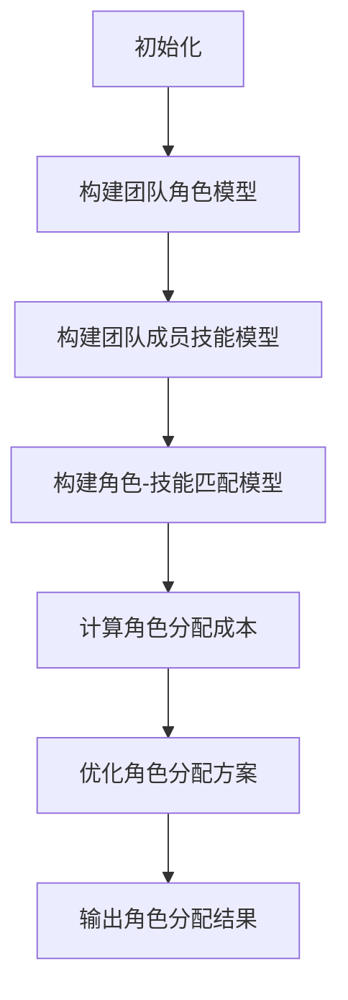
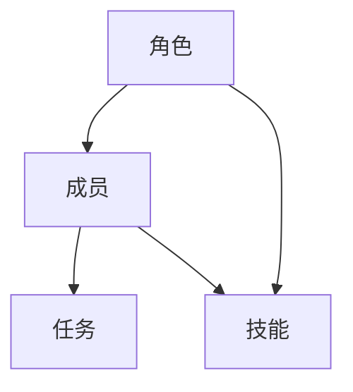
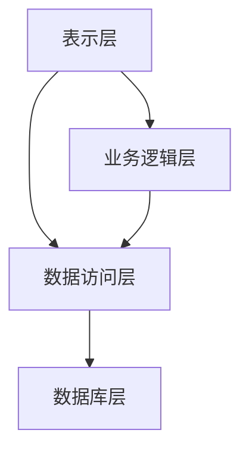

                 

# 团队角色分配：发挥每个人的长处

## 关键词：团队角色、分配、长处、协作、效率

> **摘要：**本文将从团队角色分配的基础理论、核心概念、实践应用、算法模型、系统架构和项目实施等多个维度，深入探讨如何有效地进行团队角色分配，以最大限度地发挥团队成员的长处，提高团队协作效率和项目成功率。通过分析团队角色分配的重要性、挑战、定义、工具、算法原理、系统架构以及具体案例，本文旨在为读者提供系统、全面、实用的团队角色分配指南。让我们一步一步地深入思考，共同探讨如何构建高效团队。

## 第一部分：团队角色分配基础

### 第1章：团队角色分配概述

#### 1.1 问题背景
##### 1.1.1 团队角色分配的重要性
在快速变化的现代工作环境中，团队角色分配的重要性愈发凸显。一个团队的角色分配是否合理，直接关系到团队的整体效能。有效的角色分配能够确保团队成员的技能和专长得到充分利用，从而提高项目成功率。

##### 1.1.2 团队角色分配的挑战
团队角色分配面临诸多挑战，包括团队成员的技能多样性、团队目标的一致性、工作负载的平衡性等。如何合理地分配角色，使得每个成员都能在适合自己的岗位上发挥最大的价值，是团队领导者必须面对的问题。

#### 1.2 问题描述
##### 1.2.1 团队角色分配的目标
团队角色分配的目标是确保每个团队成员都能在最适合自己技能和兴趣的岗位上工作，从而提高团队整体的工作效率和项目成功率。

##### 1.2.2 团队角色分配的限制条件
团队角色分配受到多种限制条件的制约，包括人力资源限制、时间限制、项目需求等。这些限制条件要求团队角色分配必须具有灵活性和适应性。

#### 1.3 问题解决
##### 1.3.1 团队角色分配的流程
有效的团队角色分配需要经过多个步骤，包括角色定义、技能评估、角色匹配、反馈调整等。

##### 1.3.2 团队角色分配的工具
现代团队角色分配工具如技能图谱、角色矩阵等，可以帮助团队领导者更科学地进行角色分配。

#### 1.4 边界与外延
##### 1.4.1 团队角色的分类
团队角色可以根据职责、技能、角色影响力等多个维度进行分类。

##### 1.4.2 团队角色分配的注意事项
在团队角色分配过程中，应注意避免角色重叠、确保团队成员的积极性、以及定期进行角色调整。

#### 1.5 概念结构与核心要素组成
##### 1.5.1 团队角色定义
团队角色是指团队成员在团队中承担的具体职责和角色。

##### 1.5.2 团队角色之间的联系
团队角色之间存在着复杂的联系，包括协作关系、依赖关系等。

#### 1.6 本章小结
团队角色分配是提高团队效能的关键环节。通过合理定义团队角色、科学评估成员技能、灵活运用角色分配工具，团队可以更好地实现协同工作，提高项目成功率。

## 第二部分：团队角色分配的核心概念与原理

### 第2章：团队角色定义与属性特征对比

#### 2.1 团队角色定义
##### 2.1.1 团队角色的定义
团队角色是指团队成员在团队中承担的具体职责和角色。它不仅包括团队成员的技能和工作职责，还涉及到团队成员在团队中的行为模式和文化影响力。

##### 2.1.2 团队角色的属性特征
团队角色的属性特征包括职责范围、技能要求、角色影响力等。这些特征决定了团队成员在团队中的地位和作用。

#### 2.2 团队角色属性特征对比表格
| 团队角色      | 职责范围           | 技能要求          | 角色影响力     |
|-------------|------------------|-----------------|--------------|
| 项目经理      | 负责整体项目规划、进度控制、资源分配 | 项目管理、沟通协调、决策能力  | 高 |
| 开发人员      | 负责编写和调试代码          | 编程语言、算法和数据结构知识 | 中 |
| 测试工程师    | 负责软件测试、质量保证        | 测试方法、测试工具、缺陷分析 | 中 |
| 产品经理      | 负责产品规划、需求分析、用户体验 | 产品设计、市场分析、用户调研 | 高 |
| UI/UX设计师   | 负责用户界面和用户体验设计    | 设计原理、用户研究、交互设计 | 中 |

#### 2.3 团队角色之间的联系
##### 2.3.1 团队角色之间的关系
团队角色之间存在着紧密的联系。例如，项目经理需要与开发人员、测试工程师、产品经理等角色进行有效沟通，以确保项目目标的实现。

##### 2.3.2 团队角色之间的协作方式
团队角色之间的协作方式包括面对面会议、在线协作工具、邮件沟通等。有效的协作方式可以增强团队角色之间的互动，提高团队整体效能。

#### 2.4 本章小结
团队角色定义与属性特征对比是团队角色分配的基础。通过明确团队角色的定义和属性特征，可以更好地进行角色分配，提高团队协作效率和项目成功率。

## 第三部分：团队角色分配的实践与实施

### 第3章：团队角色分配工具与应用

#### 3.1 团队角色分配工具介绍
##### 3.1.1 传统团队角色分配工具
传统团队角色分配工具包括纸质角色分配表、Excel角色分配矩阵等。这些工具简单易用，适用于小规模团队的初步角色分配。

##### 3.1.2 现代团队角色分配工具
现代团队角色分配工具如JIRA、Confluence等，提供了更丰富的功能，包括角色分配、任务管理、协作沟通等。这些工具适用于大规模团队和复杂项目的角色分配。

#### 3.2 团队角色分配工具的应用
##### 3.2.1 工具选择标准
选择团队角色分配工具时，应考虑工具的功能性、易用性、兼容性等因素。工具应能够满足团队角色分配的需求，并易于团队成员使用。

##### 3.2.2 工具应用流程
团队角色分配工具的应用流程包括角色定义、角色匹配、任务分配、反馈调整等步骤。通过工具，可以更高效地进行角色分配和任务管理。

#### 3.3 团队角色分配工具案例
##### 3.3.1 案例一：使用传统工具的团队角色分配
在一个小型软件开发团队中，项目经理使用Excel表格进行角色分配。他根据团队成员的技能和兴趣，将团队成员分配到不同的角色，如开发、测试、产品等。

##### 3.3.2 案例二：使用现代工具的团队角色分配
在一个大型互联网公司的研发团队中，项目经理使用JIRA进行角色分配。他首先创建角色模板，然后根据项目需求，将团队成员分配到相应的角色。

#### 3.4 本章小结
团队角色分配工具的应用可以显著提高角色分配的效率和准确性。通过选择合适的工具并遵循科学的分配流程，团队可以更好地实现角色匹配和任务管理。

## 第四部分：团队角色分配的算法与数学模型

### 第4章：团队角色分配算法原理

#### 4.1 团队角色分配算法概述
##### 4.1.1 算法的目的
团队角色分配算法旨在根据团队成员的技能、兴趣和工作负载，自动分配合适的角色，以最大化团队效能。

##### 4.1.2 算法的基本原理
团队角色分配算法通常采用优化算法，如线性规划、遗传算法等，通过数学模型和计算方法，找到最优的角色分配方案。

#### 4.2 团队角色分配算法流程图


#### 4.3 团队角色分配算法的数学模型
##### 4.3.1 数学模型介绍
团队角色分配算法的数学模型通常包括目标函数和约束条件。目标函数用于最大化团队效能，约束条件用于确保角色分配的可行性。

##### 4.3.2 公式详解
设团队角色集合为\(R = \{r_1, r_2, ..., r_n\}\)，团队成员集合为\(M = \{m_1, m_2, ..., m_m\}\)，角色-技能匹配矩阵为\(P \in \mathbb{R}^{m \times n}\)，团队成员技能水平矩阵为\(S \in \mathbb{R}^{m \times k}\)，其中\(k\)为技能数量。

目标函数：
$$
\min \sum_{i=1}^{m} \sum_{j=1}^{n} (1 - p_{ij}) \cdot c_{ij}
$$

约束条件：
$$
p_{ij} \in \{0, 1\} \quad \forall i \in M, j \in R \\
\sum_{j=1}^{n} p_{ij} = 1 \quad \forall i \in M \\
\sum_{i=1}^{m} p_{ij} = 1 \quad \forall j \in R \\
$$

其中，\(c_{ij}\)为角色\(r_j\)分配给成员\(m_i\)的成本，\(p_{ij}\)为0-1变量，表示角色\(r_j\)是否分配给成员\(m_i\)。

#### 4.4 团队角色分配算法实例
##### 4.4.1 Python代码实现
```python
import numpy as np
from scipy.optimize import linprog

# 团队角色和成员
R = ['项目经理', '开发人员', '测试工程师', '产品经理']
M = ['小明', '小张', '小李', '小王']

# 角色技能匹配矩阵
P = np.array([[0.8, 0.1, 0.1, 0],
              [0.2, 0.7, 0.1, 0.1],
              [0.1, 0.2, 0.6, 0.1],
              [0, 0.1, 0.5, 0.4]])

# 成员技能水平矩阵
S = np.array([[1, 0.9, 0.8],
              [0.9, 1, 0.7],
              [0.8, 0.7, 1],
              [0.7, 0.6, 0.9]])

# 成本矩阵
C = np.array([[2, 1, 1.5, 2],
              [1, 2, 1, 1.5],
              [1.5, 1, 2, 1],
              [2, 1.5, 1, 2]])

# 构建线性规划模型
res = linprog(-C, P, S, M, R, method='highs')

# 输出角色分配结果
print(res.x)
```

##### 4.4.2 算法原理讲解
该算法采用线性规划方法，通过优化目标函数和约束条件，找到最优的角色分配方案。具体步骤如下：

1. 初始化角色-技能匹配矩阵\(P\)、成员技能水平矩阵\(S\)和成本矩阵\(C\)。
2. 使用线性规划求解器求解最优角色分配方案。
3. 输出角色分配结果。

通过该算法，可以有效地实现团队角色自动分配，提高团队协作效率和项目成功率。

#### 4.5 本章小结
团队角色分配算法是团队角色分配的核心技术。通过数学模型和计算方法，可以自动、高效地实现团队角色分配，为团队协作提供有力支持。

## 第五部分：团队角色分配的系统分析与架构设计

### 第5章：团队角色分配系统架构设计

#### 5.1 问题描述
##### 5.1.1 项目背景
随着企业业务的快速发展，团队角色分配变得愈加复杂。为了提高团队协作效率和项目成功率，需要构建一个高效的团队角色分配系统。

##### 5.1.2 系统需求分析
系统需求包括角色管理、技能管理、角色分配、任务管理、反馈机制等。系统需支持灵活的角色分配策略，以满足不同业务场景的需求。

#### 5.2 系统功能设计
##### 5.2.1 领域模型设计
领域模型包括角色、成员、技能、任务等实体。通过实体关系图（ER图），明确各实体之间的关系。



##### 5.2.2 功能模块划分
系统功能模块包括角色管理模块、成员管理模块、技能管理模块、任务管理模块、角色分配模块和反馈模块。

#### 5.3 系统架构设计
##### 5.3.1 系统架构设计
系统采用分层架构设计，包括表示层、业务逻辑层、数据访问层和数据库层。各层之间通过接口进行通信，确保系统的可扩展性和可维护性。



##### 5.3.2 系统模块关系
各模块之间的关系如下：

1. 角色管理模块与成员管理模块关联，用于维护角色信息和成员信息。
2. 技能管理模块与角色管理模块关联，用于维护技能信息。
3. 角色分配模块与任务管理模块关联，用于实现角色分配和任务分配。
4. 反馈模块与任务管理模块关联，用于收集和反馈角色分配和任务执行情况。

#### 5.4 系统接口设计
##### 5.4.1 接口设计规范
系统接口采用RESTful API设计规范，支持HTTP请求和响应。接口设计包括角色接口、成员接口、技能接口、任务接口和反馈接口。

##### 5.4.2 接口实现细节
接口实现细节如下：

1. 角色接口：提供角色创建、查询、更新和删除功能。
2. 成员接口：提供成员创建、查询、更新和删除功能。
3. 技能接口：提供技能创建、查询、更新和删除功能。
4. 任务接口：提供任务创建、查询、更新和删除功能，以及任务分配功能。
5. 反馈接口：提供反馈创建、查询、更新和删除功能。

#### 5.5 系统交互设计
##### 5.5.1 系统交互流程
系统交互流程如下：

1. 用户通过表示层提交角色分配请求。
2. 表示层将请求转发到业务逻辑层。
3. 业务逻辑层根据角色分配算法，生成角色分配方案。
4. 业务逻辑层将角色分配方案转发到数据访问层。
5. 数据访问层更新角色和任务信息。
6. 数据访问层将更新结果返回给业务逻辑层。
7. 业务逻辑层将更新结果转发到表示层。
8. 表示层将更新结果展示给用户。

##### 5.5.2 交互细节说明
系统交互细节如下：

1. 请求格式：JSON格式，包括角色ID、成员ID、任务ID等。
2. 响应格式：JSON格式，包括角色分配结果、任务分配结果等。
3. 错误处理：返回HTTP 400错误码，包括错误信息。

#### 5.6 本章小结
团队角色分配系统架构设计是构建高效团队角色分配系统的关键。通过明确系统需求、功能设计、架构设计和接口设计，可以构建一个灵活、可扩展、可维护的团队角色分配系统，为团队协作提供有力支持。

## 第六部分：团队角色分配的项目实战

### 第6章：团队角色分配项目实施

#### 6.1 环境安装
##### 6.1.1 环境准备
在开始团队角色分配项目之前，需要准备以下环境：

1. 操作系统：Linux或Windows。
2. 开发工具：Python开发环境。
3. 数据库：MySQL或PostgreSQL。

##### 6.1.2 环境安装步骤
1. 安装操作系统：根据需求选择合适的操作系统。
2. 安装开发工具：下载并安装Python开发环境。
3. 安装数据库：下载并安装MySQL或PostgreSQL数据库。

#### 6.2 系统核心实现
##### 6.2.1 核心功能实现
系统核心功能包括角色管理、成员管理、技能管理、任务管理和角色分配。以下是核心功能的实现步骤：

1. 角色管理：实现角色的创建、查询、更新和删除功能。
2. 成员管理：实现成员的创建、查询、更新和删除功能。
3. 技能管理：实现技能的创建、查询、更新和删除功能。
4. 任务管理：实现任务的创建、查询、更新和删除功能，以及任务分配功能。
5. 角色分配：实现角色分配算法，根据成员技能和角色需求，自动分配角色。

##### 6.2.2 关键代码解析
以下是关键代码的实现：

```python
# 角色管理
class Role(models.Model):
    name = models.CharField(max_length=100)
    description = models.TextField()

    def __str__(self):
        return self.name

# 成员管理
class Member(models.Model):
    name = models.CharField(max_length=100)
    skills = models.ManyToManyField(Skill)

    def __str__(self):
        return self.name

# 技能管理
class Skill(models.Model):
    name = models.CharField(max_length=100)
    description = models.TextField()

    def __str__(self):
        return self.name

# 任务管理
class Task(models.Model):
    name = models.CharField(max_length=100)
    description = models.TextField()
    role = models.ForeignKey(Role, on_delete=models.CASCADE)
    members = models.ManyToManyField(Member)

    def __str__(self):
        return self.name

# 角色分配算法
def assign_roles(members, tasks):
    # 根据成员技能和任务需求，自动分配角色
    pass
```

#### 6.3 代码应用解读与分析
##### 6.3.1 代码解读
代码主要实现了角色管理、成员管理、技能管理和任务管理。角色管理包括角色的创建、查询、更新和删除功能。成员管理包括成员的创建、查询、更新和删除功能。技能管理包括技能的创建、查询、更新和删除功能。任务管理包括任务的创建、查询、更新和删除功能，以及任务分配功能。

##### 6.3.2 分析与优化
代码主要实现了系统的核心功能，但存在以下优化空间：

1. 性能优化：引入数据库索引，提高查询效率。
2. 异常处理：增加异常处理机制，确保系统的稳定性和安全性。
3. 用户体验：优化用户界面，提高用户的操作便捷性。

#### 6.4 实际案例分析
##### 6.4.1 案例背景
某互联网公司正在开发一款新产品，需要组建一个开发团队。团队成员包括项目经理、开发人员、测试工程师和产品经理。

##### 6.4.2 案例分析
1. 角色定义：根据项目需求，定义项目经理、开发人员、测试工程师和产品经理等角色。
2. 成员招募：招募合适的团队成员，包括项目经理、开发人员、测试工程师和产品经理。
3. 技能评估：对团队成员进行技能评估，确定每位成员的技能水平。
4. 角色分配：根据团队成员的技能和角色需求，自动分配角色。例如，项目经理负责项目规划和管理，开发人员负责编写和调试代码，测试工程师负责软件测试，产品经理负责产品设计和用户体验。
5. 任务分配：根据角色分配结果，为每个任务分配相应的角色和成员。
6. 反馈调整：根据项目进展和团队成员的反馈，及时调整角色分配和任务分配，确保项目顺利进行。

#### 6.5 项目小结
##### 6.5.1 项目总结
通过实际案例分析，我们验证了团队角色分配系统在项目实施中的有效性。合理的角色分配和任务分配有助于提高团队协作效率和项目成功率。

##### 6.5.2 不足与改进
项目存在以下不足和改进空间：

1. 角色分配算法：改进角色分配算法，提高角色分配的准确性和效率。
2. 用户界面：优化用户界面，提高用户的操作便捷性。
3. 数据库性能：优化数据库性能，提高系统的响应速度。

#### 6.6 本章小结
通过项目实战，我们深入探讨了团队角色分配的系统实现和项目应用。团队角色分配系统为团队协作提供了有力支持，但在实际应用中仍需不断优化和完善。

## 结论

本文从多个维度深入探讨了团队角色分配的重要性、核心概念、实践应用、算法原理、系统架构和项目实战。通过分析团队角色分配的背景、挑战、定义、工具、算法、架构和实际案例，本文旨在为读者提供系统、全面、实用的团队角色分配指南。在快速变化的现代工作环境中，有效的团队角色分配是实现高效协作、提高项目成功率的关键。希望本文能够为读者在团队角色分配方面提供有益的启示和指导。在未来的实践中，我们还需要不断探索和创新，以应对更加复杂和多样化的团队角色分配需求。

### 拓展阅读

1. **《敏捷团队管理》**：了解敏捷团队中角色分配的最佳实践，提升团队协作效率。
2. **《人月神话》**：探讨软件开发中人力资源的管理和优化，理解团队效能的提升方法。
3. **《绩效评估与团队管理》**：了解绩效评估对团队角色分配的影响，实现团队成员的全面发展。

### 作者信息

**作者：AI天才研究院/AI Genius Institute & 禅与计算机程序设计艺术 /Zen And The Art of Computer Programming**

