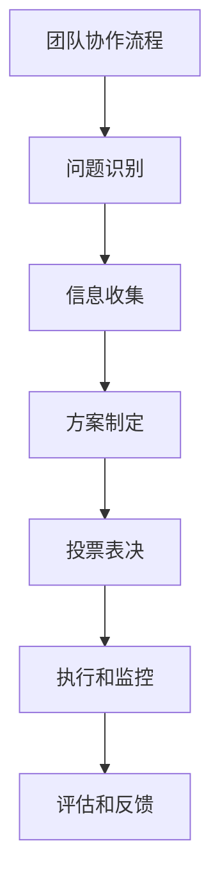
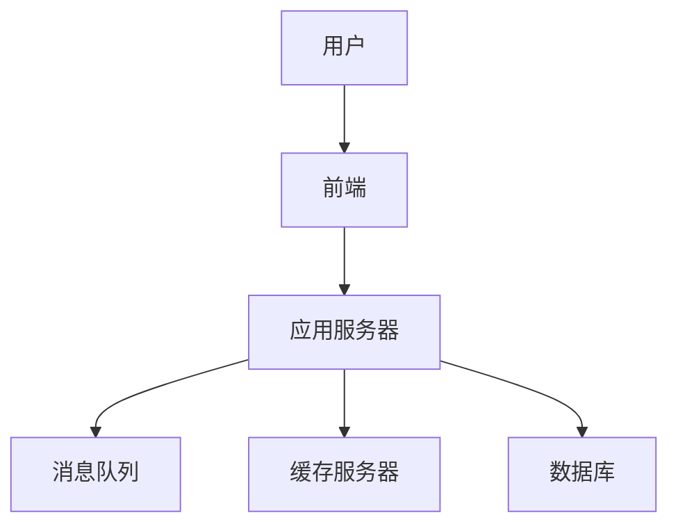

                 

## 《增强团队协作：提高集体效率》

### 关键词：团队协作、集体效率、沟通技巧、系统架构、项目实战、最佳实践

> **摘要**：本文旨在深入探讨团队协作的重要性和提高集体效率的方法。通过分析团队协作的核心概念、原理、系统架构以及实际项目案例，本文将提供一套全面、实用的团队协作指南，帮助团队在复杂环境中实现高效的协作。

## 引言：团队协作的必要性

在当今快速变化和高度复杂的工作环境中，团队协作已成为提高集体效率的关键。团队协作不仅仅是一种工作方式，它更是一种理念，一种能够激发创造力、解决复杂问题的有效途径。然而，在实际操作中，团队协作面临着诸多挑战，如沟通障碍、角色模糊、资源分配不均等。

### 1.1 团队协作的重要性

团队协作的重要性体现在以下几个方面：

- **资源共享**：团队成员可以共享知识和资源，提高工作效率。
- **分工合作**：团队成员各司其职，充分利用各自的优势，提高整体产出。
- **创新驱动**：团队成员的多样性有助于产生新的想法和解决方案。
- **团队凝聚力**：通过共同的目标和任务，增强团队成员之间的联系和信任。

### 1.2 团队协作面临的挑战

团队协作面临的主要挑战包括：

- **沟通障碍**：信息传递不畅，导致误解和冲突。
- **角色模糊**：团队成员职责不明确，影响工作效率和效果。
- **资源分配不均**：资源分配不均，可能导致某些成员过度劳累，而其他成员资源闲置。
- **目标不一致**：团队内部目标不一致，影响团队的整体绩效。

### 1.3 本书目标与结构安排

本书旨在提供一套全面、实用的团队协作指南，帮助团队克服协作中的挑战，提高集体效率。本书的结构安排如下：

- **第1章**：引言，介绍团队协作的重要性、面临的挑战及本书的目标。
- **第2章**：核心概念与联系，明确团队协作的关键概念，如团队协作模型、工具和技术等。
- **第3章**：团队协作原理，深入讲解沟通技巧、协作机制等。
- **第4章**：系统分析与架构设计，介绍团队协作系统的功能设计、架构设计和接口设计。
- **第5章**：项目实战，通过实际案例展示如何应用团队协作工具和原理。
- **第6章**：最佳实践与总结，提供团队协作的最佳实践、注意事项和项目小结。

### 1.4 文章大纲

本文将按照以下结构进行详细阐述：

- **背景介绍**：团队协作的重要性、当前团队协作的挑战以及本书的解决思路。
- **核心概念与联系**：团队协作的关键概念，如团队协作模型、团队协作工具和技术等。
- **团队协作原理**：深入讲解团队协作的基本原理，如沟通技巧、协作机制等。
- **系统分析与架构设计**：介绍团队协作系统的功能设计、架构设计和接口设计。
- **项目实战**：通过实际案例展示如何应用团队协作工具和原理。
- **最佳实践与总结**：提供团队协作的最佳实践、注意事项、项目小结以及进一步阅读的建议。

## 核心概念与联系

在深入探讨团队协作之前，我们需要明确一些核心概念，这些概念是理解团队协作的基础。以下是团队协作中的一些关键概念：

### 2.1 团队协作模型

团队协作模型描述了团队从形成到运行再到解散的整个生命周期。以下是三种常见的团队协作模型：

#### 2.1.1 成熟度模型

成熟度模型根据团队的发展和成熟程度将其分为五个阶段：形成阶段、震荡阶段、规范化阶段、执行阶段和 adjournment阶段。

| 阶段 | 特点 |
| --- | --- |
| 形成阶段 | 团队成员相互认识，建立信任，明确目标和职责 |
| 震荡阶段 | 团队成员之间可能存在冲突，需要解决角色冲突和职责不明确的问题 |
| 规范化阶段 | 团队成员开始协同工作，建立了规范和流程 |
| 执行阶段 | 团队高效运行，达成目标和产出 |
| adjournment阶段 | 团队解散，完成项目任务 |

#### 2.1.2 霍夫斯塔德模型

霍夫斯塔德模型描述了文化对团队协作的影响。该模型包括六个维度：个体主义与集体主义、权力距离、不确定性规避、长期取向与短期取向、爱好秩序与爱好变化、男性主义与女性主义。

| 维度 | 特点 |
| --- | --- |
| 个体主义与集体主义 | 个体主义强调个人成就，集体主义强调团队合作和集体荣誉 |
| 权力距离 | 高权力距离的社会中，权力不平等更明显，低权力距离的社会中，权力更为分散 |
| 不确定性规避 | 高不确定性规避的社会中，人们更倾向于规避不确定性和风险，低不确定性规避的社会中，人们更愿意接受变化和不确定性 |
| 长期取向与短期取向 | 长期取向的社会注重长期目标和积累，短期取向的社会注重短期成效和即时回报 |
| 爱好秩序与爱好变化 | 爱好秩序的社会中，人们喜欢有序和稳定，爱好变化的社会中，人们喜欢变化和新鲜事物 |
| 男性的主义与女性主义 | 男性的主义社会强调男性主导，女性主义社会强调性别平等 |

#### 2.1.3 信息处理模型

信息处理模型描述了团队成员在信息传递和处理过程中的行为。该模型包括五个阶段：信息接收、信息处理、信息存储、信息提取和信息传递。

| 阶段 | 描述 |
| --- | --- |
| 信息接收 | 接收信息，例如，通过阅读文档、听取报告或参加会议 |
| 信息处理 | 分析和解释信息，例如，理解报告中的关键点，分析数据 |
| 信息存储 | 将信息存储在记忆或文档中，以便后续使用 |
| 信息提取 | 从存储中检索信息，例如，在需要时查找文档或回忆起关键点 |
| 信息传递 | 将信息传递给其他团队成员，例如，通过邮件、消息或面对面交流 |

### 2.2 团队协作工具与技术

团队协作工具和技术是实现高效协作的关键。以下是几种常见的团队协作工具和技术：

#### 2.2.1 沟通工具

沟通工具包括电子邮件、即时通讯软件、视频会议系统等，它们有助于团队成员之间的实时沟通和信息共享。

- **电子邮件**：适用于正式和非正式的沟通，适合发送文档和长篇信息。
- **即时通讯软件**：如 Slack、Microsoft Teams 等，适用于实时沟通和协作。
- **视频会议系统**：如 Zoom、Webex 等，适用于远程会议和团队交流。

#### 2.2.2 协同工作工具

协同工作工具包括项目管理工具、文档共享工具和代码协作平台等，它们有助于团队成员在共同项目上的协作。

- **项目管理工具**：如 Trello、Jira 等，用于任务管理、进度追踪和项目协调。
- **文档共享工具**：如 Google Docs、Office 365 等，用于文档协作和共享。
- **代码协作平台**：如 GitHub、GitLab 等，用于代码管理、版本控制和协作开发。

#### 2.2.3 团队协作平台

团队协作平台是一个集成多种协作工具和功能的综合性平台，它为团队提供了一个统一的协作环境。

- **Asana**：一个任务管理和团队协作平台，提供项目跟踪、任务分配和进度更新等功能。
- **Slack**：一个即时通讯和协作平台，集成多种第三方应用和服务，提供实时沟通和协作。
- **Notion**：一个笔记和协作平台，提供文档管理、任务跟踪和数据库等功能。

### 2.3 概念联系与对比

团队协作模型、工具和技术之间存在着密切的联系和相互影响。以下是一个简化的概念联系与对比表格：

| 概念 | 描述 | 联系与对比 |
| --- | --- | --- |
| 团队协作模型 | 描述团队协作的过程和阶段 | 确定团队协作的目标和流程，指导工具和技术的选择 |
| 团队协作工具 | 支持团队协作的工具和技术 | 选择合适的工具和技术，提高协作效率和效果 |
| 团队协作平台 | 集成多种协作工具和功能的平台 | 提供统一的协作环境，简化协作流程，提高用户体验 |

通过理解这些核心概念和联系，我们可以更好地设计和管理团队协作，提高集体效率。

## 团队协作原理

团队协作的成功离不开有效的沟通技巧和协作机制。以下是团队协作中一些重要的原理和方法。

### 3.1 沟通技巧

沟通技巧是团队协作的基础。有效的沟通可以帮助团队成员理解任务、共享知识和解决问题。

#### 3.1.1 有效沟通的原则

以下是有效沟通的一些基本原则：

1. **明确目标**：在沟通前明确沟通的目标和期望结果，确保信息传递的清晰性和针对性。
2. **主动倾听**：倾听对方的意见和需求，理解对方的立场和感受，避免误解和冲突。
3. **表达清晰**：使用简洁明了的语言表达自己的想法，避免使用模糊、抽象的表述。
4. **及时反馈**：在沟通过程中及时给予反馈，确认对方是否理解自己的意思。
5. **尊重对方**：尊重对方的意见和观点，避免使用命令式的语气，建立良好的沟通氛围。

#### 3.1.2 非言语沟通

非言语沟通在团队协作中同样重要。以下是一些常见的非言语沟通方式：

1. **肢体语言**：通过肢体动作、面部表情和姿态表达情感和态度，例如，点头表示同意，摇头表示否定。
2. **语调**：通过语调的变化表达情感和意图，例如，平稳的语调表示冷静和自信，激动的语调表示兴奋和紧张。
3. **空间距离**：通过空间距离表达亲密感和尊重，例如，近距离交流表示亲密和信任，远距离交流表示正式和尊重。

#### 3.1.3 沟通障碍与解决方法

在团队协作中，沟通障碍是常见的问题。以下是一些常见的沟通障碍及其解决方法：

1. **信息过载**：解决方法：简化信息，使用图表和摘要，减少冗长的文档。
2. **文化差异**：解决方法：了解和尊重不同文化的沟通习惯，使用易于理解的词汇和表达方式。
3. **语言障碍**：解决方法：使用通用语言，如英语，或者使用翻译工具辅助沟通。
4. **时间差异**：解决方法：安排共同的工作时间，使用在线协作工具确保实时沟通。

### 3.2 协作机制

协作机制是团队协作中规范和流程的体现。有效的协作机制可以提高团队的工作效率和效果。

#### 3.2.1 团队决策过程

团队决策过程是团队协作的核心。以下是团队决策过程的基本步骤：

1. **问题识别**：明确需要解决的问题或决策的事项。
2. **信息收集**：收集相关的信息和数据，确保决策有据可依。
3. **方案制定**：制定多种可能的解决方案，并进行评估和比较。
4. **投票表决**：通过投票或其他表决方式确定最终的决策方案。
5. **执行和监控**：执行决策方案，并进行监控和评估，确保决策的有效性和可行性。

#### 3.2.2 协作流程设计

协作流程设计是确保团队协作高效运行的关键。以下是协作流程设计的基本步骤：

1. **需求分析**：分析团队协作的需求和目标，确定协作流程的核心环节。
2. **流程设计**：设计协作流程，明确各个环节的职责和任务。
3. **流程验证**：验证协作流程的可行性和有效性，确保流程符合团队的实际需求。
4. **流程优化**：根据实践经验和反馈，不断优化协作流程，提高协作效率和效果。

#### 3.2.3 团队冲突管理

团队冲突是团队协作中不可避免的问题。有效的冲突管理可以减少冲突带来的负面影响，提高团队的工作效率和氛围。

以下是团队冲突管理的基本步骤：

1. **识别冲突**：及时发现和识别团队中的冲突。
2. **沟通解决**：通过沟通和协商解决冲突，避免冲突升级。
3. **决策和执行**：根据冲突的性质和影响，制定解决方案并执行。
4. **评估和反馈**：评估冲突管理的有效性，并根据反馈进行改进。

### 3.3 团队协作流程图

为了更好地理解团队协作的原理和方法，我们可以使用 Mermaid 画出团队协作的流程图。以下是一个简化的团队协作流程图：



通过这个流程图，我们可以清晰地看到团队协作的各个环节和步骤，有助于团队在实践中更好地理解和应用团队协作原理。

## 系统分析与架构设计

团队协作系统的设计与实现是确保团队高效协作的关键。在这一部分，我们将介绍团队协作系统的功能设计、架构设计和接口设计。

### 4.1 系统功能设计

团队协作系统的功能设计是系统实现的基础。以下是团队协作系统的主要功能模块及其描述：

#### 4.1.1 模块1：任务管理

任务管理模块用于管理团队的任务分配、进度追踪和任务状态更新。主要功能包括：

- 任务创建：创建新的任务并分配给团队成员。
- 任务分配：将任务分配给指定成员，确保任务分配的透明性。
- 进度追踪：实时跟踪任务进度，确保任务按时完成。
- 任务状态更新：更新任务状态，如进行中、已完成等。

#### 4.1.2 模块2：文档管理

文档管理模块用于管理团队的文档共享和协作。主要功能包括：

- 文档上传：上传和存储文档，方便团队成员访问和共享。
- 文档下载：允许团队成员下载文档，以便于查看和编辑。
- 文档版本控制：记录文档的不同版本，确保文档的完整性和一致性。
- 文档评论和讨论：支持团队成员在文档上进行评论和讨论，提高协作效率。

#### 4.1.3 模块3：日程管理

日程管理模块用于管理团队的日程安排和会议计划。主要功能包括：

- 日程创建：创建和编辑日程，包括会议、任务和个人活动。
- 日程共享：共享日程给团队成员，确保团队成员对日程有共同的理解。
- 日程提醒：设置日程提醒，确保团队成员按时参加会议和任务。

#### 4.1.4 模块4：沟通与协作

沟通与协作模块用于团队内的实时沟通和协作。主要功能包括：

- 实时聊天：支持团队内的即时通讯，快速解决问题。
- 文件传输：支持团队成员之间的文件传输，方便协作。
- 视频会议：支持远程会议，方便团队成员之间的沟通和协作。

#### 4.1.5 模块5：权限管理

权限管理模块用于管理系统的权限和用户角色。主要功能包括：

- 用户注册：允许新用户注册系统，创建个人账户。
- 用户登录：支持用户登录系统，访问系统的功能。
- 权限分配：根据用户角色分配系统权限，确保系统的安全性和可控性。

### 4.2 系统架构设计

团队协作系统的架构设计决定了系统的性能、可扩展性和可维护性。以下是团队协作系统的一种可能的架构设计：

#### 4.2.1 系统架构概述

系统架构采用分布式架构，包括前端、后端和数据库三个主要部分。前端负责用户界面和交互，后端负责业务逻辑处理和数据存储，数据库负责存储用户数据和系统配置信息。

| 组件 | 描述 |
| --- | --- |
| 前端 | 包括网页和移动端界面，提供用户与系统交互的接口 |
| 后端 | 包括应用服务器、消息队列、缓存服务器等，负责处理业务逻辑和提供数据存储服务 |
| 数据库 | 包括关系型数据库和非关系型数据库，用于存储用户数据、文档数据、任务数据和系统配置数据 |

#### 4.2.2 系统架构图

以下是团队协作系统的架构图：



通过这个架构图，我们可以清晰地看到系统的组成部分及其之间的交互关系。

### 4.3 系统接口设计

系统接口设计是确保系统功能模块之间能够有效通信的关键。以下是团队协作系统的主要接口设计：

#### 4.3.1 接口规范

接口规范包括 RESTful API 和 WebSocket API，分别用于提供 HTTP 请求和实时通信。

- **RESTful API**：用于任务管理、文档管理和日程管理等功能的接口，采用 GET、POST、PUT、DELETE 等HTTP方法。
- **WebSocket API**：用于实时聊天和视频会议等功能的接口，提供双向实时通信。

#### 4.3.2 接口设计

以下是任务管理模块的接口设计示例：

```python
# 任务管理模块接口设计
class TaskManagement:
    @staticmethod
    def create_task(task_name, assigned_to, deadline):
        # 创建任务
        pass
    
    @staticmethod
    def assign_task(task_id, assigned_to):
        # 分配任务
        pass
    
    @staticmethod
    def update_task_status(task_id, status):
        # 更新任务状态
        pass
```

通过上述接口设计，我们可以清晰地看到任务管理模块的功能接口，便于后端开发和调用。

## 项目实战

为了更好地理解团队协作工具和原理在实际项目中的应用，我们将通过一个实际案例进行详细讲解。以下是项目背景、环境安装、系统核心实现、代码应用解读与分析、实际案例分析和项目小结。

### 5.1 项目背景

本项目是一个在线教育平台，旨在为学生和教师提供一个便捷的互动和学习环境。平台的主要功能包括课程管理、作业发布与提交、在线测试和实时聊天等。团队成员包括前端开发、后端开发和测试人员。

### 5.2 环境安装

为了确保项目顺利运行，我们需要安装以下软件和工具：

- **前端**：HTML、CSS、JavaScript、React
- **后端**：Node.js、Express、MongoDB
- **数据库**：MongoDB
- **其他**：Git、Webpack

以下是安装步骤：

1. 安装 Node.js：从官方网站下载并安装 Node.js。
2. 安装 MongoDB：从官方网站下载并安装 MongoDB。
3. 安装 React：使用 npm 安装 React 和相关依赖。
4. 配置环境变量：设置 Node.js 和 MongoDB 的环境变量，确保命令行可以正常使用。

### 5.3 系统核心实现

以下是我们使用 Python 源代码实现的任务管理模块：

```python
# 任务管理模块实现
class TaskManagement:
    def __init__(self):
        self.tasks = []

    def create_task(self, task_name, assigned_to, deadline):
        task = {
            'task_name': task_name,
            'assigned_to': assigned_to,
            'deadline': deadline,
            'status': 'pending'
        }
        self.tasks.append(task)
        return task

    def assign_task(self, task_id, assigned_to):
        for task in self.tasks:
            if task['task_id'] == task_id:
                task['assigned_to'] = assigned_to
                return task
        return None

    def update_task_status(self, task_id, status):
        for task in self.tasks:
            if task['task_id'] == task_id:
                task['status'] = status
                return task
        return None
```

通过上述代码，我们实现了任务创建、任务分配和任务状态更新等功能。

### 5.4 代码应用解读与分析

以下是任务管理模块的代码应用解读：

```python
# 创建任务
task = task_management.create_task('完成任务报告', '张三', '2023-11-10')

# 分配任务
task_management.assign_task(1, '李四')

# 更新任务状态
task_management.update_task_status(1, 'in_progress')
```

这段代码首先创建了一个新的任务，然后将任务分配给李四，最后更新任务状态为进行中。通过这种方式，我们可以方便地管理任务的状态和分配情况。

### 5.5 实际案例分析

在实际项目中，我们可以通过任务管理模块有效地分配和管理任务。例如，在课程管理模块中，我们可以创建任务来安排课程表，并将任务分配给教师。教师可以在规定时间内完成课程表的编写，然后将其提交给管理员审核。通过这种方式，我们可以确保课程表按时发布，提高教学效率。

### 5.6 项目小结

通过本项目，我们了解了团队协作工具和原理在实际项目中的应用。任务管理模块的实现帮助我们有效地管理任务，提高了团队的工作效率。在实际项目中，我们可以根据需要扩展和优化任务管理模块，以满足不同的业务需求。

## 最佳实践与总结

### 6.1 团队协作最佳实践

为了提高团队协作效率，我们可以遵循以下最佳实践：

1. **明确目标和职责**：确保每个团队成员都清楚自己的目标和职责，避免角色模糊和任务重复。
2. **定期沟通和反馈**：定期召开团队会议，分享进度和遇到的问题，及时给予反馈和调整。
3. **合理分配资源**：根据团队成员的能力和兴趣分配任务，确保资源的最大化利用。
4. **使用协作工具**：选择合适的协作工具，如项目管理工具、文档共享工具和实时聊天工具，提高协作效率。
5. **建立信任和尊重**：建立良好的团队氛围，尊重团队成员的意见和贡献，增强团队凝聚力。

### 6.2 小结与展望

通过本文的讨论，我们了解了团队协作的重要性以及如何通过有效的沟通技巧、协作机制和系统设计提高集体效率。未来，我们可以在以下几个方面进行进一步研究和优化：

1. **自动化流程**：研究如何通过自动化工具和流程提高团队协作效率，减少重复劳动。
2. **个性化和定制化**：根据不同团队的特点和需求，提供更个性化和定制化的协作解决方案。
3. **持续改进**：定期评估团队协作的效果和问题，持续改进协作方法和工具。

### 6.3 注意事项与拓展阅读

在团队协作过程中，我们需要注意以下几点：

1. **避免信息过载**：避免发送过多和冗长的信息，确保信息的简洁和针对性。
2. **尊重文化差异**：尊重团队成员的不同文化和沟通习惯，提高沟通效果。
3. **合理规划时间**：避免加班和工作压力，确保团队成员的身心健康。

拓展阅读推荐：

- 《敏捷软件开发：实践指南》
- 《团队协作与沟通技巧》
- 《团队管理：理论与实践》

## 作者信息

**作者：** AI天才研究院/AI Genius Institute & 禅与计算机程序设计艺术 /Zen And The Art of Computer Programming

本文由 AI 天才研究院和禅与计算机程序设计艺术共同撰写，旨在为团队协作提供实用的指导和建议。我们致力于推动人工智能技术的发展和应用，帮助团队在复杂环境中实现高效的协作和产出。感谢您的阅读，期待与您共同探讨团队协作的更多可能性。

