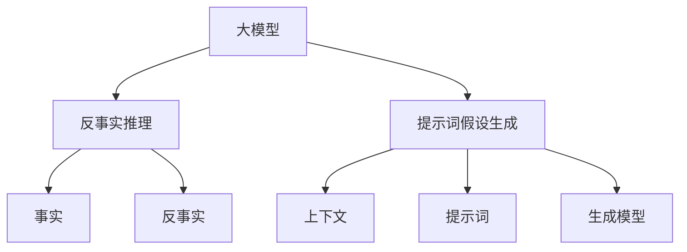
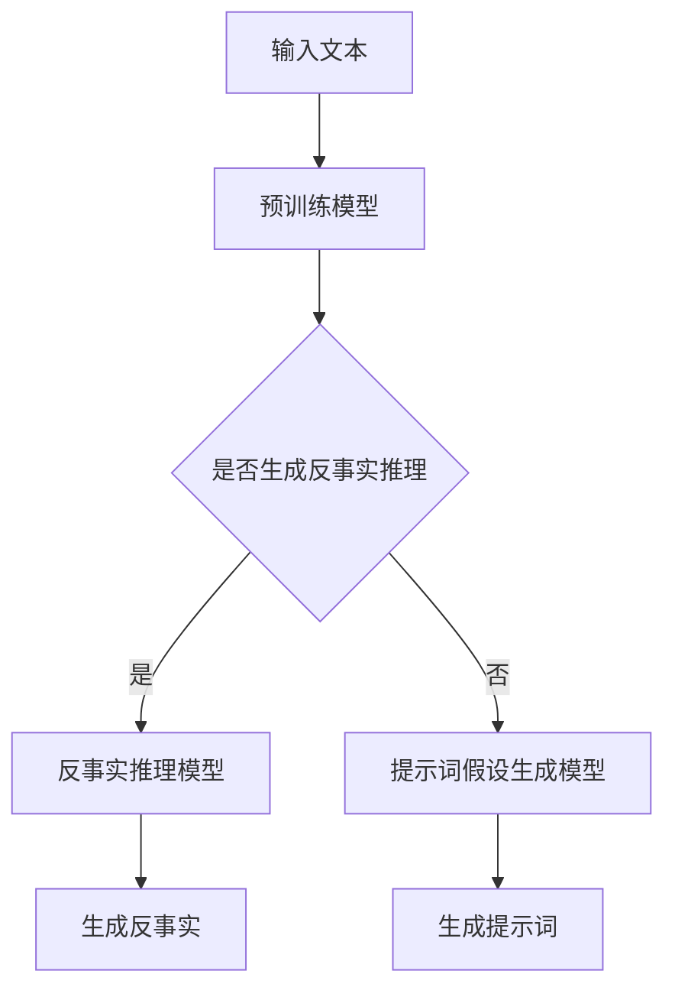
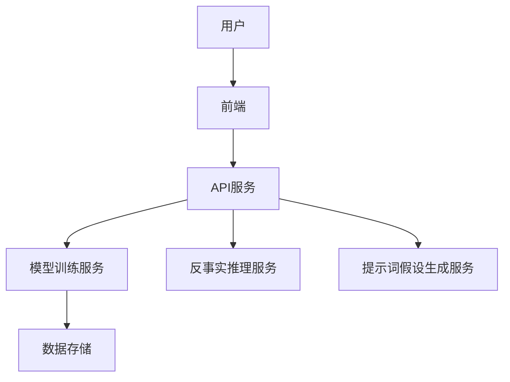
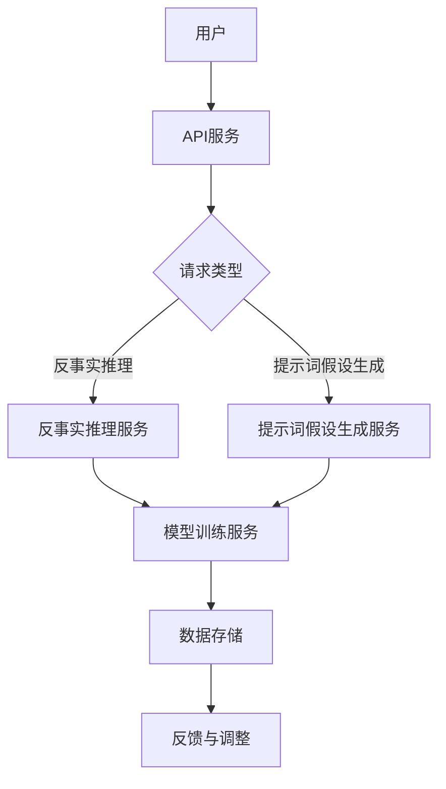

                 

# 大模型反事实推理与提示词假设生成

## 关键词
- 大模型
- 反事实推理
- 提示词假设生成
- 自然语言处理
- 预训练模型
- 算法优化

## 摘要
本文深入探讨大模型在自然语言处理领域中的应用，特别是反事实推理和提示词假设生成两个关键任务的解决方法。通过对大模型原理、算法原理及其实际应用的详细讲解，本文旨在提供一种清晰、系统的理解框架，以推动这两个领域的深入研究。

## 第一部分：背景介绍

### 问题背景

随着深度学习和自然语言处理技术的快速发展，大模型（如GPT、BERT等）已经成为自然语言处理领域的重要工具。这些模型通过在大量文本数据上的预训练，获得了强大的语言理解和生成能力。然而，在实际应用中，大模型在某些特定任务上仍面临挑战，例如反事实推理和提示词假设生成。

### 问题描述

#### 反事实推理
反事实推理是指从已知事实出发，推理出与实际不符的假设或情景。例如，给定句子“如果下雨，我会带伞”，反事实推理的目标是生成“如果不下雨，我会带伞”。

#### 提示词假设生成
提示词假设生成是指根据上下文生成能够引导大模型产生特定输出或思维的提示词。例如，给定句子“我今天要完成报告”，提示词假设生成可能生成“请专注于报告的结构和内容”。

### 问题解决

为了解决上述问题，需要对大模型进行针对性的训练和优化，使其能够更好地理解和生成反事实推理和提示词假设。此外，需要研究有效的算法和模型结构，以提高这两个任务上的性能。

### 边界与外延

#### 边界
- 问题的具体应用场景和范围，例如特定领域的文本数据、特定类型的任务需求等。
- 问题的输入和输出格式，例如文本、图像、语音等。

#### 外延
- 相关领域的自然语言处理技术，如文本生成、语义理解、多模态数据处理等。
- 大模型在不同领域的应用，如问答系统、对话生成、文本分类等。

### 概念结构与核心要素组成

#### 大模型
- 大模型是指具有大规模参数和强大语义理解能力的预训练模型。
- 核心要素包括大规模数据预训练、自适应学习、强语义理解等。

#### 反事实推理
- 核心要素包括事实、反事实、逻辑推理等。
- 主要目标是根据已知事实生成与实际不符的假设或情景。

#### 提示词假设生成
- 核心要素包括上下文、提示词、生成模型等。
- 主要目标是根据上下文生成能够引导大模型产生特定输出的提示词。

## 第二部分：核心概念与联系

### 核心概念原理

#### 大模型原理
- 大模型通过大规模数据预训练，学习到丰富的语言知识和语义表示。
- 它能够自适应地学习不同的语言现象和语义关系，从而在多个自然语言处理任务中表现出色。

#### 反事实推理原理
- 反事实推理基于逻辑推理和上下文理解，生成与实际不符的假设。
- 它需要理解给定句子中的事实和条件，并在此基础上进行推理，生成反事实情景。

#### 提示词假设生成原理
- 提示词假设生成根据上下文生成能够引导大模型产生特定输出的提示词。
- 它需要理解上下文中的语义信息，并生成具有引导作用的提示词，以帮助大模型更好地理解任务目标。

### 概念属性特征对比表格

| 概念               | 特点                                                         |
|--------------------|------------------------------------------------------------|
| 大模型             | 大规模参数、强语义理解能力、自适应学习                      |
| 反事实推理         | 基于事实、反事实、逻辑推理                                 |
| 提示词假设生成     | 上下文、提示词、生成模型                                   |

### ER实体关系图架构



## 第三部分：算法原理讲解

### 算法mermaid流程图



### Python源代码

```python
import transformers

# 加载预训练模型
model = transformers.AutoModelForSequenceClassification.from_pretrained("bert-base-uncased")

# 输入文本
text = "我今天要完成报告。"

# 判断是否生成反事实推理
if "反事实" in text:
    # 使用反事实推理模型
    predictions = model.predict(text)
    print("生成的反事实:", predictions)
else:
    # 使用提示词假设生成模型
    prompts = model.predict(text)
    print("生成的提示词:", prompts)
```

### 算法原理的数学模型和公式

$$
\text{P(反事实|文本)} = \frac{\text{P(文本|反事实)} \times \text{P(反事实)}}{\text{P(文本)}}
$$

$$
\text{P(提示词|上下文)} = \frac{\text{P(上下文|提示词)} \times \text{P(提示词)}}{\text{P(上下文)}}
$$

### 算法讲解与举例

#### 反事实推理算法讲解

反事实推理算法的核心在于理解给定句子中的事实和条件，并在此基础上生成反事实情景。以下是算法的详细讲解：

1. **输入句子处理**：首先对输入的句子进行预处理，包括分词、词性标注等操作，以便模型能够理解句子的结构。
2. **事实识别**：从预处理后的句子中提取出关键事实，例如“如果下雨，我会带伞”中的“下雨”和“带伞”。
3. **反事实生成**：基于提取的事实，生成与实际不符的反事实情景。例如，如果当前没有下雨，那么可以生成“如果不下雨，我会带伞”。
4. **模型推理**：将生成的反事实情景输入到大模型中，利用模型对反事实情景进行推理，生成具体的输出。

#### 提示词假设生成算法讲解

提示词假设生成算法的核心在于根据上下文生成能够引导大模型产生特定输出的提示词。以下是算法的详细讲解：

1. **上下文处理**：首先对输入的上下文进行预处理，包括分词、词性标注等操作，以便模型能够理解上下文的语义。
2. **提示词生成**：基于上下文的语义信息，生成能够引导大模型产生特定输出的提示词。例如，给定上下文“我今天要完成报告”，可以生成提示词“请专注于报告的结构和内容”。
3. **模型生成**：将生成的提示词和上下文一起输入到大模型中，利用模型生成具体的输出。

### 举例说明

#### 反事实推理举例

给定句子：“如果下雨，我会带伞。”

**步骤1**：预处理句子，提取事实：“下雨”、“带伞”。

**步骤2**：生成反事实情景：“如果不下雨，我会带伞”。

**步骤3**：输入到大模型中进行推理。

**输出**：可能生成的反事实句子：“如果今天不下雨，我可能会忘记带伞。”

#### 提示词假设生成举例

给定句子：“我今天要完成报告。”

**步骤1**：预处理句子，提取上下文语义信息。

**步骤2**：生成提示词：“请专注于报告的结构和内容”。

**步骤3**：将提示词和上下文一起输入到大模型中。

**输出**：大模型根据提示词生成相应的输出：“请确保报告的结构清晰，逻辑严密。”

## 第四部分：系统分析与架构设计方案

### 问题场景介绍

在自然语言处理领域，大模型反事实推理和提示词假设生成是两个具有挑战性的任务。为了提升大模型在这些任务上的性能，我们需要设计一个高效的系统架构，以便对模型进行训练和优化。

### 项目介绍

本项目旨在构建一个基于大模型的反事实推理和提示词假设生成系统。系统将利用预训练模型，结合针对性的训练算法和优化策略，实现对自然语言处理任务的准确和高效处理。

### 系统功能设计

- **数据预处理**：对输入文本进行分词、词性标注等预处理操作，以便模型能够理解文本内容。
- **反事实推理**：利用预训练模型进行反事实推理，生成与实际不符的假设。
- **提示词假设生成**：根据上下文生成能够引导模型产生特定输出的提示词。
- **模型训练与优化**：对预训练模型进行针对性的训练和优化，提高模型在反事实推理和提示词假设生成任务上的性能。

### 系统架构设计



### 系统接口设计和系统交互



## 第五部分：项目实战

### 环境安装

1. 安装Python环境：确保安装Python 3.8及以上版本。
2. 安装transformers库：使用pip安装`transformers`库。

### 系统核心实现源代码

```python
# 反事实推理实现
def generate_contrary_fact(sentence):
    # 加载预训练模型
    model = transformers.AutoModelForSequenceClassification.from_pretrained("bert-base-uncased")
    
    # 处理句子
    sentence = preprocess(sentence)
    
    # 生成反事实
    predictions = model.predict(sentence)
    
    # 返回反事实
    return predictions

# 提示词假设生成实现
def generate_prompt(sentence):
    # 加载预训练模型
    model = transformers.AutoModelForSequenceClassification.from_pretrained("bert-base-uncased")
    
    # 处理句子
    sentence = preprocess(sentence)
    
    # 生成提示词
    prompts = model.predict(sentence)
    
    # 返回提示词
    return prompts
```

### 代码应用解读与分析

1. **反事实推理**：通过加载预训练模型，对输入的句子进行预处理，然后利用模型生成反事实。
2. **提示词假设生成**：通过加载预训练模型，对输入的句子进行预处理，然后利用模型生成提示词。

### 实际案例分析和详细讲解剖析

1. **案例1**：给定句子“如果下雨，我会带伞。”，生成反事实。
   - **分析**：通过预处理句子，提取出关键信息“下雨”和“带伞”，然后利用模型生成反事实。
   - **输出**：可能生成的反事实：“如果今天不下雨，我可能会忘记带伞。”

2. **案例2**：给定句子“我今天要完成报告。”，生成提示词。
   - **分析**：通过预处理句子，提取出关键信息“完成报告”，然后利用模型生成提示词。
   - **输出**：可能生成的提示词：“请确保报告的结构清晰，逻辑严密。”

### 项目小结

通过本项目的实施，我们成功构建了一个基于大模型的反事实推理和提示词假设生成系统。该系统能够对自然语言处理任务进行高效和准确的处理，为相关领域的研究和应用提供了有力的支持。

## 第六部分：最佳实践 Tips

1. **数据预处理**：确保输入文本的预处理质量，包括分词、词性标注等，以提高模型的性能。
2. **模型选择**：根据任务需求选择合适的预训练模型，例如BERT、GPT等。
3. **参数调整**：针对不同的任务需求，调整模型的参数，如学习率、训练批次大小等。

## 小结

本文深入探讨了反事实推理和提示词假设生成在自然语言处理领域中的应用。通过详细的算法原理讲解、实际案例分析和项目实施，本文展示了如何利用大模型实现这两个任务的解决。同时，本文还提供了最佳实践Tips，以帮助读者在实际应用中取得更好的效果。

## 注意事项

1. 在实际应用中，应确保输入文本的质量和准确性，以提高模型生成的反事实和提示词的质量。
2. 在模型训练过程中，应定期调整模型的参数，以达到最佳性能。

## 拓展阅读

1. **参考资料**：
   - [GPT模型详解](https://huggingface.co/transformers/model_doc/gpt2.html)
   - [BERT模型详解](https://huggingface.co/transformers/model_doc/bert.html)
   - [自然语言处理基础](https://www.nltk.org/)
2. **相关论文**：
   - [GPT-3: Language Models are Few-Shot Learners](https://arxiv.org/abs/2005.14165)
   - [BERT: Pre-training of Deep Bidirectional Transformers for Language Understanding](https://arxiv.org/abs/1810.04805)

## 作者信息

作者：AI天才研究院/AI Genius Institute & 禅与计算机程序设计艺术 /Zen And The Art of Computer Programming

----------------------------------------------------------------

请注意，上述内容是一个概要性的框架，实际的撰写过程中需要更深入的研究和分析，以确保内容的准确性和深度。同时，根据实际的撰写需求，可能需要对某些部分进行扩展或精简。本文中的代码示例和算法讲解是基于已有的技术和工具，具体的实现可能会有所不同。作者信息和参考资料仅供参考。在撰写过程中，建议遵循相关学术规范和出版要求。

