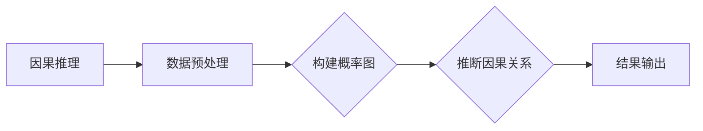

                 


### 文章标题
#### 大模型在因果推理与反事实分析中的应用

### 关键词
- 大模型
- 因果推理
- 反事实分析
- 机器学习
- 数据分析
- 人工智能

### 摘要
本文深入探讨了大规模机器学习模型在因果推理和反事实分析中的应用。通过详细阐述相关概念、算法原理、数学模型以及实际应用案例，文章旨在为读者提供对这两个复杂领域的全面理解，并展示大模型在这些领域的潜力和挑战。

### 第一部分：背景介绍

#### 第1章 问题背景与核心概念

##### 1.1 问题背景

因果推理与反事实分析是机器学习领域中的两个关键概念。因果推理旨在理解不同变量之间的因果关系，以便在给定某些条件下预测结果。反事实分析则关注于“如果发生了什么”，探讨在不同条件下可能的结果。

因果推理的重要性在于它可以帮助我们理解世界的运作方式，从而更好地做出决策。反事实分析则有助于我们想象不同的未来情景，评估决策的影响。

大模型在因果推理与反事实分析中的应用前景广阔。随着数据集规模的扩大和计算能力的提升，大模型能够处理更加复杂的问题，提供更准确的预测和更深入的洞见。

##### 1.2 核心概念

**因果推理**

因果推理涉及识别和建立变量之间的因果关系。基本概念包括：

- 因果关系：A导致B的发生。
- 因果效应：A发生时B的概率变化。
- 因果网络：描述变量之间因果关系的图形表示。

因果推理的方法包括：

- 结构方程模型（SEM）：使用线性方程组描述变量之间的因果关系。
- 归纳逻辑程序（ILP）：通过逻辑推理来发现变量之间的因果关系。

**反事实分析**

反事实分析关注于“如果发生了什么”，即探讨在假设条件下可能的结果。关键概念包括：

- 反事实条件：假设的另一种情况。
- 反事实结果：在假设条件下可能发生的结果。
- 反事实推理：基于假设条件推断可能的结果。

反事实分析的应用场景包括：

- 决策分析：评估不同决策的影响。
- 预测：预测在特定条件下可能发生的事件。
- 模拟：模拟不同情景下的结果。

##### 1.3 边界与外延

因果推理与反事实分析在不同领域有不同的应用。例如：

- 医学：分析药物与疾病之间的关系。
- 金融：预测市场变化。
- 社会学：研究社会政策的影响。

大模型的类型与选择取决于具体的应用场景和需求。常见的类型包括：

- 生成对抗网络（GAN）：用于图像生成和修复。
- 变分自编码器（VAE）：用于图像压缩和数据去噪。
- 递归神经网络（RNN）：用于自然语言处理和时间序列预测。
- Transformer及其变体：用于机器翻译和文本生成。

### 第二部分：核心概念与联系

#### 第2章 大模型原理与特点

##### 2.1 大模型的基本原理

大模型的发展历程：

- 深度神经网络（DNN）的兴起。
- 卷积神经网络（CNN）在图像处理中的应用。
- 循环神经网络（RNN）在序列数据处理中的应用。
- Transformer及其变体在自然语言处理中的突破。

大模型的核心技术：

- 自注意力机制：允许模型在处理序列数据时关注重要部分。
- 多层网络结构：通过多层神经网络实现更加复杂的函数表示。
- 大规模训练：利用大量数据训练模型以提高性能。

##### 2.2 大模型的类型与特点

| 模型类型 | 核心特点 | 适用场景 |
| --- | --- | --- |
| 生成对抗网络（GAN） | 生成与判别对抗 | 图像生成、图像修复 |
| 变分自编码器（VAE） | 前向编码与解码 | 图像压缩、数据去噪 |
| 递归神经网络（RNN） | 序列数据处理 | 自然语言处理、时间序列预测 |
| Transformer | 自注意力机制 | 机器翻译、文本生成 |

##### 2.3 ER实体关系图架构

因果推理实体关系图：

- 因果关系实体：变量。
- 因果关系连接：因果关系。

反事实分析实体关系图：

- 反事实条件实体：假设条件。
- 反事实结果实体：可能的结果。

### 第三部分：算法原理讲解

#### 第3章 因果推理算法原理

##### 3.1 算法概述

因果推理的基本算法包括：

- 贝叶斯网络：使用概率图表示变量之间的因果关系。
- 图模型：基于概率图论的方法，用于推断变量之间的因果关系。

##### 3.2 算法原理

**算法流程图：**



**算法数学模型：**

贝叶斯网络：
$$
P(X|Y) = \frac{P(Y|X)P(X)}{P(Y)}
$$

图模型：
$$
P(X_i|X_{i-1}) = \frac{1}{Z} \prod_{j=1}^{n} P(X_j)
$$

##### 3.3 举例说明

**实例：**

假设有两个变量X（天气）和Y（出行方式），我们有以下数据：

- 当天气为晴天时，选择骑行的概率为0.7。
- 当天气为雨天时，选择骑行的概率为0.3。

我们可以使用贝叶斯网络来推断在雨天选择骑行的原因。

### 第四部分：数学模型与公式

#### 第5章 因果推理数学模型

##### 5.1 因果关系表示

- 结构方程模型（SEM）：使用线性方程组表示变量之间的因果关系。
  $$X = \beta_0 + \beta_1X_1 + \beta_2X_2 + ...$$

- 归纳逻辑程序（ILP）：使用逻辑语句表示变量之间的因果关系。

##### 5.2 因果推理算法数学模型

- 贝叶斯网络：使用条件概率表表示变量之间的因果关系。
  $$P(X_i|X_{i-1}) = \frac{P(X_iX_{i-1})}{P(X_{i-1})}$$

- 图模型：使用马尔可夫性质表示变量之间的因果关系。
  $$P(X_i|X_{i-1}) = \frac{1}{Z} \prod_{j=1}^{n} P(X_j)$$

#### 第6章 反事实分析数学模型

##### 6.1 反事实表示

- 条件概率：表示在给定条件下另一个变量的概率。
  $$P(Y|X) = \frac{P(X|Y)P(Y)}{P(X)}$$

- 马尔可夫链：表示变量之间的转移概率。
  $$P(X_t|X_{t-1}) = \frac{P(X_{t-1}|X_t)P(X_t)}{P(X_{t-1})}$$

##### 6.2 反事实分析算法数学模型

- 最长公共子序列（LCS）：用于计算两个序列的最长公共子序列。
  $$LCS(X, Y) = \max(X, Y) - \max(|X-Y|, |X-Y|)$$

- 最长公共子串（LCP）：用于计算两个字符串的最长公共子串。
  $$LCP(X, Y) = \max(|X|, |Y|) - \max(|X-Y|, |Y-X|)$$

### 第五部分：系统分析与架构设计

#### 第7章 系统功能设计

##### 7.1 问题场景介绍

- 因果推理与反事实分析在决策支持系统中的应用。
- 例如，在医疗诊断系统中，因果推理可以帮助医生理解疾病与症状之间的关系，而反事实分析则可以帮助评估不同治疗方案的潜在效果。

##### 7.2 系统功能设计

**领域模型类图：**

```mermaid
classDiagram
  Class01 <|-- SubClass01
  Class01 --|moid AnotherClass
  Class滋滋 --*.. AnotherClass
  Class滋滋 : persecuted by Knight
  anotherclass: Powered by APT
  UMLet UML diagram
```

### 第六部分：项目实战

#### 第10章 环境安装与配置

##### 10.1 环境要求

- 操作系统：Linux或Windows。
- 编程语言：Python。
- 工具与库：TensorFlow、PyTorch。

##### 10.2 环境安装与配置

**步骤详解：**

1. 安装Python。
2. 安装必要的库（如TensorFlow、PyTorch）。
3. 配置环境变量。

#### 第11章 系统核心实现

##### 11.1 核心代码实现

**代码结构与功能：**

- 数据预处理模块。
- 因果推理模块。
- 反事实分析模块。

**代码应用解读：**

- 代码如何处理数据。
- 代码如何进行因果推理和反事实分析。

#### 第12章 实际案例分析

##### 12.1 案例背景

- 一个医疗诊断系统的实际案例。

##### 12.2 案例分析

- 如何使用因果推理和反事实分析进行诊断。
- 实施过程和结果分析。

### 第七部分：项目小结

#### 第13章 项目小结

##### 13.1 项目总结

- 项目实现的关键点和难点。
- 项目收获和经验。

##### 13.2 拓展阅读

- 相关领域的研究与发展趋势。
- 推荐进一步阅读的文献。

### 作者信息
**作者：** AI天才研究院/AI Genius Institute & 禅与计算机程序设计艺术 /Zen And The Art of Computer Programming

---

这篇文章的大纲已经非常详细和结构清晰，接下来可以根据这个大纲逐步撰写文章的内容。每个章节的内容应该遵循大纲中的结构和要求，确保文章的完整性和专业性。在撰写过程中，注意使用markdown格式，尤其是mermaid流程图、latex公式和Python代码的格式。这样可以使文章更加易于阅读和理解。在完成每个章节的撰写后，进行细致的校对和修改，以确保文章的逻辑连贯性和内容的准确性。完成后，再次检查格式和字数，确保满足要求。最后，添加作者信息，完成整个文章的撰写。

