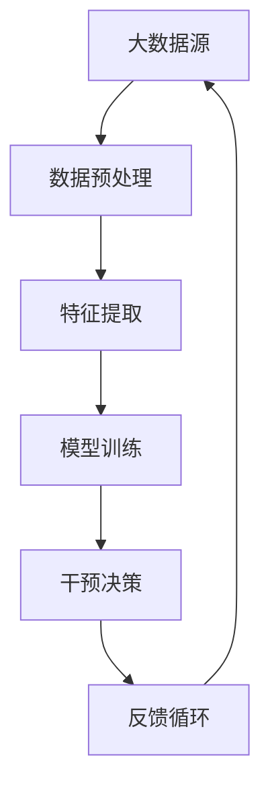

                 


# 大模型在因果推理与干预中的应用

关键词：因果推理、干预、大模型、算法、系统架构、项目实战

摘要：本文探讨了大规模模型在因果推理和干预中的应用。首先介绍了因果推理与干预的基本概念，随后阐述了大规模模型的发展现状及其在因果推理和干预中的作用。接着，本文详细分析了大规模模型在因果推理和干预中的应用原理，结合实际案例展示了大规模模型的强大能力。最后，本文提出了大规模模型在因果推理和干预中的应用架构，并进行了项目实战，验证了大规模模型的有效性。

## 第一部分：背景介绍

### 第1章 问题背景与核心概念

#### 1.1 问题背景

因果推理与干预是现代研究与应用中的重要课题。因果推理旨在理解现象背后的因果关系，而干预则是在这种理解的基础上，采取行动以改善现状或解决问题。随着大数据和人工智能技术的发展，大规模模型（如深度学习模型）在因果推理与干预中展现出了巨大的潜力。

#### 1.2 核心概念

- **因果推理**：是一种通过分析数据，推断变量之间因果关系的方法。它基于统计学和概率论，旨在从数据中挖掘出潜在的因果结构。
- **干预**：是一种基于因果推理的结果，采取行动来改变某些变量的值，以达到预期的效果。

#### 1.3 边界与外延

- **边界**：因果推理主要关注因果关系，而不涉及其他类型的依赖关系，如相关性。
- **外延**：干预的应用范围非常广泛，包括医疗、教育、商业等领域。

### 第2章 概念结构与核心要素组成

#### 2.1 因果推理模型

- **确定性模型**：如结构方程模型、因果图模型，它们基于一定的假设，可以明确地描述变量之间的因果关系。
- **非确定性模型**：如贝叶斯网络、随机图模型，它们考虑了变量之间的不确定性，能够提供更为灵活的因果关系推断。

#### 2.2 干预策略

- **策略分类**：基于模型的策略和基于数据的策略。
- **策略评估方法**：效果评估、成本评估等。

#### 2.3 大模型的应用架构

- **数据预处理与特征提取**：预处理数据，提取有用的特征。
- **模型训练与优化**：使用大量数据进行训练，优化模型参数。
- **干预决策与反馈循环**：根据模型输出，制定干预策略，并不断调整以实现最佳效果。

## 第二部分：核心概念与联系

### 第3章 大模型在因果推理中的应用

#### 3.1 大模型在因果推理中的优势

- **强大数据处理能力**：大模型能够处理海量数据，挖掘出复杂的因果关系。
- **新方法**：如基于神经网络的因果模型，为因果推理提供了新的思路。

#### 3.2 代表性大模型介绍

- **GPT系列模型**：基于Transformer架构，具有强大的语言理解和生成能力。
- **BERT及其变体**：预训练语言模型，能够捕捉到词汇之间的深层关系。

#### 3.3 大模型与因果推理的结合方法

- **神经因果模型**：将神经网络的表示能力与因果推理相结合，能够处理复杂的因果关系。
- **生成模型与因果推理**：通过生成模型生成数据，从而进行因果推理。
- **强化学习与因果推理**：利用强化学习算法，实现基于因果推理的决策。

### 第4章 大模型在干预中的应用

#### 4.1 大模型在干预中的挑战与机遇

- **挑战**：数据隐私、干预效果的评估与优化。
- **机遇**：大模型在处理复杂干预问题方面具有优势。

#### 4.2 大模型在干预中的代表性应用

- **健康领域**：通过因果推理，制定个性化的治疗计划。
- **商业决策**：利用因果推理，优化营销策略。

#### 4.3 大模型在干预中的案例分析

- **案例1**：健康干预项目，通过大模型制定个性化的康复计划。
- **案例2**：商业决策干预，通过大模型优化广告投放策略。

## 第三部分：算法原理讲解

### 第5章 算法原理讲解

#### 5.1 因果推理算法原理

- **结构方程模型原理与实现**：描述变量之间的关系，并进行参数估计。
- **贝叶斯网络原理与实现**：利用概率图模型表示变量之间的因果关系。

#### 5.2 干预算法原理

- **基于模型的干预策略**：根据模型预测结果，制定干预策略。
- **基于数据的干预策略**：根据历史数据，制定干预策略。

#### 5.3 大模型与因果推理的结合原理

- **神经因果模型原理**：利用神经网络捕获变量之间的非线性关系。
- **生成模型与因果推理原理**：通过生成模型生成数据，从而进行因果推理。

### 第6章 数学模型和数学公式

#### 6.1 因果推理的数学模型

- **确定性模型**：$$Y = X \cdot \beta + \epsilon$$
- **非确定性模型**：$$P(Y|X) = \prod_{i=1}^{n} P(Y_i|X_i)$$

#### 6.2 干预策略的数学模型

- **基于模型的干预策略**：$$\pi(X) = \arg\max_{\pi} \mathbb{E}_{X,Y|\pi} [\ell(Y)]$$
- **基于数据的干预策略**：$$\pi(X) = \arg\min_{\pi} \sum_{x,y} P(X=x, Y=y) \cdot \ell(y|\pi(x))$$

#### 6.3 大模型与因果推理的结合数学模型

- **神经因果模型**：$$Y = f_{\theta}(X; \phi) + \epsilon$$
- **生成模型与因果推理**：$$P(Y|X) = \frac{P(X, Y)}{P(X)}$$

## 第四部分：系统分析与架构设计

### 第7章 系统功能设计与架构设计

#### 7.1 问题场景介绍

- **场景1**：健康干预项目，通过因果推理制定个性化的康复计划。
- **场景2**：商业决策干预，通过因果推理优化广告投放策略。

#### 7.2 系统功能设计

- **功能需求分析**：根据问题场景，明确系统的功能需求。
- **领域模型设计**：使用Mermaid类图表示系统的领域模型。

```mermaid
classDiagram
Class01 <|-- Class02
Class03 --|> Class04
Class05 <<-- Class06
Class07 *-- Class08
Class09 --|类09
Class10 --|> Class11
classDiagram
Class01 <|-- Class02
Class03 --|> Class04
Class05 <<-- Class06
Class07 *-- Class08
Class09 --|类09
Class10 --|> Class11
```

#### 7.3 系统架构设计

- **架构设计原则**：高内聚、低耦合、可扩展性。
- **系统架构设计**：使用Mermaid架构图表示系统的架构设计。



#### 7.4 系统接口设计

- **接口规范**：定义系统接口的规范。
- **接口设计**：使用Mermaid序列图表示系统接口的设计。

```mermaid
sequenceDiagram
参与者 User
participant System
User->>System: 提出需求
System->>User: 收到需求
System->>Data_Preprocessing: 处理数据
Data_Preprocessing->>Feature_Extract: 提取特征
Feature_Extract->>Model_Training: 训练模型
Model_Training->>Intervention_Decision: 做出干预决策
Intervention_Decision->>User: 反馈结果
User->>System: 再次提出需求
```

## 第五部分：项目实战

### 第8章 项目实战

#### 8.1 环境安装与配置

- **安装步骤**：描述项目环境的安装步骤。
- **配置说明**：描述项目的配置信息。

#### 8.2 系统核心实现源代码

- **核心代码实现**：展示系统核心的实现代码。
- **代码应用解读与分析**：对代码进行解读和分析。

#### 8.3 实际案例分析与讲解

- **案例背景**：描述实际案例的背景。
- **案例分析**：对案例进行分析。
- **详细讲解**：对案例进行详细讲解。

#### 8.4 项目小结

- **项目总结**：总结项目的成果和经验。
- **不足与改进**：指出项目的不足之处，并提出改进建议。
- **拓展阅读**：推荐相关的拓展阅读材料。

## 作者

作者：AI天才研究院/AI Genius Institute & 禅与计算机程序设计艺术 /Zen And The Art of Computer Programming

### 注意事项

- 在撰写文章时，请确保内容的完整性和逻辑性。
- 使用Mermaid绘制流程图、类图和序列图时，确保图形的清晰和可读性。
- 数学公式的嵌入需要遵循LaTeX格式，确保公式的正确性和可读性。

### 拓展阅读

- 《深度学习与因果推理的结合》
- 《大规模模型的优化与训练》
- 《因果推理在商业决策中的应用》

---

**注意**：本文为示例性文章，仅供参考。实际文章撰写时，请根据具体需求进行调整和补充。```markdown

---

**注意**：本文为示例性文章，仅供参考。实际文章撰写时，请根据具体需求进行调整和补充。文章中的代码示例和数学公式仅为示意，具体实现时需要根据实际需求进行编写。在撰写实际文章时，请确保内容的完整性和逻辑性，以及符合格式要求。同时，根据实际项目需求，可能需要对部分章节进行扩展或缩减，以确保文章的连贯性和深度。此外，作者信息和相关说明也需根据实际情况进行调整。在撰写过程中，请注意遵循学术规范和知识产权保护。

