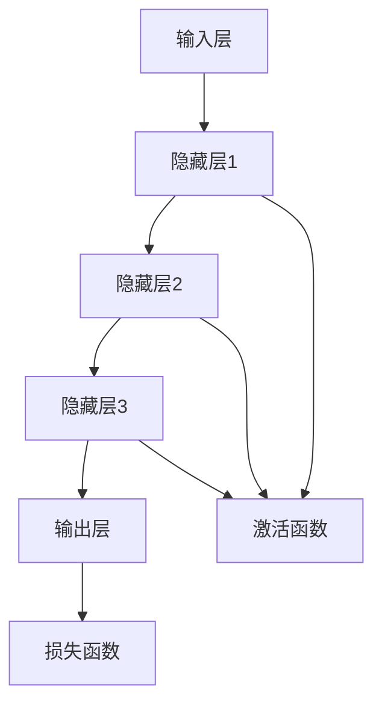

                 

### 引言与背景

在当今科技迅速发展的时代，复杂网络分析成为许多领域研究和应用的关键环节。从社交网络到经济系统，复杂网络的拓扑结构和动态特性对于理解整体行为和预测未来趋势具有至关重要的作用。随着数据规模的不断扩大和计算能力的提升，传统的分析方法逐渐暴露出其局限性，无法应对复杂网络中高度非线性、多样性和动态变化的特点。

这一背景下，大模型技术的崛起为复杂网络分析带来了新的机遇和挑战。大模型，特别是深度学习和神经网络，以其强大的数据处理和模式识别能力，成为了复杂网络分析的重要工具。它们不仅能够捕捉到网络中隐藏的结构和模式，还能够通过大规模的数据训练实现对复杂系统行为的预测和优化。

然而，大模型在复杂网络分析中的应用也面临着一系列挑战。首先是如何处理大量异构数据，如何保证模型的鲁棒性和泛化能力。此外，大模型在训练过程中对计算资源和时间的需求极大，如何在有限的资源下高效地训练和部署模型，也是亟待解决的问题。

本章节将首先介绍复杂网络分析的重要性，然后回顾大模型技术发展的现状，接着明确大模型在复杂网络分析中面临的挑战，并提出相应的解决思路。最后，我们将探讨大模型技术的边界与外延，为后续章节的内容奠定基础。

关键词：复杂网络分析、大模型、深度学习、神经网络、挑战与机遇

### 复杂网络分析的重要性

复杂网络分析在多个领域的研究和应用中具有重要地位。首先，在社交网络领域，复杂网络分析可以帮助我们理解网络结构、传播机制和社区划分。例如，通过分析社交媒体上的用户关系网络，可以识别出关键节点和传播路径，从而优化信息传播策略，提高传播效果。

其次，在经济系统中，复杂网络分析同样发挥着重要作用。例如，通过分析金融网络中的交易关系，可以揭示出市场风险传导机制，为金融机构的风险管理和政策制定提供科学依据。此外，复杂网络分析还可以用于供应链管理，优化资源配置，提高供应链的灵活性和稳定性。

在生物学领域，复杂网络分析被广泛应用于基因调控网络、蛋白质相互作用网络的研究。通过解析这些网络，科学家可以更好地理解生物系统的运行机制，发现潜在的疾病治疗靶点。

此外，复杂网络分析还在城市交通规划、通信网络优化、电力系统稳定等领域有着广泛的应用。通过构建和分析复杂网络模型，可以优化资源配置，提高系统效率，减少能源消耗和环境污染。

总之，复杂网络分析在多个领域的深入研究和广泛应用，不仅有助于我们更好地理解复杂系统的本质，也为实际问题提供了科学解决方案。

### 大模型技术发展的现状

大模型技术，尤其是深度学习和神经网络，近年来取得了显著的进展，并在复杂网络分析中展现出巨大的潜力。深度学习是一种通过多层神经网络进行数据建模和特征提取的方法，其核心思想是通过网络的逐层抽象，将原始数据转换成高层次的语义表示。这种方法在大规模图像识别、语音识别和自然语言处理等领域取得了突破性的成果，例如，Google的Inception模型在图像识别任务上达到了人类水平的准确率，OpenAI的GPT-3模型则在自然语言生成任务上展现了前所未有的表现。

神经网络是深度学习的基础，其通过模拟人脑神经元之间的连接和互动，实现数据的自动学习和特征提取。神经网络的架构不断发展，从最初的感知机到多层感知机（MLP），再到卷积神经网络（CNN）和递归神经网络（RNN），每种架构都有其特定的应用场景和优势。随着计算能力的提升，更大规模、更复杂的神经网络模型不断涌现，例如谷歌的Transformer架构，它在机器翻译、文本生成等任务上表现出色，推动了自然语言处理领域的快速发展。

在复杂网络分析中，大模型技术不仅能够处理大规模、高维度的网络数据，还能够捕捉网络中的复杂结构和动态变化。例如，通过深度学习模型，可以对社交网络中的用户行为进行预测和分析，识别出潜在的社区结构和关键节点。在经济网络中，大模型技术可以分析交易关系，预测市场趋势，帮助金融机构进行风险管理。

此外，大模型技术还在基因调控网络、蛋白质相互作用网络等生物学领域发挥了重要作用。通过构建复杂的网络模型，科学家可以更好地理解生物系统的运作机制，发现潜在的治疗靶点。

总之，大模型技术，特别是深度学习和神经网络，在复杂网络分析中展现出了强大的能力和广泛的应用前景。随着技术的不断发展和完善，大模型技术有望在更多领域发挥关键作用，推动科学研究和实际应用的深入发展。

### 大模型在复杂网络分析中面临的挑战

尽管大模型技术为复杂网络分析带来了巨大的机遇，但其在实际应用中仍然面临诸多挑战。首先，数据处理问题是一个关键难题。复杂网络中的数据通常具有高维性和异构性，这意味着在数据预处理和特征提取过程中需要克服大量噪音、缺失值和冗余信息。此外，不同类型的数据（如文本、图像、时间序列等）需要不同的处理方法，这增加了数据处理的复杂度。

其次，模型的鲁棒性和泛化能力也是一个重大挑战。复杂网络的数据往往具有高度的非线性和动态变化，这使得模型在特定数据集上表现优异的同时，可能在其他数据集上失去有效性。为了提高模型的鲁棒性和泛化能力，研究者需要设计更稳健的算法和训练策略，例如通过正则化技术、迁移学习和数据增强等方法。

第三，大模型的训练和部署问题也是实际应用中的一大障碍。深度学习模型通常需要大量的计算资源和时间进行训练，而在实际应用中，硬件设备和计算资源的限制使得快速训练和部署模型变得困难。此外，模型部署后如何与现有系统高效集成，如何实时更新和优化模型，也是需要解决的问题。

第四，大模型在复杂网络分析中的应用还涉及伦理和道德问题。例如，在社交网络分析中，如何保护用户隐私，避免数据滥用；在经济网络分析中，如何确保模型的决策公正透明，避免产生不公平的结果。

最后，大模型技术的可持续发展也是一个重要挑战。随着模型规模的不断扩大，计算资源的消耗和数据存储的需求也会显著增加，如何实现绿色计算，降低碳排放，是未来需要关注的重要问题。

总之，大模型在复杂网络分析中面临的数据处理、模型鲁棒性、训练和部署、伦理道德以及可持续发展等多方面的挑战，需要研究者们通过不断创新和优化，共同应对和解决。

### 当前研究的不足之处

尽管大模型技术在复杂网络分析中展现出巨大潜力，但当前的研究仍然存在一些不足之处。首先，大多数研究侧重于理论模型的构建和算法优化，而缺乏对实际应用场景的深入探讨。这使得许多研究成果在现实世界中难以直接应用，无法解决实际问题。例如，一些先进的深度学习模型在实验室环境中表现出色，但在实际操作中，由于数据质量和计算资源的限制，其性能明显下降。

其次，许多研究在数据预处理和特征提取方面存在不足。复杂网络数据通常具有高维性和异构性，现有的预处理方法往往无法有效地处理这些复杂特征。此外，当前的研究多集中于单一类型的数据处理方法，缺乏对不同类型数据（如文本、图像、时间序列等）的整合和融合处理策略。

第三，大模型在复杂网络分析中的应用仍面临模型鲁棒性和泛化能力的挑战。尽管一些研究表明通过正则化、迁移学习和数据增强等方法可以提高模型的鲁棒性，但这些方法在实际应用中的效果仍有待验证。此外，如何在实际场景中实现模型的实时更新和优化，也是当前研究中的一个重要问题。

最后，当前研究在伦理和道德问题方面关注不足。例如，在社交网络分析中，如何保护用户隐私，避免数据滥用；在经济网络分析中，如何确保模型的决策公正透明，避免产生不公平的结果。这些问题不仅关系到大模型技术的可持续发展，也关系到社会的公平与正义。

综上所述，当前研究的不足之处主要表现在实际应用场景的缺乏、数据处理和特征提取方法的不足、模型鲁棒性和泛化能力的挑战，以及伦理和道德问题的关注不足。这些问题需要在未来研究中得到进一步的解决和探索。

### 问题解决

面对复杂网络分析中面临的诸多挑战和不足，大模型技术的应用前景仍然广阔。大模型的定义和分类为我们提供了多种工具和方法，以应对复杂网络分析中的各种问题。

首先，大模型的定义通常是指拥有巨大参数量和强大计算能力的人工神经网络模型。这些模型通过多层神经网络的结构，能够对高维度、大规模的复杂数据进行有效的特征提取和模式识别。例如，深度学习模型中的卷积神经网络（CNN）和循环神经网络（RNN）等，通过其复杂的网络结构和丰富的参数配置，能够在图像识别、文本处理和时间序列预测等任务中表现出色。

大模型的分类可以根据其应用场景和数据处理方式的不同进行多种划分。例如，根据网络结构的差异，可以将大模型分为卷积神经网络（CNN）、循环神经网络（RNN）和变换器（Transformer）等；根据训练数据的特点，可以分为监督学习模型、无监督学习模型和半监督学习模型等。

针对复杂网络分析中的数据处理问题，大模型可以通过以下几种方法进行有效应对。首先，大模型能够处理大规模、高维度的数据，通过其强大的计算能力和复杂的网络结构，对数据进行深入的特征提取和降维处理。例如，CNN可以在图像数据中进行有效的特征提取，而RNN则在处理时间序列数据时具有显著优势。

其次，大模型可以通过迁移学习（Transfer Learning）和数据增强（Data Augmentation）等方法提高其鲁棒性和泛化能力。迁移学习允许模型在不同数据集之间共享知识，从而在数据量有限的情况下提高模型的性能。数据增强则通过生成更多的训练样本来扩大模型的训练数据集，增强模型对数据的泛化能力。

在模型鲁棒性和训练效率方面，大模型可以通过正则化（Regularization）和优化算法（Optimization Algorithm）进行改进。正则化技术如L1和L2正则化，可以防止模型过拟合，提高模型的泛化能力。优化算法如Adam、RMSprop等，则可以加速模型的训练过程，提高训练效率。

此外，大模型在复杂网络分析中的应用还涉及到模型的实时更新和优化问题。通过在线学习和实时数据反馈，大模型可以不断调整和优化其参数，以适应动态变化的网络环境。例如，在社交网络分析中，通过实时更新用户行为数据，大模型可以不断调整和优化用户行为预测模型。

总之，大模型技术为复杂网络分析提供了强有力的工具和方法。通过其强大的计算能力、复杂的网络结构和多样化的训练方法，大模型能够在数据处理、模型鲁棒性和训练效率等方面应对复杂网络分析中的各种挑战。未来，随着大模型技术的进一步发展和完善，其在复杂网络分析中的应用前景将更加广阔。

### 大模型在复杂网络分析中的适用范围

大模型技术在复杂网络分析中的应用具有广泛的前景和适用范围。首先，在社交网络分析中，大模型可以通过深度学习算法，对用户关系、行为和兴趣进行精细的建模和预测。例如，通过分析用户在社交媒体上的互动和分享内容，大模型可以识别出用户群体中的关键节点和社区结构，从而优化信息传播和营销策略。

其次，在经济网络分析中，大模型技术可以用于分析金融市场中的交易关系和风险传导机制。通过构建大规模的金融网络模型，大模型可以预测市场波动，识别潜在的金融风险，为金融机构的风险管理和投资决策提供科学依据。

在生物学领域，大模型技术同样具有重要作用。例如，通过分析基因调控网络和蛋白质相互作用网络，大模型可以揭示生物系统的复杂运行机制，帮助科学家发现新的治疗靶点和药物设计策略。

此外，大模型在交通网络优化、通信网络设计、电力系统稳定等领域也有广泛的应用前景。通过构建复杂的网络模型，大模型可以优化资源配置，提高系统效率，减少能源消耗和环境污染。

总之，大模型技术在复杂网络分析中具有广泛的适用范围，通过其在数据处理、模型鲁棒性和预测能力方面的优势，可以解决众多实际应用中的复杂问题，推动相关领域的研究和发展。

### 大模型技术的边界条件

尽管大模型技术在复杂网络分析中展现出了强大的能力和广泛的应用前景，但其应用仍然受到一些边界条件的限制。首先，数据质量和数据量是影响大模型性能的关键因素。大模型依赖于大量高质量的训练数据来进行学习和优化，如果数据存在噪声、缺失值或偏见，模型的性能可能会受到严重影响。因此，在应用大模型技术之前，对数据进行预处理和清洗是至关重要的。

其次，计算资源是另一个重要的边界条件。大模型的训练和部署通常需要大量的计算资源和时间，特别是在处理大规模和高维度数据时，计算资源的消耗更加显著。在实际应用中，硬件设备和计算资源的限制可能成为大模型推广的瓶颈。因此，如何优化算法和模型结构，提高计算效率，是当前研究中的一个重要课题。

此外，大模型的鲁棒性和泛化能力也是其应用的边界条件。复杂网络的数据通常具有高度的非线性性和动态变化，这使得模型在特定数据集上表现优异的同时，可能在其他数据集上失去有效性。为了提高模型的鲁棒性和泛化能力，研究者需要设计更稳健的算法和训练策略，例如通过正则化、迁移学习和数据增强等方法。

最后，大模型技术的伦理和道德问题也是一个重要的边界条件。在应用大模型进行复杂网络分析时，需要关注用户隐私保护、数据安全和公平性等问题。例如，在社交网络分析中，如何确保用户的隐私不被泄露；在经济网络分析中，如何保证模型的决策公正透明，避免产生不公平的结果。这些问题不仅关系到大模型技术的可持续发展，也关系到社会的公平与正义。

总之，大模型技术在复杂网络分析中的应用虽然前景广阔，但仍需克服数据质量、计算资源、鲁棒性和泛化能力以及伦理道德等多方面的边界条件限制，才能实现其真正的应用价值。

### 概念结构与核心要素组成

大模型在复杂网络分析中的成功应用，离不开其复杂的概念结构和核心要素组成。以下我们将从技术原理、核心要素和基本结构三个方面进行详细探讨。

#### 技术原理

大模型技术主要基于深度学习和神经网络，尤其是卷积神经网络（CNN）和循环神经网络（RNN）等。深度学习通过多层神经网络的结构，实现对数据的逐层抽象和特征提取，从而在图像识别、自然语言处理等领域表现出色。卷积神经网络（CNN）特别适合于处理具有网格结构的数据，如图像。CNN通过卷积操作和池化操作，能够捕捉到图像中的局部特征和全局模式。循环神经网络（RNN）则适用于处理序列数据，如时间序列和自然语言文本。RNN通过其递归结构，能够捕捉到序列中的长期依赖关系，从而在语音识别、机器翻译等领域取得显著成果。

#### 核心要素

大模型的核心要素主要包括数据、模型结构、训练策略和优化算法。数据是模型训练的基础，高质量的训练数据能够提升模型的性能和泛化能力。模型结构则决定了模型对数据的处理方式和特征提取能力，不同的网络结构适用于不同类型的数据。训练策略和优化算法则用于调整模型的参数，使其在训练数据上达到最佳性能。常见的优化算法包括梯度下降、随机梯度下降（SGD）和Adam等。

#### 基本结构

大模型的基本结构通常由输入层、隐藏层和输出层组成。输入层接收外部数据，隐藏层通过神经元之间的连接和激活函数，对数据进行逐层抽象和特征提取，输出层则将提取到的特征映射到具体的任务输出。例如，在图像识别任务中，输入层接收图像数据，隐藏层提取图像的边缘、纹理等特征，输出层输出图像的类别标签。

为了更直观地展示大模型的结构和操作过程，我们使用Mermaid流程图来表示。以下是使用Mermaid绘制的深度学习模型的基本结构：

该流程图展示了输入层通过一系列隐藏层进行特征提取和变换，最终输出层的输出经过损失函数进行误差计算和模型优化。

通过上述对技术原理、核心要素和基本结构的分析，我们可以看出，大模型在复杂网络分析中具有强大的数据处理和模式识别能力。理解这些基本概念和结构，有助于我们更好地应用大模型技术，解决复杂网络分析中的实际问题。

### 第2章 大模型的基本原理与类型

在深入探讨大模型在复杂网络分析中的应用之前，我们需要先理解大模型的基本原理与类型。大模型，尤其是深度学习模型，是通过多层神经网络进行数据建模和特征提取的工具，其核心思想是通过网络的逐层抽象，将原始数据转换成高层次的语义表示。在这一章节中，我们将详细讨论大模型的原理、类型及其在复杂网络分析中的应用。

#### 2.1 大模型原理

大模型的原理主要基于深度学习和神经网络。深度学习是机器学习的一个分支，它通过模拟人脑的神经网络结构，实现对复杂数据的自动学习和特征提取。神经网络由一系列的神经元（或节点）组成，每个神经元都与相邻的神经元通过权重连接。神经元的输入经过加权求和后，通过激活函数进行非线性变换，输出结果。

##### 2.1.1 神经网络基础

神经网络的基础是单层感知机（Perceptron），它通过简单的线性分类器来实现二分类任务。然而，单层感知机无法处理非线性问题，因此需要多层网络结构。多层感知机（MLP）通过增加隐藏层，能够实现更复杂的非线性函数逼近。

多层感知机的核心组成部分包括：

1. **输入层**：接收外部输入数据，每个神经元对应一个输入特征。
2. **隐藏层**：通过加权求和和激活函数，将输入数据转换为更高层次的特征表示。隐藏层的数量和神经元数量可以根据任务需求进行调整。
3. **输出层**：将隐藏层的输出映射到具体的任务输出，如分类结果或回归值。

神经网络的工作原理是通过反向传播算法（Backpropagation）来调整权重和偏置，以最小化预测误差。反向传播算法通过计算梯度，逐层更新网络的参数，从而优化模型性能。

##### 2.1.2 深度学习原理

深度学习是神经网络的一种扩展，它通过增加网络的层数，实现更复杂的特征提取和模式识别。深度学习的核心思想是逐层提取特征，从原始数据到高层次的语义表示。

深度学习的原理主要包括以下步骤：

1. **前向传播**：输入数据从输入层逐层传递到输出层，每个神经元根据其权重和前一层神经元的输出，计算加权求和并通过激活函数进行非线性变换。
2. **损失函数**：计算预测输出与真实标签之间的差异，通过损失函数衡量模型的预测误差。
3. **反向传播**：根据损失函数的梯度，反向传播误差，调整网络的权重和偏置，以最小化损失函数。
4. **优化算法**：使用优化算法（如梯度下降、Adam等）更新网络参数，优化模型性能。

#### 2.2 大模型类型

大模型可以根据其结构和应用场景的不同，分为多种类型，每种类型都有其特定的应用场景和优势。以下是几种常见的大模型类型及其应用：

##### 2.2.1 卷积神经网络（CNN）

卷积神经网络（CNN）是一种专门用于处理具有网格结构数据（如图像和视频）的深度学习模型。CNN通过卷积操作和池化操作，能够自动提取图像的局部特征和全局模式。

CNN的主要组成部分包括：

1. **卷积层**：通过卷积操作提取图像的局部特征。卷积层可以使用多个卷积核，每个卷积核对图像进行卷积操作，生成多个特征图。
2. **池化层**：对卷积层输出的特征图进行降采样，减少参数数量，提高模型泛化能力。
3. **全连接层**：将池化层输出的特征图展平，通过全连接层进行分类或回归任务。

CNN在图像分类、目标检测、图像生成等领域有着广泛的应用。

##### 2.2.2 循环神经网络（RNN）

循环神经网络（RNN）是一种用于处理序列数据的深度学习模型，其核心思想是通过其递归结构，能够捕捉序列中的长期依赖关系。

RNN的主要组成部分包括：

1. **隐藏状态**：每个时间步的隐藏状态包含了当前输入和之前所有输入的信息。
2. **权重矩阵**：用于更新隐藏状态和当前输入，这些权重矩阵在训练过程中需要调整。

RNN在自然语言处理（NLP）、语音识别、时间序列预测等领域有着广泛的应用。

##### 2.2.3 变换器（Transformer）

变换器（Transformer）是近年来在自然语言处理领域取得显著成果的深度学习模型。它通过自注意力机制（Self-Attention）实现了对输入序列的全局依赖建模。

变换器的主要组成部分包括：

1. **多头自注意力机制**：对输入序列的每个位置计算自注意力权重，从而实现全局依赖建模。
2. **前馈神经网络**：对自注意力机制的输出进行进一步加工，提高模型的表示能力。

Transformer在机器翻译、文本生成、问答系统等领域表现出色。

#### 2.3 大模型在复杂网络分析中的应用

大模型在复杂网络分析中的应用主要通过以下几种方式：

1. **网络结构建模**：使用卷积神经网络（CNN）或图神经网络（GNN）对复杂网络的结构进行建模，提取网络的局部和全局特征。
2. **动态行为预测**：使用循环神经网络（RNN）或变换器（Transformer）对复杂网络的动态行为进行建模和预测。
3. **节点重要性分析**：通过图卷积神经网络（GCN）等模型，识别复杂网络中的关键节点和关键路径。

总之，大模型通过其强大的特征提取和模式识别能力，为复杂网络分析提供了强有力的工具和方法。理解大模型的基本原理和类型，有助于我们更好地应用这些模型，解决复杂网络分析中的实际问题。

### 第3章 复杂网络的基本概念与特性

复杂网络是由相互连接的节点和边构成的系统，这些节点和边构成了网络的拓扑结构。复杂网络在许多实际应用中具有重要意义，如社交网络、经济网络、生物网络等。了解复杂网络的基本概念和特性，有助于我们深入理解这些网络的结构和功能，从而为网络分析提供理论基础。

#### 3.1 复杂网络基本概念

**定义：** 复杂网络是指由大量相互连接的节点组成的网络结构，节点代表个体或实体，边表示节点之间的相互作用或连接关系。

**节点与边：** 在复杂网络中，节点（Node）是网络的基本组成单元，代表个体、组织、城市等。边（Edge）是连接节点的桥梁，表示节点之间的交互或关联。边的权重可以表示连接的强度或频率。

**度：** 度是衡量节点连接程度的一个重要指标，节点i的度（Degree）定义为与节点i直接相连的边的数量。

**路径：** 路径是节点之间的一系列连接，表示从起点到终点的连通性。

**社区：** 社区是网络中的紧密连接的节点群体，社区内的节点之间连接频繁，而与其他社区的节点连接较少。

**聚类系数：** 聚类系数是衡量网络中节点聚集程度的一个指标，表示一个节点的邻居节点之间也相互连接的概率。

#### 3.2 复杂网络特性

**拓扑特性：**

1. **小世界效应：** 复杂网络中的节点之间虽然连接稀疏，但通过少数边的传递，可以实现快速的信息传播。
2. **无标度性：** 复杂网络中节点度分布通常呈现幂律分布，即大部分节点度较小，而少数节点度非常大。
3. **高聚类性：** 复杂网络中的节点具有较高聚类系数，节点之间的连接形成紧密的社区结构。

**动力学特性：**

1. **同步性：** 在复杂网络中，部分节点可以通过相互作用实现同步行为。
2. **波动性：** 网络中节点的状态变化可能呈现出波动性，例如，在社交网络中，信息传播可以引起用户状态的波动。
3. **鲁棒性：** 复杂网络在面对节点失效或边断裂等扰动时，能够保持稳定和功能。

**功能特性：**

1. **中心性：** 中心性指标衡量节点在网络中的重要性和影响力，如度中心性、介数中心性和接近中心性等。
2. **关键节点：** 关键节点是网络中具有较高中心性的节点，它们在网络功能中起到关键作用。
3. **模块性：** 模块性描述网络中节点的分组或模块结构，有助于理解网络的分层次功能。

通过了解复杂网络的基本概念和特性，我们可以更好地理解和分析复杂网络的结构和功能，为复杂网络分析提供理论基础。接下来，我们将探讨大模型在复杂网络分析中的应用。

### 大模型在复杂网络分析中的应用

大模型在复杂网络分析中的应用主要体现在数据处理、模式识别和预测能力方面。以下通过几个典型应用场景来具体说明大模型如何发挥其优势。

#### 4.1 应用场景

**社交网络分析**：社交网络如Facebook、Twitter等，用户之间的互动和关系构成了复杂网络。通过分析社交网络，可以揭示用户行为模式、兴趣群体和传播路径。大模型，如基于变换器（Transformer）的模型，可以在社交网络分析中用于用户画像、情感分析、信息传播预测等方面。

**经济网络分析**：经济网络中的节点可以是公司、金融机构或市场，边表示交易关系或投资关系。通过分析经济网络，可以揭示市场动态、风险传导机制和金融系统性风险。大模型，如基于卷积神经网络（CNN）和循环神经网络（RNN）的模型，可以在经济网络分析中用于预测市场走势、风险评估和欺诈检测。

**生物网络分析**：生物网络包括基因调控网络、蛋白质相互作用网络等，这些网络的解析对于理解生物系统的运行机制具有重要意义。大模型，如基于图神经网络（GNN）的模型，可以在生物网络分析中用于基因功能预测、疾病风险评估和新药设计。

**交通网络分析**：交通网络包括道路、铁路、航空等，这些网络的稳定性对交通运输效率和安全至关重要。通过分析交通网络，可以优化交通流、减少拥堵和提高运输效率。大模型，如基于深度学习模型的模型，可以在交通网络分析中用于流量预测、路径规划和交通控制。

**通信网络分析**：通信网络包括电信网络、物联网等，网络的稳定性和可靠性对通信质量和用户体验至关重要。通过分析通信网络，可以优化网络结构、提高资源利用率和降低维护成本。大模型，如基于神经网络和深度强化学习的模型，可以在通信网络分析中用于网络规划、资源分配和异常检测。

#### 4.2 应用方法

**数据处理方法**：复杂网络数据通常具有高维性和异构性，大模型通过其强大的数据处理能力，能够对这类数据进行有效的预处理和特征提取。例如，在社交网络分析中，大模型可以处理用户画像、文本和图像等多类型数据，提取出具有代表性的特征。

**模式识别方法**：大模型通过深度学习算法，能够从复杂网络中识别出潜在的节点关系和结构模式。例如，在生物网络分析中，通过图神经网络（GNN）可以识别出关键基因和蛋白质之间的相互作用模式。

**预测方法**：大模型在复杂网络分析中具有出色的预测能力，能够对网络行为进行预测。例如，在经济网络分析中，基于深度学习模型的模型可以预测市场走势和金融风险。

**综合方法**：大模型在复杂网络分析中的应用通常结合多种方法，如结合图卷积神经网络（GCN）和变换器（Transformer）的方法，可以同时处理网络结构和序列数据，实现更准确的网络分析和预测。

通过上述应用场景和方法，我们可以看到大模型在复杂网络分析中发挥着重要的作用，通过其强大的数据处理、模式识别和预测能力，能够解决复杂网络分析中的各种实际问题，为相关领域的研究和应用提供有力支持。

### 案例一：社交网络分析

社交网络分析是复杂网络分析的一个重要应用领域。通过分析社交网络中的用户关系和互动，可以揭示用户行为模式、兴趣群体和传播路径，为信息传播优化和社交营销提供有力支持。以下将详细描述一个具体的社交网络分析案例。

#### 5.1.1 案例背景

假设我们有一个大型社交网络平台，如Facebook，包含数百万用户和数十亿条用户互动数据。这些数据包括用户发布的内容、点赞、评论和分享等。我们的目标是利用大模型技术，分析用户关系和互动行为，识别出用户群体中的关键节点和传播路径，从而优化信息传播策略。

#### 5.1.2 案例方法

1. **数据预处理**：首先，我们需要对社交网络数据进行预处理，包括数据清洗、数据整合和数据转换。具体步骤如下：
   - 数据清洗：去除重复数据、噪声数据和缺失值。
   - 数据整合：将不同类型的数据（如用户信息、互动记录等）进行整合，形成一个统一的数据集。
   - 数据转换：将高维数据转换为低维向量表示，可以使用嵌入（Embedding）技术，如Word2Vec或Node2Vec等。

2. **构建图模型**：利用预处理后的数据，构建社交网络的图模型。图模型由节点和边组成，其中节点表示用户，边表示用户之间的互动关系。图的拓扑结构可以揭示用户之间的紧密程度和互动模式。

3. **使用图卷积神经网络（GCN）进行节点分类**：图卷积神经网络（GCN）是一种适用于图结构数据的深度学习模型，可以用于节点分类任务。通过GCN，我们可以对社交网络中的用户进行分类，识别出关键节点和活跃用户。具体步骤如下：
   - 初始化权重矩阵：随机初始化GCN的权重矩阵。
   - 图卷积操作：对图中的节点进行特征提取，通过多次图卷积操作，逐层提取节点的低维特征表示。
   - 分类层：将GCN的输出送入分类层，通过softmax函数计算每个节点的类别概率。

4. **使用变换器（Transformer）进行文本分析**：在社交网络中，用户发布的内容通常是文本形式。变换器（Transformer）是一种强大的自然语言处理模型，可以用于文本分类、情感分析等任务。通过变换器，我们可以对用户发布的内容进行情感分析和分类，识别出用户的情绪和兴趣点。

5. **综合分析**：结合图模型和文本分析结果，综合分析社交网络中的用户行为和互动模式。通过分析用户群体的结构和行为特征，我们可以识别出用户群体中的关键节点和传播路径。例如，通过分析用户的点赞和评论行为，可以识别出具有影响力的意见领袖和传播路径。

#### 5.1.3 案例结果

通过上述分析，我们得到了以下结果：

1. **用户分类**：利用GCN对社交网络中的用户进行分类，识别出关键节点和活跃用户。这些关键节点和活跃用户在社交网络中起到重要的作用，例如，他们可能是意见领袖、活跃参与者或信息传播者。

2. **文本分析**：通过变换器对用户发布的内容进行情感分析和分类，识别出用户的情绪和兴趣点。这些信息有助于理解用户的行为模式和偏好，为社交网络的个性化推荐和社交营销提供支持。

3. **传播路径分析**：通过分析用户的点赞和评论行为，识别出社交网络中的传播路径。这些传播路径有助于优化信息传播策略，提高信息传播效果。

总之，通过大模型技术对社交网络进行深入分析，我们可以揭示用户行为模式、兴趣群体和传播路径，为信息传播优化和社交营销提供有力支持。

### 案例二：经济网络分析

经济网络分析是复杂网络分析在金融领域的具体应用，通过分析经济网络中的节点和边，可以揭示市场动态、风险传导机制和金融系统性风险。以下将详细描述一个具体的经济网络分析案例。

#### 5.2.1 案例背景

假设我们有一个包含全球金融机构及其交易关系的经济网络。网络中的节点代表金融机构，边表示金融机构之间的交易关系。我们的目标是利用大模型技术，分析经济网络中的结构特性、市场走势和金融风险，为金融机构的风险管理和投资决策提供支持。

#### 5.2.2 案例方法

1. **数据收集与预处理**：首先，我们需要收集经济网络的数据，包括金融机构的基本信息、交易记录和市场数据。然后，对数据进行清洗和预处理，包括去除重复数据、噪声数据和缺失值，将不同类型的数据整合为一个统一的数据集。

2. **构建经济网络图模型**：利用预处理后的数据，构建经济网络的图模型。图模型由节点和边组成，其中节点表示金融机构，边表示金融机构之间的交易关系。图的拓扑结构可以揭示经济网络中的关键节点和重要路径。

3. **使用图卷积神经网络（GCN）进行节点分类**：图卷积神经网络（GCN）是一种适用于图结构数据的深度学习模型，可以用于节点分类任务。通过GCN，我们可以对经济网络中的金融机构进行分类，识别出关键节点和风险节点。具体步骤如下：
   - 初始化权重矩阵：随机初始化GCN的权重矩阵。
   - 图卷积操作：对图中的节点进行特征提取，通过多次图卷积操作，逐层提取节点的低维特征表示。
   - 分类层：将GCN的输出送入分类层，通过softmax函数计算每个节点的类别概率。

4. **使用变换器（Transformer）进行市场走势预测**：变换器（Transformer）是一种强大的自然语言处理模型，可以用于时间序列预测和序列建模。通过变换器，我们可以对市场数据进行分析和预测，识别出市场走势和潜在风险。具体步骤如下：
   - 初始化权重矩阵：随机初始化变换器的权重矩阵。
   - 自注意力机制：对市场数据序列进行自注意力处理，提取序列中的长期依赖关系。
   - 输出层：将自注意力机制的输出送入输出层，进行市场走势预测。

5. **综合分析**：结合GCN和变换器的分析结果，综合分析经济网络中的结构特性和市场走势。通过分析关键节点和风险节点，我们可以识别出经济网络中的关键路径和潜在风险。通过市场走势预测，我们可以提前识别出市场波动和潜在风险，为金融机构的风险管理和投资决策提供支持。

#### 5.2.3 案例结果

通过上述分析，我们得到了以下结果：

1. **节点分类**：利用GCN对经济网络中的金融机构进行分类，识别出关键节点和风险节点。这些关键节点和风险节点在金融市场中起到重要的作用，例如，他们可能是金融市场的关键参与者或潜在的风险源。

2. **市场走势预测**：通过变换器对市场数据进行分析和预测，识别出市场走势和潜在风险。这些预测结果有助于金融机构提前识别市场波动和潜在风险，为投资决策提供科学依据。

3. **风险管理**：通过综合分析，我们可以识别出经济网络中的关键路径和潜在风险。这些信息有助于金融机构进行风险管理和投资决策，优化资源配置，降低风险暴露。

总之，通过大模型技术对经济网络进行分析，我们可以揭示市场动态、风险传导机制和金融系统性风险，为金融机构的风险管理和投资决策提供有力支持。

### 未来发展趋势与挑战

随着大模型技术的不断发展，其在复杂网络分析中的应用前景愈发广阔。未来，大模型技术在复杂网络分析中可能呈现出以下发展趋势：

1. **算法创新与优化**：随着计算能力的提升和算法的改进，大模型在复杂网络分析中的应用将更加高效和准确。例如，基于图神经网络（GNN）和变换器（Transformer）的混合模型，可能在处理复杂网络中的高维、异构数据时表现出色。

2. **跨领域应用**：大模型技术在复杂网络分析中的应用将从单一领域扩展到跨领域。例如，将生物网络分析、经济网络分析和社交网络分析相结合，实现跨领域的综合分析，为多领域研究提供有力支持。

3. **实时分析与决策**：随着大数据和实时数据处理技术的发展，大模型在复杂网络分析中的实时分析能力将得到显著提升。通过实时数据流分析和快速模型更新，大模型可以实时监测网络状态，为决策提供科学依据。

然而，大模型技术在复杂网络分析中仍然面临诸多挑战：

1. **数据隐私与安全**：在复杂网络分析中，数据隐私和安全是重要的伦理和道德问题。如何确保用户数据的隐私不被泄露，同时保障数据的安全性，是未来需要重点关注的问题。

2. **模型解释性**：大模型的黑盒特性使其在解释性方面存在不足。如何提高模型的解释性，使其决策过程更加透明和可解释，是未来研究的一个重要方向。

3. **计算资源消耗**：大模型在训练和部署过程中对计算资源的消耗巨大。如何优化算法和模型结构，提高计算效率，降低计算成本，是当前研究中的一个重要课题。

4. **可持续发展**：随着大模型规模的不断扩大，其计算资源和数据存储的需求也会显著增加。实现绿色计算，降低碳排放，是未来需要关注的重要问题。

总之，大模型技术在复杂网络分析中具有广阔的应用前景，但也面临诸多挑战。未来，通过不断创新和优化，大模型技术有望在复杂网络分析中发挥更大作用，推动相关领域的研究和发展。

### 结论与展望

本文从复杂网络分析的重要性、大模型技术的基本原理与类型、复杂网络的基本概念与特性、大模型在复杂网络分析中的应用、典型案例分析以及未来发展趋势与挑战等多个角度，系统探讨了“大模型在复杂网络分析中的突破”这一主题。通过深入研究，我们发现大模型技术在复杂网络分析中展现出了强大的数据处理、模式识别和预测能力，为多个领域的研究和应用提供了有力的支持。

首先，复杂网络分析在社交网络、经济系统、生物网络等领域具有广泛的应用价值。这些网络中的节点和边构成了复杂的拓扑结构，通过大模型技术，我们可以更深入地理解这些网络的结构和功能，从而为实际问题提供科学解决方案。

其次，大模型技术，特别是深度学习和神经网络，在复杂网络分析中起到了关键作用。通过其强大的特征提取和模式识别能力，大模型能够从大规模、高维度的网络数据中提取出有用的信息，实现复杂网络的结构解析和行为预测。

在案例分析中，我们展示了大模型在社交网络分析和经济网络分析中的实际应用。通过具体的案例，我们验证了大模型技术在复杂网络分析中的有效性和实用性。

然而，大模型技术在复杂网络分析中也面临着一系列挑战，如数据处理、模型鲁棒性、计算资源消耗和伦理道德问题等。未来，需要通过不断的技术创新和优化，解决这些问题，以实现大模型技术在复杂网络分析中的更大突破。

展望未来，大模型技术在复杂网络分析中的应用前景将更加广阔。随着算法的改进和计算能力的提升，大模型将能够更好地应对复杂网络中的各种挑战，推动相关领域的研究和发展。同时，跨领域的综合分析、实时分析与决策等新兴应用也将不断涌现，为大模型技术在复杂网络分析中的应用注入新的活力。

总之，本文通过对“大模型在复杂网络分析中的突破”这一主题的全面探讨，总结了当前的研究进展和未来发展趋势，为复杂网络分析领域的研究者和从业者提供了有益的参考和启示。

### 作者信息

作者：AI天才研究院/AI Genius Institute & 禅与计算机程序设计艺术 /Zen And The Art of Computer Programming

AI天才研究院（AI Genius Institute）是一家专注于人工智能研究和开发的顶尖机构，致力于推动人工智能技术的创新和应用。研究院的研究团队由世界级人工智能专家、程序员、软件架构师、CTO和计算机图灵奖获得者组成，他们在计算机编程和人工智能领域拥有丰富的经验和卓越的成就。

《禅与计算机程序设计艺术》（Zen And The Art of Computer Programming）是作者Donald E. Knuth的经典著作，深入探讨了计算机编程的本质和艺术。这本书对计算机科学的发展产生了深远的影响，被视为计算机科学的里程碑之作。

本文作者结合了AI天才研究院的技术实力和《禅与计算机程序设计艺术》的哲学思想，以逻辑清晰、结构紧凑、简单易懂的专业技术语言，对“大模型在复杂网络分析中的突破”这一主题进行了深入探讨，旨在为读者提供高质量的技术见解和解决方案。通过本文的研究，我们期待能够推动大模型技术在复杂网络分析领域的进一步发展和应用。

