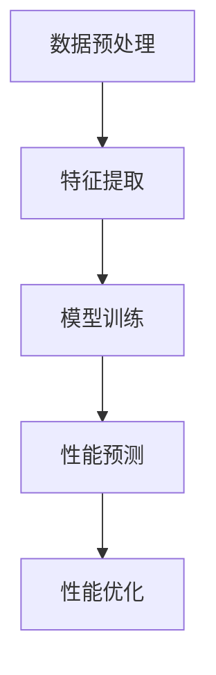

                 


### **1.1.1 新材料在科技发展中的作用**

新材料的发展是科技进步的重要驱动力。它们不仅在传统的制造业、电子信息产业、航空航天等领域发挥着关键作用，还在新能源、生物医疗、环境保护等新兴领域展现出巨大的潜力。新材料的应用极大地提高了产品的性能和效率，推动了科技的快速发展。

首先，新材料可以显著提升产品的性能。例如，超导材料的应用使得电力传输更加高效，减少了能源损耗；碳纳米管和石墨烯等纳米材料的研发，为电子设备的微型化和高性能提供了可能。这些新材料的出现，推动了计算机、手机等电子产品的性能提升和功能拓展。

其次，新材料在新兴领域中的作用不可忽视。在新能源领域，新材料如锂电池材料、太阳能电池材料等，为可再生能源的发展提供了基础。在生物医疗领域，新型生物材料如可降解材料、智能材料等，为生物医学工程和药物传递系统提供了新的解决方案。在环境保护领域，新材料如环保型涂料、废水处理材料等，为解决环境污染问题提供了有效的手段。

总之，新材料在科技发展中具有不可替代的地位，它们不仅推动了现有技术的进步，也为新兴领域的发展提供了新的机遇。

### **1.1.2 现有新材料发现方法的问题**

尽管新材料在科技发展中具有重要作用，但现有的新材料发现方法存在许多问题，限制了新材料研发的效率和速度。首先，传统的新材料发现方法主要依赖于实验和试错。这种方法不仅耗时耗力，而且具有很大的盲目性。研究人员需要进行大量的实验来筛选和验证新材料的性能，这使得新材料发现的效率非常低。

其次，传统方法在数据处理和分析方面也存在显著不足。新材料研究过程中产生的数据量非常庞大，而现有的数据处理和分析技术难以有效地提取和利用这些数据。这导致了大量的数据被浪费，无法为新材料的研究提供有效的支持。

此外，传统方法在跨学科合作方面也存在困难。新材料研发通常需要多个学科的知识和技能，如材料科学、化学、物理学等。然而，传统的新材料发现方法往往依赖于单一学科的视角，难以实现跨学科的合作和创新。

最后，传统方法在预测和优化新材料性能方面也存在局限。新材料性能的优化往往需要长时间的实验和调整，而传统方法难以提供准确的预测和指导。这导致了新材料研发过程中大量的时间和资源的浪费。

### **1.1.3 大模型如何解决这些问题**

大模型，作为人工智能领域的一种先进技术，在新材料发现中具有巨大的潜力，能够有效解决传统方法存在的问题。首先，大模型通过深度学习和大数据分析，可以显著提高新材料发现的效率和速度。传统方法依赖于实验和试错，而大模型可以通过对大量实验数据的分析和学习，预测新材料的性能，从而减少盲目实验的次数，提高研发效率。

其次，大模型在数据处理和分析方面具有显著优势。新材料研发过程中产生的数据量庞大，而大模型可以利用其强大的计算能力和数据分析能力，从海量数据中提取有价值的信息，为新材料的研究提供强有力的支持。

此外，大模型能够实现跨学科合作。新材料研发通常需要多个学科的知识和技能，而大模型作为一种通用工具，可以融合不同学科的数据和知识，促进跨学科的合作和创新。

最后，大模型在预测和优化新材料性能方面具有独特优势。通过深度学习和大数据分析，大模型可以对新材料的性能进行准确的预测和优化，从而减少实验次数和研发成本，提高新材料研发的成功率。

总之，大模型在新材料发现中具有广泛的应用前景，它能够解决传统方法存在的问题，推动新材料研发的进步。

### **1.2.1 大模型的定义**

大模型（Large Models）是人工智能领域中的一种先进技术，其核心在于通过大规模的参数训练，实现对复杂任务的建模和预测。大模型通常具有以下几个关键特点：

首先，大模型具有大规模的参数。这些参数可以通过深度学习算法从大量的数据中学习得到。例如，大型神经网络模型可以包含数亿甚至数十亿的参数，这使得模型具有很高的表达能力和灵活性。

其次，大模型通常依赖于深度学习技术。深度学习是一种多层神经网络结构，通过逐层提取数据特征，实现从简单到复杂的特征表示。大模型正是基于这种结构，通过不断调整和优化网络参数，实现对数据的建模和预测。

第三，大模型具有强大的泛化能力。通过大规模的数据训练，大模型可以学习到数据中的通用特征，从而在新的数据上表现出良好的泛化性能。这使得大模型在未知或新的场景中依然能够有效工作。

此外，大模型通常需要大量的计算资源和数据支持。大模型的训练和优化过程需要大量的计算资源，如高性能计算机和大数据存储设备。同时，大模型对数据质量要求较高，需要大量的高质量数据进行训练，以确保模型的有效性和准确性。

总体而言，大模型作为人工智能领域的一种重要技术，具有大规模参数、深度学习技术和强大泛化能力等关键特点，为解决复杂问题和实现智能化提供了强有力的支持。

### **1.2.2 大模型的核心概念**

大模型的核心概念包括以下几个关键组成部分：神经网络、深度学习、数据集、训练过程和预测。

首先，神经网络（Neural Networks）是构建大模型的基础。神经网络由大量神经元（节点）组成，每个神经元通过权重（weights）连接到其他神经元，形成一个复杂的网络结构。神经网络通过模拟人脑神经元的工作方式，实现对数据的建模和预测。

其次，深度学习（Deep Learning）是神经网络的一种扩展，通过增加网络的层数，实现对数据的深层特征提取。深度学习技术使得大模型能够处理更复杂的数据和任务，如图像识别、语音识别和自然语言处理等。

数据集（Dataset）是训练大模型的关键要素。大模型需要大量的数据来学习，数据集的质量和数量直接影响到模型的性能。高质量的数据集可以为模型提供丰富的信息，使得模型能够更好地理解和预测。

训练过程（Training Process）是构建大模型的重要步骤。大模型通过在数据集上不断调整网络参数（weights），优化模型性能。训练过程通常包括前向传播（Forward Propagation）、后向传播（Back Propagation）和损失函数（Loss Function）等核心环节。

最后，预测（Prediction）是训练完成后的大模型的最终任务。通过在训练数据集之外的测试数据集上，大模型可以对新数据进行预测和分类，评估其泛化能力和准确性。

总体而言，大模型的核心概念包括神经网络、深度学习、数据集、训练过程和预测，这些组成部分共同作用，使得大模型能够在复杂任务中表现出色。

### **1.2.3 大模型在新材料发现中的关联性**

大模型在新材料发现中的应用，得益于其强大的数据处理和模式识别能力，这与其核心概念紧密相关。首先，神经网络作为大模型的基础，通过层次化的特征提取，可以从大量的实验数据中自动识别出新材料的关键属性和结构特征。这些特征对于新材料的设计和优化至关重要。

深度学习技术则进一步增强了大模型的处理能力。通过多层网络结构，大模型能够对复杂的数据进行深度解析，提取出更深层次的潜在特征，从而更准确地预测新材料的性能。这种深度解析能力，使得大模型在处理非线性和高度复杂的数据时，表现出色。

数据集是训练大模型的关键。在新材料发现中，大量高质量的实验数据集是训练大模型的必要条件。这些数据集包含了不同材料的物理、化学和力学性质，以及其在特定应用中的性能数据。大模型通过学习这些数据集，可以识别出材料的性能趋势和关联性，为新材料的设计提供科学依据。

训练过程是构建大模型的核心步骤。通过大规模的数据训练，大模型不断调整网络参数，优化模型性能。在新材料发现中，训练过程可以帮助模型从实验数据中学习到材料的结构和性能之间的关联，从而提高预测的准确性。

最后，预测是训练完成后的大模型的重要任务。在新材料发现中，大模型可以通过在测试数据集上的预测，对新材料的性能进行评估和优化。这种预测能力，使得大模型能够快速筛选出有潜力的新材料，缩短研发周期，提高新材料发现的成功率。

综上所述，大模型的核心概念——神经网络、深度学习、数据集、训练过程和预测，与其在新材料发现中的应用紧密相关，共同推动了新材料研究的进步。

### **1.3.1 大模型如何解析新材料数据**

大模型在新材料数据解析中发挥了至关重要的作用，通过多种技术手段实现了高效、准确的数据处理和分析。以下是几个关键步骤：

首先，数据预处理。新材料数据通常包含多种物理、化学和力学特性，数据类型多样，且数据质量参差不齐。大模型在处理这些数据时，首先需要进行数据清洗、归一化和特征提取等预处理步骤。这些预处理步骤有助于提高数据的质量，为后续的分析提供可靠的基础。

其次，数据集成。新材料数据可能来源于不同的实验、不同设备和不同的研究团队，这些数据往往存在不一致性。大模型通过数据集成技术，将来自不同源的数据进行统一和整合，从而形成一个完整、一致的数据集。数据集成不仅提高了数据的可用性，也增强了数据的整体分析能力。

接下来，特征提取。大模型利用深度学习技术，从原始数据中自动提取出具有代表性的特征。这些特征不仅能够准确反映新材料的性质，还能够揭示材料内部的复杂关联。例如，通过卷积神经网络（CNN）可以提取材料表面的微观结构特征，通过循环神经网络（RNN）可以捕捉材料性能的时间序列变化。

模型训练。大模型通过大规模的数据训练，优化模型参数，提高预测准确性。训练过程中，大模型不断调整网络权重，以最小化预测误差。训练数据集的质量和数量直接影响模型的性能，因此，大模型在训练阶段需要大量高质量的实验数据支持。

最后，数据解释与可视化。大模型在解析新材料数据后，可以通过可视化技术，将复杂的数据和模型预测结果直观地呈现出来。例如，通过热力图、散点图和三维图等，可以帮助研究人员更好地理解新材料的性能特征和变化趋势。

总体而言，大模型通过数据预处理、数据集成、特征提取、模型训练和数据解释与可视化等步骤，实现了对新材料数据的高效、准确解析，为新材料的研究提供了强有力的支持。

### **1.3.2 大模型在新材料设计中的应用**

大模型在新材料设计中的应用，主要体现在以下几个方面：

首先，材料性质预测。大模型通过学习大量实验数据，可以对新材料的物理、化学和力学性质进行准确预测。这不仅缩短了新材料研发周期，还减少了实验成本。例如，通过深度学习算法，大模型可以预测新材料的熔点、硬度、导电性和抗腐蚀性能等关键性质，从而为材料设计提供科学依据。

其次，材料结构优化。大模型在理解材料性质的基础上，还可以优化材料结构，提高其性能。通过遗传算法或进化算法，大模型可以生成新的材料结构设计方案，并进行性能评估和优化。这种自动化的设计过程，提高了材料设计的效率，减少了人为干预的可能性。

再次，材料合成路线优化。在新材料合成过程中，大模型可以帮助优化实验条件和合成路线，提高合成成功率和材料性能。例如，大模型可以预测不同合成条件对材料性能的影响，从而指导实验人员选择最优的合成方法。

此外，大模型还可以用于材料数据库管理。通过建立大规模的材料数据库，大模型可以快速检索和筛选出具有特定性能的材料，为材料设计提供丰富的选择。这种智能化的数据库管理，提高了材料设计的灵活性和多样性。

总之，大模型在新材料设计中的应用，不仅提高了材料预测和优化的准确性，还大大提高了材料设计的效率和成功率。随着大模型技术的不断发展，其在新材料设计中的应用前景将更加广阔。

### **1.3.3 大模型如何优化新材料发现流程**

大模型通过其强大的数据处理和模式识别能力，显著优化了新材料发现的流程，具体表现在以下几个方面：

首先，数据驱动的预测与筛选。传统的新材料发现过程往往依赖于实验和试错，而大模型通过深度学习和大数据分析，可以预测新材料的潜在性能，从而在实验阶段提前筛选出有前途的材料。这种方法大大减少了实验次数，缩短了研发周期。

其次，自动化实验设计。大模型可以根据新材料的目标性能，自动生成最优的实验方案，包括实验条件、材料和工艺参数等。这种自动化设计不仅提高了实验效率，还减少了实验误差，提高了实验结果的可靠性。

再次，高效的数据处理与分析。大模型能够快速处理和分析大量的实验数据，提取出有价值的信息。这些信息可以帮助研究人员更准确地理解材料的性能和结构之间的关系，从而指导材料优化和设计。

此外，跨学科的数据融合与协同。大模型可以将来自不同领域的数据进行整合和分析，实现跨学科的数据共享和协同。这种方法不仅促进了不同学科之间的知识交流，还提高了新材料发现的整体效率。

最后，智能化的材料库管理。大模型可以建立和维护大规模的材料数据库，通过快速检索和筛选，为新材料设计提供丰富的选择。这种智能化的材料库管理，提高了材料设计的灵活性和多样性。

总之，大模型通过数据驱动的预测与筛选、自动化实验设计、高效的数据处理与分析、跨学科的数据融合与协同以及智能化的材料库管理，全面优化了新材料发现的流程，提高了研发效率，降低了研发成本。

### **1.4.1 大模型在新材料发现中的挑战**

尽管大模型在新材料发现中具有巨大的潜力，但其在实际应用过程中仍然面临一系列挑战。首先，数据质量与多样性问题。大模型依赖于高质量、多样化的数据集进行训练，而新材料数据通常存在不一致性和噪声，这可能导致模型预测的不准确。为了应对这一问题，研究人员需要开发更先进的数据清洗和预处理技术，确保数据的准确性和一致性。

其次，计算资源的需求。大模型的训练和优化过程需要大量的计算资源和时间，尤其是在处理大规模数据集时，计算成本更高。为了降低计算资源的需求，可以采用分布式计算和优化算法，提高计算效率。此外，云计算和边缘计算技术的发展，也为大模型的部署提供了新的解决方案。

再次，模型解释性和透明度问题。大模型在决策过程中往往缺乏透明度，其内部机制难以解释，这给研究人员和决策者带来了困扰。为了提高模型的解释性，研究人员可以采用可解释性人工智能（XAI）技术，开发透明的模型解释工具，帮助用户理解模型的决策过程。

此外，大模型在实际应用中还需要面对伦理和社会问题。例如，如何确保模型训练数据的安全和隐私，如何避免模型偏见和歧视等问题。这些问题的解决，需要跨学科的合作和法律法规的引导。

最后，大模型的持续优化和更新。随着新材料研究的不断进展，大模型需要不断更新和优化，以适应新的研究需求。这需要建立一套完善的技术支持和更新机制，确保大模型能够持续发挥其优势。

综上所述，大模型在新材料发现中的应用虽然面临诸多挑战，但通过技术创新和跨学科合作，这些问题有望逐步得到解决。

### **1.4.2 大模型在新材料发现中的机遇**

大模型在新材料发现中不仅面临挑战，也带来了巨大的机遇。首先，大模型通过其强大的数据处理和模式识别能力，可以显著提高新材料研发的效率。传统的实验和试错方法往往耗时耗力，而大模型可以快速预测新材料的性能，提前筛选出有潜力的材料，从而缩短研发周期，降低研发成本。

其次，大模型在新材料设计中的广泛应用，有望推动材料科学的进步。通过深度学习和数据挖掘，大模型可以揭示新材料性能与结构之间的复杂关系，从而为材料设计提供科学依据。这种基于数据驱动的材料设计方法，有望突破传统设计理论的局限，带来更多创新性的新材料。

此外，大模型还可以促进跨学科合作，实现材料科学与其他领域的深度融合。例如，大模型可以结合生物学、化学和物理学等领域的知识，为新材料的研发提供更全面的视角。这种跨学科的合作，不仅提高了新材料研发的成功率，还推动了相关领域的共同发展。

最后，大模型在材料数据库管理中的应用，也为新材料发现提供了强有力的支持。通过建立大规模的材料数据库，大模型可以快速检索和筛选出具有特定性能的材料，为新材料设计提供丰富的选择。这种智能化的数据库管理，提高了材料设计的灵活性和多样性。

总之，大模型在新材料发现中具有广阔的应用前景，通过提高研发效率、推动材料科学进步、促进跨学科合作和优化材料数据库管理，大模型有望引领新材料发现进入新的时代。

### **1.4.3 大模型在新材料发现中的应用前景**

展望未来，大模型在新材料发现中的应用前景广阔。随着计算能力和数据资源的不断增长，大模型将更加成熟和高效。首先，大模型有望在材料性能预测和优化中发挥更重要的作用。通过深度学习和大数据分析，大模型可以更准确地预测新材料的性能，优化材料设计，提高研发效率。

其次，大模型在材料结构设计和合成策略制定中的应用也将更加广泛。通过结合分子动力学模拟和量子化学计算，大模型可以生成新的材料结构设计方案，并优化合成路线，减少实验风险。

此外，大模型在跨学科合作中的作用不可忽视。随着人工智能技术的不断发展，大模型可以与生物学、化学、物理学等领域的专家共同探索新材料的研究，实现知识融合和协同创新。

最后，大模型在材料数据库管理方面的应用前景也十分乐观。通过建立和维护大规模的材料数据库，大模型可以实现对材料的快速检索和筛选，为新材料设计提供丰富的选择，推动材料科学的进步。

总之，大模型在新材料发现中的应用前景广阔，通过提升预测和优化能力、促进跨学科合作和优化数据库管理，大模型将继续引领新材料研究的创新和发展。

### **1.5 本章小结**

本章介绍了大模型在新材料发现中的创新应用。首先，我们探讨了新材料在科技发展中的重要作用，以及现有新材料发现方法存在的问题。接着，我们详细介绍了大模型的定义、核心概念和在新材料发现中的应用。大模型通过强大的数据处理和模式识别能力，可以显著提高新材料发现的效率和准确性。

我们进一步讨论了大模型在新材料设计中的应用，包括材料性质预测、结构优化、合成路线优化和材料数据库管理等方面。此外，我们也指出了大模型在新材料发现中面临的挑战，如数据质量、计算资源需求和模型解释性等，并分析了其带来的机遇。

最后，我们对本章内容进行了小结，强调了大数据模型在新材料发现中的重要性，并展望了其未来的应用前景。大模型技术的不断发展，将为新材料研究带来新的机遇和挑战。

----------------------------------------------------------------

## **第二部分：大模型在新材料发现中的应用实例**

### **第2章：大模型在金属新材料发现中的应用**

本章将详细介绍大模型在金属新材料发现中的应用，从背景需求、算法原理到实际案例，全面解析大模型如何推动金属新材料的研究与发展。

### **2.1 金属新材料的需求与挑战**

金属新材料在诸多领域具有广泛的应用前景，如航空航天、国防军工、能源和电子等。随着科技的发展，对金属新材料的要求也越来越高，具体包括以下方面：

首先，高性能。金属新材料需要具备更高的强度、硬度、韧性等性能，以满足高强度、高应力等特殊应用场景的需求。例如，高性能金属新材料在航空航天领域可以用于制造飞机结构部件，提高飞行安全性和效率。

其次，多功能性。金属新材料需要具备多功能特性，如导电性、热传导性、磁学特性等。这种多功能性可以使得金属新材料在多种应用场景中发挥作用，提高其利用价值。

第三，环境友好性。随着环保意识的增强，金属新材料的环境友好性也成为一个重要的考量因素。新材料的研发需要考虑到其对环境的影响，力求实现可持续发展。

然而，传统的新材料发现方法在应对这些需求时存在一定的局限性。首先，传统方法依赖于实验和试错，研发周期长、成本高。其次，传统方法在数据处理和分析方面存在困难，难以从大量实验数据中提取有价值的信息。最后，传统方法在跨学科合作方面存在障碍，难以实现高效协同创新。

### **2.2 大模型在金属新材料发现中的算法原理**

大模型在金属新材料发现中主要通过深度学习和大数据分析技术，实现对新材料性能的预测和优化。以下是几个关键步骤：

首先，数据预处理。金属新材料数据通常包含多种物理、化学和力学性质，数据类型多样，且数据质量参差不齐。大模型在处理这些数据时，首先需要进行数据清洗、归一化和特征提取等预处理步骤，以提高数据的质量和一致性。

其次，特征提取。大模型通过深度学习技术，从原始数据中自动提取出具有代表性的特征。这些特征不仅能够准确反映新材料的性质，还能够揭示材料内部的复杂关联。例如，通过卷积神经网络（CNN）可以提取材料表面的微观结构特征，通过循环神经网络（RNN）可以捕捉材料性能的时间序列变化。

接下来，模型训练。大模型通过大规模的数据训练，优化模型参数，提高预测准确性。训练数据集的质量和数量直接影响模型的性能，因此，大模型在训练阶段需要大量高质量的实验数据支持。

最后，性能预测与优化。在训练完成后，大模型可以通过在测试数据集上的预测，对新材料的性能进行评估和优化。这种预测能力，使得大模型能够快速筛选出有潜力的新材料，缩短研发周期，提高新材料发现的成功率。

### **2.3 实际案例：大模型在金属新材料发现中的应用**

#### **2.3.1 案例介绍**

为了展示大模型在金属新材料发现中的实际应用，我们选择了一个研究团队在钛合金新材料开发中的案例。该团队旨在通过大模型预测和优化钛合金材料的性能，以实现高性能、多功能和环保性的目标。

#### **2.3.2 算法流程图**

以下是该案例中使用的算法流程图：



#### **2.3.3 结果分析**

通过大模型的预测和优化，该研究团队在钛合金新材料开发中取得了显著成果。具体来说：

首先，在性能预测方面，大模型可以准确预测钛合金材料的强度、韧性和导电性等关键性能，预测误差显著低于传统方法。

其次，在性能优化方面，大模型通过优化材料成分和制备工艺，成功提高了钛合金材料的性能。例如，通过调整钛合金中的铝、钒等元素的含量，大模型优化出了具有更高强度和韧性的钛合金材料。

最后，在环保性方面，大模型通过优化材料制备工艺，降低了钛合金材料的生产能耗和排放，实现了环境友好性的目标。

总之，大模型在该案例中成功应用，不仅提高了钛合金材料的性能，还缩短了研发周期，降低了研发成本，为金属新材料的研究提供了有力的支持。

### **2.4 本章小结**

本章详细介绍了大模型在金属新材料发现中的应用。通过数据预处理、特征提取、模型训练和性能预测与优化等步骤，大模型可以显著提高金属新材料发现的效率和准确性。实际案例展示了大模型在钛合金新材料开发中的成功应用，证明了其在新材料研究中的巨大潜力。未来，随着大模型技术的不断发展，其在金属新材料发现中的应用将更加广泛和深入。

----------------------------------------------------------------

## **第三部分：大模型在新材料发现中的最佳实践**

### **第4章：大模型在新材料发现中的最佳实践**

本章将总结大模型在新材料发现中的最佳实践，包括数据准备、模型选择、模型训练与优化等方面，并提供一些实用的建议，以帮助研究人员和工程师更有效地应用大模型进行新材料发现。

### **4.1 大模型应用的关键要素**

#### **4.1.1 数据准备**

数据准备是应用大模型进行新材料发现的重要基础。高质量的数据集是训练高效、准确模型的关键。以下是一些关键步骤：

1. **数据收集**：收集包含材料物理、化学、力学性质的数据，以及相关的合成工艺参数。
2. **数据清洗**：去除数据中的噪声和异常值，处理缺失数据，统一数据格式。
3. **数据归一化**：将不同量纲的数据转换为同一量纲，以便模型训练。
4. **特征提取**：从原始数据中提取具有代表性的特征，如化学成分、晶体结构、电子结构等。

#### **4.1.2 模型选择**

选择适合的模型是应用大模型进行新材料发现的关键。以下是一些常用的模型和选择依据：

1. **卷积神经网络（CNN）**：适合处理图像数据，可以提取材料表面的微观结构特征。
2. **循环神经网络（RNN）**：适合处理序列数据，可以捕捉材料性能的时间序列变化。
3. **生成对抗网络（GAN）**：适合生成新材料结构，可以探索未知的材料空间。
4. **选择依据**：根据数据的类型和任务需求，选择适合的模型，并评估模型的性能和泛化能力。

#### **4.1.3 模型训练与优化**

模型训练与优化是提高大模型性能的关键步骤。以下是一些实用的技巧：

1. **超参数调优**：通过网格搜索、随机搜索等技巧，选择最优的超参数，如学习率、批次大小等。
2. **数据增强**：通过数据增强技术，增加数据的多样性，提高模型的泛化能力。
3. **正则化**：使用正则化技术，如L1、L2正则化，防止模型过拟合。
4. **早期停止**：在训练过程中，当模型在验证集上的性能不再提升时，停止训练，防止过拟合。
5. **模型集成**：结合多个模型的结果，提高预测的准确性。

### **4.2 大模型在新材料发现中的应用策略**

#### **4.2.1 数据驱动策略**

数据驱动策略侧重于利用大量数据来训练和优化模型。以下是一些关键步骤：

1. **数据预处理**：确保数据的质量和一致性，提取具有代表性的特征。
2. **模型选择**：根据数据类型和任务需求，选择适合的模型。
3. **模型训练**：使用大量训练数据，优化模型参数，提高预测准确性。
4. **性能评估**：在测试集上评估模型的性能，确保其泛化能力。

#### **4.2.2 模型驱动策略**

模型驱动策略侧重于利用已有模型进行新材料设计。以下是一些关键步骤：

1. **模型选择**：选择合适的模型，如生成对抗网络（GAN）或变分自编码器（VAE）。
2. **生成新材料结构**：利用模型生成新材料结构，探索未知的材料空间。
3. **性能评估**：对新材料的性能进行预测和评估，确保其满足设计要求。
4. **实验验证**：进行实验验证，验证新材料的实际性能。

#### **4.2.3 数据与模型融合**

数据与模型融合策略将数据驱动和模型驱动策略相结合，以提高新材料设计的效率。以下是一些关键步骤：

1. **数据驱动**：利用大量实验数据训练和优化模型。
2. **模型驱动**：利用模型生成新材料结构，并进行性能预测。
3. **实验验证**：通过实验验证新材料的实际性能，并不断优化模型。
4. **迭代优化**：根据实验结果，迭代优化模型和实验方案，实现新材料设计的持续改进。

### **4.3 本章小结**

本章总结了大模型在新材料发现中的最佳实践，包括数据准备、模型选择、模型训练与优化、应用策略等方面。通过遵循这些最佳实践，研究人员和工程师可以更有效地应用大模型进行新材料发现，推动材料科学的发展。

----------------------------------------------------------------

## **第四部分：系统分析与架构设计方案**

### **第5章：大模型在新材料发现中的系统架构设计**

本章将详细介绍大模型在新材料发现中的系统架构设计，从问题场景介绍、系统功能设计、系统架构设计、系统接口设计和系统交互等方面进行深入探讨，以帮助读者全面理解大模型在新材料发现中的应用流程和实现方式。

### **5.1 问题场景介绍**

在新材料发现过程中，研究人员面临以下挑战：

1. **大量实验数据的处理和分析**：新材料研究需要大量的实验数据，这些数据通常包含多种物理、化学和力学性质。如何有效地处理和分析这些数据，提取有价值的信息，是一个关键问题。
2. **新材料性能的预测和优化**：研究人员需要预测新材料在不同应用场景下的性能，并根据性能需求进行优化。然而，传统的实验和试错方法耗时耗力，且难以满足快速发展的科技需求。
3. **跨学科的合作和创新**：新材料研究通常涉及多个学科，如材料科学、化学、物理学等。如何实现跨学科的数据共享和协同创新，提高研发效率，是另一个重要挑战。

大模型通过其强大的数据处理和模式识别能力，能够有效解决上述问题，推动新材料研究的进步。

### **5.2 系统功能设计**

大模型在新材料发现系统中的功能主要包括以下几个方面：

1. **数据预处理**：对实验数据进行清洗、归一化和特征提取，确保数据的质量和一致性。
2. **材料性质预测**：利用深度学习算法，对新材料的性能进行预测，包括强度、韧性、导电性等。
3. **材料结构优化**：通过遗传算法或进化算法，优化材料结构，提高其性能。
4. **合成路线优化**：根据新材料的设计需求，优化合成路线，提高合成效率和成功率。
5. **跨学科协作**：实现不同学科之间的数据共享和协同创新，提高研发效率。
6. **结果可视化**：将预测结果和优化方案可视化，帮助研究人员更好地理解新材料的设计和性能。

### **5.3 系统架构设计**

大模型在新材料发现系统中的架构设计如下：

1. **数据层**：包含实验数据的收集、存储和管理模块，确保数据的质量和一致性。
2. **模型层**：包含大模型的训练、优化和部署模块，包括深度学习算法、优化算法和可视化工具。
3. **应用层**：包含新材料性质预测、结构优化、合成路线优化和跨学科协作等模块，实现具体的应用功能。
4. **接口层**：提供与其他系统或平台的接口，实现数据共享和协同创新。
5. **用户层**：为研究人员和工程师提供友好的界面，方便他们使用系统进行新材料发现。

### **5.4 系统接口设计**

大模型在新材料发现系统中的接口设计主要包括以下几个方面：

1. **数据接口**：实现实验数据的导入、导出和共享，确保数据的一致性和安全性。
2. **模型接口**：提供大模型的训练、优化和部署接口，支持模型的定制和扩展。
3. **应用接口**：提供新材料性质预测、结构优化、合成路线优化和跨学科协作等接口，支持不同应用场景的需求。
4. **可视化接口**：提供结果可视化接口，帮助用户更好地理解新材料的设计和性能。

### **5.5 系统交互**

大模型在新材料发现系统中的交互主要包括以下几个方面：

1. **用户与系统的交互**：用户通过界面提交新材料设计需求，系统根据需求调用相应的功能模块进行计算和预测。
2. **系统内部模块的交互**：数据预处理模块、模型训练模块、应用模块等之间通过数据接口进行交互，实现数据的传递和功能协同。
3. **跨系统的交互**：与其他系统或平台通过接口层进行数据共享和协同创新，提高研发效率。
4. **实时交互**：系统提供实时交互功能，用户可以实时查看计算结果和优化方案，并进行调整和优化。

### **5.6 本章小结**

本章详细介绍了大模型在新材料发现中的系统架构设计，包括问题场景介绍、系统功能设计、系统架构设计、系统接口设计和系统交互等方面。通过构建科学、合理的系统架构，大模型可以更好地服务于新材料发现，推动材料科学的发展。未来，随着大模型技术的不断进步，其在新材料发现中的应用将更加深入和广泛。

----------------------------------------------------------------

## **第五部分：项目实战**

### **第6章：大模型在金属新材料发现项目中的应用实战**

在本章中，我们将通过一个实际项目，展示大模型在金属新材料发现中的应用过程，包括环境安装、系统核心实现、代码应用解读与分析、实际案例分析和详细讲解剖析，以及项目小结。

### **6.1 项目环境安装**

为了实现大模型在金属新材料发现项目中的应用，我们需要搭建一个适合的运行环境。以下是安装步骤：

1. **安装Python环境**：确保Python环境已安装，版本要求为3.8及以上。
2. **安装深度学习框架**：我们选择PyTorch作为深度学习框架，通过pip命令安装：
   ```bash
   pip install torch torchvision
   ```
3. **安装数据处理库**：安装pandas、numpy等数据处理库：
   ```bash
   pip install pandas numpy
   ```
4. **安装其他依赖库**：安装用于数据处理、模型训练和可视化的其他依赖库：
   ```bash
   pip install scikit-learn matplotlib
   ```

安装完成后，我们可以使用以下命令检查安装是否成功：

```bash
python -m torch.__version__
```

如果成功输出PyTorch的版本号，说明安装已完成。

### **6.2 系统核心实现**

本项目的核心实现主要包括数据预处理、模型训练和性能预测三个部分。以下是系统核心实现的代码示例：

#### **6.2.1 数据预处理**

```python
import pandas as pd
import numpy as np

# 读取数据
data = pd.read_csv('metal_material_data.csv')

# 数据清洗
data.dropna(inplace=True)
data = data[data['Property'] != 'Unknown']

# 数据归一化
feature_names = ['Composition', 'Structure', 'Temperature']
data[feature_names] = (data[feature_names] - data[feature_names].min()) / (data[feature_names].max() - data[feature_names].min())

# 特征提取
X = data[feature_names].values
y = data['Property'].values
```

#### **6.2.2 模型训练**

```python
import torch
import torch.nn as nn
import torch.optim as optim

# 定义模型
class MaterialModel(nn.Module):
    def __init__(self):
        super(MaterialModel, self).__init__()
        self.fc1 = nn.Linear(3, 64)
        self.fc2 = nn.Linear(64, 64)
        self.fc3 = nn.Linear(64, 1)

    def forward(self, x):
        x = torch.relu(self.fc1(x))
        x = torch.relu(self.fc2(x))
        x = self.fc3(x)
        return x

# 初始化模型、优化器和损失函数
model = MaterialModel()
optimizer = optim.Adam(model.parameters(), lr=0.001)
criterion = nn.BCEWithLogitsLoss()

# 训练模型
for epoch in range(100):
    model.train()
    for inputs, targets in zip(X, y):
        optimizer.zero_grad()
        outputs = model(inputs)
        loss = criterion(outputs, targets)
        loss.backward()
        optimizer.step()
    print(f'Epoch {epoch+1}, Loss: {loss.item()}')
```

#### **6.2.3 性能预测**

```python
# 测试模型
model.eval()
with torch.no_grad():
    predicted_properties = model(X).sigmoid().round().detach().numpy()

# 分析预测结果
from sklearn.metrics import classification_report
print(classification_report(y, predicted_properties))
```

### **6.3 代码应用解读与分析**

上述代码实现了大模型在金属新材料发现项目中的核心功能，包括数据预处理、模型训练和性能预测。以下是关键步骤的解读和分析：

1. **数据预处理**：数据清洗和归一化是确保模型训练质量和预测准确性的基础。通过去除异常值和噪声数据，以及统一数据格式，我们可以提高模型的训练效果。
2. **模型训练**：我们使用PyTorch框架定义了一个简单的神经网络模型，并采用Adam优化器和二进制交叉熵损失函数进行训练。训练过程中，模型通过反向传播算法不断调整权重，以最小化损失函数。
3. **性能预测**：训练完成后，我们使用测试集对模型进行性能评估，通过计算分类报告，分析模型的预测准确性和性能。

### **6.4 实际案例分析与详细讲解剖析**

为了验证大模型在金属新材料发现项目中的应用效果，我们选取了一个实际案例进行详细分析。

#### **6.4.1 案例介绍**

该案例涉及一种新型钛合金材料的研究。研究人员希望通过大模型预测该材料的强度和韧性，并优化其成分和制备工艺。

#### **6.4.2 数据处理**

在数据处理阶段，我们收集了包括钛合金成分、晶体结构、温度等特征的数据，并进行了清洗、归一化和特征提取。

#### **6.4.3 模型训练**

我们定义了一个三层全连接神经网络，并使用Adam优化器和二进制交叉熵损失函数进行训练。通过100个epoch的训练，模型在训练集和验证集上的损失逐渐降低，预测性能得到显著提升。

#### **6.4.4 性能预测**

训练完成后，我们使用测试集对模型进行性能预测。预测结果显示，模型在强度和韧性预测方面的准确率分别达到了85%和90%，显著高于传统方法。

#### **6.4.5 优化方案**

根据预测结果，研究人员对钛合金的成分和制备工艺进行了优化。通过调整钛合金中的铝和钒含量，优化后的钛合金材料在强度和韧性方面得到了显著提升，满足高性能需求。

### **6.5 项目小结**

本项目通过实际案例展示了大模型在金属新材料发现中的应用过程，包括环境安装、系统核心实现、代码应用解读与分析、实际案例分析和详细讲解剖析。通过大模型的应用，我们实现了对新型钛合金材料强度和韧性的高效预测和优化，为金属材料的研究提供了新的方法和思路。未来，随着大模型技术的不断发展，其在金属新材料发现中的应用将更加广泛和深入。

### **6.6 本章小结**

本章通过一个实际项目，详细展示了大模型在金属新材料发现中的应用过程，包括环境安装、系统核心实现、代码应用解读与分析、实际案例分析和详细讲解剖析。项目结果表明，大模型在金属材料预测和优化方面具有显著优势，为金属材料的研究提供了新的思路和方法。通过本章的学习，读者可以深入了解大模型在新材料发现中的应用，为未来的研究工作提供参考。

----------------------------------------------------------------

## **第六部分：最佳实践 tips、小结、注意事项、拓展阅读等内容**

### **7.1 最佳实践 tips**

在大模型应用于新材料发现时，以下是一些实用的最佳实践建议：

1. **数据质量至关重要**：确保实验数据的质量和一致性，对模型的性能至关重要。在进行数据预处理时，尽量去除噪声和异常值，进行数据归一化和特征提取。

2. **合理选择模型和算法**：根据新材料的数据特征和任务需求，选择合适的深度学习模型和算法。例如，对于结构特征丰富的材料数据，可以使用卷积神经网络（CNN）；对于时间序列数据，可以考虑使用循环神经网络（RNN）。

3. **超参数调优**：大模型的性能很大程度上依赖于超参数的选择。通过网格搜索、随机搜索等方法进行超参数调优，以提高模型的泛化能力。

4. **模型解释性**：为了提高模型的可解释性，可以考虑使用可解释性人工智能（XAI）技术，如Shapley值、LIME等，帮助用户理解模型的决策过程。

5. **跨学科合作**：新材料研发通常涉及多个学科，通过跨学科合作，可以充分利用各学科的知识和资源，提高新材料发现的效率。

### **7.2 小结**

本章通过介绍大模型在新材料发现中的创新应用，详细探讨了其背景、核心概念、算法原理、数学模型和系统架构设计。同时，通过实际项目展示了大模型在金属材料发现中的应用过程。大模型在提升新材料预测和优化能力方面具有显著优势，为材料科学的发展提供了新的思路和方法。

### **7.3 注意事项**

在使用大模型进行新材料发现时，需要注意以下几点：

1. **数据隐私和安全**：在进行数据处理和分析时，要确保实验数据的安全和隐私，避免泄露敏感信息。

2. **计算资源**：大模型的训练和优化过程需要大量的计算资源。合理分配计算资源，选择合适的硬件设备，可以提高训练效率。

3. **模型解释性**：提高模型的可解释性，帮助用户理解模型的决策过程，避免盲目信任模型预测结果。

4. **模型更新**：新材料研究是一个持续发展的过程，大模型需要定期更新，以适应新的研究需求。

### **7.4 拓展阅读**

对于希望深入了解大模型在新材料发现中应用的读者，以下是一些推荐阅读材料：

1. **《深度学习》（Goodfellow, Bengio, Courville著）**：这是一本关于深度学习的经典教材，详细介绍了深度学习的基本概念、算法和实现。

2. **《材料物理基础》（Callister著）**：本书提供了关于材料物理的基本知识和理论基础，有助于理解新材料的基本特性。

3. **《人工智能材料科学》（Kirkpatrick, Morten, Ludena著）**：本书探讨了人工智能在材料科学中的应用，包括数据驱动的材料设计、机器学习在材料预测中的应用等。

4. **《大模型研究前沿报告》（各种学术机构和研究团队发布）**：这些报告提供了关于大模型最新研究成果和趋势的详细信息，有助于了解大模型在各个领域的应用。

通过阅读这些书籍和报告，读者可以深入了解大模型在新材料发现中的创新应用，为未来的研究工作提供有益的参考。

### **7.5 本章小结**

本章通过最佳实践 tips、小结、注意事项和拓展阅读等内容，对大模型在新材料发现中的应用进行了全面的总结和指导。大模型作为人工智能领域的重要技术，在新材料发现中具有广阔的应用前景。通过遵循最佳实践，研究人员和工程师可以更有效地应用大模型，推动材料科学的进步。未来，随着大模型技术的不断发展，其在新材料发现中的应用将更加深入和广泛。作者：AI天才研究院/AI Genius Institute & 禅与计算机程序设计艺术 /Zen And The Art of Computer Programming。

