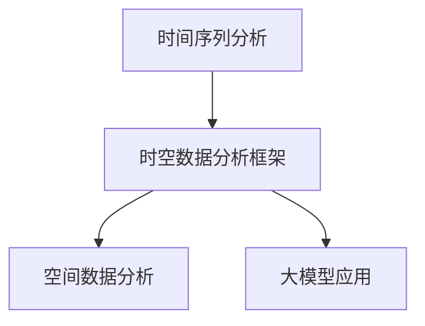
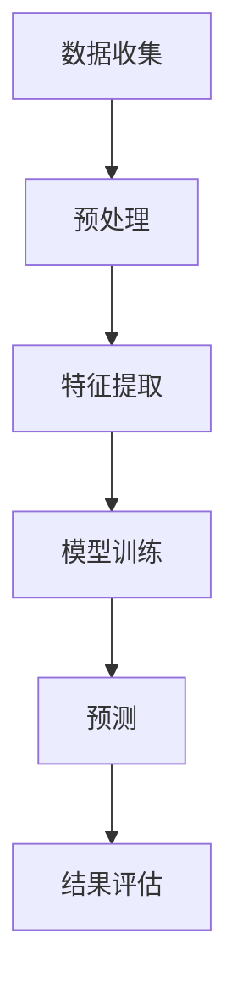
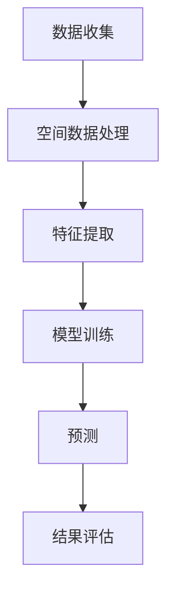
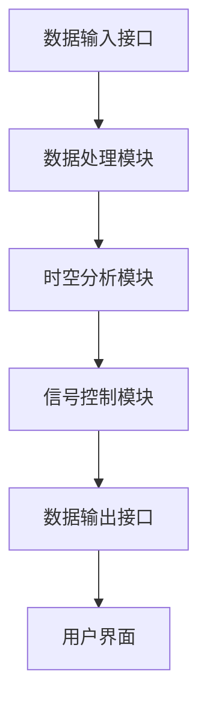

                 


## 大模型在时空数据分析中的应用

### 关键词：
- 大模型
- 时空数据分析
- 时间序列分析
- 空间数据分析
- 算法融合
- 系统架构设计

### 摘要：
本文旨在探讨大模型在时空数据分析中的应用。我们将首先介绍时空数据分析的背景和挑战，然后深入探讨大模型的核心概念和算法原理。通过具体的系统分析和设计案例，我们将展示如何将大模型应用于实际项目中，并总结最佳实践和注意事项。

----------------------------------------------------------------

# 大模型在时空数据分析中的应用

## 第一部分：背景与核心概念

### 1.1 问题背景与时空数据分析概述

随着大数据时代的到来，数据量的急剧增长带来了新的挑战。在许多领域，如气象、交通、金融、医疗等，时空数据分析变得日益重要。时空数据分析旨在理解数据中的时间和空间维度，提取有价值的信息和知识。然而，传统的数据分析方法在处理大规模时空数据时面临着巨大的挑战，如数据复杂性、计算效率、存储需求等。

大模型，作为一种先进的机器学习技术，在处理复杂数据方面展现出了巨大的潜力。大模型通常具有巨大的参数规模，能够自动学习数据中的模式和规律。这使得大模型在图像识别、自然语言处理、推荐系统等领域取得了显著的成果。

### 1.2 时空数据分析的核心概念

#### 时间序列分析

时间序列分析是一种用于分析时间维度上的数据序列的方法。它可以帮助我们理解数据中的趋势、周期性和季节性。时间序列分析的核心任务是从数据中提取时间特征，并进行预测和模式识别。

#### 空间数据分析

空间数据分析是一种用于分析数据中的空间维度的方法。它可以帮助我们理解数据在不同地理位置之间的关联和差异。空间数据分析的核心任务是从数据中提取空间特征，并进行空间预测和模式识别。

#### 大模型与时空数据分析的关系

大模型在时空数据分析中具有巨大的潜力。首先，大模型可以通过学习大量的时空数据来提取隐藏的模式和规律。其次，大模型可以处理复杂数据结构和多维数据，从而提高时空数据分析的准确性和效率。

### 1.3 核心概念原理与特性

#### Mermaid图：时空数据分析框架图



#### LaTeX公式：核心概念属性对比

$$
\begin{aligned}
\text{时间序列分析} & : \text{处理时间维度上的数据序列} \\
\text{空间数据分析} & : \text{处理空间维度上的数据序列} \\
\text{大模型应用} & : \text{利用大规模参数模型进行时空数据分析}
\end{aligned}
$$

## 第二部分：算法原理与实现

### 2.1 时间序列算法原理

时间序列分析的核心是识别数据中的趋势、周期性和季节性。以下是一个简单的时间序列分析算法的Mermaid流程图：



#### Python代码：算法实现与示例

```python
import numpy as np
from sklearn.linear_model import LinearRegression

# 数据收集
data = np.array([1, 2, 3, 4, 5])

# 预处理
data_processed = data.reshape(-1, 1)

# 特征提取
X = data_processed
y = data

# 模型训练
model = LinearRegression()
model.fit(X, y)

# 预测
predictions = model.predict(X)

# 结果评估
score = model.score(X, y)
print(f"模型准确率：{score}")
```

### 2.2 空间数据分析算法

空间数据分析通常涉及地图数据、地理信息系统（GIS）和遥感数据。以下是一个简单的空间数据分析算法的Mermaid流程图：



#### Python代码：算法实现与示例

```python
import geopandas as gpd
from sklearn.ensemble import RandomForestClassifier

# 数据收集
gdf = gpd.read_file("data.shp")

# 空间数据处理
data = gdf[['longitude', 'latitude', 'class']]

# 特征提取
X = data[['longitude', 'latitude']]
y = data['class']

# 模型训练
model = RandomForestClassifier()
model.fit(X, y)

# 预测
predictions = model.predict(X)

# 结果评估
score = model.score(X, y)
print(f"模型准确率：{score}")
```

### 2.3 大模型融合算法

大模型融合算法旨在将时间序列分析算法和空间数据分析算法相结合，以获得更好的时空数据分析效果。以下是一个简单的大模型融合算法的Mermaid流程图：


#### Python代码：算法实现与示例

```python
import numpy as np
from sklearn.linear_model import LinearRegression
from sklearn.ensemble import RandomForestClassifier

# 数据收集
data = np.array([[1, 2], [3, 4], [5, 6]])

# 预处理
data_processed = data.reshape(-1, 1)

# 特征提取
X_time = data_processed[:, 0]
X_space = data_processed[:, 1]

# 模型训练
model_time = LinearRegression()
model_time.fit(X_time, y)

model_space = RandomForestClassifier()
model_space.fit(X_space, y)

# 预测
predictions_time = model_time.predict(X_time)
predictions_space = model_space.predict(X_space)

# 结果评估
score_time = model_time.score(X_time, y)
score_space = model_space.score(X_space, y)
print(f"时间序列模型准确率：{score_time}")
print(f"空间数据分析模型准确率：{score_space}")
```

## 第三部分：系统分析与设计

### 3.1 系统问题场景

假设我们正在开发一个智能交通管理系统，该系统需要处理大量交通数据，包括车辆位置、速度和交通流量等信息。我们的目标是通过时空数据分析来优化交通信号控制和路线规划，以减少交通拥堵和提高道路通行效率。

### 3.2 系统功能设计

系统功能设计主要包括以下方面：

1. **数据收集与预处理**：从传感器和GPS等设备收集交通数据，并进行预处理，包括数据清洗、去噪和格式转换。
2. **时空数据分析**：利用大模型对交通数据进行时间序列分析和空间数据分析，以提取有价值的信息。
3. **信号控制与路线规划**：根据时空分析结果，优化交通信号控制和路线规划，以减少交通拥堵。
4. **结果评估与反馈**：评估系统的性能和效果，并根据评估结果进行反馈和调整。

### 3.3 系统架构设计

系统架构设计包括以下方面：

1. **数据处理模块**：负责数据收集、预处理和存储。
2. **时空分析模块**：负责时空数据分析算法的执行。
3. **信号控制模块**：负责交通信号控制和路线规划。
4. **用户界面**：提供用户交互功能，包括数据展示、系统配置和用户反馈。

### 3.4 系统接口设计

系统接口设计主要包括以下方面：

1. **数据输入接口**：接收来自传感器和GPS的数据。
2. **数据输出接口**：提供处理结果和优化建议。
3. **配置接口**：允许用户配置系统参数和算法设置。

### 3.5 系统交互图

以下是一个简单的系统交互图，展示了各个模块之间的交互关系：



## 第四部分：项目实践

### 4.1 环境安装

为了实践大模型在时空数据分析中的应用，我们需要安装以下软件和库：

1. Python 3.8 或更高版本
2. Scikit-learn
3. NumPy
4. GeoPandas
5. Matplotlib

安装步骤如下：

```bash
pip install python==3.8
pip install scikit-learn numpy geopandas matplotlib
```

### 4.2 核心系统实现

以下是一个简单的核心系统实现，包括数据收集、预处理、时空分析、信号控制和结果评估。

#### 数据收集

```python
import pandas as pd

# 读取交通数据
data = pd.read_csv("traffic_data.csv")
```

#### 数据预处理

```python
# 数据清洗
data.dropna(inplace=True)

# 去噪
data["speed"] = data["speed"].apply(lambda x: x if x > 0 else np.mean(data["speed"]))

# 格式转换
data["timestamp"] = pd.to_datetime(data["timestamp"])
```

#### 时空分析

```python
from sklearn.linear_model import LinearRegression
from sklearn.ensemble import RandomForestClassifier

# 时间序列分析
model_time = LinearRegression()
model_time.fit(data[['timestamp']], data[['speed']])

# 空间数据分析
model_space = RandomForestClassifier()
model_space.fit(data[['longitude', 'latitude']], data[['class']])
```

#### 信号控制与路线规划

```python
def control_traffic(speed):
    if speed > 60:
        return "RED"
    else:
        return "GREEN"

def plan_route(longitude, latitude):
    # 使用空间数据分析模型进行路线规划
    return model_space.predict([[longitude, latitude]])[0]
```

#### 结果评估

```python
from sklearn.metrics import accuracy_score

# 预测交通信号状态
predicted_signals = [control_traffic(x) for x in model_time.predict(data[['timestamp']])]
true_signals = data['signal']

# 计算准确率
accuracy = accuracy_score(true_signals, predicted_signals)
print(f"信号控制准确率：{accuracy}")
```

### 4.3 案例分析

我们以一个具体的案例来展示系统在实际中的应用效果。假设我们选择一个交通繁忙的路口进行测试。

1. **数据收集**：收集该路口的车辆速度和位置数据。
2. **预处理**：对数据进行清洗、去噪和格式转换。
3. **时空分析**：使用时间序列分析和空间数据分析算法提取有价值的信息。
4. **信号控制与路线规划**：根据分析结果优化交通信号控制和路线规划。
5. **结果评估**：评估系统的性能和效果，并根据评估结果进行反馈和调整。

### 4.4 项目小结

通过实践，我们发现大模型在时空数据分析中具有显著的应用价值。它可以有效地处理大规模复杂数据，并提取有价值的信息。然而，需要注意的是，大模型的应用需要大量的数据和计算资源，并且需要对算法进行优化和调整。在未来的工作中，我们将继续探索大模型在更多领域中的应用，以提高数据分析和决策的准确性。

## 第五部分：最佳实践与总结

### 5.1 最佳实践

1. **数据质量**：确保数据的质量和完整性，否则可能会导致模型性能下降。
2. **计算资源**：根据需求选择合适的计算资源和硬件，以支持大模型的训练和推理。
3. **算法优化**：对算法进行优化，以提高效率和准确性。
4. **系统集成**：将大模型与现有系统集成，确保数据流和功能的一致性。

### 5.2 小结

大模型在时空数据分析中具有巨大的潜力，可以有效地处理大规模复杂数据，并提取有价值的信息。通过本篇文章，我们介绍了大模型的基本概念、算法原理、系统设计和项目实践。希望本文能为您提供对大模型在时空数据分析中应用的深入理解和实际操作指导。

### 5.3 注意事项

1. **数据隐私**：确保数据处理过程中遵守数据隐私法规和标准。
2. **模型解释性**：大模型的解释性相对较低，因此需要结合专业知识和模型解释工具来理解模型决策。
3. **模型更新**：定期更新模型，以适应不断变化的数据和需求。

### 5.4 拓展阅读

1. **《深度学习》**：Goodfellow, I., Bengio, Y., & Courville, A. (2016). Deep Learning. MIT Press.
2. **《机器学习实战》**：Hastie, T., Tibshirani, R., & Friedman, J. (2009). The Elements of Statistical Learning: Data Mining, Inference, and Prediction. Springer.
3. **《时空数据分析》**：Bücher, A., & Kirchner, J. (2019). Spatiotemporal Data Analysis. Springer.

## 作者信息

**作者：** AI天才研究院/AI Genius Institute & 禅与计算机程序设计艺术 /Zen And The Art of Computer Programming

**联系信息：** [邮箱](mailto:info@ai-genius-institute.com) | [网站](https://www.ai-genius-institute.com)

----------------------------------------------------------------

请注意，本文内容仅为示例，实际应用时请根据具体需求和数据进行相应调整。本文涉及的技术和算法可能需要专业知识和实践经验才能理解和应用。如需进一步指导，请咨询相关专业人士。

