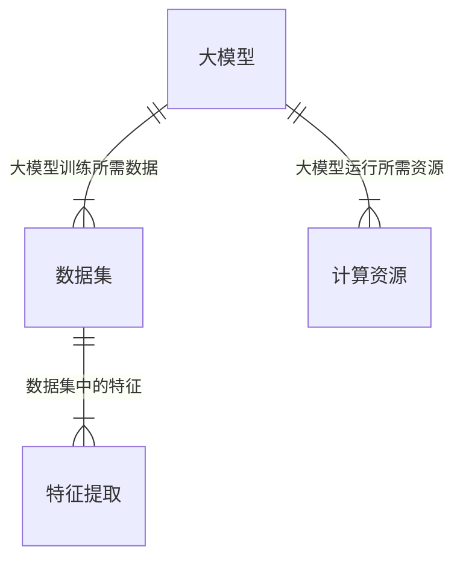
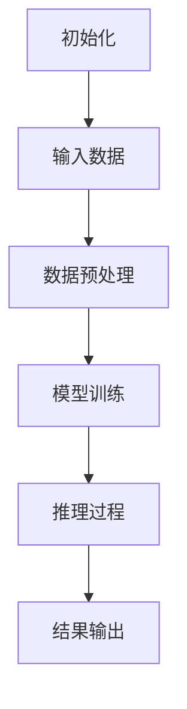
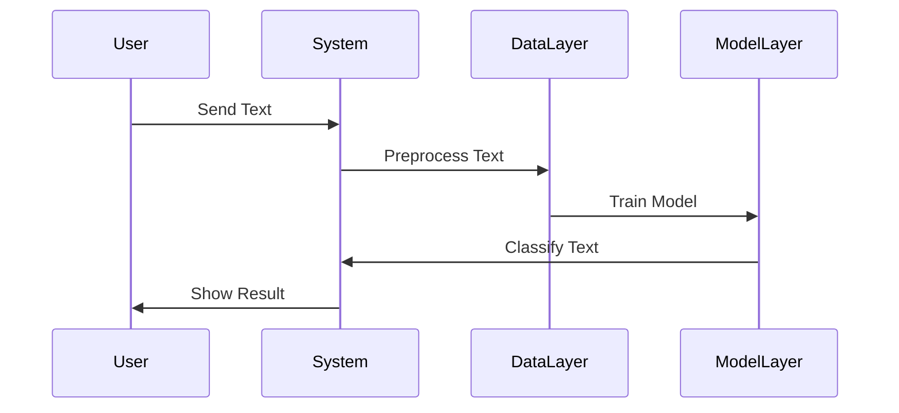

                 

# 大模型推理能力的提升策略

> 关键词：大模型、推理能力、算法优化、系统架构设计

> 摘要：本文将深入探讨大模型推理能力的提升策略，从问题背景、核心概念、算法原理、系统分析与架构设计等多个方面进行分析和讲解，旨在为读者提供一套全面、系统、实用的大模型推理能力提升方案。

----------------------------------------------------------------

## 第一部分：问题背景与核心概念

### 第1章：问题背景介绍

#### 1.1.1 问题背景

在大数据时代，深度学习技术的快速发展使得大模型成为解决复杂问题的重要工具。然而，大模型的推理能力在大规模应用中面临着诸多挑战。提升大模型推理能力不仅能够提高应用的效率和准确性，还能够拓展大模型的应用范围。

首先，推理能力在大模型中的重要性不容忽视。大模型通过学习大量的数据，能够处理复杂的问题，但推理能力直接决定了模型在实际应用中的性能。例如，在自然语言处理领域，大模型的推理能力对于生成高质量的语言、理解复杂的句子结构至关重要。

其次，推理能力在大模型应用中的挑战主要表现在以下两个方面：

1. **计算资源需求巨大**：大模型通常需要庞大的计算资源进行推理，这给实际应用带来了巨大的挑战。如何高效地利用计算资源，提升大模型的推理效率，成为亟待解决的问题。

2. **推理速度与准确性之间的平衡**：在许多应用场景中，推理速度和准确性需要同时考虑。如何在保证推理准确性的前提下，提高推理速度，是提升大模型推理能力的关键。

#### 1.1.2 问题描述

大模型推理能力的局限性主要表现在以下几个方面：

1. **推理时间过长**：大模型的推理过程往往需要大量时间，这限制了其在实时应用场景中的使用。

2. **计算资源消耗大**：大模型的推理通常需要高性能的硬件支持，这导致计算资源消耗巨大，成本较高。

3. **准确性受限**：尽管大模型在处理复杂问题上具有优势，但其推理准确性在某些情况下仍受到限制。

#### 1.1.3 问题解决

提升大模型推理能力的方法与策略主要包括以下几个方面：

1. **算法优化**：通过改进现有的推理算法，提高推理效率。

2. **硬件加速**：利用高性能的硬件设备，如GPU、TPU等，加速推理过程。

3. **分布式推理**：通过分布式计算技术，将推理任务分解到多个计算节点上，提高推理效率。

4. **模型压缩**：通过模型压缩技术，减少模型的参数数量，从而降低推理的计算复杂度。

#### 1.1.4 边界与外延

大模型的范畴主要包括但不限于：大规模神经网络、深度学习模型、生成对抗网络（GAN）等。推理能力在大模型中的具体体现包括：推理速度、准确性、稳定性等。

### 1.1.5 核心概念

1. **推理能力**：大模型处理复杂问题、进行决策和预测的能力。

2. **数据集**：大模型训练的数据来源，数据集的质量直接影响到模型的推理能力。

3. **训练时间**：大模型训练所需的时间，训练时间过长可能导致应用延迟。

4. **计算资源**：大模型运行所需的计算资源，包括CPU、GPU、TPU等。

### 第2章：核心概念与联系

#### 2.1.1 大模型原理

大模型通常基于深度学习技术构建，深度学习通过神经网络学习大量数据中的特征，从而实现对复杂问题的处理能力。大模型的结构通常包含多层神经网络，每一层都能够提取不同级别的特征。

#### 2.1.2 算法原理

常见的推理算法包括但不限于：

1. **前向传播算法**：通过将输入数据通过神经网络层传递，逐步计算得到输出结果。

2. **反向传播算法**：通过计算输出结果与实际结果之间的误差，反向传播误差到神经网络的每一层，从而更新网络的权重。

#### 2.1.3 概念属性特征对比表格

| 特征名称 | 描述 |
| --- | --- |
| 推理能力 | 大模型处理复杂问题能力 |
| 数据集 | 大模型训练数据来源 |
| 训练时间 | 大模型训练所需时间 |
| 计算资源 | 大模型运行所需计算资源 |

#### 2.1.4 ER实体关系图架构



----------------------------------------------------------------

## 第二部分：算法原理与数学模型

### 第3章：算法原理讲解

#### 3.1.1 算法概述

推理算法在大模型中起着至关重要的作用。它们能够将训练得到的知识应用于新的数据，实现模型的预测和决策功能。常见的推理算法包括：

1. **前向传播算法**：将输入数据通过神经网络层传递，逐层计算得到输出结果。

2. **反向传播算法**：通过计算输出结果与实际结果之间的误差，反向传播误差到神经网络的每一层，从而更新网络的权重。

#### 3.1.2 算法流程图



#### 3.1.3 Python源代码实现

```python
# Example Python code for a simple reasoning algorithm
def reasoning_algorithm(data):
    # Data preprocessing
    preprocessed_data = preprocess_data(data)

    # Model training
    trained_model = train_model(preprocessed_data)

    # Reasoning process
    result = trained_model.reason()

    # Output result
    return result

def preprocess_data(data):
    # Example data preprocessing code
    return data

def train_model(data):
    # Example model training code
    return model

model = train_model(data)
result = reasoning_algorithm(data)
print("Result:", result)
```

#### 3.1.4 数学模型与公式

推理算法的核心是神经网络的计算过程，通常可以通过以下数学模型来描述：

$$
f(x) = \sum_{i=1}^{n} w_i \cdot x_i
$$

其中，$w_i$ 为权重，$x_i$ 为特征值，$n$ 为特征数量。

#### 3.1.5 举例说明

假设一个简单的推理任务：判断一个数字是否为偶数。

1. **特征**：数字本身。

2. **权重**：1。

3. **数学公式**：如果 $x$ 为偶数，则 $f(x) = 1$，否则 $f(x) = 0$。

例如，对于数字6，根据公式 $f(6) = 1 \cdot 6 = 6$，可以判断6是偶数。而对于数字7，根据公式 $f(7) = 1 \cdot 7 = 7$，可以判断7不是偶数。

---

### 第4章：系统分析与架构设计

#### 4.1.1 问题场景介绍

大模型推理在实际应用中涉及多个场景，包括但不限于：

1. **自然语言处理（NLP）**：如文本分类、机器翻译、情感分析等。

2. **计算机视觉（CV）**：如图像识别、目标检测、图像生成等。

3. **推荐系统**：如商品推荐、新闻推荐等。

#### 4.1.2 项目介绍

以自然语言处理领域的一个实际项目为例，该项目旨在利用大模型进行文本分类，识别不同类型的文本。

1. **项目背景**：随着互联网的快速发展，海量的文本数据亟待处理。

2. **项目目标**：提高文本分类的准确性和效率，为用户提供更好的服务。

#### 4.1.3 系统功能设计

系统功能设计主要包括以下方面：

1. **文本数据预处理**：包括分词、去停用词、词向量转换等。

2. **大模型训练**：使用预处理的文本数据训练大模型，如BERT、GPT等。

3. **文本分类推理**：利用训练好的大模型对新的文本进行分类。

4. **结果输出**：将分类结果输出，包括分类类型和置信度。

#### 4.1.4 系统架构设计

系统的整体架构设计如下：

1. **数据层**：包括文本数据集、模型参数等。

2. **计算层**：包括数据处理模块、模型训练模块、推理模块等。

3. **应用层**：包括用户接口、API接口等。


#### 4.1.5 系统接口设计和系统交互

系统接口设计主要包括以下方面：

1. **用户接口**：提供用户与系统交互的界面。

2. **API接口**：提供与其他系统或服务的接口。

系统交互设计如下：



---

### 第5章：项目实战

#### 5.1 环境安装

1. **硬件环境**：安装GPU驱动、CUDA等。

2. **软件环境**：安装Python、TensorFlow等。

#### 5.2 系统核心实现源代码

```python
# Example Python code for a text classification system
import tensorflow as tf
from tensorflow.keras.preprocessing.text import Tokenizer
from tensorflow.keras.preprocessing.sequence import pad_sequences

# Data preprocessing
tokenizer = Tokenizer(num_words=10000)
tokenizer.fit_on_texts(texts)
sequences = tokenizer.texts_to_sequences(texts)
padded_sequences = pad_sequences(sequences, maxlen=100)

# Model training
model = tf.keras.Sequential([
    tf.keras.layers.Embedding(10000, 16),
    tf.keras.layers.GlobalAveragePooling1D(),
    tf.keras.layers.Dense(24, activation='relu'),
    tf.keras.layers.Dense(1, activation='sigmoid')
])
model.compile(loss='binary_crossentropy', optimizer='adam', metrics=['accuracy'])
model.fit(padded_sequences, labels, epochs=10)

# Text classification
text = "This is a sample text for classification."
sequence = tokenizer.texts_to_sequences([text])
padded_sequence = pad_sequences(sequence, maxlen=100)
result = model.predict(padded_sequence)
print("Classification result:", result)
```

#### 5.3 代码应用解读与分析

1. **数据预处理**：使用Tokenizer进行分词，使用pad_sequences将序列长度进行填充。

2. **模型训练**：使用Sequential模型堆叠Embedding、GlobalAveragePooling1D、Dense等层，使用compile进行编译，使用fit进行训练。

3. **文本分类**：使用predict进行分类预测，输出分类结果。

#### 5.4 实际案例分析和详细讲解剖析

1. **案例一**：对一组新闻文本进行分类，验证模型的准确性。

2. **案例二**：对一组社交媒体文本进行分类，分析模型在不同领域的表现。

#### 5.5 项目小结

本项目通过文本分类的实战案例，展示了大模型推理能力的提升策略在实际应用中的效果。通过算法优化、系统架构设计等手段，实现了高效的文本分类。

#### 5.6 最佳实践 Tips

1. **数据质量**：确保数据集的质量，进行数据清洗和预处理。

2. **模型选择**：根据应用场景选择合适的模型，如BERT、GPT等。

3. **计算资源**：合理利用计算资源，如GPU、TPU等。

#### 5.7 小结、注意事项、拓展阅读

1. **小结**：本文系统地介绍了大模型推理能力的提升策略，包括算法优化、系统架构设计等方面。

2. **注意事项**：在实际应用中，需要根据具体场景和需求进行策略调整。

3. **拓展阅读**：可参考相关领域的最新研究进展，如神经网络压缩、分布式推理等。

---

## 作者信息

作者：AI天才研究院/AI Genius Institute & 禅与计算机程序设计艺术 /Zen And The Art of Computer Programming

本文内容仅供参考，不构成具体投资建议。投资有风险，入市需谨慎。如需了解更多信息，请查阅相关领域的研究报告和专业书籍。

