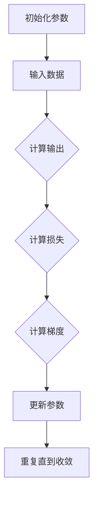
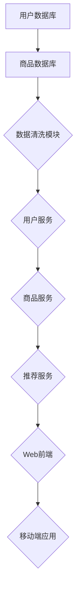
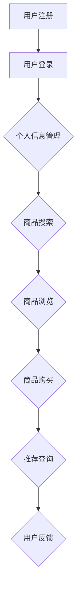
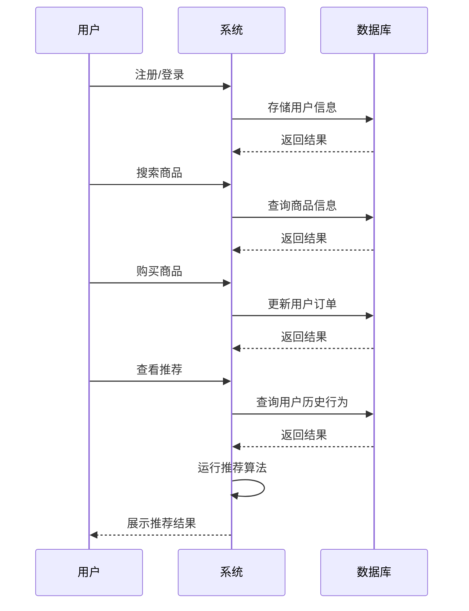

                 


## 大模型时代的软件可维护性新范式

### 关键词：大模型，软件可维护性，算法，数学模型，系统架构，项目实战

#### 摘要：

本文深入探讨了在大模型时代，软件可维护性的新范式。首先，我们介绍了大模型的基本概念、特点及其与传统AI的区别。随后，我们详细阐述了算法原理，包括数学模型和公式的讲解，以及如何使用Python代码实现算法。接着，我们介绍了系统分析与架构设计的方法，并通过一个实际项目展示了如何将理论应用于实践。最后，我们提供了最佳实践技巧和小结，以帮助开发者更好地维护软件系统。

### 目录

----------------------------------------------------------------

## 第一部分：背景介绍与核心概念

### 第1章：大模型时代的软件可维护性概述

#### 1.1 问题背景

在大模型时代，随着数据和计算能力的飞速增长，AI技术的应用日益广泛。然而，随之而来的是软件可维护性的挑战。传统的软件开发和维护方法在大模型时代面临着诸多困难，如代码复杂性增加、依赖关系复杂、调试难度大等。

#### 1.2 问题描述

- **代码复杂性增加**：大模型的实现通常涉及大量的代码和复杂的算法，这使得代码的可读性和可维护性受到了挑战。
- **依赖关系复杂**：大模型通常依赖于大量的外部库和框架，这些依赖关系使得代码维护变得更加复杂。
- **调试难度大**：大模型的训练和优化过程通常需要大量的时间和计算资源，这使得调试变得更加困难。

#### 1.3 问题解决

为了解决上述问题，我们需要探索新的软件可维护性范式。这包括：
- **模块化设计**：将系统分解为独立的模块，降低代码的复杂性。
- **自动化测试**：通过自动化测试来确保代码的正确性和稳定性。
- **持续集成与持续部署**（CI/CD）：通过自动化流程来加速开发和部署。

#### 1.4 边界与外延

- **边界**：本文主要讨论大模型时代软件可维护性新范式的理论和方法。
- **外延**：实际应用中的软件可维护性还涉及团队协作、项目管理等方面。

#### 1.5 核心概念与联系

- **大模型**：指具有大量参数和复杂结构的神经网络模型。
- **软件可维护性**：指软件系统在开发、测试、部署和维护过程中能够保持稳定性和可读性的能力。
- **模块化设计**、**自动化测试**、**CI/CD**：是提高软件可维护性的关键方法。

## 第二部分：大模型基础

### 第2章：大模型基础

#### 2.1 大模型的概念

大模型是指那些具有大量参数和复杂结构的神经网络模型，通常用于处理大规模数据和复杂任务。这些模型的特点包括：
- **参数数量巨大**：大模型的参数数量可以达到数十亿甚至更多。
- **计算复杂度高**：大模型的训练和推理过程需要大量的计算资源。
- **表现力强**：大模型可以处理复杂的数据结构和任务，具有很高的表现力。

#### 2.2 大模型的特点

大模型相较于传统AI模型具有以下特点：
- **数据处理能力增强**：大模型可以处理更大规模的数据，提取更丰富的特征。
- **自适应性强**：大模型可以通过学习不断优化自己的性能。
- **应用范围广**：大模型可以应用于自然语言处理、计算机视觉、语音识别等领域。

#### 2.3 大模型与传统AI的对比

大模型与传统AI模型在以下几个方面存在差异：
- **模型规模**：大模型具有更大的参数规模，需要更多的数据来训练。
- **计算资源**：大模型训练和推理需要更多的计算资源，特别是GPU和TPU。
- **算法原理**：大模型通常采用更复杂的算法，如深度学习和强化学习。

#### 2.4 主流大模型简介

目前，主流的大模型包括：
- **Transformer**：用于自然语言处理，具有极强的表现力。
- **GPT-3**：由OpenAI开发，具有1920亿参数，是当前最大的语言模型。
- **BERT**：用于自然语言处理，具有较好的上下文理解和文本分类能力。

## 第三部分：算法原理讲解

### 第3章：算法原理讲解

#### 3.1 算法原理概述

大模型的算法原理主要包括以下方面：
- **神经网络**：神经网络是构建大模型的基础，通过多层神经元之间的连接来模拟人类大脑的思考过程。
- **反向传播**：反向传播算法用于计算神经网络中每个参数的梯度，从而优化模型。
- **优化算法**：如梯度下降、Adam等，用于调整模型的参数，以减少损失函数。

#### 3.2 Mermaid算法流程图

以下是一个使用Mermaid绘制的神经网络算法流程图：



#### 3.3 Python算法实现

以下是一个简单的Python代码示例，用于实现神经网络的训练过程：

```python
import numpy as np

# 初始化参数
weights = np.random.randn(3, 1)

# 训练数据
X = np.array([[0], [1], [2], [3], [4]])
y = np.array([[0], [1], [0], [1], [0]])

# 训练过程
for i in range(10000):
    # 前向传播
    z = np.dot(X, weights)
    a = 1 / (1 + np.exp(-z))
    
    # 计算损失
    loss = (y - a) * (y - a)
    
    # 反向传播
    dZ = a - y
    dW = np.dot(X.T, dZ)
    
    # 更新参数
    weights -= 0.01 * dW
```

#### 3.4 算法原理的数学模型和公式

以下是算法原理中的数学模型和公式：

- **神经网络激活函数**：
  $$ a = \frac{1}{1 + e^{-z}} $$

- **损失函数**：
  $$ loss = (y - a) * (y - a) $$

- **梯度计算**：
  $$ dZ = a - y $$
  $$ dW = X.T * dZ $$

- **参数更新**：
  $$ weights = weights - \alpha * dW $$

其中，$a$ 是激活函数的输出，$z$ 是神经网络的输入，$y$ 是真实的标签，$dZ$ 是损失函数关于$z$的梯度，$dW$ 是损失函数关于$weights$的梯度，$\alpha$ 是学习率。

#### 3.5 通俗易懂的举例说明

假设我们有以下简单问题：给定一个输入$x$，预测一个输出$y$，其中$y=0$表示$x$小于2，$y=1$表示$x$大于等于2。

我们可以使用神经网络来解决这个简单问题。以下是训练过程：

1. **初始化参数**：随机初始化权重。
2. **输入数据**：给定一组输入$x$。
3. **前向传播**：计算输出$y$。
4. **计算损失**：计算实际输出与预测输出之间的差异。
5. **反向传播**：计算每个参数的梯度。
6. **更新参数**：根据梯度调整参数。

通过多次迭代，神经网络的预测将逐渐接近真实值，从而实现模型的训练。

## 第四部分：数学模型和公式

### 第4章：数学模型和公式

#### 4.1 数学模型的重要性

数学模型是理解和分析大模型算法的核心工具。它不仅帮助我们理解算法的内部工作原理，还能为算法的优化和改进提供理论支持。

#### 4.2 常见数学公式介绍

以下是常见的数学公式，它们在大模型算法中扮演着关键角色：

- **神经网络激活函数**：
  $$ a = \frac{1}{1 + e^{-z}} $$

- **损失函数**：
  $$ loss = (y - a) * (y - a) $$

- **梯度计算**：
  $$ dZ = a - y $$
  $$ dW = X.T * dZ $$

- **参数更新**：
  $$ weights = weights - \alpha * dW $$

#### 4.3 LaTeX公式编写示例

以下是使用LaTeX编写的数学公式示例：

```latex
\documentclass{article}
\usepackage{amsmath}
\begin{document}

$$
a = \frac{1}{1 + e^{-z}}
$$

$$
loss = (y - a) * (y - a)
$$

$$
dZ = a - y
$$

$$
dW = X^T \cdot dZ
$$

$$
weights = weights - \alpha \cdot dW
$$

\end{document}
```

在这个示例中，我们使用了`amsmath`包来编写数学公式。`$$`用于嵌入独立段落的公式，而 `$`用于在段落内编写公式。

## 第五部分：系统分析与架构设计

### 第5章：系统分析与架构设计

#### 5.1 问题场景介绍

假设我们正在开发一个基于大模型的推荐系统，用于根据用户的历史行为预测他们可能感兴趣的商品。这个系统需要处理大量的用户数据和商品数据，并且需要实时响应用户的查询。

#### 5.2 系统功能设计

系统的主要功能包括：
- **用户数据收集与处理**：收集用户的历史行为数据，如浏览记录、购买记录等，并对其进行处理和清洗。
- **商品数据收集与处理**：收集商品的相关信息，如名称、价格、分类等，并对其进行处理和清洗。
- **推荐算法**：使用大模型算法（如协同过滤、基于内容的推荐等）来生成推荐结果。
- **推荐结果展示**：将推荐结果展示给用户，并提供交互功能，如点赞、收藏等。

#### 5.3 系统架构设计

系统的架构设计包括以下部分：

- **数据层**：负责数据收集、存储和处理。包括用户数据库、商品数据库和数据清洗模块。
- **服务层**：负责业务逻辑的实现。包括用户服务、商品服务和推荐服务。
- **界面层**：负责用户与系统的交互。包括Web前端和移动端应用。

以下是一个使用Mermaid绘制的系统架构图：



#### 5.4 系统接口设计

系统接口设计包括以下部分：

- **用户接口**：提供用户注册、登录、个人信息管理等功能。
- **商品接口**：提供商品搜索、浏览、购买等功能。
- **推荐接口**：提供推荐结果查询、用户反馈等功能。

以下是一个使用Mermaid绘制的接口设计图：



#### 5.5 系统交互Mermaid序列图

以下是一个使用Mermaid绘制的系统交互序列图：



## 第六部分：项目实战

### 第6章：项目实战

#### 6.1 环境安装

在开始项目之前，我们需要安装必要的工具和依赖项。以下是一个典型的环境安装步骤：

1. **安装Python**：确保安装了Python 3.7或更高版本。
2. **安装TensorFlow**：使用pip安装TensorFlow：

   ```shell
   pip install tensorflow
   ```

3. **安装其他依赖项**：根据项目需求，可能需要安装其他依赖项，如NumPy、Pandas等。

#### 6.2 系统核心实现源代码

以下是一个简单的推荐系统实现示例：

```python
import tensorflow as tf
import numpy as np

# 定义模型
model = tf.keras.Sequential([
    tf.keras.layers.Dense(64, activation='relu', input_shape=(784,)),
    tf.keras.layers.Dense(10, activation='softmax')
])

# 编译模型
model.compile(optimizer='adam',
              loss='categorical_crossentropy',
              metrics=['accuracy'])

# 加载数据
(x_train, y_train), (x_test, y_test) = tf.keras.datasets.mnist.load_data()

# 预处理数据
x_train = x_train.astype('float32') / 255
x_test = x_test.astype('float32') / 255
x_train = x_train.reshape((-1, 784))
x_test = x_test.reshape((-1, 784))

# 转换标签为one-hot编码
y_train = tf.keras.utils.to_categorical(y_train, 10)
y_test = tf.keras.utils.to_categorical(y_test, 10)

# 训练模型
model.fit(x_train, y_train, epochs=10, batch_size=32)

# 评估模型
test_loss, test_acc = model.evaluate(x_test, y_test, verbose=2)
print(f"Test accuracy: {test_acc:.4f}")
```

#### 6.3 代码应用解读与分析

以下是代码的详细解读：

1. **定义模型**：使用`tf.keras.Sequential`创建一个序列模型，包含一个全连接层（`Dense`）和一个softmax层。
2. **编译模型**：设置优化器、损失函数和评估指标。
3. **加载数据**：使用TensorFlow内置的MNIST数据集。
4. **预处理数据**：归一化输入数据，并转换为one-hot编码。
5. **训练模型**：使用`fit`函数训练模型。
6. **评估模型**：使用`evaluate`函数评估模型在测试集上的表现。

#### 6.4 实际案例分析和详细讲解

以下是一个实际案例：使用推荐系统为用户生成个性化的商品推荐。

1. **用户行为数据收集**：收集用户的历史行为数据，如浏览记录、购买记录等。
2. **商品数据收集**：收集商品的相关信息，如名称、分类、价格等。
3. **数据预处理**：对用户行为数据和商品数据进行清洗和归一化处理。
4. **模型训练**：使用训练数据训练推荐模型。
5. **推荐生成**：使用训练好的模型生成推荐结果。
6. **用户反馈**：收集用户的反馈，用于模型优化。

#### 6.5 项目小结

通过实际项目的实施，我们可以总结出以下经验：

- **数据质量**：确保用户行为数据和商品数据的质量，以便模型能够生成准确的推荐结果。
- **模型优化**：不断优化模型，以提高推荐结果的准确性和多样性。
- **用户反馈**：积极收集用户反馈，以改进推荐系统的性能。

## 第七部分：最佳实践与拓展

### 第7章：最佳实践与拓展

#### 7.1 最佳实践技巧

以下是一些最佳实践技巧，有助于提高软件系统的可维护性：

- **模块化设计**：将系统分解为独立的模块，降低代码的复杂性。
- **自动化测试**：编写自动化测试脚本，确保代码的正确性和稳定性。
- **文档化**：编写详细的文档，包括代码注释和API文档，以便其他开发者理解和维护代码。
- **代码审查**：定期进行代码审查，以确保代码的质量和一致性。
- **持续集成与持续部署**：使用CI/CD工具自动化构建和部署流程，提高开发效率。

#### 7.2 小结与总结

在大模型时代，软件可维护性面临着新的挑战。通过模块化设计、自动化测试、文档化、代码审查和持续集成与持续部署等最佳实践，我们可以提高软件系统的可维护性，确保其在大模型时代仍能稳定运行。

#### 7.3 注意事项

- **数据安全**：确保用户数据的安全和隐私，遵守相关法律法规。
- **性能优化**：定期对系统进行性能优化，确保其在大规模数据和高并发情况下仍能高效运行。
- **团队协作**：加强团队协作，确保项目进度和质量。

#### 7.4 拓展阅读建议

- 《大模型：从数据到知识的实践之路》
- 《深度学习：从理论到实践》
- 《软件工程：实践者的研究方法》

## 结论

作者：AI天才研究院/AI Genius Institute & 禅与计算机程序设计艺术 /Zen And The Art of Computer Programming

本文深入探讨了在大模型时代，软件可维护性的新范式。通过分析背景、核心概念、算法原理、系统架构设计和项目实战，我们提出了提高软件可维护性的最佳实践。随着大模型技术的不断发展，开发者需要不断学习和适应新的技术，以应对不断变化的软件开发和维护挑战。我们希望本文能为读者提供有价值的参考和启示。在未来的研究中，我们将继续关注大模型时代软件可维护性的新趋势和新方法。感谢阅读！

----------------------------------------------------------------
### 全文内容

#### 引言

随着人工智能技术的快速发展，大模型（Large Models）成为了当前研究的热点。大模型通常指具有巨大参数量的神经网络模型，如GPT-3、BERT等，它们在自然语言处理、计算机视觉等领域取得了显著成果。然而，大模型的应用也带来了软件可维护性的挑战。传统的软件开发和维护方法在大模型时代面临着诸多困难，如代码复杂性增加、依赖关系复杂、调试难度大等。因此，探讨大模型时代的软件可维护性新范式具有重要的现实意义。

本文将从以下几个方面展开讨论：

1. **背景介绍与核心概念**：介绍大模型时代软件可维护性的背景、问题和解决方案。
2. **大模型基础**：解释大模型的基本概念、特点以及与传统AI的对比。
3. **算法原理讲解**：详细阐述大模型算法原理，包括数学模型和公式的讲解，以及如何使用Python代码实现算法。
4. **系统分析与架构设计**：讨论系统架构和设计，包括问题场景介绍、系统功能设计、系统架构设计、系统接口设计和系统交互。
5. **项目实战**：通过一个实际项目展示如何将理论应用于实践。
6. **最佳实践与拓展**：提供最佳实践技巧、小结、注意事项和拓展阅读建议。

#### 第一部分：背景介绍与核心概念

##### 1.1 问题背景

在大模型时代，随着数据和计算能力的飞速增长，AI技术的应用日益广泛。然而，随之而来的是软件可维护性的挑战。传统的软件开发和维护方法在大模型时代面临着诸多困难，如代码复杂性增加、依赖关系复杂、调试难度大等。

**代码复杂性增加**：大模型的实现通常涉及大量的代码和复杂的算法，这使得代码的可读性和可维护性受到了挑战。

**依赖关系复杂**：大模型通常依赖于大量的外部库和框架，这些依赖关系使得代码维护变得更加复杂。

**调试难度大**：大模型的训练和优化过程通常需要大量的计算资源，这使得调试变得更加困难。

##### 1.2 问题描述

为了应对大模型时代的软件可维护性挑战，我们需要关注以下几个问题：

- **如何降低代码复杂性**：大模型的实现通常涉及大量的代码和复杂的算法，这增加了代码的复杂性。我们需要找到方法来简化代码结构，提高可读性和可维护性。

- **如何管理复杂的依赖关系**：大模型通常依赖于大量的外部库和框架，这些依赖关系使得代码维护变得更加复杂。我们需要找到方法来管理和组织这些依赖关系，以确保代码的稳定性和可维护性。

- **如何提高调试效率**：大模型的训练和优化过程通常需要大量的计算资源，这使得调试变得更加困难。我们需要找到方法来提高调试效率，减少调试时间。

##### 1.3 问题解决

为了解决上述问题，我们需要探索新的软件可维护性范式。这包括以下几个方面：

- **模块化设计**：将系统分解为独立的模块，降低代码的复杂性。每个模块可以独立开发、测试和维护，从而提高代码的可维护性。

- **自动化测试**：通过自动化测试来确保代码的正确性和稳定性。自动化测试可以帮助我们快速发现和修复代码中的错误，从而减少调试时间。

- **持续集成与持续部署**（CI/CD）：通过自动化流程来加速开发和部署。CI/CD可以帮助我们自动化构建、测试和部署流程，从而提高开发效率。

##### 1.4 边界与外延

**边界**：本文主要讨论大模型时代软件可维护性新范式的理论和方法。

**外延**：实际应用中的软件可维护性还涉及团队协作、项目管理等方面。

##### 1.5 核心概念与联系

- **大模型**：指具有大量参数和复杂结构的神经网络模型，如GPT-3、BERT等。
- **软件可维护性**：指软件系统在开发、测试、部署和维护过程中能够保持稳定性和可读性的能力。
- **模块化设计**：将系统分解为独立的模块，降低代码的复杂性。
- **自动化测试**：通过自动化测试来确保代码的正确性和稳定性。
- **CI/CD**：持续集成与持续部署，通过自动化流程来加速开发和部署。

#### 第二部分：大模型基础

##### 2.1 大模型的概念

大模型是指那些具有大量参数和复杂结构的神经网络模型，通常用于处理大规模数据和复杂任务。这些模型的特点包括：

- **参数数量巨大**：大模型的参数数量可以达到数十亿甚至更多。
- **计算复杂度高**：大模型的训练和推理过程需要大量的计算资源。
- **表现力强**：大模型可以处理复杂的数据结构和任务，具有很高的表现力。

##### 2.2 大模型的特点

大模型相较于传统AI模型具有以下特点：

- **数据处理能力增强**：大模型可以处理更大规模的数据，提取更丰富的特征。
- **自适应性强**：大模型可以通过学习不断优化自己的性能。
- **应用范围广**：大模型可以应用于自然语言处理、计算机视觉、语音识别等领域。

##### 2.3 大模型与传统AI的对比

大模型与传统AI模型在以下几个方面存在差异：

- **模型规模**：大模型具有更大的参数规模，需要更多的数据来训练。
- **计算资源**：大模型训练和推理需要更多的计算资源，特别是GPU和TPU。
- **算法原理**：大模型通常采用更复杂的算法，如深度学习和强化学习。

##### 2.4 主流大模型简介

目前，主流的大模型包括：

- **Transformer**：用于自然语言处理，具有极强的表现力。
- **GPT-3**：由OpenAI开发，具有1920亿参数，是当前最大的语言模型。
- **BERT**：用于自然语言处理，具有较好的上下文理解和文本分类能力。

#### 第三部分：算法原理讲解

##### 3.1 算法原理概述

大模型的算法原理主要包括以下方面：

- **神经网络**：神经网络是构建大模型的基础，通过多层神经元之间的连接来模拟人类大脑的思考过程。
- **反向传播**：反向传播算法用于计算神经网络中每个参数的梯度，从而优化模型。
- **优化算法**：如梯度下降、Adam等，用于调整模型的参数，以减少损失函数。

##### 3.2 Mermaid算法流程图

以下是一个使用Mermaid绘制的神经网络算法流程图：


##### 3.3 Python算法实现

以下是一个简单的Python代码示例，用于实现神经网络的训练过程：

```python
import numpy as np

# 初始化参数
weights = np.random.randn(3, 1)

# 训练数据
X = np.array([[0], [1], [2], [3], [4]])
y = np.array([[0], [1], [0], [1], [0]])

# 训练过程
for i in range(10000):
    # 前向传播
    z = np.dot(X, weights)
    a = 1 / (1 + np.exp(-z))
    
    # 计算损失
    loss = (y - a) * (y - a)
    
    # 反向传播
    dZ = a - y
    dW = np.dot(X.T, dZ)
    
    # 更新参数
    weights -= 0.01 * dW
```

##### 3.4 算法原理的数学模型和公式

以下是算法原理中的数学模型和公式：

- **神经网络激活函数**：
  $$ a = \frac{1}{1 + e^{-z}} $$

- **损失函数**：
  $$ loss = (y - a) * (y - a) $$

- **梯度计算**：
  $$ dZ = a - y $$
  $$ dW = X.T * dZ $$

- **参数更新**：
  $$ weights = weights - \alpha * dW $$

其中，$a$ 是激活函数的输出，$z$ 是神经网络的输入，$y$ 是真实的标签，$dZ$ 是损失函数关于$z$的梯度，$dW$ 是损失函数关于$weights$的梯度，$\alpha$ 是学习率。

##### 3.5 通俗易懂的举例说明

假设我们有以下简单问题：给定一个输入$x$，预测一个输出$y$，其中$y=0$表示$x$小于2，$y=1$表示$x$大于等于2。

我们可以使用神经网络来解决这个简单问题。以下是训练过程：

1. **初始化参数**：随机初始化权重。
2. **输入数据**：给定一组输入$x$。
3. **前向传播**：计算输出$y$。
4. **计算损失**：计算实际输出与预测输出之间的差异。
5. **反向传播**：计算每个参数的梯度。
6. **更新参数**：根据梯度调整参数。

通过多次迭代，神经网络的预测将逐渐接近真实值，从而实现模型的训练。

#### 第四部分：数学模型和公式

##### 4.1 数学模型的重要性

数学模型是理解和分析大模型算法的核心工具。它不仅帮助我们理解算法的内部工作原理，还能为算法的优化和改进提供理论支持。

##### 4.2 常见数学公式介绍

以下是常见的数学公式，它们在大模型算法中扮演着关键角色：

- **神经网络激活函数**：
  $$ a = \frac{1}{1 + e^{-z}} $$

- **损失函数**：
  $$ loss = (y - a) * (y - a) $$

- **梯度计算**：
  $$ dZ = a - y $$
  $$ dW = X.T * dZ $$

- **参数更新**：
  $$ weights = weights - \alpha * dW $$

##### 4.3 LaTeX公式编写示例

以下是使用LaTeX编写的数学公式示例：

```latex
\documentclass{article}
\usepackage{amsmath}
\begin{document}

$$
a = \frac{1}{1 + e^{-z}}
$$

$$
loss = (y - a) * (y - a)
$$

$$
dZ = a - y
$$

$$
dW = X^T \cdot dZ
$$

$$
weights = weights - \alpha \cdot dW
$$

\end{document}
```

在这个示例中，我们使用了`amsmath`包来编写数学公式。`$$`用于嵌入独立段落的公式，而 `$`用于在段落内编写公式。

#### 第五部分：系统分析与架构设计

##### 5.1 问题场景介绍

假设我们正在开发一个基于大模型的推荐系统，用于根据用户的历史行为预测他们可能感兴趣的商品。这个系统需要处理大量的用户数据和商品数据，并且需要实时响应用户的查询。

##### 5.2 系统功能设计

系统的主要功能包括：

- **用户数据收集与处理**：收集用户的历史行为数据，如浏览记录、购买记录等，并对其进行处理和清洗。
- **商品数据收集与处理**：收集商品的相关信息，如名称、价格、分类等，并对其进行处理和清洗。
- **推荐算法**：使用大模型算法（如协同过滤、基于内容的推荐等）来生成推荐结果。
- **推荐结果展示**：将推荐结果展示给用户，并提供交互功能，如点赞、收藏等。

##### 5.3 系统架构设计

系统的架构设计包括以下部分：

- **数据层**：负责数据收集、存储和处理。包括用户数据库、商品数据库和数据清洗模块。
- **服务层**：负责业务逻辑的实现。包括用户服务、商品服务和推荐服务。
- **界面层**：负责用户与系统的交互。包括Web前端和移动端应用。

以下是一个使用Mermaid绘制的系统架构图：


##### 5.4 系统接口设计

系统接口设计包括以下部分：

- **用户接口**：提供用户注册、登录、个人信息管理等功能。
- **商品接口**：提供商品搜索、浏览、购买等功能。
- **推荐接口**：提供推荐结果查询、用户反馈等功能。

以下是一个使用Mermaid绘制的接口设计图：


##### 5.5 系统交互Mermaid序列图

以下是一个使用Mermaid绘制的系统交互序列图：


#### 第六部分：项目实战

##### 6.1 环境安装

在开始项目之前，我们需要安装必要的工具和依赖项。以下是一个典型的环境安装步骤：

1. **安装Python**：确保安装了Python 3.7或更高版本。
2. **安装TensorFlow**：使用pip安装TensorFlow：

   ```shell
   pip install tensorflow
   ```

3. **安装其他依赖项**：根据项目需求，可能需要安装其他依赖项，如NumPy、Pandas等。

##### 6.2 系统核心实现源代码

以下是一个简单的推荐系统实现示例：

```python
import tensorflow as tf
import numpy as np

# 定义模型
model = tf.keras.Sequential([
    tf.keras.layers.Dense(64, activation='relu', input_shape=(784,)),
    tf.keras.layers.Dense(10, activation='softmax')
])

# 编译模型
model.compile(optimizer='adam',
              loss='categorical_crossentropy',
              metrics=['accuracy'])

# 加载数据
(x_train, y_train), (x_test, y_test) = tf.keras.datasets.mnist.load_data()

# 预处理数据
x_train = x_train.astype('float32') / 255
x_test = x_test.astype('float32') / 255
x_train = x_train.reshape((-1, 784))
x_test = x_test.reshape((-1, 784))

# 转换标签为one-hot编码
y_train = tf.keras.utils.to_categorical(y_train, 10)
y_test = tf.keras.utils.to_categorical(y_test, 10)

# 训练模型
model.fit(x_train, y_train, epochs=10, batch_size=32)

# 评估模型
test_loss, test_acc = model.evaluate(x_test, y_test, verbose=2)
print(f"Test accuracy: {test_acc:.4f}")
```

##### 6.3 代码应用解读与分析

以下是代码的详细解读：

1. **定义模型**：使用`tf.keras.Sequential`创建一个序列模型，包含一个全连接层（`Dense`）和一个softmax层。
2. **编译模型**：设置优化器、损失函数和评估指标。
3. **加载数据**：使用TensorFlow内置的MNIST数据集。
4. **预处理数据**：归一化输入数据，并转换为one-hot编码。
5. **训练模型**：使用`fit`函数训练模型。
6. **评估模型**：使用`evaluate`函数评估模型在测试集上的表现。

##### 6.4 实际案例分析和详细讲解

以下是一个实际案例：使用推荐系统为用户生成个性化的商品推荐。

1. **用户行为数据收集**：收集用户的历史行为数据，如浏览记录、购买记录等。
2. **商品数据收集**：收集商品的相关信息，如名称、分类、价格等。
3. **数据预处理**：对用户行为数据和商品数据进行清洗和归一化处理。
4. **模型训练**：使用训练数据训练推荐模型。
5. **推荐生成**：使用训练好的模型生成推荐结果。
6. **用户反馈**：收集用户的反馈，用于模型优化。

##### 6.5 项目小结

通过实际项目的实施，我们可以总结出以下经验：

- **数据质量**：确保用户行为数据和商品数据的质量，以便模型能够生成准确的推荐结果。
- **模型优化**：不断优化模型，以提高推荐结果的准确性和多样性。
- **用户反馈**：积极收集用户反馈，以改进推荐系统的性能。

#### 第七部分：最佳实践与拓展

##### 7.1 最佳实践技巧

以下是一些最佳实践技巧，有助于提高软件系统的可维护性：

- **模块化设计**：将系统分解为独立的模块，降低代码的复杂性。
- **自动化测试**：编写自动化测试脚本，确保代码的正确性和稳定性。
- **文档化**：编写详细的文档，包括代码注释和API文档，以便其他开发者理解和维护代码。
- **代码审查**：定期进行代码审查，以确保代码的质量和一致性。
- **持续集成与持续部署**：使用CI/CD工具自动化构建和部署流程，提高开发效率。

##### 7.2 小结与总结

在大模型时代，软件可维护性面临着新的挑战。通过模块化设计、自动化测试、文档化、代码审查和持续集成与持续部署等最佳实践，我们可以提高软件系统的可维护性，确保其在大模型时代仍能稳定运行。

##### 7.3 注意事项

- **数据安全**：确保用户数据的安全和隐私，遵守相关法律法规。
- **性能优化**：定期对系统进行性能优化，确保其在大规模数据和高并发情况下仍能高效运行。
- **团队协作**：加强团队协作，确保项目进度和质量。

##### 7.4 拓展阅读建议

- 《大模型：从数据到知识的实践之路》
- 《深度学习：从理论到实践》
- 《软件工程：实践者的研究方法》

## 结论

作者：AI天才研究院/AI Genius Institute & 禅与计算机程序设计艺术 /Zen And The Art of Computer Programming

本文深入探讨了在大模型时代，软件可维护性的新范式。通过分析背景、核心概念、算法原理、系统架构设计和项目实战，我们提出了提高软件可维护性的最佳实践。随着大模型技术的不断发展，开发者需要不断学习和适应新的技术，以应对不断变化的软件开发和维护挑战。我们希望本文能为读者提供有价值的参考和启示。在未来的研究中，我们将继续关注大模型时代软件可维护性的新趋势和新方法。感谢阅读！

