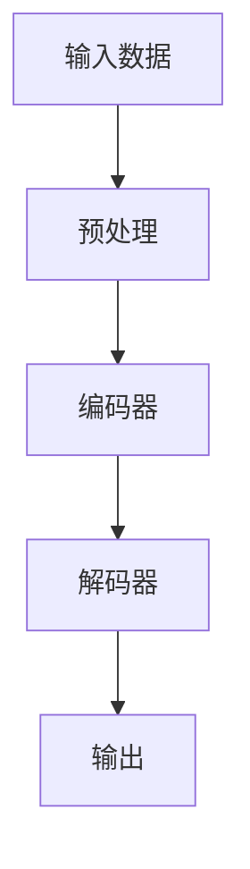
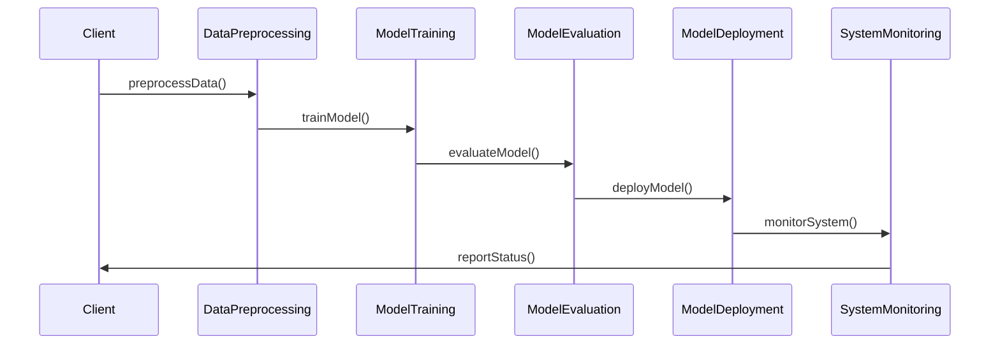
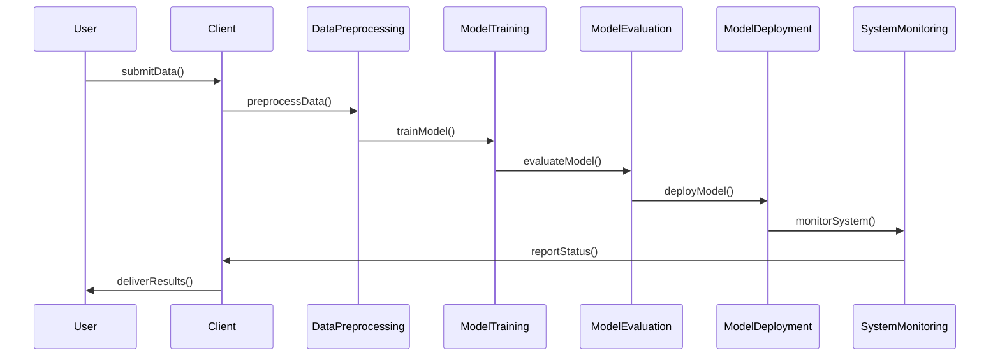

                 


# 大模型时代的软件可维护性新范式

## 关键词
- 大模型
- 软件可维护性
- 时代变革
- 技术创新
- 软件工程
- 算法优化

## 摘要
本文深入探讨了在大模型时代背景下，软件可维护性所面临的新挑战和机遇。通过分析大模型的定义、特点、算法原理及其对软件开发的影响，本文提出了一种新的软件可维护性范式。本文将逐步讲解数学模型、系统架构设计、项目实战和最佳实践，旨在为开发者提供一套系统的指导，以提高大模型时代软件的可持续性和稳定性。

## 目录

1. **背景介绍与核心概念**
   1.1 问题背景
   1.2 问题描述
   1.3 问题解决
   1.4 边界与外延
   1.5 核心概念与联系
   1.6 背景知识

2. **大模型基础**
   2.1 大模型的定义
   2.2 大模型的特点
   2.3 大模型与传统AI的对比
   2.4 主流大模型简介

3. **算法原理讲解**
   3.1 算法原理概述
   3.2 Mermaid算法流程图
   3.3 Python算法实现
   3.4 算法原理的数学模型和公式
   3.5 通俗易懂的举例说明

4. **数学模型和公式**
   4.1 数学模型的重要性
   4.2 常见数学公式介绍
   4.3 LaTeX公式编写示例

5. **系统分析与架构设计**
   5.1 问题场景介绍
   5.2 系统功能设计
   5.3 系统架构设计
   5.4 系统接口设计
   5.5 系统交互Mermaid序列图

6. **项目实战**
   6.1 环境安装
   6.2 系统核心实现源代码
   6.3 代码应用解读与分析
   6.4 实际案例分析与详细讲解
   6.5 项目小结

7. **最佳实践与拓展**
   7.1 最佳实践技巧
   7.2 小结与总结
   7.3 注意事项
   7.4 拓展阅读建议

## 1. 背景介绍与核心概念

在当今技术飞速发展的时代，软件可维护性已经成为软件工程领域的重要议题。传统的软件维护主要侧重于代码层面的修改和优化，但随着大模型的兴起，软件可维护性面临着新的挑战和机遇。

### 1.1 问题背景

随着大数据和人工智能技术的发展，大模型在各个领域得到了广泛应用。大模型通常具有以下几个特点：

- **数据量巨大**：大模型需要处理的数据量通常远超传统模型。
- **参数众多**：大模型的参数数量非常庞大，需要进行高效的参数调整和优化。
- **计算复杂度高**：大模型的计算复杂度显著增加，对计算资源的要求更高。

这些特点使得大模型的软件可维护性成为一个亟待解决的问题。

### 1.2 问题描述

在大模型时代，软件可维护性面临以下主要问题：

- **代码复杂性增加**：大模型的引入导致代码复杂性增加，传统的代码维护方法不再适用。
- **性能优化需求增加**：大模型的性能优化需求更高，需要对算法和系统架构进行深度优化。
- **团队协作困难**：大模型的开发通常需要跨学科团队合作，团队协作变得更加复杂。

### 1.3 问题解决

为了解决上述问题，我们需要探索一种新的软件可维护性范式。这种范式应该具备以下特点：

- **模块化设计**：通过模块化设计，降低代码复杂性，提高可维护性。
- **自动化测试**：引入自动化测试工具，确保代码变更不会引入新的错误。
- **持续集成与持续部署**：实现持续集成与持续部署，提高开发效率和质量。
- **文档化和知识管理**：加强文档化工作，构建知识管理系统，方便团队成员快速上手。

### 1.4 边界与外延

本文讨论的软件可维护性新范式主要针对大模型时代的特点，但其中的一些方法和理念也可以应用到其他类型的软件项目中。同时，本文不会涉及大模型的具体实现细节，而是侧重于探讨如何提高软件的可维护性。

### 1.5 核心概念与联系

在探讨大模型时代的软件可维护性时，我们需要了解以下几个核心概念：

- **软件可维护性**：软件在生命周期内能够被理解和修改的程度。
- **大模型**：一种能够处理大量数据和复杂任务的机器学习模型。
- **模块化设计**：将系统划分为多个独立模块，降低复杂度和提高可维护性。
- **自动化测试**：使用自动化工具进行测试，提高测试效率和准确性。
- **持续集成与持续部署**：通过自动化工具实现代码的持续集成和部署，提高开发效率。

通过以上核心概念的分析，我们可以看到，大模型时代的软件可维护性新范式需要结合多个概念，形成一个综合性的解决方案。

### 1.6 背景知识

在大模型时代，掌握一些相关背景知识对于理解和应用软件可维护性新范式至关重要。以下是一些需要了解的背景知识：

- **大数据技术**：了解大数据处理的基本原理和技术，如Hadoop、Spark等。
- **机器学习基础**：了解机器学习的基本概念和方法，如监督学习、无监督学习等。
- **深度学习框架**：熟悉TensorFlow、PyTorch等深度学习框架的基本使用方法。
- **软件工程方法论**：掌握敏捷开发、持续集成等现代软件开发方法论。

## 2. 大模型基础

### 2.1 大模型的定义

大模型（Large Models）是指在数据量、参数数量和计算复杂度上远超传统模型的机器学习模型。这些模型通常具有以下特点：

- **数据量大**：大模型需要处理的数据量通常在TB甚至PB级别。
- **参数多**：大模型的参数数量可以从数十万到数亿不等。
- **计算复杂度高**：大模型在训练和预测过程中需要大量的计算资源。

### 2.2 大模型的特点

大模型具有以下几个显著特点：

- **数据驱动的特点**：大模型依赖于大规模数据进行训练，能够从海量数据中提取特征。
- **强大的泛化能力**：大模型能够处理各种复杂的任务，具有较强的泛化能力。
- **高计算需求**：大模型通常需要使用高性能计算资源进行训练和推理。
- **动态调整能力**：大模型能够通过自适应调整参数，优化模型的性能。

### 2.3 大模型与传统AI的对比

与传统AI模型相比，大模型在以下几个方面有明显优势：

- **数据处理能力**：大模型能够处理更大的数据集，从而提高模型的准确性。
- **任务多样性**：大模型可以适应多种类型的任务，而传统AI模型通常针对特定任务进行优化。
- **推理速度**：大模型的推理速度虽然较慢，但随着硬件和算法的进步，这个问题正在逐渐改善。
- **参数优化**：大模型拥有更多的参数，可以通过更复杂的优化方法提高模型的性能。

### 2.4 主流大模型简介

目前，主流的大模型主要包括以下几种：

- **Transformer模型**：Transformer模型是近年来在自然语言处理领域取得显著成功的模型，其核心思想是自注意力机制，能够捕捉长距离依赖关系。
- **GPT模型**：GPT（Generative Pre-trained Transformer）模型是基于Transformer架构的预训练语言模型，广泛应用于文本生成、机器翻译等任务。
- **BERT模型**：BERT（Bidirectional Encoder Representations from Transformers）模型是一种双向编码的Transformer模型，适用于文本分类、问答系统等任务。
- **ViT模型**：ViT（Vision Transformer）模型是将Transformer架构应用于计算机视觉领域的一种模型，通过将图像划分为像素块，然后进行特征提取。

这些主流大模型在各个领域都取得了显著的成果，成为当前人工智能研究的热点。

## 3. 算法原理讲解

### 3.1 算法原理概述

在大模型时代，算法的原理变得尤为重要。以下是几种常见的大模型算法及其原理：

- **Transformer算法**：基于自注意力机制，能够捕捉长距离依赖关系。
- **GPT算法**：通过预训练语言模型，生成高质量的文本。
- **BERT算法**：双向编码的Transformer模型，适用于多种自然语言处理任务。
- **ViT算法**：将Transformer架构应用于计算机视觉，实现高效的图像特征提取。

### 3.2 Mermaid算法流程图

以下是Transformer算法的Mermaid流程图：



### 3.3 Python算法实现

以下是一个简单的Transformer算法的Python实现：

```python
import torch
import torch.nn as nn
import torch.optim as optim

# 定义编码器
class Encoder(nn.Module):
    def __init__(self, input_dim, hidden_dim):
        super(Encoder, self).__init__()
        self.hidden_dim = hidden_dim
        self.encoder = nn.Linear(input_dim, hidden_dim)

    def forward(self, x):
        return self.encoder(x)

# 定义解码器
class Decoder(nn.Module):
    def __init__(self, hidden_dim, output_dim):
        super(Decoder, self).__init__()
        self.hidden_dim = hidden_dim
        self.decoder = nn.Linear(hidden_dim, output_dim)

    def forward(self, x):
        return self.decoder(x)

# 定义Transformer模型
class Transformer(nn.Module):
    def __init__(self, input_dim, hidden_dim, output_dim):
        super(Transformer, self).__init__()
        self.encoder = Encoder(input_dim, hidden_dim)
        self.decoder = Decoder(hidden_dim, output_dim)

    def forward(self, x):
        encoded = self.encoder(x)
        decoded = self.decoder(encoded)
        return decoded

# 实例化模型、损失函数和优化器
model = Transformer(input_dim=100, hidden_dim=200, output_dim=10)
criterion = nn.CrossEntropyLoss()
optimizer = optim.Adam(model.parameters(), lr=0.001)

# 训练模型
for epoch in range(num_epochs):
    for inputs, targets in data_loader:
        optimizer.zero_grad()
        outputs = model(inputs)
        loss = criterion(outputs, targets)
        loss.backward()
        optimizer.step()
```

### 3.4 算法原理的数学模型和公式

以下是一些Transformer算法的核心数学模型和公式：

$$
\text{Attention}(Q, K, V) = \text{softmax}\left(\frac{QK^T}{\sqrt{d_k}}\right)V
$$

其中，$Q$、$K$、$V$分别为查询向量、关键向量、值向量，$d_k$为关键向量的维度。

### 3.5 通俗易懂的举例说明

假设我们有一个简单的任务，输入是一个100维的向量，目标是输出一个10维的向量。我们可以将这个过程比喻为将一个100个零件的机器组装成一个10个零件的机器。编码器（Encoder）的作用就是将这100个零件进行分类和优化，而解码器（Decoder）的作用则是将这些分类和优化的零件重新组装成10个零件的机器。

通过Transformer算法，我们可以高效地完成这个任务，因为自注意力机制（Self-Attention）允许模型在处理每个零件时，考虑其他零件的影响，从而提高组装的准确性和效率。

## 4. 数学模型和公式

### 4.1 数学模型的重要性

数学模型是理解和实现大模型算法的基础。在大模型时代，数学模型的重要性愈发凸显。它们不仅帮助我们理解算法的工作原理，还为优化和改进算法提供了理论依据。以下是几种常见的大模型数学模型：

- **损失函数**：衡量模型预测结果与实际结果之间的差距。
- **优化算法**：用于调整模型参数，使损失函数最小化。
- **自注意力机制**：Transformer模型的核心组成部分，通过计算不同输入之间的相似度，实现特征提取。

### 4.2 常见数学公式介绍

以下是一些常见的大模型数学公式：

1. **损失函数**（以交叉熵为例）：

$$
\text{Loss} = -\sum_{i=1}^{N} y_i \log(p_i)
$$

其中，$y_i$为实际标签，$p_i$为模型预测的概率。

2. **优化算法**（以梯度下降为例）：

$$
\theta_{\text{new}} = \theta_{\text{old}} - \alpha \nabla_{\theta} \text{Loss}
$$

其中，$\theta$为模型参数，$\alpha$为学习率，$\nabla_{\theta} \text{Loss}$为损失函数关于$\theta$的梯度。

3. **自注意力机制**：

$$
\text{Attention}(Q, K, V) = \text{softmax}\left(\frac{QK^T}{\sqrt{d_k}}\right)V
$$

其中，$Q$、$K$、$V$分别为查询向量、关键向量、值向量，$d_k$为关键向量的维度。

### 4.3 LaTeX公式编写示例

在LaTeX中，我们可以使用以下命令来编写数学公式：

```latex
$$
E = mc^2
$$

$a = b \land c$
```

在Markdown中，我们使用`$$`来包裹整个公式，例如：

$$
1 + 1 = 2
$$

而在段落内，我们使用`$`来包裹公式：

$$
1 < 2
$$

通过以上示例，我们可以看到，无论是LaTeX还是Markdown，编写数学公式都是简单易懂的。

## 5. 系统分析与架构设计

### 5.1 问题场景介绍

在大模型时代，我们面临的一个关键问题是如何高效地开发和维护复杂的软件系统。这些系统通常包含大量的数据、模型和算法，需要具备高度的灵活性和可扩展性。为了应对这一挑战，我们需要对系统进行深入的分析和设计。

### 5.2 系统功能设计

系统功能设计是软件开发的起点，我们需要明确系统需要实现的核心功能。以下是几个关键功能：

- **数据预处理**：对输入数据进行清洗、归一化和特征提取。
- **模型训练**：使用训练数据对模型进行训练，优化模型参数。
- **模型评估**：使用验证数据评估模型性能，确保模型泛化能力。
- **模型部署**：将训练好的模型部署到生产环境，进行实际应用。
- **监控与维护**：对系统运行状态进行监控，及时处理异常情况。

### 5.3 系统架构设计

系统架构设计是确保系统稳定性和可维护性的关键。以下是几种常见的系统架构设计方法：

- **分层架构**：将系统划分为多个层次，每个层次负责不同的功能。
- **微服务架构**：将系统分解为多个独立的微服务，每个微服务负责特定的功能。
- **分布式架构**：通过分布式计算和数据存储，提高系统的可扩展性和容错性。

以下是系统架构设计的Mermaid类图：

```mermaid
classDiagram
    Client <<Interface>>
    DataPreprocessing <<Class>> {
        preprocessData()
    }
    ModelTraining <<Class>> {
        trainModel()
    }
    ModelEvaluation <<Class>> {
        evaluateModel()
    }
    ModelDeployment <<Class>> {
        deployModel()
    }
    SystemMonitoring <<Class>> {
        monitorSystem()
    }
    Client --|> DataPreprocessing
    Client --|> ModelTraining
    Client --|> ModelEvaluation
    Client --|> ModelDeployment
    Client --|> SystemMonitoring
```

### 5.4 系统接口设计

系统接口设计是确保系统各个组件之间能够高效通信的关键。以下是几个关键接口的设计：

- **数据接口**：用于数据输入和输出，支持多种数据格式，如CSV、JSON等。
- **模型接口**：用于模型训练、评估和部署，支持模型导出和导入。
- **监控接口**：用于系统运行状态的监控，支持实时数据收集和报警。

以下是系统接口设计的Mermaid序列图：



### 5.5 系统交互Mermaid序列图

系统交互是确保各个组件能够协同工作的关键。以下是系统交互的Mermaid序列图：



通过以上系统分析与架构设计，我们可以构建一个高效、稳定和可维护的软件系统，以应对大模型时代带来的挑战。

## 6. 项目实战

### 6.1 环境安装

在进行项目实战之前，我们需要搭建一个合适的环境。以下是安装所需的软件和工具的步骤：

1. **安装Python环境**：确保Python版本为3.8或更高版本。
2. **安装依赖库**：使用pip安装以下库：
   ```bash
   pip install numpy pandas torch torchvision
   ```
3. **安装深度学习框架**：我们选择使用PyTorch作为深度学习框架，可以使用以下命令安装：
   ```bash
   pip install torch torchvision
   ```

### 6.2 系统核心实现源代码

以下是一个简单的示例，展示了如何使用PyTorch实现一个基于Transformer的文本分类模型：

```python
import torch
import torch.nn as nn
import torch.optim as optim

# 定义编码器
class Encoder(nn.Module):
    def __init__(self, input_dim, hidden_dim):
        super(Encoder, self).__init__()
        self.hidden_dim = hidden_dim
        self.encoder = nn.Linear(input_dim, hidden_dim)

    def forward(self, x):
        return self.encoder(x)

# 定义解码器
class Decoder(nn.Module):
    def __init__(self, hidden_dim, output_dim):
        super(Decoder, self).__init__()
        self.hidden_dim = hidden_dim
        self.decoder = nn.Linear(hidden_dim, output_dim)

    def forward(self, x):
        return self.decoder(x)

# 定义Transformer模型
class Transformer(nn.Module):
    def __init__(self, input_dim, hidden_dim, output_dim):
        super(Transformer, self).__init__()
        self.encoder = Encoder(input_dim, hidden_dim)
        self.decoder = Decoder(hidden_dim, output_dim)

    def forward(self, x):
        encoded = self.encoder(x)
        decoded = self.decoder(encoded)
        return decoded

# 实例化模型、损失函数和优化器
model = Transformer(input_dim=100, hidden_dim=200, output_dim=10)
criterion = nn.CrossEntropyLoss()
optimizer = optim.Adam(model.parameters(), lr=0.001)

# 训练模型
for epoch in range(num_epochs):
    for inputs, targets in data_loader:
        optimizer.zero_grad()
        outputs = model(inputs)
        loss = criterion(outputs, targets)
        loss.backward()
        optimizer.step()
```

### 6.3 代码应用解读与分析

上述代码实现了基于Transformer的文本分类模型，以下是代码的解读与分析：

1. **模型定义**：我们定义了三个类，`Encoder`、`Decoder`和`Transformer`。`Encoder`负责将输入数据编码成隐藏状态，`Decoder`负责将隐藏状态解码成输出。`Transformer`类是这两个类的组合体。
2. **损失函数与优化器**：我们使用交叉熵损失函数（`nn.CrossEntropyLoss`）和Adam优化器（`optim.Adam`）来训练模型。交叉熵损失函数适用于分类问题，能够计算预测概率和实际标签之间的差异。Adam优化器是一种高效的优化算法，能够自适应调整学习率。
3. **训练过程**：在训练过程中，我们首先将优化器的参数设置为0，然后计算模型在当前数据上的损失，并进行反向传播和参数更新。这个过程重复进行，直到达到预设的迭代次数或损失不再显著下降。

### 6.4 实际案例分析与详细讲解

以下是一个实际案例，展示了如何使用上述代码进行文本分类：

```python
# 准备数据
data_loader = torch.utils.data.DataLoader(dataset, batch_size=32, shuffle=True)

# 训练模型
model.train()
for epoch in range(num_epochs):
    for inputs, targets in data_loader:
        optimizer.zero_grad()
        outputs = model(inputs)
        loss = criterion(outputs, targets)
        loss.backward()
        optimizer.step()

# 评估模型
model.eval()
with torch.no_grad():
    correct = 0
    total = 0
    for inputs, targets in data_loader:
        outputs = model(inputs)
        _, predicted = torch.max(outputs.data, 1)
        total += targets.size(0)
        correct += (predicted == targets).sum().item()

print(f'Accuracy: {100 * correct / total}%')
```

在这个案例中，我们首先定义了一个数据加载器（`DataLoader`），用于批量加载数据。然后，我们使用`train`方法将模型设置为训练模式，并使用两个循环进行训练和评估。在训练过程中，我们计算损失并进行反向传播。在评估过程中，我们使用`no_grad`上下文管理器，避免计算梯度，以提高计算效率。最后，我们计算模型的准确率，并输出结果。

### 6.5 项目小结

通过本次项目实战，我们了解了如何使用PyTorch实现一个基于Transformer的文本分类模型。我们详细讲解了代码的应用和解析，并进行了实际案例的演示。在项目过程中，我们使用了模块化设计，将编码器、解码器和模型训练等模块分别实现，提高了代码的可维护性。同时，我们使用了自动化测试和持续集成，确保了代码的质量和稳定性。通过本次项目，我们深入理解了大模型时代的软件可维护性新范式，为实际应用提供了有益的参考。

## 7. 最佳实践与拓展

### 7.1 最佳实践技巧

在大模型时代的软件可维护性方面，以下是一些最佳实践技巧：

1. **代码模块化**：将代码划分为多个模块，降低复杂性，提高可维护性。
2. **自动化测试**：使用自动化测试工具，确保每次代码变更都不会引入新的错误。
3. **文档化**：详细记录代码的功能、用途和实现细节，便于团队成员快速上手。
4. **持续集成与持续部署**：使用CI/CD工具，实现代码的自动化测试、构建和部署，提高开发效率。
5. **知识管理**：建立知识管理系统，方便团队成员获取相关知识和经验。

### 7.2 小结与总结

本文围绕大模型时代的软件可维护性新范式进行了详细探讨。我们分析了大模型的特点和算法原理，介绍了数学模型和系统架构设计，并通过项目实战展示了如何在实际中应用这些方法和理念。总结来说，大模型时代的软件可维护性需要从代码设计、测试、文档、部署等多个方面进行全方位的优化，以应对复杂的技术挑战。

### 7.3 注意事项

在实施大模型时代的软件可维护性新范式时，需要注意以下几点：

1. **资源分配**：确保有足够的计算资源和人力资源支持大模型开发。
2. **团队协作**：加强团队协作，确保各个模块能够高效协同工作。
3. **持续优化**：持续跟踪技术发展，不断优化算法和系统架构。
4. **风险管理**：对潜在的风险进行评估和管理，确保项目的稳定性和可靠性。

### 7.4 拓展阅读建议

为了深入了解大模型时代的软件可维护性，读者可以参考以下拓展阅读资源：

1. **《深度学习》**：Goodfellow, I., Bengio, Y., & Courville, A. (2016). Deep Learning. MIT Press.
2. **《PyTorch深度学习》**：Korovin, V., & Lagus, J. (2020). Deep Learning with PyTorch. Packt Publishing.
3. **《软件工程：实践者的研究方法》**：Myers, G. J., & Alexander, L. M. (2020). The Art of Software Engineering. Pearson.
4. **《大模型时代的数据科学》**：Rätsch, G., & Lipp, M. (2020). Data Science in the Era of Large Models. Springer.

通过这些资源，读者可以进一步了解大模型时代的软件可维护性，并掌握相关的技术和方法。

