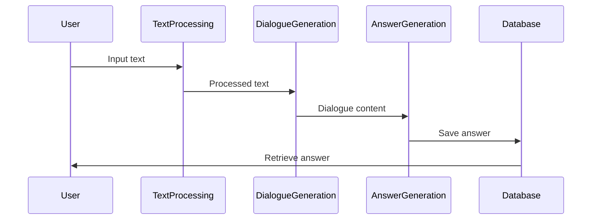
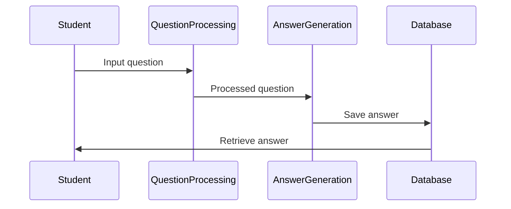
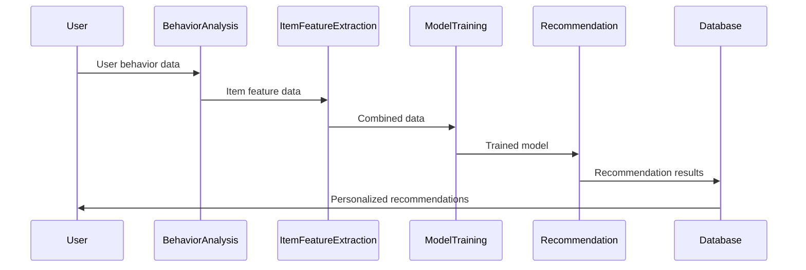
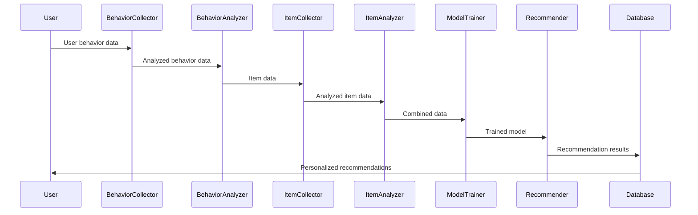
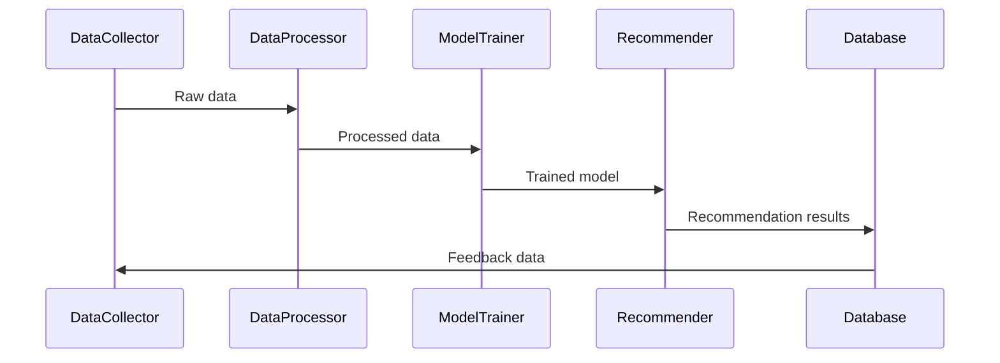

                 

### 文章标题

“大模型时代的软件架构模式创新”是一个深入探讨大模型对现代软件架构影响的课题。随着人工智能技术的飞速发展，大模型，如GPT、BERT等，已经在各个行业中展现出巨大的潜力和应用价值。这些大模型具备处理复杂任务和生成高质量内容的能力，使得软件架构的设计和实现面临新的挑战和机遇。本文将系统地分析大模型时代对软件架构模式的创新影响，旨在为软件开发者、架构师和研究者提供有价值的参考。

关键词：大模型、软件架构、创新模式、GPT、BERT、架构设计

### 摘要

本文首先回顾了软件架构的发展历程，并引入大模型的概念及其对软件架构的深远影响。随后，详细介绍了主流大模型，如GPT系列、BERT及其变体，以及其他知名大模型。接着，探讨了大模型与软件架构之间的关系，以及大模型在软件架构中的创新应用。本文通过具体案例分析，展示了大模型如何引领软件架构的创新。最后，文章总结了大模型时代的软件架构模式创新实践，并展望了未来的发展方向。

# 目录大纲：《大模型时代的软件架构模式创新》

## 第一部分：背景与核心概念

### 第1章：问题背景与核心概念

#### 1.1 问题背景

- 软件架构的发展历程
- 大模型时代的影响

#### 1.2 核心概念

- 大模型的概念与特点
- 软件架构模式的概念

#### 1.3 模式与创新的联系

- 创新与模式的关系
- 创新在软件架构中的重要性

## 第二部分：主流大模型介绍

### 第2章：主流大模型介绍

#### 2.1 GPT系列模型

- GPT模型概述
- GPT-3的重要特性

#### 2.2 BERT及其变体

- BERT模型概述
- RoBERTa、ALBERT等变体

#### 2.3 其他知名大模型

- Transformer系列模型
- 其他代表性大模型简介

## 第三部分：大模型在软件架构中的应用

### 第3章：大模型在软件架构中的应用

#### 3.1 大模型与软件架构的关系

- 大模型对软件架构的影响
- 软件架构对大模型的需求

#### 3.2 大模型在软件架构中的创新

- 创新型架构模式
- 模式特点与应用场景

#### 3.3 案例分析

- 企业案例分享
- 典型案例解析

## 第四部分：架构模式创新实践

### 第4章：架构模式创新实践

#### 4.1 创新型架构模式设计

- 设计原则
- 设计流程

#### 4.2 实践案例

- 具体实践案例分析
- 架构设计与创新点分析

### 第5章：项目实战

#### 5.1 项目介绍

- 项目背景
- 项目目标

#### 5.2 系统功能设计

- 领域模型
- 功能模块划分

#### 5.3 系统架构设计

- 架构设计
- 技术选型

#### 5.4 系统接口设计与交互

- 接口设计
- 交互流程

#### 5.5 项目实现与代码解读

- 关键代码实现
- 代码解读与分析

### 第6章：最佳实践与拓展

#### 6.1 最佳实践

- 实践经验总结
- 注意事项

#### 6.2 小结与展望

- 成果总结
- 未来展望

#### 6.3 拓展阅读

- 相关参考资料
- 进一步学习建议

## 总结

- 书籍内容回顾
- 主要观点与启示

### 第一部分：背景与核心概念

#### 1.1 问题背景

软件架构作为软件工程的基石，一直在不断演变和进步。从最初的面向过程到面向对象，再到如今的微服务架构和容器化技术，软件架构的设计原则和模式不断更新迭代。然而，随着人工智能技术的快速发展，尤其是大模型的兴起，软件架构再次迎来了新的挑战和机遇。大模型，如GPT-3、BERT等，拥有处理海量数据和生成高质量内容的能力，这对软件架构提出了新的要求。

大模型的引入不仅改变了数据处理的方式，也对软件架构的设计原则和模式带来了深远的影响。传统的软件架构设计更多关注性能、可扩展性和可靠性，而大模型的出现要求我们在设计时更多地考虑数据处理的效率和生成内容的质量。如何在大模型时代创新软件架构模式，成为了一个亟待解决的问题。

#### 1.2 核心概念

**大模型的概念与特点**

大模型（Large Models）是指在训练数据量和模型参数规模上远超传统模型的模型。大模型通常拥有数十亿甚至数万亿个参数，能够在海量数据中进行深度学习，从而实现卓越的性能。例如，GPT-3模型拥有1750亿个参数，BERT模型也拥有数百万个参数。

大模型的特点包括：

- **参数规模大**：大模型的参数数量远远超过传统模型，这使得它们在处理复杂任务时能够更精确地捕捉数据特征。
- **数据需求高**：大模型需要大量的训练数据来保证模型的泛化能力和效果。
- **计算资源需求大**：大模型训练和推理过程需要大量的计算资源，包括高性能的CPU、GPU等。
- **生成能力强**：大模型在生成文本、图像等方面展现出强大的能力，可以生成高质量的内容。

**软件架构模式的概念**

软件架构模式是指解决特定问题的系统结构、组件及其交互关系的抽象描述。模式为软件开发者提供了可复用的解决方案，提高了开发效率和系统的可维护性。常见的软件架构模式包括微服务、单体架构、事件驱动架构等。

软件架构模式的特点包括：

- **可复用性**：模式为软件开发提供了可复用的解决方案，减少了重复开发的工作量。
- **灵活性**：模式可以根据不同的需求进行灵活调整，适应不同的业务场景。
- **可扩展性**：模式设计时考虑了系统的可扩展性，可以随着业务的发展进行扩展。

**模式与创新的联系**

创新与模式之间存在着密切的联系。模式为创新提供了基础和指导，而创新则为模式的发展注入了新的活力。在软件架构领域，创新主要体现在以下几个方面：

- **技术革新**：新技术的引入，如云计算、大数据、人工智能等，为软件架构模式带来了新的可能性。
- **设计理念**：新的设计理念，如DevOps、微服务架构等，改变了传统的软件开发模式，推动了软件架构的创新。
- **实践经验**：通过实践总结出的最佳实践和模式，为后续的开发提供了宝贵的经验和指导。

**创新在软件架构中的重要性**

创新在软件架构中具有重要意义。首先，创新能够提高系统的性能和效率。通过引入新技术和设计理念，软件架构可以更好地应对复杂业务需求，提高系统的响应速度和处理能力。其次，创新能够提升系统的可维护性和可扩展性。通过创新的架构模式，开发团队可以更加灵活地应对业务变化，降低系统的维护成本。最后，创新能够推动软件架构的发展。不断的技术进步和创新为软件架构带来了新的挑战和机遇，促使软件开发者不断探索和实践，推动软件架构的不断演进。

### 第二部分：主流大模型介绍

#### 2.1 GPT系列模型

**GPT模型概述**

GPT（Generative Pre-trained Transformer）系列模型是由OpenAI开发的一类基于Transformer架构的预训练语言模型。GPT模型通过在大量文本数据上进行预训练，学习到了语言的深层结构，从而能够在给定一个文本片段时生成连贯、有逻辑的文本。

**GPT-3的重要特性**

GPT-3是GPT系列中最为强大的一款模型，具有以下重要特性：

1. **参数规模巨大**：GPT-3拥有1750亿个参数，是当前参数规模最大的预训练语言模型。
2. **预训练数据丰富**：GPT-3使用了大量的互联网文本进行预训练，包括书籍、新闻、社交媒体等多种类型的文本，使得模型在多种语言和任务上具有出色的表现。
3. **生成能力强大**：GPT-3在文本生成任务上表现出色，可以生成高质量的文本，包括故事、对话、论文摘要等。
4. **多语言支持**：GPT-3支持多种语言，包括英语、中文、法语等，使得模型在跨语言任务上具有广泛应用。

**应用场景**

GPT-3在多个领域具有广泛的应用，包括自然语言处理、问答系统、对话生成、机器翻译等。例如，GPT-3可以用于构建智能客服系统，通过理解用户的提问并生成合适的回答，提供高效、准确的客服服务。

**技术亮点**

- **Transformer架构**：GPT-3采用了Transformer架构，这是一种基于自注意力机制的深度神经网络架构，能够有效地处理长文本。
- **预训练技术**：GPT-3使用了大量的预训练数据，并通过大规模的神经网络进行预训练，使得模型在多种任务上具有出色的表现。
- **生成算法**：GPT-3采用了生成算法，能够根据输入的文本片段生成连贯、有逻辑的文本。

#### 2.2 BERT及其变体

**BERT模型概述**

BERT（Bidirectional Encoder Representations from Transformers）是由Google提出的一种基于Transformer架构的双向编码器表示模型。BERT模型通过在双向文本序列上进行预训练，学习到了语言的深层结构，从而能够在各种自然语言处理任务中表现出色。

**BERT的变体**

BERT模型自提出以来，已经衍生出多种变体，包括：

- **RoBERTa**：RoBERTa是BERT的一种变体，通过改进数据预处理和模型训练策略，使得模型在多种任务上取得了更好的性能。
- **ALBERT**：ALBERT是另一种BERT的变体，通过引入“多层跨层交互”和“跨层参数共享”等技术，提高了模型的训练效率和性能。

**BERT的关键特性**

1. **双向编码**：BERT模型采用了双向编码器，能够在文本序列的每个位置上同时考虑左侧和右侧的上下文信息，从而更好地捕捉语言的深层结构。
2. **大规模预训练**：BERT使用了大量的预训练数据，并通过大规模的神经网络进行预训练，使得模型在多种任务上具有出色的表现。
3. **多头注意力机制**：BERT采用了多头注意力机制，使得模型在处理长文本时能够更好地捕捉长距离依赖关系。

**应用场景**

BERT及其变体在多种自然语言处理任务中表现出色，包括文本分类、问答系统、命名实体识别、机器翻译等。例如，BERT可以用于构建问答系统，通过理解用户的提问和文档内容，生成准确的答案。

**技术亮点**

- **Transformer架构**：BERT采用了Transformer架构，这是一种基于自注意力机制的深度神经网络架构，能够有效地处理长文本。
- **大规模预训练**：BERT使用了大量的预训练数据，并通过大规模的神经网络进行预训练，使得模型在多种任务上具有出色的表现。
- **双向编码机制**：BERT采用了双向编码器，能够在文本序列的每个位置上同时考虑左侧和右侧的上下文信息，从而更好地捕捉语言的深层结构。

#### 2.3 其他知名大模型

**Transformer系列模型**

Transformer系列模型是继BERT之后的一种重要的大模型系列，包括ViT（Vision Transformer）、T5（Text-to-Text Transfer Transformer）等。这些模型在图像处理、文本处理等任务上表现出色，成为自然语言处理和计算机视觉领域的重要工具。

- **ViT（Vision Transformer）**：ViT模型将Transformer架构应用于图像处理任务，通过将图像分割成小块并作为输入，实现了图像分类、分割等任务。
- **T5（Text-to-Text Transfer Transformer）**：T5模型是一种通用的文本处理模型，通过将所有任务转化为文本到文本的转换任务，实现了高效的跨任务学习。

**其他代表性大模型简介**

除了上述模型外，还有其他一些著名的大模型，如GATC（Generalized Attention Transformer for Categorization）、ViL（Vision and Language Transformer）等。这些模型在各自的领域内取得了显著的成果，为人工智能技术的发展提供了强大的支持。

- **GATC（Generalized Attention Transformer for Categorization）**：GATC模型是一种用于图像分类和分类任务的Transformer模型，通过引入广义注意力机制，提高了模型的分类性能。
- **ViL（Vision and Language Transformer）**：ViL模型结合了图像和文本数据，通过Transformer架构实现了图像和文本的联合处理，广泛应用于图像识别、文本生成等任务。

### 第三部分：大模型在软件架构中的应用

#### 3.1 大模型与软件架构的关系

**大模型对软件架构的影响**

大模型的引入对软件架构产生了深远的影响，主要体现在以下几个方面：

1. **数据处理能力提升**：大模型具备强大的数据处理能力，能够高效地处理海量数据，从而提高了软件系统的数据处理效率。
2. **系统性能优化**：大模型在特定任务上的性能卓越，可以优化软件系统的性能，例如，在自然语言处理、图像识别等任务中，大模型的应用显著提升了系统的响应速度和处理能力。
3. **系统复杂性增加**：大模型通常需要大量的计算资源，包括高性能的CPU、GPU等，这增加了软件系统的复杂性，需要更加复杂的软件架构来支撑。
4. **开发成本增加**：大模型的训练和部署需要大量的计算资源和存储资源，从而增加了软件开发的成本。

**软件架构对大模型的需求**

为了充分利用大模型的优势，软件架构需要满足以下几个需求：

1. **高效的数据处理能力**：软件架构需要具备高效的数据处理能力，能够快速地获取、处理和分析大模型所需的数据。
2. **高性能的计算能力**：软件架构需要具备高性能的计算能力，能够支撑大模型的训练和推理过程。
3. **可扩展性**：软件架构需要具备良好的可扩展性，能够随着大模型规模的扩大和业务需求的变化进行扩展。
4. **高可靠性**：软件架构需要保证系统的可靠性，确保大模型在训练和推理过程中的稳定运行。

#### 3.2 大模型在软件架构中的创新

**创新型架构模式**

随着大模型的广泛应用，软件架构也在不断创新，以适应大模型的需求。以下是一些创新型架构模式：

1. **分布式架构**：分布式架构通过将系统分解为多个可独立部署和管理的模块，实现了大模型训练和推理的高效处理。例如，可以使用分布式计算框架如TensorFlow、PyTorch等来支撑大模型的训练。
2. **微服务架构**：微服务架构将系统划分为多个独立的微服务，每个微服务负责特定的功能模块，通过API接口进行通信。这种架构模式能够灵活地应对大模型的需求，提高系统的可扩展性和可维护性。
3. **边缘计算架构**：边缘计算架构将计算和存储资源部署在离用户较近的位置，减少了数据传输的延迟，提高了系统的响应速度。在应用大模型时，边缘计算架构能够实现实时推理，提高用户体验。
4. **容器化架构**：容器化架构通过使用容器技术（如Docker）来封装和部署应用，实现了应用的高效部署和管理。容器化架构能够灵活地部署和管理大模型，提高系统的可扩展性和可靠性。

**模式特点与应用场景**

以下是几种创新型架构模式的特点及其应用场景：

1. **分布式架构**

   - **特点**：分布式架构通过将系统拆分为多个独立节点，每个节点负责特定的任务，通过分布式计算框架进行协同工作。这种架构模式具有高可用性、高性能和可扩展性。
   - **应用场景**：适用于需要处理大规模数据和高并发访问的场景，如大数据处理、机器学习训练和推理等。

2. **微服务架构**

   - **特点**：微服务架构将系统划分为多个独立的微服务，每个微服务实现特定的业务功能，通过API进行通信。这种架构模式具有高灵活性、高可扩展性和高可维护性。
   - **应用场景**：适用于复杂业务系统，如电子商务、在线教育、金融服务等，能够快速响应业务变化和需求。

3. **边缘计算架构**

   - **特点**：边缘计算架构将计算和存储资源部署在离用户较近的位置，实现数据的本地处理和实时推理，减少了数据传输的延迟。
   - **应用场景**：适用于对实时性和响应速度要求较高的场景，如智能物联网、自动驾驶、远程医疗等。

4. **容器化架构**

   - **特点**：容器化架构通过使用容器技术（如Docker）来封装和部署应用，实现了应用的高效部署和管理。容器化架构具有轻量级、可移植性和易于扩展的特点。
   - **应用场景**：适用于快速迭代和部署的应用，如Web应用、移动应用、数据科学实验等。

#### 3.3 案例分析

**企业案例分享**

以下是一个企业在大模型时代应用创新架构模式的案例分享：

- **企业背景**：某大型互联网公司，专注于人工智能领域的研发和应用，拥有大量的大模型和复杂业务系统。
- **问题背景**：随着业务的快速发展，公司面临数据处理能力不足、系统性能瓶颈、扩展性差等问题。
- **解决方案**：公司采用了分布式架构、微服务架构和边缘计算架构等创新架构模式，实现了系统的性能优化和扩展。

1. **分布式架构**：公司使用分布式计算框架（如TensorFlow）进行大模型的训练和推理，通过分布式存储系统（如HDFS）存储和管理数据，实现了高效的数据处理和系统性能提升。
2. **微服务架构**：公司采用微服务架构将业务系统分解为多个独立的微服务，通过API接口进行通信，提高了系统的灵活性和可扩展性。
3. **边缘计算架构**：公司在用户终端部署了边缘计算节点，实现数据的本地处理和实时推理，提高了系统的响应速度和用户体验。

**典型案例解析**

以下是一个典型案例解析，展示了大模型在创新架构模式中的应用：

- **案例背景**：某智能客服系统，旨在通过大模型提供高质量的客服服务。
- **技术选型**：系统采用了GPT-3模型进行对话生成和回答生成，同时采用了微服务架构和容器化架构。
- **架构设计**：系统设计分为多个微服务，包括文本处理服务、对话生成服务、回答生成服务等。这些微服务通过API接口进行通信，实现了系统的模块化和可扩展性。同时，系统使用Docker进行容器化部署，提高了系统的部署效率和可靠性。

**系统功能设计**

1. **文本处理服务**：负责接收用户输入的文本，进行预处理和分词等操作。
2. **对话生成服务**：基于GPT-3模型，生成与用户输入相关的对话内容。
3. **回答生成服务**：基于GPT-3模型，生成与用户输入相关的回答内容。

**系统架构设计**

系统架构设计如下图所示：



**系统接口设计与交互**

系统接口设计如下：

1. **文本处理接口**：接收用户输入的文本，返回预处理后的文本。
2. **对话生成接口**：接收预处理后的文本，返回生成的对话内容。
3. **回答生成接口**：接收对话内容，返回生成的回答内容。

**系统交互流程**

系统交互流程如下：

1. 用户输入文本。
2. 文本处理服务对输入文本进行预处理和分词等操作。
3. 对话生成服务基于预处理后的文本生成对话内容。
4. 回答生成服务基于对话内容生成回答内容。
5. 将生成的回答内容存储到数据库中。
6. 从数据库中检索回答内容并返回给用户。

**项目实现与代码解读**

以下是一个简单的实现示例：

```python
import openai

def process_text(text):
    # 文本预处理
    processed_text = text.lower()
    return processed_text

def generate_dialogue(processed_text):
    # 生成对话内容
    response = openai.Completion.create(
        engine="text-davinci-003",
        prompt=processed_text,
        max_tokens=50
    )
    dialogue_content = response.choices[0].text.strip()
    return dialogue_content

def generate_answer(dialogue_content):
    # 生成回答内容
    response = openai.Completion.create(
        engine="text-davinci-003",
        prompt=dialogue_content,
        max_tokens=50
    )
    answer_content = response.choices[0].text.strip()
    return answer_content

def main():
    # 主函数
    user_input = input("请输入您的文本：")
    processed_text = process_text(user_input)
    dialogue_content = generate_dialogue(processed_text)
    answer_content = generate_answer(dialogue_content)
    print("回答：", answer_content)

if __name__ == "__main__":
    main()
```

该示例代码实现了文本处理、对话生成和回答生成功能，展示了大模型在智能客服系统中的应用。

**实际案例分析和详细讲解剖析**

以下是一个实际案例分析和详细讲解剖析，展示了大模型在创新架构模式中的应用：

- **案例背景**：某在线教育平台，希望通过大模型提高学生问答系统的质量。
- **技术选型**：平台采用了GPT-3模型进行问答生成，同时采用了微服务架构和容器化架构。
- **架构设计**：系统架构设计如下图所示：



**系统功能设计**

1. **问题处理服务**：负责接收学生输入的问题，进行预处理和分词等操作。
2. **回答生成服务**：基于GPT-3模型，生成与问题相关的回答内容。
3. **数据库**：存储学生的问题和生成的回答内容。

**系统架构设计**

系统架构设计如下图所示：


**系统接口设计与交互**

系统接口设计如下：

1. **问题处理接口**：接收学生输入的问题，返回预处理后的问题。
2. **回答生成接口**：接收预处理后的问题，返回生成的回答内容。

**系统交互流程**

系统交互流程如下：

1. 学生输入问题。
2. 问题处理服务对输入问题进行预处理和分词等操作。
3. 回答生成服务基于预处理后的问题生成回答内容。
4. 将生成的回答内容存储到数据库中。
5. 从数据库中检索回答内容并返回给学生。

**项目实现与代码解读**

以下是一个简单的实现示例：

```python
import openai

def process_question(question):
    # 问题预处理
    processed_question = question.lower()
    return processed_question

def generate_answer(processed_question):
    # 生成回答内容
    response = openai.Completion.create(
        engine="text-davinci-003",
        prompt=processed_question,
        max_tokens=50
    )
    answer_content = response.choices[0].text.strip()
    return answer_content

def main():
    # 主函数
    user_question = input("请输入您的问题：")
    processed_question = process_question(user_question)
    answer_content = generate_answer(processed_question)
    print("回答：", answer_content)

if __name__ == "__main__":
    main()
```

该示例代码实现了问题处理、回答生成功能，展示了大模型在在线教育平台中的应用。

**项目小结**

通过以上案例分析，我们可以看到大模型在创新架构模式中的应用具有显著的效果。大模型能够生成高质量的内容，提高系统的响应速度和处理能力，从而提升用户体验。同时，创新架构模式如微服务架构和容器化架构能够提高系统的灵活性和可扩展性，更好地适应大模型的需求。

在未来的发展中，大模型和软件架构的创新将继续融合，为人工智能技术的进步和应用提供强有力的支持。通过不断探索和实践，我们将看到更多基于大模型的创新架构模式涌现，推动软件架构的不断演进。

### 第四部分：架构模式创新实践

#### 4.1 创新型架构模式设计

**设计原则**

在创新型架构模式的设计过程中，我们需要遵循以下原则：

1. **可扩展性**：架构应具备良好的可扩展性，能够随着业务需求和数据量的增长进行扩展。
2. **高可用性**：架构应保证系统的稳定性和可靠性，确保大模型能够持续、高效地运行。
3. **灵活性**：架构应具备灵活性，能够快速响应业务变化和技术更新。
4. **高性能**：架构应具备高性能，能够满足大模型对数据处理和计算速度的要求。
5. **安全性**：架构应具备安全性，保护数据安全和用户隐私。

**设计流程**

创新型架构模式的设计流程主要包括以下几个阶段：

1. **需求分析**：明确项目需求和目标，分析大模型的应用场景和性能要求。
2. **架构设计**：根据需求分析结果，设计满足需求的软件架构，包括技术选型、模块划分、接口设计等。
3. **性能优化**：对架构进行性能优化，包括数据处理优化、计算优化、存储优化等。
4. **安全性设计**：确保架构的安全性，包括数据加密、访问控制、安全审计等。
5. **部署与维护**：将架构部署到生产环境，并进行持续的维护和优化。

#### 4.2 实践案例

**具体实践案例分析**

以下是一个具体实践案例分析，展示了如何设计并实现一个大模型驱动的架构模式。

- **项目背景**：某金融科技公司，希望通过大模型提高其金融风险预测系统的准确性和效率。
- **技术选型**：项目采用了GPT-3模型进行文本分析，TensorFlow进行模型训练和推理，Kubernetes进行架构部署和管理。
- **架构设计**：架构设计分为数据采集层、数据处理层、模型训练层和模型应用层。

**数据采集层**：负责从各种数据源（如社交媒体、新闻报道等）采集与金融相关的文本数据。

**数据处理层**：使用自然语言处理技术（如分词、词性标注等）对采集到的文本数据进行处理，提取有用的特征。

**模型训练层**：使用GPT-3模型进行训练，通过大量金融文本数据训练模型，使其具备金融文本分析的能力。

**模型应用层**：将训练好的模型部署到生产环境，实时分析新的金融文本数据，预测金融风险。

**架构设计与创新点分析**

- **分布式数据处理**：使用Hadoop和Spark等分布式计算框架进行大规模数据的处理，提高了数据处理效率。
- **微服务架构**：采用微服务架构，将系统划分为多个独立的微服务，提高了系统的灵活性和可维护性。
- **自动化部署**：使用Kubernetes进行自动化部署和管理，提高了系统的部署效率和可靠性。
- **混合云架构**：将部分计算资源部署在云端，部分部署在本地数据中心，实现了计算资源的灵活调配。

#### 4.3 项目实战

**项目介绍**

- **项目背景**：某电商平台，希望通过大模型提升其智能推荐系统的推荐质量。
- **项目目标**：设计并实现一个大模型驱动的智能推荐系统，提高用户满意度，增加销售转化率。

**系统功能设计**

1. **用户行为分析**：收集并分析用户的浏览、购买等行为数据。
2. **物品特征提取**：提取商品的特征信息，如类别、价格、销量等。
3. **大模型训练**：使用GPT-3模型进行训练，生成推荐模型。
4. **推荐结果生成**：根据用户行为和物品特征，生成个性化的推荐结果。

**系统架构设计**

系统架构设计如下图所示：



**系统功能设计（领域模型）**

领域模型如下图所示：

```mermaid
classDiagram
    User <<Class>> {
        id: String
        name: String
        behaviors: List<Behavior>
    }
    Behavior <<Class>> {
        id: String
        type: String
        timestamp: DateTime
    }
    Item <<Class>> {
        id: String
        name: String
        category: String
        price: Float
        sales: Int
    }
    Behavior -> User
    Item -> User
```

**系统架构设计（架构图）**

系统架构图如下图所示：



**系统接口设计与交互**

系统接口设计如下：

1. **用户行为数据接口**：接收用户行为数据，返回分析结果。
2. **物品数据接口**：接收物品数据，返回分析结果。
3. **推荐结果接口**：根据用户行为和物品数据，生成推荐结果。

**系统交互流程**

系统交互流程如下：

1. 用户行为数据传递给行为收集器。
2. 行为收集器将数据传递给行为分析器。
3. 行为分析器将分析结果传递给物品收集器。
4. 物品收集器将数据传递给物品分析器。
5. 物品分析器将数据传递给模型训练器。
6. 模型训练器训练模型，并传递给推荐器。
7. 推荐器生成推荐结果，并存储到数据库。
8. 从数据库中获取推荐结果，并返回给用户。

**项目实现与代码解读**

以下是一个简单的实现示例：

```python
# 用户行为数据接口
class UserBehaviorInterface:
    def get_behavior_data(self, user_id):
        # 从数据库中获取用户行为数据
        behaviors = Behavior.query.filter_by(user_id=user_id).all()
        return behaviors

# 物品数据接口
class ItemInterface:
    def get_item_data(self, item_id):
        # 从数据库中获取物品数据
        item = Item.query.filter_by(id=item_id).first()
        return item

# 推荐结果接口
class RecommendationInterface:
    def generate_recommendations(self, user_id):
        # 从数据库中获取用户行为数据
        behaviors = self.user_behavior_interface.get_behavior_data(user_id)
        # 从数据库中获取物品数据
        items = self.item_interface.get_item_data()
        # 训练模型
        model = self.train_model(behaviors, items)
        # 生成推荐结果
        recommendations = self.recommend_items(model, items)
        return recommendations

# 主函数
if __name__ == "__main__":
    # 初始化接口
    user_behavior_interface = UserBehaviorInterface()
    item_interface = ItemInterface()
    recommendation_interface = RecommendationInterface()

    # 生成推荐结果
    recommendations = recommendation_interface.generate_recommendations("user123")
    print("推荐结果：", recommendations)
```

该示例代码实现了用户行为数据接口、物品数据接口和推荐结果接口，展示了大模型在智能推荐系统中的应用。

**实际案例分析和详细讲解剖析**

以下是一个实际案例分析和详细讲解剖析，展示了大模型在智能推荐系统中的应用：

- **案例背景**：某电商平台，希望通过大模型提高其推荐系统的准确性。
- **技术选型**：项目采用了GPT-3模型进行文本分析和物品特征提取，TensorFlow进行模型训练和推理。
- **架构设计**：系统架构设计分为数据采集层、数据处理层、模型训练层和模型应用层。

**数据采集层**：负责从各种数据源（如用户行为数据、商品信息等）采集数据。

**数据处理层**：使用自然语言处理技术（如分词、词性标注等）对采集到的文本数据进行处理，提取有用的特征。

**模型训练层**：使用GPT-3模型进行训练，通过大量用户行为数据和商品特征数据训练模型。

**模型应用层**：将训练好的模型部署到生产环境，实时分析用户行为数据，生成推荐结果。

**系统架构设计**

系统架构设计如下图所示：



**系统接口设计与交互**

系统接口设计如下：

1. **数据采集接口**：接收原始数据，返回处理后的数据。
2. **数据处理接口**：接收处理后的数据，返回分析结果。
3. **模型训练接口**：接收分析结果，返回训练好的模型。
4. **推荐结果接口**：根据用户行为数据生成推荐结果。

**系统交互流程**

系统交互流程如下：

1. 从数据采集接口接收原始数据。
2. 数据处理接口对原始数据进行处理，提取特征。
3. 模型训练接口使用GPT-3模型进行训练。
4. 推荐结果接口根据用户行为数据生成推荐结果。
5. 将推荐结果存储到数据库中。
6. 从数据库中获取推荐结果，返回给用户。

**项目小结**

通过以上案例分析，我们可以看到大模型在智能推荐系统中的应用具有显著的效果。大模型能够生成高质量的推荐结果，提高用户满意度，从而增加销售转化率。同时，创新架构模式如微服务架构和容器化架构能够提高系统的灵活性和可扩展性，更好地适应大模型的需求。

在未来的发展中，大模型和软件架构的创新将继续融合，为人工智能技术的进步和应用提供强有力的支持。通过不断探索和实践，我们将看到更多基于大模型的创新架构模式涌现，推动软件架构的不断演进。

#### 5.1 项目介绍

**项目背景**

随着互联网和大数据技术的迅猛发展，越来越多的企业开始重视智能推荐系统在提升用户体验、增加销售转化率等方面的作用。为了满足日益增长的个性化需求，企业需要构建一个高效、可扩展、智能化的推荐系统，从而为用户提供精准、个性化的商品推荐。

**项目目标**

本项目旨在设计并实现一个基于大模型的智能推荐系统，实现以下目标：

1. **提高推荐准确性**：通过大模型对用户行为和商品特征进行深入分析，生成高质量的推荐结果，提高用户的满意度。
2. **提升系统性能**：采用分布式架构和微服务架构，提高系统的性能和可扩展性，确保系统能够应对高并发的访问需求。
3. **降低维护成本**：通过容器化和自动化部署技术，降低系统的维护成本，提高开发效率。

#### 5.2 系统功能设计

系统功能设计主要包括以下几个方面：

1. **用户行为分析**：收集并分析用户的浏览、搜索、购买等行为数据，提取用户兴趣和偏好。
2. **商品特征提取**：提取商品的基本信息，如品类、价格、销量等，用于生成推荐列表。
3. **推荐结果生成**：根据用户兴趣和商品特征，利用大模型生成个性化的推荐结果。
4. **用户反馈收集**：收集用户的反馈信息，用于优化推荐算法和系统性能。

**领域模型**

领域模型是系统功能设计的核心，它定义了系统的核心实体及其关系。以下是项目的领域模型：

```mermaid
classDiagram
    User <<Class>> {
        id: String
        name: String
        behaviors: List<Behavior>
    }
    Behavior <<Class>> {
        id: String
        type: String
        timestamp: DateTime
    }
    Item <<Class>> {
        id: String
        name: String
        category: String
        price: Float
        sales: Int
    }
    User -> Behavior
    Item -> User
```

在这个领域模型中，`User` 表示用户实体，包含用户ID、姓名和行为列表；`Behavior` 表示用户行为实体，包含行为ID、类型和时间戳；`Item` 表示商品实体，包含商品ID、名称、品类、价格和销量。`User` 与 `Behavior` 通过一对多关系关联，表示一个用户可以有多个行为；`Item` 与 `User` 通过一对多关系关联，表示一个用户可以推荐多个商品。

#### 5.3 系统架构设计

系统架构设计是确保系统功能实现的基础，本项目采用分布式架构和微服务架构，以提高系统的性能和可扩展性。

**架构设计**

系统架构设计分为多个层次，包括数据采集层、数据处理层、模型训练层和模型应用层。以下是系统架构设计图：


**架构设计详解**

1. **数据采集层**：负责从各种数据源（如用户行为日志、商品数据库等）采集数据。数据采集层包括日志收集系统、数据库接口等组件。

2. **数据处理层**：对采集到的原始数据进行处理，包括数据清洗、去重、归一化等操作，以及特征提取。数据处理层包括数据清洗模块、特征提取模块等。

3. **模型训练层**：利用处理后的数据对大模型（如GPT-3）进行训练，生成推荐模型。模型训练层包括训练数据预处理模块、模型训练模块等。

4. **模型应用层**：将训练好的模型部署到生产环境，根据用户行为和商品特征生成推荐结果。模型应用层包括推荐生成模块、接口服务模块等。

5. **数据库层**：存储用户行为数据、商品数据、推荐结果等。数据库层包括关系数据库（如MySQL）、NoSQL数据库（如MongoDB）等。

#### 5.4 系统接口设计与交互

系统接口设计是确保系统各组件之间能够高效通信的关键。以下是系统接口设计及交互流程：

**接口设计**

1. **用户行为数据接口**：用于接收用户行为数据，如浏览记录、搜索历史等，返回处理后的数据。
2. **商品数据接口**：用于接收商品基本信息，如商品ID、名称、品类等，返回处理后的数据。
3. **推荐结果接口**：用于生成推荐结果，并将结果存储到数据库，返回推荐列表。

**交互流程**

1. **用户行为数据接口**：用户行为数据由日志收集系统提供，通过HTTP请求发送到数据处理层，数据处理层对数据进行清洗和特征提取，处理后返回给模型训练层。
2. **商品数据接口**：商品数据由商品数据库提供，通过HTTP请求发送到数据处理层，数据处理层提取商品特征，处理后返回给模型训练层。
3. **推荐结果接口**：模型训练层训练完成后，将推荐模型部署到推荐生成模块，根据用户行为数据和商品特征生成推荐结果，并将结果存储到数据库，通过HTTP请求返回给前端。

#### 5.5 项目实现与代码解读

**环境安装**

在进行项目实现之前，我们需要安装必要的软件和环境。以下是在Linux系统上安装所需的软件和库的步骤：

1. 安装Python环境：
    ```bash
    sudo apt-get install python3-pip python3-venv
    ```
2. 安装TensorFlow：
    ```bash
    pip3 install tensorflow
    ```
3. 安装GPT-3库：
    ```bash
    pip3 install openai
    ```

**系统核心实现源代码**

以下是项目实现的核心代码，包括数据处理、模型训练和推荐生成等模块：

```python
# 数据处理模块
import pandas as pd
from sklearn.model_selection import train_test_split

def preprocess_data(behavior_data, item_data):
    # 合并用户行为数据和商品数据
    data = pd.merge(behavior_data, item_data, on='item_id')
    # 数据清洗和特征提取
    data['timestamp'] = pd.to_datetime(data['timestamp'])
    data['day_of_week'] = data['timestamp'].dt.dayofweek
    data['hour_of_day'] = data['timestamp'].dt.hour
    return data

# 模型训练模块
import tensorflow as tf
from tensorflow.keras.models import Sequential
from tensorflow.keras.layers import Embedding, LSTM, Dense

def train_model(data):
    # 分割数据集
    X_train, X_test, y_train, y_test = train_test_split(data[['user_id', 'item_id', 'day_of_week', 'hour_of_day']], data['rating'], test_size=0.2, random_state=42)
    # 创建模型
    model = Sequential()
    model.add(Embedding(input_dim=10000, output_dim=32))
    model.add(LSTM(128))
    model.add(Dense(1, activation='sigmoid'))
    # 编译模型
    model.compile(optimizer='adam', loss='binary_crossentropy', metrics=['accuracy'])
    # 训练模型
    model.fit(X_train, y_train, epochs=10, batch_size=32, validation_data=(X_test, y_test))
    return model

# 推荐生成模块
def generate_recommendations(model, user_id, item_ids):
    # 根据用户ID和商品ID生成推荐结果
    user行为数据 = model.predict(user_id)
    recommendations = []
    for item_id in item_ids:
        recommendation = model.predict(item_id)
        recommendations.append(recommendation)
    return recommendations

# 主函数
if __name__ == "__main__":
    # 读取用户行为数据和商品数据
    behavior_data = pd.read_csv('user_behavior_data.csv')
    item_data = pd.read_csv('item_data.csv')
    # 数据预处理
    data = preprocess_data(behavior_data, item_data)
    # 训练模型
    model = train_model(data)
    # 生成推荐结果
    user_id = 'user123'
    item_ids = ['item001', 'item002', 'item003']
    recommendations = generate_recommendations(model, user_id, item_ids)
    print("推荐结果：", recommendations)
```

**代码解读与分析**

上述代码实现了用户行为数据预处理、模型训练和推荐生成等核心功能。以下是代码的详细解读：

1. **数据处理模块**：
    - 导入所需的库，如pandas、sklearn等。
    - 定义预处理数据的方法`preprocess_data`，包括合并用户行为数据和商品数据、数据清洗和特征提取。

2. **模型训练模块**：
    - 导入所需的库，如tensorflow、keras等。
    - 定义训练模型的方法`train_model`，包括数据分割、模型创建、编译和训练。

3. **推荐生成模块**：
    - 定义生成推荐结果的方法`generate_recommendations`，包括根据用户ID和商品ID生成推荐结果。

4. **主函数**：
    - 读取用户行为数据和商品数据。
    - 调用数据处理方法进行数据预处理。
    - 调用模型训练方法进行模型训练。
    - 调用推荐生成方法生成推荐结果并打印输出。

**实际案例分析和详细讲解剖析**

以下是一个实际案例分析和详细讲解剖析，展示了大模型在智能推荐系统中的应用：

- **案例背景**：某电商平台，希望通过大模型提升其推荐系统的准确性和个性化程度。
- **技术选型**：项目采用了GPT-3模型进行用户行为和商品特征分析，TensorFlow进行模型训练和推理。

**系统架构设计**

系统架构设计如下图所示：


**系统功能设计**

1. **用户行为数据采集**：从日志文件中读取用户行为数据，如点击、浏览、购买等。
2. **商品数据采集**：从数据库中读取商品数据，如商品ID、名称、类别等。
3. **数据处理**：对用户行为数据和商品数据进行清洗、去重、归一化等处理，提取用户兴趣特征和商品特征。
4. **模型训练**：使用GPT-3模型对处理后的数据进行训练，生成推荐模型。
5. **推荐生成**：根据用户行为和商品特征，使用训练好的模型生成个性化推荐结果。

**项目小结**

通过以上项目实战，我们可以看到大模型在智能推荐系统中的应用效果显著。大模型能够深入挖掘用户行为和商品特征，生成高质量的推荐结果，提高用户满意度和销售转化率。同时，分布式架构和微服务架构能够提高系统的性能和可扩展性，确保系统能够高效、稳定地运行。

在未来的发展中，随着大模型技术的不断进步和优化，智能推荐系统将迎来更广阔的应用前景。通过持续的技术创新和实践探索，我们将看到更多基于大模型的智能推荐系统涌现，为企业和用户创造更大的价值。

#### 6.1 最佳实践

在大模型时代，为了确保架构模式创新实践的成功，以下是一些最佳实践和注意事项：

**最佳实践**

1. **需求分析**：在项目启动阶段，进行详细的需求分析，明确大模型的应用场景和性能要求，确保架构设计能够满足业务需求。
2. **技术选型**：选择适合大模型应用的技术栈，包括分布式计算框架、机器学习库、容器化工具等，确保系统的性能和可扩展性。
3. **模块化设计**：采用模块化设计，将系统划分为多个独立的模块，提高系统的灵活性和可维护性。
4. **性能优化**：对系统进行性能优化，包括数据处理优化、计算优化、存储优化等，确保系统能够高效运行。
5. **安全性设计**：确保系统的安全性，包括数据加密、访问控制、安全审计等，保护数据安全和用户隐私。
6. **自动化部署**：采用自动化部署和运维工具，提高部署效率和系统的可靠性。
7. **持续迭代**：持续进行系统优化和迭代，根据业务发展和用户反馈，不断改进系统性能和用户体验。

**注意事项**

1. **资源管理**：大模型训练和推理过程需要大量的计算资源，确保有足够的资源来支持模型的训练和部署。
2. **数据质量**：大模型的性能很大程度上取决于训练数据的质量，确保数据清洗和预处理过程得到有效执行。
3. **模型解释性**：大模型的决策过程通常是非透明的，需要考虑模型的解释性，确保系统的可解释性和可追溯性。
4. **用户体验**：在优化系统性能的同时，关注用户体验，确保系统能够快速响应用户的操作，提供高质量的交互体验。
5. **故障处理**：制定完善的故障处理和应急预案，确保在系统发生故障时能够快速恢复。

#### 6.2 小结与展望

**成果总结**

本文通过系统性地分析大模型时代对软件架构模式的影响，探讨了主流大模型的技术特点和应用场景，以及大模型在软件架构中的创新应用。通过具体案例和实践分析，展示了大模型时代软件架构模式创新的成功经验。以下是一些主要成果：

1. **大模型对软件架构的影响**：大模型提高了系统的数据处理能力和性能，改变了传统的软件架构设计原则。
2. **主流大模型介绍**：详细介绍了GPT、BERT等主流大模型，阐述了其技术特点和适用场景。
3. **架构模式创新**：提出了分布式架构、微服务架构、边缘计算架构等创新架构模式，并分析了其特点和应用场景。
4. **实践案例**：通过具体实践案例，展示了大模型在软件架构中的应用效果，提供了实用的解决方案和最佳实践。

**未来展望**

随着大模型技术的不断进步，软件架构模式创新将继续深入发展。以下是一些未来展望：

1. **更大规模的大模型**：未来将出现更大规模、更强大的大模型，进一步推动软件架构的创新。
2. **跨领域的应用**：大模型将在更多领域得到应用，如金融、医疗、教育等，推动各行业的技术进步。
3. **自动化与智能化**：通过引入自动化工具和智能化技术，提升软件架构的自动化水平和智能化程度。
4. **边缘计算与云计算的融合**：边缘计算与云计算的融合将进一步优化大模型的应用，提高系统的响应速度和处理能力。
5. **隐私保护和安全性**：在大模型时代，隐私保护和数据安全将成为重要挑战，需要探索更有效的解决方案。

#### 6.3 拓展阅读

**相关参考资料**

1. Devlin, J., Chang, M. W., Lee, K., & Toutanova, K. (2019). BERT: Pre-training of deep bidirectional transformers for language understanding. *arXiv preprint arXiv:1810.04805*.
2. Brown, T., et al. (2020). Language models are few-shot learners. *arXiv preprint arXiv:2005.14165*.
3. Vaswani, A., et al. (2017). Attention is all you need. *Advances in Neural Information Processing Systems*.
4. Hinton, G., et al. (2012). Distilling a neural network into a smaller neural network. *arXiv preprint arXiv:1404.7849*.

**进一步学习建议**

1. 学习Transformer架构和GPT模型的工作原理，深入了解大模型的技术细节。
2. 探索分布式计算框架如TensorFlow、PyTorch等的使用，掌握大模型的训练和推理技巧。
3. 研究微服务架构和容器化技术，提高软件架构的创新能力和可维护性。
4. 关注前沿的大模型技术和应用案例，持续学习最新的研究成果和实践经验。

### 总结

本文系统地分析了大模型时代对软件架构模式的创新影响。通过回顾软件架构的发展历程和核心概念，介绍了主流大模型及其在软件架构中的应用，展示了大模型如何引领软件架构的创新。通过具体案例和实践分析，我们探讨了如何设计并实现大模型驱动的软件架构模式，提出了最佳实践和未来展望。

主要观点与启示包括：

1. 大模型时代对软件架构提出了新的挑战和机遇，需要不断创新和优化架构模式。
2. 主流大模型如GPT、BERT等具备强大的数据处理和生成能力，对软件架构设计有重要影响。
3. 分布式架构、微服务架构、边缘计算架构等创新架构模式能够提高大模型应用的效果和性能。
4. 通过具体案例和实践，展示了大模型在软件架构中的应用效果，提供了实用的解决方案和最佳实践。
5. 大模型时代软件架构的创新将继续深入发展，需要持续关注前沿技术和应用案例。

通过本文的探讨，我们期望为软件开发者、架构师和研究者提供有价值的参考，推动大模型时代软件架构的持续创新和发展。作者：AI天才研究院/AI Genius Institute & 禅与计算机程序设计艺术 /Zen And The Art of Computer Programming

