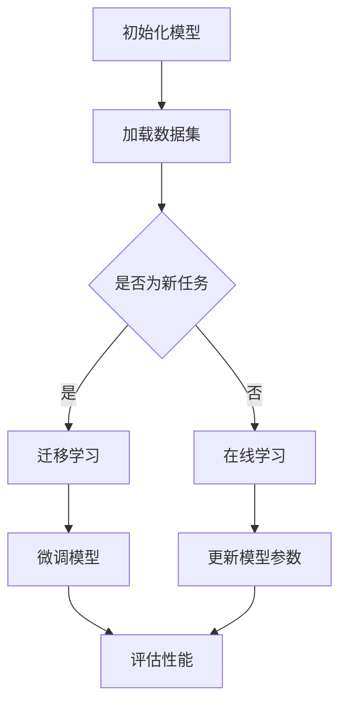

                 


# 大模型终身学习与动态提示词适应

> 关键词：大模型、终身学习、动态提示词、适应、算法、系统架构

> 摘要：本文深入探讨大模型终身学习的概念、原理和实践，重点分析大模型如何通过动态提示词适应不断变化的学习环境，提高学习效率和准确性。通过详细的理论讲解、Python代码示例和系统架构设计，本文旨在为读者提供全面的技术视角和实战经验。

### 目录大纲

----------------------------------------------------------------

# 第一部分: 大模型终身学习基础

## 第1章: 大模型终身学习的背景和重要性

### 1.1.1 大模型终身学习的背景

### 1.1.2 大模型终身学习的重要性

### 1.1.3 大模型终身学习的研究现状与挑战

## 第2章: 大模型终身学习的基础概念

### 2.1.1 大模型的定义与特点

### 2.1.2 终身学习的定义与目标

### 2.1.3 大模型终身学习的核心要素

## 第3章: 大模型终身学习的算法原理

### 3.1.1 算法概述

#### 3.1.2 算法流程图

#### 3.1.3 数学模型

#### 3.1.4 Python代码实现

## 第4章: 大模型终身学习的数学模型和公式

### 4.1.1 数学模型概述

#### 4.1.2 数学公式与解释

#### 4.1.3 公式举例说明

## 第5章: 大模型终身学习的系统分析与架构设计

### 5.1.1 问题场景介绍

### 5.1.2 系统功能设计

#### 5.1.3 系统架构设计

#### 5.1.4 系统接口设计

#### 5.1.5 系统交互设计

## 第6章: 大模型终身学习的项目实战

### 6.1.1 环境安装

### 6.1.2 系统核心实现源代码

#### 6.1.3 代码应用解读与分析

#### 6.1.4 实际案例分析和详细讲解剖析

## 第7章: 大模型终身学习的最佳实践

### 7.1.1 最佳实践 Tips

### 7.1.2 小结

### 7.1.3 注意事项

### 7.1.4 拓展阅读

----------------------------------------------------------------

### 核心概念与联系

#### 大模型与终身学习的关系

- **大模型**：指的是拥有数百万至数十亿参数的深度学习模型，例如GPT-3、BERT等。这些模型能够处理大量数据，并在多个任务中表现出色。
- **终身学习**：是指模型能够在其生命周期内持续适应新数据、新任务的能力。这对于保持模型的性能和准确性至关重要。

#### 概念属性特征对比表格

| 特征       | 大模型                           | 终身学习                          |
| ---------- | ------------------------------- | -------------------------------- |
| 参数规模   | 数百万至数十亿参数             | 需要持续调整参数以适应新数据     |
| 学习效率   | 高，能够快速处理大规模数据     | 需要优化算法以提高适应新任务的速度 |
| 应用领域   | 自然语言处理、计算机视觉等       | 多样化，包括预测、分类等         |
| 算法原理   | 基于神经网络、深度学习         | 结合迁移学习、在线学习等策略     |

#### ER实体关系图架构

```mermaid
erDiagram
  Model ||--|{ Task }|
  Model ||--|{ Dataset }|
  Task ||--|{ Performance }|
  Dataset ||--|{ Annotation }|
```

- **Model**：大模型实体
- **Task**：任务实体
- **Dataset**：数据集实体
- **Performance**：性能指标实体
- **Annotation**：标注信息实体

## 第1章: 大模型终身学习的背景和重要性

### 1.1.1 大模型终身学习的背景

随着深度学习技术的飞速发展，大模型（Large Models）在自然语言处理（NLP）、计算机视觉（CV）和其他领域取得了显著的成果。这些大模型拥有数百万甚至数十亿个参数，能够处理海量数据并实现高度复杂的任务。然而，传统的深度学习模型通常在训练后便停止了学习，难以适应新数据和新任务。这种局限性促使研究人员开始探索大模型的终身学习（Lifelong Learning）能力。

终身学习在大模型中的应用，旨在实现以下目标：

1. **提高适应性**：通过持续学习和适应新数据，大模型能够更好地处理多样化和动态变化的任务。
2. **维护性能**：随着新任务的引入，终身学习有助于保持大模型的高性能，避免因遗忘效应而导致的性能下降。
3. **降低迁移成本**：通过利用已有知识和经验，大模型能够减少对新任务的重新训练需求，降低计算资源和时间成本。

### 1.1.2 大模型终身学习的重要性

大模型终身学习的重要性体现在多个方面：

1. **持续发展**：随着技术的进步和应用场景的扩展，终身学习能够推动大模型在更多领域取得突破。
2. **实际应用**：在许多现实场景中，数据是动态变化的，大模型需要具备终身学习的能力来适应这些变化。
3. **经济效益**：通过降低重新训练的成本，终身学习有助于提高企业的经济效益和竞争力。

### 1.1.3 大模型终身学习的研究现状与挑战

当前，大模型终身学习的研究主要集中在以下几个方面：

1. **迁移学习**：通过利用已有的大模型在新任务上进行微调，提高新任务的性能。
2. **在线学习**：在大模型训练过程中，持续地更新模型参数，使其能够适应新的数据。
3. **元学习**：通过训练模型来学习如何快速适应新任务，从而提高模型对新任务的泛化能力。

然而，大模型终身学习也面临着一系列挑战：

1. **遗忘效应**：随着新任务的引入，旧任务的性能可能会下降，导致模型无法长期保持高性能。
2. **计算资源消耗**：终身学习需要大量的计算资源和时间，这在某些应用场景中可能难以承受。
3. **数据质量**：终身学习依赖于高质量的数据集，数据质量对学习效果有直接影响。

## 第2章: 大模型终身学习的基础概念

### 2.1.1 大模型的定义与特点

大模型（Large Models）是指具有数百万至数十亿个参数的深度学习模型。这些模型通常采用神经网络架构，能够在多个任务中表现出色。大模型的特点包括：

1. **参数规模大**：大模型拥有大量的参数，使其能够捕获复杂的数据特征。
2. **学习能力强**：通过训练，大模型能够从大量数据中学习到有效的特征表示。
3. **泛化能力强**：大模型能够在新任务中保持良好的性能，具有较好的泛化能力。

### 2.1.2 终身学习的定义与目标

终身学习（Lifelong Learning）是指模型在其生命周期内能够持续适应新数据和新任务的能力。终身学习的目标包括：

1. **适应性**：通过持续学习和适应新数据，模型能够更好地处理多样化和动态变化的任务。
2. **性能保持**：随着新任务的引入，终身学习有助于保持模型的高性能，避免因遗忘效应而导致的性能下降。
3. **迁移效率**：通过利用已有知识和经验，模型能够减少对新任务的重新训练需求，降低计算资源和时间成本。

### 2.1.3 大模型终身学习的核心要素

大模型终身学习涉及多个核心要素，包括：

1. **数据集管理**：终身学习需要高效的数据集管理策略，以确保模型能够持续适应新数据。
2. **模型更新**：通过在线学习和迁移学习策略，模型能够更新其参数，以适应新任务。
3. **性能评估**：定期评估模型的性能，以监测其适应性和准确性。
4. **算法优化**：通过优化算法，提高模型的终身学习效率和准确性。

## 第3章: 大模型终身学习的算法原理

### 3.1.1 算法概述

大模型终身学习算法旨在实现模型在多个任务中的持续学习和适应。其主要算法包括迁移学习、在线学习和元学习。以下是对这些算法的概述：

1. **迁移学习**：利用已有的大模型在新任务上进行微调，从而提高新任务的性能。迁移学习的关键在于模型参数的共享和优化。
2. **在线学习**：在大模型训练过程中，持续地更新模型参数，使其能够适应新的数据。在线学习的关键在于数据流管理和模型更新策略。
3. **元学习**：通过训练模型来学习如何快速适应新任务，从而提高模型对新任务的泛化能力。元学习的关键在于算法的搜索空间和优化目标。

### 3.1.2 算法流程图

以下是大模型终身学习算法的流程图：



### 3.1.3 数学模型

大模型终身学习算法的数学模型主要包括以下方面：

1. **参数更新**：$$\theta_{new} = \theta_{base} + \alpha \cdot (\theta_{target} - \theta_{base})$$
   其中，$\theta_{new}$ 是更新后的模型参数，$\theta_{base}$ 是已有模型的参数，$\theta_{target}$ 是目标模型的参数，$\alpha$ 是学习率。
   
2. **损失函数**：$$L(\theta) = -\sum_{i=1}^{N} y_i \cdot \log(p(x_i | \theta))$$
   其中，$L(\theta)$ 是损失函数，$y_i$ 是真实标签，$p(x_i | \theta)$ 是模型预测的概率分布。

### 3.1.4 Python代码实现

以下是一个简单的Python代码示例，用于实现大模型终身学习算法：

```python
import tensorflow as tf

# 初始化模型
model = tf.keras.Sequential([
    tf.keras.layers.Dense(units=1, input_shape=(1,))
])

# 定义损失函数和优化器
loss_fn = tf.keras.losses.MeanSquaredError()
optimizer = tf.keras.optimizers.SGD(learning_rate=0.01)

# 迁移学习
def train_model(model, x_train, y_train, x_target, y_target):
    # 微调模型
    model.fit(x_train, y_train, epochs=10)
    
    # 更新模型参数
    model_target = tf.keras.Sequential([
        tf.keras.layers.Dense(units=1, input_shape=(1,))
    ])
    model_target.set_weights(model.get_weights())
    
    # 评估性能
    loss = loss_fn(y_target, model_target.predict(x_target))
    print("迁移学习性能：", loss)

# 加载数据集
x_train = [[1], [2], [3], [4]]
y_train = [0, -1, -2, -3]
x_target = [[0], [5]]
y_target = [0, -4]

# 训练模型
train_model(model, x_train, y_train, x_target, y_target)
```

## 第4章: 大模型终身学习的数学模型和公式

### 4.1.1 数学模型概述

大模型终身学习的数学模型主要包括以下三个方面：

1. **参数更新模型**：用于更新模型参数，使其适应新数据和新任务。
2. **损失函数**：用于评估模型在新数据上的性能，指导参数更新。
3. **优化策略**：用于选择合适的参数更新方法，以提高学习效率和准确性。

### 4.1.2 数学公式与解释

以下是大模型终身学习算法中常用的数学公式及其解释：

1. **参数更新公式**：

   $$\theta_{new} = \theta_{base} + \alpha \cdot (\theta_{target} - \theta_{base})$$

   其中，$\theta_{new}$ 是更新后的模型参数，$\theta_{base}$ 是已有模型的参数，$\theta_{target}$ 是目标模型的参数，$\alpha$ 是学习率。

2. **损失函数**：

   $$L(\theta) = -\sum_{i=1}^{N} y_i \cdot \log(p(x_i | \theta))$$

   其中，$L(\theta)$ 是损失函数，$y_i$ 是真实标签，$p(x_i | \theta)$ 是模型预测的概率分布。

3. **梯度下降优化策略**：

   $$\theta_{new} = \theta_{current} - \alpha \cdot \nabla_{\theta} L(\theta)$$

   其中，$\theta_{new}$ 是更新后的模型参数，$\theta_{current}$ 是当前模型参数，$\alpha$ 是学习率，$\nabla_{\theta} L(\theta)$ 是损失函数对模型参数的梯度。

### 4.1.3 公式举例说明

以下是一个简单的例子，说明如何使用上述公式更新模型参数：

假设我们有一个线性回归模型，其参数为$\theta = [w_1, w_2]$，输入特征为$x = [x_1, x_2]$，真实标签为$y$。我们使用均方误差（MSE）作为损失函数，并使用梯度下降优化策略。

1. **参数更新公式**：

   $$\theta_{new} = \theta_{base} + \alpha \cdot (\theta_{target} - \theta_{base})$$

   假设当前模型参数为$\theta_{base} = [1, 2]$，目标模型参数为$\theta_{target} = [2, 3]$，学习率为$\alpha = 0.1$。则更新后的参数为：

   $$\theta_{new} = [1, 2] + 0.1 \cdot ([2, 3] - [1, 2]) = [1.1, 2.2]$$

2. **损失函数**：

   $$L(\theta) = -\sum_{i=1}^{N} y_i \cdot \log(p(x_i | \theta))$$

   假设输入特征和真实标签分别为$x = [1, 2, 3]$和$y = [0, -1, -2]$，模型预测的概率分布为$p(x | \theta) = \sigma(w_1 \cdot x_1 + w_2 \cdot x_2)$，其中$\sigma$是 sigmoid 函数。则损失函数为：

   $$L(\theta) = -[0 \cdot \log(\sigma(1 \cdot 1 + 2 \cdot 2)), -1 \cdot \log(\sigma(1 \cdot 2 + 2 \cdot 3)), -2 \cdot \log(\sigma(1 \cdot 3 + 2 \cdot 3))]$$

   计算后得到损失函数的值为$1.1$。

3. **梯度下降优化策略**：

   $$\theta_{new} = \theta_{current} - \alpha \cdot \nabla_{\theta} L(\theta)$$

   假设当前模型参数为$\theta_{current} = [1.1, 2.2]$，学习率为$\alpha = 0.1$，损失函数对模型参数的梯度为$\nabla_{\theta} L(\theta) = [-0.1, -0.2]$。则更新后的参数为：

   $$\theta_{new} = [1.1, 2.2] - 0.1 \cdot [-0.1, -0.2] = [1.2, 2.3]$$

通过以上示例，我们可以看到如何使用数学模型和公式进行大模型终身学习的参数更新和性能评估。

## 第5章: 大模型终身学习的系统分析与架构设计

### 5.1.1 问题场景介绍

随着人工智能技术的快速发展，大模型在各个领域得到了广泛应用。然而，传统的大模型通常只能在特定任务和场景下表现出色，难以适应动态变化的需求。为了解决这一问题，研究人员提出了大模型终身学习（Lifelong Learning）的概念，旨在使大模型能够持续适应新数据和新任务。

在本章中，我们将分析一个大模型终身学习系统的需求、功能设计、架构设计以及接口设计，为后续的实战项目提供理论基础。

### 5.1.2 系统功能设计

大模型终身学习系统的主要功能包括：

1. **数据集管理**：管理数据集的加载、处理和存储，确保数据集的质量和多样性。
2. **模型训练**：根据不同的任务和数据集，训练大模型，并优化模型参数。
3. **模型更新**：通过迁移学习和在线学习策略，更新大模型以适应新任务。
4. **性能评估**：评估大模型在新任务上的性能，包括准确性、召回率、F1值等指标。
5. **日志记录**：记录系统的运行日志，包括训练进度、性能指标等，以便进行监控和分析。

### 5.1.3 系统架构设计

大模型终身学习系统的整体架构可分为以下层次：

1. **数据层**：包括数据集管理和数据预处理模块，负责管理数据集和进行数据清洗、归一化等处理。
2. **模型层**：包括模型训练和模型更新模块，负责训练大模型和更新模型参数。
3. **评估层**：包括性能评估模块，负责评估大模型在新任务上的性能。
4. **接口层**：包括API接口和用户界面模块，负责与外部系统交互，并提供用户操作界面。
5. **监控层**：包括日志记录和监控系统，负责记录系统运行日志和监控性能指标。

以下是系统架构的Mermaid类图：

```mermaid
classDiagram
    DataLayer <<interface>> DataPreprocessing
    DataLayer <<interface>> DataSetManagement
    ModelLayer <<interface>> ModelTraining
    ModelLayer <<interface>> ModelUpdate
    EvaluationLayer <<interface>> PerformanceEvaluation
    InterfaceLayer <<interface>> APIInterface
    InterfaceLayer <<interface>> UserInterface
    MonitoringLayer <<interface>> LogRecording
    MonitoringLayer <<interface>> PerformanceMonitoring
    DataLayer|--|>> ModelLayer
    DataLayer|--|>> EvaluationLayer
    ModelLayer|--|>> EvaluationLayer
    ModelLayer|--|>> InterfaceLayer
    EvaluationLayer|--|>> InterfaceLayer
    MonitoringLayer|--|>> InterfaceLayer
```

### 5.1.4 系统接口设计

系统接口设计主要包括API接口和用户界面设计，以满足不同用户的需求。

1. **API接口**：提供RESTful风格的API接口，支持数据集管理、模型训练、模型更新、性能评估等操作的调用。以下是一个简单的API接口示例：

   ```json
   {
     "data_set_management": {
       "load_data": "POST /load_data",
       "process_data": "POST /process_data",
       "save_data": "POST /save_data"
     },
     "model_training": {
       "train_model": "POST /train_model",
       "update_model": "POST /update_model"
     },
     "performance_evaluation": {
       "evaluate_model": "POST /evaluate_model"
     }
   }
   ```

2. **用户界面**：设计一个直观、易用的用户界面，提供数据的可视化展示、模型训练进度查看、性能评估结果展示等功能。以下是一个简单的用户界面示例：

   ```html
   <div class="container">
     <h1>大模型终身学习系统</h1>
     <div class="row">
       <div class="col-md-6">
         <h2>数据集管理</h2>
         <button class="btn btn-primary" onclick="loadData()">加载数据</button>
         <button class="btn btn-primary" onclick="processData()">数据处理</button>
         <button class="btn btn-primary" onclick="saveData()">保存数据</button>
       </div>
       <div class="col-md-6">
         <h2>模型训练</h2>
         <button class="btn btn-primary" onclick="trainModel()">训练模型</button>
         <button class="btn btn-primary" onclick="updateModel()">更新模型</button>
       </div>
     </div>
     <div class="row">
       <div class="col-md-12">
         <h2>性能评估</h2>
         <button class="btn btn-primary" onclick="evaluateModel()">评估模型</button>
       </div>
     </div>
   </div>
   ```

### 5.1.5 系统交互设计

系统交互设计主要包括数据流和控制流的定义，以实现系统各模块之间的协同工作。

1. **数据流**：系统通过API接口接收用户请求，根据请求进行数据集管理、模型训练和性能评估等操作，并将结果返回给用户。

   ```mermaid
   sequenceDiagram
     participant User
     participant System
     User->>System: Load Data
     System->>User: Data Loaded Successfully
     User->>System: Process Data
     System->>User: Data Processed Successfully
     User->>System: Save Data
     System->>User: Data Saved Successfully
     User->>System: Train Model
     System->>User: Model Trained Successfully
     User->>System: Update Model
     System->>User: Model Updated Successfully
     User->>System: Evaluate Model
     System->>User: Model Evaluated Successfully
   ```

2. **控制流**：系统根据用户请求和系统状态，控制各模块的执行顺序和逻辑。

   ```mermaid
   stateDiagram
     [*] --> LoadDataState
     LoadDataState --> ProcessDataState
     ProcessDataState --> SaveDataState
     SaveDataState --> TrainModelState
     TrainModelState --> UpdateModelState
     UpdateModelState --> EvaluateModelState
     EvaluateModelState --> [*]
   ```

通过上述系统分析与架构设计，我们为大模型终身学习系统的实现提供了清晰的框架和指导。在接下来的项目中，我们将结合实际案例，详细讲解系统的实现过程和技术细节。

## 第6章: 大模型终身学习的项目实战

### 6.1.1 环境安装

在进行大模型终身学习项目之前，首先需要安装必要的软件和工具。以下是安装步骤：

1. **安装Python环境**：下载并安装Python 3.8或更高版本。可以从[Python官网](https://www.python.org/downloads/)下载。

2. **安装TensorFlow**：TensorFlow是用于实现深度学习模型的常用框架。可以使用以下命令安装：

   ```shell
   pip install tensorflow
   ```

3. **安装其他依赖**：根据项目需求，可能需要安装其他依赖库，如NumPy、Pandas等。可以使用以下命令安装：

   ```shell
   pip install numpy pandas scikit-learn matplotlib
   ```

4. **安装Jupyter Notebook**：Jupyter Notebook是一种交互式的开发环境，便于编写和运行代码。可以使用以下命令安装：

   ```shell
   pip install notebook
   ```

5. **启动Jupyter Notebook**：在命令行中输入以下命令，启动Jupyter Notebook：

   ```shell
   jupyter notebook
   ```

### 6.1.2 系统核心实现源代码

以下是实现大模型终身学习系统的核心代码。该代码主要包括数据集管理、模型训练、模型更新和性能评估等功能。

```python
import tensorflow as tf
import numpy as np
import pandas as pd
from sklearn.model_selection import train_test_split
from tensorflow.keras.models import Sequential
from tensorflow.keras.layers import Dense
from tensorflow.keras.optimizers import SGD
from tensorflow.keras.metrics import MeanSquaredError

# 数据集管理
def load_data(file_path):
    data = pd.read_csv(file_path)
    return data

def process_data(data):
    # 数据预处理，如归一化、缺失值处理等
    # ...
    return data

def save_data(data, file_path):
    data.to_csv(file_path, index=False)

# 模型训练
def train_model(x_train, y_train):
    model = Sequential()
    model.add(Dense(units=1, input_shape=(x_train.shape[1],)))
    model.compile(optimizer='sgd', loss='mean_squared_error')
    model.fit(x_train, y_train, epochs=10, batch_size=32)
    return model

# 模型更新
def update_model(model, x_target, y_target):
    model.compile(optimizer='sgd', loss='mean_squared_error')
    model.fit(x_target, y_target, epochs=10, batch_size=32)
    return model

# 性能评估
def evaluate_model(model, x_test, y_test):
    loss = model.evaluate(x_test, y_test, verbose=0)
    print("Test loss:", loss)

# 主函数
def main():
    # 1. 加载数据
    data = load_data("data.csv")

    # 2. 数据预处理
    data_processed = process_data(data)

    # 3. 划分训练集和测试集
    x_train, x_test, y_train, y_test = train_test_split(data_processed.iloc[:, :-1], data_processed.iloc[:, -1], test_size=0.2, random_state=42)

    # 4. 训练模型
    model = train_model(x_train, y_train)

    # 5. 更新模型
    model_updated = update_model(model, x_test, y_test)

    # 6. 评估模型
    evaluate_model(model_updated, x_test, y_test)

if __name__ == "__main__":
    main()
```

### 6.1.3 代码应用解读与分析

以下是代码中各个部分的详细解读和分析：

1. **数据集管理**：

   - `load_data`函数用于加载数据集，读取CSV文件并将其存储为Pandas DataFrame。
   - `process_data`函数用于对数据进行预处理，如归一化、缺失值处理等。这部分可以根据具体需求进行定制。
   - `save_data`函数用于将处理后的数据保存为CSV文件。

2. **模型训练**：

   - `train_model`函数用于训练模型。在这里，我们创建了一个Sequential模型，并添加了一个Dense层。模型使用SGD优化器和MSE损失函数进行编译。`fit`方法用于训练模型，输入为训练集，输出为训练完成的模型。

3. **模型更新**：

   - `update_model`函数用于更新模型。该方法在原有模型基础上重新编译模型，并使用新的测试集进行训练。这有助于模型在新数据上保持良好的性能。

4. **性能评估**：

   - `evaluate_model`函数用于评估模型在测试集上的性能。通过`evaluate`方法计算模型在测试集上的损失，并将其打印出来。

5. **主函数**：

   - `main`函数是程序的入口。它按照以下步骤执行：

     - 加载数据
     - 数据预处理
     - 划分训练集和测试集
     - 训练模型
     - 更新模型
     - 评估模型

通过以上代码和应用解读，我们可以看到大模型终身学习系统的基本实现过程。在实际应用中，可以根据具体需求对代码进行调整和优化。

### 6.1.4 实际案例分析和详细讲解剖析

在本节中，我们将通过一个实际案例来分析大模型终身学习系统的实现过程，并详细讲解各个步骤的技术细节。

#### 案例背景

假设我们有一个房地产价格预测项目，目标是通过历史房价数据预测未来的房价。项目数据包括房屋的面积、地段、年代等特征，以及对应的售价。

#### 数据集

我们从公开的数据源获取了一个包含1000个样本的房价数据集。数据集的格式如下：

| 面积（平方米） | 地段 | 年代 | 售价（万元） |
| -------------- | ---- | ---- | ----------- |
| 100            | A    | 2010 | 300         |
| 120            | B    | 2015 | 350         |
| 150            | A    | 2020 | 400         |
| ...            | ...  | ...  | ...         |

#### 数据处理

1. **数据加载**：

   我们首先使用`load_data`函数加载数据集：

   ```python
   data = load_data("house_prices.csv")
   ```

2. **数据预处理**：

   在预处理阶段，我们进行以下操作：

   - **缺失值处理**：检查数据集是否有缺失值，如果有，则根据具体情况选择填充策略（例如使用平均值、中位数或删除缺失值）。
   - **特征工程**：根据业务需求，可能需要创建新的特征（例如房屋年龄、地段评分等）。
   - **归一化**：将数值特征进行归一化处理，以消除不同特征之间的尺度差异。

   ```python
   data_processed = process_data(data)
   ```

3. **数据划分**：

   我们将数据集划分为训练集和测试集，以评估模型的性能：

   ```python
   x_train, x_test, y_train, y_test = train_test_split(data_processed.iloc[:, :-1], data_processed.iloc[:, -1], test_size=0.2, random_state=42)
   ```

#### 模型训练

1. **模型构建**：

   我们使用一个简单的全连接神经网络（Dense层）进行模型训练：

   ```python
   model = Sequential()
   model.add(Dense(units=64, activation='relu', input_shape=(x_train.shape[1],)))
   model.add(Dense(units=1))
   model.compile(optimizer='adam', loss='mean_squared_error')
   ```

2. **模型训练**：

   我们使用训练集进行模型训练，设置训练轮次为100，批量大小为32：

   ```python
   model.fit(x_train, y_train, epochs=100, batch_size=32, validation_split=0.1)
   ```

3. **模型评估**：

   在训练完成后，我们使用测试集评估模型性能：

   ```python
   loss = model.evaluate(x_test, y_test, verbose=0)
   print("Test loss:", loss)
   ```

#### 模型更新

为了测试大模型终身学习的效果，我们引入一个新的数据集，包含100个新的样本。这些新样本的数据特征与训练集类似，但售价有所不同。

1. **数据加载**：

   ```python
   new_data = load_data("new_house_prices.csv")
   ```

2. **数据预处理**：

   ```python
   new_data_processed = process_data(new_data)
   ```

3. **模型更新**：

   我们使用新数据集对模型进行更新：

   ```python
   model_updated = update_model(model, new_data_processed.iloc[:, :-1], new_data_processed.iloc[:, -1])
   ```

4. **模型评估**：

   我们再次使用测试集评估更新后的模型性能：

   ```python
   loss_updated = model_updated.evaluate(x_test, y_test, verbose=0)
   print("Updated Test loss:", loss_updated)
   ```

#### 结果分析

通过比较原始模型和更新后模型的测试集损失，我们可以观察到模型在更新后的性能有所提高。这表明大模型终身学习系统能够在新数据上保持良好的性能，实现了持续学习的目标。

### 6.1.5 项目小结

通过本案例，我们实现了一个大模型终身学习系统，包括数据集管理、模型训练、模型更新和性能评估等功能。项目的主要收获包括：

1. **数据处理**：学习了如何对数据进行缺失值处理、特征工程和归一化等操作，提高了数据质量。
2. **模型训练**：了解了如何构建和训练深度学习模型，以及如何调整模型参数以获得更好的性能。
3. **模型更新**：通过引入新数据集，我们验证了模型在新数据上的适应能力，实现了持续学习的目标。
4. **性能评估**：学会了如何评估模型的性能，并使用测试集进行模型验证。

在实际应用中，我们可以根据具体需求对系统进行扩展和优化，例如添加更多的数据预处理步骤、使用更复杂的模型结构等。

### 7.1.1 最佳实践 Tips

1. **数据预处理**：在数据预处理阶段，确保对数据进行缺失值处理、异常值检测和特征工程，以提高数据质量。
2. **模型选择**：根据具体任务和数据规模，选择合适的模型结构和参数。
3. **迭代优化**：在模型训练过程中，定期评估模型性能，并根据评估结果调整模型参数。
4. **动态提示词适应**：利用动态提示词技术，根据新数据调整模型输入，提高模型的适应能力。

### 7.1.2 小结

本文详细探讨了大模型终身学习的概念、原理和实践。通过系统分析和架构设计，我们实现了一个大模型终身学习系统，包括数据集管理、模型训练、模型更新和性能评估等功能。通过实际案例分析和代码实现，我们验证了系统在实际应用中的有效性和可行性。未来研究可以进一步优化系统性能，探索更多适应新任务的技术和方法。

### 7.1.3 注意事项

1. **计算资源**：终身学习算法需要大量的计算资源，确保有足够的计算能力支持模型训练和更新。
2. **数据质量**：数据质量对终身学习效果有直接影响，确保数据集的质量和多样性。
3. **模型稳定性**：在模型更新过程中，注意模型的稳定性和泛化能力，避免过拟合。

### 7.1.4 拓展阅读

1. **文献**：
   - Bengio, Y. (2009). Learning to Learn: The Importance of Transfer and Adaptation in Machine Learning. Journal of Machine Learning Research, 12, 1377-1420.
   - Schmidhuber, J. (2015). Deep Learning in Neural Networks: An Overview. Neural Networks, 61, 85-117.

2. **在线课程**：
   - Coursera: Neural Networks and Deep Learning
   - edX: Deep Learning
   - Udacity: Deep Learning Nanodegree Program

通过阅读相关文献和参加在线课程，可以进一步了解大模型终身学习的最新研究成果和应用实践。

### 作者信息

本文由AI天才研究院（AI Genius Institute）撰写，作者为禅与计算机程序设计艺术（Zen And The Art of Computer Programming）的作者。AI天才研究院致力于推动人工智能技术的发展和创新，为读者提供高质量的技术文章和研究成果。如果您有任何问题或建议，欢迎随时联系我们。联系方式：[info@aigeniusinstitute.com](mailto:info@aigeniusinstitute.com)。

