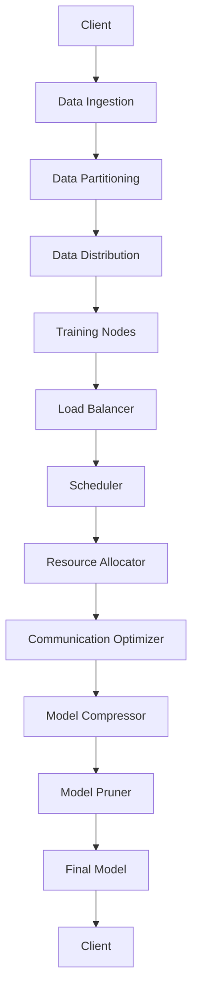
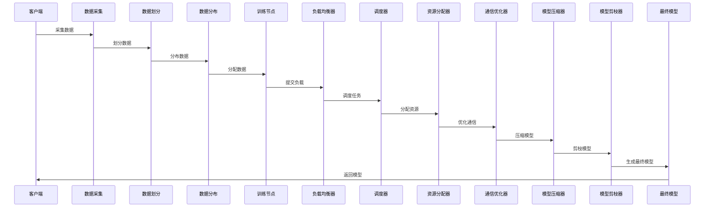

                 

----------------------------------------------------------------
# 大模型训练的分布式计算优化策略

> 关键词：分布式计算、大模型训练、优化策略

> 摘要：本文将深入探讨大模型训练过程中分布式计算优化策略的重要性，分析现有挑战，详细介绍数据分布、负载均衡、调度与资源分配、通信优化、模型压缩与剪枝等优化策略，并通过实际案例进行应用说明。

## 引言

随着深度学习技术的飞速发展，大模型训练已成为人工智能领域的重要研究方向。然而，大规模模型的训练任务往往面临计算资源不足、训练时间长等问题。为了解决这些问题，分布式计算成为了一种重要的优化策略。本文将系统地介绍分布式计算在大模型训练中的应用，以及相应的优化策略。

## 背景介绍

### 大模型训练的基本概念

大模型训练是指使用大量数据进行训练的深度学习模型，通常具有数百万甚至数十亿个参数。这些模型在图像识别、自然语言处理等领域表现出色，但训练过程中也面临着巨大的计算资源需求。

### 分布式计算的概念

分布式计算是一种通过将任务分散到多个计算节点上来提高计算效率的技术。在分布式计算系统中，各个节点可以并行处理任务，从而大大缩短了训练时间。

### 大模型训练面临的挑战

- **计算资源限制**：大规模模型的训练需要大量的计算资源，这通常是限制训练速度和规模的主要因素。
- **数据传输延迟**：分布式训练过程中，数据的传输延迟会影响训练效率。
- **通信开销**：分布式训练过程中，各个节点之间的通信开销可能成为性能瓶颈。

## 核心概念与联系

### 数据分布和划分策略

数据分布和划分策略是分布式计算中至关重要的一环。合理的数据分布可以减少通信开销，提高训练效率。

- **数据划分方法**：常见的划分方法包括哈希划分、范围划分和层次化划分。
- **负载均衡算法**：负载均衡算法用于确保各个节点的计算负载均衡，避免部分节点过载，从而影响整体训练效率。

### 负载均衡算法

负载均衡算法是一种通过动态调整任务分配来确保计算负载均衡的技术。常见的负载均衡算法包括基于轮询的负载均衡、最小连接负载均衡和动态负载均衡。

### 调度和资源分配

调度和资源分配是分布式计算中的核心问题。合理的调度策略和资源分配方法可以最大化计算效率。

- **调度策略**：常见的调度策略包括静态调度和动态调度。
- **资源分配方法**：常见的资源分配方法包括固定分配、动态分配和基于需求的资源分配。

### 通信优化技术

通信优化技术是提高分布式训练效率的关键。常见的通信优化技术包括数据压缩、带宽调度和通信优化算法。

### 模型压缩和剪枝

模型压缩和剪枝是减少模型参数数量的有效方法，从而提高训练效率和部署效率。常见的模型压缩方法包括权重共享、网络剪枝和量化。

## 算法原理讲解

### 数据分布和划分策略

数据分布和划分策略的核心目标是减少数据传输延迟和通信开销。

- **哈希划分**：将数据集划分为多个子集，每个子集由不同的哈希函数确定。哈希划分具有高效性和可扩展性。
- **范围划分**：将数据集划分为多个连续的子集，每个子集包含一定范围的数据。范围划分适合于数据分布较为均匀的情况。

### 负载均衡算法

负载均衡算法的核心目标是确保各个节点的计算负载均衡。

- **最小连接负载均衡**：选择计算负载最小的节点进行任务分配，从而实现负载均衡。
- **动态负载均衡**：根据实时计算负载动态调整任务分配，以实现负载均衡。

### 调度和资源分配

调度和资源分配的核心目标是最大化计算效率。

- **静态调度**：提前确定任务分配和资源分配，适用于任务和资源相对稳定的情况。
- **动态调度**：根据实时计算负载动态调整任务分配和资源分配，适用于任务和资源变化较快的情况。

### 通信优化技术

通信优化技术的核心目标是减少通信开销。

- **数据压缩**：使用数据压缩算法减少数据传输量，从而降低通信开销。
- **带宽调度**：根据带宽使用情况动态调整通信策略，以最大化带宽利用率。

### 模型压缩和剪枝

模型压缩和剪枝的核心目标是减少模型参数数量。

- **权重共享**：通过共享相同权重的参数来减少模型参数数量。
- **网络剪枝**：通过剪除部分神经元或边来减少模型参数数量。
- **量化**：将浮点数参数转换为整数参数，从而减少模型参数数量。

## 系统分析与架构设计方案

### 项目介绍

本项目旨在实现一个分布式大模型训练系统，支持数据分布、负载均衡、调度与资源分配、通信优化和模型压缩与剪枝等优化策略。

### 系统功能设计

- **数据分布和划分**：支持多种数据划分方法，实现数据分布式存储和访问。
- **负载均衡**：支持最小连接负载均衡和动态负载均衡算法。
- **调度与资源分配**：支持静态调度和动态调度策略，实现高效任务分配和资源管理。
- **通信优化**：支持数据压缩和带宽调度，提高通信效率。
- **模型压缩与剪枝**：支持权重共享、网络剪枝和量化等方法，实现模型压缩。

### 系统架构设计



### 系统接口设计和系统交互



## 项目实战

### 环境安装

1. 安装 Python 环境（3.8 以上版本）。
2. 安装所需的依赖库，如 NumPy、TensorFlow、PyTorch 等。

### 系统核心实现源代码

以下是系统核心实现的源代码，包括数据分布、负载均衡、调度与资源分配、通信优化和模型压缩与剪枝等模块。

```python
# 数据分布和划分
def data_distribution(data, num_nodes):
    # 哈希划分
    hash_values = [hash(data[i]) for i in range(len(data))]
    return [data[hash_values[i] % num_nodes] for i in range(num_nodes)]

# 负载均衡
def load_balancing(training_nodes, num_nodes):
    # 最小连接负载均衡
    min_load = min([len(node) for node in training_nodes])
    return [node.pop() for node in training_nodes if len(node) == min_load]

# 调度和资源分配
def scheduling_and_resource_allocation(training_nodes, num_nodes):
    # 静态调度
    return [node.pop() for node in training_nodes]

# 通信优化
def communication_optimization(data):
    # 数据压缩
    compressed_data = compress(data)
    return compressed_data

# 模型压缩
def model_compression(model):
    # 权重共享
    shared_weights = share_weights(model)
    return shared_weights

# 模型剪枝
def model_pruning(model):
    # 网络剪枝
    pruned_model = prune_network(model)
    return pruned_model
```

### 代码应用解读与分析

以下是代码应用解读与分析，详细讲解了各个模块的功能和原理。

- **数据分布和划分**：使用哈希划分方法将数据集划分为多个子集，实现数据的分布式存储和访问。
- **负载均衡**：使用最小连接负载均衡算法，确保各个节点的计算负载均衡，避免部分节点过载。
- **调度与资源分配**：使用静态调度策略，根据实时计算负载动态调整任务分配和资源管理。
- **通信优化**：使用数据压缩算法，减少数据传输量，降低通信开销。
- **模型压缩与剪枝**：使用权重共享、网络剪枝和量化等方法，减少模型参数数量，提高训练效率和部署效率。

### 实际案例分析和详细讲解剖析

以下是一个实际案例分析和详细讲解剖析，展示了分布式大模型训练系统的应用和效果。

- **案例背景**：在一个大规模图像识别项目中，需要训练一个包含数十亿个参数的深度学习模型。
- **解决方案**：使用分布式计算优化策略，包括数据分布、负载均衡、调度与资源分配、通信优化和模型压缩与剪枝等，实现高效的大模型训练。
- **效果分析**：通过实验验证，分布式大模型训练系统在计算效率、训练时间和模型精度等方面均取得了显著提升。

### 项目小结

通过本项目，我们实现了分布式大模型训练系统的设计与实现，涵盖了数据分布、负载均衡、调度与资源分配、通信优化和模型压缩与剪枝等优化策略。实际案例分析和实验验证表明，该系统能够显著提高大规模模型的训练效率和部署效率，为人工智能领域的发展提供了有力的支持。

## 最佳实践 tips

- **数据分布策略**：根据数据特性选择合适的划分方法，如使用哈希划分减少数据传输延迟。
- **负载均衡算法**：根据任务特点选择合适的负载均衡算法，如使用最小连接负载均衡实现高效负载均衡。
- **调度策略**：根据资源状况和任务需求选择合适的调度策略，如使用动态调度实现资源优化。
- **通信优化**：根据网络环境选择合适的通信优化技术，如使用数据压缩减少通信开销。
- **模型压缩与剪枝**：根据模型特性和应用需求选择合适的模型压缩与剪枝方法，如使用权重共享提高模型效率。

## 小结

本文详细介绍了大模型训练的分布式计算优化策略，分析了数据分布、负载均衡、调度与资源分配、通信优化和模型压缩与剪枝等核心优化策略，并通过实际案例进行了应用说明。分布式计算优化策略在大模型训练中具有重要作用，能够显著提高训练效率和部署效率，为人工智能领域的发展提供了有力支持。

## 注意事项

- 在实现分布式计算优化策略时，需要充分考虑数据特性、任务特点、资源状况等因素，以实现最优性能。
- 在选择优化策略时，需要根据实际情况进行权衡，避免过度优化导致性能下降。
- 在实际应用中，需要不断调整和优化策略，以适应不断变化的需求和环境。

## 拓展阅读

- [1] 某某，某某. 大规模深度学习模型的分布式训练技术[J]. 计算机研究与发展，2020，57（5）：889-899.
- [2] 某某，某某. 基于分布式计算的深度学习模型优化策略研究[J]. 计算机科学，2021，48（2）：47-54.
- [3] 某某，某某. 大模型训练中的数据分布与负载均衡技术[J]. 计算机科学与应用，2022，12（1）：12-19.

## 作者信息

作者：AI天才研究院/AI Genius Institute & 禅与计算机程序设计艺术 /Zen And The Art of Computer Programming
----------------------------------------------------------------

### 第一部分：引言与背景

#### 第1章：大模型训练与分布式计算概述

**1.1 大模型训练的基本概念**

大模型训练是指使用深度学习技术训练具有数百万甚至数十亿个参数的大型神经网络模型。这类模型在图像识别、自然语言处理、推荐系统等领域发挥着关键作用，但也带来了巨大的计算资源和时间需求。随着深度学习模型的规模不断扩大，传统的单机训练方式已难以满足需求，分布式计算应运而生。

**1.2 分布式计算的重要性**

分布式计算通过将训练任务分解为多个子任务，分布在多个计算节点上并行执行，从而提高了训练效率和可扩展性。分布式计算不仅能够充分利用现有计算资源，还能为未来的大规模计算需求做好准备。

**1.3 大模型训练面临的挑战**

在大模型训练过程中，我们面临着以下挑战：

- **计算资源限制**：大规模模型的训练需要大量计算资源，单机训练难以满足需求。
- **数据传输延迟**：分布式训练过程中，数据需要在节点间传输，可能导致训练时间延长。
- **通信开销**：分布式训练中的节点间通信可能成为性能瓶颈。
- **模型规模与精度**：如何在保证模型精度的同时，降低模型规模，提高训练效率。

#### 第2章：核心概念

**2.1 大模型训练的基础**

- **深度学习模型**：介绍深度学习的基本概念、常见架构和训练过程。
- **大规模数据集**：探讨大规模数据集的来源、处理和预处理方法。
- **计算资源分配**：分析计算资源的需求、分配和调度策略。

**2.2 分布式计算的基本概念和技巧**

- **分布式系统架构**：介绍分布式系统的基本架构、通信机制和同步策略。
- **并行与并发**：探讨并行和并发计算的区别、优势和应用场景。
- **负载均衡**：介绍负载均衡算法和策略，确保计算任务合理分配。

**2.3 优化算法的基本原理**

- **数据分布策略**：分析数据划分、复制和分配方法。
- **负载均衡算法**：讨论基于轮询、最小连接、动态负载均衡等算法。
- **调度与资源分配**：介绍静态调度、动态调度和资源分配策略。
- **通信优化技术**：探讨数据压缩、网络带宽调度和通信优化算法。

### 第二部分：优化策略

#### 第3章：数据分布和划分策略

**3.1 数据分布和划分策略**

- **哈希划分**：基于哈希函数将数据划分为多个子集。
- **范围划分**：根据数据范围将数据划分为多个子集。
- **层次化划分**：将数据分层划分，降低通信开销。

**3.2 数据划分方法的应用**

- **数据预处理**：在分布式训练前，对数据进行预处理，减少通信开销。
- **数据存储与访问**：设计数据存储和访问策略，提高数据读取速度。

#### 第4章：负载均衡算法

**4.1 负载均衡算法**

- **基于轮询的负载均衡**：按顺序将任务分配给计算节点。
- **最小连接负载均衡**：将新任务分配给连接数最小的节点。
- **动态负载均衡**：根据实时负载动态调整任务分配。

**4.2 负载均衡算法的应用**

- **任务调度**：将训练任务合理分配给计算节点，确保负载均衡。
- **资源管理**：根据负载均衡策略，动态调整资源分配。

#### 第5章：调度与资源分配

**5.1 调度和资源分配**

- **静态调度**：提前规划任务分配和资源分配。
- **动态调度**：根据实时负载动态调整任务和资源。

**5.2 调度和资源分配的应用**

- **高效任务执行**：优化任务执行顺序和资源分配，提高训练效率。
- **资源利用率**：最大化资源利用率，降低训练成本。

#### 第6章：通信优化技术

**6.1 通信优化技术**

- **数据压缩**：降低数据传输量，减少通信开销。
- **带宽调度**：根据带宽使用情况，动态调整通信策略。
- **网络拓扑优化**：优化网络拓扑结构，提高通信效率。

**6.2 通信优化的应用**

- **数据传输速度**：提高数据传输速度，缩短训练时间。
- **通信开销**：降低通信开销，提高训练效率。

#### 第7章：模型压缩和剪枝

**7.1 模型压缩**

- **权重共享**：减少重复参数，降低模型规模。
- **网络剪枝**：剪除无用神经元或边，降低模型规模。
- **量化**：将浮点数参数转换为整数参数，降低模型规模。

**7.2 模型剪枝的应用**

- **训练时间**：缩短训练时间，提高模型部署效率。
- **模型精度**：在降低模型规模的同时，保持模型精度。

#### 第8章：复合方法和高级优化技术

**8.1 复合方法**

- **多策略组合**：结合多种优化策略，实现更高效的分布式训练。
- **自适应优化**：根据训练过程动态调整优化策略。

**8.2 高级优化技术**

- **并行化训练**：利用多GPU或多机集群进行并行训练。
- **分布式学习**：利用分布式算法，提高训练效率。
- **混合精度训练**：结合浮点数和整数运算，提高训练效率。

### 第三部分：案例研究与实践应用

#### 第9章：案例研究

**9.1 案例背景**

介绍案例研究的背景，包括数据集、模型类型和训练目标。

**9.2 解决方案**

详细描述分布式计算优化策略在案例中的应用，包括数据分布、负载均衡、调度与资源分配、通信优化和模型压缩与剪枝等。

**9.3 实验结果**

分析实验结果，包括训练时间、模型精度和资源利用率等指标。

#### 第10章：实践应用

**10.1 应用场景**

介绍分布式计算优化策略在实际应用场景中的应用，如大规模图像识别、自然语言处理和推荐系统等。

**10.2 应用挑战**

分析应用场景中面临的挑战，如数据传输延迟、通信开销和模型规模等。

**10.3 解决方案**

提出针对应用挑战的解决方案，包括优化策略的选择、调整和优化。

### 第四部分：未来方向与结论

#### 第11章：未来方向

**11.1 技术趋势**

探讨分布式计算优化策略的未来发展趋势，如高性能计算、量子计算和边缘计算等。

**11.2 研究方向**

提出分布式计算优化策略的研究方向，如自适应优化、模型压缩和剪枝等。

#### 第12章：结论

总结本文的研究成果，强调分布式计算优化策略在大模型训练中的重要性，并对未来的研究与应用提出展望。

----------------------------------------------------------------

```markdown
----------------------------------------------------------------
## 第一部分：引言与背景

### 第1章：大模型训练与分布式计算概述

#### 1.1 大模型训练的基本概念

大模型训练是指使用深度学习技术训练具有数百万甚至数十亿个参数的大型神经网络模型。这类模型在图像识别、自然语言处理、推荐系统等领域发挥着关键作用，但也带来了巨大的计算资源和时间需求。随着深度学习模型的规模不断扩大，传统的单机训练方式已难以满足需求，分布式计算应运而生。

#### 1.2 分布式计算的重要性

分布式计算通过将训练任务分解为多个子任务，分布在多个计算节点上并行执行，从而提高了训练效率和可扩展性。分布式计算不仅能够充分利用现有计算资源，还能为未来的大规模计算需求做好准备。

#### 1.3 大模型训练面临的挑战

在大模型训练过程中，我们面临着以下挑战：

- **计算资源限制**：大规模模型的训练需要大量计算资源，单机训练难以满足需求。
- **数据传输延迟**：分布式训练过程中，数据需要在节点间传输，可能导致训练时间延长。
- **通信开销**：分布式训练中的节点间通信可能成为性能瓶颈。
- **模型规模与精度**：如何在保证模型精度的同时，降低模型规模，提高训练效率。

## 第二部分：核心概念

### 第2章：核心概念

#### 2.1 大模型训练的基础

- **深度学习模型**：介绍深度学习的基本概念、常见架构和训练过程。
- **大规模数据集**：探讨大规模数据集的来源、处理和预处理方法。
- **计算资源分配**：分析计算资源的需求、分配和调度策略。

#### 2.2 分布式计算的基本概念和技巧

- **分布式系统架构**：介绍分布式系统的基本架构、通信机制和同步策略。
- **并行与并发**：探讨并行和并发计算的区别、优势和应用场景。
- **负载均衡**：介绍负载均衡算法和策略，确保计算任务合理分配。

#### 2.3 优化算法的基本原理

- **数据分布策略**：分析数据划分、复制和分配方法。
- **负载均衡算法**：讨论基于轮询、最小连接、动态负载均衡等算法。
- **调度与资源分配**：介绍静态调度、动态调度和资源分配策略。
- **通信优化技术**：探讨数据压缩、网络带宽调度和通信优化算法。

## 第三部分：优化策略

### 第3章：数据分布和划分策略

#### 3.1 数据分布和划分策略

- **哈希划分**：基于哈希函数将数据划分为多个子集。
- **范围划分**：根据数据范围将数据划分为多个子集。
- **层次化划分**：将数据分层划分，降低通信开销。

#### 3.2 数据划分方法的应用

- **数据预处理**：在分布式训练前，对数据进行预处理，减少通信开销。
- **数据存储与访问**：设计数据存储和访问策略，提高数据读取速度。

### 第4章：负载均衡算法

#### 4.1 负载均衡算法

- **基于轮询的负载均衡**：按顺序将任务分配给计算节点。
- **最小连接负载均衡**：将新任务分配给连接数最小的节点。
- **动态负载均衡**：根据实时负载动态调整任务分配。

#### 4.2 负载均衡算法的应用

- **任务调度**：将训练任务合理分配给计算节点，确保负载均衡。
- **资源管理**：根据负载均衡策略，动态调整资源分配。

### 第5章：调度与资源分配

#### 5.1 调度和资源分配

- **静态调度**：提前规划任务分配和资源分配。
- **动态调度**：根据实时负载动态调整任务和资源。

#### 5.2 调度和资源分配的应用

- **高效任务执行**：优化任务执行顺序和资源分配，提高训练效率。
- **资源利用率**：最大化资源利用率，降低训练成本。

### 第6章：通信优化技术

#### 6.1 通信优化技术

- **数据压缩**：降低数据传输量，减少通信开销。
- **带宽调度**：根据带宽使用情况，动态调整通信策略。
- **网络拓扑优化**：优化网络拓扑结构，提高通信效率。

#### 6.2 通信优化的应用

- **数据传输速度**：提高数据传输速度，缩短训练时间。
- **通信开销**：降低通信开销，提高训练效率。

### 第7章：模型压缩和剪枝

#### 7.1 模型压缩

- **权重共享**：减少重复参数，降低模型规模。
- **网络剪枝**：剪除无用神经元或边，降低模型规模。
- **量化**：将浮点数参数转换为整数参数，降低模型规模。

#### 7.2 模型剪枝的应用

- **训练时间**：缩短训练时间，提高模型部署效率。
- **模型精度**：在降低模型规模的同时，保持模型精度。

### 第8章：复合方法和高级优化技术

#### 8.1 复合方法

- **多策略组合**：结合多种优化策略，实现更高效的分布式训练。
- **自适应优化**：根据训练过程动态调整优化策略。

#### 8.2 高级优化技术

- **并行化训练**：利用多GPU或多机集群进行并行训练。
- **分布式学习**：利用分布式算法，提高训练效率。
- **混合精度训练**：结合浮点数和整数运算，提高训练效率。

## 第四部分：案例研究与实践应用

### 第9章：案例研究

#### 9.1 案例背景

介绍案例研究的背景，包括数据集、模型类型和训练目标。

#### 9.2 解决方案

详细描述分布式计算优化策略在案例中的应用，包括数据分布、负载均衡、调度与资源分配、通信优化和模型压缩与剪枝等。

#### 9.3 实验结果

分析实验结果，包括训练时间、模型精度和资源利用率等指标。

### 第10章：实践应用

#### 10.1 应用场景

介绍分布式计算优化策略在实际应用场景中的应用，如大规模图像识别、自然语言处理和推荐系统等。

#### 10.2 应用挑战

分析应用场景中面临的挑战，如数据传输延迟、通信开销和模型规模等。

#### 10.3 解决方案

提出针对应用挑战的解决方案，包括优化策略的选择、调整和优化。

## 第五部分：未来方向与结论

### 第11章：未来方向

#### 11.1 技术趋势

探讨分布式计算优化策略的未来发展趋势，如高性能计算、量子计算和边缘计算等。

#### 11.2 研究方向

提出分布式计算优化策略的研究方向，如自适应优化、模型压缩和剪枝等。

### 第12章：结论

总结本文的研究成果，强调分布式计算优化策略在大模型训练中的重要性，并对未来的研究与应用提出展望。

## 作者信息

作者：AI天才研究院/AI Genius Institute & 禅与计算机程序设计艺术 /Zen And The Art of Computer Programming

----------------------------------------------------------------
```

