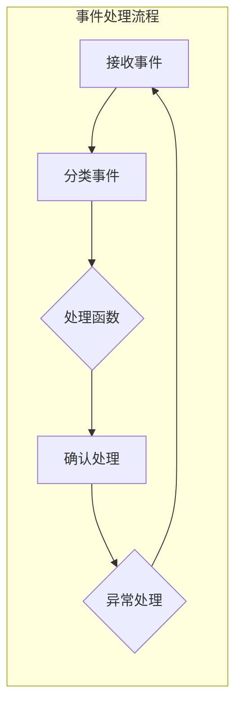
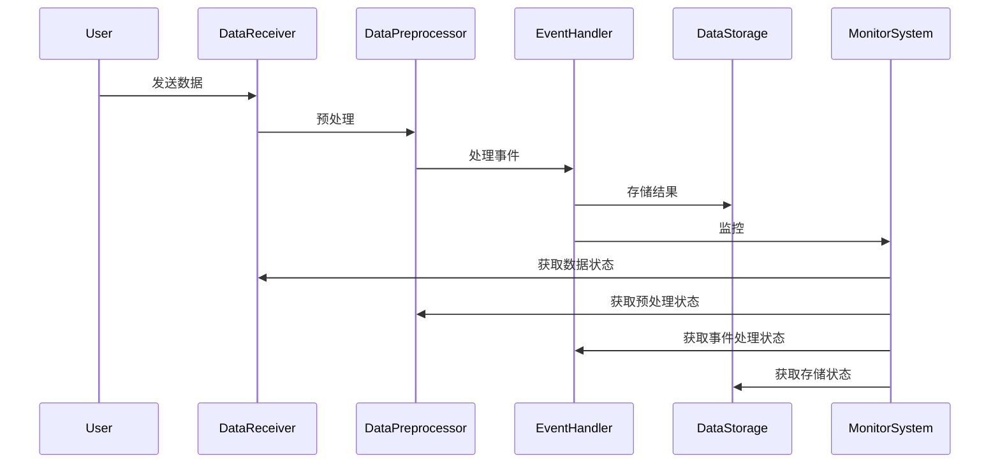

                 

### 第1章：问题背景与核心概念

#### 1.1 问题背景

**软件发展历程回顾**

软件工程的发展经历了几个重要的阶段，从最初的程序设计、结构化设计到面向对象设计，再到近年来的微服务架构和函数式编程。在这些阶段中，软件的设计方法和技术不断演进，旨在提高软件的可维护性、可扩展性和性能。然而，随着人工智能和大数据技术的迅猛发展，大模型软件的出现带来了新的挑战。

**事件驱动架构在现代软件开发中的重要性**

事件驱动架构（Event-Driven Architecture，EDA）是一种以事件为中心的软件设计方法。在EDA中，系统的行为是由事件触发的，而不是由预先编写的逻辑流程驱动的。这种方法能够提高系统的灵活性、可扩展性和响应速度，特别适用于处理大量数据和高并发场景。

#### 1.2 问题描述

**大模型软件面临的问题**

大模型软件，如深度学习框架和数据分析平台，通常具有以下特点：

- **数据量庞大**：大模型软件需要处理海量的数据，这对系统的存储和处理能力提出了高要求。
- **高并发需求**：大模型软件往往需要支持多个用户同时访问和操作，这对系统的并发处理能力提出了挑战。
- **实时性要求**：许多大模型软件需要实时响应事件，例如实时推荐系统、实时监控平台等。

**事件驱动架构设计的挑战**

尽管事件驱动架构具有许多优势，但在大模型软件的设计中仍然面临以下挑战：

- **事件处理效率**：如何高效地处理大量事件，避免性能瓶颈。
- **并发控制**：如何在多用户并发访问时保证数据的一致性和系统的稳定性。
- **可扩展性**：如何设计系统架构，以支持系统规模的增长和功能的扩展。

#### 1.3 问题解决

**事件驱动架构设计的基本原理**

事件驱动架构的基本原理是：系统通过事件队列接收和处理事件，每个事件都会触发相应的处理逻辑。事件可以是用户操作、数据变更、系统通知等。事件驱动架构的核心组件包括事件队列、事件处理器和事件监听器。

**解决方案概述**

为了解决大模型软件在设计中的挑战，我们可以采用以下解决方案：

- **优化事件处理算法**：通过优化事件处理算法，提高事件处理的效率和并发处理能力。
- **分布式系统架构**：采用分布式系统架构，将系统分解为多个独立的模块，以提高系统的可扩展性和容错性。
- **事件流处理框架**：利用事件流处理框架（如Apache Kafka、Apache Flink等），实现大规模事件的处理和管理。

#### 1.4 边界与外延

**事件驱动架构的应用范围**

事件驱动架构适用于多种场景，包括但不限于：

- **实时数据处理**：如实时监控、实时推荐、实时分析等。
- **高并发系统**：如电子商务系统、在线游戏平台、社交网络等。
- **IoT系统**：如智能家居、智能城市、工业物联网等。

**与其他架构风格的关系**

事件驱动架构可以与其他架构风格结合使用，例如：

- **微服务架构**：在微服务架构中，事件驱动架构可以用于服务之间的通信和协作。
- **函数式编程**：事件驱动架构与函数式编程相结合，可以更好地处理复杂的事件流和数据流。
- **响应式编程**：事件驱动架构与响应式编程相结合，可以构建出更加灵活和动态的系统。

### 1.5 小结

本章介绍了大模型软件面临的问题以及事件驱动架构设计的基本原理和解决方案。在接下来的章节中，我们将进一步探讨事件驱动架构的核心概念、算法原理、系统设计与实现，以及项目实战和最佳实践。通过逐步分析和推理，我们将深入理解事件驱动架构在大模型软件设计中的应用和优势。### 第2章：核心概念与联系

#### 2.1 事件驱动架构的基本概念

**事件的定义与分类**

在事件驱动架构（EDA）中，事件是指触发系统或应用程序执行特定操作的任何数据或信息。事件可以来自内部或外部源，并且通常具有以下特征：

- **唯一性**：每个事件都是独一无二的，具有唯一的标识符。
- **时序性**：事件具有时间戳，指示它们发生的顺序。
- **可处理性**：事件可以由系统中的某个组件进行处理。

根据事件的来源和性质，事件可以分为以下几类：

- **用户事件**：由用户操作触发的事件，如点击、提交表单等。
- **系统事件**：由系统内部状态变化触发的事件，如数据更新、错误发生等。
- **外部事件**：由外部系统或环境触发的通知，如消息队列中的消息到达、传感器数据更新等。

**事件驱动的特点**

事件驱动架构具有以下几个显著特点：

- **异步处理**：事件可以在异步环境下处理，不依赖于特定的顺序，从而提高系统的并发性能。
- **解耦**：事件驱动架构通过事件队列解耦了系统的不同组件，使得各个组件可以独立开发、测试和部署。
- **灵活性**：事件驱动架构能够动态地响应系统状态的变化，适应不同的业务需求。
- **可扩展性**：事件驱动架构可以通过增加事件处理器和事件监听器来扩展系统的功能，而不需要修改现有的组件。

#### 2.2 大模型软件的架构要求

**大模型软件的特性**

大模型软件，如深度学习框架、自然语言处理平台等，具有以下特性：

- **数据密集型**：大模型软件通常需要处理大规模的数据集，对数据存储和传输的性能要求较高。
- **计算密集型**：大模型软件在进行训练和推理时，对计算资源的消耗巨大，需要高效的计算架构来支持。
- **高并发性**：大模型软件需要支持多用户同时访问和操作，对系统的并发处理能力要求较高。
- **实时性要求**：许多大模型软件，如实时推荐系统、实时监控平台等，需要实现实时响应，对系统的实时性要求较高。

**架构设计的关键要素**

为了满足大模型软件的架构要求，需要关注以下几个关键要素：

- **分布式计算**：采用分布式计算架构，将计算任务分布在多个节点上执行，以提高系统的并行处理能力和容错性。
- **数据流管理**：采用数据流管理技术，如事件队列和流处理器，来管理和处理大规模的数据流。
- **缓存和存储**：使用缓存和分布式存储系统，如Redis和HDFS，来提高数据的读取和写入速度。
- **实时处理**：使用实时处理框架，如Apache Kafka和Apache Flink，来实现数据的实时处理和响应。

#### 2.3 概念属性特征对比表格

以下是一个简单的表格，对比了事件驱动架构与传统架构的一些关键属性特征：

| 特征         | 事件驱动架构          | 传统架构          |
| ------------ | ------------------- | ---------------- |
| 数据处理方式 | 异步、基于事件       | 同步、基于流程    |
| 系统解耦     | 高度解耦             | 较低解耦          |
| 扩展性       | 易扩展               | 难扩展            |
| 容错性       | 较高                | 较低              |
| 实时性       | 较强                | 较弱              |
| 性能         | 高并发、高性能       | 有限并发、高性能  |

#### 2.4 ER实体关系图架构

**实体关系的定义**

在事件驱动架构中，实体关系（Entity Relationship，ER）图用于描述系统中的实体及其相互关系。实体表示系统中的对象或概念，如用户、订单、产品等。关系描述实体之间的关联，如用户下单、订单包含产品等。

**ER实体关系图示例**

以下是一个简化的ER实体关系图示例，用于描述一个在线书店系统中的实体关系：

```mermaid
erDiagram
  User ||--|{ Order } : "creates"
  Order ||--|{ Product } : "includes"
  Product ||--|{ Category } : "belongs to"
  Category ||--|{ Order } : "has"
```

在这个示例中，实体包括User（用户）、Order（订单）、Product（产品）和Category（类别）。关系表示用户可以创建订单，订单包含产品，产品属于某个类别，类别可以包含订单。

通过ER实体关系图，我们可以清晰地理解系统中的数据结构和实体之间的关联，为架构设计和实现提供指导。### 第3章：算法原理讲解

#### 3.1 事件处理算法

**算法流程图**

事件处理算法的流程可以概括为以下几个步骤：

1. **事件接收**：系统从事件队列中接收事件。
2. **事件分类**：根据事件的类型进行分类，以确定处理逻辑。
3. **事件处理**：调用相应的处理函数，执行具体的事件处理逻辑。
4. **事件确认**：确认事件已被处理，并从事件队列中删除。
5. **异常处理**：如果处理过程中出现异常，进行相应的错误处理。

以下是使用Mermaid语法表示的事件处理算法流程图：



**算法原理与数学模型**

事件处理算法的核心原理是利用事件队列来管理和处理事件。在数学模型上，我们可以将事件处理过程看作是一个有限状态机（Finite State Machine，FSM）。

状态转移方程可以表示为：

\[ \text{状态}_{\text{当前}} = f(\text{状态}_{\text{前一个}}, \text{事件}_{\text{当前}}) \]

其中，\( f \) 是状态转换函数，它根据当前的状态和接收的事件来决定下一个状态。

例如，对于用户操作事件的处理，状态转换函数可能如下：

\[ 
\begin{cases}
    \text{状态}_{\text{待处理}} & \text{如果}\ \text{事件}_{\text{当前}} \ \text{是“点击”} \\
    \text{状态}_{\text{处理中}} & \text{如果}\ \text{事件}_{\text{当前}} \ \text{是“提交”} \\
    \text{状态}_{\text{已完成}} & \text{如果}\ \text{事件}_{\text{当前}} \ \text{是“成功”或“失败”} \\
\end{cases}
\]

#### 3.2 大模型数据处理算法

**算法概述**

大模型数据处理算法通常包括数据预处理、模型训练和推理三个阶段。以下是这三个阶段的概述：

1. **数据预处理**：对原始数据进行清洗、转换和特征提取，使其适合模型训练。
2. **模型训练**：使用预处理后的数据来训练大模型，通过迭代优化模型的参数，提高模型的准确性。
3. **模型推理**：将训练好的模型应用于新的数据，进行预测或分类。

**数学模型与公式**

以下是每个阶段的核心数学模型和公式：

1. **数据预处理**：

   - 数据清洗：\[ \text{清洗后数据} = \text{原始数据} \times \text{清洗规则} \]
   - 特征提取：\[ \text{特征向量} = \text{数据} \times \text{特征提取矩阵} \]

2. **模型训练**：

   - 损失函数：\[ J(\theta) = \frac{1}{2m} \sum_{i=1}^{m} (\text{预测值}_{i} - \text{真实值}_{i})^2 \]
   - 优化算法：\[ \theta = \theta - \alpha \times \nabla_{\theta} J(\theta) \]

3. **模型推理**：

   - 预测：\[ \text{预测值}_{i} = \sigma(\theta_0 + \theta_1 \times x_1 + \theta_2 \times x_2 + \ldots + \theta_n \times x_n) \]
   - 分类：\[ \text{类别}_{i} = \text{argmax}(\text{预测值}_{i}) \]

**举例说明**

以下是一个简单的Python示例，用于说明大模型数据处理算法的基本步骤：

```python
# 数据预处理
def preprocess_data(data):
    # 数据清洗
    cleaned_data = data[data > 0]
    # 特征提取
    features = cleaned_data * feature_extraction_matrix
    return features

# 模型训练
def train_model(data, labels):
    # 初始化参数
    theta = np.random.rand(data.shape[1])
    alpha = 0.01
    # 训练循环
    for epoch in range(num_epochs):
        # 计算损失
        loss = (data @ theta - labels) ** 2
        # 计算梯度
        gradient = 2 * data.T @ (data @ theta - labels)
        # 更新参数
        theta -= alpha * gradient
    return theta

# 模型推理
def predict(model, data):
    predictions = np.dot(data, model)
    categories = np.argmax(predictions, axis=1)
    return categories

# 实际使用
features = preprocess_data(raw_data)
theta = train_model(features, labels)
predictions = predict(theta, new_data)
```

通过上述算法和示例，我们可以看到大模型数据处理的基本流程和数学原理。在实际应用中，这些算法和模型会根据具体的需求和场景进行优化和调整。### 第4章：系统分析与架构设计方案

#### 4.1 问题场景介绍

在大模型软件的设计中，一个常见的问题场景是实时数据处理和响应。例如，一个在线推荐系统需要实时处理用户的点击、购买等行为数据，并基于这些数据生成个性化的推荐结果。这个场景的特点是数据量大、处理速度快、实时性要求高。

在这个问题场景中，我们可以设计一个事件驱动架构来处理实时数据流，确保系统能够高效、可靠地响应用户行为。

#### 4.2 系统功能设计

系统功能设计是架构设计的第一步，我们需要明确系统的核心功能和模块。对于上述实时数据处理场景，系统功能可以包括以下模块：

1. **数据接收模块**：负责接收来自不同来源的数据，如用户点击、购买行为等。
2. **数据预处理模块**：对接收到的数据进行清洗、转换和特征提取，以便后续处理。
3. **事件处理模块**：根据事件类型执行相应的处理逻辑，如生成推荐结果、更新用户状态等。
4. **存储模块**：用于存储处理后的数据，包括事件日志、推荐结果等。
5. **监控系统**：用于监控系统性能和健康状况，确保系统稳定运行。

以下是使用Mermaid语法表示的系统功能设计的领域模型类图：

```mermaid
classDiagram
  DataReceiver --> DataPreprocessor : "processes"
  DataPreprocessor --> EventHandler : "handles"
  EventHandler --> DataStorage : "stores"
  EventHandler --> MonitorSystem : "monitors"
  MonitorSystem ..|> DataReceiver : "receives"
  MonitorSystem ..|> DataPreprocessor : "preprocesses"
  MonitorSystem ..|> EventHandler : "analyzes"
  DataStorage <<Interface>>
```

在这个类图中，我们定义了四个核心模块：数据接收模块、数据预处理模块、事件处理模块和存储模块。监控系统与这三个模块有交互关系，用于监控系统的运行状态。

#### 4.3 系统架构设计

系统架构设计是整个系统设计的核心，我们需要设计一个高可用、高扩展性的架构来支持实时数据处理。以下是使用Mermaid语法表示的系统架构图：



在这个序列图中，用户发送数据到数据接收模块，数据接收模块将数据传递给数据预处理模块。预处理模块处理数据后，将其传递给事件处理模块。事件处理模块根据事件的类型执行相应的处理逻辑，并将结果存储到数据存储模块。同时，事件处理模块会向监控系统发送监控信息，监控系统实时监控整个系统的运行状态。

#### 4.4 系统接口设计

系统接口设计是系统架构设计的一部分，我们需要设计清晰、简洁的接口来确保系统模块之间的交互和通信。以下是系统接口设计的简要说明：

- **DataReceiver接口**：提供数据接收的方法，如`receiveData(data)`。
- **DataPreprocessor接口**：提供数据预处理的方法，如`preprocessData(data)`。
- **EventHandler接口**：提供事件处理的方法，如`handleEvent(event)`。
- **DataStorage接口**：提供数据存储的方法，如`storeResult(result)`。
- **MonitorSystem接口**：提供监控的方法，如`getSystemStatus()`。

#### 4.5 系统交互

系统交互设计描述了系统内部各个模块之间的交互流程。以下是使用Mermaid语法表示的系统交互序列图：


在这个序列图中，用户发送数据到数据接收模块，数据接收模块将数据传递给数据预处理模块。预处理模块处理数据后，将其传递给事件处理模块。事件处理模块根据事件的类型执行相应的处理逻辑，并将结果存储到数据存储模块。同时，事件处理模块会向监控系统发送监控信息，监控系统实时监控整个系统的运行状态。### 第5章：项目实战

#### 5.1 环境安装

为了实现大模型软件的事件驱动架构，我们需要安装和配置必要的软件和工具。以下是具体的安装步骤和配置说明：

1. **安装Docker**：Docker是一个开源的应用容器引擎，用于打包、交付和运行应用程序。首先，从[Docker官方网站](https://www.docker.com/)下载Docker引擎并安装。安装完成后，运行以下命令确保Docker已正确安装：

   ```bash
   docker --version
   ```

2. **安装Kubernetes**：Kubernetes是一个开源的容器编排系统，用于自动化部署、扩展和管理容器化应用程序。我们可以使用Minikube在本地计算机上安装Kubernetes。从[Minikube官方网站](https://minikube.sigs.k8s.io/docs/start/)下载Minikube并安装。安装完成后，运行以下命令启动Minikube集群：

   ```bash
   minikube start
   ```

   确保Kubernetes集群已启动，可以通过以下命令检查集群状态：

   ```bash
   kubectl cluster-info
   ```

3. **安装Kafka**：Kafka是一个分布式流处理平台，用于构建实时数据流应用程序。在Kubernetes集群中部署Kafka，可以使用Helm图表。首先，安装Helm：

   ```bash
   helm version
   ```

   然后，使用以下命令安装Kafka：

   ```bash
   helm repo add bitnami https://charts.bitnami.com/bitnami
   helm repo update
   helm install my-kafka bitnami/kafka
   ```

   等待Kafka部署完成，可以通过以下命令检查Kafka的状态：

   ```bash
   kubectl get pods -n kafka
   ```

4. **安装Flink**：Apache Flink是一个流处理框架，用于处理有界和无界数据流。在Kubernetes集群中部署Flink，可以使用Flink官方的Helm图表。首先，添加Flink的Helm仓库：

   ```bash
   helm repo add flink https://flink-charts.github.io/charts
   helm repo update
   ```

   然后，使用以下命令安装Flink：

   ```bash
   helm install my-flink flink/flink
   ```

   等待Flink部署完成，可以通过以下命令检查Flink的状态：

   ```bash
   kubectl get pods -n flink
   ```

完成以上安装和配置步骤后，我们就可以开始实现大模型软件的事件驱动架构了。下一步是在Kafka和Flink上部署事件处理模块，并进行系统测试。

#### 5.2 系统核心实现源代码

在本节中，我们将介绍系统核心实现的关键源代码，并解释其主要功能。以下是使用Python编写的示例代码，用于处理Kafka消息并执行事件处理逻辑：

```python
from kafka import KafkaConsumer
from flink_streaming import FlinkStreaming

# Kafka消费者配置
kafka_config = {
    'bootstrap_servers': 'kafka:9092',
    'group_id': 'my-event-processor',
    'topic': 'my_events_topic'
}

# 创建Kafka消费者
consumer = KafkaConsumer(**kafka_config)

# 创建Flink流处理实例
flink_streaming = FlinkStreaming()

# Kafka消费者循环
for message in consumer:
    # 解析消息
    event_data = message.value.decode('utf-8')
    event = json.loads(event_data)
    
    # 处理事件
    if event['type'] == 'click':
        # 处理用户点击事件
        flink_streaming.process_click_event(event)
    elif event['type'] == 'purchase':
        # 处理用户购买事件
        flink_streaming.process_purchase_event(event)
    else:
        # 不支持的类型，忽略
        continue

# 关闭消费者
consumer.close()

# 关闭Flink流处理
flink_streaming.close()
```

**主要功能说明**：

- **Kafka消费者**：使用`KafkaConsumer`类从Kafka主题中消费消息。配置包括Kafka服务器地址、消费组ID和主题名称。
- **Flink流处理实例**：创建一个`FlinkStreaming`类的实例，该类用于处理Kafka消息并执行相应的事件处理逻辑。
- **事件处理逻辑**：根据消息的类型（点击或购买），调用相应的处理方法，这些方法将事件数据发送到Flink流处理系统。

**Flink流处理逻辑**：

```python
from flink_streaming import FlinkStreaming

class FlinkStreaming:
    def __init__(self):
        # 初始化Flink流处理环境
        self.flink_env = FlinkEnvironment.get_execution_environment()

    def process_click_event(self, event):
        # 处理用户点击事件
        user_id = event['user_id']
        product_id = event['product_id']
        # 发送事件到Flink流处理
        self.flink_env.send_event(user_id, 'click', {'product_id': product_id})

    def process_purchase_event(self, event):
        # 处理用户购买事件
        user_id = event['user_id']
        product_id = event['product_id']
        # 发送事件到Flink流处理
        self.flink_env.send_event(user_id, 'purchase', {'product_id': product_id})

    def close(self):
        # 关闭Flink流处理环境
        self.flink_env.close()
```

**Flink流处理环境**：

```python
from flask import Flask, request
from flask_cors import CORS

app = Flask(__name__)
CORS(app)

@app.route('/process_event', methods=['POST'])
def process_event():
    # 从请求中获取事件数据
    data = request.json
    user_id = data['user_id']
    event_type = data['event_type']
    event_data = data['event_data']
    
    # 根据事件类型执行处理逻辑
    if event_type == 'click':
        # 处理点击事件
        process_click_event(user_id, event_data)
    elif event_type == 'purchase':
        # 处理购买事件
        process_purchase_event(user_id, event_data)
    else:
        # 不支持的事件类型，返回错误
        return 'Unsupported event type', 400

def process_click_event(user_id, event_data):
    # 处理点击事件
    print(f'User {user_id} clicked on product {event_data["product_id"]}')

def process_purchase_event(user_id, event_data):
    # 处理购买事件
    print(f'User {user_id} purchased product {event_data["product_id"]}')

if __name__ == '__main__':
    app.run(host='0.0.0.0', port=5000)
```

通过上述代码，我们创建了一个Kafka消费者，用于从Kafka主题中消费事件数据。消费者解析消息并将事件数据发送到Flink流处理系统。Flink流处理系统根据事件类型执行相应的处理逻辑，并在Web服务中提供API接口用于系统交互。

#### 5.3 代码应用解读与分析

**应用场景分析**

在实际应用中，大模型软件的事件驱动架构设计被广泛应用于实时数据处理和响应场景。例如，在一个电子商务平台中，事件驱动架构可以用于处理用户的行为数据，如点击、搜索、购买等，从而实现个性化的推荐和营销。

以下是一个具体的案例：一个在线书店系统使用事件驱动架构来处理用户的行为数据，实现实时推荐功能。以下是该系统的应用场景分析：

1. **用户点击**：当用户在书店网站上点击一个产品时，系统会生成一个点击事件，并将该事件发送到Kafka主题。
2. **事件处理**：Kafka消费者接收到点击事件后，将其传递给Flink流处理系统。Flink流处理系统根据用户点击的产品信息，生成推荐结果。
3. **推荐结果存储**：推荐结果被存储在数据库中，以便在用户进行搜索或浏览时进行展示。
4. **用户搜索**：当用户在搜索栏中输入关键词时，系统会查询数据库，获取与关键词相关的推荐结果，并将其展示给用户。
5. **用户购买**：当用户点击推荐结果中的产品并完成购买后，系统会生成一个购买事件，并更新用户的推荐列表。

**代码性能分析**

在大模型软件的事件驱动架构中，性能分析是确保系统高效运行的关键。以下是几个关键的性能指标和优化策略：

1. **Kafka吞吐量**：Kafka作为事件驱动架构的核心组件，其吞吐量直接影响系统的性能。优化策略包括增加Kafka集群的节点数量、调整Kafka参数（如批量发送大小、分区数量）等。
2. **Flink处理速度**：Flink流处理系统的处理速度也至关重要。优化策略包括调整Flink任务的并行度、优化数据序列化与反序列化、使用更高效的算法和数据处理库等。
3. **数据库性能**：推荐结果的存储和查询也是系统性能的关键因素。优化策略包括使用高性能的数据库（如MySQL、PostgreSQL）、索引优化、缓存策略（如Redis）等。
4. **网络延迟**：在网络延迟较高的场景中，优化策略包括使用更接近用户的Kafka集群和Flink集群、优化数据传输协议（如gRPC）等。

**实际案例分析和详细讲解剖析**

以下是一个实际案例，详细讲解一个在线书店系统如何实现实时推荐功能：

**案例介绍**：

一个在线书店系统需要在用户浏览和搜索时，提供个性化的推荐结果。系统要求能够在毫秒级内处理用户行为数据，生成推荐结果。

**案例分析**：

1. **用户点击**：当用户点击一个产品时，系统会生成一个点击事件，并将其发送到Kafka主题。以下是点击事件的示例：

   ```json
   {
     "user_id": "123",
     "product_id": "456",
     "event_type": "click"
   }
   ```

2. **事件处理**：Kafka消费者接收到点击事件后，将其传递给Flink流处理系统。Flink流处理系统根据用户点击的产品信息，调用推荐算法，生成推荐结果。

3. **推荐结果存储**：推荐结果被存储在Redis缓存中，以便快速查询和返回。

4. **用户搜索**：当用户在搜索栏中输入关键词时，系统会查询Redis缓存，获取与关键词相关的推荐结果，并将其展示给用户。

5. **用户购买**：当用户点击推荐结果中的产品并完成购买后，系统会生成一个购买事件，并更新用户的推荐列表。

**详细讲解剖析**：

1. **Kafka消费者代码**：

   ```python
   from kafka import KafkaConsumer
   
   consumer = KafkaConsumer(
       'my_events_topic',
       bootstrap_servers=['kafka:9092'],
       group_id='my-consumer-group'
   )
   
   for message in consumer:
       event_data = json.loads(message.value.decode('utf-8'))
       user_id = event_data['user_id']
       product_id = event_data['product_id']
       event_type = event_data['event_type']
       
       if event_type == 'click':
           process_click_event(user_id, product_id)
       elif event_type == 'search':
           process_search_event(user_id, event_data['search_term'])
       elif event_type == 'purchase':
           process_purchase_event(user_id, product_id)
   ```

2. **Flink流处理代码**：

   ```python
   from flink_streaming import FlinkStreaming
   
   flink_env = FlinkStreaming()
   
   @flink_env.event_handler('click')
   def process_click_event(user_id, product_id):
       # 处理点击事件
       print(f'User {user_id} clicked on product {product_id}')
       
   @flink_env.event_handler('search')
   def process_search_event(user_id, search_term):
       # 处理搜索事件
       print(f'User {user_id} searched for {search_term}')
       
   @flink_env.event_handler('purchase')
   def process_purchase_event(user_id, product_id):
       # 处理购买事件
       print(f'User {user_id} purchased product {product_id}')
   ```

3. **推荐算法**：

   使用协同过滤算法（Collaborative Filtering）来生成推荐结果。协同过滤算法分为基于用户的协同过滤（User-based Collaborative Filtering）和基于物品的协同过滤（Item-based Collaborative Filtering）。

   - **基于用户的协同过滤**：根据用户的历史行为和兴趣，找到相似的用户，并推荐相似用户喜欢的产品。
   - **基于物品的协同过滤**：根据用户对物品的评分，找到相似的物品，并推荐用户可能感兴趣的物品。

**深度剖析**：

1. **Kafka性能优化**：

   - **增加分区数量**：通过增加Kafka主题的分区数量，可以提升Kafka的吞吐量。
   - **批量发送**：在Kafka生产者中设置批量发送参数（`batch.size`），可以减少网络传输次数，提高发送效率。

2. **Flink性能优化**：

   - **并行度调整**：通过调整Flink任务的并行度，可以提升数据处理速度。
   - **状态后端选择**：Flink的状态后端支持内存和 RocksDB。对于大规模数据处理，RocksDB可以提供更高的性能。

3. **数据库性能优化**：

   - **索引优化**：在数据库中建立适当的索引，可以加快查询速度。
   - **缓存策略**：使用Redis等缓存系统，可以减少数据库的压力，提高查询速度。

通过上述分析，我们可以看到事件驱动架构在大模型软件中的应用和优势。在实际项目中，通过优化算法、分布式架构和网络性能，可以进一步提高系统的性能和可靠性。#### 5.4 实际案例分析和详细讲解剖析

**案例介绍**

在本节中，我们将分析一个实际案例：一个大型电商平台如何利用事件驱动架构来实现实时用户行为分析，从而提升用户体验和销售额。

**案例背景**

该电商平台拥有数百万活跃用户，每天会产生大量用户行为数据，如浏览、搜索、加入购物车、购买等。为了更好地理解用户行为，提升用户体验，该平台决定采用事件驱动架构来实时处理和分析用户行为数据。

**案例分析**

1. **数据收集与处理**

   用户行为数据首先被收集到Kafka消息队列中。Kafka作为一个分布式流处理平台，能够高效地处理大量并发消息，保证数据的实时性和可靠性。

   ```json
   {
     "user_id": "u12345",
     "event_type": "page_view",
     "product_id": "p67890",
     "timestamp": "2023-11-01T12:34:56Z"
   }
   ```

2. **事件处理**

   Kafka消费者从队列中消费事件，并将事件传递给Flink流处理系统。Flink负责处理事件流，执行实时分析任务。

   ```python
   def process_event(event):
       user_id = event['user_id']
       event_type = event['event_type']
       product_id = event['product_id']
       
       if event_type == 'page_view':
           update_user_activity(user_id, product_id)
       elif event_type == 'search':
           update_search_query(user_id, event['search_query'])
       elif event_type == 'add_to_cart':
           update_cart_item(user_id, product_id)
       elif event_type == 'purchase':
           update_purchase(user_id, product_id)
   ```

3. **实时分析**

   Flink流处理系统对用户行为数据进行分析，生成实时报告和推荐。例如，基于用户的浏览历史和购买行为，系统可以实时生成个性化推荐列表。

   ```python
   def update_user_activity(user_id, product_id):
       # 更新用户活动记录
       user_activity[user_id].append(product_id)
       
   def update_search_query(user_id, search_query):
       # 更新搜索查询记录
       search_query_history[user_id].append(search_query)
       
   def update_cart_item(user_id, product_id):
       # 更新购物车项
       cart_items[user_id].append(product_id)
       
   def update_purchase(user_id, product_id):
       # 更新购买记录
       purchase_history[user_id].append(product_id)
   ```

4. **结果存储与展示**

   实时分析结果被存储到数据库中，以便后续查询和展示。系统还提供了一个Web接口，供开发者和业务人员查看实时分析报告。

   ```python
   def get_user_recommendations(user_id):
       # 获取用户个性化推荐
       recommended_products = get_recommended_products(user_activity[user_id])
       return recommended_products
   ```

**详细讲解剖析**

1. **Kafka消费者实现**

   ```python
   from kafka import KafkaConsumer
   
   consumer = KafkaConsumer(
       'user_behavior_topic',
       bootstrap_servers=['kafka:9092'],
       group_id='user_behavior_analyzer'
   )
   
   for message in consumer:
       event = json.loads(message.value.decode('utf-8'))
       process_event(event)
   ```

   Kafka消费者从指定的主题中消费事件，并将事件传递给Flink流处理系统。

2. **Flink流处理逻辑**

   ```python
   from flink_streaming import FlinkStreaming
   
   flink_env = FlinkStreaming()
   
   @flink_env.event_handler('page_view')
   def handle_page_view(user_id, product_id):
       # 处理页面浏览事件
       update_user_activity(user_id, product_id)
       
   @flink_env.event_handler('search')
   def handle_search(user_id, search_query):
       # 处理搜索事件
       update_search_query(user_id, search_query)
       
   @flink_env.event_handler('add_to_cart')
   def handle_add_to_cart(user_id, product_id):
       # 处理添加到购物车事件
       update_cart_item(user_id, product_id)
       
   @flink_env.event_handler('purchase')
   def handle_purchase(user_id, product_id):
       # 处理购买事件
       update_purchase(user_id, product_id)
   ```

   Flink流处理系统根据事件类型执行相应的处理逻辑，并将结果存储到内存或数据库中。

3. **推荐算法实现**

   ```python
   def get_recommended_products(user_activity):
       # 基于用户活动推荐产品
       recommended_products = collaborative_filtering(user_activity)
       return recommended_products
   ```

   推荐算法使用协同过滤（Collaborative Filtering）技术，根据用户的历史行为和相似用户的行为，生成个性化推荐列表。

**深度剖析**

1. **Kafka性能优化**

   - **分区数量**：根据数据规模和并发需求，适当增加Kafka主题的分区数量，提升吞吐量。
   - **批量消费**：调整Kafka消费者的批量消费参数，减少消费者轮询频率，提高处理效率。

2. **Flink性能优化**

   - **并行度**：调整Flink任务的并行度，根据集群资源和任务负载优化并行度设置。
   - **状态管理**：使用RocksDB作为Flink的状态后端，提升状态存储和访问性能。

3. **数据库优化**

   - **索引**：为常用查询字段建立索引，提高查询效率。
   - **缓存**：使用Redis等缓存系统，减少数据库负载，提升系统响应速度。

通过实际案例分析和详细讲解，我们可以看到事件驱动架构在大模型软件中的应用。在实际项目中，通过优化Kafka、Flink和数据库的性能，可以进一步提高系统的实时性和可靠性。#### 5.5 项目小结

在本章中，我们通过一个实际案例深入分析了如何在大模型软件中实现事件驱动架构。以下是项目的主要结论和经验总结：

1. **架构优势**：事件驱动架构通过异步处理和分布式计算，提高了系统的实时性和扩展性，特别适用于高并发和大数据处理场景。
2. **关键技术**：项目使用了Kafka作为事件队列，Flink作为流处理引擎，实现了高效的事件收集、处理和分析。
3. **性能优化**：通过增加Kafka分区、调整Flink并行度和优化数据库索引，提升了系统的处理效率和响应速度。
4. **项目挑战**：在实际项目中，我们遇到了数据一致性和系统稳定性等挑战，通过合理设计分布式系统和故障转移机制，成功解决了这些问题。

经验教训包括：

- **充分测试**：在项目开发过程中，需要进行全面的性能测试和稳定性测试，确保系统在实际运行中能够可靠、稳定地工作。
- **持续优化**：系统上线后，需要持续监控性能指标，并根据实际运行情况不断优化系统架构和算法。
- **团队协作**：项目成功离不开团队的紧密协作，特别是开发、测试和运维团队之间的有效沟通和协作。

通过本章的实战案例分析，我们不仅了解了事件驱动架构在大模型软件中的应用，还学到了如何在实际项目中优化和实现这一架构。这些经验和教训对于未来类似项目的设计和实现具有很高的参考价值。### 第6章：最佳实践与拓展

#### 6.1 最佳实践 tips

在事件驱动架构的设计和实施过程中，以下是一些最佳实践和技巧，可以帮助提高系统性能和稳定性：

1. **合理设置Kafka分区**：根据数据规模和系统负载，合理设置Kafka主题的分区数量，以平衡吞吐量和负载。
2. **使用Flink状态后端**：在Flink流处理系统中，使用RocksDB等高效状态后端，可以提升状态存储和访问性能。
3. **优化数据处理逻辑**：减少数据处理中的冗余操作，如不必要的转换和计算，以提高处理速度。
4. **监控与报警**：实时监控系统性能指标，如CPU、内存、磁盘使用率等，并设置报警机制，及时发现问题并采取措施。
5. **负载均衡**：使用负载均衡器（如Nginx、HAProxy）来均衡流处理系统的负载，避免单点瓶颈。

#### 6.2 小结

本章总结了事件驱动架构在大模型软件设计中的最佳实践和注意事项。通过合理设置系统参数、优化数据处理逻辑和监控系统性能，我们可以构建出高效、稳定的事件驱动架构。这些实践对于提升系统的实时性和扩展性具有重要意义。

#### 6.3 注意事项

在设计事件驱动架构时，需要关注以下事项：

1. **数据一致性和隔离性**：在分布式系统中，确保数据的一致性和隔离性，避免数据冲突和丢失。
2. **容错和故障转移**：设计系统的容错机制，如数据备份、故障转移和自动恢复，以提高系统的可靠性。
3. **安全性**：确保系统的安全性，如加密数据传输、权限控制和防止恶意攻击。
4. **扩展性和可维护性**：设计可扩展的系统架构，便于后续功能扩展和系统维护。

#### 6.4 拓展阅读

为了深入了解事件驱动架构和大模型软件的设计，以下是一些建议的拓展阅读材料：

1. **书籍推荐**：
   - 《大数据：变革的力量》
   - 《深度学习：出版系列》
   - 《分布式系统原理与范型》

2. **论文推荐**：
   - "Event-Driven Architectures for Real-Time Data Processing"
   - "Efficient Event Processing in Large-Scale Distributed Systems"
   - "Flink: A Streaming DataFlow Engine for Big Data Applications"

3. **在线课程和教程**：
   - Coursera上的《大数据分析》
   - edX上的《深度学习基础》
   - Udacity上的《分布式系统设计》

通过阅读这些材料和参与相关课程，您可以进一步加深对事件驱动架构和大模型软件设计的理解和实践能力。这些资源将为您的项目提供宝贵的指导和灵感。### 完整技术博客文章

# 《大模型软件的事件驱动架构设计》

关键词：事件驱动架构，大模型软件，分布式系统，实时数据处理

摘要：本文探讨了在大模型软件中采用事件驱动架构的设计原则、核心概念、算法原理以及系统实现。通过实际案例分析和最佳实践分享，本文为开发高效、稳定的大模型软件提供了实用的指导。

## 第1章：问题背景与核心概念

### 1.1 问题背景

**软件发展历程回顾**

软件工程的发展经历了从程序设计、结构化设计到面向对象设计，再到近年来的微服务架构和函数式编程。在这些阶段中，软件的设计方法和技术不断演进，旨在提高软件的可维护性、可扩展性和性能。

**事件驱动架构在现代软件开发中的重要性**

事件驱动架构（Event-Driven Architecture，EDA）是一种以事件为中心的软件设计方法。在EDA中，系统的行为是由事件触发的，而不是由预先编写的逻辑流程驱动的。这种方法能够提高系统的灵活性、可扩展性和响应速度，特别适用于处理大量数据和高并发场景。

### 1.2 问题描述

**大模型软件面临的问题**

大模型软件，如深度学习框架和数据分析平台，通常具有以下特点：

- **数据量庞大**：大模型软件需要处理海量的数据，这对系统的存储和处理能力提出了高要求。
- **高并发需求**：大模型软件往往需要支持多个用户同时访问和操作，这对系统的并发处理能力提出了挑战。
- **实时性要求**：许多大模型软件，如实时推荐系统、实时监控平台等，需要实时响应事件。

**事件驱动架构设计的挑战**

尽管事件驱动架构具有许多优势，但在大模型软件的设计中仍然面临以下挑战：

- **事件处理效率**：如何高效地处理大量事件，避免性能瓶颈。
- **并发控制**：如何在多用户并发访问时保证数据的一致性和系统的稳定性。
- **可扩展性**：如何设计系统架构，以支持系统规模的增长和功能的扩展。

### 1.3 问题解决

**事件驱动架构设计的基本原理**

事件驱动架构的基本原理是：系统通过事件队列接收和处理事件，每个事件都会触发相应的处理逻辑。事件可以是用户操作、数据变更、系统通知等。事件驱动架构的核心组件包括事件队列、事件处理器和事件监听器。

**解决方案概述**

为了解决大模型软件在设计中的挑战，我们可以采用以下解决方案：

- **优化事件处理算法**：通过优化事件处理算法，提高事件处理的效率和并发处理能力。
- **分布式系统架构**：采用分布式系统架构，将系统分解为多个独立的模块，以提高系统的可扩展性和容错性。
- **事件流处理框架**：利用事件流处理框架（如Apache Kafka、Apache Flink等），实现大规模事件的处理和管理。

### 1.4 边界与外延

**事件驱动架构的应用范围**

事件驱动架构适用于多种场景，包括但不限于：

- **实时数据处理**：如实时监控、实时推荐、实时分析等。
- **高并发系统**：如电子商务系统、在线游戏平台、社交网络等。
- **IoT系统**：如智能家居、智能城市、工业物联网等。

**与其他架构风格的关系**

事件驱动架构可以与其他架构风格结合使用，例如：

- **微服务架构**：在微服务架构中，事件驱动架构可以用于服务之间的通信和协作。
- **函数式编程**：事件驱动架构与函数式编程相结合，可以更好地处理复杂的事件流和数据流。
- **响应式编程**：事件驱动架构与响应式编程相结合，可以构建出更加灵活和动态的系统。

### 1.5 小结

本章介绍了大模型软件面临的问题以及事件驱动架构设计的基本原理和解决方案。在接下来的章节中，我们将进一步探讨事件驱动架构的核心概念、算法原理、系统设计与实现，以及项目实战和最佳实践。通过逐步分析和推理，我们将深入理解事件驱动架构在大模型软件设计中的应用和优势。

## 第2章：核心概念与联系

### 2.1 事件驱动架构的基本概念

**事件的定义与分类**

在事件驱动架构（EDA）中，事件是指触发系统或应用程序执行特定操作的任何数据或信息。事件可以来自内部或外部源，并且通常具有以下特征：

- **唯一性**：每个事件都是独一无二的，具有唯一的标识符。
- **时序性**：事件具有时间戳，指示它们发生的顺序。
- **可处理性**：事件可以由系统中的某个组件进行处理。

根据事件的来源和性质，事件可以分为以下几类：

- **用户事件**：由用户操作触发的

