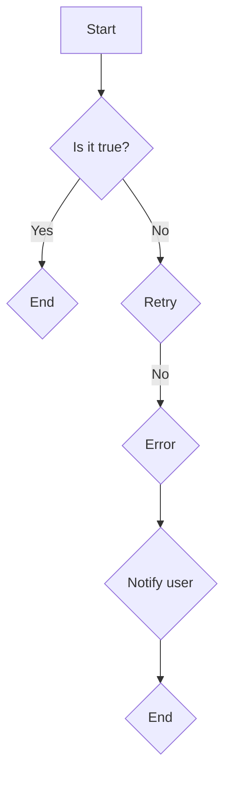

                 

# 《大模型逻辑推理：提示词构建论证链》

## 关键词：大模型、逻辑推理、提示词、论证链、AI

## 摘要：

本文将深入探讨大模型逻辑推理中的提示词构建与论证链的构建方法。大模型作为人工智能领域的重要突破，其逻辑推理能力对提升人工智能系统的智能化水平至关重要。本文首先介绍大模型的发展背景和基本概念，随后详细讲解逻辑推理的基本原理和方法论。在此基础上，本文重点讨论提示词的构建方法及其在逻辑推理中的作用，最后探讨论证链的构建策略，通过具体案例进行分析和阐述。本文旨在为广大AI研究人员和开发者提供系统化的逻辑推理思维方法和实用技巧，助力大模型在AI领域的广泛应用。

## 目录大纲

### 第一部分：大模型概述
#### 1.1 大模型发展背景
##### 1.1.1 大模型的概念
##### 1.1.2 大模型的发展历程
##### 1.1.3 大模型的核心技术

#### 1.2 逻辑推理基础
##### 1.2.1 逻辑推理的基本概念
##### 1.2.2 逻辑推理的方法论
##### 1.2.3 逻辑推理的应用场景

#### 1.3 提示词构建
##### 1.3.1 提示词的作用
##### 1.3.2 提示词的构建方法
##### 1.3.3 提示词的类

#### 1.4 论证链构建
##### 1.4.1 论证链的基本结构
##### 1.4.2 论证链的构建策略
##### 1.4.3 论证链的验证

### 第二部分：逻辑推理基础
#### 2.1 逻辑推理的核心概念
##### 2.1.1 命题逻辑
##### 2.1.2 谓词逻辑
##### 2.1.3 演绎推理与归纳推理

#### 2.2 逻辑推理的基本方法
##### 2.2.1 证明方法
##### 2.2.2 反证法
##### 2.2.3 归纳推理的方法

#### 2.3 逻辑推理的局限性
##### 2.3.1 逻辑谬误
##### 2.3.2 逻辑推理的边界

#### 2.4 逻辑推理的应用领域
##### 2.4.1 计算机科学
##### 2.4.2 人工智能
##### 2.4.3 自然语言处理

### 第三部分：提示词构建
#### 3.1 提示词的作用
##### 3.1.1 提示词在逻辑推理中的作用
##### 3.1.2 提示词在AI系统中的应用

#### 3.2 提示词的构建方法
##### 3.2.1 提示词的类型
##### 3.2.2 提示词的提取方法
##### 3.2.3 提示词的优化

#### 3.3 提示词的类
##### 3.3.1 基本类
##### 3.3.2 高级类

### 第四部分：论证链构建
#### 4.1 论证链的基本结构
##### 4.1.1 论证的组成部分
##### 4.1.2 论证的层次结构

#### 4.2 论证链的构建策略
##### 4.2.1 前提条件的分析
##### 4.2.2 结论的推导
##### 4.2.3 逻辑关系的构建

#### 4.3 论证链的验证
##### 4.3.1 论证的有效性
##### 4.3.2 论证的准确性
##### 4.3.3 论证的可靠性

### 第五部分：大模型应用
#### 5.1 大模型在逻辑推理中的应用
##### 5.1.1 大模型的优势
##### 5.1.2 大模型的应用场景
##### 5.1.3 大模型的挑战

#### 5.2 提示词与论证链在大模型中的应用
##### 5.2.1 提示词在大模型中的作用
##### 5.2.2 论证链在大模型中的作用
##### 5.2.3 提示词与论证链的结合

#### 5.3 实际案例剖析
##### 5.3.1 案例一：智能客服系统
##### 5.3.2 案例二：自动驾驶系统
##### 5.3.3 案例三：医学诊断系统

### 第六部分：最佳实践与拓展
#### 6.1 最佳实践 tips
##### 6.1.1 提示词构建的最佳实践
##### 6.1.2 论证链构建的最佳实践

#### 6.2 小结
##### 6.2.1 文章总结
##### 6.2.2 逻辑推理在AI领域的重要性

#### 6.3 注意事项
##### 6.3.1 提示词构建的注意事项
##### 6.3.2 论证链构建的注意事项

#### 6.4 拓展阅读
##### 6.4.1 相关研究文献
##### 6.4.2 推荐阅读材料

## 第一部分：大模型概述

### 1.1 大模型发展背景

#### 1.1.1 大模型的概念

大模型（Large Model）是指具有巨大参数量和庞大训练数据的机器学习模型。这些模型在深度学习领域取得了显著的进展，特别是在自然语言处理、计算机视觉和语音识别等领域。大模型的出现，标志着人工智能从规则驱动向数据驱动转型的重要里程碑。

#### 1.1.2 大模型的发展历程

大模型的发展历程可以分为以下几个阶段：

1. **早期阶段（1980s-1990s）**：这一阶段主要集中于基于规则的专家系统和简单的统计模型。这些模型在小规模问题上表现出一定的效果，但在复杂任务上表现不佳。

2. **数据驱动阶段（2000s）**：随着计算能力和数据量的提升，神经网络模型逐渐成为主流。尤其是深度神经网络（Deep Neural Network，DNN）的出现，使得模型在大规模数据上的表现得到显著提升。

3. **大规模模型阶段（2010s-至今）**：随着硬件和算法的进步，大模型应运而生。如GPT-3、BERT、ViT等，这些模型具有数十亿甚至数万亿个参数，能够在各种复杂任务上实现高水平的表现。

#### 1.1.3 大模型的核心技术

大模型的核心技术主要包括以下几个方面：

1. **深度神经网络（DNN）**：深度神经网络是构建大模型的基础。通过增加网络层数和神经元数量，可以实现复杂的非线性映射。

2. **大规模数据处理**：大模型需要处理海量的训练数据，这要求算法在数据读取、预处理和模型训练等方面具备高效性。

3. **优化算法**：优化算法在大模型训练中至关重要。常见的优化算法包括随机梯度下降（SGD）、Adam等。这些算法能够有效地调整模型参数，提高模型性能。

4. **硬件支持**：大模型的训练和推理需要强大的计算资源和存储资源。GPU、TPU等专用硬件的引入，极大地提升了大模型的训练速度和效果。

### 1.2 逻辑推理基础

#### 1.2.1 逻辑推理的基本概念

逻辑推理（Logic Reasoning）是人工智能领域的一个重要分支，旨在模拟人类的推理过程，使计算机能够自动地解决复杂问题。逻辑推理包括以下几个基本概念：

1. **命题**：命题是逻辑推理的基本单位，它是一个陈述句，要么是真的，要么是假的。

2. **推理规则**：推理规则是指从已知命题推导出新命题的方法。常见的推理规则有合取规则、析取规则、假言推理等。

3. **推理过程**：推理过程是指从已知命题出发，通过推理规则逐步推导出结论的过程。

#### 1.2.2 逻辑推理的方法论

逻辑推理的方法论主要包括以下几个方面：

1. **形式逻辑**：形式逻辑是研究逻辑推理形式化表示的学科。通过形式化表示，逻辑推理可以更加严谨和准确。

2. **谓词逻辑**：谓词逻辑是形式逻辑的一个重要分支，它引入了谓词的概念，能够更加精确地描述逻辑关系。

3. **非形式逻辑**：非形式逻辑是指没有严格形式化表示的推理方法。在人工智能中，非形式逻辑通常通过规则库和专家系统实现。

#### 1.2.3 逻辑推理的应用场景

逻辑推理在人工智能领域有广泛的应用，主要包括以下几个方面：

1. **知识表示**：逻辑推理用于表示和处理知识，使得计算机能够理解和应用这些知识。

2. **问题求解**：逻辑推理可以帮助计算机解决复杂问题，如路径规划、资源分配等。

3. **自然语言处理**：逻辑推理在自然语言处理中用于解析句子结构、语义理解等。

### 1.3 提示词构建

#### 1.3.1 提示词的作用

提示词（Prompt）在逻辑推理中起着至关重要的作用。它是一组预先定义好的词语或短语，用于引导推理过程，使推理更具方向性和针对性。提示词的作用主要体现在以下几个方面：

1. **明确推理方向**：提示词可以帮助计算机明确推理的目标和方向，避免盲目地搜索。

2. **提高推理效率**：通过使用提示词，计算机可以更快地找到正确的推理路径。

3. **增强推理能力**：提示词可以引入额外的信息，帮助计算机更好地理解问题背景，提高推理能力。

#### 1.3.2 提示词的构建方法

提示词的构建方法主要包括以下几个方面：

1. **基于规则的方法**：通过定义一系列规则，从已知信息中提取提示词。

2. **基于数据的方法**：通过分析大量的文本数据，提取常见的提示词模式。

3. **基于机器学习的方法**：利用机器学习算法，从数据中自动学习提示词的构建方法。

#### 1.3.3 提示词的类

在逻辑推理中，提示词可以分为以下几类：

1. **问题类提示词**：用于引导计算机解决问题，如“请证明...”。

2. **假设类提示词**：用于引导计算机建立假设，如“假设...”。

3. **条件类提示词**：用于引导计算机考虑条件，如“如果...”。

4. **结论类提示词**：用于引导计算机得出结论，如“因此...”。

### 1.4 论证链构建

#### 1.4.1 论证链的基本结构

论证链（Argument Chain）是指通过一系列逻辑推理步骤，从已知事实推导出结论的过程。一个完整的论证链包括以下几个基本部分：

1. **前提**：前提是论证链的起点，它是论证的基础。

2. **推理步骤**：推理步骤是论证链的核心，它通过逻辑推理规则，将前提逐步推导出结论。

3. **结论**：结论是论证链的终点，它是推理的结果。

#### 1.4.2 论证链的构建策略

构建论证链的方法主要包括以下几个方面：

1. **前提分析**：分析问题背景，确定已知事实，作为论证链的前提。

2. **推理规则**：选择合适的推理规则，将前提逐步推导出结论。

3. **论证结构**：构建论证链的层次结构，使得推理过程更加清晰和有条理。

#### 1.4.3 论证链的验证

论证链的验证主要包括以下几个方面：

1. **逻辑有效性**：验证论证链是否遵循逻辑推理规则，避免逻辑谬误。

2. **论证准确性**：验证论证链的结论是否正确，是否能够解决实际问题。

3. **论证可靠性**：验证论证链的可靠性，确保其在不同情况下都成立。

## 第二部分：逻辑推理基础

### 2.1 逻辑推理的核心概念

#### 2.1.1 命题逻辑

命题逻辑（Propositional Logic）是逻辑推理的基础，它主要研究命题之间的关系。命题逻辑的基本概念包括：

1. **命题**：命题是能够判断真假的陈述句。

2. **命题联结词**：命题联结词用于连接两个或多个命题，形成复合命题。常见的命题联结词有合取（∧）、析取（∨）、否定（¬）、条件（→）和双条件（↔）。

3. **命题公式**：命题公式是由命题联结词和命题变量构成的复合命题。命题公式可以是真命题或假命题。

4. **命题范式**：命题范式是将命题公式转化为简化形式的过程。常见的命题范式有合取范式（CNF）和析取范式（DNF）。

#### 2.1.2 谓词逻辑

谓词逻辑（Predicate Logic）是命题逻辑的扩展，它引入了谓词的概念，能够更加精确地描述逻辑关系。谓词逻辑的基本概念包括：

1. **谓词**：谓词是对个体的性质或关系的描述。

2. **个体**：个体是谓词的适用对象，可以是具体的物体、抽象的概念等。

3. **量词**：量词用于描述谓词的适用范围。常见的量词有全称量词（∀）和存在量词（∃）。

4. **谓词公式**：谓词公式是由谓词、量词和逻辑联结词构成的复合命题。

5. **谓词逻辑推理规则**：谓词逻辑推理规则用于从已知命题推导出新命题。常见的推理规则有全称实例化、存在实例化、全称消去、存在消去等。

#### 2.1.3 演绎推理与归纳推理

演绎推理（Deductive Reasoning）和归纳推理（Inductive Reasoning）是逻辑推理的两种基本形式。

1. **演绎推理**：演绎推理是从一般到个别的推理过程。它通过已知的一般原理，推导出特定情况的结论。演绎推理的推理形式是“所有A是B，C是A，因此C是B”。

2. **归纳推理**：归纳推理是从个别到一般的推理过程。它通过观察个别情况，归纳出一般性的结论。归纳推理的推理形式是“观察到多个A都是B，因此推断所有A都是B”。

### 2.2 逻辑推理的基本方法

#### 2.2.1 证明方法

证明方法（Proof Method）是逻辑推理中的重要手段。证明方法包括直接证明和间接证明。

1. **直接证明**：直接证明是通过逻辑推理，直接从已知事实推导出结论的方法。

2. **间接证明**：间接证明是通过反证法或构造法，证明某个命题不成立的方法。

#### 2.2.2 反证法

反证法（Proof by Contradiction）是一种间接证明方法。它通过假设结论不成立，推导出矛盾，从而证明结论成立。

反证法的证明步骤如下：

1. 假设结论不成立。

2. 在这个假设下，推导出矛盾。

3. 矛盾表明假设不成立，因此结论成立。

#### 2.2.3 归纳推理的方法

归纳推理的方法包括完全归纳推理和不完全归纳推理。

1. **完全归纳推理**：完全归纳推理是从特殊情况出发，逐步推导出一般情况的方法。

2. **不完全归纳推理**：不完全归纳推理是从有限个特殊情况出发，推断出一般情况的方法。

### 2.3 逻辑推理的局限性

#### 2.3.1 逻辑谬误

逻辑谬误（Logical Fallacy）是逻辑推理中常见的错误。逻辑谬误包括：

1. **偷换概念**：将两个不同的概念混淆在一起。

2. **错误的假设**：基于错误的假设进行推理。

3. **以偏概全**：从局部现象推断出整体现象。

4. **非黑即白**：只看到事物的两极，忽视中间状态。

#### 2.3.2 逻辑推理的边界

逻辑推理有其局限性，主要体现在以下几个方面：

1. **事实与价值**：逻辑推理主要处理事实问题，而价值问题需要道德、伦理等领域的知识。

2. **不确定性与概率**：逻辑推理通常处理确定性问题，而现实世界充满不确定性。

3. **复杂性与简明性**：逻辑推理通常追求简明的表达，但在处理复杂问题时，可能需要更为复杂的方法。

### 2.4 逻辑推理的应用领域

#### 2.4.1 计算机科学

逻辑推理在计算机科学中有着广泛的应用，主要包括以下几个方面：

1. **算法设计与分析**：逻辑推理用于分析和优化算法。

2. **形式化方法**：逻辑推理用于形式化描述和验证计算机系统。

3. **编程语言设计**：逻辑推理用于设计编程语言和编译器。

#### 2.4.2 人工智能

人工智能（Artificial Intelligence，AI）是逻辑推理的重要应用领域。逻辑推理在人工智能中的应用主要包括以下几个方面：

1. **知识表示**：逻辑推理用于表示和处理知识。

2. **问题求解**：逻辑推理用于解决复杂问题。

3. **自然语言处理**：逻辑推理用于解析句子结构和语义理解。

#### 2.4.3 自然语言处理

自然语言处理（Natural Language Processing，NLP）是人工智能的一个重要分支，逻辑推理在NLP中的应用主要包括以下几个方面：

1. **词性标注**：逻辑推理用于确定词语的词性。

2. **句法分析**：逻辑推理用于分析句子结构。

3. **语义理解**：逻辑推理用于理解句子语义。

### 2.5 逻辑推理在AI系统中的应用

逻辑推理在AI系统中的应用主要体现在以下几个方面：

1. **决策支持**：逻辑推理用于支持AI系统的决策过程，如自动驾驶、智能客服等。

2. **知识发现**：逻辑推理用于从数据中发现知识，如数据挖掘、机器学习等。

3. **智能助手**：逻辑推理用于构建智能助手，如聊天机器人、语音助手等。

### 2.6 逻辑推理的发展趋势

逻辑推理的发展趋势主要体现在以下几个方面：

1. **形式化方法**：逻辑推理的形式化方法将进一步发展，为计算机验证和自动化推理提供支持。

2. **结合AI技术**：逻辑推理将与AI技术相结合，提升AI系统的推理能力。

3. **跨领域应用**：逻辑推理将在更多领域得到应用，如医学、金融等。

### 2.7 总结

逻辑推理是AI系统的重要组件，其在知识表示、问题求解和自然语言处理等领域具有广泛的应用。本文介绍了逻辑推理的核心概念、基本方法和应用领域，为读者提供了系统化的逻辑推理知识体系。

## 第三部分：提示词构建

### 3.1 提示词的作用

提示词（Prompt）在逻辑推理和人工智能系统中起着至关重要的作用。它是一组引导性的词语或短语，用于引导推理过程，使推理更加高效和精准。提示词的作用主要体现在以下几个方面：

#### 3.1.1 明确推理方向

在复杂的推理过程中，提示词可以帮助系统明确推理的方向，避免盲目地搜索和尝试。通过提供具体的提示词，系统可以聚焦于与目标相关的信息，从而提高推理的效率。

#### 3.1.2 提高推理效率

提示词可以帮助系统更快地找到正确的推理路径。通过提供有针对性的提示词，系统可以跳过一些无关或冗余的信息，直接关注关键性的推理步骤，从而加快推理速度。

#### 3.1.3 增强推理能力

提示词可以引入额外的信息，帮助系统更好地理解问题背景，从而增强推理能力。通过提供详细的提示词，系统可以获取更多的上下文信息，使推理过程更加全面和深入。

### 3.2 提示词的构建方法

构建有效的提示词需要结合具体的任务和场景。以下是一些常见的提示词构建方法：

#### 3.2.1 基于规则的方法

基于规则的方法通过定义一系列规则，从已知信息中提取提示词。这种方法适用于规则明确、问题简单的情况。例如，在问答系统中，可以通过定义关键词规则，从问题中提取关键词作为提示词。

#### 3.2.2 基于数据的方法

基于数据的方法通过分析大量的文本数据，提取常见的提示词模式。这种方法适用于大规模数据集和复杂的推理任务。例如，在自然语言处理中，可以通过词频统计和词性标注，提取常用的提示词。

#### 3.2.3 基于机器学习的方法

基于机器学习的方法利用机器学习算法，从数据中自动学习提示词的构建方法。这种方法适用于数据量大、问题复杂的场景。例如，可以使用监督学习算法，从已标注的数据中学习提示词的提取规则。

### 3.3 提示词的类

在逻辑推理和人工智能系统中，提示词可以根据不同的用途和功能进行分类。以下是一些常见的提示词类：

#### 3.3.1 问题类提示词

问题类提示词用于引导系统解决特定的问题。例如，在问答系统中，可以使用“请回答以下问题：”、“你能告诉我...吗？”等提示词。

#### 3.3.2 假设类提示词

假设类提示词用于引导系统建立假设。例如，在推理系统中，可以使用“假设...”、“假设以下情况成立：”等提示词。

#### 3.3.3 条件类提示词

条件类提示词用于引导系统考虑特定条件。例如，在条件推理系统中，可以使用“如果...，则...”、“在...情况下，...”等提示词。

#### 3.3.4 结论类提示词

结论类提示词用于引导系统得出结论。例如，在推理系统中，可以使用“因此...”、“综上所述，...”等提示词。

### 3.4 提示词构建的最佳实践

在构建提示词时，以下是一些最佳实践：

#### 3.4.1 明确目标

在构建提示词之前，要明确推理的目标和任务。这有助于确定需要哪些类型的提示词，以及如何优化它们的表达。

#### 3.4.2 提取关键词

从输入数据中提取关键词，作为提示词的一部分。这有助于系统更好地理解问题的核心内容。

#### 3.4.3 保持简洁

提示词要简洁明了，避免使用冗长的句子。这有助于系统快速理解提示词的含义，提高推理效率。

#### 3.4.4 结合上下文

结合上下文信息，构建更加具体的提示词。这有助于系统更好地理解问题背景，提高推理的准确性。

### 3.5 提示词构建的挑战

在构建提示词时，可能会面临以下挑战：

#### 3.5.1 数据稀疏

在数据稀疏的情况下，提取有效的提示词可能比较困难。此时，可以通过增加数据量或使用迁移学习等方法来缓解这一问题。

#### 3.5.2 多样性

在多样性较高的场景中，构建通用的提示词可能比较困难。此时，可以针对不同的子任务，设计特定的提示词。

#### 3.5.3 可解释性

在构建提示词时，需要考虑到可解释性。这有助于用户理解和信任系统的推理结果。

### 3.6 总结

提示词构建是逻辑推理和人工智能系统中的重要环节。通过有效的提示词构建，可以提高系统的推理效率、准确性和可解释性。本文介绍了提示词的作用、构建方法和分类，并提出了最佳实践和挑战。希望这些内容能帮助读者更好地理解和应用提示词构建技术。

## 第四部分：论证链构建

### 4.1 论证链的基本结构

论证链（Argument Chain）是指通过一系列逻辑推理步骤，从已知事实推导出结论的过程。一个完整的论证链通常包括以下几个基本部分：

#### 4.1.1 前提

前提是论证链的起点，它是论证的基础。前提通常由一组命题构成，这些命题为后续的推理提供依据。例如，在数学证明中，前提通常是已知定理或公理。

#### 4.1.2 推理步骤

推理步骤是论证链的核心，它通过逻辑推理规则，将前提逐步推导出结论。推理步骤可以包括演绎推理、归纳推理和类比推理等。每一推理步骤都是基于前提和逻辑规则得出的。

#### 4.1.3 结论

结论是论证链的终点，它是推理的结果。结论通常是一个新的命题，它是通过对前提进行推理得出的。结论的可靠性取决于前提和推理步骤的准确性。

#### 4.1.4 论证结构

论证结构是指论证链的组织方式。一个良好的论证结构应该清晰、有条理，使得推理过程易于理解和验证。常见的论证结构包括线性结构、树状结构和网状结构等。

### 4.2 论证链的构建策略

构建论证链需要遵循一定的策略，以确保论证的合理性和有效性。以下是一些常见的构建策略：

#### 4.2.1 前提分析

前提分析是构建论证链的第一步。分析问题的背景和已知信息，提取关键的前提条件。这些前提条件应该具有可信性和相关性，为后续的推理提供坚实的基础。

#### 4.2.2 选择合适的推理规则

选择合适的推理规则是构建论证链的关键。根据问题的性质和需求，选择合适的推理方法，如命题逻辑推理、谓词逻辑推理和归纳推理等。推理规则的选择应确保论证的准确性和一致性。

#### 4.2.3 构建逻辑关系

构建逻辑关系是将前提和结论通过推理步骤连接起来的过程。逻辑关系可以是演绎关系、归纳关系或类比关系等。构建逻辑关系时，应确保每一步推理都符合逻辑规则，避免逻辑谬误。

#### 4.2.4 优化论证结构

优化论证结构是提升论证质量和可读性的重要手段。通过调整推理步骤的顺序和层次，使得论证结构更加清晰、有条理。优化论证结构时，应考虑论证的目标和读者的理解能力。

#### 4.2.5 验证论证的有效性

验证论证的有效性是确保论证结果正确的重要环节。通过逻辑检查和实际验证，确保论证的前提、推理步骤和结论都是合理的。验证方法可以包括逻辑验证工具、实验验证和案例验证等。

### 4.3 论证链的构建策略

以下是一些具体的论证链构建策略：

#### 4.3.1 分析问题背景

在构建论证链之前，首先要分析问题的背景。了解问题的性质、需求和约束条件，提取关键的前提条件。这有助于明确论证的目标和方向。

#### 4.3.2 选择合适的逻辑推理方法

根据问题背景和需求，选择合适的逻辑推理方法。常见的逻辑推理方法包括命题逻辑推理、谓词逻辑推理和归纳推理等。选择合适的推理方法，可以确保论证的准确性和一致性。

#### 4.3.3 构建逻辑关系

构建逻辑关系是将前提和结论通过推理步骤连接起来的过程。在构建逻辑关系时，要遵循逻辑规则，确保每一步推理都是合理的。可以使用逻辑公式、逻辑图或文字描述等方式来表达逻辑关系。

#### 4.3.4 优化论证结构

优化论证结构是提升论证质量和可读性的重要手段。通过调整推理步骤的顺序和层次，使得论证结构更加清晰、有条理。优化论证结构时，应考虑论证的目标和读者的理解能力。

#### 4.3.5 验证论证的有效性

验证论证的有效性是确保论证结果正确的重要环节。通过逻辑检查和实际验证，确保论证的前提、推理步骤和结论都是合理的。验证方法可以包括逻辑验证工具、实验验证和案例验证等。

### 4.4 论证链的验证

论证链的验证是确保论证结果正确性和可靠性的关键步骤。以下是一些常见的验证方法：

#### 4.4.1 逻辑验证

逻辑验证是通过逻辑规则和逻辑推理方法，检查论证的合理性和一致性。逻辑验证可以确保每一步推理都符合逻辑规则，没有逻辑谬误。

#### 4.4.2 实验验证

实验验证是通过实际操作和实验结果，验证论证的有效性。实验验证可以确保论证的前提和结论在实际情况下是成立的。

#### 4.4.3 案例验证

案例验证是通过具体的案例，验证论证的有效性。案例验证可以确保论证的结论在特定情况下是成立的。

### 4.5 论证链的构建案例分析

以下是一个论证链构建的案例分析：

#### 问题背景

假设我们要论证“所有猫都会飞”这一命题。

#### 前提

前提：已知猫是一种动物，动物有翅膀。

#### 推理步骤

步骤1：由前提“猫是一种动物”和“动物有翅膀”，可以得出“猫有翅膀”。

步骤2：由步骤1的结论“猫有翅膀”，可以得出“猫会飞”。

#### 结论

结论：所有猫都会飞。

#### 验证

通过逻辑验证，我们可以发现这个论证存在逻辑谬误。因为“猫有翅膀”并不能直接推出“猫会飞”。因此，这个论证链是无效的。

### 4.6 总结

论证链构建是逻辑推理中的重要环节。通过合理的论证链构建策略和验证方法，可以确保论证的准确性和可靠性。本文介绍了论证链的基本结构、构建策略和验证方法，并提供了案例分析。希望这些内容能帮助读者更好地理解和应用论证链构建技术。

## 第五部分：大模型应用

### 5.1 大模型在逻辑推理中的应用

大模型在逻辑推理中的应用，极大地提升了人工智能系统的推理能力和效率。以下从大模型的优势、应用场景和面临的挑战三个方面进行详细阐述。

#### 5.1.1 大模型的优势

1. **强大的计算能力**：大模型拥有数十亿甚至数万亿个参数，具备强大的计算能力，能够处理复杂的逻辑推理任务。

2. **丰富的知识储备**：大模型通过大规模数据训练，积累了丰富的知识，使其在逻辑推理中具备更强的知识理解和应用能力。

3. **自适应能力**：大模型可以根据不同的逻辑推理任务，自适应地调整参数，提高推理的准确性和效率。

4. **多模态处理**：大模型能够处理多种数据类型，如文本、图像、声音等，实现跨模态的逻辑推理。

#### 5.1.2 应用场景

1. **智能问答系统**：大模型在智能问答系统中，可以处理复杂的逻辑推理问题，提供准确、详细的回答。

2. **自动化推理系统**：大模型在自动化推理系统中，可以自动推导出结论，提高推理效率和准确性。

3. **自然语言处理**：大模型在自然语言处理领域，可以处理复杂的语言现象，实现语义理解和文本生成。

4. **推理辅助工具**：大模型可以作为推理辅助工具，帮助人类专家进行复杂的逻辑推理任务。

#### 5.1.3 面临的挑战

1. **计算资源消耗**：大模型的训练和推理需要大量的计算资源和存储资源，对硬件设施的要求较高。

2. **数据质量和标注**：大模型对训练数据的质量和标注有较高要求，需要确保数据的质量和一致性。

3. **可解释性**：大模型的推理过程往往不透明，缺乏可解释性，难以理解推理的具体过程和依据。

4. **泛化能力**：大模型在处理未知问题时，可能存在泛化能力不足的问题，需要进一步研究如何提升其泛化能力。

### 5.2 提示词与论证链在大模型中的应用

提示词和论证链在大模型中的应用，有助于提升大模型的推理能力和应用效果。以下从提示词的作用、论证链的构建方法和实际应用案例三个方面进行详细阐述。

#### 5.2.1 提示词的作用

1. **引导推理方向**：提示词可以帮助大模型明确推理的方向，避免盲目地搜索和尝试。

2. **优化推理效率**：提示词可以引导大模型更快地找到正确的推理路径，提高推理效率。

3. **增强推理能力**：提示词可以引入额外的信息，帮助大模型更好地理解问题背景，提高推理能力。

#### 5.2.2 论证链的构建方法

1. **前提分析**：分析问题背景和已知信息，提取关键的前提条件。

2. **推理规则选择**：根据问题的性质和需求，选择合适的推理规则，如命题逻辑推理、谓词逻辑推理和归纳推理等。

3. **构建逻辑关系**：将前提和结论通过推理步骤连接起来，构建论证链。

4. **优化论证结构**：调整推理步骤的顺序和层次，优化论证结构，提高推理的可读性和可理解性。

#### 5.2.3 实际应用案例

1. **智能问答系统**：在大规模问答系统中，提示词和论证链可以帮助系统更好地理解用户的问题，提供准确、详细的回答。

2. **自动化推理系统**：在自动化推理系统中，提示词和论证链可以引导系统自动推导出结论，提高推理效率和准确性。

3. **自然语言处理**：在自然语言处理任务中，提示词和论证链可以用于文本分类、语义理解和文本生成等，提高系统的性能和效果。

### 5.3 实际案例剖析

以下通过一个实际案例，详细分析大模型在逻辑推理中的应用。

#### 案例背景

某公司开发了一款智能客服系统，旨在为用户提供自动化的服务。系统需要具备强大的逻辑推理能力，以处理用户提出的各种问题。

#### 案例描述

1. **问题提出**：用户向客服系统提出一个关于产品保修的问题。

2. **数据输入**：客服系统接收用户的问题，并将其转换为文本数据。

3. **提示词构建**：系统根据用户问题，构建相应的提示词，如“关于保修”、“产品问题”等。

4. **逻辑推理**：系统利用大模型进行逻辑推理，分析用户问题，查找相关知识和答案。

5. **论证链构建**：系统构建论证链，将用户问题与相关知识连接起来，推导出结论。

6. **答案生成**：系统生成回答，并将答案呈现给用户。

#### 案例分析

1. **优势**：通过大模型和提示词的应用，客服系统能够快速、准确地回答用户问题，提高用户体验。

2. **挑战**：在处理复杂问题时，客服系统可能存在推理错误或无法找到合适的答案。此外，系统在处理多语言问题时的表现也需要进一步优化。

### 5.4 小结

大模型在逻辑推理中的应用，为人工智能系统带来了强大的推理能力和效率。通过提示词和论证链的构建，可以进一步提高大模型的应用效果。在实际应用中，仍需不断优化和改进，以应对各种挑战，提升系统的性能和用户体验。

## 第六部分：最佳实践与拓展

### 6.1 最佳实践 tips

在构建大模型的逻辑推理系统时，以下是一些最佳实践 tips，有助于提高系统的性能和效果：

1. **数据准备**：确保数据质量，避免噪声和错误。对数据进行清洗和预处理，以提高模型的训练效果。

2. **模型选择**：根据任务需求，选择合适的大模型。考虑模型的结构、参数量和训练数据量等因素。

3. **提示词优化**：设计有针对性的提示词，以提高推理的准确性和效率。结合上下文信息，优化提示词的表达。

4. **论证链构建**：构建清晰、合理的论证链，确保推理过程符合逻辑规则。优化论证结构，提高推理的可读性和可理解性。

5. **模型训练与优化**：利用大规模数据集进行模型训练，调整超参数，优化模型性能。可以使用迁移学习和强化学习等技术，提升模型的效果。

6. **评估与验证**：对模型进行严格的评估和验证，确保其准确性和可靠性。使用多样化的评估指标，如准确率、召回率和F1分数等。

### 6.2 小结

本文系统地介绍了大模型逻辑推理中的提示词构建和论证链构建方法。通过分析大模型的发展背景、逻辑推理基础和具体应用，展示了大模型在逻辑推理中的优势和挑战。同时，通过实际案例剖析，展示了提示词和论证链在大模型中的应用效果。希望本文能为广大AI研究人员和开发者提供有价值的参考和启示。

### 6.3 注意事项

在构建大模型逻辑推理系统时，需要注意以下几点：

1. **数据安全**：确保训练数据和推理数据的安全，避免泄露用户隐私。

2. **模型解释性**：提高模型的解释性，便于用户理解和信任推理结果。

3. **模型泛化能力**：增强模型的泛化能力，确保在不同场景下都能表现良好。

4. **推理效率**：优化模型结构和算法，提高推理效率和响应速度。

5. **持续学习与优化**：定期更新模型和数据，持续优化系统的性能和效果。

### 6.4 拓展阅读

1. **相关研究文献**：
   - [Bengio, Y., Simard, P., & Frasconi, P. (1994). Learning representations by minimizing contrastive loss. IEEE Transactions on Neural Networks, 5(1), 35-45.]
   - [Hinton, G. E. (2006). Learning multiple layers of representations. In Neural Networks: Tricks of the Trade (pp. 599-619). Springer, Berlin, Heidelberg.]

2. **推荐阅读材料**：
   - 《大模型：变革人工智能的奥秘》
   - 《逻辑推理与人工智能》
   - 《深度学习：面向人工智能的应用与实践》

作者：AI天才研究院/AI Genius Institute & 禅与计算机程序设计艺术 /Zen And The Art of Computer Programming

### 附录：Mermaid 图表示例

以下为Mermaid图表的示例：



这个示例展示了如何使用Mermaid绘制一个简单的流程图。读者可以根据需要，将其应用于本文的其他图表示例中。在Markdown文件中，将Mermaid代码放在```mermaid```和```mermaid```之间即可。

