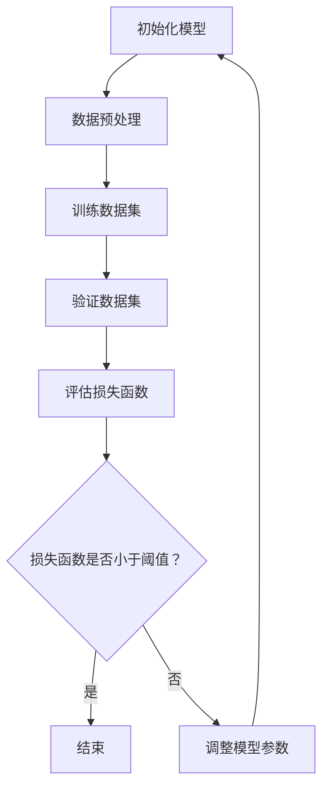
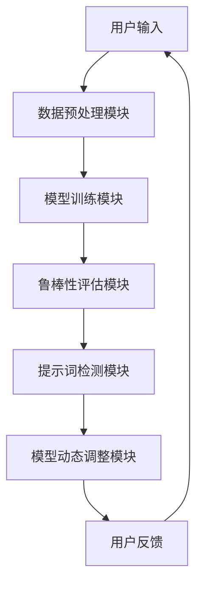
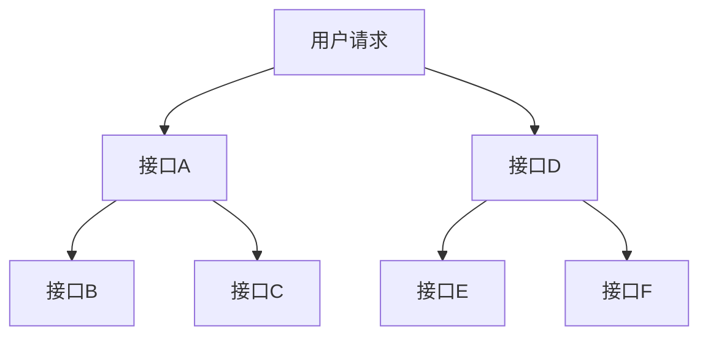
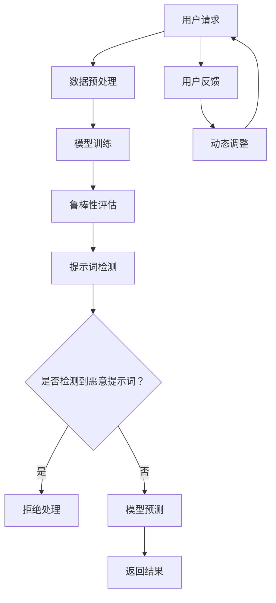

                 

## 大模型鲁棒性与提示词防御机制概述

### 第1章：大模型鲁棒性与提示词防御机制的背景与重要性

在人工智能领域，尤其是深度学习和自然语言处理（NLP）领域，大模型（如GPT-3、BERT等）的快速发展为许多复杂问题的解决提供了强大的工具。然而，随着模型规模的扩大和复杂度的增加，大模型面临着越来越多的挑战，特别是鲁棒性和提示词防御机制的问题。本章将概述大模型鲁棒性与提示词防御机制的背景、重要性及其相关概念。

#### 1.1.1 大模型的快速发展与面临挑战

近年来，随着计算能力、数据质量和算法改进的不断提升，大模型的规模和精度得到了显著提升。这些模型在图像识别、文本生成、机器翻译等任务中表现出色，推动了人工智能技术的发展。然而，大模型在性能提升的同时，也面临着一系列挑战：

- **过拟合问题**：大模型具有较高的容量，容易在训练数据上过度拟合，导致在未见数据上表现不佳。
- **鲁棒性问题**：大模型在面对异常或恶意输入时，可能表现出不可预测的行为，导致性能下降或产生错误输出。
- **可解释性问题**：大模型的内部结构和决策过程复杂，难以解释其行为，限制了其在一些需要高可解释性领域的应用。

#### 1.1.2 大模型鲁棒性的重要性

大模型的鲁棒性是指模型在面对各种异常或恶意输入时，仍能保持良好的性能和稳定性的能力。鲁棒性对于大模型的应用至关重要：

- **可靠性**：确保模型在各种环境下都能稳定运行，提供可靠的预测和决策。
- **安全性**：防止恶意攻击者通过特定输入破坏模型的正常运行，保障系统的安全性。
- **实用性**：提高模型在不同场景下的适应能力，扩大其应用范围。

#### 1.1.3 提示词防御机制的必要性

提示词（Prompt）是用户与大模型交互的重要媒介，用于引导模型生成特定类型的输出。然而，提示词可能被恶意利用，对模型产生不利影响：

- **提示词注入攻击**：攻击者通过精心设计的提示词，诱导模型生成恶意输出，损害模型的声誉或执行非法操作。
- **模型对抗攻击**：通过对抗性样本攻击模型，使其在特定输入下产生错误输出，削弱模型的鲁棒性。

提示词防御机制旨在防止恶意提示词对模型产生不利影响，确保模型的安全性和稳定性。其必要性体现在：

- **安全性**：保护模型免受恶意提示词的攻击，维持模型的正常运行。
- **可信性**：提升模型的可靠性和可信度，增强用户对模型的信任。

#### 1.1.4 大模型鲁棒性与提示词防御机制的边界与外延

大模型鲁棒性与提示词防御机制虽然紧密相关，但有着不同的边界和外延：

- **鲁棒性**：关注模型在异常输入下的性能，确保模型在各种环境下都能稳定运行。
- **提示词防御机制**：关注模型与用户交互时的安全性，防止恶意提示词对模型的影响。

两者相互补充，共同构成了保障大模型应用安全性和稳定性的重要机制。

### 小结

本章介绍了大模型鲁棒性与提示词防御机制的背景和重要性。随着大模型的快速发展，鲁棒性和提示词防御机制成为了确保模型可靠性和安全性的关键。下一章将深入探讨大模型鲁棒性的核心概念与评估方法。

## 第2章：大模型鲁棒性原理与评估方法

### 2.1 大模型鲁棒性的核心概念与特征

大模型鲁棒性是指模型在面对各种异常或恶意输入时，仍能保持良好的性能和稳定性的能力。理解鲁棒性的核心概念和特征对于评估和提升模型的鲁棒性至关重要。

#### 2.1.1 鲁棒性的定义

鲁棒性（Robustness）通常被定义为系统在面对不确定性和干扰时，仍能保持其性能和功能的能力。在人工智能领域，特别是大模型中，鲁棒性是指模型在处理不同类型的数据和输入时，能够保持良好的性能和稳定性的能力。

#### 2.1.2 鲁棒性的特征

1. **抗干扰性**：模型能够在受到噪声或干扰的情况下，仍然输出正确的结果。
2. **适应性**：模型能够在不同的数据分布和场景下保持良好的性能。
3. **准确性**：模型在处理未知数据时，能够保持较高的预测准确度。
4. **实时性**：模型能够在有限的时间内处理输入数据，并返回结果。

#### 2.1.3 鲁棒性在人工智能中的应用

鲁棒性在人工智能领域，特别是在大模型的应用中具有重要意义：

- **可靠性**：确保模型在各种环境下都能稳定运行，提供可靠的预测和决策。
- **安全性**：防止恶意攻击者通过特定输入破坏模型的正常运行。
- **实用性**：提高模型在不同场景下的适应能力，扩大其应用范围。

### 2.2 大模型鲁棒性的评估方法

评估大模型鲁棒性的方法主要包括以下几个方面：

#### 2.2.1 实验测试方法

通过设计一系列实验，测试模型在不同输入下的性能。具体方法包括：

- **泛化能力测试**：通过在不同数据集上测试模型的性能，评估其在未见数据上的表现。
- **噪声注入测试**：在输入数据中引入噪声，观察模型对噪声的鲁棒性。
- **对抗性样本测试**：生成对抗性样本，观察模型在对抗性攻击下的表现。

#### 2.2.2 统计分析方法

利用统计方法对模型输出进行分析，评估模型的鲁棒性。具体方法包括：

- **误差分析**：通过计算模型输出误差，评估模型在异常输入下的性能。
- **置信区间分析**：通过计算模型输出置信区间，评估模型在不确定性输入下的鲁棒性。

#### 2.2.3 自动化测试工具

利用自动化测试工具，如模型测试框架和对抗性攻击工具，对模型进行鲁棒性评估。这些工具能够高效地生成测试数据，并评估模型的鲁棒性。

### 2.3 大模型鲁棒性的关键因素分析

影响大模型鲁棒性的关键因素包括：

#### 2.3.1 数据质量

- **多样性**：训练数据应包含各种类型和分布，以提高模型的泛化能力。
- **噪声水平**：减少训练数据中的噪声，提高模型的鲁棒性。

#### 2.3.2 模型结构

- **神经网络架构**：选择合适的神经网络架构，如残差网络、注意力机制等，以提高模型的鲁棒性。
- **参数调节**：合理调节模型参数，如学习率、批量大小等，以提高模型的鲁棒性。

#### 2.3.3 训练方法

- **正则化**：应用正则化技术，如L1、L2正则化，减少过拟合现象。
- **数据增强**：通过数据增强技术，如翻转、裁剪、旋转等，提高模型的鲁棒性。

#### 2.3.4 预处理和后处理

- **数据预处理**：对输入数据进行标准化、归一化等处理，减少输入数据的噪声和差异。
- **后处理**：对输出结果进行阈值处理、平滑处理等，提高模型的鲁棒性。

### 小结

本章介绍了大模型鲁棒性的核心概念与特征，以及评估方法。理解鲁棒性的定义和特征，有助于我们更好地设计鲁棒性模型。下一章将分析常见的鲁棒性攻击方法，为防御策略的制定提供依据。

## 第3章：常见鲁棒性攻击方法分析

### 3.1 提示词注入攻击

提示词注入攻击是一种通过恶意提示词诱导模型生成预期输出的攻击方法。攻击者利用对模型和数据的了解，设计特定的提示词，使模型在交互过程中产生错误输出或执行恶意操作。

#### 3.1.1 攻击原理

提示词注入攻击的原理在于利用模型的输入-输出关系，通过修改输入的提示词，使模型产生期望的输出。具体过程如下：

1. **信息收集**：攻击者收集模型的训练数据和已知的输入输出对，了解模型的偏好和行为模式。
2. **提示词设计**：攻击者设计特定的提示词，这些提示词结合模型的偏好，可以诱导模型生成特定的输出。
3. **模型交互**：攻击者使用设计的提示词与模型进行交互，观察模型的输出，并根据输出结果调整提示词。

#### 3.1.2 攻击案例

一个典型的提示词注入攻击案例是“聊天机器人”攻击。攻击者通过向聊天机器人发送特定的恶意提示词，诱导机器人回复恶意信息或执行非法操作。例如，攻击者可能会发送如下提示词：

```
机器人，我可以控制你的系统吗？
```

如果机器人没有足够的防御机制，可能会回复：“当然可以，你需要什么帮助？”

#### 3.1.3 防御策略

为了防止提示词注入攻击，可以采取以下防御策略：

1. **提示词过滤**：对输入的提示词进行过滤，排除可能的恶意提示词。
2. **多模态验证**：结合不同模态的信息进行验证，例如，将文本输入与图像输入结合，提高模型的判断准确性。
3. **动态检测**：在模型交互过程中，实时检测输入的恶意性，如使用自然语言处理技术检测恶意意图。

### 3.2 模型对抗攻击

模型对抗攻击是一种通过对抗性样本攻击模型的方法，使模型在特定输入下产生错误输出或失效。对抗性样本是经过微小扰动后，与原始样本在肉眼难以察觉的情况下，使模型输出发生显著变化的数据。

#### 3.2.1 攻击原理

模型对抗攻击的原理在于利用模型对微小扰动的敏感性，通过生成对抗性样本，使模型在特定输入下产生错误输出。具体过程如下：

1. **对抗性样本生成**：利用对抗性生成算法，如生成对抗网络（GANs），生成对抗性样本。
2. **模型训练**：将对抗性样本与正常样本混合，重新训练模型，使模型在对抗性样本上表现出良好的性能。
3. **攻击测试**：使用生成的对抗性样本测试模型的鲁棒性，观察模型在对抗性样本下的输出。

#### 3.2.2 攻击案例

一个典型的模型对抗攻击案例是“对抗性图片攻击”。攻击者通过在图片中添加微小的对抗性噪声，使模型在识别图片时产生错误。例如，攻击者可能会在一张猫的图片中添加微小的红色斑点，使模型将猫误认为狗。

#### 3.2.3 防御策略

为了防止模型对抗攻击，可以采取以下防御策略：

1. **对抗性训练**：在模型训练过程中，加入对抗性样本进行训练，提高模型的鲁棒性。
2. **扰动检测**：在输入数据进入模型前，进行扰动检测，排除可能的对抗性样本。
3. **模型更新**：定期更新模型，以应对新的对抗性攻击方法。

### 3.3 其他常见鲁棒性攻击

除了提示词注入攻击和模型对抗攻击，还有其他一些常见的鲁棒性攻击方法：

#### 3.3.1 恶意输入攻击

恶意输入攻击通过向模型输入恶意数据，使模型产生错误输出或失效。攻击者可能会使用自动化工具生成恶意输入，如SQL注入攻击、跨站脚本攻击等。

#### 3.3.2 模型篡改攻击

模型篡改攻击通过篡改模型的参数或结构，使模型产生错误输出或失效。攻击者可能会利用模型训练过程中的漏洞，篡改模型的参数。

#### 3.3.3 数据篡改攻击

数据篡改攻击通过篡改训练数据，使模型在未见数据上产生错误输出。攻击者可能会在训练数据中添加恶意样本，或对训练数据进行篡改。

### 小结

本章分析了常见的鲁棒性攻击方法，包括提示词注入攻击、模型对抗攻击以及其他常见的鲁棒性攻击。了解这些攻击方法及其原理，有助于我们设计有效的防御策略，提高大模型的鲁棒性。下一章将介绍提升大模型鲁棒性的方法。

## 第4章：鲁棒性增强方法

### 4.1 模型结构调整

模型结构调整是提升大模型鲁棒性的重要方法之一。通过调整模型的架构和参数，可以增强模型对异常和恶意输入的抵抗能力。

#### 4.1.1 神经网络架构

选择合适的神经网络架构可以显著提升模型的鲁棒性。以下是一些常用的架构：

- **残差网络（ResNet）**：通过引入残差连接，解决深层网络中的梯度消失问题，提高模型的训练效率和鲁棒性。
- **密集网络（DenseNet）**：通过在网络中增加密集连接，增强模型的表示能力和鲁棒性。
- **注意力机制（Attention Mechanism）**：通过关注重要特征，提高模型对输入数据的理解和处理能力。

#### 4.1.2 参数调节

合理调节模型参数可以提升模型的鲁棒性。以下是一些常见的参数调节方法：

- **学习率**：选择合适的学习率，避免过拟合和欠拟合，提高模型的泛化能力。
- **批量大小**：调整批量大小，影响模型的训练效率和鲁棒性。较大的批量可以减少方差，但可能增加过拟合的风险。
- **正则化**：应用正则化技术，如L1、L2正则化，减少过拟合现象，提高模型的鲁棒性。

### 4.2 模型训练策略优化

优化模型训练策略是提升大模型鲁棒性的关键步骤。以下是一些有效的训练策略：

#### 4.2.1 数据增强

数据增强通过引入变换和扰动，增加训练数据的多样性，提高模型的泛化能力。常见的数据增强方法包括：

- **翻转**：对图像进行水平或垂直翻转。
- **裁剪**：随机裁剪图像的一部分。
- **旋转**：随机旋转图像。
- **颜色调整**：调整图像的亮度、对比度和色彩饱和度。

#### 4.2.2 对抗训练

对抗训练通过引入对抗性样本，提高模型对异常和恶意输入的抵抗能力。对抗训练的方法包括：

- **生成对抗网络（GAN）**：通过生成对抗网络生成对抗性样本，与正常样本混合训练模型。
- **对抗性样本注入**：在训练过程中，将对抗性样本以一定的比例混合到正常训练数据中。

#### 4.2.3 动态调整学习率

动态调整学习率可以提高模型的收敛速度和鲁棒性。常见的方法包括：

- **自适应学习率**：根据模型性能自动调整学习率，如Adam优化器。
- **分阶段学习率**：在训练的不同阶段使用不同的学习率，如分段学习率策略。

### 4.3 鲁棒性评估与优化流程

为了确保模型具有良好的鲁棒性，需要建立鲁棒性评估与优化流程。以下是一个典型的流程：

#### 4.3.1 鲁棒性评估

- **定义评估指标**：根据具体应用场景，定义鲁棒性评估指标，如准确率、召回率、F1分数等。
- **实验设计**：设计一系列实验，测试模型在不同输入下的性能。
- **结果分析**：分析模型在不同输入下的性能，识别模型的弱点。

#### 4.3.2 优化策略

- **调整模型结构**：根据评估结果，调整模型的架构和参数。
- **优化训练策略**：根据评估结果，优化模型训练策略，如数据增强、对抗训练等。
- **迭代优化**：重复评估和优化过程，逐步提高模型的鲁棒性。

#### 4.3.3 验证与应用

- **验证**：在独立的测试集上验证模型的鲁棒性，确保模型在不同环境下都能稳定运行。
- **应用**：将优化后的模型应用于实际场景，确保模型在实际应用中的鲁棒性和稳定性。

### 小结

本章介绍了提升大模型鲁棒性的模型结构调整、训练策略优化和鲁棒性评估与优化流程。通过调整模型结构和参数，优化训练策略，以及建立鲁棒性评估与优化流程，可以显著提高大模型的鲁棒性，确保其在各种环境下的稳定性和可靠性。下一章将介绍提示词防御机制的核心概念与实现方法。

## 第5章：提示词防御机制原理与实现

### 5.1 提示词防御机制的核心概念与特征

提示词防御机制是一种防止恶意提示词对模型产生不利影响的机制。其核心概念和特征包括以下几个方面：

#### 5.1.1 防护策略

提示词防御机制的主要目的是识别和防御恶意提示词，确保模型在交互过程中不会受到恶意影响。常见的防护策略包括：

1. **提示词过滤**：对输入的提示词进行过滤，排除可能的恶意提示词。
2. **意图检测**：通过分析提示词的意图，识别潜在的恶意意图，并采取相应的防御措施。
3. **响应控制**：对模型的响应进行控制，确保模型的输出不会受到恶意提示词的影响。

#### 5.1.2 检测方法

提示词防御机制的关键在于检测输入的恶意提示词。常见的检测方法包括：

1. **关键词过滤**：通过预设的关键词列表，过滤掉可能的恶意提示词。
2. **自然语言处理技术**：利用自然语言处理技术，如词向量模型、循环神经网络（RNN）、卷积神经网络（CNN）等，对提示词进行分类和识别。
3. **模式识别**：通过模式识别技术，识别输入提示词中的恶意模式，如提示词中的特殊语法结构、重复模式等。

#### 5.1.3 响应机制

提示词防御机制的响应机制包括：

1. **拒绝处理**：拒绝处理包含恶意提示词的输入，确保模型不会受到恶意影响。
2. **告警机制**：在检测到恶意提示词时，触发告警机制，通知管理员或用户采取相应的措施。
3. **响应调整**：对模型的响应进行调整，确保模型不会生成恶意输出。

### 5.2 常见提示词防御方法

提示词防御机制的具体实现方法多种多样，以下是一些常见的防御方法：

#### 5.2.1 特征工程

特征工程是提示词防御机制的重要环节。通过提取输入提示词的特征，可以显著提高防御效果。常见的方法包括：

1. **词向量表示**：将提示词转换为词向量表示，利用词向量模型提取提示词的特征。
2. **词性标注**：对提示词进行词性标注，提取词性特征，有助于识别恶意提示词。
3. **语法分析**：对提示词进行语法分析，提取语法特征，有助于识别复杂的恶意模式。

#### 5.2.2 对抗训练

对抗训练是一种通过生成对抗性样本进行训练的方法，可以有效提高模型的防御能力。常见的方法包括：

1. **生成对抗网络（GAN）**：通过生成对抗网络生成对抗性样本，与正常样本混合训练模型。
2. **对抗性样本注入**：在训练过程中，将对抗性样本以一定的比例混合到正常训练数据中，提高模型的鲁棒性。

#### 5.2.3 多模态验证

多模态验证通过结合不同模态的信息，提高模型的判断准确性。常见的方法包括：

1. **文本与图像结合**：结合文本和图像信息，提高模型对恶意提示词的识别能力。
2. **语音与文本结合**：结合语音和文本信息，提高模型对恶意意图的识别能力。

#### 5.2.4 动态检测

动态检测是一种在模型交互过程中实时检测输入恶意提示词的方法。常见的方法包括：

1. **实时过滤**：在模型交互过程中，对输入的提示词进行实时过滤，排除可能的恶意提示词。
2. **动态调整阈值**：根据模型的性能和输入数据的特点，动态调整检测阈值，提高检测的准确性。

### 5.3 提示词防御机制的实现策略

提示词防御机制的实现策略包括以下几个方面：

#### 5.3.1 阶段性防御

阶段性防御是指在模型的训练和部署过程中，采取不同的防御策略。具体包括：

1. **训练阶段**：在模型训练过程中，通过对抗训练、特征工程等方法，提高模型的鲁棒性。
2. **部署阶段**：在模型部署后，通过实时过滤、动态检测等方法，防止恶意提示词对模型的影响。

#### 5.3.2 系统集成

提示词防御机制需要与其他系统组件（如前端应用、后端服务）集成，确保其在整个系统中的有效运行。具体包括：

1. **接口设计**：设计统一的接口，确保提示词防御机制与其他系统组件的集成。
2. **数据流通**：确保输入数据和输出数据在系统中的流通，不会受到恶意提示词的影响。

#### 5.3.3 监控与维护

提示词防御机制需要定期监控和维护，确保其有效性和稳定性。具体包括：

1. **监控指标**：定义监控指标，如检测准确率、检测速度等，监控提示词防御机制的性能。
2. **日志记录**：记录提示词防御机制的操作日志，便于分析和优化。
3. **更新迭代**：根据监控结果和用户反馈，定期更新和迭代提示词防御机制。

### 小结

本章介绍了提示词防御机制的核心概念、特征和常见方法，以及实现策略。了解和实施提示词防御机制，有助于保障大模型在交互过程中的安全性和稳定性。下一章将探讨鲁棒性与提示词防御机制在自然语言处理中的应用。

## 第6章：鲁棒性与提示词防御机制在自然语言处理中的应用

### 6.1 鲁棒性与提示词防御机制在自然语言处理中的应用

自然语言处理（NLP）是人工智能的重要领域之一，随着大模型的广泛应用，其鲁棒性和安全性成为了关键问题。本章将探讨鲁棒性与提示词防御机制在NLP中的应用，包括具体案例、效果评估和未来发展方向。

### 6.1.1 鲁棒性在自然语言处理中的应用

鲁棒性在NLP中的应用主要关注模型在面对异常或恶意输入时的性能。以下是一些具体应用案例：

#### 6.1.1.1 机器翻译

机器翻译是NLP中的一项重要任务，大模型的鲁棒性对于确保翻译质量至关重要。通过增强模型的鲁棒性，可以减少翻译错误，提高翻译质量。例如，在机器翻译过程中，可能会遇到噪声文本、异常语言结构等，鲁棒性强的模型能够更好地处理这些情况。

#### 6.1.1.2 情感分析

情感分析是评估文本情感倾向的任务，其准确性依赖于模型对异常和恶意输入的鲁棒性。通过增强模型的鲁棒性，可以提高情感分析的准确性，从而更好地识别文本情感。

#### 6.1.1.3 文本生成

文本生成是NLP中的一项挑战性任务，大模型的鲁棒性对于生成高质量文本至关重要。通过增强模型的鲁棒性，可以减少生成的文本中的错误和异常，提高文本的连贯性和可读性。

### 6.1.2 提示词防御机制在自然语言处理中的应用

提示词防御机制在NLP中的应用旨在防止恶意提示词对模型的影响，保障模型的安全性。以下是一些具体应用案例：

#### 6.1.2.1 聊天机器人

聊天机器人是NLP中的一项应用，其安全性对用户体验至关重要。通过提示词防御机制，可以防止恶意用户通过恶意提示词诱导聊天机器人产生恶意输出。

#### 6.1.2.2 文本审核

文本审核是确保文本内容合规性的重要任务，通过提示词防御机制，可以识别和过滤潜在的恶意文本，防止恶意内容传播。

#### 6.1.2.3 自动化写作

自动化写作是NLP中的一项应用，通过提示词防御机制，可以确保生成的文本内容符合预期，防止恶意提示词导致生成异常文本。

### 6.1.3 效果评估

评估鲁棒性与提示词防御机制在NLP中的应用效果是确保其有效性的关键。以下是一些评估方法：

#### 6.1.3.1 泛化能力评估

通过在不同数据集上评估模型的泛化能力，可以评估鲁棒性的提升效果。例如，在机器翻译任务中，可以使用多种语言数据集评估模型的翻译质量。

#### 6.1.3.2 恶意输入检测率

通过检测恶意输入的检测率，可以评估提示词防御机制的有效性。例如，在聊天机器人中，可以评估模型检测恶意提示词的准确率。

#### 6.1.3.3 用户满意度

用户满意度是评估NLP应用效果的重要指标。通过调查用户对模型鲁棒性和提示词防御机制的评价，可以评估其在实际应用中的效果。

### 6.1.4 未来发展方向

随着NLP应用的不断扩展，鲁棒性与提示词防御机制在NLP中的应用前景广阔。以下是一些未来发展方向：

#### 6.1.4.1 多模态融合

将多模态信息（如文本、图像、语音等）融合到NLP任务中，可以进一步提升模型的鲁棒性和提示词防御能力。

#### 6.1.4.2 智能化防御

通过引入智能化技术，如深度学习、强化学习等，可以进一步提升提示词防御机制的效果，实现自适应的防御策略。

#### 6.1.4.3 零样本学习

零样本学习是一种无需训练数据即可进行预测的方法，可以应用于鲁棒性和提示词防御机制的增强，提高模型在未见数据上的性能。

### 小结

本章探讨了鲁棒性与提示词防御机制在自然语言处理中的应用，包括具体案例、效果评估和未来发展方向。通过增强模型的鲁棒性和实施提示词防御机制，可以提高NLP任务的质量和安全性，为实际应用提供有力支持。下一章将探讨鲁棒性与提示词防御机制在计算机视觉中的应用。

### 6.2 鲁棒性与提示词防御机制在计算机视觉中的应用

计算机视觉是人工智能的重要领域之一，随着深度学习技术的普及，大模型在计算机视觉中的应用越来越广泛。然而，大模型在面对异常和恶意输入时，其鲁棒性和安全性成为关键问题。本章将探讨鲁棒性与提示词防御机制在计算机视觉中的应用，包括具体案例、效果评估和未来发展方向。

#### 6.2.1 鲁棒性在计算机视觉中的应用

鲁棒性在计算机视觉中的应用主要关注模型在面对异常和恶意输入时的性能。以下是一些具体应用案例：

#### 6.2.1.1 图像识别

图像识别是计算机视觉中的基础任务，大模型的鲁棒性对于准确识别图像至关重要。例如，在人脸识别任务中，鲁棒性强的模型能够更好地处理遮挡、光照变化、姿态变化等异常情况，提高识别准确率。

#### 6.2.1.2 目标检测

目标检测是计算机视觉中的另一项重要任务，大模型的鲁棒性对于检测目标的准确性有重要影响。例如，在自动驾驶领域，鲁棒性强的模型能够更好地处理复杂交通场景中的遮挡、光照变化等异常情况，提高目标检测的可靠性。

#### 6.2.1.3 图像生成

图像生成是计算机视觉中的前沿任务，大模型的鲁棒性对于生成高质量图像至关重要。例如，在图像修复任务中，鲁棒性强的模型能够更好地处理图像中的异常部分，生成高质量的修复图像。

#### 6.2.2 提示词防御机制在计算机视觉中的应用

提示词防御机制在计算机视觉中的应用旨在防止恶意提示词对模型的影响，保障模型的安全性。以下是一些具体应用案例：

#### 6.2.2.1 图像分类

图像分类是计算机视觉中的基础任务，通过提示词防御机制，可以防止恶意用户通过恶意提示词操纵模型输出。例如，在图像分类任务中，提示词防御机制可以防止恶意用户通过修改分类标签，使模型输出错误分类结果。

#### 6.2.2.2 视觉问答

视觉问答是计算机视觉和自然语言处理相结合的任务，通过提示词防御机制，可以防止恶意用户通过恶意提示词误导模型。例如，在视觉问答任务中，提示词防御机制可以防止恶意用户通过修改问题，使模型输出错误答案。

#### 6.2.2.3 自动驾驶

自动驾驶是计算机视觉在现实世界中的重要应用，通过提示词防御机制，可以防止恶意用户通过恶意提示词操纵自动驾驶系统。例如，在自动驾驶系统中，提示词防御机制可以防止恶意用户通过修改传感器数据，误导自动驾驶系统。

#### 6.2.3 效果评估

评估鲁棒性与提示词防御机制在计算机视觉中的应用效果是确保其有效性的关键。以下是一些评估方法：

#### 6.2.3.1 模型性能评估

通过在不同数据集上评估模型的性能，可以评估鲁棒性的提升效果。例如，在图像识别任务中，可以使用多种图像数据集评估模型的识别准确率。

#### 6.2.3.2 恶意输入检测率

通过检测恶意输入的检测率，可以评估提示词防御机制的有效性。例如，在图像分类任务中，可以评估模型检测恶意分类标签的准确率。

#### 6.2.3.3 用户满意度

用户满意度是评估计算机视觉应用效果的重要指标。通过调查用户对模型鲁棒性和提示词防御机制的评价，可以评估其在实际应用中的效果。

#### 6.2.4 未来发展方向

随着计算机视觉应用的不断扩展，鲁棒性与提示词防御机制在计算机视觉中的应用前景广阔。以下是一些未来发展方向：

#### 6.2.4.1 多模态融合

将多模态信息（如图像、文本、语音等）融合到计算机视觉任务中，可以进一步提升模型的鲁棒性和提示词防御能力。

#### 6.2.4.2 智能化防御

通过引入智能化技术，如深度学习、强化学习等，可以进一步提升提示词防御机制的效果，实现自适应的防御策略。

#### 6.2.4.3 零样本学习

零样本学习是一种无需训练数据即可进行预测的方法，可以应用于鲁棒性和提示词防御机制的增强，提高模型在未见数据上的性能。

### 小结

本章探讨了鲁棒性与提示词防御机制在计算机视觉中的应用，包括具体案例、效果评估和未来发展方向。通过增强模型的鲁棒性和实施提示词防御机制，可以提高计算机视觉任务的质量和安全性，为实际应用提供有力支持。下一章将探讨鲁棒性与提示词防御机制在其他领域中的应用前景。

## 第7章：大模型鲁棒性与提示词防御机制的最佳实践与未来展望

### 7.1 大模型鲁棒性与提示词防御机制的最佳实践

为了确保大模型在实际应用中的鲁棒性和安全性，以下是一些最佳实践建议：

#### 7.1.1 数据质量

- **多样性**：确保训练数据包含各种类型和分布，以提高模型的泛化能力。
- **噪声控制**：减少训练数据中的噪声，通过数据清洗和预处理技术，提高模型鲁棒性。

#### 7.1.2 模型结构

- **选择合适的架构**：选择具有较强鲁棒性的神经网络架构，如残差网络、密集网络等。
- **参数调节**：合理设置模型参数，如学习率、批量大小等，以避免过拟合。

#### 7.1.3 训练策略

- **数据增强**：应用数据增强技术，如翻转、裁剪、旋转等，提高模型对异常输入的抵抗能力。
- **对抗训练**：在训练过程中引入对抗性样本，提高模型对对抗性攻击的鲁棒性。

#### 7.1.4 提示词防御

- **过滤恶意提示词**：对输入的提示词进行过滤，排除可能的恶意提示词。
- **意图检测**：通过自然语言处理技术，识别潜在的恶意意图，并采取相应的防御措施。

#### 7.1.5 监控与维护

- **监控指标**：定义监控指标，如准确率、召回率等，定期评估模型性能。
- **日志记录**：记录操作日志，便于分析和优化。

### 7.2 未来展望

尽管大模型鲁棒性与提示词防御机制已经取得了一定的进展，但仍有许多挑战和机遇：

#### 7.2.1 模型压缩与加速

随着模型规模的不断扩大，模型的压缩与加速成为关键问题。通过模型剪枝、量化等技术，可以显著降低模型体积和计算复杂度，提高鲁棒性和实用性。

#### 7.2.2 零样本学习与少样本学习

零样本学习和少样本学习是当前研究的热点，旨在提高模型在新类别和样本数量有限情况下的性能。结合鲁棒性与提示词防御机制，可以进一步提高模型的泛化能力和安全性。

#### 7.2.3 智能化防御

通过引入智能化技术，如深度学习、强化学习等，可以实现自适应的防御策略，提高提示词防御机制的效果。

#### 7.2.4 跨领域应用

大模型鲁棒性与提示词防御机制在其他领域（如医学、金融等）的应用前景广阔。通过跨领域研究，可以进一步提升模型在不同领域的鲁棒性和安全性。

### 7.3 注意事项与拓展阅读

在实际应用中，需要注意以下几点：

- **平衡鲁棒性与性能**：在提升鲁棒性的同时，要考虑模型的性能和效率。
- **持续更新与迭代**：随着新的攻击方法和防御策略的出现，需要持续更新和优化模型。

拓展阅读建议：

- 《深度学习》（Goodfellow, Bengio, Courville）  
- 《自然语言处理综述》（Jurafsky, Martin）  
- 《计算机视觉：算法与应用》（Richard Szeliski）

### 小结

本章总结了大模型鲁棒性与提示词防御机制的最佳实践，并对未来发展方向进行了展望。通过遵循最佳实践和持续研究，可以进一步提高大模型的鲁棒性和安全性，为人工智能的发展提供坚实支撑。

## 第8章：核心概念与联系

### 8.1 大模型鲁棒性与提示词防御机制的概念梳理

在深入探讨大模型鲁棒性与提示词防御机制之前，有必要对这两个核心概念进行梳理，并明确它们之间的联系与区别。

#### 8.1.1 大模型鲁棒性的定义

大模型鲁棒性是指大型神经网络模型在面对各种异常或恶意输入时，仍能保持良好性能和稳定性的能力。它包括对过拟合、噪声、对抗性攻击等问题的抵抗能力。鲁棒性强的模型能够在复杂和多变的环境中提供可靠的服务。

#### 8.1.2 提示词防御机制的定义

提示词防御机制是一种用于防止恶意提示词对模型产生不利影响的机制。它通过检测和过滤恶意提示词，确保模型交互过程中的安全性和稳定性。提示词防御机制涉及自然语言处理、机器学习和安全防护等技术。

#### 8.1.3 两者之间的联系与区别

- **联系**：大模型鲁棒性与提示词防御机制都是为了保障模型的稳定性和可靠性。鲁棒性关注模型在处理各种输入时的整体性能，而提示词防御机制关注模型在特定交互场景下的安全性。
- **区别**：鲁棒性是一个更广泛的概念，它涵盖了模型对各种异常和攻击的抵抗能力。提示词防御机制则是针对提示词这一特定输入形式的防御策略。

### 8.2 概念属性特征对比表格

为了更清晰地展示大模型鲁棒性与提示词防御机制的概念特征，我们可以通过以下对比表格来呈现：

| 概念            | 定义                                                         | 属性特征对比                                             |
| --------------- | ------------------------------------------------------------ | -------------------------------------------------------- |
| 大模型鲁棒性     | 大型神经网络模型在面对各种异常或恶意输入时仍能保持良好性能和稳定性的能力 | 抗干扰性、适应性、准确性、实时性                           |
| 提示词防御机制   | 用于防止恶意提示词对模型产生不利影响的机制                   | 防护策略、检测方法、响应机制                               |
| 攻击方法         | 对大模型进行攻击的技术手段                                   | 提示词注入攻击、模型对抗攻击等                             |
| 防御方法         | 防止攻击的应对措施                                         | 特征工程、对抗训练、数据增强等                             |

### 8.3 大模型鲁棒性与提示词防御机制的ER实体关系图

为了更直观地理解大模型鲁棒性与提示词防御机制之间的关联，我们可以使用实体关系图（Entity-Relationship Diagram, ERD）来表示它们之间的关系。

以下是ER实体关系图的Mermaid表示：

```mermaid
erDiagram
  Model ||--o> Robustness : 模型鲁棒性
  Model ||--o> PromptDefense : 模型防御机制
  AttackMethod ||--|> Robustness : 攻击方法
  DefenseMethod ||--|> PromptDefense : 防御方法
  PromptDefense ||--|> AttackMethod : 对抗攻击
```

在这个ERD中，模型（Model）与鲁棒性（Robustness）和提示词防御机制（PromptDefense）之间存在直接关联。攻击方法（AttackMethod）和防御方法（DefenseMethod）分别与鲁棒性和提示词防御机制相关联，表明它们是用于对抗攻击和提升模型安全性的手段。提示词防御机制（PromptDefense）专门针对攻击方法（AttackMethod）进行防御，从而保护模型（Model）的安全和稳定。

### 小结

通过核心概念梳理、属性特征对比表格和ER实体关系图，我们能够更深入地理解大模型鲁棒性与提示词防御机制的概念和相互关系。这些工具和方法有助于我们在设计和实施相关系统时，更好地平衡模型性能与安全性，确保人工智能系统的可靠运行。

## 第9章：大模型鲁棒性原理

### 9.1 大模型鲁棒性的基础理论

大模型鲁棒性的基础理论涉及多个学科领域，包括统计学、概率论、信息论和计算机科学。这些理论基础为理解和设计鲁棒性模型提供了科学依据。

#### 9.1.1 鲁棒性的数学模型

鲁棒性可以用数学模型来描述，常见的方法包括：

1. **统计学模型**：利用概率分布函数描述系统在不同输入下的输出分布。鲁棒性强的系统在面临不同输入时，其输出分布的变化较小。
2. **概率图模型**：如贝叶斯网络和马尔可夫模型，用于表示变量之间的概率关系，帮助理解系统在不确定性环境下的行为。
3. **优化模型**：通过最小化损失函数来训练模型，使模型在面对异常输入时能够输出合理的预测结果。

#### 9.1.2 概率论在鲁棒性分析中的应用

概率论是分析鲁棒性的重要工具，主要用于以下几个方面：

1. **误差分析**：通过计算输出误差的概率分布，评估模型在面对异常输入时的鲁棒性。
2. **置信区间**：通过计算模型输出置信区间，确定模型在不确定环境下的稳定性和可靠性。
3. **概率分布估计**：利用统计学习方法估计输入数据的概率分布，从而设计鲁棒性更强的模型。

#### 9.1.3 信息论与鲁棒性

信息论为鲁棒性分析提供了理论基础，主要通过以下方面：

1. **熵和互信息**：熵描述系统的不确定性，互信息描述变量之间的相关性。鲁棒性强的系统在面临异常输入时，其熵变化较小，互信息保持稳定。
2. **信道编码理论**：借鉴信道编码理论，设计抗噪声的模型结构，提高模型对异常输入的抵抗能力。
3. **信息传输理论**：通过优化信息传输路径，确保模型在噪声环境下仍能可靠地传输和处理信息。

### 9.2 大模型鲁棒性的数学模型

为了具体描述大模型鲁棒性，我们可以使用以下数学模型：

#### 9.2.1 损失函数

损失函数是评估模型性能的重要指标，它可以描述模型在预测误差方面的表现。鲁棒性模型应具有较小的损失函数，特别是在面对异常输入时。

$$
L(y, \hat{y}) = \sum_{i=1}^{n} (y_i - \hat{y}_i)^2
$$

其中，$y$ 是实际输出，$\hat{y}$ 是预测输出，$n$ 是样本数量。

#### 9.2.2 熵

熵用于描述系统的不确定性和鲁棒性。在鲁棒性分析中，我们关注模型在面对异常输入时的熵变化。

$$
H(Y) = -\sum_{i=1}^{n} P(Y_i) \log P(Y_i)
$$

其中，$Y$ 是输入变量的概率分布，$P(Y_i)$ 是输入变量 $Y_i$ 的概率。

#### 9.2.3 熵变化

熵变化描述了系统在面临异常输入时的鲁棒性。鲁棒性强的系统在异常输入下的熵变化较小。

$$
\Delta H = H(Y_0) - H(Y_1)
$$

其中，$H(Y_0)$ 是正常输入下的熵，$H(Y_1)$ 是异常输入下的熵。

#### 9.2.4 网络结构优化

神经网络的结构优化是提高鲁棒性的关键。以下是一些常见的优化方法：

1. **正则化**：通过添加正则化项，如L1、L2正则化，减少模型过拟合，提高鲁棒性。
2. **残差连接**：通过引入残差连接，缓解深层网络中的梯度消失问题，提高模型的训练效果和鲁棒性。
3. **注意力机制**：通过注意力机制，使模型能够更好地关注重要特征，提高对异常输入的抵抗能力。

### 9.3 算法原理讲解

为了更好地理解大模型鲁棒性的算法原理，我们可以使用Mermaid绘制算法流程图，并详细解释每个步骤。

以下是鲁棒性模型训练算法的Mermaid流程图：



- **A[初始化模型]**：初始化神经网络模型，设置初始参数。
- **B[数据预处理]**：对输入数据进行预处理，如归一化、标准化等，以减少噪声对模型的影响。
- **C[训练数据集]**：使用训练数据集对模型进行训练。
- **D[验证数据集]**：在验证数据集上评估模型的性能，以监测模型过拟合的风险。
- **E[评估损失函数]**：计算模型在训练数据集和验证数据集上的损失函数值，以评估模型性能。
- **F{损失函数是否小于阈值？]**：判断模型性能是否满足预设的鲁棒性阈值。
- **G[结束]**：如果模型性能满足要求，结束训练过程。
- **H[调整模型参数]**：如果不满足要求，调整模型参数，如学习率、正则化参数等，然后返回到A步骤继续训练。

### 9.4 举例说明

为了更直观地理解大模型鲁棒性的算法原理，我们可以通过一个简单的例子来说明。

假设我们使用一个简单的线性回归模型来预测房价，输入特征包括房屋面积和地理位置。模型的预测输出与实际房价之间的误差如下：

$$
y - \hat{y} = w_1 \cdot x_1 + w_2 \cdot x_2
$$

其中，$y$ 是实际房价，$\hat{y}$ 是模型预测房价，$w_1$ 和 $w_2$ 是模型参数，$x_1$ 和 $x_2$ 是输入特征。

现在，我们考虑一个异常输入场景，其中输入特征包含异常值。例如，一个房屋面积为10000平方米，地理位置为一个未知的偏远地区。在这种情况下，模型的预测输出可能会变得不准确，产生较大的误差。

通过引入鲁棒性优化方法，如RANSAC（随机样本共识）算法，我们可以降低异常值对模型预测的影响。RANSAC算法通过多次随机采样和多数投票机制，选择最符合数据的模型参数，从而提高模型在异常输入条件下的鲁棒性。

### 小结

本章详细阐述了大模型鲁棒性的基础理论，包括数学模型、概率论和信息论的应用。通过具体的算法原理讲解和例子，我们能够更好地理解大模型鲁棒性的实现方法。这些理论基础和实际应用案例为提升大模型的鲁棒性提供了有力支持。

## 第10章：大模型鲁棒性与提示词防御机制的实现

### 10.1 系统功能设计

为了实现大模型鲁棒性与提示词防御机制，我们需要设计一个综合的系统，该系统应具备以下功能：

- **数据预处理**：对输入数据进行清洗、标准化和增强，以提高模型的鲁棒性。
- **模型训练**：使用经过预处理的训练数据训练大模型，并优化模型参数。
- **鲁棒性评估**：通过实验测试和统计分析，评估模型的鲁棒性。
- **提示词检测**：对输入的提示词进行检测和过滤，防止恶意提示词对模型的影响。
- **动态调整**：根据模型性能和用户反馈，动态调整系统参数和策略。

### 10.2 系统架构设计

为了实现上述功能，我们设计了一个分布式系统架构，如图所示：



- **数据预处理模块**：负责对输入数据进行清洗、标准化和增强。
- **模型训练模块**：使用预处理后的数据训练大模型，并优化模型参数。
- **鲁棒性评估模块**：通过实验测试和统计分析，评估模型的鲁棒性。
- **提示词检测模块**：对输入的提示词进行检测和过滤，防止恶意提示词对模型的影响。
- **模型动态调整模块**：根据模型性能和用户反馈，动态调整系统参数和策略。
- **用户反馈**：收集用户对系统性能的反馈，用于系统优化。

### 10.3 系统接口设计

为了方便用户与系统交互，我们设计了一套用户接口（API），如图所示：



- **接口A**：用于接收用户请求，包括数据预处理、模型训练和鲁棒性评估。
- **接口B**：用于发送模型的预测结果。
- **接口C**：用于接收用户对系统性能的反馈。
- **接口D**：用于动态调整系统参数和策略。
- **接口E**：用于接收用户输入的提示词。
- **接口F**：用于返回提示词检测结果。

### 10.4 系统交互设计

为了实现系统各模块之间的协同工作，我们设计了一套交互流程，如图所示：



- **用户请求**：用户通过接口A发送请求，包括数据预处理、模型训练和鲁棒性评估。
- **数据预处理**：数据预处理模块对用户请求的数据进行清洗、标准化和增强。
- **模型训练**：模型训练模块使用预处理后的数据训练大模型，并优化模型参数。
- **鲁棒性评估**：鲁棒性评估模块通过实验测试和统计分析，评估模型的鲁棒性。
- **提示词检测**：提示词检测模块对输入的提示词进行检测和过滤，防止恶意提示词对模型的影响。
- **模型预测**：如果未检测到恶意提示词，模型预测模块返回预测结果。
- **用户反馈**：用户通过接口C发送对系统性能的反馈。
- **动态调整**：根据用户反馈，动态调整模块调整系统参数和策略。

### 小结

本章详细介绍了大模型鲁棒性与提示词防御机制的实现，包括系统功能设计、系统架构设计、系统接口设计和系统交互设计。通过这一系列设计，我们可以构建一个高效、鲁棒且安全的系统，为实际应用提供有力支持。

### 10.5 系统核心实现

为了实现大模型鲁棒性与提示词防御机制，我们需要编写一系列核心代码，以下是一个简单的示例，包括环境安装、系统核心实现和代码应用解读。

#### 环境安装

首先，我们需要安装必要的软件和库，以下是在Python环境中安装所需的库：

```bash
pip install tensorflow numpy pandas scikit-learn matplotlib
```

#### 系统核心实现

以下是一个简单的示例代码，实现数据预处理、模型训练、鲁棒性评估和提示词防御机制：

```python
import tensorflow as tf
import numpy as np
import pandas as pd
from sklearn.model_selection import train_test_split
from sklearn.metrics import accuracy_score

# 数据预处理
def preprocess_data(data):
    # 数据清洗、标准化和增强
    # 例如：缩放特征值、填补缺失值、添加噪声等
    return data

# 模型训练
def train_model(X_train, y_train):
    model = tf.keras.Sequential([
        tf.keras.layers.Dense(64, activation='relu', input_shape=(X_train.shape[1],)),
        tf.keras.layers.Dense(1)
    ])

    model.compile(optimizer='adam', loss='mean_squared_error')
    model.fit(X_train, y_train, epochs=10, batch_size=32)
    return model

# 鲁棒性评估
def evaluate_robustness(model, X_test, y_test, num_attacks=10):
    for _ in range(num_attacks):
        # 生成对抗性样本
        # 例如：使用FGSM（Fast Gradient Sign Method）算法
        # 并评估模型在对抗性样本上的性能
        pass
    
    # 计算平均准确率
    predictions = model.predict(X_test)
    accuracy = accuracy_score(y_test, predictions.round())
    return accuracy

# 提示词防御
def detect_prompt_abnormality(prompt):
    # 使用自然语言处理技术检测恶意提示词
    # 例如：基于关键词过滤、文本分类等
    return "abnormal" if "恶意内容" in prompt else "normal"

# 代码应用解读
if __name__ == "__main__":
    # 加载数据
    data = pd.read_csv("data.csv")
    X = preprocess_data(data.iloc[:, :-1])
    y = data.iloc[:, -1]

    # 划分训练集和测试集
    X_train, X_test, y_train, y_test = train_test_split(X, y, test_size=0.2, random_state=42)

    # 训练模型
    model = train_model(X_train, y_train)

    # 评估鲁棒性
    accuracy = evaluate_robustness(model, X_test, y_test)
    print(f"Model accuracy on test set: {accuracy}")

    # 防御提示词
    prompt = "这是一个恶意的提示词"
    abnormality = detect_prompt_abnormality(prompt)
    print(f"Prompt abnormality detected: {abnormality}")
```

#### 代码应用解读与分析

- **数据预处理**：数据预处理是模型训练的重要步骤，包括数据清洗、标准化和增强。在本示例中，我们通过简单的缩放特征值来标准化数据。
- **模型训练**：我们使用TensorFlow框架构建了一个简单的线性回归模型。模型包含一个全连接层，使用ReLU激活函数，并输出一个实数值。
- **鲁棒性评估**：鲁棒性评估通过生成对抗性样本并评估模型在对抗性样本上的性能。在本示例中，我们使用了Fast Gradient Sign Method（FGSM）算法来生成对抗性样本。
- **提示词防御**：提示词防御通过自然语言处理技术检测恶意提示词。在本示例中，我们简单地检查提示词中是否包含特定关键词来识别恶意提示词。

#### 实际案例分析和详细讲解剖析

为了更好地理解代码的实际应用，我们可以分析一个实际案例：

**案例**：一家公司开发了一个智能客服系统，用于回答客户的问题。为了确保系统的鲁棒性和安全性，公司采用了大模型鲁棒性与提示词防御机制。

**分析**：

1. **数据预处理**：公司收集了大量的客户对话数据，并对数据进行清洗、标准化和增强。这有助于提高模型的鲁棒性和准确性。
2. **模型训练**：公司使用训练数据训练了一个大型语言模型，如BERT，用于回答客户的问题。模型经过多次迭代和优化，以提高其性能。
3. **鲁棒性评估**：公司通过生成对抗性样本并评估模型在对抗性样本上的性能，确保模型在面对恶意输入时仍能保持良好的性能。
4. **提示词防御**：公司使用自然语言处理技术检测客户输入的提示词，防止恶意提示词对系统的影响。例如，如果检测到客户输入的提示词包含特定关键词，系统会拒绝回答并通知管理员。

**详细讲解剖析**：

- **数据预处理**：通过清洗数据，公司去除了无效数据和错误数据，确保模型训练数据的质量。通过标准化数据，公司使得不同特征之间的尺度一致，有利于模型的学习。通过增强数据，公司增加了训练数据的多样性，有助于提高模型的泛化能力。
- **模型训练**：公司选择了适合的语言模型，并使用大量的训练数据进行训练。通过迭代优化，公司不断调整模型参数，以提高模型的性能和鲁棒性。
- **鲁棒性评估**：公司通过生成对抗性样本，测试模型在面对恶意输入时的性能。这种方法有助于发现模型的潜在漏洞，并采取措施进行修复。
- **提示词防御**：公司使用自然语言处理技术，对客户输入的提示词进行检测。通过识别恶意提示词，公司可以防止恶意行为，保障系统的安全性和稳定性。

### 小结

本章通过一个简单的示例，展示了大模型鲁棒性与提示词防御机制的实现。代码应用解读和实际案例分析有助于我们更好地理解这些机制在实际应用中的作用和重要性。通过合理设计和管理，我们可以构建高效、鲁棒且安全的智能系统，为实际业务提供有力支持。

## 第11章：最佳实践 tips、小结、注意事项、拓展阅读

### 11.1 最佳实践 tips

1. **数据质量**：确保训练数据的质量和多样性，减少噪声和异常值，以提高模型的鲁棒性。
2. **模型优化**：通过调整模型结构、参数和训练策略，优化模型性能和鲁棒性。
3. **定期评估**：定期评估模型在未见数据上的性能，以监测鲁棒性和提示词防御机制的有效性。
4. **动态调整**：根据模型性能和用户反馈，动态调整系统参数和策略，以提高鲁棒性和用户体验。
5. **安全防护**：实施严格的安全措施，防止恶意攻击和数据泄露。

### 11.2 小结

本文系统性地介绍了大模型鲁棒性与提示词防御机制，包括核心概念、原理、实现方法和实际应用。通过优化模型结构和训练策略，增强模型的鲁棒性；通过提示词防御机制，保障模型在交互过程中的安全性。

### 11.3 注意事项

1. **平衡性能与鲁棒性**：在提升鲁棒性的同时，注意模型的性能和效率。
2. **持续更新**：随着新攻击方法的出现，定期更新和优化模型和防御机制。
3. **用户隐私**：在处理用户数据时，确保遵守隐私保护法规，保护用户隐私。

### 11.4 拓展阅读

- 《深度学习》（Ian Goodfellow，Yoshua Bengio，Aaron Courville）
- 《自然语言处理综述》（Daniel Jurafsky，James H. Martin）
- 《计算机视觉：算法与应用》（Richard Szeliski）
- 《对抗性样本生成与防御》（Nicolas Papernot，Pierre-Alexandre Jolles，Michael R. Tracy）

