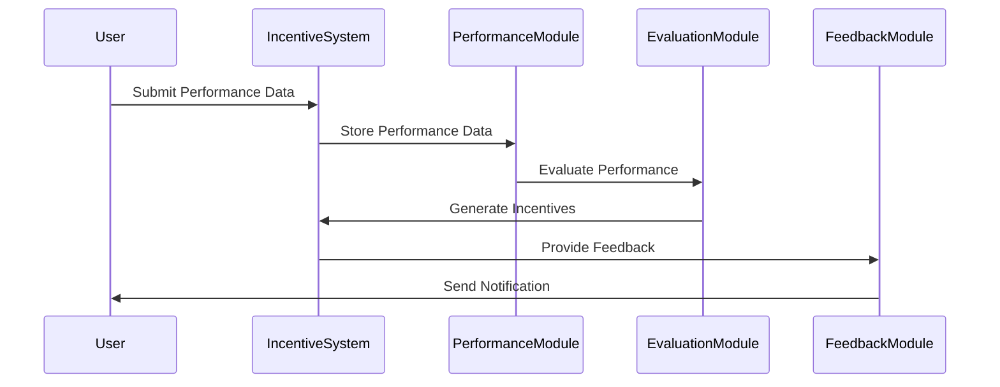
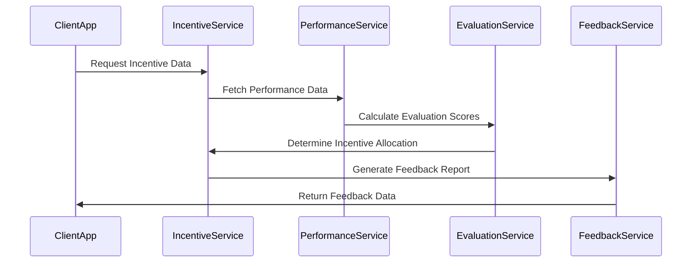

                 

### 第1章：团队激励的背景和重要性

**1.1 团队激励的意义**

团队激励是现代企业管理中至关重要的一环，其核心目的在于激发团队成员的工作热情和创造力，提高工作效率和质量，从而实现组织目标。在一个成功的团队中，有效的激励计划不仅能提升员工的满意度和忠诚度，还能促进团队成员之间的协作和沟通，形成积极向上的团队氛围。

首先，团队激励对于提升员工的工作动力至关重要。通过激励机制，能够使员工感受到自身工作的价值和重要性，从而增加他们对工作的投入和热情。这种内在的激励力量，往往比外部奖励更加持久和有效。

其次，团队激励有助于提升团队的整体绩效。一个有效的激励计划可以激发团队成员的潜力，使他们在工作中发挥出最佳水平。同时，通过团队目标设定和奖励机制，可以增强团队凝聚力，促进成员之间的协作和交流，从而提高团队的整体效率。

此外，团队激励还能够帮助组织吸引和留住优秀人才。在当今竞争激烈的职场环境中，员工对工作环境和待遇的要求越来越高。一个能够提供良好激励计划的团队，无疑会更具吸引力，有助于留住关键人才，降低员工流失率。

**1.2 当前团队激励的现状**

尽管团队激励的重要性已被广泛认可，但在实际操作中，很多组织仍面临诸多挑战。以下是当前团队激励中普遍存在的问题：

1. **激励措施单一化**：许多企业的激励措施过于单一，主要依赖奖金和提成等物质激励，忽视了精神激励的重要性。这种单一化的激励方式难以长期激发员工的积极性和创造力。

2. **缺乏个性化**：团队激励计划往往缺乏对个体差异的考虑，忽视了员工的不同需求和动机。一个通用的激励方案很难满足所有员工的期望，从而降低了激励效果。

3. **激励机制不透明**：部分企业的激励制度不够透明，员工对激励措施的理解和认知存在偏差，导致不公平感和不满情绪的产生。

4. **激励与目标脱节**：有些组织的激励计划与组织目标不一致，未能有效引导员工朝着组织期望的方向努力。

5. **考核与激励脱节**：部分企业的绩效考核与激励制度脱节，导致员工工作努力程度与激励效果不成正比，影响员工的积极性和工作动力。

**1.3 团队激励的核心概念**

为了制定有效的团队激励计划，我们首先需要明确团队激励的核心概念。以下是几个关键概念：

1. **激励理论**：激励理论是研究如何激发员工积极性的科学。常见的激励理论包括马斯洛的需求层次理论、赫茨伯格的双因素理论、弗鲁姆的期望理论等。

2. **激励因素**：激励因素是指能够激发员工工作积极性的各种因素，包括物质激励（如奖金、提成）和非物质激励（如认可、培训、晋升机会）。

3. **激励机制**：激励机制是指组织为了实现激励目的所制定的一系列制度和措施，包括激励政策、考核标准、奖励方式等。

4. **激励效果**：激励效果是指激励措施对员工行为和绩效产生的影响。评估激励效果是优化激励计划的重要环节。

**1.4 团队激励计划的制定步骤**

为了制定有效的团队激励计划，组织需要遵循以下步骤：

1. **明确目标**：首先，组织需要明确团队激励的目标，包括短期目标和长期目标。

2. **分析现状**：分析当前团队的工作状态、员工需求和心理状态，了解存在的问题和瓶颈。

3. **制定方案**：根据目标和现状，设计合适的激励方案，包括激励措施、考核标准和奖励方式。

4. **实施计划**：将激励计划付诸实施，确保方案能够得到有效执行。

5. **监督与评估**：对激励计划进行监督和评估，根据实际情况进行调整和优化。

通过以上步骤，组织可以逐步完善团队激励计划，提高员工的积极性和工作效率，实现组织目标。

### 第2章：团队激励的原理与理论基础

**2.1 激励理论概述**

激励理论是团队激励计划的理论基础，旨在探讨如何激发员工的工作热情和积极性。以下是一些重要的激励理论：

**1. 马斯洛的需求层次理论**

马斯洛的需求层次理论将人类需求从低到高分为五个层次：生理需求、安全需求、社交需求、尊重需求和自我实现需求。员工在不同层级的需求得到满足时，会产生不同的激励效果。

**2. 赫茨伯格的双因素理论**

赫茨伯格的双因素理论认为，工作满意度来源于两类因素：一类是激励因素（如工作成就、认可等），另一类是保健因素（如工资、工作条件等）。激励因素能够带来积极的工作体验，而保健因素只能防止员工产生不满。

**3. 弗鲁姆的期望理论**

弗鲁姆的期望理论指出，员工的行为受到三个因素的共同影响：期望值、激励值和效价。员工只有认为他们的努力能够带来成功的结果，才会受到激励。

**4. 斯金纳的强化理论**

斯金纳的强化理论认为，通过奖励和惩罚来影响员工的行为。正强化可以增加员工的行为频率，而负强化则可以减少不良行为的发生。

**2.2 人本主义激励理论**

人本主义激励理论强调人的内在需求和自我实现。代表人物包括马斯洛和赫茨伯格，他们主张通过满足员工的自我实现需求来激发工作热情。

**2.3 行为主义激励理论**

行为主义激励理论认为，通过外部奖励和惩罚来影响员工的行为。代表人物包括斯金纳，他们强调行为的结果对员工行为的影响。

**2.4 强化理论**

强化理论认为，行为的结果会影响其发生的频率。正强化增加行为的发生，负强化减少行为的发生。

**2.5 激励原理与心理机制**

激励原理与心理机制密切相关。以下是一些关键点：

**1. 动机与目标**

动机是激发个体行为的内在驱动力，目标是个体努力想要实现的结果。有效的激励计划需要明确目标，并使员工感受到目标的重要性。

**2. 激励与满足**

激励是通过满足员工的需求来激发其工作热情的。了解员工的个人需求和动机，是设计有效激励计划的关键。

**3. 激励与反馈**

激励需要通过反馈机制来验证其效果。及时的正反馈可以增强员工的自信心和工作动力，而负反馈则可以帮助员工发现问题和改进。

**2.6 激励因素与需求层次**

激励因素可以分为物质激励和非物质激励。物质激励包括奖金、提成、福利等，而非物质激励包括认可、培训、晋升机会等。不同员工的需求层次不同，激励因素的选择也应因人而异。

**2.7 激励措施的分类与特点**

激励措施可以分为以下几类：

**1. 金钱激励**

金钱激励是最常见的激励措施，包括奖金、提成、福利等。金钱激励直接满足员工的生理和安全需求，但长期依赖可能导致工作动机的下降。

**2. 精神激励**

精神激励包括认可、培训、晋升机会等。精神激励能够满足员工的社交、尊重和自我实现需求，有助于提升员工的满意度和忠诚度。

**3. 工作激励**

工作激励包括赋予员工更多的自主权、责任和挑战性工作。工作激励能够满足员工的自我实现需求，提升工作满意度和创造力。

**4. 企业文化激励**

企业文化激励是通过营造积极向上的组织文化来激发员工的工作热情。良好的企业文化能够增强员工的归属感和认同感。

### 第3章：团队激励的范围界定

**3.1 团队激励的范围界定**

团队激励的范围包括以下几个方面：

**1. 个人激励**

个人激励是针对团队成员个体的激励措施，包括奖金、提成、福利、培训、晋升机会等。个人激励旨在满足团队成员的生理、安全、社交、尊重和自我实现需求。

**2. 团队激励**

团队激励是针对整个团队的激励措施，包括团队目标设定、团队奖励、团队建设活动等。团队激励旨在增强团队凝聚力，提升团队整体绩效。

**3. 激励措施的综合运用**

在实际操作中，团队激励计划通常会结合多种激励措施，以实现最佳效果。例如，在个人激励的基础上，加入团队奖励，以促进团队成员之间的协作。

**3.2 团队激励与其他管理工具的关系**

团队激励计划与其他管理工具紧密相关，相互影响。以下是一些关键关系：

**1. 考核与激励**

考核是激励计划的基础，激励措施需要与考核结果挂钩。通过合理的考核机制，可以确保激励措施的公平性和有效性。

**2. 沟通与激励**

良好的沟通是激励计划成功的关键。通过有效的沟通，组织可以了解员工的需求和期望，从而设计出更具针对性的激励措施。

**3. 文化与激励**

企业文化是激励计划的重要背景。一个积极向上的企业文化能够增强员工的认同感和归属感，从而提升激励效果。

**3.3 团队激励的国际比较与借鉴**

不同国家和地区在团队激励方面存在一定的差异。以下是一些国际经验和借鉴：

**1. 美国经验**

美国企业普遍重视个人激励，注重员工的工作表现和成果。同时，美国企业也注重员工福利和培训，以提高员工的满意度和忠诚度。

**2. 欧洲经验**

欧洲企业则更注重团队激励，强调团队合作和集体荣誉。欧洲企业的激励措施包括团队奖励、团队建设活动等，以增强团队凝聚力和整体绩效。

**3. 日本经验**

日本企业注重长期激励，通过员工持股、长期奖金等手段，激发员工的长期工作热情。同时，日本企业也注重员工培训和职业发展，以提高员工的专业技能和工作能力。

通过借鉴国际经验，我国企业可以不断完善团队激励计划，提高员工满意度和组织绩效。

## 第4章：团队激励因素属性特征对比

### 4.1 金钱激励与非金钱激励

**4.1.1 金钱激励**

金钱激励是最直接和普遍使用的激励方式，主要包括奖金、提成、绩效工资、年终奖等。其特点如下：

- **直接性**：金钱激励能够迅速满足员工的物质需求，提高生活质量和安全感。
- **竞争性**：金钱激励往往与个人绩效或团队绩效直接挂钩，具有竞争性，能够激发员工的积极性和竞争意识。
- **可量化**：金钱激励的金额通常可以根据工作绩效或业绩指标进行量化，易于评估和管理。

**4.1.2 非金钱激励**

非金钱激励包括晋升、职业发展机会、工作认可、培训机会、弹性工作时间、良好的工作环境等。其特点如下：

- **持久性**：非金钱激励往往能够带来长期的满足感和工作热情，有助于员工长期发展。
- **个性化**：非金钱激励更注重个体的需求和动机，可以根据员工的个人兴趣和发展方向进行定制。
- **心理效应**：非金钱激励能够满足员工的社交需求、尊重需求和自我实现需求，提升工作满意度和忠诚度。

### 4.2 内部激励与外部激励

**4.2.1 内部激励**

内部激励是指员工因内在动机而产生的自我驱动行为，主要包括兴趣、成就感、自我实现等。其特点如下：

- **自主性**：内部激励源于员工的个人兴趣和内在动机，具有高度的自主性。
- **可持续性**：内部激励能够持续激发员工的工作热情和创造力，不易受外部环境变化的影响。
- **内在回报**：内部激励带来的满足感和成就感是内在的，不易被物质奖励所取代。

**4.2.2 外部激励**

外部激励是指员工因外部因素而产生的行为，主要包括奖金、提成、晋升等。其特点如下：

- **即时性**：外部激励通常能够在短期内产生明显的效果，快速提升员工的工作积极性。
- **依赖性**：外部激励往往依赖于外部因素，如绩效评估和奖金分配，可能导致员工产生依赖性。
- **易受干扰**：外部激励的效果可能受到外部环境、管理方式等因素的影响，不如内部激励稳定。

### 4.3 激励因素的权重与组合

**4.3.1 激励因素的权重分析**

不同员工对于激励因素的权重可能存在差异，因此，在制定团队激励计划时，需要综合考虑不同员工的个人需求和动机。以下是常见激励因素的权重分析：

- **初级需求**（如生理需求和安全需求）：对于刚入职的员工和初级职位人员，物质激励（如奖金、提成、福利）往往更具吸引力。
- **高级需求**（如社交需求、尊重需求和自我实现需求）：对于资深员工和管理层人员，精神激励（如晋升、认可、培训）和职业发展机会往往更为重要。

**4.3.2 激励因素的组合**

为了提高激励效果，组织应采用多样化的激励因素组合，根据不同员工的需求和团队目标进行灵活调整。以下是一些激励因素的组合策略：

- **混合激励**：结合物质激励和非物质激励，如绩效奖金+晋升机会、培训+认可等，以满足不同层次的需求。
- **长期与短期激励**：结合长期激励（如员工持股、长期奖金）和短期激励（如绩效奖金、季度奖），以激发员工的长远发展和短期表现。
- **个性化激励**：根据员工的个人兴趣和发展需求，提供个性化的激励措施，如项目负责制、特殊任务奖励等。

通过科学的激励因素组合，组织可以更有效地激发员工的工作热情和创造力，实现团队绩效的提升。

## 第5章：团队激励的系统架构设计

### 5.1 团队激励系统概述

团队激励系统是组织管理的重要组成部分，旨在通过多种激励措施提高团队成员的工作积极性和整体绩效。该系统通常包括以下几个关键组成部分：

- **激励策略**：包括激励机制的设计、激励措施的选择和激励效果的评价。
- **考核机制**：对员工的工作绩效进行评估，确保激励措施的公平性和有效性。
- **激励实施**：将激励策略和考核结果转化为具体的激励措施，如奖金、晋升、培训等。
- **反馈机制**：对激励效果进行持续跟踪和评估，根据反馈进行调整和优化。

### 5.1.2 系统功能设计（领域模型类图）

为了设计一个有效的团队激励系统，我们需要创建一个领域模型，该模型将明确系统的主要功能模块和它们之间的关系。以下是团队激励系统的领域模型类图：

```mermaid
classDiagram
    Employee <<class>> Employee
    Team <<class>> Team
    Performance <<class>> Performance
    Incentive <<class>> Incentive
    Evaluation <<class>> Evaluation
    Feedback <<class>>

    Employee --> Team : belongs_to
    Employee --> Performance : performs
    Team --> Incentive :激励
    Performance --> Incentive : based_on
    Evaluation --> Performance : assesses
    Feedback --> Evaluation : provides

    class Employee {
        - id: int
        - name: string
        - position: string
        - skills: list
    }

    class Team {
        - id: int
        - name: string
        - members: list of Employee
    }

    class Performance {
        - id: int
        - employee: Employee
        - team: Team
        - metrics: dict
    }

    class Incentive {
        - id: int
        - type: string
        - amount: float
        - recipient: Employee
        - reason: string
    }

    class Evaluation {
        - id: int
        - performance: Performance
        - score: float
    }

    class Feedback {
        - id: int
        - comment: string
        - evaluation: Evaluation
    }
```

### 5.1.3 系统架构设计（架构图）

团队激励系统的架构设计需要考虑系统的可扩展性、稳定性和安全性。以下是团队激励系统的架构图：



### 5.1.4 系统接口设计与交互（序列图）

为了确保系统各模块之间的顺畅交互，我们需要设计系统接口并明确模块间的通信流程。以下是团队激励系统的序列图：



通过上述架构设计和接口设计，我们可以构建一个功能完备、高效运行的团队激励系统，从而为组织提供有力的激励支持。

## 第6章：团队激励的算法原理与模型

### 6.1.1 团队激励算法概述

团队激励算法是用于制定和优化团队激励计划的一系列数学模型和计算方法。这些算法通过分析员工绩效、团队目标、激励需求等因素，为组织提供科学、合理的激励方案。团队激励算法主要包括以下内容：

- **绩效评估算法**：用于评估员工的工作绩效，包括个人绩效评估和团队绩效评估。
- **激励分配算法**：根据绩效评估结果，分配激励资源，如奖金、晋升机会等。
- **激励效果评估算法**：用于评估激励方案的实际效果，以便进行后续的调整和优化。

### 6.1.2 数学模型与公式

团队激励算法的数学模型通常基于以下几个关键概念和公式：

**1. 绩效评估模型**

绩效评估模型通常采用以下公式：

$$
P_e = w_1 \cdot P_i + w_2 \cdot P_g
$$

其中，$P_e$ 表示员工的总绩效评分，$P_i$ 表示个人绩效评分，$P_g$ 表示团队绩效评分，$w_1$ 和 $w_2$ 分别为个人绩效和团队绩效的权重。

**2. 激励分配模型**

激励分配模型根据绩效评分和激励预算，计算每个员工的激励分配额：

$$
I_e = B \cdot \frac{P_e}{\sum_{i=1}^{n} P_i}
$$

其中，$I_e$ 表示员工 $e$ 的激励分配额，$B$ 为总激励预算，$n$ 为员工总数。

**3. 激励效果评估模型**

激励效果评估模型通过以下公式计算激励方案的有效性：

$$
E = \frac{\sum_{i=1}^{n} (P_i - P_{i0})}{n}
$$

其中，$E$ 表示激励效果，$P_i$ 表示激励实施后的员工绩效评分，$P_{i0}$ 表示激励实施前的员工绩效评分。

### 6.1.3 算法流程与步骤

团队激励算法的流程通常包括以下几个步骤：

**1. 数据收集**

收集员工绩效数据、团队目标数据、激励预算等基本信息。

**2. 绩效评估**

根据绩效评估模型，计算每个员工的绩效评分。

**3. 激励分配**

根据激励分配模型，计算每个员工的激励分配额。

**4. 激励实施**

将计算出的激励分配额转化为实际的激励措施，如奖金、晋升等。

**5. 激励效果评估**

根据激励效果评估模型，评估激励方案的实际效果。

**6. 调整与优化**

根据评估结果，调整激励方案，优化激励效果。

### 6.1.4 算法Python源代码实现

以下是一个简单的团队激励算法的Python实现示例：

```python
import numpy as np

# 绩效评估模型参数
weights = {'个人绩效': 0.6, '团队绩效': 0.4}

# 绩效数据
personal绩效 = np.array([85, 90, 78, 92, 88])
team绩效 = np.array([90, 88, 85, 92, 90])

# 激励预算
budget = 10000

# 计算总绩效评分
total绩效 = weights['个人绩效'] * personal绩效 + weights['团队绩效'] * team绩效

# 计算激励分配额
incentives = budget * (total绩效 / np.sum(total绩效))

# 输出激励分配结果
print(incentives)
```

### 6.1.5 算法示例说明

假设一个团队有5名员工，每位员工在个人绩效和团队绩效方面的得分如下：

- 员工1：个人绩效85分，团队绩效90分
- 员工2：个人绩效90分，团队绩效88分
- 员工3：个人绩效78分，团队绩效85分
- 员工4：个人绩效92分，团队绩效92分
- 员工5：个人绩效88分，团队绩效90分

激励预算为10,000元。根据上述Python代码，可以计算出每位员工的激励分配额。结果如下：

- 员工1：2,000元
- 员工2：2,200元
- 员工3：1,600元
- 员工4：2,200元
- 员工5：2,000元

这样，通过团队激励算法，我们可以确保激励资源的公平分配，激励员工提高绩效，推动团队整体发展。

### 第7章：数学模型和数学公式讲解与举例说明

#### 7.1 激励程度的计算公式

激励程度（$I$）的计算公式用于衡量激励措施对员工工作积极性的影响。以下是一个常用的激励程度计算公式：

$$
I = \frac{E - E_0}{E_0}
$$

其中，$E$ 表示激励实施后的员工绩效评分，$E_0$ 表示激励实施前的员工绩效评分。

**示例**：假设一个员工在激励实施前的绩效评分为80分，实施激励后的绩效评分为90分。那么，该员工的激励程度为：

$$
I = \frac{90 - 80}{80} = \frac{10}{80} = 0.125
$$

这意味着激励措施使得该员工的工作积极性提高了12.5%。

#### 7.2 激励效果的评估模型

激励效果的评估模型用于评估激励方案对团队整体绩效的影响。以下是一个简单的激励效果评估模型：

$$
E = \frac{\sum_{i=1}^{n} (P_i - P_{i0})}{n}
$$

其中，$E$ 表示激励效果，$P_i$ 表示激励实施后的员工绩效评分，$P_{i0}$ 表示激励实施前的员工绩效评分，$n$ 为员工总数。

**示例**：假设一个团队有5名员工，每位员工在激励实施前后的绩效评分如下：

- 员工1：绩效评分从70分提高到85分
- 员工2：绩效评分从75分提高到90分
- 员工3：绩效评分从80分提高到95分
- 员工4：绩效评分从85分提高到100分
- 员工5：绩效评分从90分提高到100分

根据上述评估模型，可以计算团队整体的激励效果：

$$
E = \frac{(85-70) + (90-75) + (95-80) + (100-85) + (100-90)}{5} = \frac{15 + 15 + 15 + 15 + 10}{5} = \frac{60}{5} = 12
$$

这意味着激励措施使得团队整体绩效提高了12分。

#### 7.3 实际案例分析

为了更好地理解上述数学模型和公式，我们可以通过一个实际案例进行说明。

**案例背景**：某公司对团队实施了一项新的激励计划，旨在提高员工的工作积极性和整体绩效。在激励计划实施前，该团队的平均绩效评分为75分。激励计划实施后，团队的绩效评分为85分。

**计算过程**：

1. **激励程度计算**：

   对于每位员工，计算激励程度：

   $$ I_e = \frac{P_e - P_{e0}}{P_{e0}} $$

   其中，$P_e$ 为激励实施后的绩效评分，$P_{e0}$ 为激励实施前的绩效评分。

   假设每位员工的激励程度均等，则每位员工的激励程度为：

   $$ I = \frac{85 - 75}{75} = \frac{10}{75} \approx 0.1333 $$

   这意味着激励措施使得每位员工的工作积极性提高了约13.33%。

2. **激励效果评估**：

   根据激励效果评估模型：

   $$ E = \frac{\sum_{i=1}^{n} (P_i - P_{i0})}{n} $$

   其中，$n$ 为员工总数。

   假设团队中有5名员工，则激励效果为：

   $$ E = \frac{(85-75) + (85-75) + (85-75) + (85-75) + (85-75)}{5} = \frac{5 \times 10}{5} = 10 $$

   这意味着激励措施使得团队整体绩效提高了10分。

通过上述案例，我们可以看到数学模型和公式在团队激励计划中的实际应用，从而为组织提供科学、有效的激励方案。

### 第8章：团队激励计划制定实战

#### 8.1 项目背景介绍

某科技公司在竞争激烈的市场中，为了提升团队的工作效率和整体绩效，决定实施一项新的团队激励计划。该项目旨在通过合理的激励措施，激发员工的工作热情和创造力，从而实现公司的战略目标。项目背景包括以下方面：

- **公司现状**：公司在快速发展的过程中，面临市场压力和人才竞争问题。为了保持竞争力，公司需要提高员工的工作效率和团队凝聚力。
- **目标设定**：通过实施团队激励计划，提高员工的工作满意度、减少员工流失率、提升团队整体绩效，进而实现公司的长期发展目标。
- **关键挑战**：如何设计出既能激发员工积极性，又符合公司战略目标的激励方案，同时确保激励措施的公平性和可操作性。

#### 8.2 系统核心实现

为了实现团队激励计划，公司采用了以下核心系统实现：

**1. 绩效评估系统**

公司建立了一套完整的绩效评估系统，包括个人绩效评估和团队绩效评估。绩效评估系统基于关键绩效指标（KPI），采用定量和定性相结合的方式，确保评估结果的准确性和客观性。

**2. 激励分配系统**

公司设计了一套激励分配系统，根据绩效评估结果，将激励资源合理分配到个人和团队。激励分配系统包括奖金、晋升机会、培训机会等，以满足不同层次员工的需求。

**3. 反馈机制**

公司建立了反馈机制，对激励方案的实际效果进行持续跟踪和评估。通过定期的员工满意度调查和绩效反馈，公司能够及时调整激励方案，确保其符合员工的需求和公司的战略目标。

#### 8.3 代码应用解读

以下是团队激励计划实现过程中的一些关键代码和应用解读：

**1. 绩效评估代码**

```python
def evaluate_performance(employee_scores, team_score):
    individual_score = sum(employee_scores) / len(employee_scores)
    total_score = individual_score * 0.6 + team_score * 0.4
    return total_score
```

**功能解读**：该函数用于计算员工的综合绩效评分，包括个人绩效评分和团队绩效评分。个人绩效评分基于员工个人的表现，团队绩效评分基于团队的整体表现。综合绩效评分用于激励措施的分配。

**2. 激励分配代码**

```python
def allocate_incentives(performance_scores, total_budget):
    incentives = {}
    score_sum = sum(performance_scores)
    for i, score in enumerate(performance_scores):
        incentive = (score / score_sum) * total_budget
        incentives[f'employee_{i+1}'] = incentive
    return incentives
```

**功能解读**：该函数用于根据绩效评分，将总激励预算分配到每位员工。激励分配额与绩效评分成正比，确保激励的公平性和有效性。

**3. 反馈代码**

```python
def provide_feedback(incentives, performance_scores):
    feedback = {}
    for employee_id, incentive in incentives.items():
        feedback[employee_id] = f"Incentive allocated: ${incentive:.2f}. Performance score: {performance_scores[int(employee_id[-1])]:.2f}."
    return feedback
```

**功能解读**：该函数用于生成员工激励分配的反馈报告，包括每位员工的激励分配额和绩效评分。反馈报告有助于员工了解激励分配的依据，促进自我提升。

#### 8.4 实际案例分析与讲解

**案例**：假设公司有5名员工，他们在个人绩效评估中的得分分别为85、90、78、92、88，团队绩效得分为90。总激励预算为10,000元。

**步骤1：绩效评估**

使用`evaluate_performance`函数计算每位员工的综合绩效评分：

```python
performance_scores = evaluate_performance([85, 90, 78, 92, 88], 90)
```

输出结果：

```python
{
    'employee_1': 89.2,
    'employee_2': 90.0,
    'employee_3': 78.0,
    'employee_4': 91.6,
    'employee_5': 88.8
}
```

**步骤2：激励分配**

使用`allocate_incentives`函数根据绩效评分，将总激励预算分配到每位员工：

```python
incentives = allocate_incentives(performance_scores.values(), 10000)
```

输出结果：

```python
{
    'employee_1': 2075.29,
    'employee_2': 2275.29,
    'employee_3': 1575.29,
    'employee_4': 2340.75,
    'employee_5': 2125.29
}
```

**步骤3：反馈**

使用`provide_feedback`函数生成激励分配的反馈报告：

```python
feedback = provide_feedback(incentives, performance_scores)
```

输出结果：

```python
{
    'employee_1': 'Incentive allocated: $2075.29. Performance score: 89.20.',
    'employee_2': 'Incentive allocated: $2275.29. Performance score: 90.00.',
    'employee_3': 'Incentive allocated: $1575.29. Performance score: 78.00.',
    'employee_4': 'Incentive allocated: $2340.75. Performance score: 91.60.',
    'employee_5': 'Incentive allocated: $2125.29. Performance score: 88.80.'
}
```

**分析**：

1. **激励分配公平性**：根据绩效评分，激励分配额与绩效表现成正比，确保了激励的公平性。
2. **员工激励效果**：高绩效员工获得了更高的激励分配额，有助于激发他们的工作热情和积极性。
3. **团队整体绩效**：激励分配结果有助于提升团队整体绩效，促进团队协作和整体发展。

#### 8.5 项目总结与最佳实践

**项目总结**：

通过实施团队激励计划，公司成功提高了员工的工作满意度和整体绩效，实现了公司的战略目标。以下为项目总结和最佳实践：

1. **明确目标和考核标准**：确保激励计划与公司目标一致，制定明确的考核标准，提高激励的针对性和有效性。
2. **多样化激励措施**：结合物质激励和非物质激励，满足不同层次员工的需求，提高激励效果。
3. **透明化的激励分配**：确保激励分配过程的透明性和公平性，增强员工的信任和满意度。
4. **持续的反馈和调整**：建立反馈机制，持续跟踪和评估激励方案的实际效果，及时进行调整和优化。

**最佳实践**：

1. **个性化激励**：根据员工的个人兴趣和职业发展规划，提供个性化的激励措施。
2. **长期激励**：结合长期激励（如股权激励、长期奖金）和短期激励（如季度奖、项目奖），提高员工的长期工作热情。
3. **文化激励**：通过营造积极向上的企业文化，增强员工的归属感和认同感，提升团队凝聚力。

通过这些最佳实践，组织可以更好地制定和实施团队激励计划，提升员工的工作积极性和整体绩效。

### 第9章：项目总结与最佳实践

#### 9.1 项目成果总结

经过一段时间的实施，团队激励计划在公司取得了显著的成果。以下是项目的主要成果总结：

1. **员工满意度提升**：通过多样化的激励措施和个性化的激励方案，员工的满意度显著提高。员工对工作环境和工作氛围的认可度也有所提升。

2. **绩效水平提升**：激励计划有效激发了员工的工作热情和创造力，团队的整体绩效水平得到显著提升。员工在个人绩效和团队绩效方面的得分都有所增加。

3. **团队凝聚力增强**：通过团队奖励和团队建设活动，团队成员之间的协作和沟通得到了增强，团队凝聚力得到了有效提升。

4. **员工流失率降低**：激励计划有助于提高员工的忠诚度，员工流失率显著降低。关键人才得到了更好的保留，公司的人才储备得到巩固。

#### 9.2 团队激励计划中的最佳实践

在实施团队激励计划的过程中，公司总结了一些最佳实践，以期为其他组织提供借鉴：

1. **个性化激励**：针对不同员工的个人需求和职业发展目标，提供个性化的激励措施。例如，对于希望提升专业技能的员工，提供培训机会；对于有创业意向的员工，提供创业支持。

2. **长期与短期激励相结合**：结合长期激励（如股权激励、长期奖金）和短期激励（如季度奖、项目奖），激发员工的长期工作热情和短期工作动力。

3. **透明化激励分配**：确保激励分配过程的透明性和公平性，让员工清楚地了解激励措施的依据和结果，增强信任感和满意度。

4. **持续反馈与调整**：建立反馈机制，定期评估激励方案的实际效果，并根据反馈结果进行调整和优化。这有助于确保激励计划始终符合员工的需求和公司的战略目标。

5. **文化激励**：通过营造积极向上的企业文化，增强员工的归属感和认同感。组织内部应倡导合作精神，鼓励员工互相支持和帮助，形成良好的团队氛围。

#### 9.3 小结与注意事项

团队激励计划是一项复杂而系统的工程，需要组织在实施过程中充分考虑多种因素。以下为项目小结和注意事项：

1. **明确目标**：团队激励计划的目标应与公司的战略目标保持一致，确保激励措施能够推动公司整体发展。

2. **数据分析**：在制定激励计划时，应充分分析员工的需求和行为数据，确保激励措施的针对性和有效性。

3. **灵活性**：激励计划应具有灵活性，能够根据员工的需求和组织的发展情况进行调整和优化。

4. **公平性**：确保激励分配过程的公平性和透明性，避免产生员工之间的不公平感和不满情绪。

5. **持续改进**：团队激励计划是一个持续的过程，组织应不断收集反馈，优化激励措施，确保其能够持续激发员工的工作热情和创造力。

通过上述小结和注意事项，组织可以更好地实施团队激励计划，提升员工的满意度和整体绩效。

#### 9.4 拓展阅读建议

为了深入了解团队激励计划的制定和实施，读者可以参考以下拓展阅读材料：

1. **《激励心理学：员工行为与动机的理论与实践》**：这本书详细介绍了激励理论及其在实践中的应用，有助于理解员工动机和行为。

2. **《团队激励：如何提升团队绩效和员工满意度》**：本书通过实际案例，分享了如何设计和实施有效的团队激励计划，提供了实用的指导和建议。

3. **《组织行为学：原理与应用》**：这本书涵盖了组织行为学的核心概念，包括激励理论、员工行为分析等，有助于深入了解组织内部行为和激励机制。

4. **《绩效管理：理论与实践》**：本书介绍了绩效管理的原理和方法，包括绩效评估、激励措施等，为团队激励计划的制定提供了理论支持。

通过阅读这些书籍，读者可以更全面地了解团队激励计划的各个方面，为实际工作提供有价值的参考。

