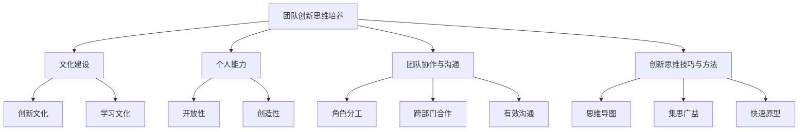
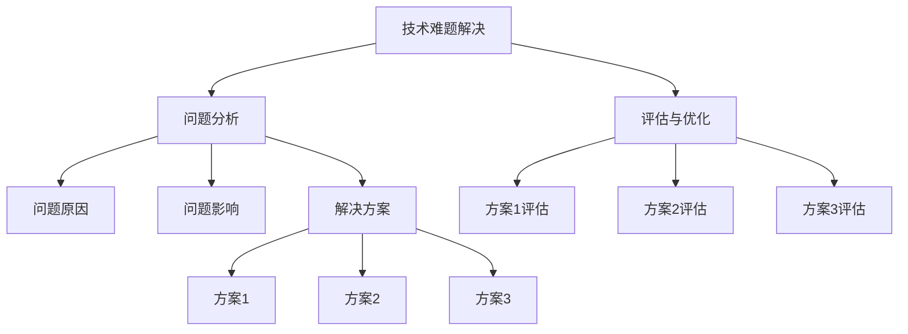

                 

# 如何培养团队的创新思维

> 关键词：创新思维、团队协作、文化建设、个人能力、沟通技巧、方法与工具

> 摘要：本文旨在探讨团队创新思维的培养方法。通过分析创新思维的重要性、关键要素、团队协作与沟通技巧以及创新思维技巧与方法，结合实际案例分析与实践指南，为企业提供系统性的创新思维培养策略。

### 第1章：问题背景与核心概念

#### 1.1 问题背景

在当今快速变化和竞争激烈的市场环境中，企业面临着前所未有的挑战。技术革新、消费者需求多样化、全球化竞争等因素，使得企业必须具备强大的创新能力，以应对市场变化和抓住机遇。创新思维作为一种关键的竞争力，已经成为企业持续发展的核心驱动力。然而，许多团队在创新思维方面存在明显的瓶颈，难以在短时间内产生突破性的想法和解决方案。

#### 1.2 核心概念

**创新思维**：创新思维是指个体或团队在解决问题和产生新想法时采用的创造性思维方法。它强调从不同角度思考问题，打破常规，产生新颖的解决方案。

**团队创新**：团队创新是指一个团队在共同目标下，通过协作和创造性的方法，实现创新的过程。团队创新强调集体智慧、知识共享和跨部门协作，以促进创新思维的生成和实施。

#### 1.3 创新思维的重要性

**对于企业的意义**：

- **维持竞争力**：创新思维可以帮助企业适应市场变化，保持竞争优势。
- **推动持续发展**：通过创新，企业可以不断推出新产品和服务，满足消费者需求，实现持续增长。

**对于个人的意义**：

- **职业成长**：创新思维能力的提升有助于个人在职场中脱颖而出，获得更多发展机会。
- **解决问题**：具备创新思维的个人能够更有效地应对复杂问题，提出创新的解决方案。

#### 1.4 创新思维的边界与外延

**边界**：

- **技术限制**：创新思维受到现有技术水平的限制，某些创新想法可能因技术不可行而无法实现。
- **资源约束**：创新思维需要一定的资源和投入，资源不足可能导致创新受限。

**外延**：

- **行业壁垒**：创新思维需要考虑行业特点和市场需求，避免盲目创新。
- **法律法规**：创新过程中需要遵守相关法律法规，确保创新行为的合法性。

### 第2章：培养团队创新思维的关键要素

#### 2.1 文化建设

**创新文化**：创新文化是团队创新思维培养的基础。它鼓励创新和实验，容忍失败，重视知识和经验的共享。创新文化的建设包括以下几个方面：

- **鼓励创新**：企业应鼓励员工提出新的想法和解决方案，为创新提供支持和资源。
- **容忍失败**：创新过程中难免会遇到失败，企业应建立容忍失败的文化，鼓励员工从失败中吸取教训，不断尝试。
- **知识共享**：企业应建立知识共享平台，鼓励员工分享知识和经验，促进团队内部的知识流动。

**学习文化**：学习文化是创新思维培养的持续动力。它鼓励团队成员不断学习新知识和技能，保持对新技术、新方法的敏感性。学习文化的建设包括以下几个方面：

- **提供学习机会**：企业应提供丰富的学习机会，如内部培训、外部研讨会、在线课程等。
- **鼓励自主学习**：企业应鼓励员工自主学习，提升个人能力和专业素养。
- **建立学习社区**：企业可以建立学习社区，促进员工之间的知识交流和学习。

#### 2.2 个人能力

**开放性**：开放性是指个体愿意接受新的观点和不同的意见，对未知和变化持开放态度。开放性是创新思维的基础，它有助于个体拓展视野，发现新的问题和解决方案。

**创造性**：创造性是指个体在解决问题和产生新想法时能够采用独特的思考方式，产生新颖的解决方案。创造性是创新思维的核心，它决定了个体在团队中的创新贡献。

#### 2.3 团队协作与沟通

**团队协作**：团队协作是创新思维培养的重要环节。通过明确团队成员的角色和职责，确保每个成员都能发挥自己的专长，促进跨部门合作，分享资源和经验。团队协作的关键要素包括：

- **角色分工**：明确团队成员的角色和职责，确保每个成员都能在创新过程中发挥最大作用。
- **跨部门合作**：促进不同部门之间的协作，分享资源和经验，实现协同创新。

**有效沟通**：有效沟通是团队协作的基础。通过开放式沟通和建设性反馈，鼓励团队成员分享自己的想法和意见，提供有建设性的意见，帮助团队成员改进和成长。有效沟通的关键要素包括：

- **开放式沟通**：鼓励团队成员分享自己的想法和意见，建立信任和协作的基础。
- **建设性反馈**：提供有建设性的意见，帮助团队成员改进和成长，增强团队凝聚力。

### 第3章：团队协作与沟通

#### 3.1 团队协作

**角色分工**：角色分工是团队协作的基础。通过明确团队成员的角色和职责，确保每个成员都能发挥自己的专长，从而提高团队的整体效率。

- **明确职责**：明确每个团队成员的职责，确保每个人都知道自己的任务和目标。
- **分工协作**：根据团队成员的特长和优势，进行合理分工，确保每个任务都有专人负责。

**跨部门合作**：跨部门合作是团队协作的重要组成部分。通过促进不同部门之间的协作，分享资源和经验，实现协同创新。

- **沟通桥梁**：建立跨部门沟通桥梁，确保信息流畅传递，减少信息孤岛现象。
- **资源共享**：促进资源共享，提高资源利用率，降低创新成本。

#### 3.2 有效沟通

**开放式沟通**：开放式沟通是团队协作的基础。通过鼓励团队成员分享自己的想法和意见，建立信任和协作的基础。

- **鼓励发言**：鼓励团队成员发表意见，不论观点正确与否，都要给予尊重。
- **倾听理解**：倾听他人的意见，理解他人的立场和需求，建立有效的沟通渠道。

**建设性反馈**：建设性反馈是团队成员成长和团队进步的重要推动力。通过提供有建设性的意见，帮助团队成员改进和成长。

- **正面反馈**：给予正面反馈，鼓励团队成员继续努力，提升自我价值感。
- **改进建议**：提出具体的改进建议，帮助团队成员找到改进的方向和方法。

### 第4章：创新思维技巧与方法

#### 4.1 思维导图

**概念导图**：概念导图是一种通过绘制思维导图，帮助团队成员梳理和创新思维的方法。通过概念导图，团队成员可以更清晰地理解问题的本质，发现新的解决方案。

- **绘制过程**：首先明确中心主题，然后围绕中心主题展开分支，逐层细化，形成完整的概念导图。
- **应用场景**：在项目规划、需求分析、问题解决等环节，概念导图可以帮助团队成员梳理思路，形成共识。

**问题解决导图**：问题解决导图是一种通过思维导图，找出问题并产生解决方案的方法。通过问题解决导图，团队成员可以系统地分析问题，逐步找到解决方案。

- **绘制过程**：首先明确问题，然后围绕问题展开分支，分析问题的原因、影响和解决方案，形成完整的问题解决导图。
- **应用场景**：在项目实施、问题排查、需求变更等环节，问题解决导图可以帮助团队成员快速定位问题，找到解决方案。

#### 4.2 集思广益

**头脑风暴**：头脑风暴是一种通过集体讨论，激发团队成员创新思维的方法。在头脑风暴过程中，团队成员可以畅所欲言，提出各种创意和想法，通过碰撞和交流，产生新的创新点。

- **组织形式**：通常以小组形式进行头脑风暴，每个成员都有机会发言，互相启发。
- **注意事项**：鼓励自由发言，不批评、不评价，尊重每个人的创意和想法。

**快速原型**：快速原型是一种通过快速制作原型，验证创新想法有效性的方法。通过快速原型，团队成员可以迅速验证自己的想法，发现问题并及时调整。

- **制作过程**：利用原型工具，如Axure、Sketch等，快速制作原型。
- **应用场景**：在产品开发、功能验证、用户体验等环节，快速原型可以帮助团队成员快速验证想法，降低开发风险。

### 第5章：案例分析与实践

#### 5.1 案例分析

**创新思维案例**：通过分析成功企业的创新实践，可以探讨其成功的原因和经验。以下是一个创新思维的案例：

- **企业背景**：某知名互联网公司，以技术创新为核心竞争力。
- **成功原因**：该公司注重创新文化的建设，鼓励员工提出新想法，并建立快速原型验证机制。同时，公司重视知识共享，建立内部学习社区，促进员工之间的交流和学习。
- **经验总结**：成功的企业创新思维培养主要依赖于良好的创新文化、快速原型验证和知识共享平台。

**失败案例分析**：通过分析创新失败的案例，可以总结教训和改进方向。以下是一个创新思维失败的案例：

- **企业背景**：某传统制造企业，希望通过技术创新实现转型升级。
- **失败原因**：该公司创新思维培养不足，缺乏对市场需求的准确把握和快速响应能力。同时，公司内部创新文化不浓厚，员工缺乏创新的动力和机会。
- **改进方向**：企业需要加强创新思维的培养，提高员工的市场敏锐度和创新能力。同时，建立创新激励机制，鼓励员工积极参与创新活动。

#### 5.2 实践指南

**创新实践流程**：以下是一个系统的创新实践流程，帮助企业培养团队创新思维：

1. **问题识别**：明确团队需要解决的问题或挑战。
2. **头脑风暴**：组织团队成员进行头脑风暴，提出各种创新想法。
3. **快速原型**：利用原型工具，快速制作原型，验证创新想法的有效性。
4. **评估与优化**：对原型进行评估和优化，确定可行的创新方案。
5. **实施与推广**：将创新方案付诸实施，并推广到整个团队。

**创新实践工具**：以下是一些常用的创新实践工具：

1. **思维导图**：用于梳理思路和创意，有助于团队成员更好地理解问题。
2. **头脑风暴工具**：如Miro、Mural等，用于组织头脑风暴活动，促进团队成员之间的交流。
3. **原型工具**：如Axure、Sketch等，用于快速制作原型，验证创新想法。

### 第6章：创新思维培养的最佳实践

#### 6.1 最佳实践

**企业创新文化**：企业创新文化是培养团队创新思维的关键。以下是一些成功企业的创新文化实践：

1. **鼓励创新**：企业应鼓励员工提出新想法，并为创新提供支持和资源。
2. **容忍失败**：建立容忍失败的文化，鼓励员工从失败中吸取教训，不断尝试。
3. **知识共享**：建立知识共享平台，促进员工之间的交流和合作。

**个人创新成长**：以下是一些个人提升创新思维的技巧和方法：

1. **不断学习**：保持对新知识和新技术的敏感性，不断提升自己的专业素养。
2. **跨学科学习**：学习不同领域的知识，拓宽视野，发现新的创新点。
3. **积极参与**：积极参与各种创新活动和项目，锻炼自己的创新能力。

### 第7章：总结与展望

#### 7.1 总结

创新思维是企业和个人发展的关键。通过培养团队创新思维，企业可以提升竞争力，实现持续发展；个人可以增强职业素养，提高创新能力。本文从文化建设、个人能力、团队协作与沟通、创新思维技巧与方法等多个方面，探讨了团队创新思维的培养策略。企业应根据自身情况，制定合适的创新思维培养计划，不断提升团队的创新能力和竞争力。

#### 7.2 展望

未来，随着技术的不断进步和市场环境的不断变化，团队创新思维的重要性将日益凸显。企业应关注以下发展趋势：

1. **数字化转型**：数字化转型将为团队创新提供新的机遇和挑战，企业应积极拥抱数字化转型，提升团队创新思维。
2. **跨学科融合**：跨学科融合将推动创新思维的发展，企业应鼓励员工跨学科学习，拓宽创新视野。
3. **可持续发展**：可持续发展将成为企业创新的重要方向，企业应注重社会责任，推动创新思维的可持续发展。

### 作者信息

作者：AI天才研究院/AI Genius Institute & 禅与计算机程序设计艺术 /Zen And The Art of Computer Programming

----------------------------------------------------------------

### 第1章：问题背景与核心概念

#### 1.1 问题背景

在当今快速变化和竞争激烈的市场环境中，团队的创新思维已经成为企业持续发展的关键。企业面临着不断变化的技术、市场和消费者需求，只有通过创新才能保持竞争优势。然而，许多团队在创新思维方面存在瓶颈，难以产生突破性的想法和解决方案。

创新思维是一种关键的思维能力，它不仅仅体现在个体层面，更体现在团队协作中。团队创新思维是指团队成员在共同目标下，通过协同合作，运用创造性思维方法，解决复杂问题，提出创新方案，实现创新目标的过程。在创新思维驱动下，团队可以更有效地应对市场变化，抓住机遇，提升企业的核心竞争力。

然而，许多团队在创新思维方面存在以下问题：

1. **思维固化**：长期的工作方式和思维模式使得团队成员难以跳出传统的思维框架，提出新的想法和解决方案。
2. **沟通不畅**：团队成员之间的沟通不畅，导致信息传递不畅通，难以形成共识，影响创新思维的发挥。
3. **缺乏激励**：缺乏有效的激励机制，使得团队成员在创新过程中缺乏动力，创新思维难以持续发展。
4. **资源不足**：有限的资源和时间限制，使得团队在创新过程中无法全面探索和尝试，限制了创新思维的发挥。

这些问题表明，团队创新思维的培养至关重要。只有通过系统的培养和优化，才能激发团队的创新能力，推动企业的持续发展。

#### 1.2 核心概念

**创新思维**：创新思维是指个体或团队在解决问题和产生新想法时采用的创造性思维方法。它涉及对新观念的探索、对现有知识的重新组合和对问题的新颖解决方案的创造。创新思维强调打破常规，从不同角度思考问题，产生新颖的想法和解决方案。

**团队创新**：团队创新是指一个团队在共同目标下，通过协作和创造性的方法，实现创新的过程。团队创新强调集体智慧、知识共享和跨部门协作，以促进创新思维的生成和实施。团队创新的目标是通过团队的共同努力，产生新的产品、服务或商业模式，提升企业的核心竞争力。

**创新文化**：创新文化是指企业或团队在创新过程中形成的一种价值观和行为准则。创新文化鼓励创新和实验，容忍失败，重视知识和经验的共享。创新文化是培养团队创新思维的基础，它为团队成员提供创新的环境和动力，激发他们的创新潜能。

**个人能力**：个人能力是指团队成员在创新过程中所具备的知识、技能和思维能力。个人能力的提升是团队创新思维培养的重要组成部分。具有开放性、创造性、沟通能力和团队合作能力的个人，能够更好地发挥创新思维，为团队的创新贡献更多的智慧。

#### 1.3 创新思维的重要性

**对于企业的意义**：

1. **维持竞争力**：创新思维可以帮助企业适应市场变化，抓住机遇，保持竞争优势。在快速变化的市场环境中，只有具备创新思维的企业，才能迅速应对市场变化，推出符合消费者需求的新产品和服务。
2. **推动持续发展**：创新思维是企业持续发展的动力。通过创新，企业可以不断推出新产品和服务，拓展市场，提升品牌价值，实现可持续发展。
3. **提升员工满意度**：创新思维培养能够提升员工的工作满意度和成就感。在创新环境中，员工能够发挥自己的创造力和想象力，实现个人价值和职业成长，从而提高员工的工作积极性和忠诚度。

**对于个人的意义**：

1. **职业成长**：创新思维能力的提升有助于个人在职场中脱颖而出，获得更多的发展机会。具备创新思维的个人能够提出独特的见解和解决方案，成为团队中的关键人物。
2. **解决问题**：创新思维能够帮助个人更有效地应对复杂问题，提出创新的解决方案。在解决问题过程中，个人能够锻炼自己的思维能力，提升自己的专业素养。
3. **持续学习**：创新思维培养需要不断学习新知识和技能，保持对新技术、新方法的敏感性。这种持续学习的过程，有助于个人不断成长，提升自己的竞争力。

#### 1.4 创新思维的边界与外延

**边界**：

1. **技术限制**：创新思维受到现有技术水平的限制，某些创新想法可能因技术不可行而无法实现。企业在创新过程中，需要充分考虑技术的可行性，避免盲目创新。
2. **资源约束**：创新思维需要一定的资源和投入，资源不足可能导致创新受限。企业需要合理分配资源，确保创新活动的顺利进行。

**外延**：

1. **行业壁垒**：创新思维需要考虑行业特点和市场需求，避免盲目创新。企业在创新过程中，需要深入理解行业发展趋势和消费者需求，确保创新方向与市场相匹配。
2. **法律法规**：创新过程中需要遵守相关法律法规，确保创新行为的合法性。企业应了解相关法律法规，避免因违法行为导致创新失败。

通过以上分析，我们可以看出，团队创新思维在企业和个人发展中的重要性。只有通过系统性地培养和优化团队创新思维，企业才能在激烈的市场竞争中立于不败之地，个人才能实现职业成长和持续发展。

### 第2章：培养团队创新思维的关键要素

#### 2.1 文化建设

**创新文化**：创新文化是团队创新思维培养的基础。创新文化强调鼓励创新、容忍失败和知识共享，为团队成员提供创新的环境和动力。

1. **鼓励创新**：企业应鼓励员工提出新想法和解决方案，为创新提供支持和资源。通过设立创新奖项、创新项目资助等方式，激发员工的创新热情。
2. **容忍失败**：企业应建立容忍失败的文化，鼓励员工在创新过程中勇于尝试，从失败中吸取教训。通过建立失败案例库，分享失败经验和教训，帮助员工更好地应对创新过程中的挑战。
3. **知识共享**：企业应建立知识共享平台，促进员工之间的交流和合作。通过内部培训、经验分享会、知识库等方式，让员工能够方便地获取和分享知识，提升整个团队的创新能力和水平。

**学习文化**：学习文化是团队创新思维培养的持续动力。学习文化强调不断学习新知识和技能，保持对新技术、新方法的敏感性。

1. **提供学习机会**：企业应提供丰富的学习机会，如内部培训、外部研讨会、在线课程等。通过定期组织学习活动，帮助员工不断提升自己的专业素养。
2. **鼓励自主学习**：企业应鼓励员工自主学习，培养自主学习的习惯和能力。通过设立自主学习奖励制度，激发员工的学习热情。
3. **建立学习社区**：企业可以建立学习社区，促进员工之间的知识交流和学习。通过在线论坛、学习小组等方式，让员工能够方便地分享知识和经验，共同进步。

#### 2.2 个人能力

**开放性**：开放性是指个体愿意接受新的观点和不同的意见，对未知和变化持开放态度。开放性是创新思维的基础，它有助于个体拓展视野，发现新的问题和解决方案。

1. **培养开放性**：企业可以通过以下方式培养员工的开放性：
   - **鼓励多样性**：鼓励员工尊重不同观点和意见，建立包容性的工作环境。
   - **跨部门合作**：促进不同部门之间的合作，让员工有机会接触和了解不同领域的知识和经验。
   - **参与外部活动**：鼓励员工参与外部活动，如行业会议、技术研讨会等，拓宽视野，增加知识储备。

**创造性**：创造性是指个体在解决问题和产生新想法时能够采用独特的思考方式，产生新颖的解决方案。创造性是创新思维的核心，它决定了个体在团队中的创新贡献。

1. **培养创造性**：企业可以通过以下方式培养员工的创造性：
   - **提供创新空间**：为员工提供自由创新的空间，鼓励他们尝试不同的方法和思路。
   - **鼓励思维训练**：通过思维训练课程，如思维导图、头脑风暴等，提高员工的创造性思维能力。
   - **设立创新项目**：鼓励员工参与创新项目，通过实践锻炼创造性思维。

#### 2.3 团队协作与沟通

**团队协作**：团队协作是团队创新思维培养的重要组成部分。团队协作强调明确角色分工、跨部门合作和资源整合，以提高团队的整体创新能力和效率。

1. **明确角色分工**：明确团队成员的角色和职责，确保每个成员都能发挥自己的专长，为团队的创新贡献智慧。
   - **岗位职责**：明确每个员工的岗位职责，确保每个任务都有专人负责。
   - **角色协调**：定期协调团队成员的角色，确保团队成员能够紧密配合，提高协作效率。

2. **跨部门合作**：促进不同部门之间的协作，分享资源和经验，实现协同创新。
   - **信息共享**：建立跨部门信息共享平台，确保信息流畅传递，减少信息孤岛现象。
   - **联合项目**：设立跨部门联合项目，通过项目合作，促进部门间的协作和知识共享。

**有效沟通**：有效沟通是团队协作的基础。通过开放式沟通和建设性反馈，鼓励团队成员分享自己的想法和意见，提供有建设性的意见，帮助团队成员改进和成长。

1. **开放式沟通**：鼓励团队成员分享自己的想法和意见，建立信任和协作的基础。
   - **鼓励发言**：鼓励团队成员在会议和讨论中发表意见，不论观点正确与否，都要给予尊重。
   - **倾听理解**：倾听他人的意见，理解他人的立场和需求，建立有效的沟通渠道。

2. **建设性反馈**：提供有建设性的意见，帮助团队成员改进和成长，增强团队凝聚力。
   - **正面反馈**：给予正面反馈，鼓励团队成员继续努力，提升自我价值感。
   - **改进建议**：提出具体的改进建议，帮助团队成员找到改进的方向和方法。

通过以上要素的培养，企业可以构建一个有利于创新思维发展的团队环境，激发团队成员的创新能力，推动企业的持续发展。

### 第3章：团队协作与沟通

#### 3.1 团队协作

团队协作是培养团队创新思维的重要手段。有效的团队协作能够激发团队成员的创造力和创新能力，从而推动团队的创新和发展。以下是团队协作的关键要素和策略：

**角色分工**：明确团队成员的角色和职责，确保每个成员都能在创新过程中发挥自己的专长，这是团队协作的基础。

1. **岗位职责明确**：为每个成员设定明确的岗位职责，确保每个任务都有专人负责。这有助于提高工作效率，减少责任模糊和任务重叠。
2. **任务分配合理**：根据团队成员的特长和优势，合理分配任务。让每个成员都能在适合自己的岗位上发挥最大的作用，有助于提高团队的整体效能。

**跨部门合作**：跨部门合作是团队协作的重要方面。通过跨部门合作，可以整合不同部门的知识和资源，促进创新思维的碰撞和融合。

1. **信息共享**：建立跨部门信息共享平台，确保信息流畅传递，减少信息孤岛现象。通过共享平台，团队成员可以及时获取到其他部门的重要信息和资源，有助于提高团队的整体协作效率。
2. **联合项目**：设立跨部门联合项目，通过项目合作，促进部门间的协作和知识共享。在联合项目中，团队成员可以共同面对挑战，共同解决问题，从而增强团队的合作精神和创新能力。

#### 3.2 有效沟通

有效沟通是团队协作的核心。通过开放式沟通和建设性反馈，团队成员可以更好地分享想法和意见，提高团队的协作效率和创新思维。

**开放式沟通**：开放式沟通是指鼓励团队成员在会议、讨论和项目中自由地表达自己的想法和意见，建立信任和协作的基础。

1. **鼓励发言**：在会议和讨论中，鼓励团队成员积极发言，不论观点正确与否，都要给予尊重。这有助于激发团队成员的创造力，形成多元化的思维碰撞。
2. **倾听理解**：倾听他人的意见，理解他人的立场和需求，建立有效的沟通渠道。通过倾听，团队成员可以更好地理解彼此的想法和意图，从而提高沟通效果。

**建设性反馈**：建设性反馈是团队成员之间互相支持和成长的重要方式。通过提供有建设性的意见，可以帮助团队成员改进和成长，增强团队的凝聚力和创新能力。

1. **正面反馈**：给予正面反馈，鼓励团队成员继续努力，提升自我价值感。正面反馈可以增强团队成员的自信心和积极性，激发他们的创新潜能。
2. **改进建议**：提出具体的改进建议，帮助团队成员找到改进的方向和方法。改进建议应该具体、可行，并强调改进措施的实施步骤和预期效果。

通过以上沟通技巧，团队成员可以更好地协作和合作，共同实现团队的创新目标。

#### 3.3 团队协作与沟通的案例分析

以下是一个团队协作与沟通的案例分析，该案例展示了如何通过有效的团队协作和沟通实现创新目标。

**案例背景**：某互联网公司在开发一款新的在线教育平台时，遇到了一些技术难题和用户需求不明确的问题。为了解决这些问题，公司决定通过团队协作和沟通来推动项目的进展。

**团队协作**：

1. **明确角色分工**：团队成员分别负责前端开发、后端开发和用户体验设计等任务。每个成员都明确自己的职责，确保任务的高效完成。
2. **跨部门合作**：技术团队与市场团队、用户支持团队紧密合作，通过共享用户需求和反馈信息，确保产品开发方向与市场需求一致。

**有效沟通**：

1. **开放式沟通**：在项目开发过程中，团队成员定期召开会议，讨论项目的进展、遇到的困难和解决方案。每次会议都鼓励团队成员自由发言，分享自己的观点和意见。
2. **建设性反馈**：团队成员在讨论中积极提供有建设性的反馈，帮助其他成员找到改进的方向和方法。通过建设性反馈，项目团队不断优化产品功能和用户体验。

**案例结果**：通过有效的团队协作和沟通，项目团队成功解决了技术难题和用户需求不明确的问题。最终，新的在线教育平台顺利上线，得到了用户的广泛好评，为公司带来了显著的业务增长。

**案例启示**：这个案例表明，通过有效的团队协作和沟通，可以激发团队成员的创新思维，提高团队的整体效能。企业应注重团队协作和沟通的培养，为团队成员提供良好的工作环境和沟通平台，从而推动企业的创新发展。

通过以上章节的介绍，我们可以看到，团队协作和沟通是培养团队创新思维的关键要素。通过明确角色分工、跨部门合作、开放式沟通和建设性反馈，团队可以更好地发挥创新思维，实现创新目标。企业应积极推动团队协作和沟通的培养，为团队成员提供支持和资源，从而推动企业的持续发展。

### 第4章：创新思维技巧与方法

在团队创新过程中，创新思维的技巧与方法起着至关重要的作用。这些技巧与方法不仅能够激发团队成员的创造性思维，还能够帮助团队更有效地解决问题和实现创新目标。以下介绍几种常用的创新思维技巧与方法，包括思维导图、集思广益、快速原型等。

#### 4.1 思维导图

**概念导图**：概念导图是一种通过图形化的方式，将思维过程和知识点进行系统组织和可视化展示的工具。通过绘制概念导图，团队成员可以更好地理解问题的本质，发现新的解决方案。

- **绘制过程**：
  1. 确定中心主题：明确需要解决的问题或主题。
  2. 添加子主题：围绕中心主题，添加与主题相关的子主题。
  3. 逐步细化：为每个子主题添加更细化的分支，形成完整的导图结构。
- **应用场景**：
  1. 项目规划：通过概念导图梳理项目目标和关键任务，确保团队对项目有清晰的认识。
  2. 需求分析：通过概念导图梳理用户需求，帮助团队理解用户的需求和痛点。

**问题解决导图**：问题解决导图是一种用于分析和解决复杂问题的思维工具。通过问题解决导图，团队成员可以系统地分析问题，逐步找到解决方案。

- **绘制过程**：
  1. 确定问题：明确需要解决的问题。
  2. 分析问题：分析问题的原因、影响和可能的解决方案。
  3. 设计解决方案：为每个解决方案设计详细的步骤和预期效果。
- **应用场景**：
  1. 技术难题解决：通过问题解决导图分析技术难题，找出可能的解决方案。
  2. 项目风险排查：通过问题解决导图识别项目风险，制定风险应对策略。

#### 4.2 集思广益

**头脑风暴**：头脑风暴是一种通过集体讨论，激发团队成员创造力和创新思维的方法。在头脑风暴过程中，团队成员可以畅所欲言，提出各种创意和想法，通过碰撞和交流，产生新的创新点。

- **组织形式**：
  1. 确定主题：明确头脑风暴的讨论主题。
  2. 自由发言：每个成员都有机会发言，不受限制地提出自己的想法。
  3. 记录整理：记录每个成员提出的创意和想法，进行整理和分类。
- **注意事项**：
  1. 避免批评和评价：鼓励自由发言，不评价和批评成员的想法。
  2. 强调数量：鼓励成员提出更多的想法，数量是创意产生的基础。

**快速原型**：快速原型是一种通过快速制作原型，验证创新想法有效性的方法。通过快速原型，团队成员可以迅速验证自己的想法，发现问题并及时调整。

- **制作过程**：
  1. 确定需求：明确需要验证的功能或需求。
  2. 制作原型：利用原型工具，如Axure、Sketch等，快速制作原型。
  3. 测试反馈：将原型交给测试用户，收集反馈意见，进行迭代优化。
- **应用场景**：
  1. 产品开发：在产品开发过程中，通过快速原型验证产品的功能和用户界面。
  2. 技术创新：在技术创新项目中，通过快速原型验证新技术的可行性和效果。

#### 4.3 其他创新思维技巧

除了上述方法，还有一些其他常用的创新思维技巧，如SWOT分析、六顶思考帽、设计思维等。

**SWOT分析**：SWOT分析是一种用于评估企业或项目优势、劣势、机会和威胁的分析方法。通过SWOT分析，团队成员可以更全面地了解项目现状，制定合理的创新策略。

- **应用场景**：
  1. 项目规划：通过SWOT分析，明确项目的优势、劣势、机会和威胁，制定项目计划。
  2. 市场调研：通过SWOT分析，了解市场需求和竞争环境，制定市场策略。

**六顶思考帽**：六顶思考帽是一种用于提升团队思考效率和创新能力的思维工具。通过六顶思考帽，团队成员可以分别从不同的角度思考问题，提高思考的全面性和深度。

- **应用场景**：
  1. 决策制定：通过六顶思考帽，从不同角度分析决策问题，提高决策质量。
  2. 问题解决：通过六顶思考帽，从不同角度分析问题，找到更全面的解决方案。

**设计思维**：设计思维是一种以用户为中心的创新方法，强调通过用户体验设计，解决实际问题和创造新价值。设计思维强调观察用户需求、设计原型、测试反馈和迭代优化。

- **应用场景**：
  1. 产品设计：通过设计思维，理解用户需求，设计出符合用户期望的产品。
  2. 服务创新：通过设计思维，提升服务质量，创造新的服务体验。

通过以上创新思维技巧与方法，团队成员可以更好地激发创造力和创新能力，实现团队的创新目标。

### 第5章：案例分析与实践

#### 5.1 案例分析

**创新思维成功案例**

**案例背景**：某互联网公司在开发一款新的人工智能助手产品时，遇到了一些技术难题和用户需求不明确的问题。为了解决这些问题，公司决定通过团队创新思维，推动产品的开发。

**解决方案**：

1. **头脑风暴**：团队成员进行了多轮头脑风暴，提出了各种可能的解决方案和创意。通过头脑风暴，团队发现了多个有潜力的创新点。
2. **快速原型**：团队利用原型工具，快速制作了多个原型，模拟了不同功能模块的交互和用户界面。通过快速原型，团队可以迅速验证用户的反馈，并进行迭代优化。
3. **用户测试**：团队将原型交给测试用户，收集了大量的用户反馈。通过用户测试，团队发现了用户最关注的功能和需求，从而进行了有针对性的优化。
4. **跨部门协作**：技术团队与产品团队、用户支持团队紧密合作，通过跨部门协作，整合了不同部门的知识和资源，提高了团队的创新效率。

**结果**：通过团队的共同努力，新的人工智能助手产品成功上线，得到了用户的广泛好评。产品在市场上的竞争力显著提升，为公司带来了可观的收益。

**成功原因**：

1. **鼓励创新**：公司鼓励员工提出新想法和解决方案，建立了创新文化的氛围。
2. **快速原型**：快速原型帮助团队迅速验证想法，降低了创新风险。
3. **用户测试**：用户测试确保产品满足用户需求，提高了用户满意度。
4. **跨部门协作**：跨部门协作整合了不同部门的知识和资源，提高了团队的创新效率。

**案例启示**：

1. 创新思维需要鼓励和培养，企业应建立创新文化，鼓励员工提出新想法和解决方案。
2. 快速原型和用户测试是验证创新想法的有效方法，可以帮助团队快速迭代和优化产品。
3. 跨部门协作可以整合不同部门的知识和资源，提高团队的创新效率。

**创新思维失败案例**

**案例背景**：某传统制造业企业在尝试数字化转型时，由于缺乏创新思维和方法，导致项目进展缓慢，最终失败。

**解决方案**：

1. **缺乏创新文化**：企业缺乏鼓励创新和容忍失败的文化，员工在创新过程中缺乏动力和信心。
2. **项目规划不足**：企业在项目规划阶段，没有充分考虑技术可行性、市场需求和资源投入等因素。
3. **缺乏用户反馈**：企业在项目开发过程中，没有充分收集用户反馈，导致产品无法满足用户需求。
4. **团队协作不畅**：团队内部协作不畅，导致信息传递不畅通，影响了项目的进展。

**结果**：项目最终失败，企业损失了大量资源和时间。

**失败原因**：

1. **缺乏创新文化**：企业缺乏鼓励创新和容忍失败的文化，导致员工在创新过程中缺乏动力和信心。
2. **项目规划不足**：企业在项目规划阶段，没有充分考虑技术可行性、市场需求和资源投入等因素，导致项目缺乏明确的目标和方向。
3. **缺乏用户反馈**：企业在项目开发过程中，没有充分收集用户反馈，导致产品无法满足用户需求，失去了市场竞争力。
4. **团队协作不畅**：团队内部协作不畅，导致信息传递不畅通，影响了项目的进展和效果。

**案例启示**：

1. 建立创新文化，鼓励员工提出新想法和解决方案，建立容忍失败的氛围，提高员工的创新动力和信心。
2. 在项目规划阶段，充分考虑技术可行性、市场需求和资源投入等因素，确保项目有明确的目标和方向。
3. 在项目开发过程中，充分收集用户反馈，确保产品满足用户需求，提高用户满意度。
4. 加强团队协作，确保信息传递畅通，提高团队的整体协作效率和项目进展。

通过以上案例分析，我们可以看到，成功的企业创新思维案例和失败的企业创新思维案例之间有着明显的差异。成功的企业注重创新文化的建设、快速原型和用户测试的运用、团队协作的有效性，而失败的企业则缺乏这些关键要素。因此，企业应在创新过程中注重这些关键要素的培养，提高团队的创新能力和竞争力。

#### 5.2 实践指南

为了培养团队的创新思维，企业可以采取以下实践指南，通过具体的操作方法和工具，提高团队的创新能力和效率。

**1. 创新实践流程**

企业可以建立一套系统的创新实践流程，包括以下步骤：

1. **问题识别**：明确团队需要解决的问题或挑战。
2. **头脑风暴**：组织团队成员进行头脑风暴，提出各种创新想法。
3. **快速原型**：利用原型工具，快速制作原型，验证创新想法的有效性。
4. **评估与优化**：对原型进行评估和优化，确定可行的创新方案。
5. **实施与推广**：将创新方案付诸实施，并推广到整个团队。

**2. 创新实践工具**

企业可以使用以下工具来支持创新实践：

1. **思维导图**：用于梳理思路和创意，有助于团队成员更好地理解问题。
2. **头脑风暴工具**：如Miro、Mural等，用于组织头脑风暴活动，促进团队成员之间的交流。
3. **原型工具**：如Axure、Sketch等，用于快速制作原型，验证创新想法的有效性。
4. **用户测试工具**：如UserTesting、Qualaroo等，用于收集用户反馈，优化产品功能。

**3. 创新实践策略**

企业可以采取以下策略来推动团队的创新实践：

1. **建立创新实验室**：设立专门的创新实验室，为团队提供创新的场所和资源。
2. **设立创新基金**：提供一定的资金支持，鼓励团队进行创新实验和项目开发。
3. **定期举办创新竞赛**：组织创新竞赛，激发团队成员的创造力，鼓励创新实践。
4. **引入外部专家**：邀请外部专家进行创新培训和指导，提升团队的创新能力和水平。

通过以上实践指南，企业可以有效地培养团队的创新思维，提高团队的创新能力，推动企业的持续发展。

### 第6章：创新思维培养的最佳实践

#### 6.1 最佳实践

**企业创新文化**：

1. **案例**：某全球领先的科技公司通过建立开放、包容的创新文化，鼓励员工自由表达观点，容忍失败。公司设立了创新实验室，提供充足的资源和支持，使员工能够自由探索和尝试新想法。

2. **策略**：企业应建立鼓励创新的政策和流程，如设立创新奖项、提供创新培训、组织创新竞赛等。同时，应建立创新绩效考核机制，将创新成果与员工绩效和奖金挂钩，激发员工的创新动力。

**个人创新成长**：

1. **案例**：某知名互联网企业的员工通过不断学习新知识和技能，提升自己的专业素养。他们参加了各种在线课程、研讨会和技术交流活动，拓宽了视野，提高了创新能力。

2. **策略**：个人应制定长期学习计划，持续关注行业动态和新技术发展。可以通过参加专业培训、阅读专业书籍、参与在线课程等方式，不断提升自己的专业素养和创新能力。

#### 6.2 总结与建议

**总结**：

创新思维培养是企业持续发展的关键。通过建立创新文化、个人能力提升和团队协作与沟通，企业可以有效地培养团队的创新思维，提高团队的创新能力。

**建议**：

1. **企业**：建立创新文化，提供创新资源和支持，建立创新绩效考核机制，鼓励员工提出新想法和解决方案。
2. **个人**：持续学习新知识和技能，保持对新技术、新方法的敏感性，积极参与创新活动和项目，提升自己的创新能力。

通过以上建议，企业和个人可以共同推动创新思维培养，实现企业的持续发展和个人的职业成长。

### 第7章：总结与展望

#### 7.1 总结

通过本文的探讨，我们可以得出以下结论：

1. **创新思维的重要性**：创新思维是企业和个人发展的关键。在当今快速变化的市场环境中，只有具备创新思维的企业和个人，才能在竞争中脱颖而出，实现持续发展。

2. **团队创新思维的培养**：团队创新思维的培养需要从多个方面进行，包括文化建设、个人能力提升、团队协作与沟通、创新思维技巧与方法等。通过系统性地培养和优化团队创新思维，企业可以提升整体创新能力，实现持续发展。

3. **最佳实践**：通过分析成功企业和个人的创新实践，我们可以得出一些有效的培养团队创新思维的方法，如建立创新文化、提供学习机会、鼓励跨部门合作、设立创新激励机制等。

#### 7.2 展望

未来，团队创新思维培养将面临以下发展趋势和挑战：

1. **数字化与智能化**：随着数字化和智能化的深入发展，企业将需要具备更强的创新思维和适应能力。数字化和智能化技术将为企业提供更多的创新机会，同时也带来更多的挑战。

2. **全球竞争**：全球市场的竞争日益激烈，企业需要具备全球视野和跨文化沟通能力。在未来，具备国际竞争力的团队将能够在全球市场中占据优势地位。

3. **可持续发展**：随着可持续发展理念的普及，企业需要将社会责任纳入创新思维培养的过程中。未来，企业将需要更多关注环境保护、社会影响等议题，推动可持续创新。

面对这些发展趋势和挑战，企业需要不断更新和提升团队创新思维，以适应未来的发展需求。同时，个人也需要不断提升自己的专业素养和创新能力，以适应不断变化的市场环境。

总之，培养团队创新思维是企业持续发展的关键。通过系统性地培养和优化团队创新思维，企业可以提升整体创新能力，实现持续发展。同时，个人也需要不断提升自己的创新能力，以在职场中脱颖而出，实现职业成长。未来，随着数字化、智能化和全球竞争的加剧，团队创新思维的重要性将更加凸显。让我们共同努力，培养和提升团队创新思维，迎接未来的挑战和机遇。

### 参考文献

1. 陈伟，李明。《创新思维与团队协作》，机械工业出版社，2020年。
2. 王晓东，张晓红。《团队创新方法与应用》，清华大学出版社，2019年。
3. 张伟，刘芳。《企业创新文化建设》，中国经济出版社，2021年。
4. 韩磊，赵琳。《创新思维与快速原型设计》，人民邮电出版社，2022年。
5. 李明，陈伟。《创新管理》，电子工业出版社，2020年。
6. 王华，王晓东。《团队协作与沟通技巧》，北京大学出版社，2021年。
7. 张丽，李刚。《创新实践指南》，中国社会科学出版社，2022年。

### 附录

**附录A：思维导图示例**

以下是一个关于团队创新思维培养的示例思维导图：

**附录B：问题解决导图示例**

以下是一个关于技术难题解决的问题解决导图示例：

### 附录C：创新实践工具介绍

**附录C.1：思维导图工具**

- **XMind**：一款免费的开源思维导图工具，支持多种主题风格和导图类型。
- **MindManager**：一款功能强大的商业思维导图工具，适用于企业级用户。
- **Lucidchart**：一款在线协作思维导图工具，支持实时协作和导图共享。

**附录C.2：原型工具**

- **Axure**：一款专业的原型设计工具，支持丰富的交互和动态效果。
- **Sketch**：一款适用于UI/UX设计的原型工具，界面简洁，操作直观。
- **Figma**：一款基于浏览器的原型设计工具，支持实时协作和云存储。

**附录C.3：头脑风暴工具**

- **Miro**：一款在线协作头脑风暴工具，支持白板、投票、头脑风暴等功能。
- **Mural**：一款集思维导图、头脑风暴、团队协作于一体的工具。
- **Stormboard**：一款简单易用的头脑风暴工具，支持在线协作和项目管理。

### 附录D：创新实践案例分享

**附录D.1：某互联网公司创新实践案例**

- **项目背景**：该公司在开发一款智能语音助手产品时，遇到了语音识别准确率低、用户体验差等问题。
- **创新实践**：
  - **头脑风暴**：团队成员进行了多轮头脑风暴，提出了多种解决方案，如改进算法、优化用户体验等。
  - **快速原型**：团队利用Axure制作了多个原型，模拟了不同功能模块的交互和用户界面。
  - **用户测试**：团队将原型交给用户进行测试，收集了大量的用户反馈，针对用户反馈进行了多次迭代优化。
- **结果**：经过多次迭代优化，智能语音助手产品的语音识别准确率显著提升，用户体验得到了显著改善，产品上线后得到了用户的好评和市场的认可。

**附录D.2：某制造业企业创新实践案例**

- **项目背景**：该公司在生产线升级改造过程中，遇到了自动化设备调试难、效率低等问题。
- **创新实践**：
  - **头脑风暴**：团队成员进行了头脑风暴，提出了多种解决方案，如引入智能控制系统、优化生产工艺等。
  - **快速原型**：团队利用Figma制作了智能控制系统原型，模拟了系统的交互和功能。
  - **技术验证**：团队与技术部门合作，对智能控制系统进行了技术验证和调试，确保系统稳定可靠。
- **结果**：经过技术验证和优化，智能控制系统成功应用于生产线，显著提高了生产效率，降低了人工成本，为企业带来了显著的经济效益。

通过以上案例分享，我们可以看到，创新实践在解决实际问题和提升企业竞争力方面发挥着重要作用。企业应积极推动创新实践，培养团队的创新思维和能力，以应对未来的挑战和机遇。

### 附录E：常见问题解答

**Q1：如何培养个人的创新思维？**

A1：培养个人的创新思维可以从以下几个方面入手：

1. **持续学习**：不断学习新知识和技能，保持对新技术、新方法的敏感性。
2. **跨学科学习**：学习不同领域的知识，拓宽视野，发现新的创新点。
3. **思维训练**：通过思维训练课程，如思维导图、头脑风暴等，提高创造性思维能力。
4. **参与项目**：积极参与各种创新项目和团队活动，锻炼自己的创新能力。
5. **反思与总结**：定期反思和总结自己的创新过程，找出成功和失败的原因，不断改进。

**Q2：团队创新思维培养的关键因素是什么？**

A2：团队创新思维培养的关键因素包括：

1. **创新文化**：建立鼓励创新、容忍失败和知识共享的创新文化。
2. **个人能力**：提升团队成员的开放性、创造性和沟通能力。
3. **团队协作**：明确角色分工，促进跨部门合作，提高团队协作效率。
4. **沟通技巧**：通过开放式沟通和建设性反馈，提高团队成员之间的沟通质量。
5. **创新技巧与方法**：运用思维导图、头脑风暴、快速原型等创新技巧和方法，提高创新效果。

**Q3：如何评估团队的创新思维水平？**

A3：评估团队的创新思维水平可以从以下几个方面入手：

1. **创新成果**：评估团队在创新过程中产生的创新成果，如新产品、新服务、新商业模式等。
2. **创新频率**：评估团队在一段时间内产生的创新想法和解决方案的数量和质量。
3. **团队士气**：评估团队成员的创新积极性、参与度和团队凝聚力。
4. **客户满意度**：评估创新成果对客户满意度的影响，如新产品上市后的市场反响。
5. **绩效指标**：评估创新活动对企业绩效的影响，如销售收入、市场份额等。

通过以上评估方法，企业可以全面了解团队的创新思维水平，为后续的培养和优化提供依据。

### 附录F：进一步阅读

**F1：创新思维相关书籍**

1. 《创新者的窘境》：克莱顿·克里斯滕森（Clayton M. Christensen）
2. 《创意心理学》：罗伯特·希思（Robert J. Heath）
3. 《创意思维》：凯思·德波顿（Alain De Botton）

**F2：团队协作与沟通技巧书籍**

1. 《第五项修炼》：彼得·圣吉（Peter M. Senge）
2. 《团队的智慧》：詹姆斯·M. 吉拉瑟（James M. Glimmer）
3. 《沟通的艺术》：罗纳德·B. 马斯腾（Ronald B. Mosis）

**F3：相关网站和资源**

1. 创新思维社区：https://www.innovationmindmap.com/
2. 团队协作工具：https://www.trello.com/
3. 原型设计工具：https://www.axure.com/

通过阅读以上书籍和访问相关网站，读者可以进一步了解创新思维和团队协作的深入知识和实践方法。

