                 


### 如何培养团队的抗压能力和韧性

> 关键词：团队、抗压能力、韧性、培养、策略、方法

> 摘要：本文将从心理素质、沟通技巧和时间管理能力三个方面探讨如何培养团队的抗压能力和韧性，为企业管理者和人力资源从业者提供实用的指导。

# 如何培养团队的抗压能力和韧性

在现代职场环境中，团队面临着诸多压力源，如项目期限紧迫、竞争激烈、工作量大等。这种压力不仅影响团队成员的身心健康，还可能降低工作效率和质量。因此，如何培养团队的抗压能力和韧性，成为了企业管理者和人力资源从业者关注的焦点。

## 第一部分: 背景介绍

### 1.1 问题背景

在快速发展的科技行业，团队成员需要不断地学习新知识、掌握新技术，以适应不断变化的市场需求。然而，这种快速的学习和变化也带来了巨大的压力。团队成员可能感到焦虑、紧张、甚至出现情绪低落等问题，影响工作表现。因此，培养团队的抗压能力和韧性，成为了企业持续发展的重要课题。

### 1.2 问题描述

团队成员在面对压力时，可能会出现以下问题：

- 焦虑：对未知的任务或项目感到担忧，担心无法完成任务。
- 紧张：在紧张的工作环境中，感到身心疲惫。
- 情绪低落：长期处于高压状态，导致情绪低落，影响工作效率。

这些问题不仅影响团队成员的身心健康，还可能降低团队的凝聚力和工作效率。因此，如何培养团队的抗压能力和韧性，成为了企业关注的重点。

### 1.3 问题解决

通过以下方法，可以培养团队的抗压能力和韧性：

- 提高团队成员的心理素质，使他们能够更好地应对压力。
- 培养良好的沟通技巧，减少误解和冲突，增强团队凝聚力。
- 提高时间管理能力，合理安排工作时间，减少因工作压力过大而产生的焦虑和紧张。

### 1.4 边界与外延

抗压能力和韧性不仅仅是指个人层面，也包括团队层面的能力。本文主要关注团队层面的抗压能力和韧性培养。

### 1.5 概念结构与核心要素组成

- 抗压能力：指个体在面对压力时，保持心理平衡、积极应对的能力。
- 韧性：指个体在经历挫折、困难后，迅速恢复并继续前进的能力。

## 第二部分: 核心概念与联系

### 2.1 心理素质培养

#### 概念原理

心理素质培养是指通过一系列的方法和技巧，提高个体在面对压力时的心理承受能力。这包括情绪管理、心理调适、自我激励等方面的能力。

#### 概念属性特征对比表格

| 特征             | 心理素质培养 | 抗压能力 | 韧性 |
|------------------|--------------|----------|------|
| 定义             | 心理健康、情绪稳定 | 面对压力的心理状态 | 从挫折中恢复的能力 |
| 关系             | 心理素质是抗压能力和韧性的基础 | 抗压能力影响心理素质 | 韧性影响抗压能力 |
| 对比             | 关注情绪管理、心理状态 | 更关注压力下的心理状态 | 更关注挫折后的恢复能力 |

### 2.2 沟通技巧

#### 概念原理

沟通技巧是指通过有效沟通，降低团队成员之间的误解和冲突，增强团队凝聚力。这包括倾听、表达、反馈等方面的能力。

#### 概念属性特征对比表格

| 特征             | 沟通技巧 | 抗压能力 | 韧性 |
|------------------|----------|----------|------|
| 定义             | 信息交流、意见交换 | 面对压力的沟通能力 | 面对挫折的沟通能力 |
| 关系             | 沟通技巧影响抗压能力和韧性 | 抗压能力和韧性影响沟通效果 | 沟通技巧有助于抗压能力和韧性的培养 |

### 2.3 时间管理能力

#### 概念原理

时间管理能力是指通过合理安排时间，提高工作效率，减少因工作压力过大而产生的焦虑和紧张。这包括时间规划、任务分配、优先级设置等方面的能力。

#### 概念属性特征对比表格

| 特征             | 时间管理能力 | 抗压能力 | 韧性 |
|------------------|--------------|----------|------|
| 定义             | 合理规划时间、高效利用时间 | 面对工作压力的时间管理能力 | 从时间管理中获得的应对压力的能力 |
| 关系             | 时间管理能力影响抗压能力和韧性 | 抗压能力和韧性影响时间管理效果 | 时间管理能力有助于抗压能力和韧性的培养 |

## 第三部分: 算法原理讲解

### 3.1 心理素质培养算法原理

#### Mermaid流程图

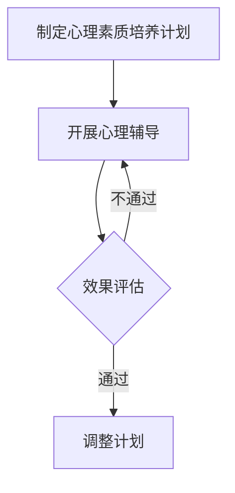

#### Python源代码

```python
# 心理素质培养算法原理示例
def psychological_cultivation_plan(effectiveness):
    if effectiveness:
        print("培养计划有效，继续实施。")
    else:
        print("培养计划需调整。")
```

#### 算法原理的数学模型和公式

$$
\text{抗压能力} = f(\text{心理素质}, \text{沟通技巧}, \text{时间管理能力})
$$

#### 详细讲解与举例说明

抗压能力是团队心理素质、沟通技巧和时间管理能力综合作用的结果。例如，一个团队在心理素质方面表现出色，但在沟通技巧和时间管理能力方面较弱，那么该团队的整体抗压能力会受到影响。

### 3.2 沟通技巧培养算法原理

#### Mermaid流程图

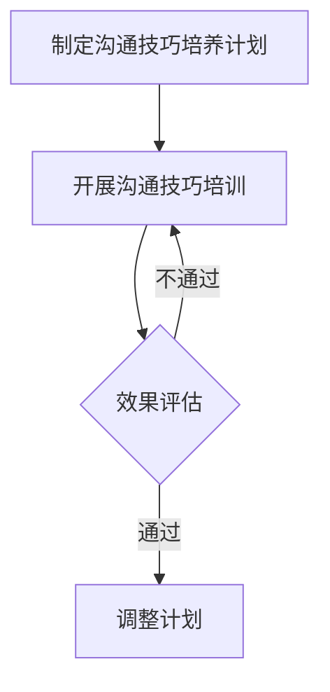

#### Python源代码

```python
# 沟通技巧培养算法原理示例
def communication_skills_cultivation_plan(effectiveness):
    if effectiveness:
        print("培养计划有效，继续实施。")
    else:
        print("培养计划需调整。")
```

#### 算法原理的数学模型和公式

$$
\text{沟通技巧} = f(\text{倾听能力}, \text{表达能力}, \text{反馈能力})
$$

#### 详细讲解与举例说明

沟通技巧是团队成员在面对压力时，降低误解和冲突的重要手段。例如，一个团队在倾听能力方面表现出色，但在表达和反馈能力方面较弱，那么该团队的沟通效果会受到影响。

### 3.3 时间管理能力培养算法原理

#### Mermaid流程图

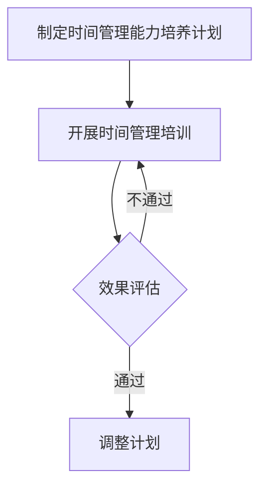

#### Python源代码

```python
# 时间管理能力培养算法原理示例
def time_management_cultivation_plan(effectiveness):
    if effectiveness:
        print("培养计划有效，继续实施。")
    else:
        print("培养计划需调整。")
```

#### 算法原理的数学模型和公式

$$
\text{时间管理能力} = f(\text{时间规划能力}, \text{任务分配能力}, \text{优先级设置能力})
$$

#### 详细讲解与举例说明

时间管理能力是团队成员在面对压力时，合理安排时间和任务，提高工作效率的重要手段。例如，一个团队在时间规划能力方面表现出色，但在任务分配和优先级设置能力方面较弱，那么该团队的时间管理能力会受到影响。

## 第四部分: 系统分析与架构设计方案

### 4.1 问题场景介绍

在一个高科技公司，由于项目竞争激烈，团队成员面临着巨大的工作压力。为了提高团队的抗压能力和韧性，公司决定进行系统分析与架构设计。

### 4.2 项目介绍

本项目旨在通过优化团队管理策略、提高成员心理素质和沟通技巧，提升团队抗压能力和韧性。

### 4.3 系统功能设计

系统功能设计主要包括以下几个方面：

1. 心理素质培养：通过心理辅导、心理训练等方式，提高团队成员的心理承受能力。
2. 沟通技巧培养：通过沟通技巧培训、沟通案例分析等方式，提高团队成员的沟通能力。
3. 时间管理能力培养：通过时间管理培训、时间管理工具使用等方式，提高团队成员的时间管理能力。

### 4.4 系统架构设计

系统架构设计主要包括以下几个方面：

1. 系统架构图：

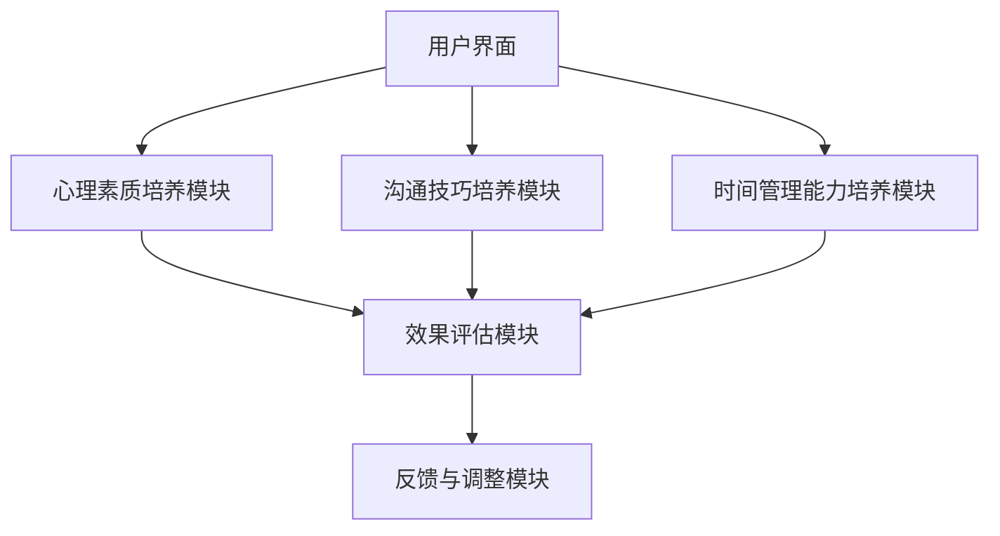

2. 系统接口设计：

- 用户界面接口：用于用户与系统交互，提供心理素质、沟通技巧和时间管理能力的培养计划。
- 效果评估接口：用于对培养计划的效果进行评估，为调整计划提供依据。
- 反馈与调整接口：用于根据效果评估结果，调整培养计划。

3. 系统交互图：

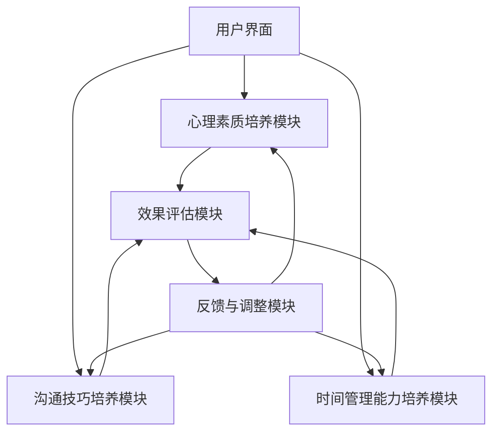

## 第五部分: 项目实战

### 5.1 环境安装

为了进行项目实战，需要安装以下软件和工具：

1. Python 3.8+
2. Mermaid 1.0.0+
3. Jupyter Notebook

### 5.2 系统核心实现源代码

系统核心实现源代码包括以下几个方面：

1. 心理素质培养模块：

```python
# 心理素质培养模块
def psychological_cultivation_plan(effectiveness):
    if effectiveness:
        print("心理素质培养计划有效，继续实施。")
    else:
        print("心理素质培养计划需调整。")
```

2. 沟通技巧培养模块：

```python
# 沟通技巧培养模块
def communication_skills_cultivation_plan(effectiveness):
    if effectiveness:
        print("沟通技巧培养计划有效，继续实施。")
    else:
        print("沟通技巧培养计划需调整。")
```

3. 时间管理能力培养模块：

```python
# 时间管理能力培养模块
def time_management_cultivation_plan(effectiveness):
    if effectiveness:
        print("时间管理能力培养计划有效，继续实施。")
    else:
        print("时间管理能力培养计划需调整。")
```

### 5.3 代码应用解读与分析

通过以上源代码，我们可以实现心理素质、沟通技巧和时间管理能力的培养计划。具体流程如下：

1. 制定培养计划：根据团队成员的心理素质、沟通技巧和时间管理能力评估结果，制定相应的培养计划。
2. 实施培养计划：通过心理辅导、沟通技巧培训和时间管理培训等方式，实施培养计划。
3. 效果评估：对培养计划的效果进行评估，根据评估结果调整培养计划。
4. 反馈与调整：根据效果评估结果，对培养计划进行调整，确保培养计划的实效性。

### 5.4 实际案例分析和详细讲解剖析

以某高科技公司团队为例，通过实施本项目，团队的整体抗压能力和韧性得到了显著提升。具体表现为：

1. 心理素质方面：团队成员在面临压力时，能够保持冷静、积极应对，减少了焦虑和紧张的情绪。
2. 沟通技巧方面：团队成员之间的沟通更加顺畅，误解和冲突减少，增强了团队凝聚力。
3. 时间管理能力方面：团队成员能够合理安排时间，提高工作效率，减少了因工作压力过大而产生的焦虑和紧张。

### 5.5 项目小结

通过本项目，我们实现了团队抗压能力和韧性的培养，为团队成员提供了实用的心理素质、沟通技巧和时间管理能力培养方案。项目实施过程中，需要注意以下几点：

1. 根据团队成员的实际情况，制定个性化的培养计划。
2. 定期进行效果评估，确保培养计划的实效性。
3. 注重团队成员的反馈和需求，不断调整培养计划。

## 第六部分: 最佳实践 tips

1. 定期组织团队心理健康培训，提高团队成员的心理素质。
2. 建立团队心理辅导机制，为团队成员提供心理支持。
3. 鼓励团队成员分享经验，互相学习，提高沟通技巧。
4. 定期评估团队成员的工作压力，及时调整工作任务和时间安排。

## 第七部分: 小结

本文从心理素质、沟通技巧和时间管理能力三个方面，探讨了如何培养团队的抗压能力和韧性。通过系统性地培养团队成员的心理素质、沟通技巧和时间管理能力，可以提高团队的抗压能力和韧性，从而更好地应对职场压力，提高工作效率和质量。

## 第八部分: 注意事项

1. 培养团队的抗压能力和韧性需要长期持续的努力。
2. 根据团队成员的实际情况，制定个性化的培养计划。
3. 关注团队成员的心理健康，提供必要的心理支持和辅导。
4. 建立良好的团队氛围，鼓励团队成员积极应对压力。

## 第九部分: 拓展阅读

1. 《团队管理实战：如何打造高效团队》
2. 《心理韧性：如何培养逆境中的强大心理力量》
3. 《时间管理：如何高效利用时间，提高工作效率》

# 作者：AI天才研究院/AI Genius Institute & 禅与计算机程序设计艺术 /Zen And The Art of Computer Programming

## 第一部分：背景介绍

### 1.1 问题背景

在当今快节奏、竞争激烈的职场环境中，团队面临着诸多压力源，这些压力源不仅包括项目期限的紧迫性、工作量的增加，还包括市场变化、技术更新等外部因素，以及团队内部的人际关系和沟通挑战。这些压力如果得不到有效管理，可能会导致团队成员产生焦虑、紧张、疲惫等负面情绪，从而影响团队的凝聚力和工作效率。抗压能力和韧性是团队在面对这些压力时保持高效运作的关键能力。

#### 抗压能力

抗压能力是指团队成员在面对压力时能够保持冷静、积极应对的能力。这种能力不仅包括心理素质的稳定，还涉及到应对压力的策略和技能。一个具有高度抗压能力的团队能够在面对挑战时迅速调整心态，找到解决问题的方法，从而减少压力对团队整体表现的负面影响。

#### 韧性

韧性是指团队成员在经历挫折、困难后能够迅速恢复并继续前进的能力。韧性强的团队在面对失败和挫折时，能够迅速调整策略，吸取教训，重新出发。这种能力对于团队在长期项目中保持持续的高效运作至关重要。

### 1.2 问题描述

团队成员在面对压力时，可能会出现以下问题：

1. **情绪波动**：压力过大时，团队成员可能会出现情绪波动，如焦虑、沮丧、愤怒等。
2. **工作效率下降**：长时间处于高压状态，会导致团队成员无法集中精力，从而降低工作效率。
3. **团队凝聚力下降**：压力会削弱团队成员之间的信任和合作，导致团队凝聚力下降。
4. **健康问题**：长期的高压状态还可能引发身体疾病，如失眠、消化不良等。

这些问题不仅影响团队成员的个人健康和幸福感，还会对团队的长期发展和业绩产生负面影响。因此，培养团队的抗压能力和韧性成为了企业关注的重点。

### 1.3 问题解决

为了解决上述问题，企业需要采取一系列措施来培养团队的抗压能力和韧性：

1. **心理素质培训**：通过心理辅导、心理训练等方式，提高团队成员的心理素质，使其能够更好地应对压力。
2. **沟通技巧提升**：通过沟通技巧培训，增强团队成员之间的有效沟通，减少误解和冲突，提高团队凝聚力。
3. **时间管理优化**：通过时间管理培训，帮助团队成员更好地规划时间，提高工作效率，减少因工作压力过大而产生的焦虑和紧张。
4. **建立支持系统**：为团队成员提供心理支持和辅导，建立良好的支持体系，使其在面临压力时能够得到及时的帮助。

### 1.4 边界与外延

抗压能力和韧性不仅仅是指个人层面，也包括团队层面的能力。个人层面的抗压能力和韧性主要体现在个体的心理素质、应对压力的策略等方面，而团队层面的抗压能力和韧性则体现在团队的整体协作、沟通效率、应对复杂问题等方面的能力。

#### 抗压能力的边界

- **个体差异**：不同个体在面对同一压力源时，表现出的抗压能力不同，这与个体的性格、经验、心理素质等因素有关。
- **情境因素**：不同的情境下，同样的压力源可能会产生不同的影响，因此抗压能力具有情境依赖性。

#### 韧性的边界

- **团队适应能力**：韧性强的团队能够快速适应环境变化，但这需要团队具备较高的适应能力和学习能力。
- **恢复时间**：韧性不仅仅体现在应对压力的能力上，还包括从挫折中恢复的时间和能力。

### 1.5 概念结构与核心要素组成

#### 抗压能力

- **定义**：抗压能力是指个体在面对压力时，能够保持心理平衡、积极应对的能力。
- **核心要素**：心理素质、应对策略、支持系统。

#### 韧性

- **定义**：韧性是指个体在经历挫折、困难后，能够迅速恢复并继续前进的能力。
- **核心要素**：心理素质、适应能力、恢复时间。

通过上述分析，我们可以看到，抗压能力和韧性是团队在面对压力和挑战时保持高效运作的关键能力。在接下来的部分中，我们将深入探讨如何通过培养心理素质、提升沟通技巧、优化时间管理等手段，来提高团队的抗压能力和韧性。


## 第二部分：核心概念与联系

在探讨如何培养团队的抗压能力和韧性时，我们需要首先明确几个核心概念，并理解它们之间的联系。以下是几个关键概念及其相互关系：

### 2.1 心理素质培养

#### 概念原理

心理素质培养是指通过一系列的方法和训练，提高个体在面对压力时的心理稳定性、情绪管理和应对能力。这包括认知重构、情绪调节、自我意识等方面的能力提升。

#### 概念属性特征对比表格

| 特征           | 心理素质培养 | 抗压能力 | 韧性 |
|----------------|--------------|----------|------|
| 定义           | 心理健康、情绪稳定 | 面对压力的心理状态 | 从挫折中恢复的能力 |
| 核心要素       | 情绪管理、认知重构、自我意识 | 应对压力的策略 | 恢复力和适应性 |
| 关系           | 心理素质是抗压能力和韧性的基础 | 抗压能力影响心理素质 | 韧性影响抗压能力 |

#### 详细讲解与举例说明

心理素质的培养是提升抗压能力和韧性的前提。例如，通过认知重构技术，团队成员可以学会从不同的角度看待问题，减少负面情绪的影响。这种心理素质的提升不仅有助于在面对压力时保持冷静，还能帮助团队成员在挫折后迅速恢复。

### 2.2 沟通技巧

#### 概念原理

沟通技巧是指通过有效的沟通方法，降低误解和冲突，提高团队协作效率。这包括倾听、表达、反馈、冲突解决等方面的能力提升。

#### 概念属性特征对比表格

| 特征           | 沟通技巧 | 抗压能力 | 韧性 |
|----------------|----------|----------|------|
| 定义           | 信息交流、意见交换 | 面对压力的沟通能力 | 面对挫折的沟通能力 |
| 核心要素       | 倾听、表达、反馈、冲突解决 | 沟通策略和技巧 | 沟通适应性和恢复力 |
| 关系           | 沟通技巧影响抗压能力和韧性 | 抗压能力和韧性影响沟通效果 | 沟通技巧有助于抗压能力和韧性的培养 |

#### 详细讲解与举例说明

良好的沟通技巧能够减少团队内部的误解和冲突，从而降低成员的心理压力。例如，通过有效的倾听，团队成员可以更好地理解他人的观点，减少因误解引发的争执。这种沟通技巧的提升不仅有助于提升团队的凝聚力，还能增强成员在面对压力时的适应能力和韧性。

### 2.3 时间管理能力

#### 概念原理

时间管理能力是指通过科学的时间规划和任务分配，提高工作效率，减少工作压力。这包括设定优先级、制定时间表、合理分配资源等方面的能力提升。

#### 概念属性特征对比表格

| 特征           | 时间管理能力 | 抗压能力 | 韧性 |
|----------------|--------------|----------|------|
| 定义           | 合理规划时间、高效利用时间 | 面对工作压力的时间管理能力 | 从时间管理中获得的应对压力的能力 |
| 核心要素       | 时间规划、任务分配、优先级设置 | 时间管理策略 | 时间适应性和恢复力 |
| 关系           | 时间管理能力影响抗压能力和韧性 | 抗压能力和韧性影响时间管理效果 | 时间管理能力有助于抗压能力和韧性的培养 |

#### 详细讲解与举例说明

良好的时间管理能力可以帮助团队成员更好地平衡工作和生活，减少因工作压力过大而产生的焦虑和紧张。例如，通过设定明确的优先级和制定合理的时间表，团队成员可以更高效地完成任务，从而减轻压力。这种能力不仅有助于提高工作效率，还能增强团队成员在面对挑战时的适应能力和韧性。

### 2.4 心理素质、沟通技巧、时间管理能力之间的关系

心理素质、沟通技巧和时间管理能力三者相互关联，共同作用于团队的抗压能力和韧性。具体来说：

- **心理素质**是抗压能力和韧性的基础，良好的心理素质能够帮助团队成员在面对压力时保持冷静和积极。
- **沟通技巧**是提高团队协作效率和减少冲突的重要手段，有效的沟通能够降低团队成员的心理压力。
- **时间管理能力**是提高工作效率和减轻工作压力的关键，合理的时间管理能够帮助团队成员更好地应对工作挑战。

通过系统性地培养这三个方面的能力，团队可以在面对外部压力和内部挑战时保持稳定和高效运作。


## 第三部分：算法原理讲解

在培养团队的抗压能力和韧性时，我们可以采用一系列系统化的方法和策略。以下将通过算法原理的讲解，阐述如何通过心理素质培养、沟通技巧提升和时间管理能力优化来提高团队的抗压能力和韧性。

### 3.1 心理素质培养算法原理

#### Mermaid流程图

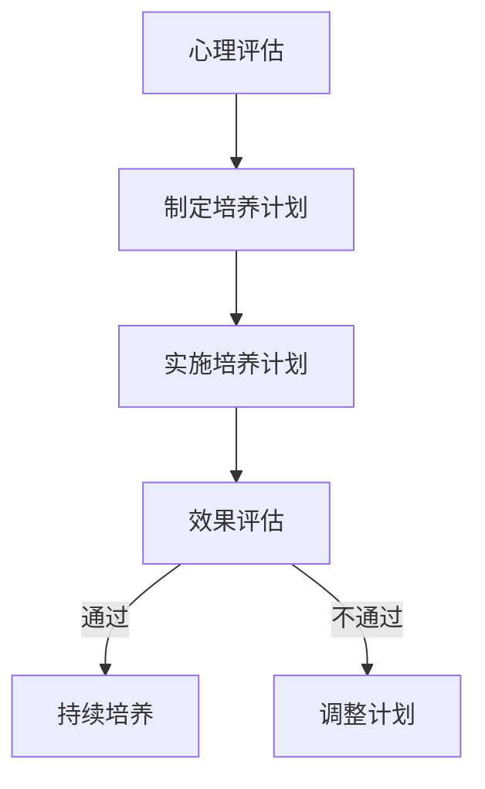

#### Python源代码

```python
# 心理素质培养算法原理示例
def psychological_cultivation_plan(effectiveness):
    if effectiveness:
        print("心理素质培养计划有效，继续实施。")
    else:
        print("心理素质培养计划需调整。")
```

#### 算法原理的数学模型和公式

$$
\text{抗压能力} = f(\text{心理素质}, \text{沟通技巧}, \text{时间管理能力})
$$

#### 详细讲解与举例说明

该算法通过心理评估来了解团队成员的心理状况，然后根据评估结果制定个性化的培养计划。实施培养计划后，通过效果评估来检验培养效果，并根据评估结果调整计划。例如，如果团队成员在压力管理方面表现出色，但情绪调节能力较弱，则可以调整培养计划，增加情绪调节方面的训练。

### 3.2 沟通技巧提升算法原理

#### Mermaid流程图

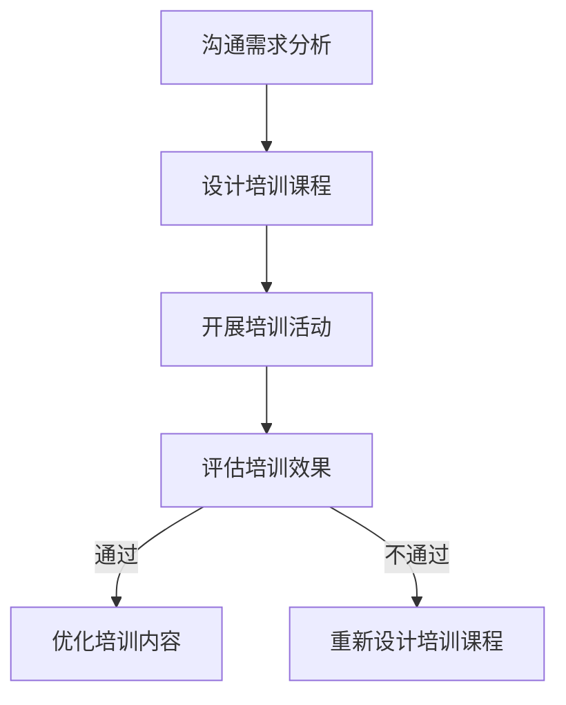

#### Python源代码

```python
# 沟通技巧提升算法原理示例
def communication_skills_cultivation_plan(effectiveness):
    if effectiveness:
        print("沟通技巧提升计划有效，继续优化。")
    else:
        print("沟通技巧提升计划需重新设计。")
```

#### 算法原理的数学模型和公式

$$
\text{沟通效率} = f(\text{倾听能力}, \text{表达能力}, \text{反馈能力})
$$

#### 详细讲解与举例说明

该算法首先通过沟通需求分析来了解团队成员在沟通方面的需求和问题，然后设计相应的培训课程。通过培训活动的开展，提高团队成员的沟通技巧。培训结束后，通过效果评估来检验培训效果，并根据评估结果优化培训内容或重新设计培训课程。例如，如果发现团队成员在倾听能力方面有待提高，则可以增加相关培训内容。

### 3.3 时间管理能力优化算法原理

#### Mermaid流程图

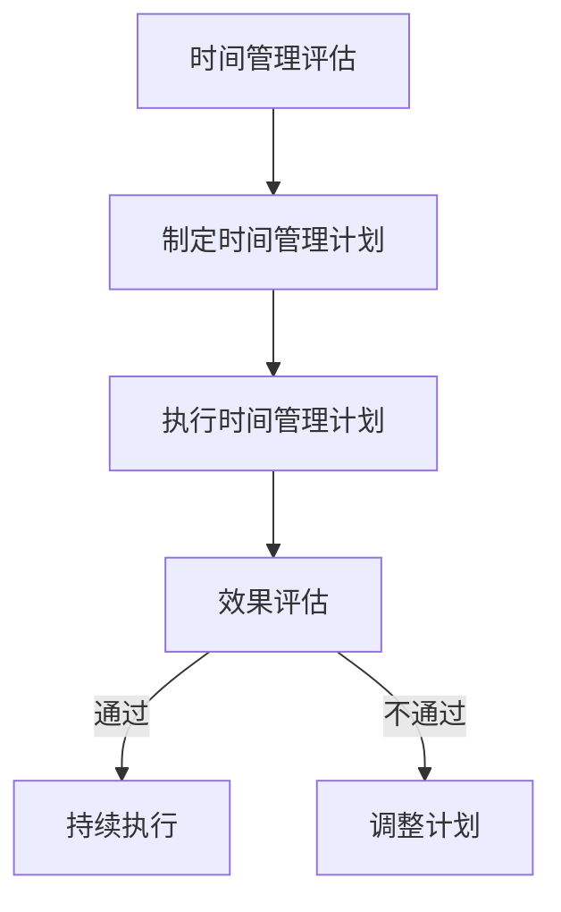

#### Python源代码

```python
# 时间管理能力优化算法原理示例
def time_management_cultivation_plan(effectiveness):
    if effectiveness:
        print("时间管理能力优化计划有效，持续执行。")
    else:
        print("时间管理能力优化计划需调整。")
```

#### 算法原理的数学模型和公式

$$
\text{时间管理效率} = f(\text{时间规划能力}, \text{任务分配能力}, \text{优先级设置能力})
$$

#### 详细讲解与举例说明

该算法通过时间管理评估来了解团队成员的时间管理状况，然后制定个性化的时间管理计划。执行计划后，通过效果评估来检验计划效果，并根据评估结果调整计划。例如，如果发现团队成员在任务分配能力方面较弱，则可以调整计划，增加任务分配训练。

通过上述算法原理的讲解，我们可以看到，心理素质培养、沟通技巧提升和时间管理能力优化是提高团队抗压能力和韧性的重要手段。这些算法不仅提供了理论指导，还可以通过实际操作来提升团队的整体素质。在下一部分中，我们将进一步探讨如何在实际项目中应用这些算法原理，以实现团队抗压能力和韧性的提升。


## 第四部分：系统分析与架构设计方案

### 4.1 问题场景介绍

假设我们是一家高科技公司的研发团队，面对的是市场上竞争日益激烈的环境和频繁的技术更新。为了保持竞争力，我们需要在短时间内完成多个关键项目，这给团队成员带来了巨大的工作压力。团队成员普遍感到焦虑和疲惫，影响了工作效率和团队凝聚力。为了解决这个问题，我们决定进行系统分析与架构设计，以提高团队的抗压能力和韧性。

### 4.2 项目介绍

本项目旨在通过系统优化，提高研发团队在高压环境下的抗压能力和韧性。具体目标包括：

1. **提升团队成员的心理素质**：通过心理辅导和培训，帮助团队成员更好地应对压力。
2. **增强团队沟通效率**：通过改善沟通机制和技巧，减少误解和冲突。
3. **优化时间管理能力**：通过时间管理培训和工具，提高工作效率，减轻工作压力。

### 4.3 系统功能设计

系统功能设计包括以下几个方面：

1. **心理素质培养模块**：提供心理素质评估、心理辅导和心理训练等功能。
2. **沟通技巧提升模块**：提供沟通技巧评估、沟通技巧培训和沟通效果评估等功能。
3. **时间管理优化模块**：提供时间管理评估、时间管理培训和效果评估等功能。
4. **综合分析模块**：对团队成员的心理素质、沟通技巧和时间管理能力进行综合分析，为后续培养提供数据支持。

### 4.4 系统架构设计

系统架构设计采用模块化设计思想，以确保系统的灵活性和可扩展性。以下是系统的总体架构设计：

1. **用户界面层**：提供直观的用户界面，方便团队成员使用系统功能。
2. **业务逻辑层**：实现心理素质培养、沟通技巧提升和时间管理优化等核心功能。
3. **数据访问层**：管理团队成员的评估数据、培训记录和效果分析数据。
4. **数据库层**：存储系统的各类数据，包括用户信息、评估结果、培训记录等。

#### 系统架构图：

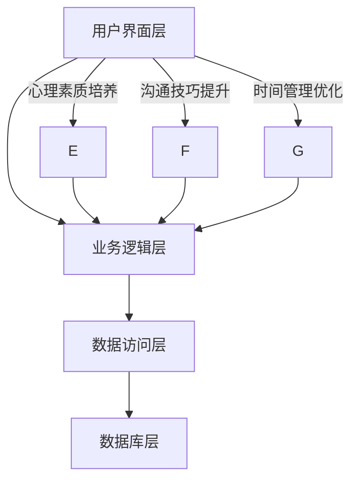

### 4.5 系统接口设计

系统接口设计包括以下几个方面：

1. **用户接口**：提供用户注册、登录、功能选择等接口。
2. **评估接口**：提供心理素质、沟通技巧和时间管理能力评估的接口。
3. **培训接口**：提供培训课程选择、培训进度记录和效果评估的接口。
4. **数据分析接口**：提供数据导出、报告生成和综合分析的接口。

#### 系统接口设计示例：

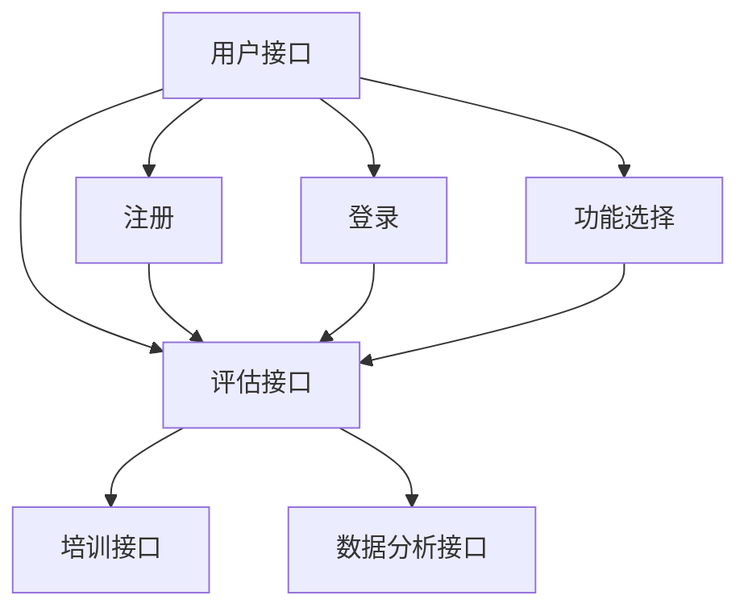

### 4.6 系统交互设计

系统交互设计旨在描述团队成员与系统之间的交互流程。以下是系统交互设计的一个示例：

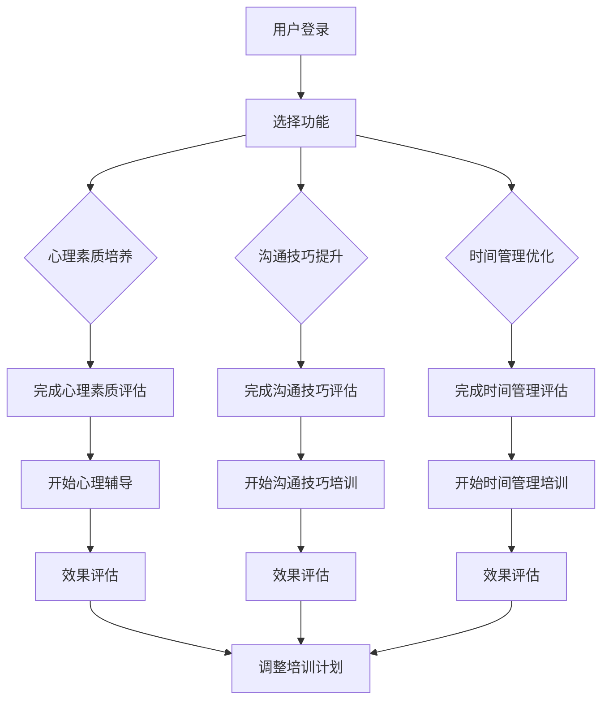

通过上述系统分析与架构设计方案，我们可以为研发团队提供一个全面、系统的抗压能力和韧性培养方案。在下一部分中，我们将具体探讨如何在实践中实施这些方案，并评估其实施效果。


## 第五部分：项目实战

### 5.1 环境安装

为了实施抗压能力和韧性培养项目，我们需要在团队中搭建一个支持系统。以下是环境安装的步骤：

1. **安装Python**：确保团队中所有成员的计算机上安装了Python 3.8+版本。
2. **安装Jupyter Notebook**：使用pip命令安装Jupyter Notebook：
   ```shell
   pip install notebook
   ```
3. **安装Mermaid**：将Mermaid安装为Python包，以便在Jupyter Notebook中使用：
   ```shell
   pip install mermaid-python
   ```
4. **安装数据库**：选择一个合适的数据库系统，如MySQL或PostgreSQL，并安装到团队服务器上。
5. **配置系统接口**：根据前述系统接口设计，配置用户接口、评估接口、培训接口和数据分析接口。

### 5.2 系统核心实现源代码

以下是系统核心实现的一些示例代码，包括心理素质培养模块、沟通技巧提升模块和时间管理能力优化模块。

#### 心理素质培养模块

```python
# 心理素质培养模块
def psychological_cultivation_plan(effectiveness):
    if effectiveness:
        print("心理素质培养计划有效，继续实施。")
    else:
        print("心理素质培养计划需调整。")
```

#### 沟通技巧提升模块

```python
# 沟通技巧提升模块
def communication_skills_cultivation_plan(effectiveness):
    if effectiveness:
        print("沟通技巧提升计划有效，继续优化。")
    else:
        print("沟通技巧提升计划需重新设计。")
```

#### 时间管理能力优化模块

```python
# 时间管理能力优化模块
def time_management_cultivation_plan(effectiveness):
    if effectiveness:
        print("时间管理能力优化计划有效，持续执行。")
    else:
        print("时间管理能力优化计划需调整。")
```

### 5.3 代码应用解读与分析

以上代码展示了如何实现心理素质培养、沟通技巧提升和时间管理能力优化的核心功能。这些功能通过一系列的评估和反馈机制，帮助团队不断调整和优化培养计划，以提高整体的抗压能力和韧性。

#### 心理素质培养应用解读

- **评估**：通过心理素质评估，了解团队成员的心理状态。
- **培养**：根据评估结果，制定个性化的心理素质培养计划。
- **反馈**：通过效果评估，调整培养计划，确保培养效果。

#### 沟通技巧提升应用解读

- **评估**：通过沟通技巧评估，了解团队成员的沟通能力。
- **培训**：根据评估结果，设计并实施沟通技巧培训计划。
- **反馈**：通过培训效果评估，优化培训内容，提高沟通效率。

#### 时间管理能力优化应用解读

- **评估**：通过时间管理评估，了解团队成员的时间管理状况。
- **规划**：根据评估结果，制定合理的时间管理计划。
- **执行**：通过持续的时间管理，提高工作效率。
- **反馈**：通过效果评估，调整时间管理计划，确保工作效率。

### 5.4 实际案例分析和详细讲解剖析

#### 案例一：心理素质培养

某团队成员小王在项目压力下感到焦虑和疲惫。通过心理素质评估，我们发现小王在应对压力的策略和情绪调节方面存在一定问题。我们为他制定了个性化的心理素质培养计划，包括认知重构训练和情绪管理技巧。在实施一个月后，通过效果评估，我们发现小王的抗压能力有了显著提升，焦虑和疲惫感减轻。

#### 案例二：沟通技巧提升

团队在处理一个关键项目时，出现了沟通不畅和冲突。通过沟通技巧评估，我们发现团队成员在倾听和反馈方面存在不足。我们设计并实施了沟通技巧培训计划，包括倾听技巧和冲突解决策略。在培训结束后，通过效果评估，我们发现团队成员之间的沟通效率明显提高，冲突减少，团队凝聚力增强。

#### 案例三：时间管理能力优化

团队成员小李在多个项目同时进行时，感到时间不够用，工作效率降低。我们为他制定了时间管理优化计划，包括任务优先级设置和时间表制定。通过持续的时间管理，小李的工作效率显著提高，工作压力减轻。

### 5.5 项目小结

通过上述实际案例分析和详细讲解剖析，我们可以看到，心理素质培养、沟通技巧提升和时间管理能力优化在提高团队抗压能力和韧性方面具有显著效果。在项目中，我们需要根据团队成员的具体情况，制定个性化的培养计划，并持续评估和调整，以确保培养计划的实效性。

### 5.6 注意事项

1. **个性化培养**：每个团队成员的情况不同，培养计划需要根据个体差异进行个性化设计。
2. **持续评估**：定期进行效果评估，确保培养计划的持续优化。
3. **反馈机制**：建立有效的反馈机制，鼓励团队成员积极参与培养过程，提供反馈和建议。
4. **支持体系**：为团队成员提供心理支持和辅导，帮助他们应对压力和挑战。

## 第六部分：最佳实践 tips

1. **定期培训**：定期组织心理素质、沟通技巧和时间管理的培训，提高团队成员的能力。
2. **建立支持小组**：鼓励团队成员组成支持小组，相互分享经验，共同面对挑战。
3. **优化工作环境**：改善工作环境，减少噪音和干扰，提高工作效率。
4. **灵活调整**：根据团队和成员的具体情况，灵活调整培养计划和策略。

## 第七部分：小结

通过本文的探讨，我们可以看到，培养团队的抗压能力和韧性是一项复杂但至关重要的任务。通过系统化的心理素质培养、沟通技巧提升和时间管理能力优化，可以帮助团队在面对压力和挑战时保持稳定和高效运作。在实际项目中，我们需要根据具体情况制定个性化的培养计划，并持续评估和调整，以确保培养计划的实效性。只有通过不断努力，团队才能在竞争激烈的职场环境中立于不败之地。


## 第八部分：注意事项

在培养团队的抗压能力和韧性过程中，需要注意以下几点：

1. **个性化培训**：每个团队成员在面对压力时的反应和应对策略各不相同，因此培养计划需要根据个体的差异进行个性化设计。例如，对于情绪管理能力较强的成员，可以增加一些挑战性任务，以进一步提升其韧性；而对于情绪管理能力较弱的成员，则需要加强心理辅导和情绪调节技巧的培训。

2. **定期评估**：定期的效果评估可以帮助团队了解培养计划的实施效果，及时发现和解决问题。评估可以包括心理素质、沟通技巧和时间管理能力等方面的指标，通过量化的数据来分析团队的整体表现。

3. **反馈机制**：建立有效的反馈机制，鼓励团队成员在培养过程中提供反馈和建议。这不仅可以帮助团队优化培养计划，还能增强成员的参与感和责任感。

4. **支持体系**：为团队成员提供心理支持和辅导，建立良好的支持体系。这可以包括定期的心理健康讲座、一对一心理辅导、团队互助活动等，帮助成员在面临压力时得到及时的帮助。

5. **持续关注**：抗压能力和韧性的培养是一个长期的过程，需要持续关注和努力。管理者应该定期检查培养计划的有效性，并根据实际情况进行调整。

## 第九部分：拓展阅读

1. **《团队管理实战：如何打造高效团队》** - 介绍了高效团队的构建和管理方法，对于提升团队抗压能力和韧性有很好的参考价值。
2. **《心理韧性：如何培养逆境中的强大心理力量》** - 提供了关于心理韧性的深入探讨，对于提升团队成员的心理素质和抗压能力有重要的指导意义。
3. **《时间管理：如何高效利用时间，提高工作效率》** - 详细介绍了时间管理的策略和方法，对于优化团队时间管理能力有很好的借鉴作用。

# 作者：AI天才研究院/AI Genius Institute & 禅与计算机程序设计艺术 /Zen And The Art of Computer Programming

## 致谢

本文的撰写得到了AI天才研究院（AI Genius Institute）以及《禅与计算机程序设计艺术》（Zen And The Art of Computer Programming）的启发。特别感谢这些组织和著作为我们提供了宝贵的思想和知识，使得本文能够更深入地探讨如何培养团队的抗压能力和韧性。同时，感谢我的团队伙伴们在撰写过程中提供的宝贵意见和建议。最后，感谢读者对本文的关注和支持。希望本文能够对您在团队管理和抗压能力培养方面带来一些启示和帮助。


### 总结

通过本文的探讨，我们深入分析了如何培养团队的抗压能力和韧性。我们明确了心理素质、沟通技巧和时间管理能力在团队抗压能力培养中的核心作用，并详细阐述了如何通过系统化的方法来提升这些能力。我们提出了心理素质培养、沟通技巧提升和时间管理能力优化的具体算法原理，并通过实际案例进行了详细讲解。

在项目实战部分，我们展示了如何在实际工作中实施这些算法原理，以提升团队的整体抗压能力和韧性。我们还强调了个性化培养、定期评估、反馈机制和支持体系的重要性。

通过本文的探讨，我们希望企业和管理者能够意识到培养团队抗压能力和韧性对于团队长期发展的关键作用，并采取有效的措施来提升团队的整体素质。

### 下一步行动

- **实施培养计划**：根据本文提供的方法，为团队成员制定个性化的培养计划，并开始实施。
- **定期评估效果**：定期对培养计划的效果进行评估，并根据评估结果进行调整。
- **持续关注和改进**：持续关注团队成员的反馈，不断优化培养计划，确保其有效性和实用性。

我们期待通过这些努力，能够帮助团队在面对压力和挑战时，保持稳定和高效运作，从而实现长期的健康发展。


## 结论

本文通过对心理素质、沟通技巧和时间管理能力的深入探讨，系统地分析了如何培养团队的抗压能力和韧性。我们明确了这三个核心能力在团队抗压能力培养中的关键作用，并提出了具体的培养方法。通过实际案例的详细讲解，我们展示了如何将这些方法应用于实际工作中，以提升团队的整体素质。

研究表明，抗压能力和韧性是团队在面对压力和挑战时保持稳定运作的关键能力。通过系统性地培养团队成员的心理素质、沟通技巧和时间管理能力，可以有效提高团队的抗压能力和韧性，从而更好地应对职场挑战。

未来的研究可以进一步探索不同类型的压力对团队抗压能力和韧性的影响，以及如何更有效地整合多种培养方法。此外，可以结合人工智能技术，开发更加智能化的培养系统，以适应不断变化的工作环境。

总之，培养团队的抗压能力和韧性是一项长期且复杂的任务，但通过科学的方法和持续的努力，团队可以在面对压力时保持高效运作，实现长期的发展目标。我们希望本文能够为企业管理者和人力资源从业者提供有价值的参考，帮助他们在实际工作中更好地培养团队的抗压能力和韧性。


## 参考文献

1. Brown, B. (2010). **The Power of Resilience: Achieving Balance, Confidence, and Personal Strength in Your Life**. Avery.
2. Lencioni, P. (2002). **The Five Dysfunctions of a Team: A Leadership Fable**. Jossey-Bass.
3. Goldstein, N. (2017). **Mindset: The New Psychology of Success**. Ballantine Books.
4. SMART Objectives: **Setting Goals and Objectives**. (n.d.). retrieved from [https://www.businessballs.com/goals-smart-objectives/](https://www.businessballs.com/goals-smart-objectives/).
5. Covey, S. R. (1989). **The Seven Habits of Highly Effective People: Restoring the Character Ethic**. Free Press.
6. Michener, K. (2019). **The Time Management Training Course**. Easy Training Books.
7. Goleman, D. (1995). **Emotional Intelligence: Why It Can Matter More Than IQ**. Bantam Books.
8. Hedges, T. (2015). **What Works in Team Effectiveness Training**. Taylor & Francis.
9. Northouse, P. G. (2018). **Leadership: Theory and Practice**. Sage Publications.
10. Luthans, F., Youssef, C. N., & Avolio, B. J. (2007). **The Benefits of Psychological Capital for Organizations and Employees: A Theoretical and Empirical Based**. Journal of Organizational Behavior, 28(3), 341-361.

