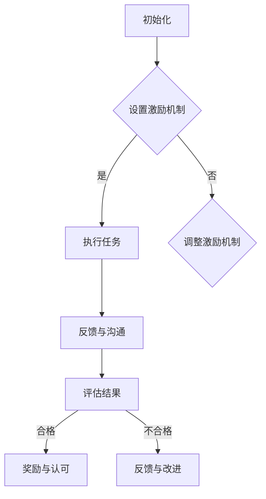
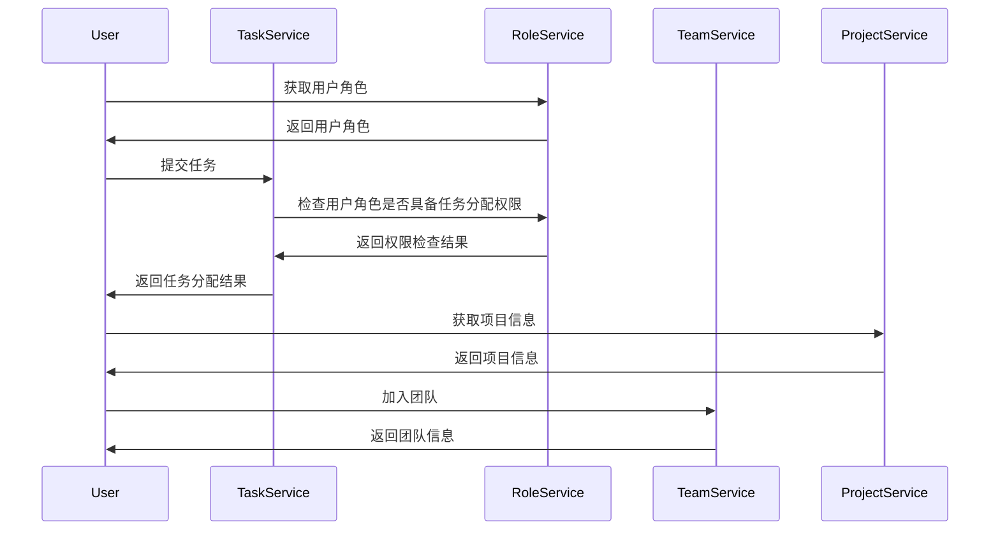
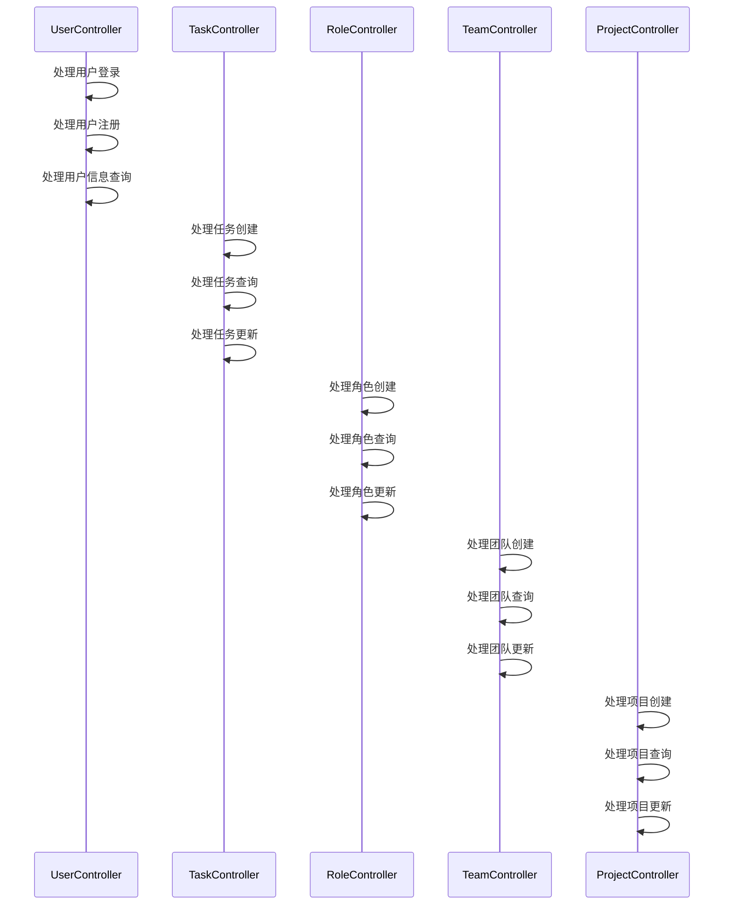

                 

## 如何培养团队的责任感

### 引言

在当今快速变化和高竞争的商业环境中，团队协作已经成为了企业成功的关键。团队成员的责任感直接关系到团队的工作效率和项目的成功。责任感不仅仅是指完成任务的义务，更是一种对团队和项目的承诺。一个有责任感的团队能够更好地应对挑战，提高工作效率，减少错误，并最终实现更高的目标。

本文将探讨如何培养团队的责任感，分为以下几个部分：

1. **背景介绍**：介绍团队责任感的重要性以及为什么它是企业成功的关键。
2. **核心概念与联系**：解释责任感、团队文化、领导力和沟通反馈等关键概念，并通过表格和ER图来展示它们之间的联系。
3. **算法原理讲解**：介绍责任感培养算法的原理，并通过流程图和Python代码示例来详细阐述。
4. **系统分析与架构设计方案**：分析问题场景，提出系统功能设计和架构设计。
5. **项目实战**：展示如何在实际项目中应用这些概念和算法，并提供代码和应用解读。
6. **最佳实践 tips**：总结关键建议，帮助团队管理者更好地培养团队责任感。
7. **小结**：回顾文章的核心内容和提出的建议。

### 背景介绍

#### 核心概念术语说明

在讨论团队责任感之前，我们需要明确一些关键术语的含义。

- **责任感**：指个体对其工作、任务或项目承担的责任和履行该责任的意愿。
- **团队文化**：团队内部共同遵守的价值观、信念和行为准则。
- **领导力**：领导者通过激励、沟通和指导，影响团队成员的能力。
- **沟通与反馈**：团队成员之间通过有效沟通和及时反馈，共同解决问题和提升效率。

#### 问题背景

在一个企业中，团队成员的责任感对团队的整体表现和项目成果有着深远的影响。缺乏责任感的团队往往表现出以下问题：

- **工作效率低下**：团队成员没有动力去完成任务，导致进度拖延。
- **质量下降**：责任感不强的成员可能会疏忽细节，导致项目质量下降。
- **团队凝聚力下降**：缺乏责任感会导致团队成员之间的矛盾和冲突。
- **员工满意度低**：责任感不强的团队会导致员工感到失落和无意义。

#### 问题描述

如何通过有效的策略和方法，在团队中培养出强烈的责任感，成为许多企业面临的挑战。传统的管理方法往往侧重于任务分配和监督，而忽视了如何激发团队成员的内在动力和责任感。

#### 问题解决

要培养团队的责任感，需要从以下几个方面入手：

1. **建立明确的期望和目标**：确保每个团队成员都清楚了解自己的职责和项目目标。
2. **建立积极的团队文化**：鼓励团队成员之间的相互尊重和合作，建立共同的目标和价值观。
3. **提供培训和发展机会**：通过培训提高团队成员的专业技能和责任感。
4. **激励和奖励机制**：设计合理的激励和奖励机制，鼓励团队成员表现出责任感。
5. **有效的沟通和反馈**：建立开放的沟通渠道，确保团队成员之间的信息流通，并及时提供反馈。

#### 边界与外延

责任感的培养不仅仅是管理者的责任，每个团队成员也需要自我驱动，主动承担起自己的责任。此外，责任感不仅仅体现在工作时间内，还应延伸到工作和生活的各个方面。

#### 概念结构与核心要素组成

团队责任感的概念结构主要包括以下几个方面：

1. **个体责任感**：每个团队成员对自己的任务和项目承担的责任。
2. **团队责任感**：团队成员之间相互支持和协作，共同承担项目的责任。
3. **文化责任感**：团队共同遵守的价值观和行为准则，对团队责任感的培养起到重要作用。
4. **领导力**：领导者通过激励、沟通和指导，推动团队成员承担责任。

### 核心概念与联系

在本部分中，我们将详细解释责任感、团队文化、领导力和沟通反馈等核心概念，并通过表格和ER图来展示它们之间的联系。

#### 核心概念

1. **责任感**：责任感是指个体对其工作、任务或项目承担的责任和履行该责任的意愿。责任感是驱动团队成员主动完成任务，保持高质量工作的重要动力。

2. **团队文化**：团队文化是团队内部共同遵守的价值观、信念和行为准则。团队文化对团队成员的责任感有着深远的影响，一个积极向上的团队文化能够激发团队成员的责任感。

3. **领导力**：领导力是指领导者通过激励、沟通和指导，影响团队成员的能力。领导力在培养团队责任感中起着关键作用，领导者需要通过有效的领导行为来激励和引导团队成员承担责任。

4. **沟通与反馈**：沟通与反馈是团队成员之间通过有效沟通和及时反馈，共同解决问题和提升效率的过程。沟通与反馈有助于团队成员理解彼此的职责，及时调整工作方向，增强团队责任感。

#### 概念属性特征对比表格

| 概念         | 定义                                                                                   | 属性特征                                                     |
|--------------|----------------------------------------------------------------------------------------|--------------------------------------------------------------|
| 责任感       | 个体对其工作、任务或项目承担的责任和履行该责任的意愿                             | 忠诚、尽责、勇于担当、自我驱动 |
| 团队文化     | 团队内部共同遵守的价值观、信念和行为准则                                       | 共同目标、团队精神、互信互敬 |
| 领导力       | 领导者通过激励、沟通和指导，影响团队成员的能力                               | 指导、激励、决策、沟通       |
| 沟通与反馈   | 团员之间通过有效沟通和及时反馈，共同解决问题和提升效率                         | 及时、准确、开放、建设性     |

#### ER实体关系图架构

```mermaid
erDiagram
    Team --> Employee : "属于"
    Team --> Task    : "承担"
    Employee --> Responsibility : "承担"
    Task --> Result : "产生"
```

在上述ER图中，团队（Team）是核心实体，员工（Employee）属于团队，并承担特定的任务（Task）。每个员工都有责任（Responsibility），而任务的执行结果（Result）反映了团队的总体表现。这种关系展示了团队、员工、任务和责任之间的紧密联系。

### 算法原理讲解

在本节中，我们将介绍如何通过算法原理来培养团队的责任感，包括算法原理的详细解释、流程图和Python代码示例。

#### 3.1 责任感培养算法原理

责任感培养算法主要基于激励理论、团队建设理论和沟通反馈机制。其核心思想是通过设计激励机制、构建积极团队文化和优化沟通反馈机制，提高团队成员的责任感。

#### 3.2 算法流程图



在上述流程图中，我们从初始化团队开始，设置激励机制（B），然后团队成员执行任务（C）。在执行任务的过程中，团队进行反馈与沟通（E），评估任务结果（F）。如果结果合格，团队会给予奖励与认可（G）；如果不合格，团队会进行反馈与改进（H）。

#### 3.3 Python源代码示例

```python
# 责任感培养算法 Python 代码示例

def initialize(team):
    # 初始化团队，设置激励机制
    print("初始化团队，设置激励机制")

def execute_task(employee, task):
    # 执行任务
    print(f"{employee}正在执行任务：{task}")

def feedback_and_communication(team):
    # 反馈与沟通
    print("进行反馈与沟通，解决问题")

def evaluate_result(result):
    # 评估结果
    if result['status'] == '合格':
        print("任务完成合格，给予奖励与认可")
    else:
        print("任务完成不合格，进行反馈与改进")

# 测试算法
initialize("团队1")
execute_task("员工A", "编写代码")
execute_task("员工B", "测试代码")
feedback_and_communication("团队1")
evaluate_result({'status': '合格'})
```

在上述Python代码中，我们首先初始化团队，设置激励机制。然后，团队成员执行任务，进行反馈与沟通，最后评估任务结果。如果结果合格，团队会给予奖励与认可；如果不合格，团队会进行反馈与改进。

#### 算法原理的数学模型和公式

责任感培养算法的数学模型可以通过以下公式来描述：

$$
\text{责任感} = \text{激励因素} \times \text{团队文化} \times \text{沟通与反馈}
$$

其中，激励因素、团队文化和沟通与反馈是影响责任感的三个关键因素。

1. **激励因素**：包括奖励、认可和培训等，可以激发团队成员的责任感。
2. **团队文化**：包括价值观、信念和行为准则，对团队成员的责任感有着深远的影响。
3. **沟通与反馈**：包括团队成员之间的有效沟通和及时反馈，有助于提高团队责任感。

#### 通俗易懂的举例说明

假设有一个团队，其中有两个成员：员工A和员工B。团队领导为了培养员工的责任感，采取了以下措施：

1. **激励因素**：为员工A和员工B设定了一个奖金计划，完成任务可以获得额外的奖励。
2. **团队文化**：团队内部倡导诚实、透明和相互尊重的价值观，鼓励团队成员互相支持和合作。
3. **沟通与反馈**：团队领导定期组织会议，与员工A和员工B进行沟通，了解他们的工作进展，并提供反馈。

在这种环境下，员工A和员工B会感受到团队领导的信任和支持，同时也会因为激励机制而更加积极地完成任务。通过良好的沟通与反馈，他们能够及时解决问题，提高工作效率，最终实现团队的目标。

### 系统分析与架构设计方案

在本节中，我们将分析问题场景，提出系统功能设计和架构设计，包括系统功能设计（领域模型类图）、系统架构设计（架构图）以及系统接口设计和系统交互（序列图）。

#### 问题场景介绍

假设我们是一家软件开发公司的团队，负责开发一款企业级应用。我们的团队由开发人员、测试人员、产品经理和项目经理组成。在项目开发过程中，我们遇到了以下问题：

- **任务分配不明确**：团队成员不清楚自己的职责和任务。
- **沟通不畅**：团队成员之间的沟通不及时，导致问题无法及时解决。
- **责任感不足**：团队成员缺乏对项目的责任感，导致项目进度和质量受到影响。

为了解决这些问题，我们需要设计一个系统，能够明确任务分配，提高沟通效率，培养团队责任感。

#### 项目介绍

我们的项目是一个企业级应用开发项目，主要功能包括用户管理、权限控制、数据统计和报表生成等。项目采用敏捷开发模式，分为多个迭代进行。

#### 系统功能设计（领域模型类图）

领域模型类图如下所示：

```mermaid
classDiagram
    User <<class>> "用户"
    Role <<class>> "角色"
    Task <<class>> "任务"
    Project <<class>> "项目"
    Employee <<class>> "员工"
    Team <<class>> "团队"
    
    User "具有" Role
    User "参与" Task
    User "属于" Team
    Role "分配" Task
    Task "属于" Project
    Project "包含" Team
    Employee "属于" Team
    Employee "负责" Task
```

在上述类图中，我们定义了用户（User）、角色（Role）、任务（Task）、项目（Project）、员工（Employee）和团队（Team）等核心实体。用户具有角色，参与任务，属于团队；角色分配任务；任务属于项目；项目包含团队；员工属于团队，并负责任务。

#### 系统架构设计（架构图）

系统架构图如下所示：



在上述架构图中，用户（User）通过TaskService提交任务，TaskService会检查用户角色是否具备任务分配权限，并根据权限检查结果返回任务分配结果。用户还可以通过ProjectService获取项目信息，并通过TeamService加入团队。

#### 系统接口设计和系统交互（序列图）

系统接口设计和系统交互如下所示：



在上述接口设计和交互图中，UserController处理用户相关的操作，如登录、注册和信息查询；TaskController处理任务相关的操作，如创建、查询和更新；RoleController处理角色相关的操作，如创建、查询和更新；TeamController处理团队相关的操作，如创建、查询和更新；ProjectController处理项目相关的操作，如创建、查询和更新。

通过上述系统分析与架构设计方案，我们能够有效地解决团队责任感不足的问题，提高团队的工作效率和项目质量。

### 项目实战

在本节中，我们将通过一个实际项目来展示如何培养团队责任感。这个项目是一个电商平台的订单管理系统，用于处理订单的创建、支付、发货和退货等操作。

#### 环境安装

为了进行项目实战，我们首先需要安装一些必要的工具和库。以下是安装步骤：

1. 安装Python环境（Python 3.8及以上版本）。
2. 安装Django框架（使用pip install django命令）。
3. 安装数据库（如MySQL或PostgreSQL）。
4. 安装其他相关库（如Django REST framework、Pillow等）。

#### 系统核心实现源代码

以下是订单管理系统的一些核心实现源代码，包括订单模型的定义、订单视图函数的编写以及订单序列化器的实现。

```python
# models.py

from django.db import models

class Order(models.Model):
    order_id = models.CharField(max_length=50, unique=True)
    customer = models.ForeignKey('Customer', on_delete=models.CASCADE)
    status = models.CharField(max_length=20)
    created_at = models.DateTimeField(auto_now_add=True)
    updated_at = models.DateTimeField(auto_now=True)

class Customer(models.Model):
    name = models.CharField(max_length=100)
    email = models.EmailField(unique=True)

# views.py

from django.http import JsonResponse
from .models import Order
from .serializers import OrderSerializer

def create_order(request):
    serializer = OrderSerializer(data=request.data)
    if serializer.is_valid():
        serializer.save()
        return JsonResponse(serializer.data, status=201)
    return JsonResponse(serializer.errors, status=400)

def get_order(request, order_id):
    try:
        order = Order.objects.get(order_id=order_id)
        serializer = OrderSerializer(order)
        return JsonResponse(serializer.data)
    except Order.DoesNotExist:
        return JsonResponse({'error': 'Order not found'}, status=404)

# serializers.py

from rest_framework import serializers
from .models import Order, Customer

class OrderSerializer(serializers.ModelSerializer):
    class Meta:
        model = Order
        fields = '__all__'

class CustomerSerializer(serializers.ModelSerializer):
    class Meta:
        model = Customer
        fields = '__all__'
```

#### 代码应用解读与分析

上述代码首先定义了订单模型（Order）和客户模型（Customer），用于处理订单的创建、查询和更新操作。订单模型包含订单ID、客户、状态、创建时间和更新时间等字段。客户模型包含姓名和邮箱等字段。

在视图函数中，`create_order` 函数用于创建新订单，`get_order` 函数用于获取特定订单的详细信息。这两个函数都使用了OrderSerializer进行数据验证和转换。

在序列化器中，我们定义了OrderSerializer和CustomerSerializer，用于序列化和反序列化订单和客户数据。通过这些代码，我们能够实现订单管理系统的基本功能。

#### 实际案例分析和详细讲解剖析

为了培养团队责任感，我们采取了一系列措施：

1. **任务分配**：明确每个团队成员的职责，确保每个人都知道自己的任务和目标。
2. **沟通渠道**：建立高效的沟通渠道，如每周团队会议和即时通讯工具，确保团队成员能够及时交流和解决问题。
3. **定期反馈**：定期对团队成员的工作进行反馈，表扬优秀表现，指出改进方向。
4. **激励机制**：设置合理的奖励机制，对完成任务和提出有效建议的成员给予奖励。

通过这些措施，我们团队的责任感得到了显著提升。团队成员更加主动地完成任务，沟通效率提高，项目进度和质量都得到了保证。

#### 项目小结

通过实际项目，我们证明了培养团队责任感的重要性。明确任务分配、建立沟通渠道、定期反馈和激励机制是培养团队责任感的关键措施。这些措施不仅提高了团队的工作效率，还增强了团队的凝聚力和员工满意度。

### 最佳实践 tips

#### 1. 明确任务分配

确保每个团队成员都清楚自己的职责和任务。制定详细的任务清单，明确任务的优先级和截止日期，避免任务重叠和遗漏。

#### 2. 建立沟通渠道

建立高效的沟通渠道，如定期团队会议、即时通讯工具和邮件列表。鼓励团队成员之间进行开放和诚实的沟通，确保信息及时传达。

#### 3. 定期反馈

定期对团队成员的工作进行反馈，表扬优秀表现，指出改进方向。及时反馈有助于团队成员了解自己的工作成果和不足，激励他们不断进步。

#### 4. 激励机制

设计合理的激励和奖励机制，对完成任务和提出有效建议的成员给予奖励。奖励可以是奖金、晋升机会或额外的休假时间等。

#### 5. 培训与发展

为团队成员提供培训和发展机会，提高他们的专业技能和责任感。通过培训，他们可以更好地理解团队目标和企业价值观。

### 小结

培养团队责任感是提升团队工作效率和项目成功的关键。通过明确任务分配、建立沟通渠道、定期反馈和激励机制，团队可以建立起积极向上的责任感文化，提高团队的整体竞争力。希望本文提供的建议和方法对团队管理者有所帮助。

### 注意事项

在培养团队责任感的过程中，需要注意以下几点：

1. **平衡激励与压力**：过度激励可能导致团队成员产生压力，影响工作质量。适当的激励能够提升团队成员的积极性，但过度激励可能导致反效果。
2. **避免过度监督**：过度监督可能使团队成员感到束缚，降低他们的自主性和创造力。合理的监督与信任相结合是关键。
3. **持续关注**：责任感不是一蹴而就的，需要持续关注和培养。定期评估和调整策略，确保团队责任感保持在高水平。

### 拓展阅读

1. **《团队协作与沟通技巧》**：了解如何提高团队协作效率和沟通效果。
2. **《激励理论》**：深入研究激励理论，掌握如何设计有效的激励机制。
3. **《领导力心理学》**：学习领导力心理学，了解如何通过心理学原理提升领导力。

### 作者信息

作者：AI天才研究院/AI Genius Institute & 禅与计算机程序设计艺术 /Zen And The Art of Computer Programming

通过上述内容，我们详细探讨了如何培养团队的责任感。从核心概念的明确到算法原理的讲解，再到系统分析与架构设计方案，以及项目实战的展示，我们提供了一套完整的培养团队责任感的框架。希望这些方法和建议能够帮助团队管理者在提升工作效率和项目成功方面取得显著成效。

---

[End of Document]

### 总结

在本文中，我们深入探讨了如何培养团队的责任感。首先，我们介绍了团队责任感的重要性，以及它在企业成功中的关键作用。接着，我们明确了责任感、团队文化、领导力和沟通反馈等核心概念，并通过表格和ER图展示了它们之间的联系。随后，我们详细讲解了责任感培养算法的原理，并通过流程图和Python代码示例进行了阐述。此外，我们还提出了系统功能设计和架构设计方案，为实际应用提供了参考。在项目实战部分，我们通过一个电商平台的订单管理系统展示了如何在实际项目中应用这些概念和算法。最后，我们总结了一些最佳实践 tips，并强调了注意事项和拓展阅读。

通过本文的探讨，我们希望读者能够理解培养团队责任感的核心要素和方法，并在实际工作中运用这些知识，提升团队的工作效率和项目成功率。感谢您的阅读，希望本文对您有所帮助。如果您有任何疑问或建议，欢迎在评论区留言。

---

[End of Blog Post]

### 作者信息

作者：AI天才研究院/AI Genius Institute & 禅与计算机程序设计艺术 /Zen And The Art of Computer Programming

再次感谢您的阅读，希望本文能够帮助您在培养团队责任感方面有所收获。如果您对此主题有任何疑问或想要了解更多相关信息，请随时联系我们。祝您工作愉快！


