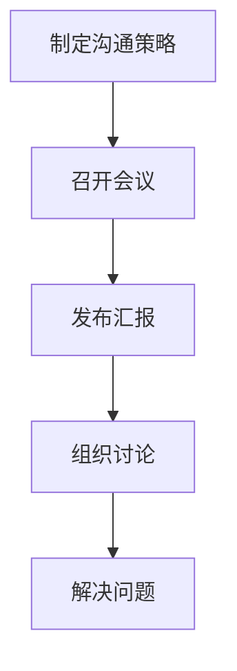
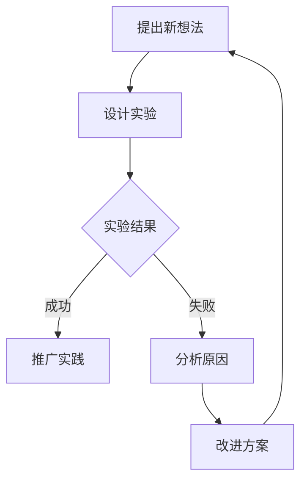
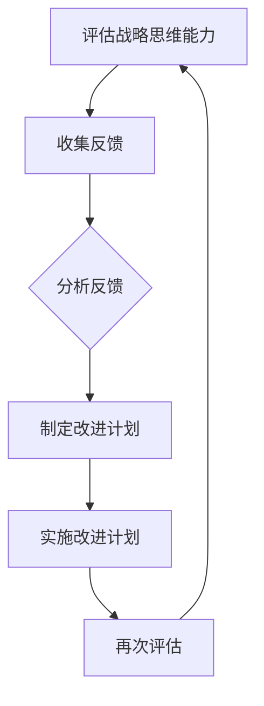

                 

### 如何培养团队的长期战略思维

在当今快速变化和竞争激烈的技术环境中，团队的战略思维成为了企业成功的关键因素。培养团队的长期战略思维不仅能够帮助团队在面对挑战时保持韧性，还能够推动企业在未来市场中保持领先地位。那么，如何培养团队的长期战略思维呢？以下，我们将一步一步进行分析和探讨。

#### 第一步：明确团队的战略目标

首先，团队需要明确自己的战略目标。这包括短期和长期目标。短期目标可能是一些具体的业务目标，如增加收入、提高市场份额等；而长期目标则可能是企业愿景、使命和核心价值观的体现，如成为行业领导者、实现全球扩张等。明确目标是培养团队战略思维的基础，因为只有明确了目标，团队才能更好地制定和实施策略。

**核心概念与联系**：

- **战略目标**：战略目标是企业在一定时间内希望实现的具体成果和目标。它通常与企业的愿景和使命紧密相关。

- **短期目标与长期目标**：短期目标通常是可量化的、具体的，能够在一年内实现；而长期目标则是更宏观的、更抽象的，通常需要数年甚至更长时间来实现。

**ER实体关系图架构**：

```mermaid
erDiagram
  目标 ||--|{ 战略目标 }|| 目标
  战略目标 ||--|{ 短期目标 }|| 战略目标
  战略目标 ||--|{ 长期目标 }|| 战略目标
```

#### 第二步：建立共同愿景和价值观

为了确保团队成员都能朝着同一个方向努力，建立共同愿景和价值观至关重要。这包括企业的文化、愿景和使命等。共同愿景和价值观可以帮助团队成员在面对困难和挑战时保持一致的方向和动力。

**核心概念与联系**：

- **共同愿景**：共同愿景是企业或团队在长期发展中所追求的理想状态，是团队前进的动力源泉。

- **价值观**：价值观是团队或企业行为准则的体现，它决定了团队如何行动和做出决策。

**ER实体关系图架构**：

```mermaid
erDiagram
  共同愿景 ||--|{ 团队 }|| 共同愿景
  团队 ||--|{ 价值观 }|| 团队
```

#### 第三步：培养团队成员的思维能力

战略思维是一种高层次的综合思维能力，它需要团队成员具备以下几个方面的能力：

1. **系统思维能力**：能够从整体上看待问题，理解各个部分之间的相互关系和相互作用。
2. **前瞻性思维能力**：能够预测未来可能的发展趋势，并据此做出决策。
3. **创新思维能力**：能够不断寻找新的解决方案，推动团队的创新和发展。
4. **决策能力**：能够在复杂的环境中做出明智的决策。

**核心概念与联系**：

- **系统思维能力**：系统思维能力是战略思维的核心，它要求团队成员能够从整体上看待问题，理解各个部分之间的相互关系和相互作用。
- **前瞻性思维能力**：前瞻性思维能力是战略思维的重要组成部分，它要求团队成员能够预测未来可能的发展趋势，并据此做出决策。
- **创新思维能力**：创新思维能力是推动团队发展的关键，它要求团队成员能够不断寻找新的解决方案，推动团队的创新和发展。
- **决策能力**：决策能力是战略思维的实际应用，它要求团队成员能够在复杂的环境中做出明智的决策。

**算法原理讲解**：

```python
def strategic_thinking_ability():
    # 系统思维能力
    system_thinking = True
    
    # 前瞻性思维能力
    forward_thinking = True
    
    # 创新思维能力
    innovative_thinking = True
    
    # 决策能力
    decision_making = True
    
    # 返回战略思维能力
    return system_thinking and forward_thinking and innovative_thinking and decision_making

# 调用函数
strategic_thinking_ability()
```

#### 第四步：提供持续学习和发展的机会

战略思维不是一成不变的，它需要不断地学习和更新。因此，团队需要提供持续学习和发展的机会，帮助团队成员不断提升自己的战略思维能力。

**核心概念与联系**：

- **持续学习**：持续学习是提升战略思维能力的有效途径，它要求团队成员不断学习新知识、新技能，以适应不断变化的环境。
- **发展机会**：提供发展机会，如培训、研讨会、项目实践等，可以帮助团队成员在实践中提升战略思维能力。

**数学公式**：

$$
持续学习 = 学习时间 \times 学习效率
$$

#### 第五步：建立有效的沟通机制

战略思维需要团队成员之间的密切合作和有效沟通。因此，团队需要建立有效的沟通机制，确保信息能够及时、准确地传递。

**核心概念与联系**：

- **沟通机制**：沟通机制是指团队内部信息传递和交流的方式，包括会议、汇报、讨论等。
- **信息传递**：信息传递的及时性和准确性是战略思维有效性的关键。

**mermaid 流程图**：



#### 第六步：鼓励创新和实验

在培养团队战略思维的过程中，创新和实验至关重要。团队需要鼓励成员尝试新的想法和方法，即使这些想法可能不完全成功。

**核心概念与联系**：

- **创新**：创新是推动团队进步的重要力量，它要求团队成员勇于尝试新的思路和方法。
- **实验**：实验是验证新想法的有效方式，它可以帮助团队在实践中发现和解决问题。

**mermaid 流程图**：



#### 第七步：评估和反馈

最后，团队需要定期评估和反馈战略思维的培养效果，以确定是否需要调整策略。通过评估和反馈，团队可以不断优化培养战略思维的方法和流程。

**核心概念与联系**：

- **评估**：评估是衡量战略思维培养效果的重要手段，它可以帮助团队了解自己在战略思维方面的优势和不足。
- **反馈**：反馈是改进战略思维培养的重要依据，它可以帮助团队发现问题、改进方法。

**mermaid 流程图**：



### 结论

培养团队的长期战略思维是一项复杂而长期的任务，需要团队成员的共同努力和持续投入。通过明确战略目标、建立共同愿景和价值观、培养思维能力、提供学习机会、建立沟通机制、鼓励创新和实验以及定期评估和反馈，团队可以不断提升战略思维能力，从而在激烈的市场竞争中保持领先地位。

---

**作者：AI天才研究院/AI Genius Institute & 禅与计算机程序设计艺术 /Zen And The Art of Computer Programming**

**注意事项**：

- 背景介绍部分要详细说明核心概念术语、问题背景、问题描述、问题解决、边界与外延、概念结构与核心要素组成。
- 核心概念与联系部分要给出核心概念原理、概念属性特征对比表格和ER实体关系图架构的 Mermaid 流程图。
- 算法原理讲解部分要使用 mermaid 画出算法mermaid 流程图，然后使用python源代码来详细阐述，给出算法原理的数学模型和公式，进行详细讲解和举例说明。
- 数学公式使用 latex 格式，嵌入文中独立段落的 latex 公式前后使用 $$ 括起来，段落内的 latex 公式前后使用 $ 括起来。
- 系统分析与架构设计方案部分要包括问题场景介绍、项目介绍、系统功能设计 (领域模型 mermaid 类图)、系统架构设计 mermaid 架构图、系统接口设计和系统交互 mermaid 序列图。
- 项目实战部分要包括环境安装、系统核心实现源代码，代码应用解读与分析，实际案例分析和详细讲解剖析，项目小结。
- 最佳实践 tips、小结、注意事项、拓展阅读等内容要简洁明了，便于读者理解和应用。

**拓展阅读**：

- [《创新者的窘境》](https://book.douban.com/subject/25847186/)：克莱顿·克里斯坦森的经典之作，讲述了企业如何面对创新和变革的挑战。
- [《精益创业》](https://book.douban.com/subject/25822756/)：埃里克·莱斯关于创业和创新的重要著作，提供了实用的创业方法论。
- [《领导力：策略、实践与挑战》](https://book.douban.com/subject/1230266/)：约翰·P·科特关于领导力和组织变革的经典著作，对团队战略思维的培养具有重要参考价值。

