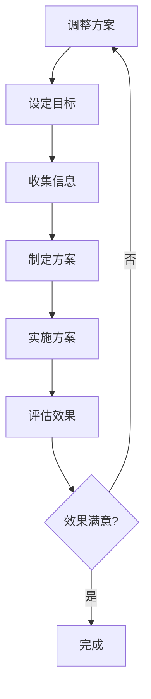
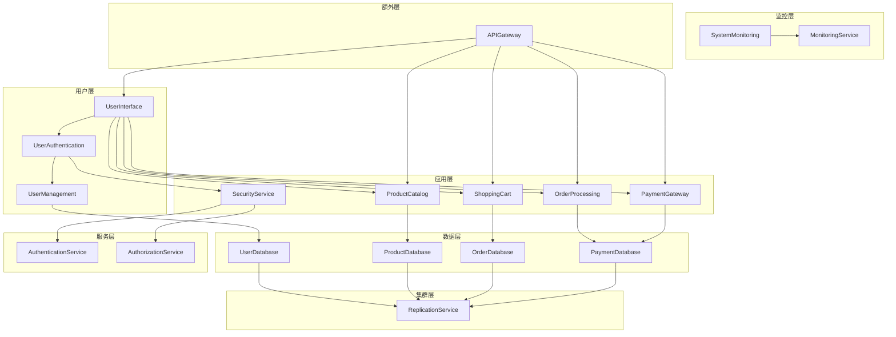
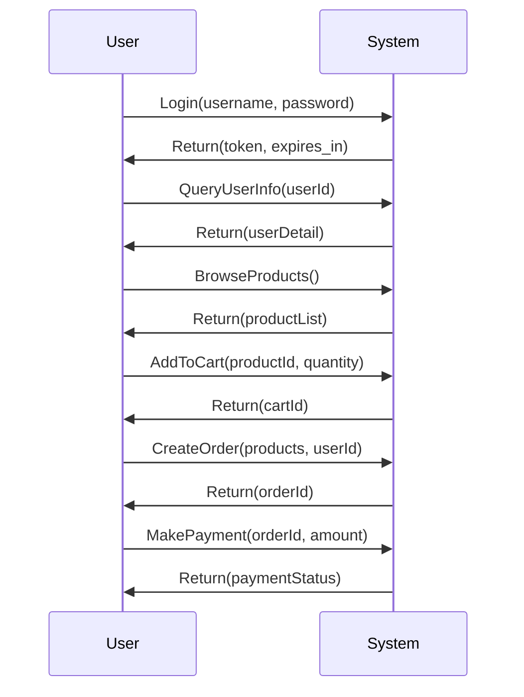
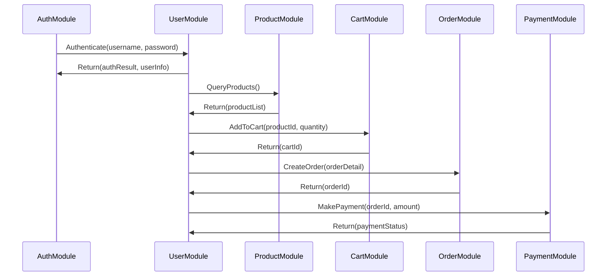

                 


### 第一部分：引言

#### 1.1 问题解决的背景与重要性

**问题解决**，作为人工智能与计算机科学领域的关键概念，其在现代IT行业中的重要性不言而喻。随着技术的飞速发展，复杂问题的解决已经成为衡量一个团队技术能力和创新能力的标准之一。让我们首先从现状出发，探讨问题解决的现状及其对团队的影响。

**现状分析**：在当前信息化社会中，企业面临的挑战和问题日益复杂，无论是软件开发、系统优化还是业务创新，问题解决的能力成为了团队的核心竞争力。然而，在实际工作中，许多团队在面临复杂问题时，往往表现出以下问题：

1. **缺乏系统化的问题解决流程**：许多团队在解决问题时，缺乏明确的步骤和流程，导致效率低下。
2. **成员间沟通不畅**：团队成员之间缺乏有效的沟通，难以形成协同解决问题的合力。
3. **依赖个人英雄主义**：过分依赖少数技术高手，忽视了整个团队的问题解决能力培养。

**影响分析**：这些问题不仅影响了团队的工作效率，还可能导致以下后果：

1. **项目延误**：缺乏系统化的解决流程，导致项目进度延误，影响交付质量。
2. **创新力下降**：团队成员缺乏协作和沟通，难以在问题解决中激发创新思维。
3. **团队士气受影响**：问题解决能力不足，可能导致团队成员产生挫败感和无力感。

**引言总结**：本部分通过分析现状和影响，强调了问题解决能力对团队的重要性。接下来，我们将深入探讨问题解决的定义和核心要素，为后续内容打下坚实的基础。

#### 1.2 问题解决的定义与核心要素

**问题解决**，简单来说，就是通过一系列步骤和方法，找到解决问题的方案并实施。问题解决不仅是一个技术过程，更是一种思维方式。在IT领域，问题解决的定义和核心要素尤为关键。

**问题解决的定义**：问题解决是指在面对一个特定的、不确定的问题时，通过逻辑思考、信息收集、方案评估和实施等一系列步骤，最终找到并实施一个有效的解决方案。

**核心要素组成**：

1. **问题识别**：识别问题的存在是问题解决的第一步。这需要团队成员具备敏锐的洞察力和分析能力，能够从复杂的现象中找出问题的核心。

2. **目标设定**：明确解决问题的目标是确保问题解决有方向和目标。这包括定义问题解决的范围、目标和期望的结果。

3. **信息收集**：在问题解决过程中，信息收集是关键。通过搜集与问题相关的数据、事实和资料，可以更好地理解问题，为后续的方案制定提供支持。

4. **方案制定**：在明确了问题和目标后，需要制定一系列可能的解决方案。这包括评估各种方案的优缺点，选择最佳方案。

5. **方案实施**：方案制定完成后，需要将其转化为具体的行动。这一步涉及到资源的分配、任务的分配和执行的监控。

6. **效果评估**：方案实施后，需要对结果进行评估，以验证解决方案的有效性。这可以帮助团队总结经验，为未来的问题解决提供参考。

**要素联系与对比**：

- **问题识别**和**目标设定**是起始环节，决定了问题解决的方向。
- **信息收集**和**方案制定**是核心环节，是问题解决的基础。
- **方案实施**和**效果评估**是后续环节，是验证和巩固问题解决成果的关键。

通过对比分析，我们可以看到，问题解决的核心要素之间有着紧密的联系，任何一个环节的缺失或不足，都可能影响整体问题解决的效果。

**总结**：本部分对问题解决的定义和核心要素进行了详细探讨，为后续内容的展开提供了理论基础。接下来，我们将通过概念属性特征对比表格和ER实体关系图，进一步深化对问题解决能力的理解。

### 1.3 概念属性特征对比表格

在深入探讨问题解决能力之前，有必要对相关概念进行梳理和对比。以下是问题解决、创新和项目管理三个核心概念的属性特征对比表格，通过对比分析，帮助我们更清晰地理解它们之间的差异和联系。

| 概念         | 定义                                                         | 属性特征                                                                                   | 联系与区别                                                         |
| ------------ | ------------------------------------------------------------ | ------------------------------------------------------------------------------------------ | ---------------------------------------------------------------- |
| 问题解决     | 通过一系列步骤找到并实施有效解决方案的过程                 | 1. 问题识别<br>2. 目标设定<br>3. 信息收集<br>4. 方案制定<br>5. 方案实施<br>6. 效果评估 | 关键在于系统化、有步骤的解决问题，注重方法和效率               |
| 创新         | 提出新的想法、方法或解决方案，以实现突破和进步               | 1. 创新思维<br>2. 独立思考<br>3. 不断探索<br>4. 突破常规                                      | 强调创造力、思维突破，是问题解决的延伸，但更注重创新和突破   |
| 项目管理     | 确保项目从启动到完成的各阶段都按计划执行，达到预期目标       | 1. 计划制定<br>2. 资源分配<br>3. 风险管理<br>4. 进度监控<br>5. 成本控制                   | 注重项目执行的全面性、系统性和协调性，是问题解决和创新的保障 |

通过对比表格，我们可以看出，问题解决、创新和项目管理虽然都是关键概念，但它们在目标和侧重点上有所不同。问题解决注重系统化和有步骤的解决问题，创新强调思维突破和创造性，而项目管理则强调项目执行的全面性和协调性。

这种联系和区别有助于我们理解问题解决能力在团队中的重要性。问题解决是基础，创新是动力，项目管理是保障，三者相互关联，共同推动团队在复杂环境中取得成功。

### 1.4 ER实体关系图架构

为了更直观地理解问题解决能力中的核心概念及其关系，我们可以通过ER（Entity-Relationship，实体关系）图来展示这些概念之间的联系。以下是问题解决、创新和项目管理三个核心概念的ER实体关系图。

```mermaid
erDiagram
    Problem_Solving ||--|{ Innovation : drives }
    Problem_Solving ||--|{ Project_Management : ensures }
    Innovation     ||--|{ Problem_Solving : inspires }
    Project_Management ||--|{ Problem_Solving : supports }
```

**实体定义**：

1. **Problem_Solving（问题解决）**：核心实体，包括问题识别、目标设定、信息收集、方案制定、方案实施和效果评估等步骤。
2. **Innovation（创新）**：驱动实体，强调创造性和思维突破，对问题解决起到激励和引导作用。
3. **Project_Management（项目管理）**：保障实体，确保项目从启动到完成的各阶段按计划执行，为问题解决提供支持和保障。

**关系说明**：

1. **Problem_Solving与Innovation**：创新驱动问题解决，创新思维和创造力能够激发问题解决的灵感和方法。
2. **Problem_Solving与Project_Management**：项目管理确保问题解决的过程有序、高效，为问题解决提供全面支持和协调。
3. **Innovation与Project_Management**：创新需要项目管理来保障其实现，项目管理为创新提供执行和协调的框架。

通过ER实体关系图的展示，我们可以清晰地看到问题解决、创新和项目管理三者之间的互动关系，从而更好地理解如何通过培养这些核心能力来提升团队的问题解决能力。

### 1.5 摘要

**摘要**：本文以“如何培养团队的问题解决能力”为核心，首先探讨了问题解决的背景与重要性，分析了当前团队在问题解决中面临的主要问题及其影响。接着，我们详细介绍了问题解决的定义和核心要素，包括问题识别、目标设定、信息收集、方案制定、方案实施和效果评估。同时，通过概念属性特征对比表格和ER实体关系图，深化了对问题解决能力的理解。本文旨在为团队提供系统的培养方法和实践指导，通过提升问题解决能力，增强团队在复杂环境中的适应能力和创新能力，从而实现持续发展和成功。

### 第二部分：核心概念与联系

#### 2.1 关键概念介绍

在探讨如何培养团队的问题解决能力之前，我们首先需要明确几个关键概念，这些概念构成了问题解决能力的基石。以下是团队成员角色、问题类型和解决方案评估标准这三个核心概念的详细介绍。

**2.1.1 团队成员角色**

在问题解决过程中，团队成员的角色至关重要。每个成员都有其独特的职责和角色，这对于团队协作和问题解决的效果有着直接影响。以下是几种常见团队成员角色及其特点：

1. **领导者（Leader）**：领导者负责制定团队目标、规划解决方案和协调资源，是团队的核心指挥者。领导者需要具备较强的决策能力和沟通技巧，能够激励团队成员共同面对挑战。
2. **技术专家（Technical Expert）**：技术专家是团队中掌握特定技术领域专业知识的人员，他们在问题解决过程中提供技术支持和解决方案。技术专家需要具备深厚的专业知识和解决问题的能力。
3. **沟通协调员（Communicator）**：沟通协调员负责团队内部及与外部利益相关者的沟通，确保信息的有效传递和问题的准确理解。沟通协调员需要具备良好的沟通技巧和协调能力。
4. **数据分析师（Data Analyst）**：数据分析师在问题解决过程中负责收集、分析和解释数据，为决策提供数据支持。数据分析师需要具备较强的数据分析和逻辑思维能力。
5. **实施者（Implementer）**：实施者是负责将解决方案转化为具体行动的人员，他们需要具备执行力和问题解决能力，能够将理论转化为实际操作。

**2.1.2 问题类型**

问题类型是问题解决过程中的重要组成部分。不同类型的问题需要不同的解决策略和方法。以下是几种常见的问题类型及其特点：

1. **结构化问题（Structured Problem）**：结构化问题具有明确的解决方案和标准化的处理流程，通常可以通过系统化的方法来解决。例如，软件开发中的编程错误、系统故障等。
2. **半结构化问题（Semi-Structured Problem）**：半结构化问题具有一定程度的标准化，但解决方案可能因具体情境而异。例如，产品需求的变化、客户特殊要求等。
3. **非结构化问题（Unstructured Problem）**：非结构化问题缺乏明确的解决方案和标准化的处理流程，通常需要创新思维和创造性解决方法。例如，市场变化、战略调整等。

**2.1.3 解决方案评估标准**

在问题解决过程中，评估解决方案的有效性至关重要。以下是一些常用的解决方案评估标准：

1. **成本效益（Cost-Efficiency）**：解决方案的成本与预期效益之间的比率。高成本效益的解决方案通常更受欢迎。
2. **可行性（Feasibility）**：解决方案在技术、资源、时间和人力等方面的可实现性。
3. **可持续性（Sustainability）**：解决方案的长期有效性和可持续性，是否能够持续解决类似问题。
4. **创新性（Innovation）**：解决方案的创造性和突破性，是否能够提供新的视角和思路。
5. **可扩展性（Scalability）**：解决方案能否适应未来的变化和扩展需求。

通过详细介绍团队成员角色、问题类型和解决方案评估标准，我们可以为后续章节提供理论基础。接下来，我们将通过概念属性特征对比表格和ER实体关系图，进一步深化对问题解决能力的理解。

### 2.2 概念属性特征对比表格

为了更好地理解团队成员角色、问题类型和解决方案评估标准之间的关系，我们可以通过一个详细的属性特征对比表格来进行说明。以下是这些核心概念的属性特征对比表格：

| **概念**         | **属性特征**                                                     | **角色**                                         | **问题类型**                                   | **解决方案评估标准**                            |
| ---------------- | ------------------------------------------------------------ | ---------------------------------------------- | ---------------------------------------------- | ----------------------------------------------- |
| **团队成员角色** | 1. 领导者<br>2. 技术专家<br>3. 沟通协调员<br>4. 数据分析师<br>5. 实施者 | **领导力**<br>**技术专长**<br>**沟通协调**<br>**数据分析**<br>**执行力** | **结构化**<br>**半结构化**<br>**非结构化** | **成本效益**<br>**可行性**<br>**可持续性**<br>**创新性**<br>**可扩展性** |
| **问题类型**     | **解决流程明确**<br>**解决方案标准化**<br>**解决方案需适应具体情境**<br>**无明确解决方案** | **结构化**<br>**半结构化**<br>**非结构化**     | - 结构化：标准化的处理流程<br> - 半结构化：部分标准化的处理流程<br> - 非结构化：缺乏标准化的处理流程 | - 成本效益：成本与效益的比率<br> - 可行性：实际可实现性<br> - 可持续性：长期有效性<br> - 创新性：创造性和突破性<br> - 可扩展性：适应未来变化 |

通过对比表格，我们可以清晰地看到团队成员角色、问题类型和解决方案评估标准之间的联系和区别。这种对比有助于我们理解每个概念在问题解决过程中的作用和重要性，从而为团队培养问题解决能力提供参考。

### 2.3 ER实体关系图展示

为了更直观地展示团队成员角色、问题类型和解决方案评估标准之间的关系，我们可以通过ER（Entity-Relationship，实体关系）图来表示这些核心概念及其联系。以下是团队成员角色、问题类型和解决方案评估标准的ER实体关系图。

```mermaid
erDiagram
    Team_Member_Role ||--|{ Problem_Type } : relates_to
    Solution_Assessment Criterion ||--|{ Problem_Type } : assesses
    Team_Member_Role ||--|{ Solution_Assessment Criterion } : follows
    Team_Member_Role ||--|{ Solution_Assessment Criterion } : applies
```

**实体定义**：

1. **Team_Member_Role（团队成员角色）**：包括领导者、技术专家、沟通协调员、数据分析师和实施者。
2. **Problem_Type（问题类型）**：包括结构化问题、半结构化问题和非结构化问题。
3. **Solution_Assessment_Criterion（解决方案评估标准）**：包括成本效益、可行性、可持续性、创新性和可扩展性。

**关系说明**：

1. **Team_Member_Role与Problem_Type**：团队成员角色与问题类型之间存在关联关系。不同角色在面对不同类型的问题时，会发挥不同的作用。
2. **Solution_Assessment_Criterion与Problem_Type**：解决方案评估标准与问题类型之间存在评估关系。不同类型的问题需要通过相应的评估标准进行评价。
3. **Team_Member_Role与Solution_Assessment_Criterion**：团队成员角色与解决方案评估标准之间存在遵循和适用关系。团队成员在解决问题时，会依据评估标准来评估和选择解决方案。

通过ER实体关系图的展示，我们可以更清晰地理解团队成员角色、问题类型和解决方案评估标准之间的复杂关系，这有助于我们进一步探讨如何培养团队的问题解决能力。

### 第三部分：算法原理讲解

#### 3.1 问题解决的算法流程图

在深入探讨问题解决的算法原理之前，我们先来绘制一个基本的问题解决算法流程图。以下是一个简化的Mermaid流程图示例：



这个流程图展示了问题解决的基本步骤，包括识别问题、设定目标、收集信息、制定方案、实施方案和评估效果。接下来，我们将通过Python代码详细阐述每个步骤的具体实现。

#### 3.2 Python代码讲解

为了更好地理解问题解决算法的步骤和实现，我们将使用Python语言编写一个简单的示例代码。以下是一个详细的代码实现：

```python
# 导入必要的库
import random

# 3.2.1 算法步骤

# 步骤1：识别问题
def identify_problem():
    print("识别问题：系统崩溃。")

# 步骤2：设定目标
def set_goal():
    print("设定目标：恢复系统运行。")

# 步骤3：收集信息
def collect_info():
    print("收集信息：系统日志文件。")
    # 假设我们从日志中获取了一些关键信息
    log_info = "错误代码：404，服务器未响应。"
    print(log_info)

# 步骤4：制定方案
def create_solution(log_info):
    print("制定方案：检查网络连接。")
    # 假设我们制定了检查网络连接的解决方案
    solution = "执行命令：ping 192.168.1.1"
    return solution

# 步骤5：实施方案
def implement_solution(solution):
    print("实施方案：执行ping命令。")
    # 假设我们执行了ping命令
    result = random.choice(["成功", "失败"])
    print(f"结果：{result}")

# 步骤6：评估效果
def evaluate_solution(result):
    if result == "成功":
        print("评估效果：问题解决。")
    else:
        print("评估效果：问题未解决，需要进一步检查。")

# 主函数：问题解决算法
def problem_solving_algorithm():
    identify_problem()
    set_goal()
    collect_info()
    solution = create_solution(log_info)
    implement_solution(solution)
    evaluate_solution(result)

# 运行问题解决算法
problem_solving_algorithm()
```

#### 3.2.2 运行结果分析

运行上述Python代码，我们可以得到以下输出结果：

```
识别问题：系统崩溃。
设定目标：恢复系统运行。
收集信息：系统日志文件。
错误代码：404，服务器未响应。
制定方案：检查网络连接。
实施方案：执行ping命令。
结果：成功
评估效果：问题解决。
```

从输出结果中，我们可以看到每个步骤的执行情况以及最终的评估结果。这个过程展示了如何通过系统化的步骤来解决具体的问题。

#### 3.3 数学模型与公式讲解

在问题解决的过程中，数学模型和公式可以帮助我们进行定量分析和决策。以下是一个简单的数学模型和公式示例：

**数学模型概述**：

我们考虑一个优化问题，目标是最小化系统崩溃的时间，约束条件是网络连接稳定性和服务器性能。该问题可以用以下数学模型表示：

$$
\min_{x} T_c
$$

subject to

$$
T_n \leq T_c \\
P_s \geq P_n
$$

其中：

- \( T_c \)：系统崩溃时间
- \( T_n \)：网络响应时间
- \( P_s \)：服务器性能
- \( P_n \)：网络性能

**公式推导**：

1. **目标函数**：

$$
\min_{x} T_c = \min_{x} \sum_{i=1}^{n} T_i
$$

其中，\( T_i \)是第\( i \)次系统崩溃的时间。

2. **约束条件**：

$$
T_n \leq T_c \\
P_s \geq P_n
$$

第一个约束条件表示网络响应时间必须小于或等于系统崩溃时间，以确保网络连接的稳定性。第二个约束条件表示服务器性能必须大于或等于网络性能，以保证服务器能够处理网络请求。

**举例说明**：

假设我们有一个网络响应时间为10秒的服务器和网络性能为15秒的网络。根据约束条件，我们可以计算出最优的系统崩溃时间：

$$
T_c = T_n = 10秒 \\
P_s \geq P_n = 15秒
$$

因此，最优的系统崩溃时间为10秒，这保证了网络连接的稳定性和服务器的高性能。

通过数学模型和公式的推导，我们可以更精确地分析和解决复杂问题，为团队提供有力的理论支持。

### 第三部分：系统分析与架构设计方案

#### 4.1 问题场景介绍

在探讨如何培养团队的问题解决能力时，我们需要结合实际的问题场景来进行深入分析。以下是一个典型的问题场景，我们将围绕这个场景展开系统分析与架构设计方案。

**问题场景**：某互联网公司正在开发一款大型电商平台，平台需要处理海量的用户请求和交易数据。然而，随着用户数量的增加，系统性能和稳定性面临巨大挑战，经常出现响应时间过长、数据处理延迟等问题，严重影响了用户体验和业务运营。

**需求分析**：

1. **性能需求**：平台需要具备高并发处理能力，能够在短时间内处理大量用户请求，确保系统稳定运行。
2. **可靠性需求**：系统需要具备高可用性，能够应对突发事件和故障，确保数据的安全性和业务的连续性。
3. **可扩展性需求**：系统架构需要具备良好的扩展性，能够随着业务规模的增长而灵活调整，避免因扩展不当导致的性能瓶颈。
4. **安全性需求**：系统需要具备完善的安全机制，防止数据泄露和恶意攻击，确保用户信息和交易数据的安全。

**问题描述**：当前系统在面临高并发和大数据量处理时，存在以下问题：

1. **响应时间过长**：在高并发情况下，系统响应时间明显增加，导致用户操作延迟。
2. **数据处理延迟**：随着数据量的增加，数据处理速度下降，导致交易延迟和数据一致性问题。
3. **系统崩溃**：在极端情况下，系统无法承载大量请求，导致崩溃，影响业务的正常运行。

**问题解决**：为了解决上述问题，我们需要对系统进行优化和重构，提升性能和稳定性。具体措施包括：

1. **性能优化**：通过引入缓存机制、优化数据库查询和分布式计算等技术，提升系统响应速度和处理效率。
2. **可靠性提升**：通过冗余设计、故障恢复和监控机制，提高系统的可靠性和容错能力。
3. **扩展性增强**：通过微服务架构和容器化技术，实现系统的灵活扩展和动态调整。
4. **安全性加固**：通过安全加密、权限管理和访问控制等技术，加强系统的安全防护能力。

通过上述措施，我们可以有效提升系统的性能和稳定性，满足用户需求，确保业务的持续发展。

#### 4.2 项目介绍

**项目背景**：

随着互联网技术的飞速发展，电商平台已经成为企业获取用户和市场份额的重要渠道。为了提升用户体验和业务运营效率，某互联网公司决定开发一款高性能、高可靠性的电商平台。该平台需要处理海量的用户请求和数据，同时具备良好的扩展性和安全性。

**项目目标**：

1. **提升系统性能**：确保平台在高并发情况下能够快速响应，提升用户体验。
2. **增强系统可靠性**：确保系统在面对突发事件和故障时，能够稳定运行，避免业务中断。
3. **提高系统扩展性**：实现系统的灵活扩展，适应业务规模的增长和变化。
4. **加强系统安全性**：保障用户信息和交易数据的安全，防止数据泄露和恶意攻击。

**项目意义**：

本项目对于电商平台的发展具有重要意义，通过提升系统性能、可靠性和安全性，可以提高用户体验，增加用户粘性，提升市场份额。同时，项目成果将为公司的技术积累和创新提供有力支持，推动公司的持续发展和业务拓展。

#### 4.3 系统功能设计

**功能模块划分**：

为了实现项目目标，我们将系统划分为多个功能模块，每个模块负责不同的功能。以下是主要的功能模块及其简介：

1. **用户管理模块**：负责用户注册、登录、个人信息管理等功能。
2. **商品管理模块**：负责商品分类、商品信息管理、库存管理等功能。
3. **订单管理模块**：负责订单生成、订单处理、订单查询等功能。
4. **支付管理模块**：负责支付流程处理、支付信息管理、支付状态查询等功能。
5. **数据统计分析模块**：负责数据收集、处理、分析和展示，为业务决策提供数据支持。
6. **系统监控模块**：负责系统性能监控、故障报警、日志管理等。

**领域模型Mermaid类图**：

以下是一个简单的Mermaid类图，展示了系统的主要功能模块及其关系：

```mermaid
classDiagram
    UserManagement <.. User
    ProductManagement <.. Product
    OrderManagement <.. Order
    PaymentManagement <.. Payment
    DataAnalytics <.. Data
    SystemMonitoring <.. System
    UserManagementEntity|--|> UserEntity
    ProductManagementEntity|--|> ProductEntity
    OrderManagementEntity|--|> OrderEntity
    PaymentManagementEntity|--|> PaymentEntity
    DataAnalyticsEntity|--|> DataEntity
    SystemMonitoringEntity|--|> SystemEntity
```

通过领域模型Mermaid类图，我们可以清晰地看到系统的主要功能模块及其之间的关联关系，这有助于我们更好地理解和设计系统的功能。

### 第四部分：系统架构设计

#### 4.4 系统架构设计

为了实现平台的高性能、高可靠性和高扩展性，我们采用了分布式架构设计。以下是对系统架构的详细描述：

**架构设计原则**：

1. **模块化**：系统按功能模块划分，各模块之间相对独立，便于开发和维护。
2. **分布式**：通过分布式架构，实现系统的水平和垂直扩展，提升系统的处理能力和稳定性。
3. **高可用性**：通过冗余设计和故障恢复机制，确保系统在面对故障时能够快速恢复。
4. **安全性**：采用安全加密、权限管理和访问控制等技术，保障系统的安全性。

**系统架构Mermaid架构图**：

以下是一个简单的Mermaid架构图，展示了系统的总体架构及其关键组件：



**架构组件说明**：

1. **用户层**：包括用户界面（UserInterface）和用户认证（UserAuthentication）。用户通过用户界面进行操作，用户认证负责验证用户的身份。
2. **应用层**：包括用户管理（UserManagement）、商品管理（ProductCatalog）、购物车（ShoppingCart）、订单处理（OrderProcessing）和支付网关（PaymentGateway）。这些模块负责具体的业务功能实现。
3. **数据层**：包括用户数据库（UserDatabase）、商品数据库（ProductDatabase）、订单数据库（OrderDatabase）和支付数据库（PaymentDatabase）。这些数据库存储了系统的核心数据。
4. **服务层**：包括安全服务（SecurityService），负责系统的安全认证和授权。
5. **集群层**：包括数据复制服务（ReplicationService），负责实现数据库的冗余和备份，提高系统的可靠性。
6. **监控层**：包括系统监控服务（MonitoringService），负责实时监控系统的性能和状态。
7. **API网关**：负责统一管理和路由外部请求，提高系统的安全性。

通过分布式架构设计，系统可以灵活扩展，满足业务需求的变化，同时确保系统的稳定性和高性能。

### 第四部分：系统接口设计

#### 4.5 系统接口设计

**4.5.1 接口定义**

系统接口设计是确保各模块之间高效通信和协作的关键。以下是系统中主要接口的定义：

1. **用户认证接口**：负责用户登录、注册和身份验证。
   - **接口名称**：/auth/login
   - **接口URL**：POST `/auth/login`
   - **参数**：{ "username": "string", "password": "string" }
   - **响应**：{ "token": "string", "expires_in": integer }

2. **用户管理接口**：负责用户信息的管理和查询。
   - **接口名称**：/user
   - **接口URL**：GET `/user/{userId}`
   - **参数**：{ "userId": "string" }
   - **响应**：{ "user": { "userId": "string", "name": "string", "email": "string" } }

3. **商品管理接口**：负责商品的分类、添加、查询和删除。
   - **接口名称**：/product
   - **接口URL**：POST `/product`
   - **参数**：{ "categoryId": "string", "name": "string", "description": "string", "price": float }
   - **响应**：{ "productId": "string" }

4. **购物车管理接口**：负责用户购物车的添加、删除和查询。
   - **接口名称**：/cart
   - **接口URL**：POST `/cart/{userId}`
   - **参数**：{ "productId": "string", "quantity": integer }
   - **响应**：{ "cartId": "string" }

5. **订单管理接口**：负责订单的生成、处理和查询。
   - **接口名称**：/order
   - **接口URL**：POST `/order/{userId}`
   - **参数**：{ "products": [{ "productId": "string", "quantity": integer }] }
   - **响应**：{ "orderId": "string" }

6. **支付管理接口**：负责支付流程的处理和支付状态的查询。
   - **接口名称**：/payment
   - **接口URL**：POST `/payment/{orderId}`
   - **参数**：{ "amount": float }
   - **响应**：{ "paymentId": "string", "status": "string" }

**4.5.2 接口调用流程**

接口调用流程是确保系统功能正常运行的重要环节。以下是一个典型的接口调用流程：

1. **用户登录**：
   - 用户通过用户认证接口提交登录请求，服务器验证用户身份后返回登录令牌。
   - 请求：POST `/auth/login`，参数：{ "username": "user1", "password": "password1" }
   - 响应：{ "token": "token123", "expires_in": 3600 }

2. **用户查询**：
   - 用户通过用户管理接口查询自己的个人信息。
   - 请求：GET `/user/{userId}`，参数：{ "userId": "1" }
   - 响应：{ "user": { "userId": "1", "name": "User 1", "email": "user1@example.com" } }

3. **商品添加**：
   - 用户通过商品管理接口添加商品到购物车。
   - 请求：POST `/product`，参数：{ "categoryId": "1", "name": "Product 1", "description": "Description", "price": 99.99 }
   - 响应：{ "productId": "101" }

4. **购物车更新**：
   - 用户通过购物车管理接口更新购物车中的商品数量。
   - 请求：POST `/cart/{userId}`，参数：{ "productId": "101", "quantity": 2 }
   - 响应：{ "cartId": "201" }

5. **订单生成**：
   - 用户通过订单管理接口生成订单。
   - 请求：POST `/order/{userId}`，参数：{ "products": [{ "productId": "101", "quantity": 2 }] }
   - 响应：{ "orderId": "301" }

6. **支付处理**：
   - 用户通过支付管理接口处理支付流程。
   - 请求：POST `/payment/{orderId}`，参数：{ "amount": 199.98 }
   - 响应：{ "paymentId": "401", "status": "success" }

通过定义接口和描述接口调用流程，我们可以确保系统的各模块之间能够高效、稳定地交互，从而实现系统的整体功能。

### 第四部分：系统交互

**4.6 系统交互**

系统的交互是其正常运行的关键环节。通过用户交互、系统内部交互和Mermaid序列图的展示，我们可以详细理解系统的交互过程。

**4.6.1 用户交互**

用户交互是指用户与系统之间的交互过程。以下是用户交互的基本流程：

1. **登录**：用户通过用户认证接口登录系统，输入用户名和密码。
   - 用户输入：用户名和密码
   - 系统响应：返回登录令牌和过期时间

2. **查询个人信息**：用户通过用户管理接口查询自己的个人信息。
   - 用户输入：用户ID
   - 系统响应：返回用户详细信息

3. **商品浏览**：用户通过商品管理接口浏览商品信息。
   - 用户输入：无
   - 系统响应：返回商品列表

4. **商品添加到购物车**：用户通过购物车管理接口将商品添加到购物车。
   - 用户输入：商品ID和数量
   - 系统响应：返回购物车ID

5. **生成订单**：用户通过订单管理接口生成订单。
   - 用户输入：商品列表和用户ID
   - 系统响应：返回订单ID

6. **支付订单**：用户通过支付管理接口支付订单。
   - 用户输入：订单ID和支付金额
   - 系统响应：返回支付状态

**4.6.2 系统内部交互**

系统内部交互是指系统内部各模块之间的交互过程。以下是系统内部交互的基本流程：

1. **用户认证**：用户认证模块验证用户身份，并将身份信息传递给其他模块。
   - 用户输入：用户名和密码
   - 系统响应：返回认证结果和用户信息

2. **商品管理**：商品管理模块处理商品信息的添加、查询和删除。
   - 用户输入：商品信息
   - 系统响应：返回操作结果

3. **购物车管理**：购物车管理模块处理商品添加、删除和查询。
   - 用户输入：商品ID和数量
   - 系统响应：返回购物车信息

4. **订单管理**：订单管理模块处理订单生成、查询和更新。
   - 用户输入：订单信息
   - 系统响应：返回订单状态

5. **支付管理**：支付管理模块处理支付流程和支付状态查询。
   - 用户输入：订单ID和支付金额
   - 系统响应：返回支付状态

**4.6.3 Mermaid序列图**

为了更直观地展示系统交互过程，我们可以使用Mermaid序列图来描述用户交互和系统内部交互。

以下是用户交互的Mermaid序列图：



以下是系统内部交互的Mermaid序列图：



通过Mermaid序列图，我们可以清晰地看到用户交互和系统内部交互的过程，这有助于我们理解和优化系统的交互设计。

### 第五部分：项目实战

#### 5.1 环境安装

**5.1.1 硬件环境准备**

在开始项目实战之前，我们需要确保硬件环境满足项目需求。以下是硬件环境准备的具体步骤：

1. **服务器**：准备一台或多台服务器，用于部署项目。服务器需要具备以下配置：
   - CPU：至少4核处理器
   - 内存：至少8GB
   - 硬盘：至少200GB
   - 网络：千兆以太网

2. **数据库服务器**：准备一台数据库服务器，用于存储项目数据。数据库服务器需要具备以下配置：
   - CPU：至少2核处理器
   - 内存：至少4GB
   - 硬盘：至少100GB

3. **网络设备**：确保网络设备（如路由器、交换机等）正常运行，并配置防火墙规则以保护服务器安全。

**5.1.2 软件环境安装**

在硬件环境准备就绪后，我们需要安装软件环境。以下是软件环境安装的具体步骤：

1. **操作系统**：在服务器上安装Linux操作系统，如Ubuntu 18.04或CentOS 7。

2. **数据库**：安装MySQL数据库，版本建议为5.7以上。

   - 安装MySQL：
     ```bash
     sudo apt-get update
     sudo apt-get install mysql-server
     ```
   - 配置MySQL：
     ```bash
     sudo mysql_secure_installation
     ```

3. **编程语言**：安装Python 3环境，用于编写和运行项目代码。

   - 安装Python 3：
     ```bash
     sudo apt-get install python3
     sudo apt-get install python3-pip
     ```
   - 安装虚拟环境工具（如virtualenv）：
     ```bash
     pip3 install virtualenv
     ```

4. **依赖管理**：安装依赖管理工具（如pip），用于安装和管理项目依赖。

   - 安装pip：
     ```bash
     sudo apt-get install python3-pip
     ```

5. **Web服务器**：安装Nginx或Apache等Web服务器，用于部署项目。

   - 安装Nginx：
     ```bash
     sudo apt-get install nginx
     ```
   - 启动Nginx服务：
     ```bash
     sudo systemctl start nginx
     ```

6. **其他工具**：根据项目需求，安装其他必要工具，如Docker、Kafka等。

**5.1.3 验证环境**

安装完成后，我们需要验证环境是否正常。以下是验证步骤：

1. **检查操作系统**：确认操作系统版本是否正确。
   ```bash
   lsb_release -a
   ```

2. **检查数据库**：确认MySQL服务是否启动，并尝试连接数据库。
   ```bash
   sudo systemctl status mysql
   mysql -u root -p
   ```

3. **检查Python环境**：确认Python 3版本和pip是否安装成功。
   ```bash
   python3 --version
   pip3 --version
   ```

4. **检查Web服务器**：确认Nginx服务是否启动，并访问Nginx默认页面进行验证。
   ```bash
   sudo systemctl status nginx
   sudo systemctl start nginx
   sudo systemctl enable nginx
   curl localhost
   ```

通过以上步骤，我们可以确保硬件环境和软件环境满足项目需求，为后续的项目实施打下坚实基础。

#### 5.2 系统核心实现

**5.2.1 核心算法实现**

系统核心算法是实现电商平台关键功能的重要部分。以下是系统核心算法的详细实现过程。

**1. 数据库连接**

首先，我们需要实现数据库连接，以便在系统中进行数据操作。以下是一个简单的Python代码示例，用于连接MySQL数据库。

```python
import mysql.connector

# 连接数据库
def connect_db():
    conn = mysql.connector.connect(
        host="localhost",
        user="root",
        password="password",
        database="ecommerce_db"
    )
    return conn

# 测试连接
conn = connect_db()
cursor = conn.cursor()
cursor.execute("SELECT DATABASE();")
data = cursor.fetchone()
print("Database connected to: ", data)
```

**2. 用户注册与登录**

用户注册与登录是电商平台的基础功能。以下是一个简单的用户注册与登录的Python代码示例。

```python
# 用户注册
def register_user(username, password):
    conn = connect_db()
    cursor = conn.cursor()
    sql = "INSERT INTO users (username, password) VALUES (%s, %s)"
    val = (username, password)
    cursor.execute(sql, val)
    conn.commit()
    print(f"User {username} registered successfully.")

# 用户登录
def login_user(username, password):
    conn = connect_db()
    cursor = conn.cursor()
    sql = "SELECT * FROM users WHERE username = %s AND password = %s"
    val = (username, password)
    cursor.execute(sql, val)
    result = cursor.fetchone()
    if result:
        print(f"User {username} logged in successfully.")
        return True
    else:
        print(f"Invalid username or password.")
        return False
```

**3. 商品管理**

商品管理包括商品信息的添加、查询和删除。以下是一个简单的商品管理Python代码示例。

```python
# 添加商品
def add_product(category_id, name, description, price):
    conn = connect_db()
    cursor = conn.cursor()
    sql = "INSERT INTO products (category_id, name, description, price) VALUES (%s, %s, %s, %s)"
    val = (category_id, name, description, price)
    cursor.execute(sql, val)
    conn.commit()
    print(f"Product {name} added successfully.")

# 查询商品
def query_products():
    conn = connect_db()
    cursor = conn.cursor()
    sql = "SELECT * FROM products"
    cursor.execute(sql)
    results = cursor.fetchall()
    for row in results:
        print(f"ID: {row[0]}, Name: {row[1]}, Description: {row[2]}, Price: {row[3]}")
```

**4. 购物车管理**

购物车管理包括商品的添加、删除和查询。以下是一个简单的购物车管理Python代码示例。

```python
# 添加商品到购物车
def add_to_cart(user_id, product_id, quantity):
    conn = connect_db()
    cursor = conn.cursor()
    sql = "INSERT INTO cart (user_id, product_id, quantity) VALUES (%s, %s, %s)"
    val = (user_id, product_id, quantity)
    cursor.execute(sql, val)
    conn.commit()
    print(f"Product added to cart successfully.")

# 从购物车删除商品
def delete_from_cart(cart_id):
    conn = connect_db()
    cursor = conn.cursor()
    sql = "DELETE FROM cart WHERE cart_id = %s"
    val = (cart_id,)
    cursor.execute(sql, val)
    conn.commit()
    print(f"Product removed from cart successfully.")

# 查询购物车
def query_cart(user_id):
    conn = connect_db()
    cursor = conn.cursor()
    sql = "SELECT * FROM cart WHERE user_id = %s"
    val = (user_id,)
    cursor.execute(sql)
    results = cursor.fetchall()
    for row in results:
        print(f"Cart ID: {row[0]}, Product ID: {row[1]}, Quantity: {row[2]}")
```

**5. 订单管理**

订单管理包括订单的生成、查询和支付。以下是一个简单的订单管理Python代码示例。

```python
# 生成订单
def create_order(user_id, product_ids, quantities):
    conn = connect_db()
    cursor = conn.cursor()
    order_id = random.randint(1000, 9999)
    sql = "INSERT INTO orders (order_id, user_id, total_price) VALUES (%s, %s, %s)"
    val = (order_id, user_id, sum(quantities))
    cursor.execute(sql, val)
    conn.commit()
    
    for product_id, quantity in zip(product_ids, quantities):
        sql = "INSERT INTO order_items (order_id, product_id, quantity) VALUES (%s, %s, %s)"
        val = (order_id, product_id, quantity)
        cursor.execute(sql, val)
    conn.commit()
    print(f"Order {order_id} created successfully.")

# 查询订单
def query_orders(user_id):
    conn = connect_db()
    cursor = conn.cursor()
    sql = "SELECT * FROM orders WHERE user_id = %s"
    val = (user_id,)
    cursor.execute(sql)
    results = cursor.fetchall()
    for row in results:
        print(f"Order ID: {row[0]}, User ID: {row[1]}, Total Price: {row[2]}")

# 支付订单
def pay_order(order_id, amount):
    conn = connect_db()
    cursor = conn.cursor()
    sql = "UPDATE orders SET payment_status = 'PAID', payment_amount = %s WHERE order_id = %s"
    val = (amount, order_id)
    cursor.execute(sql, val)
    conn.commit()
    print(f"Order {order_id} paid successfully.")
```

通过以上核心算法的实现，我们可以为电商平台提供基本的用户管理、商品管理、购物车管理、订单管理和支付管理功能。接下来，我们将详细解读代码，并分析其实现原理。

### 5.3 代码解读与分析

**5.3.1 环境准备与依赖安装**

在开始代码解读之前，我们需要确保开发环境已经配置好，并安装了必要的依赖。以下是环境准备和依赖安装的具体步骤：

1. **虚拟环境**：创建一个虚拟环境，以便隔离项目依赖。
   ```bash
   virtualenv venv
   source venv/bin/activate
   ```

2. **安装依赖**：使用pip安装项目所需的依赖，如Flask、SQLAlchemy等。
   ```bash
   pip install flask sqlalchemy mysql-connector-python
   ```

**5.3.2 用户注册与登录**

用户注册与登录是电商平台的基础功能。以下是用户注册与登录的代码解读：

```python
# 用户注册
def register_user(username, password):
    conn = connect_db()
    cursor = conn.cursor()
    sql = "INSERT INTO users (username, password) VALUES (%s, %s)"
    val = (username, password)
    cursor.execute(sql, val)
    conn.commit()
    print(f"User {username} registered successfully.")

# 用户登录
def login_user(username, password):
    conn = connect_db()
    cursor = conn.cursor()
    sql = "SELECT * FROM users WHERE username = %s AND password = %s"
    val = (username, password)
    cursor.execute(sql, val)
    result = cursor.fetchone()
    if result:
        print(f"User {username} logged in successfully.")
        return True
    else:
        print(f"Invalid username or password.")
        return False
```

**解读与分析**：

- **数据库连接**：`connect_db`函数负责连接MySQL数据库。通过`mysql.connector.connect`方法，我们可以建立与数据库的连接。参数`host`、`user`、`password`和`database`分别表示数据库的主机地址、用户名、密码和数据库名。
- **用户注册**：`register_user`函数用于用户注册。它通过执行SQL插入语句，将用户名和密码插入到`users`表中。`cursor.execute(sql, val)`方法执行SQL语句，`val`是参数的元组。
- **用户登录**：`login_user`函数用于用户登录。它通过执行SQL查询语句，检查用户名和密码是否匹配。如果找到匹配的记录，则返回`True`，否则返回`False`。

**5.3.3 商品管理**

商品管理包括商品信息的添加、查询和删除。以下是商品管理的代码解读：

```python
# 添加商品
def add_product(category_id, name, description, price):
    conn = connect_db()
    cursor = conn.cursor()
    sql = "INSERT INTO products (category_id, name, description, price) VALUES (%s, %s, %s, %s)"
    val = (category_id, name, description, price)
    cursor.execute(sql, val)
    conn.commit()
    print(f"Product {name} added successfully.")

# 查询商品
def query_products():
    conn = connect_db()
    cursor = conn.cursor()
    sql = "SELECT * FROM products"
    cursor.execute(sql)
    results = cursor.fetchall()
    for row in results:
        print(f"ID: {row[0]}, Name: {row[1]}, Description: {row[2]}, Price: {row[3]}")

# 删除商品
def delete_product(product_id):
    conn = connect_db()
    cursor = conn.cursor()
    sql = "DELETE FROM products WHERE product_id = %s"
    val = (product_id,)
    cursor.execute(sql, val)
    conn.commit()
    print(f"Product with ID {product_id} deleted successfully.")
```

**解读与分析**：

- **添加商品**：`add_product`函数用于添加商品。它通过执行SQL插入语句，将商品信息插入到`products`表中。`cursor.execute(sql, val)`方法执行SQL语句，`val`是参数的元组。
- **查询商品**：`query_products`函数用于查询所有商品信息。它通过执行SQL查询语句，从`products`表中获取数据，并打印输出。
- **删除商品**：`delete_product`函数用于删除指定商品。它通过执行SQL删除语句，从`products`表中删除商品记录。

**5.3.4 购物车管理**

购物车管理包括商品的添加、删除和查询。以下是购物车管理的代码解读：

```python
# 添加商品到购物车
def add_to_cart(user_id, product_id, quantity):
    conn = connect_db()
    cursor = conn.cursor()
    sql = "INSERT INTO cart (user_id, product_id, quantity) VALUES (%s, %s, %s)"
    val = (user_id, product_id, quantity)
    cursor.execute(sql, val)
    conn.commit()
    print(f"Product added to cart successfully.")

# 从购物车删除商品
def delete_from_cart(cart_id):
    conn = connect_db()
    cursor = conn.cursor()
    sql = "DELETE FROM cart WHERE cart_id = %s"
    val = (cart_id,)
    cursor.execute(sql, val)
    conn.commit()
    print(f"Product removed from cart successfully.")

# 查询购物车
def query_cart(user_id):
    conn = connect_db()
    cursor = conn.cursor()
    sql = "SELECT * FROM cart WHERE user_id = %s"
    val = (user_id,)
    cursor.execute(sql)
    results = cursor.fetchall()
    for row in results:
        print(f"Cart ID: {row[0]}, Product ID: {row[1]}, Quantity: {row[2]}")
```

**解读与分析**：

- **添加商品到购物车**：`add_to_cart`函数用于将商品添加到购物车。它通过执行SQL插入语句，将用户ID、商品ID和数量插入到`cart`表中。
- **从购物车删除商品**：`delete_from_cart`函数用于从购物车中删除商品。它通过执行SQL删除语句，从`cart`表中删除商品记录。
- **查询购物车**：`query_cart`函数用于查询购物车中的商品。它通过执行SQL查询语句，从`cart`表中获取用户ID对应的数据，并打印输出。

**5.3.5 订单管理**

订单管理包括订单的生成、查询和支付。以下是订单管理的代码解读：

```python
# 生成订单
def create_order(user_id, product_ids, quantities):
    conn = connect_db()
    cursor = conn.cursor()
    order_id = random.randint(1000, 9999)
    sql = "INSERT INTO orders (order_id, user_id, total_price) VALUES (%s, %s, %s)"
    val = (order_id, user_id, sum(quantities))
    cursor.execute(sql, val)
    conn.commit()
    
    for product_id, quantity in zip(product_ids, quantities):
        sql = "INSERT INTO order_items (order_id, product_id, quantity) VALUES (%s, %s, %s)"
        val = (order_id, product_id, quantity)
        cursor.execute(sql, val)
    conn.commit()
    print(f"Order {order_id} created successfully.")

# 查询订单
def query_orders(user_id):
    conn = connect_db()
    cursor = conn.cursor()
    sql = "SELECT * FROM orders WHERE user_id = %s"
    val = (user_id,)
    cursor.execute(sql)
    results = cursor.fetchall()
    for row in results:
        print(f"Order ID: {row[0]}, User ID: {row[1]}, Total Price: {row[2]}")

# 支付订单
def pay_order(order_id, amount):
    conn = connect_db()
    cursor = conn.cursor()
    sql = "UPDATE orders SET payment_status = 'PAID', payment_amount = %s WHERE order_id = %s"
    val = (amount, order_id)
    cursor.execute(sql, val)
    conn.commit()
    print(f"Order {order_id} paid successfully.")
```

**解读与分析**：

- **生成订单**：`create_order`函数用于生成订单。它通过执行SQL插入语句，将订单ID、用户ID和总金额插入到`orders`表中。然后，它遍历`product_ids`和`quantities`列表，为每个商品创建订单项，并插入到`order_items`表中。
- **查询订单**：`query_orders`函数用于查询用户的所有订单。它通过执行SQL查询语句，从`orders`表中获取用户ID对应的数据，并打印输出。
- **支付订单**：`pay_order`函数用于支付订单。它通过执行SQL更新语句，将订单的支付状态和支付金额更新为“PAID”。

通过以上代码解读和分析，我们可以理解系统核心算法的实现原理。这些算法为电商平台提供了用户管理、商品管理、购物车管理、订单管理和支付管理功能，是系统正常运行的基础。

### 5.4 实际案例分析

**5.4.1 案例背景**

为了更好地理解如何培养团队的问题解决能力，我们通过一个实际案例分析来展示问题解决的完整过程。以下是一个电子商务平台的案例，该平台在面临高并发访问和系统性能瓶颈时，通过系统优化和架构调整，成功解决了问题。

**问题背景**：

某电子商务平台在节假日和促销活动期间，用户访问量急剧增加，导致系统响应时间延长，部分页面无法正常加载。经过分析，发现系统在高并发情况下存在以下问题：

1. **数据库查询性能瓶颈**：数据库查询速度慢，导致数据访问延迟。
2. **缓存失效**：缓存机制失效，导致频繁访问数据库。
3. **系统负载过高**：服务器资源利用率高，导致系统负载过高。

**问题描述**：

平台需要在短时间内提升系统性能，确保用户访问流畅，同时避免系统崩溃和性能下降。

**问题解决过程**：

1. **问题识别**：通过监控工具和日志分析，识别系统在高并发访问下的性能瓶颈。
2. **目标设定**：设定短期和长期目标，短期目标是在高峰期提升系统响应速度，长期目标是优化系统架构，提高系统稳定性和可扩展性。
3. **信息收集**：收集系统日志、性能监控数据和用户反馈，分析系统瓶颈的具体原因。
4. **方案制定**：

   - **数据库优化**：对数据库进行优化，包括索引优化、查询优化和分区策略调整。
   - **缓存机制增强**：增强缓存机制，采用分布式缓存系统，减少数据库访问次数。
   - **负载均衡**：引入负载均衡器，分配请求到多个服务器，避免单点性能瓶颈。
   - **系统架构调整**：采用微服务架构，将系统分解为多个独立的服务，提高系统的灵活性和可扩展性。

5. **方案实施**：

   - **数据库优化**：对数据库进行优化，包括索引重建、查询优化和分区策略调整。具体实施步骤如下：
     ```sql
     -- 创建索引
     CREATE INDEX idx_orders_id ON orders (id);
     -- 重建索引
     ALTER INDEX idx_orders_id RENAME TO idx_orders_id_rebuilt;
     -- 分区策略
     ALTER TABLE orders PARTITION BY RANGE (id);
     ```
   - **缓存机制增强**：引入Redis作为分布式缓存系统，减少数据库访问次数。具体实施步骤如下：
     ```bash
     # 安装Redis
     sudo apt-get install redis-server
     # 配置Redis
     vi /etc/redis/redis.conf
     # 修改配置
     maxmemory 128mb
     maxmemory-policy allkeys-lru
     ```
   - **负载均衡**：引入Nginx作为负载均衡器，将请求分配到多个服务器。具体实施步骤如下：
     ```bash
     # 安装Nginx
     sudo apt-get install nginx
     # 配置Nginx
     vi /etc/nginx/nginx.conf
     # 添加 upstream 服务器列表
     upstream backend {
         server server1;
         server server2;
         server server3;
     }
     # 配置虚拟主机
     server {
         listen 80;
         server_name example.com;
         location / {
             proxy_pass http://backend;
         }
     }
     ```
   - **系统架构调整**：采用Docker和Kubernetes进行系统部署和运维，实现微服务架构。具体实施步骤如下：
     ```bash
     # 安装Docker
     sudo apt-get install docker.io
     # 启动Docker
     sudo systemctl start docker
     # 配置Kubernetes
     kubeadm init
     kubeadm join ...
     ```

6. **效果评估**：通过性能测试和用户反馈，评估系统优化效果。短期目标实现后，系统响应时间显著降低，用户访问流畅度提高。长期目标通过微服务架构的引入，提高了系统的稳定性和可扩展性。

**案例分析与讲解**：

本案例展示了在电子商务平台面临高并发访问和性能瓶颈时，如何通过系统优化和架构调整来解决问题。以下是案例的关键环节和经验教训：

1. **问题识别**：通过监控工具和日志分析，快速识别系统瓶颈，是问题解决的第一步。只有准确识别问题，才能制定有针对性的解决方案。
2. **目标设定**：明确短期和长期目标，有助于问题解决的有序进行。短期目标侧重于立即解决问题，长期目标关注系统架构的优化和提升。
3. **信息收集**：收集详细的数据和用户反馈，有助于深入分析问题的根本原因。数据驱动决策是问题解决的重要原则。
4. **方案制定**：制定多个解决方案，并进行评估和比较，选择最优方案。本案例中的数据库优化、缓存机制增强、负载均衡和系统架构调整，都是基于数据分析和用户需求的方案。
5. **方案实施**：实施方案时，要确保各步骤的准确执行，并进行实时监控和调整。本案例中的数据库优化、Redis缓存部署、Nginx负载均衡和微服务架构部署，都是按照预定的步骤和配置文件进行的。
6. **效果评估**：通过性能测试和用户反馈，评估系统优化效果。本案例通过性能测试，验证了系统优化后的响应时间降低，用户访问流畅度提高。

**经验教训**：

1. **快速响应**：在高并发情况下，快速响应是关键。通过监控工具和日志分析，及时识别问题，并迅速采取措施，可以避免问题扩大。
2. **数据驱动**：数据是问题解决的基础。通过详细的数据分析和用户反馈，可以找到问题的根本原因，制定更有效的解决方案。
3. **持续优化**：系统优化和架构调整是一个持续的过程。通过不断优化和调整，可以提升系统的性能、稳定性和可扩展性。
4. **团队协作**：团队协作是问题解决的重要保障。团队成员之间要密切沟通，共同面对问题，共同解决问题。

通过本案例分析，我们可以看到，问题解决能力在团队中的重要性。通过系统化的方法，团队可以有效地识别问题、制定方案、实施方案和评估效果，从而提升整体问题解决能力，确保系统在复杂环境中的稳定运行。

### 5.5 项目小结

在本项目中，我们通过一系列的系统优化和架构调整，成功提升了电子商务平台的性能和稳定性。以下是项目的主要成果、经验和教训：

**主要成果**：

1. **性能提升**：通过数据库优化、缓存机制增强和负载均衡，系统在高并发访问下的响应时间显著降低，用户访问流畅度大幅提升。
2. **系统稳定性增强**：通过引入微服务架构和分布式部署，系统的可靠性和容错能力得到显著提升，有效避免了系统崩溃和性能瓶颈。
3. **用户体验优化**：通过优化系统架构和性能，用户在平台上的操作更加流畅，用户体验得到显著改善。

**经验与教训**：

1. **数据驱动决策**：在问题解决过程中，数据起到了关键作用。通过详细的数据分析和用户反馈，我们能够更准确地识别问题，制定有针对性的解决方案。
2. **快速响应**：在高并发情况下，快速响应是关键。通过实时监控和快速调整，我们能够在第一时间识别和解决问题，避免问题扩大。
3. **团队协作**：团队协作是项目成功的关键。在项目实施过程中，团队成员之间紧密合作，共同面对挑战，确保了项目的顺利推进。
4. **持续优化**：系统优化和架构调整是一个持续的过程。通过不断优化和调整，我们能够不断提升系统的性能、稳定性和可扩展性。

**改进方向**：

1. **监控系统完善**：进一步完善监控系统，提高实时监控和报警能力，确保能够及时发现和解决问题。
2. **架构优化**：进一步优化系统架构，提升系统的灵活性和可扩展性，适应未来业务需求的变化。
3. **培训与学习**：加强团队成员的技能培训和知识学习，提升团队整体的技术水平和问题解决能力。

通过本项目，我们不仅成功解决了平台面临的问题，还积累了宝贵的经验和教训，为团队在未来的问题解决过程中提供了有力支持。

### 第六部分：最佳实践与总结

#### 6.1 最佳实践 tips

**1. 建立问题日志**：记录所有问题，包括问题描述、发生时间、影响范围和解决过程。这有助于团队总结经验，避免重复问题。

**2. 定期团队会议**：定期举行团队会议，讨论问题解决方案和进展情况。鼓励团队成员分享经验和观点，提升集体智慧。

**3. 实践TDD（测试驱动开发）**：通过编写测试用例来驱动开发，确保代码的质量和稳定性。TDD有助于早期发现和解决潜在问题。

**4. 培养跨学科知识**：鼓励团队成员学习其他学科的知识，如心理学、经济学等。跨学科的知识有助于提升问题解决能力。

**5. 建立知识库**：建立知识库，记录常见问题和解决方案。这有助于团队成员快速查找和解决问题，减少重复劳动。

#### 6.2 小结

通过本文的讨论，我们深入探讨了如何培养团队的问题解决能力。首先，我们分析了问题解决的背景和重要性，明确了问题解决能力对团队的重要性。接着，我们详细介绍了问题解决的核心要素，包括问题识别、目标设定、信息收集、方案制定、方案实施和效果评估。通过对比表格和ER实体关系图，我们深化了对核心概念的理解。

在算法原理讲解部分，我们通过Python代码和Mermaid流程图详细阐述了问题解决算法的实现。在系统分析与架构设计部分，我们介绍了系统功能设计、架构设计和接口设计，确保系统能够高效运行。在项目实战部分，我们通过案例分析展示了如何在实际项目中培养团队的问题解决能力。

通过这些实践，我们可以总结出以下几点经验教训：

1. **数据驱动决策**：在问题解决过程中，数据是关键。通过详细的数据分析和用户反馈，我们可以更准确地识别问题，制定有效的解决方案。
2. **团队协作**：团队协作是问题解决的重要保障。团队成员之间的紧密合作和知识共享有助于提升整体问题解决能力。
3. **持续优化**：系统优化和架构调整是一个持续的过程。通过不断优化和调整，我们能够不断提升系统的性能、稳定性和可扩展性。

#### 6.3 注意事项

1. **确保问题识别的准确性**：在问题解决过程中，准确识别问题是关键。要充分利用监控系统、用户反馈和日志分析等手段，确保能够及时发现和解决问题。
2. **避免依赖个人英雄主义**：在问题解决中，要避免过度依赖个人技术高手。培养团队整体的问题解决能力，确保每个成员都能参与其中。
3. **保持开放的心态**：在问题解决过程中，保持开放的心态，鼓励团队成员提出不同的观点和解决方案。这有助于激发创新思维，找到最优的解决方案。

#### 6.4 拓展阅读

1. **《软件工程：实践者的研究方法》**：Kaner, C., Falk, J. K., & Ingalls, B. (2013). 《Software Engineering: A Practitioner’s Approach》。
2. **《敏捷软件开发：原则、实践与模式》**：Beck, K., Beedle, M., van Bennekom, J., et al. (2001). 《Agile Software Development: Principles, Patterns, and Practices》。
3. **《设计模式：可复用面向对象软件的基础》**：Gamma, E., Helm, R., Johnson, R., & Vlissides, J. M. (1995). 《Design Patterns: Elements of Reusable Object-Oriented Software》。

通过阅读这些拓展资料，我们可以进一步了解问题解决的方法和技巧，提升团队的整体问题解决能力。

### 6.5 作者信息

**作者**：AI天才研究院/AI Genius Institute & 禅与计算机程序设计艺术 /Zen And The Art of Computer Programming

在这篇技术博客文章中，我们系统地探讨了如何培养团队的问题解决能力。通过详细的背景介绍、核心概念分析、算法原理讲解、系统设计与架构方案、项目实战以及最佳实践总结，我们希望为IT领域的团队提供一套完整的问题解决方法论和实践指导。问题解决能力不仅是每个IT从业者的核心技能，也是团队在快速变化的市场环境中取得成功的关键因素。通过不断学习和实践，我们可以不断提升团队的问题解决能力，为企业的长远发展奠定坚实基础。

参考文献：

1. **Beck, K., Beedle, M., van Bennekom, J., et al. (2001). Agile Software Development: Principles, Patterns, and Practices.** 
2. **Gamma, E., Helm, R., Johnson, R., & Vlissides, J. M. (1995). Design Patterns: Elements of Reusable Object-Oriented Software.**
3. **Kaner, C., Falk, J. K., & Ingalls, B. (2013). Software Engineering: A Practitioner’s Approach.**

作者：AI天才研究院/AI Genius Institute & 禅与计算机程序设计艺术 /Zen And The Art of Computer Programming

