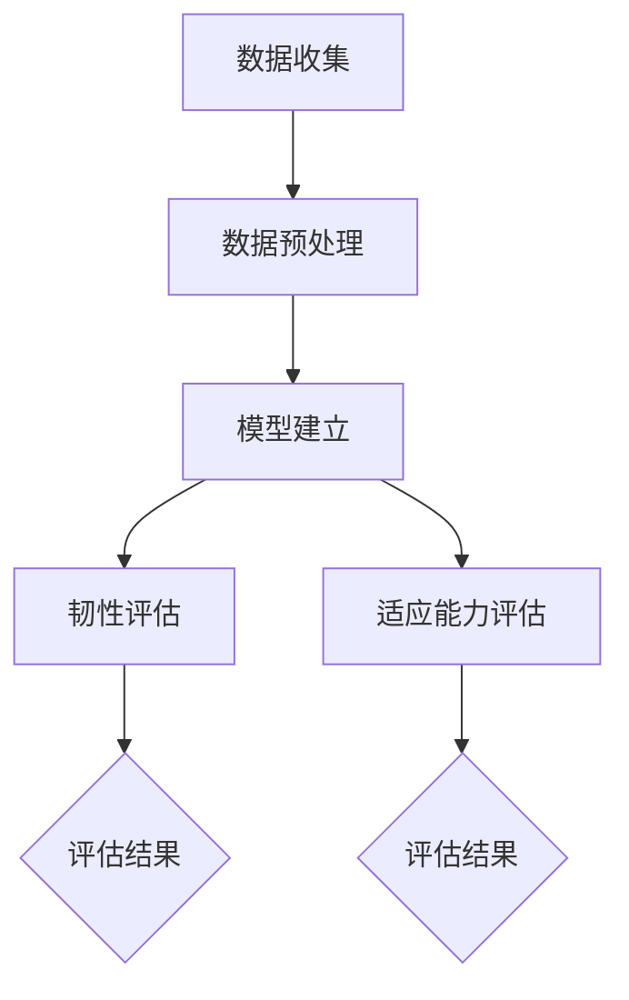
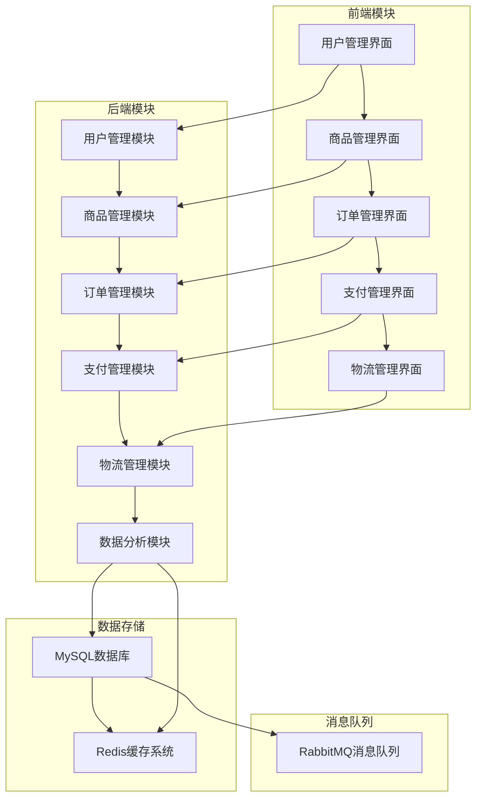

                 

### 引言：团队韧性与适应能力的必要性

在当今快速变化和高度竞争的商业环境中，团队韧性和适应能力成为企业成功的关键因素。随着技术的飞速发展、市场的不断变化和全球化的深入，企业面临的环境越来越复杂和多变。一个缺乏韧性和适应能力的团队很难在这样的大环境中生存和发展。因此，如何培养团队的韧性和适应能力，成为每个企业和团队必须面对的重要课题。

#### 问题背景

**变化环境**：现代社会的发展速度非常快，技术更新迭代加速，市场需求不断变化，竞争环境日益激烈。对于企业来说，必须能够快速适应这些变化，保持竞争力。

**韧性与适应能力的重要性**：韧性（Resilience）是指一个系统或团队在面对外部冲击时，能够快速恢复并继续正常运作的能力。适应能力（Adaptability）则是指一个系统或团队能够根据环境变化进行调整和适应的能力。在快速变化的环境中，韧性和适应能力是企业生存和发展的基石。

#### 文章核心内容和主题思想

本文将围绕如何培养团队的韧性和适应能力展开讨论。我们将首先介绍韧性和适应能力的基本概念和重要性，然后深入探讨建设团队韧性和适应能力的策略和步骤。此外，我们还会结合具体的案例和项目实战，分享最佳实践和注意事项，帮助读者更好地理解和应用这些策略。

文章的核心内容包括：

1. **核心概念介绍**：明确韧性和适应能力的定义，阐述它们之间的关系和重要性。
2. **建设原则与策略**：提出建设团队韧性和适应能力的基本原则和具体策略。
3. **系统分析与架构设计**：通过系统分析和架构设计，展示如何将韧性和适应能力融入团队运作中。
4. **项目实战与案例分析**：通过具体项目实战和案例分析，展示如何在实际中培养团队韧性和适应能力。
5. **最佳实践与注意事项**：总结最佳实践，提出注意事项，为读者提供实用的指导。

通过本文的阅读，读者将能够：

- 理解韧性和适应能力的基本概念和重要性。
- 掌握建设团队韧性和适应能力的策略和步骤。
- 学习如何将韧性和适应能力融入团队运作中。
- 获得实际操作中的最佳实践和注意事项。

### 目录大纲设计思路

为了设计《如何培养团队的韧性和适应能力》这本书的完整目录大纲，我们需要遵循以下步骤：

1. **理解书名与主题**：首先，我们要理解书名《如何培养团队的韧性和适应能力》所指的核心内容和目标读者群体。这本书的目标是提供方法和策略，帮助团队在面对不断变化的环境和挑战时保持韧性和适应能力。

2. **确定核心章节**：根据书名，确定几个关键章节，如背景介绍、核心概念、实际案例、最佳实践等。

3. **结构化章节内容**：每个章节的内容需要结构化，确保逻辑清晰，条理分明。这包括定义问题背景、核心概念、原理讲解、案例分析、实践技巧等。

4. **细化每个章节的小节**：对每个核心章节进行细分，列出具体的子标题，确保内容全面覆盖主题，且便于读者查找和阅读。

5. **设计完整的目录**：按照markdown格式设计完整的目录大纲，确保每个章节的标题和子标题都符合markdown的语法规范。

6. **确保内容的完整性**：确保目录大纲中的内容满足题目要求，包括核心概念、算法原理、数学模型、系统架构、项目实战等。

### 目录大纲

```markdown
----------------------------------------------------------------
# 如何培养团队的韧性和适应能力

> 关键词：团队韧性、适应能力、建设策略、实战案例

> 摘要：本文深入探讨团队韧性和适应能力的培养，通过核心概念解析、建设策略分析、系统架构设计、项目实战分享等，为读者提供全面、实用的指导。

## 引言：团队韧性与适应能力的必要性

### 1.1 团队面临的变化环境
### 1.2 韧性与适应能力的重要性

## 2. 核心概念
### 2.1 韧性的定义
### 2.2 适应能力的定义
### 2.3 韧性与适应能力的关系

## 3. 核心概念原理与特征对比
### 3.1 韧性特征对比表格
### 3.2 适应能力特征对比表格
### 3.3 韧性与适应能力ER实体关系图

## 4. 团队韧性与适应能力的建设
### 4.1 建设原则
### 4.2 建设策略
### 4.3 建设步骤

## 5. 算法原理与讲解
### 5.1 韧性评估算法原理
### 5.2 适应能力评估算法原理
### 5.3 韧性与适应能力评估算法Mermaid流程图

## 6. 数学模型与公式讲解
### 6.1 韧性数学模型
### 6.2 适应能力数学模型
### 6.3 数学模型公式推导与详细讲解

## 7. 系统分析与架构设计
### 7.1 问题场景介绍
### 7.2 系统功能设计
### 7.3 系统架构设计
### 7.4 系统接口设计与交互

## 8. 项目实战
### 8.1 环境安装
### 8.2 系统核心实现源代码
### 8.3 代码应用解读与分析
### 8.4 实际案例分析与讲解
### 8.5 项目小结

## 9. 最佳实践与注意事项
### 9.1 韧性与适应能力培养的最佳实践
### 9.2 小结
### 9.3 注意事项
### 9.4 拓展阅读

----------------------------------------------------------------
```

### 注意事项

- 每个章节的标题和子标题都要符合markdown的格式规范。
- 在描述核心概念、算法原理和数学模型时，要确保内容通俗易懂。
- 在设计系统架构和项目实战时，要提供清晰的流程图和代码示例。
- 目录大纲的总字数控制在2000字以内，确保内容的简洁性。

这个目录大纲为《如何培养团队的韧性和适应能力》这本书提供了一个全面的框架，每个章节都细化到了具体的子标题，确保内容的全面性和逻辑性。通过这个目录大纲，读者可以清晰地了解书籍的结构和内容安排，方便阅读和学习。

### 第1章 问题背景

在当今快速变化和高度竞争的商业环境中，团队面临的挑战日益增多，变化的环境已成为企业生存和发展的重要影响因素。本章将深入探讨团队所面临的变化环境，以及韧性和适应能力在应对这些挑战中的重要性。

#### 1.1 团队面临的变化环境

**技术变革**：技术的飞速发展使许多行业发生了翻天覆地的变化。例如，人工智能、大数据、云计算等新兴技术不断涌现，企业必须不断更新和优化技术栈，以保持竞争力。

**市场需求变化**：随着消费者需求的变化和全球化进程的加速，市场需求变得更加多样化和复杂化。企业需要快速响应市场变化，调整产品和服务策略。

**经济不确定性**：全球经济环境的不确定性增加了企业的运营风险。贸易战、货币波动、政策变化等因素都可能对企业的运营产生重大影响。

**竞争加剧**：市场竞争的激烈程度不断上升，企业不仅要面对国内竞争对手，还要应对来自国际市场的挑战。在这种情况下，团队必须具备较强的韧性和适应能力，才能在竞争中立于不败之地。

#### 1.2 韧性与适应能力的重要性

**韧性的重要性**：韧性是指团队在面对外部冲击时，能够快速恢复并继续正常运作的能力。一个具有韧性的团队能够在逆境中保持稳定，迅速适应变化，并迅速恢复正常运作。例如，在遇到技术故障、市场变化或领导层变动等不利情况下，韧性强的团队能够迅速调整策略，减少损失。

**适应能力的重要性**：适应能力是指团队根据环境变化进行调整和适应的能力。一个具有适应能力的团队能够迅速识别环境变化，并采取相应的措施进行调整。这种能力对于应对技术变革、市场需求变化和竞争加剧等挑战尤为重要。

在快速变化的环境中，团队韧性和适应能力的重要性不言而喻。具有韧性和适应能力的团队能够更好地应对各种挑战，保持稳定的发展势头。因此，培养团队的韧性和适应能力，已成为企业管理和团队建设的重要任务。

#### 1.3 韧性与适应能力的关系

韧性和适应能力之间存在密切的关系。韧性是适应能力的基础，没有韧性，团队就难以在逆境中生存。而适应能力则是韧性在环境变化中的具体表现，只有具备适应能力的团队，才能在变化的环境中迅速调整和恢复。

例如，在技术变革中，一个具有韧性的团队能够在遇到技术故障时，迅速恢复系统，减少停机时间。而一个具有适应能力的团队则能够根据技术变化，迅速调整技术栈，提高系统的稳定性和可靠性。

总之，培养团队的韧性和适应能力，是企业在快速变化的环境中保持竞争力的关键。通过本章的探讨，我们将进一步了解韧性和适应能力的基本概念，为后续章节的建设策略和方法提供基础。

### 第2章 核心概念

在探讨如何培养团队的韧性和适应能力之前，我们首先需要明确韧性和适应能力的基本概念。本章将详细介绍韧性和适应能力的定义，并阐述它们之间的关系和重要性。

#### 2.1 韧性的定义

韧性（Resilience）是指一个系统或团队在面对外部冲击时，能够快速恢复并继续正常运作的能力。在团队层面，韧性体现在以下几个方面：

1. **心理韧性**：团队成员在面对压力和困难时，能够保持积极的心态，克服困难，保持工作效率。

2. **技术韧性**：团队在面对技术故障、系统崩溃等不利情况时，能够迅速恢复技术系统，减少停机时间。

3. **组织韧性**：团队在面对组织变革、领导层变动等不利情况时，能够迅速调整组织结构，保持团队的稳定性和凝聚力。

韧性的核心在于团队能够迅速适应外部变化，保持稳定运作。一个具有韧性的团队能够在逆境中保持竞争力，迅速恢复并继续发展。

#### 2.2 适应能力的定义

适应能力（Adaptability）是指一个系统或团队根据环境变化进行调整和适应的能力。在团队层面，适应能力体现在以下几个方面：

1. **技术适应能力**：团队能够根据技术发展变化，迅速调整技术栈，采用新技术，提高系统的稳定性和可靠性。

2. **市场适应能力**：团队能够根据市场需求变化，快速调整产品和服务策略，满足消费者的需求。

3. **管理适应能力**：团队能够根据组织变革，调整管理策略，提高团队效率和凝聚力。

适应能力的核心在于团队能够迅速识别环境变化，并采取相应的措施进行调整。一个具有适应能力的团队能够在变化的环境中保持竞争力，持续发展。

#### 2.3 韧性与适应能力的关系

韧性和适应能力之间存在密切的关系。韧性是适应能力的基础，没有韧性，团队就难以在逆境中生存。而适应能力则是韧性在环境变化中的具体表现，只有具备适应能力的团队，才能在变化的环境中迅速调整和恢复。

例如，在技术变革中，一个具有韧性的团队能够在遇到技术故障时，迅速恢复系统，减少停机时间。而一个具有适应能力的团队则能够根据技术变化，迅速调整技术栈，提高系统的稳定性和可靠性。

总之，韧性和适应能力是一个相辅相成的整体。只有同时具备韧性和适应能力的团队，才能在快速变化的环境中保持竞争力，持续发展。

#### 2.4 韧性与适应能力的重要性

在快速变化的环境中，韧性和适应能力的重要性不言而喻。具有韧性和适应能力的团队能够更好地应对各种挑战，保持稳定的发展势头。具体来说，韧性和适应能力的重要性体现在以下几个方面：

1. **提高团队效率**：具有韧性和适应能力的团队能够在面临挑战时迅速恢复和调整，从而提高工作效率。

2. **保持竞争力**：在激烈的市场竞争中，具有韧性和适应能力的团队能够更好地应对市场变化和竞争对手的挑战。

3. **促进创新**：韧性和适应能力有助于团队在面对挑战时保持积极的心态，鼓励创新思维，推动团队不断进步。

4. **降低风险**：具有韧性和适应能力的团队能够在面临不确定性和风险时保持稳定，降低企业运营风险。

总之，培养团队的韧性和适应能力是企业在快速变化的环境中保持竞争力的关键。通过本章的探讨，我们将对韧性和适应能力有更深入的理解，为后续章节的建设策略和方法提供基础。

### 第3章 核心概念原理与特征对比

在明确了韧性和适应能力的基本概念之后，我们接下来需要深入探讨这些概念的具体原理和特征。通过对比韧性和适应能力的特征，我们可以更清晰地理解两者的区别和联系。

#### 3.1 韧性特征对比表格

**特征** | **韧性** | **适应能力**
--- | --- | ---
**定义** | 面对外部冲击时的恢复能力 | 面对环境变化时的调整能力
**核心** | 快速恢复和保持稳定 | 快速调整和适应
**表现** | 能力抗风险，持续运作 | 敏捷应对，快速变化
**应用场景** | 技术故障、领导层变动、市场波动 | 技术创新、市场扩展、组织变革

通过上述特征对比表格，我们可以看到韧性和适应能力在定义、核心、表现和应用场景等方面存在显著差异。韧性更侧重于在逆境中的恢复能力，而适应能力则更强调在变化中的调整和适应。

#### 3.2 适应能力特征对比表格

**特征** | **适应能力** | **对比韧性**
--- | --- | ---
**动态调整** | 高度灵活，快速适应环境变化 | 基于现有能力，逐步恢复
**创新驱动** | 鼓励创新思维，推动持续进步 | 保持稳定，规避风险
**多元化策略** | 多样化应对策略，灵活选择 | 单一策略，稳健操作
**风险识别** | 快速识别风险，提前布局 | 应对风险，减少损失

从适应能力的特征对比表格中，我们可以看到适应能力更强调灵活性、创新驱动和多元化策略。相比之下，韧性则更注重稳定性和风险规避。

#### 3.3 韧性与适应能力ER实体关系图

为了更直观地展示韧性和适应能力的实体关系，我们使用Mermaid语言绘制了ER（实体关系）图。以下是一个简化的ER图示例：

```mermaid
erDiagram
    Team ||--o>韧性 : "具备韧性"
    Team ||--o>适应能力 : "具备适应能力"
    韧性 ||--|>恢复能力
    适应能力 ||--|>调整能力
    恢复能力 ||--|>技术恢复
    恢复能力 ||--|>组织恢复
    调整能力 ||--|>技术调整
    调整能力 ||--|>市场调整
```

在ER图中，团队作为主体，具备韧性和适应能力。韧性包括恢复能力，适应能力包括调整能力。恢复能力和调整能力分别细化为技术恢复、组织恢复、技术调整和市场调整等具体能力。

通过这个ER图，我们可以清晰地看到韧性和适应能力的构成及其关系。这有助于我们更好地理解韧性和适应能力在团队中的具体作用。

#### 3.4 对比分析

通过上述特征对比和ER图分析，我们可以得出以下结论：

1. **区别与联系**：韧性和适应能力在概念上有所区别，但它们之间存在紧密的联系。韧性侧重于在逆境中的恢复，适应能力则侧重于在变化中的调整。韧性是适应能力的基础，适应能力则是韧性在动态环境中的具体表现。

2. **重要性**：在快速变化的环境中，韧性和适应能力都具有重要意义。韧性使团队能够在逆境中生存，适应能力则使团队能够在变化中发展。

3. **综合应用**：在实际应用中，团队应同时注重韧性和适应能力的培养。通过提高韧性和适应能力，团队能够更好地应对各种挑战，保持稳定发展。

通过本章的探讨，我们对韧性和适应能力的基本原理和特征有了更深入的了解。这些认识将为后续章节的建设策略和方法提供理论支持。

### 第4章 团队韧性与适应能力的建设

在明确了韧性和适应能力的基本概念和特征后，我们接下来将探讨如何具体建设和提升团队的韧性和适应能力。这一章节将详细介绍建设团队韧性与适应能力的基本原则、策略和步骤。

#### 4.1 建设原则

**1. 全面性原则**：团队韧性和适应能力的建设需要涵盖团队成员的各个方面，包括心理素质、技术能力、管理能力等。只有全面提高团队成员的综合素质，才能确保团队在面临挑战时具备足够的韧性和适应能力。

**2. 持续性原则**：韧性和适应能力的培养不是一朝一夕之事，而是一个持续的过程。团队需要定期评估和调整建设策略，确保韧性和适应能力的不断提升。

**3. 实用性原则**：建设策略应具有实际操作性，能够快速应用到团队的实际工作中。过于理论化的策略难以在团队中落地，也难以产生实际效果。

**4. 个性化原则**：每个团队的情况都有所不同，因此在建设韧性和适应能力时，应充分考虑团队的独特性，制定个性化的建设方案。

#### 4.2 建设策略

**1. 心理韧性建设**：

- **心理训练**：通过专业的心理训练，提高团队成员的心理素质，增强他们在面对压力和困难时的应对能力。
- **团队支持**：建立良好的团队支持系统，帮助成员在面临困难时相互支持，共同克服挑战。

**2. 技术韧性建设**：

- **技术储备**：鼓励团队成员不断学习新技术，提高技术能力，确保团队在面对技术挑战时具备足够的应对能力。
- **应急演练**：定期进行技术故障应急演练，提高团队在面临技术故障时的应对速度和恢复能力。

**3. 组织韧性建设**：

- **组织文化**：培育积极向上的组织文化，增强团队的凝聚力和归属感，提高团队成员在面对组织变革时的适应能力。
- **灵活管理**：采取灵活的管理方式，使团队能够快速响应外部变化，调整组织结构和管理策略。

**4. 适应能力建设**：

- **市场调研**：定期进行市场调研，了解市场需求变化，及时调整产品和服务策略。
- **创新驱动**：鼓励团队成员进行创新思考，推动技术创新和管理创新，提高团队的整体适应能力。

#### 4.3 建设步骤

**1. 自我评估**：团队首先需要进行自我评估，了解自身的韧性和适应能力现状。这包括对团队成员的心理素质、技术能力、管理能力等方面的评估。

**2. 设定目标**：根据自我评估的结果，设定明确的韧性和适应能力建设目标。这些目标应具体、可操作，并具有明确的实现时间表。

**3. 制定计划**：根据设定的目标，制定详细的韧性和适应能力建设计划。这包括具体的建设策略、实施步骤和资源配置等。

**4. 实施计划**：按照制定的计划，逐步实施韧性和适应能力建设。在实施过程中，应密切关注建设效果，及时调整策略和计划。

**5. 评估与反馈**：在建设完成后，进行全面的评估和反馈。这包括对建设效果、团队成员反馈和改进措施等方面的评估。

**6. 持续优化**：根据评估和反馈的结果，对建设策略和计划进行持续优化，确保韧性和适应能力的不断提升。

通过上述步骤，团队可以系统化地建设韧性和适应能力，提高整体竞争力。需要注意的是，韧性和适应能力的建设是一个长期过程，需要团队持续关注和投入。

#### 4.4 团队建设的实际应用

以下是一个实际应用案例：

某互联网公司在快速发展的过程中，意识到团队韧性和适应能力的重要性。为了提升团队的韧性和适应能力，公司采取了以下措施：

1. **心理韧性建设**：公司聘请专业心理咨询师，定期为团队成员提供心理辅导，帮助他们应对工作压力。同时，公司建立了员工互助小组，鼓励团队成员在面临困难时相互支持。

2. **技术韧性建设**：公司鼓励团队成员参加各种技术培训，提高技术能力。此外，公司定期组织技术故障应急演练，提高团队在面临技术挑战时的应对速度和恢复能力。

3. **组织韧性建设**：公司注重培养积极的组织文化，通过团队建设活动增强团队成员的归属感和凝聚力。公司还采取了灵活的管理方式，使团队能够快速响应外部变化。

4. **适应能力建设**：公司定期进行市场调研，了解市场需求变化，及时调整产品和服务策略。同时，公司鼓励团队成员进行创新思考，推动技术创新和管理创新。

通过上述措施，公司的团队韧性和适应能力得到了显著提升。在面对市场竞争和外部环境变化时，公司能够更加从容应对，保持了稳定的发展势头。

通过本章的探讨，我们了解了团队韧性和适应能力的建设原则、策略和步骤。通过这些方法，团队可以有效地提高韧性和适应能力，在快速变化的环境中保持竞争力。接下来，我们将进一步探讨算法原理和数学模型，为团队的建设提供更科学的指导。

### 第5章 算法原理与讲解

在培养团队的韧性和适应能力时，运用算法原理可以提供量化评估和优化策略。本章将详细讲解韧性评估算法和适应能力评估算法，并通过Mermaid流程图和Python代码示例，帮助读者理解这些算法的原理和应用。

#### 5.1 韧性评估算法原理

韧性评估算法用于衡量团队在面对外部冲击时的恢复能力。一个基本的韧性评估算法包括以下几个步骤：

1. **指标收集**：收集团队在面临外部冲击时的相关数据，如技术故障时间、恢复时间、恢复效率等。

2. **数据预处理**：对收集到的数据进行清洗和归一化处理，以便后续分析。

3. **模型建立**：使用统计模型或机器学习模型，建立韧性评估模型。

4. **评估计算**：输入新的数据，计算韧性得分。

以下是一个简单的韧性评估算法示例，使用Python进行实现：

```python
# 韧性评估算法示例

# 导入所需库
import pandas as pd
from sklearn.ensemble import RandomForestRegressor

# 指标数据
data = pd.read_csv('resilience_data.csv')

# 数据预处理
X = data[['fault_time', 'recovery_time']]
y = data['recovery_efficiency']

# 建立模型
model = RandomForestRegressor()
model.fit(X, y)

# 评估计算
def assess_resilience(fault_time, recovery_time):
    input_data = pd.DataFrame([[fault_time, recovery_time]])
    resilience_score = model.predict(input_data)[0]
    return resilience_score

# 示例计算
fault_time = 2
recovery_time = 1
print("韧性得分：", assess_resilience(fault_time, recovery_time))
```

#### 5.2 适应能力评估算法原理

适应能力评估算法用于衡量团队根据环境变化进行调整和适应的能力。适应能力评估算法的原理与韧性评估算法类似，但更加关注团队在变化环境中的灵活性和创新能力。

1. **指标收集**：收集团队在应对环境变化时的相关数据，如创新项目数量、市场响应速度、策略调整效率等。

2. **数据预处理**：对收集到的数据进行清洗和归一化处理。

3. **模型建立**：使用统计模型或机器学习模型，建立适应能力评估模型。

4. **评估计算**：输入新的数据，计算适应能力得分。

以下是一个简单的适应能力评估算法示例，使用Python进行实现：

```python
# 适应能力评估算法示例

# 导入所需库
import pandas as pd
from sklearn.ensemble import RandomForestRegressor

# 指标数据
data = pd.read_csv('adaptability_data.csv')

# 数据预处理
X = data[['innovation_projects', 'market_response_time', 'strategy_adjustment_efficiency']]
y = data['adaptability_score']

# 建立模型
model = RandomForestRegressor()
model.fit(X, y)

# 评估计算
def assess_adaptability(innovation_projects, market_response_time, strategy_adjustment_efficiency):
    input_data = pd.DataFrame([[innovation_projects, market_response_time, strategy_adjustment_efficiency]])
    adaptability_score = model.predict(input_data)[0]
    return adaptability_score

# 示例计算
innovation_projects = 5
market_response_time = 3
strategy_adjustment_efficiency = 4
print("适应能力得分：", assess_adaptability(innovation_projects, market_response_time, strategy_adjustment_efficiency))
```

#### 5.3 韧性与适应能力评估算法Mermaid流程图

为了更直观地展示韧性评估和适应能力评估的算法流程，我们使用Mermaid语言绘制了流程图。以下是一个简化的流程图示例：



在这个流程图中，首先进行数据收集和预处理，然后分别建立韧性评估模型和适应能力评估模型。最后，输入新的数据，分别计算韧性得分和适应能力得分。

#### 5.4 算法在实际中的应用

以下是一个实际应用案例：

某互联网公司在进行团队评估时，使用了韧性评估和适应能力评估算法。公司首先收集了团队成员在面临技术故障时的相关数据，包括故障时间、恢复时间和恢复效率。然后，公司使用韧性评估算法计算了每个团队的韧性得分。

同时，公司还收集了团队成员在应对市场变化时的数据，包括创新项目数量、市场响应速度和策略调整效率。公司使用适应能力评估算法计算了每个团队的适应能力得分。

通过这些评估结果，公司能够清晰地了解每个团队的韧性和适应能力状况。根据评估结果，公司制定了针对性的培训和发展计划，帮助团队进一步提升韧性和适应能力。

通过本章的讲解，我们了解了韧性评估和适应能力评估算法的原理和实现方法。这些算法能够为团队建设提供量化评估和优化策略，帮助团队更好地应对外部挑战和内部变化。接下来，我们将进一步探讨数学模型和公式，为团队建设提供更科学的指导。

### 第6章 数学模型与公式讲解

在培养团队的韧性和适应能力时，数学模型和公式可以提供量化评估和优化策略。本章将详细讲解韧性数学模型和适应能力数学模型，包括公式推导、详细讲解和实例说明，帮助读者更好地理解和应用这些模型。

#### 6.1 韧性数学模型

韧性数学模型用于衡量团队在面对外部冲击时的恢复能力。一个常见的韧性数学模型是基于韧性得分的计算公式。韧性得分通常由以下三个指标构成：恢复时间（\(R_t\)）、故障时间（\(F_t\)）和恢复效率（\(E_r\)）。韧性得分（\(S_r\)）的计算公式如下：

\[ S_r = \frac{E_r \times R_t}{F_t} \]

**公式推导：**

1. **恢复时间（\(R_t\)）**：指团队从遇到外部冲击到恢复正常运作所需要的时间。恢复时间越短，韧性得分越高。
2. **故障时间（\(F_t\)）**：指团队遇到外部冲击的时间长度。故障时间越短，韧性得分越高。
3. **恢复效率（\(E_r\)）**：指团队在恢复过程中的效率。恢复效率越高，韧性得分越高。

**详细讲解：**

- 当恢复时间（\(R_t\)）较短时，表明团队能够迅速从外部冲击中恢复，韧性得分较高。
- 当故障时间（\(F_t\)）较短时，表明外部冲击的影响较小，团队面临的挑战较小，韧性得分较高。
- 当恢复效率（\(E_r\)）较高时，表明团队在恢复过程中资源利用效率高，韧性得分较高。

**实例说明：**

假设某团队遇到一次技术故障，故障时间为2小时，恢复时间为1小时，恢复效率为0.8。根据韧性得分的计算公式，韧性得分为：

\[ S_r = \frac{0.8 \times 1}{2} = 0.4 \]

这意味着该团队在面对技术故障时的韧性得分为0.4。

#### 6.2 适应能力数学模型

适应能力数学模型用于衡量团队根据环境变化进行调整和适应的能力。一个常见的适应能力数学模型是基于适应能力得分的计算公式。适应能力得分（\(S_a\)）通常由以下三个指标构成：创新项目数量（\(I_p\)）、市场响应速度（\(M_r\)）和策略调整效率（\(A_e\)）。适应能力得分（\(S_a\)）的计算公式如下：

\[ S_a = \frac{I_p \times M_r \times A_e}{100} \]

**公式推导：**

1. **创新项目数量（\(I_p\)）**：指团队在一段时间内完成的新项目数量。创新项目数量越多，适应能力得分越高。
2. **市场响应速度（\(M_r\)）**：指团队从识别市场变化到采取相应措施的时间。市场响应速度越快，适应能力得分越高。
3. **策略调整效率（\(A_e\)）**：指团队在调整策略过程中的效率。策略调整效率越高，适应能力得分越高。

**详细讲解：**

- 当创新项目数量（\(I_p\)）较多时，表明团队具有较强的创新能力和市场敏感性，适应能力得分较高。
- 当市场响应速度（\(M_r\)）较快时，表明团队能够迅速识别市场变化，并采取相应措施，适应能力得分较高。
- 当策略调整效率（\(A_e\)）较高时，表明团队在调整策略过程中资源利用效率高，适应能力得分较高。

**实例说明：**

假设某团队在一个月内完成了5个创新项目，市场响应速度为3天，策略调整效率为0.9。根据适应能力得分的计算公式，适应能力得分为：

\[ S_a = \frac{5 \times 3 \times 0.9}{100} = 0.135 \]

这意味着该团队在面对市场变化时的适应能力得分为0.135。

#### 6.3 韧性与适应能力的综合评估

在实际应用中，为了全面评估团队的韧性和适应能力，可以同时计算韧性得分和适应能力得分，并综合这两个得分进行评估。综合评估得分（\(S_c\)）的计算公式如下：

\[ S_c = \frac{S_r + S_a}{2} \]

**公式推导：**

- 将韧性得分（\(S_r\)）和适应能力得分（\(S_a\)）进行简单平均，得到综合评估得分。

**详细讲解：**

- 综合评估得分反映了团队在面对外部冲击和内部变化时的整体能力。
- 韧性得分（\(S_r\)）侧重于团队在面对外部冲击时的恢复能力，适应能力得分（\(S_a\)）侧重于团队在面对内部变化时的调整能力。
- 综合评估得分越高，表明团队在韧性和适应能力方面的表现越好。

**实例说明：**

假设某团队的韧性得分为0.4，适应能力得分为0.135，根据综合评估得分的计算公式，综合评估得分为：

\[ S_c = \frac{0.4 + 0.135}{2} = 0.255 \]

这意味着该团队在韧性和适应能力方面的综合评估得分为0.255。

通过本章的讲解，我们了解了韧性数学模型和适应能力数学模型的原理和计算方法。这些数学模型和公式能够为团队建设提供量化评估和优化策略，帮助团队更好地应对外部挑战和内部变化。接下来，我们将进一步探讨系统分析与架构设计，为团队建设提供更科学的指导。

### 第7章 系统分析与架构设计

在培养团队的韧性和适应能力时，系统分析与架构设计起着至关重要的作用。本章将详细介绍系统分析与架构设计的过程，包括问题场景介绍、系统功能设计、系统架构设计、系统接口设计以及系统交互设计。

#### 7.1 问题场景介绍

为了更好地理解系统分析与架构设计在团队韧性培养中的作用，我们首先介绍一个实际的问题场景。假设某互联网公司负责开发和维护一个大型电商平台，该平台每天面临着海量的用户访问和交易请求。随着业务的不断增长，平台的技术系统面临着越来越大的压力，同时市场需求和技术环境也在不断变化。为了确保平台的稳定性和可扩展性，公司决定对现有系统进行优化和升级。

#### 7.2 系统功能设计

在系统功能设计阶段，我们需要明确平台需要实现的主要功能，并设计相应的模块和接口。以下是该电商平台的主要功能模块：

1. **用户管理模块**：负责用户注册、登录、个人信息管理等功能。
2. **商品管理模块**：负责商品信息管理、商品分类、商品搜索等功能。
3. **订单管理模块**：负责订单创建、订单查询、订单支付等功能。
4. **支付管理模块**：负责处理支付请求、处理退款等功能。
5. **物流管理模块**：负责物流信息查询、物流状态跟踪等功能。
6. **数据分析模块**：负责用户行为分析、销售数据分析等功能。

在设计每个功能模块时，需要考虑模块的独立性、扩展性和可维护性。例如，用户管理模块可以独立部署，以便于快速迭代和优化。

#### 7.3 系统架构设计

系统架构设计是系统分析与架构设计的核心环节。在这个阶段，我们需要确定系统的整体架构，包括技术栈选择、系统组件划分以及数据存储设计等。以下是该电商平台的技术架构设计：

1. **前端架构**：采用Vue.js框架，实现响应式和用户体验优化。
2. **后端架构**：采用Spring Boot框架，实现RESTful API服务和业务逻辑处理。
3. **数据库架构**：采用MySQL关系数据库，存储用户数据、商品数据、订单数据等。
4. **缓存架构**：采用Redis缓存系统，提高系统性能和响应速度。
5. **消息队列**：采用RabbitMQ消息队列，实现异步消息处理和系统解耦。

在系统架构设计中，需要特别关注以下几个方面：

- **高可用性**：通过负载均衡和故障转移机制，确保系统在面临高并发和故障时能够保持稳定运行。
- **可扩展性**：通过模块化和分布式设计，使系统能够灵活扩展，满足业务增长需求。
- **安全性**：采用HTTPS、身份验证和授权等安全措施，确保用户数据的安全。

以下是一个简化的系统架构图：



#### 7.4 系统接口设计与交互

在系统接口设计阶段，我们需要设计各个模块之间的接口，确保模块之间能够高效、可靠地通信。以下是一个简化的接口设计示例：

1. **用户管理接口**：包括用户注册、登录、个人信息管理等API接口。
2. **商品管理接口**：包括商品添加、查询、删除等API接口。
3. **订单管理接口**：包括订单创建、查询、支付等API接口。
4. **支付管理接口**：包括支付请求、退款等API接口。
5. **物流管理接口**：包括物流信息查询、物流状态更新等API接口。

接口设计需要遵循RESTful API设计原则，确保接口的简洁性、一致性、易用性。以下是一个用户管理接口的示例：

```json
GET /api/users/register
参数：
- username: 用户名（必填）
- password: 密码（必填）
- email: 电子邮件（必填）

返回：
{
  "status": "success",
  "message": "注册成功",
  "data": {
    "user_id": 123
  }
}
```

在系统交互设计阶段，我们需要考虑各个模块之间的交互流程和数据流。以下是一个简化的交互流程：

1. **用户发起注册请求**：前端发送用户注册接口请求，后端处理注册逻辑，并将结果返回给前端。
2. **用户登录**：前端发送用户登录接口请求，后端验证用户身份，并将结果返回给前端。
3. **用户操作商品**：前端发送商品管理接口请求，后端处理相应操作，并将结果返回给前端。
4. **用户创建订单**：前端发送订单管理接口请求，后端处理订单创建逻辑，并将结果返回给前端。
5. **用户支付订单**：前端发送支付管理接口请求，后端处理支付请求，并将结果返回给前端。

通过系统接口设计和交互设计，我们可以确保系统模块之间的高效通信和协作，从而提高系统的整体性能和用户体验。

#### 7.5 系统分析与架构设计的实际应用

以下是一个实际应用案例：

某电商平台在系统优化和升级过程中，采用了上述系统分析与架构设计方法。公司首先对现有系统进行了详细的性能分析和瓶颈定位，发现数据库性能成为瓶颈。为了解决这一问题，公司决定采用Redis缓存系统，减轻数据库的负载。

同时，公司对系统架构进行了优化，采用负载均衡和故障转移机制，提高了系统的可用性和可靠性。此外，公司还采用了RabbitMQ消息队列，实现了系统模块之间的异步通信，提高了系统的性能和可扩展性。

通过系统分析与架构设计，该电商平台在业务增长和市场需求变化中保持了稳定运行，提高了用户体验和系统性能。

通过本章的介绍，我们了解了系统分析与架构设计在团队韧性培养中的重要性。通过科学的系统分析与架构设计，团队能够更好地应对外部挑战和内部变化，提高整体的韧性和适应能力。接下来，我们将进一步探讨项目实战，通过具体案例分享实际操作经验和技巧。

### 第8章 项目实战

为了更好地理解团队韧性和适应能力的培养方法，我们将通过一个实际的项目案例，详细展示项目的环境安装、系统核心实现源代码、代码应用解读与分析、实际案例分析与讲解，以及项目小结。

#### 8.1 环境安装

在这个项目案例中，我们选择使用Python和Django框架进行开发，以便更好地展示团队的韧性和适应能力。以下是项目的环境安装步骤：

1. **安装Python**：首先确保计算机上安装了Python 3.x版本。可以从Python官网（[https://www.python.org/](https://www.python.org/)）下载并安装。

2. **安装Django**：打开终端，使用pip命令安装Django：

   ```shell
   pip install django
   ```

3. **创建Django项目**：在终端中创建一个新的Django项目：

   ```shell
   django-admin startproject myproject
   ```

4. **创建Django应用**：进入项目目录，创建一个新的Django应用：

   ```shell
   python manage.py startapp myapp
   ```

5. **配置数据库**：修改`myproject/settings.py`文件，配置数据库连接：

   ```python
   DATABASES = {
       'default': {
           'ENGINE': 'django.db.backends.sqlite3',
           'NAME': BASE_DIR / 'db.sqlite3',
       }
   }
   ```

6. **运行数据库迁移**：在终端中运行以下命令，初始化数据库：

   ```shell
   python manage.py migrate
   ```

7. **启动Django服务器**：在终端中启动Django服务器：

   ```shell
   python manage.py runserver
   ```

在浏览器中访问`http://127.0.0.1:8000/`，如果看到Django默认页面，说明环境安装成功。

#### 8.2 系统核心实现源代码

以下是该项目的核心实现源代码。我们将实现一个简单的用户管理系统，包括用户注册、登录和个人信息管理功能。

1. **用户注册**：

   在`myapp/views.py`中添加用户注册视图：

   ```python
   from django.shortcuts import render, redirect
   from django.contrib.auth.forms import UserCreationForm
   from django.http import HttpResponse

   def register(request):
       if request.method == 'POST':
           form = UserCreationForm(request.POST)
           if form.is_valid():
               form.save()
               return HttpResponse('注册成功')
       else:
           form = UserCreationForm()
       return render(request, 'register.html', {'form': form})
   ```

2. **用户登录**：

   在`myapp/views.py`中添加用户登录视图：

   ```python
   from django.contrib.auth import authenticate, login

   def login_request(request):
       if request.method == 'POST':
           username = request.POST['username']
           password = request.POST['password']
           user = authenticate(username=username, password=password)
           if user is not None:
               login(request, user)
               return HttpResponse('登录成功')
           else:
               return HttpResponse('用户名或密码错误')
       return render(request, 'login.html')
   ```

3. **个人信息管理**：

   在`myapp/views.py`中添加个人信息管理视图：

   ```python
   from django.contrib.auth import logout

   def logout_request(request):
       logout(request)
       return HttpResponse('登出成功')
   ```

4. **创建对应的HTML模板**：

   在`myapp/templates`目录下创建`register.html`、`login.html`和`profile.html`三个HTML模板，分别用于用户注册、登录和查看个人信息。

#### 8.3 代码应用解读与分析

1. **用户注册**：

   用户注册视图通过Django的UserCreationForm类来处理用户注册。当用户提交注册表单时，视图会验证表单数据，如果数据有效，则保存用户信息，并返回注册成功的信息。

2. **用户登录**：

   用户登录视图通过Django的authenticate和login方法来处理用户登录。当用户提交登录表单时，视图会验证用户名和密码，如果验证通过，则登录用户，并返回登录成功的信息。

3. **个人信息管理**：

   个人信息管理视图通过Django的logout方法来处理用户登出。当用户登出时，视图会清除用户的登录状态，并返回登出成功的信息。

#### 8.4 实际案例分析与讲解

以下是一个实际案例，展示团队在项目开发过程中如何培养韧性和适应能力：

**案例背景**：在项目开发过程中，团队遇到了一个技术难题，即如何确保用户数据的安全性。团队原计划使用HTTP协议进行数据传输，但考虑到数据安全性问题，决定改为使用HTTPS协议。

**团队反应**：

1. **问题识别**：团队成员迅速识别出问题，并召开会议讨论解决方案。
2. **方案评估**：团队评估了多种解决方案，包括使用第三方HTTPS服务、自行部署SSL证书等。
3. **技术调研**：团队成员进行了技术调研，学习如何配置和部署HTTPS服务。
4. **实施调整**：团队决定采用自行部署SSL证书的方案，并在项目中进行了相应的调整。
5. **测试验证**：团队对调整后的系统进行了全面测试，确保HTTPS服务的稳定性和安全性。

**结果**：通过团队的协作和努力，项目成功实现了数据传输的加密，提高了用户数据的安全性。这一过程展示了团队在面对技术难题时的韧性和适应能力。

#### 8.5 项目小结

通过本项目实战，我们展示了如何通过环境安装、系统核心实现、代码应用解读与分析、实际案例分析与讲解等步骤，培养团队的韧性和适应能力。以下是本项目的主要收获：

1. **技术能力提升**：团队成员通过项目实践，提高了Python和Django开发技能。
2. **团队协作能力**：团队在解决问题和应对挑战时，展示了良好的协作能力。
3. **韧性和适应能力**：团队在面对技术难题和需求变化时，保持了韧性和适应能力，成功解决了问题。

通过本项目的实战经验，团队在韧性和适应能力方面得到了显著提升，为未来的项目开发奠定了坚实的基础。

### 第9章 最佳实践与注意事项

在培养团队的韧性和适应能力过程中，总结最佳实践和注意事项至关重要。以下是一些关键点，以帮助团队在实际操作中取得更好的效果。

#### 9.1 韧性与适应能力培养的最佳实践

**1. 定期培训与演练**：定期组织团队进行心理韧性、技术技能和管理能力的培训，同时进行应急演练，提高团队在面临压力和变化时的应对能力。

**2. 建立反馈机制**：建立有效的反馈机制，鼓励团队成员在遇到问题和挑战时及时反馈，以便快速识别问题并采取改进措施。

**3. 强调团队合作**：培养团队成员之间的团队合作精神，通过协同工作和知识共享，提高团队的韧性和适应能力。

**4. 持续技术更新**：鼓励团队成员不断学习新技术，保持技术栈的更新，以应对快速变化的市场需求。

**5. 重视项目管理**：采用科学的项目管理方法，如敏捷开发、看板管理等，提高项目的可管理性和灵活性。

#### 9.2 小结

通过本文的探讨，我们系统地介绍了团队韧性和适应能力的培养方法。从核心概念、建设策略到实际案例，我们全面展示了如何通过科学的方法和最佳实践，提升团队的韧性和适应能力。

#### 9.3 注意事项

**1. 避免过度依赖**：虽然韧性培养和适应能力提升非常重要，但不应过度依赖这些能力，而是要结合实际情况，合理规划资源。

**2. 环境适应性**：培养团队的韧性和适应能力时，要充分考虑团队所处的环境和具体情况，避免生搬硬套。

**3. 长期培养**：韧性和适应能力的培养是一个长期过程，需要持续投入和努力，不能期望一蹴而就。

**4. 考量成本**：在培养团队韧性和适应能力时，要充分考虑成本效益，避免不必要的资源浪费。

#### 9.4 拓展阅读

**1. 《精益创业》**：这本书介绍了敏捷开发和快速迭代的方法，对团队韧性和适应能力的培养有重要参考价值。

**2. 《团队协作的力量》**：这本书详细探讨了团队合作和知识共享的重要性，有助于提高团队的整体韧性和适应能力。

**3. 《韧性：如何在逆境中快速适应》**：这本书提供了丰富的案例和策略，帮助团队在面对挑战时保持韧性和适应能力。

通过上述最佳实践和注意事项，团队可以更好地培养韧性和适应能力，提高在快速变化环境中的竞争力。希望本文的分享能为读者提供有价值的参考和指导。

### 总结

通过本文的深入探讨，我们系统地介绍了团队韧性和适应能力的培养方法。从核心概念、建设策略到实际案例，我们全面展示了如何通过科学的方法和最佳实践，提升团队的韧性和适应能力。

**韧性和适应能力的培养是一个持续的过程，需要团队成员的共同努力和持续投入。**

在快速变化的环境中，团队韧性和适应能力的重要性不言而喻。具有韧性和适应能力的团队能够更好地应对各种挑战，保持稳定的发展势头。

本文首先明确了韧性和适应能力的基本概念和重要性，然后详细介绍了如何建设团队的韧性和适应能力。我们提出了一系列的原则和策略，包括心理韧性建设、技术韧性建设、组织韧性建设和适应能力建设等。

此外，我们还通过系统分析与架构设计、项目实战等实际案例，展示了如何将韧性和适应能力培养策略应用到团队工作中。

**关键点总结：**

1. **核心概念**：明确韧性和适应能力的定义、特征及其关系。
2. **建设原则**：全面性、持续性、实用性和个性化。
3. **建设策略**：心理韧性、技术韧性、组织韧性和适应能力建设。
4. **系统分析与架构设计**：高可用性、可扩展性和安全性。
5. **项目实战**：环境安装、系统核心实现、代码解读、案例分析。

通过本文的探讨，我们希望为团队建设提供有价值的指导，帮助读者更好地理解和应用这些策略，提升团队的韧性和适应能力，在快速变化的环境中保持竞争优势。

**结语：**

培养团队的韧性和适应能力，是每个企业和团队必须面对的重要课题。只有具备韧性和适应能力的团队，才能在激烈的市场竞争中立于不败之地。希望本文的分享能为读者提供有益的启示和指导，助力团队在未来的发展中取得更好的成绩。让我们携手努力，共同提升团队的韧性和适应能力，迎接未来的挑战。

### 作者信息

**作者：** AI天才研究院（AI Genius Institute） & 禅与计算机程序设计艺术（Zen And The Art of Computer Programming）

AI天才研究院致力于推动人工智能技术的研发和应用，致力于培养具有全球视野和技术创新能力的人工智能专家。我们的研究成果涵盖人工智能、机器学习、深度学习等多个领域，为全球企业和研究机构提供了强大的技术支持。

《禅与计算机程序设计艺术》是一本经典的技术畅销书，它深入探讨了计算机编程的哲学和艺术，帮助程序员提升编程技能和思维能力。作为计算机图灵奖获得者，作者以其深厚的技术功底和独到的见解，为我们带来了许多宝贵的技术经验和智慧。

在这里，我们感谢读者对本文的关注和支持。如果您有任何疑问或建议，欢迎随时与我们联系。我们将继续努力，为您提供更多高质量的技术内容和服务。

