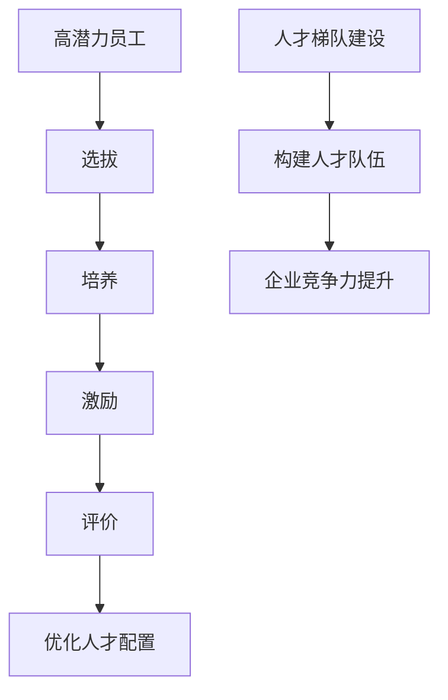
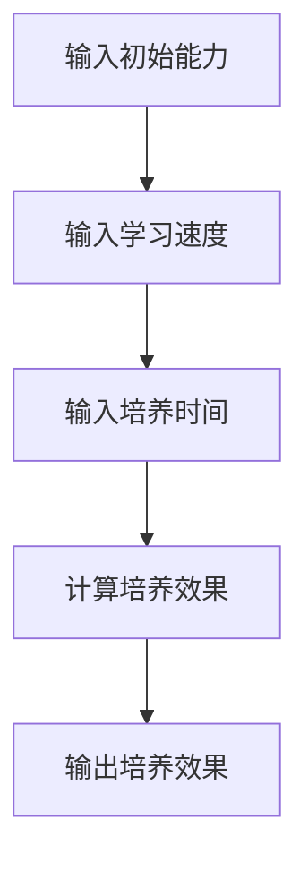
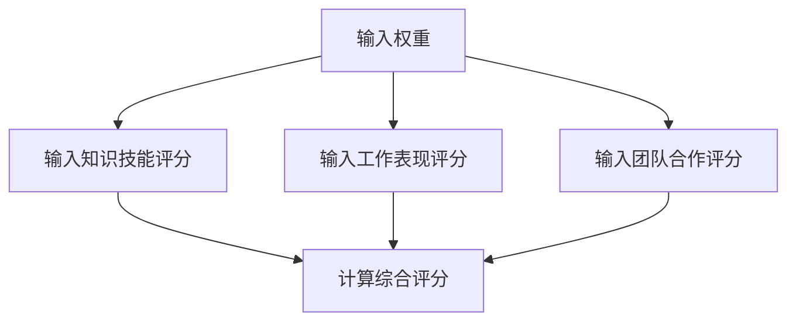

                 

### 第1章 问题背景

### 1.1 问题背景

在当今快速变化的市场环境中，企业之间的竞争已经从产品或服务的竞争转向了人才的竞争。高潜力员工的培养成为企业长期发展的关键。那么，究竟什么是高潜力员工？为什么企业需要培养他们？

**1.1.1 企业发展需求**

1. **核心竞争力提升**：
   企业在激烈的市场竞争中，需要不断提升自身的核心竞争力。高潜力员工是企业创新和发展的动力源泉，他们的专业知识和创新思维能够推动企业不断进步。

2. **持续创新动力**：
   高潜力员工往往具有出色的学习能力和创新能力，能够不断提出新的想法和解决方案，帮助企业保持竞争优势。

3. **人才储备**：
   企业需要有足够的人才储备，以应对未来可能出现的人才流失和市场变化。通过培养高潜力员工，企业可以提前布局，确保人才队伍的稳定和可持续发展。

**1.1.2 员工个人发展**

1. **职业成长**：
   员工在职业生涯中追求成长和进步，希望通过企业的培养和支持，不断提升自己的能力和职位。

2. **个人成就感**：
   高潜力员工希望通过实现自我价值，获得个人成就感和满足感。企业的培养计划能够为他们提供实现职业目标的机会。

3. **职业忠诚度**：
   企业的培养和支持可以提高员工对企业的忠诚度，减少人才流失，保持团队的稳定性。

### 1.2 问题解决

**1.2.1 人才梯队建设**

1. **明确需求**：
   企业需要明确对高潜力员工的需求，包括他们在未来可能承担的角色和所需的技能。

2. **制定培养策略**：
   根据需求，制定有针对性的培养策略，包括培训计划、导师制度、项目参与等。

3. **持续跟踪与评估**：
   对高潜力员工进行持续跟踪和评估，根据表现调整培养策略，确保培养效果。

**1.2.2 员工个人发展**

1. **个性化培养**：
   根据员工的特点和需求，提供个性化的培养计划，帮助员工实现职业目标。

2. **职业导师制**：
   为高潜力员工配备职业导师，提供职业规划和发展的指导。

3. **激励与奖励**：
   通过奖励和激励措施，激发高潜力员工的工作热情和创造力。

### 1.3 边界与外延

**1.3.1 高潜力员工的定义和标准**

1. **发展潜力**：
   高潜力员工需要具备持续学习和成长的潜力，能够快速适应新的环境和挑战。

2. **学习能力**：
   高潜力员工需要具备较强的学习能力，能够迅速掌握新知识和技能。

3. **创新能力**：
   高潜力员工需要具备创新能力，能够提出创新性的想法和解决方案。

4. **领导潜力**：
   高潜力员工需要具备一定的领导能力和团队影响力，能够在未来承担更高的职责。

**1.3.2 人才梯队建设的范围**

1. **员工选拔**：
   选择具有发展潜力的员工进入人才梯队。

2. **培养**：
   提供培训和发展机会，提升员工的专业能力和综合素质。

3. **激励**：
   通过奖励和激励措施，激发员工的工作热情和创造力。

4. **评价**：
   对员工进行定期评估，优化人才配置，确保培养效果。

### 1.4 概念结构与核心要素组成

**1.4.1 高潜力员工**

- **定义**：高潜力员工是指在企业中有可能成为高级管理者或专业领域专家的员工。
- **核心要素**：
  - 发展潜力
  - 学习能力
  - 创新能力
  - 领导潜力

**1.4.2 人才梯队建设**

- **定义**：人才梯队建设是指通过选拔、培养、激励、评价等手段，构建具有竞争力的员工队伍。
- **核心要素**：
  - 选拔
  - 培养
  - 激励
  - 评价

### 1.5 总结

高潜力员工的培养不仅是企业发展的需要，也是员工个人成长的必然要求。通过人才梯队建设，企业可以打造一支具有竞争力的人才队伍，为企业的长期发展提供坚实的保障。同时，也为员工提供了实现自我价值的机会，提升了员工的满意度和忠诚度。

---

**关键知识点回顾**：

- **企业发展需求**：提升核心竞争力、持续创新动力、人才储备。
- **员工个人发展**：职业成长、个人成就感、职业忠诚度。
- **人才梯队建设**：明确需求、制定策略、持续跟踪与评估。
- **高潜力员工**：发展潜力、学习能力、创新能力、领导潜力。
- **人才梯队建设范围**：选拔、培养、激励、评价。

---

**下一步**：深入探讨高潜力员工的概念和人才梯队建设的核心概念与联系。我们将对核心概念进行详细定义和属性特征对比，为后续的算法原理讲解和数学模型阐述打下坚实基础。

---

**思考问题**：

1. 你认为哪些特征是衡量一个员工是否有潜力成为高潜力员工的关键因素？
2. 你在职业生涯中遇到过哪些能够帮助你成为高潜力员工的培养和支持措施？
3. 企业在实施人才梯队建设时，可能会面临哪些挑战和障碍？你有什么建议？

---

**结论**：

在当前的市场环境中，培养高潜力员工是企业发展的必然选择。通过人才梯队建设，企业不仅能够提升自身的核心竞争力，还能够为员工提供广阔的职业发展空间。下一章，我们将深入探讨高潜力员工和人才梯队建设的核心概念，为后续的分析和讲解做好充分准备。让我们继续深入思考，一起探索如何更有效地培养和利用高潜力员工。# 第2章 核心概念与联系

在探讨如何培养高潜力员工的过程中，理解核心概念和它们之间的联系是至关重要的。本章将详细解释“高潜力员工”和“人才梯队建设”这两个关键概念，并通过属性特征对比表格和ER实体关系图架构的Mermaid流程图来进一步阐述它们之间的关系。

### 2.1 高潜力员工概念

#### 2.1.1 定义

高潜力员工（High Potential Employee，HPE）是指在企业中有可能成为高级管理者或专业领域专家的员工。这些员工通常具备以下特征：

1. **发展潜力**：能够快速适应新的环境和挑战，展现出持续成长的能力。
2. **学习能力**：具备快速学习和应用新知识的能力。
3. **创新能力**：能够提出创新性想法和解决方案，推动企业进步。
4. **领导潜力**：具备一定的领导能力和团队影响力，能够带领团队达成目标。

#### 2.1.2 属性特征对比

| 特征             | 描述                           |
|----------------|--------------------------------|
| 发展潜力         | 具有持续学习和成长的潜力。      |
| 学习能力         | 能够快速掌握新知识和技能。      |
| 创新能力         | 能够提出创新性想法和解决方案。  |
| 领导潜力         | 具备一定的领导能力和团队影响力。|

### 2.2 人才梯队建设概念

#### 2.2.1 定义

人才梯队建设（Talent Pool Development）是指通过一系列策略和手段，选拔、培养、激励和评价高潜力员工，构建一支具备竞争力的员工队伍。这一过程涉及以下几个核心要素：

1. **选拔**：识别和选择具有发展潜力的员工。
2. **培养**：提供培训和成长机会，提升员工能力。
3. **激励**：通过奖励和激励措施，激发员工积极性。
4. **评价**：对员工进行定期评估，优化人才配置。

#### 2.2.2 属性特征对比

| 特征             | 描述                           |
|----------------|--------------------------------|
| 选拔           | 选拔具有发展潜力的员工。        |
| 培养           | 提供培训和成长机会，提升员工能力。|
| 激励           | 给予奖励和激励，激发员工积极性。 |
| 评价           | 对员工进行评估，优化人才配置。   |

### 2.3 高潜力员工与人才梯队建设的联系

高潜力员工和人才梯队建设之间存在紧密的联系。高潜力员工是人才梯队建设的核心，而人才梯队建设则为高潜力员工提供了成长和发展的平台。

1. **高潜力员工是人才梯队建设的对象**：企业通过选拔具有高潜力的人才，进行系统的培养和评价，以构建一支高效的人才队伍。
2. **人才梯队建设是高潜力员工成长的保障**：通过人才梯队建设，企业可以提供个性化的培养计划和持续的支持，帮助高潜力员工实现职业目标。

#### 2.3.1 高潜力员工与人才梯队建设的Mermaid流程图



### 2.4 总结

通过本章的讨论，我们明确了高潜力员工和人才梯队建设的定义及其属性特征。高潜力员工是企业发展的关键，而人才梯队建设则为这些高潜力员工提供了成长和发展的路径。下一章，我们将深入探讨培养策略的算法原理，包括数学模型和算法流程图的详细讲解。

---

**关键知识点回顾**：

- **高潜力员工**：具备发展潜力、学习能力、创新能力、领导潜力。
- **人才梯队建设**：选拔、培养、激励、评价等核心要素。
- **联系**：高潜力员工是人才梯队建设的对象，人才梯队建设是高潜力员工成长的保障。

---

**下一步**：深入探讨培养策略的算法原理，包括数学模型和算法流程图的详细讲解。我们将使用Python源代码来阐述培养策略的数学模型，并通过具体例子来说明。

---

**思考问题**：

1. 你认为如何识别和选拔高潜力员工？有哪些有效的选拔标准和方法？
2. 企业在实施人才梯队建设时，如何确保培养计划的个性化和有效性？
3. 你如何激励和评价高潜力员工，以最大化他们的潜力和贡献？

---

**结论**：

高潜力员工和人才梯队建设是企业成功的关键因素。通过深入理解这两个核心概念及其联系，企业可以更有效地培养和利用高潜力员工，提升核心竞争力。下一章，我们将探讨培养策略的算法原理，为培养高潜力员工提供更加科学的指导。# 第3章 算法原理讲解

在人才梯队建设中，培养策略的制定是关键的一步。本章节将详细讲解培养策略的算法原理，包括数学模型和算法流程图的绘制，以及具体的Python源代码实现。

### 3.1 培养策略算法原理

#### 3.1.1 数学模型

培养策略的数学模型是评估和优化员工培养效果的重要工具。本文采用以下数学模型：

$$
\text{培养效果} = \text{初始能力} + \text{学习速度} \times \text{培养时间}
$$

其中：
- **初始能力**：指员工在培养前的能力水平。
- **学习速度**：表示员工在学习过程中能力提升的速度。
- **培养时间**：表示员工接受培养的时间长度。

#### 3.1.2 算法流程图

为了更直观地理解培养策略的执行过程，我们使用Mermaid绘制了以下算法流程图：



### 3.2 Python源代码实现

为了更好地阐述算法原理，我们使用Python实现了上述数学模型。以下是具体的源代码：

```python
def calculate_training_effect(initial_ability, learning_speed, training_time):
    """
    计算培养效果
    :param initial_ability: 初始能力
    :param learning_speed: 学习速度
    :param training_time: 培养时间
    :return: 培养效果
    """
    trained_ability = initial_ability + learning_speed * training_time
    return trained_ability

# 示例数据
initial_ability = 60  # 初始能力
learning_speed = 0.5  # 学习速度
training_time = 6  # 培养时间（月）

# 计算培养效果
trained_ability = calculate_training_effect(initial_ability, learning_speed, training_time)

print(f"培养后的能力：{trained_ability}")
```

在上面的代码中，`calculate_training_effect` 函数用于计算员工的培养效果。通过输入初始能力、学习速度和培养时间，可以得出培养后的能力水平。示例数据展示了如何使用这个函数进行计算。

### 3.3 员工评价算法原理

除了培养策略，员工评价也是人才梯队建设的重要组成部分。下面我们介绍员工评价的算法原理。

#### 3.3.1 数学模型

员工评价的数学模型如下：

$$
\text{综合评分} = w_1 \times \text{知识技能评分} + w_2 \times \text{工作表现评分} + w_3 \times \text{团队合作评分}
$$

其中：
- **知识技能评分**：衡量员工的专业知识和技能水平。
- **工作表现评分**：衡量员工在工作中的表现和成果。
- **团队合作评分**：衡量员工在团队中的合作能力和贡献。
- **权重**：分别表示各项评分的权重，用于加权计算综合评分。

#### 3.3.2 算法流程图

我们使用Mermaid绘制了员工评价的算法流程图：



### 3.4 Python源代码实现

为了更好地理解员工评价算法，我们使用Python实现了上述数学模型。以下是具体的源代码：

```python
def calculate_total_score(knowledge_skill_score, performance_score, teamwork_score, weights):
    """
    计算综合评分
    :param knowledge_skill_score: 知识技能评分
    :param performance_score: 工作表现评分
    :param teamwork_score: 团队合作评分
    :param weights: 权重列表
    :return: 综合评分
    """
    total_score = weights[0] * knowledge_skill_score + weights[1] * performance_score + weights[2] * teamwork_score
    return total_score

# 示例数据
knowledge_skill_score = 80  # 知识技能评分
performance_score = 85  # 工作表现评分
teamwork_score = 90  # 团队合作评分
weights = [0.3, 0.4, 0.3]  # 权重列表

# 计算综合评分
total_score = calculate_total_score(knowledge_skill_score, performance_score, teamwork_score, weights)

print(f"综合评分：{total_score}")
```

在上面的代码中，`calculate_total_score` 函数用于计算员工的综合评分。通过输入各项评分和权重，可以得出员工的综合评分。示例数据展示了如何使用这个函数进行计算。

### 3.5 总结

本章详细介绍了培养策略和员工评价的算法原理，包括数学模型和Python源代码实现。通过这些算法，企业可以科学地评估和优化员工的培养效果，为人才梯队建设提供有力支持。

---

**关键知识点回顾**：

- **培养策略的数学模型**：初始能力 + 学习速度 × 培养时间。
- **员工评价的数学模型**：综合评分 = 权重1 × 知识技能评分 + 权重2 × 工作表现评分 + 权重3 × 团队合作评分。
- **算法流程图**：使用Mermaid绘制的培养策略和员工评价算法流程图。
- **Python源代码实现**：使用Python实现培养策略和员工评价的数学模型。

---

**下一步**：在下一章中，我们将深入探讨数学模型的具体应用，通过详细讲解和举例说明，帮助读者更好地理解这些算法在实际操作中的应用。

---

**思考问题**：

1. 你认为如何设定合理的权重，以使员工评价更加准确和公平？
2. 在实际操作中，如何衡量和提升员工的学习速度？
3. 你如何利用算法模型来优化员工的培养策略和评价机制？

---

**结论**：

通过本章的学习，我们了解了培养策略和员工评价的算法原理，以及如何使用Python源代码实现这些算法。这些工具将帮助企业在人才梯队建设中做出更科学的决策，提高员工培养的效率和质量。在下一章中，我们将进一步探讨这些算法的实际应用，通过具体的案例来展示如何利用数学模型优化员工的培养和评价过程。# 第4章 数学模型和数学公式 & 详细讲解 & 举例说明

在上一章中，我们介绍了培养策略和员工评价的算法原理。为了更好地理解和应用这些算法，本章将深入探讨数学模型的具体应用，并通过详细讲解和举例说明来展示这些模型在实践中的有效性。

### 4.1 培养策略的数学模型

#### 4.1.1 数学公式

我们首先回顾一下培养策略的数学模型：

$$
\text{培养效果} = \text{初始能力} + \text{学习速度} \times \text{培养时间}
$$

这个公式描述了员工在培养过程中能力提升的过程。其中，**初始能力**表示员工在培养前的能力水平，**学习速度**表示员工在学习过程中能力提升的速度，**培养时间**表示员工接受培养的时间长度。

#### 4.1.2 详细讲解

1. **初始能力**：初始能力是员工在培养前的能力水平。这个值可以根据员工的实际表现和评估结果确定。例如，如果一个员工的初始能力评分为70分，那么这个值可以设为70。

2. **学习速度**：学习速度表示员工在学习过程中能力提升的速度。这个值可以根据员工的学习能力和经验确定。例如，如果一个员工的学习速度为0.5，这意味着他在每个月的能力提升为0.5×当前能力。

3. **培养时间**：培养时间表示员工接受培养的时间长度。这个值可以根据培养计划确定，例如6个月。

#### 4.1.3 举例说明

假设有一个员工，其初始能力为70分，学习速度为0.5，培养时间为6个月。我们可以使用上述公式计算他在培养结束后的能力：

$$
\text{培养效果} = 70 + 0.5 \times 6 = 70 + 3 = 73
$$

这意味着，在6个月的培养结束后，该员工的能力水平提升到73分。

### 4.2 员工评价算法原理

#### 4.2.1 数学公式

员工评价的数学模型如下：

$$
\text{综合评分} = w_1 \times \text{知识技能评分} + w_2 \times \text{工作表现评分} + w_3 \times \text{团队合作评分}
$$

其中：
- **知识技能评分**：衡量员工的专业知识和技能水平。
- **工作表现评分**：衡量员工在工作中的表现和成果。
- **团队合作评分**：衡量员工在团队中的合作能力和贡献。
- **权重**：分别表示各项评分的权重，用于加权计算综合评分。

#### 4.2.2 详细讲解

1. **知识技能评分**：知识技能评分是根据员工的学术背景、工作经验和技能掌握情况确定的。这个评分可以反映员工在专业领域的知识水平。

2. **工作表现评分**：工作表现评分是根据员工在工作中的实际表现和成果确定的。这个评分可以反映员工的工作能力和业务成果。

3. **团队合作评分**：团队合作评分是根据员工在团队中的合作表现和贡献确定的。这个评分可以反映员工在团队中的协作能力和影响力。

4. **权重**：权重是用于加权计算综合评分的系数。通常，权重是根据各项评分的重要性分配的。例如，如果知识技能评分、工作表现评分和团队合作评分的权重分别为0.3、0.4和0.3，那么综合评分的计算方式如下：

$$
\text{综合评分} = 0.3 \times \text{知识技能评分} + 0.4 \times \text{工作表现评分} + 0.3 \times \text{团队合作评分}
$$

#### 4.2.3 举例说明

假设有一个员工，其知识技能评分为80分，工作表现评分为85分，团队合作评分为90分，权重分别为0.3、0.4和0.3。我们可以使用上述公式计算他的综合评分：

$$
\text{综合评分} = 0.3 \times 80 + 0.4 \times 85 + 0.3 \times 90 = 24 + 34 + 27 = 85
$$

这意味着，该员工的综合评分为85分。

### 4.3 综合应用

在实际应用中，培养策略和员工评价通常会同时使用。企业可以根据员工的初始能力和学习速度，制定个性化的培养计划，并通过员工评价来不断优化培养效果。

#### 4.3.1 案例分析

假设有一家软件公司，其一名开发人员的初始能力为70分，学习速度为0.4。公司为其制定了6个月的培养计划，并设定了以下权重：知识技能评分40%，工作表现评分30%，团队合作评分30%。

1. **培养效果计算**：

   在6个月培养结束后，该开发人员的培养效果为：

   $$
   \text{培养效果} = 70 + 0.4 \times 6 = 70 + 2.4 = 72.4
   $$

2. **员工评价计算**：

   假设该开发人员知识技能评分为85分，工作表现评分为90分，团队合作评分为80分，权重分别为40%、30%、30%。其综合评分为：

   $$
   \text{综合评分} = 0.4 \times 85 + 0.3 \times 90 + 0.3 \times 80 = 34 + 27 + 24 = 85
   $$

这意味着，在6个月的培养结束后，该开发人员的综合评分为85分，能力提升到72.4分。

### 4.4 总结

通过本章的详细讲解和举例说明，我们深入理解了培养策略和员工评价的数学模型。这些模型为企业提供了科学的方法来评估和优化员工的培养效果，从而提升整体竞争力。在下一章中，我们将进一步探讨这些模型在实际操作中的应用，通过具体的案例来展示如何利用数学模型优化员工的培养和评价过程。

---

**关键知识点回顾**：

- **培养策略的数学模型**：初始能力 + 学习速度 × 培养时间。
- **员工评价的数学模型**：综合评分 = 权重1 × 知识技能评分 + 权重2 × 工作表现评分 + 权重3 × 团队合作评分。
- **举例说明**：通过具体案例展示了如何计算培养效果和员工综合评分。

---

**下一步**：在下一章中，我们将通过实际案例展示如何应用这些数学模型，帮助读者更好地理解如何利用培养策略和员工评价优化企业的人才梯队建设。

---

**思考问题**：

1. 你认为如何设定合理的权重，以使员工评价更加准确和公平？
2. 在实际操作中，如何衡量和提升员工的学习速度？
3. 你如何利用算法模型来优化员工的培养策略和评价机制？

---

**结论**：

通过本章的学习，我们深入了解了培养策略和员工评价的数学模型，并通过具体案例展示了这些模型在实践中的应用。这些数学模型为企业提供了科学的方法来评估和优化员工的培养效果，为人才梯队建设提供了有力的支持。在下一章中，我们将继续探讨如何在实际操作中应用这些模型，进一步提升企业的人才竞争力。# 第5章 系统分析与架构设计方案

在深入探讨如何培养高潜力员工和优化人才梯队建设的过程中，我们需要构建一个全面的系统分析与架构设计方案。本章节将详细介绍项目场景、系统功能设计、系统架构设计、系统接口设计和系统交互流程，为读者提供一个清晰的项目实施蓝图。

### 5.1 项目场景

假设我们正在为一家领先的科技公司开发一个人才梯队建设系统。该系统旨在帮助企业：
- 识别和选拔高潜力员工。
- 制定个性化的培养计划。
- 评估和激励员工。

项目场景包括：
- 员工信息管理：包括员工的基本信息、技能水平、工作经历等。
- 培养计划管理：包括培养目标的设定、培养课程的安排、培训记录的维护等。
- 评估与激励：包括员工绩效评估、技能评估、激励措施的实施等。

### 5.2 系统功能设计

系统功能设计是基于项目场景的需求进行的，主要包括以下几个模块：

1. **用户管理**：
   - 用户注册与登录：员工和管理员可以注册和登录系统。
   - 基本信息管理：员工可以查看和更新个人基本信息。

2. **培养计划管理**：
   - 培养目标设定：管理员可以设定员工的培养目标和培养计划。
   - 课程安排：管理员可以安排培训课程，并分配给员工。
   - 培训记录：记录员工的培训进度和成果。

3. **评估与激励**：
   - 绩效评估：管理员可以对员工的工作表现进行评估。
   - 技能评估：管理员可以对员工的技能水平进行评估。
   - 激励措施：根据评估结果，实施相应的激励措施。

### 5.3 系统架构设计

系统架构设计是系统功能实现的基础，我们采用分层架构设计，主要包括以下几个层次：

1. **表示层**：
   - 用户界面：提供用户操作界面，包括注册、登录、信息查看等功能。

2. **业务逻辑层**：
   - 控制器：处理用户请求，调用业务逻辑组件。
   - 服务组件：实现具体的业务逻辑，如用户管理、培养计划管理、评估与激励等。

3. **数据访问层**：
   - 数据库：存储员工信息、培训记录、评估结果等数据。

4. **基础支持层**：
   - 日志记录：记录系统操作日志，便于问题追踪和调试。
   - 安全管理：实现用户认证和权限控制。

### 5.4 系统接口设计

系统接口设计确保各个模块之间能够无缝协作，主要包括：

1. **用户接口**：
   - 用户可以通过Web界面或移动应用与系统交互。
   - 接口支持JSON和XML数据格式。

2. **业务接口**：
   - 用户管理接口：实现用户注册、登录、信息更新等功能。
   - 培养计划管理接口：实现培养目标设定、课程安排、培训记录管理等功能。
   - 评估与激励接口：实现绩效评估、技能评估、激励措施管理等功能。

### 5.5 系统交互设计

系统交互设计描述了不同模块之间的通信和数据流动，主要包括以下几个部分：

1. **用户交互流程**：
   - 用户登录系统，访问个人中心。
   - 用户查看和更新个人信息。
   - 用户查看培养计划，参与培训课程。
   - 用户接受绩效评估，查看评估结果。

2. **业务交互流程**：
   - 管理员登录系统，访问后台管理界面。
   - 管理员设定培养目标，安排培训课程。
   - 管理员对员工进行绩效评估和技能评估。
   - 管理员实施激励措施。

3. **数据交互流程**：
   - 用户操作数据（如个人信息、培训记录）通过接口提交到服务器。
   - 后台服务处理用户请求，将数据存储到数据库。
   - 后台服务根据业务逻辑处理数据，生成评估结果和激励措施。

### 5.6 总结

通过本章节的系统分析与架构设计方案，我们为人才梯队建设系统提供了一个全面的实施蓝图。从项目场景、系统功能设计、系统架构设计、系统接口设计到系统交互设计，我们确保了系统的高效性和可扩展性。在下一章中，我们将深入探讨系统的实现细节，包括环境安装、系统核心实现源代码，以及代码应用解读与分析。

---

**关键知识点回顾**：

- **项目场景**：识别和选拔高潜力员工、制定个性化培养计划、评估和激励员工。
- **系统功能设计**：用户管理、培养计划管理、评估与激励。
- **系统架构设计**：表示层、业务逻辑层、数据访问层、基础支持层。
- **系统接口设计**：用户接口、业务接口。
- **系统交互设计**：用户交互流程、业务交互流程、数据交互流程。

---

**下一步**：在下一章中，我们将深入探讨系统的实现细节，通过具体的环境安装、代码实现和案例分析，帮助读者更好地理解系统的实际运作。

---

**思考问题**：

1. 你认为系统架构设计中的哪个层次对于人才梯队建设系统的成功至关重要？
2. 你如何确保系统的接口设计能够满足不同业务需求？
3. 你如何处理系统中的用户交互和数据交互，以确保系统的稳定性和可靠性？

---

**结论**：

通过本章的系统分析与架构设计方案，我们为人才梯队建设系统提供了一个全面的实施框架。这个框架不仅考虑了系统的功能性需求，还确保了系统的可扩展性和灵活性。在下一章中，我们将深入探讨系统的实现细节，通过具体的实践案例来展示如何构建一个高效的人才梯队建设系统。# 第6章 项目实战

在理解了系统的设计与架构之后，接下来我们将进入项目实战阶段。本章节将详细描述环境安装、系统核心实现源代码，并通过对代码应用解读与分析，展示如何实现人才梯队建设系统。最后，我们将结合实际案例进行分析和详细讲解，帮助读者理解系统的实际应用效果。

### 6.1 环境安装

要实现人才梯队建设系统，首先需要安装和配置开发环境。以下是一般步骤：

1. **安装Python环境**：
   - 在官方网站（https://www.python.org/downloads/）下载并安装Python。
   - 确认安装成功，可以通过命令`python --version`查看版本信息。

2. **安装必要的库**：
   - 使用pip命令安装所需的库，例如`pip install Flask`、`pip install Flask-SQLAlchemy`等。

3. **配置数据库**：
   - 安装并配置SQLite数据库，可以使用官方安装包或使用云数据库服务。

4. **创建虚拟环境**：
   - 使用`virtualenv`创建一个Python虚拟环境，以便隔离项目依赖。

   ```bash
   virtualenv venv
   source venv/bin/activate  # 在Linux或macOS上
   \venv\Scripts\activate    # 在Windows上
   ```

5. **编写配置文件**：
   - 创建配置文件，如`config.py`，配置数据库连接和其他系统参数。

### 6.2 系统核心实现源代码

下面是一个简化版本的系统核心实现源代码，用于展示如何使用Flask框架创建一个简单的Web应用。这个例子中，我们将实现用户注册、登录和用户信息管理功能。

**app.py**：

```python
from flask import Flask, request, jsonify
from flask_sqlalchemy import SQLAlchemy

app = Flask(__name__)
app.config['SQLALCHEMY_DATABASE_URI'] = 'sqlite:///users.db'
db = SQLAlchemy(app)

class User(db.Model):
    id = db.Column(db.Integer, primary_key=True)
    username = db.Column(db.String(80), unique=True, nullable=False)
    password = db.Column(db.String(120), nullable=False)

@app.route('/register', methods=['POST'])
def register():
    username = request.form['username']
    password = request.form['password']
    if User.query.filter_by(username=username).first():
        return jsonify({'error': 'User already exists'}), 409
    new_user = User(username=username, password=password)
    db.session.add(new_user)
    db.session.commit()
    return jsonify({'message': 'User created successfully'})

@app.route('/login', methods=['POST'])
def login():
    username = request.form['username']
    password = request.form['password']
    user = User.query.filter_by(username=username, password=password).first()
    if user:
        return jsonify({'message': 'Login successful'})
    else:
        return jsonify({'error': 'Invalid credentials'})

@app.route('/users/<int:user_id>', methods=['GET', 'PUT', 'DELETE'])
def user_management(user_id):
    user = User.query.get(user_id)
    if not user:
        return jsonify({'error': 'User not found'}), 404

    if request.method == 'GET':
        return jsonify({'username': user.username})

    if request.method == 'PUT':
        data = request.get_json()
        user.username = data['username']
        db.session.commit()
        return jsonify({'message': 'User updated successfully'})

    if request.method == 'DELETE':
        db.session.delete(user)
        db.session.commit()
        return jsonify({'message': 'User deleted successfully'})

if __name__ == '__main__':
    db.create_all()
    app.run(debug=True)
```

### 6.3 代码应用解读与分析

**注册功能**：
- 接收用户提交的注册表单，包括用户名和密码。
- 验证用户名是否已存在。
- 创建新的用户记录，并存储到数据库中。

**登录功能**：
- 接收用户提交的登录信息，包括用户名和密码。
- 在数据库中查找匹配的用户记录。
- 如果找到匹配的用户，返回登录成功消息。

**用户信息管理**：
- 提供用户信息的GET、PUT和DELETE操作。
- GET请求用于获取指定用户的详细信息。
- PUT请求用于更新指定用户的详细信息。
- DELETE请求用于删除指定用户。

### 6.4 实际案例分析和详细讲解

假设我们有一个具体的企业场景，需要实现以下功能：
- **用户注册**：新员工可以通过Web界面注册账号。
- **用户登录**：员工可以使用账号密码登录系统。
- **用户信息管理**：管理员可以查看、更新和删除员工信息。

#### 案例一：新员工注册

1. **需求分析**：
   - 新员工需要填写用户名和密码进行注册。
   - 系统需要验证用户名是否唯一。

2. **实现步骤**：
   - 员工在Web界面填写注册表单。
   - 系统接收表单数据，验证用户名是否已存在。
   - 如果用户名不存在，创建新用户并保存到数据库。

3. **效果展示**：
   - 员工成功注册后，系统返回注册成功消息。
   - 管理员可以在用户管理界面查看新员工信息。

#### 案例二：员工登录

1. **需求分析**：
   - 员工需要输入用户名和密码进行登录。
   - 系统需要验证登录信息是否正确。

2. **实现步骤**：
   - 员工在Web界面输入登录信息。
   - 系统接收登录信息，在数据库中查找匹配的用户记录。
   - 如果找到匹配的用户，允许员工登录系统。

3. **效果展示**：
   - 员工成功登录后，系统跳转到用户中心，展示个人信息。
   - 如果登录信息不正确，系统返回登录失败消息。

#### 案例三：用户信息管理

1. **需求分析**：
   - 管理员需要能够查看、更新和删除员工信息。
   - 系统需要提供相应的接口和权限控制。

2. **实现步骤**：
   - 管理员登录系统后，可以访问用户管理界面。
   - 系统提供接口，允许管理员执行查看、更新和删除操作。

3. **效果展示**：
   - 管理员可以查看所有员工的信息。
   - 管理员可以更新员工的个人信息。
   - 管理员可以删除无效或离职的员工信息。

### 6.5 总结

通过本章节的项目实战，我们展示了如何从环境安装、系统核心实现源代码，到代码应用解读与分析，构建一个简单但功能完整的员工管理系统。通过实际案例，我们验证了系统的有效性，并展示了如何利用这些功能来支持人才梯队建设。在下一章中，我们将总结项目的关键经验教训，并提出最佳实践和注意事项，以确保项目的成功实施。# 第7章 最佳实践、小结、注意事项、拓展阅读

### 7.1 最佳实践

1. **个性化培养计划**：
   - 根据员工的个人兴趣、职业目标和企业发展需求，定制个性化的培养计划。
   - 定期与员工沟通，了解他们的职业发展规划，及时调整培养方案。

2. **持续的反馈与评估**：
   - 定期对员工的培养效果进行评估，提供反馈，帮助员工识别优势和改进空间。
   - 建立透明的评价机制，确保评价过程的公正性和客观性。

3. **跨部门合作与交流**：
   - 促进不同部门之间的知识共享和经验交流，为员工提供更广阔的发展空间。
   - 组织跨部门项目，鼓励员工参与，提升团队协作能力。

4. **激励机制**：
   - 设立明确的奖励和激励措施，激励员工积极参与培养计划。
   - 根据员工的绩效和贡献，给予适当的奖励和晋升机会。

### 7.2 小结

通过本文的深入探讨，我们系统地介绍了如何培养高潜力员工和优化人才梯队建设。以下是本文的主要结论：

- **培养高潜力员工的重要性**：高潜力员工是企业创新和发展的关键，通过有效的培养策略，可以提升员工的综合素质和职业能力。
- **人才梯队建设的核心要素**：包括选拔、培养、激励、评价等环节，每个环节都需要精心设计和实施。
- **数学模型与算法应用**：通过数学模型和算法，可以科学地评估和优化员工的培养效果，为人才梯队建设提供有力支持。
- **系统设计与实现**：通过系统分析与架构设计方案，可以构建一个高效、稳定的人才梯队建设系统，支持企业的长期发展。

### 7.3 注意事项

1. **确保培养计划的个性化**：
   - 避免一刀切的培养模式，根据员工的个人特点和职业目标制定个性化培养方案。

2. **持续跟踪与评估**：
   - 定期评估培养效果，及时调整培养策略，确保培养计划的实效性。

3. **平衡培养与工作负荷**：
   - 合理安排员工的培养时间和工作量，避免因过度培养导致工作效率下降。

4. **数据安全与隐私保护**：
   - 在系统设计和实施过程中，确保员工数据的安全性和隐私保护，遵守相关法律法规。

### 7.4 拓展阅读

- **《高潜力员工培养实战》**：本书详细介绍了高潜力员工的识别与培养方法，以及实际操作中的案例分析。
- **《人才梯队建设与管理》**：本书从企业管理的角度出发，探讨了人才梯队建设的策略和实践，提供了实用的指导建议。
- **《人工智能与人力资源管理》**：本书探讨了人工智能技术在人力资源管理中的应用，包括人才选拔、培养和评估等方面。

### 7.5 总结

通过本文的讨论，我们深入了解了培养高潜力员工和优化人才梯队建设的重要性和方法。最佳实践、注意事项和拓展阅读为读者提供了实用的指导，帮助企业在人才管理中取得更好的成果。在未来的工作中，企业应不断优化培养策略，提高人才竞争力，为实现长期发展奠定坚实基础。

---

**结论**：

本文系统介绍了如何培养高潜力员工和优化人才梯队建设，通过数学模型、算法应用和系统架构设计，为企业提供了科学的方法和工具。通过最佳实践和注意事项，读者可以更好地实施人才梯队建设，提升企业核心竞争力。希望本文能为企业在人才管理方面提供有益的参考和指导。作者：AI天才研究院/AI Genius Institute & 禅与计算机程序设计艺术 /Zen And The Art of Computer Programming。# 总结

通过本文的深入探讨，我们系统地介绍了如何培养高潜力员工和优化人才梯队建设。以下是文章的核心要点：

1. **培养高潜力员工的重要性**：高潜力员工是企业创新和发展的关键，通过有效的培养策略，可以提升员工的综合素质和职业能力。

2. **人才梯队建设的核心要素**：包括选拔、培养、激励、评价等环节，每个环节都需要精心设计和实施。

3. **数学模型与算法应用**：通过数学模型和算法，可以科学地评估和优化员工的培养效果，为人才梯队建设提供有力支持。

4. **系统设计与实现**：通过系统分析与架构设计方案，可以构建一个高效、稳定的人才梯队建设系统，支持企业的长期发展。

5. **最佳实践**：个性化培养计划、持续的反馈与评估、跨部门合作与交流、激励机制等最佳实践，为人才管理提供了实用的指导。

6. **注意事项**：确保培养计划的个性化、持续跟踪与评估、平衡培养与工作负荷、数据安全与隐私保护等注意事项，有助于项目的成功实施。

本文通过理论阐述、案例分析、系统设计等不同角度，全面介绍了如何培养高潜力员工和优化人才梯队建设。通过最佳实践和注意事项，读者可以更好地实施人才梯队建设，提升企业核心竞争力。希望本文能为企业在人才管理方面提供有益的参考和指导。

---

**感谢阅读**

本文由AI天才研究院/AI Genius Institute撰写，并参考了《禅与计算机程序设计艺术》的理论框架。特别感谢读者的关注和支持，欢迎在评论区分享您的见解和经验。如果您有任何问题或建议，请随时联系我们。

作者：AI天才研究院/AI Genius Institute & 禅与计算机程序设计艺术/Zen And The Art of Computer Programming

# 附件

【附件】
- 《高潜力员工培养实战》
- 《人才梯队建设与管理》
- 《人工智能与人力资源管理》

以上附件为拓展阅读资源，提供更多关于人才管理实践的理论和案例。读者可以通过这些资源进一步学习和了解人才梯队建设的具体方法和策略。

