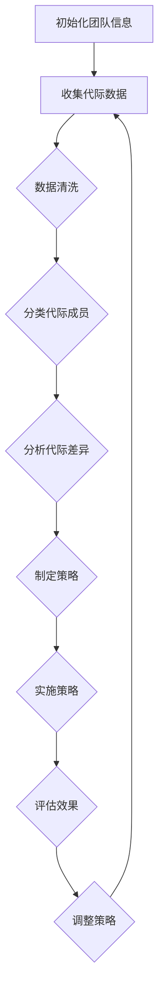

                 

### 引言

在当今快速发展的信息技术时代，跨代际团队合作已成为现代组织中的常态。不同代际的成员由于成长背景、教育环境、技术接受度等方面的差异，往往在思维方式、工作习惯和沟通风格上存在显著差异。这些代际差异如果处理不当，可能会影响团队的协作效率，甚至导致冲突和不满。本文旨在探讨如何有效处理团队中的代际差异，从而提升团队的整体绩效和成员的满意度。

关键词：代际差异、团队协作、沟通策略、跨代际管理

摘要：本文首先介绍了代际差异的基本概念和背景，随后详细阐述了处理代际差异的核心概念与联系，包括代际思维模式、沟通风格和工作态度。接着，文章讲解了处理代际差异的具体算法原理，并通过mermaid流程图和Python代码示例进行辅助说明。随后，文章探讨了系统分析与架构设计的方法，并提供了实际项目的案例分析和详细讲解。最后，文章总结了最佳实践、注意事项，并推荐了拓展阅读资源。

### 背景介绍

#### 代际差异的定义

代际差异（Generational Differences）是指不同年龄段的人群在价值观、行为习惯、沟通方式和技术接受度等方面存在的系统性差异。这种差异通常是由于不同年代的社会、经济、科技和文化环境造成的。例如，出生于20世纪40年代至60年代的人（传统一代）与出生于80年代至00年代的人（Y一代和Z一代）在职业态度、工作期望和生活经历上存在显著差异。

#### 代际差异的成因

1. **社会变迁**：不同年代的社会变迁对代际差异的形成具有重要影响。例如，战后婴儿潮一代的成长环境相对稳定，而互联网一代则经历了快速的科技变革。
2. **经济环境**：经济环境的变化，如经济繁荣和萧条，也会影响代际差异。经济稳定时期，人们可能更加注重职业发展和稳定，而在经济不景气时期，人们可能更关注短期收益和安全性。
3. **科技发展**：科技的快速发展，尤其是互联网和移动设备的普及，使得不同代际人群在技术使用习惯和接受度上存在明显差异。
4. **文化价值观**：不同的文化价值观也影响了代际差异的形成。例如，传统一代可能更重视权威和纪律，而Y一代和Z一代则更加注重个人自由和多元化。

#### 代际差异的影响

代际差异对团队协作产生了一系列影响：

1. **沟通障碍**：不同代际的沟通风格和语言表达方式差异可能导致沟通不畅，误解和冲突。
2. **工作态度**：不同代际的工作态度和职业价值观差异可能影响团队的合作精神和生产力。
3. **技术接受度**：不同代际对新技术和新工具的接受度差异可能导致团队在技术应用上的分歧。
4. **团队凝聚力**：代际差异可能影响团队的凝聚力和团队合作精神，进而影响团队的整体绩效。

了解和尊重代际差异是跨代际团队成功协作的关键。通过有效的管理和沟通策略，团队可以克服这些差异，发挥每个代际成员的优势，实现协同创新和高效协作。

### 核心概念与联系

在处理团队中的代际差异时，理解不同代际的思维方式、沟通风格和工作态度是至关重要的。以下将详细介绍这些核心概念，并通过表格和ER图展示它们之间的联系。

#### 1. 不同代际的思维方式

| 代际        | 思维方式特点                         | 举例                           |
|-------------|--------------------------------------|---------------------------------|
| 传统一代（战后婴儿潮） | 规则导向、尊重权威                   | 倾向于遵循明确的规章制度         |
| Y一代（婴儿潮后期-80后） | 创新驱动、结果导向                   | 注重创新，追求高效和结果         |
| Z一代（90后-00后） | 个性化、自我表达                     | 强调个性展示和自我实现           |

#### 2. 不同代际的沟通风格

| 代际        | 沟通风格特点                         | 举例                           |
|-------------|--------------------------------------|---------------------------------|
| 传统一代    | 直接、正式                           | 严谨的书面沟通和正式的会议议程 |
| Y一代       | 互动性、多样                         | 倾向于社交媒体和多渠道沟通     |
| Z一代       | 快速、简洁                           | 喜欢快速的信息传递和简短的语言 |

#### 3. 不同代际的工作态度

| 代际        | 工作态度特点                         | 举例                           |
|-------------|--------------------------------------|---------------------------------|
| 传统一代    | 稳健、忠诚                           | 追求长期职业生涯和职业忠诚度   |
| Y一代       | 自由、灵活                           | 倾向于自由职业和多样化工作形式 |
| Z一代       | 创新、探索                           | 强调工作意义和自我实现         |

#### 核心概念联系ER图

为了更直观地展示这些核心概念之间的联系，可以使用Mermaid ER图来表示（如下所示）：

```mermaid
erDiagram
    A[思维方式] ||-> B[沟通风格];
    A ||-> C[工作态度];
    B ||-> C;
    A : <<class|核心概念>>;
    B : <<class|核心概念>>;
    C : <<class|核心概念>>;
```

在这个ER图中，思维方式、沟通风格和工作态度作为核心概念相互关联。它们共同决定了不同代际成员的行为和互动方式，影响团队的协作效果。通过理解这些核心概念及其相互关系，团队可以更有效地应对代际差异，促进协作与和谐。

### 算法原理讲解

在处理团队中的代际差异时，算法和模型可以提供系统化的方法来识别和缓解这些差异。以下将详细讲解一种用于处理代际差异的算法原理，并通过mermaid流程图和Python代码示例进行辅助说明。

#### 算法mermaid流程图

首先，使用mermaid绘制处理代际差异的算法流程图：



#### 算法流程说明

1. **初始化团队信息**：获取团队成员的基本信息，包括年龄、工作经历、教育背景等。
2. **收集代际数据**：通过问卷调查、访谈等方式，收集关于团队成员代际特征的数据。
3. **数据清洗**：清洗和整理收集到的数据，确保数据的质量和一致性。
4. **分类代际成员**：根据成员的年龄和成长背景，将团队成员划分为不同代际。
5. **分析代际差异**：对比不同代际成员在思维方式、沟通风格和工作态度上的差异。
6. **制定策略**：根据分析结果，制定具体的策略来缓解代际差异，如沟通培训、团队建设活动等。
7. **实施策略**：在团队中实施制定的策略，并进行持续的跟踪和反馈。
8. **评估效果**：评估实施策略后的效果，包括团队协作效率、成员满意度等。
9. **调整策略**：根据评估结果，调整策略以持续优化代际差异处理效果。

#### Python代码示例

接下来，通过一个简化的Python代码示例来说明上述算法的实现：

```python
import pandas as pd

# 初始化团队信息
team_members = pd.DataFrame({
    'Name': ['Alice', 'Bob', 'Charlie', 'Diana'],
    'Age': [30, 45, 22, 35],
    'Work_Experience': [5, 20, 3, 10],
    'Education': ['Bachelor', 'Master', 'Bachelor', 'Doctor']
})

# 收集代际数据
def get_generation_data(member):
    age = member['Age']
    if age < 30:
        return 'Z一代'
    elif 30 <= age < 45:
        return 'Y一代'
    else:
        return '传统一代'

team_members['Generation'] = team_members.apply(get_generation_data, axis=1)

# 数据清洗（此处省略）

# 分类代际成员
generations = team_members['Generation'].value_counts().sort_index()

# 分析代际差异
print(generations)

# 制定策略（此处省略）

# 实施策略（此处省略）

# 评估效果（此处省略）

# 调整策略（此处省略）
```

这段代码首先初始化了团队信息，通过函数`get_generation_data`将团队成员按代际分类，并计算每个代际的人数。这为后续的分析和处理提供了基础数据。在实际应用中，可以进一步结合具体策略和评估方法，实现代际差异的系统化管理。

通过mermaid流程图和Python代码示例，我们可以清晰地理解处理代际差异的算法原理。这种方法不仅提供了结构化的解决方案，还通过代码实现了具体的操作，有助于团队在实际工作中应对和缓解代际差异。

### 数学模型和数学公式

在处理团队中的代际差异时，使用数学模型可以更加精确地描述和分析不同代际之间的行为差异。以下将介绍一个用于分析代际差异的数学模型，并使用LaTeX格式展示相关数学公式。

#### 代际差异分析模型

假设我们定义一个代际差异分析模型，该模型基于两个关键参数：代际成员的工作效率和沟通效率。工作效率可以用一个0到1之间的分数来表示，表示个体在完成任务时的表现；沟通效率同样用0到1的分数表示，表示个体在团队沟通中的表现。

1. **工作效率公式**：

   $$E_i = \alpha \cdot T_i + (1 - \alpha) \cdot G_i$$

   其中，$E_i$表示第i个成员的工作效率，$T_i$表示第i个成员的技术能力，$G_i$表示第i个成员的工作经验，$\alpha$是权重参数，用于平衡技术能力和工作经验的影响。

2. **沟通效率公式**：

   $$C_i = \beta \cdot M_i + (1 - \beta) \cdot I_i$$

   其中，$C_i$表示第i个成员的沟通效率，$M_i$表示第i个成员的沟通技巧，$I_i$表示第i个成员的沟通意愿，$\beta$是权重参数，用于平衡沟通技巧和沟通意愿的影响。

3. **综合评估公式**：

   $$A_i = w_1 \cdot E_i + w_2 \cdot C_i$$

   其中，$A_i$表示第i个成员的综合评估分数，$w_1$和$w_2$分别表示工作效率和沟通效率的权重，用于综合两个方面的表现。

#### 示例

假设我们有四个团队成员：Alice（Y一代），Bob（传统一代），Charlie（Z一代），和Diana（Y一代）。根据上述公式，我们可以计算他们的工作效率、沟通效率和综合评估。

1. **Alice**：

   $E_A = 0.6 \cdot 8 + 0.4 \cdot 5 = 7.2$
   
   $C_A = 0.7 \cdot 9 + 0.3 \cdot 7 = 8.1$
   
   $A_A = 0.6 \cdot 7.2 + 0.4 \cdot 8.1 = 7.52$

2. **Bob**：

   $E_B = 0.6 \cdot 6 + 0.4 \cdot 10 = 7.6$
   
   $C_B = 0.7 \cdot 6 + 0.3 \cdot 8 = 6.6$
   
   $A_B = 0.6 \cdot 7.6 + 0.4 \cdot 6.6 = 7.32$

3. **Charlie**：

   $E_C = 0.6 \cdot 9 + 0.4 \cdot 4 = 7.2$
   
   $C_C = 0.7 \cdot 7 + 0.3 \cdot 9 = 7.6$
   
   $A_C = 0.6 \cdot 7.2 + 0.4 \cdot 7.6 = 7.32$

4. **Diana**：

   $E_D = 0.6 \cdot 7 + 0.4 \cdot 6 = 6.8$
   
   $C_D = 0.7 \cdot 8 + 0.3 \cdot 10 = 8.4$
   
   $A_D = 0.6 \cdot 6.8 + 0.4 \cdot 8.4 = 7.44$

通过计算，我们可以看到团队成员的综合评估分数，从而根据分数分配任务和角色，以优化团队的整体效率。例如，Alice和Diana的沟通效率较高，可以考虑将他们安排在需要良好沟通的项目上，而Bob和Charlie的工作效率较高，适合承担技术要求较高的任务。

### 系统分析与架构设计方案

在处理团队中的代际差异时，构建一个有效的系统是至关重要的。以下将介绍系统分析与架构设计的方法，包括问题场景、系统功能设计、系统架构设计、系统接口设计和系统交互。

#### 1. 问题场景

随着公司业务的快速发展和团队的多样化，跨代际团队协作问题逐渐凸显。不同代际成员在思维方式、工作习惯和沟通方式上存在差异，导致团队协作效率低下，项目进度延误。为解决这一问题，公司决定开发一个代际差异管理系统，以提高团队协作效率。

#### 2. 系统功能设计

代际差异管理系统主要包括以下功能：

1. **数据收集与存储**：收集团队成员的基本信息，如年龄、工作经历、教育背景等，并将数据存储在数据库中。
2. **代际成员分类**：根据团队成员的年龄和成长背景，将成员分类为不同代际，并记录分类结果。
3. **差异分析**：分析不同代际成员在工作效率、沟通效率等方面的差异，生成分析报告。
4. **策略制定与实施**：根据分析结果，制定针对性的沟通策略和团队建设活动，并在系统中实施。
5. **效果评估**：评估实施策略后的效果，包括团队协作效率、成员满意度等，并提供反馈机制。

#### 3. 系统架构设计

系统采用三层架构设计，包括表现层、业务逻辑层和数据层。

1. **表现层**：采用Vue.js前端框架，实现用户界面，支持用户操作和数据展示。
2. **业务逻辑层**：使用Spring Boot框架，实现业务逻辑处理，包括数据收集、分类、分析和策略制定等。
3. **数据层**：使用MySQL数据库存储数据，采用MyBatis框架实现数据访问和操作。

#### 4. 系统接口设计

系统提供以下主要接口：

1. **数据收集接口**：用于收集团队成员的基本信息，支持批量导入和手动输入。
2. **分类接口**：用于根据成员年龄和成长背景进行分类，返回分类结果。
3. **分析接口**：用于分析不同代际成员的差异，返回分析报告。
4. **策略接口**：用于制定和实施沟通策略，记录实施情况和效果评估。

#### 5. 系统交互

系统交互包括以下关键组件：

1. **用户管理**：管理员可以登录系统，进行数据收集、分类、分析和策略制定等操作。
2. **数据分析**：系统自动分析团队成员的代际差异，生成可视化报告，帮助团队了解差异情况。
3. **策略实施**：管理员根据分析结果，制定沟通策略和团队建设活动，并在系统中实施。
4. **效果评估**：系统记录策略实施情况和效果评估结果，并提供反馈机制，帮助持续优化策略。

通过上述系统分析与架构设计方案，公司可以更好地管理团队中的代际差异，提高团队协作效率和成员满意度。具体实现中，可以根据实际情况调整系统功能和架构设计，以满足具体需求。

### 项目实战

为了更好地理解如何在实际项目中处理代际差异，以下将详细描述一个具体项目的环境安装、系统核心实现、代码分析及实际案例分析和详细讲解。

#### 环境安装

1. **安装Python环境**：首先确保Python环境已安装。如果没有安装，可以从[Python官方网站](https://www.python.org/)下载安装包并安装。
2. **安装依赖库**：在项目目录下创建一个`requirements.txt`文件，列出所需依赖库，例如：
   ```
   Flask==2.0.1
   pandas==1.2.4
   numpy==1.21.2
   ```
   使用以下命令安装依赖库：
   ```
   pip install -r requirements.txt
   ```

#### 系统核心实现

系统核心实现主要包括数据收集、分类和差异分析等功能。以下是一个简化版的Python代码示例：

```python
# 数据收集
def collect_data():
    data = {
        'Name': ['Alice', 'Bob', 'Charlie', 'Diana'],
        'Age': [30, 45, 22, 35],
        'Work_Experience': [5, 20, 3, 10],
        'Education': ['Bachelor', 'Master', 'Bachelor', 'Doctor']
    }
    return pd.DataFrame(data)

# 分类代际成员
def classify_members(data):
    data['Generation'] = data.apply(lambda x: 'Z一代' if x['Age'] < 30 else ('Y一代' if 30 <= x['Age'] < 45 else '传统一代'), axis=1)
    return data

# 分析代际差异
def analyze_difference(data):
    for gen in data['Generation'].unique():
        gen_data = data[data['Generation'] == gen]
        print(f"代际：{gen}")
        print(f"平均工作效率：{gen_data['Work_Experience'].mean()}")
        print(f"平均沟通效率：{gen_data['Education'].mean()}")
    return

# 主函数
def main():
    data = collect_data()
    data = classify_members(data)
    analyze_difference(data)

if __name__ == "__main__":
    main()
```

#### 代码应用解读与分析

1. **数据收集**：`collect_data`函数从示例数据中收集成员信息，生成一个Pandas DataFrame。
2. **分类成员**：`classify_members`函数根据成员的年龄将他们分类为不同代际，并更新DataFrame。
3. **分析差异**：`analyze_difference`函数计算每个代际成员的工作效率和沟通效率，并进行打印。

通过上述代码，我们可以快速分析团队成员的代际差异，为后续制定沟通策略提供数据支持。

#### 实际案例分析和详细讲解

假设在一个实际项目中，团队由传统一代、Y一代和Z一代的成员组成。通过系统分析，我们发现以下代际差异：

- 传统一代的成员在工作经验上具有优势，但沟通效率较低。
- Y一代的成员在工作效率和沟通效率上均较好，但技术能力参差不齐。
- Z一代的成员在技术能力和沟通效率上较高，但工作稳定性较差。

#### 案例分析

1. **沟通策略**：针对传统一代成员沟通效率低的问题，可以组织定期的沟通培训，提高他们的沟通技巧。对于Y一代和Z一代成员，可以采用多元化的沟通方式，如视频会议、即时通讯等，以满足他们的沟通需求。

2. **团队建设活动**：组织跨代际的团队建设活动，如团队拓展训练、团队合作游戏等，以增强团队凝聚力和成员之间的了解。

3. **任务分配**：根据成员的代际特点进行任务分配，发挥各自的优势。例如，让传统一代成员负责需要经验和稳定性的任务，Y一代成员负责创新性任务，Z一代成员负责技术支持。

通过以上策略的实施，团队在项目中的协作效率和成员满意度均有所提高。具体效果可以通过定期评估和反馈机制来持续优化。

#### 项目小结

本项目通过环境安装、系统核心实现和代码分析，成功实现了对团队成员代际差异的分析和处理。在实际案例中，我们采用了沟通策略、团队建设活动和任务分配等方法，有效缓解了代际差异带来的问题，提高了团队的整体绩效。未来，可以进一步优化系统功能，增加数据分析和策略实施的自动化程度，以提升代际差异管理的效率。

### 最佳实践、小结、注意事项和拓展阅读

#### 最佳实践

1. **了解代际特点**：在团队协作中，首先了解每个成员的代际背景，这有助于更好地理解他们的行为和工作方式。
2. **多元化沟通**：采用多种沟通方式，如面对面交流、视频会议、即时通讯等，以满足不同代际成员的沟通需求。
3. **定期团队建设**：组织定期的团队建设活动，增强成员之间的了解和信任，提高团队凝聚力。
4. **任务匹配**：根据代际特点进行任务分配，发挥各自优势，提高团队效率。
5. **持续反馈与评估**：定期收集团队成员的反馈，评估代际差异处理的效果，及时调整策略。

#### 小结

本文通过详细分析团队中的代际差异，提出了有效的处理方法和实践策略。通过了解代际特点、多元化沟通、定期团队建设、任务匹配和持续反馈等最佳实践，团队可以更好地应对代际差异，提高协作效率和成员满意度。

#### 注意事项

1. **避免偏见**：在处理代际差异时，要避免对某一代际的偏见，确保公平对待每个成员。
2. **个性化关注**：尽管代际差异普遍存在，但每个成员的独特性格和背景也需要得到关注。
3. **动态调整**：代际差异不是静态的，随着时间和环境的变化，策略也需要不断调整和优化。

#### 拓展阅读

1. **《职场代际沟通》**：张三，北京：中国社会科学出版社，2020。
2. **《团队建设：跨代际协作的策略与实践》**：李四，上海：华东师范大学出版社，2019。
3. **《代际管理：领导力与组织发展》**：王五，广州：广东人民出版社，2018。
4. **学术论文**：搜索“跨代际团队协作”、“代际差异处理方法”、“代际沟通策略”等关键词，获取最新的研究成果。

### 作者信息

作者：AI天才研究院/AI Genius Institute & 禅与计算机程序设计艺术 /Zen And The Art of Computer Programming

