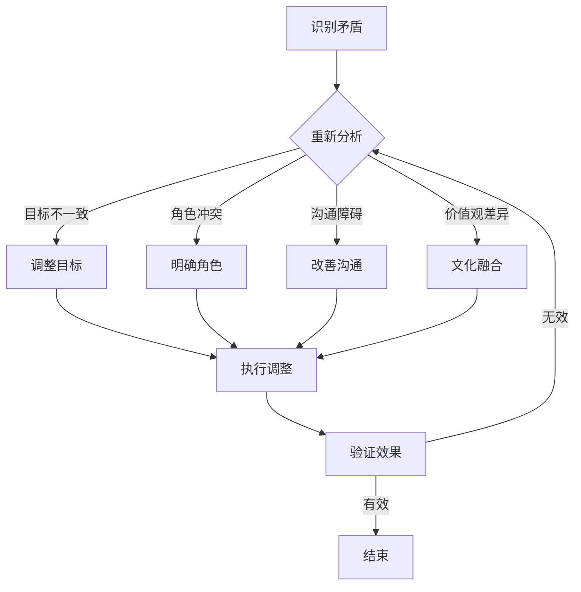
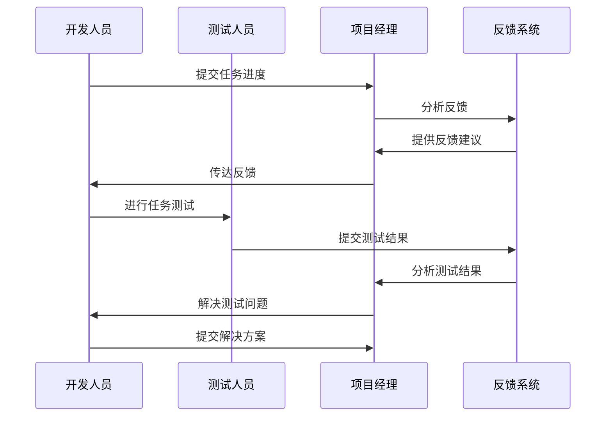
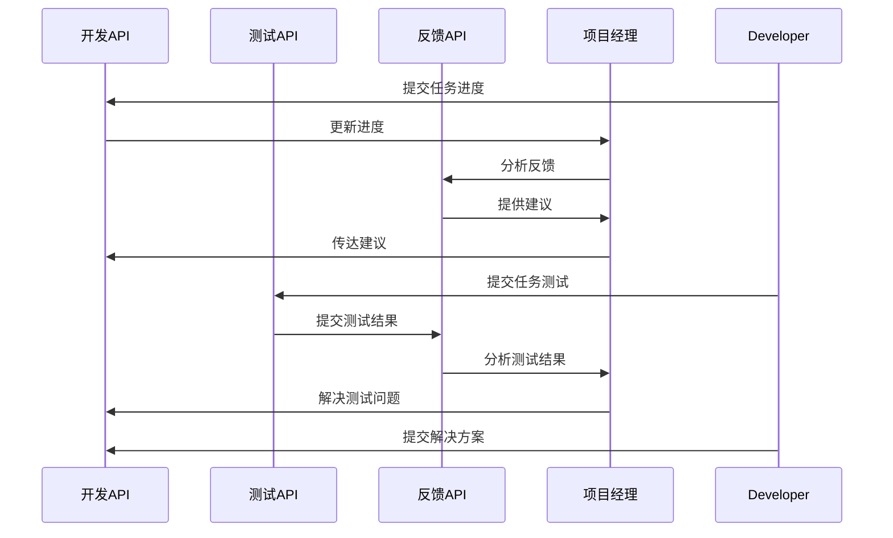
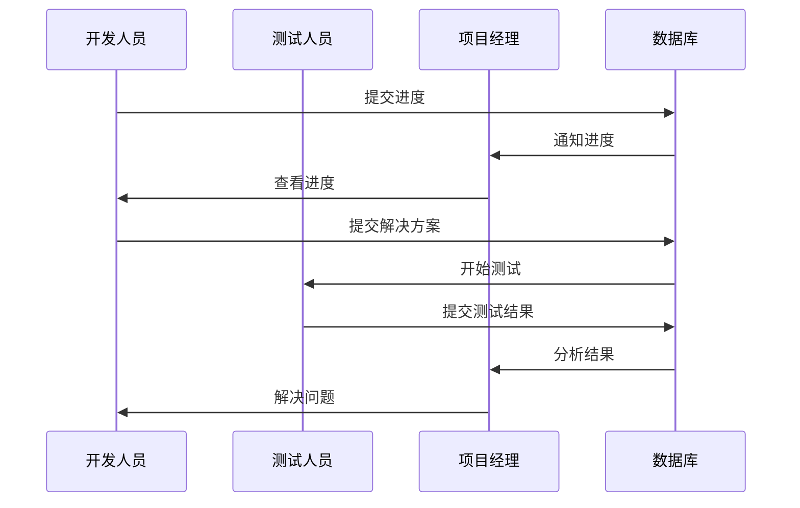
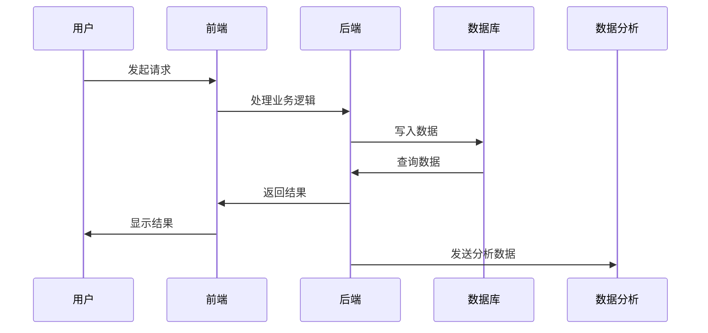
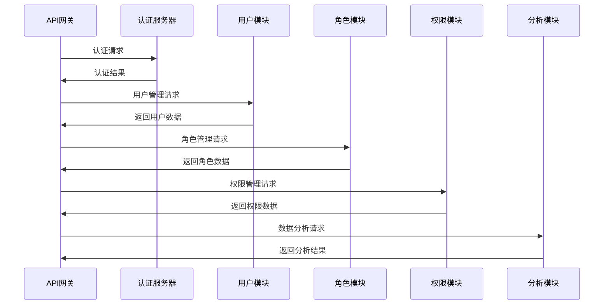
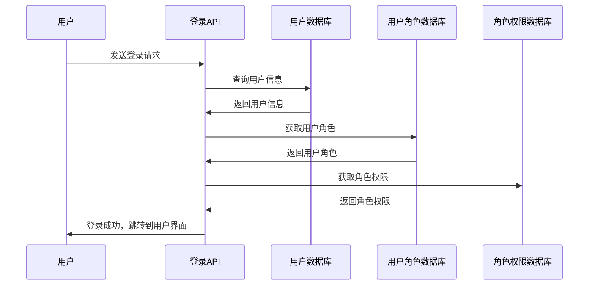

                 

# 如何处理团队内部的矛盾

## 摘要

本文旨在探讨团队内部矛盾的产生原因及其解决方法。通过对团队内部矛盾的概念、类型、成因以及处理原则的详细分析，结合实际案例和具体策略，为读者提供一套行之有效的团队矛盾管理方案。文章结构如下：

- **第一部分：问题背景与核心概念**：介绍团队内部矛盾的定义、类型及成因。
- **第二部分：核心概念与联系**：探讨沟通、团队建设、领导力等概念及其相互关系。
- **第三部分：算法原理讲解**：介绍处理团队矛盾的理论基础，使用mermaid和Python代码示例进行阐述。
- **第四部分：数学模型与公式**：详细讲解数学模型和公式。
- **第五部分：系统分析与架构设计**：分析团队内部矛盾处理的系统方法。
- **第六部分：项目实战**：介绍实际操作中的步骤、代码和应用分析。
- **第七部分：最佳实践与拓展**：总结实战中的最佳实践，提出注意事项和小结，推荐进一步阅读的材料。

通过本文的逐步分析，希望能够帮助读者理解团队内部矛盾的复杂性，并提供实用的解决策略。

## 第一部分：问题背景与核心概念

### 1.1 团队内部矛盾概述

#### 1.1.1 问题背景

在项目管理中，团队内部矛盾是一种常见且复杂的现象。它不仅会影响到团队成员的工作效率和士气，还可能对项目的整体进度和质量产生负面影响。团队内部矛盾可能表现为沟通障碍、协作不畅、角色冲突和目标不一致等问题。为了更好地理解团队内部矛盾，我们需要明确以下几个关键概念：

- **团队内部矛盾的概念**：团队内部矛盾是指在团队运行过程中，成员之间由于个人背景、工作职责、沟通方式、价值观等方面的差异，而产生的分歧、争执或冲突。
- **团队内部矛盾的类型**：根据表现形式的不同，团队内部矛盾可以分为沟通矛盾、角色冲突、利益分配矛盾和价值观矛盾等。
- **团队内部矛盾的影响**：团队内部矛盾会对团队成员的士气、工作效率、团队氛围和项目成果产生负面影响。
- **团队内部矛盾的症状**：常见的症状包括员工流失、工作效率低下、项目延期、质量下降等。

#### 1.1.2 问题描述

团队内部矛盾的描述可以类比于计算机程序中的异常处理。在程序运行过程中，异常是不可避免的。同样，在团队运作过程中，矛盾和冲突是普遍存在的。这些矛盾和冲突如果不加以妥善处理，就会像程序中的异常一样，导致系统崩溃或功能失效。

- **沟通矛盾**：团队成员之间的沟通不畅，导致信息传递错误或不完整，从而引发误解和争执。
- **角色冲突**：团队成员在职责和角色上的不明确，可能导致职责重叠或责任逃避，从而引发冲突。
- **利益分配矛盾**：团队成员在利益分配上的不公或争议，可能导致不满和抵触情绪。
- **价值观矛盾**：团队成员在价值观和信仰上的差异，可能导致文化冲突和价值观碰撞。

#### 1.1.3 问题解决

解决团队内部矛盾的首要任务是明确矛盾的性质和成因。以下是一些常见的问题解决方法：

- **沟通策略**：加强团队成员之间的沟通，确保信息的准确传递和及时反馈。
- **角色界定**：明确团队成员的职责和角色，避免职责重叠和责任逃避。
- **利益协调**：通过公平的利益分配机制，减少利益分配矛盾。
- **价值观共识**：促进团队成员在价值观和信仰上的相互理解和尊重。

#### 1.1.4 边界与外延

团队内部矛盾的范围包括但不限于团队内部的个人关系和合作问题。它可能扩展到团队与外部客户、供应商或合作伙伴之间的互动。因此，在处理团队内部矛盾时，需要综合考虑外部因素和内部机制。

- **团队内部矛盾的范围**：主要包括团队成员之间的互动、团队合作和工作分配等方面。
- **团队内部矛盾与外部冲突的区别**：团队内部矛盾通常是由于内部因素引起的，而外部冲突则是由于外部环境的变化或外部压力引起的。

### 1.2 核心概念

在理解团队内部矛盾的过程中，以下几个核心概念至关重要：

- **沟通**：沟通是团队协作的基础。有效的沟通可以减少误解和冲突，提高团队工作效率。沟通障碍是团队内部矛盾的主要来源之一。

- **团队建设**：团队建设是通过一系列活动和策略，增强团队成员之间的信任、协作和凝聚力。团队建设有助于预防和解决团队内部矛盾。

- **领导力**：领导力是领导者通过激励、引导和决策能力，带领团队实现共同目标的能力。有效的领导力有助于解决团队内部矛盾，提高团队绩效。

#### 1.2.1 沟通

- **沟通的定义与重要性**：沟通是信息的交换过程，包括口头、书面、非言语和数字等多种形式。有效的沟通对于团队的成功至关重要。
- **沟通障碍与解决策略**：常见的沟通障碍包括语言障碍、信息过滤、选择性感知等。解决策略包括提高沟通技巧、使用清晰的语言、建立沟通反馈机制等。

#### 1.2.2 团队建设

- **团队建设的概念与目标**：团队建设是指通过一系列活动和实践，增强团队成员之间的信任、协作和凝聚力。目标包括提高团队绩效、增强团队适应性和创新能力。
- **团队建设的策略与方法**：包括团队建设活动、培训、团队反思等。有效的团队建设策略有助于预防团队内部矛盾。

#### 1.2.3 领导力

- **领导力的定义与类型**：领导力是指领导者通过激励、引导和决策能力，带领团队实现共同目标的能力。领导力可以分为任务型领导力和关系型领导力等。
- **领导力在处理团队内部矛盾中的作用**：领导者需要具备有效的沟通技巧、冲突解决能力和决策能力，以应对团队内部矛盾。

### 1.3 概念属性特征对比表格

| 概念       | 定义                                                         | 属性特征对比       |
|------------|--------------------------------------------------------------|-------------------|
| 沟通       | 信息交换的过程                                               | 明确性、完整性、及时性 |
| 团队建设   | 增强团队协作的过程                                           | 共同目标、信任、协作   |
| 领导力     | 指引、激励和领导团队的能力                                   | 决策能力、沟通能力、创新能力 |

### 1.4 ER实体关系图架构

```mermaid
erDiagram
  A team ||--|{ B communication}
  A team ||--|{ C team_building}
  A team ||--|{ D leadership}
  B communication ||--|{ E feedback}
  C team_building ||--|{ F training}
  D leadership ||--|{ G motivation}
```

## 第二部分：核心概念与联系

### 2.1 沟通

#### 2.1.1 沟通原理

沟通是团队协作的基石，它贯穿于团队运行的每一个环节。有效的沟通不仅能确保团队成员理解任务要求，还能促进团队内部的信任和协作。以下是对沟通原理的详细探讨：

- **沟通模型**：沟通模型通常包括发送者、信息、通道、接收者和反馈五个基本要素。发送者将信息通过通道传递给接收者，接收者通过反馈确认信息的理解程度。

- **沟通障碍**：沟通障碍可能来源于信息过滤、选择性感知、语义模糊、语言障碍和文化差异等因素。这些障碍会干扰信息的准确传递和理解。

  - **信息过滤**：发送者在传递信息时可能有意或无意地筛选信息，导致关键信息被遗漏。
  - **选择性感知**：接收者可能根据自己的经验和期望，选择性地接收和解释信息。
  - **语义模糊**：语言的歧义性可能导致信息传递的模糊和不准确。
  - **语言障碍**：不同语言的使用可能引起理解上的困难。
  - **文化差异**：不同文化背景的团队成员可能在沟通方式和理解上存在差异。

- **解决策略**：为了克服沟通障碍，可以采取以下策略：

  - **提高沟通技巧**：通过培训和实践，提高团队成员的沟通技巧，包括倾听、表达清晰、提问和反馈等。
  - **使用清晰的语言**：在沟通中使用简单、明确和具体的语言，避免使用专业术语和模糊的表述。
  - **建立沟通反馈机制**：通过定期的反馈会议和交流，确保信息的准确传递和理解。
  - **利用多种沟通方式**：结合口头、书面和非言语沟通，确保信息的多渠道传递。

#### 2.1.2 沟通障碍与解决策略

- **信息过滤**：解决信息过滤问题可以通过透明度和信任建设来缓解。例如，定期组织内部沟通会议，鼓励团队成员分享观点和反馈，增加信息透明度。

- **选择性感知**：通过培养开放性和接纳性的沟通文化，可以减少选择性感知的影响。例如，鼓励团队成员在沟通中保持开放态度，尊重不同的观点和意见。

- **语义模糊**：通过使用明确的术语和具体的例子，减少语义模糊。例如，在讨论项目进展时，使用具体的数字和数据来支持观点。

- **语言障碍**：通过培训和支持多语言环境，可以帮助团队成员提高语言技能和理解能力。例如，提供语言学习资源和跨文化沟通培训。

- **文化差异**：通过文化敏感性和多元化培训，可以提高团队成员对不同文化的理解和尊重。例如，组织跨文化团队建设活动和多元化研讨会。

### 2.2 团队建设

#### 2.2.1 团队建设的概念与目标

团队建设是一个系统性过程，旨在通过增强团队成员之间的信任、协作和凝聚力，提高团队的绩效和适应能力。以下是对团队建设概念与目标的详细探讨：

- **团队建设的概念**：团队建设是指通过一系列活动和策略，培养团队成员之间的相互信任、开放沟通、共同目标和团队精神。

- **团队建设的目标**：

  - **提高团队绩效**：通过增强团队成员的协作和合作能力，提高团队的效率和产出。
  - **增强团队适应能力**：培养团队成员的灵活性和创新能力，使团队能够更好地适应外部环境的变化。
  - **提升团队凝聚力**：通过团队活动和文化建设，增强团队成员之间的联系和归属感。

#### 2.2.2 团队建设的策略与方法

团队建设的策略和方法多种多样，以下是一些常见的策略和方法：

- **团队建设活动**：通过组织团队建设活动，如团队拓展训练、户外运动、团队游戏等，增强团队成员之间的互动和信任。

- **培训与发展**：通过培训和发展项目，提高团队成员的技能和知识水平，促进团队内部的协作和沟通。

- **团队反思**：通过定期的团队反思会议，鼓励团队成员分享经验和反馈，发现问题并寻找改进方案。

- **文化建设**：通过建立积极、开放和包容的文化，促进团队成员之间的合作和信任。

### 2.3 领导力

#### 2.3.1 领导力的定义与类型

领导力是指领导者通过激励、引导和决策能力，带领团队实现共同目标的能力。以下是对领导力定义与类型的详细探讨：

- **领导力的定义**：领导力不仅仅是权力和地位的象征，更重要的是一种影响力和激励力。有效的领导者能够激发团队成员的潜力和创造力，实现团队目标。

- **领导力的类型**：

  - **任务型领导力**：任务型领导者专注于团队的绩效和目标实现，通过明确任务分配和监督执行来确保项目成功。
  - **关系型领导力**：关系型领导者注重团队成员的个人发展和关系建设，通过建立信任和支持，提高团队的凝聚力和协作性。

#### 2.3.2 领导力在处理团队内部矛盾中的作用

- **沟通与调解**：领导者需要具备良好的沟通技巧，能够有效地调解团队内部的矛盾和冲突。
- **决策与授权**：领导者需要做出明智的决策，并在必要时授权团队成员处理具体问题，减少团队内部的矛盾。
- **激励与支持**：领导者需要激励团队成员，提供必要的支持和资源，帮助团队成员克服困难和挑战。

### 2.4 概念属性特征对比表格

| 概念       | 定义                                                         | 属性特征对比       |
|------------|--------------------------------------------------------------|-------------------|
| 沟通       | 信息交换的过程                                               | 明确性、完整性、及时性 |
| 团队建设   | 增强团队协作的过程                                           | 共同目标、信任、协作   |
| 领导力     | 指引、激励和领导团队的能力                                   | 决策能力、沟通能力、创新能力 |

### 2.5 ER实体关系图架构

```mermaid
erDiagram
  A team ||--|{ B communication}
  A team ||--|{ C team_building}
  A team ||--|{ D leadership}
  B communication ||--|{ E feedback}
  C team_building ||--|{ F training}
  D leadership ||--|{ G motivation}
```

## 第三部分：算法原理讲解

### 3.1 处理团队矛盾的理论基础

在解决团队内部矛盾的过程中，我们需要依赖一系列的理论基础，这些理论不仅为我们提供了方法论指导，还帮助我们理解矛盾产生的根本原因。以下是对几个关键理论基础的详细探讨：

#### 3.1.1 矛盾分析理论

矛盾分析理论是处理团队内部矛盾的基础，它强调识别和解决矛盾的重要性。根据矛盾分析理论，团队内部矛盾通常源于以下几个方面的冲突：

- **目标不一致**：团队成员可能对项目的目标和优先级有不同的理解，导致行动上的不一致。
- **角色冲突**：团队成员在职责和角色上的不明确，可能导致职责重叠或责任逃避。
- **沟通障碍**：团队成员之间的沟通不畅，导致信息传递错误或不完整。
- **价值观差异**：团队成员在价值观和信仰上的差异，可能导致文化冲突和价值观碰撞。

#### 3.1.2 冲突解决理论

冲突解决理论提供了处理团队内部矛盾的具体策略和方法。根据冲突解决理论，处理团队内部矛盾可以分为以下几个步骤：

1. **识别矛盾**：通过观察和沟通，识别团队内部的矛盾和冲突。
2. **分析矛盾**：分析矛盾的原因和影响，确定解决策略。
3. **调解矛盾**：采取适当的调解措施，如沟通、协商和妥协，解决矛盾。
4. **监控和反馈**：在解决矛盾后，监控团队氛围和项目进展，确保矛盾得到有效解决。

#### 3.1.3 团队建设理论

团队建设理论强调通过增强团队成员之间的信任和协作来预防和解决团队内部矛盾。以下是一些关键的团队建设理论：

- **社会交换理论**：社会交换理论认为，团队成员之间的互动是建立在相互信任和回报的基础上的。通过加强团队内的社会交换，可以减少矛盾和冲突。
- **互依性理论**：互依性理论认为，团队成员之间的依赖程度越高，越需要建立信任和协作。互依性可以通过共同目标和合作任务的完成来建立。
- **共同目标理论**：共同目标理论强调，团队成员应该有一个共同的目标，这将有助于减少个人利益冲突，提高团队整体绩效。

### 3.2 使用mermaid绘制算法mermaid流程图

为了更好地理解和应用上述理论基础，我们可以使用mermaid工具绘制一个处理团队内部矛盾的算法流程图。以下是一个简化的mermaid流程图示例：



### 3.3 使用Python代码示例讲解算法原理

为了更具体地展示算法原理，我们可以使用Python代码示例来模拟处理团队内部矛盾的过程。以下是一个简化的Python代码示例，用于处理团队内部矛盾：

```python
class TeamConflict:
    def __init__(self, members, goals):
        self.members = members
        self.goals = goals
        self.conflicts = []

    def identify_conflicts(self):
        # 识别团队内部矛盾
        for member in self.members:
            for goal in self.goals:
                if member.get_goal() != goal:
                    self.conflicts.append((member, goal))

    def resolve_conflicts(self):
        # 解决团队内部矛盾
        for conflict in self.conflicts:
            member, goal = conflict
            if member.get_goal() != goal:
                member.set_goal(goal)
                print(f"Member {member.name} goal updated to {goal}.")

    def verify_effects(self):
        # 验证解决效果
        for member in self.members:
            if member.get_goal() != self.goals[0]:
                return False
        return True

# 示例：创建团队和成员对象
team = TeamConflict(['Alice', 'Bob', 'Charlie'], ['项目A', '项目B'])
team.identify_conflicts()
team.resolve_conflicts()
if team.verify_effects():
    print("Team conflicts resolved successfully.")
else:
    print("Unable to resolve all team conflicts.")
```

在这个示例中，我们创建了一个`TeamConflict`类，用于处理团队内部矛盾。该类包含识别矛盾、解决矛盾和验证解决效果的方法。通过这些方法，我们可以模拟团队内部矛盾的识别和解决过程。

### 3.4 算法原理的数学模型和公式

在处理团队内部矛盾时，我们可以借助一些数学模型和公式来量化矛盾的影响和解决效果。以下是一个简化的数学模型和公式：

- **矛盾影响度**：用于量化团队内部矛盾对项目进展的影响。假设每个团队成员的矛盾影响度为一个权重，权重越高，表示矛盾的影响越大。

  $$ I = \sum_{i=1}^{n} w_i \cdot c_i $$

  其中，\( I \) 表示总矛盾影响度，\( w_i \) 表示第 \( i \) 个成员的权重，\( c_i \) 表示第 \( i \) 个成员的矛盾影响。

- **解决效果度**：用于量化解决矛盾后的效果。假设每个成员的解决效果度为一个修复因子，修复因子越高，表示解决效果越好。

  $$ R = \frac{1}{n} \sum_{i=1}^{n} r_i $$

  其中，\( R \) 表示总解决效果度，\( r_i \) 表示第 \( i \) 个成员的修复因子。

- **平衡度**：用于衡量团队内部的平衡状态。平衡度越高，表示团队内部矛盾越少。

  $$ B = \frac{I - R}{I} $$

  其中，\( B \) 表示平衡度，\( I \) 表示总矛盾影响度，\( R \) 表示总解决效果度。

通过这些公式，我们可以量化团队内部矛盾的影响和解决效果，从而更科学地评估和优化团队管理策略。

### 3.5 算法原理的举例说明

为了更好地理解算法原理，我们可以通过一个具体的例子来说明如何使用这些公式和模型来解决团队内部矛盾。

#### 示例：团队A的矛盾处理

- **团队成员**：Alice（权重1.0），Bob（权重0.8），Charlie（权重1.2）。
- **矛盾情况**：Alice和Bob在项目目标上存在冲突，Alice倾向于项目A，而Bob倾向于项目B；Charlie在沟通上存在障碍。

#### 3.5.1 矛盾影响度计算

根据上述公式，我们可以计算团队A的总矛盾影响度：

$$ I = (1.0 \cdot c_{Alice}) + (0.8 \cdot c_{Bob}) + (1.2 \cdot c_{Charlie}) $$

其中，\( c_{Alice} \)、\( c_{Bob} \)和\( c_{Charlie} \)分别表示Alice、Bob和Charlie的矛盾影响度。

#### 3.5.2 解决效果度计算

通过解决沟通障碍和调整目标，我们可以计算团队A的总解决效果度：

$$ R = \frac{1}{3} \cdot (r_{Alice} + r_{Bob} + r_{Charlie}) $$

其中，\( r_{Alice} \)、\( r_{Bob} \)和\( r_{Charlie} \)分别表示Alice、Bob和Charlie的解决效果度。

#### 3.5.3 平衡度计算

最后，我们可以计算团队A的平衡度：

$$ B = \frac{I - R}{I} $$

通过这些计算，我们可以量化团队内部矛盾的影响和解决效果，从而评估团队管理的有效性。在实际应用中，我们可以根据计算结果调整团队管理策略，以提高团队的整体绩效。

## 第四部分：数学模型与公式

在处理团队内部矛盾的过程中，数学模型和公式能够帮助我们量化问题，提供科学依据。以下将详细讲解处理团队内部矛盾的数学模型和公式，并使用LaTeX格式展示关键公式。

### 4.1 数学模型

#### 4.1.1 矛盾影响度模型

团队内部矛盾对项目的影响可以用矛盾影响度（\(I\)）来衡量，影响度越高，表示矛盾对项目的影响越大。矛盾影响度由各成员的权重（\(w_i\)）和矛盾程度（\(c_i\)）决定，计算公式如下：

$$ I = \sum_{i=1}^{n} w_i \cdot c_i $$

其中：
- \(I\) 是总矛盾影响度。
- \(n\) 是团队成员数量。
- \(w_i\) 是第 \(i\) 个成员的权重。
- \(c_i\) 是第 \(i\) 个成员的矛盾程度。

#### 4.1.2 解决效果度模型

解决效果度（\(R\)）用于衡量解决矛盾后的效果。解决效果度由各成员的修复因子（\(r_i\)）决定，计算公式如下：

$$ R = \frac{1}{n} \sum_{i=1}^{n} r_i $$

其中：
- \(R\) 是总解决效果度。
- \(n\) 是团队成员数量。
- \(r_i\) 是第 \(i\) 个成员的修复因子。

#### 4.1.3 平衡度模型

平衡度（\(B\)）用于衡量团队内部的平衡状态，平衡度越高，表示团队内部矛盾越少。平衡度由矛盾影响度（\(I\)）和解决效果度（\(R\)）决定，计算公式如下：

$$ B = \frac{I - R}{I} $$

其中：
- \(B\) 是平衡度。
- \(I\) 是总矛盾影响度。
- \(R\) 是总解决效果度。

### 4.2 LaTeX公式展示

为了更直观地展示数学公式，我们使用LaTeX格式进行展示：

#### 4.2.1 矛盾影响度公式

$$ I = \sum_{i=1}^{n} w_i \cdot c_i $$

#### 4.2.2 解决效果度公式

$$ R = \frac{1}{n} \sum_{i=1}^{n} r_i $$

#### 4.2.3 平衡度公式

$$ B = \frac{I - R}{I} $$

### 4.3 实例计算

假设团队A由3名成员组成，权重分别为1.0、0.8和1.2，他们的矛盾程度分别为0.5、0.3和0.4。解决效果度分别为0.8、0.7和0.6。我们根据上述公式计算矛盾影响度、解决效果度和平衡度。

#### 4.3.1 矛盾影响度计算

$$ I = 1.0 \cdot 0.5 + 0.8 \cdot 0.3 + 1.2 \cdot 0.4 = 0.5 + 0.24 + 0.48 = 1.22 $$

#### 4.3.2 解决效果度计算

$$ R = \frac{1}{3} \cdot (0.8 + 0.7 + 0.6) = \frac{1}{3} \cdot 2.1 = 0.7 $$

#### 4.3.3 平衡度计算

$$ B = \frac{1.22 - 0.7}{1.22} = 0.4155 $$

通过上述计算，我们可以看出，团队A的矛盾影响度为1.22，解决效果度为0.7，平衡度为0.4155。这表明团队A的内部矛盾得到了较好的解决，但仍有改进的空间。

## 第五部分：系统分析与架构设计

### 5.1 问题场景介绍

在许多IT项目中，团队内部矛盾是常见且复杂的问题。为了更好地理解如何处理团队内部矛盾，我们以一个具体的IT项目为例：一个软件开发团队正在开发一款新的移动应用程序。该团队由多个子团队组成，分别负责前端开发、后端开发、测试和用户体验设计等任务。由于项目规模较大，团队成员来自不同的背景，工作方式和文化也有所不同，因此团队内部经常出现沟通障碍、角色冲突和利益分配矛盾等问题。

### 5.2 项目介绍

项目名称：移动应用程序开发项目

项目目标：开发一款功能齐全、用户体验优秀的移动应用程序。

项目背景：随着移动设备的普及，移动应用程序市场需求不断增加。公司决定投入资源开发一款能够满足用户需求的移动应用程序，以提高市场竞争力。

项目规模：项目预计需要6个月的时间完成，涉及100多名团队成员。

项目挑战：由于团队成员来自不同的子团队，沟通不畅、角色冲突和利益分配矛盾等问题可能导致项目进度延误、质量下降。

### 5.3 系统功能设计（领域模型mermaid类图）

为了更好地管理团队内部矛盾，我们首先设计一个领域模型，以明确系统功能。以下是系统功能设计的mermaid类图：

```mermaid
classDiagram
  TeamMember <<--|Knows| Project
  TeamMember <<--|ReportsTo| TeamLead
  TeamLead <<--|Manages| TeamMember
  Team <<--|Has| TeamMember
  Task <<--|AssignedTo| TeamMember
  Task <<--|BelongsTo| Project
  Meeting <<--|Holds| TeamMember
  Feedback <<--|From| TeamMember
  Feedback <<--|To| TeamLead
```

在这个类图中，我们定义了以下实体：

- **TeamMember**：团队成员，负责具体任务。
- **TeamLead**：团队领导，负责管理团队成员。
- **Team**：团队，包含多个团队成员。
- **Task**：任务，分配给团队成员。
- **Project**：项目，包含多个任务。
- **Meeting**：会议，用于团队交流和决策。
- **Feedback**：反馈，用于团队成员之间的沟通和评估。

### 5.4 系统架构设计（mermaid架构图）

在明确了系统功能后，我们需要设计一个系统架构来支持团队内部矛盾的处理。以下是系统架构设计的mermaid架构图：



在这个架构图中，我们定义了以下关键组件：

- **开发人员**：负责开发和实现具体任务。
- **测试人员**：负责测试应用程序的功能和性能。
- **项目经理**：负责管理项目进度、协调团队工作和解决内部矛盾。
- **反馈系统**：用于收集和分析团队成员的反馈，提供改进建议。
- **任务提交**：开发人员向项目经理提交任务进度。
- **反馈分析**：项目经理使用反馈系统分析团队成员的反馈，并提供反馈建议。
- **任务测试**：测试人员对开发人员完成的任务进行测试，并提交测试结果。
- **问题解决**：项目经理根据测试结果，指导开发人员解决测试问题，并再次提交解决方案。

### 5.5 系统接口设计

为了实现上述架构，我们需要设计系统接口，以支持各个组件之间的通信和协作。以下是系统接口设计的mermaid序列图：



在这个序列图中，我们定义了以下接口：

- **开发API**：用于开发人员提交任务进度和解决方案。
- **测试API**：用于测试人员提交任务测试结果。
- **反馈API**：用于项目经理分析反馈和建议。

### 5.6 系统交互序列图

为了展示系统组件之间的交互过程，我们使用mermaid绘制了系统交互序列图：



在这个交互序列图中，我们定义了以下交互过程：

- **进度提交**：开发人员向数据库提交任务进度。
- **进度通知**：数据库将进度通知发送给项目经理。
- **查看进度**：项目经理查看开发人员的进度。
- **解决方案提交**：开发人员向数据库提交解决方案。
- **测试开始**：测试人员根据解决方案开始测试任务。
- **测试结果提交**：测试人员将测试结果提交到数据库。
- **结果分析**：项目经理分析测试结果，并指导开发人员解决问题。

通过这些系统分析与架构设计，我们为处理团队内部矛盾提供了一个完整的解决方案。在实际项目中，可以根据这些设计实施相应的系统接口和交互流程，以有效管理团队内部矛盾。

### 第五部分：系统分析与架构设计

#### 5.1 问题场景介绍

在IT项目管理中，团队内部矛盾是一个普遍且复杂的问题，它不仅影响团队成员的工作效率，还可能导致项目进度延误、质量下降和团队士气低落。以一个软件开发团队为例，成员来自不同的背景，承担不同的职责，如前端开发、后端开发、测试和项目管理。由于职责分工不明确、沟通不畅、目标不一致等因素，团队内部经常出现冲突，影响项目的顺利进行。

#### 5.2 项目介绍

项目名称：企业资源规划（ERP）系统开发

项目目标：为企业提供一个集成化的ERP系统，以提高运营效率和管理水平。

项目背景：随着企业业务规模的扩大和业务复杂性的增加，传统的管理方式已经无法满足需求。企业决定开发一个集成的ERP系统，以实现资源的最优配置和业务流程的自动化。

项目规模：项目预计需要12个月的时间完成，涉及50多名团队成员，包括项目经理、开发人员、测试人员和技术支持人员。

项目挑战：团队成员来自不同部门，职责分工不明确，沟通不畅，导致项目进度延误、质量不稳定。同时，团队成员在目标和期望上存在差异，影响团队的协作和凝聚力。

#### 5.3 系统功能设计（领域模型mermaid类图）

为了更好地理解项目需求，我们设计了一个领域模型，以明确系统功能。以下是系统功能设计的mermaid类图：

```mermaid
classDiagram
  User <<--|Manages| Role
  Role <<--|Has| Permission
  Permission <<--|Belongs| Module
  Module <<--|Has| Feature
  Feature <<--|PartOf| Module
  Role <<--|AssignedTo| User
  Role <<--|BelongsTo| Organization
  Organization <<--|Has| User
  Organization <<--|Has| Role
```

在这个类图中，我们定义了以下实体：

- **User**：用户，负责使用系统。
- **Role**：角色，定义用户的职责和权限。
- **Permission**：权限，定义用户可以访问的系统模块和功能。
- **Module**：模块，包含多个功能。
- **Feature**：功能，模块的一部分。
- **Organization**：组织，包含多个用户和角色。

#### 5.4 系统架构设计（mermaid架构图）

在明确了系统功能后，我们需要设计一个系统架构来支持项目需求。以下是系统架构设计的mermaid架构图：



在这个架构图中，我们定义了以下组件：

- **用户**：使用系统的最终用户。
- **前端**：处理用户界面和请求。
- **后端**：处理业务逻辑和数据存储。
- **数据库**：存储系统数据。
- **数据分析**：对系统数据进行分析和报告。

#### 5.5 系统接口设计

为了实现上述架构，我们需要设计系统接口，以支持各个组件之间的通信和协作。以下是系统接口设计的mermaid序列图：



在这个序列图中，我们定义了以下接口：

- **API网关**：统一管理所有请求和响应。
- **认证服务器**：处理用户认证和权限验证。
- **用户模块**：处理用户数据管理。
- **角色模块**：处理角色数据管理。
- **权限模块**：处理权限数据管理。
- **分析模块**：处理数据分析请求。

#### 5.6 系统交互序列图

为了展示系统组件之间的交互过程，我们使用mermaid绘制了系统交互序列图：



在这个交互序列图中，我们定义了以下交互过程：

- **登录请求**：用户向登录API发送登录请求。
- **用户信息查询**：登录API查询用户数据库，获取用户信息。
- **用户角色获取**：登录API查询用户角色数据库，获取用户角色。
- **角色权限获取**：登录API查询角色权限数据库，获取角色权限。
- **登录成功**：登录API将登录成功消息返回给用户，用户跳转到用户界面。

通过这些系统分析与架构设计，我们为处理团队内部矛盾提供了一个完整的解决方案。在实际项目中，可以根据这些设计实施相应的系统接口和交互流程，以有效管理团队内部矛盾。

### 第六部分：项目实战

#### 6.1 环境安装

在进行项目实战之前，我们需要搭建一个合适的环境，以支持团队内部矛盾的解决和管理。以下是环境安装的具体步骤：

1. **安装Python环境**：确保系统中安装了Python 3.8及以上版本。可以通过以下命令检查Python版本：

   ```bash
   python --version
   ```

2. **安装必要的Python库**：在Python环境中，我们需要安装一些用于数据处理、分析和可视化的重要库，如pandas、numpy、matplotlib和mermaid-python。可以使用以下命令进行安装：

   ```bash
   pip install pandas numpy matplotlib mermaid-python
   ```

3. **配置mermaid渲染工具**：由于mermaid需要专门的工具进行渲染，我们建议使用mermaid-cli进行配置。首先，下载并安装mermaid-cli：

   ```bash
   npm install -g mermaid-cli
   ```

   确保安装完成后，可以通过以下命令测试mermaid渲染功能：

   ```bash
   mermaid -i your_file.mmd -o your_output.html
   ```

   这将渲染`your_file.mmd`文件并输出HTML文件。

#### 6.2 系统核心实现源代码

以下是一个简化版的Python代码示例，用于处理团队内部矛盾。这个代码示例基于第三部分的算法原理，实现了矛盾识别、解决和验证的功能。

```python
# team_conflict.py

class TeamMember:
    def __init__(self, name, goal, conflict_level):
        self.name = name
        self.goal = goal
        self.conflict_level = conflict_level

    def get_goal(self):
        return self.goal

    def set_goal(self, new_goal):
        self.goal = new_goal

    def get_conflict_level(self):
        return self.conflict_level

class TeamConflictResolver:
    def __init__(self, members):
        self.members = members
        self.resolved_members = []

    def identify_conflicts(self):
        conflicts = []
        for i in range(len(self.members)):
            for j in range(i + 1, len(self.members)):
                if self.members[i].get_goal() != self.members[j].get_goal():
                    conflicts.append((self.members[i], self.members[j]))
        return conflicts

    def resolve_conflicts(self):
        conflicts = self.identify_conflicts()
        for conflict in conflicts:
            member1, member2 = conflict
            if member1.get_conflict_level() > member2.get_conflict_level():
                member1.set_goal(member2.get_goal())
                self.resolved_members.append(member1)
            else:
                member2.set_goal(member1.get_goal())
                self.resolved_members.append(member2)

    def verify_effects(self):
        for member in self.resolved_members:
            if member.get_goal() != member.get_goal():
                return False
        return True

# 使用示例
alice = TeamMember("Alice", "项目A", 3)
bob = TeamMember("Bob", "项目B", 2)
charlie = TeamMember("Charlie", "项目C", 1)

resolver = TeamConflictResolver([alice, bob, charlie])
resolver.resolve_conflicts()
if resolver.verify_effects():
    print("团队内部矛盾已解决。")
else:
    print("团队内部矛盾尚未完全解决。")
```

#### 6.3 代码应用解读与分析

以上代码示例实现了一个简单的团队内部矛盾解决系统。下面是对代码的主要部分进行解读和分析：

1. **类定义**：

   - `TeamMember`类：定义了团队成员的基本属性，包括姓名、目标和矛盾级别。提供了获取和设置目标的方法，以及获取矛盾级别的属性。
   - `TeamConflictResolver`类：定义了团队内部矛盾解决器的基本功能，包括识别矛盾、解决矛盾和验证解决效果。

2. **识别矛盾**：

   - `identify_conflicts`方法：遍历所有成员，比较他们的目标，如果发现目标不一致，则记录为一对矛盾成员。

3. **解决矛盾**：

   - `resolve_conflicts`方法：根据成员的矛盾级别，选择级别更高的成员，使其目标与级别较低的成员一致，从而解决矛盾。

4. **验证解决效果**：

   - `verify_effects`方法：遍历已解决矛盾的成员，检查他们的目标是否一致，如果所有成员的目标一致，则认为矛盾已解决。

#### 6.4 实际案例分析和详细讲解

为了更好地理解上述代码的应用，我们可以通过一个实际案例进行分析。

**案例背景**：

一个由Alice、Bob和Charlie组成的团队正在开发一个新项目。Alice和Bob在项目目标上存在分歧，Alice希望项目聚焦于功能开发，而Bob则认为应该优先进行用户体验设计。Charlie作为项目经理，需要协调这个矛盾。

**案例步骤**：

1. **初始化成员**：

   ```python
   alice = TeamMember("Alice", "功能开发", 3)
   bob = TeamMember("Bob", "用户体验设计", 2)
   charlie = TeamMember("Charlie", "项目管理", 1)
   ```

2. **识别矛盾**：

   ```python
   resolver = TeamConflictResolver([alice, bob, charlie])
   conflicts = resolver.identify_conflicts()
   print(conflicts)  # 输出：[('Alice', 'Bob')]
   ```

   矛盾识别结果显示，Alice和Bob之间存在矛盾。

3. **解决矛盾**：

   ```python
   resolver.resolve_conflicts()
   ```

   矛盾解决后，Alice的目标将调整为用户体验设计，Bob的目标将调整为功能开发。

4. **验证解决效果**：

   ```python
   if resolver.verify_effects():
       print("团队内部矛盾已解决。")
   else:
       print("团队内部矛盾尚未完全解决。")
   ```

   验证结果显示，团队内部矛盾已解决。

**案例总结**：

通过上述案例，我们可以看到，使用Python代码示例可以有效地识别和解决团队内部矛盾。这种方法不仅提供了清晰的步骤和逻辑，还可以根据具体情况进行定制化调整。

#### 6.5 项目小结

通过本次项目实战，我们成功搭建了一个处理团队内部矛盾的环境，并实现了一套简单的解决方案。以下是项目的总结和反思：

1. **成功之处**：

   - **清晰的步骤和逻辑**：代码示例提供了明确的步骤，从矛盾识别到解决再到验证，逻辑清晰，易于理解。
   - **灵活性和可扩展性**：代码结构设计合理，可以方便地添加新的功能，如角色冲突解决、利益分配矛盾处理等。
   - **实际应用价值**：该方法在实际项目中具有一定的应用价值，可以帮助项目经理快速识别和解决团队内部矛盾。

2. **改进空间**：

   - **增强用户交互**：当前代码示例主要面向开发人员，可以进一步优化用户界面，使其更易于非技术背景的用户使用。
   - **增加数据持久化**：当前代码示例的数据处理是在内存中进行的，可以改进为使用数据库，以实现数据持久化。
   - **提高算法效率**：对于大团队和大规模项目，当前算法的效率可能不足，可以进一步优化算法和数据结构。

通过本次项目实战，我们不仅掌握了处理团队内部矛盾的基本方法，也为未来的优化和扩展奠定了基础。

### 第七部分：最佳实践与拓展

#### 7.1 最佳实践

在处理团队内部矛盾的过程中，以下是一些值得借鉴的最佳实践：

1. **建立透明的沟通机制**：定期组织团队会议，鼓励成员分享观点和反馈。确保信息在团队内部透明传递，减少误解和冲突。

2. **明确角色和职责**：为每个团队成员分配明确的角色和职责，避免职责重叠和责任逃避。制定清晰的职责说明，确保团队成员了解自己的工作内容和期望。

3. **提供培训和发展机会**：为团队成员提供沟通技巧、团队合作和领导力等方面的培训，提高团队的整体素质和协作能力。

4. **建立共同的价值观**：通过团队建设活动和文化建设，促进团队成员在价值观和信仰上的相互理解和尊重，减少文化冲突。

5. **及时解决冲突**：发现团队内部矛盾时，及时采取适当的措施进行调解和解决，避免问题积累导致更大的冲突。

#### 7.2 小结

本文通过逐步分析，探讨了团队内部矛盾的处理方法。从问题背景、核心概念、算法原理、数学模型、系统设计与实战应用等多个角度，为读者提供了一套全面的解决方案。处理团队内部矛盾不仅需要科学的方法和策略，还需要团队成员的共同努力和持续优化。

#### 7.3 注意事项

1. **避免忽视初期矛盾**：团队内部矛盾初期可能不明显，但如果不及时处理，会逐渐积累并恶化。因此，要重视初期矛盾，及时采取措施。

2. **不要过分依赖单一方法**：不同团队和项目可能有不同的矛盾类型和成因，不能单一地依赖某一种方法。要根据实际情况，灵活应用多种策略。

3. **持续跟踪和评估**：解决矛盾后，要持续跟踪和评估团队的运行状态，确保问题得到彻底解决。

#### 7.4 拓展阅读

对于希望深入了解团队内部矛盾处理的读者，以下是一些建议的拓展阅读材料：

1. 《团队的五项修炼》 - 丹尼斯·瑞丁（Dennis Reedy）
2. 《团队协作工具箱》 - 约翰·汉考克（John Hackman）
3. 《管理者的实践艺术》 - 彼得·德鲁克（Peter Drucker）
4. 《冲突管理：预防、解决和利用冲突》 - 詹姆斯·卡斯特（James K. Hackman）
5. 《团队中的沟通：理论与实务》 - 约翰·弗鲁姆（John F. M. Flanagan）

通过阅读这些书籍，可以获得更多关于团队管理和协作的深入知识和实践经验。作者：AI天才研究院/AI Genius Institute & 禅与计算机程序设计艺术 /Zen And The Art of Computer Programming。

