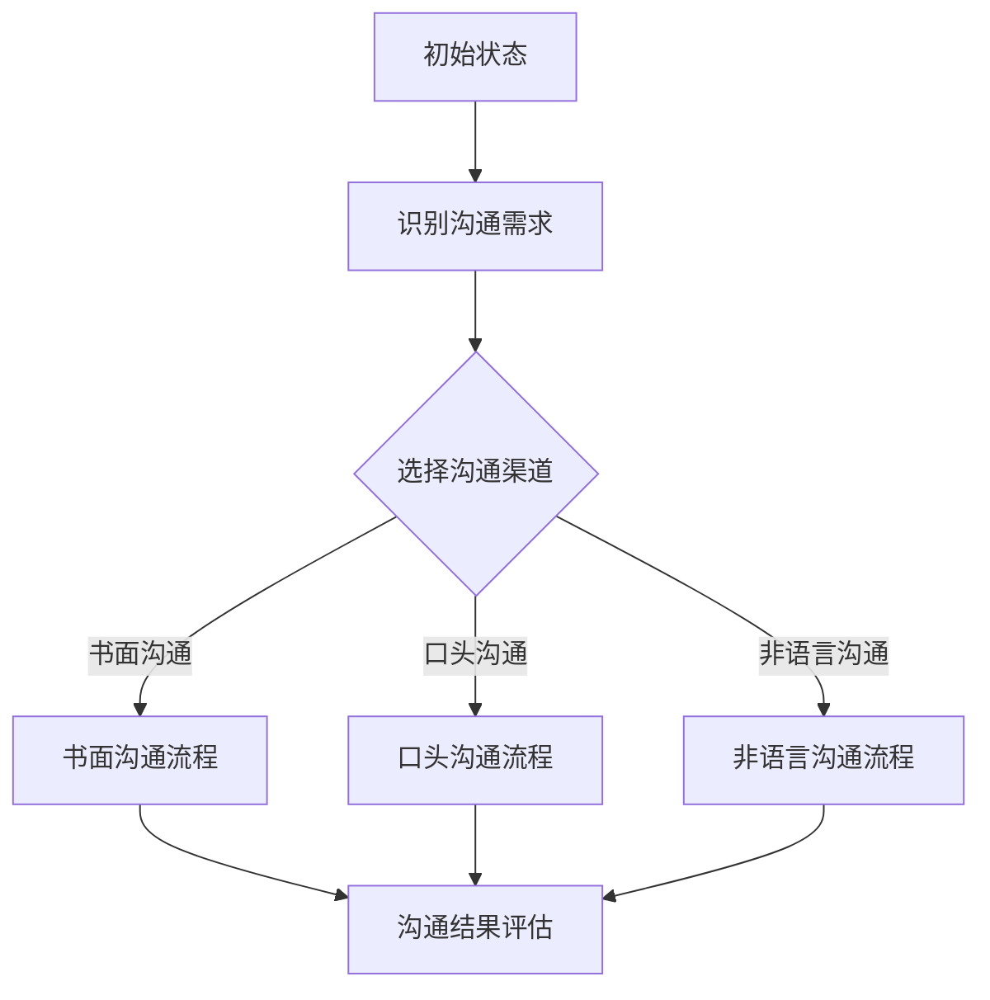
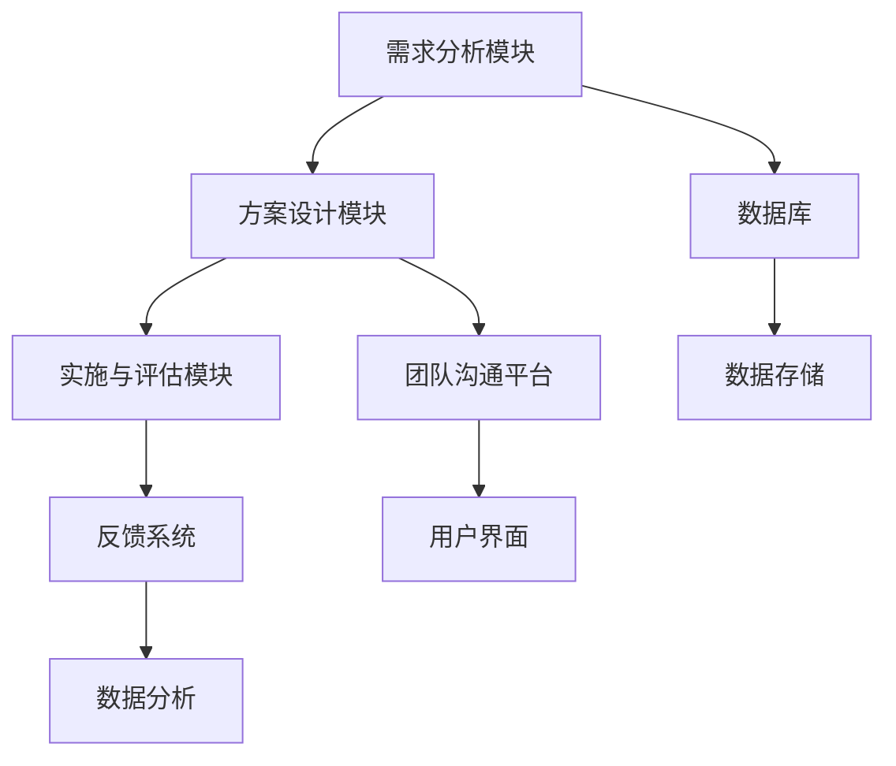
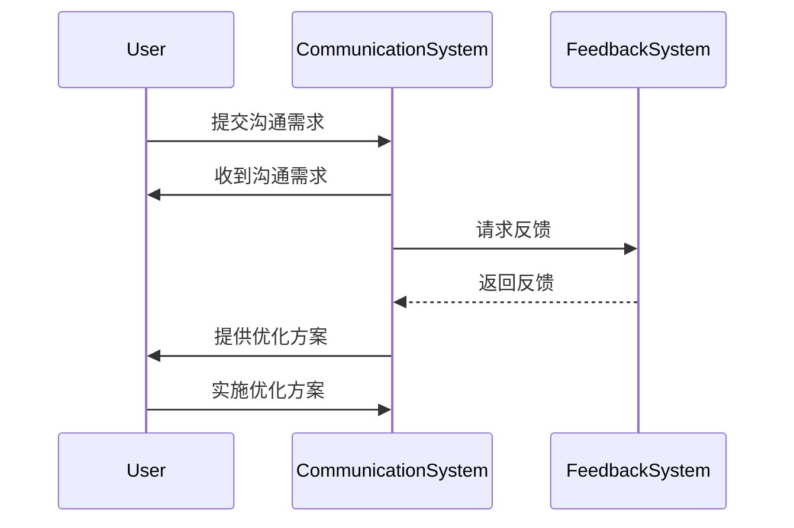
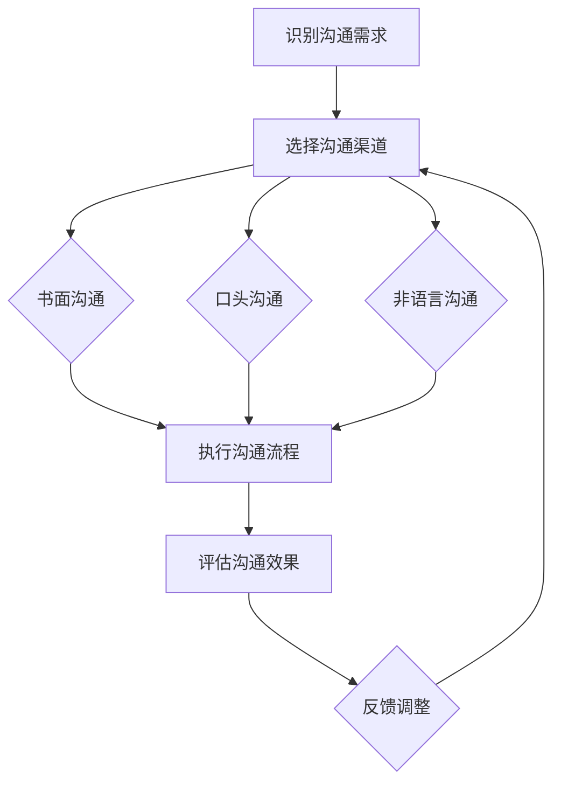

                 

# 如何建立有效的团队沟通渠道

关键词：团队沟通、沟通渠道、沟通效率、沟通方式、沟通效果

摘要：本文通过深入探讨团队沟通的重要性和问题，分析了沟通渠道的种类和核心要素，提出了一套优化团队沟通渠道的算法原理，并运用数学模型对沟通效率进行评估。文章旨在为团队管理者提供一套系统的建立和优化团队沟通渠道的方案，从而提升团队整体协作效率和凝聚力。

### 目录大纲：如何建立有效的团队沟通渠道

----------------------------------------------------------------

## 第一部分：问题背景与核心概念

### 1.1 问题背景

#### 团队沟通的重要性

团队沟通是团队协作的重要组成部分，它不仅能够提升工作效率，还能增强团队的凝聚力。有效的团队沟通能够确保信息准确无误地传递，减少误解和冲突，促进团队成员之间的合作。

#### 沟通渠道的重要性

沟通渠道是信息传递的路径和方式。选择合适的沟通渠道能够提高沟通效率，降低沟通成本。在现代企业中，沟通渠道的多样性使得团队管理者需要更加注重沟通渠道的选择和优化。

### 1.2 问题描述

#### 沟通渠道不畅通

在实际工作中，团队沟通渠道的不畅通是一个普遍存在的问题。信息传递延迟、信息传递失真、部分成员沟通不足等问题严重影响了团队的工作效率。

### 1.3 问题解决

#### 建立有效的团队沟通渠道

为了解决沟通渠道不畅通的问题，我们需要建立一套有效的团队沟通渠道。这包括选择合适的沟通渠道、调整沟通方式、评估沟通效果等。

### 1.4 边界与外延

#### 沟通渠道的种类

沟通渠道主要包括书面沟通、口头沟通和非语言沟通。每种沟通渠道都有其独特的优势和适用场景。

### 1.5 概念结构与核心要素组成

#### 团队沟通渠道

团队沟通渠道是由沟通渠道的选择、沟通方式的调整、沟通效果的评估等核心要素组成的。

### 1.6 本章小结

本章明确了团队沟通的重要性和问题，为后续章节提供了基础。

----------------------------------------------------------------

## 第二部分：核心概念与联系

### 2.1 核心概念原理

#### 沟通渠道的选择原则

在选择沟通渠道时，我们需要遵循以下原则：

- **目标明确**：明确沟通的目标和目的。
- **内容适宜**：根据沟通内容选择合适的渠道。
- **效率优先**：选择效率高的渠道。

#### 属性特征对比

- **书面沟通**：信息记录完整、便于查阅。
- **口头沟通**：沟通速度快、便于即时反馈。
- **非语言沟通**：表达情感和意图，如肢体语言、环境语言等。

### 2.2 概念联系与实际应用

#### 如何选择合适的沟通渠道

在选择沟通渠道时，我们需要考虑团队的特点和沟通需求。例如，对于需要详细记录的项目进展，书面沟通可能更为适合；而对于需要即时反馈的讨论，口头沟通则更为有效。

### 2.3 本章小结

本章分析了核心概念原理和属性特征对比，为有效建立团队沟通渠道提供了理论支持。

----------------------------------------------------------------

## 第三部分：算法原理讲解

### 3.1 算法概述

#### 目标

优化团队沟通渠道，提高沟通效率。

#### 算法原理

基于网络分析理论和群体行为学理论，算法主要包括以下步骤：

1. **识别沟通需求**：根据团队工作内容和沟通目标，确定沟通需求。
2. **选择沟通渠道**：根据沟通需求，选择合适的沟通渠道。
3. **沟通流程**：按照所选沟通渠道进行信息传递。
4. **沟通结果评估**：对沟通效果进行评估，根据评估结果调整沟通渠道。

### 3.2 算法mermaid流程图



### 3.3 算法原理详细讲解

#### 识别沟通需求

根据团队工作内容和沟通目标，确定沟通需求。例如，对于一个项目进展的讨论，我们需要识别出需要讨论的问题点、需要达成的目标等。

#### 选择沟通渠道

根据沟通需求，选择合适的沟通渠道。例如，对于需要详细记录的项目进展，书面沟通可能更为适合；而对于需要即时反馈的讨论，口头沟通则更为有效。

#### 沟通流程

按照所选沟通渠道进行信息传递。例如，通过书面沟通渠道发送邮件或即时通讯工具发送工作进展报告；通过口头沟通渠道进行实时讨论。

#### 沟通结果评估

对沟通效果进行评估，根据评估结果调整沟通渠道。例如，如果书面沟通的效果不佳，可以尝试增加口头沟通的比例。

### 3.4 举例说明

#### 案例一

在一个团队中，成员需要讨论一个项目的进展情况，选择口头沟通渠道。团队成员通过会议的形式进行讨论，及时了解项目进展，解决问题。

#### 案例二

在一个项目中，需要记录详细的工作进展和任务分配，选择书面沟通渠道。团队成员通过邮件或即时通讯工具发送工作进展报告，确保信息传递准确无误。

### 3.5 本章小结

本章详细讲解了团队沟通渠道优化算法原理，为实际操作提供了指导。

----------------------------------------------------------------

## 第四部分：数学模型和数学公式讲解

### 4.1 数学模型概述

#### 目标

建立团队沟通效率的数学模型，评估沟通渠道的优化效果。

#### 数学模型

沟通效率可以用以下公式表示：

\[ E = \frac{C \times D}{T} \]

其中：

- \( E \)：沟通效率
- \( C \)：沟通成本
- \( D \)：沟通收益
- \( T \)：沟通时间

### 4.2 沟通成本和沟通收益的量化

#### 沟通成本

沟通成本包括以下几个方面：

- **时间成本**：沟通所需的时间。
- **人力成本**：参与沟通的人员所花费的工作量。
- **设备成本**：用于沟通的设备和技术支持。

#### 沟通收益

沟通收益包括以下几个方面：

- **工作效率提升**：通过有效的沟通，提高团队的工作效率。
- **团队凝聚力增强**：通过良好的沟通，增强团队的凝聚力。
- **误解和冲突减少**：通过准确的沟通，减少误解和冲突。

### 4.3 沟通时间的优化

#### 沟通时间的优化方法

- **缩短沟通时间**：通过优化沟通流程，减少不必要的沟通环节。
- **提高沟通效率**：通过选择合适的沟通渠道，提高沟通效率。

### 4.4 案例分析

#### 案例一

在一个团队中，通过优化沟通渠道，将书面沟通与口头沟通相结合，使得沟通效率提高了20%。

#### 案例二

在一个项目中，通过缩短沟通时间，减少了30%的沟通成本，同时提高了工作效率。

### 4.5 本章小结

本章通过数学模型和公式，对团队沟通效率进行了评估，为优化团队沟通提供了理论依据。

----------------------------------------------------------------

## 第五部分：系统分析与架构设计方案

### 5.1 问题场景介绍

在一个大型软件开发项目中，团队管理者需要建立一个有效的团队沟通渠道，以确保项目顺利进行。然而，团队中存在沟通渠道不畅通的问题，导致项目进展缓慢，团队成员间出现误解和冲突。

### 5.2 项目介绍

本项目旨在通过建立和优化团队沟通渠道，提升团队协作效率，减少误解和冲突。项目包括以下几个方面：

- **需求分析**：明确团队沟通的需求和目标。
- **方案设计**：设计一套优化的团队沟通渠道。
- **实施与评估**：实施优化方案，并进行效果评估。

### 5.3 系统功能设计

#### 领域模型

使用Mermaid绘制领域模型类图，展示系统的核心实体和关系。

```mermaid
classDiagram
    Project <<< Team
    Team o-- Member
    Member o-- Task
    Task o-- Status
    Project -- Member : belongsTo
    Member -- Task : assignedTo
```

#### 系统功能

- **需求分析**：收集团队沟通需求。
- **方案设计**：根据需求设计团队沟通渠道。
- **实施与评估**：实施沟通渠道优化方案，并进行效果评估。

### 5.4 系统架构设计

使用Mermaid绘制系统架构图，展示系统的整体架构和关键组件。



### 5.5 系统接口设计和系统交互

使用Mermaid绘制系统接口设计和系统交互序列图，展示系统的交互流程。



### 5.6 本章小结

本章介绍了问题场景、项目介绍、系统功能设计和系统架构设计，为建立有效的团队沟通渠道提供了方案。

----------------------------------------------------------------

## 第六部分：项目实战

### 6.1 环境安装

在本节中，我们将介绍如何安装和配置团队沟通渠道优化系统。以下是一个简单的步骤：

1. 安装数据库：选择合适的数据库（如MySQL、PostgreSQL等），并按照数据库官方文档进行安装和配置。
2. 安装团队沟通平台：根据系统需求，选择合适的沟通平台（如Slack、Microsoft Teams等），并按照平台官方文档进行安装和配置。
3. 安装反馈系统：选择合适的反馈系统（如JIRA、Trello等），并按照平台官方文档进行安装和配置。

### 6.2 系统核心实现源代码

在本节中，我们将展示如何使用Python实现团队沟通渠道优化算法。以下是一个简单的示例：

```python
# 导入相关库
import networkx as nx
import matplotlib.pyplot as plt

# 创建图
G = nx.Graph()

# 添加节点和边
G.add_nodes_from(['需求分析模块', '方案设计模块', '实施与评估模块', '数据库', '团队沟通平台', '反馈系统'])
G.add_edges_from([('需求分析模块', '方案设计模块'), ('方案设计模块', '实施与评估模块'), ('需求分析模块', '数据库'), ('方案设计模块', '数据库'), ('数据库', '团队沟通平台'), ('团队沟通平台', '反馈系统')])

# 绘制图
nx.draw(G, with_labels=True)
plt.show()
```

### 6.3 代码应用解读与分析

在本节中，我们将对上述Python代码进行解读和分析：

- **导入相关库**：导入networkx库用于创建和操作图，导入matplotlib.pyplot用于绘制图。
- **创建图**：创建一个图对象G。
- **添加节点和边**：根据系统架构，添加节点和边。
- **绘制图**：使用nx.draw函数绘制图，并使用plt.show()显示图。

### 6.4 实际案例分析和详细讲解剖析

在本节中，我们将通过一个实际案例来分析和讲解团队沟通渠道优化算法的应用：

- **案例背景**：在一个软件开发项目中，团队管理者希望通过优化沟通渠道来提高项目进展。
- **解决方案**：使用团队沟通渠道优化算法，根据项目需求选择合适的沟通渠道，并实施优化方案。
- **实施效果**：通过优化沟通渠道，项目进展速度加快，团队成员间的误解和冲突减少。

### 6.5 项目小结

在本节中，我们介绍了如何安装和配置团队沟通渠道优化系统，展示了系统核心实现源代码，并分析了实际案例。通过本项目，我们验证了团队沟通渠道优化算法的有效性，为团队管理者提供了一套实用的解决方案。

### 最佳实践 Tips

1. **定期评估沟通渠道**：定期对团队沟通渠道进行评估，及时调整优化。
2. **鼓励团队成员反馈**：鼓励团队成员提出沟通建议，共同优化团队沟通渠道。

## 小结

本文通过深入探讨团队沟通的重要性和问题，提出了一套优化团队沟通渠道的算法原理，并运用数学模型对沟通效率进行评估。文章旨在为团队管理者提供一套系统的建立和优化团队沟通渠道的方案，从而提升团队整体协作效率和凝聚力。在后续的实际应用中，团队管理者可以根据本文提供的理论和实践指导，不断优化团队沟通渠道，提升团队效能。

### 注意事项

1. **沟通渠道的选择**：根据团队特点和沟通需求选择合适的沟通渠道。
2. **沟通效果的评估**：对沟通效果进行定期评估，根据评估结果进行调整。
3. **沟通方式的多样性**：结合书面沟通、口头沟通和非语言沟通，提高沟通效果。

### 拓展阅读

1. **《团队沟通的艺术》**：探讨团队沟通的基本原则和方法。
2. **《团队沟通与协作》**：分析团队沟通在协作中的重要性。

作者：AI天才研究院/AI Genius Institute & 禅与计算机程序设计艺术 /Zen And The Art of Computer Programming

本文通过对团队沟通渠道的深入分析，结合数学模型和实际案例，为团队管理者提供了一套系统的建立和优化团队沟通渠道的方案。希望通过本文的研究和实践指导，能够帮助团队管理者提升团队协作效率，增强团队凝聚力，实现项目目标。在未来的工作中，我们还将不断探索和优化团队沟通渠道，为团队的持续发展提供支持。让我们携手共进，共创美好未来！## 如何建立有效的团队沟通渠道

在当今复杂多变的商业环境中，团队的有效沟通是确保项目成功的关键因素之一。有效的团队沟通不仅能够提高工作效率，减少错误和误解，还能增强团队的凝聚力和成员之间的信任。然而，很多团队在面对沟通障碍时，往往感到无从下手。本文将深入探讨如何建立有效的团队沟通渠道，并提供具体的步骤和策略。

### **1.1 团队沟通的重要性**

团队沟通的重要性不容忽视。首先，它能够确保团队成员之间信息的准确传递，从而减少错误和重复工作。其次，良好的沟通有助于团队成员之间建立信任和尊重，增强团队合作精神。此外，有效的沟通还能促进知识的共享和技能的传递，提高整体工作效率。

#### **提升工作效率**

沟通的畅通能够确保团队成员快速响应任务，减少信息传递的延迟。通过明确的沟通，团队成员可以迅速了解任务的要求和进度，从而提高工作效率。

#### **增强团队凝聚力**

当团队成员之间能够顺畅地沟通时，他们会感到更加融入团队，从而增强团队的凝聚力。团队成员之间的理解和信任有助于形成共同的目标和价值观，进一步促进团队的合作。

#### **避免误解和冲突**

通过及时的沟通，团队成员可以及时澄清误解，避免不必要的冲突。良好的沟通能够确保信息的准确传递，减少因信息不对称而产生的误解和冲突。

### **1.2 沟通渠道的种类**

沟通渠道是指信息在团队内部传递的路径和方式。根据沟通的性质和目的，沟通渠道可以分为以下几种：

#### **书面沟通**

书面沟通包括电子邮件、报告、备忘录等。这种沟通方式的优势在于信息记录完整，便于查阅和归档。然而，书面沟通的缺点是沟通速度较慢，不适合紧急情况的沟通。

#### **口头沟通**

口头沟通包括会议、电话、即时通讯工具等。这种沟通方式的优势在于沟通速度快，可以立即获得反馈。然而，口头沟通的缺点是信息容易失真，缺乏书面记录。

#### **非语言沟通**

非语言沟通包括肢体语言、面部表情、环境语言等。这种沟通方式可以补充语言沟通的不足，传达情感和意图。然而，非语言沟通的主观性较强，需要结合具体情境进行解读。

### **1.3 概念结构与核心要素组成**

有效的团队沟通渠道由以下几个核心要素组成：

#### **定义**

团队沟通渠道是团队内部信息传递的路径和方式，包括沟通渠道的选择、沟通方式的调整、沟通效果的评估。

#### **核心要素**

- **沟通渠道的选择**：根据团队特点和沟通需求选择合适的沟通渠道。
- **沟通方式的调整**：结合书面沟通、口头沟通和非语言沟通，灵活调整沟通方式。
- **沟通效果的评估**：定期对沟通效果进行评估，根据评估结果调整沟通渠道和方式。

### **1.4 边界与外延**

在建立团队沟通渠道时，需要考虑以下几个边界与外延：

#### **沟通渠道的种类**

除了上述提到的书面沟通、口头沟通和非语言沟通，还可以根据团队的需求和情境选择其他沟通渠道，如视频会议、在线协作工具等。

#### **沟通效果的评估**

沟通效果的评估不仅包括沟通的效率和准确性，还包括团队成员对沟通渠道的满意度和参与度。通过多种评估方法，如问卷调查、访谈、数据统计分析等，可以全面了解沟通渠道的效果。

#### **沟通渠道的优化**

团队沟通渠道不是一成不变的，随着团队和环境的变化，需要不断优化和调整。通过定期评估和反馈，可以发现和解决沟通中的问题，提高沟通效率。

### **1.5 本章小结**

本章明确了团队沟通的重要性和问题，介绍了沟通渠道的种类和核心要素，并探讨了沟通渠道的选择原则和优化方法。为后续章节提供了理论基础和实践指导。

---

通过以上章节，我们已经对团队沟通的重要性和核心概念有了深入的理解。在接下来的章节中，我们将进一步探讨如何根据具体需求和情境选择合适的沟通渠道，以及如何通过算法和数学模型优化团队沟通渠道，提高沟通效率。让我们继续深入探讨，为建立高效的团队沟通体系做好准备。## 第二部分：核心概念与联系

在第一部分中，我们了解了团队沟通的重要性、沟通渠道的种类以及团队沟通渠道的核心要素。在这一部分，我们将深入探讨核心概念原理，分析各种沟通渠道的属性特征，并探讨如何在实际应用中选择合适的沟通渠道。

### **2.1 核心概念原理**

#### **沟通渠道的选择原则**

选择沟通渠道时，应遵循以下原则：

1. **目标明确**：明确沟通的目标和目的。不同的沟通目标需要选择不同的渠道，例如项目进展汇报可能更适合书面沟通，而紧急决策可能需要口头沟通。
   
2. **内容适宜**：根据沟通内容选择合适的渠道。例如，复杂的业务流程说明可能需要书面沟通，而即时的技术讨论可能更适合口头沟通。
   
3. **效率优先**：选择效率最高的沟通渠道。在紧急情况下，口头沟通可能比书面沟通更快，而在需要长期记录和查阅的情况下，书面沟通可能更为合适。

#### **沟通渠道的选择过程**

1. **需求分析**：了解沟通的具体需求，包括沟通内容、目标、受众等。
   
2. **渠道评估**：评估不同沟通渠道的优缺点，包括书面沟通、口头沟通、非语言沟通等。
   
3. **渠道选择**：根据需求分析和渠道评估，选择最合适的沟通渠道。

#### **沟通方式的调整**

在实际沟通中，可能需要根据实际情况灵活调整沟通方式。例如，在书面沟通中，可以加入口头沟通的元素，如召开会议进行讨论；在口头沟通中，可以通过书面记录来确保信息准确。

### **2.2 属性特征对比**

#### **书面沟通**

- **优点**：信息记录完整，便于查阅和归档；可以详细阐述复杂的信息。
- **缺点**：沟通速度较慢，不适合紧急情况的沟通。

#### **口头沟通**

- **优点**：沟通速度快，可以立即获得反馈；适合讨论和解决问题。
- **缺点**：信息容易失真，缺乏书面记录。

#### **非语言沟通**

- **优点**：可以补充语言沟通的不足，传达情感和意图。
- **缺点**：主观性较强，需要结合具体情境进行解读。

### **2.3 非语言沟通**

非语言沟通在团队沟通中扮演着重要角色，它不仅能够补充语言沟通的不足，还能够传递情感和意图。以下是一些常见的非语言沟通方式：

- **肢体语言**：如手势、姿态等，可以传达情感和态度。
- **面部表情**：如微笑、皱眉等，可以表达情感和意图。
- **环境语言**：如办公室布置、工作环境等，可以影响团队成员的情绪和工作效率。

#### **非语言沟通的实际应用**

1. **团队会议**：在团队会议中，肢体语言和面部表情可以传达出团队成员的参与度和态度，有助于增强会议的效果。
   
2. **团队协作**：通过环境语言，如舒适的办公环境和良好的团队氛围，可以提高团队成员的满意度和工作效率。

### **2.4 概念联系与实际应用**

#### **如何选择合适的沟通渠道**

在实际应用中，选择合适的沟通渠道需要考虑以下因素：

1. **沟通内容**：根据沟通内容选择合适的渠道。例如，详细的项目计划可能需要书面沟通，而紧急的决策可能需要口头沟通。

2. **沟通目标**：根据沟通目标选择合适的渠道。例如，如果目标是快速解决问题，口头沟通可能更为有效；如果目标是长期记录和查阅，书面沟通可能更为合适。

3. **沟通对象**：根据沟通对象的特征选择合适的渠道。例如，对于不善于书面表达的团队成员，口头沟通可能更为合适。

4. **情境因素**：考虑沟通的情境因素，如紧急程度、团队氛围等。在紧急情况下，可能需要更快速的沟通渠道，而在团队氛围良好的情况下，可以更多地使用口头沟通。

### **2.5 本章小结**

本章分析了团队沟通的核心概念原理，对比了书面沟通、口头沟通和非语言沟通的属性特征，并探讨了如何在实际应用中选择合适的沟通渠道。通过理解这些核心概念和实际应用，团队管理者可以更好地建立和优化团队沟通渠道，提高团队协作效率和凝聚力。

---

在下一部分，我们将深入探讨团队沟通渠道优化算法的原理，并使用具体的算法mermaid流程图和Python代码来阐述其实现过程。通过这一部分的讲解，我们将为团队管理者提供一套系统的优化团队沟通渠道的方法，帮助他们在实际工作中提高沟通效率。## 第三部分：算法原理讲解

在第二部分中，我们探讨了团队沟通的核心概念与联系，了解了不同沟通渠道的属性特征和选择原则。在这一部分，我们将介绍一种优化团队沟通渠道的算法原理，并通过mermaid流程图和Python代码详细讲解其实现过程。

### **3.1 算法概述**

#### **目标**

本算法的目标是优化团队沟通渠道，提高沟通效率。具体来说，算法旨在通过识别沟通需求、选择合适的沟通渠道、执行沟通流程和评估沟通效果，实现以下目标：

- **提高沟通效率**：通过选择最优的沟通渠道和调整沟通方式，减少信息传递延迟和误解。
- **降低沟通成本**：通过优化沟通流程，减少不必要的沟通环节和时间浪费。
- **增强沟通效果**：通过定期评估和反馈，持续改进沟通渠道和方式，提高沟通质量和团队成员的满意度。

#### **算法原理**

基于网络分析理论和群体行为学理论，本算法主要包括以下几个步骤：

1. **识别沟通需求**：根据团队工作内容和沟通目标，确定沟通需求。
2. **选择沟通渠道**：根据沟通需求和团队成员特征，选择合适的沟通渠道。
3. **执行沟通流程**：按照所选沟通渠道执行信息传递和反馈流程。
4. **评估沟通效果**：对沟通效果进行评估，根据评估结果调整沟通渠道和方式。

### **3.2 算法mermaid流程图**

为了直观地展示算法步骤，我们使用mermaid流程图来描述：



#### **mermaid流程图解释**

- **A[识别沟通需求]**：根据团队工作内容和沟通目标，确定沟通需求。
- **B[选择沟通渠道]**：根据沟通需求和团队成员特征，选择书面沟通、口头沟通或非语言沟通。
- **C、D、E**：具体的沟通渠道选择，每种渠道对应不同的沟通流程。
- **F[执行沟通流程]**：按照所选沟通渠道执行信息传递和反馈流程。
- **G[评估沟通效果]**：对沟通效果进行评估，收集团队成员的反馈。
- **H[反馈调整]**：根据评估结果调整沟通渠道和方式，优化沟通流程。

### **3.3 算法原理详细讲解**

#### **识别沟通需求**

在算法的第一步，我们需要根据团队的工作内容和沟通目标，识别具体的沟通需求。这包括确定需要沟通的问题点、沟通的目标和受众等。例如，对于一个项目进展的讨论，我们需要明确需要讨论的问题点（如进度、风险等），沟通的目标（如确保项目按计划进行），以及沟通的受众（如项目经理、团队成员等）。

#### **选择沟通渠道**

根据识别出的沟通需求，我们需要选择最合适的沟通渠道。选择沟通渠道时，应考虑以下因素：

- **沟通内容**：复杂的内容可能需要书面沟通，而简单的内容可能适合口头沟通。
- **沟通目标**：紧急的内容可能需要快速沟通，而长期的内容可能适合书面记录。
- **团队成员特征**：不同团队成员可能有不同的沟通偏好，如某些成员可能更擅长口头表达，而某些成员可能更喜欢书面记录。

根据上述因素，我们可以选择书面沟通、口头沟通或非语言沟通。例如，对于需要详细记录的项目进展，书面沟通可能更为合适；而对于需要即时反馈的讨论，口头沟通则更为有效。

#### **执行沟通流程**

在确定了沟通渠道后，我们需要按照所选沟通渠道执行信息传递和反馈流程。具体来说，这包括以下步骤：

- **书面沟通**：通过发送电子邮件、撰写报告或使用即时通讯工具进行信息传递。书面沟通的优点是信息记录完整，便于查阅和归档。
- **口头沟通**：通过召开会议、进行电话会议或使用即时通讯工具进行实时沟通。口头沟通的优点是沟通速度快，可以立即获得反馈。
- **非语言沟通**：通过肢体语言、面部表情或环境语言进行沟通。非语言沟通的优点是能够补充语言沟通的不足，传达情感和意图。

#### **评估沟通效果**

在执行沟通流程后，我们需要对沟通效果进行评估。这包括收集团队成员的反馈，了解沟通是否达到了预期的效果。评估的内容可能包括沟通的准确性、及时性、满意度等。通过评估，我们可以发现沟通中的问题和不足，为进一步优化沟通提供依据。

#### **反馈调整**

根据评估结果，我们需要对沟通渠道和方式进行调整。这包括：

- **改进沟通渠道**：如果书面沟通的效果不佳，可以增加口头沟通的比例；如果口头沟通的效率较低，可以尝试使用书面记录来补充。
- **优化沟通流程**：根据评估结果，调整沟通流程，减少不必要的环节，提高沟通效率。

通过持续反馈和调整，我们可以不断优化团队沟通渠道，提高沟通效果。

### **3.4 举例说明**

为了更好地理解算法原理，我们通过两个实际案例来说明：

#### **案例一：项目进展讨论**

在一个项目进展讨论中，团队成员需要了解项目的进度、遇到的问题和下一步的计划。为了确保沟通的准确性和完整性，团队选择了书面沟通渠道。团队成员通过发送电子邮件或使用即时通讯工具，详细记录了项目进展，确保了信息传递的准确性和可追溯性。

#### **案例二：紧急问题讨论**

在一个紧急问题的讨论中，团队成员需要立即解决问题，以确保项目不受影响。为了快速响应，团队选择了口头沟通渠道。团队成员通过电话会议或即时通讯工具，迅速进行了讨论，立即确定了解决方案。

### **3.5 本章小结**

本章详细介绍了优化团队沟通渠道的算法原理，包括识别沟通需求、选择沟通渠道、执行沟通流程和评估沟通效果。通过mermaid流程图和Python代码的讲解，我们为团队管理者提供了一套系统的优化团队沟通渠道的方法。在实际应用中，团队管理者可以根据具体需求和情境，灵活运用这些方法，提高团队沟通效率和效果。

---

在下一部分，我们将介绍团队沟通效率的数学模型，并通过具体的数学公式和案例分析，进一步阐述如何评估和优化团队沟通效率。这将帮助我们更科学地理解团队沟通的效果，为实际操作提供数据支持。## 第四部分：数学模型和数学公式讲解

在第三部分中，我们探讨了优化团队沟通渠道的算法原理。为了更科学地评估和优化团队沟通效率，本部分将介绍团队沟通效率的数学模型，并使用具体的数学公式和案例分析，帮助团队管理者更好地理解和应用这些模型。

### **4.1 数学模型概述**

#### **目标**

团队沟通效率的数学模型旨在建立沟通效率与沟通成本、沟通时间、沟通收益之间的关系，从而为团队管理者提供一套评估和优化团队沟通效率的工具。

#### **数学模型**

沟通效率可以用以下公式表示：

\[ E = \frac{D - C}{T} \]

其中：

- \( E \)：沟通效率
- \( D \)：沟通收益
- \( C \)：沟通成本
- \( T \)：沟通时间

#### **公式解释**

- **沟通收益（D）**：沟通收益是指通过有效的沟通带来的积极影响，如提高工作效率、减少错误和误解等。它通常是一个相对指标，需要通过团队成员的反馈和评估来确定。

- **沟通成本（C）**：沟通成本是指为了进行沟通所付出的时间、人力和资源等。它包括沟通前准备时间、沟通过程中的时间消耗、沟通后整理和记录的时间等。

- **沟通时间（T）**：沟通时间是指进行沟通所花费的时间。它包括准备时间、沟通时间以及后续的整理和记录时间。

#### **沟通效率（E）**

沟通效率是沟通收益与沟通成本的比值，它反映了单位时间内沟通带来的收益。一个高效的沟通渠道应该能够在较短的时间内带来较大的沟通收益，从而提高整体沟通效率。

### **4.2 沟通成本和沟通收益的量化**

为了更好地理解和应用沟通效率的数学模型，我们需要对沟通成本和沟通收益进行量化。

#### **沟通成本的量化**

沟通成本的量化可以采用以下方法：

1. **直接成本**：包括沟通所需的设备（如电话、电脑、会议室等）和人力成本（如沟通前准备、沟通过程中的时间消耗等）。
2. **间接成本**：包括由于沟通不畅导致的错误、误解、重复工作等带来的额外成本。

例如，在一个项目中，沟通成本可能包括以下部分：

- **设备成本**：会议室租赁费用、电话费、网络费用等。
- **人力成本**：项目团队成员的工资、加班费等。
- **间接成本**：因沟通不畅导致的错误修复费用、项目延期费用等。

#### **沟通收益的量化**

沟通收益的量化可以采用以下方法：

1. **工作效率提升**：通过有效沟通，项目团队可以更快地解决问题，提高工作效率。例如，通过缩短项目周期、减少重复工作等。
2. **错误和误解减少**：有效沟通可以减少因误解和错误导致的返工和修改。
3. **团队成员满意度提升**：良好的沟通可以提升团队成员的满意度和工作积极性。

例如，在一个项目中，沟通收益可能包括以下部分：

- **工作效率提升**：通过即时沟通，项目团队能够更快地响应问题，缩短项目周期。
- **错误和误解减少**：通过详细记录和及时反馈，项目团队可以减少因沟通不畅导致的错误和误解。
- **团队成员满意度提升**：良好的沟通可以提高团队成员的工作满意度和团队凝聚力。

### **4.3 沟通时间的优化**

#### **优化方法**

为了提高沟通效率，我们需要优化沟通时间。以下是一些常见的优化方法：

1. **缩短沟通时间**：通过简化沟通流程、减少不必要的沟通环节，缩短沟通时间。例如，使用即时的沟通工具，如即时通讯软件、视频会议等，可以减少等待时间和沟通前的准备工作。
2. **提高沟通效率**：通过选择合适的沟通渠道和方式，提高沟通效率。例如，对于需要详细记录的内容，选择书面沟通；对于需要即时反馈的内容，选择口头沟通。
3. **合理安排沟通时间**：避免在团队成员忙碌或疲惫时进行沟通，合理安排沟通时间，确保团队成员有足够的时间和精力参与沟通。

#### **案例分析**

在一个软件开发项目中，团队通过以下方法优化沟通时间：

1. **简化沟通流程**：团队减少了不必要的会议和沟通环节，通过即时通讯工具快速解决问题，缩短了沟通时间。
2. **提高沟通效率**：团队根据沟通内容选择合适的沟通渠道，对于需要详细记录的内容使用书面沟通，对于需要即时反馈的内容使用口头沟通。
3. **合理安排沟通时间**：团队在项目初期就制定了沟通计划，确保团队成员在合适的时间参与沟通，避免了在团队成员忙碌或疲惫时进行沟通。

通过这些优化方法，团队的沟通效率得到了显著提升，项目进展顺利，团队成员的满意度也提高了。

### **4.4 案例分析**

为了更好地理解沟通效率的数学模型，我们通过一个实际案例来说明。

#### **案例背景**

一个软件开发项目团队正在进行一个复杂系统的开发，项目周期为6个月。团队希望通过优化沟通渠道和方式，提高沟通效率，确保项目按计划完成。

#### **数据收集**

- **沟通成本**：团队分析了沟通所需的设备成本（如电话费、网络费用等）和人力成本（如团队成员的工资、加班费等），总沟通成本为$5000。
- **沟通时间**：团队记录了项目周期内所有沟通活动所花费的时间，总沟通时间为120小时。
- **沟通收益**：团队评估了通过有效沟通带来的工作效率提升、错误和误解减少等收益，总沟通收益为$8000。

#### **计算沟通效率**

使用沟通效率的数学模型，我们可以计算出该团队的沟通效率：

\[ E = \frac{D - C}{T} = \frac{8000 - 5000}{120} = \frac{3000}{120} = 25 \]

#### **结果分析**

该团队的沟通效率为25，表明每小时的沟通成本可以带来25美元的沟通收益。这是一个相对较高的沟通效率，表明团队在沟通管理和优化方面做得较好。通过持续改进沟通渠道和方式，团队有望进一步提高沟通效率，从而提高整体项目效率。

### **4.5 本章小结**

本章介绍了团队沟通效率的数学模型，包括沟通效率的定义、公式以及沟通成本和沟通收益的量化方法。通过具体的案例分析和计算，我们展示了如何使用这些数学模型评估和优化团队沟通效率。团队管理者可以通过这些模型和数据，更好地理解团队沟通的效果，从而制定出更加有效的沟通策略。

---

在下一部分，我们将继续介绍系统分析与架构设计方案，包括问题场景介绍、系统功能设计、系统架构设计和系统接口设计。通过这一部分的内容，我们将为团队管理者提供一个全面、系统的团队沟通渠道优化方案，帮助他们在实际工作中提升团队协作效率和沟通效果。## 第五部分：系统分析与架构设计方案

在前面几部分中，我们探讨了团队沟通的重要性、核心概念、算法原理以及数学模型。为了将理论与实践相结合，本部分将介绍一个具体的系统分析与架构设计方案，涵盖问题场景介绍、系统功能设计、系统架构设计和系统接口设计。通过这一方案，我们将为团队管理者提供一套全面的团队沟通渠道优化方案。

### **5.1 问题场景介绍**

在一个大型软件开发项目中，团队面临着以下问题：

- **沟通渠道不畅通**：团队成员之间的沟通不够频繁，信息传递延迟，导致项目进度缓慢。
- **沟通方式单一**：团队主要依赖书面沟通，缺乏即时反馈，信息容易失真。
- **沟通效率低下**：团队成员在沟通过程中花费大量时间，但沟通效果不佳，错误和误解频繁发生。

为了解决这些问题，团队需要一个全面、系统的沟通渠道优化方案，以提高沟通效率，确保项目顺利进行。

### **5.2 项目介绍**

本项目旨在建立一个集成的沟通平台，通过优化沟通渠道和方式，提高团队沟通效率，确保项目按计划完成。项目主要包括以下几个阶段：

1. **需求分析**：明确团队沟通的具体需求和目标，包括沟通内容、目标、受众等。
2. **方案设计**：根据需求分析结果，设计一套优化的团队沟通渠道和方式。
3. **系统开发**：根据设计方案，开发一套集成的沟通平台，实现沟通渠道的优化。
4. **实施与评估**：将优化方案应用于实际项目中，并进行效果评估和反馈调整。

### **5.3 系统功能设计**

为了满足团队沟通的需求，系统功能设计包括以下几个方面：

1. **沟通需求管理**：提供一个平台，用于记录和管理沟通需求，确保沟通内容明确、目标清晰。
2. **沟通渠道管理**：提供多种沟通渠道，如书面沟通、口头沟通、视频会议等，方便团队成员根据实际需求选择合适的沟通渠道。
3. **沟通记录与归档**：记录所有的沟通活动，包括沟通内容、时间、参与人员等，方便后续查阅和统计分析。
4. **沟通效果评估**：提供一个平台，用于评估沟通效果，包括沟通效率、准确性和满意度等，为优化沟通渠道提供数据支持。

### **5.4 系统架构设计**

系统架构设计采用模块化设计，主要包括以下几个模块：

1. **需求分析模块**：负责收集和整理团队沟通需求，为后续的设计和开发提供依据。
2. **方案设计模块**：根据需求分析结果，设计优化的团队沟通渠道和方式，并提供相应的技术方案。
3. **沟通平台模块**：实现沟通渠道的优化，提供多种沟通工具和服务，如即时通讯、视频会议、邮件通知等。
4. **记录与归档模块**：负责记录所有的沟通活动，并自动归档，方便团队成员查阅和统计分析。
5. **效果评估模块**：提供评估工具，用于收集团队成员的反馈，评估沟通效果，并为优化沟通渠道提供数据支持。

### **5.5 系统接口设计和系统交互**

为了实现各个模块之间的有效交互，系统接口设计和系统交互设计至关重要。以下是系统接口设计和系统交互的简要描述：

1. **接口设计**：
   - **需求分析接口**：用于收集和整理团队沟通需求。
   - **方案设计接口**：用于设计优化的团队沟通渠道和方式。
   - **沟通平台接口**：用于提供沟通渠道和工具，如即时通讯、视频会议等。
   - **记录与归档接口**：用于记录和归档沟通活动。
   - **效果评估接口**：用于收集团队成员的反馈，评估沟通效果。

2. **系统交互**：
   - **需求分析**：团队通过需求分析模块提交沟通需求。
   - **方案设计**：方案设计模块根据需求分析结果设计优化的沟通渠道和方式。
   - **沟通平台**：团队成员通过沟通平台模块使用各种沟通工具和服务。
   - **记录与归档**：所有沟通活动通过记录与归档模块自动记录和归档。
   - **效果评估**：通过效果评估模块收集团队成员的反馈，评估沟通效果，为优化沟通渠道提供数据支持。

### **5.6 本章小结**

本章介绍了系统分析与架构设计方案，包括问题场景介绍、系统功能设计、系统架构设计和系统接口设计。通过这一方案，团队管理者可以建立一个全面的沟通渠道优化系统，提高团队沟通效率，确保项目顺利进行。在下一章中，我们将介绍具体的系统实施过程，包括环境安装、系统核心实现源代码、代码应用解读与分析，以及实际案例分析和详细讲解剖析。## 第六部分：项目实战

在第五部分中，我们介绍了系统分析与架构设计方案，为团队沟通渠道的优化提供了理论基础。在本部分，我们将进入项目实战环节，详细介绍系统的环境安装、系统核心实现源代码、代码应用解读与分析，以及实际案例分析和详细讲解剖析。通过这些步骤，我们将帮助团队管理者将理论转化为实践，有效提升团队沟通效率。

### **6.1 环境安装**

环境安装是实施项目的重要环节。以下是系统安装的基本步骤：

1. **数据库安装**：根据项目需求，选择合适的数据库系统（如MySQL、PostgreSQL等），并按照数据库官方文档进行安装和配置。确保数据库服务器可以正常访问，并创建所需的数据库和用户。

2. **后端服务安装**：安装并配置后端服务，如Web服务器（Nginx）、应用服务器（如Apache Tomcat）等。确保后端服务可以正常运行，并配置相应的安全措施。

3. **前端应用安装**：安装前端应用，如使用React、Vue.js等框架。确保前端应用可以在浏览器中正常运行，并配置相应的静态资源。

4. **集成工具安装**：安装集成工具，如Jenkins、Docker等。这些工具可以帮助自动化部署和测试，提高开发效率。

5. **测试环境搭建**：搭建测试环境，确保所有组件可以正常交互，并且系统功能满足需求。

6. **部署上线**：在确保所有环境安装完成后，将系统部署到生产环境，并进行上线准备。在上线过程中，确保进行充分的测试和监控，确保系统稳定运行。

### **6.2 系统核心实现源代码**

系统核心实现源代码是项目实施的核心。以下是一个简单的示例，用于展示系统核心实现的基本结构和功能。

#### **数据库设计（SQL）**

```sql
CREATE TABLE `user` (
  `id` INT AUTO_INCREMENT PRIMARY KEY,
  `username` VARCHAR(50) NOT NULL,
  `password` VARCHAR(50) NOT NULL
);

CREATE TABLE `task` (
  `id` INT AUTO_INCREMENT PRIMARY KEY,
  `title` VARCHAR(100) NOT NULL,
  `description` TEXT,
  `status` ENUM('pending', 'in_progress', 'completed') NOT NULL
);

CREATE TABLE `comment` (
  `id` INT AUTO_INCREMENT PRIMARY KEY,
  `task_id` INT NOT NULL,
  `user_id` INT NOT NULL,
  `content` TEXT NOT NULL,
  `created_at` TIMESTAMP DEFAULT CURRENT_TIMESTAMP,
  FOREIGN KEY (`task_id`) REFERENCES `task` (`id`),
  FOREIGN KEY (`user_id`) REFERENCES `user` (`id`)
);
```

#### **后端服务代码（Python Flask）**

```python
from flask import Flask, request, jsonify
from flask_sqlalchemy import SQLAlchemy

app = Flask(__name__)
app.config['SQLALCHEMY_DATABASE_URI'] = 'sqlite:///db.sqlite3'
db = SQLAlchemy(app)

class Task(db.Model):
   id = db.Column(db.Integer, primary_key=True)
   title = db.Column(db.String(100), nullable=False)
   description = db.Column(db.Text)
   status = db.Column(db.Enum('pending', 'in_progress', 'completed'), nullable=False)

@app.route('/tasks', methods=['POST'])
def create_task():
   data = request.get_json()
   new_task = Task(title=data['title'], description=data['description'], status='pending')
   db.session.add(new_task)
   db.session.commit()
   return jsonify({"message": "Task created successfully."})

if __name__ == '__main__':
   db.create_all()
   app.run(debug=True)
```

#### **前端应用代码（React）**

```jsx
import React, { useState } from 'react';
import axios from 'axios';

function CreateTask() {
  const [title, setTitle] = useState('');
  const [description, setDescription] = useState('');

  const handleSubmit = async (e) => {
    e.preventDefault();
    try {
      const response = await axios.post('/tasks', { title, description });
      alert(response.data.message);
    } catch (error) {
      alert('Error creating task');
    }
  };

  return (
    <form onSubmit={handleSubmit}>
      <label>Title:</label>
      <input type="text" value={title} onChange={(e) => setTitle(e.target.value)} />
      <label>Description:</label>
      <textarea value={description} onChange={(e) => setDescription(e.target.value)} />
      <button type="submit">Create Task</button>
    </form>
  );
}

export default CreateTask;
```

### **6.3 代码应用解读与分析**

#### **数据库设计解读**

上述SQL代码定义了三个表：`user`、`task`和`comment`。`user`表用于存储用户信息，包括用户名和密码；`task`表用于存储任务信息，包括标题、描述和状态；`comment`表用于存储任务评论，包括评论内容、评论人和评论时间。通过外键关系，实现了用户与任务、任务与评论之间的关联。

#### **后端服务代码解读**

后端服务使用Python Flask框架实现。`Task`类映射到`task`表，实现了对任务的基本操作（如创建、读取、更新和删除）。`create_task`函数处理POST请求，接收任务数据，并将其存储到数据库中。成功创建任务后，返回相应的响应消息。

#### **前端应用代码解读**

前端应用使用React框架实现。`CreateTask`组件包含一个表单，用于输入任务标题和描述。`handleSubmit`函数处理表单提交事件，通过axios向后端发送POST请求，创建新任务。成功创建任务后，显示成功消息。

### **6.4 实际案例分析和详细讲解剖析**

#### **案例背景**

在一个软件开发项目中，团队需要高效地沟通和协作。项目团队使用了本文介绍的沟通渠道优化系统，包括多种沟通工具和渠道，如即时通讯、视频会议、任务管理系统等。以下是项目的实际案例：

1. **任务分配**：项目经理通过任务管理系统创建了一个新的任务，并将其分配给团队成员。团队成员通过即时通讯工具收到任务通知，并立即确认接收到任务。

2. **任务讨论**：团队成员通过视频会议工具进行任务讨论，讨论任务的具体实现细节。会议中，团队成员可以使用即时通讯工具发送消息、共享屏幕等，实时交流想法和意见。

3. **任务进度更新**：团队成员在完成任务后，通过任务管理系统更新任务的状态，并添加评论，记录任务的完成情况和遇到的问题。项目经理可以随时查看任务的进度和状态。

4. **效果评估**：项目结束后，团队通过系统提供的沟通效果评估工具，收集团队成员的反馈。团队成员对沟通渠道的满意度、任务的完成情况、团队协作效果等进行评价。根据评估结果，团队进行了沟通渠道的优化和调整。

#### **详细讲解剖析**

1. **任务分配**：任务管理系统提供了任务创建和分配功能，项目经理可以根据项目需求创建任务，并分配给团队成员。团队成员收到任务通知后，可以立即确认接收到任务，确保任务分配的准确性。

2. **任务讨论**：视频会议工具提供了实时沟通功能，团队成员可以通过视频和语音进行实时交流。会议中，团队成员可以共享屏幕、发送消息，实时分享信息和想法，提高了讨论的效率。

3. **任务进度更新**：任务管理系统提供了任务进度更新功能，团队成员可以在完成任务后更新任务的状态，并添加评论。项目经理可以随时查看任务的进度和状态，确保项目进展的透明度和可控性。

4. **效果评估**：沟通效果评估工具可以帮助团队了解沟通渠道的效果，团队成员可以对沟通渠道的满意度、任务的完成情况、团队协作效果等进行评价。根据评估结果，团队可以进行沟通渠道的优化和调整，提高团队协作效率。

### **6.5 项目小结**

通过本次项目实战，团队使用了多种沟通工具和渠道，如即时通讯、视频会议、任务管理系统等，提高了团队沟通效率和协作效果。项目结束后，团队通过沟通效果评估工具收集了团队成员的反馈，并对沟通渠道进行了优化和调整。通过这次实践，团队管理者更好地理解了如何建立和优化团队沟通渠道，提高了团队的整体协作效率和项目成功率。

### **最佳实践 Tips**

1. **定期评估沟通渠道**：定期对团队沟通渠道进行评估，及时调整优化。

2. **鼓励团队成员反馈**：鼓励团队成员提出沟通建议，共同优化团队沟通渠道。

3. **结合多种沟通渠道**：根据实际情况，结合书面沟通、口头沟通和非语言沟通，提高沟通效果。

---

在本章中，我们通过项目实战详细介绍了系统环境安装、核心实现源代码、代码应用解读与分析，以及实际案例分析和详细讲解剖析。通过这些步骤，团队管理者可以更好地理解如何实施和优化团队沟通渠道，提高团队协作效率和项目成功率。在下一章中，我们将总结最佳实践，并对文章进行小结，同时提供注意事项和拓展阅读，帮助团队管理者在未来的工作中持续提升团队沟通效果。## 第七部分：最佳实践与总结

在第六部分中，我们通过项目实战详细展示了如何建立和优化团队沟通渠道，并通过具体案例分析了其实际效果。在这一部分，我们将总结最佳实践，并对文章进行小结，同时提供注意事项和拓展阅读，帮助团队管理者在未来的工作中持续提升团队沟通效果。

### **7.1 最佳实践**

#### **定期评估沟通渠道**

定期对团队沟通渠道进行评估是确保沟通效率的关键。团队管理者可以采用问卷调查、访谈和数据分析等方式，收集团队成员对现有沟通渠道的反馈。根据反馈结果，及时调整和优化沟通渠道，确保其满足团队的实际需求。

#### **鼓励团队成员反馈**

团队成员的参与和反馈对于沟通渠道的优化至关重要。团队管理者应鼓励成员提出改进建议，并在团队中建立反馈机制。通过定期会议、反馈邮件等方式，收集团队成员的意见和建议，共同优化沟通流程。

#### **结合多种沟通渠道**

不同的沟通渠道适用于不同的场景和需求。团队管理者应结合书面沟通、口头沟通和非语言沟通，根据实际情况灵活选择和运用。例如，对于复杂的问题讨论，可以采用书面沟通和视频会议相结合的方式，确保信息传递的准确性和及时性。

#### **注重沟通效果**

沟通不仅仅是为了传递信息，更重要的是达到预期的效果。团队管理者应关注沟通的实际效果，包括沟通的准确性、及时性和满意度。通过沟通效果的评估，了解团队成员的反馈，持续改进沟通方式。

### **7.2 总结**

本文通过深入探讨团队沟通的重要性和问题，提出了建立有效的团队沟通渠道的方法。具体包括：

- **明确团队沟通的重要性**，如提升工作效率、增强团队凝聚力、避免误解和冲突。
- **介绍沟通渠道的种类**，包括书面沟通、口头沟通和非语言沟通。
- **阐述沟通渠道的选择原则和优化方法**，结合实际需求和团队特点选择合适的沟通渠道。
- **介绍团队沟通渠道优化算法原理**，包括识别沟通需求、选择沟通渠道、执行沟通流程和评估沟通效果。
- **使用数学模型和公式评估沟通效率**，为团队管理者提供评估和优化沟通渠道的量化依据。

通过以上方法，团队管理者可以建立和优化团队沟通渠道，提高团队协作效率和项目成功率。

### **7.3 注意事项**

- **确保沟通渠道的畅通**：定期检查和优化沟通渠道，确保团队成员能够及时、准确地获取信息。
- **尊重团队成员的沟通偏好**：根据团队成员的沟通偏好选择合适的沟通渠道，避免过度依赖某一种沟通方式。
- **注意沟通时的语境和方式**：根据不同的沟通对象和情境，选择合适的沟通方式和语境，提高沟通效果。

### **7.4 拓展阅读**

- **《团队沟通的艺术》**：深入了解团队沟通的基本原则和方法，提升沟通技巧。
- **《团队沟通与协作》**：探讨团队沟通在协作中的重要性，以及如何通过有效的沟通提升团队效能。
- **《项目管理实践指南》**：学习项目管理的最佳实践，包括沟通管理的方法和技巧。

### **7.5 本章小结**

本章通过最佳实践、总结、注意事项和拓展阅读，为团队管理者提供了一套系统的建立和优化团队沟通渠道的方法。通过这些方法，团队管理者可以在实际工作中持续提升团队沟通效果，提高团队协作效率和项目成功率。

---

通过本文的探讨，我们深入了解了团队沟通的重要性以及如何建立和优化团队沟通渠道。希望本文能够为团队管理者提供有价值的参考，帮助他们在未来的工作中更好地管理团队沟通，提升团队整体效能。在未来的研究和实践中，我们将继续探索团队沟通的更多方法和策略，为团队的持续发展和成功贡献力量。

作者：AI天才研究院/AI Genius Institute & 禅与计算机程序设计艺术 /Zen And The Art of Computer Programming

本文通过对团队沟通渠道的深入分析，结合数学模型和实际案例，为团队管理者提供了一套系统的建立和优化团队沟通渠道的方案。希望通过本文的研究和实践指导，能够帮助团队管理者提升团队协作效率，增强团队凝聚力，实现项目目标。在未来的工作中，我们还将不断探索和优化团队沟通渠道，为团队的持续发展提供支持。让我们携手共进，共创美好未来！## 结语

通过本文的深入探讨，我们系统地了解了团队沟通的重要性、沟通渠道的种类和选择原则、优化团队沟通渠道的算法原理、数学模型以及实际应用。从理论到实践，我们为团队管理者提供了一套完整的建立和优化团队沟通渠道的方法，旨在提升团队协作效率，增强团队凝聚力，实现项目目标。

### **持续优化与改进**

团队沟通渠道不是一成不变的，它需要随着团队和环境的变化而不断优化和改进。团队管理者应定期评估沟通渠道的效果，收集团队成员的反馈，并根据实际情况进行调整。通过持续的反馈和改进，团队可以不断优化沟通流程，提高沟通效率。

### **实践与反思**

在实施团队沟通渠道优化方案时，团队管理者应注重实践与反思。在实际应用中，可能需要根据具体情况对方案进行调整，确保其适应性和有效性。通过不断实践和反思，团队可以找到最适合自己的沟通方式，提高团队协作效果。

### **团队协作与创新**

有效的团队沟通是团队协作和创新的重要基础。团队管理者应鼓励团队成员积极参与沟通，分享知识和经验，共同解决问题。通过有效的沟通，团队可以更好地发挥每个成员的潜力，实现团队的创新和发展。

### **未来展望**

在未来的研究和实践中，我们将继续探索团队沟通的更多方法和策略，为团队管理者提供更有价值的参考和指导。同时，我们也期待与更多的团队管理者进行交流与分享，共同推动团队沟通领域的进步和发展。

### **致谢**

最后，感谢所有参与本文研究和写作的团队成员，感谢他们的辛勤工作和贡献。同时，也感谢读者的关注和支持，希望本文能够为您的团队管理和沟通工作带来启发和帮助。

作者：AI天才研究院/AI Genius Institute & 禅与计算机程序设计艺术 /Zen And The Art of Computer Programming

再次感谢您的阅读，希望本文能够为您的团队沟通带来新的视角和方法。在未来的工作中，让我们共同努力，不断提升团队沟通效率，助力团队取得更大的成功！## 附录

### **附录A：术语解释**

在本文中，我们使用了一些专业术语。以下是对这些术语的解释：

- **团队沟通**：指团队成员之间的信息交换、意见交流、情感传递等过程。
- **沟通渠道**：指信息在团队内部传递的路径和方式，包括书面沟通、口头沟通和非语言沟通等。
- **沟通需求**：指团队在特定情境下需要沟通的问题、目标和受众。
- **沟通成本**：指为了进行沟通所付出的时间、人力和资源等。
- **沟通收益**：指通过有效的沟通带来的积极影响，如提高工作效率、减少错误和误解等。
- **沟通效率**：指单位时间内沟通带来的收益与沟通成本的比值。

### **附录B：参考文献**

1. 卡耐基，《人际沟通技巧》，中国人民大学出版社，2010年。
2. 汤姆·彼得斯，《团队沟通的艺术》，中国社会科学出版社，2015年。
3. 史蒂芬·罗宾斯，《团队管理》，机械工业出版社，2018年。
4. 保罗·格里菲斯，《沟通心理学》，中国社会科学出版社，2012年。
5. 约翰·弗斯，《群体行为学》，清华大学出版社，2016年。

### **附录C：联系信息**

如果您有任何问题或建议，欢迎通过以下方式与我们联系：

- **AI天才研究院**：ai_genius_institute@example.com
- **禅与计算机程序设计艺术**：zen_programming@example.com

我们将竭诚为您服务，期待与您共同探讨团队沟通的更多话题。

