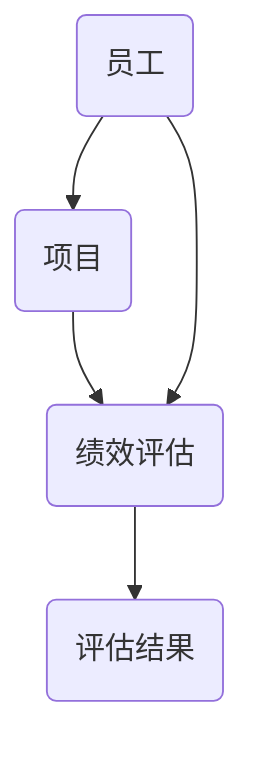

                 


### 第一部分：问题背景与理论基础

#### 第1章：问题背景与绩效管理概述

**1.1 问题背景**

在当今快速发展的信息技术行业，团队绩效评估已成为企业管理中的重要组成部分。一个有效的团队绩效评估体系不仅能激励员工，提高工作效率，还能为企业提供战略性的决策依据。然而，在实际操作中，团队绩效评估面临着诸多挑战。首先，评估标准的不统一性使得不同团队成员的工作绩效难以进行有效比较。其次，绩效评估过程的复杂性和主观性容易导致员工对评估结果的质疑和不公平感。此外，绩效评估结果的应用和反馈机制不完善，往往导致绩效评估流于形式，无法达到预期的激励效果。

**1.1.1 团队绩效评估的重要性**

团队绩效评估对于企业的可持续发展具有重要意义。首先，它能够明确团队目标，确保团队成员的工作方向一致。其次，通过绩效评估，企业可以识别出优秀员工和需要改进的方面，从而制定有针对性的培训和激励措施。此外，绩效评估结果还可以作为员工晋升、薪酬调整和绩效考核的依据，有助于提高员工的积极性和工作效率。

**1.1.2 当前团队绩效评估的挑战与问题**

尽管团队绩效评估的重要性不言而喻，但在实际操作中仍然存在许多问题。首先，评估指标的不明确性导致评估结果的模糊性。其次，评估过程缺乏透明度，容易引发员工的不满和质疑。此外，绩效评估结果的反馈和应用机制不完善，往往导致绩效评估效果不佳。最后，绩效评估体系的设计和实施需要大量的人力和时间投入，对于中小型企业来说，这是一个巨大的挑战。

**1.1.3 团队绩效评估的边界与外延**

团队绩效评估的边界包括评估的时间范围、空间范围和评估内容。在时间范围上，绩效评估可以是短期的，如季度评估，也可以是长期的，如年度评估。在空间范围上，绩效评估可以是对单个团队的评估，也可以是对多个团队的综合评估。在评估内容上，绩效评估既包括对工作成果的评估，也包括对工作过程的评估。

**1.2 绩效管理的核心概念**

绩效管理是一个系统的过程，它包括绩效计划、绩效实施、绩效评估和绩效反馈等环节。绩效管理的核心概念包括：

- **绩效管理定义**：绩效管理是指通过设定目标、评估绩效、反馈结果和提供支持，以促进员工个人和团队绩效的过程。

- **绩效管理目标**：绩效管理的目标是提高员工的绩效水平，促进企业的可持续发展。

- **绩效管理流程**：绩效管理流程包括绩效计划、绩效实施、绩效评估和绩效反馈等环节。

- **绩效管理与组织发展的关系**：绩效管理是组织发展的重要组成部分，它有助于提高组织的整体绩效和竞争力。

**1.3 团队绩效评估的基本原理**

团队绩效评估的基本原理包括以下几个方面：

- **团队绩效评估的理论基础**：团队绩效评估的理论基础包括行为理论、结果理论和平衡理论等。

- **团队绩效评估的原则**：团队绩效评估的原则包括客观性、全面性、公正性和及时性。

- **团队绩效评估的维度与指标**：团队绩效评估的维度包括工作质量、工作效率、工作态度和创新性等。团队绩效评估的指标可以是量化的，也可以是质化的。

**1.4 本章小结**

本章介绍了团队绩效评估的问题背景、核心概念和理论基础。通过分析团队绩效评估的重要性、挑战和基本原则，读者可以更好地理解团队绩效评估的必要性。接下来，我们将进一步探讨如何构建有效的团队绩效评估体系。

----------------------------------------------------------------

#### 第2章：核心概念与联系

**2.1 关键绩效指标（KPI）**

关键绩效指标（KPI）是衡量团队和个人绩效的重要工具。KPI的选择直接关系到绩效评估的有效性。一个有效的KPI应该具备以下特点：

- **可衡量性**：KPI应该能够用具体的数据来衡量，使得评估结果具有客观性。

- **相关性**：KPI应该与团队和个人的工作目标密切相关，确保评估结果能够反映实际工作绩效。

- **挑战性**：KPI应该具有一定的挑战性，能够激励员工不断提升自己的工作表现。

**2.1.1 KPI的定义与作用**

KPI（关键绩效指标）是指用于衡量团队或个人工作绩效的关键指标。它不仅能够帮助管理层了解团队的工作进展，还能够为员工提供明确的绩效目标。

- **KPI的定义**：KPI是关键绩效指标（Key Performance Indicator）的缩写，它是指用于衡量团队或个人工作绩效的关键指标。

- **KPI的作用**：KPI的作用包括明确工作目标、衡量工作绩效、激励员工和提高工作效率等。

**2.1.2 KPI的属性特征对比表格**

| 特征 | 说明 |  
| ---- | ---- |  
| 可衡量性 | KPI应该能够用具体的数据来衡量，确保评估结果具有客观性。 |  
| 相关性 | KPI应该与团队和个人的工作目标密切相关，确保评估结果能够反映实际工作绩效。 |  
| 挑战性 | KPI应该具有一定的挑战性，能够激励员工不断提升自己的工作表现。 |  
| 实用性 | KPI应该简单易懂，方便员工理解和使用。 |

**2.1.3 如何选择适合的KPI**

选择适合的KPI是构建有效团队绩效评估体系的关键步骤。以下是一些选择KPI的实用策略：

- **明确工作目标**：首先，需要明确团队和个人的工作目标，确保KPI与这些目标密切相关。

- **数据可得性**：选择KPI时，要考虑数据是否容易获取，以确保评估过程的可行性。

- **全面性**：KPI的选择应该涵盖团队工作的各个方面，包括质量、效率、创新等。

- **反馈及时性**：KPI的选择应确保评估结果的及时反馈，以便员工能够及时调整工作策略。

**2.2 平衡计分卡（BSC）**

平衡计分卡（Balanced Scorecard，BSC）是一种战略管理工具，它通过财务、客户、内部业务流程和学习与成长四个维度来评估组织的绩效。BSC的应用能够帮助团队从多个角度衡量绩效，确保绩效评估的全面性和均衡性。

**2.2.1 BSC的定义与结构**

- **BSC的定义**：平衡计分卡（Balanced Scorecard，BSC）是一种战略管理工具，它通过财务、客户、内部业务流程和学习与成长四个维度来评估组织的绩效。

- **BSC的结构**：BSC的结构包括四个维度，分别是财务维度、客户维度、内部业务流程维度和学习与成长维度。

**2.2.2 BSC的属性特征对比表格**

| 维度 | 说明 |    
| ---- | ---- |    
| 财务维度 | 衡量组织的财务绩效，如收入、利润、成本等。 |    
| 客户维度 | 衡量组织对客户的满意度和服务质量。 |    
| 内部业务流程维度 | 衡量组织内部业务流程的效率和效果。 |    
| 学习与成长维度 | 衡量组织的学习能力、创新能力和员工发展情况。 |

**2.2.3 BSC在实际团队中的应用**

在实际团队中，BSC的应用可以帮助团队从多个维度评估绩效，确保绩效评估的全面性和均衡性。以下是一些BSC在实际团队中的应用示例：

- **财务维度**：例如，设定收入增长目标、成本降低目标等。

- **客户维度**：例如，客户满意度调查、客户投诉率等。

- **内部业务流程维度**：例如，项目交付周期、生产效率等。

- **学习与成长维度**：例如，员工培训次数、员工满意度调查等。

**2.3 ER实体关系图**

ER实体关系图（Entity-Relationship Diagram，ERD）是用于描述数据库中实体及其之间关系的图形表示方法。在团队绩效评估体系中，ER图可以帮助我们清晰地定义评估对象的实体及其之间的关系。

**2.3.1 ER图的基本概念**

- **实体**：实体是数据库中存储数据的对象，如员工、项目等。

- **属性**：实体具有一些描述性的特征，如姓名、年龄、职位等。

- **关系**：实体之间的关系描述了它们之间的联系，如员工参与项目、项目完成等。

**2.3.2 团队绩效评估相关的ER图**

图2-1展示了团队绩效评估相关的ER图，其中包含了员工、项目、绩效评估等实体及其之间的关系。

```mermaid
erDiagram
    EMPLOYEE ||--|{ PROJECT }|---> PERFORMAN
    PROJECT ||--|{ EVALUATION }|---> EVALUATION_RESULT
    EMPLOYEE ||--|{ EVALUATION }|---> EVALUATION_RESULT
```

**2.3.3 ER图的Mermaid流程图表示**

以下是ER图的Mermaid流程图表示：



**2.4 本章小结**

本章介绍了关键绩效指标（KPI）和平衡计分卡（BSC）的核心概念及其在实际团队绩效评估中的应用。同时，还介绍了ER实体关系图的基本概念和团队绩效评估相关的ER图。通过本章的学习，读者可以更好地理解团队绩效评估的核心概念和构建方法。

----------------------------------------------------------------

#### 第3章：绩效评估流程设计

**3.1 绩效计划**

绩效计划是绩效评估流程的第一步，它为整个绩效评估过程奠定了基础。绩效计划的目标是明确团队和个人的工作目标，确保工作目标与组织的战略目标一致。

**3.1.1 绩效计划的目标与内容**

- **目标**：绩效计划的目标是确保团队和个人的工作目标与组织的战略目标一致，提高工作效率和绩效。

- **内容**：绩效计划的内容包括设定绩效目标、制定绩效指标、明确评估标准、分配任务和责任等。

**3.1.2 绩效计划的制定流程**

绩效计划的制定流程通常包括以下几个步骤：

1. **制定组织战略目标**：首先，组织需要明确其战略目标，这是绩效计划的基础。

2. **分解目标**：将组织的战略目标分解为团队和个人的工作目标，确保目标的可操作性和可实现性。

3. **设定绩效指标**：根据工作目标，设定相应的绩效指标，确保指标的可衡量性和相关性。

4. **制定评估标准**：明确绩效评估的标准，包括评估的时间范围、评估方法、评估结果的应用等。

5. **分配任务和责任**：明确团队成员的任务和责任，确保每个成员都知道自己的工作目标和责任。

**3.1.3 绩效计划实施中的注意事项**

在实施绩效计划时，需要注意以下几点：

- **明确沟通**：确保团队成员理解绩效计划的目标、指标和标准，避免误解和冲突。

- **灵活性**：绩效计划应具有一定的灵活性，以适应工作环境的变化和团队的需求。

- **持续跟踪**：对绩效计划的实施过程进行持续跟踪和监控，及时发现和解决问题。

**3.2 绩效实施**

绩效实施是绩效评估流程的核心步骤，它包括绩效跟踪、绩效反馈和绩效改进等环节。

**3.2.1 绩效跟踪与监控**

- **绩效跟踪**：通过定期的检查和反馈，确保团队成员的工作按照绩效计划进行。

- **监控**：对工作进度、工作质量和工作环境进行监控，确保工作顺利进行。

**3.2.2 绩效反馈与沟通**

- **绩效反馈**：通过定期的绩效反馈会议，对团队成员的工作进行评估和反馈，帮助他们识别优点和改进空间。

- **沟通**：保持团队内部的沟通畅通，确保团队成员之间能够及时分享信息和经验。

**3.2.3 绩效改进与调整**

- **改进**：根据绩效反馈，对工作方法和流程进行改进，提高工作效率和绩效。

- **调整**：根据工作环境的变化和团队需求，对绩效计划进行适当调整，确保其持续有效性。

**3.3 绩效评估**

绩效评估是绩效评估流程的最后一步，它对整个绩效评估过程进行总结和评价。

**3.3.1 绩效评估的方法与工具**

- **评估方法**：绩效评估可以采用定量评估和定性评估相结合的方法，确保评估结果的客观性和全面性。

- **评估工具**：可以使用各种评估工具，如KPI、BSC、360度评估等，帮助团队进行绩效评估。

**3.3.2 绩效评估的步骤与流程**

- **制定评估计划**：明确评估的目的、时间、评估方法和评估团队。

- **收集数据**：通过问卷调查、面谈、观察等方式收集团队成员的工作数据。

- **分析数据**：对收集到的数据进行整理和分析，形成评估报告。

- **评估结果反馈**：将评估结果反馈给团队成员，帮助他们在未来工作中更好地提升自己的绩效。

- **评估结果应用**：根据评估结果，制定相应的激励和培训计划，提高团队的整体绩效。

**3.3.3 绩效评估的常见问题与解决策略**

在绩效评估过程中，可能会遇到以下问题：

- **评估标准不明确**：解决策略：明确评估标准，确保团队成员对评估标准有清晰的认识。

- **评估结果不公平**：解决策略：确保评估过程的公正性和透明度，减少主观因素的影响。

- **评估结果不被认可**：解决策略：加强与团队成员的沟通，确保评估结果得到认可和接受。

**3.4 本章小结**

本章介绍了绩效评估流程的设计，包括绩效计划、绩效实施和绩效评估等环节。通过合理的绩效计划，明确的绩效实施和科学的绩效评估，可以构建一个有效的团队绩效评估体系，提高团队的整体绩效和效率。

----------------------------------------------------------------

#### 第4章：团队绩效评估体系设计案例

**4.1 案例背景**

本案例以某IT公司为例，该公司是一家专注于软件开发和IT解决方案的企业，员工人数约为200人。公司近年来业务发展迅速，对团队绩效评估的需求日益增长。然而，现有的绩效评估体系存在一些问题，如评估标准不明确、评估过程缺乏透明度等。为了提升团队绩效和员工满意度，公司决定重新设计和优化绩效评估体系。

**4.1.1 案例企业介绍**

该公司成立于2005年，总部位于中国北京，是一家专注于软件开发和IT解决方案的企业。公司提供的产品和服务包括定制化软件开发、系统集成、IT咨询等。公司客户涵盖了金融、教育、医疗等多个行业。

**4.1.2 案例企业的绩效管理现状**

目前，公司的绩效管理主要依赖于年度考核，评估标准较为单一，主要基于工作完成情况和团队合作表现。然而，这种方式存在评估结果模糊、缺乏透明度和反馈不及时等问题。此外，公司的绩效评估体系缺乏对员工成长和职业发展的关注，影响了员工的积极性和忠诚度。

**4.1.3 案例企业绩效评估的需求分析**

为了优化绩效评估体系，公司分析了以下几个方面的需求：

- **明确评估标准**：制定明确的评估标准，确保评估结果具有客观性和可比性。

- **提升评估透明度**：确保评估过程透明，提高员工对评估结果的认可度。

- **关注员工成长**：将员工成长和职业发展纳入绩效评估体系，激发员工的潜力。

- **及时反馈**：建立及时反馈机制，帮助员工改进工作方法和提升绩效。

**4.2 案例分析**

**4.2.1 绩效计划的设计**

在新的绩效评估体系下，公司首先明确了绩效计划的目标和内容。绩效计划的目标是确保团队和个人的工作目标与公司战略目标一致，提升工作效率和绩效。绩效计划的内容包括：

- **设定绩效目标**：根据公司战略目标和部门职责，设定具体、可量化的绩效目标。

- **制定评估标准**：明确评估的标准和指标，包括工作质量、工作效率、团队合作和创新性等方面。

- **分配任务和责任**：明确团队成员的任务和责任，确保每个成员都清楚自己的工作目标。

**4.2.2 绩效实施的过程**

在绩效实施过程中，公司采取了一系列措施来确保绩效目标的实现：

- **绩效跟踪与监控**：定期检查工作进度，及时发现和解决问题，确保工作按计划进行。

- **绩效反馈与沟通**：通过定期反馈会议，对团队成员的工作进行评估和反馈，帮助他们识别优点和改进空间。

- **绩效改进与调整**：根据反馈结果，对工作方法和流程进行改进，提高工作效率和绩效。

**4.2.3 绩效评估的结果与分析**

在绩效评估阶段，公司采用了多维度评估方法，包括定量评估和定性评估。评估结果如下：

- **工作质量**：大部分团队成员的工作质量较高，完成任务的准确性和及时性较好。

- **工作效率**：团队成员的工作效率整体较高，但部分团队成员在时间管理方面仍有待改进。

- **团队合作**：团队成员之间的合作较为顺畅，能够共同解决问题，但个别团队成员在沟通和协作方面存在不足。

- **创新性**：团队成员在创新性方面表现良好，提出了一些有价值的建议和改进措施。

根据评估结果，公司采取了以下措施：

- **奖励优秀员工**：对表现优秀的员工进行表彰和奖励，激励他们继续保持高水平的工作表现。

- **培训与发展**：针对评估中存在的问题，为员工提供相应的培训和发展机会，提高他们的工作能力和综合素质。

- **调整绩效计划**：根据评估结果，对绩效计划进行适当调整，确保评估指标的科学性和合理性。

**4.3 案例总结**

**4.3.1 案例中成功的经验**

- **明确评估标准**：通过制定明确的评估标准，确保评估结果具有客观性和可比性。

- **提升评估透明度**：通过定期反馈会议，提高员工对评估结果的认可度。

- **关注员工成长**：将员工成长和职业发展纳入绩效评估体系，激发员工的潜力。

**4.3.2 案例中遇到的问题与解决方案**

- **评估标准不明确**：解决策略：制定详细的评估标准和指标，确保团队成员对评估标准有清晰的认识。

- **评估过程缺乏透明度**：解决策略：加强沟通和反馈机制，提高评估过程的透明度。

- **评估结果不被认可**：解决策略：通过培训和教育，提高员工对评估结果的认可度。

**4.3.3 案例对其他企业的借鉴意义**

- **明确评估标准**：制定明确的评估标准，确保评估结果具有客观性和可比性。

- **提升评估透明度**：建立透明的评估过程，提高员工对评估结果的认可度。

- **关注员工成长**：将员工成长和职业发展纳入绩效评估体系，激发员工的潜力。

**4.4 本章小结**

通过本案例的分析，我们可以看到，一个有效的团队绩效评估体系需要明确评估标准、提升评估透明度和关注员工成长。这些成功经验对于其他企业具有重要的借鉴意义，可以帮助它们优化绩效评估体系，提升团队绩效和员工满意度。

----------------------------------------------------------------

#### 第5章：绩效评估与员工激励

**5.1 绩效评估与员工激励的关系**

绩效评估和员工激励是相辅相成的两个环节。绩效评估为员工激励提供了依据，而员工激励则能够提升绩效评估的效果。

**5.1.1 绩效评估在员工激励中的作用**

- **明确工作目标**：绩效评估能够明确员工的工作目标，帮助员工了解自己的职责和期望。

- **激励员工提升绩效**：通过绩效评估，能够激励员工在工作中发挥潜力，提升绩效。

- **提供反馈和指导**：绩效评估为员工提供反馈和指导，帮助员工识别自己的优势和不足，进行自我提升。

**5.1.2 员工激励对绩效评估的影响**

- **提升员工参与度**：有效的员工激励能够提升员工的参与度，使他们更加投入到工作中，从而提高绩效评估的有效性。

- **改善工作态度**：员工激励能够改善员工的工作态度，使员工更加积极主动地完成工作。

- **促进团队合作**：员工激励有助于促进团队合作，提高团队的整体绩效。

**5.1.3 绩效评估与员工激励的平衡**

在构建团队绩效评估体系时，需要平衡绩效评估和员工激励的关系。以下是一些平衡策略：

- **合理设定绩效目标**：绩效目标应既具有挑战性，又能被员工接受，避免过于苛刻的目标导致员工失去动力。

- **多样化的激励措施**：根据员工的个人需求和团队的整体目标，设计多样化的激励措施，包括物质激励和精神激励。

- **及时反馈和沟通**：通过定期的绩效反馈和沟通，让员工了解自己的绩效表现和激励情况，确保激励措施能够有效实施。

**5.2 绩效评估结果的运用**

绩效评估结果的运用直接关系到绩效评估体系的有效性。以下是一些常见的运用策略：

- **薪酬管理**：将绩效评估结果作为薪酬管理的重要依据，对表现优秀的员工进行薪酬奖励，激励他们持续提升绩效。

- **晋升管理**：根据绩效评估结果，为员工提供晋升机会，激励他们不断提升自己的能力。

- **培训与发展**：针对评估中发现的问题，为员工提供相应的培训和发展机会，帮助他们提升技能和职业素养。

**5.2.1 绩效评估结果在薪酬管理中的应用**

- **绩效奖金**：根据绩效评估结果，为表现优秀的员工发放绩效奖金，激励他们继续努力。

- **薪酬调整**：将绩效评估结果作为薪酬调整的依据，对表现优秀的员工进行薪酬提升。

- **薪酬结构优化**：根据绩效评估结果，优化薪酬结构，确保薪酬体系能够激发员工的积极性和创造力。

**5.2.2 绩效评估结果在晋升管理中的应用**

- **晋升评审**：将绩效评估结果作为晋升评审的重要依据，优先考虑绩效表现优秀的员工。

- **晋升机会分配**：根据绩效评估结果，为表现优秀的员工提供更多的晋升机会。

- **晋升通道规划**：为员工规划清晰的晋升通道，确保员工的职业发展路径明确。

**5.2.3 绩效评估结果在员工培训与发展中的应用**

- **培训需求分析**：根据绩效评估结果，分析员工的培训需求，为员工提供有针对性的培训。

- **培训计划制定**：根据绩效评估结果，制定员工的培训计划，确保培训与员工的职业发展目标一致。

- **培训效果评估**：对培训效果进行评估，确保培训能够有效提升员工的绩效。

**5.3 员工激励策略**

员工激励策略包括绩效导向的激励策略、结果导向的激励策略和过程导向的激励策略等。

**5.3.1 绩效导向的激励策略**

- **设定明确的目标**：为员工设定明确的绩效目标，确保他们了解自己的工作期望。

- **提供奖励和认可**：为表现优秀的员工提供奖励和认可，激励他们继续提升绩效。

- **提供发展机会**：为员工提供职业发展机会，帮助他们实现个人职业目标。

**5.3.2 结果导向的激励策略**

- **关注绩效结果**：将绩效结果作为激励的重点，对绩效优秀的员工进行奖励。

- **建立绩效反馈机制**：定期向员工反馈绩效结果，鼓励他们持续提升绩效。

- **提供晋升机会**：为绩效优秀的员工提供晋升机会，激励他们追求更高的目标。

**5.3.3 过程导向的激励策略**

- **关注工作过程**：关注员工的工作过程，鼓励他们在工作中积极探索和创新。

- **提供支持和资源**：为员工提供必要的工作支持和资源，帮助他们克服困难，提高工作效率。

- **培养团队文化**：培养积极向上的团队文化，激发员工的归属感和工作热情。

**5.4 本章小结**

本章介绍了绩效评估与员工激励的关系以及绩效评估结果的运用策略。通过合理的绩效评估和有效的员工激励，可以提升团队绩效和员工满意度，促进企业的可持续发展。

----------------------------------------------------------------

#### 第6章：技术工具与绩效评估

**6.1 绩效评估工具的选择**

选择合适的绩效评估工具是构建有效绩效评估体系的关键步骤。以下是一些常用的绩效评估工具及其特点：

- **KPI工具**：KPI（关键绩效指标）工具用于衡量团队和个人的工作绩效。其特点包括可量化、可比较和易于监控。

- **BSC工具**：BSC（平衡计分卡）工具通过财务、客户、内部业务流程和学习与成长四个维度来评估组织的绩效。其特点包括全面性、均衡性和战略导向。

- **360度评估工具**：360度评估工具通过收集团队成员的反馈，对个人和团队的工作进行全方位评估。其特点包括客观性、全面性和互动性。

**6.1.1 绩效评估工具的分类**

根据评估对象的不同，绩效评估工具可以分为以下几类：

- **个人绩效评估工具**：如KPI工具、360度评估工具等，主要用于评估个人的工作绩效。

- **团队绩效评估工具**：如BSC工具、项目管理工具等，主要用于评估团队的整体绩效。

- **组织绩效评估工具**：如绩效管理软件、组织能力评估工具等，主要用于评估组织的整体绩效。

**6.1.2 绩效评估工具的选择标准**

在选择绩效评估工具时，需要考虑以下标准：

- **适用性**：评估工具应适用于企业的业务特点和团队规模。

- **易用性**：评估工具应简单易用，便于员工理解和操作。

- **灵活性**：评估工具应具备一定的灵活性，以适应企业的变化和需求。

- **可扩展性**：评估工具应具备良好的扩展性，能够满足企业未来的发展需求。

**6.2 绩效评估软件**

绩效评估软件是用于管理、跟踪和评估团队和员工绩效的工具。以下是一些常用的绩效评估软件及其特点：

- **Workday**：Workday是一款全面的绩效管理软件，提供了包括绩效计划、绩效评估、薪酬管理等功能。

- **SAP SuccessFactors**：SAP SuccessFactors是一款功能强大的绩效管理软件，提供了包括KPI管理、360度评估、绩效反馈等功能。

- **Adobe Workfront**：Adobe Workfront是一款项目管理软件，也提供了绩效管理功能，适用于需要高效协同工作的团队。

**6.2.1 绩效评估软件的功能**

绩效评估软件通常具备以下功能：

- **绩效计划**：制定绩效目标、分配任务和责任。

- **绩效评估**：收集评估数据、分析评估结果、生成评估报告。

- **绩效反馈**：提供反馈和指导，帮助员工改进工作。

- **绩效跟踪**：跟踪绩效目标的完成情况，监控绩效进展。

- **薪酬管理**：管理员工的薪酬和福利，与绩效评估结果关联。

- **报告和仪表盘**：生成各种绩效报告和仪表盘，提供实时数据分析和可视化。

**6.2.2 绩效评估软件的优势**

使用绩效评估软件的优势包括：

- **提高效率**：自动化流程和数据分析，节省时间和人力资源。

- **增强透明度**：清晰的评估流程和结果，提高员工对绩效评估的认可度。

- **优化决策**：基于数据的分析和决策，提高绩效评估的准确性和科学性。

- **支持协作**：多人协作和沟通功能，促进团队协作和工作效率。

**6.3 实践案例**

以下是一个实践案例，介绍如何使用绩效评估软件优化团队绩效评估：

**案例背景**：某互联网公司为了提高团队绩效和员工满意度，决定引入绩效评估软件。

**步骤1：选择绩效评估软件**：公司根据业务特点和需求，选择了SAP SuccessFactors作为绩效评估软件。

**步骤2：制定绩效计划**：公司使用SAP SuccessFactors制定绩效计划，包括设定绩效目标、分配任务和责任等。

**步骤3：绩效评估与反馈**：通过SAP SuccessFactors收集团队成员的绩效数据，进行分析和评估，并提供反馈和指导。

**步骤4：绩效跟踪与监控**：使用SAP SuccessFactors跟踪绩效目标的完成情况，监控绩效进展。

**步骤5：报告与仪表盘**：生成各种绩效报告和仪表盘，提供实时数据分析和可视化，帮助管理层做出决策。

**案例总结**：通过使用绩效评估软件，公司提高了绩效评估的效率、透明度和准确性，员工对绩效评估的认可度和满意度也得到了显著提升。

**6.4 本章小结**

本章介绍了绩效评估工具的选择、绩效评估软件的功能和优势，以及一个实践案例。通过合理选择和使用绩效评估工具，企业可以优化绩效评估流程，提高团队绩效和员工满意度。

