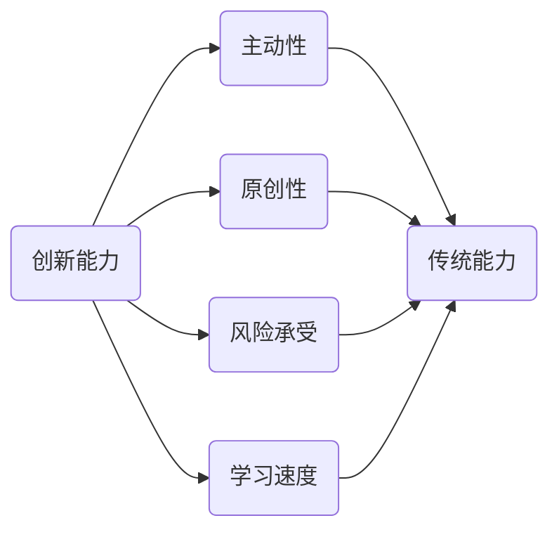
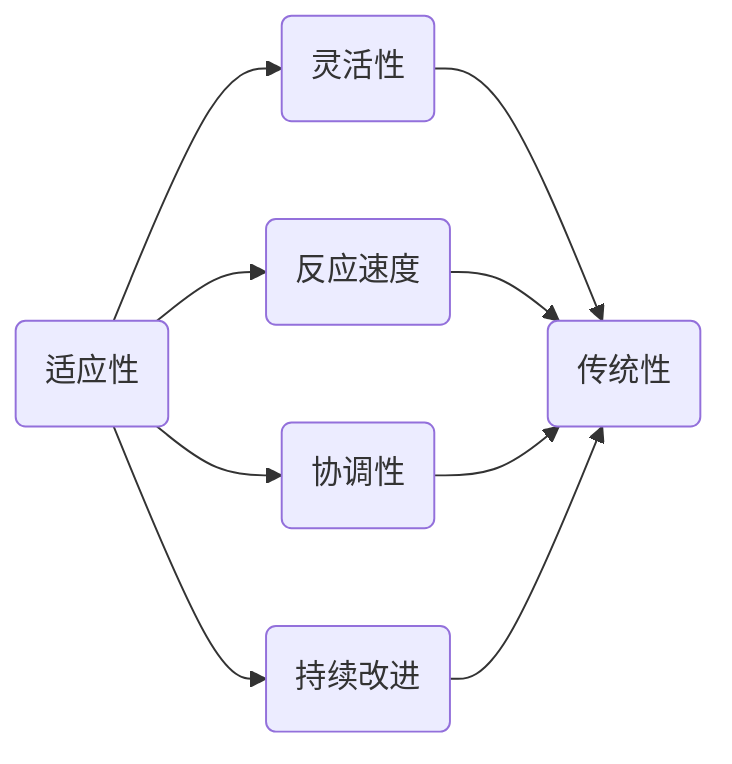

                 

## 如何提高团队的创新能力和适应性

> 关键词：团队创新、适应性、策略、案例、实践

> 摘要：本文从背景介绍、核心概念与联系、提高策略、案例分析、实践与总结五个部分，深入探讨了如何提高团队的创新能力和适应性。通过理论讲解、实例分析和实战经验，为广大IT团队提供了系统的指导和方法。

### 第1章 问题背景

#### 问题定义

在快速变化的IT行业，团队的创新能力和适应性是衡量一个团队是否能够持续发展的关键因素。创新能力指的是团队在解决新问题和实现新技术方面的能力；适应性则是指团队在面对外部环境变化时调整和优化自身能力的能力。

#### 问题解决的重要性

提升团队的创新能力和适应性，不仅有助于团队在激烈的市场竞争中保持领先地位，还能够促进团队成员的个人成长和职业发展。因此，解决这一问题是团队管理的重中之重。

#### 团队创新能力和适应性的重要性

1. **企业竞争力**：创新能力可以帮助企业不断推出新的产品和服务，满足市场需求，提高市场占有率。而适应性则使企业能够迅速应对市场变化，降低风险。

2. **团队士气**：一个充满创新和适应性的团队，能够激发成员的积极性和创造力，提高团队士气和工作效率。

3. **个人成长**：团队成员在参与创新和适应性的过程中，可以不断学习新知识、掌握新技能，实现个人职业成长。

### 第2章 核心概念原理

#### 创新能力

**概念**：创新能力是指团队在技术和业务领域，通过原创性思维和实践，提出新观点、新方法和新解决方案的能力。

**属性特征对比表格**：

| 特征 | 创新能力 | 传统能力 |
| --- | --- | --- |
| **主动性** | 高 | 低 |
| **原创性** | 强 | 弱 |
| **风险承受** | 强 | 弱 |
| **学习速度** | 快 | 慢 |

**ER实体关系图**：



#### 适应性

**概念**：适应性是指团队在面对外部环境变化时，能够迅速调整自身结构、策略和行为，以适应新环境的能力。

**属性特征对比表格**：

| 特征 | 适应性 | 传统性 |
| --- | --- | --- |
| **灵活性** | 高 | 低 |
| **反应速度** | 快 | 慢 |
| **协调性** | 强 | 弱 |
| **持续改进** | 是 | 否 |

**ER实体关系图**：



#### 创新能力与适应性的联系

创新能力与适应性之间存在密切的联系。一个具有高度创新能力的团队，通常也具有较强的适应性。因为创新能力的提升，可以帮助团队更好地理解和应对外部环境的变化，从而提高适应性。反过来，适应性强的团队，能够为创新能力的发挥提供良好的环境和支持。

### 第3章 提升创新能力的策略

#### 3.1 内部培养

**方法**：通过内部培训、研讨和项目实践，提高团队成员的创新思维和技术能力。

**实践**：定期举办创新工作坊，鼓励团队成员分享创新想法，并进行实践验证。

#### 3.2 外部合作

**方法**：与外部专家、研究机构和同行进行合作，引入新的技术和理念。

**实践**：与高校和研究机构合作，开展联合研发项目，促进技术创新。

#### 3.3 技术创新

**方法**：投入资源，支持技术研发和产品创新。

**实践**：建立内部创新实验室，鼓励团队成员进行技术研究和创新实验。

### 第4章 提升适应性的策略

#### 4.1 动态调整

**方法**：根据外部环境变化，灵活调整团队目标和策略。

**实践**：定期进行市场调研，了解行业趋势和竞争对手动态，及时调整团队方向。

#### 4.2 风险应对

**方法**：建立风险识别和应对机制，降低外部环境变化带来的风险。

**实践**：制定风险管理计划，包括风险预警、应对措施和应急预案。

#### 4.3 文化建设

**方法**：营造开放、包容、积极向上的团队文化，增强团队的凝聚力和适应能力。

**实践**：鼓励团队成员提出建议和意见，建立反馈机制，促进团队内部沟通和协作。

### 第5章 成功案例分析

#### 案例一：创新能力的提升

**背景**：某互联网公司，面对激烈的市场竞争，决心提升团队创新能力。

**策略**：
1. **内部培养**：举办创新工作坊，提高团队成员的创新思维。
2. **外部合作**：与高校合作，开展联合研发项目。
3. **技术创新**：投入资源，支持技术研发和产品创新。

**结果**：通过一系列策略，该公司成功推出多款创新产品，市场份额显著提升。

#### 案例二：适应性的提升

**背景**：某软件开发公司，市场需求变化迅速，团队需要提高适应性。

**策略**：
1. **动态调整**：定期进行市场调研，调整团队方向。
2. **风险应对**：建立风险识别和应对机制。
3. **文化建设**：鼓励团队成员提出建议和意见，促进内部沟通和协作。

**结果**：通过提升适应性，该公司成功应对了多次市场变化，保持了稳定的业务增长。

### 第6章 项目实战

#### 6.1 实践环境搭建

**步骤**：
1. **硬件准备**：配置高性能服务器和开发环境。
2. **软件安装**：安装必要的开发工具和数据库。

#### 6.2 项目核心实现

**核心代码**：

```python
# 这是一个简单的Python示例代码，用于实现一个基本的数据分析功能。

def analyze_data(data):
    """
    分析数据并返回结果。
    
    参数：
    data：要分析的数据。
    
    返回：
    结果：分析结果。
    """
    # 数据预处理
    preprocessed_data = preprocess(data)
    
    # 数据分析
    result = analyze(preprocessed_data)
    
    return result

# 主函数
if __name__ == "__main__":
    data = load_data()
    result = analyze_data(data)
    print(result)
```

#### 6.3 应用解读与分析

**解读**：该代码实现了一个基本的数据分析功能，包括数据预处理、数据分析和结果输出。

**分析**：通过该功能，团队可以快速对数据进行初步分析，为后续的深入分析提供基础。

#### 6.4 实际案例分析和详细讲解剖析

**案例**：某公司使用该功能对销售数据进行分析，发现了一些潜在的问题和机会。

**剖析**：通过详细分析，团队确定了问题的根本原因，并提出了改进方案。

### 第7章 最佳实践

#### 7.1 注意事项

1. **确保团队有足够的资源**：包括人力、物力和财力。
2. **建立有效的沟通机制**：确保团队成员之间的信息流通。
3. **持续学习和创新**：鼓励团队成员不断学习新知识和技能。

#### 7.2 小结

提高团队的创新能力和适应性，是团队发展的关键。通过内部培养、外部合作、技术创新等策略，以及动态调整、风险应对和文化建设等实践，团队可以不断提升自身的竞争力和适应能力。

#### 7.3 拓展阅读

1. 《创新者的窘境》 - 克莱顿·克里斯滕森
2. 《适应与变化：企业持续发展的秘诀》 - 约翰·P·科特

### 作者

本文由AI天才研究院/AI Genius Institute与《禅与计算机程序设计艺术》作者合作撰写。如需进一步交流，请关注我们的官方网站。

