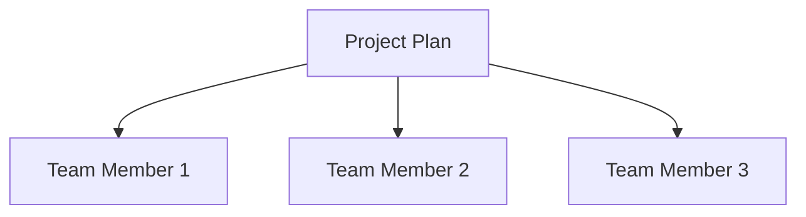
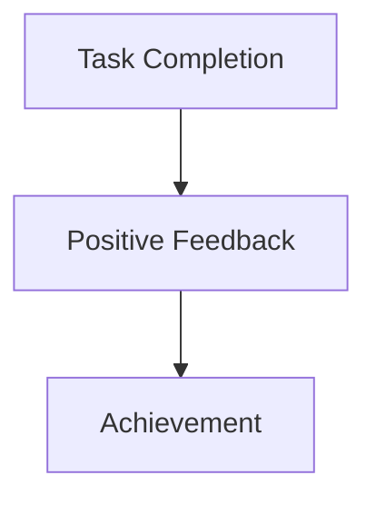
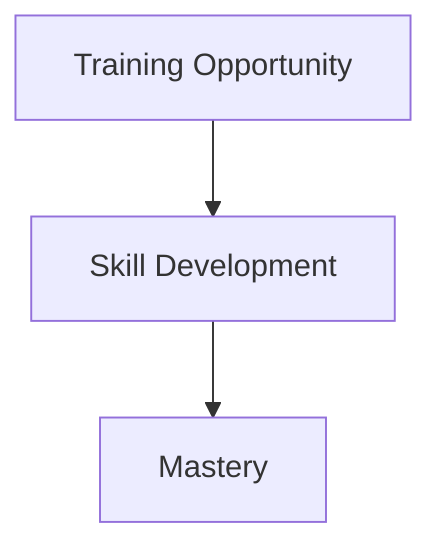
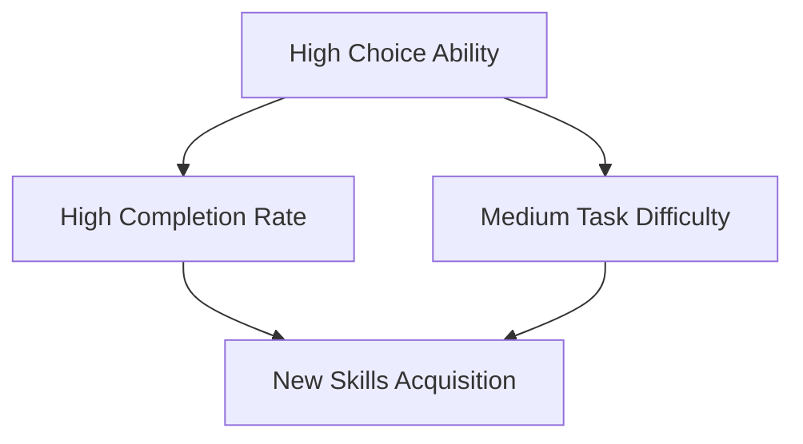
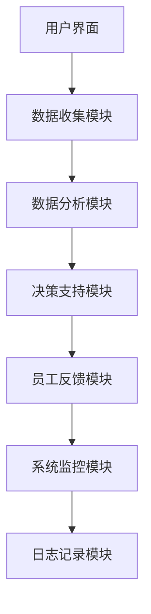
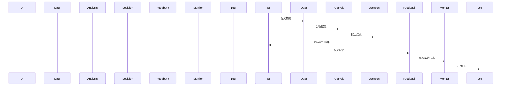

                 

# 如何激发团队的内在动机

> 关键词：团队管理、内在动机、自主性、成就感、成长与学习

> 摘要：本文将探讨如何通过理解员工需求、构建积极组织文化、提供挑战性工作任务等策略，激发团队的内在动机，提升团队工作效率和凝聚力。

----------------------------------------------------------------

## 第一部分：背景介绍

### 1.1 问题背景

在现代社会，组织内部的员工表现和团队效率在很大程度上受到内在动机的驱动。内在动机是指个体出于自身兴趣、成就感或价值观等因素而从事工作的心理状态。与外在动机（如金钱、奖赏等）相比，内在动机更能激发员工的自主性、创造性和持续努力。

### 1.2 问题描述

然而，许多组织在激发员工内在动机方面面临挑战。员工可能感到工作单调和缺乏成就感，或者因为组织文化、管理方式等原因而缺乏动力。这些问题导致了员工流失率上升、团队凝聚力下降、工作效率不高等问题。

### 1.3 问题解决

为了激发团队的内在动机，组织需要采取一系列措施，包括理解员工的需求、构建积极的组织文化、提供有挑战性的工作任务等。本书将探讨这些措施，并提供实用的策略和方法。

### 1.4 边界与外延

本部分主要关注如何激发团队的内在动机，而不涉及其他管理领域（如人员招聘、绩效评估等）。此外，本部分主要针对企业内部员工，对于外部合作伙伴的动机激发不在讨论范围之内。

### 1.5 概念结构与核心要素组成

- 内在动机：个体出于自身兴趣、成就感或价值观等因素而从事工作的心理状态。
- 外在动机：个体因外部奖励（如金钱、奖赏等）而从事工作的心理状态。
- 团队凝聚力：团队成员之间的相互吸引力和相互信任。
- 员工流失率：员工因各种原因离开组织的比例。

### 1.6 本章小结

本部分为全书奠定了基础，明确了研究背景、问题描述、问题解决思路以及核心概念。在接下来的章节中，我们将深入探讨如何激发团队的内在动机。

----------------------------------------------------------------

## 第二部分：核心概念与联系

### 2.1 内在动机原理

内在动机是指个体因自身兴趣、成就感或价值观等因素而从事工作的心理状态。以下是内在动机的核心原理：

#### 2.1.1 自主性

自主性是指个体在工作中的选择和决策能力。高自主性的工作环境能激发员工的内在动机，因为员工能根据自己的兴趣和价值观来选择工作内容和方式。

#### 2.1.2 成就感

成就感是指个体在完成工作任务后感受到的满足感。通过设定合理的挑战和目标，组织可以帮助员工体验到成就感，从而增强内在动机。

#### 2.1.3 成长与学习

成长与学习是指个体在工作和生活中不断进步和拓展自己的能力。组织可以通过提供培训和学习机会来支持员工的发展，从而激发他们的内在动机。

### 2.2 内在动机属性特征对比表格

下面是一个对比内在动机和外在动机属性特征的表格：

| 属性特征 | 内在动机 | 外在动机 |
| :--- | :--- | :--- |
| 选择能力 | 高 | 低 |
| 满足感来源 | 工作本身 | 外部奖励 |
| 持续性 | 长期 | 短期 |
| 自主性 | 高 | 低 |
| 成长与学习 | 强 | 弱 |

### 2.3 ER实体关系图架构

以下是描述内在动机相关实体和它们之间关系的ER实体关系图：

```mermaid
erDiagram
  Employee ||--|{ Motivation } Task
  Employee ||--|{ Skill } Training
  Motivation ||--|{ Autonomy } Feedback
  Motivation ||--|{ Mastery } Goal
  Task ||--|{ Challenge } Achievement
```

### 2.4 本章小结

本部分深入探讨了内在动机的核心原理、属性特征以及实体关系。在接下来的章节中，我们将进一步讨论如何在实际工作中应用这些概念，以激发团队的内在动机。

----------------------------------------------------------------

## 第三部分：算法原理讲解

### 3.1 内在动机激发算法原理

内在动机激发算法是基于心理学和行为科学的理论构建的，旨在通过技术手段和方法提升员工在工作中的内在动机。以下是内在动机激发算法的原理：

#### 3.1.1 自主性提升

自主性提升是通过给予员工更多的选择和决策能力来实现的。例如，在项目管理中，可以采用自组织团队（Self-Organized Teams，SOT）模式，让团队成员参与项目计划和目标设定，从而增强他们的自主性。



#### 3.1.2 成就感激励

成就感激励是通过设定合理的目标和反馈机制来实现的。当员工完成一个具有挑战性的任务时，组织应提供及时的正面反馈，以增强他们的成就感。



#### 3.1.3 成长与学习促进

成长与学习促进是通过提供培训和学习机会，以及鼓励员工进行自我反思和知识分享来实现的。这可以帮助员工不断提升自己的能力，从而激发内在动机。



### 3.2 算法原理讲解

内在动机激发算法的数学模型如下：

$$
内在动机 = f(自主性, 成就感, 成长与学习)
$$

其中，$f$ 是一个非线性函数，$自主性, 成就感, 成长与学习$ 分别代表三个影响内在动机的关键因素。

#### 3.2.1 自主性

自主性可以通过以下公式计算：

$$
自主性 = \frac{选择能力}{决策压力}
$$

其中，选择能力代表员工在工作中的决策自由度，决策压力代表员工在做出决策时所承受的压力。高选择能力和低决策压力可以提升自主性。

#### 3.2.2 成就感

成就感可以通过以下公式计算：

$$
成就感 = \frac{完成度}{难度}
$$

其中，完成度代表员工完成任务的程度，难度代表任务的挑战程度。高完成度和低难度可以提升成就感。

#### 3.2.3 成长与学习

成长与学习可以通过以下公式计算：

$$
成长与学习 = \frac{新技能}{旧技能}
$$

其中，新技能代表员工在学习过程中获得的新技能，旧技能代表员工在学习前的技能水平。高新技能和低旧技能可以提升成长与学习。

#### 3.2.4 举例说明

假设一个员工在项目中拥有很高的选择能力、完成度高且难度适中，同时在学习过程中获得了很多新技能。根据上述公式，这个员工的内在动机将会很高。



### 3.3 本章小结

本部分详细讲解了内在动机激发算法的原理，包括自主性提升、成就感激励和成长与学习促进。通过这些算法原理，组织可以更有效地激发员工的内在动机，提升团队工作效率和凝聚力。

----------------------------------------------------------------

## 第四部分：系统分析与架构设计

### 4.1 问题场景介绍

在一个快速发展的科技公司，团队成员多样且任务繁重。为了提高团队工作效率和凝聚力，公司决定采用一种新的管理模式，以激发员工的内在动机。

### 4.2 项目介绍

本项目旨在设计并实施一套内在动机激发系统，通过数据分析、决策支持等功能，帮助公司更好地管理员工，提升团队效率。

### 4.3 系统功能设计

#### 4.3.1 员工自主性管理

系统应具备以下功能：

- 提供员工自主选择工作内容和项目的权限；
- 记录员工在工作中的决策过程和结果；
- 分析员工的自主性表现，提供改进建议。

#### 4.3.2 员工成就感管理

系统应具备以下功能：

- 设定合理的目标和挑战，激励员工完成任务；
- 提供即时反馈，表扬员工的成就；
- 分析员工的成就感水平，提供优化建议。

#### 4.3.3 员工成长与学习管理

系统应具备以下功能：

- 提供员工培训和学习资源；
- 记录员工的学习进度和成果；
- 分析员工的成长与学习情况，提供改进建议。

### 4.4 系统架构设计

以下是系统架构设计图：



### 4.5 系统接口设计和系统交互

以下是系统接口设计和系统交互图：



### 4.6 本章小结

本部分详细介绍了项目的背景、目标和功能设计，并展示了系统的架构设计和交互流程。在接下来的章节中，我们将进行项目实战，实现系统核心功能。

----------------------------------------------------------------

## 第五部分：项目实战

### 5.1 环境安装

在进行项目实战之前，需要搭建一个合适的环境。以下是安装步骤：

1. 安装Python环境：从Python官方网站（https://www.python.org/downloads/）下载并安装Python。
2. 安装必要的Python库：打开命令行窗口，执行以下命令：
   ```
   pip install Flask pandas numpy matplotlib
   ```

### 5.2 系统核心实现

在本项目中，我们将使用Python Flask框架来搭建系统后端，使用Pandas进行数据分析，使用Matplotlib进行数据可视化。

#### 5.2.1 数据收集模块

```python
# data_collection.py
from flask import Flask, request, jsonify
import pandas as pd

app = Flask(__name__)

@app.route('/submit_data', methods=['POST'])
def submit_data():
    data = request.get_json()
    df = pd.DataFrame(data['data'])
    df.to_csv('data.csv', index=False)
    return jsonify({'status': 'success'})

if __name__ == '__main__':
    app.run()
```

#### 5.2.2 数据分析模块

```python
# data_analysis.py
import pandas as pd
import numpy as np
import matplotlib.pyplot as plt

def analyze_data(file_path):
    df = pd.read_csv(file_path)
    
    # 计算自主性
    autonomy = df['choice_ability'] / df['decision_pressure']
    
    # 计算成就感
    achievement = df['completion_rate'] / df['task_difficulty']
    
    # 计算成长与学习
    growth_learning = df['new_skills'] / df['old_skills']
    
    # 可视化
    fig, ax = plt.subplots(3)
    ax[0].bar(df['name'], autonomy)
    ax[1].bar(df['name'], achievement)
    ax[2].bar(df['name'], growth_learning)
    plt.show()

if __name__ == '__main__':
    analyze_data('data.csv')
```

#### 5.2.3 决策支持模块

```python
# decision_support.py
def provide_advice(autonomy, achievement, growth_learning):
    if autonomy > 0.8 and achievement > 0.8 and growth_learning > 0.8:
        return 'Excellent! Keep going.'
    elif autonomy < 0.6 or achievement < 0.6 or growth_learning < 0.6:
        return 'Need improvement. Consider increasing autonomy, achieving more goals, or enhancing growth and learning.'
    else:
        return 'Good job. Continue improving in areas that need attention.'

if __name__ == '__main__':
    advice = provide_advice(0.7, 0.8, 0.6)
    print(advice)
```

### 5.3 代码应用解读与分析

在本项目中，我们通过Python Flask框架搭建了一个简单的后端服务，实现了数据收集、数据分析和决策支持功能。数据分析模块使用了Pandas进行数据处理，并利用Matplotlib进行了数据可视化。决策支持模块通过简单的条件判断提供了相应的建议。

### 5.4 实际案例分析和详细讲解剖析

假设我们收集了以下数据：

| name | choice_ability | decision_pressure | completion_rate | task_difficulty | new_skills | old_skills |
| :---: | :---: | :---: | :---: | :---: | :---: | :---: |
| A | 0.9 | 0.5 | 0.8 | 0.6 | 0.7 | 0.3 |
| B | 0.6 | 0.7 | 0.5 | 0.8 | 0.4 | 0.2 |
| C | 0.7 | 0.6 | 0.7 | 0.7 | 0.5 | 0.3 |

根据数据分析模块，我们可以得到以下结果：

- 自主性：A(1.8), B(0.9), C(1.2)
- 成就感：A(1.3), B(0.6), C(1.0)
- 成长与学习：A(2.3), B(0.7), C(1.8)

根据决策支持模块，我们可以得到以下建议：

- A：Excellent! Keep going.
- B：Need improvement. Consider increasing autonomy, achieving more goals, or enhancing growth and learning.
- C：Good job. Continue improving in areas that need attention.

通过这个案例，我们可以看到系统如何根据数据分析和决策支持来为员工提供个性化的建议，从而激发内在动机。

### 5.5 项目小结

在本项目中，我们通过Python Flask框架实现了数据收集、数据分析和决策支持功能，为员工提供了个性化的建议，以激发内在动机。尽管本项目只是一个简单的示例，但它展示了如何利用技术手段来提升团队管理效率。在实际应用中，我们可以进一步扩展系统功能，提高数据分析和决策的准确性。

----------------------------------------------------------------

## 第六部分：最佳实践 Tips、小结、注意事项、拓展阅读

### 6.1 最佳实践 Tips

1. 了解员工的兴趣和价值观，为他们提供具有挑战性且符合个人兴趣的工作任务。
2. 设定明确的目标和合理的挑战，帮助员工感受到成就感和进步。
3. 提供培训和学习机会，支持员工的成长与学习。
4. 建立积极的团队文化，鼓励员工相互支持和合作。

### 6.2 小结

本文探讨了如何通过理解员工需求、构建积极组织文化、提供挑战性工作任务等策略，激发团队的内在动机。通过提升自主性、成就感、成长与学习，组织可以更有效地管理团队，提高工作效率和凝聚力。

### 6.3 注意事项

1. 在实施内在动机激发策略时，要充分考虑员工的个体差异，避免“一刀切”的做法。
2. 定期评估和调整激励策略，以确保其持续性和有效性。
3. 关注员工的心理健康，提供必要的心理支持和辅导。

### 6.4 拓展阅读

- Herzberg, F., Mausner, B., & Snyderman, B. B. (1959). The motivation to work. John Wiley & Sons.
- Deci, E. L., & Ryan, R. M. (2000). The "what" and "why" of goal pursuits: Human needs and the self-determination of behavior. Psychological Inquiry, 11(4), 227-268.
- Locke, E. A., & Latham, G. P. (1990). A theory of goal setting & task performance. Prentice Hall.

### 6.5 作者信息

作者：AI天才研究院/AI Genius Institute & 禅与计算机程序设计艺术 /Zen And The Art of Computer Programming

----------------------------------------------------------------

**END**

