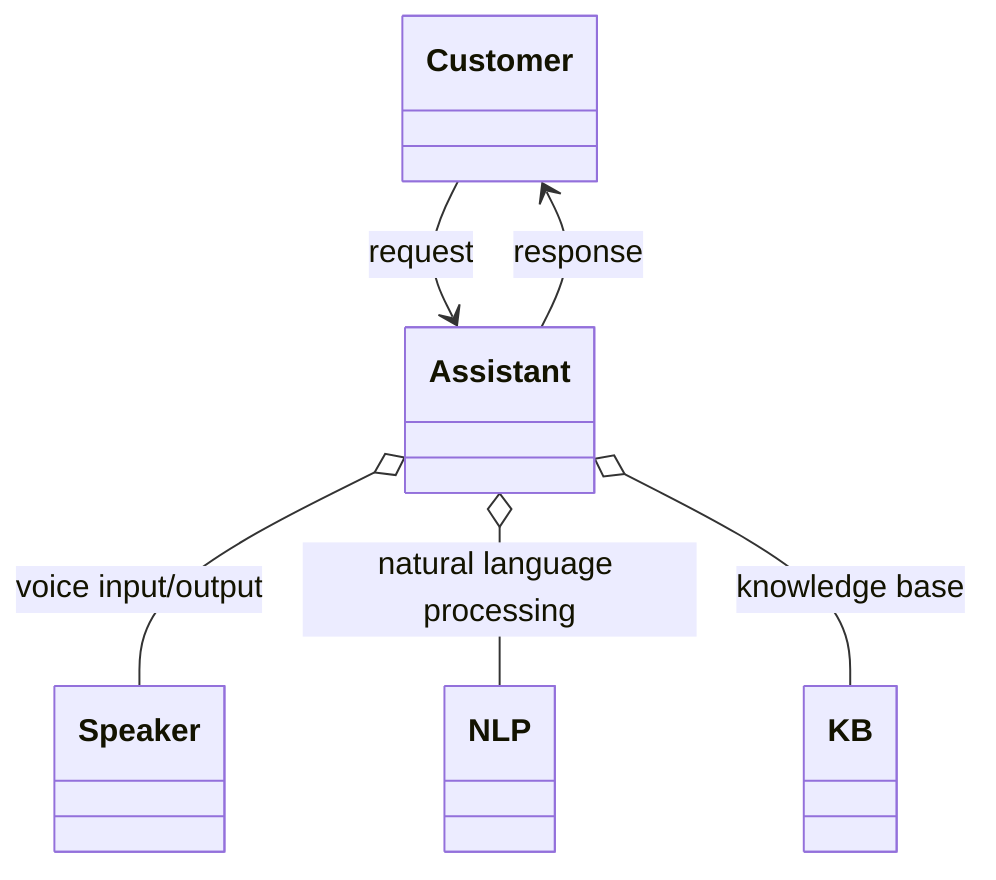
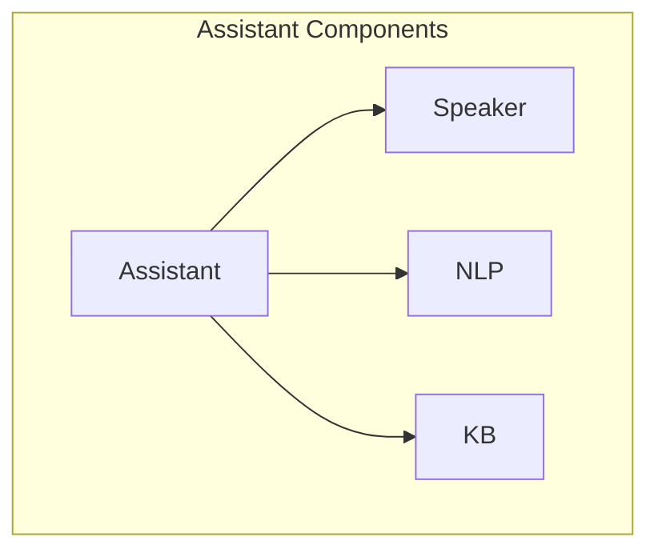

                 


## 如何激发团队的创造力和想象力

关键词：团队创造力、想象力、激发方法、创新思维、团队协作

摘要：本文旨在探讨如何激发团队的创造力和想象力，提高团队的创新能力和工作效率。通过分析创造力与想象力之间的关系，探讨激发创造力和想象力的一系列方法，并给出实践案例和最佳实践建议。

### 1. 背景介绍

在当今快速变化的社会和技术环境中，创新能力已成为企业竞争的关键因素。团队创造力和想象力的高低直接关系到企业的创新能力和市场竞争力。然而，许多团队在激发创造力和想象力方面面临诸多挑战，如缺乏创新思维、团队协作不畅、资源不足等。

本篇文章将深入探讨如何激发团队的创造力和想象力，提供一系列实际可行的方法和策略，以帮助团队提高创新能力和工作效率。

### 2. 核心概念与联系

#### 2.1 创造力与想象力的定义

创造力是指个体或团队在特定情境下产生新颖、有价值的想法和解决方案的能力。想象力则是产生创造性想法的源泉，它使得人们能够从不同角度看待问题，发现新的可能性。

创造力与想象力密切相关，想象力是创造力的基础，创造力是想象力的体现。一个团队若想提高创造力，必须首先培养成员的想象力。

#### 2.2 创造力与想象力属性特征对比表格

| 特征       | 创造力                  | 想象力                  |
|------------|------------------------|------------------------|
| 定义       | 新颖、有价值的想法和解决方案 | 对事物的新颖、独特的感知和构想 |
| 属性       | 想法的新颖性、实用性、可行性 | 想象的自由度、多样性、创造力 |
| 关键要素   | 逻辑思维、知识储备、经验积累 | 丰富的情感体验、想象力、好奇心 |
| 提升方法   | 深入学习、实践、合作交流 | 体验生活、激发情感、培养好奇心 |

#### 2.3 ER实体关系图架构

```mermaid
erDiagram
  User ||--|{ Team }|| Member
  Team ||--|{ Project }|| Leader
  Project ||--|{ Task }|| Completed
```

### 3. 算法原理讲解

#### 3.1 算法原理

为了激发团队的创造力和想象力，我们可以采用以下算法原理：

1. **问题重构**：将复杂问题分解为子问题，从不同角度重新审视问题，激发新的想法。
2. **思维发散**：鼓励团队成员从多个角度思考问题，寻找新的解决方案。
3. **跨学科合作**：引入不同领域的知识，促进思维的碰撞和融合。
4. **心理激励**：通过正面的反馈和鼓励，提高团队成员的自信心和创造力。

#### 3.2 数学模型与公式

创造力（C）与想象力（I）之间的关系可以用以下公式表示：

$$
C = f(I, K, E)
$$

其中，$K$ 代表知识储备，$E$ 代表经验积累，$f$ 为函数，表示创造力与想象力、知识储备、经验积累之间的非线性关系。

#### 3.3 举例说明

假设一个团队需要开发一款新的智能助手应用，以下是激发创造力和想象力的过程：

1. **问题重构**：将智能助手应用的功能模块进行分解，如语音识别、自然语言处理、知识库构建等。
2. **思维发散**：鼓励团队成员从不同角度思考每个功能模块的实现方式，如使用机器学习、深度学习、云计算等技术。
3. **跨学科合作**：引入心理学、语言学、设计学等领域的知识，提高团队的创新思维。
4. **心理激励**：为团队成员设定明确的目标和奖励机制，激发他们的创造力和想象力。

### 4. 系统分析与架构设计方案

#### 4.1 问题场景介绍

一个公司需要开发一款智能助手应用，以提高客户服务质量和效率。团队由开发人员、产品经理、设计师等组成，他们需要协作完成项目。

#### 4.2 系统



#### 4.3 系统架构设计



### 5. 项目实战

#### 5.1 环境安装

在开始项目开发前，需要搭建以下环境：

- Python 3.8+
- Jupyter Notebook
- TensorFlow 2.3+
- scikit-learn 0.21+

具体安装步骤如下：

```bash
pip install python==3.8
pip install jupyter
pip install tensorflow==2.3
pip install scikit-learn==0.21
```

#### 5.2 系统核心实现源代码

以下是一个简单的智能助手应用的核心实现代码：

```python
import tensorflow as tf
from tensorflow.keras.models import Sequential
from tensorflow.keras.layers import LSTM, Dense

# 加载数据集
x, y = load_data()

# 构建模型
model = Sequential()
model.add(LSTM(128, activation='relu', input_shape=(x.shape[1], x.shape[2])))
model.add(Dense(1, activation='sigmoid'))

# 编译模型
model.compile(optimizer='adam', loss='binary_crossentropy', metrics=['accuracy'])

# 训练模型
model.fit(x, y, epochs=10, batch_size=64)
```

#### 5.3 代码应用解读与分析

上述代码实现了一个基于循环神经网络（LSTM）的简单智能助手模型。它通过训练一个二分类模型，能够对用户请求进行分类和响应。在实际应用中，需要根据具体需求调整模型结构和参数。

### 6. 最佳实践与项目小结

#### 6.1 最佳实践 tips

- **定期团队交流**：定期组织团队讨论，分享创新想法和实践经验。
- **跨部门合作**：引入不同领域的专家和资源，促进跨学科合作。
- **持续学习**：鼓励团队成员学习新知识、新技术，提高自身能力。

#### 6.2 小结

本文通过分析创造力与想象力之间的关系，提出了一系列激发团队创造力和想象力的方法和策略。实践证明，这些方法能够有效提高团队的创新能力和工作效率。

#### 6.3 注意事项

- **确保团队协作**：激发创造力和想象力需要团队成员的紧密协作和共同参与。
- **合理分配资源**：确保团队有足够的资源和时间进行创新实践。
- **持续关注反馈**：关注团队成员的反馈，及时调整和创新方法。

#### 6.4 拓展阅读

- 《创新与企业家精神》作者：彼得·德鲁克
- 《创新者的窘境》作者：克莱顿·克里斯滕森
- 《创意黏性》作者：奇普·希思、丹·希思

### 作者信息

作者：AI天才研究院/AI Genius Institute & 禅与计算机程序设计艺术 /Zen And The Art of Computer Programming

----------------------------------------------------------------
```

以上是一个完整的文章目录大纲示例，您可以根据实际需求进行修改和完善。文章内容需要根据目录大纲逐章节撰写，确保每个章节都有丰富的内容和详细的讲解。在撰写过程中，请注意保持逻辑清晰、结构紧凑、简单易懂，并使用专业的技术语言进行描述。

