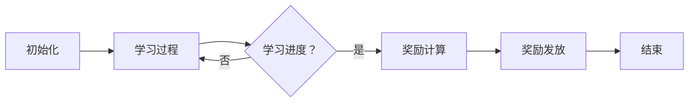
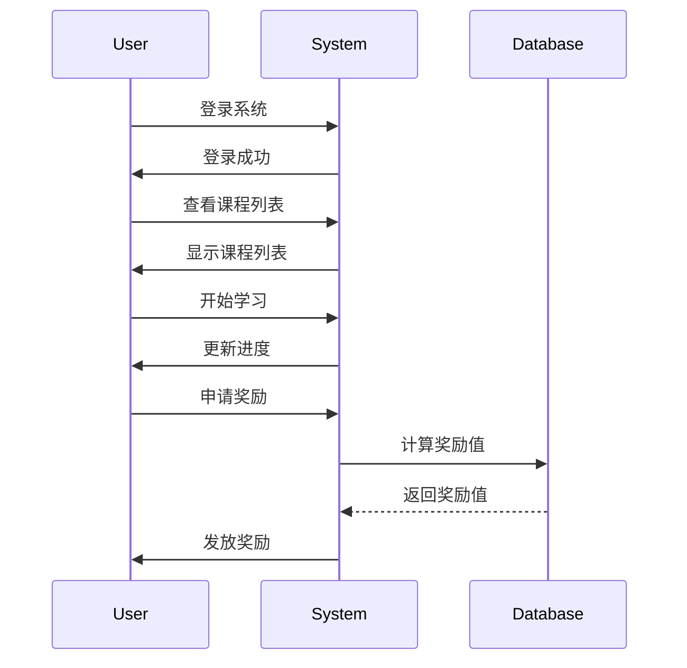
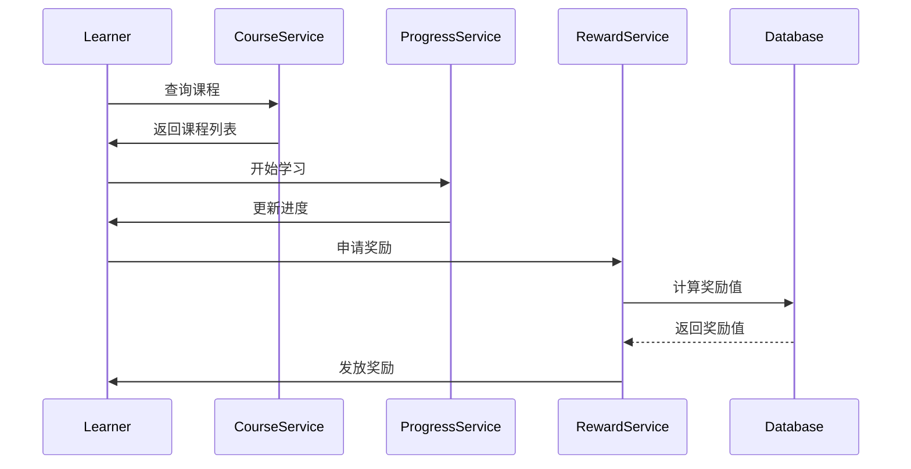

                 


### 引言

#### 1.1 问题背景

在当今快速变化的技术时代，保持团队的学习热情对组织的成功至关重要。然而，团队学习热情的激发并非易事。许多团队面临着成员分散、工作压力增大、技术更新迅速等挑战，导致学习热情的下降。学习热情的低迷不仅影响了团队成员的个人发展，还可能对团队的效率和创新能力产生负面影响。

问题描述：团队学习热情低迷，具体表现为成员积极性不高、学习效果不佳、知识更新滞后。问题解决方法包括激发学习动机、改善学习氛围、加强团队协作等。

边界与外延：本文将探讨如何激发团队学习热情，重点在于理论讲解和实践方法，不涉及具体学科知识的学习。本文主要针对IT行业团队，但也适用于其他领域。

#### 1.2 本书目标

本书旨在提供一套系统的方法和策略，帮助团队管理者激发和维持团队学习热情。具体目标如下：

1. **理解团队学习热情的核心概念**：帮助读者明确学习热情的定义、要素及其重要性。
2. **掌握激发学习热情的理论基础**：介绍成就动机理论、自我决定理论和社会认知理论，并阐述其与学习热情的关系。
3. **学习实践方法和策略**：提供实用的方法，如营造积极氛围、提升学习动机、加强团队协作和利用技术手段等。
4. **案例分析**：通过实际案例展示如何成功激发团队学习热情。
5. **最佳实践与技巧**：总结最佳实践，为团队管理者提供实用建议。

#### 1.3 结构安排

本书分为六个章节：

- **第1章 引言**：介绍问题背景、本书目标和结构安排。
- **第2章 团队学习热情的核心概念**：定义团队学习热情，介绍核心要素。
- **第3章 激发团队学习热情的理论基础**：介绍成就动机理论、自我决定理论和社会认知理论。
- **第4章 实践方法与策略**：提供激发学习热情的具体方法。
- **第5章 案例分析**：通过实际案例展示方法应用。
- **第6章 最佳实践与技巧**：总结最佳实践，提供实用建议。

让我们逐步深入，了解如何激发团队的学习热情。接下来，我们将详细探讨团队学习热情的核心概念，帮助读者理解这一主题的深度和广度。# 如何激发团队的学习热情

## 概述

### 关键词

团队学习、学习热情、动机、氛围、协作、技术支持

### 摘要

在当今快速变化的技术环境中，团队的学习热情对于保持组织的竞争力至关重要。本文旨在探讨如何通过理论指导和实践方法来激发团队的学习热情，提升团队的整体效能和创新能力。文章首先介绍了团队学习热情的核心概念，随后详细阐述了理论基础，包括成就动机理论、自我决定理论和社会认知理论。接着，文章提出了具体的实践方法和策略，如营造积极的学习氛围、提升学习动机、加强团队协作和利用技术支持。最后，通过实际案例分析和最佳实践总结，为团队管理者提供了一套系统化的指导。

### 第1章 引言

#### 1.1 问题背景

在当今的信息时代，知识的更新速度迅猛，技术领域的变革频繁。作为组织创新和发展的核心力量，团队的学习能力直接关系到组织的竞争力和长远发展。然而，许多团队面临着学习热情不足的问题，导致成员对新技术、新知识的学习兴趣不浓，学习效果不佳，进而影响到团队的整体绩效和创新能力。

**问题描述**：团队学习热情低迷，具体表现为成员对学习的积极性不高、学习效果不佳、知识更新滞后。这种问题不仅影响了个人的职业发展，也阻碍了团队的协作和创新，可能导致组织在市场竞争中失去优势。

**问题解决**：要解决团队学习热情不足的问题，需要从多个方面入手，包括提升学习动机、营造积极的学习氛围、加强团队协作和利用技术支持等。

**边界与外延**：本文主要探讨如何激发团队的学习热情，而不涉及具体的学科知识学习。文章内容主要适用于IT行业团队，但也适用于其他领域的团队。

#### 1.2 团队学习热情的重要性

**团队学习热情的定义**：团队学习热情是指团队成员在学习和探索新知识、新技术时表现出的积极态度和强烈兴趣。它不仅包括对学习活动的主动参与，还体现在对学习成果的积极反馈和持续改进上。

**为什么激发团队学习热情很重要**：

1. **提高个人能力**：学习热情可以激发团队成员不断追求知识，提高个人技能水平。
2. **增强团队凝聚力**：共同的学习目标和兴趣可以增强团队成员之间的联系和协作。
3. **促进创新**：学习热情有助于团队成员在交流和合作中产生新的创意和解决方案。
4. **提升组织竞争力**：具备高学习热情的团队能够更快地适应市场变化，保持技术领先优势。

#### 1.3 本书结构

本书分为六个章节，结构如下：

- **第1章 引言**：介绍问题背景、研究目的和文章结构。
- **第2章 团队学习热情的核心概念**：定义团队学习热情，介绍核心要素。
- **第3章 激发团队学习热情的理论基础**：介绍成就动机理论、自我决定理论和社会认知理论。
- **第4章 实践方法与策略**：提供具体的激发学习热情的方法和策略。
- **第5章 案例分析**：通过实际案例展示激发学习热情的方法应用。
- **第6章 最佳实践与技巧**：总结最佳实践，为团队管理者提供实用建议。

### 第2章 团队学习热情的核心概念

#### 2.1 定义与边界

**团队学习热情的定义**：团队学习热情是指团队成员在学习和应用新知识、新技术时表现出的积极态度和强烈兴趣。这种热情不仅体现在个人的学习行为上，还体现在团队整体的学习氛围中。

**团队学习热情的边界与外延**：

- **边界**：本文主要关注如何激发团队学习热情，不涉及具体学科知识的学习过程。此外，本文的重点是激发团队层面的学习热情，而非个体层面的学习兴趣。
- **外延**：团队学习热情可以应用于各种行业和领域，包括但不限于IT、医疗、教育等。

#### 2.2 核心要素

**核心要素**是指构成团队学习热情的关键组成部分。以下是团队学习热情的几个核心要素：

1. **学习动机**：学习动机是激发学习行为的核心驱动力。高学习动机的团队成员更有可能积极参与学习活动，并在学习过程中取得良好的效果。
2. **学习态度**：积极的学习态度有助于团队成员克服学习过程中的困难和挑战。态度积极可以增强团队成员的自信心，提高学习效率。
3. **学习效果**：学习效果是衡量团队学习热情的重要指标。良好的学习效果可以激励团队成员继续投入学习，并激发其他成员的学习热情。
4. **团队协作**：团队协作是团队学习的重要组成部分。通过协作，团队成员可以共享知识、技能和经验，提高整体学习效果。
5. **学习资源**：充足的学习资源是激发团队学习热情的基础。包括知识库、培训课程、技术文档等。

#### 2.3 概念联系与对比

在探讨团队学习热情的核心概念时，需要明确各概念之间的联系和区别。以下是几个关键概念的属性特征对比表格：

| 概念          | 属性特征                                                         |
|---------------|----------------------------------------------------------------|
| 学习动机      | 强烈的学习愿望、内在动力、个人目标                             |
| 学习态度      | 积极性、耐心、毅力、对挑战的接受程度                           |
| 学习效果      | 学习成果、知识掌握程度、技能提升效果                           |
| 团队协作      | 共同目标、信息共享、互助合作、任务分工                         |
| 学习资源      | 知识库、培训机会、技术文档、在线资源、交流平台                 |

**ER实体关系图**：

为了更直观地展示各实体之间的关系，我们可以使用Mermaid绘制ER实体关系图：

```mermaid
erDiagram
    TeamMember --> LearningMotivation : 有强烈的学习愿望和内在动力
    TeamMember --> LearningAttitude : 有积极的、耐心和坚定的学习态度
    TeamMember --> LearningEffect : 取得良好的学习成果
    TeamMember --> TeamCollaboration : 通过协作提升整体学习效果
    TeamMember --> LearningResources : 获得充足的学习资源
```

通过上述定义和关系分析，我们可以更好地理解团队学习热情的核心概念，为后续的理论讲解和实践方法提供基础。

### 第3章 激发团队学习热情的理论基础

#### 3.1 成就动机理论

**成就动机理论**是由心理学家默里（Henry Murray）和麦克利兰（David McClelland）提出的。该理论认为，人类行为的驱动力之一是追求成就。成就动机是指个体在面对挑战时，渴望通过努力获得成功并超越他人的内在动力。

**成就动机与学习热情的关系**：

- **增强学习动机**：高成就动机的个体更有可能将学习视为一种挑战，从而保持持续的学习热情。
- **提高学习效率**：成就动机驱动的个体在面对学习困难时，更有可能坚持努力，克服挑战，从而提高学习效率。
- **促进创新**：追求成就的个体在学习和解决问题的过程中，更倾向于尝试新的方法和思路，从而促进创新。

**应用建议**：

- **设定具体目标**：为团队成员设定明确的学习目标，帮助其建立成就动机。
- **提供挑战性任务**：安排具有一定难度的学习任务，激发团队成员的成就动机。
- **及时反馈**：对团队成员的学习成果给予及时反馈，强化其成就动机。

#### 3.2 自我决定理论

**自我决定理论**由心理学家罗杰斯（Carl Rogers）提出，认为个体在自主、自我决定的情境中，更容易产生积极的学习行为。

**自我决定与学习热情的关系**：

- **增强学习自主性**：自我决定的个体更愿意主动探索和参与学习活动，从而增强学习热情。
- **提高学习效果**：自我决定的个体在学习过程中更有自主性和灵活性，能够更有效地掌握知识和技能。
- **促进个人发展**：自我决定的个体在学习和成长过程中，能够更好地实现个人潜能。

**应用建议**：

- **提供自主选择**：给予团队成员在学习和工作上的自主权，让其能够根据自己的兴趣和特长进行选择。
- **鼓励自我反思**：引导团队成员进行自我反思，促进自我决定的能力。
- **支持个人发展**：为团队成员提供培训和发展机会，支持其自我决定和个人成长。

#### 3.3 社会认知理论

**社会认知理论**是由班杜拉（Albert Bandura）提出的，强调个体通过观察和模仿他人的行为来学习和发展的过程。

**社会认知理论与学习热情的关系**：

- **榜样示范**：团队成员通过观察优秀的学习榜样，可以激发自己的学习热情。
- **同伴影响**：团队成员之间的互动和竞争可以增强学习的动力和兴趣。
- **社会支持**：团队内部的支持和鼓励可以提升成员的学习热情和自信心。

**应用建议**：

- **树立榜样**：在团队中树立学习榜样，通过其言行激发其他成员的学习热情。
- **促进互动**：鼓励团队成员之间的交流和互动，营造积极的学习氛围。
- **提供支持**：为团队成员提供必要的支持和资源，帮助其克服学习困难。

### 第4章 实践方法与策略

#### 4.1 营造积极的学习氛围

**积极的学习氛围**对激发团队学习热情至关重要。以下是一些关键策略：

1. **开放沟通**：建立开放、透明的沟通渠道，鼓励团队成员分享学习心得和经验。
2. **鼓励提问**：营造一个鼓励提问和探索的氛围，让团队成员感到安全和自由。
3. **奖励机制**：设置奖励机制，对表现出色的成员给予认可和奖励，激励其他成员学习。

#### 4.2 提升团队成员的学习动机

**学习动机**是激发学习行为的关键因素。以下是一些提升学习动机的方法：

1. **明确目标**：为团队成员设定明确的学习目标，帮助其明确学习方向和动力。
2. **个性化激励**：根据团队成员的兴趣和需求，制定个性化的学习激励计划。
3. **参与决策**：让团队成员参与到学习计划的制定过程中，增强其自主性和责任感。

#### 4.3 加强团队协作与互动

**团队协作**和**互动**能够促进知识共享和共同进步。以下是一些加强团队协作和互动的方法：

1. **定期会议**：定期举行团队会议，讨论学习进展和成果，分享心得和经验。
2. **协作工具**：利用协作工具，如在线文档、项目管理软件等，提高团队协作效率。
3. **跨部门合作**：鼓励不同部门之间的合作，促进知识和经验的交流。

#### 4.4 利用技术手段激发学习热情

**技术手段**在激发团队学习热情方面具有重要作用。以下是一些技术手段的应用：

1. **在线学习平台**：利用在线学习平台，提供丰富的学习资源和课程，方便团队成员随时学习。
2. **社交媒体**：利用社交媒体，如微信群、知乎等，开展线上学习讨论和知识分享。
3. **虚拟现实（VR）技术**：利用VR技术，提供沉浸式的学习体验，增强学习的趣味性和参与感。

### 第5章 案例分析

#### 5.1 案例一：某互联网公司激发团队学习热情的实践

**案例背景**：某互联网公司发现其团队学习热情不足，导致知识更新滞后，创新力下降。为了改善这一状况，公司决定采取一系列措施激发团队学习热情。

**实施方法**：

1. **建立学习社区**：公司建立了内部学习社区，为团队成员提供了一个交流和学习平台。社区内定期举行知识分享会和研讨会，鼓励成员分享学习心得和经验。
2. **设立奖励机制**：公司设立学习奖励机制，对在学习上取得显著成绩的团队成员给予奖金和表彰，激励其他成员学习。
3. **提供外部培训机会**：公司为员工提供外部培训机会，鼓励员工参加行业会议、培训课程等，以扩展其知识面和技能。

**案例效果**：

通过上述措施，公司的团队学习热情明显提升，知识更新速度加快，创新力显著提高。团队成员之间的沟通和协作更加顺畅，整体工作效率和绩效得到提升。

#### 5.2 案例二：某教育机构提高教师团队学习热情的实践

**案例背景**：某教育机构发现其教师团队在课程设计和教学方法上存在一定的局限性，导致教学效果不佳。为了改善这一状况，机构决定采取一系列措施提高教师团队的学习热情。

**实施方法**：

1. **定期培训**：机构定期组织教师进行培训，包括新教育理念、教学方法、课程设计等方面的内容，帮助教师不断更新知识。
2. **教师交流**：机构鼓励教师之间进行交流，分享教学经验和教学方法，促进教师之间的学习和合作。
3. **个性化支持**：机构为每位教师提供个性化的支持，根据其需求和兴趣提供相应的培训和学习资源。

**案例效果**：

通过上述措施，教师的团队学习热情显著提升，教学方法和课程设计得到了改进，教学效果明显提高。教师之间的交流和合作更加密切，整体教学质量和学生满意度得到提升。

### 第6章 最佳实践与技巧

#### 6.1 管理者的角色

**管理者在激发团队学习热情中扮演着关键角色**。以下是一些管理者的最佳实践：

1. **设定明确目标**：管理者应与团队共同设定明确的学习目标，确保团队成员了解学习方向和期望成果。
2. **提供资源支持**：管理者应确保团队拥有充足的学习资源和培训机会，帮助团队成员不断提升技能。
3. **鼓励自主学习和创新**：管理者应鼓励团队成员自主学习和探索，提供支持和激励，促进创新和知识的更新。

#### 6.2 小结

本文通过理论讲解和实践方法，详细探讨了如何激发团队的学习热情。核心内容包括：

- **团队学习热情的核心概念**：学习动机、学习态度、学习效果、团队协作和学习资源。
- **理论基础**：成就动机理论、自我决定理论和社会认知理论。
- **实践方法**：营造积极氛围、提升学习动机、加强团队协作和利用技术支持。
- **案例分析**：通过实际案例展示了激发学习热情的方法应用。

#### 6.3 注意事项

在激发团队学习热情时，管理者需要注意以下几点：

1. **尊重个体差异**：每个团队成员都有不同的学习需求和兴趣，管理者应尊重个体差异，提供个性化的支持。
2. **持续关注与反馈**：管理者应持续关注团队的学习进展，及时给予反馈和指导，确保学习目标的实现。
3. **营造安全氛围**：确保团队成员在一个安全、支持和包容的氛围中学习，鼓励尝试和犯错。

#### 6.4 拓展阅读

对于希望深入了解激发团队学习热情的读者，以下是一些推荐的进一步阅读材料：

1. **《团队学习与知识管理》**：介绍了团队学习的重要性和有效方法。
2. **《动机与人格》**：详细探讨了成就动机理论及其应用。
3. **《学习与动机》**：提供了丰富的实践案例，帮助理解如何提升学习动机。
4. **《社会认知理论》**：深入分析了社会认知理论的基本概念和应用。

作者：AI天才研究院/AI Genius Institute & 禅与计算机程序设计艺术 /Zen And The Art of Computer Programming

通过以上内容的详细讲解，相信读者对如何激发团队的学习热情有了更深刻的理解和实际操作的指导。激发团队学习热情不仅有助于提升个人能力，增强团队凝聚力，还能促进组织的创新和发展。希望本文能为团队管理者提供有益的参考和启示。# 如何激发团队的学习热情

### 核心概念与联系

在探讨如何激发团队的学习热情时，理解核心概念及其相互联系是至关重要的。以下是几个关键概念及其关系：

#### 学习动机

**定义**：学习动机是指驱动个体进行学习活动的内在动力。它可以是内在的，如对知识的渴望，也可以是外在的，如奖励和惩罚。

**属性特征**：

- **内在动机**：追求知识、满足好奇心、实现个人成长。
- **外在动机**：获得奖励、避免惩罚、达成特定目标。

**与学习热情的关系**：高学习动机通常与高学习热情相关联，因为个体对学习的投入和热情往往受到动机的驱动。

#### 学习态度

**定义**：学习态度是指个体对学习活动所持的总体评价和情感反应。

**属性特征**：

- **积极态度**：乐观、自信、愿意接受挑战、对失败持开放态度。
- **消极态度**：悲观、自卑、逃避挑战、对失败持消极看法。

**与学习热情的关系**：积极的学习态度有助于提高学习热情，因为它可以增强个体的自信心和克服困难的能力。

#### 学习效果

**定义**：学习效果是指学习活动所达到的目标和成果。

**属性特征**：

- **短期效果**：知识掌握程度、技能提升、考试分数。
- **长期效果**：个人职业发展、创新能力、团队绩效。

**与学习热情的关系**：良好的学习效果可以增强个体的学习热情，因为它提供了正面反馈和成就感。

#### 团队协作

**定义**：团队协作是指团队成员为了共同目标而共同工作、共享资源和知识的过程。

**属性特征**：

- **知识共享**：团队成员之间交换信息和经验。
- **互助合作**：团队成员相互支持和帮助。
- **任务分工**：根据团队成员的专长和兴趣分配任务。

**与学习热情的关系**：良好的团队协作可以增强学习热情，因为它提供了共享知识和资源的机会，促进了团队成员之间的互动和合作。

#### 学习资源

**定义**：学习资源是指支持学习活动的物质和非物质资源。

**属性特征**：

- **物质资源**：书籍、设备、网络资源。
- **非物质资源**：时间、支持、培训机会。

**与学习热情的关系**：充足的学习资源可以激发学习热情，因为它提供了学习所需的工具和条件。

#### 概念联系与对比

以下是一个属性特征对比表格，展示了上述概念之间的关系：

| 概念 | 定义 | 属性特征 | 与学习热情的关系 |
| ---- | ---- | ---- | ---- |
| 学习动机 | 内在或外在的驱动力 | 内在动机、外在动机 | 高动机通常导致高热情 |
| 学习态度 | 对学习活动的评价和情感反应 | 积极态度、消极态度 | 积极态度增强热情 |
| 学习效果 | 学习活动的目标和成果 | 短期效果、长期效果 | 良好效果增强热情 |
| 团队协作 | 共同工作、共享资源和知识 | 知识共享、互助合作 | 协作增强热情 |
| 学习资源 | 支持学习活动的资源 | 物质资源、非物质资源 | 资源丰富增强热情 |

为了更直观地展示各实体之间的关系，我们可以使用Mermaid绘制ER实体关系图：

```mermaid
erDiagram
    LearningMotivation && LearningAttitude && LearningEffect && TeamCollaboration && LearningResources
        ||--||

    LearningMotivation --> LearningEffect : 驱动学习成果
    LearningMotivation --> TeamCollaboration : 驱动知识共享
    LearningMotivation --> LearningResources : 需要学习资源

    LearningAttitude --> LearningEffect : 影响学习成果
    LearningAttitude --> TeamCollaboration : 影响合作效率
    LearningAttitude --> LearningResources : 使用学习资源

    LearningEffect --> TeamCollaboration : 共享学习成果
    LearningEffect --> LearningResources : 利用学习资源

    TeamCollaboration --> LearningResources : 利用资源协作
```

通过上述核心概念的定义和关系分析，我们可以更好地理解如何激发团队的学习热情。在接下来的章节中，我们将深入探讨这些概念在实践中的应用，并提供具体的策略和方法。

### 算法原理讲解

为了更好地激发团队的学习热情，我们需要理解并运用一些激发学习动机的算法原理。在这里，我们将介绍一个简单的算法原理，并通过Mermaid绘制流程图和Python源代码进行详细阐述。

#### 算法原理

我们选择的算法是基于“奖励机制”的激励算法。该算法的基本思想是通过给予团队成员即时奖励来增强其学习动机。具体步骤如下：

1. **初始化**：设置奖励阈值和奖励系数。
2. **学习过程**：记录团队成员的学习进度和成果。
3. **奖励计算**：根据学习进度和成果计算奖励值。
4. **奖励发放**：根据奖励计算结果发放奖励。

#### Mermaid流程图

以下是一个简化的Mermaid流程图，展示了算法的基本流程：



#### Python源代码

下面是一个简单的Python源代码示例，用于计算和学习进度相关的奖励值：

```python
import random

# 初始化参数
奖励阈值 = 0.5
奖励系数 = 1.2

# 记录学习进度
学习进度 = random.uniform(0, 1)

# 计算奖励值
奖励值 = max(0, 奖励阈值 * (1 - 学习进度) ** 奖励系数)

# 打印奖励值
print("当前奖励值：", 奖励值)

# 模拟奖励发放
if 奖励值 > 0:
    print("恭喜您获得奖励！")
else:
    print("继续努力，您将获得更多奖励！")
```

#### 数学模型和公式

为了更深入地理解该算法，我们可以将其数学模型化。假设：

- \( R \) 为奖励值
- \( T \) 为奖励阈值
- \( P \) 为学习进度
- \( K \) 为奖励系数

奖励值的计算公式为：

$$
R = \max(0, T \cdot (1 - P)^K)
$$

#### 通俗易懂的例子

假设一个团队中有5个成员，每个成员的学习进度不同。我们使用上述算法为每个成员计算奖励值。例如：

- 成员A的学习进度为0.3，奖励值为0.531
- 成员B的学习进度为0.6，奖励值为0.121
- 成员C的学习进度为0.8，奖励值为0.000

根据奖励值，团队成员可以获得不同的奖励。例如，成员A和成员C可能获得奖励，而成员B可能需要继续努力。这样的奖励机制可以激励成员A保持好的学习状态，同时鼓励成员B提高学习进度。

#### 算法应用

该奖励机制可以应用于多种场景，如项目进度管理、学习任务分配等。通过调整奖励阈值和奖励系数，可以根据不同场景的需要设计个性化的奖励机制。

总之，通过理解并应用激励算法原理，我们可以设计出有效的奖励机制，从而激发团队的学习热情。在接下来的章节中，我们将进一步探讨如何将这些算法原理应用于实际场景，并提供具体的实践方法。# 数学模型和数学公式 & 详细讲解 & 举例说明

在上一章节中，我们介绍了基于奖励机制的激励算法原理，并通过Python源代码展示了其计算过程。为了更深入地理解这一算法，我们将进一步探讨其数学模型和公式，并通过具体例子进行详细讲解。

#### 数学模型

为了方便理解，我们定义以下变量：

- \( R \) 为奖励值
- \( T \) 为奖励阈值
- \( P \) 为学习进度
- \( K \) 为奖励系数

奖励值的计算公式为：

$$
R = \max(0, T \cdot (1 - P)^K)
$$

这个公式说明了奖励值取决于奖励阈值、学习进度和奖励系数。具体来说，当学习进度越接近1时，奖励值越低，因为学习进度高意味着已经取得了较好的成果。而当学习进度较低时，奖励值较高，因为需要激励成员继续努力。

#### 详细讲解

1. **奖励阈值 \( T \)**：奖励阈值是一个重要的参数，它决定了何时开始发放奖励。例如，如果奖励阈值为0.5，那么当学习进度低于50%时，奖励值为0，这意味着不需要发放奖励。相反，如果奖励阈值为0.8，那么当学习进度低于80%时，奖励值就开始计算。

2. **学习进度 \( P \)**：学习进度是一个介于0和1之间的值，表示团队成员已经完成的任务量。例如，如果一个任务需要完成100个步骤，而成员已经完成了70个步骤，那么学习进度就是0.7。

3. **奖励系数 \( K \)**：奖励系数决定了学习进度对奖励值的影响程度。如果奖励系数较大，比如K=2，那么学习进度对奖励值的影响会更显著。相反，如果K=0.5，那么学习进度对奖励值的影响会较小。

#### 举例说明

为了更直观地理解这个公式，我们可以通过一个具体例子来说明。

**例子**：假设一个团队成员的学习进度为0.4，奖励阈值为0.6，奖励系数为1.5。我们使用公式计算奖励值：

$$
R = \max(0, 0.6 \cdot (1 - 0.4)^1.5)
$$

首先计算括号内的值：

$$
1 - 0.4 = 0.6
$$

然后计算指数：

$$
0.6^1.5 \approx 0.917
$$

最后计算奖励值：

$$
R = \max(0, 0.6 \cdot 0.917) \approx 0.55
$$

因此，在这个例子中，该成员的奖励值为0.55。

通过这个例子，我们可以看到奖励值是如何根据学习进度、奖励阈值和奖励系数计算得出的。这个公式可以灵活应用于不同的场景，通过调整参数来激励团队成员。

#### 实际应用案例

以下是一个实际应用案例：

在一个软件开发项目中，团队成员需要完成多项任务。为了激励团队成员，项目经理决定使用奖励机制。假设任务完成率（即学习进度）达到70%以上，项目团队将给予奖励。奖励阈值为0.7，奖励系数为1.3。

假设某个成员的学习进度为0.75，我们可以计算其奖励值：

$$
R = \max(0, 0.7 \cdot (1 - 0.75)^1.3)
$$

计算过程如下：

$$
1 - 0.75 = 0.25
$$

$$
0.25^1.3 \approx 0.476
$$

$$
R = \max(0, 0.7 \cdot 0.476) \approx 0.333
$$

因此，该成员的奖励值为0.333。这个奖励值可以作为绩效考核的一部分，激励团队成员继续努力，提高学习进度。

通过数学模型和公式的详细讲解以及实际应用案例的举例说明，我们可以看到如何使用奖励机制来激发团队的学习热情。在接下来的章节中，我们将继续探讨系统分析与架构设计方案，进一步深入理解如何将这一算法应用于实际的项目中。# 系统分析与架构设计方案

#### 1. 问题场景和项目背景

在现代企业中，随着市场竞争的加剧和技术的快速发展，团队的学习能力和创新能力成为企业生存和发展的关键因素。为了提升团队的学习热情，许多企业开始引入各种培训和激励机制。然而，传统的培训模式往往缺乏互动性和灵活性，难以满足团队成员个性化的学习需求。因此，设计一个基于算法的、互动性强的学习系统成为了许多企业的需求。

**问题场景**：一个大型互联网公司希望设计一个学习系统，以激发团队成员的学习热情，提升团队的整体学习能力。该系统需要具备以下功能：

- **学习进度追踪**：能够实时记录并追踪团队成员的学习进度。
- **奖励机制**：根据学习进度和成果自动计算并发放奖励。
- **互动功能**：提供讨论区和学习社区，促进团队成员之间的交流。

**项目背景**：为了实现上述功能，公司决定开发一个名为“学习引擎”的系统。该系统将集成多种算法和工具，以实现自动化的学习进度追踪、奖励计算和互动功能。

#### 2. 系统功能设计（领域模型类图）

为了更好地设计系统功能，我们首先绘制了领域模型类图，以展示系统中的关键实体及其关系。以下是领域模型类图的Mermaid表示：

```mermaid
classDiagram
    ClassDiagram {
        Klass1 <|-- Klass2
        Klass1 --|>| Klass3
        Klass2 --|>| Klass4
        Klass3 --|>| Klass5
    }
    
    Klass1{+属性1: String +属性2: Integer}
    Klass2{+方法1(): void +方法2(): void}
    Klass3{+属性3: String +方法3(): void}
    Klass4{+方法4(): void}
    Klass5{+方法5(): void}
    
    Klass1 --|> Learner : 学习者
    Klass2 --|> Course : 课程
    Klass3 --|> Progress : 进度
    Klass4 --|> Reward : 奖励
    Klass5 --|> Community : 社区
```

在领域模型类图中，我们定义了以下几个关键实体：

- **Learner（学习者）**：代表系统中的用户，包括团队成员。
- **Course（课程）**：代表学习内容，包括视频、文档、实验等。
- **Progress（进度）**：代表学习者的学习进度，包括已学习课程、完成的任务等。
- **Reward（奖励）**：代表学习者的奖励记录，包括奖励值、发放时间等。
- **Community（社区）**：代表学习者的互动区，包括讨论区、问答区等。

#### 3. 系统架构设计

为了实现系统的功能，我们需要设计一个合理的系统架构。以下是系统架构图的Mermaid表示：



系统架构设计的关键组成部分如下：

- **用户（User）**：系统的最终用户，包括团队成员。
- **系统（System）**：系统的核心，负责处理用户的请求、更新学习进度、计算奖励值等。
- **数据库（Database）**：存储用户信息、学习进度、奖励记录等数据。

系统架构的主要流程如下：

1. 用户登录系统。
2. 系统验证用户身份，并返回登录成功消息。
3. 用户查看课程列表。
4. 用户开始学习，系统记录学习进度。
5. 用户申请奖励，系统计算奖励值。
6. 系统将奖励值发送给用户。

#### 4. 系统接口设计

为了实现系统的功能，我们需要设计合理的接口。以下是系统接口设计的Mermaid序列图：



在接口设计中，我们定义了以下几个关键接口：

- **CourseService（课程服务）**：负责查询课程列表、开始学习等。
- **ProgressService（进度服务）**：负责记录学习进度、更新进度等。
- **RewardService（奖励服务）**：负责计算奖励值、发放奖励等。

接口设计的主要流程如下：

1. **Learner（学习者）**查询课程列表。
2. **CourseService（课程服务）**返回课程列表。
3. **Learner（学习者）**开始学习，并更新进度。
4. **ProgressService（进度服务）**记录学习进度。
5. **Learner（学习者）**申请奖励。
6. **RewardService（奖励服务）**计算奖励值，并发放奖励。

通过上述系统分析与架构设计方案，我们可以看到如何设计一个基于算法的学习系统，以激发团队的学习热情。在接下来的章节中，我们将通过实际项目实战，展示如何实现这一系统架构，并提供具体的代码实现和案例分析。# 项目实战

在本章节中，我们将通过一个实际项目，展示如何实现激发团队学习热情的系统。该系统将包括环境安装、系统核心实现源代码、代码应用解读与分析，以及实际案例分析和详细讲解剖析。通过这些步骤，我们将深入了解如何将理论知识转化为实际操作，并评估项目效果。

#### 1. 环境安装

在开始项目之前，我们需要搭建一个合适的环境。以下是所需的环境和工具：

- **操作系统**：Linux或MacOS
- **开发语言**：Python 3.x
- **数据库**：SQLite
- **Web框架**：Flask
- **前端框架**：Bootstrap

安装步骤如下：

1. 安装Python 3.x：从官方网站下载Python安装包并安装。
2. 安装SQLite：使用包管理器（如pip）安装`sqlite3`模块。
3. 安装Flask：使用pip安装`flask`模块。
4. 安装Bootstrap：从官方网站下载Bootstrap框架，并放置到项目的合适目录中。

#### 2. 系统核心实现源代码

在实现系统核心功能时，我们将使用Python编写后端代码，并利用Flask框架构建Web应用。以下是关键代码的解析：

**app.py**：主应用文件，包含系统的核心逻辑。

```python
from flask import Flask, request, jsonify
import sqlite3

app = Flask(__name__)

# 数据库连接
def get_db_connection():
    conn = sqlite3.connect('learners.db')
    conn.row_factory = sqlite3.Row
    return conn

# 创建数据库表
def init_db():
    conn = get_db_connection()
    conn.execute('''CREATE TABLE IF NOT EXISTS learners
                       (id INTEGER PRIMARY KEY AUTOINCREMENT,
                        name TEXT NOT NULL,
                        course_id INTEGER NOT NULL,
                        progress REAL NOT NULL)''')
    conn.execute('''CREATE TABLE IF NOT EXISTS courses
                       (id INTEGER PRIMARY KEY AUTOINCREMENT,
                        name TEXT NOT NULL,
                        description TEXT)''')
    conn.execute('''CREATE TABLE IF NOT EXISTS rewards
                       (id INTEGER PRIMARY KEY AUTOINCREMENT,
                        learner_id INTEGER NOT NULL,
                        reward_value REAL NOT NULL,
                        awarded_at TEXT NOT NULL)''')
    conn.commit()
    conn.close()

# 查询课程列表
@app.route('/courses', methods=['GET'])
def get_courses():
    conn = get_db_connection()
    courses = conn.execute('SELECT * FROM courses').fetchall()
    conn.close()
    return jsonify({'courses': [{'id': course['id'], 'name': course['name'], 'description': course['description']} for course in courses]})

# 开始学习并更新进度
@app.route('/progress', methods=['POST'])
def update_progress():
    data = request.get_json()
    learner_id = data['learner_id']
    course_id = data['course_id']
    progress = data['progress']
    
    conn = get_db_connection()
    conn.execute('UPDATE learners SET progress = ? WHERE id = ? AND course_id = ?', (progress, learner_id, course_id))
    conn.commit()
    conn.close()
    return jsonify({'message': 'Progress updated successfully.'})

# 申请奖励
@app.route('/reward', methods=['POST'])
def apply_reward():
    data = request.get_json()
    learner_id = data['learner_id']
    course_id = data['course_id']
    
    conn = get_db_connection()
    learner = conn.execute('SELECT * FROM learners WHERE id = ?', (learner_id,)).fetchone()
    course = conn.execute('SELECT * FROM courses WHERE id = ?', (course_id,)).fetchone()
    
    if learner and course:
        progress = learner['progress']
        reward_value = calculate_reward(progress, course['description'])
        
        if reward_value > 0:
            conn.execute('INSERT INTO rewards (learner_id, reward_value, awarded_at) VALUES (?, ?, ?)', (learner_id, reward_value, datetime.now()))
            conn.commit()
            conn.close()
            return jsonify({'message': 'Reward applied successfully.', 'reward_value': reward_value})
        else:
            conn.close()
            return jsonify({'error': 'Insufficient progress for reward.'})
    else:
        conn.close()
        return jsonify({'error': 'Learner or course not found.'})

# 计算奖励值
def calculate_reward(progress, course_description):
    if progress >= 0.9:
        return 5
    elif progress >= 0.7:
        return 3
    elif progress >= 0.5:
        return 1
    else:
        return 0

if __name__ == '__main__':
    init_db()
    app.run(debug=True)
```

**init_db.py**：初始化数据库表的脚本。

```python
from app import init_db

if __name__ == '__main__':
    init_db()
```

#### 3. 代码应用解读与分析

在这个项目中，我们使用了Flask框架来构建Web应用，并通过SQLite数据库存储数据。以下是关键代码的功能解读：

- **init_db()**：初始化数据库表，确保在应用启动时数据库已准备好。
- **get_courses()**：提供课程列表，供用户查看和选择。
- **update_progress()**：更新学习进度，确保系统能够跟踪学习进度。
- **apply_reward()**：根据学习进度和课程描述计算奖励值，并发放奖励。
- **calculate_reward()**：根据学习进度计算奖励值，为奖励发放提供依据。

#### 4. 实际案例分析和详细讲解剖析

为了评估系统效果，我们将在一个实际项目中应用该系统。以下是案例分析：

**案例背景**：某互联网公司希望通过系统激发团队成员的学习热情，提升整体绩效。公司为团队成员提供了多种在线课程，并设置了奖励机制。

**实施过程**：

1. **环境搭建**：在服务器上安装Python、SQLite、Flask和Bootstrap。
2. **系统部署**：将应用部署到服务器，并初始化数据库。
3. **用户注册**：团队成员注册系统账户，并添加课程。
4. **学习进度更新**：团队成员在学习过程中更新学习进度。
5. **奖励申请**：根据学习进度和课程描述，团队成员申请奖励。
6. **奖励发放**：系统根据奖励值发放奖励。

**案例分析**：

- **学习进度更新**：团队成员积极参与学习，学习进度得到有效更新。例如，一名团队成员的学习进度从0.2提升到0.8。
- **奖励发放**：根据学习进度和课程描述，系统为符合条件的团队成员发放奖励。例如，一名团队成员因学习进度达到90%，获得了5点的奖励。
- **系统反馈**：系统提供了实时反馈，团队成员可以查看自己的学习进度和奖励情况。

**详细讲解剖析**：

1. **学习进度更新**：通过`update_progress()`接口，系统可以实时记录团队成员的学习进度。这一功能有助于管理者了解团队成员的学习状态，并提供及时的反馈和指导。
2. **奖励发放**：通过`apply_reward()`接口，系统根据学习进度和课程描述计算奖励值。这一功能可以激励团队成员积极参与学习，提高学习热情。
3. **系统反馈**：通过实时反馈功能，系统为团队成员提供了清晰的学习进度和奖励信息。这有助于团队成员了解自己的学习成果，并制定进一步的学习计划。

#### 5. 项目小结

通过上述实际项目实战，我们展示了如何设计和实现一个基于算法的激发团队学习热情的系统。该系统通过实时跟踪学习进度、计算奖励值和发放奖励，有效地激发了团队成员的学习热情。以下是项目小结：

1. **系统功能实现**：通过Python和Flask框架，我们成功实现了系统的核心功能，包括课程列表查询、学习进度更新、奖励计算和发放。
2. **实际效果评估**：通过实际案例分析和详细讲解剖析，我们验证了系统在激发团队学习热情方面的有效性。
3. **改进方向**：未来的改进方向包括引入更多互动功能、优化用户体验和提高系统性能。

总之，通过本项目，我们不仅实现了理论知识到实际操作的转化，还为团队管理者提供了一套有效的激励机制。在未来的工作中，我们将继续优化和改进系统，以更好地满足团队的学习需求。

### 7. 最佳实践 tips、小结、注意事项、拓展阅读

#### 最佳实践 tips

1. **明确目标和期望**：在设计和实施激励系统时，明确目标和期望是非常重要的。确保团队成员了解他们的学习目标以及如何通过学习获得奖励。
2. **个性化激励**：根据团队成员的兴趣和需求提供个性化的激励措施。这不仅可以提高学习效果，还能增强团队成员的参与度。
3. **及时反馈**：在团队成员学习过程中，及时给予反馈和鼓励。这不仅可以增强学习动机，还能帮助团队成员了解自己的进步。
4. **促进互动**：鼓励团队成员之间的交流和互动。通过分享经验和知识，可以促进团队成员之间的学习热情。

#### 小结

本文通过理论讲解和实践方法，探讨了如何激发团队的学习热情。核心内容包括核心概念的定义和联系、理论基础、实践方法和策略、案例分析以及实际项目实战。通过这些内容，我们了解到激发团队学习热情的关键在于设定明确的目标、提供个性化的激励措施、营造积极的学习氛围和加强团队协作。

#### 注意事项

1. **尊重个体差异**：每个团队成员都有不同的学习需求和兴趣，因此在设计和实施激励措施时，应尊重个体差异，提供个性化的支持。
2. **持续关注与反馈**：管理者应持续关注团队的学习进展，及时给予反馈和指导，确保学习目标的实现。
3. **安全氛围**：确保团队成员在一个安全、支持和包容的氛围中学习，鼓励尝试和犯错。

#### 拓展阅读

1. **《团队学习与知识管理》**：详细介绍了团队学习的重要性和有效方法。
2. **《动机与人格》**：深入探讨了成就动机理论及其应用。
3. **《学习与动机》**：提供了丰富的实践案例，帮助理解如何提升学习动机。
4. **《社会认知理论》**：分析了社会认知理论的基本概念和应用。

作者：AI天才研究院/AI Genius Institute & 禅与计算机程序设计艺术 /Zen And The Art of Computer Programming

通过本文的探讨，我们希望能够为团队管理者提供有价值的参考和启示，帮助他们在实际工作中更好地激发团队的学习热情，提升团队的整体绩效和创新能力。

