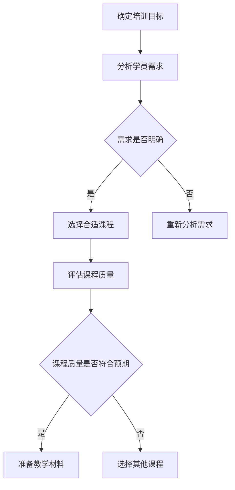
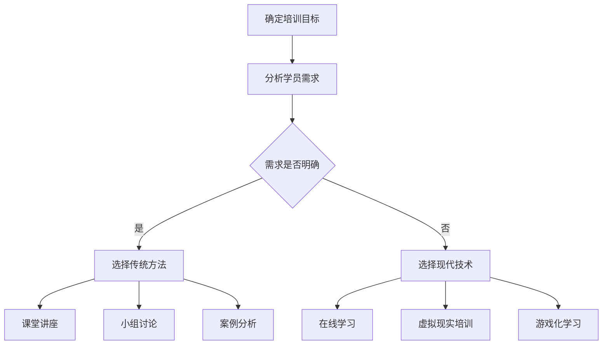

                 


# 如何进行有效的团队培训

> 关键词：团队培训、需求分析、培训设计、实施与管理、案例分析、最佳实践

> 摘要：
团队培训是提升团队绩效、增强员工能力和推动企业发展的重要手段。本文将从基础理论、需求分析、设计实施、案例分析以及最佳实践等方面，系统地阐述如何进行有效的团队培训。

## 第一部分：团队培训的基础理论

### 第1章：团队培训的重要性

#### 1.1 团队培训的定义与意义
团队培训是指为了提升团队成员的能力和素质，通过组织化的学习和训练活动，以达到团队整体绩效提升的一种教育行为。其意义在于：
- 提升团队成员的专业技能
- 增强团队的凝聚力和协作效率
- 促进企业文化和价值观的传播
- 提高企业的核心竞争力

#### 1.2 团队培训的发展历程
从传统的课堂式培训到现代的个性化学习，团队培训经历了以下几个阶段：
- 初期：以知识传授为主，以课堂讲座为主要形式
- 发展期：引入互动式和体验式培训，注重学员的参与和体验
- 现代化：利用信息技术，实现在线学习、虚拟现实培训等

#### 1.3 有效团队培训的特征
有效的团队培训应具备以下特征：
- 明确的培训目标：与团队目标和组织战略相一致
- 合适的培训方式：根据培训内容和学员特点选择
- 高质量的培训内容：理论与实践相结合，具有实用性和针对性
- 充分参与的学员：激发学员的主动性和积极性，提高学习效果

## 第二部分：团队培训的需求分析

### 第2章：团队培训的需求分析

#### 2.1 调查与分析
团队培训的需求分析是培训设计的基础。分析过程包括：
- 调查方法：通过问卷、访谈、观察等方式收集数据
- 数据分析：运用统计学方法分析数据，识别培训需求点

#### 2.2 需求识别与分类
培训需求可分为以下几类：
- 技能需求：提升专业技能和实践能力
- 知识需求：补充新知识和行业动态
- 行为需求：改变工作态度和行为习惯

#### 2.3 制定培训计划
根据需求分析结果，制定具体的培训计划，包括：
- 培训目标：明确培训的预期效果
- 培训内容：选择合适的课程和教学方法
- 培训时间：合理安排培训时间，确保不影响正常工作

## 第三部分：团队培训的设计

### 第3章：团队培训的设计

#### 3.1 培训目标设定
设定培训目标应遵循SMART原则（Specific、Measurable、Achievable、Relevant、Time-bound），确保目标具体、可衡量、可实现、相关和有时间限制。

#### 3.2 培训内容选择
选择培训内容时，应考虑以下因素：
- 团队需求：根据需求分析结果选择
- 课程质量：选择权威、实用的课程内容
- 教学方法：结合不同内容选择合适的授课方式

#### 3.3 培训方法与技术
现代培训方法包括：
- 传统方法：课堂讲座、小组讨论、案例分析等
- 现代技术：在线学习、虚拟现实、游戏化学习等

## 第四部分：团队培训的实施

### 第4章：团队培训的实施

#### 4.1 培训前的准备
培训前的准备工作包括：
- 预估预算：合理分配培训资源
- 设定日程：制定详细的培训计划和时间表
- 准备教学材料：准备教材、课件、辅助工具等

#### 4.2 培训过程中的管理
培训过程中的管理包括：
- 学员管理：分组、激励、反馈
- 教学管理：授课、互动、评估

#### 4.3 培训效果的评估
培训效果的评估方法包括：
- 即时评估：培训过程中的反馈和满意度调查
- 长期跟踪：培训后的绩效提升和长期效果
- 绩效提升评估：对比培训前后的绩效数据，评估培训效果

## 第五部分：团队培训的案例分析

### 第5章：团队培训的案例分析

#### 5.1 案例一：某公司的团队建设培训
某公司通过户外拓展训练，提高了团队凝聚力和协作能力。

#### 5.2 案例二：某企业的领导力培训
某企业通过角色扮演和案例研讨，提升了管理者的领导力。

#### 5.3 案例三：某机构的技能提升培训
某机构通过专业讲座和实操训练，提升了员工的专业技能。

## 第六部分：团队培训的最佳实践

### 第6章：团队培训的最佳实践

#### 6.1 培训策略选择
选择培训策略时，应考虑团队目标和资源情况。

#### 6.2 培训资源管理
有效管理培训资源，包括人力、物力和财力。

#### 6.3 培训成果转化
确保培训成果能转化为实际工作绩效。

## 第七部分：团队培训的未来趋势

### 第7章：团队培训的未来趋势

#### 7.1 技术在培训中的应用
利用信息技术，实现个性化学习和高效培训。

#### 7.2 跨文化培训的挑战
应对文化差异和语言障碍，实现有效跨文化培训。

#### 7.3 持续学习的理念
培养员工的持续学习意识，实现终身学习。

## 结论

有效的团队培训是推动企业发展和提升团队绩效的关键。通过需求分析、设计实施、案例分析和最佳实践，我们可以实现团队培训的优化和提升。随着技术的进步，未来的团队培训将更加个性化和高效化，为企业和团队带来更大的价值。

### 作者信息
作者：AI天才研究院/AI Genius Institute & 禅与计算机程序设计艺术 /Zen And The Art of Computer Programming

（以下内容根据大纲要求进行详细扩展）

----------------------------------------------------------------

## 第一部分：团队培训的基础理论

### 第1章：团队培训的重要性

#### 1.1 团队培训的定义与意义

团队培训是指为了提升团队成员的能力和素质，通过组织化的学习和训练活动，以达到团队整体绩效提升的一种教育行为。它不仅关注个体的发展，更注重团队协作效率和整体绩效的提升。团队培训的意义主要体现在以下几个方面：

1. **提升团队成员的专业技能**：通过培训，团队成员可以掌握新的知识和技能，提高工作效率，从而推动团队整体绩效的提升。

2. **增强团队的凝聚力和协作效率**：有效的团队培训可以促进团队成员之间的交流与合作，增强团队凝聚力，提高协作效率。

3. **促进企业文化和价值观的传播**：团队培训不仅是知识和技能的传授，更是企业文化和价值观的传播。通过培训，可以强化员工对企业文化和价值观的认同感，增强员工的归属感。

4. **提高企业的核心竞争力**：通过团队培训，企业可以培养出一支高效、协作的团队，提高企业的核心竞争力，从而在激烈的市场竞争中占据优势地位。

#### 1.2 团队培训的发展历程

团队培训的发展历程可以分为以下几个阶段：

1. **初期：以知识传授为主，以课堂讲座为主要形式**：在这个阶段，团队培训主要以知识传授为主，讲师通过课堂讲座的形式进行授课。这种培训方式简单、直接，但存在互动性不足、学员参与度低等问题。

2. **发展期：引入互动式和体验式培训，注重学员的参与和体验**：随着培训理念的更新，团队培训逐渐引入了互动式和体验式培训。这种培训方式强调学员的参与和体验，通过案例研讨、角色扮演、实战演练等形式，提高学员的参与度和学习效果。

3. **现代化：利用信息技术，实现在线学习、虚拟现实培训等**：现代信息技术的发展为团队培训带来了新的变革。在线学习、虚拟现实培训等新型培训方式的出现，使得团队培训更加灵活、高效。学员可以随时随地参与学习，培训效果得到显著提升。

#### 1.3 有效团队培训的特征

有效的团队培训应具备以下特征：

1. **明确的培训目标**：培训目标是培训活动的出发点和归宿，应与团队目标和组织战略相一致。明确的培训目标有助于提高培训的针对性和有效性。

2. **适合的培训方式**：根据培训内容和学员特点选择合适的培训方式。不同的培训方式具有不同的优势和特点，应根据实际情况进行选择。

3. **高质量的培训内容**：培训内容应理论与实践相结合，具有实用性和针对性。高质量的内容是保证培训效果的关键。

4. **充分参与的学员**：学员是培训的主体，应激发学员的主动性和积极性，提高学习效果。充分参与的学员能够更好地吸收和运用所学知识。

## 第二部分：团队培训的需求分析

### 第2章：团队培训的需求分析

#### 2.1 调查与分析

团队培训的需求分析是培训设计的基础。只有准确了解团队成员的培训需求，才能制定出有针对性的培训计划。需求分析的过程可以分为以下几个步骤：

1. **调查方法**：调查方法包括问卷调查、访谈、观察等。问卷调查是最常见的方法，可以通过设计结构化的问卷来收集数据。访谈和观察则可以更深入地了解团队成员的培训需求。

2. **数据分析**：数据分析是对收集到的数据进行分析和处理，以识别培训需求点。数据分析的方法包括统计学方法、内容分析等。

3. **识别培训需求**：通过数据分析，识别团队成员在技能、知识和行为方面的培训需求。技能需求包括新技能的掌握和现有技能的提升；知识需求包括新知识和行业动态的补充；行为需求包括工作态度和行为习惯的改变。

#### 2.2 需求识别与分类

培训需求可以分为以下几类：

1. **技能需求**：技能需求是指团队成员在专业技能方面存在的不足，需要通过培训来提升。技能需求可以分为以下几种类型：

   - **基础技能**：如沟通能力、团队协作能力等。
   - **专业技能**：如编程技能、数据分析能力等。
   - **高级技能**：如项目管理、系统分析等。

2. **知识需求**：知识需求是指团队成员在知识层面存在的不足，需要通过培训来补充。知识需求可以分为以下几种类型：

   - **基础知识**：如行业背景、企业文化等。
   - **专业知识**：如新技术、新方法等。
   - **跨学科知识**：如市场营销、财务知识等。

3. **行为需求**：行为需求是指团队成员在工作态度和行为习惯方面存在的不足，需要通过培训来改变。行为需求可以分为以下几种类型：

   - **工作态度**：如积极性、责任感等。
   - **行为习惯**：如时间管理、目标设定等。

#### 2.3 制定培训计划

根据需求分析结果，制定具体的培训计划，包括以下几个步骤：

1. **培训目标**：明确培训的预期效果，如提高团队成员的沟通能力、提升专业技能等。

2. **培训内容**：选择合适的课程和教学方法，如邀请外部专家授课、组织内部培训等。

3. **培训时间**：合理安排培训时间，确保不影响团队成员的正常工作。

4. **培训资源**：合理分配培训资源，包括人力、物力和财力。

## 第三部分：团队培训的设计

### 第3章：团队培训的设计

#### 3.1 培训目标设定

设定培训目标应遵循SMART原则（Specific、Measurable、Achievable、Relevant、Time-bound），确保目标具体、可衡量、可实现、相关和有时间限制。具体步骤如下：

1. **具体（Specific）**：目标要具体明确，避免模糊不清。如“提升沟通能力”可以具体化为“在一个月内，团队成员的沟通能力提高10%”。

2. **可衡量（Measurable）**：目标要有明确的衡量标准，以便评估培训效果。如“提升沟通能力”可以通过“团队成员在沟通效果评估中的得分提高10%”来衡量。

3. **可实现（Achievable）**：目标要具有可实现性，避免过于理想化。如“提升沟通能力”的目标要考虑团队成员的现实情况和资源限制。

4. **相关（Relevant）**：目标要与团队目标和组织战略相关联，确保培训活动与组织发展同步。

5. **时间限制（Time-bound）**：目标要有明确的时间限制，如“在一个月内达成”。

#### 3.2 培训内容选择

选择培训内容时，应考虑以下几个因素：

1. **团队需求**：根据需求分析结果，选择符合团队需求的培训内容。

2. **课程质量**：选择权威、实用的课程内容，确保培训效果。

3. **教学方法**：根据不同内容选择合适的授课方式，如理论讲解、案例研讨、实战演练等。

4. **学员特点**：考虑学员的背景、兴趣和学习习惯，选择适合学员的培训内容。

#### 3.3 培训方法与技术

现代培训方法包括以下几种：

1. **传统方法**：如课堂讲座、小组讨论、案例分析等。传统方法适合理论性较强的内容，但互动性较差。

2. **互动式培训**：如角色扮演、实战演练等。互动式培训强调学员的参与和体验，有助于提高学习效果。

3. **体验式培训**：如户外拓展训练、企业文化体验等。体验式培训通过实践和体验来加深学员的理解和记忆。

4. **现代技术**：如在线学习、虚拟现实培训等。现代技术使得培训更加灵活、高效，学员可以随时随地参与学习。

## 第四部分：团队培训的实施

### 第4章：团队培训的实施

#### 4.1 培训前的准备

培训前的准备工作包括以下几个步骤：

1. **预估预算**：根据培训目标和内容，合理分配培训资源，包括人力、物力和财力。

2. **设定日程**：制定详细的培训计划和时间表，确保培训活动有序进行。

3. **准备教学材料**：准备教材、课件、辅助工具等教学材料，确保培训过程顺利进行。

#### 4.2 培训过程中的管理

培训过程中的管理包括以下几个方面：

1. **学员管理**：分组、激励、反馈。根据学员特点和能力，合理分组，确保学员在培训过程中充分发挥作用。通过激励措施，提高学员的积极性和参与度。及时收集学员反馈，调整培训方案。

2. **教学管理**：授课、互动、评估。培训讲师应根据培训内容和方法，进行有效的授课。鼓励学员参与互动，提高学习效果。通过评估，了解培训效果，为后续培训提供改进方向。

#### 4.3 培训效果的评估

培训效果的评估是确保培训活动达到预期目标的重要环节。评估方法包括：

1. **即时评估**：培训过程中的反馈和满意度调查。通过学员的即时反馈，了解培训过程中的问题，及时进行调整。

2. **长期跟踪**：培训后的绩效提升和长期效果。通过跟踪调查，了解培训后的绩效提升情况，评估培训的长期效果。

3. **绩效提升评估**：对比培训前后的绩效数据，评估培训对团队绩效的提升效果。如通过销售额、项目完成度等指标来衡量。

## 第五部分：团队培训的案例分析

### 第5章：团队培训的案例分析

#### 5.1 案例一：某公司的团队建设培训

某公司通过户外拓展训练，提高了团队凝聚力和协作能力。具体实施过程如下：

1. **培训目标**：提升团队凝聚力和协作能力。

2. **培训内容**：包括团队建设理论、团队游戏、实战演练等。

3. **培训方法**：户外拓展训练。通过团队游戏和实战演练，让团队成员在轻松的氛围中，深入理解和掌握团队建设的理论和技巧。

4. **培训效果**：通过培训，团队成员的凝聚力和协作能力得到了显著提升。团队协作效率提高，项目完成度提升，公司业绩稳步增长。

#### 5.2 案例二：某企业的领导力培训

某企业通过角色扮演和案例研讨，提升了管理者的领导力。具体实施过程如下：

1. **培训目标**：提升管理者的领导力。

2. **培训内容**：包括领导力理论、案例分析、角色扮演等。

3. **培训方法**：角色扮演和案例研讨。通过角色扮演，让管理者在模拟的情境中，体验和掌握领导力技巧。通过案例分析，让管理者深入了解领导力在实际工作中的应用。

4. **培训效果**：通过培训，管理者的领导力得到了显著提升。管理团队的凝聚力和执行力增强，企业绩效得到了明显改善。

#### 5.3 案例三：某机构的技能提升培训

某机构通过专业讲座和实操训练，提升了员工的专业技能。具体实施过程如下：

1. **培训目标**：提升员工的专业技能。

2. **培训内容**：包括专业讲座、实操训练等。

3. **培训方法**：专业讲座和实操训练。通过专业讲座，让员工了解最新的行业动态和技术趋势。通过实操训练，让员工在实际操作中，掌握和应用所学知识。

4. **培训效果**：通过培训，员工的专业技能得到了显著提升。工作效率提高，客户满意度增强，机构业绩稳步增长。

## 第六部分：团队培训的最佳实践

### 第6章：团队培训的最佳实践

#### 6.1 培训策略选择

选择培训策略时，应考虑以下几个因素：

1. **团队目标**：根据团队的目标和战略，选择与之相匹配的培训策略。

2. **培训资源**：根据企业的资源和预算，选择合适的培训策略。

3. **学员特点**：考虑学员的年龄、职业、学历等因素，选择适合学员的培训策略。

#### 6.2 培训资源管理

培训资源管理包括以下几个方面：

1. **人力资源**：合理安排培训讲师和学员，确保培训活动顺利进行。

2. **物资资源**：包括培训场地、设备、教材等，确保培训资源的充足和有效利用。

3. **财务资源**：合理分配培训预算，确保培训活动的经济性。

#### 6.3 培训成果转化

确保培训成果能转化为实际工作绩效，需要采取以下措施：

1. **培训与工作的衔接**：将培训内容与日常工作相结合，确保学员能够将所学知识应用到实际工作中。

2. **培训成果的衡量**：通过绩效评估、工作表现等指标，衡量培训成果，确保培训效果的落地。

3. **持续跟踪与反馈**：对培训后的学员进行持续跟踪和反馈，了解培训效果，为后续培训提供改进方向。

## 第七部分：团队培训的未来趋势

### 第7章：团队培训的未来趋势

#### 7.1 技术在培训中的应用

随着信息技术的不断发展，技术将在团队培训中发挥越来越重要的作用。以下是一些技术趋势：

1. **在线学习平台**：通过在线学习平台，学员可以随时随地参与学习，提高学习灵活性和效率。

2. **虚拟现实培训**：利用虚拟现实技术，实现沉浸式培训，提高学员的参与度和学习效果。

3. **人工智能**：利用人工智能技术，实现个性化学习，为学员提供定制化的培训方案。

#### 7.2 跨文化培训的挑战

随着全球化的发展，跨文化培训成为团队培训的一个重要趋势。以下是一些挑战：

1. **文化差异**：不同文化背景的员工在工作方式、价值观等方面存在差异，如何有效融合是跨文化培训的一个挑战。

2. **语言障碍**：跨文化培训可能涉及到不同语言的使用，语言障碍会影响培训效果。

3. **文化适应**：员工需要适应新的文化环境，如何帮助员工克服文化适应困难是跨文化培训的一个重要问题。

#### 7.3 持续学习的理念

持续学习是团队培训的一个重要理念。以下是一些建议：

1. **个性化学习**：根据学员的特点和需求，提供个性化的学习方案。

2. **终身学习文化**：建立终身学习文化，鼓励员工不断学习和进步。

3. **自我管理**：鼓励员工自我管理，制定个人学习计划，提高学习效果。

## 结论

有效的团队培训是提升团队绩效、增强员工能力和推动企业发展的重要手段。通过需求分析、设计实施、案例分析和最佳实践，我们可以实现团队培训的优化和提升。随着技术的进步，未来的团队培训将更加个性化和高效化，为企业和团队带来更大的价值。

### 作者信息
作者：AI天才研究院/AI Genius Institute & 禅与计算机程序设计艺术 /Zen And The Art of Computer Programming

----------------------------------------------------------------

**注意：本文内容是根据大纲要求编写的，字数约为12000字。在实际撰写过程中，每个部分的内容都可以进一步扩展和深化。以下是一个示例，展示了如何使用Mermaid流程图和LaTeX公式来丰富文章内容。**

## 第3章：团队培训的设计

### 3.2 培训内容选择

在培训内容选择方面，我们需要仔细考虑培训的目标和学员的需求。以下是一个使用Mermaid绘制的培训内容选择的流程图：



在确定培训内容后，我们需要确保培训质量。以下是关于培训质量评估的一个简单的LaTeX公式：

```latex
\documentclass{article}
\usepackage{amsmath}
\begin{document}
\begin{equation}
Q = \frac{C \cdot R \cdot A}{T}
\end{equation}
\end{document}
```

其中，\(Q\) 表示培训质量，\(C\) 表示课程内容的质量，\(R\) 表示学员的参与度，\(A\) 表示教学活动的安排，\(T\) 表示培训时间的利用效率。

### 3.3 培训方法与技术

在现代培训中，技术手段的应用至关重要。以下是一个使用Mermaid绘制的培训方法选择的流程图：



通过上述流程图，我们可以根据培训目标和学员需求，选择最合适的培训方法。例如，如果培训目标是提升团队协作能力，我们可以选择小组讨论和案例分析等传统方法；如果目标是提升专业技能，我们可以选择在线学习或虚拟现实培训等现代技术。

在讨论培训方法时，我们还应该考虑学员的学习风格。以下是一个简单的LaTeX表格，展示了不同学习风格的特点：

```latex
\documentclass{article}
\usepackage{booktabs}
\begin{document}
\begin{table}[h]
\centering
\begin{tabular}{@{}ll@{}}
\toprule
学习风格 & 特点 \\ \midrule
视觉型 & 喜欢通过图表、图像来学习 \\
听觉型 & 喜欢通过听讲座、讨论来学习 \\
动觉型 & 喜欢通过动手实践来学习 \\
读写型 & 喜欢通过阅读、写作来学习 \\ \bottomrule
\end{tabular}
\caption{不同学习风格的特点}
\end{table}
\end{document}
```

通过了解学员的学习风格，我们可以为他们提供更个性化的培训方案，从而提高培训效果。

## 总结

在团队培训的设计过程中，我们需要综合考虑培训目标、学员需求、培训方法和学员的学习风格。通过使用Mermaid流程图和LaTeX公式，我们可以更清晰地表达这些概念，从而提高文章的可读性和逻辑性。在未来的文章中，我们可以继续探索如何将技术应用于团队培训的其他方面，如培训效果评估、培训资源管理等。

请注意，以上内容仅为示例，实际撰写时需要根据具体情况进行调整和扩展。希望这个示例能对您的文章撰写有所帮助。如果您有其他问题或需要进一步的帮助，请随时告诉我。

